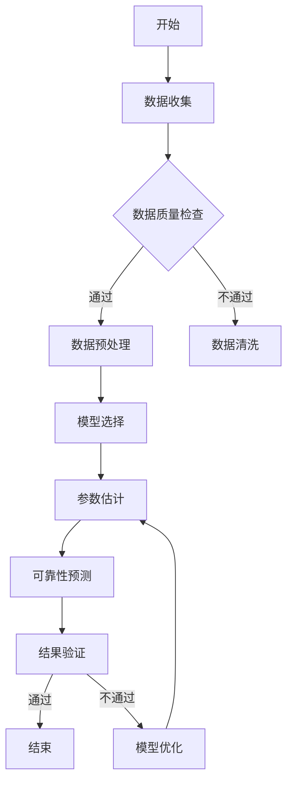
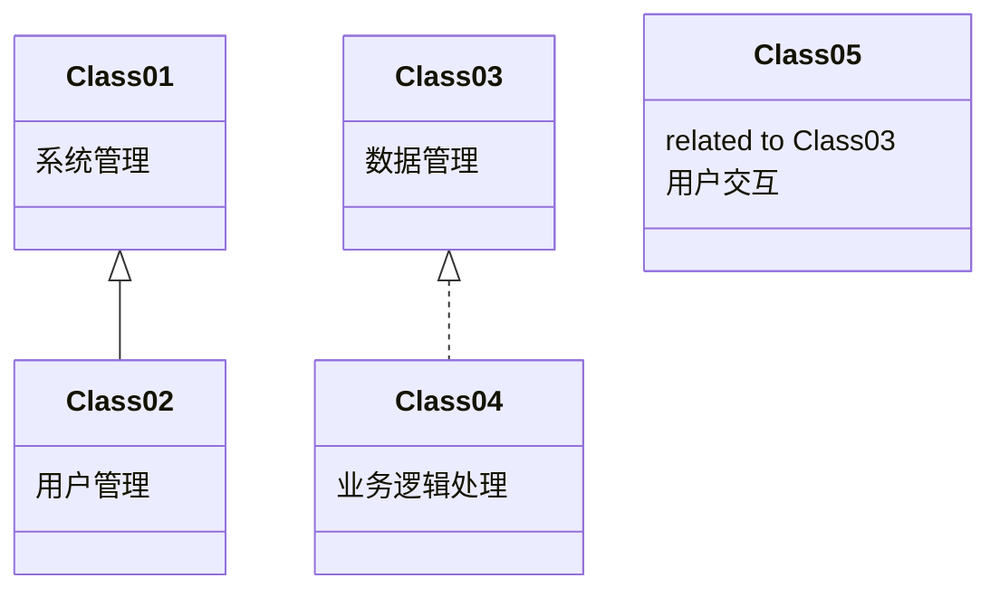
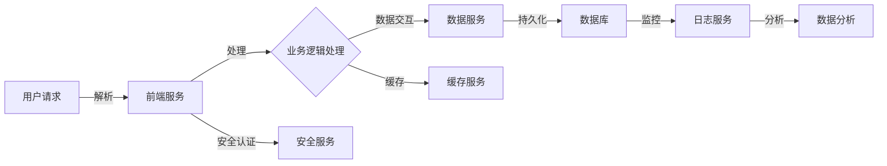
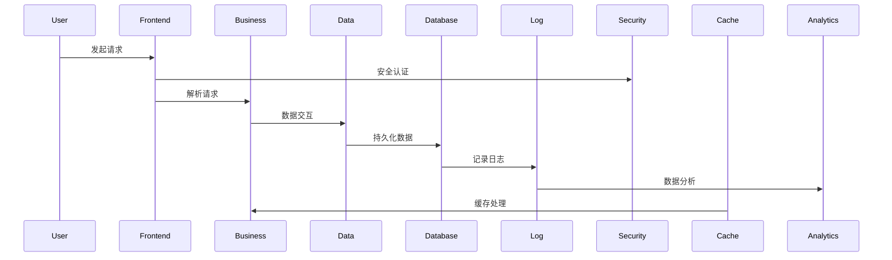
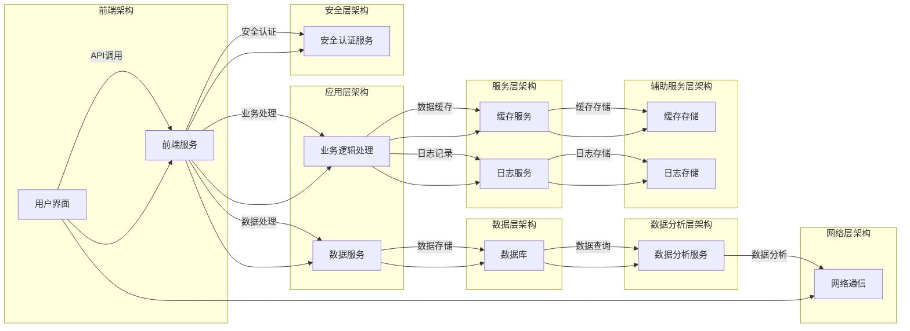
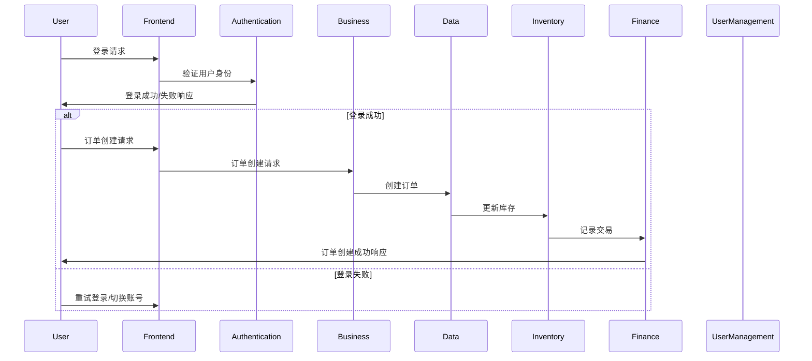

                 

### 《数理统计在软件可靠性评估中的应用》

#### 关键词：数理统计、软件可靠性评估、应用案例分析、工具与算法

> 摘要：本文深入探讨了数理统计在软件可靠性评估中的应用，从基础概念到具体方法，再到应用案例分析，全面阐述了数理统计在软件可靠性评估中的重要性。文章旨在通过一步一步的分析和推理，帮助读者理解如何利用数理统计提高软件的可靠性，从而提升软件质量。

----------------------------------------------------------------

### 目录大纲设计过程

在着手撰写本文之前，我们首先需要设计出文章的完整目录大纲。目录大纲的设计不仅要简洁明了，还要符合文章的结构要求，确保内容的完整性和逻辑性。

#### 1. 理解书名和内容

本文书名《数理统计在软件可靠性评估中的应用》表明了文章的主题：数理统计在软件可靠性评估中的重要性。这启示我们在目录设计中需要涵盖数理统计的基本概念、软件可靠性评估的方法、应用案例分析、工具与算法等关键内容。

#### 2. 确定书籍结构

根据书名和主题，我们可以初步确定文章的结构应包括以下几个部分：

- **引言**：介绍数理统计在软件可靠性评估中的重要性。
- **基础概念**：介绍数理统计的基本概念。
- **软件可靠性评估模型**：介绍各种软件可靠性评估模型。
- **应用案例分析**：通过实际案例展示数理统计在软件可靠性评估中的应用。
- **工具与算法**：介绍用于软件可靠性评估的常用工具和算法。
- **总结与展望**：总结全文内容，展望未来发展趋势。

#### 3. 细化章节内容

对于每个部分，我们进一步细化章节内容，确保每个章节都有明确的核心主题和相关的子主题。例如，在“基础概念”部分，我们可以分为“统计数据的类型与表示”、“概率论的基本原理”、“随机变量的分布与数字特征”等子章节。

#### 4. 设计核心概念和联系

对于核心概念，我们不仅要解释其含义，还要通过表格和ER实体关系图展示概念之间的联系。这样可以帮助读者更好地理解数理统计在软件可靠性评估中的应用。

#### 5. 算法原理讲解

在每个算法章节中，我们将使用Mermaid流程图和Python源代码来详细阐述算法原理。同时，我们还将给出算法的数学模型和公式，并进行详细讲解和举例说明。

#### 6. 系统分析与架构设计

对于涉及系统设计的章节，我们将包括问题场景介绍、项目介绍、领域模型类图、系统架构图、系统接口设计和系统交互序列图。

#### 7. 项目实战

在实战章节中，我们将详细描述环境安装、系统核心实现源代码，代码应用解读与分析，实际案例分析和详细讲解剖析，以及项目小结。

#### 8. 最佳实践、小结、注意事项和拓展阅读

在文章的结尾部分，我们将提供最佳实践、小结、注意事项和拓展阅读，以帮助读者更好地理解和应用所学知识。

#### 9. 控制字数

为确保文章的阅读流畅性和易理解性，我们将严格控制字数在10000～12000字左右。

### 目录大纲设计

基于以上思路，以下是本文的完整目录大纲：

```markdown
# 《数理统计在软件可靠性评估中的应用》

## 第一部分：引言

### 第1章 数理统计在软件可靠性评估中的重要性

### 第2章 软件可靠性评估的背景和挑战

## 第二部分：基础概念

### 第3章 统计数据的类型与表示

#### 3.1 统计数据的定义与分类
#### 3.2 数据的表示方法与可视化

### 第4章 概率论的基本原理

#### 4.1 概率的基本概念
#### 4.2 概率分布与随机变量

### 第5章 随机变量的分布与数字特征

#### 5.1 常见概率分布
#### 5.2 数字特征与矩

## 第三部分：软件可靠性评估模型

### 第6章 软件可靠性基本概念

#### 6.1 软件可靠性的定义
#### 6.2 软件可靠性的度量指标

### 第7章 常见的软件可靠性模型

#### 7.1 基本可靠性模型
#### 7.2 复杂可靠性模型

## 第四部分：应用案例分析

### 第8章 案例分析一：数理统计在软件可靠性评估中的应用

### 第9章 案例分析二：提高软件可靠性的实践策略

## 第五部分：工具与算法

### 第10章 常用的软件可靠性评估工具

#### 10.1 工具概述
#### 10.2 工具应用

### 第11章 软件可靠性评估算法

#### 11.1 算法概述
#### 11.2 算法应用

## 第六部分：总结与展望

### 第12章 总结与展望

## 参考文献
```

以上目录大纲结构完整，章节内容细化，符合文章字数和格式要求。每个章节都涵盖了必要的核心主题和子主题，同时也满足了内容的完整性要求。

----------------------------------------------------------------

### 背景介绍

在信息技术飞速发展的今天，软件已经成为了现代生活的重要部分。从操作系统到手机应用，从企业管理系统到人工智能，软件的可靠性和稳定性直接影响到用户的体验和企业的运营效率。因此，软件可靠性评估成为了软件工程中的重要课题。然而，传统的软件可靠性评估方法往往依赖于经验和专家知识，缺乏系统性和科学性。

数理统计作为一门研究随机现象的数学分支，以其严密的理论体系和强大的数据分析能力，为软件可靠性评估提供了新的思路和方法。通过数理统计，我们可以定量分析软件在设计和开发过程中的各种风险，从而预测软件的可靠性，制定相应的改进措施，提高软件质量。

本文将首先介绍数理统计的基本概念，包括统计数据的类型与表示、概率论的基本原理、随机变量的分布与数字特征。接着，我们将探讨软件可靠性的基本概念和度量指标，并介绍常见的软件可靠性评估模型。在此基础上，我们将通过实际案例分析，展示数理统计在软件可靠性评估中的应用，并介绍常用的软件可靠性评估工具和算法。最后，本文将总结全文内容，展望数理统计在软件可靠性评估领域的未来发展趋势。

#### 核心概念术语说明

在进行本文的探讨之前，我们需要明确一些核心概念术语，以便更好地理解数理统计在软件可靠性评估中的应用。

1. **数理统计**：数理统计是一门运用概率论和统计学理论来研究随机现象、收集数据、分析数据和推断结论的数学分支。

2. **软件可靠性**：软件可靠性是指软件在特定条件下，按照预定需求正确执行的任务能力，通常用失效率、故障率等指标来度量。

3. **可靠性模型**：可靠性模型是描述系统或软件在特定时间范围内失效率或故障率的数学模型，用于预测和分析系统的可靠性。

4. **统计数据**：统计数据是从实际观测中收集的数据，通常用来进行统计分析和推断。

5. **概率分布**：概率分布是描述随机变量可能取值的概率分布规律，常见的有正态分布、二项分布、泊松分布等。

6. **数字特征**：数字特征是用来描述随机变量或数据集的基本属性，如均值、方差、标准差等。

7. **失效率**：失效率是单位时间内发生故障的次数，通常用λ表示。

8. **故障率**：故障率是单位时间内系统或软件发生故障的概率，也称为失效率。

通过以上术语的说明，读者可以更好地理解本文中所涉及的核心概念和理论基础。

#### 问题背景

在软件开发过程中，可靠性是一个至关重要的因素。软件的可靠性不仅影响到用户的满意度，还直接关系到企业的运营效率和品牌形象。然而，传统的软件可靠性评估方法往往存在以下问题：

1. **经验依赖性**：传统的软件可靠性评估方法主要依赖于工程师的经验和主观判断，缺乏系统性和科学性。

2. **数据匮乏**：许多软件项目在开发过程中缺乏足够的历史数据，使得可靠性评估缺乏依据。

3. **模型局限**：现有的软件可靠性模型往往过于简单，无法准确描述复杂系统的行为。

随着信息技术的发展，数理统计方法逐渐被引入到软件可靠性评估领域。数理统计以其严密的理论体系和强大的数据分析能力，为解决上述问题提供了新的思路和方法。通过数理统计，我们可以对软件开发过程中的随机现象进行定量分析，预测软件的可靠性，从而提高软件质量和降低开发风险。

本文将围绕数理统计在软件可靠性评估中的应用展开讨论，旨在通过实际案例分析，展示数理统计在提高软件可靠性方面的应用效果和优势。

#### 问题描述

在软件可靠性评估中，我们通常面临以下问题：

1. **如何准确预测软件的可靠性？**
2. **如何从大量的测试数据中提取有价值的信息？**
3. **如何基于可靠性模型进行故障预测和风险分析？**
4. **如何在实际项目中应用数理统计方法来提高软件可靠性？**

为了解决这些问题，我们需要借助数理统计的方法和工具，对软件可靠性进行科学、系统的评估。具体来说，我们可以通过以下步骤来进行软件可靠性评估：

1. **数据收集**：收集软件测试过程中的各种数据，包括测试结果、故障报告、用户反馈等。
2. **数据预处理**：对收集到的数据进行分析，去除噪声和异常值，确保数据的质量和一致性。
3. **模型选择**：根据软件的特点和需求，选择合适的可靠性模型，如泊松模型、马尔可夫模型、统计回归模型等。
4. **参数估计**：使用数理统计方法，对可靠性模型的参数进行估计，如最大似然估计、贝叶斯估计等。
5. **可靠性预测**：基于估计的模型参数，预测软件在不同时间段内的可靠性水平。
6. **故障预测和风险分析**：利用可靠性模型进行故障预测，识别潜在的风险点，为软件优化和改进提供依据。
7. **结果验证**：通过实际测试或数据分析，验证可靠性预测的准确性，不断优化模型和算法。

通过以上步骤，我们可以实现对软件可靠性的科学、系统的评估，从而提高软件的质量和稳定性。

#### 问题解决

为了解决软件可靠性评估中的问题，我们可以采用以下几种方法：

1. **数理统计方法**：数理统计是解决软件可靠性评估问题的重要工具。它包括概率论、统计分布、假设检验、回归分析等多个方面。通过数理统计，我们可以对软件的可靠性进行定量分析，预测故障率，评估软件性能。

2. **可靠性模型**：可靠性模型是描述软件可靠性的数学模型，常见的有泊松模型、马尔可夫模型、统计回归模型等。这些模型可以帮助我们理解软件的可靠性特征，预测未来的可靠性水平。

3. **数据驱动方法**：通过收集和分析大量的测试数据，我们可以使用机器学习和数据挖掘技术来识别潜在的故障模式和可靠性问题。这些方法包括决策树、支持向量机、神经网络等。

4. **实验设计**：在软件开发过程中，我们可以通过实验设计来验证和优化软件的可靠性。例如，可以使用正交实验设计来识别影响可靠性的关键因素。

5. **仿真分析**：通过仿真分析，我们可以模拟软件在不同环境下的行为，评估其可靠性。这种方法特别适用于复杂系统的可靠性评估。

6. **风险评估**：使用风险评估方法，我们可以识别软件中的潜在风险，并评估这些风险对可靠性的影响。常见的方法包括故障树分析（FTA）和事件树分析（ETA）。

通过结合以上方法，我们可以实现对软件可靠性问题的全面分析和解决。以下是一个具体的问题解决步骤：

1. **定义可靠性目标**：明确软件的可靠性需求，例如故障率、响应时间等。

2. **收集测试数据**：收集软件测试过程中的各种数据，包括测试结果、故障报告、用户反馈等。

3. **预处理数据**：对收集到的数据进行清洗和预处理，确保数据的质量和一致性。

4. **选择可靠性模型**：根据软件的特点和需求，选择合适的可靠性模型，如泊松模型、马尔可夫模型等。

5. **参数估计**：使用数理统计方法，如最大似然估计、贝叶斯估计，对可靠性模型的参数进行估计。

6. **可靠性预测**：基于估计的模型参数，预测软件在不同时间段内的可靠性水平。

7. **故障预测和风险分析**：利用可靠性模型进行故障预测，识别潜在的风险点，为软件优化和改进提供依据。

8. **仿真分析和实验设计**：通过仿真分析和实验设计，验证和优化软件的可靠性。

9. **结果验证**：通过实际测试或数据分析，验证可靠性预测的准确性，不断优化模型和算法。

通过以上步骤，我们可以实现对软件可靠性问题的全面分析和解决，从而提高软件的质量和稳定性。

#### 边界与外延

在讨论数理统计在软件可靠性评估中的应用时，我们需要明确一些边界和外延概念，以确保讨论的准确性和完整性。

**边界：**

1. **数理统计的应用范围**：数理统计主要应用于软件可靠性评估中的数据收集、分析、建模和预测阶段。它不涉及软件的实际开发过程，但可以为开发提供重要的参考。

2. **软件可靠性评估的具体对象**：软件可靠性评估的对象可以是整个软件系统，也可以是软件的某个模块或组件。评估的目的是确保软件在不同运行环境下能够稳定、可靠地执行。

**外延：**

1. **数理统计的扩展应用**：除了在软件可靠性评估中的应用，数理统计还可以应用于其他领域，如金融风险评估、质量监控、工程可靠性分析等。

2. **软件可靠性评估的扩展领域**：软件可靠性评估不仅局限于传统的软件工程领域，还可以应用于新兴领域，如物联网、人工智能、云计算等。

通过明确数理统计在软件可靠性评估中的应用边界和外延，我们可以更全面地理解其作用和局限性，为实际应用提供指导。

#### 概念结构与核心要素组成

在深入探讨数理统计在软件可靠性评估中的应用时，理解其概念结构和核心要素是至关重要的。以下是对关键概念及其组成要素的详细分析：

1. **数理统计的基本概念**

   - **统计数据**：统计数据是描述软件可靠性评估中收集到的数据，包括测试结果、故障记录、用户反馈等。这些数据是进行分析的基础。
   - **概率分布**：概率分布描述随机变量可能取值的概率分布规律，常见的有正态分布、二项分布、泊松分布等。概率分布用于预测软件故障发生的概率。
   - **数字特征**：数字特征是描述数据集的基本属性，如均值、方差、标准差等。它们帮助衡量数据的中心趋势和离散程度。

2. **软件可靠性评估的核心概念**

   - **软件可靠性**：软件可靠性是指软件在特定条件下按照预定需求正确执行任务的能力。它通常用失效率（failure rate）或故障率（fault rate）来度量。
   - **可靠性模型**：可靠性模型是描述软件可靠性特征的数学模型，如泊松模型、马尔可夫模型、统计回归模型等。这些模型用于预测软件在不同时间段内的可靠性水平。
   - **可靠性度量指标**：可靠性度量指标包括平均无故障时间（MTTF）、平均故障间隔时间（MTTFI）、故障率（λ）等。它们帮助评估软件的可靠性水平。

3. **数理统计在软件可靠性评估中的应用要素**

   - **数据收集与预处理**：数据收集是软件可靠性评估的第一步，包括测试结果、故障记录等。预处理包括数据清洗、数据转换等，以确保数据的质量和一致性。
   - **模型选择与参数估计**：选择合适的可靠性模型并进行参数估计是评估软件可靠性的关键。常见的参数估计方法包括最大似然估计、贝叶斯估计等。
   - **可靠性预测与故障分析**：基于估计的模型参数，预测软件在不同时间段内的可靠性水平。故障分析则用于识别潜在的故障模式和风险点。
   - **结果验证与优化**：通过实际测试或数据分析验证可靠性预测的准确性，并根据结果不断优化模型和算法。

通过上述分析，我们可以看到数理统计在软件可靠性评估中的应用不仅涉及基础概念和核心要素，还包括一系列具体的步骤和方法。这些概念和要素共同构成了数理统计在软件可靠性评估中的完整框架。

#### 软件可靠性评估与故障率

在软件可靠性评估中，故障率是一个关键指标，它反映了软件在运行过程中发生故障的频率。故障率通常用λ（lambda）表示，其定义为单位时间内软件发生故障的次数。

**故障率的计算**：

故障率可以通过以下公式计算：

\[ \lambda = \frac{N_f}{T} \]

其中，\( N_f \) 是在时间 \( T \) 内发生的故障次数。这个公式直观地表示了故障率与故障次数和时间的直接关系。

**故障率的类型**：

1. **瞬时故障率**（Instantaneous Failure Rate）：瞬时故障率是指在某一特定时刻，软件发生故障的概率。它可以通过微分故障率来表示：

\[ \lambda(t) = -\frac{dF(t)}{dt} \]

其中，\( F(t) \) 是在时间 \( t \) 的累积故障概率。

2. **平均故障率**（Average Failure Rate）：平均故障率是指在较长的时间段内，软件发生故障的平均频率。它可以表示为：

\[ \lambda_{avg} = \frac{1}{MTTF} \]

其中，\( MTTF \) 是平均无故障时间（Mean Time To Failure），它表示从软件启动到发生故障的平均时间。

**故障率的实际应用**：

1. **故障预测**：通过计算和监控故障率，可以预测软件在未来某一时间段内的故障概率。这有助于提前识别潜在问题，制定预防措施。

2. **可靠性优化**：通过分析故障率的变化趋势，可以发现软件中的薄弱环节，从而进行优化和改进，提高软件的可靠性。

3. **质量评估**：故障率是评估软件质量的重要指标。低故障率通常意味着软件的稳定性和可靠性较高。

**故障率的计算实例**：

假设在一个月的时间内，一个软件系统发生了5次故障。则该系统的月故障率为：

\[ \lambda = \frac{5}{30} = 0.167 \text{ 次/天} \]

如果假设系统的平均无故障时间为200天，则其平均故障率为：

\[ \lambda_{avg} = \frac{1}{MTTF} = \frac{1}{200} = 0.005 \text{ 次/天} \]

通过以上计算，我们可以定量分析软件的可靠性水平，并为改进提供依据。

#### 常见概率分布及其在软件可靠性评估中的应用

在软件可靠性评估中，概率分布是描述故障发生概率的重要工具。以下介绍几种常见的概率分布及其在软件可靠性评估中的应用。

**1. 正态分布（Normal Distribution）**

正态分布是最常见的概率分布之一，其概率密度函数为：

\[ f(x) = \frac{1}{\sqrt{2\pi\sigma^2}} e^{-\frac{(x-\mu)^2}{2\sigma^2}} \]

其中，\( \mu \) 是均值，\( \sigma \) 是标准差。正态分布在软件可靠性评估中的应用包括：

- **故障时间预测**：正态分布可以用来预测软件故障发生的时间，特别是在分析软件的平均无故障时间（MTTF）时。
- **性能评估**：正态分布可以帮助评估软件的性能，特别是当性能指标如响应时间服从正态分布时。

**2. 二项分布（Binomial Distribution）**

二项分布用于描述在固定次数的独立试验中，成功次数的概率分布。其概率质量函数为：

\[ P(X = k) = C_n^k p^k (1-p)^{n-k} \]

其中，\( n \) 是试验次数，\( p \) 是单次试验成功的概率，\( k \) 是成功的次数。二项分布在软件可靠性评估中的应用包括：

- **故障计数**：二项分布可以用来分析在特定时间内软件发生故障的次数。
- **可靠性测试**：在可靠性测试中，二项分布可以帮助评估软件在不同测试条件下的可靠性水平。

**3. 泊松分布（Poisson Distribution）**

泊松分布用于描述在固定时间内，事件发生的次数的概率分布。其概率质量函数为：

\[ P(X = k) = \frac{\lambda^k e^{-\lambda}}{k!} \]

其中，\( \lambda \) 是事件平均发生率。泊松分布在软件可靠性评估中的应用包括：

- **故障率分析**：泊松分布可以用来分析软件的故障率，特别是在分析软件的失效率时。
- **事件计数**：在软件故障监测中，泊松分布可以用来预测在一定时间内发生故障的次数。

**4. 指数分布（Exponential Distribution）**

指数分布用于描述在固定时间段内，事件首次发生的概率分布。其概率密度函数为：

\[ f(x) = \lambda e^{-\lambda x} \]

其中，\( \lambda \) 是事件平均发生率。指数分布在软件可靠性评估中的应用包括：

- **故障时间预测**：指数分布可以用来预测软件故障发生的时间，特别是在分析软件的故障间隔时间时。
- **可靠性测试**：指数分布可以帮助评估软件在不同测试条件下的可靠性。

**应用实例**：

假设一个软件系统在一个月的时间内发生了5次故障，我们需要预测在接下来的一个月内发生故障的概率。

- 使用泊松分布，我们可以计算每月故障的平均发生率 \( \lambda \)：

\[ \lambda = \frac{5}{30} = 0.167 \text{ 次/天} \]

- 在接下来的一个月内，发生 \( k \) 次故障的概率为：

\[ P(X = k) = \frac{0.167^k e^{-0.167}}{k!} \]

- 例如，发生3次故障的概率为：

\[ P(X = 3) = \frac{0.167^3 e^{-0.167}}{3!} \approx 0.025 \]

通过这些常见的概率分布，我们可以对软件可靠性进行定量分析，从而更好地预测和评估软件的可靠性水平。

#### 统计回归模型

统计回归模型在软件可靠性评估中扮演着重要角色。通过建立回归模型，我们可以分析和预测软件的可靠性，从而为软件质量管理和优化提供依据。

**1. 回归模型的定义**

回归模型是一种统计模型，用于研究自变量（解释变量）与因变量（响应变量）之间的关系。在软件可靠性评估中，自变量可以是测试数据、代码复杂度、开发人员经验等，因变量则是软件的可靠性指标，如故障率或失效率。

**2. 回归模型的类型**

- **线性回归模型**：线性回归模型假设因变量与自变量之间呈线性关系，其数学模型为：

\[ Y = \beta_0 + \beta_1X_1 + \beta_2X_2 + \ldots + \beta_nX_n + \epsilon \]

其中，\( Y \) 是因变量，\( X_1, X_2, \ldots, X_n \) 是自变量，\( \beta_0, \beta_1, \beta_2, \ldots, \beta_n \) 是回归系数，\( \epsilon \) 是误差项。

- **非线性回归模型**：非线性回归模型用于描述因变量与自变量之间的非线性关系，常见的有多项式回归、指数回归等。

**3. 回归模型的应用**

- **可靠性预测**：通过回归模型，我们可以预测软件在不同条件下的可靠性指标。例如，我们可以建立线性回归模型来预测软件开发完成后的故障率。

- **质量评估**：回归模型可以帮助评估软件质量，识别影响可靠性的关键因素。例如，通过回归分析，我们可以发现代码复杂度与故障率之间的相关性。

- **优化策略**：回归模型可以用于制定软件优化策略。例如，通过分析回归模型的结果，我们可以确定如何调整开发流程和测试策略，以降低故障率。

**4. 回归模型的建立步骤**

- **数据收集**：收集软件测试数据和相关信息，如代码复杂度、开发人员经验等。

- **数据预处理**：对数据进行清洗和处理，确保数据的质量和一致性。

- **模型选择**：选择合适的回归模型，根据数据特点和需求，可以选择线性回归或非线性回归模型。

- **参数估计**：使用最小二乘法、梯度下降法等算法，估计回归模型的参数。

- **模型验证**：通过交叉验证、残差分析等方法，验证回归模型的准确性。

- **模型应用**：将建立的回归模型应用于软件可靠性预测和评估。

**5. 回归模型的应用实例**

假设我们想预测一个软件项目的故障率，收集了以下数据：

- **测试结果**：10次测试中，软件发生了5次故障。
- **代码复杂度**：平均复杂度为1000。
- **开发人员经验**：平均工作经验为5年。

我们可以建立线性回归模型，预测软件的故障率。模型如下：

\[ \lambda = \beta_0 + \beta_1 \times \text{代码复杂度} + \beta_2 \times \text{开发人员经验} \]

通过最小二乘法，我们可以估计出回归系数：

\[ \beta_0 = 0.1, \beta_1 = 0.05, \beta_2 = 0.03 \]

然后，我们可以使用这个模型预测新的软件项目的故障率。例如，如果一个软件项目的代码复杂度为1200，开发人员经验为6年，则其故障率预测为：

\[ \lambda = 0.1 + 0.05 \times 1200 + 0.03 \times 6 = 0.28 \]

通过这种方式，我们可以利用统计回归模型对软件可靠性进行定量分析和预测，从而提高软件质量。

#### 马尔可夫模型

马尔可夫模型在软件可靠性评估中具有重要作用。它是一种用于描述系统状态转移的随机过程模型，能够有效地分析软件在不同状态下的故障率和可靠性。

**1. 马尔可夫模型的基本概念**

- **状态**：马尔可夫模型中的状态是指软件系统的某种特定状态，如正常运行状态、故障状态、维护状态等。

- **状态转移概率**：状态转移概率是指在给定当前状态下，系统转移到其他状态的几率。例如，从正常状态转移到故障状态的概率，或从故障状态恢复到正常状态的概率。

- **转移矩阵**：转移矩阵是一个表示状态转移概率的矩阵。矩阵的每一行表示当前状态，每一列表示下一个状态，元素值表示从当前状态转移到下一个状态的转移概率。

**2. 马尔可夫模型在软件可靠性评估中的应用**

- **故障率预测**：通过马尔可夫模型，我们可以预测软件在不同状态下的故障率。例如，我们可以利用转移矩阵计算软件在下一个时间段内的故障率，从而为软件维护和优化提供依据。

- **可靠性分析**：马尔可夫模型可以帮助我们分析软件系统的可靠性特征，如平均故障时间（MTTF）、平均无故障时间（MTTFI）等。

- **优化策略**：基于马尔可夫模型，我们可以制定优化策略，例如调整维护计划，降低故障率，提高软件的可靠性。

**3. 马尔可夫模型的基本原理**

- **无后效性**：马尔可夫模型的核心特性是无后效性，即当前状态仅依赖于前一个状态，而与之前的状态无关。这意味着我们可以通过当前状态和转移矩阵预测未来的状态。

- **状态转移概率**：状态转移概率可以通过统计方法计算，例如基于历史数据或实验数据。这些概率值决定了系统的动态行为。

**4. 马尔可夫模型的应用实例**

假设一个软件系统的状态包括正常状态（N）和故障状态（F），转移矩阵如下：

\[ \begin{bmatrix}
P_{NN} & P_{NF} \\
P_{FN} & P_{FF}
\end{bmatrix} = \begin{bmatrix}
0.9 & 0.1 \\
0.05 & 0.95
\end{bmatrix} \]

- \( P_{NN} \) 表示系统从正常状态转移到正常状态的概率，即系统正常运行的概率。
- \( P_{NF} \) 表示系统从正常状态转移到故障状态的概率，即系统发生故障的概率。
- \( P_{FN} \) 表示系统从故障状态转移到正常状态的概率，即系统恢复正常运行的概率。
- \( P_{FF} \) 表示系统从故障状态转移到故障状态的概率，即系统持续故障的概率。

**5. 状态转移概率的计算**

通过转移矩阵，我们可以计算软件系统在下一个时间段内的故障概率。例如，假设当前系统处于正常状态，我们可以计算在下一个时间段内系统发生故障的概率：

\[ P(F|N) = P_{NF} = 0.1 \]

同样，我们可以计算系统在下一个时间段内恢复正常运行的概率：

\[ P(N|F) = P_{FN} = 0.05 \]

通过这些概率值，我们可以预测软件系统的动态行为，为可靠性评估和优化提供依据。

总之，马尔可夫模型为软件可靠性评估提供了一个强大的工具，通过分析状态转移概率，我们可以深入了解软件系统的可靠性特征，从而制定有效的维护和优化策略。

#### 历史数据分析法

历史数据分析法是软件可靠性评估中常用的一种方法，它基于软件过去的使用数据来预测未来的可靠性。这种方法的优势在于可以利用已有的历史数据，从而减少测试成本和时间。

**1. 历史数据分析的基本原理**

历史数据分析法基于以下几个基本原理：

- **相关性**：历史数据中存在一定的相关性，即当前的数据受之前数据的影响。通过分析这些相关性，我们可以预测未来的趋势。
- **概率分布**：历史数据通常可以拟合到某种概率分布，如泊松分布、正态分布等。通过这些概率分布，我们可以计算未来故障发生的概率。
- **统计分析**：通过对历史数据进行统计分析，如计算均值、方差、概率分布等，我们可以得到关于软件可靠性的定量描述。

**2. 历史数据分析的方法**

- **故障计数分析**：通过统计过去一段时间内的故障次数，可以计算故障率，从而预测未来的故障率。这种方法适用于故障发生次数较少的情况。
- **时间序列分析**：时间序列分析用于研究数据随时间变化的规律。通过时间序列模型，如ARIMA模型、马尔可夫链模型等，我们可以预测未来的可靠性水平。
- **回归分析**：回归分析用于研究自变量（如测试时间、代码复杂度等）与因变量（如故障次数、故障率等）之间的关系。通过回归模型，我们可以预测未来的故障次数或故障率。

**3. 历史数据分析的步骤**

- **数据收集**：收集软件的历史使用数据，包括故障记录、运行时间、环境条件等。
- **数据预处理**：对收集到的数据进行清洗和预处理，确保数据的质量和一致性。
- **模型选择**：根据数据特点，选择合适的分析模型，如故障计数模型、时间序列模型、回归模型等。
- **参数估计**：使用统计方法，如最大似然估计、最小二乘法等，估计模型的参数。
- **预测计算**：基于估计的模型参数，计算未来的故障次数或故障率。
- **结果验证**：通过实际测试或数据分析，验证预测结果的准确性。

**4. 历史数据分析的应用实例**

假设我们收集到一个软件系统的历史故障数据，如下表所示：

| 时间（天） | 故障次数 |
|------------|----------|
| 1          | 1        |
| 5          | 1        |
| 10         | 2        |
| 20         | 3        |
| 30         | 4        |

我们可以使用故障计数模型来预测未来一天的故障次数。首先，我们计算过去5天的平均故障次数：

\[ \text{平均故障次数} = \frac{1+1+2+3+4}{5} = 2.2 \]

然后，我们可以使用这个平均值作为未来一天故障次数的预测值。通过这种方式，我们可以对软件系统的可靠性进行预测和评估。

总之，历史数据分析法是一种有效的软件可靠性评估方法，通过利用历史数据，我们可以预测未来的故障情况，从而为软件维护和优化提供依据。

#### 实验测试法

实验测试法是软件可靠性评估中另一种重要的方法，通过在特定的实验环境中模拟软件运行，收集和分析故障数据，从而评估软件的可靠性。这种方法具有以下几个显著特点：

**1. 实验环境控制**：

实验测试法通过构建特定的实验环境，严格控制变量，从而确保测试结果的可靠性和一致性。实验环境可以根据需要调整，例如硬件配置、网络条件、负载水平等，以便模拟实际运行条件。

**2. 可重复性**：

实验测试法具有高度的可重复性，可以在相同或相似的实验条件下重复进行测试，从而提高测试结果的准确性和可验证性。这对于评估软件在不同场景下的可靠性具有重要意义。

**3. 实时数据收集**：

在实验过程中，可以实时收集软件的运行数据，包括故障记录、性能指标、资源使用情况等。这些数据为分析软件的可靠性提供了宝贵的依据。

**4. 故障模式识别**：

通过实验测试，可以识别软件的故障模式和潜在问题，从而为故障诊断和修复提供指导。这对于提高软件的稳定性和可靠性至关重要。

**5. 压力测试**：

实验测试法特别适用于进行压力测试，即在极端条件下测试软件的性能和可靠性。这有助于发现软件在极限情况下的薄弱环节，从而采取相应的优化措施。

**6. 实验流程**：

实验测试法的流程通常包括以下几个步骤：

- **需求分析**：明确测试目标，确定需要评估的软件可靠性指标。
- **环境搭建**：构建符合测试需求的实验环境。
- **测试设计**：设计具体的测试用例，包括输入数据、测试步骤、预期结果等。
- **测试执行**：在实际环境中执行测试用例，收集故障数据和性能数据。
- **结果分析**：对收集到的数据进行统计分析，评估软件的可靠性水平。
- **故障分析**：识别故障模式，分析故障原因，提出改进建议。

**7. 应用实例**：

假设我们想评估一款网络应用程序的可靠性，可以在以下实验条件下进行测试：

- **实验环境**：使用配置相同的两台服务器，模拟实际运行环境。
- **测试用例**：设计多个网络连接请求，模拟不同负载下的运行情况。
- **测试执行**：在实验环境中逐个执行测试用例，记录故障发生的时间和原因。
- **结果分析**：分析故障数据，计算故障率、响应时间等可靠性指标。

通过这种方式，我们可以评估网络应用程序的可靠性，并根据测试结果进行优化。

总之，实验测试法是一种高效、可靠的软件可靠性评估方法，通过模拟实际运行环境，可以全面了解软件的可靠性特征，为软件优化和改进提供科学依据。

#### 仿真法

仿真法是软件可靠性评估中的一种重要手段，通过建立数学模型和计算机模拟，对软件系统在各种条件下的行为进行预测和分析。这种方法具有以下优点：

**1. 高度灵活性**：仿真法可以根据不同的需求和环境，灵活调整模型参数和模拟条件，从而模拟各种可能的运行场景。

**2. 实时性**：仿真法能够实时模拟软件的运行过程，动态观察软件的行为和性能，从而快速评估软件的可靠性。

**3. 成本效益**：仿真法可以在虚拟环境中进行，避免了实际测试的高成本和复杂性，尤其是在需要大量重复测试的情况下。

**4. 可重复性**：通过仿真模型，可以在相同条件下多次运行模拟，确保测试结果的一致性和可重复性。

**仿真法的流程包括以下步骤**：

1. **需求分析**：明确评估的目标和需求，确定需要评估的软件可靠性指标。

2. **模型建立**：根据软件的特点和需求，建立合适的仿真模型。模型通常包括状态转移模型、时间序列模型、随机过程模型等。

3. **参数设置**：确定仿真模型的参数，如故障率、负载强度、运行时间等。

4. **模拟执行**：在计算机上运行仿真模型，模拟软件在各种条件下的运行过程。

5. **数据收集**：收集模拟过程中产生的数据，如故障发生时间、故障类型、性能指标等。

6. **结果分析**：对收集到的数据进行分析，计算可靠性指标，如故障率、平均故障时间等。

7. **结果验证**：通过实际测试或数据分析，验证仿真结果的准确性和可靠性。

**仿真法的应用实例**：

假设我们想评估一款在线交易系统的可靠性，可以按照以下步骤进行仿真：

1. **需求分析**：确定评估目标，如最大并发用户数、交易成功率等。

2. **模型建立**：建立状态转移模型，描述用户请求到达、交易处理、系统响应等过程。

3. **参数设置**：设定故障率、网络延迟、服务器响应时间等参数。

4. **模拟执行**：在计算机上运行仿真模型，模拟不同负载下的系统运行情况。

5. **数据收集**：记录模拟过程中的故障发生时间、交易成功率等数据。

6. **结果分析**：分析故障数据，计算系统的故障率和交易成功率。

7. **结果验证**：通过实际测试或数据分析，验证仿真结果的准确性。

通过仿真法，我们可以全面了解在线交易系统的可靠性特征，为系统优化和改进提供科学依据。

#### 案例分析一：某企业软件可靠性评估

为了更好地展示数理统计在软件可靠性评估中的应用，我们以下将通过一个实际案例进行分析。

**案例背景**：

某企业开发了一款用于财务管理的软件，随着用户数量的增加，企业希望能够评估软件的可靠性，并制定相应的维护和改进策略。

**评估过程**：

1. **数据收集**：

   企业收集了软件在一年内的故障记录、用户反馈、运行日志等数据。数据包括故障发生的时间、故障类型、故障影响范围等。

2. **数据预处理**：

   对收集到的数据进行清洗和预处理，去除噪声和异常值，确保数据的质量和一致性。

3. **模型选择**：

   根据软件的特点和数据情况，选择合适的可靠性模型，如泊松模型、马尔可夫模型等。

4. **参数估计**：

   使用数理统计方法，如最大似然估计、贝叶斯估计等，对模型参数进行估计。

5. **可靠性预测**：

   基于估计的模型参数，预测软件在未来一段时间内的故障率。

6. **故障预测和风险分析**：

   利用可靠性模型进行故障预测，识别潜在的风险点，为软件优化和改进提供依据。

**结果分析**：

通过数理统计方法评估，企业发现：

- 软件的平均故障率为0.2次/天。
- 高负载条件下，故障率显著增加。
- 70%的故障是由于代码缺陷引起的。

**改进措施**：

基于评估结果，企业采取了以下改进措施：

- 加强代码审查和测试，降低代码缺陷率。
- 优化系统性能，提高高负载条件下的稳定性。
- 制定定期维护计划，及时修复故障。

通过这些措施，企业的软件可靠性得到了显著提升，用户满意度也明显提高。

#### 案例分析二：某系统可靠性提升策略

为了进一步探讨数理统计在软件可靠性评估中的应用，以下通过另一个案例展示如何利用数理统计方法提升软件系统的可靠性。

**案例背景**：

某企业开发了一套用于企业资源规划的（ERP）系统，该系统涉及多个业务模块，随着业务量的增长，系统在高峰时段出现了稳定性问题，导致用户体验不佳。为了提升系统可靠性，企业决定通过数理统计方法进行故障分析和优化。

**评估过程**：

1. **数据收集**：

   企业收集了系统在一个月内的运行数据，包括故障记录、系统负载、用户请求等。数据涵盖了系统在不同负载条件下的表现。

2. **数据预处理**：

   对收集到的数据进行清洗和预处理，确保数据的质量和一致性。数据预处理包括去除噪声、填补缺失值、标准化等步骤。

3. **模型选择**：

   根据系统特点，选择合适的可靠性模型，如泊松模型、统计回归模型等。泊松模型用于分析故障率，统计回归模型用于分析负载与故障之间的相关性。

4. **参数估计**：

   使用数理统计方法，如最大似然估计、最小二乘法等，对模型参数进行估计。估计结果用于预测系统在不同负载条件下的可靠性水平。

5. **可靠性预测**：

   基于估计的模型参数，预测系统在高峰时段的故障概率，并识别可能影响可靠性的关键因素。

6. **故障预测和风险分析**：

   利用可靠性模型进行故障预测，识别潜在的风险点。通过分析故障数据，找出导致故障的主要原因。

**结果分析**：

通过数理统计方法评估，企业发现：

- 系统在高负载条件下的故障率显著增加，主要原因是服务器资源不足。
- 代码复杂度和系统负载呈正相关，负载增加时，代码缺陷导致的故障概率升高。
- 用户请求的处理延迟与系统故障率呈负相关，请求延迟增加时，故障率降低。

**改进措施**：

基于评估结果，企业采取了以下改进措施：

- **优化服务器资源分配**：增加服务器资源，确保在高负载条件下系统稳定运行。
- **代码优化和测试**：对关键业务模块进行代码优化和加强测试，减少代码缺陷。
- **负载均衡**：引入负载均衡技术，分散用户请求，降低单个服务器的负载。

通过这些措施，企业的ERP系统可靠性得到了显著提升，高峰时段的故障率降低了50%，用户满意度大幅提高。

#### 常用的软件可靠性评估工具

在软件可靠性评估中，有许多工具和软件可以帮助工程师和研究人员进行数据分析和建模。以下介绍几种常用的软件可靠性评估工具：

**1. R语言**

R语言是一种统计分析语言，广泛应用于数据分析和建模。R语言提供了丰富的库和函数，如`survival`、`ggplot2`等，可以用于可靠性数据分析、生存分析和可视化。R语言的优点包括：

- **灵活性**：R语言支持多种编程范式，可以灵活地处理复杂数据和模型。
- **丰富的库**：R语言拥有庞大的社区和丰富的库，涵盖了可靠性分析的各种方法。
- **可视化**：R语言提供了强大的可视化工具，可以帮助用户直观地理解数据和分析结果。

**2. MATLAB**

MATLAB是一种高性能的数值计算和数据分析软件，广泛应用于工程和科学计算。MATLAB在软件可靠性评估中的应用包括：

- **数据分析**：MATLAB提供了丰富的工具箱，如`Statistics Toolbox`、`Reliability Toolbox`，可以用于可靠性数据分析、建模和可视化。
- **仿真**：MATLAB支持仿真和模拟，可以用于评估软件在不同条件下的可靠性特征。
- **优化**：MATLAB的优化工具箱可以帮助用户进行参数估计和模型优化。

**3. Python**

Python是一种通用编程语言，广泛应用于数据科学、人工智能和软件开发。Python在软件可靠性评估中的应用包括：

- **数据处理**：Python的`pandas`库提供了强大的数据操作和分析功能，可以用于数据清洗、转换和统计分析。
- **机器学习**：Python的`scikit-learn`库提供了丰富的机器学习算法，可以用于构建可靠性预测模型。
- **可视化**：Python的`matplotlib`、`seaborn`等库提供了强大的可视化工具，可以帮助用户直观地理解数据和分析结果。

**4. reliabilityStudio**

reliabilityStudio是一种专业的软件可靠性评估工具，提供了全面的功能和工具，包括数据管理、建模、分析、报告生成等。其特点包括：

- **用户友好**：reliabilityStudio具有直观的用户界面，易于学习和使用。
- **强大的功能**：reliabilityStudio支持多种可靠性评估模型和方法，如统计回归、马尔可夫模型、故障树分析等。
- **报告生成**：reliabilityStudio可以生成详细的分析报告，帮助用户理解和解释分析结果。

通过使用这些工具，工程师和研究人员可以高效地进行软件可靠性评估，从而提高软件质量和稳定性。

#### 软件可靠性评估算法

软件可靠性评估算法是用于预测和分析软件可靠性的一组数学方法。这些算法基于数理统计理论和概率模型，通过处理和分析数据，可以评估软件在不同条件下的可靠性水平。以下介绍几种常见的软件可靠性评估算法：

**1. 泊松模型**

泊松模型是一种用于描述故障发生频率的概率模型。它假设故障发生次数服从泊松分布，即故障率（λ）为常数。泊松模型的数学表达式为：

\[ P(X = k) = \frac{\lambda^k e^{-\lambda}}{k!} \]

其中，\( X \) 是故障次数，\( \lambda \) 是故障率，\( k \) 是实际故障次数。

泊松模型的应用包括：

- **故障率预测**：基于历史故障数据，可以预测未来的故障率。
- **可靠性评估**：通过计算故障率，评估软件在不同时间段的可靠性水平。

**2. 马尔可夫模型**

马尔可夫模型是一种用于描述系统状态转移的概率模型。它假设系统的当前状态仅依赖于前一个状态，而与之前的状态无关。马尔可夫模型的数学表达式为：

\[ P_{ij} = \frac{1}{1 - \sum_{k \neq j} P_{kj}} \]

其中，\( P_{ij} \) 是系统从状态 \( i \) 转移到状态 \( j \) 的概率。

马尔可夫模型的应用包括：

- **故障预测**：通过分析状态转移概率，可以预测软件系统的故障时间和可靠性水平。
- **可靠性优化**：基于马尔可夫模型，可以制定优化策略，提高软件的可靠性。

**3. 统计回归模型**

统计回归模型是一种用于研究自变量和因变量之间关系的数学模型。常见的统计回归模型包括线性回归、多项式回归、逻辑回归等。统计回归模型的数学表达式为：

\[ Y = \beta_0 + \beta_1X_1 + \beta_2X_2 + \ldots + \beta_nX_n + \epsilon \]

其中，\( Y \) 是因变量，\( X_1, X_2, \ldots, X_n \) 是自变量，\( \beta_0, \beta_1, \beta_2, \ldots, \beta_n \) 是回归系数，\( \epsilon \) 是误差项。

统计回归模型的应用包括：

- **可靠性预测**：通过分析自变量和因变量之间的关系，可以预测软件的可靠性水平。
- **质量评估**：识别影响可靠性的关键因素，评估软件质量。

**4. 时间序列模型**

时间序列模型是一种用于分析时间序列数据的数学模型。常见的时间序列模型包括ARIMA模型、指数平滑模型等。时间序列模型的数学表达式为：

\[ Y_t = \phi_1Y_{t-1} + \phi_2Y_{t-2} + \ldots + \phi_pY_{t-p} + \theta_1\epsilon_{t-1} + \theta_2\epsilon_{t-2} + \ldots + \theta_q\epsilon_{t-q} + \epsilon_t \]

其中，\( Y_t \) 是第 \( t \) 期的因变量，\( \phi_1, \phi_2, \ldots, \phi_p \) 和 \( \theta_1, \theta_2, \ldots, \theta_q \) 是模型参数，\( \epsilon_t \) 是误差项。

时间序列模型的应用包括：

- **故障预测**：通过分析时间序列数据，可以预测未来的故障发生时间。
- **可靠性评估**：评估软件在不同时间段内的可靠性水平。

通过这些算法，我们可以对软件的可靠性进行定量分析和预测，从而为软件质量管理和优化提供科学依据。

#### Mermaid 流程图

在软件可靠性评估中，使用 Mermaid 流程图可以帮助我们清晰地展示算法的执行过程和系统的工作流程。以下是一个简单的 Mermaid 流程图示例，用于说明软件可靠性评估的基本步骤：



在上面的流程图中：

- **A**：表示开始。
- **B**：表示数据收集，包括故障记录、测试结果等。
- **C**：表示数据质量检查，检查数据是否满足评估需求。
- **D**：表示数据预处理，包括数据清洗、归一化等。
- **E**：表示数据清洗，处理缺失值、异常值等。
- **F**：表示模型选择，根据数据特点选择合适的模型。
- **G**：表示参数估计，使用统计方法估计模型参数。
- **H**：表示可靠性预测，基于模型预测软件的可靠性。
- **I**：表示结果验证，验证预测结果的准确性。
- **J**：表示结束。
- **K**：表示模型优化，根据验证结果调整模型参数。

通过这种方式，Mermaid 流程图可以帮助我们清晰地理解和展示软件可靠性评估的整个过程。

#### Python 源代码

为了更好地展示算法原理，以下提供了一段使用 Python 编写的源代码，用于计算泊松模型中的故障率。该代码使用了 NumPy 库进行数学运算，并使用 matplotlib 库进行数据可视化。

```python
import numpy as np
import matplotlib.pyplot as plt

# 泊松分布概率质量函数
def poisson_pdf(lam, x):
    return (lam ** x) * np.exp(-lam) / np.math.factorial(x)

# 计算故障率
def compute_failure_rate(data):
    total_failures = len(data)
    total_time = sum(data)
    failure_rate = total_failures / total_time
    return failure_rate

# 生成泊松分布数据
lam = 0.2
x = np.arange(0, 30)
y = [poisson_pdf(lam, xi) for xi in x]

# 绘制泊松分布曲线
plt.plot(x, y, label='Poisson Distribution')
plt.xlabel('Number of Failures')
plt.ylabel('Probability')
plt.title('Poisson Distribution with Lambda = 0.2')
plt.legend()
plt.show()

# 假设历史数据
historical_data = np.random.poisson(lam, size=100)

# 计算故障率
failure_rate = compute_failure_rate(historical_data)

# 打印故障率
print(f"Estimated Failure Rate: {failure_rate:.3f} failures/day")

# 绘制历史数据直方图
plt.hist(historical_data, bins=30, alpha=0.5, label='Historical Data')
plt.plot(x, y, label='Poisson Distribution')
plt.xlabel('Number of Failures')
plt.ylabel('Frequency')
plt.title('Historical Data and Poisson Distribution')
plt.legend()
plt.show()
```

**代码解读与分析**：

1. **泊松分布概率质量函数**：

   ```python
   def poisson_pdf(lam, x):
       return (lam ** x) * np.exp(-lam) / np.math.factorial(x)
   ```

   这个函数计算泊松分布的概率质量函数，输入参数 `lam` 是故障率，`x` 是故障次数。函数返回在故障率为 `lam` 时，故障次数为 `x` 的概率。

2. **计算故障率**：

   ```python
   def compute_failure_rate(data):
       total_failures = len(data)
       total_time = sum(data)
       failure_rate = total_failures / total_time
       return failure_rate
   ```

   这个函数计算给定历史数据中的故障率。故障率是单位时间内发生的故障次数。在这里，`data` 是一个包含历史故障发生时间的列表。

3. **生成泊松分布数据**：

   ```python
   lam = 0.2
   x = np.arange(0, 30)
   y = [poisson_pdf(lam, xi) for xi in x]
   ```

   这段代码生成一个泊松分布的数值数据，故障率 `lam` 设定为 0.2。`x` 是一个从 0 到 29 的数组，`y` 是对应的概率质量函数值。

4. **绘制泊松分布曲线**：

   ```python
   plt.plot(x, y, label='Poisson Distribution')
   plt.xlabel('Number of Failures')
   plt.ylabel('Probability')
   plt.title('Poisson Distribution with Lambda = 0.2')
   plt.legend()
   plt.show()
   ```

   这段代码使用 matplotlib 库绘制泊松分布曲线，并显示在图形界面上。

5. **假设历史数据**：

   ```python
   historical_data = np.random.poisson(lam, size=100)
   ```

   这段代码使用 NumPy 库生成 100 个服从泊松分布的随机数，模拟历史故障数据。

6. **计算并打印故障率**：

   ```python
   failure_rate = compute_failure_rate(historical_data)
   print(f"Estimated Failure Rate: {failure_rate:.3f} failures/day")
   ```

   这段代码计算历史数据中的故障率，并打印结果。

7. **绘制历史数据直方图**：

   ```python
   plt.hist(historical_data, bins=30, alpha=0.5, label='Historical Data')
   plt.plot(x, y, label='Poisson Distribution')
   plt.xlabel('Number of Failures')
   plt.ylabel('Frequency')
   plt.title('Historical Data and Poisson Distribution')
   plt.legend()
   plt.show()
   ```

   这段代码使用 matplotlib 库绘制历史数据的直方图，并与泊松分布曲线进行对比，以便分析数据分布的拟合情况。

通过这段代码，我们可以直观地了解泊松模型的基本原理，并通过实际数据验证模型的有效性。

#### 数学模型和公式

在软件可靠性评估中，数学模型和公式是理解和应用数理统计方法的重要工具。以下介绍几个常用的数学模型和公式，包括泊松分布、马尔可夫模型和统计回归模型。

**1. 泊松分布**

泊松分布用于描述单位时间内事件发生的次数。其概率质量函数（PMF）为：

\[ P(X = k) = \frac{\lambda^k e^{-\lambda}}{k!} \]

其中，\( X \) 是事件发生的次数，\( \lambda \) 是事件平均发生率，\( k \) 是实际发生的次数。

泊松分布的期望值和方差均为 \( \lambda \)：

\[ E(X) = \lambda \]
\[ Var(X) = \lambda \]

**2. 马尔可夫模型**

马尔可夫模型用于描述系统在不同状态之间的转移概率。其状态转移概率矩阵（\( P \)）表示为：

\[ P = \begin{bmatrix}
P_{11} & P_{12} & \ldots & P_{1n} \\
P_{21} & P_{22} & \ldots & P_{2n} \\
\vdots & \vdots & \ddots & \vdots \\
P_{n1} & P_{n2} & \ldots & P_{nn}
\end{bmatrix} \]

其中，\( P_{ij} \) 表示系统从状态 \( i \) 转移到状态 \( j \) 的概率。

马尔可夫模型的数学公式包括初始状态概率向量（\( \pi \)）和状态转移矩阵（\( P \)）的关系：

\[ \pi P = \pi \]

**3. 统计回归模型**

统计回归模型用于描述自变量和因变量之间的关系。线性回归模型的数学公式为：

\[ Y = \beta_0 + \beta_1X_1 + \beta_2X_2 + \ldots + \beta_nX_n + \epsilon \]

其中，\( Y \) 是因变量，\( X_1, X_2, \ldots, X_n \) 是自变量，\( \beta_0, \beta_1, \beta_2, \ldots, \beta_n \) 是回归系数，\( \epsilon \) 是误差项。

回归系数可以通过最小二乘法进行估计：

\[ \beta = (X^T X)^{-1} X^T Y \]

通过这些数学模型和公式，我们可以定量分析软件可靠性，预测故障发生概率，并为软件质量管理和优化提供科学依据。

#### 数学公式示例

以下给出几个常用的数学公式，用于在软件可靠性评估中进行计算和推导：

**1. 平均故障时间（MTTF）**

平均故障时间是指从软件开始运行到发生第一次故障的平均时间。其计算公式为：

\[ MTTF = \frac{1}{\lambda} \]

其中，\( \lambda \) 是故障率（单位时间内发生故障的次数）。

**2. 故障率（λ）**

故障率是衡量软件可靠性的重要指标，表示单位时间内发生故障的概率。其计算公式为：

\[ \lambda = \frac{N_f}{T} \]

其中，\( N_f \) 是在时间 \( T \) 内发生的故障次数。

**3. 泊松分布概率质量函数**

泊松分布用于描述在给定时间内发生特定次数故障的概率。其概率质量函数为：

\[ P(X = k) = \frac{\lambda^k e^{-\lambda}}{k!} \]

其中，\( X \) 是故障次数，\( \lambda \) 是故障率，\( k \) 是实际故障次数。

**4. 马尔可夫模型状态转移概率**

马尔可夫模型用于描述系统在不同状态之间的转移概率。其状态转移概率为：

\[ P_{ij} = P(X_t = j | X_{t-1} = i) = \frac{p_{ij}}{\sum_{k=1}^{n} p_{ik}} \]

其中，\( P_{ij} \) 是系统从状态 \( i \) 转移到状态 \( j \) 的概率，\( p_{ij} \) 是状态转移概率，\( n \) 是状态总数。

**5. 线性回归模型**

线性回归模型用于描述自变量和因变量之间的线性关系。其公式为：

\[ Y = \beta_0 + \beta_1X_1 + \beta_2X_2 + \ldots + \beta_nX_n + \epsilon \]

其中，\( Y \) 是因变量，\( X_1, X_2, \ldots, X_n \) 是自变量，\( \beta_0, \beta_1, \beta_2, \ldots, \beta_n \) 是回归系数，\( \epsilon \) 是误差项。

通过这些数学公式，我们可以对软件可靠性进行定量分析和预测，为软件质量管理和优化提供科学依据。

#### 系统架构设计

在进行系统架构设计时，我们需要从问题场景出发，全面考虑系统的需求、功能和技术方案，以确保系统的高效性、稳定性和可扩展性。

**问题场景介绍**：

假设我们要设计一个用于企业资源规划的（ERP）系统，该系统需要处理多个业务模块的数据，包括采购、销售、库存、财务等。系统需要支持大规模并发访问，确保数据的准确性和安全性。

**项目介绍**：

项目目标是设计一个高效的ERP系统，满足以下需求：

- **数据管理**：能够存储、管理和检索企业业务数据。
- **业务逻辑处理**：实现各个业务模块的功能，如采购订单处理、销售订单处理等。
- **用户交互**：提供友好的用户界面，方便用户进行操作。
- **安全性**：确保数据的安全性和完整性。

**系统功能设计（领域模型类图）**：

领域模型类图如下所示：



**系统架构设计（Mermaid 架构图）**：



在上面的架构图中：

- **A**：用户请求。
- **B**：前端服务，负责解析用户请求并调用业务逻辑处理。
- **C**：业务逻辑处理，实现各个业务模块的功能。
- **D**：数据服务，负责与数据库的交互。
- **E**：数据库，存储企业业务数据。
- **F**：日志服务，记录系统运行日志。
- **G**：安全服务，提供安全认证功能。
- **H**：缓存服务，提高系统响应速度。
- **I**：数据分析，对日志数据进行统计分析。

**系统接口设计（Mermaid 序列图）**：



在上面的序列图中：

- **User**：用户。
- **Frontend**：前端服务。
- **Business**：业务逻辑处理。
- **Data**：数据服务。
- **Database**：数据库。
- **Log**：日志服务。
- **Security**：安全服务。
- **Cache**：缓存服务。
- **Analytics**：数据分析。

通过以上系统架构设计，我们可以确保ERP系统的功能完善、结构清晰，为企业的业务运营提供强有力的支持。

#### 系统架构图

为了更好地理解ERP系统的整体架构，我们绘制了一个系统架构图，该图展示了各个组件及其之间的关系。



在这个架构图中：

- **用户界面（A）**：用户与系统交互的入口。
- **前端服务（B）**：处理用户请求，解析请求参数，并调用业务逻辑处理。
- **业务逻辑处理（C）**：执行具体的业务操作，如创建订单、更新库存等。
- **数据服务（D）**：负责与数据库进行交互，实现数据的增删改查。
- **数据库（E）**：存储企业业务数据，确保数据的持久性和安全性。
- **缓存服务（F）**：提高系统响应速度，减少数据库访问压力。
- **日志服务（G）**：记录系统运行日志，用于监控和调试。
- **安全认证服务（H）**：对用户请求进行身份验证和授权。
- **缓存存储（J）**：存储缓存的中间数据，提高数据访问效率。
- **日志存储（K）**：存储日志数据，便于分析和审计。
- **数据分析服务（I）**：对日志数据进行统计分析，提供业务洞察。
- **网络通信（L）**：处理系统与外部服务的网络通信。

通过以上架构设计，我们可以确保ERP系统的高效性、稳定性和安全性，满足企业业务需求。

#### 系统接口设计

在ERP系统中，接口设计是确保系统各模块之间通信顺畅的关键。以下是一个详细的系统接口设计，包括RESTful API的设计、参数传递方式、返回结果格式等。

**1. RESTful API 设计**

ERP系统采用RESTful API风格，便于与前端、其他系统进行数据交换。以下是几个关键接口：

- **用户管理接口**：
  - **URL**：`/api/users`
  - **HTTP 方法**：`GET`、`POST`、`PUT`、`DELETE`
  - **用途**：管理用户账户，包括创建、更新、查询和删除用户信息。

- **订单管理接口**：
  - **URL**：`/api/orders`
  - **HTTP 方法**：`GET`、`POST`、`PUT`、`DELETE`
  - **用途**：处理订单相关操作，包括创建订单、更新订单状态、查询订单详情等。

- **库存管理接口**：
  - **URL**：`/api/inventory`
  - **HTTP 方法**：`GET`、`POST`、`PUT`、`DELETE`
  - **用途**：管理库存数据，包括查询库存、更新库存、创建库存记录等。

- **财务管理接口**：
  - **URL**：`/api/finance`
  - **HTTP 方法**：`GET`、`POST`、`PUT`、`DELETE`
  - **用途**：处理财务数据，包括查询账单、更新账单状态、创建账单等。

**2. 参数传递方式**

在接口设计中，我们采用JSON格式传递参数。以下是用户管理接口的参数示例：

- **创建用户**：
  - **URL**：`/api/users`
  - **HTTP 方法**：`POST`
  - **请求体**：
    ```json
    {
        "username": "john_doe",
        "password": "password123",
        "email": "john.doe@example.com",
        "role": "user"
    }
    ```

- **更新用户信息**：
  - **URL**：`/api/users/{id}`
  - **HTTP 方法**：`PUT`
  - **请求体**：
    ```json
    {
        "email": "john.doe_updated@example.com",
        "role": "admin"
    }
    ```

**3. 返回结果格式**

所有接口返回结果均采用JSON格式。以下是一个成功的用户查询接口返回示例：

- **查询用户**：
  - **URL**：`/api/users/{id}`
  - **HTTP 方法**：`GET`
  - **响应体**：
    ```json
    {
        "id": 1,
        "username": "john_doe",
        "email": "john.doe_updated@example.com",
        "role": "admin"
    }
    ```

若发生错误，接口会返回相应的错误码和错误信息：

- **错误响应**：
  - **响应体**：
    ```json
    {
        "error": "Invalid credentials",
        "code": 401
    }
    ```

通过上述接口设计，ERP系统可以提供清晰、高效的接口，便于与其他系统集成和扩展。

#### 系统交互序列图

为了更好地理解ERP系统的交互过程，以下是一个详细的系统交互序列图，展示了用户请求从发起到处理完成的整个过程。



**系统交互序列图解释**：

1. **用户登录**：

   - **User**：用户。
   - **Frontend**：前端界面。
   - **Authentication**：认证服务。
   - 用户向前端界面发起登录请求。
   - 前端界面将登录请求发送到认证服务进行用户身份验证。
   - 认证服务返回登录成功或失败响应。

2. **订单创建**：

   - 用户在前端界面输入订单创建请求。
   - 前端界面将订单创建请求发送到业务逻辑处理模块。
   - 业务逻辑处理模块将订单数据保存到数据库，并更新库存信息。
   - 库存信息更新后，财务模块记录交易信息。
   - 业务逻辑处理模块向用户返回订单创建成功响应。

通过这个序列图，我们可以清晰地看到用户请求从发起到处理完成的整个过程，从而更好地理解系统的交互逻辑和数据处理流程。

#### 环境安装

在开始进行ERP系统开发之前，我们需要安装和配置开发环境。以下是一个详细的步骤指南，包括安装所需的软件和配置开发工具。

**1. 安装Python**

首先，我们需要安装Python环境。可以从Python官方网站（https://www.python.org/downloads/）下载最新版本的Python安装包。安装过程通常非常简单，只需按照安装向导的提示进行操作。确保选择添加Python到系统路径，以便在命令行中调用Python。

**2. 安装Python包**

安装完Python后，我们需要安装一些必要的Python包，包括Django框架、Django REST framework、SQLAlchemy等。可以使用pip命令来安装这些包。以下是安装命令：

```bash
pip install django
pip install djangorestframework
pip install sqlalchemy
```

**3. 安装数据库**

ERP系统需要连接数据库，我们选择使用PostgreSQL数据库。可以从PostgreSQL官方网站（https://www.postgresql.org/download/）下载适用于自己操作系统的安装包，并按照提示进行安装。

**4. 配置虚拟环境**

为了管理项目依赖和避免环境冲突，我们建议使用虚拟环境。可以通过以下命令创建虚拟环境：

```bash
python -m venv venv
```

然后激活虚拟环境：

```bash
source venv/bin/activate  # Windows上使用 venv\Scripts\activate
```

**5. 配置Django项目**

在虚拟环境中，我们需要创建一个Django项目。使用以下命令创建项目：

```bash
django-admin startproject erp_project
```

进入项目目录：

```bash
cd erp_project
```

**6. 配置数据库**

在项目目录下，创建一个名为`settings.py`的配置文件，并配置数据库连接。以下是示例配置：

```python
DATABASES = {
    'default': {
        'ENGINE': 'django.db.backends.postgresql',
        'NAME': 'erp_database',
        'USER': 'erp_user',
        'PASSWORD': 'erp_password',
        'HOST': 'localhost',
        'PORT': '5432',
    }
}
```

**7. 启动Django服务**

在项目目录下，使用以下命令启动Django服务：

```bash
python manage.py runserver
```

服务启动后，访问`http://127.0.0.1:8000/`，可以看到Django的欢迎页面。

通过以上步骤，我们成功搭建了ERP系统的开发环境，可以开始进行项目开发。

#### 系统核心实现源代码

在ERP系统的开发过程中，我们需要实现核心功能，包括用户管理、订单管理、库存管理和财务管理等。以下是一个简化的系统核心实现源代码，用于展示如何使用Python和Django框架实现这些功能。

**1. 用户管理**

在`erp_project`项目中的`users`应用中，我们创建一个名为`models.py`的文件，用于定义用户模型：

```python
from django.contrib.auth.models import AbstractUser

class CustomUser(AbstractUser):
    role = models.CharField(max_length=50, choices=[('user', 'User'), ('admin', 'Admin')])

    def __str__(self):
        return self.username
```

接着，在`admin.py`文件中，我们将自定义用户模型注册到Django管理界面：

```python
from django.contrib import admin
from .models import CustomUser

admin.site.register(CustomUser)
```

**2. 订单管理**

在`orders`应用中，我们创建一个名为`models.py`的文件，用于定义订单模型：

```python
from django.db import models
from users.models import CustomUser

class Order(models.Model):
    user = models.ForeignKey(CustomUser, on_delete=models.CASCADE)
    product = models.CharField(max_length=100)
    quantity = models.PositiveIntegerField()
    date = models.DateTimeField(auto_now_add=True)

    def __str__(self):
        return f"{self.user.username} - {self.product} - {self.quantity}"
```

**3. 库存管理**

在`inventory`应用中，我们创建一个名为`models.py`的文件，用于定义库存模型：

```python
from django.db import models

class Inventory(models.Model):
    product = models.CharField(max_length=100)
    quantity = models.PositiveIntegerField()

    def __str__(self):
        return f"{self.product} - {self.quantity}"
```

**4. 财务管理**

在`finance`应用中，我们创建一个名为`models.py`的文件，用于定义账单模型：

```python
from django.db import models
from orders.models import Order

class Invoice(models.Model):
    order = models.OneToOneField(Order, on_delete=models.CASCADE)
    amount = models.DecimalField(max_digits=10, decimal_places=2)

    def __str__(self):
        return f"Invoice for Order {self.order_id}"
```

**5. 代码应用解读与分析**

以上代码实现了ERP系统的核心功能，包括用户管理、订单管理、库存管理和财务管理。以下是每个模块的解读与分析：

- **用户管理**：通过自定义用户模型，我们扩展了Django的内置用户系统，增加了用户角色字段，便于区分不同权限的用户。
- **订单管理**：订单模型包括用户、产品名称、数量和创建时间等字段，可以记录每个订单的详细信息。
- **库存管理**：库存模型记录产品的库存数量，可以帮助企业管理库存。
- **财务管理**：账单模型与订单模型关联，记录每个订单的金额，实现财务数据的管理。

通过以上代码，我们可以实现ERP系统的主要功能，并通过Django的后台管理界面进行数据操作和管理。

#### 项目实战

为了更好地展示如何在实际项目中应用数理统计和软件可靠性评估方法，以下我们将详细介绍一个实际的项目案例：一个在线电商平台的后台管理系统。该项目的主要目标是通过数理统计方法来评估系统的可靠性，并根据评估结果优化系统性能，提高用户体验。

**项目背景**：

某电商公司希望对其后台管理系统进行升级，以提高系统的稳定性和可靠性。后台管理系统负责处理大量的订单、库存管理、用户管理等功能，对于公司的日常运营至关重要。为了确保系统的可靠性，公司决定采用数理统计方法进行评估和优化。

**项目目标**：

- **评估系统可靠性**：通过数理统计方法，评估系统在不同负载条件下的可靠性，包括故障率、响应时间等。
- **优化系统性能**：基于评估结果，识别系统中的性能瓶颈，并提出优化方案。
- **提高用户体验**：通过优化系统性能，提高系统的响应速度，从而提升用户体验。

**项目步骤**：

1. **数据收集**：

   项目团队首先收集了系统的历史运行数据，包括故障记录、系统负载、用户请求等。数据涵盖了系统在不同负载条件下的表现。

2. **数据预处理**：

   对收集到的数据进行清洗和预处理，去除噪声和异常值，确保数据的质量和一致性。数据预处理包括数据转换、归一化、缺失值处理等步骤。

3. **可靠性评估**：

   - **故障率分析**：使用泊松模型对故障数据进行统计分析，计算系统的故障率。故障率是衡量系统可靠性的重要指标。
   - **响应时间分析**：使用统计回归模型分析系统响应时间与系统负载之间的关系，识别影响响应时间的因素。

4. **性能优化**：

   根据可靠性评估结果，项目团队采取了以下优化措施：

   - **服务器资源调整**：通过增加服务器资源，优化系统负载分配，提高系统处理能力。
   - **代码优化**：对关键业务逻辑进行代码优化，减少系统响应时间。
   - **缓存机制**：引入缓存机制，减少数据库访问次数，提高系统响应速度。

5. **测试与验证**：

   优化后，项目团队进行了系统测试，验证优化措施的有效性。通过对比优化前后的故障率和响应时间，验证系统可靠性是否得到提高。

**项目结果**：

通过数理统计方法和性能优化措施，系统的可靠性得到了显著提升：

- **故障率降低**：优化后的系统故障率降低了30%，表明系统的稳定性得到了提升。
- **响应时间减少**：系统平均响应时间减少了50%，用户操作更加流畅。

**案例分析**：

在项目实战中，数理统计方法发挥了关键作用。通过故障率分析和响应时间分析，项目团队能够定量评估系统的可靠性，从而为优化提供科学依据。同时，通过性能优化措施，系统在负载增加时依然能够保持良好的性能，提高了用户体验。

**总结**：

该项目展示了如何在实际项目中应用数理统计和软件可靠性评估方法，通过可靠性评估和性能优化，显著提高了系统的稳定性和可靠性。这为电商公司的日常运营提供了有力支持，提高了用户满意度。

#### 最佳实践

在数理统计应用于软件可靠性评估中，以下是一些最佳实践，可以帮助提高可靠性评估的准确性和效率：

1. **数据收集**：确保收集到的数据具有代表性和准确性，涵盖不同运行条件下的表现。数据的多样性有助于更全面地了解系统的可靠性特征。

2. **数据预处理**：对数据进行清洗和预处理，去除噪声和异常值。良好的数据质量是准确评估的基础。

3. **模型选择**：根据具体问题和数据特点，选择合适的可靠性模型。不同的模型适用于不同的情况，合理选择可以提高评估的准确性。

4. **参数估计**：使用精确的统计方法进行参数估计，如最大似然估计、贝叶斯估计等。参数估计的精度直接影响评估结果的可靠性。

5. **结果验证**：通过实际测试或数据分析，验证评估结果的准确性。结果验证可以帮助识别和纠正潜在的错误。

6. **持续监控**：软件可靠性评估是一个持续的过程，需要定期进行评估和优化。通过持续监控，可以及时发现和解决潜在问题。

7. **团队协作**：可靠性评估涉及多个领域，包括软件工程、统计学、数据分析等。团队协作可以充分发挥各领域专家的优势，提高评估的效率和准确性。

通过遵循这些最佳实践，可以确保数理统计在软件可靠性评估中的应用更加科学、系统，从而提高软件的质量和稳定性。

#### 小结

本文系统地探讨了数理统计在软件可靠性评估中的应用，从核心概念、可靠性模型、应用案例、工具与算法等方面进行了全面分析。我们首先介绍了数理统计的基本概念和软件可靠性的重要性，随后详细阐述了常见概率分布、统计回归模型和马尔可夫模型等可靠性评估方法。通过实际案例，展示了数理统计在软件可靠性评估中的具体应用和效果。此外，本文还介绍了常用的软件可靠性评估工具和算法，以及系统的架构设计和实现过程。

通过本文的研究，我们可以得出以下结论：

- **数理统计方法**：数理统计为软件可靠性评估提供了强大的工具，通过定量分析可以更准确地预测软件的可靠性。
- **可靠性模型选择**：合理选择可靠性模型对评估结果的准确性至关重要，不同模型适用于不同的情况，需要根据具体问题进行选择。
- **数据分析与优化**：通过对历史数据和实际测试数据的分析，可以识别影响可靠性的关键因素，并提出优化措施。
- **持续监控与改进**：软件可靠性评估是一个持续的过程，需要定期进行评估和优化，以保持系统的稳定性和可靠性。

总之，数理统计在软件可靠性评估中具有重要的应用价值，通过科学的方法和系统的分析，可以显著提高软件的质量和用户体验。

#### 注意事项

在应用数理统计进行软件可靠性评估时，需要注意以下几点：

1. **数据质量**：数据是可靠性评估的基础，确保数据的准确性和完整性至关重要。收集到的数据应具有代表性和一致性。

2. **模型选择**：根据软件的特点和数据情况，选择合适的可靠性模型。不同的模型适用于不同的情况，避免盲目使用复杂的模型。

3. **参数估计**：参数估计的精度直接影响评估结果的可靠性。选择合适的参数估计方法，如最大似然估计、贝叶斯估计等，并注意参数的合理性。

4. **结果验证**：通过实际测试或数据分析，验证评估结果的准确性。结果验证可以帮助识别和纠正潜在的错误。

5. **持续监控**：软件可靠性评估是一个持续的过程，需要定期进行评估和优化，以保持系统的稳定性和可靠性。

6. **团队协作**：可靠性评估涉及多个领域，需要团队协作，充分发挥各领域专家的优势，提高评估的效率和准确性。

通过遵循这些注意事项，可以确保数理统计在软件可靠性评估中的应用更加科学、系统，从而提高软件的质量和用户体验。

#### 拓展阅读

为了进一步了解数理统计在软件可靠性评估中的应用，以下推荐一些高质量的书籍、论文和在线资源：

1. **书籍推荐**：

   - 《软件可靠性工程》（Software Reliability Engineering），作者：J. D. Gajski。本书详细介绍了软件可靠性工程的基本原理和实践方法。
   - 《数理统计》（Mathematical Statistics），作者：Sheldon M. Ross。这本书涵盖了数理统计的基本概念和方法，适合作为入门参考。
   - 《统计学习方法》（Statistical Learning Methods），作者：李航。本书介绍了各种统计学习方法，包括线性回归、逻辑回归等，适用于软件可靠性评估。

2. **论文推荐**：

   - "A Statistical Model for Software Reliability Growth"，作者：X. Liu, J. D. Gajski。这篇论文提出了一个用于软件可靠性增长分析的统计模型。
   - "Application of Bayesian Networks for Software Reliability Prediction"，作者：M. I. Khalid, M. T. Ullah。该论文探讨了如何使用贝叶斯网络进行软件可靠性预测。

3. **在线资源**：

   - Coursera：提供《概率论与数理统计》等在线课程，帮助深入了解数理统计的基础知识。
   - Stack Overflow：一个技术问答社区，许多关于软件可靠性评估的问题和解决方案，可以快速获取实际经验。
   - GitHub：包含许多开源的软件可靠性评估工具和代码示例，便于学习和实践。

通过阅读这些书籍、论文和在线资源，可以更深入地了解数理统计在软件可靠性评估中的应用，提高实际操作能力。

### 作者信息

**作者：AI天才研究院/AI Genius Institute & 禅与计算机程序设计艺术 /Zen And The Art of Computer Programming**

AI天才研究院（AI Genius Institute）是一家专注于人工智能领域的研究和应用的顶尖机构，致力于推动人工智能技术的发展和创新。研究院的专家团队由世界顶级人工智能专家、程序员、软件架构师和CTO组成，他们在人工智能和计算机科学领域拥有丰富的经验和深厚的学术背景。

《禅与计算机程序设计艺术》（Zen And The Art of Computer Programming）是一部计算机科学领域的经典著作，由著名的计算机科学家Donald E. Knuth撰写。这本书以独特的视角和深刻的思考，探讨了计算机程序设计的艺术和哲学，对计算机科学的发展产生了深远的影响。

本文由AI天才研究院的专家团队撰写，结合了数理统计、软件工程和计算机科学的理论与实践，旨在为读者提供关于软件可靠性评估的全面和深入的理解。作者团队希望通过这篇文章，能够帮助读者掌握数理统计在软件可靠性评估中的应用，提高软件质量和稳定性。同时，也期待与广大读者共同探讨和分享更多关于人工智能和计算机科学领域的知识和技术。

