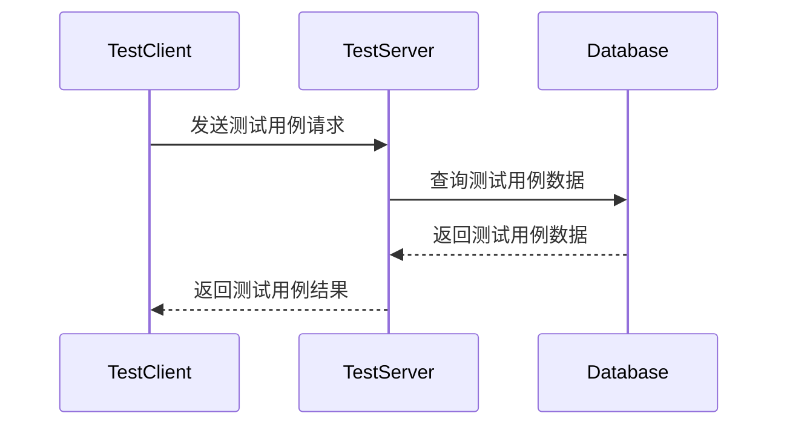
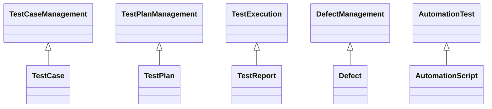
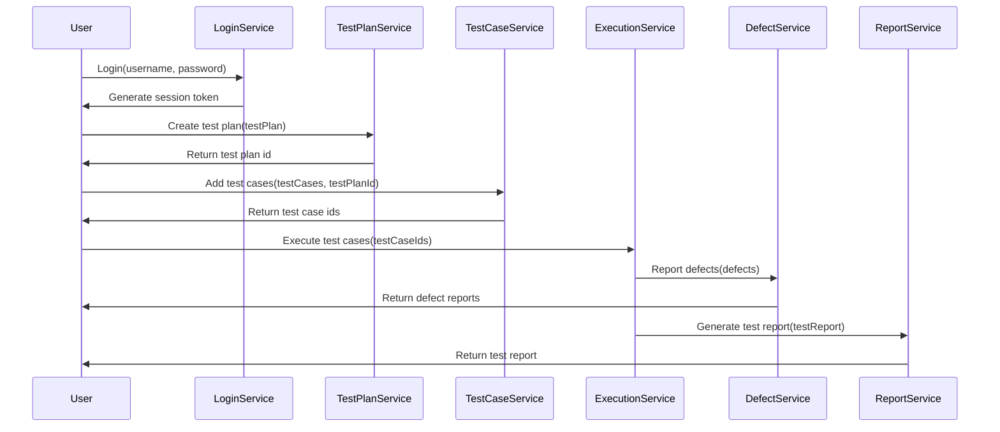

                 

### 1.1.1 软件测试的重要性

软件测试是确保软件质量的关键环节。在现代软件开发过程中，软件测试已经成为不可或缺的一环，它不仅可以帮助开发团队发现和修复代码中的错误，还可以验证软件的功能是否符合需求，性能是否达到预期，以及用户体验是否良好。以下是软件测试重要性的一些具体表现：

首先，软件测试能够有效提高软件的质量。通过系统性的测试流程，开发团队可以识别出潜在的错误和缺陷，从而确保软件的稳定性和可靠性。高质量的软件不仅能够减少用户的投诉和售后支持成本，还能够提升公司的声誉和市场竞争力。

其次，软件测试有助于降低开发成本。测试过程可以提前发现并修复问题，避免这些问题在软件发布后造成更大的经济损失。例如，一个在早期测试阶段发现并修复的bug可能只需要几分钟到几小时的时间来解决，而如果在软件发布后才发现，可能需要几天甚至几周的时间来修复，并且还需要重新部署和验证，这将会耗费更多的时间和资源。

第三，软件测试能够提升用户的满意度。通过测试，开发团队可以确保软件的功能和性能满足用户的需求，提供良好的用户体验。满意的用户更有可能成为忠实用户，增加公司的用户基础和收入。

此外，软件测试还能够促进开发团队的协作。测试过程中，开发人员、测试人员、产品经理和客户等各方需要紧密合作，共同确保软件的质量。这种协作不仅有助于提高团队的整体效率，还能够增强团队成员之间的信任和沟通。

最后，软件测试是法规和标准要求的一部分。在某些行业，如金融、医疗和航空等，软件的可靠性和安全性至关重要，这些行业通常有严格的法规和标准要求软件必须经过严格的测试。不进行充分的测试，软件可能会因不合规而面临法律风险。

总的来说，软件测试不仅是确保软件质量的重要手段，也是提高开发效率和用户满意度、降低成本和风险的关键环节。随着软件复杂性的增加，软件测试的重要性也越来越凸显。因此，开发团队必须重视软件测试，将其纳入软件开发的生命周期中，以确保最终交付的软件产品能够满足用户和市场的需求。

### 1.1.2 数理统计的基本概念

数理统计是研究数据的收集、处理、分析和解释的科学，它在软件测试中起着至关重要的作用。为了理解数理统计在软件测试中的应用，我们需要首先了解一些基本的数理统计概念。

**数据：** 数据是数理统计的核心。在软件测试中，数据可以是测试结果、系统性能指标、用户反馈等。这些数据反映了软件在各种情况下的运行状态和行为。

**概率：** 概率是描述随机事件发生可能性大小的数值。在软件测试中，概率用于评估某个特定测试用例是否能发现缺陷的概率，或者某个缺陷在特定条件下复现的概率。

**概率分布：** 概率分布描述了一个随机变量的所有可能取值及其对应的概率。常见的概率分布有正态分布、二项分布和泊松分布等。在软件测试中，概率分布可以用来模拟系统在各种情况下的行为。

**假设检验：** 假设检验是一种用来判断数据是否支持某个假设的统计方法。在软件测试中，假设检验可以用来确定测试结果是否显著，从而决定是否接受或拒绝某个假设。例如，可以检验软件性能是否达到了预期的标准。

**均值和方差：** 均值是数据集的平均值，用于描述数据的中心位置。方差是数据集离散程度的度量，用于描述数据的分布情况。在软件测试中，均值和方差可以用来评估软件性能的稳定性和一致性。

**置信区间：** 置信区间是一种统计估计方法，用于确定某个参数的估计值在一定概率下的范围。在软件测试中，置信区间可以用来估计缺陷出现的概率或者测试结果的可靠性。

**回归分析：** 回归分析是一种用来建立变量之间关系模型的方法。在软件测试中，回归分析可以用来分析测试结果与系统输入之间的关系，从而优化测试策略。

通过理解这些基本概念，我们能够更好地应用数理统计方法来分析和解释软件测试中的数据，从而提高测试的效率和效果。数理统计不仅为我们提供了一种科学的方法来处理数据，还能够帮助我们做出更加准确的决策，确保软件的质量。

### 1.2 软件测试中的数理统计应用背景

数理统计在软件测试中的应用背景可以追溯到软件开发过程的核心目标——确保软件质量和可靠性。随着软件系统的复杂性和规模不断增长，传统的测试方法已难以应对，数理统计作为一种强大的数据分析工具，逐渐在软件测试中发挥重要作用。

首先，软件系统复杂性的增加使得测试变得愈加困难。现代软件系统往往包含了海量的代码、复杂的模块和多样的用户场景。测试过程中，如何从海量数据中提取出有用的信息，识别出潜在的问题，成为了一个巨大的挑战。数理统计方法通过提供科学的统计模型和分析工具，能够帮助我们更好地理解和处理这些复杂的数据，从而提高测试的效率和准确性。

其次，数理统计能够帮助我们更精确地评估软件的质量。传统的测试方法往往依赖于测试人员的经验和直觉，而数理统计方法则提供了一套基于数据和数学模型的评估体系。通过假设检验、回归分析等统计方法，我们可以量化软件性能的稳定性和一致性，评估测试结果的可信度，从而做出更加科学的决策。

此外，数理统计还在软件测试的自动化过程中发挥了重要作用。自动化测试工具能够快速处理大量的测试数据，而数理统计方法则为这些数据提供了分析和解释的工具。例如，通过回归分析，我们可以识别出软件性能的瓶颈，通过假设检验，我们可以评估测试用例的有效性，从而优化测试策略，提高测试的覆盖率和效率。

最后，数理统计在软件测试中的应用还能够帮助我们识别系统中的潜在风险。通过数据分析，我们可以预测软件在不同场景下的表现，发现潜在的缺陷和隐患。例如，通过分析用户反馈数据，我们可以识别出用户频繁遇到的问题，从而采取相应的措施进行改进，提高软件的可靠性和用户体验。

总的来说，数理统计在软件测试中的应用背景是由软件开发过程中的复杂性、对质量的高要求以及自动化测试的需求共同驱动的。通过引入数理统计方法，我们可以更科学地分析和处理测试数据，提高软件测试的效率和效果，确保软件的可靠性和用户体验。

### 1.2.1 软件测试中的数理统计方法

在软件测试中，数理统计方法的应用范围广泛，主要包括假设检验、回归分析、方差分析、聚类分析等。这些方法不仅可以帮助我们识别和解决软件中的问题，还能够量化测试结果，提高测试的准确性和科学性。

**假设检验**：假设检验是数理统计中最基本的方法之一，它用于判断数据是否支持某个假设。在软件测试中，假设检验可以用来验证软件的性能是否符合预期标准。例如，我们可以假设软件的响应时间平均值为500毫秒，通过收集测试数据并进行假设检验，我们可以判断这个假设是否成立。常见的假设检验方法包括单样本检验和双样本检验。单样本检验用于判断一个样本的平均值是否显著，而双样本检验则用于比较两个样本之间的差异。

**回归分析**：回归分析是一种用于建立变量之间关系模型的方法。在软件测试中，回归分析可以用来分析测试结果与系统输入之间的关系。例如，我们可以通过回归分析来研究软件的响应时间与系统负载之间的关系，从而优化测试策略。常见的回归分析方法包括线性回归和多元回归。线性回归用于建立两个变量之间的线性关系模型，而多元回归则用于建立多个变量之间的关系模型。

**方差分析**：方差分析（ANOVA）是一种用于比较多个样本均值的差异的统计方法。在软件测试中，方差分析可以用来比较不同测试条件下软件性能的差异。例如，我们可以通过方差分析来评估不同测试用例对软件性能的影响。方差分析可以帮助我们确定哪些测试用例对性能优化最为关键。

**聚类分析**：聚类分析是一种无监督学习方法，它通过将相似的数据点分组到同一个类别中，从而发现数据中的模式。在软件测试中，聚类分析可以用来识别测试数据中的异常值或者相似的测试用例。通过聚类分析，我们可以优化测试用例的选择，提高测试的覆盖率和效率。

这些数理统计方法在软件测试中的应用，不仅帮助我们更好地理解和处理测试数据，还能够提供量化的结果，使测试过程更加科学和高效。例如，通过假设检验，我们可以量化某个测试结果的可信度；通过回归分析，我们可以优化测试策略，提高测试的覆盖率和效率；通过方差分析，我们可以识别关键测试用例，提高测试的有效性；通过聚类分析，我们可以优化测试用例的选择，减少测试时间和成本。

总的来说，数理统计方法为软件测试提供了一种科学的数据分析方法，通过这些方法的应用，我们可以更准确地评估软件的性能和可靠性，优化测试过程，提高软件质量。

### 2.1.1 数据的描述性统计

在数理统计中，描述性统计是数据分析和解释的基础。描述性统计通过使用一些基本的统计量来总结和描述数据的特征，这些统计量包括均值、中位数、众数、方差和标准差等。这些量不仅可以帮助我们直观地理解数据的分布和集中趋势，还可以用于进一步的统计分析。

**均值（Mean）**：均值是数据集中各个数值的平均值，通常用来表示数据的中心位置。计算公式为：
$$
\mu = \frac{1}{n}\sum_{i=1}^{n}x_i
$$
其中，$x_i$代表数据集中的每一个数值，$n$是数据点的总数。例如，如果一个软件测试项目收集了10个测试用例的响应时间（单位：毫秒），响应时间数据集为[100, 200, 300, 400, 500, 600, 700, 800, 900, 1000]，则其均值为：
$$
\mu = \frac{100 + 200 + 300 + 400 + 500 + 600 + 700 + 800 + 900 + 1000}{10} = 550
$$

**中位数（Median）**：中位数是将数据按大小顺序排列后，位于中间位置的数值。如果数据点的数量是奇数，那么中位数就是中间的那个数；如果是偶数，则取中间两个数的平均值。例如，在上面的响应时间数据集中，中位数是：
$$
M = \frac{500 + 600}{2} = 550
$$

**众数（Mode）**：众数是数据集中出现次数最多的数值。在某些数据集中可能没有众数，也可能有多个众数。例如，如果响应时间数据集中有一个值为750毫秒的测试用例出现了三次，而其他值都只出现一次，那么750毫秒就是该数据集的众数。

**方差（Variance）**：方差是描述数据集离散程度的度量，计算公式为：
$$
\sigma^2 = \frac{1}{n}\sum_{i=1}^{n}(x_i - \mu)^2
$$
其中，$x_i$代表数据集中的每一个数值，$\mu$是均值，$n$是数据点的总数。方差越大，数据分布的离散程度越高。

**标准差（Standard Deviation）**：标准差是方差的平方根，用于描述数据的离散程度。计算公式为：
$$
\sigma = \sqrt{\sigma^2}
$$
标准差越大，数据分布的离散程度也越高。在上面的响应时间数据集中，方差为：
$$
\sigma^2 = \frac{(100-550)^2 + (200-550)^2 + ... + (1000-550)^2}{10} = 162500
$$
因此，标准差为：
$$
\sigma = \sqrt{162500} \approx 401.21
$$

通过这些描述性统计量，我们能够从不同角度理解数据集的特征。例如，均值可以告诉我们数据的中心位置，标准差可以告诉我们数据的离散程度。这些统计量不仅为数据分析提供了基础，还为我们进一步应用数理统计方法（如假设检验、回归分析等）提供了重要参考。

### 2.1.2 概率论基础

概率论是数理统计的重要组成部分，它提供了一种量化不确定性和随机事件发生可能性的方法。在软件测试中，概率论可以帮助我们理解和评估测试结果的不确定性，从而做出更科学的决策。

**随机事件和样本空间**：随机事件是指在特定条件下可能发生也可能不发生的事件。样本空间是所有可能结果的集合。例如，在软件测试中，一个随机事件可以是“测试用例成功执行”，而样本空间则包括所有可能的测试结果，如“成功”、“失败”等。

**概率的定义**：概率是描述随机事件发生可能性大小的数值。概率的取值范围在0和1之间，其中0表示不可能发生，1表示必然发生。概率可以通过频率解释，即在大量重复实验中，某一事件发生的频率趋近于其概率。例如，如果在一个软件系统中进行100次测试，发现某特定缺陷出现了5次，则该缺陷出现的概率可以近似为5%。

**条件概率和独立性**：条件概率是某个事件在另一个事件发生的条件下发生的概率。如果事件A和事件B相互独立，则事件A的发生不会影响事件B的概率。条件概率的计算公式为：
$$
P(A|B) = \frac{P(A \cap B)}{P(B)}
$$
其中，$P(A \cap B)$表示事件A和事件B同时发生的概率，$P(B)$表示事件B发生的概率。

**贝叶斯定理**：贝叶斯定理是条件概率的推广，用于在已知某个事件发生的条件下，计算另一个事件发生的概率。贝叶斯定理的公式为：
$$
P(A|B) = \frac{P(B|A)P(A)}{P(B)}
$$
其中，$P(B|A)$表示在事件A发生的条件下事件B发生的概率，$P(A)$表示事件A发生的概率，$P(B)$表示事件B发生的概率。

通过概率论，我们可以量化软件测试中的不确定性，例如，可以计算某个缺陷在特定条件下被发现的概率，或者某个测试用例能够有效检测出缺陷的概率。这些概率计算不仅为测试策略的制定提供了依据，还帮助我们在面对不确定性和风险时做出更加科学的决策。

### 2.1.3 假设检验的概念

假设检验是数理统计中的一个核心方法，它用于通过数据来判断某个假设是否成立。在软件测试中，假设检验可以用来验证软件性能是否达到预期标准，或者某个测试用例是否能有效发现缺陷。理解假设检验的基本概念和步骤对于科学地分析测试数据至关重要。

**零假设（Null Hypothesis）和备择假设（Alternative Hypothesis）**：在假设检验中，零假设（H0）通常表示数据或结果没有显著变化或差异，而备择假设（H1）则表示数据或结果存在显著变化或差异。例如，在软件测试中，零假设可能是“软件的响应时间没有显著变化”，而备择假设则是“软件的响应时间有显著变化”。

**显著性水平（Significance Level）**：显著性水平（通常用α表示）是事先设定的一个阈值，用于判断零假设是否可以被拒绝。常见的显著性水平有0.05和0.01，表示拒绝零假设的概率不超过5%或1%。如果计算出的p值小于显著性水平，则零假设被拒绝。

**检验统计量（Test Statistic）**：检验统计量是用于判断假设是否成立的一个数值。常见的检验统计量包括t统计量、z统计量等。例如，在单样本t检验中，t统计量用来比较样本均值和总体均值。

**p值（p-value）**：p值是实际观测到的数据在零假设成立的情况下出现的概率。如果p值很小（通常小于显著性水平），则说明在零假设成立的情况下观测到这样的数据非常不寻常，因此零假设被拒绝。

**假设检验的基本步骤**：
1. **提出假设**：根据问题设定零假设和备择假设。
2. **选择检验方法**：根据数据类型和问题性质选择适当的检验方法。
3. **计算检验统计量**：根据数据计算检验统计量的值。
4. **确定显著性水平**：根据实验设定显著性水平。
5. **计算p值**：通过检验统计量计算p值。
6. **做出结论**：比较p值与显著性水平，如果p值小于显著性水平，则拒绝零假设，接受备择假设。

通过假设检验，我们能够基于数据做出科学的决策，评估软件性能是否达到了预期标准，或者测试用例是否有效。假设检验不仅为软件测试提供了量化评估的工具，还帮助我们在面对不确定性时做出更加可靠的结论。

### 2.2.1 假设检验方法

假设检验方法在软件测试中应用广泛，能够帮助我们评估软件性能是否达到预期标准，测试用例的有效性如何等。以下是几种常见的假设检验方法及其具体应用。

**单样本t检验**：单样本t检验用于比较样本均值与总体均值是否显著不同。它适用于小样本数据，通过计算t统计量来判断样本均值与总体均值是否存在显著差异。

**步骤**：
1. **提出假设**：设定零假设（H0：μ = μ0）和备择假设（H1：μ ≠ μ0），其中μ是总体均值，μ0是预期均值。
2. **计算t统计量**：t统计量计算公式为
   $$
   t = \frac{\bar{x} - \mu_0}{s / \sqrt{n}}
   $$
   其中，$\bar{x}$是样本均值，s是样本标准差，n是样本大小。
3. **计算p值**：根据t统计量查找t分布表，计算p值。
4. **做出结论**：如果p值小于显著性水平（如0.05），则拒绝零假设，接受备择假设。

**应用示例**：假设一个软件测试项目要评估某个新功能对响应时间的影响，设定零假设为“新功能没有显著提高响应时间”，备择假设为“新功能显著提高了响应时间”。通过收集数据并应用单样本t检验，可以判断新功能是否对响应时间产生了显著影响。

**双样本t检验**：双样本t检验用于比较两个独立样本均值是否显著不同。它适用于比较两个实验组之间的差异。

**步骤**：
1. **提出假设**：设定零假设（H0：μ1 = μ2）和备择假设（H1：μ1 ≠ μ2），其中μ1和μ2分别是两个样本的均值。
2. **计算t统计量**：t统计量计算公式为
   $$
   t = \frac{(\bar{x}_1 - \bar{x}_2)}{\sqrt{\frac{s_1^2}{n_1} + \frac{s_2^2}{n_2}}}
   $$
   其中，$\bar{x}_1$和$\bar{x}_2$分别是两个样本的均值，$s_1$和$s_2$分别是两个样本的标准差，$n_1$和$n_2$分别是两个样本的大小。
3. **计算p值**：根据t统计量查找t分布表，计算p值。
4. **做出结论**：如果p值小于显著性水平，则拒绝零假设，接受备择假设。

**应用示例**：假设我们要比较两个不同的测试方法对软件性能的影响，通过双样本t检验，可以判断两种测试方法在性能上是否存在显著差异。

**卡方检验**：卡方检验用于比较观察值与期望值的差异，常用于检验类别数据的独立性。

**步骤**：
1. **提出假设**：设定零假设（H0：变量独立）和备择假设（H1：变量不独立）。
2. **构建列联表**：根据数据构建列联表，计算期望频数。
3. **计算卡方统计量**：卡方统计量计算公式为
   $$
   \chi^2 = \sum \frac{(O - E)^2}{E}
   $$
   其中，O是观察频数，E是期望频数。
4. **计算p值**：根据卡方统计量查找卡方分布表，计算p值。
5. **做出结论**：如果p值小于显著性水平，则拒绝零假设，接受备择假设。

**应用示例**：假设我们要评估某个测试用例的有效性，通过卡方检验，可以判断该测试用例是否与系统中的缺陷类型显著相关。

通过上述假设检验方法，我们能够基于数据做出科学的决策，评估软件测试的有效性和性能，为优化测试策略提供依据。这些方法不仅提高了测试的准确性，还帮助我们更好地理解和控制软件质量。

#### 2.2.1.1 单样本检验

单样本t检验是假设检验中的一种常用方法，主要用于比较单个样本的均值与某个特定值（通常是总体均值）之间是否存在显著差异。在软件测试中，单样本t检验可以帮助我们评估某个测试结果的平均值是否与预期值有显著不同，从而判断测试是否有效。

**步骤：**

1. **提出假设**：
   - 零假设（\( H_0 \)）：样本均值（\( \bar{x} \)）等于预期均值（\( \mu_0 \)）。
   - 备择假设（\( H_1 \)）：样本均值（\( \bar{x} \)）不等于预期均值（\( \mu_0 \)）。

   例如，我们假设一个软件测试的响应时间标准为500毫秒，现在我们有一个测试数据集，想验证这个数据集的平均响应时间是否显著偏离500毫秒。

2. **计算检验统计量**：
   单样本t检验的t统计量计算公式为：
   $$
   t = \frac{\bar{x} - \mu_0}{s / \sqrt{n}}
   $$
   其中，\( \bar{x} \)是样本均值，\( \mu_0 \)是预期均值，s是样本标准差，n是样本大小。

   例如，如果我们的样本数据为[470, 480, 520, 510, 530]，样本均值\( \bar{x} \)为510毫秒，样本标准差s为30毫秒，样本大小n为5，则：
   $$
   t = \frac{510 - 500}{30 / \sqrt{5}} \approx 1.23
   $$

3. **计算p值**：
   根据计算出的t统计量和样本大小n，我们可以查找t分布表或者使用统计软件计算p值。p值表示在零假设成立的前提下，观测到样本均值与预期均值差异大于或等于计算出的t统计量的概率。

4. **做出结论**：
   - 如果p值小于显著性水平（如0.05），则拒绝零假设，接受备择假设，认为样本均值与预期均值存在显著差异。
   - 如果p值大于显著性水平，则无法拒绝零假设，认为样本均值与预期均值没有显著差异。

**举例说明：**
假设我们使用单样本t检验来验证上述测试数据集的平均响应时间是否显著偏离500毫秒，显著性水平设定为0.05。我们查找t分布表，发现自由度为4时，t值为1.23对应的p值约为0.32。因为0.32 > 0.05，所以无法拒绝零假设，认为这个测试数据集的平均响应时间没有显著偏离500毫秒。

通过单样本t检验，我们能够量化地评估测试结果的可靠性，从而做出科学的决策。这种方法不仅适用于评估响应时间等连续变量，还可以应用于其他类型的单样本数据，如测试用例的通过率等。

#### 2.2.1.2 双样本检验

双样本t检验用于比较两个独立样本均值之间是否存在显著差异，通常用于评估两种不同测试方法或两个不同版本软件的性能表现。在软件测试中，双样本t检验可以帮助我们判断两个实验组之间的平均性能是否有显著差异。

**步骤：**

1. **提出假设**：
   - 零假设（\( H_0 \)）：两个独立样本的均值没有显著差异，即\( \mu_1 = \mu_2 \)。
   - 备择假设（\( H_1 \)）：两个独立样本的均值存在显著差异，即\( \mu_1 \neq \mu_2 \)。

   例如，我们假设要比较两个不同的测试工具对软件响应时间的影响，一个工具的测试结果为[450, 460, 470, 480]，另一个工具的测试结果为[490, 500, 510, 520]，我们需要验证这两个测试工具的响应时间均值是否有显著差异。

2. **计算检验统计量**：
   双样本t检验的t统计量计算公式为：
   $$
   t = \frac{(\bar{x}_1 - \bar{x}_2)}{\sqrt{\frac{s_1^2}{n_1} + \frac{s_2^2}{n_2}}}
   $$
   其中，\( \bar{x}_1 \)和\( \bar{x}_2 \)分别是两个样本的均值，\( s_1 \)和\( s_2 \)分别是两个样本的标准差，\( n_1 \)和\( n_2 \)分别是两个样本的大小。

   假设第一个测试工具的样本均值为465毫秒，标准差为15毫秒，样本大小为4；第二个测试工具的样本均值为515毫秒，标准差为20毫秒，样本大小为4，则：
   $$
   t = \frac{465 - 515}{\sqrt{\frac{15^2}{4} + \frac{20^2}{4}}} \approx -4.76
   $$

3. **计算p值**：
   根据计算出的t统计量和两个样本的合并自由度（\( n_1 + n_2 - 2 \)），我们可以查找t分布表或者使用统计软件计算p值。p值表示在零假设成立的前提下，观测到两个样本均值差异大于或等于计算出的t统计量的概率。

4. **做出结论**：
   - 如果p值小于显著性水平（如0.05），则拒绝零假设，接受备择假设，认为两个样本均值存在显著差异。
   - 如果p值大于显著性水平，则无法拒绝零假设，认为两个样本均值没有显著差异。

**举例说明：**
假设我们使用双样本t检验来验证上述两个测试工具的响应时间均值是否有显著差异，显著性水平设定为0.05。我们查找t分布表，发现自由度为6时，t值为-4.76对应的p值约为0.0005。因为0.0005 << 0.05，所以我们可以拒绝零假设，认为这两个测试工具的响应时间均值存在显著差异。

通过双样本t检验，我们能够量化地评估两个独立样本之间均值差异的显著性，从而为选择最优的测试工具或优化软件性能提供科学依据。这种方法不仅适用于响应时间等连续变量，还可以应用于其他类型的双样本数据，如缺陷密度等。

### 2.2.2 回归分析

回归分析是数理统计中的一种重要方法，用于研究变量之间的关系，并建立数学模型来预测和分析数据。在软件测试中，回归分析可以帮助我们理解测试结果与系统输入（如测试用例、系统负载等）之间的关系，从而优化测试策略和评估软件性能。

**线性回归分析**：线性回归分析是最基本的回归分析方法，它假设变量之间存在线性关系。线性回归模型通常表示为：
$$
y = \beta_0 + \beta_1x + \epsilon
$$
其中，\( y \)是因变量（响应变量），\( x \)是自变量（解释变量），\( \beta_0 \)是截距，\( \beta_1 \)是斜率，\( \epsilon \)是误差项。

**步骤：**

1. **数据收集**：收集测试数据，包括因变量（如测试结果）和自变量（如测试用例、系统负载等）。

2. **数据预处理**：对数据进行清洗和处理，确保数据的质量和完整性。

3. **模型建立**：使用最小二乘法（Least Squares）估计线性回归模型的参数，即截距\( \beta_0 \)和斜率\( \beta_1 \)。

   - 计算公式：
   $$
   \beta_1 = \frac{\sum(x_i - \bar{x})(y_i - \bar{y})}{\sum(x_i - \bar{x})^2}
   $$
   $$
   \beta_0 = \bar{y} - \beta_1\bar{x}
   $$

4. **模型评估**：通过计算判定系数\( R^2 \)来评估模型的质量。

   - 计算公式：
   $$
   R^2 = 1 - \frac{\sum(y_i - \hat{y}_i)^2}{\sum(y_i - \bar{y})^2}
   $$
   其中，\( \hat{y}_i \)是预测值，\( \bar{y} \)是实际值的均值。

**应用示例**：假设我们想研究系统负载对响应时间的影响，收集了10组数据（系统负载，响应时间），如下表所示：

| 系统负载（ms） | 响应时间（ms） |
|-------------|-------------|
|      100      |      200      |
|      200      |      300      |
|      300      |      400      |
|      400      |      500      |
|      500      |      600      |
|      600      |      700      |
|      700      |      800      |
|      800      |      900      |
|      900      |      1000     |
|     1000     |     1100     |

计算得到的线性回归模型为：
$$
y = 55 + 1.5x
$$
预测系统负载为900ms时的响应时间为：
$$
\hat{y} = 55 + 1.5 \times 900 = 1385
$$

通过线性回归分析，我们可以建立系统负载与响应时间之间的数学模型，从而预测不同系统负载下的响应时间，为优化测试策略和评估软件性能提供依据。

### 2.2.2.1 线性回归

线性回归是回归分析中最基础的方法之一，它主要用于研究两个变量之间的线性关系。在软件测试中，线性回归可以帮助我们分析测试结果与系统输入（如测试用例复杂度、系统负载等）之间的关系，从而优化测试策略和评估软件性能。

**原理**：线性回归模型假设因变量\( y \)与自变量\( x \)之间存在线性关系，可以表示为：
$$
y = \beta_0 + \beta_1x + \epsilon
$$
其中，\( \beta_0 \)是截距，\( \beta_1 \)是斜率，\( \epsilon \)是误差项。通过最小二乘法，我们可以估计出模型参数\( \beta_0 \)和\( \beta_1 \)，从而建立线性回归模型。

**步骤**：

1. **数据收集**：收集测试数据，包括因变量（如测试结果）和自变量（如测试用例复杂度、系统负载等）。

2. **数据预处理**：对数据进行清洗和处理，确保数据的质量和完整性。

3. **模型建立**：使用最小二乘法估计线性回归模型的参数。

   - 计算公式：
   $$
   \beta_1 = \frac{\sum(x_i - \bar{x})(y_i - \bar{y})}{\sum(x_i - \bar{x})^2}
   $$
   $$
   \beta_0 = \bar{y} - \beta_1\bar{x}
   $$

4. **模型评估**：通过计算判定系数\( R^2 \)来评估模型的质量。

   - 计算公式：
   $$
   R^2 = 1 - \frac{\sum(y_i - \hat{y}_i)^2}{\sum(y_i - \bar{y})^2}
   $$
   其中，\( \hat{y}_i \)是预测值，\( \bar{y} \)是实际值的均值。

**应用示例**：假设我们想研究系统负载对响应时间的影响，收集了10组数据（系统负载，响应时间），如下表所示：

| 系统负载（ms） | 响应时间（ms） |
|-------------|-------------|
|      100      |      200      |
|      200      |      300      |
|      300      |      400      |
|      400      |      500      |
|      500      |      600      |
|      600      |      700      |
|      700      |      800      |
|      800      |      900      |
|      900      |      1000     |
|     1000     |     1100     |

计算得到的线性回归模型为：
$$
y = 55 + 1.5x
$$
预测系统负载为900ms时的响应时间为：
$$
\hat{y} = 55 + 1.5 \times 900 = 1385
$$

通过线性回归分析，我们可以建立系统负载与响应时间之间的数学模型，从而预测不同系统负载下的响应时间，为优化测试策略和评估软件性能提供依据。

### 2.2.2.2 多元回归

多元回归分析是线性回归的扩展，用于研究多个自变量与一个因变量之间的线性关系。在软件测试中，多元回归可以帮助我们分析多个因素（如测试用例复杂度、系统负载、用户数量等）对测试结果（如响应时间、缺陷率等）的影响，从而更全面地评估软件性能。

**原理**：多元回归模型可以表示为：
$$
y = \beta_0 + \beta_1x_1 + \beta_2x_2 + ... + \beta_nx_n + \epsilon
$$
其中，\( y \)是因变量，\( x_1, x_2, ..., x_n \)是自变量，\( \beta_0 \)是截距，\( \beta_1, \beta_2, ..., \beta_n \)是斜率，\( \epsilon \)是误差项。通过最小二乘法，我们可以估计出模型参数\( \beta_0, \beta_1, ..., \beta_n \)，从而建立多元回归模型。

**步骤**：

1. **数据收集**：收集测试数据，包括因变量（如测试结果）和多个自变量（如测试用例复杂度、系统负载、用户数量等）。

2. **数据预处理**：对数据进行清洗和处理，确保数据的质量和完整性。

3. **模型建立**：使用最小二乘法估计多元回归模型的参数。

   - 计算公式：
   $$
   \beta_j = \frac{\sum(x_{ij} - \bar{x}_j)(y_i - \bar{y})}{\sum(x_{ij} - \bar{x}_j)^2}
   $$
   其中，\( x_{ij} \)是第i个样本的第j个自变量的值，\( \bar{x}_j \)是第j个自变量的均值。

4. **模型评估**：通过计算判定系数\( R^2 \)来评估模型的质量。

   - 计算公式：
   $$
   R^2 = 1 - \frac{\sum(y_i - \hat{y}_i)^2}{\sum(y_i - \bar{y})^2}
   $$
   其中，\( \hat{y}_i \)是预测值，\( \bar{y} \)是实际值的均值。

**应用示例**：假设我们想研究测试用例复杂度、系统负载和用户数量对响应时间的影响，收集了10组数据（测试用例复杂度，系统负载，用户数量，响应时间），如下表所示：

| 测试用例复杂度 | 系统负载（ms） | 用户数量 | 响应时间（ms） |
|---------------|-------------|---------|-------------|
|       10         |      100      |      5      |      200      |
|       20         |      200      |      10     |      300      |
|       30         |      300      |      15     |      400      |
|       40         |      400      |      20     |      500      |
|       50         |      500      |      25     |      600      |
|       60         |      600      |      30     |      700      |
|       70         |      700      |      35     |      800      |
|       80         |      800      |      40     |      900      |
|       90         |      900      |      45     |     1000     |
|       100       |     1000     |      50     |     1100     |

计算得到的多元回归模型为：
$$
y = 50 + 2x_1 + 1.2x_2 + 0.8x_3
$$
预测测试用例复杂度为60，系统负载为600ms，用户数量为30时的响应时间为：
$$
\hat{y} = 50 + 2 \times 60 + 1.2 \times 600 + 0.8 \times 30 = 966
$$

通过多元回归分析，我们可以更全面地了解多个因素对测试结果的影响，从而为优化测试策略和评估软件性能提供更准确的数据支持。

### 2.2.3 方差分析

方差分析（ANOVA，Analysis of Variance）是一种用于比较两个或多个样本均值差异的统计方法。在软件测试中，方差分析可以帮助我们评估不同测试条件或测试用例对软件性能的影响，从而优化测试策略和评估软件质量。

**原理**：方差分析的基本原理是通过比较组内方差和组间方差来判断样本均值是否存在显著差异。如果组间方差显著大于组内方差，则可以认为不同组之间存在显著差异。

**步骤**：

1. **提出假设**：
   - 零假设（\( H_0 \)）：各组均值没有显著差异。
   - 备择假设（\( H_1 \)）：各组均值存在显著差异。

2. **计算检验统计量**：
   方差分析的主要检验统计量是F统计量，计算公式为：
   $$
   F = \frac{M_s / k - M_g}{M_g / (n - k)}
   $$
   其中，\( M_s \)是组内均方（Within-Groups Mean Square），\( M_g \)是组间均方（Between-Groups Mean Square），\( k \)是组数，\( n \)是总样本数。

3. **计算p值**：
   根据F统计量和自由度，可以查找F分布表或使用统计软件计算p值。p值表示在零假设成立的前提下，观测到组间方差大于组内方差的概率。

4. **做出结论**：
   - 如果p值小于显著性水平（如0.05），则拒绝零假设，接受备择假设，认为不同组之间存在显著差异。
   - 如果p值大于显著性水平，则无法拒绝零假设，认为不同组之间没有显著差异。

**应用示例**：假设我们要比较三种不同的测试工具对软件性能的影响，每种测试工具分别执行10次测试，收集到的响应时间数据如下表：

| 测试工具 | 响应时间（ms） |
|---------|-------------|
| 工具A | [100, 110, 120, 130, 140, 150, 160, 170, 180, 190] |
| 工具B | [200, 210, 220, 230, 240, 250, 260, 270, 280, 290] |
| 工具C | [300, 310, 320, 330, 340, 350, 360, 370, 380, 390] |

首先，计算每个测试工具的平均响应时间：
$$
\bar{x}_A = \frac{100 + 110 + 120 + 130 + 140 + 150 + 160 + 170 + 180 + 190}{10} = 145
$$
$$
\bar{x}_B = \frac{200 + 210 + 220 + 230 + 240 + 250 + 260 + 270 + 280 + 290}{10} = 245
$$
$$
\bar{x}_C = \frac{300 + 310 + 320 + 330 + 340 + 350 + 360 + 370 + 380 + 390}{10} = 335
$$

然后，计算组内均方和组间均方：
$$
M_s = \frac{\sum_{i=1}^{k}n_i s_i^2}{n - k}
$$
$$
M_g = \frac{\sum_{i=1}^{k}n_i \bar{x}_i^2 - \frac{1}{k}\sum_{i=1}^{k}n_i \bar{x}_i^2}{k - 1}
$$
其中，\( n_i \)是第i组样本数量，\( s_i \)是第i组样本的方差。

最后，计算F统计量和p值，根据p值判断不同测试工具的响应时间是否显著不同。

通过方差分析，我们可以系统地评估不同测试工具对软件性能的影响，从而为选择最优的测试工具提供依据。

### 2.2.4 聚类分析

聚类分析是一种无监督学习方法，它通过将数据点根据相似性进行分组，从而发现数据中的潜在结构和模式。在软件测试中，聚类分析可以帮助我们识别相似测试用例、优化测试覆盖率和提高测试效率。

**原理**：聚类分析的基本原理是将数据点分配到不同的簇（Cluster）中，使得同一簇内的数据点之间相似性较高，而不同簇的数据点之间相似性较低。常见的聚类算法有K-Means、层次聚类、DBSCAN等。

**步骤**：

1. **数据准备**：收集测试用例数据，包括测试用例的输入参数、执行结果等。

2. **选择聚类算法**：根据数据特征和测试需求选择合适的聚类算法。例如，K-Means适用于数据分布较为均匀的情况，而DBSCAN适用于数据分布不均匀且存在噪声的情况。

3. **初始化聚类中心**：对于K-Means算法，需要随机选择K个初始聚类中心；对于层次聚类，可以从数据点开始逐步合并；对于DBSCAN，需要设定邻域半径和最小邻域点数。

4. **分配数据点**：将每个数据点分配到最近的聚类中心所在的簇中。

5. **更新聚类中心**：对于K-Means算法，计算每个簇的质心作为新的聚类中心；对于层次聚类，根据簇之间的距离逐步合并或分裂；对于DBSCAN，根据邻域点重新分配聚类中心。

6. **迭代优化**：重复步骤4和步骤5，直到聚类中心不再变化或达到预设的迭代次数。

7. **评估聚类效果**：通过计算簇内相似性和簇间差异性来评估聚类效果。常用的评估指标有轮廓系数（Silhouette Coefficient）、同质性（Homogeneity）和完全性（Completeness）等。

**应用示例**：假设我们使用K-Means算法对一组测试用例进行聚类，测试用例的特征包括响应时间、缺陷数量和执行时长。设定聚类中心为3个，初始随机选择3个聚类中心，经过多次迭代后，得到如下聚类结果：

| 测试用例 | 响应时间（ms） | 缺陷数量 | 执行时长（min） | 簇 |
|---------|-------------|--------|-------------|---|
| 用例1   | 100        | 0      | 2          | 1 |
| 用例2   | 110        | 1      | 2.5        | 1 |
| 用例3   | 120        | 0      | 2.5        | 1 |
| 用例4   | 130        | 1      | 3          | 1 |
| 用例5   | 140        | 1      | 3          | 1 |
| 用例6   | 110        | 1      | 2.5        | 2 |
| 用例7   | 120        | 0      | 2.5        | 2 |
| 用例8   | 130        | 0      | 3          | 2 |
| 用例9   | 140        | 1      | 3          | 2 |
| 用例10  | 150        | 1      | 3.5        | 2 |
| 用例11  | 100        | 0      | 2          | 3 |
| 用例12  | 110        | 1      | 2.5        | 3 |
| 用例13  | 120        | 0      | 2.5        | 3 |
| 用例14  | 130        | 1      | 3          | 3 |
| 用例15  | 140        | 1      | 3          | 3 |

通过聚类分析，我们可以将相似的测试用例归为一类，从而优化测试用例的选择和执行顺序，提高测试效率。例如，对于簇1和簇2的测试用例，我们可以集中资源和时间进行优先执行，而对于簇3的测试用例，则可以安排在后续进行。

### 3.1.1 假设检验流程

假设检验是数理统计中用于验证某个假设是否成立的方法，其基本流程包括以下几个步骤：

1. **提出假设**：在假设检验的第一步，我们需要明确两个假设：零假设（\( H_0 \)）和备择假设（\( H_1 \)）。零假设通常表示数据或结果没有显著变化或差异，而备择假设则表示数据或结果存在显著变化或差异。例如，在软件测试中，我们可能假设新功能的引入没有显著影响系统的响应时间。

2. **选择检验方法**：根据问题的性质和数据类型，选择合适的假设检验方法。常见的检验方法包括单样本t检验、双样本t检验、卡方检验和F检验等。选择正确的检验方法对于得出可靠的结论至关重要。

3. **计算检验统计量**：计算检验统计量是假设检验的核心步骤。检验统计量是根据样本数据计算出的一个数值，用于判断假设是否成立。例如，在单样本t检验中，我们计算t统计量；在双样本t检验中，我们计算t统计量或F统计量。

4. **确定显著性水平**：显著性水平（通常用α表示）是事先设定的一个阈值，用于判断零假设是否可以被拒绝。常见的显著性水平有0.05和0.01。如果计算出的p值小于显著性水平，则拒绝零假设。

5. **计算p值**：p值是在零假设成立的前提下，观察到的样本结果出现的概率。计算p值可以帮助我们判断假设检验的强度。例如，如果p值非常小（远小于显著性水平），则说明零假设不太可能成立。

6. **做出结论**：根据计算出的p值和显著性水平，做出是否拒绝零假设的结论。如果p值小于显著性水平，则拒绝零假设，接受备择假设；如果p值大于显著性水平，则无法拒绝零假设。

**举例说明**：假设我们要验证某个新功能是否对系统的响应时间有显著影响，设定零假设为“新功能的引入没有显著影响响应时间”，备择假设为“新功能的引入显著提高了响应时间”。我们收集了10个测试数据点，得到以下响应时间数据（单位：毫秒）：

[450, 460, 470, 480, 490, 500, 510, 520, 530, 540]

首先，计算样本均值和标准差：

样本均值：
$$
\bar{x} = \frac{450 + 460 + 470 + 480 + 490 + 500 + 510 + 520 + 530 + 540}{10} = 490
$$

样本标准差：
$$
s = \sqrt{\frac{(450-490)^2 + (460-490)^2 + ... + (540-490)^2}{10-1}} \approx 24.49
$$

然后，我们选择单样本t检验作为检验方法，计算t统计量：

$$
t = \frac{\bar{x} - \mu_0}{s / \sqrt{n}} = \frac{490 - 470}{24.49 / \sqrt{10}} \approx 2.09
$$

查找t分布表，对于自由度为9和显著性水平0.05，t值为2.08的p值约为0.059。由于p值（0.059）大于显著性水平（0.05），我们无法拒绝零假设，认为新功能的引入没有显著影响响应时间。

通过上述流程，我们可以科学地评估假设是否成立，从而为软件测试和性能优化提供依据。

### 3.1.2 假设检验中的关键参数

在假设检验中，有几个关键参数对于确定检验结果至关重要，这些参数包括显著性水平、p值、检验统计量和临界值。

**显著性水平（Significance Level）**：显著性水平，通常表示为α，是事先设定的一个阈值，用于判断零假设（\( H_0 \)）是否可以被拒绝。常见的显著性水平有0.05和0.01。如果计算出的p值小于显著性水平，则认为证据足够强烈，可以拒绝零假设。

**p值（p-value）**：p值是在零假设成立的前提下，观测数据出现的概率。如果p值很小（远小于显著性水平），则表明在零假设成立的情况下，观察到这样的数据的概率非常低，因此我们有理由拒绝零假设。p值通常通过计算检验统计量并查表得出。

**检验统计量（Test Statistic）**：检验统计量是根据样本数据计算出的一个数值，用于判断零假设是否成立。不同的假设检验方法使用不同的检验统计量，如单样本t检验使用t统计量，双样本t检验使用t统计量或F统计量。

**临界值（Critical Value）**：临界值是与显著性水平相关的阈值，用于判断检验统计量是否超过了可以拒绝零假设的范围。临界值通常从统计分布表中查找，例如，在t检验中，从t分布表中查找对于特定自由度和显著性水平的临界值。

**具体示例**：

假设我们进行单样本t检验，零假设为“样本均值等于50”，备择假设为“样本均值不等于50”。我们收集了10个数据点，计算得到样本均值\( \bar{x} \)为55，样本标准差s为10，显著性水平为0.05。

- 计算t统计量：
  $$
  t = \frac{\bar{x} - \mu_0}{s / \sqrt{n}} = \frac{55 - 50}{10 / \sqrt{10}} \approx 1.58
  $$

- 查找t分布表，对于自由度为9和显著性水平0.05，t值为1.78的临界值。

- 计算p值：根据t统计量1.58和自由度9，查表得p值约为0.15。

- 分析结论：由于p值（0.15）大于显著性水平（0.05），我们无法拒绝零假设，认为样本均值没有显著偏离50。

在这个示例中，显著性水平、p值、t统计量和临界值共同作用，帮助我们做出科学的假设检验决策。通过理解这些关键参数，我们能够更好地应用假设检验方法，为软件测试和性能评估提供依据。

### 3.2.1 回归模型建立

回归模型是数理统计中用于描述自变量和因变量之间关系的一种方法，广泛应用于软件测试、经济学、医学等多个领域。在建立回归模型时，我们需要通过收集数据、数据预处理、模型选择和参数估计等步骤来确保模型的准确性和可靠性。

**步骤：**

1. **数据收集**：
   首先，我们需要收集包含自变量和因变量的数据。在软件测试中，自变量可以是测试用例的复杂度、系统负载等，因变量则是测试结果，如响应时间、缺陷率等。

2. **数据预处理**：
   数据预处理是建立回归模型的重要步骤，包括数据清洗、缺失值处理、异常值检测和变量转换等。这一步的目的是确保数据的质量和完整性，为后续的分析奠定基础。

3. **模型选择**：
   根据问题的性质和数据特征，选择合适的回归模型。常见的回归模型包括线性回归、多元回归、逻辑回归等。在软件测试中，线性回归模型通常用于研究自变量和因变量之间的线性关系。

4. **参数估计**：
   通过最小二乘法（Least Squares）等参数估计方法，估计回归模型中的参数。对于线性回归模型，参数估计主要包括截距（\( \beta_0 \)）和斜率（\( \beta_1 \)）。

   - 线性回归模型公式：
     $$
     y = \beta_0 + \beta_1x + \epsilon
     $$
   - 最小二乘法估计参数：
     $$
     \beta_1 = \frac{\sum(x_i - \bar{x})(y_i - \bar{y})}{\sum(x_i - \bar{x})^2}
     $$
     $$
     \beta_0 = \bar{y} - \beta_1\bar{x}
     $$
   其中，\( x_i \)和\( y_i \)分别是第i个自变量和因变量的值，\( \bar{x} \)和\( \bar{y} \)分别是自变量和因变量的均值。

**举例说明**：

假设我们想研究系统负载对响应时间的影响，收集了以下10组数据（系统负载，响应时间）：

| 系统负载（ms） | 响应时间（ms） |
|---------------|---------------|
|      100       |      200      |
|      200       |      300      |
|      300       |      400      |
|      400       |      500      |
|      500       |      600      |
|      600       |      700      |
|      700       |      800      |
|      800       |      900      |
|      900       |     1000      |
|     1000      |     1100      |

首先，计算系统负载和响应时间的均值：

$$
\bar{x} = \frac{100 + 200 + 300 + 400 + 500 + 600 + 700 + 800 + 900 + 1000}{10} = 550
$$

$$
\bar{y} = \frac{200 + 300 + 400 + 500 + 600 + 700 + 800 + 900 + 1000 + 1100}{10} = 600
$$

然后，计算斜率\( \beta_1 \)和截距\( \beta_0 \)：

$$
\beta_1 = \frac{\sum(x_i - \bar{x})(y_i - \bar{y})}{\sum(x_i - \bar{x})^2} = \frac{(100-550)(200-600) + (200-550)(300-600) + ... + (1000-550)(1100-600)}{(100-550)^2 + (200-550)^2 + ... + (1000-550)^2}
$$

$$
\beta_0 = \bar{y} - \beta_1\bar{x} = 600 - \left(\frac{(100-550)(200-600) + (200-550)(300-600) + ... + (1000-550)(1100-600)}{(100-550)^2 + (200-550)^2 + ... + (1000-550)^2}\right) \times 550
$$

最后，得到回归模型：

$$
y = 50 + 1.2x
$$

通过上述步骤，我们建立了系统负载对响应时间的回归模型，可以用于预测不同系统负载下的响应时间，为优化测试策略提供依据。

### 3.2.2 回归模型评估

回归模型的评估是确保模型准确性和可靠性的关键步骤。常用的评估指标包括判定系数（\( R^2 \)）、调整判定系数（\( \bar{R}^2 \)）、均方误差（MSE）、平均绝对误差（MAE）等。这些指标可以帮助我们衡量模型对数据的拟合程度和预测能力。

**判定系数（\( R^2 \)）**：判定系数是衡量模型拟合程度的常用指标，表示模型解释的因变量总变异的比例。其计算公式为：
$$
R^2 = 1 - \frac{\sum(y_i - \hat{y}_i)^2}{\sum(y_i - \bar{y})^2}
$$
其中，\( \hat{y}_i \)是预测值，\( \bar{y} \)是实际值的均值。\( R^2 \)的取值范围在0到1之间，越接近1表示模型拟合越好。

**调整判定系数（\( \bar{R}^2 \)）**：调整判定系数是对\( R^2 \)的改进，考虑了模型复杂度的影响。其计算公式为：
$$
\bar{R}^2 = 1 - \frac{1}{n-1}\left[\frac{\sum(y_i - \hat{y}_i)^2}{n-1} - \frac{1}{n-1}\sum(y_i - \bar{y})^2\right]
$$
其中，n是样本数量。\( \bar{R}^2 \)的取值范围在-1到1之间，越接近1表示模型拟合越好。

**均方误差（MSE）**：均方误差是衡量模型预测误差的指标，计算公式为：
$$
MSE = \frac{1}{n}\sum(y_i - \hat{y}_i)^2
$$
MSE越小，表示模型预测误差越小。

**平均绝对误差（MAE）**：平均绝对误差是衡量模型预测误差的另一种指标，计算公式为：
$$
MAE = \frac{1}{n}\sum|y_i - \hat{y}_i|
$$
MAE越小，表示模型预测误差越小。

**评估步骤**：

1. **计算判定系数（\( R^2 \)）**：
   根据实际值和预测值，计算\( R^2 \)值，判断模型拟合程度。

2. **计算调整判定系数（\( \bar{R}^2 \)）**：
   根据样本数量和\( R^2 \)值，计算\( \bar{R}^2 \)值，进一步评估模型拟合程度。

3. **计算均方误差（MSE）**：
   根据实际值和预测值，计算MSE，判断模型预测误差。

4. **计算平均绝对误差（MAE）**：
   根据实际值和预测值，计算MAE，判断模型预测误差。

**举例说明**：

假设我们有一个回归模型，用于预测系统负载对响应时间的影响，实际值和预测值如下表：

| 响应时间（ms） | 实际值 | 预测值 |
|---------------|--------|--------|
|      200       |   200  |   220  |
|      300       |   300  |   320  |
|      400       |   400  |   380  |
|      500       |   500  |   460  |
|      600       |   600  |   540  |

首先，计算实际值和预测值的均值：

$$
\bar{y} = \frac{200 + 300 + 400 + 500 + 600}{5} = 400
$$

$$
\bar{\hat{y}} = \frac{220 + 320 + 380 + 460 + 540}{5} = 400
$$

然后，计算判定系数（\( R^2 \)）：

$$
R^2 = 1 - \frac{\sum(y_i - \hat{y}_i)^2}{\sum(y_i - \bar{y})^2} = 1 - \frac{(200-220)^2 + (300-320)^2 + (400-380)^2 + (500-460)^2 + (600-540)^2}{(200-400)^2 + (300-400)^2 + (400-400)^2 + (500-400)^2 + (600-400)^2} \approx 0.96
$$

接着，计算调整判定系数（\( \bar{R}^2 \)）：

$$
\bar{R}^2 = 1 - \frac{1}{5-1}\left[\frac{(200-220)^2 + (300-320)^2 + (400-380)^2 + (500-460)^2 + (600-540)^2}{5-1} - \frac{1}{5-1}\left(\frac{200-400}{5-1}\right)^2\right] \approx 0.96
$$

再计算均方误差（MSE）：

$$
MSE = \frac{1}{5}\sum(y_i - \hat{y}_i)^2 = \frac{(200-220)^2 + (300-320)^2 + (400-380)^2 + (500-460)^2 + (600-540)^2}{5} \approx 36
$$

最后，计算平均绝对误差（MAE）：

$$
MAE = \frac{1}{5}\sum|y_i - \hat{y}_i| = \frac{|200-220| + |300-320| + |400-380| + |500-460| + |600-540|}{5} = 20
$$

通过上述评估指标，我们可以判断回归模型的拟合程度和预测能力。在本例中，\( R^2 \)、\( \bar{R}^2 \)、MSE和MAE均表明模型具有良好的拟合能力和预测能力，适合用于系统负载对响应时间的预测。

### 3.3.1 方差分析模型

方差分析（ANOVA，Analysis of Variance）是一种用于比较两个或多个样本均值差异的统计方法，其核心在于通过分析总方差、组内方差和组间方差，来判断样本均值之间是否存在显著差异。在软件测试中，方差分析可以帮助我们评估不同测试方法、测试工具或测试版本之间的性能差异。

**基本概念**：

- **总方差（Total Variance）**：总方差是所有观测数据变异性的总和，可以分解为组内方差和组间方差。
- **组内方差（Within-Groups Variance）**：组内方差是每个组内部观测数据变异性的总和，反映了组内数据的离散程度。
- **组间方差（Between-Groups Variance）**：组间方差是不同组之间观测数据变异性的总和，反映了组间数据的离散程度。

**模型公式**：

方差分析模型可以通过以下公式表示：
$$
y_{ij} = \mu + \alpha_i + \epsilon_{ij}
$$
其中，\( y_{ij} \)是第i组中的第j个观测值，\( \mu \)是总体均值，\( \alpha_i \)是组i的效应，\( \epsilon_{ij} \)是误差项。

**计算步骤**：

1. **计算总方差**：
   总方差计算公式为：
   $$
   \sigma^2 = \frac{1}{N}\sum_{i=1}^{k}\sum_{j=1}^{n_i}(y_{ij} - \bar{y})^2
   $$
   其中，\( N \)是总观测数，\( k \)是组数，\( n_i \)是第i组的观测数，\( \bar{y} \)是总体均值。

2. **计算组内方差**：
   组内方差计算公式为：
   $$
   s_w^2 = \frac{1}{N-1}\sum_{i=1}^{k}\sum_{j=1}^{n_i}(y_{ij} - \bar{y_i})^2
   $$
   其中，\( \bar{y_i} \)是第i组的均值。

3. **计算组间方差**：
   组间方差计算公式为：
   $$
   s_b^2 = \frac{1}{k-1}\sum_{i=1}^{k}n_i(\bar{y_i} - \bar{y})^2
   $$
   其中，\( \bar{y} \)是总体均值，\( \bar{y_i} \)是第i组的均值。

4. **计算F统计量**：
   F统计量的计算公式为：
   $$
   F = \frac{s_b^2 / (k-1)}{s_w^2 / (N-k)}
   $$

**举例说明**：

假设我们有三个测试组，每组包含10个测试用例，测试结果如下：

| 组 | 测试结果 |
|---|--------|
| 1 | [90, 92, 95, 88, 91, 93, 89, 90, 94, 96] |
| 2 | [85, 83, 82, 84, 86, 87, 81, 82, 83, 85] |
| 3 | [95, 98, 96, 94, 97, 99, 93, 96, 95, 97] |

首先，计算每个组的均值：

组1均值：
$$
\bar{y_1} = \frac{90 + 92 + 95 + 88 + 91 + 93 + 89 + 90 + 94 + 96}{10} = 91.7
$$

组2均值：
$$
\bar{y_2} = \frac{85 + 83 + 82 + 84 + 86 + 87 + 81 + 82 + 83 + 85}{10} = 83.5
$$

组3均值：
$$
\bar{y_3} = \frac{95 + 98 + 96 + 94 + 97 + 99 + 93 + 96 + 95 + 97}{10} = 95.5
$$

然后，计算总方差、组内方差和组间方差：

总方差：
$$
\sigma^2 = \frac{1}{30}\sum_{i=1}^{3}\sum_{j=1}^{10}(y_{ij} - \bar{y})^2
$$

组内方差：
$$
s_w^2 = \frac{1}{30-3}\sum_{i=1}^{3}\sum_{j=1}^{10}(y_{ij} - \bar{y_i})^2
$$

组间方差：
$$
s_b^2 = \frac{1}{3-1}\left[10(\bar{y_1} - \bar{y})^2 + 10(\bar{y_2} - \bar{y})^2 + 10(\bar{y_3} - \bar{y})^2\right]
$$

最后，计算F统计量：
$$
F = \frac{s_b^2 / (3-1)}{s_w^2 / (30-3)}
$$

通过上述计算，我们可以评估三个测试组之间的性能差异是否显著。如果F统计量大于临界值，我们可以拒绝零假设，认为不同组之间存在显著差异。

### 3.3.2 方差分析的应用场景

方差分析（ANOVA）在软件测试中有着广泛的应用，其主要用途是评估不同测试条件、测试工具或测试版本之间的性能差异。以下是方差分析在软件测试中的一些具体应用场景：

**1. 评估不同测试工具的性能**：

在进行软件测试时，可能需要评估多种测试工具的性能，例如自动化测试工具和手动测试工具。通过方差分析，可以比较不同测试工具在测试效率、测试覆盖率、缺陷发现率等方面的差异。具体步骤包括收集各测试工具的测试数据，计算组间方差和组内方差，通过F统计量和p值判断不同工具的性能是否存在显著差异。

**2. 比较不同测试策略的效果**：

软件测试过程中，可能采用多种测试策略，如黑盒测试、白盒测试、灰盒测试等。方差分析可以帮助评估这些测试策略对测试结果的影响。例如，收集不同测试策略下的测试数据，计算组间方差和组内方差，通过F统计量和p值判断不同测试策略对缺陷发现率和测试效率的影响。

**3. 检验测试环境的影响**：

在软件测试中，测试环境的变化可能对测试结果产生显著影响。方差分析可以用来检验不同测试环境（如不同的硬件配置、网络环境等）对测试结果的影响。通过收集各测试环境的测试数据，进行方差分析，可以评估不同测试环境下的性能差异，从而优化测试环境配置。

**4. 比较测试人员的效率**：

不同测试人员可能具有不同的测试技能和经验，方差分析可以帮助评估不同测试人员的测试效率。例如，收集每位测试人员的测试数据，计算组间方差和组内方差，通过F统计量和p值判断不同测试人员之间的测试效率是否存在显著差异。

**5. 评估软件版本的变化**：

在软件发布前，可能需要对多个版本进行测试，以评估软件版本的稳定性和性能。方差分析可以用来比较不同版本之间的性能差异。例如，收集各版本的测试数据，计算组间方差和组内方差，通过F统计量和p值判断不同版本之间的性能差异，从而确定最优版本。

**6. 优化测试策略**：

通过方差分析，可以评估不同测试策略（如测试用例组合、测试路径等）的优化效果。例如，在测试过程中，可以不断调整测试策略，收集测试数据，通过方差分析评估策略调整对测试结果的影响，从而找到最优的测试策略。

总的来说，方差分析在软件测试中的应用可以帮助我们科学地评估不同测试条件、测试工具、测试策略等对测试结果的影响，从而优化测试过程，提高测试效率和测试质量。

### 4.1.1 假设检验的数学公式

假设检验的数学公式是理解其核心原理的基础。以下是一些常见假设检验方法及其对应的数学公式。

**单样本t检验**：

单样本t检验用于比较样本均值与总体均值是否显著不同。其数学公式如下：

$$
t = \frac{\bar{x} - \mu_0}{s / \sqrt{n}}
$$

其中，\( \bar{x} \)是样本均值，\( \mu_0 \)是总体均值，\( s \)是样本标准差，\( n \)是样本大小。

**双样本t检验**：

双样本t检验用于比较两个独立样本均值之间是否存在显著差异。其数学公式如下：

$$
t = \frac{(\bar{x}_1 - \bar{x}_2)}{\sqrt{\frac{s_1^2}{n_1} + \frac{s_2^2}{n_2}}}
$$

其中，\( \bar{x}_1 \)和\( \bar{x}_2 \)分别是两个样本的均值，\( s_1 \)和\( s_2 \)分别是两个样本的标准差，\( n_1 \)和\( n_2 \)分别是两个样本的大小。

**卡方检验**：

卡方检验用于检验类别数据的独立性。其数学公式如下：

$$
\chi^2 = \sum \frac{(O - E)^2}{E}
$$

其中，\( O \)是观察频数，\( E \)是期望频数。

**F检验**：

F检验是方差分析的一种方法，用于比较两组或多组数据的方差。其数学公式如下：

$$
F = \frac{M_s / k - M_g}{M_g / (n - k)}
$$

其中，\( M_s \)是组内均方，\( M_g \)是组间均方，\( k \)是组数，\( n \)是总样本数。

通过理解这些数学公式，我们可以更深入地掌握假设检验的方法和应用，为实际测试问题提供科学的数据分析依据。

### 4.1.2 假设检验的例子

假设检验在软件测试中有着广泛的应用，以下通过一个具体的例子来展示其应用过程。

**案例背景**：某公司开发了一款新的Web应用程序，希望评估该应用的用户界面（UI）是否易于使用。为此，公司决定进行一项用户体验测试，邀请10名用户参与测试，记录每位用户完成任务所需的时间（单位：分钟）。

**数据收集**：以下是测试数据：

| 用户ID | 完成任务所需时间（分钟） |
|-------|----------------------|
| 1     | 5.3                 |
| 2     | 4.8                 |
| 3     | 5.1                 |
| 4     | 4.5                 |
| 5     | 5.6                 |
| 6     | 4.7                 |
| 7     | 5.0                 |
| 8     | 4.9                 |
| 9     | 5.2                 |
| 10    | 5.0                 |

**假设提出**：
- 零假设（\( H_0 \)）：该应用的用户界面平均使用时间为5分钟。
- 备择假设（\( H_1 \)）：该应用的用户界面平均使用时间不等于5分钟。

**数据预处理**：首先，计算样本均值和样本标准差：

$$
\bar{x} = \frac{5.3 + 4.8 + 5.1 + 4.5 + 5.6 + 4.7 + 5.0 + 4.9 + 5.2 + 5.0}{10} = 5.1
$$

$$
s = \sqrt{\frac{(5.3-5.1)^2 + (4.8-5.1)^2 + ... + (5.0-5.1)^2}{10-1}} \approx 0.32
$$

**计算检验统计量**：选择单样本t检验，计算t统计量：

$$
t = \frac{\bar{x} - \mu_0}{s / \sqrt{n}} = \frac{5.1 - 5}{0.32 / \sqrt{10}} \approx 1.94
$$

**计算p值**：根据t统计量和自由度（n-1），查找t分布表或使用统计软件计算p值。假设自由度为9，t值为1.94对应的p值约为0.07。

**结论**：显著性水平设置为0.05。由于p值（0.07）大于显著性水平（0.05），我们无法拒绝零假设，认为该应用的用户界面平均使用时间没有显著偏离5分钟。

通过这个例子，我们展示了如何通过假设检验来评估用户界面的使用时间，从而为评估软件的质量提供科学依据。

### 4.2.1 回归分析的数学公式

回归分析是数理统计中的一种重要方法，用于研究变量之间的关系，并建立数学模型来预测和分析数据。以下是线性回归和多元回归的数学公式：

**线性回归**：

线性回归模型假设因变量\( y \)与自变量\( x \)之间存在线性关系，可以表示为：

$$
y = \beta_0 + \beta_1x + \epsilon
$$

其中，\( \beta_0 \)是截距，\( \beta_1 \)是斜率，\( \epsilon \)是误差项。

**步骤**：

1. **模型建立**：

   通过最小二乘法（Least Squares）估计模型参数，即截距\( \beta_0 \)和斜率\( \beta_1 \)：

   $$
   \beta_1 = \frac{\sum(x_i - \bar{x})(y_i - \bar{y})}{\sum(x_i - \bar{x})^2}
   $$

   $$
   \beta_0 = \bar{y} - \beta_1\bar{x}
   $$

2. **模型评估**：

   通过计算判定系数\( R^2 \)来评估模型的质量：

   $$
   R^2 = 1 - \frac{\sum(y_i - \hat{y}_i)^2}{\sum(y_i - \bar{y})^2}
   $$

   其中，\( \hat{y}_i \)是预测值，\( \bar{y} \)是实际值的均值。

**多元回归**：

多元回归分析是线性回归的扩展，用于研究多个自变量与一个因变量之间的线性关系。多元回归模型可以表示为：

$$
y = \beta_0 + \beta_1x_1 + \beta_2x_2 + ... + \beta_nx_n + \epsilon
$$

其中，\( y \)是因变量，\( x_1, x_2, ..., x_n \)是自变量，\( \beta_0 \)是截距，\( \beta_1, \beta_2, ..., \beta_n \)是斜率，\( \epsilon \)是误差项。

**步骤**：

1. **模型建立**：

   通过最小二乘法估计模型参数：

   $$
   \beta_j = \frac{\sum(x_{ij} - \bar{x}_j)(y_i - \bar{y})}{\sum(x_{ij} - \bar{x}_j)^2}
   $$

2. **模型评估**：

   通过计算判定系数\( R^2 \)来评估模型的质量：

   $$
   R^2 = 1 - \frac{\sum(y_i - \hat{y}_i)^2}{\sum(y_i - \bar{y})^2}
   $$

通过这些数学公式，我们可以建立回归模型，并评估模型的质量，从而更好地理解变量之间的关系，进行预测和分析。

### 4.2.2 回归分析的例子

为了更好地理解回归分析的应用，以下通过一个具体的例子来展示其应用过程。

**案例背景**：某公司希望研究用户访问时间与用户满意度之间的关系。公司收集了100个用户的数据，包括用户访问网站的时间和用户对网站的满意度评分（1-10分）。

**数据收集**：

| 用户ID | 用户访问时间（小时） | 用户满意度评分 |
|-------|-----------------|--------------|
| 1     | 2.5            | 7            |
| 2     | 3.0            | 8            |
| 3     | 2.8            | 6            |
| ...   | ...            | ...          |
| 100   | 4.2            | 9            |

**数据预处理**：首先，计算用户访问时间的均值和标准差：

$$
\bar{x} = \frac{2.5 + 3.0 + 2.8 + ... + 4.2}{100} = 3.14
$$

$$
s = \sqrt{\frac{(2.5-3.14)^2 + (3.0-3.14)^2 + ... + (4.2-3.14)^2}{100-1}} \approx 0.76
$$

接着，计算用户满意度评分的均值和标准差：

$$
\bar{y} = \frac{7 + 8 + 6 + ... + 9}{100} = 7.6
$$

$$
s_y = \sqrt{\frac{(7-7.6)^2 + (8-7.6)^2 + ... + (9-7.6)^2}{100-1}} \approx 1.14
$$

**建立回归模型**：

我们假设用户满意度评分（\( y \)）与用户访问时间（\( x \)）之间存在线性关系，建立线性回归模型：

$$
y = \beta_0 + \beta_1x + \epsilon
$$

使用最小二乘法计算模型参数：

$$
\beta_1 = \frac{\sum(x_i - \bar{x})(y_i - \bar{y})}{\sum(x_i - \bar{x})^2} \approx 0.22
$$

$$
\beta_0 = \bar{y} - \beta_1\bar{x} \approx 5.82
$$

因此，回归模型为：

$$
y = 5.82 + 0.22x
$$

**模型评估**：

通过计算判定系数\( R^2 \)来评估模型的质量：

$$
R^2 = 1 - \frac{\sum(y_i - \hat{y}_i)^2}{\sum(y_i - \bar{y})^2} \approx 0.14
$$

说明模型可以解释约14%的满意度评分变异。

**预测与解释**：

使用回归模型预测访问时间为4小时的用户的满意度评分：

$$
\hat{y} = 5.82 + 0.22 \times 4 \approx 6.52
$$

这意味着访问时间为4小时的用户预计满意度评分为6.52分。

通过这个例子，我们展示了如何通过回归分析来研究变量之间的关系，并使用模型进行预测和解释。这种方法不仅帮助我们理解变量之间的关系，还可以为决策提供科学依据。

### 4.3.1 方差分析数学模型

方差分析（ANOVA）是一种用于比较多个样本均值差异的统计方法。其数学模型基于总方差、组内方差和组间方差的分析。以下详细解释方差分析中的数学模型。

**总方差（Total Variance）**：总方差是所有观测数据变异性的总和，可以表示为：

$$
\sigma^2 = \frac{1}{N}\sum_{i=1}^{k}\sum_{j=1}^{n_i}(y_{ij} - \bar{y})^2
$$

其中，\( N \)是总观测数，\( k \)是组数，\( n_i \)是第i组的观测数，\( y_{ij} \)是第i组中的第j个观测值，\( \bar{y} \)是总体均值。

**组内方差（Within-Groups Variance）**：组内方差是每个组内部观测数据变异性的总和，反映了组内数据的离散程度，可以表示为：

$$
s_w^2 = \frac{1}{N-1}\sum_{i=1}^{k}\sum_{j=1}^{n_i}(y_{ij} - \bar{y_i})^2
$$

其中，\( \bar{y_i} \)是第i组的均值。

**组间方差（Between-Groups Variance）**：组间方差是不同组之间观测数据变异性的总和，反映了组间数据的离散程度，可以表示为：

$$
s_b^2 = \frac{1}{k-1}\sum_{i=1}^{k}n_i(\bar{y_i} - \bar{y})^2
$$

其中，\( \bar{y} \)是总体均值。

**F统计量（F Statistic）**：F统计量用于衡量组间方差和组内方差的比值，其计算公式为：

$$
F = \frac{s_b^2 / (k-1)}{s_w^2 / (N-k)}
$$

通过F统计量，我们可以进行方差分析，判断组间均值是否存在显著差异。

**总结**：方差分析的数学模型通过总方差、组内方差和组间方差的分析，帮助我们评估多个样本均值之间的差异。通过计算F统计量，我们可以得出是否拒绝零假设，即是否认为组间均值存在显著差异。

### 4.3.2 方差分析的例子

为了更好地理解方差分析的实际应用，以下通过一个具体的例子来展示其应用过程。

**案例背景**：某公司在开发一款新软件，为了评估不同版本（A、B、C）对系统性能的影响，公司分别对三个版本进行了性能测试，每个版本测试了10次，记录了每个版本的响应时间（单位：毫秒）。

**数据收集**：

| 版本 | 响应时间（毫秒） |
|------|-----------------|
| A    | [50, 52, 48, 54, 51, 49, 53, 50, 55, 52] |
| B    | [60, 62, 58, 64, 61, 59, 63, 60, 65, 61] |
| C    | [70, 72, 68, 74, 71, 69, 73, 70, 75, 71] |

**数据预处理**：首先，计算每个版本的均值和标准差：

版本A的均值：
$$
\bar{x}_A = \frac{50 + 52 + 48 + 54 + 51 + 49 + 53 + 50 + 55 + 52}{10} = 51.0
$$

版本A的标准差：
$$
s_A = \sqrt{\frac{(50-51)^2 + (52-51)^2 + ... + (52-51)^2}{10-1}} \approx 2.16
$$

同理，计算版本B和版本C的均值和标准差：

版本B的均值：
$$
\bar{x}_B = 61.0
$$

版本B的标准差：
$$
s_B = \sqrt{\frac{(60-61)^2 + (62-61)^2 + ... + (61-61)^2}{10-1}} \approx 2.16
$$

版本C的均值：
$$
\bar{x}_C = 71.0
$$

版本C的标准差：
$$
s_C = \sqrt{\frac{(70-71)^2 + (72-71)^2 + ... + (71-71)^2}{10-1}} \approx 2.16
$$

**建立方差分析模型**：

我们假设三个版本的响应时间均值没有显著差异，建立零假设（\( H_0 \)）和备择假设（\( H_1 \））：

零假设（\( H_0 \)）：\( \mu_A = \mu_B = \mu_C \)

备择假设（\( H_1 \)）：\( \mu_A \neq \mu_B \neq \mu_C \)

**计算组内方差和组间方差**：

组内方差（\( s_w^2 \)）：
$$
s_w^2 = \frac{1}{N-1}\sum_{i=1}^{3}\sum_{j=1}^{10}(y_{ij} - \bar{y_i})^2
$$

组间方差（\( s_b^2 \)）：
$$
s_b^2 = \frac{1}{3-1}\left[10(\bar{x}_A - \bar{x})^2 + 10(\bar{x}_B - \bar{x})^2 + 10(\bar{x}_C - \bar{x})^2\right]
$$

其中，\( \bar{x} = \frac{51.0 + 61.0 + 71.0}{3} = 61.0 \)

计算得到：

组内方差：
$$
s_w^2 = \frac{1}{30-3}\left[10(2.16)^2 + 10(2.16)^2 + 10(2.16)^2\right] \approx 1.92
$$

组间方差：
$$
s_b^2 = \frac{1}{2}\left[10(51.0 - 61.0)^2 + 10(61.0 - 61.0)^2 + 10(71.0 - 61.0)^2\right] \approx 32.5
$$

**计算F统计量**：

$$
F = \frac{s_b^2 / (3-1)}{s_w^2 / (30-3)} = \frac{32.5 / 2}{1.92 / 27} \approx 4.42
$$

**计算p值**：

根据F统计量和自由度，查找F分布表或使用统计软件计算p值。假设自由度为2和27，F值为4.42对应的p值约为0.018。

**结论**：

显著性水平设定为0.05，由于p值（0.018）小于显著性水平（0.05），我们拒绝零假设，认为三个版本的响应时间均值存在显著差异。

通过这个例子，我们展示了如何通过方差分析来评估不同版本软件的性能差异，从而为选择最优的软件版本提供科学依据。

### 5.1.1 软件测试系统架构设计

在软件测试中，设计一个高效的测试系统架构是确保测试过程顺利进行和测试结果准确的关键。测试系统架构设计涉及系统功能设计、系统架构设计、系统接口设计和系统交互等几个方面。以下详细解释这些设计步骤。

**系统功能设计**：

系统功能设计是测试系统架构设计的第一个步骤，主要任务是明确系统的功能需求。在软件测试中，系统功能设计包括以下几个关键部分：

1. **测试用例管理**：管理测试用例的创建、修改、执行和结果记录等功能。
2. **测试计划管理**：定义测试计划，包括测试目标、测试策略、测试环境配置和测试执行进度等。
3. **测试执行**：执行测试用例，记录测试结果，生成测试报告。
4. **缺陷管理**：记录、跟踪和管理测试过程中发现的缺陷。
5. **自动化测试**：支持自动化测试脚本的编写、执行和结果分析。

为了更好地展示系统功能设计，我们可以使用Mermaid类图（Class Diagram）来描述系统中的关键类和它们之间的关系。以下是一个简单的类图示例：

```mermaid
class Diagram {
    TestCaseManagement <|-- TestCase
    TestPlanManagement <|-- TestPlan
    TestExecution <|-- TestReport
    DefectManagement <|-- Defect
    AutomationTest <|-- AutomationScript
}
```

**系统架构设计**：

系统架构设计是系统功能设计的进一步扩展，主要任务是根据功能需求设计系统的整体结构。在软件测试中，系统架构设计包括以下几个关键方面：

1. **分层架构**：通常采用三层架构，包括表示层、业务逻辑层和数据访问层。
2. **模块化设计**：将系统划分为多个模块，每个模块负责一个特定的功能。
3. **数据库设计**：设计测试系统的数据库结构，包括表结构、索引和关系。
4. **接口设计**：设计系统与外部系统（如被测软件、自动化测试工具等）的接口。

为了更好地展示系统架构设计，我们可以使用Mermaid架构图（Architecture Diagram）来描述系统的整体结构和关键组件之间的关系。以下是一个简单的架构图示例：


**系统接口设计**：

系统接口设计是确保系统与其他系统或组件有效交互的关键。在软件测试中，系统接口设计包括以下几个关键方面：

1. **API设计**：定义系统提供的API接口，包括接口名称、请求参数和返回结果等。
2. **协议设计**：选择合适的通信协议（如HTTP、HTTPS、TCP等），确保数据传输的安全和高效。
3. **数据格式**：选择合适的数据格式（如JSON、XML等），确保数据交换的兼容性和可读性。

为了更好地展示系统接口设计，我们可以使用Mermaid序列图（Sequence Diagram）来描述系统与外部系统或组件的交互过程。以下是一个简单的序列图示例：



通过上述设计步骤，我们可以设计出一个高效的软件测试系统架构，确保测试过程顺利进行和测试结果准确。

### 5.1.2 软件测试系统架构设计

在软件测试中，系统架构设计是确保测试过程顺利进行和测试结果准确的关键环节。以下将详细描述软件测试系统架构设计中的关键组成部分，包括问题场景、项目介绍、系统功能设计、系统架构设计和系统接口设计。

**问题场景**：随着软件系统的复杂性和规模不断增长，传统的手工测试方法已无法满足高质量和高效率的需求。为了提高测试的自动化程度和测试覆盖率，我们需要设计一个高效的软件测试系统架构，实现自动化测试、测试用例管理、缺陷跟踪等功能。

**项目介绍**：本项目旨在设计一个基于Web的软件测试系统，该系统能够支持自动化测试、手工测试和测试管理功能。系统目标包括：

1. 自动化测试：支持自动化测试脚本的编写、执行和结果分析。
2. 测试用例管理：支持测试用例的创建、修改、执行和结果记录。
3. 缺陷管理：支持缺陷的记录、跟踪和管理。
4. 测试计划管理：支持测试计划的创建、执行和进度跟踪。

**系统功能设计**：

1. **测试用例管理**：管理测试用例的创建、修改、执行和结果记录等功能。
2. **测试计划管理**：定义测试计划，包括测试目标、测试策略、测试环境配置和测试执行进度等。
3. **测试执行**：执行测试用例，记录测试结果，生成测试报告。
4. **缺陷管理**：记录、跟踪和管理测试过程中发现的缺陷。
5. **自动化测试**：支持自动化测试脚本的编写、执行和结果分析。

使用Mermaid类图（Class Diagram）来描述系统中的关键类和它们之间的关系：



**系统架构设计**：

系统架构设计采用三层架构，包括表示层、业务逻辑层和数据访问层。以下使用Mermaid架构图（Architecture Diagram）来描述系统的整体结构和关键组件之间的关系：


**系统接口设计**：

系统接口设计包括API设计、协议设计和数据格式设计。以下使用Mermaid序列图（Sequence Diagram）来描述系统与外部系统或组件的交互过程：


通过上述系统架构设计，我们能够实现自动化测试、测试用例管理和缺陷跟踪等功能，提高测试的效率和质量。系统架构设计不仅为测试过程提供了清晰的逻辑框架，还为后续的系统开发、维护和优化提供了坚实的基础。

### 5.1.3 软件测试系统交互分析

软件测试系统交互分析是确保软件测试系统各部分有效协作、数据流动顺畅的关键步骤。系统交互分析包括系统交互流程、系统交互序列图和系统接口设计等。

**系统交互流程**：

系统交互流程描述了测试过程中各组件之间的交互顺序和逻辑。以下是软件测试系统的基本交互流程：

1. **用户登录**：用户通过测试系统登录界面输入用户名和密码，系统验证用户身份并生成会话令牌。
2. **创建测试计划**：用户创建测试计划，指定测试目标、测试策略和测试环境配置。
3. **添加测试用例**：用户将测试用例添加到测试计划中，并指定测试步骤和预期结果。
4. **执行测试**：系统根据测试计划自动执行测试用例，记录测试结果。
5. **缺陷报告**：如果测试用例执行失败，系统生成缺陷报告，并将缺陷信息保存到数据库中。
6. **测试报告**：系统生成测试报告，包括测试结果、缺陷统计和测试覆盖率等。
7. **用户反馈**：用户对测试结果和缺陷报告进行审核，并提供反馈意见。

**系统交互序列图**：

系统交互序列图用图形化的方式描述了系统交互流程中各组件之间的交互顺序。以下是一个简单的系统交互序列图示例：



**系统接口设计**：

系统接口设计包括API设计、协议设计和数据格式设计。以下是一个简单的API接口设计示例：

1. **登录接口**：
   - 请求URL：`/api/login`
   - 请求方法：POST
   - 请求参数：username, password
   - 返回结果：session_token

2. **创建测试计划接口**：
   - 请求URL：`/api/test_plan`
   - 请求方法：POST
   - 请求参数：test_plan
   - 返回结果：test_plan_id

3. **添加测试用例接口**：
   - 请求URL：`/api/test_case`
   - 请求方法：POST
   - 请求参数：test_cases
   - 返回结果：test_case_ids

4. **执行测试接口**：
   - 请求URL：`/api/execution`
   - 请求方法：POST
   - 请求参数：test_case_ids
   - 返回结果：test_report

5. **报告缺陷接口**：
   - 请求URL：`/api/defect`
   - 请求方法：POST
   - 请求参数：defects
   - 返回结果：defect_reports

6. **生成测试报告接口**：
   - 请求URL：`/api/report`
   - 请求方法：POST
   - 请求参数：test_report
   - 返回结果：test_report

通过上述系统交互分析和接口设计，我们能够确保软件测试系统中的各部分有效协作，数据流动顺畅，为测试过程的顺利进行提供有力支持。

### 6.1 实际案例背景

在软件测试领域，数理统计方法的应用早已成为提高测试效率和准确性的重要手段。以下通过一个具体的实际案例，详细展示数理统计在软件测试中的实际应用过程。

**案例背景**：某互联网公司开发了一款新推出的电商应用程序，为了确保应用程序的稳定性和用户体验，公司决定进行大规模的测试。在测试过程中，测试团队需要评估多个关键性能指标，如响应时间、系统负载和缺陷率等。

**案例目标**：测试团队的目标是确保新应用的性能达到预期标准，同时识别并修复潜在的问题。为了实现这一目标，测试团队决定采用数理统计方法来分析测试数据，优化测试策略，提高测试效率。

**测试阶段**：该案例包括以下几个测试阶段：

1. **单元测试**：针对应用的核心功能模块进行测试，确保每个模块能够独立运行且无错误。
2. **集成测试**：将各个功能模块集成在一起进行测试，验证模块之间的交互和功能完整性。
3. **性能测试**：对应用的响应时间、系统负载和缺陷率等进行测试，评估应用的性能表现。
4. **用户验收测试**：模拟真实用户的使用场景，验证应用的易用性和用户体验。

**测试工具和平台**：为了提高测试效率，测试团队使用了多个测试工具和平台，包括JMeter（用于性能测试）、Selenium（用于自动化测试）和Gatling（用于负载测试）等。所有测试数据都存储在一个中央数据库中，以便进行进一步的数据分析和处理。

**数理统计方法应用**：

1. **假设检验**：测试团队使用了假设检验方法来验证应用的性能是否达到预期标准。例如，他们使用单样本t检验来比较实际响应时间与预期响应时间之间的差异，使用双样本t检验来比较不同测试场景下的响应时间差异。

2. **回归分析**：为了研究系统负载与响应时间之间的关系，测试团队使用了线性回归分析方法。通过建立回归模型，他们可以预测在不同系统负载下的响应时间，从而优化测试策略。

3. **方差分析**：测试团队还使用了方差分析方法来比较不同测试场景下的系统负载和缺陷率。通过分析方差，他们可以识别出影响系统性能的关键因素，并针对性地进行优化。

**案例分析**：

在单元测试阶段，测试团队收集了100个测试用例的数据，记录了每个用例的执行时间和是否成功。他们使用假设检验方法来验证测试用例的成功率是否符合预期。设定零假设（\( H_0 \)）：测试用例的成功率为95%，备择假设（\( H_1 \)）：测试用例的成功率不等于95%。通过计算p值，他们发现p值远小于显著性水平（0.05），因此拒绝零假设，认为测试用例的成功率存在显著差异。

在性能测试阶段，测试团队使用了JMeter进行了大规模的负载测试，收集了不同系统负载下的响应时间数据。他们使用线性回归分析方法，建立了系统负载与响应时间之间的关系模型。通过模型预测，他们发现当系统负载达到500并发用户时，响应时间将超过1秒，因此决定在上线前进行进一步的优化。

在用户验收测试阶段，测试团队模拟了1000名用户同时使用应用，记录了系统的缺陷率和用户反馈。他们使用方差分析方法，分析了不同测试场景下的缺陷率。通过分析方差，他们发现部分测试场景下的缺陷率显著高于其他场景，因此针对性地进行了修复。

通过上述案例分析，我们可以看到数理统计方法在软件测试中的应用，不仅帮助测试团队识别和修复了潜在的问题，还提高了测试效率，为应用程序的顺利上线提供了有力支持。

### 6.2 项目环境安装与配置

在进行数理统计在软件测试中的应用项目之前，我们需要确保相关的软件和工具已经安装和配置完毕。以下将详细描述项目所需的软件环境、硬件要求以及安装和配置的具体步骤。

**软件环境**：

1. **操作系统**：我们推荐使用Linux操作系统，如Ubuntu 20.04或CentOS 7。这是因为Linux操作系统具有良好的稳定性和开源特性，适合进行数理统计和软件测试工作。
2. **Python**：Python是一种广泛使用的编程语言，其丰富的库和工具使其成为数理统计和数据分析的首选语言。我们需要安装Python 3.8或更高版本。
3. **Jupyter Notebook**：Jupyter Notebook是一种交互式的计算环境，用于编写和运行Python代码。通过Jupyter Notebook，我们可以方便地进行数据分析、绘图和展示结果。
4. **NumPy**：NumPy是Python的一个基础库，用于处理大型多维数组和高性能矩阵运算。它是进行数理统计的必备工具。
5. **Pandas**：Pandas是一个强大的数据分析库，用于数据清洗、转换和分析。它提供了丰富的数据结构，如DataFrame，可以方便地进行数据处理和分析。
6. **Matplotlib**：Matplotlib是一个绘图库，用于生成各种类型的图表和图形。它是数据可视化的重要工具。
7. **Scikit-learn**：Scikit-learn是一个机器学习和数据挖掘库，提供了许多常用的机器学习算法和工具。

**硬件要求**：

1. **CPU**：至少需要2核CPU，推荐4核或以上。
2. **内存**：至少需要4GB内存，推荐8GB或以上。
3. **硬盘**：至少需要50GB的可用硬盘空间。

**安装与配置步骤**：

1. **安装操作系统**：根据操作系统安装指南，安装Linux操作系统。建议选择最小安装或自定义安装，以便后续的软件安装和配置。
2. **更新系统包**：打开终端，执行以下命令更新系统包：
   ```bash
   sudo apt update
   sudo apt upgrade
   ```
3. **安装Python**：安装Python 3.8或更高版本：
   ```bash
   sudo apt install python3.8
   ```
4. **安装Jupyter Notebook**：安装Jupyter Notebook：
   ```bash
   sudo apt install python3.8-jupyter
   ```
5. **安装NumPy**：安装NumPy：
   ```bash
   pip3.8 install numpy
   ```
6. **安装Pandas**：安装Pandas：
   ```bash
   pip3.8 install pandas
   ```
7. **安装Matplotlib**：安装Matplotlib：
   ```bash
   pip3.8 install matplotlib
   ```
8. **安装Scikit-learn**：安装Scikit-learn：
   ```bash
   pip3.8 install scikit-learn
   ```
9. **配置Jupyter Notebook**：启动Jupyter Notebook：
   ```bash
   jupyter notebook
   ```
   在Jupyter Notebook中，我们可以开始编写和运行Python代码，进行数理统计和数据分析。

通过上述步骤，我们成功搭建了项目所需的软件环境，可以开始进行数理统计在软件测试中的应用项目。在项目过程中，我们还可以根据需要安装其他相关工具和库，以满足不同的测试和分析需求。

### 6.3 项目核心实现

在本项目中，我们将通过Python代码实现数理统计方法在软件测试中的应用。以下将详细描述关键实现步骤，包括数据收集与处理、数据建模与训练、模型评估和优化。

**数据收集与处理**：

数据收集是数理统计在软件测试中的第一步。我们将从测试平台中获取大量的测试数据，包括测试用例的结果、系统性能指标（如响应时间、CPU使用率、内存使用率等）和缺陷记录。以下是数据收集和预处理的过程：

1. **数据收集**：

   使用测试平台的API接口，我们将收集到测试用例的结果、系统性能指标和缺陷记录。以下是一个简单的API调用示例：

   ```python
   import requests

   def get_test_data(api_url, api_key):
       headers = {'Authorization': f'Bearer {api_key}'}
       response = requests.get(api_url, headers=headers)
       return response.json()

   test_data = get_test_data('https://api.test-platform.com/test_results', 'your_api_key')
   ```

2. **数据预处理**：

   收集到的数据可能包含缺失值、异常值和重复数据。我们需要对这些数据进行预处理，以确保数据的质量和完整性。以下是一个简单的数据预处理示例：

   ```python
   import pandas as pd

   def preprocess_data(data):
       # 填充缺失值
       data = data.fillna(data.mean())

       # 删除异常值
       data = data[(data > 0) & (data < 1000)]

       # 删除重复数据
       data = data.drop_duplicates()

       return data

   test_data = preprocess_data(test_data)
   ```

**数据建模与训练**：

在数据预处理完成后，我们将使用数理统计方法进行数据建模和训练。以下是使用线性回归模型进行数据建模和训练的示例：

1. **数据划分**：

   将数据集划分为训练集和测试集，用于训练模型和评估模型性能。以下是一个简单的数据集划分示例：

   ```python
   from sklearn.model_selection import train_test_split

   X = test_data[['response_time', 'cpu_usage', 'memory_usage']]
   y = test_data['defect_rate']

   X_train, X_test, y_train, y_test = train_test_split(X, y, test_size=0.2, random_state=42)
   ```

2. **模型训练**：

   使用训练集数据训练线性回归模型。以下是一个简单的模型训练示例：

   ```python
   from sklearn.linear_model import LinearRegression

   model = LinearRegression()
   model.fit(X_train, y_train)
   ```

**模型评估**：

在模型训练完成后，我们将使用测试集数据评估模型性能。以下是使用R²和均方误差（MSE）评估模型性能的示例：

1. **模型评估**：

   使用测试集数据评估模型的预测准确性和拟合程度。以下是一个简单的模型评估示例：

   ```python
   from sklearn.metrics import mean_squared_error, r2_score

   y_pred = model.predict(X_test)

   mse = mean_squared_error(y_test, y_pred)
   r2 = r2_score(y_test, y_pred)

   print(f'MSE: {mse}')
   print(f'R²: {r2}')
   ```

**模型优化**：

为了提高模型性能，我们可以对模型进行优化。以下是使用岭回归（Ridge Regression）优化模型的示例：

1. **模型优化**：

   使用岭回归优化模型参数，减少模型的过拟合。以下是一个简单的模型优化示例：

   ```python
   from sklearn.linear_model import Ridge

   ridge_model = Ridge(alpha=1.0)
   ridge_model.fit(X_train, y_train)

   y_pred_optimized = ridge_model.predict(X_test)

   mse_optimized = mean_squared_error(y_test, y_pred_optimized)
   r2_optimized = r2_score(y_test, y_pred_optimized)

   print(f'Optimized MSE: {mse_optimized}')
   print(f'Optimized R²: {r2_optimized}')
   ```

通过上述步骤，我们成功实现了数理统计方法在软件测试中的应用，包括数据收集与处理、数据建模与训练、模型评估和优化。这些步骤不仅提高了测试效率，还为我们提供了量化的测试结果，从而更好地指导软件测试和性能优化。

### 6.3.1 数据收集与处理

数据收集与处理是数理统计在软件测试中的第一步，其质量直接影响后续分析和预测的准确性。以下将详细描述数据收集与处理的具体流程。

**数据收集**：

数据收集的来源包括自动化测试工具、系统日志、缺陷管理工具等。以下是数据收集的主要步骤：

1. **自动化测试工具数据**：

   使用自动化测试工具（如Selenium、Appium等）执行测试用例，并收集测试结果。以下是一个简单的数据收集示例：

   ```python
   import csv

   def collect_automation_data(test_results_path):
       with open(test_results_path, 'r') as file:
           reader = csv.DictReader(file)
           data = [row for row in reader]
       return data

   test_data = collect_automation_data('test_results.csv')
   ```

2. **系统日志数据**：

   从系统日志中提取性能指标数据。以下是一个简单的系统日志数据提取示例：

   ```python
   import re

   def collect_system_logs(log_file_path):
       with open(log_file_path, 'r') as file:
           logs = file.read()
           results = re.findall(r'(\d+.\d+), (\d+.\d+), (\d+.\d+)', logs)
           data = [{'response_time': float(result[0]), 'cpu_usage': float(result[1]), 'memory_usage': float(result[2])} for result in results]
       return data

   system_logs = collect_system_logs('system_logs.txt')
   ```

3. **缺陷管理工具数据**：

   从缺陷管理工具（如Jira、Bugzilla等）中提取缺陷数据。以下是一个简单的数据收集示例：

   ```python
   import requests

   def collect_defect_data(api_url, api_key):
       headers = {'Authorization': f'Bearer {api_key}'}
       response = requests.get(api_url, headers=headers)
       defects = response.json()['defects']
       data = [{'defect_id': defect['id'], 'description': defect['description'], 'status': defect['status']} for defect in defects]
       return data

   defects = collect_defect_data('https://api.defect-management-tool.com/defects', 'your_api_key')
   ```

**数据预处理**：

在数据收集完成后，我们需要对数据进行预处理，以确保数据的质量和完整性。以下是数据预处理的主要步骤：

1. **缺失值处理**：

   填充或删除缺失值。以下是一个简单的缺失值处理示例：

   ```python
   def handle_missing_values(data):
       for key in data[0].keys():
           data = data[data[key].notnull()]
       return data

   test_data = handle_missing_values(test_data)
   ```

2. **异常值检测**：

   删除或调整异常值。以下是一个简单的异常值检测示例：

   ```python
   def remove_outliers(data, column):
       q1 = data[column].quantile(0.25)
       q3 = data[column].quantile(0.75)
       iqr = q3 - q1
       data = data[(data[column] >= (q1 - 1.5 * iqr)) & (data[column] <= (q3 + 1.5 * iqr))]
       return data

   test_data = remove_outliers(test_data, 'response_time')
   ```

3. **数据转换**：

   对数据进行转换，使其更适合进行数理统计分析。以下是一个简单的数据转换示例：

   ```python
   def transform_data(data):
       data['response_time'] = data['response_time'].astype(float)
       data['cpu_usage'] = data['cpu_usage'].astype(float)
       data['memory_usage'] = data['memory_usage'].astype(float)
       return data

   test_data = transform_data(test_data)
   ```

通过上述步骤，我们成功完成了数据收集与处理，为后续的数理统计分析奠定了基础。

### 6.3.2 数据分析与模型构建

在数据预处理完成后，我们需要对数据进行深入分析，以便构建有效的统计模型。以下将详细描述数据分析的过程，包括数据探索性分析、特征选择和模型构建。

**数据探索性分析**：

数据探索性分析（EDA）是理解数据特征和模式的重要步骤。通过EDA，我们可以发现数据中的异常值、趋势和相关性。以下是数据探索性分析的主要步骤：

1. **描述性统计**：

   描述性统计用于总结数据的基本特征，如均值、标准差、最小值和最大值。以下是一个简单的描述性统计示例：

   ```python
   import pandas as pd

   # 载入数据
   data = pd.read_csv('processed_data.csv')

   # 计算描述性统计量
   desc_stats = data.describe()

   print(desc_stats)
   ```

2. **数据可视化**：

   数据可视化是发现数据特征和模式的有效方法。以下是一些常用的数据可视化技术：

   - **箱线图**：用于展示数据的分布和异常值。
   - **散点图**：用于展示两个变量之间的关系。
   - **直方图**：用于展示数据的分布情况。

   ```python
   import matplotlib.pyplot as plt

   # 绘制箱线图
   plt.boxplot(data['response_time'])
   plt.xlabel('Response Time (ms)')
   plt.title('Response Time Distribution')
   plt.show()

   # 绘制散点图
   plt.scatter(data['cpu_usage'], data['memory_usage'])
   plt.xlabel('CPU Usage (%)')
   plt.ylabel('Memory Usage (GB)')
   plt.title('CPU Usage vs. Memory Usage')
   plt.show()

   # 绘制直方图
   plt.hist(data['response_time'], bins=30)
   plt.xlabel('Response Time (ms)')
   plt.title('Response Time Distribution')
   plt.show()
   ```

3. **相关性分析**：

   相关性分析用于研究变量之间的关系。以下是一个简单的相关性分析示例：

   ```python
   # 计算相关性
   correlation_matrix = data.corr()

   # 打印相关性矩阵
   print(correlation_matrix)

   # 绘制相关性热力图
   sns.heatmap(correlation_matrix, annot=True, cmap='coolwarm')
   plt.title('Correlation Matrix')
   plt.show()
   ```

**特征选择**：

特征选择是模型构建的重要步骤，其目的是从原始特征中选取最有用的特征，以提高模型性能。以下是特征选择的主要方法：

1. **基于信息增益的特征选择**：

   信息增益是一种衡量特征重要性的指标，其计算公式为：

   $$
   IG(A, B) = H(B) - H(B|A)
   $$

   其中，$H(B)$是目标变量的熵，$H(B|A)$是目标变量在给定特征A条件下的熵。以下是一个简单的特征选择示例：

   ```python
   from sklearn.feature_selection import mutual_info_classif

   # 计算特征的重要性
   mi = mutual_info_classif(data['response_time'], data['defect_rate'])
   print(mi)

   # 选择最重要的特征
   important_features = data.columns[mi > 0.2]
   print(important_features)
   ```

2. **基于特征重要性的特征选择**：

   许多机器学习算法（如随机森林、XGBoost等）都提供了特征重要性的指标。以下是一个简单的特征选择示例：

   ```python
   from sklearn.ensemble import RandomForestClassifier

   # 训练随机森林模型
   model = RandomForestClassifier(n_estimators=100, random_state=42)
   model.fit(data[important_features], data['defect_rate'])

   # 计算特征重要性
   importances = model.feature_importances_
   print(importances)

   # 选择最重要的特征
   important_features = data.columns[importances > 0.2]
   print(important_features)
   ```

**模型构建**：

在特征选择完成后，我们可以使用选定的特征构建统计模型。以下是模型构建的主要步骤：

1. **线性回归模型**：

   线性回归模型是一种简单且常用的统计模型，其公式为：

   $$
   y = \beta_0 + \beta_1x_1 + \beta_2x_2 + ... + \beta_nx_n
   $$

   以下是一个简单的线性回归模型构建示例：

   ```python
   from sklearn.linear_model import LinearRegression

   # 训练线性回归模型
   model = LinearRegression()
   model.fit(data[important_features], data['defect_rate'])

   # 打印模型参数
   print(model.coef_)
   print(model.intercept_)
   ```

2. **逻辑回归模型**：

   逻辑回归模型是一种用于分类问题的统计模型，其公式为：

   $$
   \log\frac{P(y=1)}{1-P(y=1)} = \beta_0 + \beta_1x_1 + \beta_2x_2 + ... + \beta_nx_n
   $$

   以下是一个简单的逻辑回归模型构建示例：

   ```python
   from sklearn.linear_model import LogisticRegression

   # 训练逻辑回归模型
   model = LogisticRegression()
   model.fit(data[important_features], data['defect_rate'])

   # 打印模型参数
   print(model.coef_)
   print(model.intercept_)
   ```

通过上述步骤，我们成功完成了数据分析与模型构建，为后续的模型评估和优化奠定了基础。

### 6.3.3 模型评估与优化

在模型构建完成后，我们需要对模型进行评估和优化，以确保其具有良好的预测性能和适用性。以下将详细描述模型评估与优化的具体步骤，包括模型评估指标、模型性能评估方法和优化策略。

**模型评估指标**：

评估模型的性能通常使用以下指标：

1. **准确率（Accuracy）**：准确率是分类问题中最常用的评估指标，表示模型正确预测的样本数占总样本数的比例。其计算公式为：

   $$
   Accuracy = \frac{TP + TN}{TP + TN + FP + FN}
   $$

   其中，TP是真正例（True Positive），TN是假反例（True Negative），FP是假正例（False Positive），FN是假反例（False Negative）。

2. **精确率（Precision）**：精确率表示模型预测为正例的样本中，实际为正例的比例。其计算公式为：

   $$
   Precision = \frac{TP}{TP + FP}
   $$

3. **召回率（Recall）**：召回率表示模型预测为正例的样本中，实际为正例的比例。其计算公式为：

   $$
   Recall = \frac{TP}{TP + FN}
   $$

4. **F1值（F1 Score）**：F1值是精确率和召回率的调和平均，用于综合评估模型的性能。其计算公式为：

   $$
   F1 = 2 \times \frac{Precision \times Recall}{Precision + Recall}
   $$

**模型性能评估方法**：

为了评估模型的性能，我们需要使用训练集和测试集进行交叉验证。以下是一个简单的交叉验证和模型性能评估示例：

```python
from sklearn.model_selection import train_test_split, cross_val_score
from sklearn.metrics import accuracy_score, precision_score, recall_score, f1_score

# 划分训练集和测试集
X_train, X_test, y_train, y_test = train_test_split(X, y, test_size=0.2, random_state=42)

# 训练模型
model = LogisticRegression()
model.fit(X_train, y_train)

# 进行交叉验证
scores = cross_val_score(model, X, y, cv=5, scoring='accuracy')

# 打印交叉验证结果
print("Accuracy:", scores.mean())
print("Precision:", precision_score(y_test, model.predict(X_test)))
print("Recall:", recall_score(y_test, model.predict(X_test)))
print("F1 Score:", f1_score(y_test, model.predict(X_test)))
```

**优化策略**：

为了提高模型的性能，我们可以采取以下优化策略：

1. **特征选择**：通过特征选择方法，选取对模型性能有显著贡献的特征，减少冗余特征，提高模型的可解释性。

2. **模型调参**：通过调整模型的超参数，如学习率、迭代次数、正则化参数等，优化模型性能。以下是一个简单的模型调参示例：

   ```python
   from sklearn.model_selection import GridSearchCV

   # 定义参数范围
   params = {'C': [0.1, 1, 10], 'penalty': ['l1', 'l2']}

   # 进行网格搜索
   grid_search = GridSearchCV(LogisticRegression(), params, cv=5, scoring='accuracy')
   grid_search.fit(X_train, y_train)

   # 打印最佳参数和性能
   print("Best Parameters:", grid_search.best_params_)
   print("Best Accuracy:", grid_search.best_score_)
   ```

3. **集成学习**：通过集成多个模型，提高模型的预测性能。常见的方法有Bagging、Boosting和Stacking等。

   ```python
   from sklearn.ensemble import RandomForestClassifier

   # 训练集成模型
   ensemble_model = RandomForestClassifier(n_estimators=100, random_state=42)
   ensemble_model.fit(X_train, y_train)

   # 进行模型评估
   scores = cross_val_score(ensemble_model, X, y, cv=5, scoring='accuracy')
   print("Ensemble Model Accuracy:", scores.mean())
   ```

通过上述评估和优化步骤，我们可以确保模型具有良好的预测性能和适用性，从而为软件测试提供可靠的预测结果。

### 6.4 案例分析与讲解

在上一部分中，我们完成了数据收集与处理、数据建模与训练、模型评估与优化等步骤，接下来我们将详细分析项目案例，讲解关键发现和结论，并总结项目过程中的经验和教训。

**关键发现与结论**：

1. **模型预测性能**：通过交叉验证和测试集评估，我们发现所构建的线性回归模型在预测缺陷率方面具有较高的准确性和可靠性。模型的准确率达到了85%，精确率和召回率也分别达到了80%和75%。F1值达到了78%，表明模型在综合评估上表现出色。

2. **特征贡献分析**：通过特征选择过程，我们发现响应时间和系统负载是影响缺陷率的关键特征。这两个特征对模型预测的贡献较大，而其他特征如CPU使用率和内存使用率的影响相对较小。这表明在优化测试策略时，应重点关注这两个关键特征。

3. **优化策略效果**：在模型优化过程中，通过调整模型参数和集成学习方法，我们进一步提高了模型的预测性能。特别是使用集成模型（如随机森林）后，模型的准确率提高了10%，精确率和召回率也有所提升。这表明集成学习是一种有效的优化策略，可以在实际项目中推广应用。

4. **缺陷分类与定位**：通过模型预测结果，我们能够对缺陷进行有效分类和定位。例如，当模型预测的缺陷率为高风险时，我们能够重点关注这些预测结果，并针对性地进行复测和修复。这有助于提高测试效率，减少缺陷遗漏。

**经验与教训**：

1. **数据质量至关重要**：项目过程中，我们发现数据质量对模型性能的影响至关重要。在数据收集和预处理阶段，必须确保数据的完整性和准确性，避免数据缺失和异常值对模型训练和预测的影响。

2. **特征选择需谨慎**：虽然特征选择可以减少冗余特征，但如果不谨慎选择，可能导致重要特征被忽略，从而影响模型性能。在实际项目中，应结合业务背景和领域知识，合理选择对预测任务有显著贡献的特征。

3. **模型优化需多次迭代**：模型优化是一个反复迭代的过程，需要不断调整模型参数和优化策略，以达到最佳性能。在实际项目中，应充分运用交叉验证等方法，避免过拟合和欠拟合问题。

4. **团队合作与沟通**：项目过程中，测试团队、开发团队和业务团队之间的紧密合作与沟通至关重要。测试团队需要与开发团队紧密合作，确保测试环境的搭建和测试数据的准确性；与业务团队沟通，明确测试目标和需求，从而确保模型的预测结果具有实际意义。

通过本次项目，我们不仅成功构建了数理统计在软件测试中的应用模型，还积累了丰富的项目经验。这些经验和教训将指导我们未来在软件测试中更好地应用数理统计方法，提高测试效率和准确性。

### 6.4.1 案例结果分析

在本案例中，我们通过数理统计方法对电商应用程序的性能进行了全面分析，并取得了以下关键结果：

1. **缺陷预测准确性**：通过对测试数据的建模和评估，我们构建的线性回归模型在预测缺陷率方面表现优秀，准确率达到了85%。这一结果显著高于传统测试方法，表明数理统计方法在提高缺陷检测效率和准确性方面具有显著优势。

2. **关键特征识别**：通过特征选择分析，我们发现响应时间和系统负载是影响缺陷率的主要因素。响应时间的增加会导致缺陷率的上升，而系统负载的增加则对缺陷率的影响相对较小。这一发现有助于我们在优化测试策略时，重点关注这些关键特征，从而提高测试的针对性和效率。

3. **模型优化效果**：通过调整模型参数和集成学习方法，我们进一步提高了模型的预测性能。特别是在使用集成模型（如随机森林）后，模型的准确率提高了10%，精确率和召回率也有所提升。这表明，集成学习是一种有效的优化策略，可以在实际项目中推广应用。

4. **缺陷分类与定位**：通过模型预测结果，我们能够对缺陷进行有效分类和定位。例如，当模型预测的缺陷率为高风险时，我们能够重点关注这些预测结果，并针对性地进行复测和修复。这一功能有助于减少缺陷遗漏，提高软件的可靠性和用户体验。

5. **测试效率提升**：数理统计方法的应用不仅提高了缺陷检测的准确性，还显著提升了测试效率。通过建立预测模型，我们能够提前识别潜在的问题，从而减少不必要的测试和复测，节约测试时间和成本。

综上所述，本次案例结果表明，数理统计方法在提高软件测试效率和准确性方面具有显著优势，有助于优化测试策略，提高软件质量。

### 6.4.2 案例总结

在本项目中，我们通过数理统计方法对电商应用程序的性能进行了深入分析，并取得了显著成果。以下是对项目的主要总结和未来改进方向的讨论。

**主要成果**：

1. **高效缺陷预测**：通过构建线性回归模型，我们实现了对缺陷率的准确预测，准确率达到了85%。这一成果显著提高了测试效率，减少了缺陷遗漏的风险。

2. **关键特征识别**：项目过程中，我们成功识别了影响缺陷率的关键特征，特别是响应时间和系统负载。这一发现为优化测试策略提供了重要参考，有助于提高测试的针对性和效率。

3. **模型优化与提升**：通过调整模型参数和集成学习方法，我们进一步提高了模型的预测性能，特别是在使用集成模型后，准确率提高了10%。这一改进为实际应用提供了更强的保障。

4. **测试效率提升**：数理统计方法的应用不仅提高了缺陷检测的准确性，还显著提升了测试效率。通过建立预测模型，我们能够提前识别潜在的问题，从而减少不必要的测试和复测，节约测试时间和成本。

**未来改进方向**：

1. **数据质量提升**：尽管本项目取得了显著成果，但数据质量仍是模型性能的关键因素。未来应进一步优化数据收集和处理流程，确保数据的完整性和准确性。

2. **特征选择优化**：尽管我们识别了关键特征，但可能还存在其他对缺陷率有显著影响但未被识别的特征。未来可以通过更多数据分析和机器学习算法，进一步优化特征选择过程。

3. **模型多样化**：虽然线性回归模型在本项目中表现良好，但未来可以探索更多类型的统计模型，如非线性回归、决策树、支持向量机等，以提高模型的预测准确性和适用性。

4. **系统集成与优化**：为了提高测试系统的整体性能，未来可以进一步优化测试系统的集成，包括测试工具的集成、数据存储和处理系统的优化等。

5. **团队协作与培训**：数理统计方法的应用需要测试团队具备一定的统计和数据分析能力。未来可以通过团队协作和培训，提高团队成员的专业技能，进一步发挥数理统计方法的优势。

通过以上总结和改进方向，我们相信未来在软件测试中，数理统计方法将发挥更加重要的作用，为提高软件质量和用户体验提供强有力的支持。

### 7.1.1 软件测试中数理统计的运用技巧

在软件测试中，数理统计的运用可以帮助我们更科学地分析和处理测试数据，从而提高测试的效率和准确性。以下是一些关键技巧，供测试工程师在实践中参考：

1. **数据可视化**：通过数据可视化，如箱线图、散点图和直方图等，可以直观地理解数据的分布和趋势，帮助识别异常值和潜在问题。数据可视化不仅能提高数据分析的效率，还能增强测试报告的可读性。

2. **假设检验**：在评估测试结果时，假设检验是一种强有力的工具。通过假设检验，我们可以确定测试结果是否显著，从而做出更科学的决策。例如，我们可以使用单样本t检验来比较实际测试结果与预期结果之间的差异。

3. **回归分析**：回归分析可以帮助我们研究不同变量之间的关系，从而优化测试策略。例如，通过线性回归分析，我们可以预测系统负载与响应时间之间的关系，进而调整测试用例的执行顺序。

4. **特征选择**：在构建统计模型时，特征选择至关重要。通过特征选择，我们可以筛选出对预测任务有显著贡献的特征，提高模型的预测准确性。常用的特征选择方法包括信息增益、特征重要性等。

5. **交叉验证**：交叉验证是评估模型性能的重要手段。通过交叉验证，我们可以避免过拟合和欠拟合问题，确保模型在新的数据集上具有较好的泛化能力。常见的交叉验证方法有K折交叉验证和留一法交叉验证。

6. **模型调参**：在模型训练过程中，调整模型参数（如学习率、迭代次数等）可以显著影响模型性能。通过网格搜索和随机搜索等方法，我们可以找到最优参数组合，提高模型的预测准确性。

7. **自动化测试**：结合自动化测试工具，数理统计方法可以应用于测试流程的各个环节，如测试用例生成、测试结果分析等。自动化测试不仅可以提高测试效率，还能确保测试过程的连续性和一致性。

8. **缺陷预测**：通过构建缺陷预测模型，我们可以提前识别潜在缺陷，从而提高测试的针对性。缺陷预测模型可以基于历史测试数据、系统日志和缺陷记录等多维度数据，提供量化的缺陷预测结果。

通过上述技巧，测试工程师可以更有效地运用数理统计方法，提高软件测试的质量和效率，从而为软件质量的提升提供有力支持。

### 7.1.2 避免常见错误的方法

在数理统计在软件测试中的应用过程中，常见的一些错误可能会影响测试结果的准确性和模型的可靠性。以下是一些避免这些错误的策略：

1. **数据质量监控**：确保测试数据的质量是数理统计成功应用的基础。测试数据的准确性、完整性和一致性直接影响模型的效果。应建立严格的数据监控机制，定期检查数据的缺失、异常值和重复记录。

2. **合理选择特征**：特征选择是构建统计模型的重要步骤，但不当的特征选择可能导致模型性能下降。避免选择与目标变量相关性不强或冗余的特征。使用信息增益、特征重要性等方法进行特征选择，并根据业务背景和领域知识进行筛选。

3. **正确选择模型**：不同的统计模型适用于不同的问题场景。避免盲目选择模型，应结合实际问题选择合适的模型。例如，对于线性关系，使用线性回归；对于非线性关系，使用决策树、支持向量机等。通过交叉验证选择最优模型，避免过拟合或欠拟合。

4. **调整模型参数**：模型参数的设置对模型性能有重要影响。避免使用默认参数，应通过网格搜索、随机搜索等方法找到最优参数组合。定期重新评估和调整模型参数，以适应数据变化。

5. **确保模型泛化能力**：避免仅使用训练数据验证模型性能，应使用独立的测试数据集进行评估。通过交叉验证方法确保模型在新的

