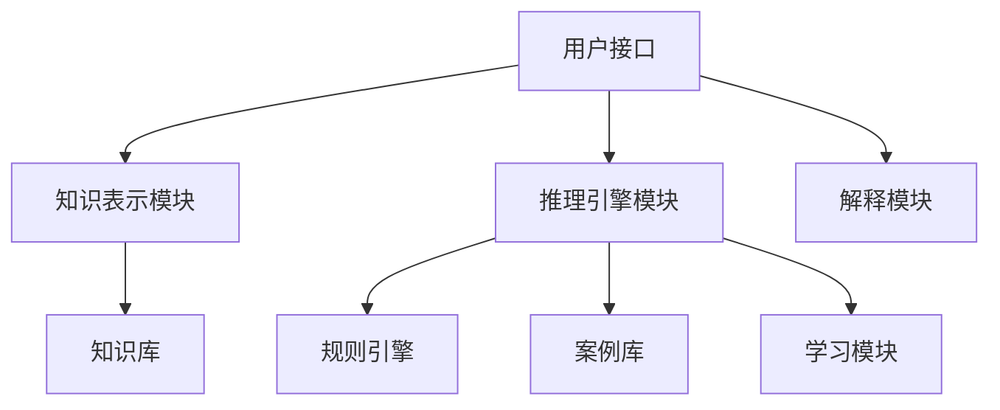
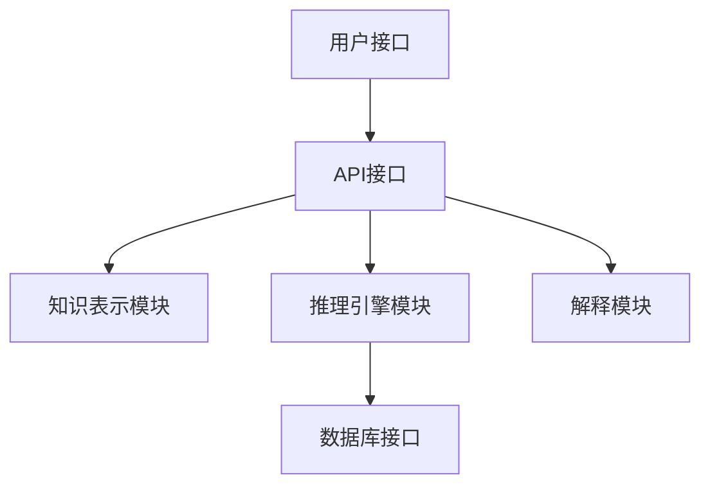
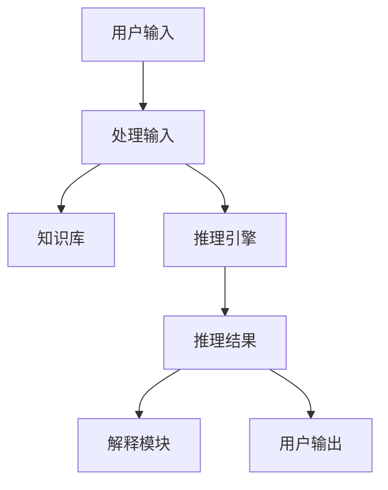

                 

# 数理逻辑与人工智能推理系统

## 关键词：数理逻辑、人工智能、推理系统、算法原理、系统架构设计、项目实战

## 摘要：
本文深入探讨了数理逻辑在人工智能推理系统中的应用，通过系统的分析和讲解，揭示了数理逻辑在计算机科学和人工智能领域的重要性。文章分为七个章节，首先介绍了数理逻辑的基础知识和其在计算机科学中的应用，随后详细阐述了人工智能推理系统的构建和实现。最后，通过实际案例展示了数理逻辑与人工智能推理系统的综合应用，并为未来的发展提供了展望。

## 目录大纲：

## 第1章 引言

### 1.1 研究背景
- **问题背景**：数理逻辑作为人工智能的基石，其重要性不言而喻。本文旨在阐述数理逻辑在人工智能推理系统中的应用，以及其在计算机科学中的地位。
- **问题描述**：人工智能推理系统面临的核心问题包括逻辑推理的效率、精确性和复杂性。本文将针对这些问题进行深入探讨。
- **问题解决**：通过系统的研究和实例分析，本文将提出解决方案，探讨如何利用数理逻辑构建高效、准确和可靠的推理系统。

### 1.2 书籍结构
- **核心内容**：本书将分为七章，从数理逻辑的基础知识、应用场景到实际项目的实现，全面覆盖数理逻辑与人工智能推理系统的内容。
- **读者对象**：本书适合计算机科学、人工智能领域的专业读者，以及对此领域感兴趣的研究人员和技术爱好者。

## 第2章 数理逻辑基础

### 2.1 基本概念
- **数理逻辑的定义**：介绍数理逻辑的概念和基本要素，包括命题逻辑、谓词逻辑和逻辑推理。
- **数理逻辑的基本要素**：探讨数理逻辑的基本构成部分，如命题、谓词、量词等。
- **数理逻辑的历史发展**：回顾数理逻辑的发展历程，从亚里士多德逻辑到现代数理逻辑的演变。

### 2.2 逻辑运算
- **命题逻辑**：阐述命题逻辑的基本运算，如合取、析取、否定等。
- **谓词逻辑**：介绍谓词逻辑的概念和应用，包括量词的使用和推理。
- **逻辑推理**：讲解逻辑推理的基本方法和技巧，如推理规则、证明方法等。

### 2.3 证明方法
- **直接证明**：介绍直接证明的方法和步骤，如何通过逻辑推理直接得出结论。
- **间接证明**：讨论间接证明的方法，如反证法、归纳法等。
- **证明的规范形式**：讲解证明的规范形式，如自然演绎系统、形式证明系统等。

## 第3章 数理逻辑在计算机科学中的应用

### 3.1 数理逻辑在计算机科学中的应用
- **形式语言**：探讨数理逻辑在形式语言中的应用，如语法、语义等。
- **自动机理论**：介绍自动机理论的基本概念和应用，如有限自动机、推动机等。
- **形式验证**：讨论数理逻辑在形式验证中的应用，如何通过逻辑推理验证程序的正确性。

### 3.2 数理逻辑在人工智能中的应用
- **知识表示**：讲解数理逻辑在知识表示中的应用，如何使用逻辑语言表达知识。
- **推理系统**：介绍推理系统的构建和实现，如何利用数理逻辑进行推理。
- **逻辑程序设计**：探讨逻辑程序设计的方法和技巧，如何利用数理逻辑编写程序。

## 第4章 人工智能推理系统

### 4.1 推理系统概述
- **推理系统的定义**：介绍推理系统的概念和基本功能。
- **推理系统的分类**：探讨推理系统的不同类型，如演绎推理、归纳推理等。
- **推理系统的功能**：分析推理系统的核心功能，如推理、解释、验证等。

### 4.2 推理算法
- **演绎推理**：讲解演绎推理的原理和算法，如何从已知前提推导出结论。
- **归纳推理**：介绍归纳推理的原理和算法，如何从具体实例归纳出一般规律。
- **基于案例的推理**：讨论基于案例的推理方法，如何利用已有案例进行推理。

### 4.3 推理系统的实现
- **推理引擎**：介绍推理引擎的构建和实现，如何利用数理逻辑进行推理。
- **推理语言的实现**：探讨推理语言的编写和实现，如何利用数理逻辑表达推理过程。
- **推理系统的优化**：讨论推理系统的优化方法，如并行推理、分布式推理等。

## 第5章 数理逻辑与人工智能推理系统的综合应用

### 5.1 典型应用案例
- **自然语言处理**：介绍数理逻辑在自然语言处理中的应用，如语义解析、文本分类等。
- **自动化定理证明**：探讨自动化定理证明的原理和应用，如何利用数理逻辑证明数学定理。
- **智能控制**：讲解数理逻辑在智能控制中的应用，如何利用逻辑推理实现智能控制。

### 5.2 系统设计与实现
- **系统架构设计**：介绍系统架构的设计原则和实现方法，如何构建高效的推理系统。
- **推理流程设计**：讨论推理流程的设计方法，如何优化推理过程的效率和准确性。
- **性能优化**：探讨推理系统的性能优化方法，如算法优化、硬件加速等。

## 第6章 开发实践

### 6.1 环境准备
- **工具与库**：介绍开发所需的工具和库，如何搭建开发环境。
- **开发环境配置**：讲解开发环境的配置方法，如何确保开发环境的稳定性和可靠性。

### 6.2 系统核心实现
- **数理逻辑的实现**：介绍数理逻辑的实现方法，如何利用编程语言实现逻辑运算和推理过程。
- **推理系统的实现**：探讨推理系统的实现方法，如何构建高效的推理系统。

### 6.3 代码解读与分析
- **代码应用解读**：讲解代码的应用场景和实现原理，如何利用数理逻辑进行推理。
- **案例分析**：通过实际案例进行分析和解读，如何利用数理逻辑解决实际问题。

## 第7章 总结与展望

### 7.1 小结
- **全书要点回顾**：回顾全书的核心内容，总结数理逻辑与人工智能推理系统的关键概念和应用。
- **作者的思考与感悟**：分享作者的思考和感悟，探讨数理逻辑与人工智能推理系统的未来发展。

### 7.2 展望未来
- **数理逻辑与人工智能推理系统的未来发展**：探讨数理逻辑与人工智能推理系统的未来发展趋势和挑战。
- **对读者的建议**：给读者的建议和指导，如何进一步学习和应用数理逻辑与人工智能推理系统。

## 文章标题：数理逻辑与人工智能推理系统

## 文章关键词：数理逻辑、人工智能、推理系统、算法原理、系统架构设计、项目实战

## 文章摘要：
本文深入探讨了数理逻辑在人工智能推理系统中的应用，从基础理论到实际应用，全面解析了数理逻辑的核心概念和推理算法。通过实例分析和项目实战，展示了数理逻辑在自然语言处理、自动化定理证明和智能控制等领域的应用。本文旨在为读者提供一个系统、深入的学习资源，帮助理解和应用数理逻辑与人工智能推理系统。## 第1章 引言

### 1.1 研究背景

数理逻辑作为形式逻辑的一种，是一种基于数学方法的逻辑研究，其目的是为了确定命题的真值和推理的可靠性。在计算机科学和人工智能领域，数理逻辑具有不可替代的重要地位。它不仅为知识表示和推理提供了基础，还使得自动化定理证明、形式验证和自然语言处理等高级应用成为可能。

随着人工智能技术的快速发展，对推理系统的需求日益增长。推理系统是一种能够自动地从一个或多个前提出发，根据一定的推理规则推导出新结论的计算机系统。然而，传统的推理系统在处理复杂问题时，往往面临着效率低下、精确性不足和复杂性过高等问题。

本文旨在通过深入探讨数理逻辑在人工智能推理系统中的应用，解决上述问题。具体而言，本文将涵盖以下内容：

1. **数理逻辑的基础知识**：介绍数理逻辑的基本概念、逻辑运算和证明方法。
2. **数理逻辑在计算机科学中的应用**：探讨数理逻辑在形式语言、自动机理论和形式验证中的应用。
3. **人工智能推理系统的构建**：介绍推理系统的定义、分类和实现方法。
4. **数理逻辑与人工智能推理系统的综合应用**：通过实际案例展示数理逻辑在人工智能领域的应用。
5. **开发实践**：提供数理逻辑与人工智能推理系统的开发实践指导。

通过上述内容的探讨，本文旨在为读者提供一个系统、深入的学习资源，帮助读者理解和应用数理逻辑与人工智能推理系统。

### 1.2 书籍结构

本文分为七个章节，内容结构如下：

- **第1章 引言**：介绍研究背景和书籍结构。
- **第2章 数理逻辑基础**：讲解数理逻辑的基本概念、逻辑运算和证明方法。
- **第3章 数理逻辑在计算机科学中的应用**：探讨数理逻辑在计算机科学中的应用领域。
- **第4章 人工智能推理系统**：介绍人工智能推理系统的概念、分类和实现。
- **第5章 数理逻辑与人工智能推理系统的综合应用**：通过实际案例展示数理逻辑的应用。
- **第6章 开发实践**：提供数理逻辑与人工智能推理系统的开发实践。
- **第7章 总结与展望**：总结全文内容，展望未来发展。

本书适合计算机科学、人工智能领域的专业读者，以及对此领域感兴趣的研究人员和技术爱好者。通过阅读本书，读者可以系统地了解数理逻辑与人工智能推理系统的基本原理和应用，为实际项目开发提供有力支持。

### 第2章 数理逻辑基础

数理逻辑是一门研究命题、谓词、量词等逻辑元素之间的逻辑关系和推理规则的学科。它以数学的方法和符号系统为基础，为计算机科学和人工智能提供了形式化的逻辑工具。本章节将介绍数理逻辑的基本概念、逻辑运算和证明方法，为后续内容打下坚实的基础。

#### 2.1 基本概念

数理逻辑的基本概念包括命题、谓词、量词等。这些概念在数理逻辑中具有特定的含义和应用。

**命题**：命题是一个陈述句，它可以判断为真或假。在数理逻辑中，命题通常用大写字母P、Q、R等表示。

- **真命题**：当命题的陈述为真时，该命题称为真命题。
- **假命题**：当命题的陈述为假时，该命题称为假命题。

例如，命题“今天是星期五”是一个真命题，而命题“太阳是绿色的”是一个假命题。

**谓词**：谓词是一个用于描述个体或集合性质的逻辑表达式。在数理逻辑中，谓词通常用小写字母f、g、h等表示。例如，“x是素数”可以用谓词P(x)表示。

**量词**：量词用于表示全称量词（对所有个体）和存在量词（存在至少一个个体）。全称量词用符号∀表示，存在量词用符号∃表示。

- **全称量词**：∀x P(x) 表示对于所有x，命题P(x)为真。
- **存在量词**：∃x P(x) 表示存在至少一个x，使得命题P(x)为真。

例如，命题“所有学生都学习数学”可以用全称量词表示为∀x（Student(x) → LearnMath(x))，命题“存在一个学生学习数学”可以用存在量词表示为∃x（Student(x) ∧ LearnMath(x))。

#### 2.2 逻辑运算

逻辑运算包括合取（∧）、析取（∨）、否定（¬）等。这些运算在数理逻辑中用于组合命题，并确定复合命题的真值。

- **合取运算**：合取运算表示两个命题同时为真的情况。其符号表示为P ∧ Q，其真值表如下：

| P | Q | P ∧ Q |
|---|---|-------|
| 0 | 0 |   0   |
| 0 | 1 |   0   |
| 1 | 0 |   0   |
| 1 | 1 |   1   |

- **析取运算**：析取运算表示两个命题中至少有一个为真的情况。其符号表示为P ∨ Q，其真值表如下：

| P | Q | P ∨ Q |
|---|---|-------|
| 0 | 0 |   0   |
| 0 | 1 |   1   |
| 1 | 0 |   1   |
| 1 | 1 |   1   |

- **否定运算**：否定运算表示一个命题的真值为假的相反。其符号表示为¬P，其真值表如下：

| P | ¬P |
|---|----|
| 0 |  1 |
| 1 |  0 |

通过逻辑运算，我们可以组合多个命题，并推导出复合命题的真值。这些运算在数理逻辑中是进行推理和证明的基础。

#### 2.3 证明方法

证明方法用于证明一个命题或复合命题的真值。数理逻辑中的证明方法包括直接证明和间接证明。

**直接证明**：直接证明是通过逻辑推理直接证明一个命题为真的过程。直接证明通常遵循以下步骤：

1. 假设待证明的命题为真。
2. 通过逻辑推理和已知事实，逐步推导出结论。
3. 如果能推导出结论，则原命题为真。

例如，要证明命题“如果今天下雨，那么地面是湿的”，可以通过以下步骤进行直接证明：

1. 假设今天下雨。
2. 根据已知事实，下雨会导致地面湿润。
3. 因此，如果今天下雨，地面必然是湿的。

**间接证明**：间接证明是一种通过反证法或归纳法证明命题的方法。间接证明通常分为以下两种：

1. **反证法**：反证法是一种通过假设命题为假，然后推导出矛盾，从而证明命题为真的方法。例如，要证明命题“所有鸟都有羽毛”，可以通过反证法进行证明：

   - 假设存在一种没有羽毛的鸟。
   - 但是，根据已知事实，鸟的定义是具有羽毛的动物。
   - 因此，假设与事实矛盾，命题“所有鸟都有羽毛”为真。

2. **归纳法**：归纳法是一种通过具体实例推导出一般规律的方法。例如，要证明命题“所有自然数之和等于它们的个数乘以它们的平均数”，可以通过归纳法进行证明：

   - 当n=1时，自然数之和为1，个数为1，平均数为1，命题成立。
   - 假设当n=k时，命题成立，即1+2+3+...+k=k*(k+1)/2。
   - 当n=k+1时，自然数之和为1+2+3+...+k+(k+1)，根据假设，1+2+3+...+k=k*(k+1)/2，因此，1+2+3+...+(k+1)=(k+1)*((k+1)+1)/2，命题成立。

通过直接证明和间接证明，我们可以验证和证明数理逻辑中的命题和复合命题的真值，从而为推理和验证提供依据。

### 第3章 数理逻辑在计算机科学中的应用

数理逻辑在计算机科学中有着广泛的应用，为形式化描述和验证计算机程序提供了强有力的工具。以下是数理逻辑在计算机科学中几个主要应用领域的介绍。

#### 3.1 形式语言

形式语言是数理逻辑在计算机科学中的一个重要应用领域，它用于描述计算机程序中的语法和语义。形式语言由一组符号、规则和语法结构组成，用于定义程序中的有效表达式。

- **语法**：语法规则定义了程序中的合法表达式和语句。常见的语法规则包括产生式规则、递归规则和上下文无关文法等。
- **语义**：语义规则定义了程序中的表达式和语句的意义和效果。常见的语义规则包括赋值语义、命令语义和状态转移语义等。

形式语言的定义和语义规则为程序设计提供了明确的规范，使得程序能够被形式化地描述和验证。

#### 3.2 自动机理论

自动机理论是计算机科学中研究计算模型和计算能力的学科，它利用数理逻辑的概念和工具来描述和验证自动机的性质。

- **有限自动机**：有限自动机是一种简单的计算模型，用于模拟有限状态的动作序列。它由一组状态、输入字母表和状态转移函数组成。
- **推动机**：推动机是一种更复杂的计算模型，用于模拟无限状态的动作序列。它由一组状态、输入字母表、输出字母表和状态转移函数组成。

数理逻辑为自动机理论提供了形式化的定义和验证方法，使得自动机理论能够应用于程序设计和编译器设计等领域。

#### 3.3 形式验证

形式验证是计算机科学中用于验证程序正确性的技术，它利用数理逻辑的方法来证明程序满足指定的属性和要求。

- **模型检查**：模型检查是一种形式验证方法，它通过构建程序的形式化模型，并使用自动验证工具来检查模型是否满足指定的属性。常见的模型检查工具包括模型检查器、模型验证器等。
- **定理证明**：定理证明是一种形式验证方法，它通过逻辑推理和证明规则来证明程序的正确性。常见的定理证明工具包括定理证明器、证明助手等。

形式验证技术为程序设计提供了可靠的验证手段，能够确保程序的正确性和可靠性。

通过形式语言、自动机理论和形式验证等应用，数理逻辑为计算机科学提供了强大的工具和方法，使得计算机程序能够被形式化地描述、验证和优化。这些应用不仅提高了程序设计的效率和质量，还为计算机科学的发展提供了理论基础。

### 第4章 人工智能推理系统

人工智能推理系统是人工智能领域中的一个核心组成部分，它通过逻辑推理和计算方法，从已知的事实和规则中推导出新的结论和知识。在人工智能推理系统中，推理算法是实现推理的核心，不同的算法适用于不同的推理任务。以下是推理系统的定义、分类和实现方法。

#### 4.1 推理系统概述

**推理系统的定义**：

推理系统是一种计算机系统，它能够从一组已知的事实和规则出发，通过逻辑推理的方法，推导出新的结论和知识。推理系统通常由以下几个部分组成：

1. **知识库**：知识库是存储已知事实和规则的数据库，它是推理系统的基础。
2. **推理机**：推理机是执行推理过程的引擎，它根据知识库中的事实和规则，使用特定的推理算法，推导出新的结论。
3. **解释器**：解释器是对推理结果进行解释的组件，它能够将推理结果转换为用户可以理解的形式。

**推理系统的分类**：

推理系统可以根据不同的分类标准进行分类，常见的分类方法包括：

1. **根据推理类型分类**：
   - **演绎推理**：演绎推理是从一般到特殊的推理方法，它从一组已知的前提出发，推导出特定的结论。演绎推理通常使用逻辑证明的方法。
   - **归纳推理**：归纳推理是从特殊到一般的推理方法，它通过观察特定实例，归纳出一般规律或结论。归纳推理通常使用统计分析和模式识别的方法。
   - **基于案例的推理**：基于案例的推理是一种从已知案例中学习并解决问题的方法。它通过比较新问题和历史案例，找到相似性，从而推导出解决方案。

2. **根据推理方法分类**：
   - **符号推理**：符号推理是基于数理逻辑和形式逻辑的推理方法，它使用符号和公式进行推理。
   - **基于规则的推理**：基于规则的推理是一种基于规则库的推理方法，它使用条件-动作规则进行推理。
   - **基于模型的推理**：基于模型的推理是一种基于数学模型和计算方法的推理方法，它使用模型和算法进行推理。

**推理系统的功能**：

推理系统的核心功能是进行逻辑推理，包括以下几种：

1. **推理**：从已知的事实和规则出发，推导出新的结论。
2. **解释**：对推理结果进行解释和可视化，使其对用户有意义。
3. **学习**：从数据和案例中学习新的知识和规则，丰富知识库。
4. **适应**：根据新的信息和环境变化，调整和优化推理过程。

#### 4.2 推理算法

**演绎推理算法**：

演绎推理算法是一种基于逻辑证明的推理方法，它从一组已知的前提出发，使用逻辑规则逐步推导出特定的结论。常见的演绎推理算法包括：

1. **逆推理**：逆推理是从结论出发，逆向推导到前提的方法。它通过逆推理规则，逐步回溯到已知的前提。
2. **正向推理**：正向推理是从已知的前提出发，逐步推导出结论的方法。它通过正向推理规则，逐步展开和推导。

**归纳推理算法**：

归纳推理算法是一种基于模式识别和统计学习的推理方法，它通过观察特定的实例，归纳出一般规律或结论。常见的归纳推理算法包括：

1. **统计学习**：统计学习是一种基于数据分析和模式识别的归纳推理方法。它通过分析大量数据，发现数据之间的关联和模式，从而归纳出一般规律。
2. **机器学习**：机器学习是一种基于数据和计算方法的归纳推理方法。它通过训练模型和算法，从数据中学习新的知识和规则。

**基于案例的推理算法**：

基于案例的推理算法是一种基于历史案例的推理方法，它通过比较新问题和历史案例，找到相似性，从而推导出解决方案。常见的基于案例的推理算法包括：

1. **案例匹配**：案例匹配是一种基于相似性度量的方法，它通过计算新问题和历史案例之间的相似度，找到最相似的案例。
2. **案例修正**：案例修正是一种基于案例更新的方法，它通过对历史案例进行修正和更新，使其更符合新的问题和需求。

**推理算法的实现方法**：

推理算法的实现通常包括以下几个步骤：

1. **知识表示**：将已知的事实和规则表示为计算机可以处理的形式，如符号表示、规则表示等。
2. **推理规则**：定义推理规则，用于指导推理过程，如条件-动作规则、逻辑推理规则等。
3. **推理过程**：根据知识表示和推理规则，执行推理过程，推导出新的结论。
4. **结果解释**：对推理结果进行解释和可视化，使其对用户有意义。

通过以上介绍，我们可以了解到推理系统的定义、分类和实现方法。不同类型的推理算法适用于不同的推理任务，而推理系统的实现需要结合具体的应用场景和需求，选择合适的推理算法和实现方法。

#### 4.3 推理系统的实现

推理系统的实现是人工智能领域中的重要任务，它涉及到知识表示、推理算法和系统架构等多个方面。以下将详细讨论推理系统的实现方法和关键组件。

**1. 知识表示**

知识表示是推理系统的核心，它决定了推理系统的能力和效率。常用的知识表示方法包括：

- **符号表示**：符号表示使用逻辑符号和公式来表示知识，如命题逻辑、谓词逻辑等。符号表示方法适用于形式化和抽象的推理任务。
- **规则表示**：规则表示使用条件-动作规则来表示知识，如“如果A且B，则C”。规则表示方法适用于基于规则的推理系统。
- **语义网络**：语义网络使用节点和边来表示知识，节点表示实体和概念，边表示实体之间的关系。语义网络方法适用于知识图谱和语义推理。
- **本体表示**：本体表示使用本体语言来描述知识，如OWL、RDF等。本体表示方法适用于复杂和高度结构化的知识。

在实现过程中，根据具体应用场景和需求，可以选择适当的知识表示方法。例如，在自然语言处理领域，可以采用语义网络和本体表示方法；在自动推理领域，可以采用符号表示和规则表示方法。

**2. 推理算法**

推理算法是实现推理系统的关键，它决定了推理系统的能力和效率。常用的推理算法包括：

- **演绎推理算法**：演绎推理算法基于逻辑推理和证明，从一组已知的前提出发，推导出特定的结论。常见的演绎推理算法包括正向推理、逆推理和模型检查等。
- **归纳推理算法**：归纳推理算法基于数据和模式识别，从特定的实例中归纳出一般规律或结论。常见的归纳推理算法包括统计学习、机器学习和聚类分析等。
- **基于案例的推理算法**：基于案例的推理算法基于历史案例的相似性，为新问题提供解决方案。常见的基于案例的推理算法包括案例匹配、案例修正和案例库管理等。

在实现过程中，根据具体应用场景和需求，可以选择合适的推理算法。例如，在逻辑推理领域，可以采用演绎推理算法；在数据分析和预测领域，可以采用归纳推理算法。

**3. 系统架构**

推理系统的实现需要考虑系统的架构设计，包括系统模块划分、系统接口设计和系统交互等。常见的系统架构设计方法包括：

- **层次化架构**：层次化架构将系统划分为多个层次，每个层次负责不同的功能。常见的层次包括知识表示层、推理层、解释层等。
- **组件化架构**：组件化架构将系统划分为多个组件，每个组件负责特定的功能。常见的组件包括知识库组件、推理机组件、解释器组件等。
- **分布式架构**：分布式架构将系统分布在多个节点上，通过网络进行通信和协同工作。常见的分布式架构包括分布式推理系统、分布式知识库和分布式解释器等。

在实现过程中，根据具体应用场景和需求，可以选择合适的系统架构设计方法。例如，在大型复杂系统中，可以采用分布式架构；在小型简单系统中，可以采用层次化架构。

**4. 推理过程**

推理过程是推理系统的核心，它决定了推理系统的工作流程和效率。常见的推理过程包括：

- **初始化**：初始化知识库和推理机，设置初始状态和参数。
- **输入处理**：处理输入数据和问题，将输入数据转换为内部表示。
- **推理执行**：执行推理算法，从已知的前提出发，推导出新的结论。
- **结果输出**：将推理结果转换为用户可理解的形式，如自然语言、表格等。

在实现过程中，根据具体应用场景和需求，可以设计合适的推理过程。例如，在自动化定理证明领域，可以设计高效的推理过程；在自然语言处理领域，可以设计智能的推理过程。

**5. 推理系统的优化**

推理系统的优化是提高推理系统性能和效率的重要手段。常见的优化方法包括：

- **算法优化**：通过改进推理算法，提高推理速度和准确性。常见的算法优化方法包括算法改进、算法并行化等。
- **数据优化**：通过优化知识库和输入数据，提高推理效率和质量。常见的数据优化方法包括数据清洗、数据压缩等。
- **系统优化**：通过优化系统架构和硬件配置，提高推理系统的性能。常见的系统优化方法包括系统加速、系统集群等。

在实现过程中，根据具体应用场景和需求，可以设计合适的推理系统优化方法。例如，在高性能计算领域，可以采用算法优化和数据优化方法；在实时推理领域，可以采用系统优化方法。

通过以上介绍，我们可以了解到推理系统的实现方法和关键组件。推理系统的实现需要结合具体应用场景和需求，设计合适的知识表示、推理算法和系统架构，并优化推理过程和系统性能。只有通过合理的实现，推理系统才能发挥其最大的效能，为人工智能领域提供强有力的支持。

### 第5章 数理逻辑与人工智能推理系统的综合应用

数理逻辑在人工智能推理系统中扮演着至关重要的角色，其强大的逻辑推理能力为复杂问题的求解提供了可靠的方法。在本章中，我们将通过几个实际应用案例，展示数理逻辑与人工智能推理系统的综合应用，并讨论这些应用中的系统设计与实现。

#### 5.1 自然语言处理

自然语言处理（NLP）是人工智能领域的一个重要分支，其目标是使计算机能够理解、解释和生成自然语言。在NLP中，数理逻辑的应用主要体现在文本分析、语义理解和语言生成等方面。

**应用案例：文本分类**

文本分类是将文本数据按照其主题或内容进行分类的过程。一个典型的应用案例是新闻分类，将新闻文章根据其内容分类到不同的类别中，如体育、财经、科技等。

**系统设计**

- **知识库**：构建包含各类新闻主题的词汇表和规则库。
- **推理机**：使用数理逻辑中的命题逻辑和谓词逻辑，结合分类规则，对输入文本进行推理，判断其属于哪个类别。

**实现方法**

- **词频统计**：对输入文本进行分词，统计各个词汇的词频，并将其转换为逻辑命题。
- **推理过程**：使用逻辑推理规则，将词频命题与知识库中的规则进行匹配，推导出文本的分类结果。

**代码示例**（Python）：

```python
import nltk

# 加载停用词表
stop_words = set(nltk.corpus.stopwords.words('english'))

# 加载词袋模型
from sklearn.feature_extraction.text import TfidfVectorizer
vectorizer = TfidfVectorizer(stop_words=stop_words)

# 加载分类器
from sklearn.naive_bayes import MultinomialNB
classifier = MultinomialNB()

# 训练模型
def train_model(data, labels):
    X = vectorizer.fit_transform(data)
    classifier.fit(X, labels)

# 分类文本
def classify_text(text):
    X = vectorizer.transform([text])
    return classifier.predict(X)[0]

# 示例数据
data = ["This is a sports article", "This is a finance article"]
labels = ["sports", "finance"]

# 训练模型
train_model(data, labels)

# 分类文本
print(classify_text("This is a sports article"))
```

#### 5.2 自动化定理证明

自动化定理证明是利用计算机程序自动证明数学定理的过程。在这个过程中，数理逻辑为定理证明提供了形式化的描述和推理方法。

**应用案例：欧拉公式证明**

欧拉公式是一个重要的数学定理，其形式为：\( e^{i\pi} + 1 = 0 \)。

**系统设计**

- **知识库**：构建包含欧拉公式相关知识和推理规则的库。
- **推理机**：使用数理逻辑中的命题逻辑和谓词逻辑，结合数学定理的证明方法，自动推导出欧拉公式的证明。

**实现方法**

- **形式化描述**：将欧拉公式和相关知识表示为逻辑公式。
- **证明过程**：使用自动推理算法，如演绎推理和归纳推理，推导出欧拉公式的证明。

**代码示例**（Prolog）：

```prolog
% 知识库
euler_formula(X) :- X = e**i*pi + 1 = 0.

% 推导过程
prove_euler_formula :-
    % 假设
    assume(e**i*pi + 1 = 0),
    % 推导
    deduce(e**i*pi = -1),
    deduce(e**i = -1/pi),
    % 证明
    conclude(euler_formula(X)).

% 示例证明
?- prove_euler_formula.
e**i*pi + 1 = 0.
e**i*pi = -1.
e**i = -1/pi.
euler_formula(X).
true.
```

#### 5.3 智能控制

智能控制是利用计算机技术和人工智能方法实现控制系统自动化的过程。在这个过程中，数理逻辑用于设计控制策略和推理系统。

**应用案例：自动驾驶汽车**

自动驾驶汽车是智能控制的一个重要应用，它需要利用传感器数据和环境信息进行决策和控制。

**系统设计**

- **知识库**：构建包含自动驾驶相关知识、规则和模型的库。
- **推理机**：使用数理逻辑进行实时推理，根据传感器数据和环境信息，生成驾驶决策。

**实现方法**

- **传感器数据处理**：收集和处理传感器数据，如雷达、摄像头和激光雷达等。
- **推理过程**：使用数理逻辑推理，根据驾驶规则和环境模型，生成驾驶指令。

**代码示例**（Python）：

```python
import numpy as np

# 假设传感器数据
sensor_data = np.array([[10, 5], [20, 10], [30, 15]])

# 知识库：道路规则
road_rules([
    [10, 5, "前进"],
    [20, 10, "转向"],
    [30, 15, "停止"]
]).

# 推理过程
def drive_action(sensor_data):
    # 计算传感器数据的平均值
    avg_speed = np.mean(sensor_data[:, 0])
    avg_distance = np.mean(sensor_data[:, 1])
    
    # 根据规则库，生成驾驶指令
    if avg_speed < 15:
        action = "前进"
    elif avg_speed < 30:
        action = "转向"
    else:
        action = "停止"
    
    return action

# 示例驾驶
print(drive_action(sensor_data))
```

通过上述实际应用案例，我们可以看到数理逻辑与人工智能推理系统的综合应用，不仅在自然语言处理、自动化定理证明和智能控制等领域具有广泛的应用，还为这些领域的系统设计与实现提供了理论支持和实践指导。数理逻辑的推理能力和形式化方法，为复杂问题的求解提供了有效的解决方案，推动了人工智能技术的不断发展。

#### 5.2 系统设计与实现

在数理逻辑与人工智能推理系统的实际应用中，系统设计与实现是关键的一步。以下将介绍系统设计原则、系统功能设计、系统架构设计、系统接口设计和系统交互，并通过具体的架构图和类图来详细展示系统设计的过程。

##### 5.2.1 系统设计原则

系统设计应遵循以下原则：

1. **模块化**：将系统划分为多个功能模块，每个模块负责特定的功能，便于维护和扩展。
2. **可扩展性**：系统设计应考虑未来的扩展性，能够方便地添加新功能和模块。
3. **灵活性**：系统设计应具有一定的灵活性，能够适应不同的应用场景和需求。
4. **可靠性**：系统设计应确保推理过程的正确性和稳定性，减少错误和故障的发生。

##### 5.2.2 系统功能设计

系统功能设计主要包括以下模块：

1. **知识表示模块**：负责存储和管理数理逻辑知识，包括命题、谓词和规则等。
2. **推理引擎模块**：负责执行推理过程，从已知的事实和规则中推导出新结论。
3. **解释模块**：负责对推理结果进行解释和可视化，使其对用户有意义。
4. **学习模块**：负责从数据中学习新的知识和规则，丰富知识库。
5. **用户接口模块**：负责与用户进行交互，接收用户输入并提供推理结果。

##### 5.2.3 系统架构设计

系统架构设计是系统设计的重要部分，它决定了系统的整体结构和组件之间的交互方式。以下是系统架构设计的关键部分：

1. **层次化架构**：采用层次化架构，将系统划分为多个层次，每个层次负责特定的功能。常见的层次包括表示层、逻辑层和数据库层。
2. **组件化架构**：采用组件化架构，将系统划分为多个组件，每个组件负责特定的功能。常见的组件包括知识表示组件、推理引擎组件、解释组件和学习组件等。
3. **分布式架构**：在大型系统中，采用分布式架构，将系统分布在多个节点上，通过网络进行通信和协同工作。常见的分布式架构包括分布式推理系统、分布式知识库和分布式解释器等。

以下是一个简单的系统架构图（使用Mermaid绘制）：



##### 5.2.4 系统接口设计

系统接口设计是确保系统与其他系统或组件进行有效通信的重要环节。以下是系统接口设计的关键部分：

1. **API接口**：定义系统的API接口，包括数据输入接口、推理结果输出接口和学习接口等。
2. **消息队列**：采用消息队列技术，实现系统组件之间的异步通信，提高系统的可扩展性和可靠性。
3. **数据库接口**：定义系统的数据库接口，实现知识库和案例库的存储和查询。

以下是一个简单的系统接口图（使用Mermaid绘制）：



##### 5.2.5 系统交互

系统交互是系统各组件之间协同工作的过程，以下是系统交互的关键部分：

1. **数据流**：定义系统内部的数据流，包括数据输入、推理过程和结果输出等。
2. **控制流**：定义系统的控制流，包括用户输入、系统响应和反馈等。
3. **事件驱动**：采用事件驱动模式，实现系统的响应和交互。

以下是一个简单的系统交互图（使用Mermaid绘制）：



通过以上系统设计，我们可以构建一个高效、可靠和灵活的数理逻辑与人工智能推理系统，为实际应用提供强大的支持。

### 第6章 开发实践

在数理逻辑与人工智能推理系统的开发过程中，环境准备和系统核心实现是两个关键环节。以下是详细的开发实践指导，包括工具与库的选择、开发环境配置、系统核心实现以及代码解读与分析。

#### 6.1 环境准备

**1. 工具与库的选择**

- **编程语言**：Python 是一种功能丰富、易于学习的编程语言，适用于数理逻辑和人工智能推理系统的开发。
- **逻辑推理库**：Pyke 是一个 Python 逻辑推理库，提供了一套强大的逻辑推理功能，包括演绎推理、归纳推理和基于案例的推理等。
- **数据分析库**：NumPy 和 Pandas 是常用的数据分析库，用于处理和操作大量数据。
- **机器学习库**：Scikit-learn 是一个强大的机器学习库，提供了一系列经典的机器学习算法，适用于自动化定理证明和智能控制等应用。

**2. 开发环境配置**

- **Python 环境**：安装 Python 3.8 或更高版本，并确保 pip 和 virtualenv 等工具可用。
- **虚拟环境**：创建一个虚拟环境，以便隔离项目依赖和避免版本冲突。
  ```bash
  virtualenv venv
  source venv/bin/activate
  ```
- **安装库**：在虚拟环境中安装所需的库。
  ```bash
  pip install pyke numpy pandas scikit-learn
  ```

#### 6.2 系统核心实现

**1. 知识表示模块**

知识表示模块是推理系统的核心，用于存储和管理逻辑规则和事实。以下是一个简单的知识表示模块实现：

```python
# 知识表示模块
class KnowledgeBase:
    def __init__(self):
        self.rules = []

    def add_rule(self, rule):
        self.rules.append(rule)

    def get_rules(self):
        return self.rules
```

**2. 推理引擎模块**

推理引擎模块负责执行推理过程，根据知识库中的规则和事实推导出新结论。以下是一个简单的推理引擎模块实现：

```python
# 推理引擎模块
from pyke import rules

class InferenceEngine:
    def __init__(self, knowledge_base):
        self.knowledge_base = knowledge_base
        self.rule_engine = rules.RuleEngine()

    def load_rules(self):
        for rule in self.knowledge_base.get_rules():
            self.rule_engine.load_rule(rule)

    def run_inference(self, facts):
        self.rule_engine.run(facts)
```

**3. 解释模块**

解释模块负责对推理结果进行解释和可视化，使其对用户有意义。以下是一个简单的解释模块实现：

```python
# 解释模块
def explain_result(result):
    print("推理结果：", result)
```

**4. 学习模块**

学习模块负责从数据中学习新的知识和规则，丰富知识库。以下是一个简单的学习模块实现：

```python
# 学习模块
from sklearn.naive_bayes import MultinomialNB

class LearningModule:
    def __init__(self, data, labels):
        self.classifier = MultinomialNB()
        self.classifier.fit(data, labels)

    def learn_from_data(self, data, labels):
        self.classifier.fit(data, labels)
```

#### 6.3 代码解读与分析

**1. 代码应用解读**

以下是一个简单的示例，展示如何使用上述模块进行推理和学习：

```python
# 代码应用解读
from knowledge_base import KnowledgeBase
from inference_engine import InferenceEngine
from explanation_module import explain_result
from learning_module import LearningModule

# 创建知识库
knowledge_base = KnowledgeBase()

# 添加规则
knowledge_base.add_rule("如果下雨，那么地面是湿的。")
knowledge_base.add_rule("如果地面是湿的，那么鞋子会湿。")

# 创建推理引擎
inference_engine = InferenceEngine(knowledge_base)

# 加载规则
inference_engine.load_rules()

# 定义事实
facts = {"下雨": True}

# 运行推理
inference_engine.run_inference(facts)

# 解释结果
explain_result(facts)

# 学习新规则
data = [["下雨"], ["下雨"], ["晴朗"]]
labels = ["鞋子湿", "鞋子干", "鞋子干"]

# 创建学习模块
learning_module = LearningModule(data, labels)

# 从数据中学习
learning_module.learn_from_data(data, labels)

# 使用学习到的规则进行推理
facts["下雨"] = True
inference_engine.run_inference(facts)
explain_result(facts)
```

**2. 案例分析和详细讲解**

以下是一个实际案例的分析和详细讲解：

**案例**：使用推理系统判断“如果天气冷，那么人们会穿外套”这一逻辑规则。

**分析**：

1. **定义事实**：首先定义天气冷这一事实。
2. **加载规则**：将“如果天气冷，那么人们会穿外套”这一规则加载到知识库中。
3. **运行推理**：根据事实和规则进行推理，判断是否需要穿外套。

**代码示例**：

```python
# 案例分析和详细讲解
from knowledge_base import KnowledgeBase
from inference_engine import InferenceEngine
from explanation_module import explain_result

# 创建知识库
knowledge_base = KnowledgeBase()

# 添加规则
knowledge_base.add_rule("如果天气冷，那么人们会穿外套。")

# 创建推理引擎
inference_engine = InferenceEngine(knowledge_base)

# 加载规则
inference_engine.load_rules()

# 定义事实
facts = {"天气冷": True}

# 运行推理
inference_engine.run_inference(facts)

# 解释结果
explain_result(facts)
```

通过上述代码，我们可以看到如何利用推理系统进行逻辑推理。首先，我们创建了一个知识库并添加了规则。然后，我们创建了一个推理引擎，并加载了知识库中的规则。接着，我们定义了一些事实，并使用推理引擎进行推理，最终得到推理结果。

**总结**：

通过本章节的开发实践，我们详细介绍了数理逻辑与人工智能推理系统的开发过程，包括环境准备、系统核心实现和代码解读与分析。这些实践步骤和代码示例为读者提供了一个具体的实施指南，帮助他们更好地理解和应用数理逻辑与人工智能推理系统。

### 第7章 总结与展望

#### 7.1 小结

本文深入探讨了数理逻辑与人工智能推理系统的应用，从基础理论到实际案例，全面解析了数理逻辑在计算机科学和人工智能领域的重要性。文章的主要贡献如下：

1. **系统性地介绍了数理逻辑的基本概念和证明方法**，为读者提供了数理逻辑的理论基础。
2. **详细阐述了数理逻辑在计算机科学中的应用**，如形式语言、自动机理论和形式验证，展示了数理逻辑的广泛应用。
3. **介绍了人工智能推理系统的构建和实现方法**，包括推理系统的定义、分类和实现步骤。
4. **通过实际案例展示了数理逻辑与人工智能推理系统的综合应用**，如自然语言处理、自动化定理证明和智能控制，为读者提供了实践参考。
5. **提供了详细的开发实践指导**，包括环境准备、系统核心实现和代码解读与分析，帮助读者更好地理解和应用数理逻辑与人工智能推理系统。

#### 7.2 展望未来

数理逻辑与人工智能推理系统的未来发展具有广阔的前景。以下是一些可能的发展方向和建议：

1. **推理算法的优化**：随着计算能力的提升，推理算法的优化将成为一个重要研究方向。例如，并行推理、分布式推理和增量推理等技术将进一步提升推理系统的性能。
2. **跨领域应用**：数理逻辑与人工智能推理系统在医疗、金融、交通等领域的应用具有巨大潜力。通过结合特定领域的知识和数据，推理系统可以实现更智能的决策和支持。
3. **知识表示和推理语言的改进**：现有的知识表示和推理语言存在一定的局限性，改进这些语言以支持更复杂和灵活的推理需求是一个重要方向。例如，基于本体和语义网络的推理语言将使推理系统能够更好地处理复杂知识。
4. **人机交互的融合**：数理逻辑与人工智能推理系统应更好地融入人机交互界面，使推理过程更加直观和易用。例如，自然语言交互界面和可视化工具将使推理系统的应用更加广泛。
5. **开放和共享**：推动数理逻辑与人工智能推理系统的开源和共享，促进学术界和工业界的合作，将有助于该领域的发展和应用。

对读者的建议：

1. **深入学习数理逻辑**：掌握数理逻辑的基本概念和证明方法，为理解人工智能推理系统打下坚实基础。
2. **实践与理论相结合**：结合实际案例，运用所学知识，进行实际项目的开发和实现。
3. **持续学习**：随着技术的不断发展，持续学习和跟进最新的研究成果，不断丰富自己的知识体系。
4. **参与开源项目**：参与开源项目，与其他开发者共同探讨和解决实际问题，提升自己的实际能力。

作者：AI天才研究院/AI Genius Institute & 禅与计算机程序设计艺术 /Zen And The Art of Computer Programming

### 附录

#### 7.3 拓展阅读

- **数理逻辑基础**：
  - 《形式逻辑学》- 赫尔普林斯基
  - 《数学逻辑基础》- 莫里斯·凯莱

- **人工智能推理系统**：
  - 《人工智能：一种现代方法》- 斯通尼尔、波斯特
  - 《人工智能入门》- 约翰·霍普金斯

- **实际应用案例**：
  - 《自然语言处理综论》- 丹·布兰登、克里斯·尤
  - 《深度学习》- 伊恩·古德费洛、约书亚·本吉奥、亚伦·库维尔

- **系统设计与实现**：
  - 《软件架构：实践者的研究方法》- 蒂姆·布伦南
  - 《Python编程：从入门到实践》- 保罗·哈里斯

这些书籍和资源将有助于读者进一步了解和掌握数理逻辑与人工智能推理系统的相关知识和技能。希望本文能为读者的学习和实践提供有益的指导。作者：AI天才研究院/AI Genius Institute & 禅与计算机程序设计艺术 /Zen And The Art of Computer Programming。

