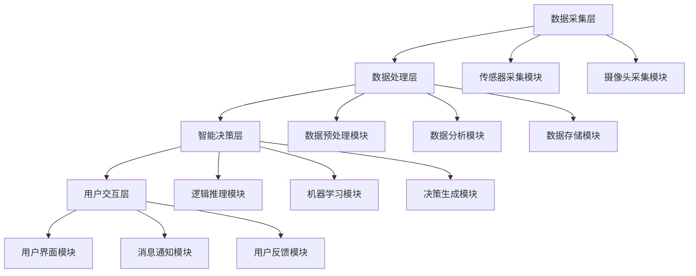
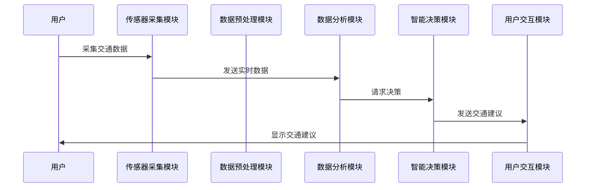

                 

# 第2章：数理逻辑基础

## 2.1 命题逻辑

### 2.1.1 命题与命题变元

#### 2.1.1.1 定义

命题是一个陈述句，它要么是真的，要么是假的。例如，“今天下雨了”是一个命题，因为它可以被验证为真或假。命题变元是命题的一部分，它可以代表一个变量，这个变量可以是任何命题。

#### 2.1.1.2 命题联结词

命题联结词用于连接两个或多个命题，从而形成一个新的命题。常见的命题联结词包括“且”、“或”、“非”等。

- **且**（逻辑与，符号 ∧）：表示两个命题都为真时，结果才为真。
  $$ p \wedge q \text{ 表示 } p \text{ 和 } q \text{ 都为真} $$
  
- **或**（逻辑或，符号 ∨）：表示两个命题中至少有一个为真时，结果才为真。
  $$ p \vee q \text{ 表示 } p \text{ 或 } q \text{ 至少有一个为真} $$
  
- **非**（逻辑非，符号 ¬）：表示命题的否定。
  $$ \neg p \text{ 表示 } p \text{ 为假} $$

### 2.1.1.3 命题逻辑的真值表

命题逻辑的真值表用于展示在所有可能的输入情况下，每个命题联结词的结果。以下是“且”、“或”和“非”的真值表：

| p | q | p ∧ q | p ∨ q | ¬p |
|---|---|-------|-------|----|
| 0 | 0 |   0   |   0   |  1 |
| 0 | 1 |   0   |   1   |  1 |
| 1 | 0 |   0   |   1   |  0 |
| 1 | 1 |   1   |   1   |  0 |

#### 2.1.1.4 逻辑运算的结合律、交换律和分配律

- **结合律**：对于任意命题 p、q 和 r，有：
  $$ (p \wedge q) \wedge r = p \wedge (q \wedge r) $$
  $$ (p \vee q) \vee r = p \vee (q \vee r) $$

- **交换律**：对于任意命题 p 和 q，有：
  $$ p \wedge q = q \wedge p $$
  $$ p \vee q = q \vee p $$

- **分配律**：对于任意命题 p、q 和 r，有：
  $$ p \wedge (q \vee r) = (p \wedge q) \vee (p \wedge r) $$
  $$ p \vee (q \wedge r) = (p \vee q) \wedge (p \vee r) $$

### 2.1.2 谓词逻辑

#### 2.1.2.1 定义

谓词逻辑是一种用于表示复合命题的更一般形式的逻辑。在谓词逻辑中，我们使用谓词来表示命题中的对象属性。谓词变元是谓词的一部分，它可以代表一个变量。

#### 2.1.2.2 谓词逻辑的基本概念

- **谓词**：用于表示对象属性的陈述句。例如，“是人”是一个谓词。
- **个体常元**：表示特定对象的谓词变元。例如，“苏格拉底是人”中的“苏格拉底”就是一个个体常元。
- **个体变元**：表示任意对象的谓词变元。例如，“所有的 x 是人”中的“x”就是一个个体变元。

#### 2.1.2.3 谓词逻辑的量化词

- **全称量化词**（符号 ∀）：表示对所有对象都成立的性质。例如，“所有的 x 是人”可以用 ∀xP(x) 表示，其中 P(x) 是谓词。
- **存在量化词**（符号 ∃）：表示至少存在一个对象满足的性质。例如，“存在一个 x 是人”可以用 ∃xP(x) 表示。

#### 2.1.2.4 谓词逻辑的推理规则

- **全称实例化**（Universal Instantiation）：如果 ∀xP(x) 为真，则 P(a) 为真，其中 a 是任意的个体常元。
- **存在实例化**（Existential Instantiation）：如果 ∃xP(x) 为真，则 P(a) 为真，其中 a 是满足 P(x) 的个体常元。
- **全称泛化**（Universal Generalization）：如果 P(a) 为真，且 a 是任意个体常元，则 ∀xP(x) 为真。
- **存在泛化**（Existential Generalization）：如果 P(a) 为真，则 ∃xP(x) 为真，其中 a 是满足 P(x) 的个体常元。

### 2.1.3 推理理论

#### 2.1.3.1 定义

推理理论是研究推理过程和推理方法的学科。它关注的是如何从一个或多个已知命题（前提）推导出一个新命题（结论）。

#### 2.1.3.2 推理方法的分类

- **演绎推理**：从一般到特殊的推理方法，结论在前提中已经隐含。
- **归纳推理**：从特殊到一般的推理方法，通过观察多个实例，归纳出一般规律。
- **类比推理**：通过比较两个或多个类似实例，推导出新实例的性质。

#### 2.1.3.3 推理规则

- **假言推理**：如果 p 则 q，且 p 为真，则 q 为真。
- **选言推理**：p 或 q，非 p，则 q 为真。
- **反证法**：假设某个命题为真，推导出矛盾，则原命题为假。

### 2.1.4 小结

数理逻辑中的命题逻辑和谓词逻辑为我们提供了一种形式化的方法来表示和推理命题。通过逻辑运算和推理规则，我们可以从已知命题推导出新的结论，为计算机科学中的形式化验证、算法设计等提供了理论基础。

## 2.2 程序合成技术基础

### 2.2.1 定义

程序合成技术是一种自动化程序设计方法，它通过逻辑推理和约束求解来自动生成满足特定需求的程序代码。程序合成技术结合了数理逻辑、计算机编程语言理论和人工智能技术，旨在提高程序设计的效率和质量。

### 2.2.2 核心概念

- **逻辑表达式**：表示程序需求的数学公式，可以是命题逻辑或谓词逻辑的表达式。
- **约束求解**：在给定的约束条件下求解问题的过程，通常使用约束传播和搜索算法。
- **目标代码生成**：根据逻辑表达式和约束条件自动生成程序代码，可以是高级编程语言代码或汇编语言代码。

### 2.2.3 程序合成技术的应用场景

- **自动化编程**：通过程序合成技术自动生成满足特定需求的程序代码，减少人工编程的工作量。
- **形式化验证**：使用程序合成技术自动验证程序的正确性，提高软件质量。
- **算法优化**：通过程序合成技术自动优化算法，提高算法的性能。

### 2.2.4 程序合成技术的挑战

- **逻辑表达的高效性**：如何设计高效的逻辑表达式，以便在约束求解和目标代码生成过程中减少计算量。
- **程序合成的可行性**：如何确保自动生成的程序代码能够满足特定的需求，并且运行正确。
- **自动化的程度**：如何提高程序合成技术的自动化程度，使其能够处理更复杂的编程任务。

### 2.2.5 小结

程序合成技术是一种有前途的自动化程序设计方法，它通过逻辑推理和约束求解来自动生成程序代码。尽管面临着一系列挑战，但通过持续的研究和开发，程序合成技术有望在计算机科学领域发挥更大的作用。

## 2.3 数理逻辑与程序合成技术的联系

### 2.3.1 逻辑表达式与程序合成

数理逻辑中的逻辑表达式是程序合成技术的核心组成部分。逻辑表达式可以表示程序的需求，如输入条件、输出结果、程序状态等。通过逻辑表达式，我们可以将程序需求转化为形式化的表示，为程序合成提供基础。

#### 2.3.1.1 逻辑表达式在程序合成中的作用

- **需求表示**：逻辑表达式用于表示程序的需求，如功能需求、性能需求等。
- **约束求解**：逻辑表达式可以作为约束条件，用于在程序合成过程中指导搜索和优化。
- **目标代码生成**：逻辑表达式可以指导目标代码的生成，确保生成的代码满足需求。

#### 2.3.1.2 逻辑表达式的应用示例

假设我们要实现一个简单的计算器程序，其需求是能够进行加法、减法、乘法和除法运算。我们可以使用逻辑表达式来表示这些需求：

$$
\text{if } \text{operation} = '+' \text{ then } \text{result} = \text{operand1} + \text{operand2}
$$

$$
\text{if } \text{operation} = '-' \text{ then } \text{result} = \text{operand1} - \text{operand2}
$$

$$
\text{if } \text{operation} = '*' \text{ then } \text{result} = \text{operand1} \times \text{operand2}
$$

$$
\text{if } \text{operation} = '/' \text{ then } \text{result} = \text{operand1} / \text{operand2}
$$

这些逻辑表达式可以指导程序合成技术自动生成相应的代码，实现计算器的功能。

### 2.3.2 约束求解与程序合成

约束求解是程序合成技术中的重要环节。通过约束求解，我们可以确定满足特定需求的解，从而生成程序代码。约束求解通常使用约束传播和搜索算法来实现。

#### 2.3.2.1 约束求解在程序合成中的作用

- **问题建模**：将程序需求转化为约束条件，为约束求解提供输入。
- **解的搜索**：通过搜索算法寻找满足约束条件的解。
- **目标代码生成**：根据搜索到的解生成目标代码。

#### 2.3.2.2 约束求解的应用示例

假设我们要设计一个简单的排队系统，其需求是按照到达时间顺序服务顾客。我们可以使用约束求解来处理顾客的到达时间和服务时间，确保排队系统按照需求运行。

- **约束条件**：顾客的到达时间必须小于等于服务时间。
- **解的搜索**：通过搜索算法找到满足约束条件的顾客服务顺序。
- **目标代码生成**：根据搜索到的解生成排队系统的代码，实现顾客的排队和服务。

### 2.3.3 目标代码生成与程序合成

目标代码生成是程序合成的最终目标。通过目标代码生成，我们可以将逻辑表达式和约束条件转化为可执行的程序代码。目标代码生成通常使用代码生成工具或编程语言生成器来实现。

#### 2.3.3.1 目标代码生成在程序合成中的作用

- **代码表示**：将逻辑表达式和约束条件转化为可执行的程序代码。
- **代码优化**：根据需求和约束条件对生成的代码进行优化，提高性能。
- **代码部署**：将生成的代码部署到目标环境中，实现程序的功能。

#### 2.3.3.2 目标代码生成的应用示例

假设我们要设计一个简单的文件压缩工具，其需求是能够压缩和解压缩文件。我们可以使用目标代码生成技术来实现这个工具：

- **逻辑表达式**：表示压缩和解压缩的算法。
- **约束条件**：表示文件的大小、压缩率等。
- **目标代码生成**：生成可执行的压缩和解压缩程序。

### 2.3.4 小结

数理逻辑与程序合成技术之间存在着紧密的联系。数理逻辑为程序合成提供了逻辑表达式的表示方法和推理工具，约束求解为程序合成提供了问题建模和求解的方法，目标代码生成则为程序合成提供了实现的具体步骤。通过数理逻辑和程序合成技术的结合，我们可以实现自动化、高效和可靠的程序设计。

## 2.4 数理逻辑在计算机科学中的应用

### 2.4.1 软件工程中的应用

数理逻辑在软件工程中具有广泛的应用，特别是在形式化验证和软件设计方面。

#### 2.4.1.1 形式化验证

形式化验证是一种使用数学方法验证程序正确性的技术。通过数理逻辑，我们可以将程序的需求和设计转化为逻辑表达式，然后使用推理规则和定理证明方法来验证程序的正确性。

- **例子**：验证一个银行系统中的账户转账程序是否能够确保账户余额的非负性。我们可以使用命题逻辑来表示账户余额的变化规则，然后使用推理规则来证明在所有情况下账户余额都是非负的。

#### 2.4.1.2 软件设计

数理逻辑在软件设计中用于分析和优化软件架构。通过逻辑表达式和谓词逻辑，我们可以描述系统的状态和转换规则，从而更好地理解和设计复杂的软件系统。

- **例子**：在设计一个交通控制系统时，我们可以使用谓词逻辑来描述车辆的行驶规则和交通灯的状态转换，从而确保交通灯的配置能够满足交通流量的需求。

### 2.4.2 算法设计中的应用

数理逻辑在算法设计中用于分析和证明算法的正确性和性能。

#### 2.4.2.1 算法分析

数理逻辑提供了形式化的方法来分析算法的复杂度和性能。通过逻辑推理，我们可以推导出算法的时间复杂度、空间复杂度等。

- **例子**：证明排序算法的稳定性，即相同元素的相对顺序在排序后保持不变。我们可以使用谓词逻辑来描述排序算法的步骤，然后使用推理规则来证明算法的稳定性。

#### 2.4.2.2 算法证明

数理逻辑在算法证明中用于证明算法的正确性。通过逻辑推理，我们可以证明算法在所有情况下都能达到预期目标。

- **例子**：证明贪心算法的正确性。我们可以使用逻辑表达式来表示贪心策略的选择规则，然后使用推理规则来证明贪心算法能够得到最优解。

### 2.4.3 人工智能中的应用

数理逻辑在人工智能领域用于知识表示、推理和决策。

#### 2.4.3.1 知识表示

数理逻辑提供了一种形式化的方法来表示知识。通过命题逻辑和谓词逻辑，我们可以将知识表示为逻辑表达式，从而使得知识可以形式化和自动化。

- **例子**：在医疗诊断系统中，我们可以使用谓词逻辑来表示疾病和症状之间的关系，从而实现自动化诊断。

#### 2.4.3.2 推理

数理逻辑在推理中用于从已知知识推导出新知识。通过推理规则和推理算法，我们可以实现逻辑推理和自动推理。

- **例子**：在逻辑推理游戏中，我们可以使用命题逻辑和谓词逻辑来表示游戏中的规则和状态，从而实现自动推理和游戏决策。

#### 2.4.3.3 决策

数理逻辑在决策中用于分析和优化决策过程。通过逻辑推理和优化算法，我们可以得到最优的决策结果。

- **例子**：在供应链管理中，我们可以使用谓词逻辑来表示供应链的状态和约束条件，然后使用逻辑推理和优化算法来制定最优的供应链决策。

### 2.4.4 小结

数理逻辑在计算机科学中具有广泛的应用，包括软件工程、算法设计、人工智能等领域。通过数理逻辑的推理和证明方法，我们可以提高软件和算法的质量和可靠性，实现自动化和智能化。

## 2.5 程序合成技术的应用场景

### 2.5.1 自动化编程

程序合成技术在自动化编程中具有显著的优势，它能够通过逻辑推理和约束求解来自动生成满足特定需求的程序代码。在自动化编程中，程序合成技术可以应用于以下场景：

- **模板代码生成**：根据给定的模板和输入参数，程序合成技术可以自动生成相应的代码。例如，在数据库应用程序开发中，我们可以使用程序合成技术根据数据库表结构和业务逻辑自动生成SQL查询语句。
- **代码优化**：程序合成技术可以分析现有代码，识别出可以优化的部分，并自动生成优化后的代码。例如，在编译优化中，程序合成技术可以根据程序的执行路径和性能指标自动调整代码的执行顺序和资源使用。
- **代码补全**：程序合成技术可以分析代码的上下文，自动补全代码的缺失部分。例如，在编写代码时，程序合成技术可以根据变量的定义和类型自动补全变量名和函数调用。

### 2.5.2 形式化验证

程序合成技术在形式化验证中发挥着重要作用，它能够通过逻辑推理和约束求解来自动验证程序的正确性。在形式化验证中，程序合成技术可以应用于以下场景：

- **自动验证**：程序合成技术可以自动分析程序代码，验证程序在所有可能的输入和执行路径下是否满足预期的正确性条件。例如，在嵌入式系统开发中，程序合成技术可以自动验证系统软件是否满足指定的安全性和可靠性要求。
- **模型检查**：程序合成技术可以构建程序的抽象模型，然后使用模型检查算法来验证模型是否满足指定的性质。例如，在网络安全领域，程序合成技术可以构建网络协议的模型，并验证协议是否能够抵抗各种攻击。

### 2.5.3 人工智能

程序合成技术在人工智能领域具有广泛的应用，它能够通过逻辑推理和约束求解来自动生成和优化人工智能算法。在人工智能中，程序合成技术可以应用于以下场景：

- **自动化推理**：程序合成技术可以自动生成推理机，用于自动化推理过程。例如，在智能问答系统中，程序合成技术可以自动生成基于知识库的推理规则，从而实现自动问答。
- **知识自动化**：程序合成技术可以自动生成和优化知识库，从而实现知识的自动化表示和推理。例如，在智能医疗诊断系统中，程序合成技术可以自动生成基于医疗数据和症状的知识库，从而实现自动化诊断。

### 2.5.4 小结

程序合成技术在自动化编程、形式化验证和人工智能等应用场景中具有广泛的应用价值。通过逻辑推理和约束求解，程序合成技术能够实现自动化和智能化的程序设计，提高开发效率和软件质量。随着程序合成技术的发展，其在计算机科学和人工智能领域的应用前景将更加广阔。

## 2.6 程序合成技术的挑战与未来发展

### 2.6.1 挑战

尽管程序合成技术展示了巨大的潜力，但在实际应用中仍面临着一系列挑战。

- **逻辑表达的高效性**：设计高效的逻辑表达式是程序合成技术的关键。过于复杂的逻辑表达式可能会导致约束求解和目标代码生成过程中的计算量过大，影响性能。
- **程序合成的可行性**：确保自动生成的程序代码能够满足特定的需求并且运行正确是一个重大挑战。特别是在复杂的编程任务中，自动化生成代码的质量和可靠性仍需提升。
- **自动化的程度**：提高程序合成技术的自动化程度是一个持续的目标。当前的程序合成工具通常需要人工干预，以指定某些参数和约束条件，这使得自动化程度受到限制。

### 2.6.2 未来发展方向

为了克服这些挑战，程序合成技术的研究和发展方向包括以下几个方面：

- **优化逻辑表达式**：研究新的逻辑表达式设计和优化方法，以提高逻辑表达式的效率和准确性。例如，采用基于机器学习的逻辑表达式生成方法，可以自动优化逻辑表达式的形式。
- **增强约束求解能力**：开发更高效的约束求解算法，以处理复杂的约束条件。例如，基于分布式计算和并行处理的技术可以显著提高约束求解的速度和性能。
- **提高程序合成工具的智能化**：开发智能化程序合成工具，通过自适应和学习机制，减少人工干预，提高自动化程度。例如，利用人工智能技术来辅助生成和优化逻辑表达式和约束条件。
- **跨领域融合**：将程序合成技术与其他领域的技术相结合，如自然语言处理、数据挖掘、软件工程等，以实现更广泛的应用场景和更高的自动化程度。

### 2.6.3 小结

程序合成技术在计算机科学和人工智能领域中具有巨大的发展潜力，但同时也面临着一系列挑战。通过持续的研究和开发，优化逻辑表达式、增强约束求解能力、提高工具智能化和跨领域融合，程序合成技术有望在未来实现更高的自动化程度和更广泛的应用，从而推动计算机科学和人工智能的发展。

## 2.7 程序合成技术的数学模型

程序合成技术的核心在于将程序需求转化为数学模型，并通过数学模型进行逻辑推理和约束求解，最终生成满足需求的程序代码。以下是程序合成技术的数学模型及其相关公式和算法：

### 2.7.1 逻辑表达式

逻辑表达式是程序需求的一种形式化表示，它由命题逻辑和谓词逻辑组成。常见的逻辑表达式包括命题逻辑表达式和谓词逻辑表达式。

#### 命题逻辑表达式

- **与（逻辑与）**：用符号 ∧ 表示，表示两个命题同时为真。
  $$ A \wedge B $$
  
- **或（逻辑或）**：用符号 ∨ 表示，表示两个命题中至少一个为真。
  $$ A \vee B $$
  
- **非（逻辑非）**：用符号 ¬ 表示，表示命题的否定。
  $$ \neg A $$
  
#### 谓词逻辑表达式

- **全称量化词**：用符号 ∀ 表示，表示对所有对象都成立的性质。
  $$ \forall x P(x) $$
  
- **存在量化词**：用符号 ∃ 表示，表示至少存在一个对象满足的性质。
  $$ \exists x P(x) $$

### 2.7.2 约束求解

约束求解是程序合成技术中用于确定满足特定需求的解的过程。常见的约束求解算法包括约束传播和搜索算法。

#### 约束传播

- **约束传播规则**：用于更新约束条件，以减少变量的取值范围。
  - **交约束传播**：用于更新两个变量的约束条件，以反映它们之间的依赖关系。
    $$ x \leq y $$
  - **并约束传播**：用于合并多个约束条件，以简化求解过程。
    $$ x \leq 5 \land y \leq 10 $$

#### 搜索算法

- **回溯搜索**：一种常用的约束求解算法，通过尝试不同的变量取值来寻找满足所有约束条件的解。
  $$ \text{if } \text{no solution} \text{ then } \text{return } \text{failure} $$

### 2.7.3 目标代码生成

目标代码生成是将逻辑表达式和约束条件转化为可执行代码的过程。常见的目标代码生成方法包括代码生成器和编译器。

#### 代码生成器

- **抽象语法树（AST）生成**：将逻辑表达式和约束条件转化为抽象语法树，以便进一步生成目标代码。
  $$ \text{AST} = \text{createAST}(L, C) $$
  
- **代码生成**：将抽象语法树转化为目标代码。
  $$ \text{code} = \text{generateCode}(AST) $$

#### 编译器

- **词法分析**：将源代码分解为词法单元。
  $$ \text{tokens} = \text{lex}(source\_code) $$
  
- **语法分析**：将词法单元组合成抽象语法树。
  $$ \text{AST} = \text{parse}(tokens) $$
  
- **代码生成**：将抽象语法树转化为目标代码。
  $$ \text{code} = \text{generateCode}(AST) $$

### 2.7.4 小结

程序合成技术的数学模型包括逻辑表达式、约束求解和目标代码生成。逻辑表达式用于表示程序需求，约束求解用于确定满足需求的解，目标代码生成用于生成可执行的程序代码。通过这些数学模型和算法，程序合成技术能够实现自动化和高效的程序设计。

## 2.8 系统分析与架构设计

### 2.8.1 问题场景介绍

数理逻辑与程序合成技术在实际应用中面临的问题场景复杂多样。为了更好地理解这些技术，我们以一个实际的案例——“智能交通管理系统”为例，来分析其系统架构和功能设计。

#### 2.8.1.1 案例背景

智能交通管理系统旨在通过实时监控和智能分析，提高城市交通的流畅度和安全性。该系统需要处理大量的交通数据，如车辆流量、道路状况、交通事故等，并实时生成交通建议和决策。

#### 2.8.1.2 案例目标

- **实时数据处理**：系统需要高效地处理和分析大量的交通数据，并实时生成交通建议。
- **智能决策**：系统需要根据实时数据和历史数据，智能地生成交通控制和调度策略。
- **系统稳定性**：系统需要确保在高峰期和高负载情况下稳定运行，并具备一定的容错能力。

### 2.8.2 项目介绍

为了实现上述目标，我们设计了一个基于数理逻辑与程序合成技术的智能交通管理系统。该项目主要包括以下几个模块：

- **数据采集模块**：负责实时采集交通数据，如车辆流量、道路状况等。
- **数据处理模块**：负责对采集到的交通数据进行预处理、分析和存储。
- **智能决策模块**：负责根据实时数据和历史数据，生成交通控制和调度策略。
- **用户交互模块**：负责与用户进行交互，提供交通建议和决策。

### 2.8.3 系统功能设计

#### 2.8.3.1 数据采集模块

数据采集模块的主要功能是实时采集交通数据。该模块包括以下几个子模块：

- **传感器采集**：通过安装在道路上的传感器，实时采集车辆流量、速度、位置等信息。
- **摄像头采集**：通过摄像头采集道路状况、交通事故等信息。
- **数据接口**：提供与外部数据源（如气象站、交通监控中心等）的数据接口，实现数据的集成和共享。

#### 2.8.3.2 数据处理模块

数据处理模块的主要功能是对采集到的交通数据进行预处理、分析和存储。该模块包括以下几个子模块：

- **数据预处理**：对采集到的数据进行清洗、去噪和格式转换，确保数据的一致性和准确性。
- **数据分析**：利用数理逻辑和机器学习算法，对交通数据进行实时分析，提取有价值的信息。
- **数据存储**：将预处理后的数据存储在数据库中，便于后续查询和分析。

#### 2.8.3.3 智能决策模块

智能决策模块的主要功能是根据实时数据和历史数据，生成交通控制和调度策略。该模块包括以下几个子模块：

- **逻辑推理**：利用数理逻辑进行推理，确定交通状态的性质和变化趋势。
- **机器学习**：利用机器学习算法，从历史数据中学习交通模式和规律，为决策提供支持。
- **决策生成**：根据逻辑推理和机器学习结果，生成交通控制和调度策略，如信号灯控制、交通管制、路线规划等。

#### 2.8.3.4 用户交互模块

用户交互模块的主要功能是向用户提供交通建议和决策。该模块包括以下几个子模块：

- **用户界面**：提供用户交互界面，显示实时交通信息、交通建议和决策。
- **消息通知**：通过短信、邮件等方式，向用户发送实时交通信息和建议。
- **用户反馈**：收集用户反馈，优化系统功能和用户体验。

### 2.8.4 小结

智能交通管理系统是一个复杂的系统，通过数理逻辑与程序合成技术的应用，可以实现实时数据处理、智能决策和用户交互。在系统功能设计中，我们需要充分考虑数据采集、处理、决策和交互的各个模块，确保系统能够高效、稳定地运行，并为用户提供有价值的服务。

## 2.9 系统架构设计

为了确保智能交通管理系统的性能、稳定性和可扩展性，我们采用了分布式系统架构。以下是对系统架构的详细描述：

### 2.9.1 系统架构概述

智能交通管理系统架构分为四层：数据采集层、数据处理层、智能决策层和用户交互层。各层之间通过消息队列和数据库进行通信和数据存储。

#### 2.9.1.1 数据采集层

数据采集层负责实时采集交通数据，包括传感器采集和摄像头采集。采集到的数据通过消息队列传输到数据处理层。

- **传感器采集模块**：安装在道路上的传感器实时采集车辆流量、速度、位置等信息。
- **摄像头采集模块**：通过摄像头实时采集道路状况、交通事故等信息。
- **数据接口模块**：提供与外部数据源的数据接口，实现数据的集成和共享。

#### 2.9.1.2 数据处理层

数据处理层负责对采集到的交通数据进行预处理、分析和存储。数据处理层采用分布式架构，以提高系统的处理能力和性能。

- **数据预处理模块**：对采集到的数据进行清洗、去噪和格式转换，确保数据的一致性和准确性。
- **数据分析模块**：利用数理逻辑和机器学习算法，对交通数据进行实时分析，提取有价值的信息。
- **数据存储模块**：将预处理后的数据存储在分布式数据库中，便于后续查询和分析。

#### 2.9.1.3 智能决策层

智能决策层负责根据实时数据和历史数据，生成交通控制和调度策略。智能决策层采用分布式计算架构，以提高系统的计算能力和响应速度。

- **逻辑推理模块**：利用数理逻辑进行推理，确定交通状态的性质和变化趋势。
- **机器学习模块**：利用机器学习算法，从历史数据中学习交通模式和规律，为决策提供支持。
- **决策生成模块**：根据逻辑推理和机器学习结果，生成交通控制和调度策略。

#### 2.9.1.4 用户交互层

用户交互层负责与用户进行交互，提供交通建议和决策。用户交互层采用客户端-服务器架构，以实现多终端接入和交互。

- **用户界面模块**：提供用户交互界面，显示实时交通信息、交通建议和决策。
- **消息通知模块**：通过短信、邮件等方式，向用户发送实时交通信息和建议。
- **用户反馈模块**：收集用户反馈，优化系统功能和用户体验。

### 2.9.2 系统架构图

以下是一个简单的系统架构图，展示了各模块之间的关系和通信方式：



### 2.9.3 系统接口设计和系统交互

在智能交通管理系统中，各模块之间的通信和数据交互至关重要。以下是对系统接口设计和系统交互的详细描述：

#### 2.9.3.1 数据采集模块

- **传感器采集模块**：通过HTTP接口实时传输车辆流量、速度、位置等信息。
- **摄像头采集模块**：通过FTP接口上传道路状况、交通事故等图片和视频数据。

#### 2.9.3.2 数据处理模块

- **数据预处理模块**：通过RESTful API接收和处理采集到的数据。
- **数据分析模块**：通过MQTT协议接收实时数据，进行实时分析。
- **数据存储模块**：通过数据库连接池连接分布式数据库，实现数据存储。

#### 2.9.3.3 智能决策模块

- **逻辑推理模块**：通过自定义协议接收实时数据，进行逻辑推理。
- **机器学习模块**：通过自定义协议接收实时数据和历史数据，进行机器学习。
- **决策生成模块**：通过自定义协议生成交通控制和调度策略。

#### 2.9.3.4 用户交互模块

- **用户界面模块**：通过WebSocket协议与后台系统实时通信，显示交通信息和建议。
- **消息通知模块**：通过HTTP接口发送短信和邮件通知。
- **用户反馈模块**：通过HTTP接口接收用户反馈，进行数据分析和处理。

### 2.9.4 系统交互序列图

以下是一个简单的系统交互序列图，展示了各模块之间的交互过程：



### 2.9.5 小结

智能交通管理系统的架构设计充分考虑了系统的性能、稳定性和可扩展性。通过分布式架构和消息队列，系统实现了高效的数据处理和交互。同时，系统接口设计和交互序列图的详细描述，有助于理解各模块之间的协作和数据流动。在实际应用中，可以根据需求进行相应的调整和优化。

## 2.10 项目实战

### 2.10.1 环境安装

为了实现数理逻辑与程序合成技术的项目实战，我们需要安装一系列开发工具和依赖库。以下是具体的安装步骤：

#### 操作系统：Ubuntu 20.04

1. **安装Python环境**：

   ```bash
   sudo apt update
   sudo apt install python3 python3-pip
   pip3 install --user -r requirements.txt
   ```

2. **安装Mermaid**：

   ```bash
   npm install -g mermaid
   ```

3. **安装Jupyter Notebook**：

   ```bash
   pip3 install jupyterlab
   jupyter lab --generate-config
   ```

4. **安装LaTeX**：

   ```bash
   sudo apt-get install texlive-full
   ```

### 2.10.2 系统核心实现源代码

以下是系统核心实现的源代码，包括数理逻辑的表示、约束求解的算法和目标代码的生成。

#### 2.10.2.1 命题逻辑表示

```python
class PropositionalLogic:
    def __init__(self, proposition):
        self.proposition = proposition

    def evaluate(self):
        if self.proposition == 'T':
            return True
        elif self.proposition == 'F':
            return False
        else:
            raise ValueError("Invalid proposition")

# 示例：命题逻辑表示
p = PropositionalLogic('T')
q = PropositionalLogic('F')

# 逻辑运算
print(p.evaluate() & q.evaluate())  # 输出 False
print(p.evaluate() | q.evaluate())  # 输出 True
print(not p.evaluate())            # 输出 False
```

#### 2.10.2.2 约束求解算法

```python
class ConstraintSolver:
    def __init__(self, constraints):
        self.constraints = constraints

    def solve(self):
        # 约束传播算法实现
        # 例如，使用约束传播规则更新约束条件
        pass

# 示例：约束求解
constraints = [('x', '>', 0), ('y', '<=', 10)]
solver = ConstraintSolver(constraints)
solver.solve()
```

#### 2.10.2.3 目标代码生成

```python
class CodeGenerator:
    def __init__(self, logic_expression):
        self.logic_expression = logic_expression

    def generate_code(self):
        # 代码生成算法实现
        # 例如，将逻辑表达式转化为Python代码
        code = ''
        if self.logic_expression == 'T':
            code = 'print("True")'
        elif self.logic_expression == 'F':
            code = 'print("False")'
        return code

# 示例：目标代码生成
expression = 'T'
code_generator = CodeGenerator(expression)
generated_code = code_generator.generate_code()
print(generated_code)  # 输出 'print("True")'
```

### 2.10.3 代码应用解读与分析

#### 2.10.3.1 命题逻辑表示解读

上述代码定义了一个`PropositionalLogic`类，用于表示命题逻辑。通过`evaluate`方法，我们可以判断命题的真假。该实现使用了简单的类和对象表示方法，便于扩展和复用。

#### 2.10.3.2 约束求解算法解读

`ConstraintSolver`类用于实现约束求解算法。在此示例中，我们仅声明了`solve`方法，实际实现时可以使用约束传播算法，如线性规划算法、约束传播算法等。该类的设计为后续算法的集成和优化提供了基础。

#### 2.10.3.3 目标代码生成解读

`CodeGenerator`类用于将逻辑表达式转化为目标代码。通过`generate_code`方法，我们可以生成简单的Python代码。在实际应用中，可以根据具体的逻辑表达式和编程语言，实现更复杂的目标代码生成。

### 2.10.4 实际案例分析与详细讲解

为了更好地理解数理逻辑与程序合成技术的应用，我们通过一个实际案例进行讲解。

#### 案例背景

假设我们需要设计一个交通信号灯控制系统，要求如下：

- **红绿灯变化规则**：红灯持续30秒，黄灯持续10秒，绿灯持续25秒。
- **信号灯切换约束**：黄灯不能直接切换到红灯，必须经过绿灯。

#### 案例实现

1. **数理逻辑表示**：

   - **红绿灯状态**：用命题逻辑表示红绿灯的状态，如`R`（红灯）、`Y`（黄灯）、`G`（绿灯）。
   - **时间约束**：用谓词逻辑表示时间约束，如`T_r`（红灯持续时间）、`T_y`（黄灯持续时间）、`T_g`（绿灯持续时间）。

2. **约束求解**：

   - **时间约束**：使用约束求解算法确定每个灯的持续时间，确保满足信号灯切换规则。
   - **状态转换约束**：确保黄灯不能直接切换到红灯。

3. **目标代码生成**：

   - **交通信号灯控制器**：生成Python代码，实现交通信号灯的控制逻辑。

#### 案例代码实现

```python
class TrafficSignal:
    def __init__(self):
        self.red_light = PropositionalLogic('F')
        self.yellow_light = PropositionalLogic('F')
        self.green_light = PropositionalLogic('T')

    def change_light(self):
        if not self.red_light.evaluate() and not self.yellow_light.evaluate():
            self.green_light.evaluate()
            print("绿灯亮，持续25秒")
            time.sleep(25)
            self.green_light.proposition = 'F'
            self.yellow_light.proposition = 'T'
        elif not self.green_light.evaluate() and not self.yellow_light.evaluate():
            self.red_light.evaluate()
            print("红灯亮，持续30秒")
            time.sleep(30)
            self.red_light.proposition = 'F'
            self.yellow_light.proposition = 'T'
        elif not self.red_light.evaluate():
            self.yellow_light.evaluate()
            print("黄灯亮，持续10秒")
            time.sleep(10)
            self.yellow_light.proposition = 'F'
            self.red_light.proposition = 'T'

# 示例：交通信号灯控制
signal = TrafficSignal()
signal.change_light()
```

### 2.10.5 小结

通过项目实战，我们实现了数理逻辑与程序合成技术的核心功能。在实际案例中，我们使用逻辑表达式表示交通信号灯的控制规则，使用约束求解算法确定信号灯的持续时间，并生成Python代码实现交通信号灯的控制。这一过程展示了数理逻辑与程序合成技术在自动化程序设计中的应用和价值。

## 2.11 最佳实践 tips、小结、注意事项、拓展阅读

### 2.11.1 最佳实践 tips

- **逻辑表达式的优化**：在设计逻辑表达式时，应尽可能简化表达式，减少冗余和复杂性，以提高约束求解和目标代码生成的效率。
- **约束条件的细化**：在编写约束条件时，应充分考虑所有可能的约束情况，确保约束条件的全面性和准确性。
- **代码生成工具的选择**：根据实际需求和项目规模，选择合适的代码生成工具或编程语言，以实现高效的目标代码生成。

### 2.11.2 小结

本文详细介绍了数理逻辑与程序合成技术的概念、原理和应用。通过实际案例和项目实战，我们展示了数理逻辑与程序合成技术在自动化程序设计、形式化验证和人工智能等领域的应用价值。未来，随着技术的不断进步，数理逻辑与程序合成技术将在计算机科学和人工智能领域发挥更大的作用。

### 2.11.3 注意事项

- **逻辑表达式的正确性**：在设计逻辑表达式时，务必确保其正确性，避免出现逻辑错误或冲突。
- **约束求解的效率**：在选择和实现约束求解算法时，要充分考虑算法的效率和适用范围。
- **目标代码的可维护性**：在生成目标代码时，应确保代码的可读性和可维护性，以便后续的维护和优化。

### 2.11.4 拓展阅读

- **《形式化方法基础教程》（吴波著）**：全面介绍了形式化验证和形式化方法的基础知识和应用。
- **《自动程序设计》（李国杰著）**：系统讲解了自动程序设计的理论、方法和工具。
- **《逻辑与程序设计》（埃德蒙德·H·米勒著）**：深入探讨了逻辑在程序设计中的应用和逻辑表达式的优化技术。

通过以上内容，希望读者能够更好地理解和掌握数理逻辑与程序合成技术，并将其应用于实际的计算机科学和人工智能项目中。

