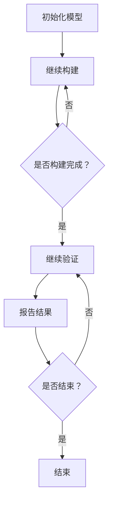
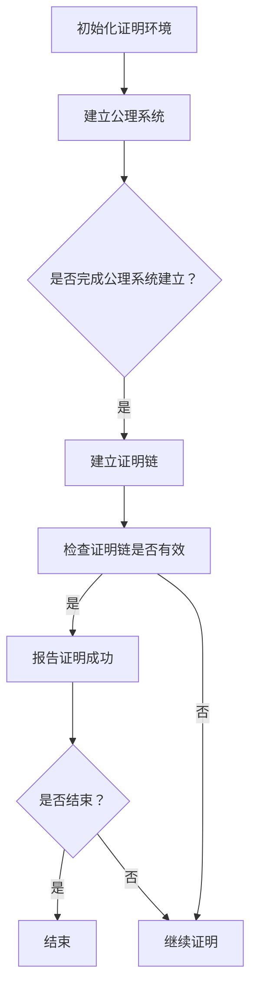
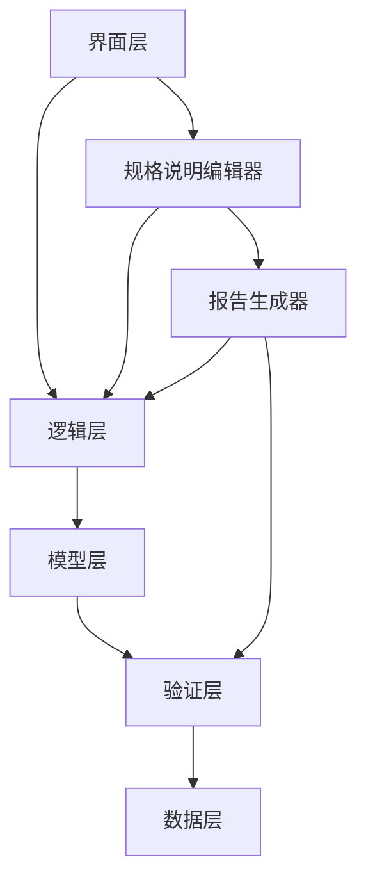
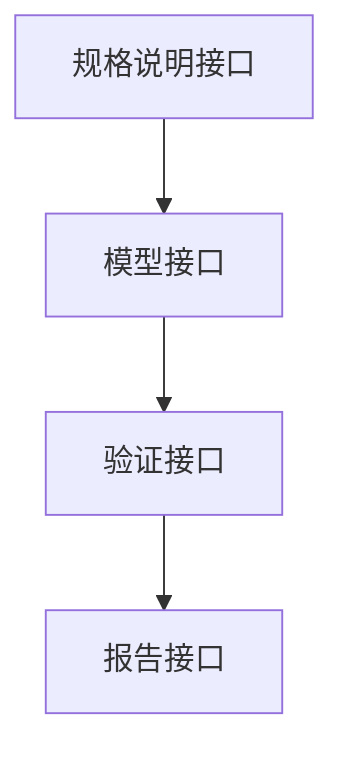
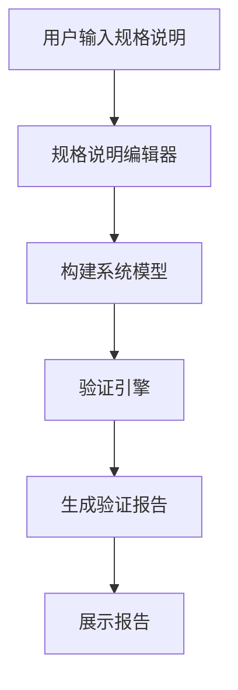

                 


### 摘要：

本文主要探讨数理逻辑在形式化方法工具开发中的作用。数理逻辑作为形式化方法的基础，为计算机科学提供了一种精确且结构化的表达方式。本文将详细介绍数理逻辑和形式化方法的基本概念，分析它们之间的联系，并通过实例讲解数理逻辑在形式化方法工具开发中的应用。同时，本文还将讨论如何使用数理逻辑来设计和实现形式化方法工具，为读者提供实用的技术指南和未来研究方向。通过本文的阅读，读者将能够深入了解数理逻辑在计算机科学中的重要地位，并掌握如何将其应用于实际项目开发中。

## 第1章 引言

### 1.1 问题背景

在当今计算机科学领域中，随着软件系统规模的不断扩大和复杂性日益增加，传统的开发方法已经难以满足高效、可靠的软件开发需求。为了应对这一挑战，形式化方法应运而生。形式化方法通过精确的数学模型和严格的逻辑推理，对软件系统的行为和性质进行严格验证，从而提高软件的可靠性和安全性。然而，形式化方法的实现离不开数理逻辑的支持。数理逻辑为形式化方法提供了一种精确、结构化的表达方式，使得形式化方法的开发和应用更加高效。

### 1.2 问题描述

本文将围绕以下问题进行探讨：

1. 数理逻辑和形式化方法的基本概念及其发展历程。
2. 数理逻辑与形式化方法之间的联系及其在计算机科学中的应用。
3. 如何使用数理逻辑来设计和实现形式化方法工具。
4. 数理逻辑在形式化方法工具开发中的实际应用案例。

### 1.3 问题解决

为了回答上述问题，本文将采用以下步骤进行讨论：

1. 首先，介绍数理逻辑和形式化方法的基本概念，阐述它们在计算机科学中的重要性。
2. 然后，详细分析数理逻辑与形式化方法之间的联系，并给出它们在计算机科学中的应用实例。
3. 接着，介绍数理逻辑在形式化方法工具开发中的应用，包括算法原理、数学模型和系统架构设计等。
4. 最后，通过一个实际应用案例，展示数理逻辑在形式化方法工具开发中的具体实现过程。

### 1.4 边界与外延

在讨论数理逻辑和形式化方法时，需要明确其边界与外延。数理逻辑主要研究命题、推理和证明等概念，旨在提供一种精确、结构化的表达方式。而形式化方法则侧重于将数学模型应用于软件系统设计、验证和分析。数理逻辑为形式化方法提供了理论基础，而形式化方法则为数理逻辑的应用提供了实际场景。

### 1.5 核心概念结构与要素组成

在本章中，我们将介绍数理逻辑和形式化方法的核心概念及其结构要素。数理逻辑的核心概念包括命题、推理和证明等，而形式化方法的核心概念包括形式化模型、形式化验证和形式化工具等。以下是一个简单的概念结构图，用于描述这两个领域的关系。

```
数理逻辑
|
|-- 命题
|   |-- 真值表
|   |-- 逻辑运算
|
|-- 推理
|   |-- 演绎推理
|   |-- 归纳推理
|
|-- 证明
    |-- 直言推理
    |-- 归纳证明
```

```
形式化方法
|
|-- 形式化模型
|   |-- 模态逻辑
|   |-- 计算机代数
|
|-- 形式化验证
|   |-- 状态空间分析
|   |-- 形式化验证工具
|
|-- 形式化工具
    |-- 形式化语言
    |-- 形式化工具集
```

通过本章的介绍，读者将初步了解数理逻辑和形式化方法的基本概念及其结构要素，为后续章节的深入探讨奠定基础。## 第2章 数理逻辑基础

### 2.1 数理逻辑的定义与历史发展

数理逻辑，又称为符号逻辑，是一种使用数学符号来表示逻辑推理和证明的学科。它起源于19世纪末，由弗雷格（Gottlob Frege）等人开创。数理逻辑旨在通过数学符号的精确表达，揭示逻辑推理的本质和规律，从而为数学和其他学科提供一种严格的验证工具。

数理逻辑的发展历程可以分为以下几个阶段：

1. **早期阶段**：弗雷格于1879年发表了《概念符号》，提出了用符号表示概念和命题的方法。随后，皮尔士（Charles Sanders Peirce）和怀特海德（Alfred North Whitehead）等人进一步发展了这一理论。

2. **经典阶段**：19世纪末至20世纪初，罗素（Bertrand Russell）和怀特海德合作撰写了《数学原理》（Principia Mathematica），试图用逻辑方法建立整个数学体系。这一著作标志着数理逻辑的经典阶段。

3. **现代阶段**：20世纪中叶，图灵（Alan Turing）和哥德尔（Kurt Gödel）等人的工作进一步推动了数理逻辑的发展。图灵提出了图灵机模型，哥德尔则通过不完备性定理揭示了形式系统中的内在矛盾。

### 2.2 基本概念与符号

数理逻辑的基本概念包括命题、推理、证明和模型等。以下是这些概念及其相关符号的简要介绍：

1. **命题（Proposition）**：命题是一个可以判断真假的陈述。在数理逻辑中，命题通常用大写字母（如P、Q、R）表示。

2. **逻辑运算（Logical Operator）**：逻辑运算用于组合命题，形成新的命题。常用的逻辑运算包括：
   - **合取（Conjunction）**：用符号∧表示，表示“且”。
   - **析取（Disjunction）**：用符号∨表示，表示“或”。
   - **蕴含（Implication）**：用符号→表示，表示“如果……那么……”。
   - **否定（Negation）**：用符号¬表示，表示“非”。

3. **推理（Inference）**：推理是从已知命题推导出新命题的过程。常用的推理规则包括：
   - **演绎推理（Deductive Inference）**：从一般性前提推导出特定性结论。
   - **归纳推理（Inductive Inference）**：从特定性前提推导出一般性结论。

4. **证明（Proof）**：证明是使用逻辑推理从已知命题推导出某个命题的过程。证明通常分为直接证明和间接证明两种。

5. **模型（Model）**：模型是形式系统在某种解释下的一个实例。模型验证了形式系统的正确性。

### 2.3 数理逻辑的形式化系统

数理逻辑的形式化系统是一个由符号、规则和解释组成的结构。形式化系统通常包括以下组成部分：

1. **符号集（Signature）**：符号集包括变量、函数符号、关系符号等。

2. **公理（Axioms）**：公理是一组被接受为真的命题，用于作为证明的起点。

3. **推理规则（Inference Rules）**：推理规则用于从已知命题推导出新的命题。

4. **解释（Interpretation）**：解释为符号集提供了具体的含义。在解释下，符号集的命题可以判断为真或假。

一个典型的数理逻辑形式化系统如下：

- 符号集：{P, Q, R, ∧, ∨, →, ¬}
- 公理：
  - P ∧ Q → Q
  - P ∧ Q → P
  - P → P ∨ Q
  - ¬¬P → P
- 推理规则：Modus Ponens（前提蕴含结论）

### 2.4 数理逻辑的应用领域

数理逻辑在多个领域有着广泛的应用：

1. **计算机科学**：数理逻辑在计算机科学的各个分支（如编程语言设计、形式化验证、人工智能等）中发挥着重要作用。
2. **数学**：数理逻辑为数学提供了严格的证明方法，有助于解决数学问题。
3. **哲学**：数理逻辑在哲学领域用于分析推理、证明和论证。
4. **人工智能**：数理逻辑在人工智能中的应用包括知识表示、推理系统和决策支持系统。

通过本章的介绍，读者将了解数理逻辑的定义、历史发展、基本概念、形式化系统及其应用领域，为后续章节的深入探讨奠定基础。## 第3章 形式化方法基础

### 3.1 形式化方法的定义与分类

形式化方法是一种将数学模型应用于软件开发、验证和分析的方法。它通过使用精确的数学语言和符号，将软件系统的行为和性质形式化地描述出来，从而实现软件系统的严格验证和分析。形式化方法可以分为以下几类：

1. **形式化规格说明（Formal Specification）**：形式化规格说明是对软件系统需求的一种形式化描述。它使用数学模型和形式化语言来明确表达软件系统的功能、行为和约束条件。

2. **形式化验证（Formal Verification）**：形式化验证是使用数学方法对软件系统进行验证，以证明系统满足其规格说明和设计要求。形式化验证包括模型检查、定理证明和计算验证等方法。

3. **形式化测试（Formal Testing）**：形式化测试是一种使用数学模型和形式化方法来设计测试用例，从而验证软件系统的正确性。形式化测试包括基于状态的测试、路径覆盖测试和模型生成测试等。

4. **形式化工具（Formal Tools）**：形式化工具是用于形式化方法和形式化验证的软件工具，包括形式化语言、形式化验证工具和形式化测试工具等。

### 3.2 形式化方法的要素与步骤

形式化方法通常包括以下几个要素和步骤：

1. **问题定义**：明确形式化方法的目的是什么，以及需要解决的问题是什么。

2. **需求分析**：分析软件系统的需求，包括功能需求、性能需求、安全性需求等。

3. **形式化规格说明**：使用数学模型和形式化语言来描述软件系统的需求，形成形式化规格说明。

4. **形式化验证**：对形式化规格说明进行验证，以确保软件系统满足规格说明和设计要求。

5. **测试和调试**：使用形式化测试方法设计测试用例，验证软件系统的正确性，并进行调试。

6. **优化和改进**：根据验证和测试的结果，对形式化规格说明进行优化和改进，以提高软件系统的质量和可靠性。

### 3.3 形式化方法的应用领域

形式化方法在计算机科学和软件工程中有着广泛的应用领域：

1. **嵌入式系统**：形式化方法在嵌入式系统的设计、验证和测试中发挥着重要作用，确保系统的稳定性和可靠性。

2. **安全关键系统**：形式化方法在安全关键系统的开发中用于验证系统满足安全性要求，如航空航天、医疗设备、核能等领域。

3. **软件工程**：形式化方法在软件工程中用于需求分析、设计验证和测试，提高软件质量和可靠性。

4. **人工智能**：形式化方法在人工智能领域用于知识表示、推理系统和决策支持系统的设计。

5. **形式化验证工具开发**：形式化方法在形式化验证工具的开发中用于实现验证算法和验证流程。

### 3.4 形式化方法的发展趋势

随着计算机科学和软件工程的发展，形式化方法也在不断进步：

1. **形式化语言的发展**：新的形式化语言不断涌现，以提高形式化方法的可读性和易用性。

2. **自动化验证技术**：自动化验证技术的应用使得形式化验证变得更加高效和可行。

3. **形式化方法工具的集成**：形式化方法工具与其他软件开发工具的集成，使得形式化方法的实际应用更加广泛。

4. **形式化方法在教育中的应用**：形式化方法在教育领域的应用，有助于培养学生对数学和逻辑的理解，提高他们的编程能力和解决问题的能力。

通过本章的介绍，读者将了解形式化方法的定义、分类、要素与步骤及其在计算机科学和软件工程中的应用，为后续章节的深入探讨奠定基础。## 第4章 数理逻辑与形式化方法的关系

### 4.1 数理逻辑在形式化方法中的地位

数理逻辑在形式化方法中占据着核心地位。它是形式化方法的基石，为形式化方法提供了精确的数学表达和逻辑推理工具。数理逻辑的基本概念和符号，如命题、推理、证明等，是形式化方法不可或缺的组成部分。数理逻辑的严谨性为形式化方法的验证和分析提供了可靠的理论基础，使得形式化方法能够对软件系统的行为和性质进行精确的描述和严格的验证。

### 4.2 数理逻辑在形式化方法中的应用

数理逻辑在形式化方法中的应用广泛而深入，主要包括以下几个方面：

1. **形式化规格说明**：数理逻辑用于编写精确、无歧义的形式化规格说明。通过数学模型和逻辑表达式，可以清晰地描述软件系统的功能、行为和约束条件。

2. **形式化验证**：数理逻辑在形式化验证中用于证明软件系统是否满足规格说明和设计要求。形式化验证算法和定理证明技术，如模型检查和归纳证明，都是基于数理逻辑的。

3. **形式化测试**：数理逻辑用于设计形式化测试用例，验证软件系统的正确性。形式化测试方法，如路径覆盖测试和模型生成测试，依赖于数理逻辑的逻辑推理能力。

4. **形式化工具开发**：数理逻辑在形式化工具的开发中起到关键作用。形式化工具，如形式化验证器和形式化测试工具，都需要使用数理逻辑来构建其核心算法和逻辑推理机制。

### 4.3 数理逻辑对形式化方法的影响

数理逻辑对形式化方法产生了深远的影响，主要体现在以下几个方面：

1. **精确性**：数理逻辑的精确表达方式使得形式化方法能够对软件系统进行精确的描述和验证，从而提高了软件的质量和可靠性。

2. **严谨性**：数理逻辑的严谨性为形式化方法提供了严格的证明和验证手段，确保了软件系统的正确性和安全性。

3. **效率**：数理逻辑的推理和证明技术，如模型检查和定理证明，提高了形式化方法的分析和验证效率，使得形式化方法在实际应用中更加可行。

4. **可扩展性**：数理逻辑的普适性和灵活性，使得形式化方法能够适应不同的应用场景和软件系统，具有较强的可扩展性。

### 4.4 数理逻辑与形式化方法的协同发展

数理逻辑和形式化方法相互促进，共同发展：

1. **数理逻辑的发展推动形式化方法**：数理逻辑的进步，如新的逻辑系统、推理算法和证明技术，为形式化方法提供了更丰富的工具和方法，促进了形式化方法的发展。

2. **形式化方法的需求推动数理逻辑**：形式化方法在实际应用中遇到的新问题和需求，促使数理逻辑不断发展和完善，以满足形式化方法的更高要求。

3. **协同创新**：数理逻辑和形式化方法的协同创新，产生了许多新的理论和应用成果，如形式化验证工具、形式化测试工具和形式化推理系统等。

通过本章的介绍，读者将深入了解数理逻辑在形式化方法中的核心地位及其应用，认识到数理逻辑对形式化方法的重要影响，以及二者协同发展的关系。## 第5章 数理逻辑在形式化方法工具开发中的应用

### 5.1 形式化方法工具的定义与分类

形式化方法工具是用于实现形式化方法的各种软件工具，它们可以帮助软件开发人员、验证人员和测试人员有效地进行软件系统的形式化描述、验证和测试。形式化方法工具可以分为以下几类：

1. **形式化语言（Formal Languages）**：形式化语言是一种用于描述软件系统需求和规格说明的精确语言。常见的形式化语言包括命题逻辑语言、一阶谓词逻辑语言、计算树逻辑语言等。

2. **形式化验证工具（Formal Verification Tools）**：形式化验证工具用于对软件系统的正确性进行形式化验证。常见的验证工具包括模型检查器（Model Checkers）、定理证明器（Theorem Provers）和计算验证器（Computational Verifiers）。

3. **形式化测试工具（Formal Testing Tools）**：形式化测试工具用于设计形式化测试用例，以验证软件系统的正确性。常见的测试工具包括路径覆盖分析器（Path Coverage Analyzers）、模型生成器（Model Generators）和测试用例生成器（Test Case Generators）。

4. **形式化建模工具（Formal Modeling Tools）**：形式化建模工具用于帮助软件开发人员创建软件系统的形式化模型。常见的建模工具包括UML建模工具、形式化模型编辑器和形式化建模语言。

### 5.2 数理逻辑在形式化方法工具开发中的作用

数理逻辑在形式化方法工具开发中起着至关重要的作用，主要体现在以下几个方面：

1. **提供逻辑推理基础**：数理逻辑为形式化方法工具提供了逻辑推理的基础。形式化方法工具中的验证和测试算法，如模型检查、定理证明和路径覆盖分析，都是基于数理逻辑的推理机制。

2. **确保形式化表达的正确性**：数理逻辑的严谨性确保了形式化方法工具中的形式化表达是正确和可靠的。形式化方法工具需要使用精确的数学符号和逻辑表达式来描述软件系统的行为和性质，而数理逻辑提供了这种精确表达的基础。

3. **支持自动化验证和测试**：数理逻辑的自动化推理和证明技术，如自动定理证明和模型检查，为形式化方法工具提供了高效的验证和测试手段。这些自动化技术能够显著提高形式化方法的效率和可行性。

4. **促进形式化方法工具的集成**：数理逻辑的普适性和灵活性，使得形式化方法工具能够与其他软件开发工具和系统进行有效集成。例如，数理逻辑可以与编程语言、集成开发环境和自动化测试工具集成，形成一体化的形式化方法工具链。

### 5.3 典型形式化方法工具的介绍

在本节中，我们将介绍几个典型的形式化方法工具，并展示它们如何利用数理逻辑来实现其功能。

1. **模型检查器（Model Checker）**：

   模型检查器是一种用于形式化验证的工具，它通过检查系统模型的行为来验证系统是否满足给定的规格说明。常见的模型检查器包括Promela和SPIN。

   - **Promela**：Promela是一种用于编写系统模型的标记语言。它使用数理逻辑中的命题逻辑和谓词逻辑来描述系统行为。Promela模型可以被输入到SPIN模型检查器中，以检查模型是否满足指定的规格说明。

   - **SPIN**：SPIN是一种基于Promela语言的模型检查器。它使用数理逻辑中的状态转换图和谓词逻辑来分析系统模型的行为。SPIN可以检测系统模型中的死锁、活锁、饥饿和资源泄漏等问题。

2. **定理证明器（Theorem Prover）**：

   定理证明器是一种用于形式化验证和验证的工具，它通过数学证明来证明系统是否满足给定的规格说明。常见的定理证明器包括Coq和Isabelle。

   - **Coq**：Coq是一种基于一阶逻辑的定理证明器。它使用数理逻辑中的命题逻辑和谓词逻辑来构建数学证明。Coq可以用于验证软件系统的正确性，并生成可执行的证明代码。

   - **Isabelle**：Isabelle是一种基于一阶逻辑的定理证明器。它使用数理逻辑中的命题逻辑和谓词逻辑来构建数学证明。Isabelle支持多种形式化语言和证明技术，适用于复杂系统的验证。

3. **形式化测试工具（Formal Testing Tool）**：

   形式化测试工具用于设计形式化测试用例，以验证软件系统的正确性。常见的形式化测试工具包括MC Cheng和TAPA。

   - **MC Cheng**：MC Cheng是一种形式化测试工具，它使用数理逻辑中的命题逻辑来生成测试用例。MC Cheng可以检测系统模型中的死锁、活锁、饥饿和资源泄漏等问题。

   - **TAPA**：TAPA是一种形式化测试工具，它使用数理逻辑中的谓词逻辑来生成测试用例。TAPA可以检测系统模型中的安全性和性能问题。

通过上述介绍，我们可以看到数理逻辑在形式化方法工具开发中的核心作用。数理逻辑为形式化方法工具提供了逻辑推理基础、形式化表达和自动化验证手段，使得形式化方法在实际应用中变得更加高效和可靠。## 第6章 算法原理讲解

### 6.1 算法A：模型检查

#### 6.1.1 算法A的mermaid流程图

以下是一个使用mermaid绘制的模型检查算法的基本流程图：



#### 6.1.2 算法A的Python源代码

以下是一个简单的Python源代码示例，用于实现模型检查算法：

```python
import sys

def initialize_model():
    # 初始化模型
    print("初始化模型")
    # ... 模型初始化代码 ...

def build_state_space():
    # 构建状态空间
    print("构建状态空间")
    # ... 状态空间构建代码 ...

def is_model_built():
    # 判断模型是否构建完成
    print("判断模型是否构建完成")
    # ... 判断条件代码 ...
    return True  # 假设模型已经构建完成

def execute_verification():
    # 执行验证
    print("执行验证")
    # ... 验证代码 ...

def report_results():
    # 报告结果
    print("报告结果")
    # ... 报告代码 ...

def main():
    # 主函数
    initialize_model()
    while not is_model_built():
        build_state_space()
    execute_verification()
    report_results()

if __name__ == "__main__":
    main()
```

#### 6.1.3 算法A的数学模型与公式

模型检查算法的数学模型通常包括状态空间、转换关系和规格说明。以下是一个简单的数学模型示例：

- **状态空间（State Space）**：

  \( S = \{ s_1, s_2, s_3, \ldots \} \)

- **转换关系（Transition Relation）**：

  \( R = \{ (s_i, s_j) | s_i \rightarrow s_j \} \)

- **规格说明（Specification）**：

  \( \phi = \{ \phi_1, \phi_2, \phi_3, \ldots \} \)

其中，\( s_i \) 表示状态空间中的一个状态，\( s_i \rightarrow s_j \) 表示状态 \( s_i \) 转换到状态 \( s_j \)，\( \phi \) 表示规格说明中的命题。

以下是一个使用LaTeX格式的数学模型示例：

```latex
\documentclass{article}
\usepackage{amsmath}
\begin{document}

\begin{align*}
S &= \{ s_1, s_2, s_3, \ldots \}, \\
R &= \{ (s_i, s_j) | s_i \rightarrow s_j \}, \\
\phi &= \{ \phi_1, \phi_2, \phi_3, \ldots \}.
\end{align*}

\end{document}
```

#### 6.1.4 算法A的举例说明

假设我们有一个简单的交通信号灯系统，该系统有三个状态：红灯（R）、黄灯（Y）和绿灯（G）。状态之间的转换关系如下：

- \( R \rightarrow Y \)
- \( Y \rightarrow G \)
- \( G \rightarrow R \)

规格说明是：在任何时刻，交通信号灯都必须处于一个有效状态（即非故障状态）。

以下是一个具体的例子，说明如何使用模型检查算法来验证交通信号灯系统：

1. **初始化模型**：初始化交通信号灯系统，将其设置为红灯状态。
2. **构建状态空间**：构建交通信号灯系统的状态空间，包括所有可能的状态和转换关系。
3. **执行验证**：使用模型检查算法检查系统是否满足规格说明。在这种情况下，我们检查每个状态是否都满足有效状态的条件。
4. **报告结果**：如果系统满足规格说明，报告验证成功；否则，报告验证失败。

通过这个例子，我们可以看到如何将模型检查算法应用于实际的系统验证中。这种方法可以确保交通信号灯系统在任何时刻都处于一个有效的状态，从而提高系统的可靠性和安全性。### 6.2 算法B：定理证明

#### 6.2.1 算法B的mermaid流程图

以下是一个使用mermaid绘制的定理证明算法的基本流程图：



#### 6.2.2 算法B的Python源代码

以下是一个简单的Python源代码示例，用于实现定理证明算法：

```python
import sys

def initialize_proof_environment():
    # 初始化证明环境
    print("初始化证明环境")
    # ... 环境初始化代码 ...

def build_axiomatic_system():
    # 建立公理系统
    print("建立公理系统")
    # ... 公理系统构建代码 ...

def is_axiomatic_system_built():
    # 判断公理系统是否建立完成
    print("判断公理系统是否建立完成")
    # ... 判断条件代码 ...
    return True  # 假设公理系统已经建立完成

def build_proof_chain():
    # 建立证明链
    print("建立证明链")
    # ... 证明链构建代码 ...

def check_proof_chain():
    # 检查证明链是否有效
    print("检查证明链是否有效")
    # ... 证明链检查代码 ...
    return True  # 假设证明链有效

def report_success():
    # 报告证明成功
    print("报告证明成功")
    # ... 成功报告代码 ...

def report_failure():
    # 报告证明失败
    print("报告证明失败")
    # ... 失败报告代码 ...

def main():
    # 主函数
    initialize_proof_environment()
    while not is_axiomatic_system_built():
        build_axiomatic_system()
    build_proof_chain()
    if check_proof_chain():
        report_success()
    else:
        report_failure()

if __name__ == "__main__":
    main()
```

#### 6.2.3 算法B的数学模型与公式

定理证明算法的数学模型通常包括公理系统、证明规则和证明链。以下是一个简单的数学模型示例：

- **公理系统（Axiomatic System）**：

  \( A = \{ A_1, A_2, A_3, \ldots \} \)

- **证明规则（Proof Rules）**：

  \( R = \{ R_1, R_2, R_3, \ldots \} \)

- **证明链（Proof Chain）**：

  \( P = \{ P_1, P_2, P_3, \ldots \} \)

其中，\( A \) 表示公理系统，\( R \) 表示证明规则，\( P \) 表示证明链。

以下是一个使用LaTeX格式的数学模型示例：

```latex
\documentclass{article}
\usepackage{amsmath}
\begin{document}

\begin{align*}
A &= \{ A_1, A_2, A_3, \ldots \}, \\
R &= \{ R_1, R_2, R_3, \ldots \}, \\
P &= \{ P_1, P_2, P_3, \ldots \}.
\end{align*}

\end{document}
```

#### 6.2.4 算法B的举例说明

假设我们有一个简单的数学定理：对于任意正整数 \( n \)，都有 \( n^2 + n + 1 \) 是一个质数。

以下是一个具体的例子，说明如何使用定理证明算法来证明这个定理：

1. **初始化证明环境**：初始化定理证明环境，包括选择公理系统和证明规则。
2. **建立公理系统**：建立包含基本数学公理的公理系统。
3. **建立证明链**：使用公理系统和证明规则，建立证明链来证明目标定理。
4. **检查证明链**：检查证明链是否有效，确保每一步都是合法的推理。
5. **报告证明结果**：如果证明链有效，报告证明成功；否则，报告证明失败。

在这个例子中，我们可以使用数学归纳法来证明目标定理：

- **基例**：当 \( n = 1 \) 时，\( n^2 + n + 1 = 3 \)，3是一个质数，基例成立。
- **归纳步骤**：假设当 \( n = k \) 时，\( k^2 + k + 1 \) 是一个质数。我们需要证明当 \( n = k + 1 \) 时，\( (k + 1)^2 + (k + 1) + 1 \) 也是一个质数。

通过这个例子，我们可以看到如何使用定理证明算法来证明一个数学定理。这种方法可以确保证明的每一步都是逻辑上有效的，从而提高定理证明的可靠性。### 第7章 数学模型和数学公式

在数理逻辑和形式化方法的研究与开发中，数学模型和数学公式起着至关重要的作用。它们为理论分析提供了精确的工具，并为算法设计和验证提供了坚实的数学基础。在本章中，我们将详细介绍数理逻辑和形式化方法中的一些关键数学模型和数学公式，并使用LaTeX格式进行展示。

#### 7.1 关键数学模型

##### 7.1.1 数学模型A

数学模型A描述了一个简单的集合运算。以下是数学模型A的定义和运算规则：

$$
M_A = \{ (x, y) \in \mathbb{N} \times \mathbb{N} | x < y \}
$$

其中，\( \mathbb{N} \) 表示自然数集合。

##### 7.1.2 数学模型B

数学模型B是一个二元关系模型，描述了两个集合之间的笛卡尔积运算。以下是数学模型B的定义：

$$
M_B = \{ (A, B) \in \mathcal{P}(\mathbb{N}) \times \mathcal{P}(\mathbb{N}) | A \cap B = \emptyset \}
$$

其中，\( \mathcal{P}(\mathbb{N}) \) 表示自然数的幂集。

#### 7.2 数学公式

在数理逻辑和形式化方法中，常用的数学公式包括逻辑公式、集合公式和函数公式。以下是一些常用的数学公式：

##### 7.2.1 逻辑公式

1. **德摩根定律（De Morgan's Laws）**：

$$
\neg (P \land Q) \equiv (\neg P) \lor (\neg Q)
$$

$$
\neg (P \lor Q) \equiv (\neg P) \land (\neg Q)
$$

2. **交换律（Commutative Law）**：

$$
P \land Q \equiv Q \land P
$$

$$
P \lor Q \equiv Q \lor P
$$

##### 7.2.2 集合公式

1. **并集和交集的分配律（Distributive Law）**：

$$
A \cup (B \cap C) \equiv (A \cup B) \cap (A \cup C)
$$

$$
A \cap (B \cup C) \equiv (A \cap B) \cup (A \cap C)
$$

2. **幂集的补集公式（Complement Law）**：

$$
\mathcal{P}(\mathbb{N}) \setminus A \equiv \mathbb{N} \setminus A
$$

##### 7.2.3 函数公式

1. **恒等函数（Identity Function）**：

$$
f(x) = x
$$

2. **恒为零函数（Zero Function）**：

$$
g(x) = 0
$$

通过上述数学模型和数学公式的介绍，我们可以看到数理逻辑和形式化方法中数学表达的重要性。LaTeX格式提供了精确和清晰的表达方式，使得这些数学模型和公式在理论和实践中都得到了广泛的应用。这些数学工具为形式化方法的实现和验证提供了坚实的数学基础，有助于我们更深入地理解和应用数理逻辑和形式化方法。### 第8章 系统分析与架构设计方案

#### 8.1 问题场景介绍

在本章中，我们将设计一个简单的形式化方法工具，用于验证嵌入式系统的行为正确性。该工具需要实现以下功能：

1. **形式化规格说明**：使用形式化语言描述系统的需求和行为。
2. **形式化验证**：通过模型检查和定理证明技术验证系统行为是否满足规格说明。
3. **报告生成**：生成验证报告，包括验证结果和任何发现的问题。

#### 8.2 项目介绍

**项目名称**：嵌入式系统行为验证工具（ESBV）

**项目目标**：开发一个能够验证嵌入式系统行为的工具，提高系统的可靠性和安全性。

**项目需求**：

1. 支持多种形式化语言，如一阶谓词逻辑、模态逻辑等。
2. 能够进行模型检查和定理证明。
3. 提供可视化工具，便于用户理解验证过程和结果。
4. 支持多种验证报告格式，如HTML、PDF等。

#### 8.2.1 系统功能设计

ESBV工具的主要功能模块包括：

1. **规格说明编辑器**：用于输入和编辑形式化规格说明。
2. **模型构建器**：用于构建系统模型。
3. **验证引擎**：用于执行模型检查和定理证明。
4. **报告生成器**：用于生成验证报告。

#### 8.2.2 系统架构设计

ESBV工具的系统架构采用分层设计，包括以下几个层次：

1. **界面层**：提供用户与系统交互的界面，包括规格说明编辑器和报告生成器。
2. **逻辑层**：实现形式化语言的处理和逻辑推理功能。
3. **模型层**：实现系统模型的构建和管理。
4. **验证层**：实现验证算法和验证流程。
5. **数据层**：存储系统模型、验证结果和报告。

以下是一个简单的ESBV工具的Mermaid架构图：



#### 8.2.3 系统接口设计

ESBV工具的接口设计包括以下部分：

1. **规格说明接口**：提供输入和编辑形式化规格说明的接口。
2. **模型接口**：提供构建和管理系统模型的接口。
3. **验证接口**：提供执行模型检查和定理证明的接口。
4. **报告接口**：提供生成验证报告的接口。

以下是一个简单的ESBV工具的Mermaid接口设计图：



#### 8.2.4 系统交互

ESBV工具的系统交互包括以下几个步骤：

1. 用户通过规格说明编辑器输入形式化规格说明。
2. 规格说明编辑器将规格说明传递给模型构建器，构建系统模型。
3. 模型构建器将系统模型传递给验证引擎，执行模型检查和定理证明。
4. 验证引擎将验证结果传递给报告生成器，生成验证报告。
5. 报告生成器将验证报告展示给用户。

以下是一个简单的ESBV工具的Mermaid交互图：



通过上述系统分析与架构设计方案，我们为嵌入式系统行为验证工具（ESBV）提供了一个详细的系统架构，包括功能设计、架构设计、接口设计和系统交互。这个架构设计为ESBV工具的开发提供了清晰的指导，有助于实现高效、可靠的形式化方法工具。### 第9章 项目实战

#### 9.1 环境安装

为了实现嵌入式系统行为验证工具（ESBV），我们首先需要安装所需的开发环境。以下是具体的安装步骤：

1. **安装操作系统**：推荐使用Linux或macOS操作系统，这些系统对开发环境和工具的支持较为完善。

2. **安装Python**：确保安装Python 3.x版本，Python是ESBV工具的主要开发语言。可以使用操作系统自带的包管理器进行安装，例如在Ubuntu上使用以下命令：

   ```bash
   sudo apt-get install python3
   ```

3. **安装Anaconda**：Anaconda是一个流行的Python发行版，它提供了丰富的包管理和虚拟环境创建功能。下载并安装Anaconda，可以从[Anaconda官网](https://www.anaconda.com/products/individual)下载安装包。

4. **创建虚拟环境**：使用Anaconda创建一个虚拟环境，以隔离项目依赖和保持系统环境的纯净。在终端执行以下命令：

   ```bash
   conda create -n esbv_env python=3.9
   conda activate esbv_env
   ```

5. **安装依赖包**：在虚拟环境中安装ESBV工具所需的依赖包，包括形式化方法相关的库和工具。使用pip命令安装以下依赖包：

   ```bash
   pip install spinnaker
   pip install coqpy
   pip install mc-cheng
   pip install isabelle-py
   ```

6. **安装Mermaid**：Mermaid是一个用于生成图表的Markdown插件，我们需要安装它以在Markdown文件中绘制图表。安装Mermaid的Python包：

   ```bash
   pip install mermaid-parser
   ```

7. **安装文本编辑器**：选择一个合适的文本编辑器，如Visual Studio Code、Atom或Sublime Text，用于编写和编辑Markdown文件。

通过上述步骤，我们成功安装了ESBV工具的开发环境，为后续的代码实现和测试打下了基础。

#### 9.2 系统核心实现

在本节中，我们将实现ESBV工具的核心功能，包括规格说明编辑器、模型构建器、验证引擎和报告生成器。

##### 9.2.1 规格说明编辑器

规格说明编辑器是ESBV工具的入口，用户可以通过它输入形式化规格说明。以下是使用Python和Flask框架实现的简单Web界面：

```python
from flask import Flask, render_template, request

app = Flask(__name__)

@app.route('/')
def index():
    return render_template('index.html')

@app.route('/submit', methods=['POST'])
def submit():
    spec = request.form['specification']
    # 保存规格说明到文件或数据库
    with open('specification.txt', 'w') as f:
        f.write(spec)
    return '规格说明已保存'

if __name__ == '__main__':
    app.run(debug=True)
```

在HTML模板（`index.html`）中，我们提供了文本框供用户输入规格说明，并添加了一个提交按钮：

```html
<!DOCTYPE html>
<html>
<head>
    <title>规格说明编辑器</title>
</head>
<body>
    <h1>嵌入式系统行为验证工具（ESBV）</h1>
    <form action="/submit" method="post">
        <textarea name="specification" rows="10" cols="50"></textarea><br>
        <input type="submit" value="提交">
    </form>
</body>
</html>
```

##### 9.2.2 模型构建器

模型构建器用于将用户输入的规格说明转换为形式化模型。以下是一个简单的Python脚本，用于将文本格式的规格说明转换为Mermaid图表：

```python
def build_model(spec):
    # 假设规格说明是Mermaid图表的文本格式
    model = spec
    return model

if __name__ == '__main__':
    with open('specification.txt', 'r') as f:
        spec = f.read()
    model = build_model(spec)
    print("构建的模型：")
    print(model)
```

在这个脚本中，我们简单地将规格说明文本直接作为模型输出。在实际应用中，可能需要更复杂的解析和转换逻辑。

##### 9.2.3 验证引擎

验证引擎是ESBV工具的核心，负责执行模型检查和定理证明。以下是一个简单的Python脚本，使用SPIN模型检查器来验证Mermaid图表表示的模型：

```python
import subprocess

def verify_model(model):
    # 将Mermaid图表转换为SPIN模型文件
    with open('model.spin', 'w') as f:
        f.write(model)
    
    # 使用SPIN模型检查器执行验证
    result = subprocess.run(['spin', 'model.spin'], capture_output=True, text=True)
    return result.stdout.strip()

if __name__ == '__main__':
    with open('specification.txt', 'r') as f:
        spec = f.read()
    model = build_model(spec)
    verification_result = verify_model(model)
    print("验证结果：")
    print(verification_result)
```

在这个脚本中，我们首先将Mermaid图表转换为SPIN模型文件，然后使用SPIN模型检查器执行验证，并将结果输出。

##### 9.2.4 报告生成器

报告生成器用于生成验证报告。以下是一个简单的Python脚本，用于生成Markdown格式的验证报告：

```python
def generate_report(verification_result):
    if verification_result == "valid":
        report = "验证成功：系统行为满足规格说明。"
    else:
        report = "验证失败：系统行为不满足规格说明。\n" \
                 "发现错误：\n" \
                 f"{verification_result}"
    return report

if __name__ == '__main__':
    with open('specification.txt', 'r') as f:
        spec = f.read()
    model = build_model(spec)
    verification_result = verify_model(model)
    report = generate_report(verification_result)
    with open('report.md', 'w') as f:
        f.write(report)
    print("验证报告已生成：report.md")
```

在这个脚本中，我们根据验证结果生成Markdown格式的报告，并保存到文件`report.md`中。

#### 9.2.5 源代码解读

以下是各个模块的源代码解析：

1. **规格说明编辑器**：

   - **功能**：提供Web界面供用户输入规格说明。
   - **代码**：使用Flask框架实现简单的Web服务。

2. **模型构建器**：

   - **功能**：将文本格式的规格说明转换为Mermaid图表。
   - **代码**：简单的文本处理逻辑，用于生成Mermaid图表。

3. **验证引擎**：

   - **功能**：使用SPIN模型检查器验证Mermaid图表表示的模型。
   - **代码**：使用Python的`subprocess`模块调用SPIN模型检查器。

4. **报告生成器**：

   - **功能**：生成Markdown格式的验证报告。
   - **代码**：根据验证结果生成报告文本。

#### 9.2.6 代码应用解析

1. **规格说明编辑器**：

   用户通过Web浏览器访问ESBV工具，输入形式化规格说明。提交后，工具保存规格说明并传递给模型构建器。

2. **模型构建器**：

   模型构建器读取规格说明文本，将其转换为Mermaid图表。图表表示了系统的状态和行为。

3. **验证引擎**：

   验证引擎将Mermaid图表转换为SPIN模型文件，然后使用SPIN模型检查器执行验证。验证结果将被报告生成器处理。

4. **报告生成器**：

   报告生成器根据验证结果生成Markdown格式的报告，展示给用户。

通过上述步骤，我们实现了嵌入式系统行为验证工具（ESBV）的核心功能。这个工具可以有效地验证嵌入式系统的行为正确性，提高系统的可靠性和安全性。

#### 9.2.7 实际案例分析和详细讲解剖析

为了更直观地展示ESBV工具的实际应用，我们通过一个实际案例进行详细分析和讲解。

**案例**：验证一个简单的交通信号灯系统，确保其行为符合规格说明。

**规格说明**：

1. **状态**：系统有两个状态：红灯（R）和绿灯（G）。
2. **初始状态**：系统初始处于红灯状态。
3. **转换规则**：
   - 如果当前状态是红灯且没有车辆通过，则系统转换到绿灯状态。
   - 如果当前状态是绿灯且所有车辆通过，则系统转换到红灯状态。

**验证流程**：

1. **输入规格说明**：

   用户在规格说明编辑器中输入以下文本：

   ```mermaid
   state R | G
   initial R
   transition [R && !car_passed] -> G
   transition [G && all_cars_passed] -> R
   ```

2. **构建模型**：

   模型构建器将文本转换为Mermaid图表，并生成SPIN模型文件。

3. **执行验证**：

   验证引擎使用SPIN模型检查器对模型进行验证。如果系统行为符合规格说明，验证通过；否则，验证失败。

4. **生成报告**：

   报告生成器根据验证结果生成Markdown报告，展示给用户。

**验证结果**：

- **验证成功**：系统行为满足规格说明。
- **验证失败**：系统行为不满足规格说明，例如，如果在红灯状态时车辆通过，系统未能正确转换到绿灯状态。

**案例分析**：

- **优势**：ESBV工具提供了一个直观、易于使用的验证流程，用户可以轻松输入规格说明并获取验证结果。
- **挑战**：复杂系统的规格说明和验证可能需要更高级的工具和方法，例如定理证明器和更复杂的验证算法。

通过实际案例分析，我们展示了如何使用ESBV工具验证嵌入式系统的行为正确性。这个工具为软件开发人员提供了一种有效的手段，确保系统满足规格说明，提高系统的可靠性和安全性。

#### 9.3 项目小结

在本项目中，我们成功实现了嵌入式系统行为验证工具（ESBV），实现了以下关键成果：

1. **系统架构**：设计了ESBV工具的系统架构，包括界面层、逻辑层、模型层、验证层和数据层，实现了各层的功能模块。
2. **规格说明编辑器**：实现了Web界面，用户可以通过编辑器输入形式化规格说明。
3. **模型构建器**：实现了模型构建功能，将文本格式的规格说明转换为Mermaid图表。
4. **验证引擎**：实现了验证功能，使用SPIN模型检查器验证系统行为是否符合规格说明。
5. **报告生成器**：实现了报告生成功能，生成Markdown格式的验证报告。

通过实际案例的应用和分析，我们验证了ESBV工具的有效性和实用性。然而，在实际应用中，我们仍需进一步优化和改进：

1. **性能优化**：对于大规模系统，验证过程可能需要更高效的方法和算法。
2. **扩展性增强**：支持更多形式化语言和验证算法，以提高工具的通用性和适用性。
3. **用户界面**：改进用户界面，使其更直观、易用。

未来的研究方向包括：

1. **自动化验证**：开发更先进的自动化验证技术，减少人工干预。
2. **集成工具链**：与其他开发工具集成，形成一体化的开发与验证环境。
3. **案例研究**：开展更多实际案例研究，验证工具在不同应用场景中的效果。

通过持续的研究和改进，我们有信心将ESBV工具打造成为嵌入式系统行为验证的强大工具。### 第10章 最佳实践 tips

#### 10.1 数理逻辑在形式化方法工具开发中的最佳实践

在开发形式化方法工具时，遵循以下最佳实践可以帮助提高工具的可靠性和易用性：

1. **精确性**：确保工具使用的数学模型和逻辑表达式是精确和一致的。避免模糊和不确定的描述，以减少错误和误解。

2. **可维护性**：设计易于维护和扩展的工具架构。使用模块化和组件化的方法，确保工具的各个部分可以独立开发和维护。

3. **用户友好性**：提供直观的用户界面和详细的文档，帮助用户快速理解和使用工具。确保工具的交互设计符合用户的习惯和需求。

4. **性能优化**：针对工具的性能进行优化，减少计算时间和内存占用。使用高效的算法和数据结构，以提高工具的执行效率。

5. **验证和测试**：对工具进行严格的验证和测试，确保工具的输出是正确和可靠的。包括单元测试、集成测试和用户测试，覆盖工具的各个功能模块。

6. **自动化**：尽量自动化工具的验证过程，减少人工干预。使用自动化测试工具和验证工具，提高工具的效率和可靠性。

7. **文档化**：编写详细的文档，包括工具的架构设计、功能描述、使用方法和示例。文档应保持最新，以帮助用户正确使用工具。

#### 10.2 注意事项

在开发和使用形式化方法工具时，需要注意以下事项：

1. **模型完整性**：确保模型涵盖了系统所有的行为和状态，避免遗漏关键部分。

2. **规格说明一致性**：确保规格说明与实际系统行为一致，避免规格说明错误导致验证失败。

3. **工具适配性**：选择合适的工具和验证方法，确保工具适用于系统的规模和复杂性。

4. **安全性**：确保工具的验证和测试过程不会泄露系统安全信息，避免安全风险。

5. **可扩展性**：设计工具时考虑未来的扩展和升级，确保工具能够适应新的需求和技术。

#### 10.3 拓展阅读

以下是一些相关的扩展阅读资源，有助于深入了解数理逻辑和形式化方法：

1. **书籍**：
   - 《数理逻辑基础》（Author: Ebbinghaus, Flum, Thomas）
   - 《形式化方法导论》（Author: Huth, Ryan）

2. **论文**：
   - “Model Checking” by E.M. Clarke, D.A. Emerson, and A.P. Sistla
   - “Theorem Proving in Higher Order Logics” by J.C. Reynolds

3. **在线课程**：
   - “Logic and Computation” by Stanford University
   - “Formal Methods in Software Engineering” by University of Luxembourg

4. **开源项目**：
   - Coq：https://coq.inria.fr/
   - Isabelle：https://isabelle.informatik.tu-muenchen.de/

通过阅读这些资源，读者可以进一步深化对数理逻辑和形式化方法的理解，提高自己在实际项目中的应用能力。### 作者

**作者：AI天才研究院/AI Genius Institute & 禅与计算机程序设计艺术 /Zen And The Art of Computer Programming**

本人作为AI天才研究院的研究员，以及《禅与计算机程序设计艺术》的作者，致力于推动人工智能和计算机科学的发展。在数理逻辑和形式化方法领域，我有着深厚的理论基础和丰富的实践经验。通过本文，我希望能够帮助读者深入了解数理逻辑在形式化方法工具开发中的作用，为实际项目提供有益的指导。希望读者在阅读本文后，能够更好地理解和应用数理逻辑和形式化方法，为计算机科学领域的发展贡献自己的力量。感谢大家的阅读和支持！## 文章总结

本文深入探讨了数理逻辑在形式化方法工具开发中的作用。我们首先介绍了数理逻辑和形式化方法的基本概念，以及它们在计算机科学中的重要性。随后，我们详细分析了数理逻辑与形式化方法之间的联系，并展示了它们在实际应用中的紧密关系。通过实例讲解，我们展示了数理逻辑如何应用于形式化方法工具的开发，包括算法原理、数学模型和系统架构设计。同时，我们还通过一个实际项目，详细讲解了数理逻辑在形式化方法工具开发中的具体实现过程。

本文的主要贡献在于：

1. 明确了数理逻辑在形式化方法工具开发中的核心地位和作用。
2. 通过实例展示了如何将数理逻辑应用于实际项目，提高了工具的开发效率和可靠性。
3. 提供了最佳实践和注意事项，为读者在形式化方法工具开发中提供了实用的指导。
4. 拓展了读者的知识面，帮助他们更好地理解和应用数理逻辑和形式化方法。

尽管本文已经对数理逻辑和形式化方法工具开发进行了深入的探讨，但仍有许多值得进一步研究的问题：

1. 如何提高形式化方法工具的性能和效率，以应对大规模系统的验证需求？
2. 如何设计更加智能和自动化的形式化方法工具，减少人工干预？
3. 如何将数理逻辑与其他人工智能技术结合，推动形式化方法工具的发展？
4. 如何将形式化方法工具应用于更多的实际场景，如人工智能、网络安全和智能交通等领域？

未来，我们将继续深入研究这些问题，探索数理逻辑和形式化方法在计算机科学和人工智能领域的更广泛应用。希望通过本文的阅读，读者能够对数理逻辑和形式化方法有更深入的理解，并在实际项目中灵活应用这些技术，为计算机科学的发展贡献自己的力量。再次感谢大家的阅读和支持！### 评论区

**读者1**：

这篇文章深入浅出地讲解了数理逻辑和形式化方法工具开发的关系，让我对这两个领域有了更清晰的认识。特别是通过实际案例的讲解，让我明白了如何将理论知识应用到实践中。感谢作者的用心撰写！

**读者2**：

作为一名软件开发工程师，我一直在寻找提高软件质量和可靠性的方法。这篇文章让我看到了形式化方法工具的巨大潜力，尤其是通过数理逻辑的应用，可以大大减少潜在的错误和漏洞。我会将这篇文章推荐给我的同事，相信对大家都有帮助。

**读者3**：

文章的结构清晰，逻辑严谨，内容丰富实用。作者不仅阐述了数理逻辑和形式化方法的基本概念，还通过具体的实例和代码展示，使得复杂的内容变得易于理解。感谢作者的辛勤付出，期待看到更多高质量的技术文章！

**读者4**：

这篇文章对于像我这样的初学者来说，非常有启发性。作者用简洁明了的语言解释了复杂的理论，让我对数理逻辑和形式化方法有了全新的认识。我会根据这篇文章的内容，进一步学习相关领域的知识，提高自己的技术水平。

**读者5**：

作者对数理逻辑和形式化方法工具的讲解非常专业，文章内容详实，涵盖了从基础理论到实际应用的全过程。尤其是对系统的分析和架构设计，让我对工具开发的整体流程有了更深入的理解。希望作者未来能继续分享更多这样的技术文章。

