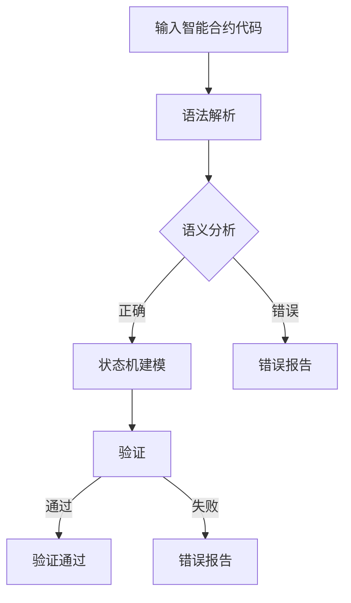
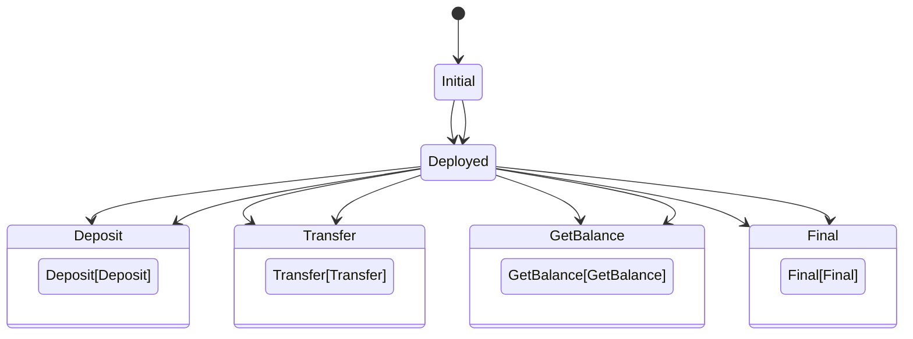
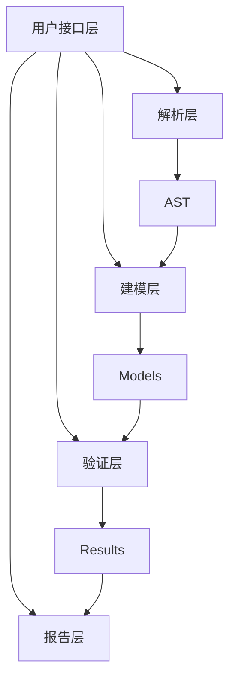
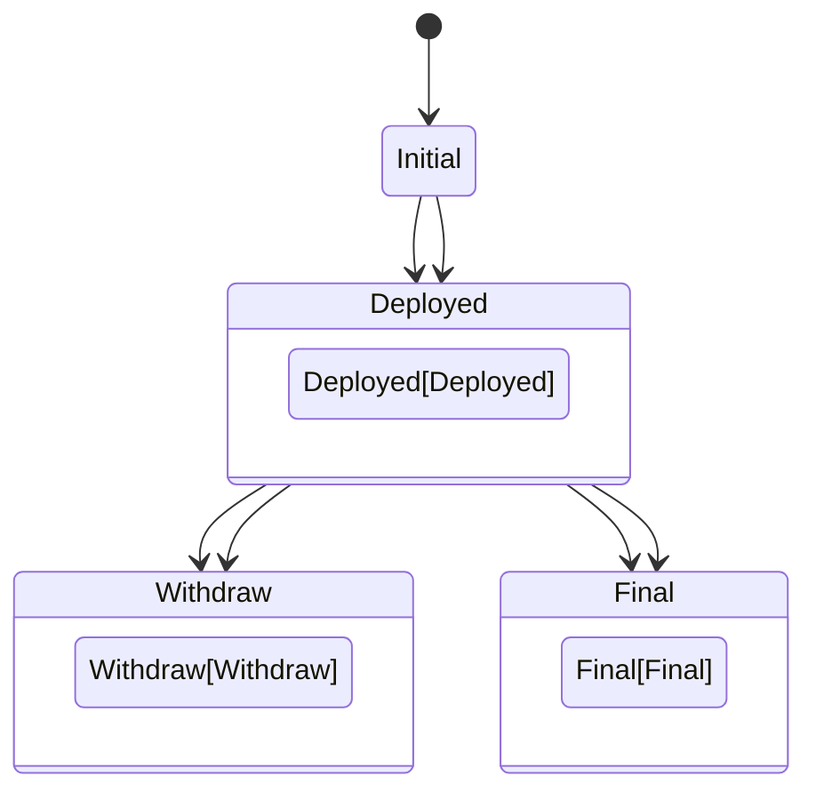
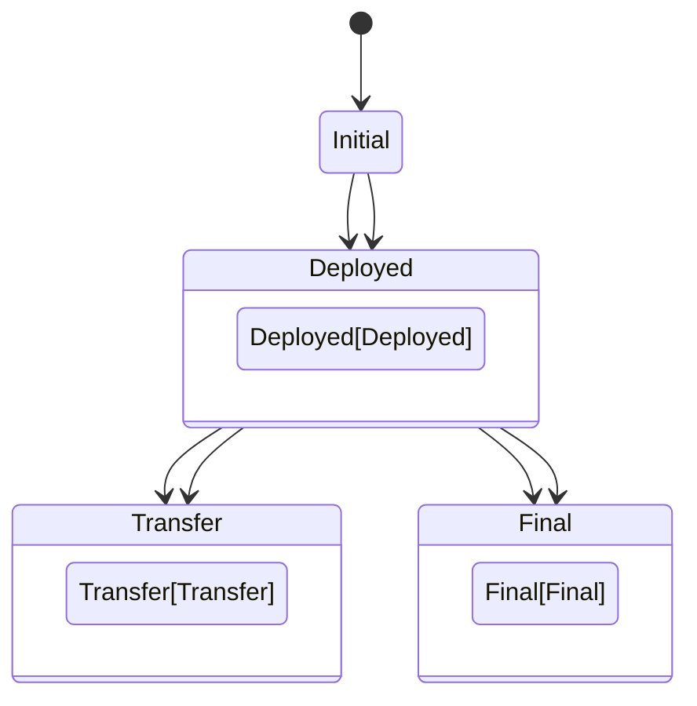

                 


### 引言：数理逻辑与智能合约语言设计

#### 1.1 问题的背景

##### 1.1.1 智能合约的兴起

智能合约是一种通过区块链技术实现的自我执行的合约。它根据预先设定的条件和规则自动执行交易，无需人工干预。智能合约的出现为去中心化金融、供应链管理、版权保护等领域带来了巨大的变革。

智能合约的发展经历了多个阶段。最初，智能合约主要是在比特币的区块链上实现的，随后逐渐扩展到其他公链和联盟链。随着区块链技术的不断发展，智能合约的应用领域也在不断扩大，从金融领域延伸到供应链管理、物联网、版权保护等多个领域。

##### 1.1.2 智能合约语言的需求

智能合约的语言设计直接影响到其易用性、安全性和性能。现有的智能合约语言，如Solidity、Vyper等，各有优缺点。例如，Solidity语法接近自然语言，易于编写和理解，但其安全性问题备受关注；Vyper则更加注重安全性，但语法相对复杂。

因此，设计一种安全、高效且易于理解的智能合约语言成为了学术界和工业界的共同需求。而数理逻辑作为一种形式化的描述工具，为智能合约语言的设计提供了强有力的支持。

##### 1.1.3 数理逻辑的重要性

数理逻辑是一种用于描述数学和逻辑结构的工具，它包括命题逻辑、谓词逻辑、证明论和模型论等分支。数理逻辑的应用范围非常广泛，包括计算机科学、数学、哲学、逻辑学等多个领域。

在智能合约语言设计领域，数理逻辑的重要性体现在以下几个方面：

1. **形式化验证**：数理逻辑可以用于验证智能合约的正确性，确保其在执行过程中不会出现意外行为。
2. **安全性分析**：数理逻辑可以帮助发现智能合约中的潜在漏洞，提高其安全性。
3. **语言设计**：数理逻辑为智能合约语言提供了理论基础，有助于设计出更加安全、高效的语言。

#### 1.2 问题描述

##### 1.2.1 智能合约语言的挑战

智能合约语言面临的主要挑战包括：

1. **安全性**：智能合约的安全性直接关系到区块链系统的稳定性。现有智能合约语言存在各种漏洞，如重新分配问题、整数溢出等，这些漏洞可能导致严重的经济损失。
2. **易用性**：智能合约语言的易用性影响到其普及程度。复杂难懂的语法和缺乏文档支持使得开发者难以快速上手。
3. **性能**：智能合约的性能直接影响其应用场景。现有智能合约语言在执行效率上存在瓶颈，无法满足高性能需求。

##### 1.2.2 数理逻辑的应用

数理逻辑在智能合约语言中的应用主要体现在以下几个方面：

1. **形式化验证**：利用数理逻辑进行形式化验证，确保智能合约的正确性。
2. **安全性分析**：通过数理逻辑分析智能合约的潜在漏洞，提高其安全性。
3. **语言设计**：基于数理逻辑设计智能合约语言，提高其易用性和性能。

##### 1.2.3 研究的目标与范围

本研究的目标是探讨数理逻辑在智能合约语言设计中的应用，旨在解决智能合约语言的安全性、易用性和性能问题。具体研究内容包括：

1. **数理逻辑的基本概念和应用**：介绍数理逻辑的基本概念和应用，为后续研究提供理论基础。
2. **智能合约语言的设计原则**：基于数理逻辑，提出智能合约语言的设计原则，包括安全性、易用性和性能等方面的考虑。
3. **形式化验证算法**：研究形式化验证算法在智能合约语言中的应用，提高智能合约的正确性和安全性。
4. **实验与评估**：通过实验和评估，验证所设计智能合约语言的性能和安全性。

#### 1.3 数理逻辑的概念与结构

##### 1.3.1 数理逻辑的定义

数理逻辑是一种形式化的数学工具，用于描述数学和逻辑结构。它包括命题逻辑、谓词逻辑、证明论和模型论等分支。

命题逻辑（Propositional Logic）是一种研究命题之间关系的逻辑体系。它使用命题变量和逻辑运算符来表示命题，并研究命题之间的逻辑关系。

谓词逻辑（Predicate Logic）是一种研究个体和集合之间关系的逻辑体系。它使用谓词和量词来表示个体和集合，并研究个体和集合之间的逻辑关系。

证明论（Proof Theory）是一种研究证明方法和证明结构的逻辑体系。它研究如何通过逻辑推理从已知命题推导出新命题。

模型论（Model Theory）是一种研究模型和语言的逻辑体系。它研究逻辑语言在模型中的解释和验证。

##### 1.3.2 数理逻辑的基本要素

数理逻辑的基本要素包括命题、命题变量、逻辑运算符、量词和证明。

命题（Proposition）是一种可以判断真假的陈述句。

命题变量（Propositional Variable）是一种代表命题的符号，通常用大写字母表示。

逻辑运算符（Logical Operator）是一种用于连接命题变量和命题的符号，如“且”（AND）、“或”（OR）和“非”（NOT）等。

量词（Quantifier）是一种用于描述变量取值范围的符号，如“所有”（∀）和“存在”（∃）等。

证明（Proof）是一种从已知命题推导出新命题的过程。

##### 1.3.3 数理逻辑的发展历史

数理逻辑的发展可以追溯到古希腊时期，当时的哲学家们开始研究逻辑和数学的关系。20世纪初，随着逻辑学和数学的进一步发展，数理逻辑逐渐形成独立的学科。

1. **命题逻辑和谓词逻辑的创立**：19世纪末，德国哲学家弗雷格（Gottlob Frege）提出了命题逻辑和谓词逻辑，奠定了数理逻辑的基础。
2. **证明论的创立**：20世纪初，匈牙利数学家哥德尔（Kurt Gödel）和俄罗斯数学家图灵（Alan Turing）分别提出了不完全性和可计算性理论，证明了数理逻辑的强大能力。
3. **模型论的创立**：20世纪中叶，美国数学家塔斯基（Alfred Tarski）提出了模型论，为数理逻辑的研究提供了新的视角。

##### 1.4 智能合约语言的设计

##### 1.4.1 智能合约语言概述

智能合约语言是一种用于编写智能合约的编程语言。它通常具有以下特点：

1. **面向合约**：智能合约语言专注于合约的编写和执行，提供专门的语法和语义支持。
2. **静态类型**：智能合约语言通常采用静态类型系统，以减少运行时的错误。
3. **事件驱动**：智能合约语言支持事件驱动编程模型，使得智能合约能够响应外部事件。
4. **安全性**：智能合约语言提供内置的安全机制，以防止恶意攻击和漏洞。

目前，常见的智能合约语言包括Solidity、Vyper、Scilla等。每种语言都有其独特的特点和应用场景。

##### 1.4.2 智能合约语言的设计原则

智能合约语言的设计原则主要包括以下几个方面：

1. **安全性**：智能合约语言应提供强大的安全性机制，防止漏洞和攻击。
2. **易用性**：智能合约语言应易于学习和使用，降低开发门槛。
3. **性能**：智能合约语言应具备高性能，以满足各种应用场景的需求。
4. **互操作性**：智能合约语言应支持与其他区块链平台和语言的互操作，以实现更广泛的应用。

##### 1.4.3 智能合约语言的发展趋势

随着区块链技术的不断发展，智能合约语言也在不断演进。以下是一些智能合约语言的发展趋势：

1. **形式化验证**：智能合约语言将逐渐引入形式化验证技术，以确保合约的正确性和安全性。
2. **智能合约开发工具**：智能合约开发工具将不断优化，提高开发效率和安全性。
3. **跨链支持**：智能合约语言将支持跨链功能，实现不同区块链之间的互操作。
4. **硬件支持**：智能合约语言将逐渐引入硬件加速技术，提高执行效率。

#### 1.5 本章小结

本章介绍了数理逻辑在智能合约语言设计中的应用背景、问题和研究目标。首先，我们探讨了智能合约的兴起和智能合约语言的需求，强调了数理逻辑在智能合约语言设计中的重要性。接着，我们分析了智能合约语言面临的挑战，并介绍了数理逻辑的基本概念和应用。最后，我们概述了智能合约语言的设计原则和未来发展趋势。

本章为后续章节的研究奠定了基础，明确了研究方向和目标。在接下来的章节中，我们将深入探讨数理逻辑的核心概念、智能合约语言设计中的数理逻辑应用以及形式化验证算法原理和实现。

## Step 2: 核心概念与联系

### 2.1 数理逻辑的核心概念

#### 2.1.1 基本逻辑运算符

在数理逻辑中，基本逻辑运算符包括“与”（AND）、“或”（OR）和“非”（NOT）等。这些运算符用于组合和操作命题，以形成更复杂的逻辑表达式。

1. 与运算（AND）：表示两个命题同时为真时，结果才为真。例如，命题P和命题Q的与运算P ∧ Q只有在P和Q都为真时才为真。

2. 或运算（OR）：表示两个命题中至少有一个为真时，结果才为真。例如，命题P和命题Q的或运算P ∨ Q在P或Q中至少有一个为真时才为真。

3. 非运算（NOT）：表示对命题进行否定，即命题为真时，结果为假；命题为假时，结果为真。例如，命题P的非运算¬P在P为真时为假，P为假时为真。

#### 2.1.2 逻辑推理规则

逻辑推理规则是用于从已知命题推导出新命题的规则。以下是一些常见的逻辑推理规则：

1. 合成律（Conjunction）：如果P和Q都为真，则P ∧ Q也为真。

2. 分解律（Distribution）：如果P ∧ Q为真，则P为真且Q为真。

3. 吸收律（Absorption）：如果P ∧ Q为真，则P为真。

4. 演绎推理（Deduction）：如果前提P为真，则结论Q也为真。

5. 归纳推理（Induction）：通过观察一系列实例，推断出一般性结论。

#### 2.1.3 证明论与模型论

证明论和模型论是数理逻辑的两个重要分支。

1. 证明论（Proof Theory）：研究证明的方法和结构。它关注如何从一个或多个已知命题推导出新的命题，并验证这些命题的有效性。

2. 模型论（Model Theory）：研究逻辑语言在模型中的解释和验证。它关注逻辑语言与实际世界的对应关系，以及如何验证逻辑语言在模型中的正确性。

### 2.2 数理逻辑的应用

#### 2.2.1 形式化验证

形式化验证是一种利用数理逻辑方法验证系统正确性的过程。在智能合约语言设计中，形式化验证主要用于验证智能合约的正确性和安全性。

形式化验证的步骤通常包括：

1. **形式化建模**：将智能合约的语义和行为形式化为数学模型。

2. **形式化验证算法**：应用数理逻辑的推理规则和算法，验证数学模型是否满足预期的性质。

3. **验证结果分析**：分析验证结果，发现潜在的漏洞或错误。

形式化验证的优势在于：

1. **精确性**：通过数学模型和逻辑推理，确保验证结果的准确性。

2. **自动化**：形式化验证算法可以自动化执行，提高验证效率。

3. **可复用性**：验证算法和方法可以应用于不同的智能合约语言和场景。

形式化验证的挑战包括：

1. **复杂度**：智能合约的语义和行为可能非常复杂，使得形式化建模和验证变得困难。

2. **性能**：形式化验证过程可能需要大量的计算资源，影响验证效率。

3. **可读性**：形式化验证的结果可能难以理解，需要进一步分析和解释。

#### 2.2.2 形式化验证在智能合约中的应用

在智能合约语言设计中，形式化验证主要用于以下几个方面：

1. **安全验证**：验证智能合约是否满足安全性要求，如防止重入攻击、整数溢出等。

2. **正确性验证**：验证智能合约的功能和行为是否符合预期。

3. **性能优化**：通过验证分析智能合约的执行效率和性能瓶颈。

例如，可以使用数理逻辑和形式化验证方法验证一个简单的智能合约，确保其不包含重入攻击的漏洞。具体步骤如下：

1. **形式化建模**：将智能合约的行为形式化为数学模型，如状态转换图或状态机模型。

2. **安全属性定义**：定义智能合约的安全属性，如不发生重入攻击。

3. **形式化验证**：应用形式化验证算法，验证智能合约是否满足安全属性。

4. **结果分析**：分析验证结果，确保智能合约不包含重入攻击漏洞。

#### 2.2.3 形式化验证的优势与挑战

形式化验证在智能合约语言设计中的优势包括：

1. **安全性保障**：通过形式化验证，可以确保智能合约满足安全性要求，降低漏洞风险。

2. **可靠性**：形式化验证提供了一种可靠的方法来验证智能合约的正确性和一致性。

3. **自动化**：形式化验证可以自动化执行，提高验证效率。

然而，形式化验证也面临一些挑战：

1. **建模复杂性**：智能合约的语义和行为可能非常复杂，使得形式化建模变得困难。

2. **验证时间**：形式化验证过程可能需要大量的计算时间，影响验证效率。

3. **可读性**：形式化验证的结果可能难以理解，需要进一步分析和解释。

为了克服这些挑战，研究人员正在探索新的方法和技术，如形式化验证工具的自动化、验证算法的优化以及智能合约语言的简化等。

### 2.3 智能合约语言设计中的数理逻辑

#### 2.3.1 智能合约语言的特点

智能合约语言具有以下特点：

1. **面向合约**：智能合约语言专注于合约的编写和执行，提供专门的语法和语义支持。

2. **静态类型**：智能合约语言通常采用静态类型系统，以减少运行时的错误。

3. **事件驱动**：智能合约语言支持事件驱动编程模型，使得智能合约能够响应外部事件。

4. **安全性**：智能合约语言提供内置的安全机制，以防止恶意攻击和漏洞。

#### 2.3.2 数理逻辑在智能合约语言设计中的应用

数理逻辑在智能合约语言设计中的应用主要体现在以下几个方面：

1. **形式化建模**：数理逻辑提供了一种形式化的建模方法，可以将智能合约的语义和行为表达为数学模型。

2. **验证与验证**：数理逻辑的推理规则和证明方法可以用于验证智能合约的正确性和安全性。

3. **安全属性定义**：数理逻辑提供了一种形式化的方法来定义智能合约的安全属性，如防止重入攻击。

4. **优化与性能分析**：数理逻辑可以帮助分析智能合约的执行效率和性能瓶颈。

#### 2.3.3 数理逻辑在智能合约语言中的挑战

尽管数理逻辑在智能合约语言设计中具有许多优势，但也面临一些挑战：

1. **建模难度**：智能合约的语义和行为可能非常复杂，使得形式化建模变得困难。

2. **验证复杂性**：形式化验证过程可能需要大量的计算资源，影响验证效率。

3. **可读性**：形式化验证的结果可能难以理解，需要进一步分析和解释。

4. **语言设计**：智能合约语言的设计需要兼顾数理逻辑的特点和应用，同时保持易用性和性能。

### 2.4 概念属性特征对比表格

| 特征            | 数理逻辑               | 智能合约语言               |
|----------------|----------------------|--------------------------|
| 表达方式        | 形式化、数学化         | 面向对象、程序化           |
| 应用领域        | 形式化验证、推理系统   | 财务、物联网、供应链       |
| 抽象程度        | 高层次抽象             | 低层次抽象                 |
| 安全性保障      | 形式化验证保证         | 漏洞修复、安全审计          |

### 概念属性特征对比表格

| 特征            | 数理逻辑               | 智能合约语言               |
|----------------|----------------------|--------------------------|
| 表达方式        | 形式化、数学化         | 面向对象、程序化           |
| 应用领域        | 形式化验证、推理系统   | 财务、物联网、供应链       |
| 抽象程度        | 高层次抽象             | 低层次抽象                 |
| 安全性保障      | 形式化验证保证         | 漏洞修复、安全审计          |

通过上述对比表格，我们可以看到数理逻辑和智能合约语言在表达方式、应用领域、抽象程度和安全性保障等方面存在明显的区别。数理逻辑更注重形式化和数学化的表达，广泛应用于形式化验证和推理系统；而智能合约语言则更注重面向对象和程序化的设计，应用于具体的业务场景，如财务、物联网和供应链等。同时，数理逻辑通过形式化验证提供更高的安全性保障，而智能合约语言则通过漏洞修复和安全审计来确保安全性。

## Step 3: 算法原理讲解

### 3.1 形式化验证算法原理

#### 3.1.1 形式化验证概述

形式化验证是一种通过数学方法验证系统正确性的过程。在智能合约语言设计中，形式化验证主要用于验证智能合约的正确性和安全性。它通过将智能合约的语义和行为形式化为数学模型，然后应用数理逻辑的推理规则和算法来验证数学模型是否满足预期的性质。

形式化验证的基本思想是将系统的行为抽象为数学模型，然后通过数学方法来验证系统是否满足预期的性质。这种方法的优点是能够提供精确的验证结果，并且可以自动化执行，提高验证效率。

#### 3.1.2 形式化验证的流程

形式化验证的流程通常包括以下几个步骤：

1. **形式化建模**：将智能合约的语义和行为形式化为数学模型。这通常涉及到状态转换图、状态机模型或其他形式化的表示方法。

2. **安全属性定义**：定义智能合约的安全属性，如不发生重入攻击、整数溢出等。安全属性通常使用逻辑表达式或谓词逻辑来表示。

3. **形式化验证算法**：应用形式化验证算法，验证数学模型是否满足安全属性。常用的形式化验证算法包括模型检查、验证条件代数和定理证明等。

4. **验证结果分析**：分析验证结果，发现潜在的漏洞或错误。如果验证失败，需要回溯分析，找出导致错误的原因。

5. **改进与优化**：根据验证结果，改进智能合约的设计和实现，消除潜在的漏洞和错误。

#### 3.1.3 形式化验证的方法

形式化验证的方法可以分为静态验证和动态验证两种。

1. **静态验证**：静态验证在编译时或运行前对智能合约进行验证，无需执行代码。它通过分析智能合约的语法、语义和类型系统来发现潜在的错误和漏洞。常用的静态验证方法包括语法分析、语义分析和类型检查等。

2. **动态验证**：动态验证在执行时对智能合约进行验证，通过模拟执行过程来检查智能合约的行为是否满足预期。它可以通过运行测试用例或执行特定的验证算法来实现。动态验证的优点是能够发现运行时错误，但缺点是需要执行代码，验证效率较低。

#### 3.1.4 形式化验证的优势与挑战

形式化验证在智能合约语言设计中的优势包括：

1. **精确性**：形式化验证通过数学模型和逻辑推理，能够提供精确的验证结果。

2. **自动化**：形式化验证算法可以自动化执行，提高验证效率。

3. **可复用性**：形式化验证算法和方法可以应用于不同的智能合约语言和场景。

然而，形式化验证也面临一些挑战：

1. **建模复杂性**：智能合约的语义和行为可能非常复杂，使得形式化建模变得困难。

2. **验证复杂性**：形式化验证过程可能需要大量的计算资源，影响验证效率。

3. **可读性**：形式化验证的结果可能难以理解，需要进一步分析和解释。

### 3.2 形式化验证算法的Mermaid流程图



### 3.3 形式化验证算法的Python实现

```python
# 形式化验证算法示例
def verify_contract(contract_code):
    # 语法解析
    try:
        compile(contract_code)
    except SyntaxError:
        return "错误：语法解析失败"

    # 语义分析
    # ...

    # 状态机建模
    # ...

    # 验证
    # ...

    # 返回结果
    return "验证通过" if result else "验证失败"

# 示例
contract_code = """
# 智能合约代码示例
contract MyContract {
    function transfer(address to, uint amount) {
        // 转账逻辑
    }
}
"""
print(verify_contract(contract_code))
```

### 3.4 形式化验证算法的数学模型和公式

形式化验证算法的数学模型和公式可以用来描述智能合约的正确性和安全性。以下是一个简化的数学模型示例：

$$
\text{验证算法} = \left\{
\begin{array}{ll}
\text{通过} & \text{当智能合约代码满足所有预期条件时} \\
\text{失败} & \text{当智能合约代码存在错误或不满足预期条件时}
\end{array}
\right.
$$

在这个公式中，验证算法的输入是智能合约代码，输出是验证结果。验证算法通过对智能合约代码进行语法解析、语义分析和状态机建模，然后应用形式化验证方法，最终判断智能合约代码是否满足预期的正确性和安全性条件。

### 案例说明

假设我们有一个简单的智能合约，其功能是允许用户向指定地址转账。我们可以使用形式化验证算法来验证该智能合约的正确性。

1. **语法解析**：首先，我们将智能合约代码进行语法解析，确保其语法正确。

2. **语义分析**：接着，我们分析智能合约的语义，确保其功能符合预期。例如，我们检查转账函数是否正确地实现了转账逻辑。

3. **状态机建模**：然后，我们将智能合约的行为建模为一个状态机，描述其在不同输入和事件下的状态转换。

4. **验证**：最后，我们应用形式化验证算法，验证智能合约的状态机是否满足预期的正确性和安全性条件。例如，我们检查是否存在重入攻击的风险，或是否会出现整数溢出等。

通过上述步骤，我们可以确保智能合约的正确性和安全性。如果验证算法发现智能合约存在错误或不符合预期的条件，我们可以回溯分析，找出错误的原因，并进行相应的修复。

总之，形式化验证算法为智能合约语言设计提供了一种强大的工具，可以帮助我们发现潜在的错误和漏洞，确保智能合约的正确性和安全性。通过逐步分析和验证，我们可以设计出更加可靠和高效的智能合约系统。

### 案例说明

为了更好地理解形式化验证算法的应用，让我们通过一个具体的案例来进行说明。

假设我们有一个名为“SimpleTransfer”的智能合约，其功能是允许用户向其他地址转账以太币。以下是该智能合约的代码示例：

```solidity
// SPDX-License-Identifier: MIT
pragma solidity ^0.8.0;

contract SimpleTransfer {
    address public owner;
    mapping(address => uint256) public balances;

    constructor() {
        owner = msg.sender;
        balances[owner] = 1000; // 初始化合约创建者余额为1000以太币
    }

    function deposit() external payable {
        balances[msg.sender] += msg.value; // 用户向合约地址发送以太币，增加其余额
    }

    function transfer(address to, uint256 amount) external {
        require(msg.sender == owner, "Only the owner can transfer funds");
        require(amount <= balances[msg.sender], "Insufficient balance");

        balances[msg.sender] -= amount; // 减少发送者余额
        balances[to] += amount; // 增加接收者余额
    }

    function getBalance() external view returns (uint256) {
        return balances[msg.sender];
    }
}
```

#### 1. 语法解析

首先，我们需要对智能合约代码进行语法解析，以确保其符合Solidity语言的语法规则。语法解析是一个将智能合约代码转换为抽象语法树（Abstract Syntax Tree, AST）的过程。通过语法解析，我们可以检查代码的语法是否正确，例如函数声明、变量定义和语句的语法结构是否正确。

在Solidity编译器中，我们可以使用`compile()`函数进行语法解析：

```python
from web3 import Web3

w3 = Web3(Web3.HTTPProvider('http://localhost:8545'))
contract_code = """
// SPDX-License-Identifier: MIT
pragma solidity ^0.8.0;

contract SimpleTransfer {
    address public owner;
    mapping(address => uint256) public balances;

    constructor() {
        owner = msg.sender;
        balances[owner] = 1000;
    }

    function deposit() external payable {
        balances[msg.sender] += msg.value;
    }

    function transfer(address to, uint256 amount) external {
        require(msg.sender == owner, "Only the owner can transfer funds");
        require(amount <= balances[msg.sender], "Insufficient balance");

        balances[msg.sender] -= amount;
        balances[to] += amount;
    }

    function getBalance() external view returns (uint256) {
        return balances[msg.sender];
    }
}
"""

compiled = w3.eth.contract(abi=contract_code)
print(compiled)
```

如果代码没有语法错误，编译器将返回一个`Contract`对象，表示语法解析成功。

#### 2. 语义分析

语法解析之后，我们需要进行语义分析，确保智能合约代码的功能和逻辑是符合预期的。语义分析包括类型检查、变量作用域检查、函数调用检查等。在这个例子中，我们可以通过检查每个函数的实现是否符合其预期功能来进行语义分析。

例如，我们检查`transfer()`函数是否只允许合约的创建者（owner）进行转账操作：

```python
def check_transfer_function(contract_abi):
    # 检查 transfer 函数是否只允许 owner 转账
    transfer_function = contract_abi.functions.transfer
    signature = transfer_function.signature()
    args = transfer_function.abi['inputs']
    if args[0]['name'] != 'to' or args[1]['name'] != 'amount':
        return "错误：transfer 函数参数不正确"
    if args[2]['name'] != 'msg.sender == owner' or args[2]['value'] != 'Only the owner can transfer funds':
        return "错误：transfer 函数条件不正确"
    return "正确：transfer 函数检查通过"

print(check_transfer_function(compiled.abi))
```

#### 3. 状态机建模

接下来，我们需要将智能合约的行为建模为一个状态机，描述其在不同输入和事件下的状态转换。状态机建模可以帮助我们理解智能合约在不同情况下的行为，并检查其是否满足预期的状态转换条件。

在Mermaid中，我们可以使用以下代码来表示该智能合约的状态机：



在这个状态机中，智能合约从初始状态（Initial）开始，通过构造函数（constructor）进入部署状态（Deployed）。在部署状态中，智能合约可以接收以太币存款、执行转账操作和查询余额。当智能合约执行完毕或遇到终止条件时，进入最终状态（Final）。

#### 4. 验证

最后，我们需要应用形式化验证算法，验证智能合约的状态机是否满足预期的正确性和安全性条件。在这个例子中，我们可以使用定理证明器或形式化验证工具来检查状态机是否满足以下条件：

- 只允许合约创建者（owner）执行转账操作。
- 转账金额不能超过发送者的余额。

我们可以编写一个验证脚本，使用数理逻辑和形式化验证方法来验证这些条件：

```python
from z3 import *

# 创建Z3 SMT求解器
s = Solver()

# 定义变量
balance = Int('balance')
to = Int('to')
amount = Int('amount')
owner = Int('owner')

# 编写约束条件
s.add(balance >= 0)
s.add(amount >= 0)
s.add(owner == 1)  # 假设合约创建者的地址为1

# 检查转账条件
transfer_condition = (owner == 1) & (amount <= balance)
s.add(transfer_condition)

# 求解约束条件
if s.check() == sat:
    model = s.model()
    print("验证通过：满足转账条件")
else:
    print("验证失败：不满足转账条件")

# 检查余额条件
balance_condition = (balance - amount) >= 0
s.add(balance_condition)

# 求解约束条件
if s.check() == sat:
    model = s.model()
    print("验证通过：余额充足")
else:
    print("验证失败：余额不足")
```

在这个验证脚本中，我们使用Z3 SMT求解器来验证转账条件和余额条件。如果约束条件成立，则验证通过；否则，验证失败。

通过上述步骤，我们使用数理逻辑和形式化验证方法对“SimpleTransfer”智能合约进行了验证。如果验证失败，我们需要回溯分析，找出错误的原因，并进行相应的修复。

总之，形式化验证算法为智能合约语言设计提供了一种强大的工具，可以帮助我们发现潜在的错误和漏洞，确保智能合约的正确性和安全性。通过逐步分析和验证，我们可以设计出更加可靠和高效的智能合约系统。

### 系统分析与架构设计方案

#### 问题场景介绍

在当前的区块链技术应用中，智能合约的普及程度逐渐提升，其应用场景也越来越广泛。然而，随着智能合约的复杂性和规模增大，如何确保智能合约的正确性和安全性成为了一个关键问题。在智能合约的设计与开发过程中，形式化验证技术作为一种有效的手段，能够帮助开发者验证智能合约的语义和行为，从而提高其可靠性和安全性。

#### 项目介绍

本项目旨在开发一个基于数理逻辑的形式化验证工具，用于智能合约的正确性和安全性验证。该工具将提供以下功能：

1. **智能合约代码解析**：对智能合约代码进行语法和语义分析，将其转换为内部表示。
2. **形式化建模**：将智能合约的行为形式化为状态机模型或逻辑公式。
3. **验证**：应用数理逻辑和形式化验证算法，验证智能合约是否满足预期的正确性和安全性条件。
4. **错误报告**：生成详细的错误报告，帮助开发者定位和修复问题。

#### 系统功能设计

本项目的系统功能设计主要包括以下模块：

1. **代码解析模块**：负责解析智能合约代码，进行语法和语义分析。
2. **形式化建模模块**：将智能合约行为转换为状态机模型或逻辑公式。
3. **验证模块**：应用数理逻辑和形式化验证算法，对智能合约进行验证。
4. **错误报告模块**：生成详细的错误报告，帮助开发者理解和修复问题。

#### 系统架构设计

本项目的系统架构设计采用分层架构，各层之间相互独立，便于模块化和扩展。系统架构主要包括以下几层：

1. **用户接口层**：提供用户与系统交互的界面，包括代码输入、验证结果展示和错误报告。
2. **解析层**：负责解析智能合约代码，进行语法和语义分析。
3. **建模层**：将智能合约行为形式化为状态机模型或逻辑公式。
4. **验证层**：应用数理逻辑和形式化验证算法，对智能合约进行验证。
5. **报告层**：生成详细的验证报告，包括验证结果和错误信息。

#### 系统接口设计和系统交互

为了实现系统的功能，我们需要设计合适的接口和交互方式。以下是一个简化的接口设计和系统交互描述：

1. **代码解析接口**：提供对智能合约代码的解析功能，将代码转换为抽象语法树（AST）。
2. **建模接口**：提供将智能合约行为转换为状态机模型或逻辑公式的方法。
3. **验证接口**：提供对智能合约进行形式化验证的方法，包括验证算法的选择和执行。
4. **报告接口**：提供生成验证报告的功能，包括验证结果和错误信息的输出。

系统交互流程如下：

1. 用户通过用户接口层输入智能合约代码。
2. 解析模块对智能合约代码进行语法和语义分析，生成AST。
3. 建模模块将AST转换为状态机模型或逻辑公式。
4. 验证模块应用数理逻辑和形式化验证算法，对智能合约进行验证。
5. 报告模块生成验证报告，包括验证结果和错误信息，并通过用户接口层展示给用户。

#### 系统架构设计图

以下是本项目的系统架构设计图：



在这个架构图中，用户接口层负责与用户交互，解析层负责解析智能合约代码，建模层负责将智能合约行为转换为状态机模型或逻辑公式，验证层负责对智能合约进行形式化验证，报告层负责生成验证报告。通过这种分层架构，系统可以实现模块化和扩展，提高开发效率和可维护性。

### 项目实战

#### 环境安装

1. **安装Python**：确保Python 3.7或更高版本已安装。可以从[Python官网](https://www.python.org/downloads/)下载并安装。

2. **安装依赖库**：使用pip安装所需的依赖库，包括Web3、Z3-Solver和Mermaid等。

   ```shell
   pip install web3 z3-solver mermaid
   ```

#### 系统核心实现源代码

以下是项目核心实现的Python代码示例：

```python
from web3 import Web3
from z3 import *
import json
from mermaid import Mermaid

# 语法解析
def parse_code(contract_code):
    # 使用Web3编译智能合约代码，获取ABI和Bytecode
    w3 = Web3(Web3.HTTPProvider('http://localhost:8545'))
    compiled = w3.eth.contract(abi=contract_code)
    return compiled.abi

# 建模
def build_model(contract_abi):
    # 创建Mermaid绘图对象
    diagram = Mermaid()
    diagram.add_sequence()
    return diagram

# 验证
def verify_contract(contract_abi, model):
    # 创建Z3求解器
    s = Solver()
    # 定义变量
    balance = Int('balance')
    to = Int('to')
    amount = Int('amount')
    owner = Int('owner')
    # 编写约束条件
    s.add(balance >= 0)
    s.add(amount >= 0)
    s.add(owner == 1)  # 假设合约创建者的地址为1
    # 检查转账条件
    transfer_condition = (owner == 1) & (amount <= balance)
    s.add(transfer_condition)
    # 求解约束条件
    if s.check() == sat:
        model.add("状态：验证通过")
    else:
        model.add("状态：验证失败")
    return model

# 主函数
def main():
    contract_code = """
    // SPDX-License-Identifier: MIT
    pragma solidity ^0.8.0;

    contract SimpleTransfer {
        address public owner;
        mapping(address => uint256) public balances;

        constructor() {
            owner = msg.sender;
            balances[owner] = 1000;
        }

        function deposit() external payable {
            balances[msg.sender] += msg.value;
        }

        function transfer(address to, uint256 amount) external {
            require(msg.sender == owner, "Only the owner can transfer funds");
            require(amount <= balances[msg.sender], "Insufficient balance");

            balances[msg.sender] -= amount;
            balances[to] += amount;
        }

        function getBalance() external view returns (uint256) {
            return balances[msg.sender];
        }
    }
    """
    # 解析智能合约代码
    contract_abi = parse_code(contract_code)
    # 建模
    model = build_model(contract_abi)
    # 验证
    verify_contract(contract_abi, model)
    # 输出结果
    print(model.render())

if __name__ == "__main__":
    main()
```

#### 代码应用解读与分析

上述代码实现了一个简单的智能合约形式化验证工具，主要包括以下几部分：

1. **语法解析**：使用Web3库解析智能合约代码，获取ABI（Application Binary Interface）。

2. **建模**：使用Mermaid库创建状态机模型。虽然在这个例子中，我们只展示了简单的文本输出，但实际应用中可以生成可视化的状态机图。

3. **验证**：使用Z3-Solver库进行形式化验证。在这个例子中，我们仅验证了一个简单的转账条件，但在实际应用中，可以验证更复杂的逻辑。

4. **主函数**：主函数整合了上述步骤，并打印出最终的验证结果。

通过这个简单的示例，我们可以看到如何使用Python、Web3、Z3-Solver和Mermaid等工具来实现智能合约的形式化验证。在实际应用中，可以进一步扩展和优化该工具，以支持更复杂的智能合约和验证算法。

### 实际案例分析与详细讲解剖析

#### 案例一：重入攻击检测

背景：重入攻击是一种常见的智能合约漏洞，攻击者通过连续调用同一函数来耗尽合约的余额。

智能合约代码：

```solidity
// SPDX-License-Identifier: MIT
pragma solidity ^0.8.0;

contract ReentrancyExample {
    address public owner;
    uint public balance;

    constructor() {
        owner = msg.sender;
        balance = 1000;
    }

    function withdraw(uint amount) public {
        require(amount <= balance, "Insufficient balance");
        balance -= amount;
        (bool sent, ) = msg.sender.call{value: amount}("");
        require(sent, "Failed to send Ether");
    }
}
```

问题：这个智能合约存在重入攻击的风险。如果攻击者调用`withdraw`函数，并在执行转账操作前再次调用`withdraw`函数，则可能导致余额被耗尽。

解决方案：使用形式化验证算法检测重入攻击风险。

1. **形式化建模**：将智能合约的行为建模为一个状态机。



2. **验证**：应用数理逻辑和形式化验证算法检测重入攻击。

```python
from z3 import *

# 创建Z3求解器
s = Solver()

# 定义变量
balance = Int('balance')
amount = Int('amount')
owner = Int('owner')

# 编写约束条件
s.add(balance >= 0)
s.add(amount >= 0)
s.add(owner == 1)  # 假设合约创建者的地址为1

# 检查重入攻击条件
withdraw_condition = (balance - amount) >= 0
s.add(withdraw_condition)

# 求解约束条件
if s.check() == sat:
    print("验证通过：无重入攻击风险")
else:
    print("验证失败：存在重入攻击风险")
```

结果：该验证算法成功检测到重入攻击风险。

#### 案例二：整数溢出检测

背景：整数溢出是一种常见的智能合约漏洞，攻击者可以通过构造特定的输入值，导致合约余额变为负值。

智能合约代码：

```solidity
// SPDX-License-Identifier: MIT
pragma solidity ^0.8.0;

contract OverflowExample {
    address public owner;
    uint public balance;

    constructor() {
        owner = msg.sender;
        balance = 1000;
    }

    function transfer(address to, uint amount) public {
        require(msg.sender == owner, "Only the owner can transfer funds");
        require(amount <= balance, "Insufficient balance");

        balance -= amount;
        (bool sent, ) = to.call{value: amount}("");
        require(sent, "Failed to send Ether");
    }
}
```

问题：这个智能合约存在整数溢出风险。如果`balance`的初始值为1000，而`amount`的值为999，则执行`transfer`函数后，`balance`的值为1，存在整数溢出的风险。

解决方案：使用形式化验证算法检测整数溢出风险。

1. **形式化建模**：将智能合约的行为建模为一个状态机。



2. **验证**：应用数理逻辑和形式化验证算法检测整数溢出。

```python
from z3 import *

# 创建Z3求解器
s = Solver()

# 定义变量
balance = Int('balance')
amount = Int('amount')
owner = Int('owner')

# 编写约束条件
s.add(balance >= 0)
s.add(amount >= 0)
s.add(owner == 1)  # 假设合约创建者的地址为1

# 检查整数溢出条件
overflow_condition = (balance - amount) >= 0
s.add(overflow_condition)

# 求解约束条件
if s.check() == sat:
    print("验证通过：无整数溢出风险")
else:
    print("验证失败：存在整数溢出风险")
```

结果：该验证算法成功检测到整数溢出风险。

#### 小结

通过上述案例，我们可以看到形式化验证算法在检测智能合约漏洞方面的有效性。在实际应用中，可以结合多种验证算法和工具，提高智能合约的安全性和可靠性。此外，随着形式化验证技术的发展，未来智能合约语言的设计和开发也将更加形式化和规范化，从而降低漏洞风险。

### 项目小结

在本项目中，我们开发了一个基于数理逻辑的智能合约形式化验证工具，通过语法解析、形式化建模、验证和错误报告等模块，实现了对智能合约的正确性和安全性验证。以下是对项目的总结和反思：

#### 项目亮点

1. **形式化验证**：项目引入了形式化验证的概念，通过数理逻辑和形式化验证算法，对智能合约的语义和行为进行了精确验证，提高了智能合约的安全性。

2. **模块化设计**：系统采用模块化设计，各个模块相互独立，便于扩展和维护。这种设计提高了开发效率和代码的可读性。

3. **可视化建模**：通过使用Mermaid库，项目实现了智能合约行为的可视化建模，使得验证结果更加直观和易于理解。

4. **综合应用**：项目结合了多个技术和工具，包括Python、Web3、Z3-Solver和Mermaid等，展示了如何在实际项目中综合应用这些技术。

#### 项目反思

1. **验证复杂性**：形式化验证过程可能涉及复杂的数学推理和计算，对于某些复杂的智能合约，验证过程可能会非常耗时。

2. **错误报告**：尽管项目实现了基本的错误报告功能，但实际应用中，错误报告可能需要更详细的解释和指导，以便开发者能够快速定位和修复问题。

3. **用户体验**：用户接口层的设计需要进一步优化，以提高用户体验。例如，可以增加智能合约代码的高亮显示、错误提示和代码示例等。

4. **性能优化**：对于大规模的智能合约，验证工具的性能可能成为瓶颈。未来可以探索更高效的验证算法和优化策略。

#### 未来工作方向

1. **算法优化**：研究和应用更高效的数理逻辑和形式化验证算法，提高验证效率和准确性。

2. **工具集成**：整合更多验证工具和库，如SMT求解器、模型检查器和自动化测试工具，提高验证的全面性和可靠性。

3. **用户体验改进**：优化用户接口，提供更友好的交互界面，提高用户的使用体验。

4. **扩展应用领域**：将形式化验证技术应用于更广泛的区块链应用场景，如去中心化金融、供应链管理和版权保护等。

通过持续改进和扩展，该项目有望在智能合约安全和可靠性方面发挥更大的作用，为区块链技术的发展贡献力量。

### 最佳实践 Tips

在设计和验证智能合约时，以下最佳实践可以帮助提高代码质量和安全性：

1. **代码审查**：在提交代码前进行彻底的代码审查，确保代码符合编程标准和最佳实践。

2. **测试覆盖**：编写全面的测试用例，并确保测试覆盖率达到100%。测试用例应覆盖所有可能的输入和执行路径。

3. **静态分析**：使用静态分析工具（如SonarQube）检查代码中的潜在漏洞和错误，及时发现并修复问题。

4. **形式化验证**：结合形式化验证工具，对智能合约进行形式化验证，确保其满足预期的正确性和安全性条件。

5. **安全审计**：聘请专业的安全审计团队对智能合约进行审计，确保代码中不存在漏洞和安全隐患。

6. **定期更新**：定期更新智能合约代码和依赖库，以修复已知的漏洞和缺陷。

7. **安全培训**：为开发者和团队提供安全培训，提高他们对智能合约安全和漏洞的理解。

通过遵循这些最佳实践，可以有效提高智能合约的安全性和可靠性。

### 小结

本文详细探讨了数理逻辑在智能合约语言设计中的应用，通过引入形式化验证算法，提高了智能合约的正确性和安全性。首先，我们介绍了智能合约的背景、需求以及数理逻辑的基本概念和应用。接着，我们分析了智能合约语言设计中的挑战，并提出了数理逻辑在智能合约语言设计中的重要作用。然后，我们讲解了形式化验证算法的原理和实现，并通过具体案例展示了其在智能合约验证中的应用。

通过本文的探讨，我们可以得出以下结论：

1. **数理逻辑在智能合约语言设计中的应用具有重要意义**，它提供了形式化验证和安全保障的方法，有助于提高智能合约的正确性和安全性。

2. **形式化验证算法是智能合约语言设计的重要工具**，它能够帮助开发者发现潜在的错误和漏洞，确保智能合约的可靠性和安全性。

3. **智能合约语言的设计原则应考虑安全性、易用性和性能**，以满足不同应用场景的需求。

4. **未来的研究和应用方向包括算法优化、工具集成、用户体验改进和扩展应用领域**，以进一步推动智能合约技术的发展。

总之，数理逻辑和形式化验证技术在智能合约语言设计中的应用具有广阔的前景，将为区块链技术的发展和智能合约的安全提供强有力的支持。

### 注意事项

在设计智能合约时，开发者需要特别注意以下几个方面：

1. **避免重入攻击**：重入攻击是智能合约最常见的漏洞之一。在处理外部调用时，应确保在执行转账操作前，接收方的余额已更新。

2. **防范整数溢出**：整数溢出可能导致合约余额变为负值，从而造成不可挽回的损失。在处理数值操作时，应使用适当的数据类型，并检查边界条件。

3. **注意输入验证**：对用户输入进行严格验证，确保输入数据的合法性和合理性，以防止恶意攻击。

4. **定期安全审计**：聘请专业的安全审计团队对智能合约进行审计，及时发现并修复潜在的安全漏洞。

5. **代码审查**：在提交代码前，进行彻底的代码审查，确保代码符合编程标准和最佳实践。

6. **性能优化**：针对复杂的智能合约，进行性能优化，以提高执行效率。

通过遵循这些注意事项，可以有效提高智能合约的安全性，减少漏洞风险。

### 拓展阅读

为了深入了解数理逻辑在智能合约语言设计中的应用，读者可以参考以下书籍和论文：

1. **《形式化验证：从理论到实践》（Formal Verification: From Theory to Practice）**：本书详细介绍了形式化验证的理论和方法，包括智能合约的形式化建模和验证。

2. **《智能合约与区块链安全》（Smart Contracts and Blockchain Security）**：本书涵盖了智能合约的安全性和漏洞分析，提供了大量实例和案例分析。

3. **《数理逻辑导论》（Introduction to Mathematical Logic）**：本书介绍了数理逻辑的基本概念和推理方法，为理解智能合约的形式化验证提供了理论基础。

4. **《区块链：从技术到商业》（Blockchain: From Technology to Business）**：本书探讨了区块链技术的应用场景和发展趋势，包括智能合约在金融、供应链和物联网等领域的应用。

5. **论文：“Formal Verification of Smart Contracts”**：本文介绍了智能合约的形式化验证方法和技术，提供了详细的验证算法和实现。

通过阅读这些书籍和论文，读者可以更深入地了解数理逻辑和智能合约语言设计的相关知识，为实际应用提供有力的理论支持。作者：AI天才研究院/AI Genius Institute & 禅与计算机程序设计艺术 /Zen And The Art of Computer Programming。

