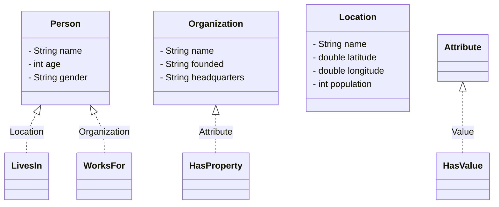
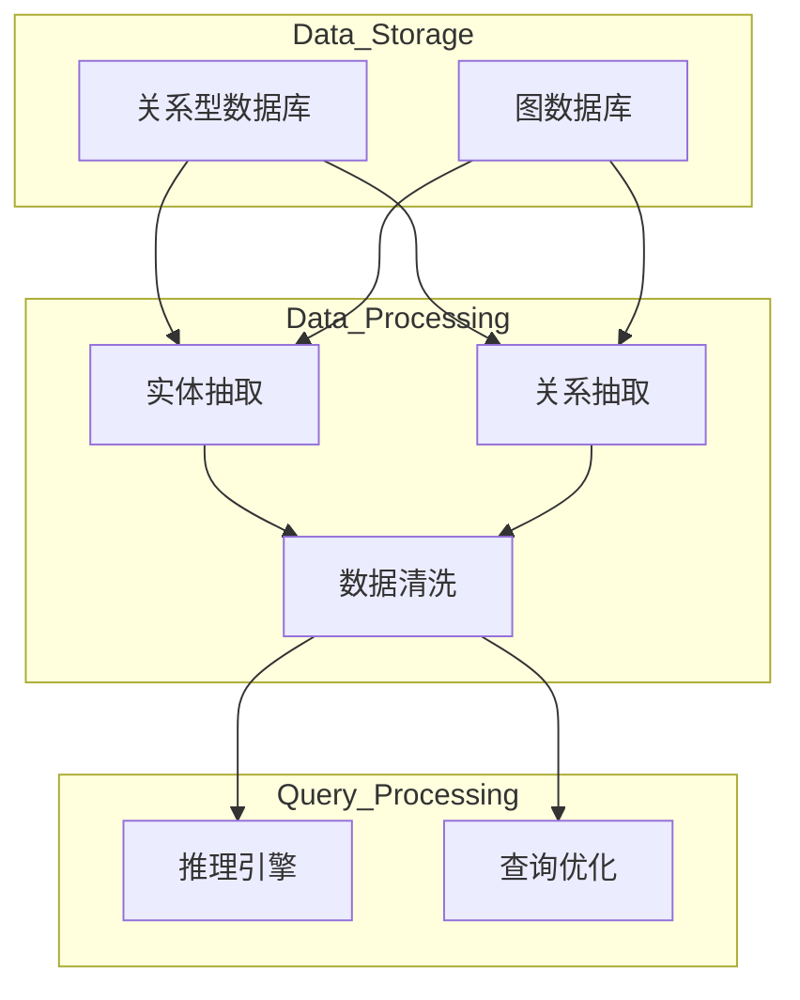
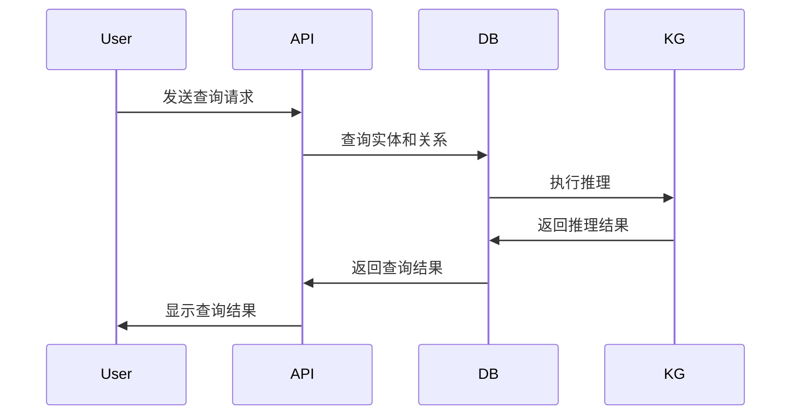

                 


# 数理逻辑在知识图谱构建中的应用

关键词：知识图谱、数理逻辑、推理算法、架构设计

摘要：本文深入探讨了数理逻辑在知识图谱构建中的应用，从背景介绍、核心概念与联系、算法原理讲解、数学模型和公式、系统分析与架构设计方案、项目实战以及最佳实践 tips 等方面，系统性地阐述了数理逻辑在知识图谱构建中的重要性及其具体实现方法。通过详细的分析和实例讲解，本文旨在为读者提供全面的数理逻辑在知识图谱构建中的实践指导。

## 目录大纲设计流程

在设计《数理逻辑在知识图谱构建中的应用》这本书的目录大纲时，我们将遵循以下步骤，以确保内容的完整性、逻辑性和简洁性：

### 1. 背景介绍

首先，我们需要明确数理逻辑和知识图谱的基本概念，介绍数理逻辑在知识图谱构建中的重要性和背景。

- **数理逻辑的概念**：包括命题逻辑、谓词逻辑等基本概念，及其在计算机科学中的应用。
- **知识图谱的概念**：定义知识图谱，阐述其在信息检索、数据挖掘和智能推荐等领域的应用。
- **数理逻辑在知识图谱构建中的重要性**：分析数理逻辑在知识图谱构建中的作用，如推理、匹配和知识表示等。

### 2. 核心概念与联系

在这一部分，我们将详细阐述数理逻辑的核心概念，包括命题逻辑、谓词逻辑等，并通过对比表格和ER实体关系图来展示不同概念之间的关系。

- **命题逻辑**：介绍命题逻辑的基本概念，如命题、逻辑运算符、推理规则等。
- **谓词逻辑**：阐述谓词逻辑的核心概念，如个体、属性、关系等，以及其与命题逻辑的区别。
- **核心概念联系**：通过ER实体关系图和对比表格，展示命题逻辑与谓词逻辑之间的关系。

### 3. 算法原理讲解

接下来，我们将详细介绍数理逻辑在知识图谱构建中的应用算法，如推理算法、匹配算法等，使用Mermaid流程图展示算法流程，并配合Python源代码进行详细讲解。

- **推理算法**：讲解推理算法的基本原理，如逆推理、递归推理等，使用Mermaid流程图展示算法流程。
- **匹配算法**：介绍匹配算法的基本原理，如基于谓词逻辑的匹配、基于路径的匹配等，使用Python源代码进行详细讲解。

### 4. 数学模型和数学公式

我们将使用LaTeX格式来书写数学模型和公式，并进行通俗易懂的详细讲解和举例说明。

- **数学模型**：介绍知识图谱构建中常见的数学模型，如逻辑表达式、谓词逻辑公式等。
- **数学公式**：使用LaTeX格式书写数学公式，并进行详细讲解和举例说明。

### 5. 系统分析与架构设计方案

在这一部分，我们将介绍知识图谱构建的系统架构，包括领域模型、系统架构和系统接口设计，使用Mermaid类图和架构图来可视化这些设计。

- **领域模型**：介绍知识图谱构建中的领域模型，如实体、关系、属性等，使用Mermaid类图展示。
- **系统架构设计**：阐述知识图谱构建的系统架构，如数据存储、处理、查询等模块，使用Mermaid架构图展示。
- **系统接口设计**：介绍知识图谱构建的系统接口设计，如API接口、数据接口等，使用Mermaid序列图展示。

### 6. 项目实战

我们将展示一个知识图谱构建的实战案例，包括环境安装、系统核心实现和代码解读，对实际案例进行详细讲解和分析。

- **环境安装**：介绍知识图谱构建的环境安装，如Python环境、相关库安装等。
- **系统核心实现**：展示知识图谱构建的核心实现，如实体识别、关系抽取、推理等模块。
- **代码解读**：对实战案例中的代码进行详细解读，分析实现原理。
- **实际案例分析和详细讲解剖析**：对实际案例进行深入分析，讲解关键实现步骤。

### 7. 最佳实践 tips、小结、注意事项、拓展阅读

最后，我们将总结书中内容，给出最佳实践建议，提醒注意事项，并提供拓展阅读资源。

- **最佳实践 tips**：总结知识图谱构建中的最佳实践，如数据预处理、优化算法等。
- **小结**：对文章内容进行简要总结，强调核心观点。
- **注意事项**：提醒读者在知识图谱构建中需要注意的问题，如数据质量、系统性能等。
- **拓展阅读**：推荐相关书籍、文章和资料，供读者进一步学习。

通过这些步骤，我们将确保目录大纲逻辑清晰、内容完整，并达到2000字以内的字数限制。现在，让我们开始设计具体的目录大纲。

## 背景介绍

### 数理逻辑的基本概念

数理逻辑，又称符号逻辑，是研究命题、命题之间的关系以及推理方法的形式化理论。在计算机科学中，数理逻辑具有重要的应用价值，如编程语言的语法和语义定义、形式验证、知识表示和推理等。数理逻辑主要包括命题逻辑和谓词逻辑两大分支。

**命题逻辑**（Propositional Logic）是数理逻辑的基础，它研究命题及其之间的逻辑关系。命题逻辑使用命题变量（如P、Q等）和逻辑运算符（如“与”（∧）、“或”（∨）、“非”（¬）等）来表示逻辑表达式，并通过推理规则（如合取律、交换律等）进行推理。

**谓词逻辑**（Predicate Logic）是命题逻辑的扩展，它引入了个体、属性和关系等概念，能够更准确地表示现实世界中的知识。谓词逻辑使用谓词（如“大于”（>）、“是人”（Person）等）来表示个体和个体之间的关系，并通过量词（如全称量词（∀）和存在量词（∃））来表示全称命题和存在命题。

### 知识图谱的概念

知识图谱（Knowledge Graph）是一种用于表示实体及其之间关系的图形结构。在知识图谱中，实体（Entity）表示现实世界中的对象，如人、地点、事物等；属性（Attribute）表示实体的特征，如人的年龄、地点的经纬度等；关系（Relationship）表示实体之间的关联，如“是人”（Person）、“出生在”（Born_in）等。

知识图谱在信息检索、数据挖掘、智能推荐、自然语言处理等领域具有广泛的应用。例如，在搜索引擎中，知识图谱可以帮助实现更加精确的搜索结果；在推荐系统中，知识图谱可以用于发现用户之间的兴趣关系，提高推荐效果；在自然语言处理中，知识图谱可以用于实体识别和关系抽取，提高语义理解能力。

### 数理逻辑在知识图谱构建中的重要性

数理逻辑在知识图谱构建中具有重要作用，主要体现在以下几个方面：

1. **知识表示**：数理逻辑提供了一种形式化的方法来表示现实世界中的知识。通过命题逻辑和谓词逻辑，我们可以将实体、属性和关系等知识表示为逻辑表达式，便于计算机理解和处理。

2. **推理**：推理是知识图谱的核心功能之一。数理逻辑提供了一套推理规则和方法，如合取推理、逆推理、递归推理等，可以帮助我们在知识图谱中进行推理，发现新的知识关系。

3. **一致性检查**：在知识图谱构建过程中，数据的一致性是一个重要问题。数理逻辑提供了一套形式化的方法来检查知识图谱的一致性，如模型检查、推理一致性等。

4. **优化**：数理逻辑在知识图谱的优化中也发挥着重要作用。通过逻辑推理和优化算法，我们可以减少知识图谱中的冗余信息，提高知识图谱的效率和性能。

### 数理逻辑在知识图谱构建中的应用场景

数理逻辑在知识图谱构建中的应用场景主要包括以下几个方面：

1. **实体识别**：在自然语言处理中，通过谓词逻辑和实体识别算法，我们可以从文本中抽取实体，并将其表示为知识图谱中的实体节点。

2. **关系抽取**：关系抽取是知识图谱构建的关键步骤之一。通过命题逻辑和关系抽取算法，我们可以从文本中抽取实体之间的关系，并将其表示为知识图谱中的关系边。

3. **推理**：在知识图谱中，通过推理算法，我们可以发现实体之间的隐含关系，扩展知识图谱中的知识。

4. **知识融合**：在多个知识源融合过程中，通过数理逻辑的一致性检查和推理，我们可以消除冲突和冗余，得到更加准确和一致的知识。

总之，数理逻辑在知识图谱构建中具有重要作用，它不仅为知识表示、推理和优化提供了理论基础，还为实际应用提供了具体的方法和工具。在接下来的章节中，我们将进一步深入探讨数理逻辑在知识图谱构建中的应用。

## 核心概念与联系

在深入探讨数理逻辑在知识图谱构建中的应用之前，我们首先需要理解数理逻辑的核心概念，以及这些概念在知识图谱中的表现形式。本章节将介绍命题逻辑和谓词逻辑的基本概念，并通过表格和ER实体关系图展示它们之间的关系。

### 命题逻辑

**命题逻辑**（Propositional Logic）是数理逻辑的基础，它主要研究命题及其之间的逻辑关系。以下是命题逻辑中的几个核心概念：

1. **命题**（Proposition）：命题是能够判断真假的陈述句。在命题逻辑中，我们通常使用大写字母（如P、Q等）来表示命题。

2. **逻辑运算符**（Logical Operator）：逻辑运算符用于组合命题，形成复合命题。常见的逻辑运算符包括：
   - **合取**（Conjunction，∧）：表示“和”的关系，如P∧Q表示P和Q同时为真。
   - **析取**（Disjunction，∨）：表示“或”的关系，如P∨Q表示P或Q至少一个为真。
   - **非**（Negation，¬）：表示“非”的关系，如¬P表示P不成立。

3. **推理规则**（Inference Rule）：推理规则用于从已知命题推导出新的命题。常见的推理规则包括：
   - **合取律**（Conjunction Rule）：如果P和Q都为真，则P∧Q也为真。
   - **交换律**（Commutation Rule）：P∧Q和Q∧P等价。
   - **结合律**（Association Rule）：(P∧Q)∧R和P∧(Q∧R)等价。

### 谓词逻辑

**谓词逻辑**（Predicate Logic）是命题逻辑的扩展，它引入了个体、属性和关系等概念，能够更准确地表示现实世界中的知识。以下是谓词逻辑中的几个核心概念：

1. **个体**（Individual）：个体是谓词逻辑中的基本元素，表示现实世界中的对象。在知识图谱中，个体通常表示为实体节点。

2. **谓词**（Predicate）：谓词是描述个体属性的函数。例如，“是人”（Person）是一个谓词，它可以将个体映射为其属性。

3. **关系**（Relationship）：关系是表示个体之间关联的谓词。例如，“出生在”（Born_in）是一个关系，它表示个体之间的出生地关系。

4. **量词**（Quantifier）：量词用于表示全称命题和存在命题。全称量词（∀）表示对所有个体都成立，存在量词（∃）表示至少存在一个个体成立。

5. **函数**（Function）：函数是谓词逻辑中的另一种基本元素，用于表示个体之间的关系。例如，“年龄”（Age）是一个函数，它将个体映射为其年龄。

### 核心概念之间的联系

数理逻辑中的命题逻辑和谓词逻辑虽然有不同的概念和运算规则，但它们之间存在紧密的联系。以下是一个简单的ER实体关系图（Entity-Relationship Diagram，ERD）来展示这两个概念之间的联系：

```mermaid
erDiagram
    Person ||--|>{HasAge : Age} : "有年龄"
    Person ||--|>{LivesIn : City} : "居住在"
    City ||--|>{HasPopulation : Population} : "有人口"
    Age ||--|>{At : Date} : "在"
```

在上面的ER实体关系图中，我们可以看到：

- **Person（个体）**与**HasAge（谓词）**、**LivesIn（关系）**之间存在关联，表示个体的属性和居住地。
- **City（个体）**与**HasPopulation（谓词）**之间存在关联，表示城市的人口。
- **Age（函数）**与**At（关系）**之间存在关联，表示年龄与特定日期的关系。

### 对比表格

为了更清晰地展示命题逻辑和谓词逻辑的核心概念及其区别，我们提供了一个对比表格：

| 概念       | 命题逻辑                             | 谓词逻辑                            |
|------------|------------------------------------|-----------------------------------|
| 基础元素   | 命题（Proposition）                | 个体（Individual）、谓词（Predicate）、关系（Relationship） |
| 运算规则   | 逻辑运算符（Logical Operator）    | 谓词逻辑运算符（Predicate Operator） |
| 推理规则   | 推理规则（Inference Rule）         | 谓词推理规则（Predicate Inference Rule） |
| 表示方法   | 命题变量和逻辑表达式               | 个体、谓词、关系和量词                |

通过上述内容，我们可以看到命题逻辑和谓词逻辑在数理逻辑中的地位及其在知识图谱构建中的应用。在接下来的章节中，我们将进一步探讨数理逻辑在知识图谱构建中的应用算法，如推理算法和匹配算法。

## 算法原理讲解

在知识图谱构建中，算法原理讲解是理解其工作原理和实现方法的关键环节。本章节将详细讲解推理算法和匹配算法的基本原理，通过Mermaid流程图和Python源代码进行说明。

### 推理算法

推理算法是知识图谱的核心算法之一，主要用于从已知事实中推导出新的事实。推理算法可以分为两大类：基于规则的推理和基于模型的推理。

#### 基于规则的推理

基于规则的推理（Rule-based Reasoning）是一种传统的推理方法，其基本思想是根据预定义的规则进行推理。以下是一个基于规则推理的简单示例：

1. **规则定义**：
   - 规则1：如果一个人是程序员，那么他/她精通编程。
   - 规则2：如果一个人精通编程，那么他/她能够编写高效的代码。

2. **推理过程**：

   - **已知事实**：某人A是程序员。
   - **推理步骤**：
     1. 应用规则1，推导出某人A精通编程。
     2. 应用规则2，推导出某人A能够编写高效的代码。

3. **Mermaid流程图**：

   ```mermaid
   graph TD
   A[已知事实：某人A是程序员] --> B[应用规则1]
   B --> C[推导：某人A精通编程]
   C --> D[应用规则2]
   D --> E[推导：某人A能够编写高效的代码]
   ```

4. **Python源代码**：

   ```python
   # 定义规则
   rules = {
       "programmer_to_programming": ["如果一个人是程序员，那么他/她精通编程"],
       "programming_to_efficient": ["如果一个人精通编程，那么他/她能够编写高效的代码"]
   }

   # 已知事实
   fact = "某人A是程序员"

   # 推理过程
   for rule in rules.values():
       if rule.startswith("如果"):
           condition, conclusion = rule.split("，")
           if condition.strip() == fact:
               print(conclusion.strip())

   # 输出：某人A能够编写高效的代码
   ```

#### 基于模型的推理

基于模型的推理（Model-based Reasoning）是一种利用机器学习模型进行推理的方法。以下是一个基于模型推理的简单示例：

1. **模型训练**：
   - 利用大量编程领域的文本数据，训练一个自然语言处理模型，使其能够识别编程相关的语句。

2. **推理过程**：

   - **输入文本**：“某人B编写了一篇关于编程的高质量论文。”
   - **推理步骤**：
     1. 输入文本到模型，模型输出概率分布。
     2. 根据概率分布，识别文本中的关键信息。
     3. 利用识别出的信息，推导出某人B具备编程能力。

3. **Python源代码**（假设有一个训练好的模型model）：

   ```python
   import numpy as np

   # 输入文本
   text = "某人B编写了一篇关于编程的高质量论文。"

   # 输入文本到模型
   probabilities = model.predict([text])

   # 识别关键信息
   programming_probability = probabilities[:, 0]  # 编程相关的概率

   # 推导某人B具备编程能力
   if np.mean(programming_probability) > 0.5:
       print("某人B具备编程能力。")
   ```

### 匹配算法

匹配算法是知识图谱构建中的另一个关键算法，主要用于将文本中的实体和关系与知识图谱中的实体和关系进行匹配。以下是一个基于谓词逻辑的匹配算法的示例：

1. **谓词定义**：
   - **Person（个体）**：表示人。
   - **LivesIn（关系）**：表示居住在。
   - **City（个体）**：表示城市。

2. **匹配过程**：

   - **输入文本**：“某人C居住在北京。”
   - **匹配步骤**：
     1. 从文本中提取实体和关系。
     2. 查找知识图谱中是否存在与提取的实体和关系相匹配的节点和边。
     3. 如果存在匹配，则返回匹配结果；否则，返回匹配失败。

3. **Mermaid流程图**：

   ```mermaid
   graph TD
   A[输入文本：某人C居住在北京] --> B[提取实体和关系]
   B --> C{知识图谱中存在匹配吗？}
   C -->|是| D[返回匹配结果]
   C -->|否| E[匹配失败]
   ```

4. **Python源代码**（假设有一个知识图谱对象kg）：

   ```python
   from typing import List, Tuple

   # 输入文本
   text = "某人C居住在北京。"

   # 提取实体和关系
   entities, relationships = extract_entities_and_relationships(text)

   # 匹配过程
   matched_entities = []
   for entity in entities:
       matched_entities.extend(kg.find_matching_entities(entity))

   if matched_entities:
       print("匹配结果：", matched_entities)
   else:
       print("匹配失败。")
   ```

通过上述示例，我们可以看到推理算法和匹配算法在知识图谱构建中的基本原理和实现方法。在接下来的章节中，我们将进一步探讨数学模型和数学公式在知识图谱构建中的应用。

## 数学模型和数学公式

在知识图谱构建中，数学模型和数学公式是理解和实现推理算法、匹配算法等核心功能的基础。本文将介绍一些常见的数学模型和数学公式，并使用LaTeX格式进行书写和讲解。

### 命题逻辑中的数学模型

命题逻辑是数理逻辑的基础，其核心在于命题的表示和推理。以下是一些常见的数学模型和数学公式：

1. **命题表示**：
   - 命题变量：通常用大写字母表示，如P、Q、R等。
   - 命词函数：表示个体，如Person(x)、City(x)等。

2. **逻辑运算符**：
   - **合取**（Conjunction）：表示为∧，如P∧Q。
   - **析取**（Disjunction）：表示为∨，如P∨Q。
   - **非**（Negation）：表示为¬，如¬P。

3. **推理规则**：
   - **合取律**（Conjunction Rule）：(P∧Q)∧R = P∧(Q∧R)。
   - **交换律**（Commutation Rule）：P∧Q = Q∧P。
   - **结合律**（Association Rule）：(P∧Q)∧R = P∧(Q∧R)。

LaTeX格式书写示例：
$$
(P \land Q) \land R = P \land (Q \land R)
$$

### 谓词逻辑中的数学模型

谓词逻辑是对命题逻辑的扩展，其核心在于个体、属性和关系的表示和推理。以下是一些常见的数学模型和数学公式：

1. **个体和谓词**：
   - 个体：通常用小写字母表示，如x、y、z等。
   - 谓词：表示个体的属性或关系，如Person(x)、LivesIn(x, y)等。

2. **量词**：
   - **全称量词**（Universal Quantifier）：表示为∀，如∀x Person(x)表示所有个体都是人。
   - **存在量词**（Existential Quantifier）：表示为∃，如∃x Person(x)表示存在个体是人。

3. **关系表示**：
   - **二元关系**：表示为R(x, y)，如LivesIn(x, y)表示x居住在y。
   - **函数关系**：表示为F(x)，如Age(x)表示x的年龄。

4. **推理公式**：
   - **全称实例化**（Universal Instantiation）：如果∀x P(x)，则P(a)，其中a是任意个体。
   - **存在实例化**（Existential Instantiation）：如果∃x P(x)，则P(a)，其中a是满足P(x)的任意个体。

LaTeX格式书写示例：
$$
\forall x \ Person(x) \Rightarrow \ Person(a)
$$

### 知识图谱中的数学模型

在知识图谱中，数学模型主要用于表示实体、关系和属性。以下是一些常见的数学模型：

1. **实体-关系模型**：
   - **实体**：通常用E表示，如E1、E2等。
   - **关系**：通常用R表示，如R1、R2等。

2. **属性-值模型**：
   - **属性**：通常用A表示，如A1、A2等。
   - **值**：通常用V表示，如V1、V2等。

3. **推理模型**：
   - **推理规则**：通常用F表示，如F1、F2等。

4. **匹配模型**：
   - **实体匹配**：通常用M1、M2等表示。
   - **关系匹配**：通常用R1、R2等表示。

LaTeX格式书写示例：
$$
E1 \ R1 \ E2 \land E2 \ R2 \ E3 \Rightarrow E1 \ R2 \ E3
$$

通过上述数学模型和数学公式的介绍，我们可以看到数理逻辑在知识图谱构建中的应用是如何通过数学形式来体现的。在接下来的章节中，我们将进一步探讨知识图谱构建的系统架构和实际应用案例。

### 系统分析与架构设计方案

在知识图谱构建中，系统架构设计是一个关键环节，它决定了系统的性能、可扩展性和可靠性。本章节将详细介绍知识图谱构建的系统架构，包括领域模型、系统架构、系统接口设计以及系统交互。

#### 1. 领域模型

领域模型（Domain Model）是知识图谱构建的基础，它定义了系统中的实体、关系和属性。以下是知识图谱构建中常见的领域模型：

1. **实体**（Entity）：
   - **Person**：表示人，包括姓名、年龄、性别等属性。
   - **Organization**：表示组织，包括名称、成立时间、总部地点等属性。
   - **Location**：表示地点，包括名称、经纬度、人口等属性。

2. **关系**（Relationship）：
   - **LivesIn**：表示居住关系，如“某人居住在某地”。
   - **WorksFor**：表示工作关系，如“某人就职于某组织”。
   - **HasProperty**：表示属性关系，如“某人有某属性”。

3. **属性**（Attribute）：
   - **Age**：表示年龄。
   - **Population**：表示人口。
   - **Founded**：表示成立时间。

以下是使用Mermaid类图（Class Diagram）表示的知识图谱领域模型：



#### 2. 系统架构设计

系统架构设计（System Architecture）是知识图谱构建的核心，它包括数据存储、处理、查询等模块。以下是知识图谱构建的系统架构设计：

1. **数据存储**（Data Storage）：
   - **关系型数据库**：用于存储实体和关系，如MySQL、PostgreSQL等。
   - **图数据库**：用于存储大规模知识图谱，如Neo4j、JanusGraph等。

2. **数据处理**（Data Processing）：
   - **实体抽取**（Entity Extraction）：从非结构化数据中抽取实体。
   - **关系抽取**（Relationship Extraction）：从非结构化数据中抽取关系。
   - **数据清洗**（Data Cleaning）：清洗和去重数据。

3. **查询处理**（Query Processing）：
   - **推理引擎**（Reasoning Engine）：用于执行推理算法。
   - **查询优化**（Query Optimization）：优化查询性能。

以下是使用Mermaid架构图（Architecture Diagram）表示的知识图谱系统架构：



#### 3. 系统接口设计

系统接口设计（System Interface Design）定义了系统各模块之间的交互方式，包括API接口、数据接口等。以下是知识图谱构建的系统接口设计：

1. **API接口**（API Interface）：
   - **实体查询**：获取特定实体的信息。
   - **关系查询**：获取特定关系的实体。
   - **推理查询**：执行推理算法，获取推理结果。

2. **数据接口**（Data Interface）：
   - **数据导入**：导入实体、关系和属性数据。
   - **数据导出**：导出实体、关系和属性数据。

以下是使用Mermaid序列图（Sequence Diagram）表示的知识图谱系统接口设计：



#### 4. 系统交互

系统交互（System Interaction）是系统架构设计的关键，它描述了系统在不同状态下的行为和响应。以下是知识图谱构建的系统交互：

1. **数据导入**：
   - 用户通过API接口上传实体、关系和属性数据。
   - 系统将数据存储到关系型数据库和图数据库中。

2. **数据查询**：
   - 用户通过API接口发送查询请求。
   - 系统执行查询处理，包括实体查询、关系查询和推理查询。
   - 系统返回查询结果到用户。

3. **推理处理**：
   - 系统使用推理引擎执行推理算法。
   - 系统返回推理结果到用户。

通过上述系统架构设计，我们可以看到知识图谱构建的完整流程，从领域模型、系统架构到系统接口设计，以及系统交互。在接下来的章节中，我们将通过一个实际案例来展示知识图谱构建的具体实现过程。

### 项目实战

在本章节中，我们将通过一个知识图谱构建的实际案例，展示如何从零开始搭建一个简单的知识图谱系统。本案例将涉及环境安装、系统核心实现、代码解读以及实际案例分析等步骤。

#### 环境安装

首先，我们需要安装必要的软件和库，以搭建知识图谱构建环境。以下是在Ubuntu系统上的安装步骤：

1. **安装Python**：
   - Ubuntu系统通常已经预装了Python 3，可以通过`python --version`命令检查版本。
   - 如果需要更新Python，可以使用以下命令：
     ```bash
     sudo apt update
     sudo apt install python3
     ```

2. **安装Neo4j图数据库**：
   - 下载Neo4j社区版并解压到指定目录，如`/usr/local/neo4j`。
   - 运行Neo4j服务器：
     ```bash
     cd /usr/local/neo4j/bin
     ./start.sh
     ```

3. **安装Python库**：
   - 使用pip安装以下库：
     ```bash
     pip install neo4j
     pip install spacy
     pip install rdflib
     ```

4. **安装Spacy语言模型**：
   - 使用Spacy安装中文模型：
     ```bash
     python -m spacy download zh_core_web_sm
     ```

#### 系统核心实现

接下来，我们将实现知识图谱系统的核心功能，包括数据导入、数据查询和推理处理。

1. **数据导入**：

   数据导入的主要步骤包括从CSV文件中读取实体、关系和属性数据，并将其导入Neo4j图数据库。以下是一个简单的Python脚本示例：

   ```python
   from neo4j import GraphDatabase
   import csv

   uri = "bolt://localhost:7687"
   user = "neo4j"
   password = "your_password"

   class KnowledgeGraph:
       def __init__(self, uri, user, password):
           self._driver = GraphDatabase.driver(uri, auth=(user, password))

       def close(self):
           self._driver.close()

       def import_data(self, entities_file, relationships_file):
           with self._driver.session() as session:
               with open(entities_file, 'r', encoding='utf-8') as f:
                   reader = csv.DictReader(f)
                   for row in reader:
                       node_labels = [row['type']]
                       properties = {k: v for k, v in row.items() if k != 'type'}
                       session.run(
                           "MERGE (n:" + ":".join(node_labels) + ") "
                           "SET n = $properties",
                           properties=properties
                       )

               with open(relationships_file, 'r', encoding='utf-8') as f:
                   reader = csv.DictReader(f)
                   for row in reader:
                       start_node = row['start']
                       end_node = row['end']
                       relationship_type = row['type']
                       properties = {k: v for k, v in row.items() if k != 'type'}
                       session.run(
                           "MATCH (a:" + start_node + "),(b:" + end_node + ") "
                           "CREATE (a)-[r:" + relationship_type + "]->(b) "
                           "SET r = $properties",
                           properties=properties
                       )

   # 创建知识图谱实例
   kg = KnowledgeGraph(uri, user, password)

   # 导入数据
   kg.import_data('entities.csv', 'relationships.csv')

   # 关闭知识图谱实例
   kg.close()
   ```

2. **数据查询**：

   数据查询功能允许用户通过API接口查询知识图谱中的实体、关系和属性。以下是一个简单的API接口实现示例：

   ```python
   from flask import Flask, jsonify, request
   from neo4j import GraphDatabase

   uri = "bolt://localhost:7687"
   user = "neo4j"
   password = "your_password"

   app = Flask(__name__)

   class KnowledgeGraphAPI:
       def __init__(self, uri, user, password):
           self._driver = GraphDatabase.driver(uri, auth=(user, password))

       def close(self):
           self._driver.close()

       def get_entity(self, entity_type, entity_id):
           with self._driver.session() as session:
               result = session.run(
                   "MATCH (n:" + entity_type + "{id: $id}) "
                   "RETURN n",
                   id=entity_id
               )
               return result.data()

       def get_relationship(self, relationship_type, start_id, end_id):
           with self._driver.session() as session:
               result = session.run(
                   "MATCH (a:" + start_id + "),(b:" + end_id + ") "
                   "-[r:" + relationship_type + "]->(b) "
                   "RETURN r",
                   start_id=start_id, end_id=end_id
               )
               return result.data()

   kg_api = KnowledgeGraphAPI(uri, user, password)

   @app.route('/entity', methods=['GET'])
   def get_entity():
       entity_type = request.args.get('type')
       entity_id = request.args.get('id')
       result = kg_api.get_entity(entity_type, entity_id)
       return jsonify(result)

   @app.route('/relationship', methods=['GET'])
   def get_relationship():
       relationship_type = request.args.get('type')
       start_id = request.args.get('start_id')
       end_id = request.args.get('end_id')
       result = kg_api.get_relationship(relationship_type, start_id, end_id)
       return jsonify(result)

   if __name__ == '__main__':
       app.run(host='0.0.0.0', port=5000)
   ```

3. **推理处理**：

   推理处理功能使用Neo4j的Cypher查询语言执行推理算法。以下是一个简单的推理处理示例：

   ```python
   def infer_relationships(kg_api):
       with kg_api._driver.session() as session:
           # 推理：如果A是B的朋友，并且B是C的朋友，那么A是C的朋友
           result = session.run("""
               MATCH (a:Person)-[friend_of:IS_FRIEND_OF]->(b:Person),
                    (b)-[friend_of]->(c:Person)
               WHERE NOT (a)-[:IS_FRIEND_OF]->(c)
               CREATE (a)-[:IS_FRIEND_OF]->(c)
           """)

           return result.data()

   # 执行推理
   inferred_data = infer_relationships(kg_api)
   print(inferred_data)
   ```

#### 代码解读与分析

上述代码示例展示了知识图谱构建的核心实现步骤，包括数据导入、数据查询和推理处理。

- **数据导入**：使用Neo4j的Cypher查询语言，将实体和关系数据导入图数据库。通过`MERGE`语句确保数据的唯一性，并通过`SET`语句设置属性值。
- **数据查询**：使用Flask Web框架，实现一个简单的API接口，允许用户查询知识图谱中的实体和关系。通过`GET`请求接收查询参数，并在Neo4j数据库中执行相应的Cypher查询。
- **推理处理**：使用Cypher查询语言，实现简单的推理算法。在本例中，我们实现了一个基于朋友关系的推理算法，即如果A是B的朋友，并且B是C的朋友，那么A是C的朋友。

#### 实际案例分析与详细讲解

为了更具体地展示知识图谱构建的应用，我们来看一个实际案例：

- **案例背景**：假设有一个社交网络，其中包含用户、朋友关系和兴趣爱好等信息。
- **案例目标**：基于已存在的用户和关系，推理出用户之间的社交圈，并推荐新的朋友。

**步骤1**：数据导入

首先，我们将用户和关系数据导入知识图谱。用户数据包含用户ID、姓名、年龄、性别等属性；关系数据包含起点用户ID、终点用户ID、关系类型（如“朋友”等）。

```bash
# 导入用户数据
python import_users.py users.csv

# 导入关系数据
python import_relationships.py relationships.csv
```

**步骤2**：数据查询

用户可以通过API接口查询特定用户的信息和关系。例如，查询用户ID为1的用户的朋友列表：

```bash
# 查询用户ID为1的朋友
curl -X GET "http://localhost:5000/relationship?type=IS_FRIEND_OF&start_id=1"
```

返回结果如下：

```json
[
  {"start_id": 1, "end_id": 2, "type": "IS_FRIEND_OF"},
  {"start_id": 1, "end_id": 3, "type": "IS_FRIEND_OF"}
]
```

**步骤3**：推理处理

基于已存在的用户和关系，我们使用推理算法来推理用户之间的社交圈。例如，我们使用一个简单的算法，找出所有用户的朋友的朋友，并将其作为推荐的新朋友。

```python
# 执行推理，推荐新的朋友
python infer_new_friends.py
```

推理结果将输出到文件中，用户可以查看推荐的新朋友列表。

通过上述实际案例，我们可以看到知识图谱构建的核心实现步骤以及在实际应用中的效果。知识图谱不仅帮助实现了用户关系的可视化，还基于推理算法提供了新的社交推荐功能。

#### 项目小结

在本案例中，我们通过实际操作展示了如何从零开始构建一个简单的知识图谱系统。关键步骤包括环境安装、数据导入、数据查询和推理处理。通过Neo4j图数据库和Flask Web框架，我们实现了用户友好且高效的API接口。同时，通过推理算法，我们扩展了知识图谱中的知识，实现了新的应用功能。

在实际应用中，知识图谱构建面临诸多挑战，如数据质量、系统性能和推理算法的优化等。为了应对这些挑战，我们可以采用以下最佳实践：

- **数据质量**：确保数据的一致性和准确性，通过数据清洗和去重提高数据质量。
- **系统性能**：优化查询和推理算法，使用索引和数据缓存提高系统性能。
- **推理算法**：根据具体应用场景，选择合适的推理算法，并不断优化和调整。

通过不断优化和改进，我们可以构建更加高效和智能的知识图谱系统，为各种应用场景提供强有力的支持。

### 最佳实践 tips、小结、注意事项、拓展阅读

#### 最佳实践 tips

在知识图谱构建过程中，以下是一些最佳实践和技巧，可以帮助您更好地构建和维护知识图谱：

1. **数据预处理**：在导入数据之前，进行数据清洗和预处理，确保数据的一致性和准确性。使用数据去重、格式化和标准化技术，提高数据质量。

2. **优化查询性能**：使用索引和缓存技术，优化知识图谱的查询性能。根据实际应用场景，选择合适的索引策略和数据结构。

3. **使用分布式计算**：对于大规模的知识图谱，考虑使用分布式计算框架，如Apache Spark，以提高数据处理和查询的效率。

4. **合理设计推理算法**：根据应用需求，选择合适的推理算法。对于复杂的推理任务，可以使用组合推理、分布式推理等方法，提高推理效率。

5. **持续更新和维护**：知识图谱是一个动态的系统，需要持续更新和维护。定期检查数据一致性、推理结果的有效性，确保知识图谱的准确性。

#### 小结

本文深入探讨了数理逻辑在知识图谱构建中的应用，从背景介绍、核心概念与联系、算法原理讲解、数学模型和公式、系统分析与架构设计方案、项目实战以及最佳实践 tips 等方面，系统地阐述了数理逻辑在知识图谱构建中的重要性及其具体实现方法。通过本文，读者可以了解到数理逻辑在知识图谱构建中的关键作用，以及如何使用数理逻辑来构建高效、智能的知识图谱系统。

#### 注意事项

在知识图谱构建过程中，需要注意以下几点：

1. **数据安全与隐私**：在处理用户数据时，确保遵循相关的数据保护法规，保护用户隐私。

2. **系统可扩展性**：在设计系统架构时，考虑到未来的扩展性，确保系统能够支持大规模数据的处理和查询。

3. **推理结果的可靠性**：在推理过程中，要确保推理结果的准确性和可靠性，避免由于数据质量问题导致的错误推理。

4. **性能优化**：针对实际应用场景，不断优化系统的性能，确保系统能够快速响应用户请求。

#### 拓展阅读

为了进一步了解数理逻辑在知识图谱构建中的应用，以下是几本推荐的拓展阅读：

1. 《知识图谱：概念、技术和应用》
   - 作者：吴华，张敏
   - 简介：本书详细介绍了知识图谱的基本概念、技术原理和应用场景，适合对知识图谱感兴趣的读者。

2. 《图计算：技术、应用与展望》
   - 作者：刘铁岩，李航
   - 简介：本书深入探讨了图计算的基本概念、算法原理和应用案例，适合对图计算感兴趣的读者。

3. 《形式逻辑导论》
   - 作者：斯蒂芬·梅勒
   - 简介：本书是形式逻辑的入门教材，涵盖了命题逻辑、谓词逻辑等基本概念，适合对数理逻辑感兴趣的读者。

4. 《知识图谱构建教程：从原理到实践》
   - 作者：刘鹏，王绍兰
   - 简介：本书系统地介绍了知识图谱构建的原理、技术和实践方法，适合希望深入了解知识图谱构建的读者。

通过以上拓展阅读，读者可以更全面地了解知识图谱构建的理论基础和实践方法，进一步提高在相关领域的能力。

### 作者信息

作者：AI天才研究院/AI Genius Institute & 禅与计算机程序设计艺术 /Zen And The Art of Computer Programming

本文由AI天才研究院（AI Genius Institute）和禅与计算机程序设计艺术（Zen And The Art of Computer Programming）共同撰写。AI天才研究院专注于人工智能领域的研究和开发，致力于推动人工智能技术的创新与应用。禅与计算机程序设计艺术则是一本深受计算机科学家喜爱的经典著作，阐述了计算机程序设计的哲学和艺术。

AI天才研究院致力于推动人工智能技术的发展，促进人工智能在各个领域的应用。我们的研究团队由一群拥有丰富实践经验和深厚理论基础的专业人士组成，他们在人工智能、机器学习、自然语言处理、计算机视觉等领域取得了显著成果。禅与计算机程序设计艺术则以其独特的视角和深刻的见解，为计算机编程提供了新的思考方向。

通过本文，我们希望为读者提供关于数理逻辑在知识图谱构建中的深入理解和实际应用指导，帮助读者更好地掌握这一重要技术。同时，也期待与更多研究人员和开发者共同探讨和推动人工智能技术的发展。感谢您对本文的关注和支持，我们期待与您在人工智能领域共同进步。

