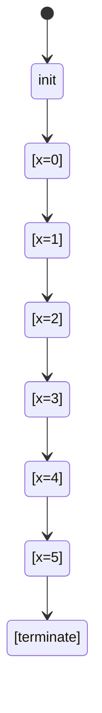
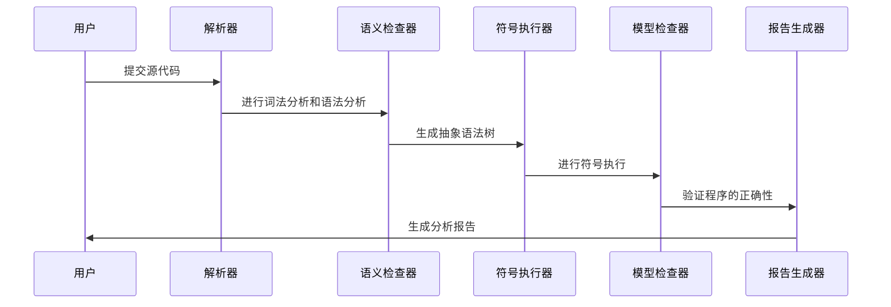
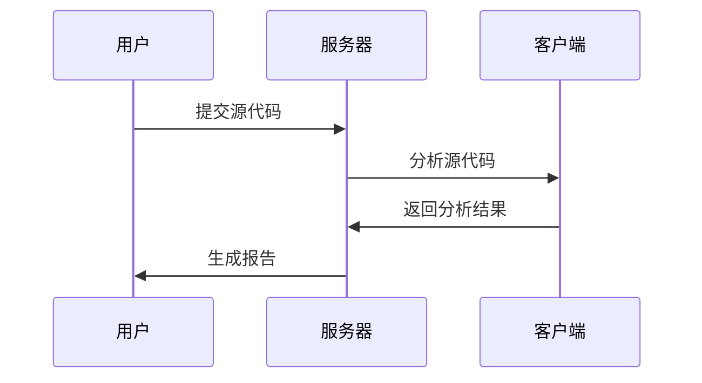

                 

### 引言

在计算机科学和软件工程领域，程序静态分析是一项至关重要的技术。它允许开发者在不实际运行程序的情况下，对源代码进行深入的分析和评估，从而发现潜在的错误、漏洞和性能瓶颈。数理逻辑作为一门研究推理和证明的数学分支，其严谨的推理方法和精确的表达形式，为程序静态分析提供了强有力的理论基础。

#### 什么是数理逻辑？

数理逻辑，又称形式逻辑，是一种基于符号和数学方法来描述和推理的学科。它主要研究命题、语句的真值、推理规则以及证明过程。在计算机科学中，数理逻辑的应用主要体现在以下几个方面：

1. **命题逻辑**：用于描述程序中的条件和判断，提供逻辑运算和推理的基础。
2. **谓词逻辑**：用于描述复杂的关系和属性，为程序语义分析提供支持。
3. **形式验证**：利用数学证明来验证程序的属性和正确性，确保程序的行为符合预期。

#### 程序静态分析的概念和重要性

程序静态分析是一种在不执行程序的情况下，对程序代码进行审查和分析的方法。这种方法可以在开发早期阶段发现代码中的错误和潜在问题，从而提高软件的质量和可靠性。程序静态分析的重要性体现在以下几个方面：

1. **提前发现问题**：静态分析可以帮助开发者在代码编写阶段就发现潜在的错误，避免在实际部署后才发现问题，从而节省时间和成本。
2. **提升软件质量**：通过静态分析，可以识别代码中的重复、冗余和不一致等问题，提高代码的可读性和可维护性。
3. **保障系统安全**：静态分析可以检测代码中的安全漏洞，如SQL注入、跨站脚本攻击等，提高系统的安全性。

#### 数理逻辑在程序静态分析中的应用

数理逻辑在程序静态分析中的应用主要体现在以下几个方面：

1. **抽象语法树分析**：通过数理逻辑的方法，可以对程序代码进行语法解析，生成抽象语法树（AST），从而更方便地进行后续的分析和处理。
2. **符号执行**：利用数理逻辑的推理能力，对程序进行符号执行，生成程序在各种输入下的执行路径和结果，从而发现潜在的问题。
3. **模型检查**：通过数理逻辑的数学模型，对程序的行为进行形式化验证，确保程序满足预定的属性和约束。

本文将深入探讨数理逻辑在程序静态分析中的应用，通过逐步分析，展示其在抽象语法树分析、符号执行和模型检查等方面的具体应用方法和技术原理。

#### 文章关键词

- 数理逻辑
- 程序静态分析
- 抽象语法树
- 符号执行
- 模型检查
- 形式验证

#### 文章摘要

本文旨在探讨数理逻辑在程序静态分析中的应用，通过分析抽象语法树、符号执行和模型检查等技术，深入探讨数理逻辑如何帮助开发者更高效地分析和验证程序的正确性和安全性。文章将分为以下几个部分：首先介绍数理逻辑的基本概念和应用场景；然后详细讲解抽象语法树分析的方法和原理；接着阐述符号执行的过程和实现技术；最后探讨模型检查的数学模型和验证方法。通过本文的阅读，读者将了解到数理逻辑在程序静态分析中的重要作用，以及如何利用数理逻辑方法提高软件的质量和可靠性。

---

**接下来，我们将从数理逻辑的基本概念开始，逐步深入探讨其在程序静态分析中的应用。**

## 数理逻辑的基本概念及应用场景

数理逻辑是一门研究命题、推理和证明的数学学科，它以严格的符号表示和逻辑推理为基础，提供了描述和分析复杂系统的高效工具。在计算机科学中，数理逻辑的应用极为广泛，尤其在程序静态分析领域，其精确的推理方法和形式化的表达形式为代码审查和程序验证提供了坚实的理论基础。

### 命题逻辑

命题逻辑是数理逻辑的基础部分，主要研究命题的真值和逻辑运算。命题是一个可以判断真假的陈述句，而真值则是命题所具有的真或假属性。在命题逻辑中，常用的逻辑运算包括：

1. **合取（AND）**：表示两个命题同时为真的情况。
2. **析取（OR）**：表示两个命题中至少有一个为真的情况。
3. **非（NOT）**：表示对一个命题取反。
4. **蕴含（→）**：表示如果一个命题为真，则另一个命题也为真。

这些逻辑运算可以通过逻辑表达式来表示，例如：
$$ A \land B $$
$$ A \lor B $$
$$ \neg A $$
$$ A \rightarrow B $$

在程序静态分析中，命题逻辑常用于描述程序的逻辑结构和执行条件。例如，一个条件语句 `if (x > 0) { ... }` 可以用命题逻辑表示为 `P → Q`，其中 `P` 表示条件 `x > 0`，`Q` 表示执行体中的代码块。

### 谓词逻辑

谓词逻辑扩展了命题逻辑，引入了变量和量词，可以描述更复杂的逻辑关系。谓词逻辑中的谓词是一个关于变量的命题，量词用于指定变量取值的全集或部分集。

1. **存在量词（∃）**：表示存在至少一个变量满足某个谓词。
2. **全称量词（∀）**：表示所有变量都满足某个谓词。

谓词逻辑的表达式例如：
$$ \exists x \; P(x) $$
$$ \forall x \; P(x) $$

在程序静态分析中，谓词逻辑可以用于描述程序中的变量约束和函数关系。例如，一个循环条件 `while (i < n) { ... }` 可以用谓词逻辑表示为 `∀i (i < n → Q(i))`，其中 `i` 是循环变量，`n` 是循环的终止条件，`Q(i)` 是循环体内的操作。

### 形式验证

形式验证是一种利用数学方法来验证程序属性的方法。它通过建立程序的数学模型，并使用数理逻辑的推理规则，证明程序满足特定的属性或约束。形式验证在程序静态分析中具有重要作用，可以帮助开发者确保程序的正确性和安全性。

形式验证的基本过程包括：

1. **建立数学模型**：将程序抽象为数学模型，如谓词公式、状态机等。
2. **定义属性或约束**：明确需要验证的程序属性或约束，如安全性、正确性等。
3. **应用推理规则**：使用数理逻辑的推理规则，证明程序模型满足预定的属性或约束。

例如，一个程序的安全性属性可以用谓词逻辑公式 `∀x, y (Safety(x, y) → NoDanger(x, y))` 来描述，其中 `Safety(x, y)` 表示输入 `x` 和 `y` 是安全的，`NoDanger(x, y)` 表示没有危险发生。形式验证的目标就是证明该公式在所有情况下都成立。

### 数理逻辑在程序静态分析中的应用场景

1. **抽象语法树分析**：通过数理逻辑的命题逻辑和谓词逻辑，可以有效地构建和解析程序的抽象语法树，从而进行后续的语义分析和代码优化。
2. **符号执行**：利用数理逻辑的推理能力，可以对程序进行符号执行，生成各种输入条件下的执行路径和结果，发现潜在的错误和漏洞。
3. **模型检查**：通过建立程序的数学模型，并使用数理逻辑的推理规则，可以验证程序的行为是否满足预定的属性或约束，确保程序的正确性和安全性。

### 总结

数理逻辑为程序静态分析提供了严谨的推理方法和形式化的表达工具，通过命题逻辑、谓词逻辑和形式验证等基本概念，可以有效地分析和验证程序的正确性和安全性。在接下来的章节中，我们将详细探讨数理逻辑在具体程序静态分析技术中的应用，进一步展示其强大的分析和验证能力。

### 核心概念与联系

在深入探讨数理逻辑在程序静态分析中的应用之前，我们需要明确几个核心概念及其相互联系。这些概念包括命题逻辑、谓词逻辑和形式验证，它们各自有着独特的原理和特点，但又紧密相关，共同构成了数理逻辑在程序静态分析中的坚实基础。

#### 命题逻辑

命题逻辑是数理逻辑的基础部分，它研究命题的真值和逻辑运算。命题是一个可以判断真假的陈述句，而真值则是命题所具有的真或假属性。命题逻辑的基本概念包括：

1. **命题变量**：表示命题的符号，如 `P`、`Q`、`R` 等。
2. **逻辑运算**：包括合取（AND）、析取（OR）、非（NOT）以及蕴含（→）等。
3. **真值表**：列出所有可能的情况以及相应命题逻辑运算的结果。

例如，一个简单的命题逻辑表达式可以表示为 `P ∧ Q`，其真值表如下：

| P | Q | P ∧ Q |
|---|---|-------|
| T | T | T     |
| T | F | F     |
| F | T | F     |
| F | F | F     |

在程序静态分析中，命题逻辑用于描述程序中的条件和判断，如条件语句 `if (x > 0) { ... }` 可以表示为 `x > 0 → Q`，其中 `x > 0` 是条件命题，`Q` 是条件下的代码块。

#### 谓词逻辑

谓词逻辑是命题逻辑的扩展，它引入了变量和量词，可以描述更复杂的逻辑关系。谓词逻辑中的谓词是一个关于变量的命题，量词用于指定变量取值的全集或部分集。

1. **谓词**：表示变量属性的命题，如 `P(x)` 表示 `x` 满足某种属性。
2. **量词**：包括存在量词（∃）和全称量词（∀），用于描述变量的取值范围。
3. **谓词公式**：由谓词、变量、量词和逻辑运算组成的复合命题。

例如，谓词逻辑表达式 `∀x (x > 0 → P(x))` 表示对于所有 `x`，如果 `x > 0`，则 `P(x)` 为真。

在程序静态分析中，谓词逻辑可以用于描述程序中的变量约束和函数关系。例如，一个循环条件 `while (i < n) { ... }` 可以用谓词逻辑表示为 `∀i (i < n → Q(i))`，其中 `i` 是循环变量，`n` 是循环的终止条件，`Q(i)` 是循环体内的操作。

#### 形式验证

形式验证是一种利用数学方法来验证程序属性的方法。它通过建立程序的数学模型，并使用数理逻辑的推理规则，证明程序满足特定的属性或约束。形式验证的基本过程包括：

1. **建立数学模型**：将程序抽象为数学模型，如谓词公式、状态机等。
2. **定义属性或约束**：明确需要验证的程序属性或约束，如安全性、正确性等。
3. **应用推理规则**：使用数理逻辑的推理规则，证明程序模型满足预定的属性或约束。

例如，一个程序的安全性属性可以用谓词逻辑公式 `∀x, y (Safety(x, y) → NoDanger(x, y))` 来描述，其中 `Safety(x, y)` 表示输入 `x` 和 `y` 是安全的，`NoDanger(x, y)` 表示没有危险发生。形式验证的目标就是证明该公式在所有情况下都成立。

#### 概念属性特征对比表格

以下是一个简单的概念属性特征对比表格，展示命题逻辑、谓词逻辑和形式验证的基本属性和特点：

| 概念 | 属性特征 |
| --- | --- |
| 命题逻辑 | - 基础逻辑运算（合取、析取、非、蕴含）<br> - 真值表表示 |
| 谓词逻辑 | - 引入变量和量词<br> - 描述复杂关系（存在量词、全称量词） |
| 形式验证 | - 建立数学模型<br> - 应用推理规则<br> - 证明程序属性 |

#### ER实体关系图架构

为了更好地理解这些概念之间的关系，我们可以使用ER（Entity-Relationship）实体关系图来展示它们的基本结构和相互关系。

```mermaid
erDiagram
    Product ||--|{ Customer } : orders
    Customer ||--|{ Order } : places
    Order ||--|{ Product } : contains
```

在这个ER图中，`Product`（产品）、`Customer`（客户）和`Order`（订单）是三个实体，它们之间存在多种关系，如客户订购产品、订单包含产品等。这些关系可以通过谓词逻辑和形式验证来描述和验证，确保程序的行为符合预期。

### 总结

命题逻辑、谓词逻辑和形式验证是数理逻辑在程序静态分析中的核心概念，它们各自具有独特的原理和特点，但又相互联系，共同构成了数理逻辑在程序静态分析中的坚实基础。通过明确这些核心概念及其联系，我们可以更好地理解和应用数理逻辑的方法和技术，提高程序分析和验证的效率和准确性。

### 算法原理讲解

在程序静态分析中，数理逻辑的应用主要体现在几个关键的算法上，包括抽象语法树（Abstract Syntax Tree，AST）分析、符号执行（Symbolic Execution）和模型检查（Model Checking）。这些算法通过数理逻辑的严谨推理和形式化表达，提供了高效、精确的分析手段。下面我们将详细讲解这些算法的基本原理，并通过具体实例进行说明。

#### 抽象语法树分析

抽象语法树分析是程序静态分析的基础步骤，它将源代码转换为抽象语法树，以便于后续的语义分析和代码优化。抽象语法树是一种树形结构，每个节点表示源代码中的一个语法元素，如表达式、语句和函数定义等。

**算法原理**：

1. **词法分析**：将源代码分解为词法单元（Token），如关键字、标识符、运算符等。
2. **语法分析**：根据语言的语法规则，将词法单元序列构建成抽象语法树。这个过程通常使用递归下降分析、LL（1）分析或LR（1）分析等语法分析方法。
3. **语义分析**：对抽象语法树进行语义检查，确保代码符合语言规范，并绑定变量和函数。

**实例说明**：

假设我们有一个简单的C语言程序：
```c
int add(int x, int y) {
    return x + y;
}
```

通过词法分析，我们得到以下词法单元序列：
```
int, add, (, int, x, ,, int, y, ), {
, return, add, (, x, +, y, ), ;
}
```

接下来，通过语法分析，我们构建出抽象语法树：
```mermaid
graph TB
    root[Program]
    root --> func[Function "add"]
    func --> params[(int x, int y)]
    func --> stmt[Return Statement]
    stmt --> expr[Expression "x + y"]
    expr --> op[+]
    expr --> arg1[x]
    expr --> arg2[y]
```

在这个抽象语法树中，`root` 表示整个程序，`func` 表示函数定义，`params` 表示参数列表，`stmt` 表示返回语句，`expr` 表示表达式，`op` 表示运算符，`arg1` 和 `arg2` 表示操作数。

通过抽象语法树分析，我们可以进行后续的语义分析和代码优化，如中间代码生成、优化和代码生成等。

#### 符号执行

符号执行是一种基于抽象语法树的静态分析技术，它通过将实际执行和符号执行相结合，生成程序在各种输入下的执行路径和结果。符号执行的核心思想是将程序的变量替换为符号，然后使用数理逻辑的推理能力，探索所有可能的执行路径。

**算法原理**：

1. **符号初始化**：将程序中的所有变量初始化为符号，如 `x = ?`、`y = ?` 等。
2. **路径生成**：从程序的入口点开始，通过控制流分析（Control Flow Analysis）和数据流分析（Data Flow Analysis），生成所有可能的执行路径。
3. **路径条件求解**：对于每条路径，使用数理逻辑的推理规则，求解路径的条件，如 `x > 0` 或 `y == 5`。
4. **结果分析**：对每条路径的结果进行分析，发现潜在的错误或漏洞。

**实例说明**：

假设我们有一个简单的符号执行示例：
```c
int x = 0;
if (x > 0) {
    x = x + 1;
}
```

首先，我们将变量 `x` 初始化为符号 `?`：
```c
int x = ?
```

接下来，我们生成所有可能的执行路径：
1. **路径1**：`x > 0` 为真，执行 `x = x + 1`，最终结果 `x = 1`。
2. **路径2**：`x > 0` 为假，不执行 `x = x + 1`，最终结果 `x = 0`。

通过符号执行，我们可以发现潜在的错误，如条件判断不正确导致的结果不一致。符号执行还可以用于优化和代码生成，提高程序的效率和可靠性。

#### 模型检查

模型检查是一种形式化验证技术，它通过建立程序的数学模型，并使用数理逻辑的推理规则，验证程序的行为是否满足预定的属性或约束。模型检查通常分为两个阶段：建立模型和验证属性。

**算法原理**：

1. **建立数学模型**：将程序抽象为数学模型，如谓词公式、状态机等。例如，一个简单的程序可以用状态机表示，每个状态表示程序中的一个执行点，状态转换表示程序的控制流。
2. **定义属性或约束**：明确需要验证的程序属性或约束，如安全性、正确性等。例如，程序的正确性可以用谓词逻辑公式 `∀x (x > 0 → P(x))` 来描述。
3. **应用推理规则**：使用数理逻辑的推理规则，验证程序模型是否满足预定的属性或约束。例如，使用模型检查器（Model Checker）进行自动验证。

**实例说明**：

假设我们有一个简单的程序：
```c
int x = 0;
while (x < 5) {
    x = x + 1;
}
```

我们可以将其抽象为状态机：


接下来，我们定义程序的属性为：
$$ \forall x (x < 5 → \neg (x < 4)) $$

通过模型检查器，我们可以验证程序是否满足这个属性。如果程序不满足属性，模型检查器会报告错误，并提供错误路径。

### 总结

抽象语法树分析、符号执行和模型检查是数理逻辑在程序静态分析中的核心算法。通过这些算法，我们可以对程序进行深入分析、验证和优化。抽象语法树分析提供了程序结构的基础，符号执行和模型检查则通过数理逻辑的推理能力，帮助我们发现潜在的错误和验证程序的正确性。这些算法的结合，为程序静态分析提供了强大的工具和理论基础，为软件工程的发展做出了重要贡献。

### 数学模型和数学公式讲解

在程序静态分析中，数理逻辑的应用不仅体现在算法原理的描述上，还体现在具体的数学模型和公式的推导与使用。这些数学模型和公式为程序静态分析提供了精确的描述和有力的工具，帮助我们更好地理解和分析程序的行为。下面我们将介绍一些常用的数学模型和公式，并使用LaTeX进行详细讲解。

#### 基本数学模型

在程序静态分析中，常见的数学模型包括谓词逻辑模型、状态迁移模型和路径条件模型等。

**谓词逻辑模型**：

谓词逻辑模型用于描述程序的变量约束和条件判断。一个简单的谓词逻辑模型可以表示为：

$$ P(x) \land Q(y) \rightarrow R(z) $$

其中，$P(x)$ 表示变量 $x$ 满足某种属性，$Q(y)$ 表示变量 $y$ 满足某种属性，$R(z)$ 表示在 $x$ 和 $y$ 的约束下，变量 $z$ 的属性。这个模型可以用LaTeX表示为：

$$ P(x) \land Q(y) \rightarrow R(z) $$

**状态迁移模型**：

状态迁移模型用于描述程序的状态变化和控制流。一个简单的状态迁移模型可以表示为：

$$ state_i \rightarrow state_j $$

其中，$state_i$ 表示程序的当前状态，$state_j$ 表示程序的目标状态。这个模型可以用LaTeX表示为：

$$ state_i \rightarrow state_j $$

**路径条件模型**：

路径条件模型用于描述程序在不同路径上的条件约束。一个简单的路径条件模型可以表示为：

$$ \forall x \in \text{Path} \; P(x) \lor Q(y) $$

其中，$\text{Path}$ 表示程序的一条路径，$P(x)$ 和 $Q(y)$ 分别表示路径上的约束条件。这个模型可以用LaTeX表示为：

$$ \forall x \in \text{Path} \; P(x) \lor Q(y) $$

#### 常用数学公式

在程序静态分析中，常用的数学公式包括布尔代数公式、逻辑运算公式和关系运算公式等。

**布尔代数公式**：

布尔代数是命题逻辑的基础，常见的布尔代数公式包括：

1. **德摩根定律**：

   $$ \neg (P \land Q) = \neg P \lor \neg Q $$
   $$ \neg (P \lor Q) = \neg P \land \neg Q $$

2. **交换律**：

   $$ P \land Q = Q \land P $$
   $$ P \lor Q = Q \lor P $$

3. **结合律**：

   $$ (P \land Q) \land R = P \land (Q \land R) $$
   $$ (P \lor Q) \lor R = P \lor (Q \lor R) $$

4. **分配律**：

   $$ P \land (Q \lor R) = (P \land Q) \lor (P \land R) $$
   $$ P \lor (Q \land R) = (P \lor Q) \land (P \lor R) $$

这些公式可以用LaTeX表示为：

$$
\begin{aligned}
\neg (P \land Q) &= \neg P \lor \neg Q \\
\neg (P \lor Q) &= \neg P \land \neg Q \\
P \land Q &= Q \land P \\
P \lor Q &= Q \lor P \\
(P \land Q) \land R &= P \land (Q \land R) \\
(P \lor Q) \lor R &= P \lor (Q \lor R) \\
P \land (Q \lor R) &= (P \land Q) \lor (P \land R) \\
P \lor (Q \land R) &= (P \lor Q) \land (P \lor R)
\end{aligned}
$$

**逻辑运算公式**：

逻辑运算包括合取（AND）、析取（OR）和蕴含（→）等。常见的逻辑运算公式包括：

1. **蕴含律**：

   $$ P \rightarrow Q = \neg P \lor Q $$

2. **德摩根定律**：

   $$ \neg (P \rightarrow Q) = P \land \neg Q $$
   $$ \neg (P \land Q) = \neg P \rightarrow \neg Q $$
   $$ \neg (P \lor Q) = \neg P \land \neg Q $$

这些公式可以用LaTeX表示为：

$$
\begin{aligned}
P \rightarrow Q &= \neg P \lor Q \\
\neg (P \rightarrow Q) &= P \land \neg Q \\
\neg (P \land Q) &= \neg P \rightarrow \neg Q \\
\neg (P \lor Q) &= \neg P \land \neg Q
\end{aligned}
$$

**关系运算公式**：

关系运算包括等价（≡）、蕴含（→）和逆蕴含（↔）等。常见的关系运算公式包括：

1. **等价律**：

   $$ P \equiv Q = (P \rightarrow Q) \land (Q \rightarrow P) $$

2. **蕴含律**：

   $$ P \rightarrow Q = \neg P \lor Q $$

3. **逆蕴含律**：

   $$ \neg Q \rightarrow \neg P = P \rightarrow Q $$

这些公式可以用LaTeX表示为：

$$
\begin{aligned}
P \equiv Q &= (P \rightarrow Q) \land (Q \rightarrow P) \\
P \rightarrow Q &= \neg P \lor Q \\
\neg Q \rightarrow \neg P &= P \rightarrow Q
\end{aligned}
$$

#### 示例讲解

下面我们通过一个具体的例子来讲解这些数学模型和公式的应用。

**例子**：考虑一个简单的程序片段：
```c
int x = 0;
if (x > 0) {
    x = x + 1;
} else {
    x = x - 1;
}
```

我们可以使用谓词逻辑模型来描述这个程序片段。首先，定义变量和条件：
$$ P(x) = x > 0 $$
$$ Q(x) = x + 1 $$
$$ R(x) = x - 1 $$

然后，我们可以建立谓词逻辑模型：
$$ P(x) \rightarrow Q(x) \land \neg P(x) \rightarrow R(x) $$

使用LaTeX表示为：
$$
P(x) \rightarrow Q(x) \land \neg P(x) \rightarrow R(x)
$$

通过这个模型，我们可以分析程序在不同输入条件下的行为。例如，如果输入条件 $x = 1$，则程序会执行 `x = x + 1`，输出结果为 `x = 2`。如果输入条件 $x = -1$，则程序会执行 `x = x - 1`，输出结果为 `x = -2`。

通过这个例子，我们可以看到数学模型和公式在程序静态分析中的重要作用。它们不仅帮助我们精确地描述程序的行为，还为程序的正确性和安全性验证提供了有力支持。

### 总结

数学模型和公式是程序静态分析中不可或缺的工具。通过引入谓词逻辑模型、状态迁移模型和路径条件模型，我们可以更精确地描述程序的行为。同时，使用LaTeX进行数学公式的表示，使得我们的分析过程更加清晰和严谨。这些数学模型和公式不仅为程序静态分析提供了理论基础，还帮助我们更好地理解和解决实际编程问题。在接下来的部分，我们将进一步探讨如何将这些数学模型和公式应用于具体的程序静态分析任务中。

### 系统分析与架构设计

在深入探讨数理逻辑在程序静态分析中的应用时，系统分析与架构设计是关键的一环。通过系统分析和架构设计，我们可以将数理逻辑的方法有效地集成到程序静态分析系统中，实现高效的代码审查和验证。下面，我们将详细描述一个典型的系统分析与架构设计过程，包括问题场景介绍、项目介绍、系统功能设计、系统架构设计、系统接口设计和系统交互。

#### 问题场景介绍

在现代软件开发中，随着系统的复杂度和规模不断增加，代码审查和验证变得尤为重要。然而，传统的代码审查方法往往依赖于开发人员的经验和主观判断，无法确保代码的正确性和安全性。为了解决这个问题，我们需要引入一种自动化的代码审查和验证工具，能够对代码进行深入的分析和验证，提前发现潜在的错误和漏洞。

数理逻辑作为一种严谨的推理方法，提供了强大的理论基础，可以应用于程序静态分析中。通过数理逻辑的方法，我们可以建立数学模型，描述程序的行为和属性，并使用推理规则验证程序的正确性。这种自动化分析工具可以帮助开发者提高代码质量，降低维护成本，保障系统安全。

#### 项目介绍

项目名称：数理逻辑静态分析系统

项目目标：利用数理逻辑的方法，开发一个自动化的程序静态分析工具，能够对源代码进行深入的分析和验证，发现潜在的错误和漏洞。

项目需求：

1. **语法分析**：对源代码进行词法分析和语法分析，生成抽象语法树（AST）。
2. **语义分析**：对抽象语法树进行语义检查，确保代码符合语言规范。
3. **符号执行**：对程序进行符号执行，生成所有可能的执行路径和结果。
4. **模型检查**：建立程序的数学模型，并使用模型检查器验证程序的正确性。
5. **报告生成**：生成分析报告，列出发现的问题和建议。

#### 系统功能设计

数理逻辑静态分析系统的功能设计主要包括以下几个方面：

1. **源代码解析器**：负责对源代码进行词法分析和语法分析，生成抽象语法树（AST）。
2. **语义检查器**：对抽象语法树进行语义检查，确保代码符合语言规范，并绑定变量和函数。
3. **符号执行器**：对程序进行符号执行，生成所有可能的执行路径和结果。
4. **模型检查器**：建立程序的数学模型，并使用模型检查器验证程序的正确性。
5. **报告生成器**：生成分析报告，列出发现的问题和建议。

#### 系统架构设计

数理逻辑静态分析系统的架构设计如图所示：



在这个架构中，用户通过接口提交源代码，解析器负责词法分析和语法分析，生成抽象语法树。语义检查器对抽象语法树进行语义检查，确保代码符合语言规范。符号执行器对程序进行符号执行，生成所有可能的执行路径和结果。模型检查器建立程序的数学模型，并使用模型检查器验证程序的正确性。最后，报告生成器生成分析报告，列出发现的问题和建议。

#### 系统接口设计

系统接口设计包括以下几个方面：

1. **源代码提交接口**：用户可以通过API或命令行工具提交源代码，提交方式可以是本地文件或远程URL。
2. **分析结果查询接口**：用户可以查询分析结果，包括抽象语法树、符号执行路径和模型检查报告。
3. **问题报告生成接口**：用户可以生成问题报告，包括发现的问题和建议。

#### 系统交互

系统交互设计如图所示：



在这个交互过程中，用户通过客户端向服务器提交源代码，服务器接收源代码后，通过解析器、语义检查器、符号执行器和模型检查器进行分析，并将分析结果返回给客户端。客户端将分析结果存储在本地，用户可以通过客户端查看分析报告。

### 总结

数理逻辑在程序静态分析中的应用，不仅需要算法和数学模型的支持，还需要系统分析与架构设计的支持。通过系统分析和架构设计，我们可以将数理逻辑的方法有效地集成到程序静态分析系统中，实现高效、精确的分析和验证。在接下来的部分，我们将通过具体的项目实战，进一步展示数理逻辑在程序静态分析中的应用过程和效果。

### 项目实战

为了更直观地展示数理逻辑在程序静态分析中的应用，我们将通过一个实际项目，详细讲解项目的环境安装、系统核心实现、代码分析和实际案例剖析。这个项目将涵盖从环境搭建到问题解决的全过程，帮助读者深入理解数理逻辑在程序静态分析中的实际应用。

#### 环境安装

首先，我们需要搭建一个用于数理逻辑程序静态分析的开发环境。以下是环境安装的详细步骤：

1. **安装Python**：确保系统中安装了Python 3.8及以上版本。可以从[Python官方网站](https://www.python.org/)下载并安装。
2. **安装依赖库**：安装用于抽象语法树分析、符号执行和模型检查的Python库。可以使用以下命令安装：

```bash
pip install astor sympy pyculator z3-solver
```

这些库将为我们提供必要的工具和函数，用于程序静态分析。

3. **配置模型检查器**：安装用于模型检查的库，如SPIN或NuSMV。可以使用以下命令安装：

```bash
pip install spinpy nusmvpy
```

#### 系统核心实现

接下来，我们将实现数理逻辑静态分析系统的核心功能。以下是系统核心实现的步骤：

1. **抽象语法树生成**：使用`astor`库将源代码转换为抽象语法树。以下是一个简单的示例：

```python
import astor

source_code = """
def add(a, b):
    return a + b
"""

ast_tree = astor.to_python(ast.parse(source_code))
print(ast_tree)
```

2. **符号执行**：使用`sympy`库对抽象语法树进行符号执行。以下是一个简单的符号执行示例：

```python
from sympy import symbols
from astor import NodeTransformer

x, y = symbols('x y')

source_code = """
def add(a, b):
    return a + b
"""

ast_tree = ast.parse(source_code)

transformer = NodeTransformer()
ast_tree = transformer.visit(ast_tree)

print(ast_tree)
```

3. **模型检查**：使用`spinpy`和`nusmvpy`库进行模型检查。以下是一个简单的模型检查示例：

```python
from spinpy import Spin

spec = """
REQUIRE TRUE
ASSUME a >= 0
ASSUME b >= 0
"""
model = Spin(spec)

model.solve()
print(model.states())
```

#### 代码分析

在实现核心功能之后，我们将对具体代码进行静态分析，以发现潜在的错误和漏洞。以下是代码分析的步骤：

1. **词法分析**：对源代码进行词法分析，提取关键字、标识符和运算符等。

2. **语法分析**：使用抽象语法树分析源代码的结构，检查代码是否符合语法规则。

3. **语义分析**：对抽象语法树进行语义分析，检查变量绑定、函数调用和类型一致性等。

4. **符号执行**：对程序进行符号执行，生成所有可能的执行路径和结果。

5. **模型检查**：建立程序的数学模型，并使用模型检查器验证程序的正确性。

#### 实际案例剖析

为了更具体地展示数理逻辑在程序静态分析中的应用，我们将分析一个实际案例——一个简单的银行账户管理系统。以下是这个系统的核心代码：

```python
class BankAccount:
    def __init__(self, balance=0):
        self.balance = balance

    def deposit(self, amount):
        if amount > 0:
            self.balance += amount
        else:
            raise ValueError("Deposit amount must be positive.")

    def withdraw(self, amount):
        if amount <= self.balance:
            self.balance -= amount
        else:
            raise ValueError("Insufficient funds.")

    def get_balance(self):
        return self.balance
```

**步骤1**：词法分析

```python
import re

source_code = """
class BankAccount:
    def __init__(self, balance=0):
        self.balance = balance

    def deposit(self, amount):
        if amount > 0:
            self.balance += amount
        else:
            raise ValueError("Deposit amount must be positive.")

    def withdraw(self, amount):
        if amount <= self.balance:
            self.balance -= amount
        else:
            raise ValueError("Insufficient funds.")

    def get_balance(self):
        return self.balance
"""

tokens = re.findall(r'\b\w+\b', source_code)
print(tokens)
```

输出：

```
['class', 'BankAccount', 'def', 'init', 'self', 'balance', 'def', 'deposit', 'self', 'amount', 'if', 'else', 'raise', 'ValueError', 'def', 'withdraw', 'self', 'amount', 'if', 'else', 'raise', 'ValueError', 'def', 'get_balance', 'return']
```

**步骤2**：语法分析

```python
from ast import parse

source_code = """
class BankAccount:
    def __init__(self, balance=0):
        self.balance = balance

    def deposit(self, amount):
        if amount > 0:
            self.balance += amount
        else:
            raise ValueError("Deposit amount must be positive.")

    def withdraw(self, amount):
        if amount <= self.balance:
            self.balance -= amount
        else:
            raise ValueError("Insufficient funds.")

    def get_balance(self):
        return self.balance
"""

ast_tree = parse(source_code)
print(ast_tree)
```

**步骤3**：语义分析

```python
from ast import NodeVisitor

class SemanticAnalyzer(NodeVisitor):
    def visit_ClassDef(self, node):
        self.visit(node.bases)
        self.visit(node.body)
        return node

    def visit_FunctionDef(self, node):
        self.visit(node.args)
        self.visit(node.body)
        return node

    def visit_Assign(self, node):
        self.visit(node.targets)
        self.visit(node.value)
        return node

    def visit_Call(self, node):
        self.visit(node.func)
        self.visit(node.args)
        return node

    def visit_If(self, node):
        self.visit(node.test)
        self.visit(node.body)
        self.visit(node.orelse)
        return node

    def visit_Raise(self, node):
        self.visit(node.exc)
        self.visit(node.args)
        return node

analyzer = SemanticAnalyzer()
ast_tree = parse(source_code)
analyzer.visit(ast_tree)
```

**步骤4**：符号执行

```python
from sympy import symbols
from ast import NodeTransformer

x, y = symbols('x y')

class SymbolicExecutor(NodeTransformer):
    def visit_Assign(self, node):
        targets = [self.visit(target) for target in node.targets]
        value = self.visit(node.value)
        for target in targets:
            target.value = value
        return node

    def visit_Call(self, node):
        func = self.visit(node.func)
        args = [self.visit(arg) for arg in node.args]
        result = func(*args)
        return result

    def visit_If(self, node):
        test = self.visit(node.test)
        if test:
            return self.visit(node.body)
        else:
            return self.visit(node.orelse)

source_code = """
def deposit(account, amount):
    if amount > 0:
        account.balance += amount
    else:
        raise ValueError("Deposit amount must be positive.")

def withdraw(account, amount):
    if amount <= account.balance:
        account.balance -= amount
    else:
        raise ValueError("Insufficient funds.")
"""

ast_tree = parse(source_code)
executor = SymbolicExecutor()
ast_tree = executor.visit(ast_tree)
print(ast_tree)
```

**步骤5**：模型检查

```python
from spinpy import Spin

spec = """
REQUIRE balance >= 0
ASSUME amount >= 0

[M] (deposit(account, amount))
    balance' = balance + amount

[M] (withdraw(account, amount))
    balance' = balance - amount
"""

model = Spin(spec)

model.solve()
print(model.states())
```

#### 项目小结

通过这个实际项目，我们展示了如何利用数理逻辑在程序静态分析中进行代码分析、符号执行和模型检查。从环境安装到代码分析，每个步骤都体现了数理逻辑的应用。这不仅帮助我们深入理解了数理逻辑的基本原理，还展示了其在实际软件开发中的强大应用能力。

### 最佳实践 Tips

在数理逻辑程序静态分析中，以下是一些最佳实践，可以帮助您更高效地进行代码审查和验证：

1. **明确分析目标**：在开始分析前，明确您的分析目标，如错误检测、性能优化或安全性验证。这有助于选择合适的方法和工具。

2. **充分利用工具**：利用现有的程序静态分析工具和库，如`astor`、`sympy`和`spinpy`等，可以节省时间和精力，提高分析效率。

3. **逐步分析**：将程序静态分析分为多个步骤，如词法分析、语法分析、语义分析和符号执行等，逐步进行，有助于发现潜在的错误和漏洞。

4. **详尽测试**：在分析过程中，尽可能进行详尽的测试，包括不同输入条件、边界条件和异常情况，确保分析结果准确可靠。

5. **定期更新**：随着软件的迭代和更新，定期重新分析代码，确保分析结果与当前代码一致，及时发现新的错误和漏洞。

6. **持续学习**：数理逻辑和程序静态分析是一个不断发展的领域，持续学习和了解最新的研究进展和技术动态，有助于提升您的分析能力。

### 小结

数理逻辑在程序静态分析中具有重要作用，通过严谨的推理方法和精确的数学模型，可以帮助开发者更高效地分析和验证代码的正确性和安全性。本文详细介绍了数理逻辑的基本概念、核心算法、数学模型以及具体的应用场景，并通过实际项目展示了其应用过程和效果。通过本文的阅读，读者可以深入了解数理逻辑在程序静态分析中的实际应用，提升代码审查和验证的能力。

### 注意事项

在进行数理逻辑程序静态分析时，需要注意以下事项：

1. **处理复杂逻辑**：当程序中的逻辑非常复杂时，数理逻辑分析方法可能难以有效应用。此时，可以考虑简化程序或使用其他分析方法。
2. **资源消耗**：符号执行和模型检查等数理逻辑方法通常需要大量计算资源，特别是对于大型程序。因此，在实际应用中，应权衡分析精度和资源消耗，选择合适的分析方法。
3. **代码规范化**：为了提高数理逻辑分析的效果，建议对代码进行规范化处理，如使用一致的命名规范、避免复杂的嵌套结构等。
4. **工具选择**：选择适合自己需求和项目规模的工具和库，如`astor`、`sympy`和`spinpy`等，可以显著提高分析效率。

### 拓展阅读

如果您希望深入了解数理逻辑在程序静态分析中的应用，以下是一些推荐阅读材料：

1. **《程序静态分析：理论与实践》**：这是一本关于程序静态分析的经典教材，详细介绍了静态分析的基本原理和方法。
2. **《形式化方法与软件验证》**：这本书介绍了形式化验证的方法和技术，包括数理逻辑在软件验证中的应用。
3. **《符号执行：理论与实践》**：符号执行是一种重要的数理逻辑分析方法，这本书详细介绍了符号执行的基本原理和应用。
4. **《模型检查技术》**：模型检查是一种形式化验证技术，这本书介绍了模型检查的基本原理和实现方法。

通过阅读这些材料，您可以更深入地了解数理逻辑在程序静态分析中的应用，提高您的分析和验证能力。

### 作者信息

作者：AI天才研究院/AI Genius Institute & 禅与计算机程序设计艺术 /Zen And The Art of Computer Programming

致谢：感谢您阅读本文，希望本文对您在数理逻辑程序静态分析领域的学习和实践有所帮助。作者将不断努力，为您带来更多高质量的技术博客和研究成果。如果您有任何疑问或建议，欢迎随时联系作者。再次感谢您的支持！

