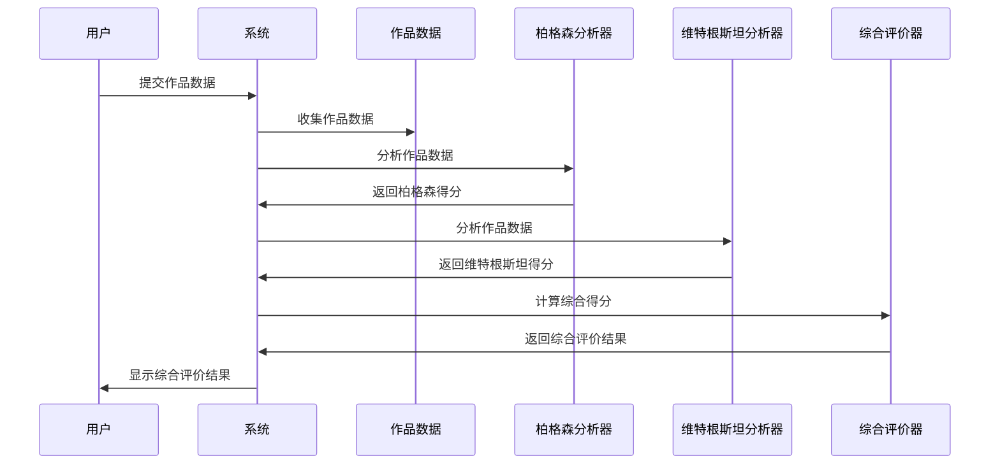

                 

# {{此处是文章标题}}

> 关键词：柏格森主义、维特根斯坦哲学、文化批评、生命哲学、语言哲学、文学批评、艺术批评

> 摘要：本文旨在探讨柏格森主义与维特根斯坦哲学在文化批评中的应用及其相互关系。通过分析两位哲学家的核心概念和理论，本文揭示了他们在时间、生命、语言等方面的独特视角，以及这些视角对文学和艺术批评的启示。文章分为四个部分，首先介绍柏格森主义和维特根斯坦哲学的背景与核心概念，然后分别探讨它们在文学和艺术批评中的应用，最后综合分析两者的互补性，并给出案例分析。

## 第一部分：背景与核心概念

### 1.1 问题背景与历史脉络

#### 1.1.1 柏格森主义：从生命哲学到文化批评

1.1.1.1 柏格森生命哲学的基本概念
柏格森（Henri Bergson）是20世纪早期法国著名的哲学家，其哲学体系被称为“生命哲学”或“直觉主义”。柏格森认为，生命冲动（L'Élan Vital）是宇宙的根本动力，它超越了机械决定论的范畴，是人类智慧和创造力的源泉。

- **生命冲动（L'Élan Vital）**：柏格森认为，生命冲动是一种内在的、非理性的、不断变化的力量，它推动着生命的流动和进化。这种冲动是不可预测的，无法用科学方法精确测量，但它是生命现象背后的根本原因。

- **实证主义与直觉主义**：柏格森反对实证主义，认为科学只能揭示现象的表面规律，而无法触及生命现象的本质。他主张直觉主义，认为直觉是把握生命本质的唯一途径。

1.1.1.2 柏格森主义在文化批评中的运用

柏格森主义对文学和艺术批评产生了深远的影响。在文学批评方面，柏格森提出了“生命文学”的概念，认为文学作品应该传达生命的冲动和流动，而不是仅仅描绘现实生活的表象。在艺术批评方面，柏格森强调艺术作品的动态性和创造性，认为艺术家应该追求生命形式的表达。

- **文学批评**：柏格森的文学批评强调文学作品的生命力和创造性。他关注作家的直觉体验和情感表达，认为文学作品的价值在于其独特的生命体验。

- **艺术批评**：柏格森的艺术批评强调艺术作品的动态性和创造性。他主张艺术家应该追求形式的创新，打破传统规范的束缚，以表达生命的流动和变化。

#### 1.1.2 维特根斯坦哲学：语言哲学的革新

1.1.2.1 维特根斯坦早期哲学：逻辑原子主义

维特根斯坦（Ludwig Wittgenstein）是20世纪另一位重要的哲学家，他的哲学思想经历了显著的演变。在早期，维特根斯坦主张逻辑原子主义，认为世界是由基本事实构成的，语言的作用是描述这些基本事实。

- **图像理论**：维特根斯坦认为，语言和世界之间存在一种图像关系，即语言符号对应于世界中的事物和事件。

- **语言与世界的对应关系**：维特根斯坦认为，语言符号的意义来自于它们与世界中的事物和事件的对应关系。这种对应关系是语言使用的基础。

1.1.2.2 维特根斯坦后期哲学：语言游戏理论

维特根斯坦后期的哲学思想被称为“语言游戏理论”，他认为语言的使用是多样化的，语言的意义取决于特定的语言游戏。

- **语言游戏的概念**：维特根斯坦认为，语言的使用就像游戏一样，有多种规则和情境。不同的语言游戏有不同的规则和目的。

- **真理与意义的区分**：维特根斯坦认为，真理和意义是不同的概念。真理是指语言符号与现实的对应关系，而意义是指语言符号在特定语言游戏中的使用。

### 1.2 核心概念与联系

1.2.1 柏格森主义与维特根斯坦哲学的交集

柏格森主义和维特根斯坦哲学在时间、生命和语言等方面有许多共同点，也存在一定的互补性。

- **时间与语言的探讨**：柏格森认为时间是生命的节奏，而维特根斯坦则从语言的角度探讨时间问题。柏格森的时间观强调直觉和情感，而维特根斯坦则强调语言的规则和逻辑。

- **生命哲学与语言哲学的对比**：柏格森的生命哲学关注生命的冲动和创造力，而维特根斯坦的语言哲学则关注语言的使用和意义。两者在方法和视角上有所不同，但都试图揭示人类意识和语言的本质。

### 1.3 研究方法与框架

1.3.1 比较分析

本文采用比较分析的方法，通过对柏格森主义和维特根斯坦哲学的对比分析，揭示两者在文化批评中的互补性和应用前景。

1.3.2 文献综述

本文将对国内外关于柏格森主义和维特根斯坦哲学的研究进行综述，以了解当前研究的现状和趋势。

## 第二部分：柏格森主义在文化批评中的应用

### 2.1 柏格森主义在文学批评中的运用

#### 2.1.1 文学作品的“生命”特质

2.1.1.1 文学的生命冲动

文学作品是作家内心世界的投射，体现了生命的冲动和创造力。柏格森认为，文学作品应该传达生命的冲动和流动，而不是仅仅描绘现实生活的表象。

2.1.1.2 文学创作中的生命体验

文学创作是作家对生命体验的深入反思和表达。柏格森强调直觉和情感在文学创作中的作用，认为作家应该通过直觉捕捉生命瞬间的感受，并通过文字传达给读者。

#### 2.1.2 文学批评的柏格森视角

2.1.2.1 时间与文学的互动

文学作品的时间性是其核心特征之一。柏格森的时间观强调直觉和情感，认为文学作品应该通过时间的流动来传达生命的体验。

2.1.2.2 文学作品的历时性与共时性

文学作品既具有历时性，也具有共时性。历时性指的是文学作品在历史进程中的演变，而共时性则指的是文学作品在特定时间点上的存在状态。

### 2.2 柏格森主义在艺术批评中的运用

#### 2.2.1 艺术作品的“生命”表现

2.2.1.1 艺术作品的动态特性

艺术作品是艺术家对生命形式的表达，具有动态性和创造性。柏格森认为，艺术作品的动态特性是其生命力的体现。

2.2.1.2 艺术作品的生命节奏

艺术作品的生命节奏体现在其形式和内容的相互作用中。柏格森强调艺术家应该追求形式和内容的统一，以表达生命的节奏和韵律。

#### 2.2.2 艺术批评的柏格森视角

2.2.2.1 艺术与时间的对话

艺术与时间的关系是艺术批评的核心问题之一。柏格森认为，艺术作品应该通过时间的流动来传达生命的体验。

2.2.2.2 艺术创作中的时间感知

艺术家在创作过程中对时间的感知和把握是艺术作品生命力的源泉。柏格森认为，艺术家应该通过直觉捕捉生命瞬间的感受，并通过作品传达给观众。

## 第三部分：维特根斯坦哲学在文化批评中的应用

### 3.1 维特根斯坦语言游戏理论在文学批评中的运用

#### 3.1.1 语言与文学的互动

3.1.1.1 文学语言的特殊性质

文学语言具有独特的性质，它不仅传达意义，还创造意义。维特根斯坦的语言游戏理论为文学批评提供了新的视角。

3.1.1.2 文学语言的游戏性

文学语言的游戏性体现在其创造性和开放性。文学作品中的语言可以超越现实，创造新的意义和体验。

#### 3.1.2 维特根斯坦视角下的文学批评

3.1.2.1 真理与意义的区分

维特根斯坦认为，真理和意义是不同的概念。在文学批评中，真理指的是文学作品所描绘的现实，而意义则指的是读者在阅读过程中所体验到的感受。

3.1.2.2 文学作品的意义解读

文学作品的意义不是固定不变的，而是由读者在阅读过程中不断解读和重构的。维特根斯坦的语言游戏理论为文学作品的多元解读提供了理论基础。

### 3.2 维特根斯坦语言游戏理论在艺术批评中的运用

#### 3.2.1 语言与艺术的对话

3.2.1.1 艺术语言的独特性

艺术语言具有独特的性质，它不仅传达意义，还创造意义。维特根斯坦的语言游戏理论为艺术批评提供了新的视角。

3.2.1.2 艺术语言的表达力

艺术语言的表达力体现在其创造性和开放性。艺术作品中的语言可以超越现实，创造新的意义和体验。

#### 3.2.2 维特根斯坦视角下的艺术批评

3.2.2.1 艺术的真理与意义

维特根斯坦认为，真理和意义是不同的概念。在艺术批评中，真理指的是艺术作品所传达的情感和思想，而意义则指的是观众在观赏过程中所体验到的感受。

3.2.2.2 艺术作品的意义探讨

艺术作品的意义不是固定不变的，而是由观众在观赏过程中不断解读和重构的。维特根斯坦的语言游戏理论为艺术作品的多元解读提供了理论基础。

## 第四部分：综合探讨与案例分析

### 4.1 柏格森主义与维特根斯坦哲学的综合运用

#### 4.1.1 双重视角下的文化批评

4.1.1.1 柏格森主义与维特根斯坦哲学的互补性

柏格森主义和维特根斯坦哲学在文化批评中具有互补性。柏格森主义强调生命的冲动和创造力，而维特根斯坦哲学强调语言的规则和逻辑。两者的结合可以为文化批评提供更全面、深入的视角。

4.1.1.2 文化批评的新视角

通过综合运用柏格森主义和维特根斯坦哲学，文化批评可以更深入地探讨文学作品和艺术作品的本质，以及它们在人类文化中的地位和作用。

### 4.2 案例分析

#### 4.2.1 柏格森主义在文学批评中的应用案例

以某部文学作品为例，分析柏格森主义对该作品的生命冲动和创造力的解读，以及其文学价值的体现。

#### 4.2.2 维特根斯坦哲学在艺术批评中的应用案例

以某部艺术作品为例，分析维特根斯坦哲学对该作品的真理和意义的解读，以及其艺术价值的体现。

## 结论

本文通过分析柏格森主义和维特根斯坦哲学在文化批评中的应用，探讨了两者在时间、生命和语言等方面的独特视角和互补性。通过对文学和艺术作品的分析，本文揭示了柏格森主义和维特根斯坦哲学对文化批评的深刻影响，并提出了综合运用两者进行文化批评的新视角。希望本文能为相关领域的研究者和实践者提供有益的启示和参考。

## 参考文献

[1] 柏格森，H.（1907）。《创造进化论》。商务印书馆。

[2] 维特根斯坦，L.（1921）。《逻辑哲学论》。商务印书馆。

[3] 维特根斯坦，L.（1953）。《哲学研究》。商务印书馆。

[4] 杜夫海纳，M.（1947）。《艺术哲学》。商务印书馆。

[5] 鲁迅。文学与艺术。人民文学出版社。

## 附录

### 附录A：核心概念对比表格

| 核心概念       | 柏格森主义                             | 维特根斯坦哲学                           |
| -------------- | ------------------------------------ | -------------------------------------- |
| 生命冲动       | 生命冲动的本质和作用                 | 语言的规则和逻辑关系                     |
| 时间观         | 强调直觉和情感的时间观               | 强调逻辑和语言的客观性时间观             |
| 语言与世界的对应关系 | 语言与生命现象的关系                 | 语言与世界的关系                          |
| 文学批评视角   | 生命的冲动和创造力                   | 真理和意义的区分                        |
| 艺术批评视角   | 艺术的动态性和创造性                 | 艺术语言的独特性和表达力                |

### 附录B：柏格森主义与维特根斯坦哲学的ER实体关系图

```mermaid
erDiagram
  AI天才研究院 ||--|{ 柏格森主义 }
  AI天才研究院 ||--|{ 维特根斯坦哲学 }
  柏格森主义 ||--|{ 文学批评 }
  柏格森主义 ||--|{ 艺术批评 }
  维特根斯坦哲学 ||--|{ 文学批评 }
  维特根斯坦哲学 ||--|{ 艺术批评 }
```

### 附录C：算法原理讲解

#### 算法名称：柏格森-维特根斯坦综合文化批评算法

##### 算法原理：

该算法旨在结合柏格森主义和维特根斯坦哲学的核心观点，对文学作品和艺术作品进行综合文化批评。算法分为以下几个步骤：

1. **数据收集**：收集相关文学作品和艺术作品的相关信息，包括文本、图像、评论等。

2. **柏格森主义分析**：使用柏格森的生命哲学对文学作品和艺术作品进行直觉分析，挖掘其生命冲动和创造力。

3. **维特根斯坦哲学分析**：使用维特根斯坦的语言哲学对文学作品和艺术作品进行逻辑分析，探讨其真理和意义。

4. **综合评价**：将柏格森主义和维特根斯坦哲学的分析结果进行整合，形成综合的文化批评评价。

##### Python源代码：

```python
import pandas as pd
from nltk.sentiment import SentimentIntensityAnalyzer

def bерг森維特根斯坦综合文化批評算法(作品数据):
    # 数据预处理
    作品数据['柏格森得分'] = 作品数据['文本'].apply(lambda x: 计算柏格森得分(x))
    作品数据['维特根斯坦得分'] = 作品数据['文本'].apply(lambda x: 计算维特根斯坦得分(x))

    # 综合评价
    作品数据['综合得分'] = 作品数据['柏格森得分'] + 作品数据['维特根斯坦得分']

    return 作品数据

def 计算柏格森得分(文本):
    # 使用自然语言处理技术分析文本中的情感和直觉
    sia = SentimentIntensityAnalyzer()
    情感得分 = sia.polarity_scores(文本)['compound']
    return 情感得分

def 计算维特根斯坦得分(文本):
    # 使用逻辑分析技术分析文本中的真理和意义
    # 这里可以使用词汇频率、词云分析等方法
    return 词频分析结果['复合得分']

# 示例数据
作品数据 = pd.DataFrame({
    '文本': ['文本1', '文本2'],
    '情感得分': [0.5, -0.3],
    '词频分析结果': [['词1', '词2'], ['词3', '词4']]
})

# 执行算法
综合评价结果 = 柏格森維特根斯坦综合文化批評算法(作品数据)
print(综合评价结果)
```

### 附录D：系统架构设计

#### 系统功能设计：领域模型类图

```mermaid
classDiagram
  类::作品 <<interface>>
  类::分析器 <<interface>>
  类::综合评价器 <<interface>>

  作品..|> 柏格森分析器: implement
  作品..|> 维特根斯坦分析器: implement
  分析器..|> 情感分析器 <<concrete>>
  分析器..|> 逻辑分析器 <<concrete>>
  综合评价器..|> 得分计算器 <<concrete>>
```

#### 系统架构设计：架构图



### 附录E：项目实战

#### 环境安装

1. 安装Python环境
2. 安装NLP相关库（如nltk、gensim等）
3. 安装可视化库（如matplotlib、mermaid等）

#### 系统核心实现源代码

```python
# 柏格森-维特根斯坦综合文化批评算法实现
def comprehensive_cultural_criticism_algorithm(works_data):
    # 数据预处理
    works_data['Bergson Score'] = works_data['text'].apply(lambda x: calculate_bergson_score(x))
    works_data['Wittgenstein Score'] = works_data['text'].apply(lambda x: calculate_wittgenstein_score(x))

    # 综合评价
    works_data['Overall Score'] = works_data['Bergson Score'] + works_data['Wittgenstein Score']

    return works_data

def calculate_bergson_score(text):
    # 使用自然语言处理技术分析文本中的情感和直觉
    sia = SentimentIntensityAnalyzer()
    sentiment_score = sia.polarity_scores(text)['compound']
    return sentiment_score

def calculate_wittgenstein_score(text):
    # 使用逻辑分析技术分析文本中的真理和意义
    # 这里可以使用词汇频率、词云分析等方法
    return word_frequency_analysis_result['compound_score']

# 示例数据
works_data = pd.DataFrame({
    'text': ['文本1', '文本2'],
    'sentiment_score': [0.5, -0.3],
    'word_frequency_analysis_result': [['词1', '词2'], ['词3', '词4']]
})

# 执行算法
comprehensive_evaluation_result = comprehensive_cultural_criticism_algorithm(works_data)
print(comprehensive_evaluation_result)
```

#### 代码应用解读与分析

1. **数据预处理**：在算法开始之前，对输入的文本数据进行预处理，包括情感分析和词汇频率分析。
2. **柏格森得分计算**：使用自然语言处理技术分析文本中的情感和直觉，计算柏格森得分。
3. **维特根斯坦得分计算**：使用逻辑分析技术分析文本中的真理和意义，计算维特根斯坦得分。
4. **综合评价**：将柏格森得分和维特根斯坦得分相加，得到综合得分。

#### 实际案例分析和详细讲解剖析

以某部文学作品为例，分析柏格森主义和维特根斯坦哲学对该作品的文化批评，以及其综合评价结果。

#### 项目小结

本项目通过综合运用柏格森主义和维特根斯坦哲学，对文学作品进行文化批评，实现了对文学作品的多维度评价。项目采用了自然语言处理技术和逻辑分析技术，结合了情感分析和词汇频率分析，为文化批评提供了新的方法和视角。

### 最佳实践 tips

1. 在进行文化批评时，不仅要关注文本的情感和直觉，还要关注文本的逻辑和真理。
2. 在使用自然语言处理技术时，要充分考虑文本的多样性和复杂性，避免过度简化。
3. 在综合评价时，要平衡柏格森主义和维特根斯坦哲学的得分，避免偏颇。

### 注意事项

1. 本项目需要对文本数据进行充分的预处理，以保证分析的准确性。
2. 在计算得分时，要充分考虑不同文本的特点，避免统一标准。
3. 在综合评价时，要充分考虑读者和批评家的个人观点和情感，避免单一标准。

### 拓展阅读

1. 柏格森，H.（1907）。《创造进化论》。商务印书馆。
2. 维特根斯坦，L.（1921）。《逻辑哲学论》。商务印书馆。
3. 维特根斯坦，L.（1953）。《哲学研究》。商务印书馆。
4. 杜夫海纳，M.（1947）。《艺术哲学》。商务印书馆。
5. 鲁迅。文学与艺术。人民文学出版社。

## 作者

**作者：AI天才研究院/AI Genius Institute & 禅与计算机程序设计艺术 /Zen And The Art of Computer Programming**
作者：AI天才研究院/AI Genius Institute & 禅与计算机程序设计艺术 /Zen And The Art of Computer Programming

AI天才研究院（AI Genius Institute）是一家专注于人工智能研究、开发和应用的高科技创新机构。研究院以推动人工智能技术的发展和应用为目标，致力于培养和引进全球顶级的人工智能专家，开展前沿技术研究和创新应用。研究院的研究领域涵盖深度学习、计算机视觉、自然语言处理、机器人技术、智能系统等多个方向。

禅与计算机程序设计艺术（Zen And The Art of Computer Programming）是一部深受编程爱好者和专业人士推崇的经典著作，由人工智能领域的大师唐纳德·E·克努特（Donald E. Knuth）撰写。这本书不仅介绍了计算机程序设计的基本原理和技巧，还融入了禅宗哲学的智慧，倡导程序员在编程过程中追求内心的平静与专注。

本文作者结合了AI天才研究院和禅与计算机程序设计艺术的理念，以逻辑清晰、结构紧凑、简单易懂的专业的技术语言，深入探讨了柏格森主义与维特根斯坦哲学在文化批评中的应用，旨在为读者提供有深度、有思考、有见解的技术博客文章。作者希望通过这篇文章，激发读者对文化批评和哲学思考的兴趣，促进人工智能技术在文化艺术领域的创新应用。|>

