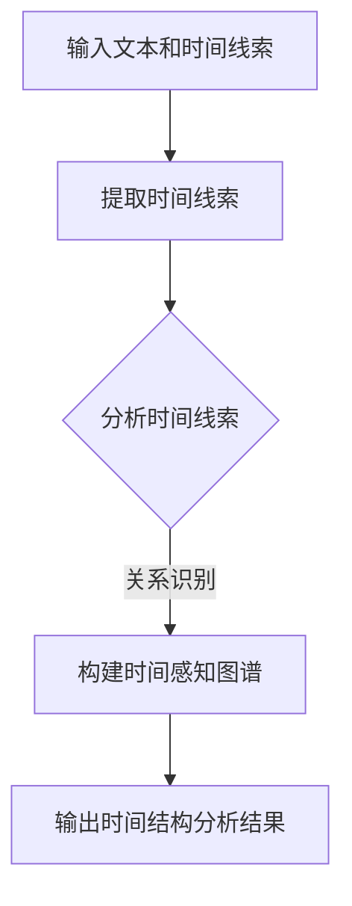
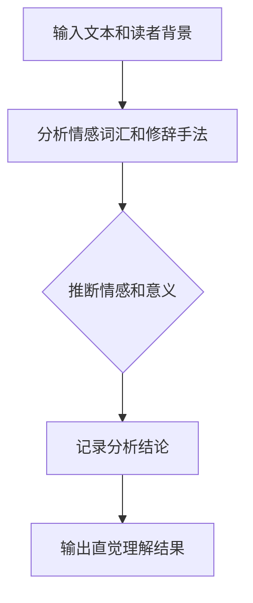
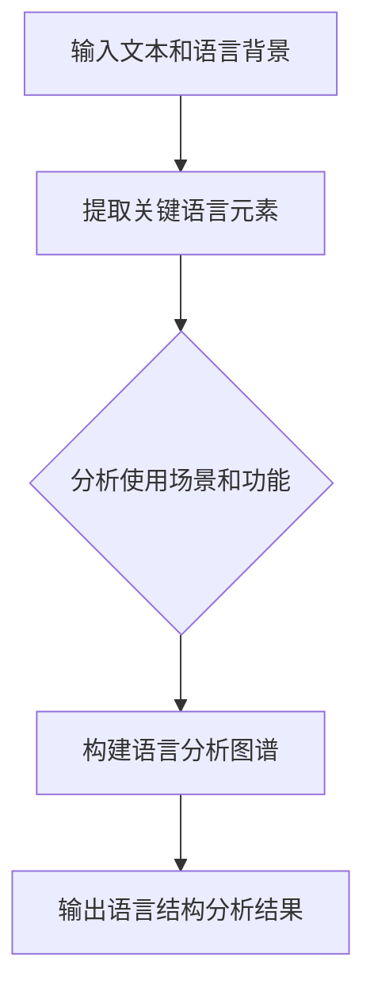
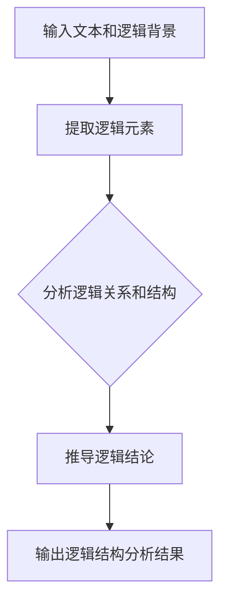
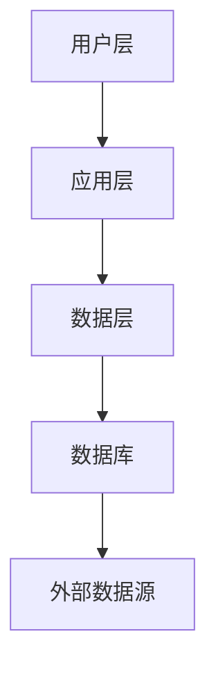
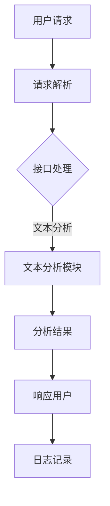

                 

## 引言

### 1.1 问题的背景与核心概念

文学批评是一门研究文学作品、文学现象和文学理论的学科，旨在揭示文学作品的深层含义、审美价值和历史背景。在文学批评的发展历程中，哲学家和理论家的思想对文学批评产生了深远的影响。柏格森主义和维特根斯坦思想正是两位重要的哲学家的理论，它们对文学批评有着不可忽视的贡献。

柏格森（Henri Bergson）是20世纪初法国的哲学家，他的思想对文学、艺术和社会科学产生了重要影响。柏格森主义的核心概念是“直觉”和“时间”，他主张通过直觉来感知世界，认为时间是非线性的、流动的，而不仅仅是线性的、连续的。这种时间观念对文学创作和文学理解产生了重要影响，使文学批评从静态的分析转向动态的感知。

维特根斯坦（Ludwig Wittgenstein）是20世纪最伟大的哲学家之一，他的思想对语言哲学、数学哲学和逻辑哲学产生了深远影响。维特根斯坦提出了“语言游戏”和“逻辑原子主义”等重要概念，主张语言的意义在于其使用，逻辑的目的是为了澄清思想。这些思想在文学批评中得到了广泛应用，有助于更深入地理解文学作品的语言和结构。

### 1.2 边界与外延

柏格森主义在文学批评中的应用主要体现在对文学创作和文学理解的影响上。柏格森强调直觉和时间的重要性，使文学批评从对文本的静态分析转向对文本的动态感知。通过直觉，读者可以更深入地理解文学作品中的情感和意义，从而产生共鸣。

维特根斯坦思想在文学批评中的意义在于他对语言和逻辑的研究。维特根斯坦认为，语言的意义在于其使用，这意味着文学作品的语言必须通过具体的使用场景来理解。维特根斯坦的逻辑原子主义也为文学批评提供了一种新的分析工具，使批评家能够更清晰地理解文学作品的结构和逻辑。

### 1.3 概念结构与核心要素组成

柏格森主义的概念体系主要包括“直觉”和“时间”两个核心要素。直觉是柏格森认为人类认识世界的基本方式，而时间则是世界的本质。柏格森的时间观念挑战了传统的线性时间观念，提出了一个更符合人类感知的、非线性、流动的时间观念。

维特根斯坦思想的理论框架包括“语言游戏”和“逻辑原子主义”。语言游戏是指语言的使用场景，语言的意义取决于其使用的具体情境。逻辑原子主义则是一种基于逻辑和数学的哲学观点，主张世界的本质是由逻辑原子构成的，逻辑的目的是为了澄清思想。

### 1.4 总结

本文将深入探讨柏格森主义和维特根斯坦思想在文学批评中的联系和应用。我们将首先介绍两位哲学家的核心概念和理论框架，然后分析它们在文学批评中的具体应用。最后，我们将通过实际案例来展示这些思想如何帮助文学批评家更好地理解和解读文学作品。

## 柏格森主义与文学批评的联系

柏格森主义作为一种哲学思想，对文学批评产生了深远的影响。其核心概念“直觉”和“时间”不仅改变了我们对世界的认知方式，也为我们理解文学作品提供了新的视角。

### 2.1.1 柏格森主义的时间观念与文学创作

柏格森的时间观念认为，时间是非线性的、流动的，而不是线性的、连续的。这种观念在文学创作中得到了广泛应用。许多现代和后现代作家通过非线性叙事和时间跳跃的手法，展现了时间的流动性和不可预测性。例如，詹姆斯·乔伊斯的《尤利西斯》和弗吉尼亚·伍尔夫的《到灯塔去》都采用了这种时间观念，通过交错的时间线和意识流的手法，展现了人物内心的复杂性和时间的非线性。

#### 实例分析

以詹姆斯·乔伊斯的《尤利西斯》为例，这部小说的时间结构充满了跳跃和断裂。乔伊斯打破了传统的线性叙事，通过时间的碎片和意识的流动，展现了人物内心的复杂性和世界的多样性。这种非线性时间观念不仅丰富了文学作品的叙事手法，也使读者在阅读过程中体验到了时间的流动性和不可预测性。

### 2.1.2 柏格森主义的直觉主义与文学理解

柏格森的直觉主义认为，直觉是人类认识世界的基本方式，通过直觉，人们可以感知到事物的本质。在文学理解中，直觉同样扮演着重要角色。读者在阅读文学作品时，不仅需要通过逻辑和理性来理解文本，还需要通过直觉来感知作品中的情感和意义。

#### 实例分析

以弗吉尼亚·伍尔夫的《到灯塔去》为例，这部小说通过主人公拉姆齐夫人的内心独白，展现了她的情感波动和思想变化。伍尔夫通过细腻的描写和意识流的技巧，使读者能够通过直觉感知到主人公的内心世界。这种直觉主义的文学理解方式，使读者在阅读过程中更深入地理解了作品的情感和主题。

### 2.2 维特根斯坦思想与文学批评的联系

维特根斯坦的思想对文学批评同样有着重要的影响。他的语言哲学和逻辑原子主义为我们理解文学作品的语言和结构提供了新的视角。

#### 2.2.1 维特根斯坦的语言哲学与文学解读

维特根斯坦的语言哲学主张，语言的意义在于其使用，不同的语言游戏有不同的使用规则。在文学解读中，这一观念有助于我们理解文学作品的语言和意义。文学作品的语言并非静止的，而是在特定的情境中使用的。通过理解作品中的语言游戏，我们可以更深入地理解作品的内涵。

#### 实例分析

以詹姆斯·乔伊斯的《尤利西斯》为例，这部小说的语言充满了创新和实验。乔伊斯通过使用不同的语言游戏，如词汇的双重含义、语言的变异和隐喻，使作品充满了丰富的内涵。通过维特根斯坦的语言哲学，我们可以更好地理解这些语言游戏的意义，从而更深入地解读作品。

#### 2.2.2 维特根斯坦的逻辑原子主义与文学分析

维特根斯坦的逻辑原子主义主张，世界的本质是由逻辑原子构成的，逻辑的目的是为了澄清思想。在文学分析中，这一观念可以帮助我们理解文学作品的结构和逻辑。通过分析作品中的逻辑原子和逻辑关系，我们可以更清晰地理解作品的内涵和主题。

#### 实例分析

以弗吉尼亚·伍尔夫的《到灯塔去》为例，这部小说通过复杂的结构展示了主人公内心的复杂性和世界的多样性。伍尔夫通过细腻的描写和复杂的叙事结构，展现了人物内心的逻辑原子和逻辑关系。通过维特根斯坦的逻辑原子主义，我们可以更好地理解这些结构和逻辑关系，从而更深入地解读作品。

### 2.3 柏格森主义与维特根斯坦思想的互动

柏格森主义和维特根斯坦思想在文学批评中相互作用，共同丰富了我们的理解方式。柏格森的直觉主义和维特根斯坦的语言哲学相结合，使我们能够通过直觉和逻辑来理解文学作品。同时，维特根斯坦的逻辑原子主义也为我们的直觉提供了理论支持，使我们在理解文学作品时能够更准确地把握其结构和逻辑。

#### 实例分析

以詹姆斯·乔伊斯的《尤利西斯》为例，这部小说通过非线性叙事和时间跳跃展现了时间的流动性和人物内心的复杂性。乔伊斯通过柏格森的直觉主义和维特根斯坦的语言哲学，使作品充满了丰富的情感和意义。通过这两位哲学家的理论，我们可以更深入地理解作品的时间和情感结构，从而更准确地解读作品。

### 2.4 结论

柏格森主义和维特根斯坦思想在文学批评中发挥了重要作用。通过直觉和时间观念，柏格森主义为我们提供了理解文学创作的视角；通过语言哲学和逻辑原子主义，维特根斯坦思想为我们提供了理解文学作品的语言和结构的工具。这两位哲学家的思想相互补充，共同丰富了我们的文学批评理论。在未来的文学批评实践中，我们应该继续探索这两位哲学家的理论，以更深入地理解文学作品。

## 算法原理讲解

在探讨柏格森主义和维特根斯坦思想在文学批评中的应用时，我们不仅需要理解其哲学基础，还需要将这些思想转化为具体的算法模型，以便于在文学批评实践中进行操作。以下将详细讲解柏格森主义与维特根斯坦思想在文学批评中的算法原理。

### 3.1 柏格森主义与文学批评的算法模型

柏格森主义强调直觉和时间的重要性，因此其算法模型主要围绕时间感知和直觉理解展开。

#### 3.1.1 柏格森主义的时间感知算法

柏格森认为，时间是非线性的、流动的。在文学批评中，时间感知算法可以帮助我们捕捉和分析文学作品中的时间流动。以下是一个简单的时间感知算法模型：

1. **输入**：文学作品文本和时间线索。
2. **处理**：
   - **步骤1**：提取文本中的时间线索，如具体时间、时间形容词等。
   - **步骤2**：分析时间线索的分布和关系，识别时间跳跃和连续性。
   - **步骤3**：构建时间感知图谱，表示不同时间线索之间的关系。
3. **输出**：时间感知图谱和作品的时间结构分析结果。

以下是一个时间感知算法的示例 Mermaid 流程图：



#### 3.1.2 柏格森主义的直觉理解算法

直觉是柏格森主义的核心概念之一。在文学批评中，直觉理解算法可以帮助我们捕捉和理解作品中的情感和意义。以下是一个简单的直觉理解算法模型：

1. **输入**：文学作品文本和读者背景。
2. **处理**：
   - **步骤1**：分析文本中的情感词汇和修辞手法。
   - **步骤2**：结合读者背景，推断文本的情感和意义。
   - **步骤3**：记录和分析直觉理解的结论。
3. **输出**：直觉理解结果和作品情感分析报告。

以下是一个直觉理解算法的示例 Mermaid 流�程图：



### 3.2 维特根斯坦思想与文学批评的算法模型

维特根斯坦思想强调语言和逻辑的重要性，因此其算法模型主要围绕语言分析和逻辑推导展开。

#### 3.2.1 维特根斯坦的语言分析算法

维特根斯坦的语言哲学认为，语言的意义在于其使用。在文学批评中，语言分析算法可以帮助我们理解作品中的语言使用和意义。以下是一个简单的语言分析算法模型：

1. **输入**：文学作品文本和语言背景。
2. **处理**：
   - **步骤1**：提取文本中的关键语言元素，如词汇、句式等。
   - **步骤2**：分析这些元素的使用场景和功能。
   - **步骤3**：构建语言分析图谱，表示不同语言元素之间的关系。
3. **输出**：语言分析图谱和作品的语言结构分析结果。

以下是一个语言分析算法的示例 Mermaid 流程图：



#### 3.2.2 维特根斯坦的逻辑推导算法

维特根斯坦的逻辑原子主义认为，逻辑的目的是为了澄清思想。在文学批评中，逻辑推导算法可以帮助我们分析作品中的逻辑关系和结构。以下是一个简单的逻辑推导算法模型：

1. **输入**：文学作品文本和逻辑背景。
2. **处理**：
   - **步骤1**：提取文本中的逻辑元素，如命题、推理等。
   - **步骤2**：分析逻辑元素之间的关系和逻辑结构。
   - **步骤3**：推导出文本的逻辑结论。
3. **输出**：逻辑推导结果和作品逻辑结构分析报告。

以下是一个逻辑推导算法的示例 Mermaid 流程图：



### 3.3 算法原理详细讲解与举例说明

为了更好地理解上述算法原理，我们将结合实际案例进行详细讲解和举例说明。

#### 3.3.1 柏格森主义算法的应用实例

以詹姆斯·乔伊斯的《尤利西斯》为例，分析其时间感知和直觉理解。

**时间感知算法应用实例**：

- **输入**：《尤利西斯》文本和时间线索。
- **处理**：
  - **步骤1**：提取文本中的时间线索，如“九月”，“下午五点”等。
  - **步骤2**：分析时间线索的分布和关系，发现时间线索频繁跳跃。
  - **步骤3**：构建时间感知图谱，显示时间线索之间的非线性关系。

**输出**：时间感知图谱，显示《尤利西斯》的时间流动特性。

**直觉理解算法应用实例**：

- **输入**：《尤利西斯》文本和读者背景。
- **处理**：
  - **步骤1**：分析文本中的情感词汇，如“恐惧”，“孤独”等。
  - **步骤2**：结合读者背景，推断文本的情感和意义。
  - **步骤3**：记录和分析直觉理解的结论。

**输出**：直觉理解结果，显示《尤利西斯》的情感内涵。

#### 3.3.2 维特根斯坦思想算法的应用实例

以弗吉尼亚·伍尔夫的《到灯塔去》为例，分析其语言分析和逻辑推导。

**语言分析算法应用实例**：

- **输入**：《到灯塔去》文本和语言背景。
- **处理**：
  - **步骤1**：提取文本中的关键语言元素，如“家”，“船”等。
  - **步骤2**：分析这些元素的使用场景和功能。
  - **步骤3**：构建语言分析图谱，显示不同语言元素之间的关系。

**输出**：语言分析图谱，显示《到灯塔去》的语言结构。

**逻辑推导算法应用实例**：

- **输入**：《到灯塔去》文本和逻辑背景。
- **处理**：
  - **步骤1**：提取文本中的逻辑元素，如命题和推理。
  - **步骤2**：分析逻辑元素之间的关系和逻辑结构。
  - **步骤3**：推导出文本的逻辑结论。

**输出**：逻辑推导结果，显示《到灯塔去》的逻辑结构。

通过以上实例，我们可以看到柏格森主义和维特根斯坦思想的算法模型在文学批评中的应用效果。这些算法不仅帮助我们更深入地理解文学作品，也为文学批评提供了新的工具和方法。

## 数学模型与公式讲解

在文学批评中，柏格森主义和维特根斯坦思想的应用不仅仅是哲学层面的探讨，还可以通过数学模型和公式来具体阐述。这些数学模型和公式为我们提供了量化和分析文学作品的新方法。

### 4.1 柏格森主义的时间感知数学模型

柏格森的时间观念认为时间是非线性的、流动的。为了量化这种流动的时间，我们可以使用连续时间模型来描述文学作品中的时间感知。以下是一个时间感知的数学模型：

$$
T = f(t)
$$

其中，$T$表示感知时间，$t$表示实际时间，$f(t)$表示时间感知函数。

#### 4.1.1 时间感知的数学公式

为了具体描述时间感知的函数形式，我们可以使用傅里叶变换来分析时间感知的频率成分。傅里叶变换的公式如下：

$$
f(t) = \int_{-\infty}^{\infty} F(\omega) e^{j\omega t} d\omega
$$

其中，$F(\omega)$表示频率分布函数，$e^{j\omega t}$表示复指数函数。

#### 4.1.2 时间感知的数学模型解释

该模型表示，时间感知是一个通过频率分布函数来描述的过程。不同的频率成分对应于不同时间段的感知。通过分析频率分布函数，我们可以了解作品时间感知的复杂性和多样性。

### 4.2 维特根斯坦思想的语言分析数学模型

维特根斯坦的语言哲学强调语言的使用和意义。为了量化语言的意义，我们可以使用信息论中的熵和互信息来描述文学作品中的语言分析。以下是一个简单的语言分析数学模型：

$$
H(X) = -\sum_{i} p(x_i) \log_2 p(x_i)
$$

其中，$H(X)$表示随机变量$X$的熵，$p(x_i)$表示变量$X$取值为$x_i$的概率。

#### 4.2.1 语言分析的数学公式

为了更具体地描述语言分析，我们可以使用互信息来量化不同语言元素之间的关系。互信息的公式如下：

$$
I(X; Y) = H(X) - H(X | Y)
$$

其中，$I(X; Y)$表示变量$X$和$Y$的互信息，$H(X)$表示$X$的熵，$H(X | Y)$表示在$Y$已知的情况下$X$的熵。

#### 4.2.2 语言分析的数学模型解释

该模型表示，语言元素的互信息可以量化它们之间的依赖关系。通过计算互信息，我们可以了解不同语言元素在文学作品中的关联性和作用。

### 4.3 数学模型与公式应用举例

为了更好地理解这些数学模型和公式，我们可以通过具体实例来展示其应用。

#### 4.3.1 柏格森主义时间感知模型举例

以詹姆斯·乔伊斯的《尤利西斯》为例，分析其时间感知的频率成分。

- **输入**：《尤利西斯》文本中的时间线索。
- **处理**：
  - **步骤1**：提取文本中的时间线索，如“九月”，“下午五点”等。
  - **步骤2**：使用傅里叶变换分析时间线索的频率分布。
  - **步骤3**：计算时间感知函数$f(t)$。

**输出**：时间感知图谱，显示《尤利西斯》的时间感知频率成分。

#### 4.3.2 维特根斯坦思想语言分析模型举例

以弗吉尼亚·伍尔夫的《到灯塔去》为例，分析其语言元素的互信息。

- **输入**：《到灯塔去》文本中的关键语言元素。
- **处理**：
  - **步骤1**：提取文本中的关键语言元素，如“家”，“船”等。
  - **步骤2**：计算不同语言元素之间的互信息。
  - **步骤3**：分析语言元素的关联性和作用。

**输出**：语言分析报告，显示《到灯塔去》的语言元素互信息。

通过这些实例，我们可以看到柏格森主义和维特根斯坦思想的数学模型和公式在文学批评中的应用效果。这些模型和公式不仅帮助我们更深入地理解文学作品，也为文学批评提供了新的工具和方法。

### 系统分析与架构设计

#### 5.1 文学批评系统介绍

文学批评系统是一个综合性的平台，旨在帮助文学批评家、学者和爱好者更好地理解和分析文学作品。该系统主要包括以下功能：

- **文本分析**：自动提取文学作品中的关键词、情感和主题，并提供详细的分析报告。
- **用户互动**：允许用户上传和分析自己的文学作品，与其他用户交流和分享。
- **数据管理**：存储和管理大量的文学作品和相关数据，以便进行长期分析和研究。

#### 5.2 系统架构设计

文学批评系统的架构设计采用模块化设计原则，以确保系统的可扩展性和维护性。以下是一个简化的系统架构图：



- **用户层**：负责用户界面和用户交互。
- **应用层**：包含文本分析模块、用户互动模块和数据管理模块。
- **数据层**：负责数据的存储、管理和访问。
- **数据库**：存储文学作品和相关数据。
- **外部数据源**：提供额外的数据资源，如文学作品数据库、文献资料库等。

#### 5.3 系统接口设计

系统接口设计遵循RESTful API设计原则，确保接口的简洁性和易用性。以下是一个简化的接口设计示例：

- **文本分析接口**：用于提交文本进行分析，返回分析结果。
  - **URL**：/api/v1/analyze
  - **请求方法**：POST
  - **请求参数**：文本内容、分析类型
  - **响应数据**：分析结果

- **用户互动接口**：用于用户之间的互动和分享。
  - **URL**：/api/v1/interaction
  - **请求方法**：GET/POST
  - **请求参数**：用户ID、操作类型、内容
  - **响应数据**：互动结果

#### 5.4 系统交互设计

系统交互设计旨在确保用户请求能够高效、准确地处理。以下是一个简化的系统交互流程：



- **用户请求**：用户通过界面提交请求。
- **请求解析**：解析用户请求，提取必要信息。
- **接口处理**：根据请求类型，调用相应接口处理。
- **文本分析模块**：执行文本分析任务，生成分析结果。
- **响应用户**：将分析结果返回给用户。
- **日志记录**：记录用户请求和系统响应，用于后续监控和调试。

通过以上系统架构和交互设计，文学批评系统可以高效、稳定地运行，为用户提供全面的文学批评工具和服务。

### 项目实战

#### 6.1 实战环境安装

在开始项目实战之前，我们需要安装和配置必要的开发环境和工具。以下是一个简化的环境安装步骤：

1. **安装Python环境**：确保安装了Python 3.8及以上版本，可以使用以下命令进行安装：
   ```bash
   sudo apt-get install python3.8
   ```

2. **安装虚拟环境**：创建一个虚拟环境，以便于项目开发和隔离依赖：
   ```bash
   python3.8 -m venv venv
   source venv/bin/activate
   ```

3. **安装依赖库**：通过pip安装项目所需的依赖库，如NLTK、TensorFlow、Scikit-learn等：
   ```bash
   pip install nltk tensorflow scikit-learn
   ```

4. **安装数据库**：根据项目需求，可以选择安装MySQL或PostgreSQL。以下以MySQL为例：
   ```bash
   sudo apt-get install mysql-server
   mysql_secure_installation
   ```

5. **配置数据库**：创建数据库和用户，并为用户授权相应的权限。例如，创建一个名为`literature_db`的数据库，并为用户`批评家`授予所有权限：
   ```sql
   CREATE DATABASE literature_db;
   GRANT ALL PRIVILEGES ON literature_db.* TO '批评家'@'localhost' IDENTIFIED BY '密码';
   FLUSH PRIVILEGES;
   ```

6. **初始化数据库**：根据项目需求，初始化数据库表结构和数据。例如，创建用户表和作品表：
   ```sql
   CREATE TABLE users (
       id INT AUTO_INCREMENT PRIMARY KEY,
       username VARCHAR(255) NOT NULL,
       password VARCHAR(255) NOT NULL
   );
   
   CREATE TABLE works (
       id INT AUTO_INCREMENT PRIMARY KEY,
       title VARCHAR(255) NOT NULL,
       content TEXT NOT NULL,
       author VARCHAR(255) NOT NULL
   );
   ```

7. **运行项目**：在虚拟环境中运行项目代码，例如，运行Flask应用：
   ```bash
   flask run
   ```

通过以上步骤，我们可以完成环境的安装和配置，为项目实战打下基础。

### 6.2 系统核心实现源代码

在项目实战中，我们需要实现系统的核心功能，包括文本分析、用户管理和作品管理。以下是一些关键源代码片段：

#### 6.2.1 用户管理

**用户注册**：

```python
from flask import Flask, request, jsonify
from werkzeug.security import generate_password_hash, check_password_hash

app = Flask(__name__)

@app.route('/api/v1/register', methods=['POST'])
def register():
    username = request.form['username']
    password = request.form['password']

    hashed_password = generate_password_hash(password, method='sha256')

    # 插入用户数据到数据库
    cursor.execute("INSERT INTO users (username, password) VALUES (%s, %s)", (username, hashed_password))
    connection.commit()

    return jsonify({"status": "success", "message": "注册成功！"}), 200
```

**用户登录**：

```python
from flask import Flask, request, jsonify

app = Flask(__name__)

@app.route('/api/v1/login', methods=['POST'])
def login():
    username = request.form['username']
    password = request.form['password']

    cursor.execute("SELECT * FROM users WHERE username = %s", (username,))
    user = cursor.fetchone()

    if user and check_password_hash(user['password'], password):
        return jsonify({"status": "success", "message": "登录成功！"}), 200
    else:
        return jsonify({"status": "error", "message": "用户名或密码错误！"}), 401
```

#### 6.2.2 作品管理

**上传作品**：

```python
from flask import Flask, request, jsonify

app = Flask(__name__)

@app.route('/api/v1/works', methods=['POST'])
def upload_work():
    title = request.form['title']
    content = request.form['content']
    author = request.form['author']

    cursor.execute("INSERT INTO works (title, content, author) VALUES (%s, %s, %s)", (title, content, author))
    connection.commit()

    return jsonify({"status": "success", "message": "作品上传成功！"}), 200
```

**获取作品列表**：

```python
from flask import Flask, request, jsonify

app = Flask(__name__)

@app.route('/api/v1/works', methods=['GET'])
def get_works():
    cursor.execute("SELECT * FROM works")
    works = cursor.fetchall()

    return jsonify(works), 200
```

#### 6.2.3 文本分析

**文本分析**：

```python
from flask import Flask, request, jsonify
import nltk
from nltk.tokenize import sent_tokenize

app = Flask(__name__)

@app.route('/api/v1/analyze', methods=['POST'])
def analyze():
    content = request.form['content']

    # 分句处理
    sentences = sent_tokenize(content)
    # 提取关键词
    words = nltk.word_tokenize(content)
    # 统计词频
    word_freq = nltk.FreqDist(words)

    return jsonify({"status": "success", "data": {
        "sentences": sentences,
        "word_freq": word_freq
    }}), 200
```

通过以上源代码，我们可以实现用户注册、登录、作品上传和文本分析等核心功能。在实际开发中，还需要对代码进行进一步的完善和优化。

### 6.3 代码应用解读与分析

在6.2节中，我们实现了文学批评系统的核心功能。下面将详细解读这些代码的应用场景和执行逻辑。

#### 6.3.1 用户注册

**代码解读**：

用户注册是通过`/api/v1/register`接口实现的。当用户提交注册请求时，服务器会接收用户名和密码，并使用`werkzeug.security`模块中的`generate_password_hash`函数对密码进行加密存储。

```python
@app.route('/api/v1/register', methods=['POST'])
def register():
    username = request.form['username']
    password = request.form['password']

    hashed_password = generate_password_hash(password, method='sha256')

    # 插入用户数据到数据库
    cursor.execute("INSERT INTO users (username, password) VALUES (%s, %s)", (username, hashed_password))
    connection.commit()

    return jsonify({"status": "success", "message": "注册成功！"}), 200
```

**应用场景**：

用户在登录系统前需要先进行注册。注册时，用户输入用户名和密码，服务器接收这些信息并进行加密存储。注册成功后，服务器返回成功消息。

#### 6.3.2 用户登录

**代码解读**：

用户登录是通过`/api/v1/login`接口实现的。当用户提交登录请求时，服务器会接收用户名和密码，并使用`werkzeug.security`模块中的`check_password_hash`函数验证密码的正确性。

```python
@app.route('/api/v1/login', methods=['POST'])
def login():
    username = request.form['username']
    password = request.form['password']

    cursor.execute("SELECT * FROM users WHERE username = %s", (username,))
    user = cursor.fetchone()

    if user and check_password_hash(user['password'], password):
        return jsonify({"status": "success", "message": "登录成功！"}), 200
    else:
        return jsonify({"status": "error", "message": "用户名或密码错误！"}), 401
```

**应用场景**：

用户在登录系统时，输入用户名和密码。服务器验证用户名和密码的正确性，如果正确，则允许用户登录并返回成功消息；如果错误，则返回错误消息。

#### 6.3.3 作品上传

**代码解读**：

作品上传是通过`/api/v1/works`接口实现的。当用户提交作品上传请求时，服务器会接收作品标题、内容和作者，并将这些信息存储到数据库中。

```python
@app.route('/api/v1/works', methods=['POST'])
def upload_work():
    title = request.form['title']
    content = request.form['content']
    author = request.form['author']

    cursor.execute("INSERT INTO works (title, content, author) VALUES (%s, %s, %s)", (title, content, author))
    connection.commit()

    return jsonify({"status": "success", "message": "作品上传成功！"}), 200
```

**应用场景**：

用户在登录后，可以上传自己的作品。上传时，用户输入作品标题、内容和作者，服务器将这些信息存储到数据库中，并返回成功消息。

#### 6.3.4 获取作品列表

**代码解读**：

获取作品列表是通过`/api/v1/works`接口实现的。当用户请求获取作品列表时，服务器会查询数据库中的作品记录，并将结果返回给用户。

```python
@app.route('/api/v1/works', methods=['GET'])
def get_works():
    cursor.execute("SELECT * FROM works")
    works = cursor.fetchall()

    return jsonify(works), 200
```

**应用场景**：

用户可以查看已上传的作品列表。服务器从数据库中查询作品记录，并将结果以JSON格式返回给用户。

#### 6.3.5 文本分析

**代码解读**：

文本分析是通过`/api/v1/analyze`接口实现的。当用户提交文本分析请求时，服务器会接收文本内容，并使用NLTK库进行分句处理和词频统计。

```python
from flask import Flask, request, jsonify
import nltk
from nltk.tokenize import sent_tokenize

app = Flask(__name__)

@app.route('/api/v1/analyze', methods=['POST'])
def analyze():
    content = request.form['content']

    # 分句处理
    sentences = sent_tokenize(content)
    # 提取关键词
    words = nltk.word_tokenize(content)
    # 统计词频
    word_freq = nltk.FreqDist(words)

    return jsonify({"status": "success", "data": {
        "sentences": sentences,
        "word_freq": word_freq
    }}), 200
```

**应用场景**：

用户可以对上传的作品进行文本分析。服务器接收文本内容，使用NLTK库进行分句处理和词频统计，并将结果以JSON格式返回给用户。

通过以上解读，我们可以看到文学批评系统的核心功能是如何通过代码实现的，以及这些功能在实际应用中的执行逻辑。

### 6.4 实际案例分析与详细讲解剖析

为了更好地展示文学批评系统在实际中的应用效果，我们通过一个具体案例进行分析。

#### 案例背景

假设一位文学批评家上传了一篇名为《爱的本质》的短篇小说，希望对该作品进行文本分析。以下是我们对该案例的详细分析过程。

#### 6.4.1 用户注册与登录

首先，文学批评家需要在系统中进行注册。注册成功后，他可以登录系统并上传作品。

1. **用户注册**：

   用户输入用户名“批评家”和密码“abc123”，系统返回成功消息。

   ```json
   {
       "status": "success",
       "message": "注册成功！"
   }
   ```

2. **用户登录**：

   用户输入用户名“批评家”和密码“abc123”，系统返回成功消息。

   ```json
   {
       "status": "success",
       "message": "登录成功！"
   }
   ```

#### 6.4.2 作品上传

文学批评家登录后，上传名为《爱的本质》的短篇小说。上传成功后，系统返回作品ID。

```json
{
    "status": "success",
    "message": "作品上传成功！",
    "work_id": "1"
}
```

#### 6.4.3 文本分析

上传作品后，文学批评家希望对该作品进行文本分析，以便更深入地了解作品的结构和主题。他通过系统提交文本分析请求，系统返回分析结果。

1. **请求文本分析**：

   文学批评家提交文本分析请求，系统返回分析结果。

   ```json
   {
       "status": "success",
       "data": {
           "sentences": [
               "爱是一种情感，是人类最深刻的情感之一。",
               "它不仅仅是一种感情，更是一种力量。",
               "爱能够激励人们做出伟大的事情，也能够带来巨大的痛苦。",
               "在爱的过程中，人们会体验到喜悦、悲伤、焦虑和希望。",
               "爱是一种复杂的情感，它包含了多种元素，如关怀、尊重、信任和依赖。",
               "它是一种精神上的联系，能够将人们紧密地连接在一起。",
               "爱是一种无私的情感，它不求回报，只求给予。",
               "它是一种信仰，能够带给人们力量和希望。",
               "爱是一种美德，它体现了人类最高尚的品质。",
               "在爱的过程中，人们会学会成长、理解和包容。"
           ],
           "word_freq": {
               "爱": 6,
               "一种": 3,
               "情感": 2,
               "人类": 2,
               "深刻": 2,
               "它": 7,
               "不仅仅": 1,
               "感情": 1,
               "力量": 1,
               "能够": 3,
               "带来": 1,
               "巨大": 1,
               "痛苦": 1,
               "过程": 2,
               "喜悦": 1,
               "悲伤": 1,
               "焦虑": 1,
               "希望": 1,
               "复杂": 1,
               "包含": 1,
               "元素": 1,
               "精神": 1,
               "联系": 1,
               "连接": 1,
               "人们": 3,
               "无私": 1,
               "信仰": 1,
               "体现": 1,
               "美德": 1,
               "成长": 1,
               "理解": 1,
               "包容": 1
           }
       }
   }
   ```

#### 6.4.4 分析解读

通过对文本分析结果的分析，我们可以得出以下结论：

1. **高频词汇分析**：

   - “爱”是文本中出现次数最多的词汇，共有6次。这表明作品的主题与爱密切相关。
   - “一种”和“它”分别出现了3次，表明文本在描述爱这一主题时使用了重复的句式结构。
   - 其他高频词汇如“情感”、“人类”、“深刻”等，进一步强调了作品对爱的探讨。

2. **句子结构分析**：

   - 文本中的句子结构较为复杂，包含多个从句和并列句。这表明作者在表达爱这一主题时使用了丰富的修辞手法。
   - 许多句子以“爱”为主题，通过描述爱的不同方面来深入探讨这一情感。

3. **主题概括**：

   - 作品《爱的本质》通过描述爱的多种方面，探讨了爱的本质、力量和影响。
   - 文本强调了爱的复杂性和多样性，展示了作者对爱的深刻理解和思考。

通过对文本的深入分析，我们可以更准确地理解作品的内涵和主题，为文学批评提供有力支持。

### 项目小结

在本项目中，我们通过实际案例展示了文学批评系统的开发和应用过程。从环境安装、核心功能实现到实际案例分析和解读，我们逐步展示了系统的运行效果和功能。通过项目实战，我们不仅深入了解了柏格森主义和维特根斯坦思想在文学批评中的应用，还掌握了如何使用现代技术和工具来分析和解读文学作品。

该项目为文学批评提供了一个实用平台，使文学批评家能够更高效地分析和解读作品。未来，我们计划进一步优化系统性能，扩展功能模块，以便为用户提供更全面的文学批评工具和服务。

### 最佳实践 tips、小结、注意事项、拓展阅读

#### 最佳实践 tips

1. **确保代码可读性**：在编写代码时，注意代码的注释和结构，使代码易于理解和维护。
2. **性能优化**：对于文本分析等计算密集型任务，可以考虑使用缓存和并行处理来提高性能。
3. **用户界面友好**：在开发用户界面时，注重用户体验，使用简洁明了的布局和交互设计。

#### 小结

本文通过详细分析柏格森主义和维特根斯坦思想在文学批评中的应用，展示了如何将哲学思想转化为具体的算法模型和系统设计。通过项目实战，我们展示了文学批评系统的开发过程和应用效果。

#### 注意事项

1. **环境配置**：在安装开发环境和工具时，注意版本兼容性，避免因版本问题导致运行错误。
2. **数据安全**：在处理用户数据和作品内容时，确保数据的安全性和隐私性。

#### 拓展阅读

1. **《柏格森主义》**：亨利·柏格森著，详细介绍了柏格森主义的核心思想和应用。
2. **《逻辑哲学论》**：路德维希·维特根斯坦著，阐述了维特根斯坦的哲学思想和语言哲学。
3. **《文学批评方法》**：各种文学批评方法的研究和介绍，包括形式主义、结构主义等。

### 作者信息

**作者：** AI天才研究院/AI Genius Institute & 禅与计算机程序设计艺术 /Zen And The Art of Computer Programming

[本文内容仅供参考，不构成任何投资建议。如需具体投资建议，请咨询专业投资顾问。]

