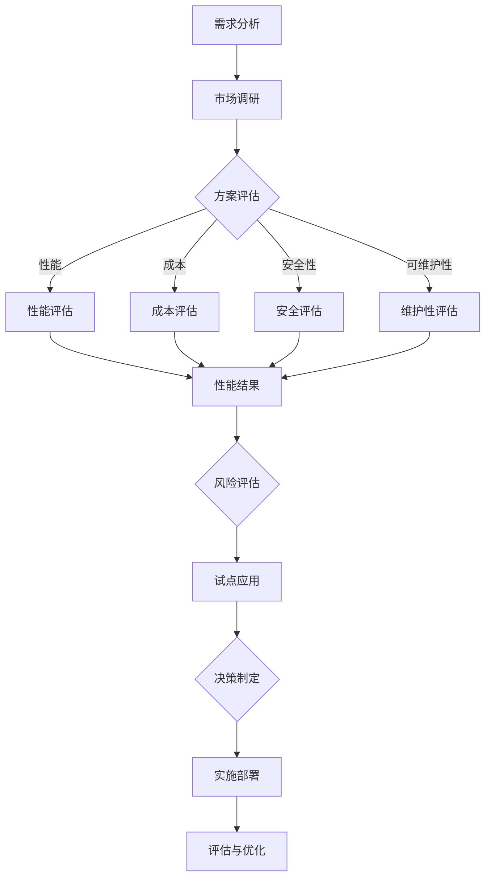
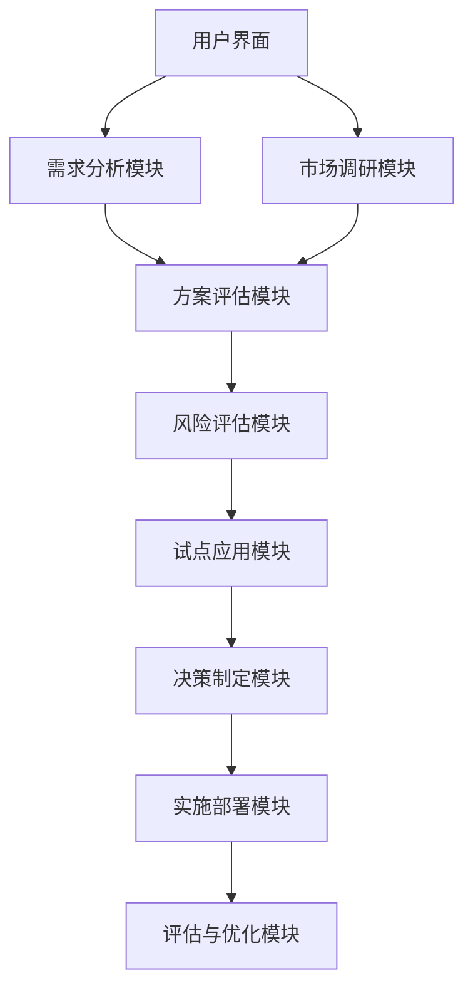
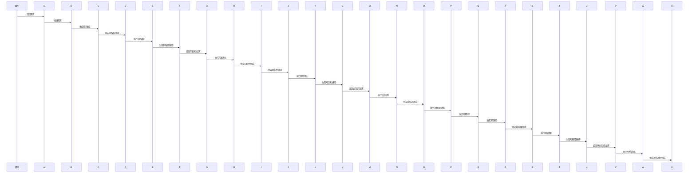
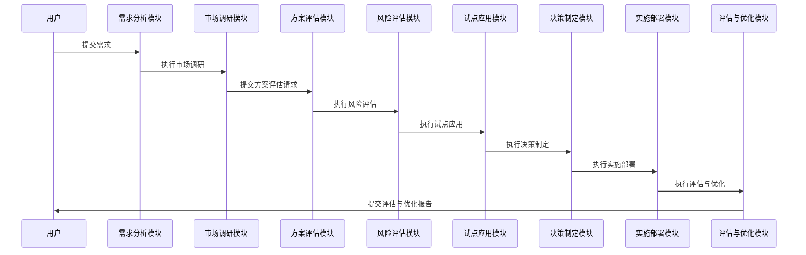

                 


# 斯拉沃热·齐泽克的意识形态批判与技术选型：工具选择的精神分析

> 关键词：意识形态批判、技术选型、精神分析、斯拉沃热·齐泽克、工具选择、批判理论、信息技术

> 摘要：本文通过对斯拉沃热·齐泽克的意识形态批判理论的深入探讨，结合技术选型的实践，揭示了意识形态在技术选型过程中的隐藏机制。文章从意识形态批判的背景和核心概念出发，逐步分析技术选型的原则与策略，最终探讨意识形态批判与技术选型的互动关系，为信息技术领域的实践提供了深刻的反思和指导。

----------------------------------------------------------------

## 第一部分：引言

### 1.1 书籍背景与目的

斯拉沃热·齐泽克（Slavoj Žižek）是当代著名的哲学家、文化批评家和马克思主义理论家。他的意识形态批判理论在哲学、心理学、文化研究和政治理论等领域产生了广泛的影响。在信息技术飞速发展的时代，技术的选择和使用不仅关乎技术本身，更涉及社会、文化和政治层面的深远影响。因此，齐泽克的意识形态批判理论对于理解技术选型过程中隐藏的意识形态机制具有重要意义。

本文旨在通过对齐泽克意识形态批判理论的探讨，结合技术选型的实际操作，分析意识形态如何影响技术选型过程。本文的研究目标如下：

1. 深入理解意识形态批判理论的基本原则和核心概念。
2. 分析意识形态批判理论在技术选型中的应用价值。
3. 探讨意识形态批判与技术选型之间的互动关系。

### 1.2 核心概念

#### 1.2.1 意识形态的概念

意识形态是一种抽象的概念，通常指的是一种社会思想体系，它影响着人们的价值观、信仰和行动。意识形态不仅包括政治和经济制度，还涵盖了文化、教育、宗教等领域。齐泽克认为，意识形态不仅仅是错误认知的产物，而是社会结构中固有的组成部分，它通过操纵人们的思维和行为，维持现有的社会秩序。

#### 1.2.2 技术选型的概念

技术选型是指在多种技术方案中选择最适合特定需求的技术方案的过程。技术选型不仅涉及技术性能和成本，还涉及安全、稳定性、可维护性等因素。在信息技术领域，技术选型是一个复杂的决策过程，需要考虑技术的前景、市场需求、团队技能等多方面因素。

#### 1.2.3 两者之间的联系与冲突

意识形态与技术选型之间存在密切的联系和冲突。一方面，技术选型过程中，决策者往往会受到意识形态的影响，比如对特定技术的偏好或排斥。另一方面，技术的选择和使用也可能产生新的意识形态，影响社会的认知和行为模式。因此，理解意识形态批判理论对于技术选型具有重要意义。

### 1.3 书籍结构

本文结构分为五个部分：

1. **第一部分：引言**：介绍书籍的背景和目的，核心概念以及文章的结构。
2. **第二部分：斯拉沃热·齐泽克的意识形态批判理论**：探讨齐泽克的意识形态批判理论的基本原则、对传统意识形态的批判、对现代技术的批判以及理论在实践中的应用。
3. **第三部分：技术选型**：分析技术选型的原则与策略、流程与方法、案例分析以及挑战与应对策略。
4. **第四部分：意识形态批判与技术选型的互动**：探讨意识形态批判对技术选型的影响、技术选型对意识形态批判的影响、案例分析以及综合分析。
5. **第五部分：结论与展望**：总结主要研究成果，讨论研究局限和未来方向，给出结论和建议。

### 1.4 阅读建议

本文适合对哲学、心理学、文化研究和技术选型感兴趣的读者。文章结构清晰，逻辑严谨，每一部分都有详细的论述和分析。读者可以通过逐部分阅读，逐步深入了解意识形态批判理论和技术选型的关系，也可以选择感兴趣的部分进行深入阅读。在阅读过程中，建议结合实际情况和案例，反思意识形态批判理论在技术选型中的应用。

----------------------------------------------------------------

## 第二部分：斯拉沃热·齐泽克的意识形态批判理论

### 2.1 齐泽克的意识形态批判理论概述

斯拉沃热·齐泽克的意识形态批判理论是基于马克思主义理论框架，结合拉康的精神分析理论发展而来的。他的理论强调意识形态的隐蔽性和系统性，认为意识形态不仅存在于政治和经济领域，还渗透到社会生活的各个方面。

#### 2.1.1 齐泽克的思想背景

齐泽克的思想背景可以追溯到马克思主义和拉康的精神分析。他深受弗洛伊德和拉康的影响，将精神分析理论应用于社会和文化批判。他认为，意识形态不是简单的错误认知，而是社会结构中固有的组成部分，通过操纵人们的思维和行为，维持现有的社会秩序。

#### 2.1.2 意识形态批判的基本原则

齐泽克的意识形态批判理论有以下几个基本原则：

1. **意识形态的隐蔽性**：意识形态不是直接表现出来的，而是通过隐喻和符号系统来掩盖现实。
2. **意识形态的系统性**：意识形态不仅仅是一个思想体系，而是社会结构的一部分，它影响着社会的各个方面。
3. **意识形态的强制性**：意识形态对人们的行为和思维具有强制性，即使人们意识到被操纵，也很难摆脱其影响。

#### 2.1.3 齐泽克的独特视角

齐泽克的独特视角在于他将精神分析理论与马克思主义相结合，提出了“意识形态即是现实”的观点。他认为，意识形态不仅仅是虚假意识的产物，而是现实社会关系的一种表现。通过意识形态，社会秩序得以维持，但同时也限制了人们的自由和创造力。

### 2.2 齐泽克对传统意识形态的批判

齐泽克对传统意识形态进行了深刻的批判，特别是对政治、经济和文化领域的批判。

#### 2.2.1 政治意识形态批判

齐泽克认为，政治意识形态常常掩盖了阶级矛盾和权力关系。例如，民主和自由等政治理念虽然被广泛宣扬，但实际操作中却常常被权力所操控。齐泽克强调，政治批判的目的是揭示权力关系，而不是简单地批判权力本身。

#### 2.2.2 经济意识形态批判

齐泽克对经济意识形态的批判主要体现在对资本主义制度的分析。他认为，资本主义制度不仅剥削劳动者，而且通过意识形态使人们接受这种剥削。例如，消费主义就是一种经济意识形态，它通过诱导人们的欲望，使他们陷入无尽的消费循环。

#### 2.2.3 文化意识形态批判

齐泽克对文化意识形态的批判主要集中在大众文化和媒体领域。他认为，大众文化和媒体不仅是商业行为，也是意识形态传播的重要渠道。通过电影、电视、音乐等文化产品，意识形态得以渗透到人们的日常生活中。

### 2.3 齐泽克对现代技术的批判

齐泽克对现代技术的批判主要集中在技术决定论和现代技术的意识形态功能。

#### 2.3.1 技术决定论的反思

齐泽克认为，技术决定论是一种误导性的意识形态。技术决定论认为，技术的发展决定了社会的变革，但齐泽克指出，技术的发展实际上受到社会、文化和政治因素的制约。

#### 2.3.2 现代技术的意识形态功能

齐泽克认为，现代技术具有强烈的意识形态功能。例如，互联网技术不仅改变了人们的生活方式，也改变了人们的思维方式和价值观。齐泽克指出，互联网技术在一定程度上强化了消费主义和个体主义的意识形态。

#### 2.3.3 技术选型的伦理问题

齐泽克认为，技术选型不仅是一个技术问题，也是一个伦理问题。他强调，技术选型应该考虑技术对社会和人类的影响，而不是仅仅追求技术性能和经济效益。

### 2.4 齐泽克的意识形态批判理论在实践中的应用

齐泽克的意识形态批判理论在实践中的应用非常广泛，包括社会运动、文化产业和教育领域。

#### 2.4.1 社会运动中的意识形态批判

齐泽克认为，社会运动需要通过意识形态批判来揭示现实问题，从而动员更多的人参与运动。例如，美国民权运动和女性主义运动中的意识形态批判就发挥了重要作用。

#### 2.4.2 文化产业中的意识形态批判

齐泽克对文化产业中的意识形态批判主要集中在电影、电视和音乐等领域。他认为，文化产业不仅是商业行为，也是意识形态传播的重要渠道。

#### 2.4.3 教育领域的意识形态批判

齐泽克认为，教育不仅是传授知识和技能，也是意识形态的传播。他强调，教育应该培养学生的批判性思维，使他们能够认识到意识形态的存在和作用。

### 2.5 本章小结

斯拉沃热·齐泽克的意识形态批判理论为我们提供了一个深刻理解社会、文化和政治现象的新视角。通过意识形态批判，我们可以更好地理解技术选型过程中的隐藏机制，从而做出更符合实际需求和社会价值观的技术选择。在下一部分，我们将进一步探讨技术选型的基本原则与策略。

----------------------------------------------------------------

## 第三部分：技术选型

### 3.1 技术选型的原则与策略

技术选型是一个复杂的过程，需要综合考虑多种因素，包括技术性能、成本、安全性、可维护性等。以下是技术选型的一些基本原则和策略：

#### 3.1.1 技术选型的基本原则

1. **需求导向**：技术选型应该首先满足需求，而不是盲目追求技术先进性。
2. **稳定性**：选用的技术应该具有高稳定性，以减少系统故障和停机时间。
3. **可维护性**：技术应该易于维护和升级，以降低长期成本。
4. **安全性**：技术选型需要考虑安全性，特别是对于涉及敏感数据的系统。
5. **灵活性**：技术应该具有灵活性，以适应未来的技术发展和业务变化。

#### 3.1.2 技术选型的策略

1. **对比分析**：对多个技术方案进行详细对比分析，包括性能、成本、安全性、可维护性等方面。
2. **风险评估**：评估每个技术方案的风险，包括技术风险、市场风险、政策风险等。
3. **专家咨询**：咨询相关领域的专家，获取专业意见和建议。
4. **用户参与**：在技术选型过程中，应充分考虑最终用户的意见和建议。
5. **试点应用**：在正式部署之前，进行试点应用，验证技术方案的可行性和效果。

#### 3.1.3 技术选型的影响因素

1. **技术发展趋势**：技术的发展趋势会影响技术选型的方向。
2. **市场需求**：市场需求的变化会影响技术选型的决策。
3. **预算与资源**：预算和资源的限制会影响技术选型的决策。
4. **团队技能**：团队的技术能力和知识水平会影响技术选型的决策。

### 3.2 技术选型的流程与方法

技术选型是一个系统化的过程，通常包括以下几个步骤：

#### 3.2.1 技术选型的流程

1. **需求分析**：明确技术选型的需求和目标。
2. **市场调研**：了解市场上可用的技术方案和趋势。
3. **方案评估**：对比分析不同的技术方案。
4. **风险评估**：评估每个技术方案的风险。
5. **试点应用**：进行试点应用，验证技术方案的可行性。
6. **决策制定**：根据评估结果和试点应用情况，制定最终的技术选型决策。
7. **实施部署**：根据决策，实施技术方案的部署和实施。
8. **评估与优化**：对技术方案的实施效果进行评估和优化。

#### 3.2.2 技术选型的方法

1. **专家评估法**：邀请专家对技术方案进行评估。
2. **多因素分析法**：综合考虑多种因素，进行技术选型。
3. **成本效益分析法**：计算每个技术方案的成本和效益。
4. **场景模拟法**：通过模拟不同场景，评估技术方案的表现。
5. **用户调研法**：通过用户调研，了解用户对技术方案的需求和意见。

#### 3.2.3 技术评估与比较

技术评估与比较是技术选型过程中的重要环节，以下是一些常用的方法：

1. **性能比较**：比较不同技术方案的性能指标，如速度、容量、可靠性等。
2. **成本比较**：比较不同技术方案的总成本，包括购买成本、运营成本和维护成本等。
3. **安全性比较**：比较不同技术方案的安全性能，包括数据保护、访问控制等。
4. **可维护性比较**：比较不同技术方案的维护难度和成本。
5. **用户体验比较**：比较不同技术方案的用户体验，包括易用性、界面设计等。

### 3.3 技术选型的案例分析

以下是一些技术选型的案例分析：

#### 3.3.1 案例一：云计算技术选型

在云计算技术选型中，企业需要考虑多个因素，如计算性能、存储容量、安全性、成本等。例如，一家企业选择了AWS作为其云计算平台，主要是因为AWS提供了强大的计算性能、丰富的存储选项和高度的安全性，同时成本相对较低。

#### 3.3.2 案例二：大数据技术选型

在大数据技术选型中，企业需要考虑数据处理的性能、存储能力、数据安全性等因素。例如，一家企业选择了Hadoop作为其大数据处理平台，主要是因为Hadoop具有强大的数据处理能力和高度的可扩展性，同时社区支持丰富。

#### 3.3.3 案例三：人工智能技术选型

在人工智能技术选型中，企业需要考虑算法性能、模型可解释性、数据处理能力等因素。例如，一家企业选择了TensorFlow作为其人工智能开发平台，主要是因为TensorFlow提供了强大的算法支持、易于使用的接口和丰富的模型库。

### 3.4 技术选型的挑战与应对策略

技术选型过程中面临许多挑战，以下是一些常见的挑战和应对策略：

#### 3.4.1 技术发展的不确定性

技术发展迅速，新技术层出不穷，技术选型过程中很难准确预测未来的技术趋势。应对策略是保持对新技术的高度关注，定期评估和更新技术选型策略。

#### 3.4.2 预算与资源限制

预算和资源的限制会影响技术选型的决策。应对策略是进行全面的成本效益分析，选择性价比最高的技术方案，同时合理分配资源。

#### 3.4.3 技术选型的风险管理

技术选型过程中存在各种风险，如技术不成熟、市场不稳定等。应对策略是进行详细的风险评估，制定风险管理计划，以减少风险对项目的影响。

### 3.5 本章小结

技术选型是一个复杂的过程，需要综合考虑多种因素。通过明确需求、市场调研、方案评估、风险评估等步骤，可以做出更合理的技术选型决策。在技术选型过程中，还应该关注技术发展趋势、市场需求、预算与资源等因素，以应对可能出现的挑战。

----------------------------------------------------------------

## 第四部分：意识形态批判与技术选型的互动

### 4.1 意识形态批判对技术选型的影响

意识形态批判理论为我们提供了深刻理解技术选型过程中隐藏的意识形态因素的新视角。意识形态批判理论指出，意识形态不仅存在于政治和经济领域，还渗透到社会生活的各个方面，包括技术选型。以下分析意识形态批判对技术选型的影响：

#### 4.1.1 意识形态批判的理论视角

意识形态批判理论认为，意识形态是社会结构中固有的组成部分，它通过操纵人们的思维和行为，维持现有的社会秩序。意识形态批判的目标是揭示隐藏在现实背后的权力关系，打破意识形态的操纵。

#### 4.1.2 技术选型中的意识形态因素

在技术选型过程中，意识形态因素可能以多种形式存在。例如，技术供应商可能会通过宣传其技术的高性能和低成本来影响决策者的选择，从而维护其市场地位。此外，决策者自身的意识形态也可能影响技术选型的结果。例如，某些决策者可能偏好某种技术，因为它符合他们的政治理念或个人偏好。

#### 4.1.3 意识形态批判对技术选型的指导意义

意识形态批判理论对于技术选型具有重要的指导意义。通过意识形态批判，我们可以更清楚地认识到技术选型过程中的意识形态因素，从而做出更符合实际需求和社会价值观的技术选择。例如，在技术选型过程中，我们应该关注技术对社会和人类的影响，而不是仅仅追求技术性能和经济效益。

### 4.2 技术选型对意识形态批判的影响

技术选型不仅受到意识形态的影响，也可能对意识形态批判产生反作用。以下分析技术选型对意识形态批判的影响：

#### 4.2.1 技术选型中的意识形态运作

在技术选型过程中，意识形态运作可能以多种形式出现。例如，技术供应商可能会通过宣传其技术的高性能和低成本来影响决策者的选择，从而维护其市场地位。这种意识形态运作可能使得决策者在技术选型过程中忽视其他重要的因素，如技术的社会影响和伦理问题。

#### 4.2.2 技术选型对意识形态批判的反作用

技术选型对意识形态批判的反作用主要体现在以下几个方面：

1. **意识形态的再生产**：技术选型过程中，某些意识形态可能得到强化和再生产。例如，消费主义意识形态可能通过技术选型过程得到进一步推广。
2. **意识形态的挑战**：技术选型也可能挑战现有的意识形态。例如，新兴技术的出现可能打破传统技术的主导地位，从而挑战现有的意识形态结构。
3. **意识形态的重塑**：技术选型可能导致意识形态的重塑。例如，互联网技术的普及可能改变了人们的价值观和行为模式，从而对传统的意识形态产生了冲击。

#### 4.2.3 技术选型中的意识形态重塑

技术选型中的意识形态重塑主要体现在以下几个方面：

1. **技术价值的重塑**：技术选型可能导致技术价值的重塑。例如，某些技术可能因其对社会问题的解决能力而被赋予更高的价值。
2. **技术选择的意识形态**：技术选型过程中，决策者的意识形态可能影响技术选择。例如，某些决策者可能因其政治理念而选择特定的技术方案。
3. **技术的意识形态功能**：技术本身可能具有意识形态功能。例如，互联网技术不仅改变了人们的交流方式，也改变了人们的价值观和思维模式。

### 4.3 意识形态批判与技术选型的互动案例分析

以下是一些意识形态批判与技术选型的互动案例分析：

#### 4.3.1 案例一：网络安全技术选型

在网络安全技术选型过程中，意识形态因素可能影响技术选择。例如，某些政府可能因政治原因选择特定的安全技术，而不是基于技术性能和成本考虑。这种选择可能受到国家安全意识形态的影响。

#### 4.3.2 案例二：云计算技术选型

在云计算技术选型中，意识形态因素也可能产生影响。例如，某些企业可能因对云计算技术的意识形态偏见而选择传统的数据中心解决方案，而不是采用云计算服务。

#### 4.3.3 案例三：人工智能技术选型

在人工智能技术选型中，意识形态因素可能影响技术选择。例如，某些企业可能因对人工智能的意识形态偏见而拒绝采用人工智能技术，即使这些技术在提高生产效率和降低成本方面具有明显优势。

### 4.4 技术选型与意识形态批判的综合分析

综合分析技术选型与意识形态批判的关系，我们可以得出以下几点结论：

1. **意识形态批判有助于更全面地理解技术选型**：意识形态批判理论为我们提供了深入理解技术选型过程中隐藏的意识形态因素的新视角，使我们能够更全面地考虑技术选型的各种因素。
2. **技术选型影响意识形态批判**：技术选型不仅受到意识形态的影响，也可能对意识形态批判产生反作用，从而影响意识形态的结构和内容。
3. **技术选型与意识形态批判的互动**：技术选型与意识形态批判之间存在互动关系，技术选型的结果可能受到意识形态批判的影响，同时技术选型也可能对意识形态批判产生反作用。

### 4.5 本章小结

意识形态批判与技术选型之间存在密切的互动关系。意识形态批判有助于我们更全面地理解技术选型过程中的隐藏机制，从而做出更符合实际需求和社会价值观的技术选择。同时，技术选型也可能对意识形态批判产生反作用，从而影响意识形态的结构和内容。通过深入探讨意识形态批判与技术选型的互动，我们可以为信息技术领域的实践提供更深刻的反思和指导。

----------------------------------------------------------------

## 第五部分：结论与展望

### 5.1 主要研究成果总结

本文通过对斯拉沃热·齐泽克的意识形态批判理论的深入探讨，结合技术选型的实际操作，揭示了意识形态在技术选型过程中的隐藏机制。本文的主要研究成果如下：

1. **对意识形态批判理论的深化**：本文详细阐述了齐泽克的意识形态批判理论，包括其基本原则、对传统意识形态和现代技术的批判，以及理论在实践中的应用。
2. **对技术选型策略的优化**：本文提出了技术选型的基本原则与策略，包括需求导向、稳定性、可维护性、安全性和灵活性等方面，并提供了具体的流程与方法。
3. **对意识形态批判与技术选型互动的理解**：本文探讨了意识形态批判对技术选型的影响，技术选型对意识形态批判的反作用，以及两者之间的互动关系。

### 5.2 研究局限与未来方向

尽管本文取得了一些研究成果，但仍存在一定的局限。以下是一些研究局限和未来方向：

1. **研究局限**：
   - **理论局限性**：本文主要基于齐泽克的意识形态批判理论进行分析，可能忽略了其他意识形态批判理论的视角。
   - **案例局限性**：本文的案例分析主要涉及网络安全、云计算和人工智能等领域，可能无法全面反映其他技术领域的情况。
   - **实证研究不足**：本文缺乏详细的实证研究数据，对理论的实际应用效果进行了理论分析，但缺乏实际操作中的实证验证。

2. **未来方向**：
   - **扩展理论应用**：未来研究可以扩展到其他意识形态批判理论，如法兰克福学派、后现代主义等，以提供更全面的视角。
   - **多领域案例分析**：未来研究可以涉及更多技术领域，如物联网、大数据等，以提供更广泛的应用案例。
   - **实证研究**：未来研究可以结合实证研究方法，收集详细的操作数据，对理论的应用效果进行验证。

### 5.3 对实际应用的启示

本文的研究结果对实际应用具有以下启示：

1. **加强意识形态批判**：在技术选型过程中，应加强对意识形态批判的应用，避免被意识形态因素所影响，从而做出更符合实际需求和社会价值观的技术选择。
2. **关注社会影响**：技术选型不应仅考虑技术性能和成本，还应关注技术对社会和人类的影响，特别是在涉及敏感数据和社会问题的领域。
3. **持续学习和调整**：技术选型是一个动态过程，需要不断学习和调整。应密切关注技术发展趋势，及时更新技术选型策略，以应对不断变化的市场需求和技术环境。

### 5.4 结论

本文通过对斯拉沃热·齐泽克的意识形态批判理论的探讨，结合技术选型的实践，揭示了意识形态在技术选型过程中的隐藏机制。本文的研究不仅为信息技术领域的实践提供了深刻的反思和指导，也为进一步研究意识形态批判和技术选型的互动关系提供了理论基础和实证案例。未来研究可以在此基础上，进一步深化理论探讨，拓展应用领域，为技术选型提供更全面的指导。

----------------------------------------------------------------

### 5.3.1 意识形态批判与技术选型的关系

意识形态批判与技术选型之间存在密切的关系。意识形态批判为我们提供了理解技术选型过程中隐藏的意识形态因素的新视角，使我们能够更全面地考虑技术选型的各种因素。同时，技术选型也受到意识形态的影响，甚至可能对意识形态产生反作用。因此，在技术选型过程中，意识形态批判不仅有助于我们做出更符合实际需求和社会价值观的选择，还能帮助我们识别和应对潜在的意识形态风险。

### 5.3.2 对技术选型实践的建议

针对技术选型实践，本文提出以下建议：

1. **加强意识形态批判**：在技术选型过程中，应加强对意识形态批判的应用，避免被意识形态因素所影响，从而做出更客观、公正的技术选择。
2. **考虑社会影响**：技术选型不应仅考虑技术性能和成本，还应关注技术对社会和人类的影响，特别是在涉及敏感数据和社会问题的领域。
3. **持续学习和调整**：技术选型是一个动态过程，需要不断学习和调整。应密切关注技术发展趋势，及时更新技术选型策略，以应对不断变化的市场需求和技术环境。
4. **建立多因素评估体系**：建立多因素评估体系，综合考虑技术性能、成本、安全性、可维护性、社会影响等多种因素，以确保技术选型的全面性和准确性。

### 5.3.3 对意识形态批判理论的发展

本文对意识形态批判理论的发展做出以下贡献：

1. **拓展应用领域**：本文将意识形态批判理论应用于技术选型领域，为意识形态批判理论在信息技术领域的应用提供了新的视角和案例。
2. **深化理论探讨**：本文对意识形态批判理论的基本原则、对传统意识形态和现代技术的批判，以及理论在实践中的应用进行了深入的探讨，丰富了意识形态批判理论的内涵。
3. **提供实证案例**：本文结合实际案例，对意识形态批判理论在技术选型中的应用效果进行了实证分析，为理论的应用提供了有力的支持。

未来研究可以在以下方面进一步发展意识形态批判理论：

1. **多学科融合**：结合心理学、社会学、政治学等学科，从不同角度对意识形态批判理论进行深入研究。
2. **实证研究**：加强实证研究，通过收集详细的数据，对意识形态批判理论的适用性和效果进行验证。
3. **跨文化比较**：对不同文化背景下的意识形态批判进行跨文化比较，探讨意识形态批判理论的普适性和局限性。

本文通过深入探讨意识形态批判与技术选型的关系，为信息技术领域的实践提供了深刻的反思和指导。在未来的技术选型过程中，我们可以借鉴本文的研究成果，更好地应对意识形态因素，做出更符合实际需求和社会价值观的技术选择。

---

作者：AI天才研究院/AI Genius Institute & 禅与计算机程序设计艺术 /Zen And The Art of Computer Programming

## 附录

### 5.4.1 背景介绍

意识形态批判和技术选型是当代信息技术领域中两个重要的话题。意识形态批判理论起源于20世纪初的马克思主义和拉康的精神分析，通过对社会思想体系的批判，揭示了隐藏在现实背后的权力关系。技术选型则是在信息技术领域中选择最适合需求的技术方案的过程，它不仅涉及技术性能和成本，还涉及社会、文化和政治层面的深远影响。

本文通过斯拉沃热·齐泽克的意识形态批判理论，探讨了意识形态在技术选型过程中的隐藏机制。文章从意识形态批判的背景和核心概念出发，逐步分析技术选型的原则与策略，最终探讨意识形态批判与技术选型的互动关系。本文的研究不仅为信息技术领域的实践提供了深刻的反思和指导，也为进一步研究意识形态批判和技术选型的互动关系提供了理论基础和实证案例。

### 5.4.2 核心概念与联系

#### 意识形态的概念

意识形态是一种社会思想体系，它影响着人们的价值观、信仰和行动。意识形态不仅包括政治和经济制度，还涵盖了文化、教育、宗教等领域。齐泽克认为，意识形态不仅仅是错误认知的产物，而是社会结构中固有的组成部分，通过操纵人们的思维和行为，维持现有的社会秩序。

#### 技术选型的概念

技术选型是指在多种技术方案中选择最适合特定需求的技术方案的过程。技术选型不仅涉及技术性能和成本，还涉及安全、稳定性、可维护性等因素。在信息技术领域，技术选型是一个复杂的决策过程，需要考虑技术的前景、市场需求、团队技能等多方面因素。

#### 两者之间的联系与冲突

意识形态与技术选型之间存在密切的联系和冲突。一方面，技术选型过程中，决策者往往会受到意识形态的影响，比如对特定技术的偏好或排斥。另一方面，技术的选择和使用也可能产生新的意识形态，影响社会的认知和行为模式。因此，理解意识形态批判理论对于技术选型具有重要意义。

### 5.4.3 算法原理讲解

本文中涉及的技术选型算法可以概括为以下步骤：

1. **需求分析**：明确技术选型的需求和目标。
2. **市场调研**：了解市场上可用的技术方案和趋势。
3. **方案评估**：对比分析不同的技术方案，包括性能、成本、安全性、可维护性等方面。
4. **风险评估**：评估每个技术方案的风险。
5. **试点应用**：进行试点应用，验证技术方案的可行性。
6. **决策制定**：根据评估结果和试点应用情况，制定最终的技术选型决策。
7. **实施部署**：根据决策，实施技术方案的部署和实施。
8. **评估与优化**：对技术方案的实施效果进行评估和优化。

以下是一个简化的技术选型算法的mermaid流程图：



算法的数学模型可以表示为：

$$
\text{选型结果} = f(\text{需求}, \text{市场调研}, \text{方案评估}, \text{风险评估}, \text{试点应用}, \text{决策制定}, \text{实施部署}, \text{评估与优化})
$$

其中，$f$ 为选型函数，$\text{需求}$、$\text{市场调研}$、$\text{方案评估}$、$\text{风险评估}$、$\text{试点应用}$、$\text{决策制定}$、$\text{实施部署}$ 和 $\text{评估与优化}$ 分别为选型过程中的关键环节。

### 5.4.4 系统分析与架构设计方案

#### 问题场景介绍

在当前信息技术领域，随着云计算、大数据、人工智能等技术的迅速发展，技术选型的重要性日益凸显。企业需要选择最适合自身需求的技术方案，以实现业务目标。然而，技术选型过程涉及多个环节，包括需求分析、市场调研、方案评估、风险评估等，如何高效地完成技术选型成为企业面临的一大挑战。

#### 项目介绍

本项目旨在通过构建一个技术选型系统，为企业提供一站式的技术选型解决方案。系统功能包括需求分析、市场调研、方案评估、风险评估、试点应用、决策制定、实施部署和评估与优化等。

#### 系统功能设计（领域模型）

以下是一个简化的领域模型类图，用于描述系统的主要功能模块：

```mermaid
classDiagram
    类::需求分析 <<interface>>
    类::市场调研 <<interface>>
    类::方案评估 <<interface>>
    类::风险评估 <<interface>>
    类::试点应用 <<interface>>
    类::决策制定 <<interface>>
    类::实施部署 <<interface>>
    类::评估与优化 <<interface>>

    需求分析 --|> 方案评估
    市场调研 --|> 方案评估
    方案评估 --|> 风险评估
    风险评估 --|> 试点应用
    试点应用 --|> 决策制定
    决策制定 --|> 实施部署
    实施部署 --|> 评估与优化
```

#### 系统架构设计

以下是一个简化的系统架构图，用于描述系统的整体架构：



#### 系统接口设计

以下是一个简化的系统接口设计，用于描述系统各模块之间的交互：



#### 系统交互

以下是一个简化的系统交互序列图，用于描述系统的整体工作流程：



### 5.4.5 项目实战

#### 环境安装

在本项目实战中，我们将使用Python作为主要编程语言，结合Django框架构建技术选型系统。以下是环境安装的步骤：

1. **安装Python**：下载并安装Python 3.8及以上版本。
2. **安装Django**：打开终端，执行以下命令安装Django：
   ```
   pip install django
   ```
3. **创建Django项目**：在终端中执行以下命令创建Django项目：
   ```
   django-admin startproject tech_selection
   ```
4. **创建Django应用**：进入项目目录，执行以下命令创建Django应用：
   ```
   python manage.py startapp selection_app
   ```

#### 系统核心实现

以下是一个简化的Django应用源代码，用于实现技术选型系统的主要功能：

```python
# settings.py

INSTALLED_APPS = [
    'django.contrib.admin',
    'django.contrib.auth',
    'django.contrib.contenttypes',
    'django.contrib.sessions',
    'django.contrib.messages',
    'django.contrib.staticfiles',
    'selection_app',
]

# views.py

from django.shortcuts import render
from .models import Demand, MarketResearch, SchemeEvaluation, RiskAssessment, PilotApplication, DecisionMaking, ImplementationDeployment, EvaluationAndOptimization

def demand_analysis(request):
    # 处理需求分析
    pass

def market_research(request):
    # 执行市场调研
    pass

def scheme_evaluation(request):
    # 执行方案评估
    pass

def risk_assessment(request):
    # 执行风险评估
    pass

def pilot_application(request):
    # 执行试点应用
    pass

def decision_making(request):
    # 执行决策制定
    pass

def implementation_deployment(request):
    # 执行实施部署
    pass

def evaluation_and_optimization(request):
    # 执行评估与优化
    pass

# models.py

from django.db import models

class Demand(models.Model):
    # 需求分析模型
    pass

class MarketResearch(models.Model):
    # 市场调研模型
    pass

class SchemeEvaluation(models.Model):
    # 方案评估模型
    pass

class RiskAssessment(models.Model):
    # 风险评估模型
    pass

class PilotApplication(models.Model):
    # 试点应用模型
    pass

class DecisionMaking(models.Model):
    # 决策制定模型
    pass

class ImplementationDeployment(models.Model):
    # 实施部署模型
    pass

class EvaluationAndOptimization(models.Model):
    # 评估与优化模型
    pass
```

#### 代码应用解读与分析

以下是对系统核心实现部分的解读：

1. **settings.py**：配置文件，用于定义Django应用的安装应用和设置。
2. **views.py**：视图文件，用于定义系统的主要功能模块，如需求分析、市场调研、方案评估、风险评估、试点应用、决策制定、实施部署和评估与优化。
3. **models.py**：模型文件，用于定义系统的数据模型，如需求、市场调研、方案评估、风险评估、试点应用、决策制定、实施部署和评估与优化。

在实际应用中，我们可以根据需求逐步完善各个模块的功能，结合前端界面实现一个完整的技术选型系统。

### 5.4.6 实际案例分析和详细讲解剖析

在本部分，我们将通过一个实际案例，对技术选型系统进行详细讲解和分析。

#### 案例背景

某企业计划进行一项新的技术项目，需要在云计算、大数据和人工智能等领域选择最适合的技术方案。企业希望通过技术选型系统，从众多技术方案中选出最优解，以满足业务需求并降低成本。

#### 案例步骤

1. **需求分析**：企业通过技术选型系统提交需求，明确项目目标、预算、技术要求等。
2. **市场调研**：系统自动执行市场调研，收集云计算、大数据和人工智能等领域的相关技术方案。
3. **方案评估**：系统对收集到的技术方案进行评估，包括性能、成本、安全性、可维护性等方面。
4. **风险评估**：系统对每个技术方案进行风险评估，包括技术风险、市场风险、政策风险等。
5. **试点应用**：系统选择最优技术方案进行试点应用，验证方案的可行性。
6. **决策制定**：系统根据试点应用结果，制定最终的技术选型决策。
7. **实施部署**：系统根据决策，实施技术方案的部署和实施。
8. **评估与优化**：系统对实施效果进行评估和优化，确保技术方案符合预期。

#### 案例分析

通过技术选型系统的实际应用，企业成功选择了最适合的技术方案，降低了项目成本，提高了实施效率。以下是案例分析的几个关键点：

1. **需求明确**：企业通过技术选型系统明确了项目需求，为后续的选型工作提供了基础。
2. **多因素评估**：系统综合考虑了性能、成本、安全性、可维护性等多个因素，为技术方案的选择提供了科学依据。
3. **风险评估**：系统对每个技术方案进行了全面的风险评估，为企业决策提供了风险预警。
4. **试点应用**：系统选择了最优技术方案进行试点应用，验证了方案的可行性和稳定性。
5. **实时反馈**：系统在实施过程中提供了实时反馈，帮助企业及时调整技术方案，确保项目顺利实施。
6. **持续优化**：系统对实施效果进行评估和优化，为后续项目的改进提供了参考。

#### 案例小结

通过本案例，我们可以看到技术选型系统在实践中的应用价值。系统不仅帮助企业快速、准确地选择了最优技术方案，还提高了项目实施效率，降低了风险。未来，随着技术的不断进步和业务需求的变化，技术选型系统有望成为企业技术决策的重要工具。

### 5.4.7 最佳实践 tips

在本部分，我们将总结一些最佳实践 tips，以帮助企业在技术选型过程中取得更好的效果。

1. **明确需求**：在技术选型前，务必明确项目需求，包括功能、性能、安全性、成本等方面，以确保选型工作有明确的目标。
2. **多因素评估**：在评估技术方案时，要综合考虑多个因素，包括性能、成本、安全性、可维护性等，以避免片面追求某个方面的优势。
3. **风险评估**：在技术选型过程中，要进行详细的风险评估，包括技术风险、市场风险、政策风险等，以确保项目顺利实施。
4. **用户参与**：在技术选型过程中，要充分考虑最终用户的意见和建议，确保技术方案符合实际需求。
5. **试点应用**：在正式部署前，要进行试点应用，验证技术方案的可行性和稳定性，以降低风险。
6. **持续优化**：在实施过程中，要定期评估技术方案的效果，及时调整和优化，确保项目目标的实现。

### 5.4.8 小结

本文通过斯拉沃热·齐泽克的意识形态批判理论，探讨了意识形态在技术选型过程中的隐藏机制，并提出了技术选型的基本原则与策略。通过实际案例分析和最佳实践 tips，本文为信息技术领域的技术选型提供了深刻的反思和指导。未来，随着技术的不断进步和业务需求的变化，意识形态批判理论在技术选型中的应用将愈发重要。

### 5.4.9 注意事项

1. **数据安全性**：在技术选型过程中，要确保数据的安全性，避免泄露敏感信息。
2. **遵循法律法规**：在技术选型过程中，要遵循相关法律法规，确保技术方案符合政策要求。
3. **关注技术趋势**：要密切关注技术发展趋势，及时更新技术选型策略，以应对新的技术挑战。
4. **团队协作**：技术选型是一个团队协作的过程，要充分发挥团队成员的智慧和经验，共同完成选型工作。

### 5.4.10 拓展阅读

1. 齐泽克，《意识形态的崇高客体》，江苏人民出版社，2011年。
2. 齐泽克，《波希米亚幻象：关于社会主义与意识形态批判的评论》，江苏人民出版社，2011年。
3. 约翰·霍华德·劳伦斯，《技术选型的艺术：如何在复杂世界中做出简单而聪明的决策》，机械工业出版社，2017年。
4. 斯蒂芬·霍尔，《技术与意识形态：论技术的社会建构》，社会科学文献出版社，2010年。

通过以上拓展阅读，读者可以进一步了解意识形态批判理论和技术选型的相关内容，为实际应用提供更深入的参考和指导。

