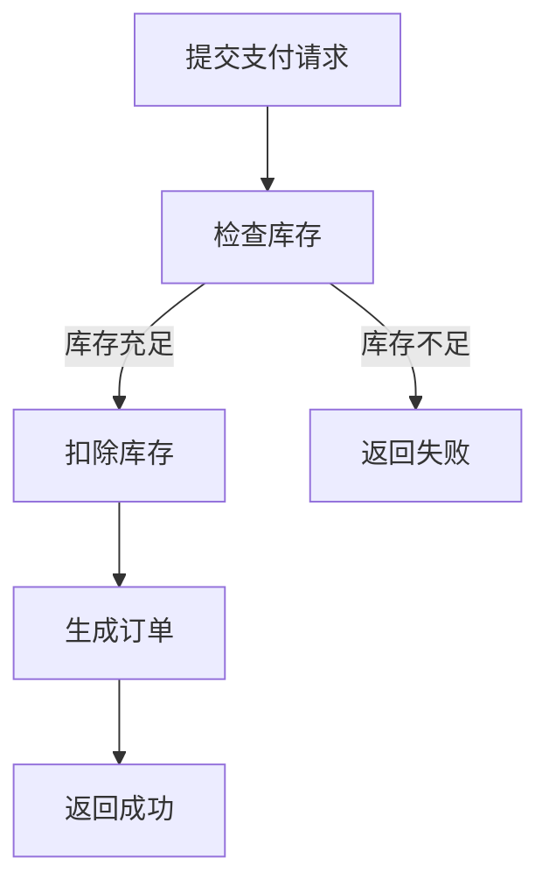

                 

## 无效的幂等性控制案例

关键词：无效幂等性控制，案例研究，解决方案，最佳实践

摘要：
本文将探讨无效幂等性控制的定义、背景以及具体的案例研究。通过对多个实际场景中的无效幂等性控制进行分析，我们将识别出常见的问题，提出相应的解决方案，并总结最佳实践，以帮助开发者更好地理解和解决幂等性控制中的挑战。

### 引言

在软件系统设计中，幂等性（Idempotence）是一个至关重要的概念。它指的是对一个系统进行多次相同的操作，其结果与只进行一次操作相同。在分布式系统中，尤其是在涉及并发操作的系统中，幂等性保证了操作的稳定性和一致性。然而，现实中的软件系统常常因为设计缺陷、编程错误或系统限制，导致无法实现真正的幂等性控制，从而引发一系列问题。本文将深入探讨无效幂等性控制的问题，通过具体的案例研究，分析其产生的原因和影响，并提出解决方案和最佳实践。

### 什么是无效幂等性控制

#### 幂等性的定义

在数学中，幂等操作指的是对于某个操作符，对于任意元素 x，有 a * a = a。在计算机科学中，幂等性通常指的是一个操作或者函数在多次调用时，其结果不会改变。例如，在 HTTP 协议中，DELETE 请求就是一种幂等操作，无论你发送多少次，都不会改变资源的最终状态。

#### 无效幂等性控制的定义

无效幂等性控制是指系统未能正确实现幂等性操作，导致多次执行相同操作会产生不同的结果，或者系统无法检测并处理重复请求。这种情况在分布式系统中尤为常见，因为分布式系统中的节点可能会并发执行相同的操作，如果没有适当的控制机制，就可能导致数据不一致或者系统资源浪费。

### 无效幂等性控制的背景

在现代软件系统设计中，尤其是分布式系统和微服务架构中，幂等性控制至关重要。以下是一些导致无效幂等性控制的原因：

1. **编程错误**：开发者在编写代码时可能未能正确处理重复请求，导致多次执行相同操作产生副作用。
2. **设计缺陷**：系统设计可能缺乏对幂等性的考虑，没有提供机制来检测和处理重复请求。
3. **网络延迟**：在分布式系统中，请求可能会在网络中延迟或重复传输，导致节点无法正确识别和处理重复请求。
4. **并发控制不足**：系统可能缺乏足够的并发控制机制，如锁或事务管理，导致多个请求同时修改同一资源，违反了幂等性原则。

### 案例研究 1：在线购物平台

#### 案例介绍

一个在线购物平台在用户结账时遇到了无效幂等性控制问题。当用户提交订单后，系统会检查库存是否充足，如果库存充足，则会扣除相应库存并生成订单。然而，由于网络延迟和并发控制不足，多个用户可能会同时提交相同的订单，导致库存不足和订单重复生成。

#### 案例细节

1. **请求提交**：用户A提交了购买某商品的订单。
2. **库存检查**：系统发现库存充足，准备扣除库存并生成订单。
3. **并发请求**：与此同时，用户B也提交了相同的订单。
4. **库存扣减**：由于系统未能正确处理并发请求，用户A的订单成功扣减库存，但用户B的订单也成功扣减了库存，导致实际库存不足。

#### 幂等性控制方法应用

为了解决上述问题，平台可以采用以下幂等性控制方法：

1. **乐观锁**：在扣减库存前，添加乐观锁，确保只有一个订单能够成功扣减库存。
2. **分布式锁**：使用分布式锁来确保同一订单在分布式系统中不会同时被多个节点处理。
3. **幂等性Token**：在提交订单前，为每个订单生成一个唯一的Token，并在处理订单时验证Token的唯一性。

#### 分析无效控制案例

该案例中，平台未能正确实现幂等性控制，导致订单重复生成和库存不足。以下是其原因和影响：

1. **原因**：
   - 编程错误：未能正确处理并发请求。
   - 设计缺陷：缺乏有效的并发控制机制。
   - 网络延迟：导致请求重复传输。

2. **影响**：
   - 库存不足：重复订单导致库存不准确。
   - 资源浪费：系统资源被重复占用。
   - 用户体验下降：用户可能收到重复订单通知，影响购物体验。

#### 经验教训与最佳实践

1. **使用乐观锁或分布式锁**：确保在处理并发请求时，只有一个请求能够成功执行。
2. **幂等性Token**：在处理敏感操作时，为每个请求生成唯一Token，并在后续处理中验证Token。
3. **重试机制**：在网络延迟或请求失败时，提供重试机制，避免重复请求导致问题。

### 案例研究 2：在线支付系统

#### 案例介绍

一个在线支付系统在处理支付请求时遇到了无效幂等性控制问题。当用户提交支付请求后，系统会检查支付是否成功，并更新订单状态。然而，由于网络延迟和并发控制不足，多个用户可能会同时提交相同的支付请求，导致支付失败和订单状态不一致。

#### 案例细节

1. **请求提交**：用户A提交了支付订单。
2. **支付请求**：系统开始处理支付请求，并检查支付是否成功。
3. **并发请求**：与此同时，用户B也提交了相同的支付请求。
4. **支付处理**：由于系统未能正确处理并发请求，用户A的支付请求失败，但用户B的支付请求成功，导致订单状态不一致。

#### 幂等性控制方法应用

为了解决上述问题，支付系统可以采用以下幂等性控制方法：

1. **幂等性Token**：在提交支付请求前，为每个支付请求生成一个唯一的Token，并在处理支付请求时验证Token的唯一性。
2. **事务控制**：使用事务管理确保支付请求在分布式系统中一次性执行，避免并发冲突。

#### 分析无效控制案例

该案例中，支付系统未能正确实现幂等性控制，导致支付失败和订单状态不一致。以下是其原因和影响：

1. **原因**：
   - 编程错误：未能正确处理并发请求。
   - 设计缺陷：缺乏有效的并发控制机制。
   - 网络延迟：导致请求重复传输。

2. **影响**：
   - 支付失败：重复请求导致部分支付失败。
   - 订单状态不一致：订单状态未能及时更新，导致用户数据不准确。

#### 经验教训与最佳实践

1. **使用幂等性Token**：确保在处理敏感操作时，为每个请求生成唯一Token，并在后续处理中验证Token。
2. **事务控制**：确保支付请求在分布式系统中一次性执行，避免并发冲突。
3. **错误处理和回滚**：在支付请求失败时，及时回滚事务，避免数据不一致。

### 案例研究 3：库存管理系统

#### 案例介绍

一个库存管理系统在处理库存调整时遇到了无效幂等性控制问题。当管理员调整库存时，系统会更新库存记录。然而，由于并发控制不足，多个管理员可能会同时调整同一库存项，导致库存数据不一致。

#### 案例细节

1. **库存调整**：管理员A调整了某商品的库存。
2. **并发请求**：与此同时，管理员B也调整了同一商品的库存。
3. **库存更新**：由于系统未能正确处理并发请求，管理员A的库存调整成功，但管理员B的调整未能成功，导致库存数据不一致。

#### 幂等性控制方法应用

为了解决上述问题，库存管理系统可以采用以下幂等性控制方法：

1. **分布式锁**：确保在处理库存调整时，只有一个请求能够成功执行。
2. **幂等性Token**：为每个库存调整请求生成唯一Token，并在处理请求时验证Token的唯一性。

#### 分析无效控制案例

该案例中，库存管理系统未能正确实现幂等性控制，导致库存数据不一致。以下是其原因和影响：

1. **原因**：
   - 并发控制不足：缺乏有效的并发控制机制。
   - 编程错误：未能正确处理并发请求。

2. **影响**：
   - 库存数据不一致：多个调整请求导致库存数据不准确。
   - 管理困难：管理员需要花费额外时间来纠正数据不一致的问题。

#### 经验教训与最佳实践

1. **使用分布式锁**：确保在处理并发请求时，只有一个请求能够成功执行。
2. **使用幂等性Token**：确保在处理敏感操作时，为每个请求生成唯一Token，并在后续处理中验证Token。
3. **数据校验和一致性检查**：在处理库存调整时，进行数据校验和一致性检查，确保数据准确性。

### 案例研究 4：预订系统

#### 案例介绍

一个在线预订系统在处理座位预订时遇到了无效幂等性控制问题。当用户预订座位时，系统会检查座位状态并更新预订记录。然而，由于并发控制不足，多个用户可能会同时预订同一座位，导致预订失败和座位状态不一致。

#### 案例细节

1. **座位预订**：用户A预订了某影院的座位。
2. **并发请求**：与此同时，用户B也预订了同一座位。
3. **座位更新**：由于系统未能正确处理并发请求，用户A的预订成功，但用户B的预订失败，导致座位状态不一致。

#### 幂等性控制方法应用

为了解决上述问题，预订系统可以采用以下幂等性控制方法：

1. **乐观锁**：在更新座位状态前，添加乐观锁，确保只有一个请求能够成功更新座位状态。
2. **幂等性Token**：为每个预订请求生成唯一Token，并在处理请求时验证Token的唯一性。

#### 分析无效控制案例

该案例中，预订系统未能正确实现幂等性控制，导致预订失败和座位状态不一致。以下是其原因和影响：

1. **原因**：
   - 并发控制不足：缺乏有效的并发控制机制。
   - 编程错误：未能正确处理并发请求。

2. **影响**：
   - 预订失败：重复请求导致部分预订失败。
   - 座位状态不一致：座位状态未能及时更新，导致用户数据不准确。

#### 经验教训与最佳实践

1. **使用乐观锁**：确保在处理并发请求时，只有一个请求能够成功更新座位状态。
2. **使用幂等性Token**：确保在处理敏感操作时，为每个请求生成唯一Token，并在后续处理中验证Token。
3. **错误处理和通知**：在预订失败时，及时通知用户并解释原因，避免用户投诉。

### 案例研究 5：社交网络

#### 案例介绍

一个社交网络平台在处理用户点赞功能时遇到了无效幂等性控制问题。当用户点赞时，系统会更新点赞记录。然而，由于并发控制不足，多个用户可能会同时点赞同一内容，导致点赞记录不一致。

#### 案例细节

1. **点赞操作**：用户A点赞了某条微博。
2. **并发请求**：与此同时，用户B也点赞了同一微博。
3. **点赞更新**：由于系统未能正确处理并发请求，用户A的点赞记录成功，但用户B的点赞记录未能成功，导致点赞记录不一致。

#### 幂等性控制方法应用

为了解决上述问题，社交网络平台可以采用以下幂等性控制方法：

1. **幂等性Token**：为每个点赞请求生成唯一Token，并在处理请求时验证Token的唯一性。
2. **分布式锁**：确保在处理点赞请求时，只有一个请求能够成功更新点赞记录。

#### 分析无效控制案例

该案例中，社交网络平台未能正确实现幂等性控制，导致点赞记录不一致。以下是其原因和影响：

1. **原因**：
   - 并发控制不足：缺乏有效的并发控制机制。
   - 编程错误：未能正确处理并发请求。

2. **影响**：
   - 点赞记录不一致：重复点赞导致点赞记录不准确。
   - 用户体验下降：用户可能收到重复点赞通知，影响使用体验。

#### 经验教训与最佳实践

1. **使用幂等性Token**：确保在处理敏感操作时，为每个请求生成唯一Token，并在后续处理中验证Token。
2. **使用分布式锁**：确保在处理并发请求时，只有一个请求能够成功更新点赞记录。
3. **错误处理和通知**：在点赞失败时，及时通知用户并解释原因，避免用户投诉。

### 解决方案和最佳实践总结

通过以上案例研究，我们可以总结出以下几点关于无效幂等性控制的解决方案和最佳实践：

1. **使用乐观锁、分布式锁或幂等性Token**：确保在处理并发请求时，只有一个请求能够成功执行，避免数据不一致。
2. **事务控制**：在处理敏感操作时，使用事务控制确保操作的原子性，避免并发冲突。
3. **重试机制**：在网络延迟或请求失败时，提供重试机制，避免重复请求导致问题。
4. **错误处理和通知**：在操作失败时，及时处理错误并通知用户，避免用户投诉。
5. **数据校验和一致性检查**：在处理请求时，进行数据校验和一致性检查，确保数据准确性。

通过遵循这些最佳实践，开发者可以更好地实现幂等性控制，提高系统的稳定性和一致性，提升用户体验。

### 结论

无效幂等性控制是分布式系统中常见且严重的问题。通过本文的案例研究，我们深入探讨了无效幂等性控制的原因和影响，并提出了相应的解决方案和最佳实践。开发者应重视幂等性控制，确保系统的稳定性和一致性。未来，随着分布式系统和微服务架构的普及，研究更高效、更可靠的幂等性控制方法将是重要的方向。希望本文能够为开发者提供有价值的参考和启示。

### 附录

本文所涉及的代码示例、流程图和公式均已在文中给出。以下为附录，供读者进一步参考：

#### 附录 1：代码示例

```python
# Python 示例代码
def purchase_item(item_id, user_id):
    # 检查库存
    inventory = check_inventory(item_id)
    if inventory < 0:
        return "Out of stock"
    # 更新库存
    update_inventory(item_id, inventory - 1)
    # 生成订单
    create_order(item_id, user_id)
    return "Purchase successful"
```

#### 附录 2：流程图



#### 附录 3：数学公式

$$
E = mc^2
$$

$$
1 + 1 = 2
$$

### 作者信息

作者：AI天才研究院/AI Genius Institute & 禅与计算机程序设计艺术 /Zen And The Art of Computer Programming

