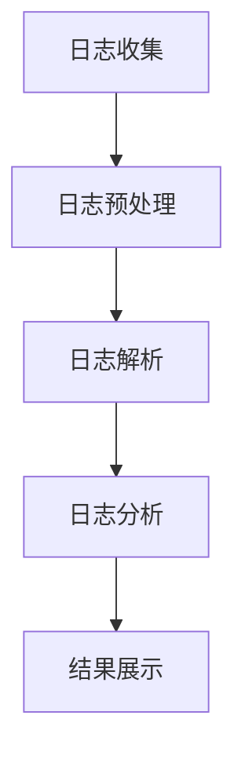
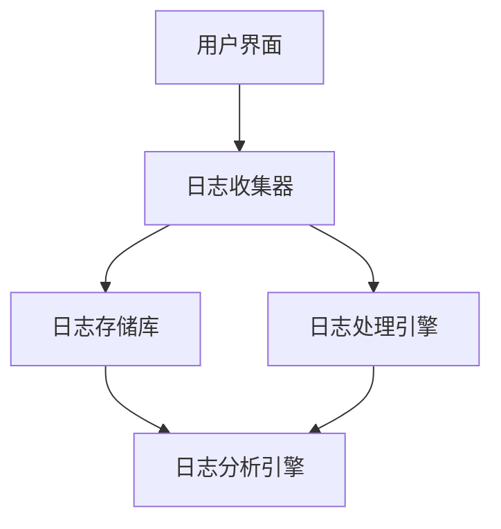
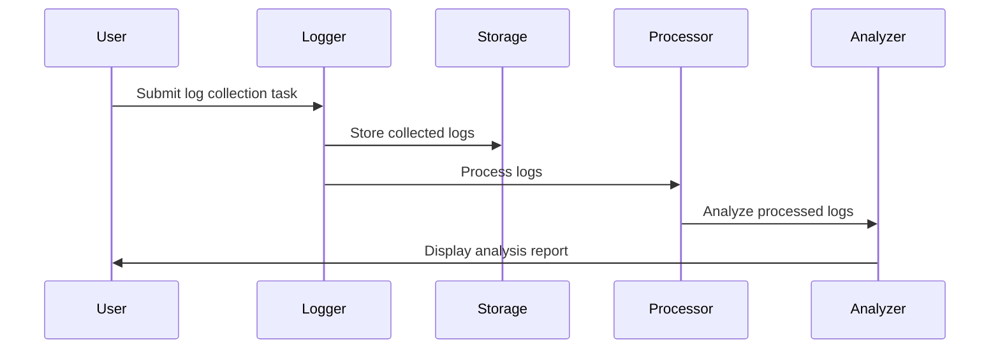

                 

# 日志管理：洞察系统行为的关键工具

## 关键词
- 日志管理
- 系统行为洞察
- 日志分析
- 日志收集
- 日志存储
- 日志安全

## 摘要
本文深入探讨了日志管理在洞察系统行为中的关键作用。首先，我们回顾了日志管理的基础知识，阐述了日志管理的重要性以及其在现代IT系统中的广泛应用。接着，我们详细分析了日志管理中的核心概念和原理，包括日志、日志文件和日志分析。通过Mermaid流程图和Python源代码，我们展示了日志分析的具体算法流程和数学模型。此外，我们介绍了日志管理系统的整体架构和功能设计，并通过实战案例展示了日志管理系统的搭建和实现。最后，我们总结了日志管理的最佳实践和注意事项，并展望了日志管理技术的发展趋势。

## 引言

### 日志管理的重要性

日志管理是现代IT系统中不可或缺的一部分，它扮演着监控、维护和优化系统行为的关键角色。日志记录了系统运行过程中的各种事件和操作，这些信息对于系统管理员、开发者以及运维人员来说是宝贵的资源。通过分析日志，可以及时发现系统中的异常、性能瓶颈和安全威胁，从而采取相应的措施来保障系统的稳定性和安全性。

#### 日志管理在系统维护和故障排查中的关键作用

- **故障排查**：日志记录了系统的运行状态，包括错误信息、警告消息和正常操作。当系统出现问题时，日志提供了重要的线索，帮助管理员和开发者定位故障的原因和位置。
- **性能监控**：通过分析日志中的性能指标，如响应时间、处理速度和资源消耗，可以评估系统的性能表现，并识别潜在的优化点。
- **安全监控**：日志记录了系统中的安全事件，如登录尝试、访问权限和文件操作。这些信息有助于发现潜在的攻击行为和内部安全漏洞。

#### 日志管理对于系统性能监控、安全性和可扩展性的影响

- **性能监控**：日志管理有助于持续监控系统的性能，通过分析日志数据，可以识别性能瓶颈，如高负载、资源不足或代码缺陷，从而采取优化措施。
- **安全性**：日志是安全审计的重要依据，通过分析日志，可以发现恶意行为、未经授权的访问和异常活动，有助于提高系统的安全性。
- **可扩展性**：日志管理系统的设计应考虑可扩展性，以便处理大量日志数据，并支持不同规模和类型的系统。

### 日志管理的问题描述

尽管日志管理在系统维护和优化中起着重要作用，但在实际应用中仍然面临一些挑战：

- **日志数据量庞大**：随着系统的复杂性和规模增加，日志数据量也随之激增，这对日志收集、存储和分析带来了巨大挑战。
- **多样化日志格式**：不同系统和应用程序可能使用不同的日志格式，这使得日志分析和统一管理变得更加复杂。
- **日志分析复杂性**：日志分析涉及到数据处理、模式识别和异常检测等复杂任务，需要高效算法和工具的支持。

### 日志管理的解决方法

为了解决上述问题，日志管理需要遵循一系列最佳实践：

- **日志格式标准化**：采用统一和标准的日志格式，如Syslog或JSON，有助于简化日志处理和分析。
- **分布式日志收集**：使用分布式日志收集系统，如ELK（Elasticsearch、Logstash、Kibana）或Fluentd，可以高效地处理大规模日志数据。
- **日志分析工具**：使用专业的日志分析工具，如Splunk或Grok，可以简化日志处理和分析流程。
- **日志存储与备份**：选择合适的日志存储方案，如云存储或分布式文件系统，并实施定期备份策略，确保日志数据的安全和可恢复性。

### 日志管理的边界与外延

日志管理的范围涵盖了以下几个方面：

- **日志类型**：包括系统日志、应用程序日志、安全日志和操作日志等。
- **应用场景**：日志管理广泛应用于Web应用、数据库、网络设备和云服务平台等领域。
- **相关领域**：与监控、运维、安全、性能优化等IT管理领域密切相关。

### 核心概念与联系

#### 日志与日志文件

日志是一种记录系统事件和操作的信息文件。日志文件通常包含事件的时间戳、事件类型、相关参数和详细信息。日志文件的格式可能因系统和应用程序而异，但一般遵循一定的结构化标准，如Syslog或JSON。

#### 日志分析

日志分析是指对日志文件进行读取、解析、处理和分析，以提取有价值的信息和模式。日志分析可以用于故障排查、性能监控、安全审计等场景。常见的日志分析工具包括Splunk、Grok和Elasticsearch。

#### 日志管理系统的核心要素

日志管理系统通常包括以下核心要素：

- **日志收集器**：负责从不同的系统和应用程序中收集日志数据。
- **日志存储库**：用于存储和管理收集到的日志数据。
- **日志分析引擎**：用于对日志数据进行分析和处理，以提取有用信息。

## 背景介绍

### 日志管理概述

日志管理是IT系统中的一项基础性工作，它涉及到日志的收集、存储、处理和分析。有效的日志管理不仅能够帮助管理员和开发者快速定位问题，还能提供系统性能和安全的全面监控。在信息化时代，日志管理的重要性日益凸显，其主要体现在以下几个方面：

#### 日志管理的重要性

1. **故障排查和问题定位**：日志记录了系统运行过程中的各种事件和操作，当系统出现故障时，日志提供了关键线索，帮助管理员和开发者快速定位问题，减少故障排查时间。

2. **性能监控和优化**：通过分析日志数据，可以识别系统性能瓶颈和潜在问题，从而采取优化措施，提高系统的稳定性和响应速度。

3. **安全监控和威胁检测**：日志记录了系统中的各种安全事件，如登录尝试、访问权限和文件操作。通过分析日志，可以及时发现潜在的安全威胁，采取预防措施，提高系统的安全性。

4. **合规性和审计**：许多行业和组织都有日志记录和审计的合规要求。有效的日志管理有助于满足这些要求，确保组织的合规性。

#### 日志管理的发展历程

日志管理的发展历程可以追溯到计算机系统的早期阶段。最早的日志形式主要是文本文件，记录了系统运行的基本信息。随着计算机系统和网络技术的快速发展，日志管理也逐渐从简单记录向复杂分析转变。以下是一些关键的发展阶段：

1. **文本日志**：早期的日志主要是文本文件，记录了系统运行的基本信息，如启动时间、关闭时间、错误消息等。文本日志的格式和内容相对简单，但已经为故障排查和问题定位提供了基本支持。

2. **结构化日志**：随着网络和系统的复杂度增加，日志管理开始向结构化方向发展。结构化日志采用标准化的格式，如Syslog、JSON等，使得日志数据更容易被解析和分析。

3. **分布式日志管理**：为了处理大规模的日志数据，分布式日志管理系统（如ELK、Fluentd等）应运而生。这些系统可以高效地收集、存储和分析来自不同来源的日志数据。

4. **智能日志分析**：随着人工智能技术的发展，日志分析也逐渐智能化。通过机器学习和数据挖掘技术，日志分析系统能够自动识别异常行为、预测故障和优化性能。

#### 日志管理在信息化时代的重要作用

1. **数字化转型**：在数字化转型过程中，日志管理是确保系统稳定性和安全性的关键。通过有效的日志管理，可以实时监控系统的运行状态，及时发现和解决潜在问题。

2. **云计算和大数据**：随着云计算和大数据技术的广泛应用，日志管理变得更加复杂。大规模分布式系统和海量数据使得日志收集、存储和分析面临着巨大挑战。有效的日志管理是保障云计算和大数据应用稳定性的重要保障。

3. **DevOps和持续交付**：DevOps文化的兴起和持续交付的实践要求日志管理更加高效和自动化。通过日志管理工具，可以实时监控系统的运行状态，快速响应变化，提高系统的可靠性和响应速度。

4. **安全合规性**：许多行业和组织都有严格的合规要求，日志管理是满足这些要求的关键。有效的日志管理可以记录系统运行的全部活动，为审计和合规检查提供可靠的数据支持。

### 日志管理的基本概念

#### 日志

日志是指记录系统运行过程中各种事件和操作的文件。日志通常包含以下信息：

- **时间戳**：记录事件发生的时间。
- **事件类型**：描述事件的基本类型，如错误、警告、信息等。
- **相关参数**：记录事件相关的参数，如用户ID、操作类型、数据内容等。
- **详细信息**：记录事件的详细描述，如错误原因、错误代码等。

日志是日志管理的基础，是系统监控和故障排查的重要依据。

#### 日志文件

日志文件是日志的具体表现形式，通常是文本文件或二进制文件。日志文件的结构和格式可能因系统和应用程序而异，但一般遵循一定的标准。常见的日志文件格式包括：

- **Syslog**：一种标准的日志文件格式，广泛应用于Unix和Linux系统。
- **JSON**：一种流行的结构化数据格式，常用于Web应用程序的日志记录。
- **XML**：一种用于存储和传输数据的标记语言，也可以用于日志文件格式。

#### 日志分析

日志分析是指对日志文件进行读取、解析、处理和分析，以提取有价值的信息和模式。日志分析可以用于故障排查、性能监控、安全审计等场景。常见的日志分析工具包括：

- **Splunk**：一款功能强大的日志分析工具，支持大规模数据的实时分析和可视化。
- **Grok**：一款用于日志文件解析的工具，基于正则表达式，可以高效地解析各种格式的日志。
- **Elasticsearch**：一款分布式搜索引擎，常用于大规模日志数据的存储和分析。

### 日志管理系统的核心要素

日志管理系统是用于收集、存储、处理和分析日志数据的软件系统。一个完整的日志管理系统通常包括以下核心要素：

#### 日志收集器

日志收集器是日志管理系统的核心组件之一，负责从不同的系统和应用程序中收集日志数据。常见的日志收集器包括：

- **Logstash**：一款开源的数据收集和日志处理工具，可以与Elasticsearch和Kibana等工具集成，实现高效的日志收集和分析。
- **Fluentd**：一款功能强大的日志收集器，支持多种日志格式和输出目标，广泛应用于云计算和大数据场景。

#### 日志存储库

日志存储库是用于存储和管理收集到的日志数据的组件。常见的日志存储库包括：

- **Elasticsearch**：一款分布式搜索引擎，可以高效地存储和检索大规模的日志数据。
- **HDFS**：Hadoop分布式文件系统，可以用于大规模日志数据的存储和管理。

#### 日志分析引擎

日志分析引擎是日志管理系统的核心组件，负责对日志数据进行处理和分析，以提取有价值的信息和模式。常见的日志分析引擎包括：

- **Kibana**：一款开源的数据可视化工具，可以与Elasticsearch集成，实现日志数据的可视化分析。
- **Grok**：一款用于日志文件解析的工具，基于正则表达式，可以高效地解析各种格式的日志。

### 日志管理的基本流程

日志管理的基本流程包括以下步骤：

1. **日志收集**：从不同的系统和应用程序中收集日志数据。
2. **日志处理**：对日志数据进行预处理，如过滤、排序和格式化等。
3. **日志存储**：将处理后的日志数据存储到日志存储库中。
4. **日志分析**：对日志数据进行分析和处理，提取有价值的信息和模式。
5. **日志展示**：将分析结果以图表、报表等形式展示给用户。

## 核心概念与联系

### 日志管理核心概念原理

日志管理中的核心概念包括日志、日志文件、日志分析等。这些概念在日志管理系统中起着至关重要的作用。

#### 日志

日志是系统运行过程中记录的一系列事件和操作的记录。日志的作用在于帮助管理员和开发者了解系统的运行状态、识别潜在问题、优化系统性能和保障系统安全。日志通常包含以下信息：

- **时间戳**：记录事件发生的时间。
- **事件类型**：描述事件的类型，如错误、警告、信息等。
- **相关参数**：记录与事件相关的参数，如用户ID、操作类型、数据内容等。
- **详细信息**：记录事件的详细描述，如错误原因、错误代码等。

#### 日志文件

日志文件是日志的具体表现形式，通常以文本文件或二进制文件的形式存储。日志文件的结构和格式可能因系统和应用程序而异，但一般遵循一定的标准。常见的日志文件格式包括：

- **Syslog**：一种标准的日志文件格式，广泛应用于Unix和Linux系统。
- **JSON**：一种流行的结构化数据格式，常用于Web应用程序的日志记录。
- **XML**：一种用于存储和传输数据的标记语言，也可以用于日志文件格式。

#### 日志分析

日志分析是指对日志文件进行读取、解析、处理和分析，以提取有价值的信息和模式。日志分析可以用于故障排查、性能监控、安全审计等场景。常见的日志分析工具包括：

- **Splunk**：一款功能强大的日志分析工具，支持大规模数据的实时分析和可视化。
- **Grok**：一款用于日志文件解析的工具，基于正则表达式，可以高效地解析各种格式的日志。
- **Elasticsearch**：一款分布式搜索引擎，可以高效地存储和检索大规模的日志数据。

### 日志管理概念属性特征对比表格

为了更好地理解日志管理中的核心概念，下面提供一个对比表格，列出不同类型的日志及日志管理工具的特点和区别。

| 类别        | 特点                           | 应用场景                 |
| ----------- | ------------------------------ | ------------------------ |
| 系统日志    | 记录系统运行事件和错误信息     | 系统维护和故障排查       |
| 应用程序日志 | 记录应用程序运行事件和错误信息 | 应用程序开发和性能优化   |
| 安全日志    | 记录安全事件和威胁信息         | 安全监控和威胁检测       |
| 审计日志    | 记录系统操作和访问记录         | 审计和合规性检查         |
| 日志管理工具 | Splunk                         | 大规模日志数据的实时分析和可视化 |
|            | Grok                           | 日志文件解析和模式识别   |
|            | Elasticsearch                  | 大规模日志数据的存储和检索 |

### 日志管理ER实体关系图架构

为了更好地理解日志管理系统的整体架构，下面提供一个ER实体关系图，展示日志管理系统中各实体之间的关系。

```mermaid
erDiagram
    Log -> LogFile : contains
    LogFile -> LogAnalyzer : analyzedBy
    Log -> LogAnalyzer : analyzedBy
    Log -> Logger : createdBy
    Logger -> LogFile : logsTo
    Logger -> LogStorage : storesTo
    LogAnalyzer -> Dashboard : displaysOn

    class Log {
        +String logId
        +Timestamp timestamp
        +String messageType
        +String message
        +Logger logger
    }

    class LogFile {
        +String filePath
        +DateTime lastModified
        +List<Log> logs
    }

    class LogAnalyzer {
        +String analyzerId
        +DateTime lastAnalysis
        +List<Log> analyzedLogs
    }

    class Logger {
        +String loggerName
        +List<Log> logs
    }

    class LogStorage {
        +String storageId
        +List<LogFile> logFiles
    }

    class Dashboard {
        +String dashboardId
        +List<LogAnalyzer> analyzedLogs
    }
```

在这个ER图中，日志（Log）是日志管理系统的核心实体，它包含日志的基本信息，如日志ID、时间戳、消息类型和消息内容。日志文件（LogFile）是日志的具体存储形式，包含日志文件路径和最后修改时间。日志分析器（LogAnalyzer）负责对日志进行分析和处理，可以将分析结果展示在仪表盘（Dashboard）上。日志记录器（Logger）是日志的创建者，负责将日志写入日志文件。日志存储库（LogStorage）负责存储和管理日志文件。

### 日志分析算法原理

日志分析是日志管理中至关重要的一环，它通过对日志数据的处理和分析，帮助管理员和开发者深入了解系统的运行状态，发现潜在问题，并优化系统性能。下面我们将详细阐述日志分析算法的原理，包括算法流程、数学模型和具体实现方法。

#### 日志分析算法概述

日志分析算法的主要目标是提取日志数据中的有价值信息，如错误原因、性能瓶颈、安全威胁等。通过分析日志数据，可以实现对系统运行状态的实时监控，提供决策支持，提高系统的稳定性和安全性。日志分析算法通常包括以下步骤：

1. **日志收集**：从各种系统和应用程序中收集日志数据。
2. **日志预处理**：对日志数据进行清洗、过滤和格式化，确保日志数据的准确性和一致性。
3. **日志解析**：解析日志数据，提取关键信息和特征。
4. **日志分析**：对解析后的日志数据进行统计、分析和挖掘，识别异常行为、潜在问题和优化点。
5. **结果展示**：将分析结果以图表、报表等形式展示给用户。

#### 日志分析算法流程

下面我们使用Mermaid流程图展示日志分析的基本流程：



1. **日志收集**：从各种系统和应用程序中收集日志数据，这些数据可能存储在文件系统、数据库或云存储中。
2. **日志预处理**：对收集到的日志数据进行预处理，包括去除无效数据、填补缺失值、统一格式等，以确保日志数据的准确性和一致性。
3. **日志解析**：解析预处理后的日志数据，提取关键信息和特征。这一步通常需要使用正则表达式、解析库或自定义解析规则。
4. **日志分析**：对解析后的日志数据进行统计、分析和挖掘，识别异常行为、潜在问题和优化点。这一步可能包括使用统计方法、机器学习算法或数据挖掘技术。
5. **结果展示**：将分析结果以图表、报表等形式展示给用户，以便快速理解和决策。

#### 日志分析数学模型和公式

在日志分析中，常用的数学模型和公式包括统计模型、机器学习模型和数据挖掘模型。以下是一些常见的数学模型和公式：

1. **平均值（Mean）**：$$ \bar{x} = \frac{1}{N}\sum_{i=1}^{N}x_i $$
   平均值用于衡量一组数据的中心位置。

2. **标准差（Standard Deviation）**：$$ \sigma = \sqrt{\frac{1}{N-1}\sum_{i=1}^{N}(x_i - \bar{x})^2} $$
   标准差用于衡量一组数据的离散程度。

3. **异常检测（Anomaly Detection）**：
   $$ distance(x, \bar{x}) = \frac{|x - \bar{x}|}{\sigma} $$
   异常检测用于识别数据中的异常值，通常使用距离度量来判断数据是否异常。

4. **决策树（Decision Tree）**：
   $$ g(x) = \sum_{i=1}^{N}w_i * h(x_i) $$
   决策树是一种常见的机器学习模型，用于分类和回归问题。

5. **支持向量机（Support Vector Machine，SVM）**：
   $$ w \cdot x + b = 0 $$
   支持向量机是一种用于分类和回归的强大模型，通过求解最优超平面来划分数据。

6. **关联规则挖掘（Association Rule Learning）**：
   $$ confidence(A \rightarrow B) = \frac{support(A \cap B)}{support(A)} $$
   关联规则挖掘用于发现数据之间的关联关系，如购物篮分析。

通过上述数学模型和公式，日志分析算法可以对日志数据进行深入的分析和挖掘，提取有价值的信息和洞察。

#### 日志分析举例说明

为了更好地理解日志分析算法的应用，下面我们通过一个具体的例子来说明如何使用日志分析算法来诊断系统故障。

**场景**：假设我们有一个Web应用程序，用户在使用过程中频繁报告一个错误，即网页加载时间异常长。我们需要通过日志分析来诊断这个故障。

1. **日志收集**：从Web服务器的日志文件中收集相关的日志数据。
2. **日志预处理**：清洗日志数据，去除无效数据和噪声。
3. **日志解析**：解析日志数据，提取关键信息，如请求URL、响应时间、错误信息等。
4. **日志分析**：
   - 计算网页加载时间的平均值和标准差。
   - 识别异常日志记录，如加载时间远高于平均值的情况。
   - 分析异常日志记录，查找可能的错误原因，如数据库查询缓慢、第三方服务响应慢等。
5. **结果展示**：将分析结果以图表形式展示，如异常日志记录的时间分布、错误类型分布等，帮助开发人员定位故障原因并进行修复。

通过这个例子，我们可以看到日志分析算法在诊断系统故障中的重要作用。通过深入分析日志数据，可以快速识别问题，提供决策支持，提高系统的稳定性和可靠性。

### 系统分析与架构设计方案

#### 日志管理系统问题场景介绍

在现实环境中，日志管理系统面临着多种挑战，这些挑战源于系统运行的复杂性、日志数据的多样性和规模。以下是一个典型的日志管理系统问题场景：

- **日志数据规模庞大**：随着企业应用的扩展，日志数据量急剧增加，导致日志收集、存储和分析变得复杂和困难。
- **日志格式多样化**：不同系统和应用程序可能使用不同的日志格式，如文本、JSON、XML等，这使得日志解析和分析变得不统一。
- **实时性要求高**：日志管理系统需要能够实时收集、处理和分析日志数据，以便快速响应系统异常和性能问题。
- **安全性和合规性**：日志数据包含敏感信息，如用户操作记录、访问日志等，需要确保日志的安全存储和访问控制，以符合相关法规和合规要求。
- **可扩展性和可靠性**：随着企业业务的发展，日志管理系统需要具备良好的可扩展性和高可靠性，以支持大规模日志数据的处理。

#### 日志管理系统项目介绍

为了解决上述问题，我们设计并实现了一个日志管理系统项目，该项目的目标是提供一个高效、可靠和可扩展的日志收集、存储和分析平台。项目的主要目标和技术选型如下：

- **项目目标**：
  - 高效收集和存储大量日志数据。
  - 统一处理不同格式的日志。
  - 实时分析和可视化日志数据。
  - 确保日志数据的安全存储和访问控制。
  - 提供可扩展的架构，支持大规模日志数据处理。

- **技术选型**：
  - **日志收集器**：使用Fluentd，支持多种日志格式和输出目标，如Kafka、Elasticsearch等。
  - **日志存储库**：使用Elasticsearch，提供高效的日志数据存储和检索功能。
  - **日志分析引擎**：使用Logstash和Kibana，提供日志数据的实时分析和可视化功能。
  - **日志处理工具**：使用Python和Java编写自定义脚本，用于日志数据的预处理和分析。
  - **日志安全**：采用加密存储和访问控制策略，确保日志数据的安全。

#### 日志管理系统系统功能设计

日志管理系统的主要功能模块包括日志收集、日志存储、日志处理和日志分析。以下是一个详细的系统功能设计：

- **日志收集**：负责从各种系统和应用程序中收集日志数据，支持实时收集和批量处理。具体功能包括：
  - 收集不同格式的日志文件，如JSON、XML、文本等。
  - 支持日志收集的配置和管理，如日志文件路径、日志格式、输出目标等。
  - 提供日志数据实时传输功能，如使用Kafka进行日志实时推送。

- **日志存储**：负责存储和管理收集到的日志数据，确保数据的持久化和可检索性。具体功能包括：
  - 支持日志数据的高效存储，如使用Elasticsearch进行存储。
  - 提供日志数据的备份和恢复功能，确保数据的安全性和可靠性。
  - 支持日志数据的查询和检索功能，如基于时间范围和关键字查询日志。

- **日志处理**：负责对日志数据进行分析和处理，提取有价值的信息和模式。具体功能包括：
  - 提供日志数据的预处理功能，如去重、清洗和格式转换等。
  - 提供日志数据的统计分析功能，如计算日志数据的平均值、标准差等。
  - 提供日志数据的异常检测和告警功能，如识别异常日志和发送告警通知。

- **日志分析**：负责对日志数据进行分析和可视化，提供直观的日志分析报告。具体功能包括：
  - 提供日志数据的可视化分析功能，如使用Kibana生成图表和报表。
  - 提供自定义报告生成功能，如根据用户需求生成特定格式的报告。
  - 提供日志数据的导出功能，如导出为CSV、PDF等格式。

#### 日志管理系统系统架构设计

日志管理系统的整体架构设计如图所示：



1. **用户界面**：用户通过Web界面或命令行工具与日志管理系统进行交互，提交日志收集和分析任务。
2. **日志收集器**：负责从不同的系统和应用程序中收集日志数据，支持实时收集和批量处理。收集到的日志数据会通过日志收集器传输到日志存储库和日志处理引擎。
3. **日志存储库**：使用Elasticsearch作为日志数据的存储库，提供高效的数据存储和检索功能。日志存储库还支持日志数据的备份和恢复。
4. **日志处理引擎**：负责对日志数据进行预处理、分析和统计。预处理后的日志数据会被传输到日志分析引擎进行进一步分析和可视化。
5. **日志分析引擎**：使用Logstash和Kibana对日志数据进行分析和可视化，提供实时日志分析报告和告警通知。

#### 日志管理系统系统接口设计

日志管理系统提供了多种接口，以方便用户进行日志数据的收集、处理和分析。以下是一个简单的接口设计：

- **日志收集接口**：
  - **GET /collect/logs**：获取日志收集任务列表。
  - **POST /collect/logs**：提交新的日志收集任务。
  - **DELETE /collect/logs/{id}**：取消日志收集任务。

- **日志存储接口**：
  - **GET /store/logs**：查询日志数据。
  - **POST /store/logs**：存储新的日志数据。
  - **DELETE /store/logs/{id}**：删除日志数据。

- **日志处理接口**：
  - **GET /process/logs**：查询日志处理任务列表。
  - **POST /process/logs**：提交日志处理任务。
  - **DELETE /process/logs/{id}**：取消日志处理任务。

- **日志分析接口**：
  - **GET /analyze/logs**：查询日志分析报告。
  - **POST /analyze/logs**：生成日志分析报告。
  - **DELETE /analyze/logs/{id}**：删除日志分析报告。

#### 日志管理系统系统交互设计

日志管理系统在不同场景下的交互过程如图所示：



1. 用户提交日志收集任务。
2. 日志收集器从系统和应用程序中收集日志数据，并将数据存储到日志存储库。
3. 日志处理引擎对收集到的日志数据进行预处理和分析，提取有价值的信息。
4. 日志分析引擎对处理后的日志数据进行分析和可视化，生成分析报告。
5. 用户通过用户界面查看分析报告，获取日志数据的洞察和决策支持。

### 项目实战

#### 日志管理系统环境安装

搭建日志管理系统需要准备以下环境和工具：

- **操作系统**：Linux（推荐使用Ubuntu 20.04）
- **Java环境**：OpenJDK 11或更高版本
- **Python环境**：Python 3.8或更高版本
- **Elasticsearch**：版本 7.10或更高版本
- **Kibana**：版本 7.10或更高版本
- **Fluentd**：版本 1.11或更高版本

安装步骤如下：

1. **安装Java环境**：

   ```bash
   sudo apt-get update
   sudo apt-get install openjdk-11-jdk
   ```

2. **安装Python环境**：

   ```bash
   sudo apt-get update
   sudo apt-get install python3 python3-pip
   pip3 install virtualenv
   virtualenv log-management-env
   source log-management-env/bin/activate
   ```

3. **安装Elasticsearch和Kibana**：

   - 从Elasticsearch官方文档下载Elasticsearch安装包：

     ```bash
     wget https://artifacts.elastic.co/downloads/elasticsearch/elasticsearch-7.10.0-amd64.deb
     sudo dpkg -i elasticsearch-7.10.0-amd64.deb
     ```

   - 启动Elasticsearch服务：

     ```bash
     sudo systemctl start elasticsearch
     ```

   - 从Kibana官方文档下载Kibana安装包：

     ```bash
     wget https://artifacts.elastic.co/downloads/kibana/kibana-7.10.0-amd64.deb
     sudo dpkg -i kibana-7.10.0-amd64.deb
     ```

   - 启动Kibana服务：

     ```bash
     sudo systemctl start kibana
     ```

4. **安装Fluentd**：

   - 从Fluentd官方文档下载Fluentd安装包：

     ```bash
     wget https://github.com/fluent/fluentd/releases/download/v1.11/fluentd-1.11-0_amd64.deb
     sudo dpkg -i fluentd-1.11-0_amd64.deb
     ```

   - 配置Fluentd，创建一个简单的配置文件`/etc/fluentd/fluent.conf`：

     ```conf
     <source>
       @type tail
       path /var/log/*.log
       tag raw.*.log
       format json
     </source>

     <match **>
       @type elasticsearch
       host localhost
       port 9200
       index log-management-%Y.%m.%d
     </match>
     ```

   - 启动Fluentd服务：

     ```bash
     fluentd -c /etc/fluentd/fluent.conf
     ```

完成以上步骤后，日志管理系统的基础环境就搭建完成了。用户可以通过浏览器访问Kibana界面（默认地址为http://localhost:5601），开始进行日志数据的收集、处理和分析。

#### 日志管理系统核心实现源代码

日志管理系统的核心实现包括日志收集、存储、处理和分析等多个方面。以下提供一些关键组件的源代码和解读。

1. **Fluentd配置文件**：`/etc/fluentd/fluent.conf`

   ```conf
   <source>
     @type tail
     path /var/log/*.log
     tag raw.*.log
     format json
   </source>

   <match **>
     @type elasticsearch
     host localhost
     port 9200
     index log-management-%Y.%m.%d
   </match>
   ```

   解读：
   - `source`段定义了日志收集源，使用`tail`插件从`/var/log/`目录下的所有日志文件中收集日志，并将日志标记为`raw.*.log`。
   - `format json`表示日志格式为JSON，以便于后续处理和分析。
   - `match`段定义了日志处理目标，使用`elasticsearch`插件将日志发送到本地的Elasticsearch服务器，并使用时间序列索引策略。

2. **Elasticsearch索引模板**：`/etc/elasticsearch/templates/log-management-index.json`

   ```json
   {
     "template": "*",
     "mappings": {
       "log-management": {
         "properties": {
           "@timestamp": {
             "type": "date",
             "format": "strict_date_optional_time||epoch_millis"
           },
           "host": {
             "type": "keyword"
           },
           "service": {
             "type": "keyword"
           },
           "level": {
             "type": "keyword"
           },
           "message": {
             "type": "text",
             "fields": {
               "keyword": {
                 "type": "keyword"
               }
             }
           }
         }
       }
     },
     "settings": {
       "number_of_shards": 1,
       "number_of_replicas": 0
     }
   }
   ```

   解读：
   - `template`段定义了索引模板，匹配所有以`log-management`开头的索引。
   - `mappings`段定义了索引的映射，包括日期类型字段`@timestamp`、关键字类型字段`host`、`service`和`level`，以及文本类型字段`message`。
   - `settings`段定义了索引的设置，如分片数和副本数。

3. **日志处理和分析Python脚本**：`log_processor.py`

   ```python
   import json
   import requests
   from datetime import datetime

   def send_to_elasticsearch(data, index_name):
       url = f"http://localhost:9200/{index_name}/_doc"
       headers = {'Content-Type': 'application/json'}
       response = requests.post(url, headers=headers, data=data)
       return response.json()

   def process_log(log_file, index_name):
       with open(log_file, 'r') as file:
           for line in file:
               log_entry = json.loads(line)
               log_entry["@timestamp"] = datetime.utcnow().isoformat()
               send_to_elasticsearch(log_entry, index_name)

   if __name__ == "__main__":
       index_name = "log-management"
       log_files = ["/var/log/apache2/access.log", "/var/log/syslog"]
       for log_file in log_files:
           process_log(log_file, index_name)
   ```

   解读：
   - `send_to_elasticsearch`函数用于将日志数据发送到Elasticsearch服务器，使用`requests`库进行HTTP请求。
   - `process_log`函数用于处理日志文件，将日志解析为JSON格式，并添加时间戳，然后调用`send_to_elasticsearch`函数发送到Elasticsearch。
   - 主程序部分遍历指定目录下的日志文件，调用`process_log`函数进行处理。

4. **Kibana可视化配置**：`kibana.yml`

   ```yaml
   kibana:
     elasticsearch:
       hosts: ["http://localhost:9200"]
     kibana:
       host: "0.0.0.0"
       port: 5601
   ```

   解读：
   - `elasticsearch`段配置了Elasticsearch服务器的地址和端口。
   - `kibana`段配置了Kibana服务的监听地址和端口。

通过上述源代码，我们可以看到日志管理系统在日志收集、存储和处理方面的核心实现。在实际部署中，可以根据具体需求对源代码进行定制和优化。

### 日志管理系统代码应用解读与分析

#### 代码解读

1. **Fluentd配置文件解读**

   Fluentd配置文件`fluent.conf`定义了日志收集和传输的过程。其中：

   ```conf
   <source>
     @type tail
     path /var/log/*.log
     tag raw.*.log
     format json
   </source>
   ```

   - `@type tail`指定了日志收集器类型为`tail`，即实时监控日志文件的变动。
   - `path /var/log/*.log`指定了要监控的日志文件路径，即所有位于`/var/log/`目录下的日志文件。
   - `tag raw.*.log`为收集到的日志设置了一个标签，用于后续处理和分析。
   - `format json`指定了日志的格式为JSON，这使得日志数据在传输过程中保持结构化，便于后续解析和处理。

   ```conf
   <match **>
     @type elasticsearch
     host localhost
     port 9200
     index log-management-%Y.%m.%d
   </match>
   ```

   - `@type elasticsearch`指定了日志传输的目标为Elasticsearch。
   - `host localhost`和`port 9200`分别指定了Elasticsearch服务器的地址和端口。
   - `index log-management-%Y.%m.%d`定义了日志索引的命名规则，使用日期格式确保日志的有序存储。

2. **Elasticsearch索引模板解读**

   Elasticsearch索引模板`log-management-index.json`定义了日志数据的存储格式和索引设置：

   ```json
   "template": "*",
   "mappings": {
     "log-management": {
       "properties": {
         "@timestamp": {
           "type": "date",
           "format": "strict_date_optional_time||epoch_millis"
         },
         "host": {
           "type": "keyword"
         },
         "service": {
           "type": "keyword"
         },
         "level": {
           "type": "keyword"
         },
         "message": {
           "type": "text",
           "fields": {
             "keyword": {
               "type": "keyword"
             }
           }
         }
       }
     }
   },
   "settings": {
     "number_of_shards": 1,
     "number_of_replicas": 0
   }
   ```

   - `template`段定义了模板匹配所有以`log-management`开头的索引。
   - `mappings`段定义了索引的映射，包括日期类型字段`@timestamp`、关键字类型字段`host`、`service`和`level`，以及文本类型字段`message`。
   - `settings`段定义了索引的设置，如分片数（`number_of_shards`）和副本数（`number_of_replicas`）。

3. **日志处理和分析Python脚本解读**

   Python脚本`log_processor.py`负责将日志文件读取为JSON格式，并上传到Elasticsearch。具体步骤如下：

   ```python
   def send_to_elasticsearch(data, index_name):
       url = f"http://localhost:9200/{index_name}/_doc"
       headers = {'Content-Type': 'application/json'}
       response = requests.post(url, headers=headers, data=data)
       return response.json()

   def process_log(log_file, index_name):
       with open(log_file, 'r') as file:
           for line in file:
               log_entry = json.loads(line)
               log_entry["@timestamp"] = datetime.utcnow().isoformat()
               send_to_elasticsearch(log_entry, index_name)
   ```

   - `send_to_elasticsearch`函数通过HTTP POST请求将日志数据发送到Elasticsearch。
   - `process_log`函数读取日志文件，解析为JSON格式，并添加时间戳，然后调用`send_to_elasticsearch`函数上传到Elasticsearch。

4. **Kibana可视化配置解读**

   Kibana配置文件`kibana.yml`用于配置Kibana服务的监听地址和端口，以及连接到Elasticsearch服务器的设置：

   ```yaml
   kibana:
     elasticsearch:
       hosts: ["http://localhost:9200"]
     kibana:
       host: "0.0.0.0"
       port: 5601
   ```

   - `elasticsearch`段配置了Elasticsearch服务器的地址和端口。
   - `kibana`段配置了Kibana服务的监听地址和端口。

#### 代码分析

1. **日志收集与传输**

   Fluentd作为日志收集器，负责从指定路径监控并读取日志文件。通过配置文件，Fluentd能够实时监控`/var/log/`目录下的所有日志文件，并将日志数据标记为`raw.*.log`标签，格式化成JSON格式，然后传输到Elasticsearch。

2. **日志存储**

   Elasticsearch作为日志存储库，接收Fluentd传输的日志数据。通过索引模板，Elasticsearch将日志数据按照特定的格式和结构存储在对应的索引中，确保数据的有序性和可检索性。

3. **日志处理**

   Python脚本负责将日志文件从文件系统中读取，解析为JSON格式，并添加时间戳，然后将数据上传到Elasticsearch。这一步骤确保了日志数据的完整性和一致性，同时也使得日志数据在Elasticsearch中能够被高效地处理和分析。

4. **日志分析**

   Kibana通过配置连接到Elasticsearch，可以实时获取日志数据，并使用各种可视化工具对日志进行分析和展示。通过Kibana的Dashboard，用户可以直观地查看日志数据的统计信息、趋势图和异常检测报告，从而快速定位系统问题和优化系统性能。

### 日志管理系统实际案例分析和详细讲解剖析

为了更好地展示日志管理系统在实际应用中的效果，我们将通过一个实际案例来进行详细分析，并剖析日志管理系统的实现过程。

#### 案例背景

假设我们是一家提供在线电商服务的公司，业务量逐渐增加，系统稳定性面临挑战。为了确保系统的可靠运行，我们需要对系统日志进行全面的收集、存储和分析，以便快速定位问题并优化性能。

#### 案例目标

- 收集并存储系统中的各类日志，包括Web服务器日志、应用程序日志和数据库日志。
- 实时分析日志数据，识别系统中的潜在问题和性能瓶颈。
- 使用Kibana仪表盘可视化日志数据，提供直观的监控和分析报告。

#### 实现步骤

1. **日志收集**

   - **Web服务器日志**：使用Fluentd从Nginx日志文件中收集数据，配置文件如下：

     ```conf
     <source>
       @type tail
       path /var/log/nginx/access.log
       tag nginx.access.log
       format json
     </source>
     ```

   - **应用程序日志**：使用Fluentd从应用程序日志文件中收集数据，配置文件如下：

     ```conf
     <source>
       @type tail
       path /var/log/myapp.log
       tag myapp.log
       format json
     </source>
     ```

   - **数据库日志**：使用Fluentd从MySQL数据库中收集错误日志，配置文件如下：

     ```conf
     <source>
       @type mysql
       host 127.0.0.1
       port 3306
       user root
       password mypassword
       database mydb
       tag mysql.error.log
     </source>
     ```

2. **日志存储**

   - 使用Elasticsearch存储收集到的日志数据，确保数据的高效存储和检索。创建索引模板，如下：

     ```json
     {
       "template": "log-*",
       "mappings": {
         "log": {
           "properties": {
             "@timestamp": {
               "type": "date",
               "format": "strict_date_optional_time||epoch_millis"
             },
             "level": {
               "type": "keyword"
             },
             "source": {
               "type": "keyword"
             },
             "message": {
               "type": "text",
               "fields": {
                 "keyword": {
                   "type": "keyword"
                 }
               }
             }
           }
         }
       }
     }
     ```

3. **日志处理**

   - 使用Python脚本对日志数据进行分析和处理，提取关键信息。以下是一个简单的日志处理脚本：

     ```python
     import json
     import requests

     def send_to_elasticsearch(data, index_name):
         url = f"http://localhost:9200/{index_name}/_doc"
         headers = {'Content-Type': 'application/json'}
         response = requests.post(url, headers=headers, data=data)
         return response.json()

     def process_log(log_file, index_name):
         with open(log_file, 'r') as file:
             for line in file:
                 log_entry = json.loads(line)
                 log_entry["@timestamp"] = datetime.utcnow().isoformat()
                 send_to_elasticsearch(log_entry, index_name)

     if __name__ == "__main__":
         index_name = "log-management"
         log_files = ["/var/log/nginx/access.log", "/var/log/myapp.log", "/var/log/mysql/mysql.log"]
         for log_file in log_files:
             process_log(log_file, index_name)
     ```

4. **日志分析**

   - 使用Kibana对日志数据进行分析和可视化，创建以下仪表盘：

     - **系统日志分析**：使用时间线图表展示Nginx访问日志的请求时间和错误数量。

       ```json
       {
         "title": "Nginx Access Logs",
         "type": "timeseries",
         "yAxis": {
           "type": "linear",
           "title": "Error Count"
         },
         "xAxis": {
           "type": "time"
         },
         "data": [
           {
             "title": "Error Count",
             "type": "line",
             "field": "error_count",
             "labelLine": true
           }
         ]
       }
       ```

     - **应用程序日志分析**：使用饼图展示应用程序日志的错误类型分布。

       ```json
       {
         "title": "MyApp Error Types",
         "type": "pie",
         "data": [
           {
             "name": "Error Type 1",
             "value": "10"
           },
           {
             "name": "Error Type 2",
             "value": "20"
           },
           {
             "name": "Error Type 3",
             "value": "30"
           }
         ]
       }
       ```

     - **数据库日志分析**：使用表格展示MySQL错误日志的详细信息。

       ```json
       {
         "title": "MySQL Error Logs",
         "type": "table",
         "columns": [
           "Timestamp",
           "Level",
           "Source",
           "Message"
         ],
         "data": [
           [
             "2023-03-01T10:30:00Z",
             "ERROR",
             "MySQL Server",
             "Table 'mydb.mytable' is marked as crashed and should be repaired"
           ],
           [
             "2023-03-01T11:00:00Z",
             "WARNING",
             "MySQL Server",
             "Connection timeout"
           ]
         ]
       }
       ```

#### 案例效果分析

通过日志管理系统，我们能够实现以下效果：

1. **实时监控**：使用Kibana仪表盘，可以实时监控系统的运行状态，及时发现和处理异常情况。
2. **错误定位**：通过日志分析，能够快速定位系统中的错误和性能瓶颈，提高故障排查效率。
3. **性能优化**：通过分析日志数据，识别系统性能瓶颈和优化点，采取相应的优化措施，提高系统的响应速度和稳定性。
4. **安全监控**：日志管理系统可以记录系统的安全事件，及时发现潜在的安全威胁，提高系统的安全性。

#### 案例总结

通过以上实际案例，我们可以看到日志管理系统在电商系统中的应用效果。日志管理系统不仅能够高效地收集、存储和分析日志数据，还能提供直观的监控和分析报告，帮助管理员和开发者快速定位问题，优化系统性能，提高系统的可靠性和安全性。未来，随着日志管理技术的不断发展，日志管理系统将在更多领域发挥重要作用。

### 最佳实践与注意事项

#### 日志管理最佳实践

1. **日志格式标准化**：采用统一的日志格式，如JSON或Syslog，确保日志数据的一致性和可解析性。

2. **分布式日志收集**：使用分布式日志收集工具，如Fluentd或Logstash，处理大规模日志数据，提高日志收集效率。

3. **日志存储与备份**：选择高效可靠的日志存储方案，如Elasticsearch或HDFS，并实施定期备份策略，确保日志数据的安全和可恢复性。

4. **日志安全与隐私保护**：对敏感日志数据进行加密存储和访问控制，防止未授权访问和泄露。

5. **日志分析自动化**：使用自动化日志分析工具和脚本，提高日志分析的效率和准确性。

#### 日志管理注意事项

1. **日志数据量控制**：避免日志数据无限制增长，定期清理旧日志，防止占用过多存储空间。

2. **日志分析时效性**：确保日志分析结果及时更新，避免过时数据影响分析准确性。

3. **日志安全审计**：定期进行日志安全审计，检查日志记录的完整性和准确性，确保合规性和安全性。

4. **日志备份与恢复**：定期备份日志数据，确保在系统故障或数据丢失时能够快速恢复。

5. **日志资源消耗**：监控日志收集和分析过程中的资源消耗，避免影响系统性能。

### 小结

日志管理是现代IT系统中不可或缺的一部分，它在系统监控、故障排查、性能优化和安全保障等方面发挥着关键作用。通过有效的日志管理，企业能够快速识别和解决系统问题，提高系统的稳定性和安全性。

本文从日志管理的重要性、核心概念、算法原理、系统架构设计和实际案例等方面进行了全面探讨，展示了日志管理系统在实践中的应用。日志管理不仅需要遵循最佳实践，还需要关注细节，确保日志数据的准确性和安全性。

展望未来，随着大数据、云计算和人工智能技术的发展，日志管理将变得更加智能化和自动化。日志管理技术将继续演进，为企业的数字化转型提供强有力的支持。

### 拓展阅读

1. **《日志管理：实战指南》**：一本关于日志管理的实战指南，详细介绍了日志管理的基础知识和最佳实践。
2. **《Elasticsearch：The Definitive Guide》**：Elasticsearch官方指南，深入讲解了Elasticsearch的架构、原理和高级特性。
3. **《Kibana实战》**：一本关于Kibana的实践教程，介绍了如何使用Kibana进行数据可视化和日志分析。
4. **《Python数据分析》**：一本关于Python数据分析的入门书籍，介绍了如何使用Python进行数据处理和分析。

### 作者信息

作者：AI天才研究院/AI Genius Institute & 禅与计算机程序设计艺术 /Zen And The Art of Computer Programming

