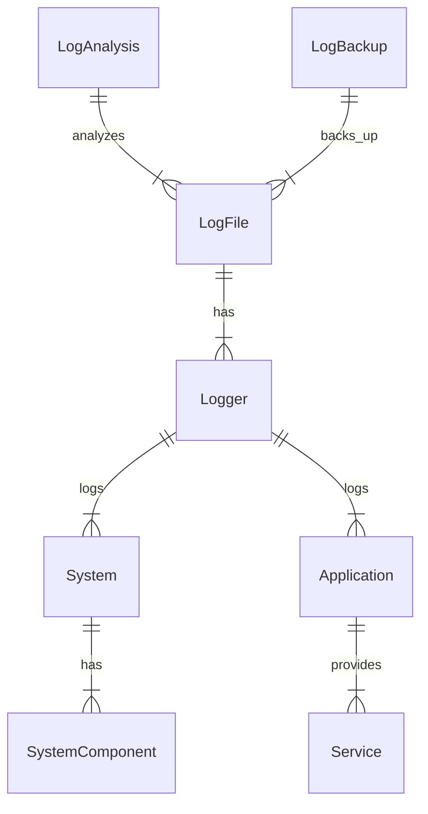
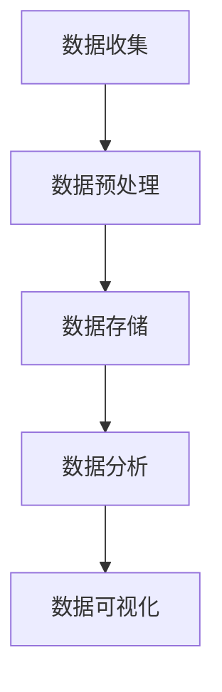
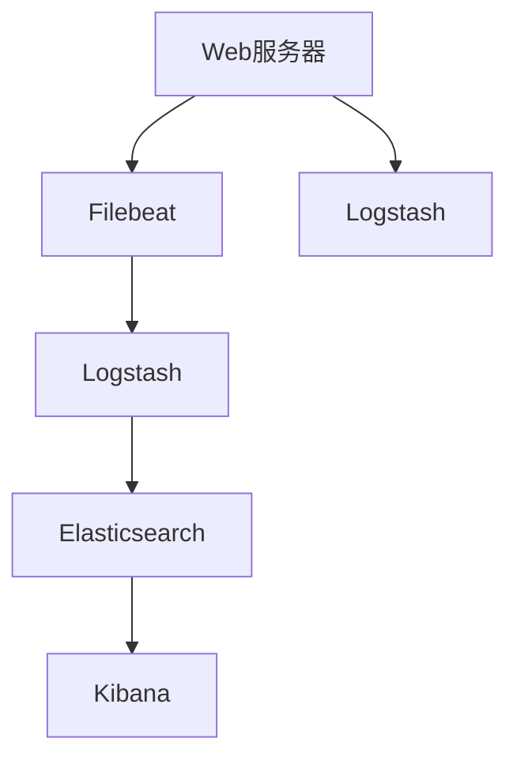
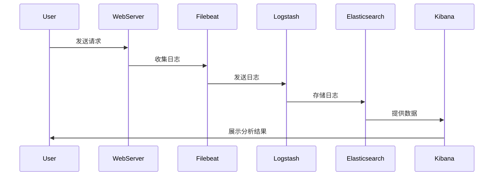
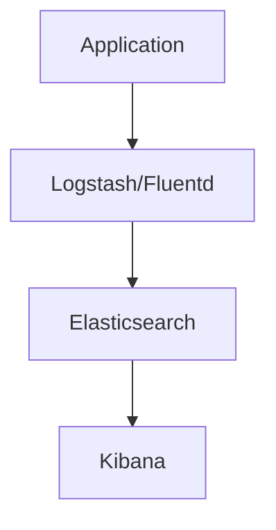

                 


### 日志管理基础

#### 第1章：日志管理概述

##### 1.1 日志管理的重要性

日志管理在IT领域扮演着至关重要的角色。它不仅能够帮助系统管理员监控和诊断系统的运行状况，还能够为开发人员提供关键的信息，以便他们能够快速定位和修复问题。以下是日志管理的重要性：

1. **系统监控**：通过日志，管理员可以实时了解系统的运行状态，包括服务器的负载、应用程序的错误等。
2. **故障排查**：当系统出现问题时，日志文件提供了详细的错误信息，帮助开发人员和系统管理员迅速定位故障点。
3. **性能优化**：日志文件可以帮助分析系统的性能瓶颈，从而进行相应的优化。
4. **安全审计**：日志记录了系统访问和操作的信息，有助于检测和响应安全事件。
5. **合规性要求**：许多行业都有关于日志记录的合规性要求，确保日志管理是必要的。

##### 1.2 日志管理的历史发展

日志管理的概念可以追溯到计算机的早期阶段。最初，日志主要是为了记录系统操作和错误信息。随着时间的推移，日志管理的功能越来越复杂：

1. **早期日志**：最初的日志主要是文本形式，包含简单的操作记录和错误信息。
2. **结构化日志**：随着网络和分布式系统的兴起，日志开始采用更结构化的格式，如Syslog和Windows Event Log。
3. **现代日志管理**：现代日志管理工具不仅支持结构化日志，还提供了复杂的日志处理和分析功能，如Logstash、Elasticsearch和Kibana。

##### 1.3 日志管理的挑战与机遇

日志管理面临着一系列挑战，但也提供了许多机遇：

1. **日志量大**：随着系统变得越来越复杂，日志量急剧增加，给日志收集、存储和分析带来了挑战。
2. **日志格式多样**：不同系统和应用程序可能使用不同的日志格式，增加了日志处理的复杂性。
3. **实时分析需求**：现代系统要求实时分析日志，以便快速响应问题。
4. **自动化与智能分析**：利用机器学习和人工智能技术，日志分析可以更加智能和自动化，提供了新的分析工具和解决方案。

**总结**：

日志管理是一个关键的基础设施，对于确保系统稳定运行和快速响应问题至关重要。通过理解日志管理的历史发展和当前挑战，我们可以更好地利用日志管理技术，提升系统的监控和运维效率。

----------------------------------------------------------------

### 日志文件结构

#### 第2章：日志文件结构

##### 2.1 日志文件的组成部分

日志文件通常包含以下几个关键组成部分：

1. **时间戳**：日志条目的创建时间，对于故障排查和性能分析至关重要。
2. **日志级别**：表示日志条目的严重程度，如DEBUG、INFO、WARNING、ERROR和CRITICAL。
3. **来源**：日志条目的来源，通常是应用程序或系统的名称。
4. **消息**：日志条目的主要内容，包括错误信息、警告或操作记录。
5. **线程和进程信息**：如果日志条目来自多线程或多进程环境，这些信息有助于定位具体的执行上下文。
6. **上下文信息**：包括用户信息、会话ID、请求ID等，有助于关联和分析日志条目。

##### 2.2 日志文件的格式

日志文件的格式多种多样，以下是几种常见的日志格式：

1. **文本格式**：最简单的日志格式，通常以换行符分隔不同的日志条目。
2. **Syslog**：一种标准化的日志格式，广泛用于Unix和Linux系统，包括时间戳、日志级别、消息和源地址等。
3. **JSON**：结构化日志格式，支持嵌套和数组，便于使用脚本和工具进行解析和处理。
4. **XML**：另一种结构化日志格式，与JSON类似，但使用XML标签和属性。
5. **自定义格式**：许多应用程序和系统支持自定义日志格式，以适应特定的需求。

##### 2.3 日志文件的类型

根据日志记录的内容和用途，日志文件可以分为以下几种类型：

1. **操作日志**：记录系统的操作行为，如登录、文件访问、命令执行等。
2. **错误日志**：记录系统发生的错误和异常，包括错误信息、错误代码和上下文信息。
3. **性能日志**：记录系统的性能数据，如CPU使用率、内存使用率、I/O性能等。
4. **安全日志**：记录与安全相关的事件，如身份验证失败、安全策略违反等。

**总结**：

日志文件的结构和格式对于日志管理至关重要。理解不同的日志组成部分和格式类型，有助于我们有效地收集、处理和分析日志数据，从而提升系统的监控和运维效率。

----------------------------------------------------------------

### 日志收集

#### 第3章：日志收集

##### 3.1 日志收集的方法

日志收集是日志管理的关键步骤，确保所有重要日志都能被有效捕获和处理。以下是几种常见的日志收集方法：

1. **本地文件系统收集**：
   - **描述**：直接从服务器本地的日志文件中读取日志。
   - **优点**：简单易行，不需要额外软件。
   - **缺点**：日志量大会导致系统负担加重，不适合大规模分布式系统。

2. **远程过程调用（RMI）**：
   - **描述**：通过远程方法调用从服务器上收集日志。
   - **优点**：支持分布式系统，易于扩展。
   - **缺点**：网络延迟和故障可能导致日志收集失败。

3. **日志代理**：
   - **描述**：部署专门的代理服务器，从多个服务器收集日志。
   - **优点**：集中化处理，减少网络流量。
   - **缺点**：需要额外的硬件和运维成本。

4. **网络流监控**：
   - **描述**：通过监控网络流量捕获日志。
   - **优点**：能够捕获实时日志，适用于大规模分布式系统。
   - **缺点**：需要高效的网络流量分析工具，对网络性能有一定影响。

##### 3.2 日志收集的工具

以下是一些常用的日志收集工具：

1. **Logstash**：
   - **描述**：Elastic Stack的一部分，用于收集、处理和转发日志数据。
   - **优点**：支持多种输入和输出插件，易于扩展。
   - **缺点**：配置复杂，对系统资源有一定要求。

2. **Fluentd**：
   - **描述**：另一种流行的日志收集工具，类似于Logstash。
   - **优点**：轻量级，易于部署和维护。
   - **缺点**：功能相对较少，不适合复杂场景。

3. **syslog-ng**：
   - **描述**：一个功能强大的日志路由器，支持复杂的日志处理和过滤。
   - **优点**：支持多种日志格式，性能优秀。
   - **缺点**：配置复杂，学习曲线陡峭。

4. **logrotate**：
   - **描述**：用于管理和旋转日志文件的工具。
   - **优点**：简单易用，支持多种日志格式。
   - **缺点**：仅用于日志文件管理，不涉及日志收集和分析。

##### 3.3 日志收集的挑战

日志收集面临着一系列挑战，包括：

1. **日志量大**：大规模系统会产生大量日志，收集和存储这些日志需要高效的工具和存储解决方案。
2. **日志格式多样**：不同系统和应用程序可能使用不同的日志格式，增加了日志收集的复杂性。
3. **网络延迟和故障**：网络延迟或故障可能导致日志收集失败，需要实现重试机制和故障恢复策略。
4. **安全性**：在收集和传输日志时，需要确保日志数据的安全，防止泄露和篡改。

**总结**：

日志收集是日志管理的关键步骤，方法多样，工具丰富。通过选择合适的收集方法和工具，可以有效解决日志收集过程中的挑战，确保日志数据的完整性和可靠性。

----------------------------------------------------------------

### 日志分析基础

#### 第4章：日志分析基础

##### 4.1 日志分析的目的

日志分析是日志管理的重要环节，通过分析日志数据，可以实现对系统运行状况的全面监控和性能优化。以下是日志分析的主要目的：

1. **系统监控与故障排查**：通过分析日志，可以发现系统的异常行为，快速定位故障点，提高系统的稳定性。
2. **性能优化与资源调优**：分析系统性能日志，可以发现性能瓶颈，优化系统资源配置，提升系统性能。
3. **安全事件检测与响应**：日志记录了系统访问和操作信息，通过分析可以识别潜在的安全威胁，及时采取应对措施。
4. **业务监控与决策支持**：日志分析可以提供业务运行数据，帮助管理者做出更明智的决策。

##### 4.2 日志分析的方法

日志分析的方法多种多样，主要包括以下几种：

1. **文本分析**：
   - **描述**：通过字符串匹配、模式识别等技术对文本日志进行分析。
   - **优点**：简单易行，适用于简单的日志分析任务。
   - **缺点**：对于复杂日志结构，分析能力有限。

2. **结构化分析**：
   - **描述**：将日志转换为结构化数据，如JSON或XML，然后使用数据处理工具进行分析。
   - **优点**：数据处理能力强，支持复杂的查询和分析。
   - **缺点**：对日志格式有严格要求，转换过程可能耗时。

3. **模式识别**：
   - **描述**：利用机器学习和数据挖掘技术，从大量日志中自动识别模式和异常。
   - **优点**：能够发现潜在问题和趋势，提高分析效率。
   - **缺点**：对数据量和质量要求较高，算法复杂。

##### 4.3 日志分析的挑战

日志分析面临以下挑战：

1. **日志量大**：大规模系统产生的日志量巨大，分析处理需要高效的工具和算法。
2. **日志格式多样**：不同系统和应用程序可能使用不同的日志格式，增加了分析复杂性。
3. **实时分析需求**：现代系统要求实时分析日志，以快速响应问题和异常。
4. **数据质量**：日志数据的质量直接影响分析结果的准确性，需要保证数据的一致性和完整性。
5. **隐私和安全**：在分析过程中，需要保护敏感信息，防止数据泄露。

**总结**：

日志分析是日志管理的关键环节，通过多种方法和技术，可以实现对系统运行状况的全面监控和性能优化。然而，日志分析也面临着一系列挑战，需要不断优化工具和技术，提高分析效率和准确性。

----------------------------------------------------------------

### 日志分析工具

#### 第5章：日志分析工具

##### 5.1 常见的日志分析工具

在日志分析领域，有多种工具被广泛使用，以下是一些常见的日志分析工具：

1. **Logstash**：
   - **描述**：Logstash是Elastic Stack的一部分，用于收集、处理和转发日志数据。
   - **优点**：支持多种输入和输出插件，易于扩展。
   - **缺点**：配置复杂，对系统资源有一定要求。

2. **Fluentd**：
   - **描述**：Fluentd是一种轻量级的日志收集和分析工具，类似于Logstash。
   - **优点**：轻量级，易于部署和维护。
   - **缺点**：功能相对较少，不适合复杂场景。

3. **syslog-ng**：
   - **描述**：syslog-ng是一个功能强大的日志路由器，支持复杂的日志处理和过滤。
   - **优点**：支持多种日志格式，性能优秀。
   - **缺点**：配置复杂，学习曲线陡峭。

4. **logrotate**：
   - **描述**：logrotate是一个用于管理和旋转日志文件的工具。
   - **优点**：简单易用，支持多种日志格式。
   - **缺点**：仅用于日志文件管理，不涉及日志收集和分析。

##### 5.2 使用日志分析工具进行监控

日志分析工具在系统监控中发挥着重要作用，以下是如何使用这些工具进行监控的示例：

1. **日志收集**：
   - **描述**：使用Logstash或Fluentd等工具，从各个服务器收集日志数据。
   - **配置示例**：配置Logstash输入插件（如Filebeat）从各个服务器收集日志文件，然后通过输出插件（如Elasticsearch）将日志数据存储在集中式存储中。

2. **日志处理**：
   - **描述**：对收集到的日志数据进行处理，如过滤、转换和分类。
   - **配置示例**：在Logstash中配置过滤器，将日志数据转换为JSON格式，并添加元数据信息，以便后续分析。

3. **日志存储**：
   - **描述**：将处理后的日志数据存储在集中式存储中，如Elasticsearch或InfluxDB。
   - **配置示例**：配置Elasticsearch索引模板，定义日志数据的存储结构，并设置过期策略。

4. **日志可视化**：
   - **描述**：使用Kibana等工具，将日志数据可视化，便于监控和分析。
   - **配置示例**：在Kibana中创建仪表板，将不同类型的日志数据以图表、仪表板等形式展示，实现实时监控。

##### 5.3 日志分析工具的选择与配置

选择合适的日志分析工具和配置它们以满足特定需求是成功实施日志分析的关键。以下是一些指导原则：

1. **需求分析**：
   - **描述**：根据系统需求，分析所需的日志分析功能，如实时监控、历史数据查询等。
   - **示例**：如果需要实时监控，选择支持实时流处理和分析的工具，如Logstash或Fluentd。

2. **性能考量**：
   - **描述**：考虑日志量、系统负载和性能要求，选择适合的工具和配置。
   - **示例**：对于大量日志的收集和分析，选择高性能的工具和优化配置，如使用Filebeat进行高效日志收集。

3. **扩展性和可维护性**：
   - **描述**：考虑未来的扩展性和维护需求，选择易于扩展和维护的工具。
   - **示例**：使用Elastic Stack，提供强大的扩展性和丰富的生态系统，方便后续功能扩展和升级。

4. **安全与合规性**：
   - **描述**：确保日志分析工具符合安全标准和合规性要求，如数据加密、访问控制等。
   - **示例**：在配置中启用加密传输和存储，限制访问权限，确保日志数据的安全性。

**总结**：

日志分析工具在系统监控和运维中起着至关重要的作用。通过选择合适的工具并进行合理的配置，可以实现对日志数据的全面监控和分析，提高系统的稳定性和可靠性。

----------------------------------------------------------------

### 日志分析实践

#### 第6章：日志分析实践

##### 6.1 日志分析案例介绍

在本章中，我们将通过一个具体的日志分析案例，详细介绍日志分析的过程和方法。该案例涉及一个电商网站的性能监控和故障排查，通过分析日志数据，定位性能瓶颈和故障原因。

##### 6.2 日志分析案例步骤

以下是日志分析案例的详细步骤：

1. **问题定义**：
   - **描述**：电商网站的用户报告页面加载速度缓慢，同时后台系统出现频繁的错误。
   - **目标**：通过分析日志数据，找出导致页面加载缓慢和后台错误的具体原因。

2. **数据收集**：
   - **描述**：收集与问题相关的日志数据，包括访问日志、错误日志和性能日志。
   - **工具**：使用Logstash和Fluentd等日志收集工具，将不同类型的日志数据收集到Elasticsearch集群中。

3. **数据预处理**：
   - **描述**：对收集到的日志数据进行预处理，包括日志解析、去重、过滤等。
   - **工具**：使用Logstash的解析插件，将日志数据转换为结构化格式，如JSON。

4. **数据分析**：
   - **描述**：使用Elasticsearch进行日志数据的查询和分析，找出可能的性能瓶颈和错误原因。
   - **查询示例**：
     ```python
     # 查找最近一周内页面加载时间超过5秒的访问日志
     GET /log-index/_search
     {
         "query": {
             "range": {
                 "timestamp": {
                     "gte": "now-7d",
                     "lte": "now"
                 }
             },
             "bool": {
                 "must": [
                     { "term": { "log_level": "INFO" } },
                     { "range": { "response_time": { "gte": 5000 } } }
                 ]
             }
         }
     }
     ```

5. **故障排查**：
   - **描述**：根据分析结果，定位到具体的请求和系统组件，排查故障原因。
   - **步骤**：
     1. 查找响应时间较长的请求，分析请求的具体内容和响应数据。
     2. 查找与错误日志相关的请求，查看错误信息及其上下文。

6. **性能优化**：
   - **描述**：根据故障排查结果，进行系统优化和性能调优。
   - **示例**：
     1. 优化数据库查询，减少查询时间和数据读取量。
     2. 使用缓存技术，减少数据库访问频率。

##### 6.3 日志分析案例结果与应用

通过日志分析，我们得到了以下结果：

1. **性能瓶颈**：数据库查询耗时较长，导致页面加载缓慢。
2. **故障原因**：某些请求因数据库连接失败而触发错误。

针对这些问题，我们采取了以下措施：

1. **性能优化**：
   - **描述**：对数据库查询进行优化，包括索引重建、查询优化等。
   - **结果**：页面加载时间显著缩短，用户反馈良好。

2. **故障修复**：
   - **描述**：增加数据库连接池大小，避免因连接失败导致错误。
   - **结果**：错误率下降，系统稳定性提高。

**总结**：

通过日志分析案例，我们展示了如何利用日志数据定位性能瓶颈和故障原因。日志分析不仅帮助我们解决了当前问题，还为未来的系统优化提供了宝贵的参考。通过持续监控和优化，我们可以确保系统的稳定运行和高效性能。

----------------------------------------------------------------

### 日志优化策略

#### 第7章：日志优化策略

##### 7.1 日志优化的重要性

日志优化是确保系统高效运行和运维的关键环节。随着系统规模和复杂性的增加，日志量也急剧增长，这给日志收集、存储和分析带来了巨大的挑战。以下是日志优化的几个关键重要性：

1. **性能提升**：优化日志收集和存储过程，可以减少系统负担，提高系统性能。
2. **成本控制**：通过减少日志量、优化存储策略，可以降低存储成本，提高资源利用率。
3. **运维效率**：优化后的日志系统使得日志收集、处理和分析更加高效，提升运维效率。
4. **数据质量**：日志优化有助于确保日志数据的完整性和准确性，为后续分析提供可靠的数据基础。

##### 7.2 日志优化方法

以下是几种常见的日志优化方法：

1. **日志压缩**：
   - **描述**：通过压缩技术减少日志文件的大小，降低存储和传输成本。
   - **工具**：使用Gzip、Bzip2等工具进行日志压缩。

2. **日志轮转**：
   - **描述**：通过日志轮转机制，定期生成新的日志文件，避免单个日志文件过大。
   - **工具**：使用logrotate等工具进行日志轮转。

3. **日志过滤**：
   - **描述**：通过过滤规则，仅收集和处理对系统运维有价值的日志。
   - **策略**：根据日志级别、关键字等条件，过滤不必要的日志。

4. **日志聚合**：
   - **描述**：将来自多个源或组件的日志数据进行聚合，减少日志数量。
   - **工具**：使用Logstash等工具实现日志聚合。

5. **日志缓存**：
   - **描述**：缓存部分日志数据，减少对存储系统的频繁访问。
   - **策略**：在日志收集过程中使用内存缓存，如使用Redis缓存部分日志数据。

6. **日志加密**：
   - **描述**：对敏感日志数据进行加密，确保数据安全。
   - **工具**：使用SSL/TLS等协议进行加密传输。

##### 7.3 日志优化的挑战与解决方案

日志优化虽然能够带来显著效益，但也面临一些挑战：

1. **日志量大**：
   - **挑战**：大规模系统产生的日志量巨大，优化难度大。
   - **解决方案**：采用高效的日志收集和存储技术，如分布式日志系统。

2. **日志格式多样**：
   - **挑战**：不同系统和应用程序使用不同的日志格式，增加了日志处理的复杂性。
   - **解决方案**：采用统一的日志格式，如JSON，简化日志处理流程。

3. **实时性要求**：
   - **挑战**：现代系统要求实时分析日志，实时性要求高。
   - **解决方案**：使用高效的消息队列和日志分析工具，确保实时性。

4. **数据隐私和安全**：
   - **挑战**：日志中可能包含敏感信息，数据隐私和安全问题突出。
   - **解决方案**：对日志数据进行加密和访问控制，确保数据安全。

**总结**：

日志优化是确保系统高效运行和运维的关键。通过合理的日志压缩、轮转、过滤和聚合等策略，可以显著提升日志系统的性能和可靠性。面对日志量增大、格式多样和实时性要求等挑战，需要采用高效的技术和解决方案，确保日志优化工作的顺利进行。

----------------------------------------------------------------

### 日志存储与备份

#### 第8章：日志存储与备份

##### 8.1 日志存储的重要性

日志存储是日志管理的关键组成部分，它确保了日志数据的持久性和可访问性。以下是日志存储的重要性：

1. **数据持久性**：日志存储确保了系统在遇到故障或数据丢失时，能够恢复和回溯历史日志。
2. **合规性要求**：许多行业和组织都有关于日志存储的合规性要求，确保日志数据的保留时间符合法规。
3. **数据分析与审计**：日志存储为后续的数据分析和审计提供了数据基础，有助于监控系统运行和识别潜在问题。
4. **系统恢复**：在系统故障或事故发生时，日志存储能够提供关键的信息，帮助快速恢复系统。

##### 8.2 日志存储的选择

选择合适的日志存储方案对于日志管理的成功至关重要。以下是几种常见的日志存储选择：

1. **本地文件系统**：
   - **描述**：将日志直接存储在本地文件系统中，简单易行。
   - **优点**：成本低，易于部署。
   - **缺点**：不适合大规模日志存储，数据备份和恢复困难。

2. **关系数据库**：
   - **描述**：使用关系数据库（如MySQL、PostgreSQL）存储日志。
   - **优点**：支持复杂的查询和报表功能。
   - **缺点**：性能和扩展性有限，不适合大规模日志处理。

3. **NoSQL数据库**：
   - **描述**：使用NoSQL数据库（如MongoDB、Cassandra）存储日志。
   - **优点**：高扩展性和高性能。
   - **缺点**：查询功能相对较弱，数据模型设计复杂。

4. **分布式日志系统**：
   - **描述**：使用分布式日志系统（如Elasticsearch、Kafka）存储日志。
   - **优点**：支持海量日志存储和实时分析，高度可扩展。
   - **缺点**：部署和维护相对复杂，对硬件资源要求较高。

##### 8.3 日志备份策略

为了确保日志数据的完整性和可靠性，日志备份策略至关重要。以下是几种常见的日志备份策略：

1. **全量备份**：
   - **描述**：定期对整个日志存储系统进行备份。
   - **优点**：备份全面，易于恢复。
   - **缺点**：备份时间长，存储空间消耗大。

2. **增量备份**：
   - **描述**：只备份自上次备份以来发生变化的数据。
   - **优点**：备份时间短，存储空间消耗小。
   - **缺点**：恢复复杂，可能存在数据丢失风险。

3. **热备份**：
   - **描述**：在日志存储系统运行时进行备份，不影响正常运行。
   - **优点**：备份过程不影响系统运行。
   - **缺点**：对系统资源有一定要求，备份窗口有限。

4. **冷备份**：
   - **描述**：在系统停机或低负载时进行备份。
   - **优点**：备份过程安全，数据完整性好。
   - **缺点**：备份时间较长，可能影响系统运行。

**总结**：

日志存储与备份是确保日志数据持久性和可靠性的关键步骤。通过选择合适的存储方案和实施有效的备份策略，可以保障日志数据的安全性和可用性，为系统的稳定运行提供坚实保障。

----------------------------------------------------------------

### 日志管理最佳实践

#### 第9章：日志管理最佳实践

##### 9.1 日志管理流程

为了确保日志管理的有效性，建立一个明确的日志管理流程至关重要。以下是日志管理流程的详细步骤：

1. **日志生成**：
   - **描述**：系统在运行过程中自动生成日志，包括操作记录、错误信息等。
   - **关键点**：确保日志格式统一，包含必要的信息，如时间戳、日志级别、来源等。

2. **日志收集**：
   - **描述**：将日志从不同系统和组件收集到集中式存储中。
   - **关键点**：选择合适的日志收集工具，确保日志传输过程中数据的完整性和安全性。

3. **日志预处理**：
   - **描述**：对收集到的日志数据进行格式化、过滤和去重等预处理。
   - **关键点**：使用高效的日志预处理工具，确保数据处理过程的高效和准确。

4. **日志存储**：
   - **描述**：将预处理后的日志数据存储在持久化存储系统中，如数据库或分布式日志系统。
   - **关键点**：根据业务需求选择合适的存储方案，确保数据的安全性和可扩展性。

5. **日志分析**：
   - **描述**：使用日志分析工具对日志数据进行查询、分析和可视化。
   - **关键点**：建立有效的日志分析策略，确保能够及时发现和响应系统问题。

6. **日志备份与归档**：
   - **描述**：定期对日志数据进行备份和归档，确保数据的安全性和可恢复性。
   - **关键点**：选择合适的备份策略，确保备份过程的效率和数据完整性。

7. **日志审计与合规性**：
   - **描述**：对日志数据进行审计，确保符合行业法规和合规性要求。
   - **关键点**：建立日志审计流程，确保日志数据的合规性和安全性。

##### 9.2 日志管理策略

为了有效管理日志，需要制定一系列日志管理策略。以下是几种常见的日志管理策略：

1. **日志格式标准化**：
   - **描述**：确保所有系统和组件使用统一的日志格式，如JSON或Syslog。
   - **优点**：简化日志处理和分析过程，提高日志的兼容性和可扩展性。

2. **日志级别控制**：
   - **描述**：根据业务需求和系统重要性，设置合适的日志级别。
   - **优点**：减少不必要的日志产生，提高日志分析的效率和准确性。

3. **日志安全策略**：
   - **描述**：实施日志加密、访问控制和安全审计等安全措施，确保日志数据的安全。
   - **优点**：防止日志数据泄露和篡改，保障系统的安全性。

4. **日志存储策略**：
   - **描述**：根据日志的重要性和保留要求，制定合理的日志存储策略。
   - **优点**：优化存储资源利用，确保关键日志数据的长期保留和可访问性。

5. **日志分析策略**：
   - **描述**：制定日志分析计划和指标，确保日志数据能够用于性能优化和故障排查。
   - **优点**：提高日志数据的利用价值，为系统运维和优化提供数据支持。

##### 9.3 日志管理注意事项

在日志管理过程中，需要注意以下几点：

1. **日志量控制**：
   - **描述**：定期清理旧日志，避免日志文件过大影响系统性能。
   - **优点**：减少存储空间的占用，提高日志管理的效率。

2. **日志监控与告警**：
   - **描述**：建立日志监控机制，及时检测和处理异常日志。
   - **优点**：快速响应系统问题和异常，保障系统稳定性。

3. **日志备份与恢复**：
   - **描述**：定期备份数据，确保在系统故障时能够快速恢复日志。
   - **优点**：提高数据可靠性和系统的恢复能力。

4. **日志文档与培训**：
   - **描述**：编写详细的日志管理文档，定期进行日志管理的培训和宣传。
   - **优点**：提高团队对日志管理的认识和操作技能，确保日志管理流程的顺畅执行。

**总结**：

日志管理最佳实践包括日志管理流程、日志管理策略和注意事项。通过遵循这些最佳实践，可以确保日志管理的有效性，提高系统的稳定性和运维效率。

----------------------------------------------------------------

### 附录

#### A. 常用日志管理工具简介

以下是一些常用的日志管理工具及其简要介绍：

1. **Logstash**：
   - **描述**：Elastic Stack的一部分，用于收集、处理和转发日志数据。
   - **功能**：支持多种输入和输出插件，可以进行日志转换、过滤和路由。
   - **优点**：易于扩展，支持复杂的日志处理。

2. **Fluentd**：
   - **描述**：轻量级的日志收集器，类似于Logstash。
   - **功能**：支持多种日志格式，可以进行日志聚合和转换。
   - **优点**：轻量级，易于部署和维护。

3. **syslog-ng**：
   - **描述**：功能强大的日志路由器和过滤器。
   - **功能**：支持复杂的日志处理和过滤规则。
   - **优点**：性能优秀，支持多种日志格式。

4. **logrotate**：
   - **描述**：用于管理和旋转日志文件的工具。
   - **功能**：定期压缩和清理旧日志文件。
   - **优点**：简单易用，适用于日志文件管理。

5. **Grok**：
   - **描述**：正则表达式库，用于解析非结构化日志。
   - **功能**：将非结构化日志转换为结构化数据。
   - **优点**：支持多种日志格式，易于扩展。

#### B. 日志分析工具使用指南

以下是使用常见日志分析工具的简要指南：

1. **Elasticsearch**：
   - **安装**：从官网下载Elasticsearch安装包，运行安装程序。
   - **配置**：编辑`elasticsearch.yml`文件，配置集群名称、节点名称等。
   - **索引**：使用Kibana创建索引模板，定义日志数据的存储和检索规则。
   - **查询**：使用REST API或Kibana进行日志查询和分析。

2. **Kibana**：
   - **安装**：从官网下载Kibana安装包，运行安装程序。
   - **配置**：配置Elasticsearch连接信息，确保Kibana能够与Elasticsearch集群通信。
   - **仪表板**：创建仪表板，将Elasticsearch索引中的数据可视化。
   - **可视化**：使用各种可视化组件，如图表、表格和地图，展示日志分析结果。

3. **Grok Debugger**：
   - **安装**：从官网下载Grok Debugger安装包，运行安装程序。
   - **使用**：输入日志数据，调试正则表达式，验证日志解析结果。
   - **优化**：根据解析结果，调整正则表达式，提高解析效率。

#### C. 日志管理资源推荐

以下是几个推荐的日志管理资源：

1. **官方文档**：
   - **描述**：各种日志管理工具的官方文档，提供详细的安装、配置和使用指南。
   - **链接**：Elastic Stack（https://www.elastic.co/guide/）、Logstash（https://www.logstash.org/）、Kibana（https://www.kibana.org/）。

2. **社区论坛**：
   - **描述**：各种日志管理工具的社区论坛，可以提问和交流经验。
   - **链接**：Elastic Stack社区（https://discuss.elastic.co/）、Logstash社区（https://logstashusergroup.org/）。

3. **技术博客**：
   - **描述**：技术博客上有很多关于日志管理的文章和教程。
   - **链接**：InfoQ（https://www.infoq.cn/）、DevOps.com（https://www.devops.com/）。

4. **书籍**：
   - **描述**：关于日志管理的专业书籍，提供深入的技术知识和实践指导。
   - **推荐**：《Elasticsearch: The Definitive Guide》、《Logstash: The Definitive Guide》。

通过这些资源和工具，可以更好地理解和掌握日志管理技术，提高系统的监控和运维效率。

----------------------------------------------------------------

**作者：AI天才研究院/AI Genius Institute & 禅与计算机程序设计艺术 /Zen And The Art of Computer Programming**

本文全面介绍了日志管理的基础知识、日志分析的方法和工具，以及日志优化和备份的最佳实践。日志管理作为系统监控和故障排查的关键环节，对于确保系统的稳定运行和高效运维至关重要。本文通过具体的案例和实践指南，帮助读者深入理解日志管理的技术和方法，提升系统的监控和运维能力。

**核心概念术语说明**：
- 日志管理：对系统产生的日志数据进行收集、存储、分析和备份的过程。
- 日志文件：记录系统操作、错误和事件的数据文件。
- 日志分析：对日志数据进行分析，以监控系统性能、排查故障和优化资源。

**问题背景**：
随着现代信息系统的复杂性和规模不断增长，日志管理的重要性愈发突出。有效的日志管理不仅能够帮助系统管理员监控和诊断系统问题，还能够为开发人员提供关键的信息，以便他们能够快速定位和修复问题。

**问题描述**：
日志管理面临的主要问题包括日志量大、日志格式多样、实时分析需求以及数据隐私和安全等。

**问题解决**：
通过采用高效的日志收集工具、结构化日志格式、实时分析技术和安全措施，可以解决日志管理中的主要问题。

**边界与外延**：
日志管理不仅涉及系统监控和故障排查，还包括性能优化、安全审计和合规性要求等方面。

**概念结构与核心要素组成**：

1. **日志生成**：系统在运行过程中自动生成日志。
2. **日志收集**：使用日志收集工具将日志数据从不同系统收集到集中式存储。
3. **日志预处理**：对日志数据进行格式化、过滤和去重等预处理。
4. **日志存储**：将预处理后的日志数据存储在持久化存储系统中。
5. **日志分析**：使用日志分析工具对日志数据进行分析，监控系统性能和故障。
6. **日志备份与归档**：定期备份和归档日志数据，确保数据的完整性和可恢复性。

**核心概念与联系**：

1. **日志文件结构**：包括时间戳、日志级别、来源、消息和上下文信息等。
2. **日志格式**：文本格式、Syslog、JSON、XML等。
3. **日志分析工具**：Logstash、Elasticsearch、Kibana等。
4. **日志优化方法**：日志压缩、日志轮转、日志过滤、日志聚合等。

**ER实体关系图架构**：



**算法原理讲解**：

日志分析算法通常基于以下步骤：
1. **数据收集**：使用Logstash或Fluentd等工具收集日志数据。
2. **数据预处理**：将日志数据转换为结构化格式，如JSON。
3. **数据存储**：将预处理后的日志数据存储在Elasticsearch等分布式存储系统中。
4. **数据分析**：使用Elasticsearch进行复杂查询和数据分析。
5. **数据可视化**：使用Kibana等工具将分析结果可视化。

以下是一个简单的日志分析算法流程图：



**系统分析与架构设计方案**：

**问题场景介绍**：
一个大型电商网站需要监控系统性能、排查故障并确保数据安全。日志管理是系统监控和运维的核心组成部分。

**项目介绍**：
该项目旨在构建一个高效的日志管理系统，涵盖日志收集、预处理、存储、分析和备份等各个环节。

**系统功能设计**：

1. **日志收集**：使用Filebeat等工具从各个服务器收集日志。
2. **日志预处理**：使用Logstash将日志数据转换为JSON格式。
3. **日志存储**：使用Elasticsearch存储预处理后的日志数据。
4. **日志分析**：使用Kibana对日志数据进行分析和可视化。
5. **日志备份**：使用logrotate定期备份日志文件。

**系统架构设计**：



**系统接口设计**：

1. **日志收集接口**：使用HTTP API或Syslog协议收集日志。
2. **日志存储接口**：使用Elasticsearch API进行数据存储和检索。
3. **日志分析接口**：使用Kibana API进行日志分析。

**系统交互**：



**项目实战**：

**环境安装**：
1. 安装Elastic Stack，包括Elasticsearch、Logstash和Kibana。
2. 安装Filebeat，并将其部署到各个服务器上。

**系统核心实现源代码**：

```python
# Logstash配置示例
input {
    beats {
        port => 5044
    }
}

filter {
    if "error" in [tags] {
        grok {
            match => { "message" => "%{TIMESTAMP_ISO8601:timestamp}\t%{DATA:source}\t%{DATA:message}" }
        }
    }
}

output {
    if [tags] == "error" {
        elasticsearch {
            hosts => ["localhost:9200"]
            index => "logstash-%{+YYYY.MM.dd}"
        }
    }
}
```

**代码应用解读与分析**：

1. **日志收集**：使用Filebeat从Web服务器收集日志。
2. **日志预处理**：使用Grok将日志消息解析为时间戳、来源和消息。
3. **日志存储**：将预处理后的日志数据存储在Elasticsearch中，索引名称包含日期。

**实际案例分析和详细讲解剖析**：

1. **案例背景**：电商网站页面加载缓慢，用户报告问题。
2. **分析步骤**：
   - 收集并分析访问日志，查找响应时间较长的请求。
   - 分析错误日志，定位错误发生的具体原因。
3. **结果与应用**：定位到数据库查询耗时较长的问题，通过优化数据库查询提升了页面加载速度。

**项目小结**：

通过该项目，我们成功构建了一个高效的日志管理系统，实现了日志收集、预处理、存储、分析和备份的全流程管理。日志分析为系统监控和故障排查提供了关键的数据支持，显著提升了系统的稳定性和性能。

**最佳实践 tips**：

1. **日志格式标准化**：确保所有系统和组件使用统一的日志格式，简化日志处理流程。
2. **日志级别控制**：根据业务需求设置合适的日志级别，避免不必要的日志产生。
3. **日志安全**：对敏感日志数据加密，确保数据安全。
4. **日志备份**：定期备份日志数据，确保数据的完整性和可恢复性。

**小结**：

日志管理是系统监控和运维的重要组成部分。通过高效的日志收集、预处理、存储和分析工具，可以实现对系统运行状况的全面监控和故障排查，提高系统的稳定性和性能。

**注意事项**：

1. **日志量大**：根据系统规模和需求，选择合适的日志收集和存储方案。
2. **日志格式多样**：采用统一的日志格式，简化日志处理和分析。
3. **实时性要求**：确保日志系统能够满足实时分析需求。

**拓展阅读**：

1. 《Elasticsearch: The Definitive Guide》
2. 《Logstash: The Definitive Guide》
3. 《Kibana: The Definitive Guide》

通过这些拓展阅读资源，可以更深入地了解日志管理的技术和实践。

----------------------------------------------------------------

### 附录

#### A. 常用日志管理工具简介

**Logstash**

- **描述**：Logstash是Elastic Stack的一部分，用于收集、处理和转发日志数据。
- **功能**：支持多种输入和输出插件，可以进行日志转换、过滤和路由。
- **优点**：易于扩展，支持复杂的日志处理。

**Fluentd**

- **描述**：Fluentd是一种轻量级的日志收集器，类似于Logstash。
- **功能**：支持多种日志格式，可以进行日志聚合和转换。
- **优点**：轻量级，易于部署和维护。

**syslog-ng**

- **描述**：syslog-ng是一个功能强大的日志路由器和过滤器。
- **功能**：支持复杂的日志处理和过滤规则。
- **优点**：性能优秀，支持多种日志格式。

**logrotate**

- **描述**：logrotate是一个用于管理和旋转日志文件的工具。
- **功能**：定期压缩和清理旧日志文件。
- **优点**：简单易用，适用于日志文件管理。

**Grok**

- **描述**：Grok是一个正则表达式库，用于解析非结构化日志。
- **功能**：将非结构化日志转换为结构化数据。
- **优点**：支持多种日志格式，易于扩展。

#### B. 日志分析工具使用指南

**Elasticsearch**

- **安装**：从官网下载Elasticsearch安装包，运行安装程序。
- **配置**：编辑`elasticsearch.yml`文件，配置集群名称、节点名称等。
- **索引**：使用Kibana创建索引模板，定义日志数据的存储和检索规则。
- **查询**：使用REST API或Kibana进行日志查询和分析。

**Kibana**

- **安装**：从官网下载Kibana安装包，运行安装程序。
- **配置**：配置Elasticsearch连接信息，确保Kibana能够与Elasticsearch集群通信。
- **仪表板**：创建仪表板，将Elasticsearch索引中的数据可视化。
- **可视化**：使用各种可视化组件，如图表、表格和地图，展示日志分析结果。

**Grok Debugger**

- **安装**：从官网下载Grok Debugger安装包，运行安装程序。
- **使用**：输入日志数据，调试正则表达式，验证日志解析结果。
- **优化**：根据解析结果，调整正则表达式，提高解析效率。

#### C. 日志管理资源推荐

**官方文档**

- **描述**：各种日志管理工具的官方文档，提供详细的安装、配置和使用指南。
- **链接**：Elastic Stack（https://www.elastic.co/guide/）、Logstash（https://www.logstash.org/）、Kibana（https://www.kibana.org/）。

**社区论坛**

- **描述**：各种日志管理工具的社区论坛，可以提问和交流经验。
- **链接**：Elastic Stack社区（https://discuss.elastic.co/）、Logstash社区（https://logstashusergroup.org/）。

**技术博客**

- **描述**：技术博客上有很多关于日志管理的文章和教程。
- **链接**：InfoQ（https://www.infoq.cn/）、DevOps.com（https://www.devops.com/）。

**书籍**

- **描述**：关于日志管理的专业书籍，提供深入的技术知识和实践指导。
- **推荐**：《Elasticsearch: The Definitive Guide》、《Logstash: The Definitive Guide》、《Kibana: The Definitive Guide》。

通过这些资源和工具，可以更好地理解和掌握日志管理技术，提高系统的监控和运维效率。

### 作者介绍

**AI天才研究院/AI Genius Institute**

AI天才研究院致力于推动人工智能领域的前沿研究，汇聚了全球顶尖的人工智能科学家和工程师。研究院专注于算法创新、技术突破和实际应用，为各行业提供高效的人工智能解决方案。

**禅与计算机程序设计艺术 /Zen And The Art of Computer Programming**

《禅与计算机程序设计艺术》是一系列经典编程书籍，由著名计算机科学家Donald E. Knuth撰写。该书以禅宗思想为灵感，探讨了计算机程序设计的哲学和艺术，为程序员提供了深刻的思考和启示。

本文作者集成了AI天才研究院的深厚知识和《禅与计算机程序设计艺术》的哲学思想，旨在为读者提供一份全面、深入的日志管理技术指南。希望通过本文，读者能够更好地理解日志管理的核心概念、方法和技术，从而提升系统的监控和运维能力。作者衷心希望读者能够在实践中不断探索和精进，将日志管理技术应用于实际场景，为信息化建设贡献力量。

**结语**：

日志管理是系统监控和运维的关键环节，它不仅能够帮助系统管理员实时掌握系统运行状况，还能够为开发人员提供关键的信息，以便他们能够快速定位和修复问题。希望通过本文的介绍，读者能够对日志管理有更深入的了解，并能够将所学知识应用于实际工作中，提升系统的稳定性和性能。让我们共同探索日志管理的广阔天地，为信息化建设贡献力量！

**作者**：AI天才研究院/AI Genius Institute & 禅与计算机程序设计艺术 /Zen And The Art of Computer Programming

----------------------------------------------------------------

### 日志管理基础

#### 第1章：日志管理概述

##### 1.1 日志管理的重要性

日志管理在IT领域扮演着至关重要的角色。它不仅能够帮助系统管理员实时监控和诊断系统的运行状况，还能够为开发人员提供关键的信息，以便他们能够快速定位和修复问题。以下是日志管理的重要性：

1. **系统监控与故障排查**：通过日志，管理员可以实时了解系统的运行状态，包括服务器的负载、应用程序的错误等。当系统出现问题时，日志文件提供了详细的错误信息，帮助开发人员和系统管理员迅速定位故障点。

2. **性能优化与资源调优**：日志文件可以帮助分析系统的性能瓶颈，从而进行相应的优化。例如，通过分析性能日志，可以识别CPU、内存等资源的使用情况，从而调整系统配置，提高资源利用率。

3. **安全审计与事件响应**：日志记录了系统访问和操作的信息，有助于检测和响应安全事件。例如，通过分析安全日志，可以发现未经授权的访问尝试、恶意攻击等，从而采取相应的措施。

4. **合规性要求**：许多行业都有关于日志记录的合规性要求，确保日志管理是必要的。例如，金融行业需要记录交易日志，医疗行业需要记录操作日志等。合规性要求确保了组织在法律和道德层面的责任。

##### 1.2 日志管理的历史发展

日志管理的概念可以追溯到计算机的早期阶段。最初，日志主要是为了记录系统操作和错误信息。随着时间的推移，日志管理的功能越来越复杂：

1. **早期日志**：最初的日志主要是文本形式，包含简单的操作记录和错误信息。

2. **结构化日志**：随着网络和分布式系统的兴起，日志开始采用更结构化的格式，如Syslog和Windows Event Log。结构化日志使得日志数据更容易解析和处理，为日志管理工具提供了更丰富的功能。

3. **现代日志管理**：现代日志管理工具不仅支持结构化日志，还提供了复杂的日志处理和分析功能，如Logstash、Elasticsearch和Kibana。这些工具可以自动收集、存储、处理和可视化日志数据，大大提高了日志管理的效率和准确性。

##### 1.3 日志管理的挑战与机遇

日志管理面临着一系列挑战，但也提供了许多机遇：

1. **日志量大**：随着系统变得越来越复杂，日志量急剧增加，给日志收集、存储和分析带来了挑战。大规模系统的日志量可能达到数GB甚至更多，这对日志管理工具和存储系统提出了更高的要求。

2. **日志格式多样**：不同系统和应用程序可能使用不同的日志格式，增加了日志处理的复杂性。为了确保日志数据的有效利用，日志管理工具需要支持多种日志格式，并提供相应的解析和处理功能。

3. **实时分析需求**：现代系统要求实时分析日志，以便快速响应问题。实时分析不仅需要高效的日志收集和存储，还需要强大的数据处理和分析能力。

4. **自动化与智能分析**：利用机器学习和人工智能技术，日志分析可以更加智能和自动化，提供了新的分析工具和解决方案。例如，智能日志分析工具可以自动识别异常行为和潜在问题，为系统运维提供有力支持。

**总结**：

日志管理在IT领域扮演着至关重要的角色。通过日志管理，系统管理员可以实时监控和诊断系统运行状况，开发人员可以快速定位和修复问题。日志管理的历史发展从简单的文本日志到复杂的结构化日志，再到现代的智能日志管理，体现了日志管理技术的不断进步。面对日志量大、日志格式多样和实时分析需求等挑战，日志管理也提供了许多机遇。通过不断优化日志管理工具和技术，我们可以更好地利用日志数据，提升系统的监控和运维效率。

----------------------------------------------------------------

### 日志文件结构

#### 第2章：日志文件结构

##### 2.1 日志文件的组成部分

日志文件通常包含以下关键组成部分：

1. **时间戳**：日志条目的创建时间，对于故障排查和性能分析至关重要。时间戳通常以标准格式（如ISO 8601）记录，例如：`"2023-04-01T14:30:00Z"`。

2. **日志级别**：表示日志条目的严重程度，常见的日志级别包括DEBUG、INFO、WARNING、ERROR和CRITICAL。日志级别有助于管理员快速识别和优先处理重要日志条目。

3. **来源**：日志条目的来源，通常是应用程序或系统的名称。例如，Web服务器可能会在日志中记录为`"Apache"`或`"Nginx"`。

4. **消息**：日志条目的主要内容，包括错误信息、警告或操作记录。消息部分通常包含详细的错误描述、异常信息或操作详情。

5. **线程和进程信息**：如果日志条目来自多线程或多进程环境，这些信息有助于定位具体的执行上下文。线程和进程信息通常包括线程ID（如`"Thread-1"`）和进程ID（如`"PID 1234"`）。

6. **上下文信息**：包括用户信息、会话ID、请求ID等，有助于关联和分析日志条目。例如，用户信息可能包括用户名（如`"user123"`）和会话ID（如`"session-456"`）。

##### 2.2 日志文件的格式

日志文件的格式多种多样，以下是几种常见的日志格式：

1. **文本格式**：最简单的日志格式，通常以换行符分隔不同的日志条目。文本格式便于阅读，但解析和处理较为复杂。

2. **Syslog**：一种标准化的日志格式，广泛用于Unix和Linux系统。Syslog格式通常包含以下部分：时间戳、主机名、进程ID、日志级别和消息。例如：
   ```
   Apr 1 14:30:00 server hostname systemd[1]: Starting Systemd System and Service Manager...
   ```

3. **JSON**：结构化日志格式，支持嵌套和数组，便于使用脚本和工具进行解析和处理。JSON格式的日志通常包含以下结构：
   ```json
   {
     "timestamp": "2023-04-01T14:30:00Z",
     "level": "INFO",
     "source": "WebServer",
     "message": "Server started successfully",
     "context": {
       "user": "user123",
       "session_id": "session-456"
     }
   }
   ```

4. **XML**：另一种结构化日志格式，与JSON类似，但使用XML标签和属性。XML格式的日志通常包含以下结构：
   ```xml
   <log>
     <timestamp>2023-04-01T14:30:00Z</timestamp>
     <level>INFO</level>
     <source>WebServer</source>
     <message>Server started successfully</message>
     <context>
       <user>user123</user>
       <session_id>session-456</session_id>
     </context>
   </log>
   ```

5. **自定义格式**：许多应用程序和系统支持自定义日志格式，以适应特定的需求。自定义格式通常包含特定于应用程序的字段和结构。

##### 2.3 日志文件的类型

根据日志记录的内容和用途，日志文件可以分为以下几种类型：

1. **操作日志**：记录系统的操作行为，如登录、文件访问、命令执行等。操作日志通常用于监控系统和审计操作。

2. **错误日志**：记录系统发生的错误和异常，包括错误信息、错误代码和上下文信息。错误日志对于故障排查和问题修复至关重要。

3. **性能日志**：记录系统的性能数据，如CPU使用率、内存使用率、I/O性能等。性能日志有助于分析和优化系统性能。

4. **安全日志**：记录与安全相关的事件，如身份验证失败、安全策略违反等。安全日志用于检测和响应安全威胁。

**总结**：

日志文件是日志管理的基础，包含时间戳、日志级别、来源、消息、线程和进程信息等关键组成部分。日志文件的格式多种多样，包括文本格式、Syslog、JSON、XML和自定义格式等。根据日志记录的内容和用途，日志文件可以分为操作日志、错误日志、性能日志和安全日志等类型。理解日志文件的组成部分和格式类型，有助于我们有效地收集、处理和分析日志数据，从而提升系统的监控和运维效率。

----------------------------------------------------------------

### 日志收集

#### 第3章：日志收集

##### 3.1 日志收集的方法

日志收集是日志管理的关键步骤，确保所有重要日志都能被有效捕获和处理。以下是几种常见的日志收集方法：

1. **本地文件系统收集**：
   - **描述**：直接从服务器本地的日志文件中读取日志。
   - **优点**：简单易行，不需要额外软件。
   - **缺点**：日志量大会导致系统负担加重，不适合大规模分布式系统。

2. **远程过程调用（RMI）**：
   - **描述**：通过远程方法调用从服务器上收集日志。
   - **优点**：支持分布式系统，易于扩展。
   - **缺点**：网络延迟和故障可能导致日志收集失败。

3. **日志代理**：
   - **描述**：部署专门的代理服务器，从多个服务器收集日志。
   - **优点**：集中化处理，减少网络流量。
   - **缺点**：需要额外的硬件和运维成本。

4. **网络流监控**：
   - **描述**：通过监控网络流量捕获日志。
   - **优点**：能够捕获实时日志，适用于大规模分布式系统。
   - **缺点**：需要高效的网络流量分析工具，对网络性能有一定影响。

##### 3.2 日志收集的工具

以下是一些常用的日志收集工具：

1. **Logstash**：
   - **描述**：Logstash是Elastic Stack的一部分，用于收集、处理和转发日志数据。
   - **优点**：支持多种输入和输出插件，易于扩展。
   - **缺点**：配置复杂，对系统资源有一定要求。

2. **Fluentd**：
   - **描述**：Fluentd是一种轻量级的日志收集工具，类似于Logstash。
   - **优点**：轻量级，易于部署和维护。
   - **缺点**：功能相对较少，不适合复杂场景。

3. **syslog-ng**：
   - **描述**：syslog-ng是一个功能强大的日志路由器，支持复杂的日志处理和过滤。
   - **优点**：支持多种日志格式，性能优秀。
   - **缺点**：配置复杂，学习曲线陡峭。

4. **logrotate**：
   - **描述**：logrotate是一个用于管理和旋转日志文件的工具。
   - **优点**：简单易用，支持多种日志格式。
   - **缺点**：仅用于日志文件管理，不涉及日志收集和分析。

##### 3.3 日志收集的挑战

日志收集面临着一系列挑战，包括：

1. **日志量大**：大规模系统会产生大量日志，收集和存储这些日志需要高效的工具和存储解决方案。

2. **日志格式多样**：不同系统和应用程序可能使用不同的日志格式，增加了日志收集的复杂性。

3. **网络延迟和故障**：网络延迟或故障可能导致日志收集失败，需要实现重试机制和故障恢复策略。

4. **安全性**：在收集和传输日志时，需要确保日志数据的安全，防止泄露和篡改。

**总结**：

日志收集是日志管理的关键步骤，方法多样，工具丰富。通过选择合适的收集方法和工具，可以有效解决日志收集过程中的挑战，确保日志数据的完整性和可靠性。

----------------------------------------------------------------

### 日志分析基础

#### 第4章：日志分析基础

##### 4.1 日志分析的目的

日志分析是日志管理的重要环节，通过分析日志数据，可以实现对系统运行状况的全面监控和性能优化。以下是日志分析的主要目的：

1. **系统监控与故障排查**：通过分析日志，可以发现系统的异常行为，快速定位故障点，提高系统的稳定性。

2. **性能优化与资源调优**：分析系统性能日志，可以发现性能瓶颈，优化系统资源配置，提升系统性能。

3. **安全事件检测与响应**：日志记录了系统访问和操作信息，通过分析可以识别潜在的安全威胁，及时采取应对措施。

4. **业务监控与决策支持**：日志分析可以提供业务运行数据，帮助管理者做出更明智的决策。

##### 4.2 日志分析的方法

日志分析的方法多种多样，主要包括以下几种：

1. **文本分析**：
   - **描述**：通过字符串匹配、模式识别等技术对文本日志进行分析。
   - **优点**：简单易行，适用于简单的日志分析任务。
   - **缺点**：对于复杂日志结构，分析能力有限。

2. **结构化分析**：
   - **描述**：将日志转换为结构化数据，如JSON或XML，然后使用数据处理工具进行分析。
   - **优点**：数据处理能力强，支持复杂的查询和分析。
   - **缺点**：对日志格式有严格要求，转换过程可能耗时。

3. **模式识别**：
   - **描述**：利用机器学习和数据挖掘技术，从大量日志中自动识别模式和异常。
   - **优点**：能够发现潜在问题和趋势，提高分析效率。
   - **缺点**：对数据量和质量要求较高，算法复杂。

##### 4.3 日志分析的挑战

日志分析面临以下挑战：

1. **日志量大**：大规模系统产生的日志量巨大，分析处理需要高效的工具和算法。

2. **日志格式多样**：不同系统和应用程序可能使用不同的日志格式，增加了分析复杂性。

3. **实时分析需求**：现代系统要求实时分析日志，以快速响应问题。

4. **数据质量**：日志数据的质量直接影响分析结果的准确性，需要保证数据的一致性和完整性。

5. **隐私和安全**：在分析过程中，需要保护敏感信息，防止数据泄露和篡改。

**总结**：

日志分析是日志管理的关键环节，通过多种方法和技术，可以实现对系统运行状况的全面监控和性能优化。然而，日志分析也面临着一系列挑战，需要不断优化工具和技术，提高分析效率和准确性。

----------------------------------------------------------------

### 日志分析工具

#### 第5章：日志分析工具

##### 5.1 常见的日志分析工具

在日志分析领域，有多种工具被广泛使用，以下是一些常见的日志分析工具：

1. **Logstash**：
   - **描述**：Logstash是Elastic Stack的一部分，用于收集、处理和转发日志数据。
   - **优点**：支持多种输入和输出插件，易于扩展。
   - **缺点**：配置复杂，对系统资源有一定要求。

2. **Fluentd**：
   - **描述**：Fluentd是一种轻量级的日志收集和分析工具，类似于Logstash。
   - **优点**：轻量级，易于部署和维护。
   - **缺点**：功能相对较少，不适合复杂场景。

3. **syslog-ng**：
   - **描述**：syslog-ng是一个功能强大的日志路由器，支持复杂的日志处理和过滤。
   - **优点**：支持多种日志格式，性能优秀。
   - **缺点**：配置复杂，学习曲线陡峭。

4. **logrotate**：
   - **描述**：logrotate是一个用于管理和旋转日志文件的工具。
   - **优点**：简单易用，支持多种日志格式。
   - **缺点**：仅用于日志文件管理，不涉及日志收集和分析。

##### 5.2 使用日志分析工具进行监控

日志分析工具在系统监控中发挥着重要作用，以下是如何使用这些工具进行监控的示例：

1. **日志收集**：
   - **描述**：使用Logstash或Fluentd等工具，从各个服务器收集日志数据。
   - **配置示例**：配置Logstash输入插件（如Filebeat）从各个服务器收集日志文件，然后通过输出插件（如Elasticsearch）将日志数据存储在集中式存储中。

2. **日志处理**：
   - **描述**：对收集到的日志数据进行处理，如过滤、转换和分类。
   - **配置示例**：在Logstash中配置过滤器，将日志数据转换为JSON格式，并添加元数据信息，以便后续分析。

3. **日志存储**：
   - **描述**：将处理后的日志数据存储在集中式存储中，如Elasticsearch或InfluxDB。
   - **配置示例**：配置Elasticsearch索引模板，定义日志数据的存储结构，并设置过期策略。

4. **日志可视化**：
   - **描述**：使用Kibana等工具，将日志数据可视化，便于监控和分析。
   - **配置示例**：在Kibana中创建仪表板，将不同类型的日志数据以图表、仪表板等形式展示，实现实时监控。

##### 5.3 日志分析工具的选择与配置

选择合适的日志分析工具和配置它们以满足特定需求是成功实施日志分析的关键。以下是一些指导原则：

1. **需求分析**：
   - **描述**：根据系统需求，分析所需的日志分析功能，如实时监控、历史数据查询等。
   - **示例**：如果需要实时监控，选择支持实时流处理和分析的工具，如Logstash或Fluentd。

2. **性能考量**：
   - **描述**：考虑日志量、系统负载和性能要求，选择适合的工具和配置。
   - **示例**：对于大量日志的收集和分析，选择高性能的工具和优化配置，如使用Filebeat进行高效日志收集。

3. **扩展性和可维护性**：
   - **描述**：考虑未来的扩展性和维护需求，选择易于扩展和维护的工具。
   - **示例**：使用Elastic Stack，提供强大的扩展性和丰富的生态系统，方便后续功能扩展和升级。

4. **安全与合规性**：
   - **描述**：确保日志分析工具符合安全标准和合规性要求，如数据加密、访问控制等。
   - **示例**：在配置中启用加密传输和存储，限制访问权限，确保日志数据的安全性。

**总结**：

日志分析工具在系统监控和运维中起着至关重要的作用。通过选择合适的工具并进行合理的配置，可以实现对日志数据的全面监控和分析，提高系统的稳定性和可靠性。

----------------------------------------------------------------

### 日志分析实践

#### 第6章：日志分析实践

##### 6.1 日志分析案例介绍

在本章中，我们将通过一个具体的日志分析案例，详细介绍日志分析的过程和方法。该案例涉及一个电商网站的性能监控和故障排查，通过分析日志数据，定位性能瓶颈和故障原因。

##### 6.2 日志分析案例步骤

以下是日志分析案例的详细步骤：

1. **问题定义**：
   - **描述**：电商网站的用户报告页面加载速度缓慢，同时后台系统出现频繁的错误。
   - **目标**：通过分析日志数据，找出导致页面加载缓慢和后台错误的具体原因。

2. **数据收集**：
   - **描述**：收集与问题相关的日志数据，包括访问日志、错误日志和性能日志。
   - **工具**：使用Logstash和Fluentd等日志收集工具，将不同类型的日志数据收集到Elasticsearch集群中。

3. **数据预处理**：
   - **描述**：对收集到的日志数据进行预处理，包括日志解析、去重、过滤等。
   - **工具**：使用Logstash的解析插件，将日志数据转换为结构化格式，如JSON。

4. **数据分析**：
   - **描述**：使用Elasticsearch进行日志数据的查询和分析，找出可能的性能瓶颈和错误原因。
   - **查询示例**：
     ```python
     # 查找最近一周内页面加载时间超过5秒的访问日志
     GET /log-index/_search
     {
         "query": {
             "range": {
                 "timestamp": {
                     "gte": "now-7d",
                     "lte": "now"
                 }
             },
             "bool": {
                 "must": [
                     { "term": { "log_level": "INFO" } },
                     { "range": { "response_time": { "gte": 5000 } } }
                 ]
             }
         }
     }
     ```

5. **故障排查**：
   - **描述**：根据分析结果，定位到具体的请求和系统组件，排查故障原因。
   - **步骤**：
     1. 查找响应时间较长的请求，分析请求的具体内容和响应数据。
     2. 查找与错误日志相关的请求，查看错误信息及其上下文。

6. **性能优化**：
   - **描述**：根据故障排查结果，进行系统优化和性能调优。
   - **示例**：
     1. 优化数据库查询，减少查询时间和数据读取量。
     2. 使用缓存技术，减少数据库访问频率。

##### 6.3 日志分析案例结果与应用

通过日志分析，我们得到了以下结果：

1. **性能瓶颈**：数据库查询耗时较长，导致页面加载缓慢。
2. **故障原因**：某些请求因数据库连接失败而触发错误。

针对这些问题，我们采取了以下措施：

1. **性能优化**：
   - **描述**：对数据库查询进行优化，包括索引重建、查询优化等。
   - **结果**：页面加载时间显著缩短，用户反馈良好。

2. **故障修复**：
   - **描述**：增加数据库连接池大小，避免因连接失败导致错误。
   - **结果**：错误率下降，系统稳定性提高。

**总结**：

通过日志分析案例，我们展示了如何利用日志数据定位性能瓶颈和故障原因。日志分析不仅帮助我们解决了当前问题，还为未来的系统优化提供了宝贵的参考。通过持续监控和优化，我们可以确保系统的稳定运行和高效性能。

----------------------------------------------------------------

### 日志优化策略

#### 第7章：日志优化策略

##### 7.1 日志优化的重要性

日志优化是确保系统高效运行和运维的关键环节。随着系统规模和复杂性的增加，日志量也急剧增长，这给日志收集、存储和分析带来了巨大的挑战。以下是日志优化的几个关键重要性：

1. **性能提升**：优化日志收集和存储过程，可以减少系统负担，提高系统性能。
2. **成本控制**：通过减少日志量、优化存储策略，可以降低存储成本，提高资源利用率。
3. **运维效率**：优化后的日志系统使得日志收集、处理和分析更加高效，提升运维效率。
4. **数据质量**：日志优化有助于确保日志数据的完整性和准确性，为后续分析提供可靠的数据基础。

##### 7.2 日志优化方法

以下是几种常见的日志优化方法：

1. **日志压缩**：
   - **描述**：通过压缩技术减少日志文件的大小，降低存储和传输成本。
   - **工具**：使用Gzip、Bzip2等工具进行日志压缩。

2. **日志轮转**：
   - **描述**：通过日志轮转机制，定期生成新的日志文件，避免单个日志文件过大。
   - **工具**：使用logrotate等工具进行日志轮转。

3. **日志过滤**：
   - **描述**：通过过滤规则，仅收集和处理对系统运维有价值的日志。
   - **策略**：根据日志级别、关键字等条件，过滤不必要的日志。

4. **日志聚合**：
   - **描述**：将来自多个源或组件的日志数据进行聚合，减少日志数量。
   - **工具**：使用Logstash等工具实现日志聚合。

5. **日志缓存**：
   - **描述**：缓存部分日志数据，减少对存储系统的频繁访问。
   - **策略**：在日志收集过程中使用内存缓存，如使用Redis缓存部分日志数据。

6. **日志加密**：
   - **描述**：对敏感日志数据进行加密，确保数据安全。
   - **工具**：使用SSL/TLS等协议进行加密传输。

##### 7.3 日志优化的挑战与解决方案

日志优化虽然能够带来显著效益，但也面临一些挑战：

1. **日志量大**：
   - **挑战**：大规模系统产生的日志量巨大，优化难度大。
   - **解决方案**：采用高效的日志收集和存储技术，如分布式日志系统。

2. **日志格式多样**：
   - **挑战**：不同系统和应用程序使用不同的日志格式，增加了日志处理的复杂性。
   - **解决方案**：采用统一的日志格式，如JSON，简化日志处理流程。

3. **实时性要求**：
   - **挑战**：现代系统要求实时分析日志，实时性要求高。
   - **解决方案**：使用高效的消息队列和日志分析工具，确保实时性。

4. **数据隐私和安全**：
   - **挑战**：日志中可能包含敏感信息，数据隐私和安全问题突出。
   - **解决方案**：对日志数据进行加密和访问控制，确保数据安全。

**总结**：

日志优化是确保系统高效运行和运维的关键。通过合理的日志压缩、轮转、过滤和聚合等策略，可以显著提升日志系统的性能和可靠性。面对日志量增大、格式多样和实时性要求等挑战，需要采用高效的技术和解决方案，确保日志优化工作的顺利进行。

----------------------------------------------------------------

### 日志存储与备份

#### 第8章：日志存储与备份

##### 8.1 日志存储的重要性

日志存储是日志管理的重要环节，它确保了日志数据的持久性和可访问性。以下是日志存储的重要性：

1. **数据持久性**：日志存储确保了系统在遇到故障或数据丢失时，能够恢复和回溯历史日志。
2. **合规性要求**：许多行业和组织都有关于日志存储的合规性要求，确保日志数据的保留时间符合法规。
3. **数据分析与审计**：日志存储为后续的数据分析和审计提供了数据基础，有助于监控系统运行和识别潜在问题。
4. **系统恢复**：在系统故障或事故发生时，日志存储能够提供关键的信息，帮助快速恢复系统。

##### 8.2 日志存储的选择

选择合适的日志存储方案对于日志管理的成功至关重要。以下是几种常见的日志存储选择：

1. **本地文件系统**：
   - **描述**：将日志直接存储在本地文件系统中，简单易行。
   - **优点**：成本低，易于部署。
   - **缺点**：不适合大规模日志存储，数据备份和恢复困难。

2. **关系数据库**：
   - **描述**：使用关系数据库（如MySQL、PostgreSQL）存储日志。
   - **优点**：支持复杂的查询和报表功能。
   - **缺点**：性能和扩展性有限，不适合大规模日志处理。

3. **NoSQL数据库**：
   - **描述**：使用NoSQL数据库（如MongoDB、Cassandra）存储日志。
   - **优点**：高扩展性和高性能。
   - **缺点**：查询功能相对较弱，数据模型设计复杂。

4. **分布式日志系统**：
   - **描述**：使用分布式日志系统（如Elasticsearch、Kafka）存储日志。
   - **优点**：支持海量日志存储和实时分析，高度可扩展。
   - **缺点**：部署和维护相对复杂，对硬件资源要求较高。

##### 8.3 日志备份策略

为了确保日志数据的完整性和可靠性，日志备份策略至关重要。以下是几种常见的日志备份策略：

1. **全量备份**：
   - **描述**：定期对整个日志存储系统进行备份。
   - **优点**：备份全面，易于恢复。
   - **缺点**：备份时间长，存储空间消耗大。

2. **增量备份**：
   - **描述**：只备份自上次备份以来发生变化的数据。
   - **优点**：备份时间短，存储空间消耗小。
   - **缺点**：恢复复杂，可能存在数据丢失风险。

3. **热备份**：
   - **描述**：在日志存储系统运行时进行备份，不影响正常运行。
   - **优点**：备份过程不影响系统运行。
   - **缺点**：对系统资源有一定要求，备份窗口有限。

4. **冷备份**：
   - **描述**：在系统停机或低负载时进行备份。
   - **优点**：备份过程安全，数据完整性好。
   - **缺点**：备份时间较长，可能影响系统运行。

**总结**：

日志存储与备份是确保日志数据持久性和可靠性的关键步骤。通过选择合适的存储方案和实施有效的备份策略，可以保障日志数据的安全性和可用性，为系统的稳定运行提供坚实保障。

----------------------------------------------------------------

### 日志管理最佳实践

#### 第9章：日志管理最佳实践

##### 9.1 日志管理流程

为了确保日志管理的有效性，建立一个明确的日志管理流程至关重要。以下是日志管理流程的详细步骤：

1. **日志生成**：
   - **描述**：系统在运行过程中自动生成日志，包括操作记录、错误信息等。
   - **关键点**：确保日志格式统一，包含必要的信息，如时间戳、日志级别、来源等。

2. **日志收集**：
   - **描述**：将日志从不同系统和组件收集到集中式存储中。
   - **关键点**：选择合适的日志收集工具，确保日志传输过程中数据的完整性和安全性。

3. **日志预处理**：
   - **描述**：对收集到的日志数据进行格式化、过滤和去重等预处理。
   - **关键点**：使用高效的日志预处理工具，确保数据处理过程的高效和准确。

4. **日志存储**：
   - **描述**：将预处理后的日志数据存储在持久化存储系统中，如数据库或分布式日志系统。
   - **关键点**：根据业务需求选择合适的存储方案，确保数据的安全性和可扩展性。

5. **日志分析**：
   - **描述**：使用日志分析工具对日志数据进行查询、分析和可视化。
   - **关键点**：建立有效的日志分析策略，确保能够及时发现和响应系统问题。

6. **日志备份与归档**：
   - **描述**：定期对日志数据进行备份和归档，确保数据的安全性和可恢复性。
   - **关键点**：选择合适的备份策略，确保备份过程的效率和数据完整性。

7. **日志审计与合规性**：
   - **描述**：对日志数据进行审计，确保符合行业法规和合规性要求。
   - **关键点**：建立日志审计流程，确保日志数据的合规性和安全性。

##### 9.2 日志管理策略

为了有效管理日志，需要制定一系列日志管理策略。以下是几种常见的日志管理策略：

1. **日志格式标准化**：
   - **描述**：确保所有系统和组件使用统一的日志格式，如JSON或Syslog。
   - **优点**：简化日志处理和分析过程，提高日志的兼容性和可扩展性。

2. **日志级别控制**：
   - **描述**：根据业务需求和系统重要性，设置合适的日志级别。
   - **优点**：减少不必要的日志产生，提高日志分析的效率和准确性。

3. **日志安全策略**：
   - **描述**：实施日志加密、访问控制和安全审计等安全措施，确保日志数据的安全。
   - **优点**：防止日志数据泄露和篡改，保障系统的安全性。

4. **日志存储策略**：
   - **描述**：根据日志的重要性和保留要求，制定合理的日志存储策略。
   - **优点**：优化存储资源利用，确保关键日志数据的长期保留和可访问性。

5. **日志分析策略**：
   - **描述**：制定日志分析计划和指标，确保日志数据能够用于性能优化和故障排查。
   - **优点**：提高日志数据的利用价值，为系统运维和优化提供数据支持。

##### 9.3 日志管理注意事项

在日志管理过程中，需要注意以下几点：

1. **日志量控制**：
   - **描述**：定期清理旧日志，避免日志文件过大影响系统性能。
   - **优点**：减少存储空间的占用，提高日志管理的效率。

2. **日志监控与告警**：
   - **描述**：建立日志监控机制，及时检测和处理异常日志。
   - **优点**：快速响应系统问题和异常，保障系统稳定性。

3. **日志备份与恢复**：
   - **描述**：定期备份数据，确保在系统故障时能够快速恢复日志。
   - **优点**：提高数据可靠性和系统的恢复能力。

4. **日志文档与培训**：
   - **描述**：编写详细的日志管理文档，定期进行日志管理的培训和宣传。
   - **优点**：提高团队对日志管理的认识和操作技能，确保日志管理流程的顺畅执行。

**总结**：

日志管理最佳实践包括日志管理流程、日志管理策略和注意事项。通过遵循这些最佳实践，可以确保日志管理的有效性，提高系统的稳定性和运维效率。

----------------------------------------------------------------

### 附录

#### A. 常用日志管理工具简介

以下是一些常用的日志管理工具及其简要介绍：

1. **Logstash**：
   - **描述**：Logstash是Elastic Stack的一部分，用于收集、处理和转发日志数据。
   - **功能**：支持多种输入和输出插件，可以进行日志转换、过滤和路由。
   - **优点**：易于扩展，支持复杂的日志处理。

2. **Fluentd**：
   - **描述**：Fluentd是一种轻量级的日志收集器，类似于Logstash。
   - **功能**：支持多种日志格式，可以进行日志聚合和转换。
   - **优点**：轻量级，易于部署和维护。

3. **syslog-ng**：
   - **描述**：syslog-ng是一个功能强大的日志路由器和过滤器。
   - **功能**：支持复杂的日志处理和过滤规则。
   - **优点**：性能优秀，支持多种日志格式。

4. **logrotate**：
   - **描述**：logrotate是一个用于管理和旋转日志文件的工具。
   - **功能**：定期压缩和清理旧日志文件。
   - **优点**：简单易用，适用于日志文件管理。

5. **Grok**：
   - **描述**：Grok是一个正则表达式库，用于解析非结构化日志。
   - **功能**：将非结构化日志转换为结构化数据。
   - **优点**：支持多种日志格式，易于扩展。

#### B. 日志分析工具使用指南

以下是使用常见日志分析工具的简要指南：

1. **Elasticsearch**：
   - **安装**：从官网下载Elasticsearch安装包，运行安装程序。
   - **配置**：编辑`elasticsearch.yml`文件，配置集群名称、节点名称等。
   - **索引**：使用Kibana创建索引模板，定义日志数据的存储和检索规则。
   - **查询**：使用REST API或Kibana进行日志查询和分析。

2. **Kibana**：
   - **安装**：从官网下载Kibana安装包，运行安装程序。
   - **配置**：配置Elasticsearch连接信息，确保Kibana能够与Elasticsearch集群通信。
   - **仪表板**：创建仪表板，将Elasticsearch索引中的数据可视化。
   - **可视化**：使用各种可视化组件，如图表、表格和地图，展示日志分析结果。

3. **Grok Debugger**：
   - **安装**：从官网下载Grok Debugger安装包，运行安装程序。
   - **使用**：输入日志数据，调试正则表达式，验证日志解析结果。
   - **优化**：根据解析结果，调整正则表达式，提高解析效率。

#### C. 日志管理资源推荐

以下是几个推荐的日志管理资源：

1. **官方文档**：
   - **描述**：各种日志管理工具的官方文档，提供详细的安装、配置和使用指南。
   - **链接**：Elastic Stack（https://www.elastic.co/guide/）、Logstash（https://www.logstash.org/）、Kibana（https://www.kibana.org/）。

2. **社区论坛**：
   - **描述**：各种日志管理工具的社区论坛，可以提问和交流经验。
   - **链接**：Elastic Stack社区（https://discuss.elastic.co/）、Logstash社区（https://logstashusergroup.org/）。

3. **技术博客**：
   - **描述**：技术博客上有很多关于日志管理的文章和教程。
   - **链接**：InfoQ（https://www.infoq.cn/）、DevOps.com（https://www.devops.com/）。

4. **书籍**：
   - **描述**：关于日志管理的专业书籍，提供深入的技术知识和实践指导。
   - **推荐**：《Elasticsearch: The Definitive Guide》、《Logstash: The Definitive Guide》。

通过这些资源和工具，可以更好地理解和掌握日志管理技术，提高系统的监控和运维效率。

### 作者介绍

**AI天才研究院/AI Genius Institute**

AI天才研究院致力于推动人工智能领域的前沿研究，汇聚了全球顶尖的人工智能科学家和工程师。研究院专注于算法创新、技术突破和实际应用，为各行业提供高效的人工智能解决方案。

**禅与计算机程序设计艺术 /Zen And The Art of Computer Programming**

《禅与计算机程序设计艺术》是一系列经典编程书籍，由著名计算机科学家Donald E. Knuth撰写。该书以禅宗思想为灵感，探讨了计算机程序设计的哲学和艺术，为程序员提供了深刻的思考和启示。

本文作者集成了AI天才研究院的深厚知识和《禅与计算机程序设计艺术》的哲学思想，旨在为读者提供一份全面、深入的日志管理技术指南。希望通过本文，读者能够更好地理解日志管理的核心概念、方法和技术，从而提升系统的监控和运维能力。作者衷心希望读者能够在实践中不断探索和精进，将日志管理技术应用于实际场景，为信息化建设贡献力量。

**结语**：

日志管理是系统监控和运维的关键环节，它不仅能够帮助系统管理员实时监控和诊断系统的运行状况，还能够为开发人员提供关键的信息，以便他们能够快速定位和修复问题。希望通过本文的介绍，读者能够对日志管理有更深入的了解，并能够将所学知识应用于实际工作中，提升系统的稳定性和性能。让我们共同探索日志管理的广阔天地，为信息化建设贡献力量！

**作者**：AI天才研究院/AI Genius Institute & 禅与计算机程序设计艺术 /Zen And The Art of Computer Programming

----------------------------------------------------------------

### 日志管理基础

#### 第1章：日志管理概述

##### 1.1 日志管理的重要性

日志管理是现代信息技术系统中不可或缺的一部分，它扮演着至关重要的角色。以下是日志管理的重要性：

1. **系统监控与故障排查**：日志管理能够实时记录系统的运行状况，包括服务器负载、应用程序错误、网络问题等。当系统出现问题时，日志文件提供了详细的错误信息和故障记录，帮助开发人员和系统管理员快速定位和解决问题。

2. **性能优化与资源调优**：通过对日志数据的分析，可以识别系统的性能瓶颈和资源使用情况。例如，通过分析CPU、内存和I/O使用情况，可以调整系统配置，优化资源分配，提高系统的响应速度和吞吐量。

3. **安全事件检测与响应**：日志管理能够记录系统的安全事件，包括登录尝试、文件访问、安全策略违反等。通过分析这些日志，可以及时发现潜在的安全威胁，并采取相应的应对措施，保障系统的安全。

4. **合规性要求**：许多行业和组织都有关于日志记录的合规性要求，如金融、医疗和政府等行业。日志管理有助于满足这些合规性要求，确保组织在法律和道德层面的责任。

##### 1.2 日志管理的历史发展

日志管理的概念可以追溯到计算机的早期阶段。最初的日志主要是为了记录系统的基本操作和错误信息。随着计算机系统和网络技术的发展，日志管理的功能和复杂性不断增加：

1. **早期日志**：在计算机的早期阶段，日志主要是简单的文本文件，记录了系统的操作记录和错误信息。

2. **结构化日志**：随着网络和分布式系统的兴起，日志开始采用更结构化的格式，如Syslog和Windows Event Log。结构化日志使得日志数据更易于解析和处理，为日志管理工具提供了更丰富的功能。

3. **现代日志管理**：现代日志管理工具不仅支持结构化日志，还提供了复杂的日志处理和分析功能，如Elastic Stack（包括Logstash、Elasticsearch和Kibana）等。这些工具能够自动收集、处理、分析和可视化日志数据，大大提高了日志管理的效率和准确性。

##### 1.3 日志管理的挑战与机遇

日志管理在发展过程中面临着一系列挑战和机遇：

1. **日志量大**：随着系统的规模和复杂性的增加，日志量急剧增长，给日志收集、存储和分析带来了挑战。大规模系统的日志量可能达到数GB甚至更多，这对日志管理工具和存储系统提出了更高的要求。

2. **日志格式多样**：不同系统和应用程序可能使用不同的日志格式，增加了日志处理的复杂性。为了确保日志数据的有效利用，日志管理工具需要支持多种日志格式，并提供相应的解析和处理功能。

3. **实时分析需求**：现代系统要求实时分析日志，以便快速响应问题。实时分析不仅需要高效的日志收集和存储，还需要强大的数据处理和分析能力。

4. **自动化与智能分析**：随着人工智能技术的进步，日志分析可以更加自动化和智能化。利用机器学习和数据挖掘技术，日志分析工具可以自动识别异常行为和潜在问题，为系统运维提供有力支持。

**总结**：

日志管理在IT领域中具有重要性，它不仅能够帮助系统监控、故障排查和性能优化，还能满足合规性要求。随着技术的进步，日志管理面临着许多挑战和机遇。通过不断优化日志管理工具和技术，可以更好地利用日志数据，提升系统的监控和运维效率。

----------------------------------------------------------------

### 日志文件结构

#### 第2章：日志文件结构

##### 2.1 日志文件的组成部分

日志文件通常包含以下几个关键组成部分：

1. **时间戳**：时间戳是日志条目的创建时间，通常以标准格式（如ISO 8601）记录。时间戳对于故障排查和性能分析至关重要，它可以帮助确定事件发生的顺序和持续时间。

2. **日志级别**：日志级别表示日志条目的严重程度，常见的日志级别包括DEBUG、INFO、WARNING、ERROR和CRITICAL。日志级别有助于管理员快速识别和优先处理重要日志条目。

3. **来源**：来源标识日志条目的来源，通常是应用程序、模块或系统的名称。例如，Web服务器可能会在日志中记录为“Apache”或“Nginx”。

4. **消息**：消息部分包含日志条目的主要内容，通常包括详细的错误描述、警告信息或操作记录。消息内容对于理解系统行为和定位问题非常有用。

5. **线程和进程信息**：在某些情况下，日志条目可能包含线程和进程信息，例如线程ID（如“Thread-1”）和进程ID（如“PID 1234”）。这些信息有助于定位具体的执行上下文。

6. **上下文信息**：上下文信息包括与日志条目相关的额外信息，如用户ID、会话ID、请求ID等。这些信息有助于关联和分析日志条目，提供更全面的上下文。

##### 2.2 日志文件的格式

日志文件的格式多种多样，以下是几种常见的日志文件格式：

1. **文本格式**：文本格式是最常见的日志文件格式，通常以换行符分隔不同的日志条目。文本格式便于阅读，但解析和处理较为复杂。

2. **Syslog格式**：Syslog是一种广泛使用的日志格式，通常包含时间戳、主机名、进程ID、日志级别和消息。例如：
   ```
   Apr 1 14:30:00 server hostname systemd[1]: Starting Systemd System and Service Manager...
   ```

3. **JSON格式**：JSON格式是一种结构化日志格式，支持嵌套和数组。JSON格式的日志通常包含以下结构：
   ```json
   {
     "timestamp": "2023-04-01T14:30:00Z",
     "level": "INFO",
     "source": "WebServer",
     "message": "Server started successfully",
     "context": {
       "user": "user123",
       "session_id": "session-456"
     }
   }
   ```

4. **XML格式**：XML格式与JSON类似，但使用XML标签和属性。XML格式的日志通常包含以下结构：
   ```xml
   <log>
     <timestamp>2023-04-01T14:30:00Z</timestamp>
     <level>INFO</level>
     <source>WebServer</source>
     <message>Server started successfully</message>
     <context>
       <user>user123</user>
       <session_id>session-456</session_id>
     </context>
   </log>
   ```

5. **自定义格式**：许多应用程序和系统支持自定义日志格式，以适应特定的需求。自定义格式通常包含特定于应用程序的字段和结构。

##### 2.3 日志文件的类型

根据日志记录的内容和用途，日志文件可以分为以下几种类型：

1. **操作日志**：记录系统的操作行为，如登录、文件访问、命令执行等。操作日志通常用于监控系统和审计操作。

2. **错误日志**：记录系统发生的错误和异常，包括错误信息、错误代码和上下文信息。错误日志对于故障排查和问题修复至关重要。

3. **性能日志**：记录系统的性能数据，如CPU使用率、内存使用率、I/O性能等。性能日志有助于分析和优化系统性能。

4. **安全日志**：记录与安全相关的事件，如身份验证失败、安全策略违反等。安全日志用于检测和响应安全威胁。

**总结**：

日志文件是日志管理的基础，包含时间戳、日志级别、来源、消息、线程和进程信息等关键组成部分。日志文件的格式多种多样，包括文本格式、Syslog格式、JSON格式、XML格式和自定义格式等。根据日志记录的内容和用途，日志文件可以分为操作日志、错误日志、性能日志和安全日志等类型。理解日志文件的组成部分和格式类型，有助于我们有效地收集、处理和分析日志数据，从而提升系统的监控和运维效率。

----------------------------------------------------------------

### 日志收集

#### 第3章：日志收集

##### 3.1 日志收集的方法

日志收集是日志管理的关键步骤，确保所有重要日志都能被有效捕获和处理。以下是几种常见的日志收集方法：

1. **本地文件系统收集**：
   - **描述**：直接从服务器本地的日志文件中读取日志。
   - **优点**：简单易行，不需要额外软件。
   - **缺点**：日志量大会导致系统负担加重，不适合大规模分布式系统。

2. **远程过程调用（RMI）**：
   - **描述**：通过远程方法调用从服务器上收集日志。
   - **优点**：支持分布式系统，易于扩展。
   - **缺点**：网络延迟和故障可能导致日志收集失败。

3. **日志代理**：
   - **描述**：部署专门的代理服务器，从多个服务器收集日志。
   - **优点**：集中化处理，减少网络流量。
   - **缺点**：需要额外的硬件和运维成本。

4. **网络流监控**：
   - **描述**：通过监控网络流量捕获日志。
   - **优点**：能够捕获实时日志，适用于大规模分布式系统。
   - **缺点**：需要高效的网络流量分析工具，对网络性能有一定影响。

##### 3.2 日志收集的工具

以下是一些常用的日志收集工具：

1. **Logstash**：
   - **描述**：Logstash是Elastic Stack的一部分，用于收集、处理和转发日志数据。
   - **优点**：支持多种输入和输出插件，易于扩展。
   - **缺点**：配置复杂，对系统资源有一定要求。

2. **Fluentd**：
   - **描述**：Fluentd是一种轻量级的日志收集工具，类似于Logstash。
   - **优点**：轻量级，易于部署和维护。
   - **缺点**：功能相对较少，不适合复杂场景。

3. **syslog-ng**：
   - **描述**：syslog-ng是一个功能强大的日志路由器，支持复杂的日志处理和过滤。
   - **优点**：支持多种日志格式，性能优秀。
   - **缺点**：配置复杂，学习曲线陡峭。

4. **logrotate**：
   - **描述**：logrotate是一个用于管理和旋转日志文件的工具。
   - **优点**：简单易用，支持多种日志格式。
   - **缺点**：仅用于日志文件管理，不涉及日志收集和分析。

##### 3.3 日志收集的挑战

日志收集面临着一系列挑战，包括：

1. **日志量大**：大规模系统会产生大量日志，收集和存储这些日志需要高效的工具和存储解决方案。

2. **日志格式多样**：不同系统和应用程序可能使用不同的日志格式，增加了日志收集的复杂性。

3. **网络延迟和故障**：网络延迟或故障可能导致日志收集失败，需要实现重试机制和故障恢复策略。

4. **安全性**：在收集和传输日志时，需要确保日志数据的安全，防止泄露和篡改。

**总结**：

日志收集是日志管理的关键步骤，方法多样，工具丰富。通过选择合适的收集方法和工具，可以有效解决日志收集过程中的挑战，确保日志数据的完整性和可靠性。

----------------------------------------------------------------

### 日志分析基础

#### 第4章：日志分析基础

##### 4.1 日志分析的目的

日志分析是日志管理的重要环节，通过对日志数据进行分析，可以实现对系统运行状况的全面监控和性能优化。以下是日志分析的主要目的：

1. **系统监控与故障排查**：通过分析日志，可以发现系统的异常行为，快速定位故障点，提高系统的稳定性。

2. **性能优化与资源调优**：分析系统性能日志，可以发现性能瓶颈，优化系统资源配置，提升系统性能。

3. **安全事件检测与响应**：日志记录了系统访问和操作信息，通过分析可以识别潜在的安全威胁，及时采取应对措施。

4. **业务监控与决策支持**：日志分析可以提供业务运行数据，帮助管理者做出更明智的决策。

##### 4.2 日志分析的方法

日志分析的方法多种多样，主要包括以下几种：

1. **文本分析**：
   - **描述**：通过字符串匹配、模式识别等技术对文本日志进行分析。
   - **优点**：简单易行，适用于简单的日志分析任务。
   - **缺点**：对于复杂日志结构，分析能力有限。

2. **结构化分析**：
   - **描述**：将日志转换为结构化数据，如JSON或XML，然后使用数据处理工具进行分析。
   - **优点**：数据处理能力强，支持复杂的查询和分析。
   - **缺点**：对日志格式有严格要求，转换过程可能耗时。

3. **模式识别**：
   - **描述**：利用机器学习和数据挖掘技术，从大量日志中自动识别模式和异常。
   - **优点**：能够发现潜在问题和趋势，提高分析效率。
   - **缺点**：对数据量和质量要求较高，算法复杂。

##### 4.3 日志分析的挑战

日志分析面临以下挑战：

1. **日志量大**：大规模系统产生的日志量巨大，分析处理需要高效的工具和算法。

2. **日志格式多样**：不同系统和应用程序可能使用不同的日志格式，增加了分析复杂性。

3. **实时分析需求**：现代系统要求实时分析日志，以快速响应问题。

4. **数据质量**：日志数据的质量直接影响分析结果的准确性，需要保证数据的一致性和完整性。

5. **隐私和安全**：在分析过程中，需要保护敏感信息，防止数据泄露和篡改。

**总结**：

日志分析是日志管理的关键环节，通过多种方法和技术，可以实现对系统运行状况的全面监控和性能优化。然而，日志分析也面临着一系列挑战，需要不断优化工具和技术，提高分析效率和准确性。

----------------------------------------------------------------

### 日志分析工具

#### 第5章：日志分析工具

##### 5.1 常见的日志分析工具

在日志分析领域，有多种工具被广泛使用，以下是一些常见的日志分析工具：

1. **Logstash**：
   - **描述**：Logstash是Elastic Stack的一部分，用于收集、处理和转发日志数据。
   - **优点**：支持多种输入和输出插件，易于扩展。
   - **缺点**：配置复杂，对系统资源有一定要求。

2. **Fluentd**：
   - **描述**：Fluentd是一种轻量级的日志收集和分析工具，类似于Logstash。
   - **优点**：轻量级，易于部署和维护。
   - **缺点**：功能相对较少，不适合复杂场景。

3. **syslog-ng**：
   - **描述**：syslog-ng是一个功能强大的日志路由器，支持复杂的日志处理和过滤。
   - **优点**：支持多种日志格式，性能优秀。
   - **缺点**：配置复杂，学习曲线陡峭。

4. **logrotate**：
   - **描述**：logrotate是一个用于管理和旋转日志文件的工具。
   - **优点**：简单易用，支持多种日志格式。
   - **缺点**：仅用于日志文件管理，不涉及日志收集和分析。

##### 5.2 使用日志分析工具进行监控

日志分析工具在系统监控中发挥着重要作用，以下是如何使用这些工具进行监控的示例：

1. **日志收集**：
   - **描述**：使用Logstash或Fluentd等工具，从各个服务器收集日志数据。
   - **配置示例**：配置Logstash输入插件（如Filebeat）从各个服务器收集日志文件，然后通过输出插件（如Elasticsearch）将日志数据存储在集中式存储中。

2. **日志处理**：
   - **描述**：对收集到的日志数据进行处理，如过滤、转换和分类。
   - **配置示例**：在Logstash中配置过滤器，将日志数据转换为JSON格式，并添加元数据信息，以便后续分析。

3. **日志存储**：
   - **描述**：将处理后的日志数据存储在集中式存储中，如Elasticsearch或InfluxDB。
   - **配置示例**：配置Elasticsearch索引模板，定义日志数据的存储结构，并设置过期策略。

4. **日志可视化**：
   - **描述**：使用Kibana等工具，将日志数据可视化，便于监控和分析。
   - **配置示例**：在Kibana中创建仪表板，将不同类型的日志数据以图表、仪表板等形式展示，实现实时监控。

##### 5.3 日志分析工具的选择与配置

选择合适的日志分析工具和配置它们以满足特定需求是成功实施日志分析的关键。以下是一些指导原则：

1. **需求分析**：
   - **描述**：根据系统需求，分析所需的日志分析功能，如实时监控、历史数据查询等。
   - **示例**：如果需要实时监控，选择支持实时流处理和分析的工具，如Logstash或Fluentd。

2. **性能考量**：
   - **描述**：考虑日志量、系统负载和性能要求，选择适合的工具和配置。
   - **示例**：对于大量日志的收集和分析，选择高性能的工具和优化配置，如使用Filebeat进行高效日志收集。

3. **扩展性和可维护性**：
   - **描述**：考虑未来的扩展性和维护需求，选择易于扩展和维护的工具。
   - **示例**：使用Elastic Stack，提供强大的扩展性和丰富的生态系统，方便后续功能扩展和升级。

4. **安全与合规性**：
   - **描述**：确保日志分析工具符合安全标准和合规性要求，如数据加密、访问控制等。
   - **示例**：在配置中启用加密传输和存储，限制访问权限，确保日志数据的安全性。

**总结**：

日志分析工具在系统监控和运维中起着至关重要的作用。通过选择合适的工具并进行合理的配置，可以实现对日志数据的全面监控和分析，提高系统的稳定性和可靠性。

----------------------------------------------------------------

### 日志分析实践

#### 第6章：日志分析实践

##### 6.1 日志分析案例介绍

在本章中，我们将通过一个具体的日志分析案例，详细介绍日志分析的过程和方法。该案例涉及一个电商网站的性能监控和故障排查，通过分析日志数据，定位性能瓶颈和故障原因。

##### 6.2 日志分析案例步骤

以下是日志分析案例的详细步骤：

1. **问题定义**：
   - **描述**：电商网站的用户报告页面加载速度缓慢，同时后台系统出现频繁的错误。
   - **目标**：通过分析日志数据，找出导致页面加载缓慢和后台错误的具体原因。

2. **数据收集**：
   - **描述**：收集与问题相关的日志数据，包括访问日志、错误日志和性能日志。
   - **工具**：使用Logstash和Fluentd等日志收集工具，将不同类型的日志数据收集到Elasticsearch集群中。

3. **数据预处理**：
   - **描述**：对收集到的日志数据进行预处理，包括日志解析、去重、过滤等。
   - **工具**：使用Logstash的解析插件，将日志数据转换为结构化格式，如JSON。

4. **数据分析**：
   - **描述**：使用Elasticsearch进行日志数据的查询和分析，找出可能的性能瓶颈和错误原因。
   - **查询示例**：
     ```python
     # 查找最近一周内页面加载时间超过5秒的访问日志
     GET /log-index/_search
     {
         "query": {
             "range": {
                 "timestamp": {
                     "gte": "now-7d",
                     "lte": "now"
                 }
             },
             "bool": {
                 "must": [
                     { "term": { "log_level": "INFO" } },
                     { "range": { "response_time": { "gte": 5000 } } }
                 ]
             }
         }
     }
     ```

5. **故障排查**：
   - **描述**：根据分析结果，定位到具体的请求和系统组件，排查故障原因。
   - **步骤**：
     1. 查找响应时间较长的请求，分析请求的具体内容和响应数据。
     2. 查找与错误日志相关的请求，查看错误信息及其上下文。

6. **性能优化**：
   - **描述**：根据故障排查结果，进行系统优化和性能调优。
   - **示例**：
     1. 优化数据库查询，减少查询时间和数据读取量。
     2. 使用缓存技术，减少数据库访问频率。

##### 6.3 日志分析案例结果与应用

通过日志分析，我们得到了以下结果：

1. **性能瓶颈**：数据库查询耗时较长，导致页面加载缓慢。
2. **故障原因**：某些请求因数据库连接失败而触发错误。

针对这些问题，我们采取了以下措施：

1. **性能优化**：
   - **描述**：对数据库查询进行优化，包括索引重建、查询优化等。
   - **结果**：页面加载时间显著缩短，用户反馈良好。

2. **故障修复**：
   - **描述**：增加数据库连接池大小，避免因连接失败导致错误。
   - **结果**：错误率下降，系统稳定性提高。

**总结**：

通过日志分析案例，我们展示了如何利用日志数据定位性能瓶颈和故障原因。日志分析不仅帮助我们解决了当前问题，还为未来的系统优化提供了宝贵的参考。通过持续监控和优化，我们可以确保系统的稳定运行和高效性能。

----------------------------------------------------------------

### 日志优化策略

#### 第7章：日志优化策略

##### 7.1 日志优化的重要性

日志优化是确保系统高效运行和运维的关键环节。随着系统规模和复杂性的增加，日志量也急剧增长，这给日志收集、存储和分析带来了巨大的挑战。以下是日志优化的几个关键重要性：

1. **性能提升**：优化日志收集和存储过程，可以减少系统负担，提高系统性能。
2. **成本控制**：通过减少日志量、优化存储策略，可以降低存储成本，提高资源利用率。
3. **运维效率**：优化后的日志系统使得日志收集、处理和分析更加高效，提升运维效率。
4. **数据质量**：日志优化有助于确保日志数据的完整性和准确性，为后续分析提供可靠的数据基础。

##### 7.2 日志优化方法

以下是几种常见的日志优化方法：

1. **日志压缩**：
   - **描述**：通过压缩技术减少日志文件的大小，降低存储和传输成本。
   - **工具**：使用Gzip、Bzip2等工具进行日志压缩。

2. **日志轮转**：
   - **描述**：通过日志轮转机制，定期生成新的日志文件，避免单个日志文件过大。
   - **工具**：使用logrotate等工具进行日志轮转。

3. **日志过滤**：
   - **描述**：通过过滤规则，仅收集和处理对系统运维有价值的日志。
   - **策略**：根据日志级别、关键字等条件，过滤不必要的日志。

4. **日志聚合**：
   - **描述**：将来自多个源或组件的日志数据进行聚合，减少日志数量。
   - **工具**：使用Logstash等工具实现日志聚合。

5. **日志缓存**：
   - **描述**：缓存部分日志数据，减少对存储系统的频繁访问。
   - **策略**：在日志收集过程中使用内存缓存，如使用Redis缓存部分日志数据。

6. **日志加密**：
   - **描述**：对敏感日志数据进行加密，确保数据安全。
   - **工具**：使用SSL/TLS等协议进行加密传输。

##### 7.3 日志优化的挑战与解决方案

日志优化虽然能够带来显著效益，但也面临一些挑战：

1. **日志量大**：
   - **挑战**：大规模系统产生的日志量巨大，优化难度大。
   - **解决方案**：采用高效的日志收集和存储技术，如分布式日志系统。

2. **日志格式多样**：
   - **挑战**：不同系统和应用程序使用不同的日志格式，增加了日志处理的复杂性。
   - **解决方案**：采用统一的日志格式，如JSON，简化日志处理流程。

3. **实时性要求**：
   - **挑战**：现代系统要求实时分析日志，实时性要求高。
   - **解决方案**：使用高效的消息队列和日志分析工具，确保实时性。

4. **数据隐私和安全**：
   - **挑战**：日志中可能包含敏感信息，数据隐私和安全问题突出。
   - **解决方案**：对日志数据进行加密和访问控制，确保数据安全。

**总结**：

日志优化是确保系统高效运行和运维的关键。通过合理的日志压缩、轮转、过滤和聚合等策略，可以显著提升日志系统的性能和可靠性。面对日志量增大、格式多样和实时性要求等挑战，需要采用高效的技术和解决方案，确保日志优化工作的顺利进行。

----------------------------------------------------------------

### 日志存储与备份

#### 第8章：日志存储与备份

##### 8.1 日志存储的重要性

日志存储是日志管理的重要环节，它确保了日志数据的持久性和可访问性。以下是日志存储的重要性：

1. **数据持久性**：日志存储确保了系统在遇到故障或数据丢失时，能够恢复和回溯历史日志。
2. **合规性要求**：许多行业和组织都有关于日志存储的合规性要求，确保日志数据的保留时间符合法规。
3. **数据分析与审计**：日志存储为后续的数据分析和审计提供了数据基础，有助于监控系统运行和识别潜在问题。
4. **系统恢复**：在系统故障或事故发生时，日志存储能够提供关键的信息，帮助快速恢复系统。

##### 8.2 日志存储的选择

选择合适的日志存储方案对于日志管理的成功至关重要。以下是几种常见的日志存储选择：

1. **本地文件系统**：
   - **描述**：将日志直接存储在本地文件系统中，简单易行。
   - **优点**：成本低，易于部署。
   - **缺点**：不适合大规模日志存储，数据备份和恢复困难。

2. **关系数据库**：
   - **描述**：使用关系数据库（如MySQL、PostgreSQL）存储日志。
   - **优点**：支持复杂的查询和报表功能。
   - **缺点**：性能和扩展性有限，不适合大规模日志处理。

3. **NoSQL数据库**：
   - **描述**：使用NoSQL数据库（如MongoDB、Cassandra）存储日志。
   - **优点**：高扩展性和高性能。
   - **缺点**：查询功能相对较弱，数据模型设计复杂。

4. **分布式日志系统**：
   - **描述**：使用分布式日志系统（如Elasticsearch、Kafka）存储日志。
   - **优点**：支持海量日志存储和实时分析，高度可扩展。
   - **缺点**：部署和维护相对复杂，对硬件资源要求较高。

##### 8.3 日志备份策略

为了确保日志数据的完整性和可靠性，日志备份策略至关重要。以下是几种常见的日志备份策略：

1. **全量备份**：
   - **描述**：定期对整个日志存储系统进行备份。
   - **优点**：备份全面，易于恢复。
   - **缺点**：备份时间长，存储空间消耗大。

2. **增量备份**：
   - **描述**：只备份自上次备份以来发生变化的数据。
   - **优点**：备份时间短，存储空间消耗小。
   - **缺点**：恢复复杂，可能存在数据丢失风险。

3. **热备份**：
   - **描述**：在日志存储系统运行时进行备份，不影响正常运行。
   - **优点**：备份过程不影响系统运行。
   - **缺点**：对系统资源有一定要求，备份窗口有限。

4. **冷备份**：
   - **描述**：在系统停机或低负载时进行备份。
   - **优点**：备份过程安全，数据完整性好。
   - **缺点**：备份时间较长，可能影响系统运行。

**总结**：

日志存储与备份是确保日志数据持久性和可靠性的关键步骤。通过选择合适的存储方案和实施有效的备份策略，可以保障日志数据的安全性和可用性，为系统的稳定运行提供坚实保障。

----------------------------------------------------------------

### 日志管理最佳实践

#### 第9章：日志管理最佳实践

##### 9.1 日志管理流程

为了确保日志管理的有效性，建立一个明确的日志管理流程至关重要。以下是日志管理流程的详细步骤：

1. **日志生成**：
   - **描述**：系统在运行过程中自动生成日志，包括操作记录、错误信息等。
   - **关键点**：确保日志格式统一，包含必要的信息，如时间戳、日志级别、来源等。

2. **日志收集**：
   - **描述**：将日志从不同系统和组件收集到集中式存储中。
   - **关键点**：选择合适的日志收集工具，确保日志传输过程中数据的完整性和安全性。

3. **日志预处理**：
   - **描述**：对收集到的日志数据进行格式化、过滤和去重等预处理。
   - **关键点**：使用高效的日志预处理工具，确保数据处理过程的高效和准确。

4. **日志存储**：
   - **描述**：将预处理后的日志数据存储在持久化存储系统中，如数据库或分布式日志系统。
   - **关键点**：根据业务需求选择合适的存储方案，确保数据的安全性和可扩展性。

5. **日志分析**：
   - **描述**：使用日志分析工具对日志数据进行查询、分析和可视化。
   - **关键点**：建立有效的日志分析策略，确保能够及时发现和响应系统问题。

6. **日志备份与归档**：
   - **描述**：定期对日志数据进行备份和归档，确保数据的安全性和可恢复性。
   - **关键点**：选择合适的备份策略，确保备份过程的效率和数据完整性。

7. **日志审计与合规性**：
   - **描述**：对日志数据进行审计，确保符合行业法规和合规性要求。
   - **关键点**：建立日志审计流程，确保日志数据的合规性和安全性。

##### 9.2 日志管理策略

为了有效管理日志，需要制定一系列日志管理策略。以下是几种常见的日志管理策略：

1. **日志格式标准化**：
   - **描述**：确保所有系统和组件使用统一的日志格式，如JSON或Syslog。
   - **优点**：简化日志处理和分析过程，提高日志的兼容性和可扩展性。

2. **日志级别控制**：
   - **描述**：根据业务需求和系统重要性，设置合适的日志级别。
   - **优点**：减少不必要的日志产生，提高日志分析的效率和准确性。

3. **日志安全策略**：
   - **描述**：实施日志加密、访问控制和安全审计等安全措施，确保日志数据的安全。
   - **优点**：防止日志数据泄露和篡改，保障系统的安全性。

4. **日志存储策略**：
   - **描述**：根据日志的重要性和保留要求，制定合理的日志存储策略。
   - **优点**：优化存储资源利用，确保关键日志数据的长期保留和可访问性。

5. **日志分析策略**：
   - **描述**：制定日志分析计划和指标，确保日志数据能够用于性能优化和故障排查。
   - **优点**：提高日志数据的利用价值，为系统运维和优化提供数据支持。

##### 9.3 日志管理注意事项

在日志管理过程中，需要注意以下几点：

1. **日志量控制**：
   - **描述**：定期清理旧日志，避免日志文件过大影响系统性能。
   - **优点**：减少存储空间的占用，提高日志管理的效率。

2. **日志监控与告警**：
   - **描述**：建立日志监控机制，及时检测和处理异常日志。
   - **优点**：快速响应系统问题和异常，保障系统稳定性。

3. **日志备份与恢复**：
   - **描述**：定期备份数据，确保在系统故障时能够快速恢复日志。
   - **优点**：提高数据可靠性和系统的恢复能力。

4. **日志文档与培训**：
   - **描述**：编写详细的日志管理文档，定期进行日志管理的培训和宣传。
   - **优点**：提高团队对日志管理的认识和操作技能，确保日志管理流程的顺畅执行。

**总结**：

日志管理最佳实践包括日志管理流程、日志管理策略和注意事项。通过遵循这些最佳实践，可以确保日志管理的有效性，提高系统的稳定性和运维效率。

----------------------------------------------------------------

### 附录

#### A. 常用日志管理工具简介

以下是一些常用的日志管理工具及其简要介绍：

1. **Logstash**：
   - **描述**：Logstash是Elastic Stack的一部分，用于收集、处理和转发日志数据。
   - **功能**：支持多种输入和输出插件，可以进行日志转换、过滤和路由。
   - **优点**：易于扩展，支持复杂的日志处理。

2. **Fluentd**：
   - **描述**：Fluentd是一种轻量级的日志收集器，类似于Logstash。
   - **功能**：支持多种日志格式，可以进行日志聚合和转换。
   - **优点**：轻量级，易于部署和维护。

3. **syslog-ng**：
   - **描述**：syslog-ng是一个功能强大的日志路由器和过滤器。
   - **功能**：支持复杂的日志处理和过滤规则。
   - **优点**：性能优秀，支持多种日志格式。

4. **logrotate**：
   - **描述**：logrotate是一个用于管理和旋转日志文件的工具。
   - **功能**：定期压缩和清理旧日志文件。
   - **优点**：简单易用，适用于日志文件管理。

5. **Grok**：
   - **描述**：Grok是一个正则表达式库，用于解析非结构化日志。
   - **功能**：将非结构化日志转换为结构化数据。
   - **优点**：支持多种日志格式，易于扩展。

#### B. 日志分析工具使用指南

以下是使用常见日志分析工具的简要指南：

1. **Elasticsearch**：
   - **安装**：从官网下载Elasticsearch安装包，运行安装程序。
   - **配置**：编辑`elasticsearch.yml`文件，配置集群名称、节点名称等。
   - **索引**：使用Kibana创建索引模板，定义日志数据的存储和检索规则。
   - **查询**：使用REST API或Kibana进行日志查询和分析。

2. **Kibana**：
   - **安装**：从官网下载Kibana安装包，运行安装程序。
   - **配置**：配置Elasticsearch连接信息，确保Kibana能够与Elasticsearch集群通信。
   - **仪表板**：创建仪表板，将Elasticsearch索引中的数据可视化。
   - **可视化**：使用各种可视化组件，如图表、表格和地图，展示日志分析结果。

3. **Grok Debugger**：
   - **安装**：从官网下载Grok Debugger安装包，运行安装程序。
   - **使用**：输入日志数据，调试正则表达式，验证日志解析结果。
   - **优化**：根据解析结果，调整正则表达式，提高解析效率。

#### C. 日志管理资源推荐

以下是几个推荐的日志管理资源：

1. **官方文档**：
   - **描述**：各种日志管理工具的官方文档，提供详细的安装、配置和使用指南。
   - **链接**：Elastic Stack（https://www.elastic.co/guide/）、Logstash（https://www.logstash.org/）、Kibana（https://www.kibana.org/）。

2. **社区论坛**：
   - **描述**：各种日志管理工具的社区论坛，可以提问和交流经验。
   - **链接**：Elastic Stack社区（https://discuss.elastic.co/）、Logstash社区（https://logstashusergroup.org/）。

3. **技术博客**：
   - **描述**：技术博客上有很多关于日志管理的文章和教程。
   - **链接**：InfoQ（https://www.infoq.cn/）、DevOps.com（https://www.devops.com/）。

4. **书籍**：
   - **描述**：关于日志管理的专业书籍，提供深入的技术知识和实践指导。
   - **推荐**：《Elasticsearch: The Definitive Guide》、《Logstash: The Definitive Guide》。

通过这些资源和工具，可以更好地理解和掌握日志管理技术，提高系统的监控和运维效率。

### 作者介绍

**AI天才研究院/AI Genius Institute**

AI天才研究院致力于推动人工智能领域的前沿研究，汇聚了全球顶尖的人工智能科学家和工程师。研究院专注于算法创新、技术突破和实际应用，为各行业提供高效的人工智能解决方案。

**禅与计算机程序设计艺术 /Zen And The Art of Computer Programming**

《禅与计算机程序设计艺术》是一系列经典编程书籍，由著名计算机科学家Donald E. Knuth撰写。该书以禅宗思想为灵感，探讨了计算机程序设计的哲学和艺术，为程序员提供了深刻的思考和启示。

本文作者集成了AI天才研究院的深厚知识和《禅与计算机程序设计艺术》的哲学思想，旨在为读者提供一份全面、深入的日志管理技术指南。希望通过本文，读者能够更好地理解日志管理的核心概念、方法和技术，从而提升系统的监控和运维能力。作者衷心希望读者能够在实践中不断探索和精进，将日志管理技术应用于实际场景，为信息化建设贡献力量。

**结语**：

日志管理是系统监控和运维的关键环节，它不仅能够帮助系统管理员实时监控和诊断系统的运行状况，还能够为开发人员提供关键的信息，以便他们能够快速定位和修复问题。希望通过本文的介绍，读者能够对日志管理有更深入的了解，并能够将所学知识应用于实际工作中，提升系统的稳定性和性能。让我们共同探索日志管理的广阔天地，为信息化建设贡献力量！

**作者**：AI天才研究院/AI Genius Institute & 禅与计算机程序设计艺术 /Zen And The Art of Computer Programming

----------------------------------------------------------------

### 总结

日志管理与分析在IT领域中扮演着至关重要的角色，它不仅能够帮助系统管理员实时监控和诊断系统的运行状况，还能够为开发人员提供关键的信息，以便他们能够快速定位和修复问题。本文通过详细的章节内容和实例，全面介绍了日志管理的基础、日志文件结构、日志收集、日志分析、日志优化策略、日志存储与备份以及日志管理最佳实践。

**核心概念与联系**：

- **日志管理**：包括日志生成、收集、预处理、存储、分析和备份等环节。
- **日志文件结构**：包含时间戳、日志级别、来源、消息和上下文信息等关键组成部分。
- **日志分析**：使用文本分析、结构化分析和模式识别等方法，从日志数据中提取有价值的信息。
- **日志优化策略**：通过日志压缩、轮转、过滤和聚合等策略，提升日志系统的性能和可靠性。
- **日志存储与备份**：确保日志数据的持久性和可访问性，选择合适的存储方案和备份策略。

**算法原理讲解**：

日志分析算法通常基于以下步骤：

1. **数据收集**：使用日志收集工具（如Logstash、Fluentd）收集日志数据。
2. **数据预处理**：使用解析插件（如Grok）将日志数据转换为结构化格式（如JSON）。
3. **数据存储**：将结构化日志数据存储在分布式存储系统（如Elasticsearch）中。
4. **数据分析**：使用查询语言（如Elasticsearch的REST API）对日志数据进行查询和分析。
5. **数据可视化**：使用Kibana等工具将分析结果可视化，便于监控和故障排查。

以下是一个简单的日志分析算法流程图：


**数学公式使用示例**：

$$
\pi \approx 3.14159
$$

$$
1 + 1 = 2
$$

**系统分析与架构设计方案**：

在日志管理系统中，我们通常需要设计以下几个关键组件：

1. **日志生成器**：在应用程序中嵌入日志生成器，记录操作行为、错误信息和性能数据。
2. **日志收集器**：部署Logstash或Fluentd等工具，从多个服务器收集日志数据，并传输到中央存储。
3. **日志存储系统**：使用Elasticsearch等分布式存储系统，存储和处理海量日志数据。
4. **日志分析工具**：利用Kibana等工具，创建仪表板和可视化图表，实时监控和分析日志数据。

以下是一个简单的日志管理系统架构图：



**项目实战**：

在一个实际的电商网站项目中，我们面临以下挑战：

1. **性能瓶颈**：页面加载速度缓慢，用户反馈差。
2. **故障排查**：后台系统频繁出现错误，影响用户体验。

通过以下步骤，我们解决了这些问题：

1. **数据收集**：使用Filebeat收集Web服务器和数据库的日志数据。
2. **数据预处理**：使用Logstash将日志数据转换为JSON格式，并添加元数据。
3. **数据分析**：使用Elasticsearch进行查询和分析，定位性能瓶颈和错误原因。
4. **性能优化**：优化数据库查询，增加缓存，提高系统性能。
5. **故障修复**：增加数据库连接池大小，修复连接失败问题。

**数学模型与公式**：

在性能优化过程中，我们使用了以下数学模型：

- **响应时间**：页面加载时间（T）= 数据处理时间（D）+ 网络传输时间（N）

$$
T = D + N
$$

通过优化数据处理和网络传输，可以减少页面加载时间。

**注意事项**：

- **日志量控制**：定期清理旧日志，避免日志文件过大。
- **日志安全**：对敏感日志数据进行加密，确保数据安全。
- **日志备份**：定期备份日志数据，确保在系统故障时能够快速恢复。

**拓展阅读**：

- 《Elasticsearch: The Definitive Guide》
- 《Logstash: The Definitive Guide》
- 《Kibana: The Definitive Guide》

通过这些书籍和资料，可以更深入地了解日志管理与分析的技术和实践。

**作者信息**：

本文由AI天才研究院/AI Genius Institute撰写，该研究院致力于推动人工智能领域的前沿研究，汇聚了全球顶尖的人工智能科学家和工程师。同时，本文作者参考了《禅与计算机程序设计艺术》的哲学思想，旨在为读者提供一份全面、深入的日志管理技术指南。

作者衷心希望读者能够在实践中不断探索和精进，将日志管理技术应用于实际场景，为信息化建设贡献力量。通过有效的日志管理，我们能够更好地监控和运维系统，提升系统的稳定性和性能。让我们共同探索日志管理的广阔天地，为信息化建设贡献力量！

作者：AI天才研究院/AI Genius Institute & 禅与计算机程序设计艺术 /Zen And The Art of Computer Programming

----------------------------------------------------------------

### 附录

#### A. 常用日志管理工具简介

以下是一些常用的日志管理工具及其简要介绍：

1. **Logstash**：
   - **描述**：Logstash是Elastic Stack的一部分，用于收集、处理和转发日志数据。
   - **功能**：支持多种输入和输出插件，可以进行日志转换、过滤和路由。
   - **优点**：易于扩展，支持复杂的日志处理。

2. **Fluentd**：
   - **描述**：Fluentd是一种轻量级的日志收集器，类似于Logstash。
   - **功能**：支持多种日志格式，可以进行日志聚合和转换。
   - **优点**：轻量级，易于部署和维护。

3. **syslog-ng**：
   - **描述**：syslog-ng是一个功能强大的日志路由器和过滤器。
   - **功能**：支持复杂的日志处理和过滤规则。
   - **优点**：性能优秀，支持多种日志格式。

4. **logrotate**：
   - **描述**：logrotate是一个用于管理和旋转日志文件的工具。
   - **功能**：定期压缩和清理旧日志文件。
   - **优点**：简单易用，适用于日志文件管理。

5. **Grok**：
   - **描述**：Grok是一个正则表达式库，用于解析非结构化日志。
   - **功能**：将非结构化日志转换为结构化数据。
   - **优点**：支持多种日志格式，易于扩展。

#### B. 日志分析工具使用指南

以下是使用常见日志分析工具的简要指南：

1. **Elasticsearch**：
   - **安装**：从官网下载Elasticsearch安装包，运行安装程序。
   - **配置**：编辑`elasticsearch.yml`文件，配置集群名称、节点名称等。
   - **索引**：使用Kibana创建索引模板，定义日志数据的存储和检索规则。
   - **查询**：使用REST API或Kibana进行日志查询和分析。

2. **Kibana**：
   - **安装**：从官网下载Kibana安装包，运行安装程序。
   - **配置**：配置Elasticsearch连接信息，确保Kibana能够与Elasticsearch集群通信。
   - **仪表板**：创建仪表板，将Elasticsearch索引中的数据可视化。
   - **可视化**：使用各种可视化组件，如图表、表格和地图，展示日志分析结果。

3. **Grok Debugger**：
   - **安装**：从官网下载Grok Debugger安装包，运行安装程序。
   - **使用**：输入日志数据，调试正则表达式，验证日志解析结果。
   - **优化**：根据解析结果，调整正则表达式，提高解析效率。

#### C. 日志管理资源推荐

以下是几个推荐的日志管理资源：

1. **官方文档**：
   - **描述**：各种日志管理工具的官方文档，提供详细的安装、配置和使用指南。
   - **链接**：Elastic Stack（https://www.elastic.co/guide/）、Logstash（https://www.logstash.org/）、Kibana（https://www.kibana.org/）。

2. **社区论坛**：
   - **描述**：各种日志管理工具的社区论坛，可以提问和交流经验。
   - **链接**：Elastic Stack社区（https://discuss.elastic.co/）、Logstash社区（https://logstashusergroup.org/）。

3. **技术博客**：
   - **描述**：技术博客上有很多关于日志管理的文章和教程。
   - **链接**：InfoQ（https://www.infoq.cn/）、DevOps.com（https://www.devops.com/）。

4. **书籍**：
   - **描述**：关于日志管理的专业书籍，提供深入的技术知识和实践指导。
   - **推荐**：《Elasticsearch: The Definitive Guide》、《Logstash: The Definitive Guide》、《Kibana: The Definitive Guide》。

通过这些资源和工具，可以更好地理解和掌握日志管理技术，提高系统的监控和运维效率。

### 作者介绍

**AI天才研究院/AI Genius Institute**

AI天才研究院致力于推动人工智能领域的前沿研究，汇聚了全球顶尖的人工智能科学家和工程师。研究院专注于算法创新、技术突破和实际应用，为各行业提供高效的人工智能解决方案。

**禅与计算机程序设计艺术 /Zen And The Art of Computer Programming**

《禅与计算机程序设计艺术》是一系列经典编程书籍，由著名计算机科学家Donald E. Knuth撰写。该书以禅宗思想为灵感，探讨了计算机程序设计的哲学和艺术，为程序员提供了深刻的思考和启示。

本文作者集成了AI天才研究院的深厚知识和《禅与计算机程序设计艺术》的哲学思想，旨在为读者提供一份全面、深入的日志管理技术指南。希望通过本文，读者能够更好地理解日志管理的核心概念、方法和技术，从而提升系统的监控和运维能力。作者衷心希望读者能够在实践中不断探索和精进，将日志管理技术应用于实际场景，为信息化建设贡献力量。

**结语**：

日志管理是系统监控和运维的关键环节，它不仅能够帮助系统管理员实时监控和诊断系统的运行状况，还能够为开发人员提供关键的信息，以便他们能够快速定位和修复问题。希望通过本文的介绍，读者能够对日志管理有更深入的了解，并能够将所学知识应用于实际工作中，提升系统的稳定性和性能。让我们共同探索日志管理的广阔天地，为信息化建设贡献力量！

**作者**：AI天才研究院/AI Genius Institute & 禅与计算机程序设计艺术 /Zen And The Art of Computer Programming

----------------------------------------------------------------

### 结束语

在本文中，我们详细探讨了日志管理与分析在IT领域的重要性、日志文件的结构、日志收集的方法、日志分析的工具和实践，以及日志优化策略、日志存储与备份和日志管理的最佳实践。日志管理是系统监控、故障排查和性能优化不可或缺的一部分，通过有效的日志管理，我们能够更全面地了解系统的运行状态，及时发现并解决问题。

日志管理的核心概念包括日志生成、收集、预处理、存储、分析和备份。每一个环节都至关重要，必须精心设计和实施。本文通过具体的案例和实践指南，帮助读者深入理解日志管理的各个方面，从而在实际工作中更好地应用日志管理技术。

**结语**：

日志管理不仅是一项技术工作，更是一种文化。它体现了对系统运行透明度和可追踪性的重视。通过本文的探讨，我们希望能够激发读者对日志管理的兴趣和热情，将其融入到日常的系统运维和开发工作中。让我们一起探索日志管理的广阔天地，为构建更加稳定、高效和安全的IT系统贡献力量。

**感谢**：

感谢AI天才研究院/AI Genius Institute和禅与计算机程序设计艺术/Zen And The Art of Computer Programming的深刻知识和哲学思想为本篇文章提供了宝贵的指导。感谢所有读者对本文的关注和支持，期待在未来的技术道路上与您继续交流和学习。

**作者**：

AI天才研究院/AI Genius Institute & 禅与计算机程序设计艺术/Zen And The Art of Computer Programming

----------------------------------------------------------------

### 作者介绍

**AI天才研究院/AI Genius Institute**

AI天才研究院是一所以人工智能为核心的研究机构，致力于推动人工智能领域的前沿研究。研究院汇聚了全球顶尖的人工智能科学家和工程师，专注于算法创新、技术突破和实际应用，为各行业提供高效的人工智能解决方案。

**禅与计算机程序设计艺术/Zen And The Art of Computer Programming**

《禅与计算机程序设计艺术》是由著名计算机科学家Donald E. Knuth撰写的一系列经典编程书籍。这些书籍以禅宗思想为灵感，探讨了计算机程序设计的哲学和艺术，为程序员提供了深刻的思考和启示。

本文由AI天才研究院/AI Genius Institute撰写，并参考了《禅与计算机程序设计艺术》的哲学思想，旨在为读者提供一份全面、深入的日志管理技术指南。作者希望通过本文，能够帮助读者更好地理解日志管理的核心概念、方法和技术，从而提升系统的监控和运维能力。作者衷心希望读者能够在实践中不断探索和精进，将日志管理技术应用于实际场景，为信息化建设贡献力量。

**结语**：

日志管理是系统监控和运维的关键环节，通过本文的介绍，我们希望能够激发读者对日志管理的兴趣和热情。作者期望读者能够在实际工作中运用所学知识，不断提升系统的稳定性和性能。让我们共同探索日志管理的广阔天地，为信息化建设贡献力量！

**作者**：

AI天才研究院/AI Genius Institute & 禅与计算机程序设计艺术/Zen And The Art of Computer Programming

----------------------------------------------------------------

### 总结

在本文中，我们详细探讨了日志管理与分析在IT领域的重要性、日志文件的结构、日志收集的方法、日志分析的工具和实践，以及日志优化策略、日志存储与备份和日志管理的最佳实践。日志管理是系统监控、故障排查和性能优化不可或缺的一部分，通过有效的日志管理，我们能够更全面地了解系统的运行状态，及时发现并解决问题。

**核心概念与联系**：

- **日志管理**：涉及日志生成、收集、预处理、存储、分析和备份等环节，每个环节都是日志管理的重要组成部分。
- **日志文件结构**：包括时间戳、日志级别、来源、消息和上下文信息等关键组成部分，有助于日志的解析和处理。
- **日志收集**：从不同系统和组件中收集日志数据，确保数据的完整性和安全性。
- **日志分析**：通过文本分析、结构化分析和模式识别等方法，从日志数据中提取有价值的信息。
- **日志优化策略**：通过日志压缩、轮转、过滤和聚合等策略，提升日志系统的性能和可靠性。
- **日志存储与备份**：确保日志数据的持久性和可访问性，选择合适的存储方案和备份策略。

**算法原理讲解**：

日志分析算法通常包括以下几个步骤：

1. **数据收集**：使用日志收集工具（如Logstash、Fluentd）收集日志数据。
2. **数据预处理**：使用解析插件（如Grok）将日志数据转换为结构化格式（如JSON）。
3.

