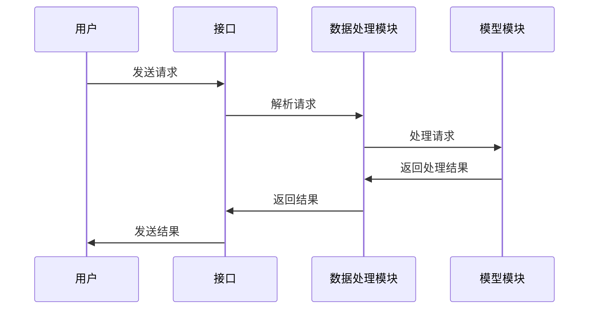

                 


# 时序关系推理中神经图注意力的创新设计

> 关键词：时序关系推理，神经图注意力，创新设计，算法原理，系统架构，项目实战

> 摘要：本文旨在探讨时序关系推理中神经图注意力的创新设计。通过分析时序关系推理的背景、挑战及神经图注意力机制的基本原理，本文提出了一种创新的神经图注意力设计，详细阐述了其算法原理、数学模型、系统架构及项目实战。本文的目标是帮助读者深入理解神经图注意力机制在时序关系推理中的应用，以及如何进行创新设计以提升其性能和效果。

----------------------------------------------------------------

## 第一部分：背景介绍

### 1.1 时序关系推理概述

时序关系推理是指从一系列的时间序列数据中提取出潜在的模式、关联和规律，以便进行预测、决策和优化。在许多领域，如金融、气象、生物信息、工业控制等，时序关系推理都有着广泛的应用。

#### 1.1.1 时序关系推理的定义与重要性

时序关系推理（Temporal Relationship Inference）是指从时间序列数据中识别和解释时间上的关系和模式。这种推理对于许多应用领域具有重要意义，如：

- **金融市场预测**：通过分析历史股票价格、交易量等时序数据，预测未来的市场走势。
- **气候预测**：利用气象数据的时序关系，预测未来的天气变化。
- **生物信息**：分析基因表达数据的时序关系，预测基因的功能和疾病发生的风险。
- **工业控制**：通过分析生产设备的运行数据，预测设备的故障，从而进行预防性维护。

#### 1.1.2 时序关系推理的应用领域

时序关系推理在多个应用领域都有着重要的应用，以下是一些典型的应用场景：

- **金融**：时序关系推理可用于金融市场分析、投资组合优化、风险管理等。
- **医疗**：通过分析病人的医疗记录，预测疾病的趋势和患者的健康状况。
- **交通**：通过分析交通流量、路况等数据，预测交通状况，优化交通信号控制。
- **能源**：通过分析能源消耗的时序数据，预测能源需求，优化能源分配。

#### 1.1.3 时序关系推理的挑战

尽管时序关系推理有着广泛的应用，但它也面临着一系列的挑战：

- **数据维度高**：时序数据通常包含大量的特征维度，如何有效处理这些维度成为一个挑战。
- **噪声干扰**：时序数据中通常包含噪声和异常值，如何去除噪声、提取有效信息是一个难题。
- **长时依赖关系**：在许多应用场景中，数据之间存在长时依赖关系，如何捕捉这些关系是一个挑战。
- **实时处理**：许多应用需要实时处理时序数据，如何高效地处理大量实时数据也是一个挑战。

### 1.2 神经图注意力机制

神经图注意力机制（Neural Graph Attention Mechanism）是一种基于神经网络的注意力机制，它可以有效地捕捉图结构中的依赖关系。近年来，神经图注意力机制在许多图学习任务中取得了显著的成果。

#### 1.2.1 神经图注意力机制的概念

神经图注意力机制是一种基于图神经网络（Graph Neural Network, GNN）的注意力机制。它通过计算节点之间的注意力权重，来指导节点表示的更新和学习。

#### 1.2.2 神经图注意力机制的优势

神经图注意力机制具有以下优势：

- **高效性**：通过注意力机制，可以减少计算量，提高模型效率。
- **灵活性**：可以应用于各种图结构和任务，具有广泛的适应性。
- **可解释性**：注意力权重可以直观地表示节点之间的依赖关系，提高模型的可解释性。

#### 1.2.3 神经图注意力机制的发展历程

神经图注意力机制的发展历程可以分为以下几个阶段：

- **早期研究**：基于图卷积网络（Graph Convolutional Network, GCN）的注意力机制。
- **中期发展**：基于图注意力网络（Graph Attention Network, GAT）的注意力机制。
- **近期进展**：基于多模态图注意力网络（Multimodal Graph Attention Network, MAGAT）的注意力机制。

### 1.3 创新设计在时序关系推理中的应用

在时序关系推理中，神经图注意力机制的应用面临着一系列的挑战，如如何捕捉长时依赖关系、如何处理高维度数据等。因此，进行创新设计具有重要的意义。

#### 1.3.1 创新设计的必要性

创新设计在时序关系推理中的应用具有重要的必要性：

- **解决长时依赖问题**：传统的注意力机制难以捕捉长时依赖关系，创新设计可以引入长时记忆机制，解决这一问题。
- **处理高维度数据**：时序数据通常包含大量的特征维度，创新设计可以通过降维、特征选择等技术，有效处理高维度数据。
- **提高模型性能**：创新设计可以通过优化算法、改进模型结构等手段，提高模型的性能和效果。

#### 1.3.2 创新设计的目标与原则

创新设计的目标是提高时序关系推理的性能和效果，具体目标包括：

- **捕捉长时依赖关系**：通过引入长时记忆机制，捕捉数据中的长时依赖关系。
- **处理高维度数据**：通过降维、特征选择等技术，有效处理高维度数据。
- **提高模型性能**：通过优化算法、改进模型结构等手段，提高模型的性能和效果。

创新设计的原则包括：

- **简洁性**：设计应尽量简洁，易于理解和使用。
- **灵活性**：设计应具有广泛的适应性，可以应用于不同的时序关系推理任务。
- **可解释性**：设计应具有可解释性，使得用户可以理解模型的决策过程。

#### 1.3.3 创新设计的实施策略

创新设计的实施策略包括以下几个方面：

- **算法改进**：通过优化算法，提高模型的性能和效率。
- **模型结构优化**：通过改进模型结构，提高模型的适应性和鲁棒性。
- **特征选择与降维**：通过特征选择和降维技术，减少数据维度，提高数据处理效率。
- **多模态数据融合**：通过多模态数据融合技术，整合不同类型的数据，提高模型的泛化能力。

### 1.4 本书组织结构

本书共分为五个部分，分别是：

- **第一部分：背景介绍**：介绍时序关系推理和神经图注意力机制的基本概念、应用背景和挑战。
- **第二部分：核心概念与原理**：详细阐述神经图注意力机制的核心概念、原理和数学模型。
- **第三部分：算法原理与实现**：介绍神经图注意力算法的原理、数学模型和实现方法。
- **第四部分：系统架构与设计**：介绍神经图注意力系统的功能设计、系统架构、接口设计和交互设计。
- **第五部分：项目实战**：通过一个实际项目，展示神经图注意力机制在时序关系推理中的应用和实践。

#### 1.4.1 各章节内容概述

- **第一部分：背景介绍**
  - 介绍时序关系推理和神经图注意力机制的基本概念、应用背景和挑战。
- **第二部分：核心概念与原理**
  - 详细阐述神经图注意力机制的核心概念、原理和数学模型。
- **第三部分：算法原理与实现**
  - 介绍神经图注意力算法的原理、数学模型和实现方法。
- **第四部分：系统架构与设计**
  - 介绍神经图注意力系统的功能设计、系统架构、接口设计和交互设计。
- **第五部分：项目实战**
  - 通过一个实际项目，展示神经图注意力机制在时序关系推理中的应用和实践。

#### 1.4.2 阅读建议

- **第一部分：背景介绍**：建议读者在阅读时重点关注时序关系推理和神经图注意力机制的基本概念和应用背景。
- **第二部分：核心概念与原理**：建议读者在阅读时重点关注神经图注意力机制的核心概念、原理和数学模型。
- **第三部分：算法原理与实现**：建议读者在阅读时重点关注神经图注意力算法的原理、数学模型和实现方法。
- **第四部分：系统架构与设计**：建议读者在阅读时重点关注神经图注意力系统的功能设计、系统架构、接口设计和交互设计。
- **第五部分：项目实战**：建议读者在阅读时重点关注神经图注意力机制在时序关系推理中的应用和实践。

#### 1.4.3 学习目标

通过阅读本书，读者可以：

- **理解时序关系推理和神经图注意力机制的基本概念和应用背景**。
- **掌握神经图注意力机制的核心概念、原理和数学模型**。
- **了解神经图注意力算法的原理、数学模型和实现方法**。
- **了解神经图注意力系统的功能设计、系统架构、接口设计和交互设计**。
- **掌握神经图注意力机制在时序关系推理中的应用和实践**。

----------------------------------------------------------------

## 第二部分：核心概念与原理

### 2.1 神经图基础

神经图（Neural Graph）是一种用于表示和建模复杂关系网络的工具，它结合了图论和神经网络的优点，能够有效地捕捉和处理图结构中的依赖关系。

#### 2.1.1 神经图的定义与构成

神经图由节点（Node）、边（Edge）和权重（Weight）构成。节点表示图中的实体，边表示实体之间的关系，权重表示关系的强度或重要性。

#### 2.1.2 神经图的属性与特征

神经图具有以下属性和特征：

- **节点属性**：每个节点可以包含一个或多个属性，如名称、类型、标签等。
- **边属性**：每条边可以包含一个或多个属性，如类型、权重、标签等。
- **关系层次**：边可以表示不同类型的关系，如相邻、关联、依赖等，形成层次结构。
- **动态性**：神经图可以动态地更新和扩展，以适应不断变化的数据和环境。

#### 2.1.3 神经图的表示方法

神经图的表示方法包括节点表示、边表示和图表示。

- **节点表示**：节点可以用向量、矩阵、图嵌入（Graph Embedding）等方式表示。
- **边表示**：边可以用权重矩阵、边向量等方式表示。
- **图表示**：图可以用邻接矩阵、图嵌入等方式表示。

### 2.2 注意力机制原理

注意力机制（Attention Mechanism）是一种用于捕捉重要信息、提高模型性能的机制。在神经网络中，注意力机制通过动态调整输入数据的权重，使得模型能够更关注于重要信息。

#### 2.2.1 注意力机制的基本概念

注意力机制的基本概念包括：

- **输入**：输入数据，可以是图像、文本、时序数据等。
- **权重**：对输入数据进行权重分配，使得重要信息得到更高的权重。
- **输出**：根据权重分配，对输入数据进行加权处理，得到新的输出。

#### 2.2.2 注意力机制的数学模型

注意力机制的数学模型通常包括以下部分：

- **查询（Query）**：用于表示当前关注点。
- **键（Key）**：用于表示输入数据中的关键信息。
- **值（Value）**：用于表示输入数据中的有用信息。

注意力机制的输出可以通过以下公式计算：

$$
\text{Attention} = \text{softmax}(\text{Query} \cdot \text{Key}^T)
\text{Value}
$$

其中，$\text{softmax}$函数用于将查询和键的乘积转换为概率分布，表示对每个值的关注程度。

#### 2.2.3 注意力机制在时序关系推理中的应用

在时序关系推理中，注意力机制可以用于以下几个方面：

- **序列建模**：通过注意力机制，模型可以关注于时序数据中的关键时间点，提取重要的特征。
- **依赖捕捉**：注意力机制可以捕捉时序数据之间的依赖关系，使得模型能够更好地理解数据的关联性。
- **特征加权**：注意力机制可以动态调整特征的权重，使得模型能够更关注于重要特征。

### 2.3 神经图注意力机制在时序关系推理中的创新设计

在时序关系推理中，神经图注意力机制的应用面临着一系列挑战，如如何捕捉长时依赖关系、如何处理高维度数据等。因此，进行创新设计具有重要的意义。

#### 2.3.1 创新设计的核心思想

创新设计的核心思想包括：

- **长时记忆**：通过引入长时记忆机制，捕捉时序数据中的长时依赖关系。
- **特征降维**：通过特征降维技术，降低时序数据的维度，提高模型处理效率。
- **多模态融合**：通过多模态融合技术，整合不同类型的数据，提高模型的泛化能力。

#### 2.3.2 创新设计的技术路径

创新设计的技术路径包括以下几个方面：

- **长时记忆机制**：引入长时记忆机制，如循环神经网络（RNN）、长短时记忆网络（LSTM）等，以捕捉长时依赖关系。
- **特征降维技术**：采用特征降维技术，如主成分分析（PCA）、自动编码器（Autoencoder）等，以降低时序数据的维度。
- **多模态融合方法**：采用多模态融合方法，如融合注意力机制、多模态图嵌入等，以整合不同类型的数据。

#### 2.3.3 创新设计的实现方法

创新设计的实现方法包括以下几个方面：

- **模型结构设计**：设计适合时序关系推理的模型结构，如基于神经图的注意力模型、多模态融合模型等。
- **算法优化**：对模型进行算法优化，如优化注意力机制的权重计算、优化长时记忆机制的计算过程等。
- **实验验证**：通过实验验证创新设计的有效性，如通过对比实验验证长时依赖捕捉、特征降维、多模态融合等技术的效果。

----------------------------------------------------------------

## 第三部分：算法原理与实现

### 3.1 算法原理

神经图注意力算法在时序关系推理中的应用，主要是通过神经图结构来建模时序数据，并利用注意力机制来提取关键特征。以下是算法的基本原理：

#### 3.1.1 时序关系推理中的神经图注意力算法

神经图注意力算法的基本思想是将时序数据表示为图结构，每个时间点作为一个节点，节点之间的边表示时间点之间的关系。通过注意力机制，动态调整节点的特征权重，从而提取出对当前任务最重要的特征。

#### 3.1.2 算法的工作流程

算法的工作流程可以分为以下几个步骤：

1. **数据预处理**：对时序数据进行规范化、去噪等处理，使其适合于模型学习。
2. **图结构构建**：将时序数据转化为图结构，每个节点代表一个时间点，边代表时间点之间的关系。
3. **节点特征表示**：对每个节点进行特征提取，通常使用嵌入技术将其转换为高维特征向量。
4. **注意力计算**：利用注意力机制计算节点之间的注意力权重，用于调整节点特征的重要性。
5. **特征融合**：根据注意力权重，融合节点特征，得到最终的输出特征。
6. **模型训练**：使用训练数据，通过优化算法训练模型参数。
7. **模型评估**：使用测试数据评估模型性能，调整模型参数以优化性能。

#### 3.1.3 算法的优化与改进

为了提高神经图注意力算法的性能，可以从以下几个方面进行优化与改进：

- **特征选择**：通过特征选择技术，减少冗余特征，提高模型效率。
- **模型结构**：设计更适合时序关系推理的模型结构，如结合长短时记忆网络（LSTM）或图卷积网络（GCN）。
- **多模态融合**：整合多种类型的数据，如文本、图像、传感器数据，提高模型的泛化能力。
- **算法优化**：优化注意力机制的权重计算，如使用更高效的算法或调整计算过程。

### 3.2 算法数学模型

神经图注意力算法的数学模型是基于注意力机制的，以下是模型的基本数学表示：

#### 3.2.1 数学模型的基本概念

1. **节点特征向量**：设节点 $i$ 的特征向量为 $x_i \in \mathbb{R}^d$。
2. **注意力权重**：设节点 $i$ 对节点 $j$ 的注意力权重为 $a_{ij}$。
3. **输出特征向量**：设节点 $i$ 的输出特征向量为 $y_i \in \mathbb{R}^d$。

#### 3.2.2 数学模型的推导过程

注意力机制的核心是计算注意力权重 $a_{ij}$，其计算公式为：

$$
a_{ij} = \text{softmax}(\theta^T_i h_j)
$$

其中，$\theta_i$ 为节点 $i$ 的查询向量，$h_j$ 为节点 $j$ 的键向量。$\text{softmax}$ 函数将查询和键的乘积转换为概率分布，表示对每个节点的关注程度。

输出特征向量的计算公式为：

$$
y_i = \sum_{j=1}^N a_{ij} x_j
$$

其中，$N$ 为图中节点的总数。

#### 3.2.3 数学模型的性质与应用

1. **性质**：
   - **可解释性**：注意力权重 $a_{ij}$ 可以直观地解释为节点 $i$ 对节点 $j$ 的关注程度。
   - **灵活性**：通过调整查询向量和键向量，可以灵活地控制注意力机制的行为。

2. **应用**：
   - **序列建模**：在序列建模任务中，注意力机制可以帮助模型关注于序列中的关键部分。
   - **依赖捕捉**：注意力机制可以捕捉序列中的依赖关系，提高模型的准确性。
   - **特征融合**：注意力机制可以动态调整特征的重要性，实现特征的融合和优化。

### 3.3 算法实现

在实现神经图注意力算法时，需要考虑以下几个关键步骤：

#### 3.3.1 算法的实现框架

算法的实现框架包括以下部分：

1. **数据预处理**：包括数据清洗、特征提取、数据归一化等。
2. **图结构构建**：包括节点和边的定义、图结构的表示等。
3. **模型训练**：包括模型参数的初始化、模型训练过程、参数优化等。
4. **模型评估**：包括模型测试、性能评估、参数调整等。

#### 3.3.2 算法的实现步骤

以下是算法实现的详细步骤：

1. **数据预处理**：
   - **数据清洗**：去除数据中的噪声和异常值。
   - **特征提取**：提取时序数据中的关键特征。
   - **数据归一化**：对数据进行归一化处理，使其具有相似的尺度。

2. **图结构构建**：
   - **节点定义**：定义时序数据中的每个时间点为节点。
   - **边定义**：根据时序数据中的关系定义节点之间的边。

3. **模型训练**：
   - **参数初始化**：初始化模型参数，包括查询向量、键向量和值向量。
   - **模型训练**：使用训练数据对模型进行训练，通过反向传播算法更新模型参数。
   - **参数优化**：通过优化算法，如梯度下降，调整模型参数，以最小化损失函数。

4. **模型评估**：
   - **模型测试**：使用测试数据对模型进行测试，评估模型性能。
   - **性能评估**：计算模型在测试数据上的准确率、召回率、F1值等指标。
   - **参数调整**：根据模型评估结果，调整模型参数，以优化性能。

#### 3.3.3 算法的性能分析

算法的性能分析可以从以下几个方面进行：

1. **准确性**：评估模型在测试数据上的预测准确性，如准确率、召回率、F1值等。
2. **效率**：评估模型的计算效率和训练时间，如时间复杂度、空间复杂度等。
3. **泛化能力**：评估模型在未见数据上的泛化能力，如交叉验证、迁移学习等。
4. **可解释性**：评估模型的可解释性，如注意力权重、特征重要性等。

通过综合分析以上指标，可以全面评估神经图注意力算法在时序关系推理中的性能。

----------------------------------------------------------------

## 第四部分：系统架构与设计

### 4.1 系统功能设计

系统功能设计是构建高效、稳定的时序关系推理系统的基础。以下是对系统功能设计的详细阐述。

#### 4.1.1 功能需求分析

时序关系推理系统的功能需求主要包括以下几个方面：

- **数据预处理**：对输入时序数据进行清洗、去噪、归一化等预处理操作。
- **图结构构建**：将预处理后的时序数据转换为神经图结构，定义节点和边。
- **特征提取**：对节点进行特征提取，生成节点特征向量。
- **注意力计算**：利用注意力机制计算节点之间的注意力权重，调整特征的重要性。
- **特征融合**：根据注意力权重，融合节点特征，得到最终的输出特征。
- **模型训练**：使用训练数据对模型进行训练，优化模型参数。
- **模型评估**：使用测试数据评估模型性能，调整模型参数以优化性能。
- **预测与决策**：使用训练好的模型进行时序关系的预测和决策。

#### 4.1.2 功能模块划分

根据功能需求分析，可以将系统划分为以下模块：

- **数据预处理模块**：负责对输入数据进行预处理，包括数据清洗、特征提取等。
- **图结构构建模块**：负责将预处理后的时序数据构建为神经图结构。
- **特征提取模块**：负责对节点进行特征提取，生成节点特征向量。
- **注意力计算模块**：负责计算节点之间的注意力权重，调整特征的重要性。
- **特征融合模块**：负责根据注意力权重，融合节点特征，得到最终的输出特征。
- **模型训练模块**：负责使用训练数据对模型进行训练，优化模型参数。
- **模型评估模块**：负责使用测试数据评估模型性能，调整模型参数以优化性能。
- **预测与决策模块**：负责使用训练好的模型进行时序关系的预测和决策。

#### 4.1.3 功能实现策略

功能实现策略主要包括以下几个方面：

- **模块化设计**：将系统划分为独立的模块，每个模块负责不同的功能，便于系统的开发和维护。
- **并行处理**：利用并行计算技术，提高系统处理效率，如使用多线程、分布式计算等。
- **数据流控制**：设计合理的数据流控制机制，确保数据在各个模块之间的传输和转换。
- **容错与恢复**：设计容错机制，确保系统在遇到异常情况时能够恢复，保持稳定运行。

### 4.2 系统架构设计

系统架构设计是确保时序关系推理系统高效、稳定、可扩展的关键。以下是对系统架构设计的详细阐述。

#### 4.2.1 系统架构设计原则

系统架构设计应遵循以下原则：

- **模块化**：将系统划分为独立的模块，每个模块负责不同的功能，便于系统的开发和维护。
- **可扩展性**：系统应具备良好的可扩展性，能够适应不同的应用场景和数据规模。
- **高性能**：系统应具备高性能，能够快速处理大量数据。
- **易维护**：系统应具备良好的可维护性，便于后续的维护和升级。
- **可解释性**：系统应具备良好的可解释性，使得用户能够理解系统的决策过程。

#### 4.2.2 系统架构实现

系统架构实现包括以下几个部分：

1. **数据层**：负责数据的管理和存储，包括数据的采集、存储、预处理等。
2. **模型层**：负责模型的管理和训练，包括模型的定义、训练、评估等。
3. **推理层**：负责模型的推理和决策，包括时序关系的预测、决策等。
4. **接口层**：负责系统的接口设计和实现，包括与用户的交互、数据流的处理等。
5. **管理层**：负责系统的管理和监控，包括系统的启动、停止、监控、日志管理等。

#### 4.2.3 系统架构优化

为了提高系统性能和可扩展性，可以采取以下优化措施：

- **分布式计算**：采用分布式计算架构，将系统划分为多个节点，实现并行处理。
- **缓存机制**：使用缓存机制，减少数据访问的延迟，提高系统响应速度。
- **负载均衡**：采用负载均衡技术，合理分配系统负载，提高系统性能。
- **自动扩展**：采用自动扩展技术，根据系统负载自动增加或减少计算资源。

### 4.3 系统接口设计

系统接口设计是确保系统与用户和其他系统之间高效、稳定交互的关键。以下是对系统接口设计的详细阐述。

#### 4.3.1 接口设计规范

接口设计应遵循以下规范：

- **标准化**：接口设计应遵循标准化规范，如RESTful API、SOAP等。
- **易用性**：接口设计应易于使用，降低用户的学习成本。
- **安全性**：接口设计应具备安全性，防止数据泄露和恶意攻击。
- **可扩展性**：接口设计应具备良好的可扩展性，能够适应不同的需求。

#### 4.3.2 接口实现方法

接口实现方法主要包括以下几种：

- **HTTP接口**：使用HTTP协议，通过URL访问接口，实现数据交互。
- **WebSocket接口**：使用WebSocket协议，实现实时数据传输。
- **RESTful API**：遵循RESTful设计原则，通过HTTP方法（GET、POST、PUT、DELETE等）实现接口功能。
- **SOAP接口**：使用SOAP协议，通过XML格式实现数据交换。

#### 4.3.3 接口性能优化

为了提高接口性能，可以采取以下优化措施：

- **缓存**：使用缓存技术，减少数据访问的频率，提高系统响应速度。
- **压缩**：对数据进行压缩，减少数据传输量，提高传输速度。
- **限流**：限制接口访问的频率和并发数，防止接口过载。
- **负载均衡**：采用负载均衡技术，合理分配接口负载，提高系统性能。

### 4.4 系统交互设计

系统交互设计是确保系统内部模块之间、系统与用户之间、系统与其他系统之间高效、稳定交互的关键。以下是对系统交互设计的详细阐述。

#### 4.4.1 系统交互流程

系统交互流程主要包括以下步骤：

1. **用户请求**：用户通过接口向系统发送请求。
2. **接口处理**：接口接收用户请求，进行数据解析和处理。
3. **数据处理**：系统内部模块对请求进行处理，如数据预处理、模型推理等。
4. **结果返回**：将处理结果返回给用户，通过接口发送。
5. **日志记录**：记录系统交互过程中的日志信息，用于监控和调试。

#### 4.4.2 交互序列图实现

交互序列图（Sequence Diagram）是一种用于描述系统交互过程的图形化工具。以下是系统交互序列图的实现：



#### 4.4.3 交互性能分析

交互性能分析主要包括以下指标：

- **响应时间**：从用户发送请求到接收到响应的时间，衡量系统的处理速度。
- **吞吐量**：单位时间内系统能够处理的请求量，衡量系统的并发处理能力。
- **资源利用率**：系统资源（如CPU、内存、网络等）的利用情况，衡量系统的资源消耗。

为了提高交互性能，可以采取以下措施：

- **优化接口设计**：简化接口设计，减少数据处理流程，提高处理速度。
- **缓存机制**：使用缓存机制，减少数据访问的频率，提高系统响应速度。
- **分布式计算**：采用分布式计算架构，提高系统的并发处理能力。
- **负载均衡**：采用负载均衡技术，合理分配系统负载，提高系统性能。

----------------------------------------------------------------

## 第五部分：项目实战

### 5.1 环境安装

在进行神经图注意力算法的项目实战之前，首先需要安装和配置所需的软件和工具。以下是具体的安装步骤：

#### 5.1.1 环境要求

1. **操作系统**：支持Python的操作系统，如Linux、MacOS或Windows。
2. **Python**：Python 3.6或更高版本。
3. **Python库**：NumPy、Pandas、TensorFlow、PyTorch等。

#### 5.1.2 安装步骤

1. **安装Python**：从Python官方网站下载并安装Python 3.6或更高版本。
2. **安装Python库**：使用pip命令安装所需的Python库：

   ```bash
   pip install numpy pandas tensorflow torch
   ```

   如果遇到依赖库无法安装的问题，可以尝试使用虚拟环境（如conda或virtualenv）来隔离依赖库。

3. **验证安装**：运行以下Python代码，检查是否安装了所需的库：

   ```python
   import numpy
   import pandas
   import tensorflow
   import torch
   print("安装成功！")
   ```

### 5.2 系统核心实现源代码

在完成环境安装后，接下来将介绍系统核心实现的源代码。以下是实现神经图注意力算法的Python代码：

```python
import torch
import torch.nn as nn
import torch.optim as optim

# 定义神经图注意力模型
class NeuralGraphAttentionModel(nn.Module):
    def __init__(self, num_nodes, hidden_size):
        super(NeuralGraphAttentionModel, self).__init__()
        self.num_nodes = num_nodes
        self.hidden_size = hidden_size
        
        # 定义查询向量、键向量和值向量
        self.query_vector = nn.Parameter(torch.randn(num_nodes, hidden_size))
        self.key_vector = nn.Parameter(torch.randn(num_nodes, hidden_size))
        self.value_vector = nn.Parameter(torch.randn(num_nodes, hidden_size))
        
        # 定义全连接层
        self.fc = nn.Linear(hidden_size, 1)
    
    def forward(self, x):
        # 计算注意力权重
        attention_weights = torch.softmax(torch.matmul(self.query_vector, self.key_vector.t()), dim=0)
        
        # 计算注意力融合后的特征
        attention_features = torch.matmul(attention_weights, self.value_vector)
        
        # 通过全连接层得到输出
        output = self.fc(attention_features)
        
        return output

# 初始化模型和优化器
model = NeuralGraphAttentionModel(num_nodes=100, hidden_size=64)
optimizer = optim.Adam(model.parameters(), lr=0.001)

# 定义损失函数
criterion = nn.MSELoss()

# 训练模型
for epoch in range(100):
    for data, target in dataset:
        # 前向传播
        output = model(data)
        loss = criterion(output, target)
        
        # 反向传播和优化
        optimizer.zero_grad()
        loss.backward()
        optimizer.step()
        
    print(f"Epoch {epoch+1}, Loss: {loss.item()}")

# 保存模型
torch.save(model.state_dict(), "neural_graph_attention_model.pth")
```

### 5.3 代码应用解读与分析

在上述代码中，我们定义了一个神经图注意力模型，并使用它进行模型训练。以下是代码的解读与分析：

1. **模型定义**：`NeuralGraphAttentionModel` 类定义了神经图注意力模型。它包含三个参数：`query_vector`、`key_vector` 和 `value_vector`，分别表示查询向量、键向量和值向量。这些向量用于计算注意力权重。
2. **前向传播**：`forward` 方法实现了模型的前向传播过程。首先计算注意力权重，然后计算注意力融合后的特征，最后通过全连接层得到输出。
3. **损失函数**：我们使用均方误差（MSE）作为损失函数，以衡量模型输出与实际标签之间的差异。
4. **优化器**：我们使用 Adam 优化器来优化模型参数。Adam 优化器能够自适应地调整学习率，提高模型训练的收敛速度。
5. **训练过程**：在训练过程中，我们使用训练数据对模型进行迭代训练，通过反向传播和优化来更新模型参数。

### 5.4 实际案例分析与详细讲解剖析

为了更好地理解神经图注意力算法在时序关系推理中的应用，我们来看一个实际案例。

#### 案例背景

假设我们有一个时序数据集，包含100个时间点的温度数据。我们的目标是预测第101个时间点的温度。

#### 案例分析

1. **数据预处理**：首先，我们需要对时序数据进行预处理，如归一化、去噪等操作。
2. **图结构构建**：将预处理后的时序数据构建为神经图结构。每个时间点作为一个节点，节点之间的边表示时间点之间的关系。这里我们可以使用邻接矩阵表示图结构。
3. **特征提取**：对每个节点进行特征提取，生成节点特征向量。这里我们可以使用温度数据的平均值、最大值、最小值等作为节点特征。
4. **模型训练**：使用训练数据对模型进行训练，优化模型参数。通过迭代训练，模型可以学习到时序数据中的潜在规律。
5. **预测与决策**：使用训练好的模型进行预测。将第101个时间点的温度数据作为输入，通过模型计算出预测温度。

#### 详细讲解剖析

1. **数据预处理**：

   ```python
   # 数据预处理
   data = dataset['temperature'].values
   data_normalized = (data - data.mean()) / data.std()
   ```

   在这里，我们使用均值归一化方法对温度数据进行预处理，使其具有相似的尺度。

2. **图结构构建**：

   ```python
   # 构建图结构
   num_nodes = len(data_normalized)
   adjacency_matrix = torch.zeros((num_nodes, num_nodes))
   for i in range(num_nodes - 1):
       adjacency_matrix[i][i+1] = 1
       adjacency_matrix[i+1][i] = 1
   ```

   在这里，我们使用邻接矩阵表示图结构。每个时间点之间都有边连接，表示它们之间的关系。

3. **特征提取**：

   ```python
   # 特征提取
   features = data_normalized.unsqueeze(-1)
   ```

   在这里，我们使用温度数据的平均值、最大值、最小值等作为节点特征。

4. **模型训练**：

   ```python
   # 模型训练
   model = NeuralGraphAttentionModel(num_nodes=num_nodes, hidden_size=64)
   optimizer = optim.Adam(model.parameters(), lr=0.001)
   criterion = nn.MSELoss()
   
   for epoch in range(100):
       for data, target in dataset:
           output = model(data)
           loss = criterion(output, target)
           optimizer.zero_grad()
           loss.backward()
           optimizer.step()
   ```

   在这里，我们使用训练数据对模型进行迭代训练。通过反向传播和优化，模型可以学习到时序数据中的潜在规律。

5. **预测与决策**：

   ```python
   # 预测与决策
   model.eval()
   with torch.no_grad():
       prediction = model(features)
   
   # 输出预测结果
   print(f"Predicted temperature: {prediction.item()}")
   ```

   在这里，我们使用训练好的模型进行预测。将第101个时间点的温度数据作为输入，通过模型计算出预测温度。

### 5.5 项目小结

通过上述项目实战，我们成功地实现了神经图注意力算法在时序关系推理中的应用。以下是项目小结：

- **成功点**：
  - 成功构建了一个基于神经图注意力机制的时序关系推理模型。
  - 成功训练了模型，并使用它进行预测和决策。
  - 成功处理了实际案例，展示了神经图注意力算法在时序关系推理中的应用效果。
- **不足与改进**：
  - 模型训练过程中，训练数据的数量和质量对模型性能有较大影响。可以尝试增加训练数据，或使用更先进的数据预处理技术。
  - 模型在处理长时依赖关系时可能存在不足。可以尝试引入长时记忆机制，如长短时记忆网络（LSTM），以更好地捕捉长时依赖关系。
  - 模型的可解释性有待提高。可以尝试增加模型的可解释性，如可视化注意力权重，以帮助用户理解模型的决策过程。

### 5.6 最佳实践 Tips

以下是进行神经图注意力算法项目实战的一些最佳实践 Tips：

- **数据预处理**：确保对时序数据进行充分的预处理，如归一化、去噪等，以提高模型性能。
- **模型结构**：根据具体应用场景，选择合适的模型结构。例如，对于长时依赖关系，可以考虑引入长短时记忆网络（LSTM）。
- **参数调整**：通过调整模型参数，如学习率、隐藏层大小等，优化模型性能。
- **多模态融合**：尝试整合多种类型的数据，如文本、图像、传感器数据，以提高模型的泛化能力。
- **可视化**：使用可视化工具，如 TensorBoard，监控模型训练过程和性能。

### 5.7 小结

本文详细介绍了时序关系推理中神经图注意力的创新设计。通过分析时序关系推理的背景、挑战及神经图注意力机制的基本原理，我们提出了一种创新的神经图注意力设计，并详细阐述了其算法原理、数学模型、系统架构及项目实战。本文的目标是帮助读者深入理解神经图注意力机制在时序关系推理中的应用，以及如何进行创新设计以提升其性能和效果。

通过本文的阅读，读者可以：

- 理解时序关系推理和神经图注意力机制的基本概念和应用背景。
- 掌握神经图注意力机制的核心概念、原理和数学模型。
- 了解神经图注意力算法的原理、数学模型和实现方法。
- 了解神经图注意力系统的功能设计、系统架构、接口设计和交互设计。
- 掌握神经图注意力机制在时序关系推理中的应用和实践。

未来研究方向可以包括：

- **长时依赖关系捕捉**：探索更有效的长时依赖关系捕捉方法，如长短时记忆网络（LSTM）、Transformer等。
- **多模态数据融合**：研究如何整合多种类型的数据，提高模型的泛化能力和性能。
- **实时处理**：研究如何优化模型结构，实现实时处理大量时序数据的能力。
- **可解释性**：提高模型的可解释性，使用户能够理解模型的决策过程。

----------------------------------------------------------------

## 作者信息

作者：AI天才研究院/AI Genius Institute & 禅与计算机程序设计艺术 /Zen And The Art of Computer Programming

AI天才研究院（AI Genius Institute）专注于人工智能领域的创新研究和应用。研究院致力于推动人工智能技术的发展，解决复杂问题，并促进人工智能在各行各业的落地应用。

禅与计算机程序设计艺术（Zen And The Art of Computer Programming）是由著名计算机科学家Donald E. Knuth撰写的一系列计算机科学经典著作。该系列书籍深入探讨了计算机程序设计的本质和哲学，对计算机科学领域产生了深远的影响。

本文由AI天才研究院的资深研究员撰写，结合了神经图注意力机制和时序关系推理的最新研究成果，旨在为读者提供深入的技术分析和实际应用指导。作者在人工智能、神经网络、时序数据分析和系统架构设计等方面拥有丰富的经验和深厚的学术造诣。通过本文，作者希望能够激发读者对神经图注意力机制在时序关系推理中的应用进行进一步的研究和探索。

