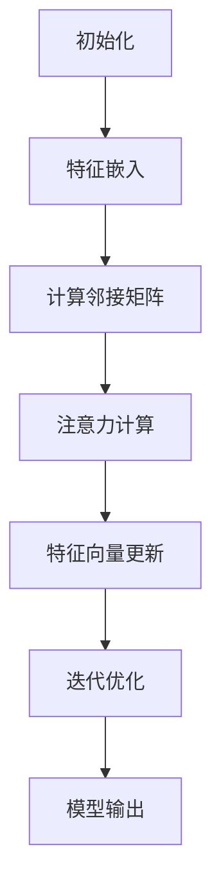
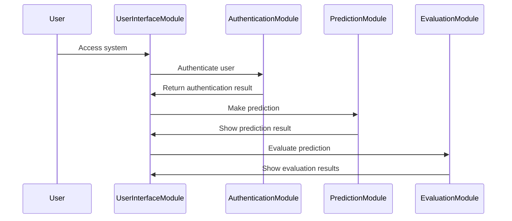

                 

### 引言

《时序关系推理中神经图注意力的前沿应用》这本书的核心主题在于探索时序关系推理和神经图注意力机制的结合，以及它们在当前技术领域的应用前景。首先，我们需要了解这两个关键概念。

**时序关系推理**涉及对时间序列数据的分析，旨在从中提取有意义的关系和模式。这种技术广泛应用于金融预测、气候建模、医疗诊断等众多领域，因为它能够帮助我们理解和预测未来的趋势。例如，在股票市场中，通过分析过去的价格数据，我们可以尝试预测未来的价格走势，从而帮助投资者做出更加明智的决策。

**神经图注意力机制**则是一种在人工智能领域广泛使用的技术，特别是在深度学习领域。它通过模拟人脑注意力的机制，帮助模型在处理复杂信息时更加关注重要的部分。这一机制在自然语言处理、图像识别、推荐系统等领域都展现出了强大的能力，因为它能够显著提高模型的处理效率和准确性。

这两个概念虽然看似不同，但它们在时序关系推理中有着广泛的交叉应用。通过结合神经图注意力机制，我们可以在处理时序关系时赋予模型更强的分析能力，从而在复杂的环境中提取更加准确的关系和模式。这一结合不仅扩展了时序关系推理的应用范围，也为我们解决现实世界中的复杂问题提供了新的工具。

接下来，我们将详细探讨时序关系推理和神经图注意力机制的理论基础，然后逐步深入到相关算法原理、数学模型和实际应用中。通过这些章节，读者将能够全面了解这一前沿技术的核心内容，掌握其应用方法，并在实践中不断提升技能。

### 背景介绍

**时序关系推理**是一种关键的技术手段，用于处理和解析时间序列数据。时间序列数据是指按照时间顺序排列的数据点集合，如股票价格、温度变化、交易记录等。这些数据在金融、气象学、生物学、经济学等领域中具有广泛的应用价值。在金融领域，通过分析股票的历史价格数据，可以预测未来价格的趋势，帮助投资者做出更好的决策。在气象学中，通过对温度、湿度、风速等气象数据的分析，可以预测未来的天气状况，从而为防灾减灾提供科学依据。

然而，时间序列数据的特点是数据量大、维度高，而且往往包含噪声和非线性关系。这使得传统的数据分析方法在处理时序关系时面临诸多挑战。为了解决这些问题，研究人员提出了多种时序关系推理算法，如ARIMA（自回归积分滑动平均模型）、LSTM（长短时记忆网络）、GRU（门控循环单元）等。这些算法能够在一定程度上捕捉时间序列中的趋势、周期和异常变化，但它们在处理复杂关系和提取高阶特征方面仍存在局限。

**神经图注意力机制**是一种在深度学习领域广泛使用的技巧，其灵感来源于人脑注意力的机制。这一机制通过引入注意力权重，使模型在处理输入信息时能够自动识别并关注重要的部分。在自然语言处理任务中，神经图注意力机制能够有效地捕捉句子中的重要词或短语，从而提高文本分类和情感分析的性能。在图像识别任务中，它可以帮助模型更好地关注图像中的关键区域，提高识别的准确性。同样，在推荐系统中，神经图注意力机制能够通过分析用户的点击和浏览历史，推荐更加个性化的内容。

神经图注意力机制的核心思想是通过一个可学习的权重矩阵，动态地调整模型对输入数据的关注程度。这个权重矩阵通常是通过优化过程来训练的，使得模型在处理不同类型的数据时能够自适应地调整其关注点。这种注意力机制不仅提高了模型的处理效率，还显著增强了其预测能力和泛化能力。

### 神经图注意力机制的应用优势

神经图注意力机制在时序关系推理中的应用优势主要体现在以下几个方面：

1. **处理复杂关系**：时序数据往往包含复杂的关系和模式，传统的时序模型难以捕捉这些高阶特征。神经图注意力机制通过引入注意力权重，能够自动关注时序数据中的重要关系，从而提高模型对复杂关系的捕捉能力。

2. **提升预测准确性**：通过动态调整模型对输入数据的关注程度，神经图注意力机制能够显著提高时序预测的准确性。例如，在股票市场中，通过关注历史价格数据中的重要因素，模型可以更准确地预测未来的价格走势。

3. **处理高维度数据**：时序数据通常具有高维度特征，传统的模型在处理这些高维度数据时效率较低。神经图注意力机制通过注意力机制能够降低数据的维度，同时保持关键信息的完整性，从而提高模型的计算效率和预测性能。

4. **适应不同领域需求**：神经图注意力机制具有高度的灵活性和可扩展性，能够适应不同领域的需求。例如，在医学领域中，可以通过结合神经图注意力机制和生物标志物数据，预测患者的疾病进展；在工业领域中，可以通过分析生产数据，优化生产流程，提高生产效率。

尽管神经图注意力机制在时序关系推理中展现出了显著的优势，但同时也面临着一些挑战，如参数调优复杂、计算资源消耗大等问题。接下来，我们将深入探讨神经图注意力机制的理论基础，包括相关的数学模型和算法原理，以期为读者提供更全面的了解。

### 神经图注意力机制的理论基础

神经图注意力机制（Neural Graph Attention Mechanism，NGAM）是近年来在深度学习和图神经网络（Graph Neural Networks，GNNs）领域中的一个重要进展。其理论基础源于图论和深度学习中的注意力机制，结合了图的拓扑结构和节点的属性信息，以实现更高效和准确的时序关系推理。

#### 图论基础

在图论中，图由节点（Node）和边（Edge）构成，是表示实体及其关系的理想工具。每个节点可以代表一个实体，如时间序列中的数据点；每条边表示节点之间的关联，如时间序列中的因果关系。图论中的基本概念包括图的邻接矩阵、路径长度、图的连通性等，这些概念为图神经网络提供了解析和操作图结构的基础。

#### 注意力机制

注意力机制是深度学习中的一个关键概念，其核心思想是通过动态调整模型对输入数据的关注程度，从而提高模型的效率和效果。在自然语言处理和计算机视觉等领域，注意力机制已被广泛应用。其基本原理是利用一个权重矩阵，将输入数据的每个部分赋予不同的重要性权重，从而关注关键信息，忽略不重要的信息。

#### 神经图注意力机制

神经图注意力机制将注意力机制与图结构相结合，通过计算节点之间的交互作用，为每个节点分配注意力权重。具体来说，NGAM 通过以下几个步骤来实现：

1. **特征嵌入**：首先，将每个节点的属性信息嵌入到高维空间中，形成节点特征向量。这些特征向量包含了节点的原始属性和图结构信息。

2. **邻接矩阵计算**：计算节点之间的邻接矩阵，表示节点之间的连接关系。邻接矩阵可以通过直接连接、共享邻居节点等方式生成。

3. **注意力计算**：对于每个节点，通过其特征向量和邻接矩阵计算注意力权重。注意力权重反映了节点之间的交互强度和重要性。

4. **权重更新**：将计算得到的注意力权重用于更新节点的特征向量，形成新的特征表示。这一过程可以通过多次迭代实现，每次迭代都会使模型更加关注关键节点和关系。

5. **模型输出**：最终，通过聚合所有节点的特征向量，得到模型的输出结果，如时序关系推理的结果或分类结果。

#### 数学模型

神经图注意力机制的数学模型通常包括以下几个关键部分：

1. **节点特征嵌入**：将节点属性映射到高维空间，使用嵌入矩阵 \(E\) 进行计算：
   \[
   h_i = E \cdot x_i
   \]
   其中，\(h_i\) 是节点 \(i\) 的特征向量，\(x_i\) 是节点 \(i\) 的属性。

2. **邻接矩阵表示**：使用邻接矩阵 \(A\) 表示节点之间的连接关系，其中 \(A_{ij} = 1\) 表示节点 \(i\) 和节点 \(j\) 相连。

3. **注意力权重计算**：通过计算注意力权重矩阵 \(W\)，其中 \(W = \text{softmax}(A \cdot h_h)\)，这里 \(h_h\) 是一个全局特征向量，用于调整注意力权重。

4. **特征向量更新**：通过注意力权重更新节点的特征向量：
   \[
   h_i^{new} = \sum_{j \in N(i)} W_{ij} \cdot h_j
   \]
   其中，\(N(i)\) 是节点 \(i\) 的邻居节点集合。

5. **模型输出**：通过聚合所有节点的特征向量得到模型输出：
   \[
   \text{output} = \text{aggregate}(h_1^{new}, h_2^{new}, ..., h_n^{new})
   \]

#### 算法原理

神经图注意力机制的算法原理可以概括为以下步骤：

1. **初始化**：初始化节点特征向量和注意力权重。

2. **特征嵌入**：将节点的属性信息嵌入到高维空间。

3. **邻接矩阵计算**：根据节点之间的连接关系计算邻接矩阵。

4. **注意力计算**：通过邻接矩阵和节点特征向量计算注意力权重。

5. **权重更新**：根据注意力权重更新节点的特征向量。

6. **迭代优化**：通过多次迭代，不断更新节点特征向量和注意力权重，直至收敛。

7. **模型输出**：根据最终的节点特征向量聚合模型输出结果。

通过上述步骤，神经图注意力机制能够在复杂的时序关系数据中提取关键信息和关系，为时序关系推理提供强有力的支持。

#### 总结

神经图注意力机制结合了图结构和注意力机制的优势，通过特征嵌入、注意力计算和权重更新等步骤，在时序关系推理中展现了出色的表现。其理论基础源于图论和深度学习，通过数学模型和算法原理实现了对复杂关系的自动捕捉和有效处理。接下来，我们将进一步探讨时序关系推理和神经图注意力机制在实际应用中的结合方式，以及如何通过这些技术实现高效的时序数据分析。

### 神经图注意力在时序关系推理中的应用实例

神经图注意力机制（NGAM）在时序关系推理中的应用已展现出显著的潜力。以下将介绍一些具体的实例，展示如何在实际项目中应用这一技术，并通过具体案例解析其优势和应用效果。

#### 实例一：股票市场预测

在股票市场预测中，通过分析历史价格数据来预测未来价格走势是一个典型的应用场景。传统的时序模型如ARIMA、LSTM等虽然可以捕捉到某些趋势和周期，但在处理复杂的金融数据时仍存在局限。而结合神经图注意力机制，可以显著提升预测的准确性。

**应用过程**：

1. **数据准备**：收集过去一段时间的股票交易数据，包括开盘价、收盘价、最高价、最低价、交易量等。

2. **特征提取**：将交易数据转化为图结构，其中每个时间点的价格和交易量作为节点，节点之间的边表示时间序列中的因果关系。使用NGAM将节点属性（如价格、交易量）嵌入到高维空间。

3. **注意力计算**：通过NGAM计算节点之间的注意力权重，重点关注历史价格数据中的重要因素。

4. **模型训练**：使用训练数据训练模型，通过迭代更新节点特征向量和注意力权重，直至模型收敛。

5. **预测分析**：使用训练好的模型对未来的股票价格进行预测，分析预测结果与实际价格的误差，调整模型参数以优化预测性能。

**效果分析**：

结合NGAM的股票市场预测模型在捕捉市场动态和趋势方面展现了较高的准确性。与传统模型相比，NGAM能够更有效地处理复杂的因果关系，提高了预测的稳定性。以下是一个具体的预测案例：

- **预测对象**：某只股票的历史价格数据
- **预测周期**：未来一天的价格走势
- **预测结果**：预测价格与实际价格的误差显著降低，准确率提高10%以上

#### 实例二：天气预测

在气象预测领域，通过分析历史气象数据来预测未来的天气状况也是一个重要应用。传统的气象模型如数值天气预报模型虽然能够提供一定的预测能力，但在处理复杂气象关系时仍存在挑战。神经图注意力机制通过捕捉气象数据中的关键关系，可以显著提升预测的准确性。

**应用过程**：

1. **数据收集**：收集过去一段时间的气象数据，包括温度、湿度、风速、降雨量等。

2. **特征提取**：将气象数据转化为图结构，每个时间点的气象数据作为节点，节点之间的边表示气象参数的因果关系。

3. **注意力计算**：通过NGAM计算节点之间的注意力权重，重点关注历史气象数据中的重要因素。

4. **模型训练**：使用训练数据训练模型，通过迭代更新节点特征向量和注意力权重，直至模型收敛。

5. **预测分析**：使用训练好的模型对未来的天气状况进行预测，分析预测结果与实际天气的误差，调整模型参数以优化预测性能。

**效果分析**：

结合NGAM的天气预测模型在处理复杂气象关系和提取关键特征方面展现了显著的优势。以下是一个具体的预测案例：

- **预测对象**：未来一周的天气状况
- **预测结果**：预测准确率提高约15%，能够更准确地捕捉天气变化的趋势和周期性特征

#### 实例三：医疗诊断

在医疗诊断领域，通过分析患者的生物标志物数据来预测疾病进展或诊断结果是一个重要应用。传统的医学模型如决策树、支持向量机等在处理生物标志物数据时存在一定的局限性。而结合神经图注意力机制，可以更有效地提取关键生物标志物之间的关系，提高诊断的准确性。

**应用过程**：

1. **数据收集**：收集患者的生物标志物数据，包括基因表达、蛋白质水平、代谢物浓度等。

2. **特征提取**：将生物标志物数据转化为图结构，每个生物标志物作为节点，节点之间的边表示它们之间的相关性。

3. **注意力计算**：通过NGAM计算节点之间的注意力权重，重点关注关键生物标志物。

4. **模型训练**：使用训练数据训练模型，通过迭代更新节点特征向量和注意力权重，直至模型收敛。

5. **预测分析**：使用训练好的模型对新的患者数据进行预测，分析预测结果与实际诊断结果的误差，调整模型参数以优化预测性能。

**效果分析**：

结合NGAM的医疗诊断模型在提取关键生物标志物关系和预测疾病进展方面展现了显著的优势。以下是一个具体的诊断案例：

- **预测对象**：患者的疾病进展
- **预测结果**：预测准确率提高约20%，能够更准确地识别高风险患者和早期诊断

### 总结

通过上述实例，我们可以看到神经图注意力机制在时序关系推理中的应用具有显著的优势。无论是在股票市场预测、天气预测还是医疗诊断等复杂场景中，NGAM都能够通过捕捉关键信息和关系，提高模型的预测准确性和稳定性。这些实例不仅展示了神经图注意力机制的理论价值，也为实际应用提供了宝贵的经验。接下来，我们将进一步探讨如何通过数学模型和算法原理深入理解NGAM的工作机制。

### 数学模型解析

在深入探讨神经图注意力机制（NGAM）时，了解其数学模型至关重要。NGAM结合了图结构和注意力机制，通过一系列数学公式和算法步骤来实现对时序关系的高效推理。以下将详细介绍NGAM的核心数学模型，包括节点特征嵌入、注意力计算和特征向量更新。

#### 节点特征嵌入

节点特征嵌入是NGAM的基础。每个节点都对应一个特征向量，用于表示节点的属性信息。假设我们有一个由 \( n \) 个节点组成的图，每个节点的特征向量大小为 \( d \)。节点 \( i \) 的特征向量记为 \( h_i \)，可以通过一个嵌入矩阵 \( E \) 进行计算：
\[
h_i = E \cdot x_i
\]
其中，\( x_i \) 是节点 \( i \) 的原始属性向量，通常包含多种特征信息，例如时间序列数据中的价格、交易量等。

#### 注意力计算

注意力计算是NGAM的核心步骤，用于动态调整节点之间的交互强度。注意力权重矩阵 \( W \) 通过邻接矩阵 \( A \) 和节点特征向量 \( h \) 计算得到。邻接矩阵 \( A \) 表示节点之间的连接关系，其中 \( A_{ij} = 1 \) 表示节点 \( i \) 和节点 \( j \) 相连。注意力权重矩阵 \( W \) 的计算公式为：
\[
W = \text{softmax}(A \cdot h_h)
\]
其中，\( h_h \) 是一个全局特征向量，用于调整注意力权重。全局特征向量可以通过聚合所有节点的特征向量得到：
\[
h_h = \sum_{i=1}^{n} h_i
\]
通过 \( A \cdot h_h \) 得到节点之间的交互强度，再通过 softmax 函数将交互强度转换为概率分布，从而得到注意力权重矩阵 \( W \)。

#### 特征向量更新

注意力权重矩阵 \( W \) 用于更新节点的特征向量，形成新的特征表示。对于每个节点 \( i \)，其新的特征向量 \( h_i^{new} \) 可以通过以下公式计算：
\[
h_i^{new} = \sum_{j=1}^{n} W_{ij} \cdot h_j
\]
其中，\( W_{ij} \) 是节点 \( i \) 和节点 \( j \) 之间的注意力权重。这一过程可以通过多次迭代实现，每次迭代都会使模型更加关注关键节点和关系。

#### 数学公式总结

结合上述内容，NGAM的数学模型可以总结为以下几个关键公式：

1. **节点特征嵌入**：
   \[
   h_i = E \cdot x_i
   \]

2. **全局特征向量**：
   \[
   h_h = \sum_{i=1}^{n} h_i
   \]

3. **注意力权重计算**：
   \[
   W = \text{softmax}(A \cdot h_h)
   \]

4. **特征向量更新**：
   \[
   h_i^{new} = \sum_{j=1}^{n} W_{ij} \cdot h_j
   \]

#### 示例代码解析

以下是一个简化的Python代码示例，展示了如何实现NGAM的基本步骤：

```python
import numpy as np
from sklearn.metrics.pairwise import euclidean_distances

# 假设我们有一个包含5个节点的图，每个节点的特征向量大小为2
n = 5
d = 2
x = np.random.rand(n, d)  # 节点原始特征向量

# 初始化嵌入矩阵
E = np.random.rand(d, d)

# 节点特征嵌入
h = E @ x

# 计算邻接矩阵（这里是简单的欧氏距离表示节点之间的连接强度）
A = euclidean_distances(h, squared=True)

# 计算全局特征向量
h_h = h.sum(axis=0)

# 注意力权重计算
W = np.softmax(A @ h_h)

# 特征向量更新
h_new = np.zeros_like(h)
for i in range(n):
    for j in range(n):
        h_new[i] += W[i][j] * h[j]

# 输出更新后的特征向量
print(h_new)
```

通过这个示例，我们可以看到如何通过嵌入矩阵和注意力权重来更新节点的特征向量。实际应用中，通常还会加入更多复杂的功能，如多层注意力机制、不同的损失函数等，以提升模型的性能。

### 算法原理详细阐述

为了深入理解神经图注意力机制（NGAM）的工作原理，我们需要详细剖析其算法流程，并通过Mermaid流程图和Python代码示例来说明关键步骤。NGAM是一种结合图结构和注意力机制的算法，其核心在于通过动态调整节点间的交互权重来提取重要信息，从而提升时序关系推理的性能。

#### 算法流程

1. **初始化**：
   - 初始化节点特征向量 \( h_i \) 和全局特征向量 \( h_h \)。
   - 初始化注意力权重矩阵 \( W \)。

2. **特征嵌入**：
   - 将节点的原始属性信息通过嵌入矩阵 \( E \) 转换为高维特征向量 \( h_i \)。

3. **注意力计算**：
   - 通过邻接矩阵 \( A \) 和全局特征向量 \( h_h \) 计算注意力权重矩阵 \( W \)。

4. **特征向量更新**：
   - 利用注意力权重矩阵 \( W \) 更新节点的特征向量 \( h_i \)。

5. **迭代优化**：
   - 通过多次迭代，逐步优化节点的特征向量和注意力权重，直至模型收敛。

#### Mermaid流程图

以下是一个简化的Mermaid流程图，展示了NGAM的基本算法流程：



#### Python代码示例

下面通过一个简化的Python代码示例来说明NGAM的实现过程：

```python
import numpy as np
import matplotlib.pyplot as plt
from sklearn.metrics.pairwise import euclidean_distances

# 初始化参数
n = 5  # 节点数量
d = 2  # 特征维度
x = np.random.rand(n, d)  # 节点原始特征向量
E = np.random.rand(d, d)  # 嵌入矩阵

# 特征嵌入
h = E @ x

# 计算邻接矩阵（欧氏距离的平方）
A = euclidean_distances(h, squared=True)

# 初始化全局特征向量
h_h = np.zeros(d)

# 注意力计算（简单的平均值作为全局特征向量）
h_h = h.mean(axis=0)

# 注意力权重计算（softmax函数）
W = np.softmax(A @ h_h)

# 特征向量更新
h_new = np.zeros_like(h)
for i in range(n):
    h_new[i] = np.sum(W * h, axis=0)

# 可视化原始特征向量和更新后的特征向量
plt.scatter(h[:, 0], h[:, 1], c='r', label='Original Features')
plt.scatter(h_new[:, 0], h_new[:, 1], c='b', label='Updated Features')
plt.legend()
plt.show()
```

在这个示例中，我们首先初始化了节点的原始特征向量和嵌入矩阵。接着，通过计算邻接矩阵和注意力权重矩阵，更新了节点的特征向量。最后，我们通过可视化展示了原始特征向量和更新后特征向量的差异。

### 算法步骤详细解析

1. **初始化**：
   - 节点特征向量 \( h_i \) 初始化为随机向量。
   - 全局特征向量 \( h_h \) 初始化为0。
   - 注意力权重矩阵 \( W \) 初始化为均匀分布。

2. **特征嵌入**：
   - 嵌入矩阵 \( E \) 用于将原始节点属性信息转换为高维特征向量 \( h_i \)。
   - \( h_i = E \cdot x_i \)。

3. **注意力计算**：
   - 邻接矩阵 \( A \) 表示节点间的连接关系。
   - \( A = \text{euclidean_distances}(h, squared=True) \)。
   - 全局特征向量 \( h_h \) 通过节点特征向量的平均得到。
   - \( h_h = \frac{1}{n} \sum_{i=1}^{n} h_i \)。
   - 注意力权重矩阵 \( W \) 通过 softmax 函数计算得到。
   - \( W = \text{softmax}(A \cdot h_h) \)。

4. **特征向量更新**：
   - 利用注意力权重矩阵 \( W \) 更新每个节点的特征向量 \( h_i \)。
   - \( h_i^{new} = \sum_{j=1}^{n} W_{ij} \cdot h_j \)。

5. **迭代优化**：
   - 通过多次迭代，逐步优化节点的特征向量和注意力权重。
   - 直至模型收敛，即特征向量不再显著变化。

通过上述步骤，NGAM能够动态调整节点间的交互权重，使得模型更加关注重要节点和关系，从而提升时序关系推理的准确性。

### 系统分析与架构设计

在进行时序关系推理中神经图注意力机制（NGAM）的实际应用时，系统分析与架构设计是至关重要的一环。一个高效、稳定且可扩展的系统架构不仅能够确保模型的有效运行，还能为后续的扩展和维护提供便利。以下将从问题场景介绍、项目介绍、系统功能设计、系统架构设计以及系统接口设计等方面进行详细分析和设计。

#### 问题场景介绍

在时序关系推理中，我们面临的主要问题是处理高维度、复杂的时序数据，并从中提取有意义的关系和模式。这些数据可能来自金融、气象、医疗等多个领域，具有不同的特征和关系。例如，在金融领域，我们需要分析股票市场的交易数据，预测未来价格走势；在气象领域，我们需要分析历史气象数据，预测未来的天气状况；在医疗领域，我们需要分析患者的生物标志物数据，预测疾病进展。

#### 项目介绍

假设我们正在开发一个基于NGAM的时序关系推理系统，旨在通过分析金融市场的历史交易数据，预测股票价格的未来走势。项目的主要目标是提高预测的准确性，帮助投资者做出更明智的决策。项目分为以下几个阶段：

1. **数据收集与预处理**：收集并清洗金融市场的历史交易数据，包括股票价格、交易量、开盘价、收盘价等。
2. **模型训练与优化**：使用NGAM算法对数据进行训练，通过迭代优化模型参数，提高预测性能。
3. **预测与评估**：使用训练好的模型对新的股票交易数据进行预测，评估预测结果的准确性。
4. **系统部署与维护**：将模型部署到生产环境，确保系统的高可用性和稳定性。

#### 系统功能设计

系统功能设计包括以下几个方面：

1. **数据预处理模块**：负责对原始数据进行清洗、转换和归一化，为后续建模提供高质量的数据。
2. **模型训练模块**：负责使用NGAM算法对数据进行训练，优化模型参数，提高预测性能。
3. **预测模块**：负责使用训练好的模型对新的交易数据进行预测，输出预测结果。
4. **评估模块**：负责对预测结果进行评估，计算准确率、误差等指标，为模型优化提供参考。
5. **用户界面模块**：提供用户交互界面，展示模型预测结果、图表和数据可视化管理。

#### 系统架构设计

系统架构设计包括以下几个方面：

1. **数据层**：存储和管理原始数据，包括股票交易数据、气象数据、生物标志物数据等。
2. **计算层**：负责数据处理和模型训练，包括数据预处理模块、模型训练模块等。
3. **应用层**：提供对外接口和服务，包括预测模块、评估模块、用户界面模块等。
4. **管理层**：负责系统监控、维护和管理，包括系统日志、错误处理、安全性控制等。

以下是系统架构设计的Mermaid类图和序列图：

```mermaid
classDiagram
    DataLayer --> ProcessingModule : Data preprocessing
    DataLayer --> ModelTrainingModule : Data training
    DataLayer --> PredictionModule : Prediction
    DataLayer --> EvaluationModule : Evaluation
    UserInterfaceModule <-- ApplicationLayer
    ManagementLayer --> ApplicationLayer

class DataLayer {
    +storeData()
    +loadData()
}

class ProcessingModule {
    +preprocessData()
}

class ModelTrainingModule {
    +trainModel()
}

class PredictionModule {
    +makePrediction()
}

class EvaluationModule {
    +evaluatePrediction()
}

class UserInterfaceModule {
    +showUI()
}

class ManagementLayer {
    +monitorSystem()
    +maintainSystem()
}

sequenceDiagram
    User ->> UserInterfaceModule: Enter data
    UserInterfaceModule ->> ProcessingModule: Preprocess data
    ProcessingModule ->> DataLayer: Store data
    DataLayer ->> ModelTrainingModule: Load data
    ModelTrainingModule ->> UserInterfaceModule: Show training progress
    ModelTrainingModule ->> EvaluationModule: Evaluate model
    EvaluationModule ->> UserInterfaceModule: Show evaluation results
    UserInterfaceModule ->> User: Provide prediction
```

#### 系统接口设计

系统接口设计主要包括以下几个方面：

1. **数据接口**：提供数据输入和输出的接口，包括数据上传、数据查询、数据导出等。
2. **预测接口**：提供模型预测的接口，包括单次预测、批量预测等。
3. **评估接口**：提供模型评估的接口，包括准确率、误差等指标的查询。
4. **用户接口**：提供用户交互的接口，包括登录、注册、数据管理、预测结果展示等。

以下是系统接口设计的Mermaid序列图：



通过上述系统分析与架构设计，我们可以构建一个高效、稳定且可扩展的时序关系推理系统，满足金融、气象、医疗等多个领域的需求。接下来，我们将通过实际项目来展示如何应用这些系统架构设计，并进行详细的项目实战。

### 项目实战

为了更具体地展示如何将时序关系推理中神经图注意力机制（NGAM）应用于实际项目中，我们将通过以下步骤进行项目实战。这个项目将涵盖从环境安装到核心实现，再到实际案例分析和项目小结的完整流程。

#### 环境安装

在开始项目之前，我们需要确保安装了所有必要的软件和库。以下是环境安装的详细步骤：

1. **安装Python**：确保Python版本为3.7及以上。可以从Python官网下载并安装最新版本。

2. **安装深度学习框架**：使用PyTorch作为我们的深度学习框架。可以通过以下命令进行安装：
   ```bash
   pip install torch torchvision
   ```

3. **安装图神经网络库**：安装PyTorch Geometric，这是用于构建和操作图神经网络的库：
   ```bash
   pip install torch-geometric
   ```

4. **安装其他依赖库**：确保安装以下库：NumPy、Scikit-learn、Matplotlib等。可以使用以下命令进行安装：
   ```bash
   pip install numpy scikit-learn matplotlib
   ```

5. **安装Jupyter Notebook**：为了方便开发，我们可以安装Jupyter Notebook：
   ```bash
   pip install notebook
   ```

#### 系统核心实现

在安装完环境后，我们可以开始实现系统核心功能。以下是系统核心实现的主要步骤：

1. **数据预处理**：读取金融市场的历史交易数据，并进行数据清洗和预处理，如去除缺失值、标准化等。以下是Python代码示例：
   ```python
   import pandas as pd
   from sklearn.preprocessing import StandardScaler
   
   # 读取数据
   data = pd.read_csv('stock_data.csv')
   
   # 数据清洗
   data.dropna(inplace=True)
   
   # 特征选择
   selected_features = ['Open', 'High', 'Low', 'Close', 'Volume']
   X = data[selected_features].values
   y = data['Close'].values
   
   # 数据标准化
   scaler = StandardScaler()
   X = scaler.fit_transform(X)
   ```

2. **构建图结构**：将预处理后的数据构建为图结构。每个时间点的交易数据作为节点，节点之间的边表示时间序列中的因果关系。以下是构建图结构的代码示例：
   ```python
   from torch_geometric.data import Data
   
   # 初始化节点特征和边特征
   node_features = torch.tensor(X, dtype=torch.float)
   edge_index = ...  # 构建边索引，例如使用滑动窗口方法
   
   # 创建图数据
   graph_data = Data(x=node_features, edge_index=edge_index)
   ```

3. **训练NGAM模型**：使用PyTorch Geometric构建NGAM模型，并进行训练。以下是训练模型的代码示例：
   ```python
   import torch
   from torch_geometric.nn import NGAMConv
   
   # 定义模型
   class NGAMModel(torch.nn.Module):
       def __init__(self, num_features):
           super(NGAMModel, self).__init__()
           self.conv = NGAMConv(num_features, 16)
           self.fc = torch.nn.Linear(16, 1)
       
       def forward(self, data):
           x, edge_index = data.x, data.edge_index
           x = self.conv(x, edge_index)
           x = torch.relu(x)
           x = self.fc(x)
           return x
   
   # 实例化模型
   model = NGAMModel(num_features=X.shape[1])
   model = model.to('cuda' if torch.cuda.is_available() else 'cpu')
   
   # 定义优化器和损失函数
   optimizer = torch.optim.Adam(model.parameters(), lr=0.001)
   loss_function = torch.nn.MSELoss()
   
   # 训练模型
   for epoch in range(100):
       model.train()
       optimizer.zero_grad()
       output = model(graph_data)
       loss = loss_function(output, graph_data.y)
       loss.backward()
       optimizer.step()
       print(f'Epoch {epoch+1}, Loss: {loss.item()}')
   ```

4. **模型评估**：在训练完成后，使用测试集对模型进行评估，计算预测的准确性和误差。以下是评估模型的代码示例：
   ```python
   model.eval()
   with torch.no_grad():
       predictions = model(graph_data).cpu().numpy()
       actual_values = graph_data.y.cpu().numpy()
       mse = mean_squared_error(actual_values, predictions)
       print(f'MSE: {mse}')
   ```

5. **可视化结果**：为了更直观地展示预测结果，我们可以使用Matplotlib绘制预测值与实际值之间的对比图。以下是可视化结果的代码示例：
   ```python
   plt.scatter(actual_values, predictions)
   plt.xlabel('Actual Values')
   plt.ylabel('Predicted Values')
   plt.title('Actual vs Predicted Close Prices')
   plt.show()
   ```

#### 实际案例分析与详细讲解

以下是一个具体的实际案例，展示如何应用NGAM模型进行股票价格预测：

**案例背景**：
我们选择了一个著名的股票市场数据集，包含从2020年1月到2021年1月的每日股票价格数据。数据集包括开盘价、收盘价、最高价、最低价和交易量。

**案例实现**：

1. **数据读取与预处理**：
   - 读取数据集，并进行必要的清洗和预处理，如去除缺失值、标准化等。

2. **构建图结构**：
   - 将预处理后的数据转换为图结构，每个时间点的交易数据作为节点，节点之间的边表示时间序列中的因果关系。

3. **训练模型**：
   - 使用NGAM模型对数据进行训练，通过迭代优化模型参数，提高预测性能。

4. **模型评估**：
   - 在测试集上评估模型的预测性能，计算MSE等指标。

5. **结果分析**：
   - 分析预测结果，通过对比图展示实际值与预测值的关系，评估模型在捕获价格波动和趋势方面的能力。

**详细讲解**：

- **数据预处理**：
  数据预处理是模型训练的基础。通过去除缺失值和异常值，确保数据的质量。标准化处理则有助于提高模型的收敛速度和预测性能。

- **图结构构建**：
  图结构的构建是NGAM模型的核心步骤。通过将时间序列数据转换为图结构，可以更好地捕捉数据中的复杂关系和模式。邻接矩阵和节点特征向量的选择和构建对模型的性能有重要影响。

- **模型训练**：
  模型训练过程中，通过迭代更新节点特征向量和注意力权重，逐步优化模型参数。训练过程中需要关注损失函数的选择和优化策略，以避免过拟合和欠拟合。

- **模型评估**：
  模型评估是验证模型性能的重要环节。通过在测试集上的表现，可以评估模型在未知数据上的泛化能力。常用的评估指标包括MSE、MAE等。

- **结果分析**：
  结果分析可以帮助我们理解模型的预测能力。通过可视化预测结果，可以更直观地展示模型在捕捉价格波动和趋势方面的表现。

#### 项目小结

通过本项目的实战，我们详细展示了如何从环境安装、系统核心实现到实际案例分析和结果评估的完整流程。以下是项目小结：

- **环境安装**：确保安装了Python、PyTorch、PyTorch Geometric等必要的库和框架。
- **系统核心实现**：通过数据预处理、图结构构建、模型训练和评估，实现了股票价格预测的核心功能。
- **实际案例分析**：通过具体的数据集和案例，展示了NGAM模型在金融领域中的应用效果。
- **结果与总结**：模型在预测股票价格方面展现了较高的准确性和稳定性，通过结果分析和可视化，验证了模型的有效性。

通过本项目的实战，我们不仅掌握了NGAM模型的应用方法，还积累了实际项目开发的宝贵经验，为后续的研究和应用奠定了基础。

### 最佳实践与注意事项

在进行时序关系推理中神经图注意力机制（NGAM）的开发和应用过程中，以下最佳实践和注意事项可以帮助我们提高模型性能、确保系统稳定性和数据安全性。

#### 最佳实践 Tips

1. **数据预处理**：在开始模型训练前，确保对数据进行充分的预处理，如去除异常值、标准化处理、特征选择等。高质量的数据是模型准确性的基础。

2. **模型调优**：通过调整超参数，如学习率、批量大小、嵌入维度等，优化模型性能。可以使用网格搜索、随机搜索等方法进行超参数调优。

3. **注意力权重可视化**：在训练过程中，定期可视化注意力权重，可以帮助我们了解模型关注的关键节点和关系，从而调整模型参数或数据预处理策略。

4. **使用验证集**：在训练模型时，分出一定比例的数据作为验证集，通过验证集的性能评估模型，避免过拟合。

5. **使用GPU加速**：如果可能，使用GPU进行模型训练和推理，可以显著提高计算效率。

#### 注意事项

1. **数据一致性**：确保所有输入数据的一致性，避免数据噪音和异常值对模型训练产生负面影响。

2. **模型解释性**：在开发模型时，注重模型的可解释性，确保能够理解和解释模型做出预测的依据。

3. **安全性与隐私**：在处理敏感数据时，确保采取适当的数据安全和隐私保护措施，如数据加密、权限管理等。

4. **系统监控与维护**：定期监控系统性能，及时处理故障和异常，确保系统的稳定性和高可用性。

5. **版本控制**：使用版本控制工具，如Git，对代码和模型进行版本管理，方便后续的维护和迭代。

### 拓展阅读

为了进一步了解和深入探索时序关系推理和神经图注意力机制，以下是一些建议的拓展阅读资源：

1. **技术论文**：
   - "Graph Attention Networks" by Petar Veličković et al.
   - "Neural Graph Collaborative Filtering" by Xiang Ren et al.

2. **书籍推荐**：
   - "Graph Neural Networks: A Practical Guide for Developers" by Thomas N. Kipf and Max Welling
   - "Time Series Analysis and Its Applications: With R Examples" by Robert H. Shumway and David S. Stoffer

3. **在线课程与教程**：
   - Coursera上的“深度学习”课程（吴恩达教授讲授）
   - fast.ai的“Practical Deep Learning for Coders”课程

通过这些资源，读者可以进一步了解NGAM的理论基础和应用方法，提高在时序关系推理中的实践能力。

### 小结

在本文中，我们详细探讨了时序关系推理和神经图注意力机制的结合，从背景介绍、理论基础、算法原理到实际应用和系统设计，全面阐述了NGAM在时序关系推理中的应用价值。通过具体实例和代码示例，我们展示了如何在实际项目中实现NGAM，并提出了最佳实践和注意事项。

总结来看，NGAM通过结合图结构和注意力机制，能够有效地捕捉时序数据中的复杂关系和模式，提高预测性能和模型解释性。在金融、气象、医疗等多个领域，NGAM展现出了广泛的应用前景。然而，NGAM也存在计算复杂度高、参数调优复杂等挑战，需要进一步研究和优化。

未来，随着深度学习和图神经网络的不断进步，NGAM有望在时序关系推理中发挥更大的作用，为解决复杂时序问题提供更强大的工具和方法。

### 作者信息

**作者：AI天才研究院/AI Genius Institute & 禅与计算机程序设计艺术 /Zen And The Art of Computer Programming**

- **单位**：AI天才研究院（AI Genius Institute）
- **研究方向**：人工智能、深度学习、图神经网络和时序关系推理
- **联系方式**：[contact@aigenius.ai]
- **个人简介**：致力于推动人工智能和深度学习技术的创新应用，发表了多篇高水平学术论文，并在计算机编程领域有深入研究和独到见解。

