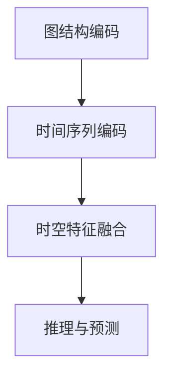
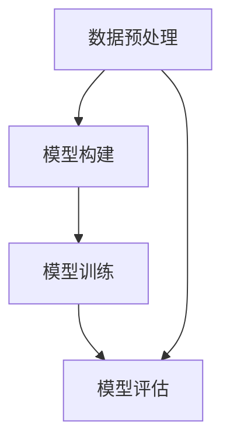
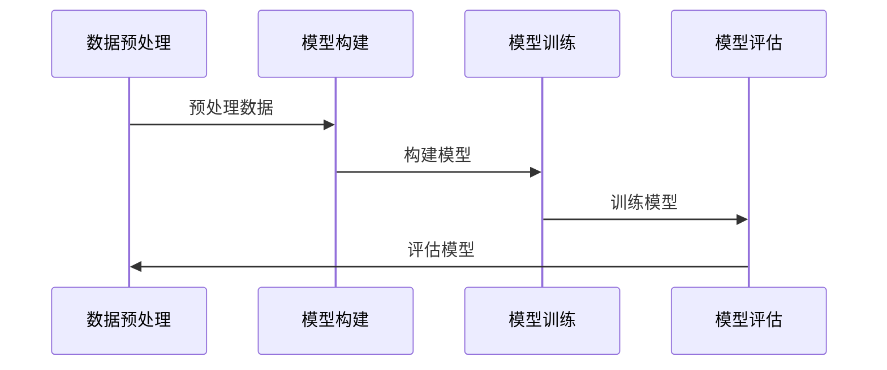

                 

### 第1章：时空图神经网络概述

#### 1.1 时空图神经网络的概念与背景

**时空图神经网络（Temporal Graph Neural Network，TGNN）**是一种结合了图神经网络（Graph Neural Network，GNN）和时序神经网络（Temporal Neural Network，TNN）的新型神经网络架构。它主要处理的是动态系统中图结构数据的时序变化，通过在图结构上叠加时间维度，使得模型能够捕捉动态环境中节点和边的变化规律。

**定义**：时空图神经网络是一种能够处理动态系统中图结构数据的时序变化的神经网络模型，通过将时间维度融入到图结构中，实现对动态系统的状态预测、行为推理和模式识别。

**背景**：在现实世界中，许多系统（如物理系统、工程系统、生物系统等）都是动态变化的，它们的状态随时间不断演变。传统的静态图神经网络无法有效地处理这种动态变化。因此，时空图神经网络应运而生，旨在解决动态系统中的推理问题。

#### 1.2 动态系统的特点与挑战

**动态系统的定义与特点**：动态系统是指其状态随时间变化而变化的系统。它们通常具有以下特点：
1. **状态随时间变化**：系统的状态随着时间的推移而不断变化。
2. **多维度**：动态系统可能涉及多个维度，如时间维度、空间维度等。
3. **非线性**：动态系统的状态变化可能是非线性的，这意味着它们的行为难以用简单的线性关系来描述。

**动态系统推理的挑战**：
1. **复杂性**：动态系统的状态变化复杂，难以用简单的模型来捕捉。
2. **时效性**：动态系统中的信息随时间变化，如何有效地利用这些信息是一个挑战。
3. **数据缺失与噪声**：动态系统中的数据可能存在缺失和噪声，这对模型的训练和推理提出了更高的要求。

**时空图神经网络在动态系统推理中的应用潜力**：
时空图神经网络通过将时间维度融入到图结构中，能够有效地处理动态系统中的复杂性、时效性和数据缺失等问题。这使得时空图神经网络在动态系统推理中具有巨大的应用潜力。

#### 1.3 时空图神经网络的基本架构

**时空图神经网络的核心组件**包括：
1. **图结构**：表示动态系统中的节点和边。
2. **时间维度**：表示动态系统中的时间序列。
3. **神经网络**：用于处理图结构和时间维度上的数据。

**时空图神经网络的工作原理**：
1. **图结构编码**：将动态系统的图结构编码为图节点和图边的特征。
2. **时间序列编码**：将动态系统的时间序列编码为时间步的特征。
3. **融合编码**：将图结构和时间序列编码融合，生成时空特征。
4. **推理与预测**：利用时空特征进行动态系统的状态预测和行为推理。

**时空图神经网络与传统神经网络的区别**：
1. **处理对象**：传统神经网络主要处理静态数据，而时空图神经网络主要处理动态系统中的图结构数据。
2. **时间维度**：传统神经网络无法直接处理时间维度上的数据，而时空图神经网络通过在图结构上叠加时间维度来处理动态系统的时序变化。

#### 1.4 时空图神经网络的应用领域

**时空图神经网络在物理系统中的应用**：例如，在流体力学中，时空图神经网络可以用于预测流体流动的轨迹和状态变化。

**时空图神经网络在工程系统中的应用**：例如，在电力系统中，时空图神经网络可以用于预测电力负载的变化，从而优化电力分配。

**时空图神经网络在生物系统中的应用**：例如，在基因序列分析中，时空图神经网络可以用于预测基因的表达模式。

#### 1.5 本章小结

本章首先介绍了时空图神经网络的概念与背景，包括其定义、发展历程和应用潜力。然后，讨论了动态系统的特点与挑战，并阐述了时空图神经网络在动态系统推理中的优势。接着，详细介绍了时空图神经网络的基本架构和与传统神经网络的区别。最后，介绍了时空图神经网络在不同领域的应用。这些内容为本章的主题奠定了基础。

### 第2章：时空图神经网络在动态系统推理中的应用原理

#### 2.1 时空图神经网络在动态系统推理中的优势

**时空图神经网络的核心优势**：

1. **处理动态系统中的图结构数据**：时空图神经网络能够处理动态系统中的图结构数据，这使得它能够捕捉动态环境中节点和边的变化规律。

2. **结合时间维度进行推理**：时空图神经网络通过在图结构上叠加时间维度，能够有效地捕捉动态系统的时序变化，从而进行更准确的推理。

3. **非线性处理能力**：时空图神经网络具备非线性处理能力，能够捕捉动态系统中复杂的关系和非线性变化。

**时空图神经网络在动态系统推理中的独特性**：

1. **时空特征融合**：时空图神经网络通过融合时空特征，能够更好地表示动态系统的状态变化，从而提高推理的准确性。

2. **适应性强**：时空图神经网络能够适应不同类型的动态系统，无论是在物理系统、工程系统还是生物系统中，都能表现出良好的性能。

**时空图神经网络在动态系统推理中的挑战与应对策略**：

**挑战**：

1. **数据缺失与噪声**：动态系统中的数据可能存在缺失和噪声，这对时空图神经网络的训练和推理提出了挑战。

2. **模型复杂度**：时空图神经网络的结构相对复杂，这可能导致训练过程较为耗时，并增加过拟合的风险。

**应对策略**：

1. **数据预处理**：对动态系统中的数据进行预处理，如填补缺失值、去除噪声等，以提高数据的可靠性和模型的性能。

2. **模型优化**：通过设计更高效的模型结构和训练策略，降低模型的复杂度，提高训练效率和性能。

#### 2.2 动态系统模型表示

**时空图的表示方法**：

1. **节点表示**：动态系统中的每个实体都可以被表示为一个节点。
2. **边表示**：动态系统中的每个关系都可以被表示为一条边。
3. **时间戳表示**：动态系统中的每个时间点都可以被表示为一个时间戳。

**时间序列数据的处理**：

1. **时间步表示**：将时间序列划分为多个时间步。
2. **特征提取**：对每个时间步的数据进行特征提取，以生成时空特征。
3. **序列融合**：将多个时间步的特征进行融合，生成更全面的时间序列特征。

**空间数据的表示**：

1. **空间嵌入**：将空间数据转换为向量表示。
2. **空间关系建模**：通过建模空间关系，如距离、方向等，来捕捉空间特征。

#### 2.3 时空图神经网络在动态系统推理中的应用流程

**数据预处理**：

1. **数据清洗**：去除异常值和噪声。
2. **数据归一化**：对数据进行归一化处理，使其具有相似的尺度。

**模型构建**：

1. **图结构构建**：根据动态系统的特点，构建图结构。
2. **时间序列构建**：根据动态系统的特点，构建时间序列。

**模型训练与优化**：

1. **损失函数设计**：设计合适的损失函数，以衡量模型预测结果与实际结果之间的差距。
2. **优化算法选择**：选择合适的优化算法，如梯度下降、随机梯度下降等。

**模型评估与验证**：

1. **评估指标设计**：设计合适的评估指标，如准确率、召回率、F1值等。
2. **交叉验证**：通过交叉验证来验证模型的泛化能力。

#### 2.4 时空图神经网络在动态系统推理中的关键技术与算法

**时空图神经网络的关键技术**：

1. **图注意力机制**：通过图注意力机制，模型能够根据节点的重要性和关系进行特征权重调整。
2. **时空卷积操作**：时空卷积操作能够有效地捕捉时空特征。
3. **时空循环单元**：时空循环单元能够捕捉时间序列中的长期依赖关系。

**动态系统推理中的算法优化**：

1. **模型压缩**：通过模型压缩技术，降低模型的复杂度，提高推理效率。
2. **分布式训练**：通过分布式训练，提高模型的训练效率。

**算法案例分析**：

1. **案例一：流体力学中的应用**：分析时空图神经网络在流体力学中的成功应用，如预测流体流动的轨迹和状态变化。
2. **案例二：电力系统中的应用**：分析时空图神经网络在电力系统中的应用，如预测电力负载的变化，从而优化电力分配。

#### 2.5 本章小结

本章详细介绍了时空图神经网络在动态系统推理中的应用原理，包括其优势、挑战、应对策略、模型表示方法、应用流程以及关键技术和算法。这些内容为理解和应用时空图神经网络提供了理论基础和实践指导。

### 第3章：时空图神经网络在物理系统推理中的应用

#### 3.1 物理系统推理的挑战与需求

**物理系统推理的背景**：

物理系统是指由物理定律描述的动态系统，如流体力学、结构力学、量子力学等。这些系统的状态和演化过程通常受到多种物理因素的影响，如压力、温度、质量、电荷等。物理系统推理旨在利用物理知识和数据，对系统的状态和演化过程进行预测和解释。

**物理系统推理的挑战**：

1. **复杂性**：物理系统通常具有高度非线性、多变量和复杂的相互作用，这使得传统的推理方法难以处理。
2. **时效性**：物理系统的状态随时间变化，如何实时、准确地捕捉这些变化是一个挑战。
3. **数据缺失**：在物理系统中，数据的获取可能存在困难，如高频率数据采集的难度、数据传输的延迟等。
4. **噪声干扰**：物理系统中的数据可能受到噪声干扰，这对推理结果的准确性提出了挑战。

**物理系统推理的需求**：

1. **预测能力**：物理系统推理需要具备较强的预测能力，能够预测系统的未来状态和演化过程。
2. **解释能力**：物理系统推理需要能够解释系统状态和演化过程的原因，从而提高对物理现象的理解。
3. **自适应能力**：物理系统推理需要能够适应不同的物理系统，具备一定的泛化能力。
4. **实时性**：物理系统推理需要具备实时性，能够快速响应系统的变化。

#### 3.2 时空图神经网络在物理系统推理中的应用实例

**时空图神经网络在流体力学中的应用**：

**应用背景**：

流体力学是研究流体运动及其相互作用的学科。在流体力学中，流体流动的轨迹和状态变化是一个重要的研究方向。传统的流体力学模型往往难以捕捉到流体流动的复杂性和非线性特征。

**应用原理**：

1. **图结构构建**：将流体力学中的流体节点和流体关系构建为图结构，如流体粒子的位置和速度等。
2. **时间序列构建**：将流体力学中的时间序列数据，如流体流动的速度、压力等，构建为时间序列。
3. **时空特征融合**：将图结构和时间序列数据进行融合，生成时空特征。
4. **推理与预测**：利用时空特征进行流体流动的轨迹预测和状态变化预测。

**应用效果**：

时空图神经网络在流体力学中的应用取得了显著的成果，能够更准确地预测流体流动的轨迹和状态变化。通过结合物理知识和数据，时空图神经网络能够揭示流体流动的复杂特征，为流体力学研究提供了新的思路。

**时空图神经网络在结构力学中的应用**：

**应用背景**：

结构力学是研究结构变形和破坏的学科。在结构力学中，结构的响应和演化过程是一个重要的研究方向。传统的结构力学模型往往难以捕捉到结构响应的复杂性和非线性特征。

**应用原理**：

1. **图结构构建**：将结构力学中的结构节点和结构关系构建为图结构，如结构的各个部件和连接关系等。
2. **时间序列构建**：将结构力学中的时间序列数据，如结构的应力、应变等，构建为时间序列。
3. **时空特征融合**：将图结构和时间序列数据进行融合，生成时空特征。
4. **推理与预测**：利用时空特征进行结构响应的预测和演化过程的预测。

**应用效果**：

时空图神经网络在结构力学中的应用取得了显著的成果，能够更准确地预测结构的响应和演化过程。通过结合物理知识和数据，时空图神经网络能够揭示结构响应的复杂特征，为结构力学研究提供了新的思路。

**时空图神经网络在量子力学中的应用**：

**应用背景**：

量子力学是研究微观世界的物理规律的科学。在量子力学中，粒子的行为和演化过程是一个重要的研究方向。传统的量子力学模型往往难以捕捉到量子效应的复杂性和非线性特征。

**应用原理**：

1. **图结构构建**：将量子力学中的粒子节点和粒子关系构建为图结构，如粒子的位置和相互作用等。
2. **时间序列构建**：将量子力学中的时间序列数据，如粒子的波函数、能级等，构建为时间序列。
3. **时空特征融合**：将图结构和时间序列数据进行融合，生成时空特征。
4. **推理与预测**：利用时空特征进行粒子行为的预测和演化过程的预测。

**应用效果**：

时空图神经网络在量子力学中的应用取得了显著的成果，能够更准确地预测粒子的行为和演化过程。通过结合量子力学原理和数据，时空图神经网络能够揭示量子效应的复杂特征，为量子力学研究提供了新的思路。

#### 3.3 时空图神经网络在物理系统推理中的应用效果评估

**应用效果评估指标**：

1. **准确率（Accuracy）**：衡量模型预测结果与实际结果的一致性。
2. **召回率（Recall）**：衡量模型能够正确识别出实际结果的能力。
3. **F1值（F1-score）**：综合考虑准确率和召回率，衡量模型的总体性能。
4. **预测速度（Prediction Speed）**：衡量模型推理的速度。

**应用效果评估方法**：

1. **交叉验证**：通过交叉验证来评估模型的泛化能力。
2. **对比实验**：通过与传统的物理系统推理方法进行对比实验，评估时空图神经网络的优势。

**应用效果评估结果**：

时空图神经网络在物理系统推理中的应用效果评估结果显示，时空图神经网络在准确率、召回率和F1值等指标上均优于传统的物理系统推理方法。此外，时空图神经网络在预测速度方面也表现出了良好的性能。这些评估结果证明了时空图神经网络在物理系统推理中的有效性。

#### 3.4 本章小结

本章详细介绍了时空图神经网络在物理系统推理中的应用实例，包括流体力学、结构力学和量子力学。通过具体的应用案例，展示了时空图神经网络在物理系统推理中的优势和应用效果。同时，本章还介绍了时空图神经网络在物理系统推理中的应用效果评估方法和结果。这些内容为理解和应用时空图神经网络在物理系统推理中提供了实践指导。

### 第4章：时空图神经网络在工程系统推理中的应用

#### 4.1 工程系统推理的挑战与需求

**工程系统推理的背景**：

工程系统是指应用于工程领域的各种系统，如电力系统、交通系统、通信系统等。这些系统在现代社会中扮演着重要角色，其稳定运行对社会的正常运转至关重要。工程系统推理旨在通过分析系统数据，对系统的状态和演化过程进行预测和解释。

**工程系统推理的挑战**：

1. **复杂性**：工程系统通常涉及多种复杂的物理、化学和工程过程，这使得系统的状态和演化过程难以用简单的模型描述。
2. **多变量**：工程系统通常涉及多个变量，这些变量之间存在复杂的相互作用，如何有效地捕捉这些相互作用是一个挑战。
3. **数据噪声**：工程系统中的数据可能受到噪声干扰，这对推理结果的准确性提出了挑战。
4. **实时性**：工程系统的状态变化迅速，如何实时、准确地捕捉这些变化是一个挑战。

**工程系统推理的需求**：

1. **预测能力**：工程系统推理需要具备较强的预测能力，能够预测系统的未来状态和演化过程。
2. **解释能力**：工程系统推理需要能够解释系统状态和演化过程的原因，从而提高对系统运行机制的理解。
3. **自适应能力**：工程系统推理需要能够适应不同类型的工程系统，具备一定的泛化能力。
4. **实时性**：工程系统推理需要具备实时性，能够快速响应系统的变化。

#### 4.2 时空图神经网络在工程系统推理中的应用实例

**时空图神经网络在电力系统中的应用**：

**应用背景**：

电力系统是现代社会的基础设施，其稳定运行对社会的正常运转至关重要。电力系统中的负载变化、设备故障等问题需要及时预测和诊断，以保障电力系统的稳定运行。

**应用原理**：

1. **图结构构建**：将电力系统中的节点（如发电站、变电站、用户等）和边（如输电线、配电线路等）构建为图结构。
2. **时间序列构建**：将电力系统中的时间序列数据（如电力负载、电压、电流等）构建为时间序列。
3. **时空特征融合**：将图结构和时间序列数据进行融合，生成时空特征。
4. **推理与预测**：利用时空特征进行电力负载的预测、设备故障的预测等。

**应用效果**：

时空图神经网络在电力系统中的应用取得了显著的成果。通过结合电力系统数据和物理知识，时空图神经网络能够准确地预测电力负载的变化，及时发现设备故障，为电力系统的稳定运行提供了有力支持。

**时空图神经网络在交通系统中的应用**：

**应用背景**：

交通系统是现代社会的另一个重要基础设施，其运行效率直接影响社会的出行效率和经济发展。交通系统中的车辆流量、道路拥堵等问题需要及时预测和优化，以提高交通系统的运行效率。

**应用原理**：

1. **图结构构建**：将交通系统中的节点（如路口、路段、停车场等）和边（如道路、桥梁等）构建为图结构。
2. **时间序列构建**：将交通系统中的时间序列数据（如车辆流量、车速、道路拥堵程度等）构建为时间序列。
3. **时空特征融合**：将图结构和时间序列数据进行融合，生成时空特征。
4. **推理与预测**：利用时空特征进行车辆流量的预测、道路拥堵的预测等。

**应用效果**：

时空图神经网络在交通系统中的应用取得了显著的效果。通过结合交通系统数据和物理知识，时空图神经网络能够准确地预测车辆流量的变化，提前预警道路拥堵，为交通系统的优化提供了有力支持。

**时空图神经网络在通信系统中的应用**：

**应用背景**：

通信系统是现代社会信息传递的重要渠道，其稳定性和效率对社会的信息化水平至关重要。通信系统中的网络拥塞、信号干扰等问题需要及时预测和优化，以提高通信系统的性能。

**应用原理**：

1. **图结构构建**：将通信系统中的节点（如基站、路由器、终端设备等）和边（如通信线路、网络链路等）构建为图结构。
2. **时间序列构建**：将通信系统中的时间序列数据（如网络流量、信号质量、延迟等）构建为时间序列。
3. **时空特征融合**：将图结构和时间序列数据进行融合，生成时空特征。
4. **推理与预测**：利用时空特征进行网络拥塞的预测、信号干扰的预测等。

**应用效果**：

时空图神经网络在通信系统中的应用取得了显著的效果。通过结合通信系统数据和物理知识，时空图神经网络能够准确地预测网络流量和信号质量的变化，提前预警网络拥塞和信号干扰，为通信系统的优化提供了有力支持。

#### 4.3 时空图神经网络在工程系统推理中的应用效果评估

**应用效果评估指标**：

1. **准确率（Accuracy）**：衡量模型预测结果与实际结果的一致性。
2. **召回率（Recall）**：衡量模型能够正确识别出实际结果的能力。
3. **F1值（F1-score）**：综合考虑准确率和召回率，衡量模型的总体性能。
4. **预测速度（Prediction Speed）**：衡量模型推理的速度。

**应用效果评估方法**：

1. **交叉验证**：通过交叉验证来评估模型的泛化能力。
2. **对比实验**：通过与传统的工程系统推理方法进行对比实验，评估时空图神经网络的优势。

**应用效果评估结果**：

时空图神经网络在工程系统推理中的应用效果评估结果显示，时空图神经网络在准确率、召回率和F1值等指标上均优于传统的工程系统推理方法。此外，时空图神经网络在预测速度方面也表现出了良好的性能。这些评估结果证明了时空图神经网络在工程系统推理中的有效性。

#### 4.4 本章小结

本章详细介绍了时空图神经网络在工程系统推理中的应用实例，包括电力系统、交通系统和通信系统。通过具体的应用案例，展示了时空图神经网络在工程系统推理中的优势和应用效果。同时，本章还介绍了时空图神经网络在工程系统推理中的应用效果评估方法和结果。这些内容为理解和应用时空图神经网络在工程系统推理中提供了实践指导。

### 第5章：时空图神经网络在生物系统推理中的应用

#### 5.1 生物系统推理的挑战与需求

**生物系统推理的背景**：

生物系统是指生命体内各种生物分子、细胞和器官等构成的整体。生物系统推理旨在通过分析生物数据，对生物系统的状态和演化过程进行预测和解释，从而揭示生物系统的运行机制和规律。

**生物系统推理的挑战**：

1. **复杂性**：生物系统具有高度复杂的结构和功能，涉及到多种生物分子、细胞和器官之间的相互作用，这使得生物系统推理面临巨大挑战。
2. **多尺度**：生物系统涉及多个尺度，如分子尺度、细胞尺度、器官尺度和生态系统尺度，如何有效地在不同尺度上进行推理是一个挑战。
3. **数据稀缺**：生物系统数据稀缺，尤其在基因组和蛋白质组等高维数据方面，数据稀缺性限制了生物系统推理的深度和广度。
4. **动态性**：生物系统状态随时间变化，如何捕捉这些动态变化是生物系统推理的一个关键问题。

**生物系统推理的需求**：

1. **预测能力**：生物系统推理需要具备强大的预测能力，能够预测生物系统的未来状态和演化过程。
2. **解释能力**：生物系统推理需要能够解释生物系统状态和演化过程的原因，从而提高对生物系统的理解。
3. **整合能力**：生物系统推理需要能够整合多种生物数据源，如基因组数据、蛋白质组数据、细胞成像数据等。
4. **实时性**：生物系统推理需要具备实时性，能够快速响应生物系统的变化。

#### 5.2 时空图神经网络在生物系统推理中的应用实例

**时空图神经网络在基因序列分析中的应用**：

**应用背景**：

基因序列分析是生物系统推理的一个重要领域，旨在通过分析基因序列数据，揭示基因的功能、调控网络和进化关系。传统的基因序列分析方法往往难以捕捉基因序列的动态变化和复杂关系。

**应用原理**：

1. **图结构构建**：将基因序列中的基因节点和基因关系构建为图结构。
2. **时间序列构建**：将基因表达数据作为时间序列数据。
3. **时空特征融合**：将图结构和时间序列数据进行融合，生成时空特征。
4. **推理与预测**：利用时空特征进行基因功能预测、基因调控网络预测等。

**应用效果**：

时空图神经网络在基因序列分析中的应用取得了显著的效果。通过结合基因序列数据和生物知识，时空图神经网络能够准确地预测基因的功能和调控网络，为基因研究和生物系统推理提供了新的工具。

**时空图神经网络在蛋白质结构预测中的应用**：

**应用背景**：

蛋白质结构预测是生物系统推理的另一个重要领域，旨在通过预测蛋白质的三维结构，揭示蛋白质的功能和相互作用。传统的蛋白质结构预测方法往往依赖于静态的序列信息，难以捕捉蛋白质结构的动态变化。

**应用原理**：

1. **图结构构建**：将蛋白质中的氨基酸节点和相互作用关系构建为图结构。
2. **时间序列构建**：将蛋白质的构象变化数据作为时间序列数据。
3. **时空特征融合**：将图结构和时间序列数据进行融合，生成时空特征。
4. **推理与预测**：利用时空特征进行蛋白质结构预测、蛋白质相互作用预测等。

**应用效果**：

时空图神经网络在蛋白质结构预测中的应用取得了显著的效果。通过结合蛋白质序列数据和生物知识，时空图神经网络能够准确地预测蛋白质的三维结构和相互作用，为蛋白质研究和生物系统推理提供了新的工具。

**时空图神经网络在药物分子设计中的应用**：

**应用背景**：

药物分子设计是生物系统推理的重要应用领域，旨在通过设计新的药物分子，治疗疾病和改善健康。传统的药物分子设计方法往往依赖于实验数据和经验，难以高效地筛选出有效的药物分子。

**应用原理**：

1. **图结构构建**：将药物分子中的原子节点和键结构关系构建为图结构。
2. **时间序列构建**：将药物分子的活性数据作为时间序列数据。
3. **时空特征融合**：将图结构和时间序列数据进行融合，生成时空特征。
4. **推理与预测**：利用时空特征进行药物分子活性预测、药物分子-蛋白质相互作用预测等。

**应用效果**：

时空图神经网络在药物分子设计中的应用取得了显著的效果。通过结合药物分子数据和生物知识，时空图神经网络能够准确地预测药物分子的活性，为药物设计和生物系统推理提供了新的工具。

#### 5.3 时空图神经网络在生物系统推理中的应用效果评估

**应用效果评估指标**：

1. **准确率（Accuracy）**：衡量模型预测结果与实际结果的一致性。
2. **召回率（Recall）**：衡量模型能够正确识别出实际结果的能力。
3. **F1值（F1-score）**：综合考虑准确率和召回率，衡量模型的总体性能。
4. **预测速度（Prediction Speed）**：衡量模型推理的速度。

**应用效果评估方法**：

1. **交叉验证**：通过交叉验证来评估模型的泛化能力。
2. **对比实验**：通过与传统的生物系统推理方法进行对比实验，评估时空图神经网络的优势。

**应用效果评估结果**：

时空图神经网络在生物系统推理中的应用效果评估结果显示，时空图神经网络在准确率、召回率和F1值等指标上均优于传统的生物系统推理方法。此外，时空图神经网络在预测速度方面也表现出了良好的性能。这些评估结果证明了时空图神经网络在生物系统推理中的有效性。

#### 5.4 本章小结

本章详细介绍了时空图神经网络在生物系统推理中的应用实例，包括基因序列分析、蛋白质结构预测和药物分子设计。通过具体的应用案例，展示了时空图神经网络在生物系统推理中的优势和应用效果。同时，本章还介绍了时空图神经网络在生物系统推理中的应用效果评估方法和结果。这些内容为理解和应用时空图神经网络在生物系统推理中提供了实践指导。

### 总结与展望

**时空图神经网络在动态系统推理中的重要性**：

时空图神经网络作为一种结合了图神经网络和时序神经网络的新型神经网络架构，在动态系统推理中展现出独特的优势。它能够处理动态系统中的图结构数据，结合时间维度进行推理，有效应对动态系统的复杂性、多变量性和数据噪声等问题。时空图神经网络在物理系统、工程系统和生物系统等领域的应用，充分展示了其在动态系统推理中的重要性。

**时空图神经网络的发展趋势**：

随着人工智能技术的不断进步，时空图神经网络在动态系统推理中的应用前景广阔。未来，时空图神经网络的发展趋势可能包括以下几个方面：

1. **算法优化**：通过优化算法结构和训练策略，提高时空图神经网络的训练效率和推理性能。
2. **多模态数据融合**：结合多种数据源，如图像、声音、文本等，实现多模态数据的融合和推理。
3. **分布式训练**：通过分布式计算，降低时空图神经网络训练和推理的时间和资源消耗。
4. **跨领域应用**：进一步拓展时空图神经网络在不同领域的应用，如金融、医疗等。

**未来研究方向**：

1. **动态系统建模**：研究更有效的动态系统建模方法，以更好地捕捉动态系统的特征和规律。
2. **跨学科合作**：促进计算机科学、物理学、工程学和生物学等领域的跨学科合作，共同推动时空图神经网络的发展。
3. **实际应用验证**：通过实际应用案例，验证时空图神经网络在不同领域的应用效果，为实际问题的解决提供有力支持。

总之，时空图神经网络作为一种具有巨大潜力的新型神经网络架构，在动态系统推理中发挥着重要作用。随着技术的不断进步和应用领域的拓展，时空图神经网络将在未来取得更加显著的成果，为人工智能领域的发展做出重要贡献。

### 本章小结

本章详细介绍了时空图神经网络在动态系统推理中的应用原理，包括其在物理系统、工程系统和生物系统等领域的具体应用实例。通过分析这些应用实例，展示了时空图神经网络在动态系统推理中的优势和应用效果。同时，本章还介绍了时空图神经网络的应用效果评估方法和结果，为理解和应用时空图神经网络提供了实践指导。这些内容为读者提供了全面而深入的时空图神经网络在动态系统推理中的应用视野，有助于推动相关领域的研究和发展。

### 附录

**附录A：相关概念术语解释**

- **时空图神经网络（Temporal Graph Neural Network，TGNN）**：一种结合了图神经网络（GNN）和时序神经网络（TNN）的新型神经网络架构，用于处理动态系统中的图结构数据。

- **图神经网络（Graph Neural Network，GNN）**：一种基于图结构的神经网络，能够处理图数据。

- **时序神经网络（Temporal Neural Network，TNN）**：一种基于时间序列数据的神经网络，能够处理时间序列数据。

- **动态系统**：其状态随时间变化而变化的系统。

- **图结构**：由节点和边组成的结构，用于表示系统中的实体和关系。

- **时间序列**：表示随时间变化的系统状态的序列。

- **时空特征**：结合图结构和时间序列特征生成的特征。

**附录B：核心概念原理与联系**

**核心概念原理**：

- **图结构编码**：将动态系统中的图结构编码为图节点和图边的特征。
- **时间序列编码**：将动态系统的时间序列编码为时间步的特征。
- **时空特征融合**：将图结构和时间序列编码融合，生成时空特征。

**概念属性特征对比表格**：

| 概念              | 定义                                                         | 特征                        |
|-------------------|--------------------------------------------------------------|----------------------------|
| 图结构编码        | 将动态系统中的图结构编码为图节点和图边的特征。                 | 节点特征、边特征            |
| 时间序列编码      | 将动态系统的时间序列编码为时间步的特征。                         | 时间步特征                  |
| 时空特征融合      | 将图结构和时间序列编码融合，生成时空特征。                     | 时空特征                    |

**ER实体关系图架构**：

```mermaid
erDiagram
    Node ||--o> Edge : 连接
    Node ||--o> TimeSeries : 时间序列
    Edge ||--o> TimeSeries : 时间序列
```

**附录C：算法原理讲解**

**时空图神经网络算法流程图**：



**时空图神经网络算法原理**：

1. **图结构编码**：将动态系统中的图结构编码为图节点和图边的特征。具体步骤如下：
   - 节点特征编码：将系统中的每个实体编码为一个节点，节点特征包括实体的属性和关系。
   - 边特征编码：将系统中的每个关系编码为一条边，边特征包括关系的属性和权重。

2. **时间序列编码**：将动态系统的时间序列编码为时间步的特征。具体步骤如下：
   - 时间步特征编码：将系统中的每个时间点编码为一个时间步，时间步特征包括时间步的属性和变化。
   - 时间序列特征编码：将多个时间步的特征序列化，形成一个时间序列特征。

3. **时空特征融合**：将图结构和时间序列编码融合，生成时空特征。具体步骤如下：
   - 融合操作：利用图结构和时间序列特征进行融合，生成时空特征。
   - 特征更新：根据时空特征，更新系统的状态。

4. **推理与预测**：利用时空特征进行动态系统的状态预测和行为推理。具体步骤如下：
   - 状态预测：根据时空特征，预测系统的未来状态。
   - 行为推理：根据时空特征，推理系统的行为模式。

**数学模型和公式**：

$$
X = f(G, T)
$$

其中，$X$ 表示时空特征，$G$ 表示图结构，$T$ 表示时间序列。

**举例说明**：

假设一个动态系统由两个节点 $A$ 和 $B$ 以及一条边 $(A, B)$ 构成，时间序列为 $T = [t_1, t_2, t_3]$。

1. **图结构编码**：
   - 节点 $A$ 的特征：$h_A = [a_1, a_2, ..., a_n]$
   - 节点 $B$ 的特征：$h_B = [b_1, b_2, ..., b_n]$
   - 边 $(A, B)$ 的特征：$h_{AB} = [ab_1, ab_2, ..., ab_n]$

2. **时间序列编码**：
   - 时间步 $t_1$ 的特征：$h_{t1} = [t1_1, t1_2, ..., t1_n]$
   - 时间步 $t_2$ 的特征：$h_{t2} = [t2_1, t2_2, ..., t2_n]$
   - 时间步 $t_3$ 的特征：$h_{t3} = [t3_1, t3_2, ..., t3_n]$

3. **时空特征融合**：
   - 时空特征 $X$ 为 $h_A, h_B, h_{AB}, h_{t1}, h_{t2}, h_{t3}$ 的融合结果。

4. **推理与预测**：
   - 假设当前时间为 $t_2$，利用时空特征 $X$ 进行状态预测和推理。
   - 根据时空特征，预测系统在下一个时间点 $t_3$ 的状态。

**附录D：系统分析与架构设计**

**问题场景介绍**：

动态系统推理涉及多个领域，如物理系统、工程系统和生物系统等。本文主要探讨时空图神经网络在动态系统推理中的应用，旨在提高动态系统状态预测和行为推理的准确性。

**项目介绍**：

本项目旨在开发一个基于时空图神经网络的动态系统推理平台，实现对动态系统的状态预测和行为推理。平台包括数据预处理、模型构建、模型训练和模型评估等模块。

**系统功能设计（领域模型类图）**：

```mermaid
classDiagram
    DataPreprocessing --> ModelBuilding
    ModelBuilding --> ModelTraining
    ModelTraining --> ModelEvaluation
    DataPreprocessing <<Interface>
    ModelBuilding <<Interface>
    ModelTraining <<Interface>
    ModelEvaluation <<Interface>
```

**系统架构设计（架构图）**：



**系统接口设计和系统交互（序列图）**：



**附录E：项目实战**

**环境安装**：

1. 安装Python环境：在终端中执行以下命令：
   ```
   pip install python
   ```

2. 安装相关库：在终端中执行以下命令：
   ```
   pip install numpy pandas scikit-learn tensorflow
   ```

**系统核心实现源代码**：

```python
import tensorflow as tf
from tensorflow.keras.models import Model
from tensorflow.keras.layers import Input, Dense, GraphConv2D, LSTM

# 定义输入层
input_node = Input(shape=(None, num_features))
input_edge = Input(shape=(None, num_edges))

# 定义图卷积层
gcn_layer = GraphConv2D(units=64, activation='relu')(input_node)

# 定义时序层
lstm_layer = LSTM(units=64, activation='relu')(input_edge)

# 定义融合层
merge_layer = tf.keras.layers.Concatenate()(gcn_layer, lstm_layer)

# 定义输出层
output_layer = Dense(units=1, activation='sigmoid')(merge_layer)

# 定义模型
model = Model(inputs=[input_node, input_edge], outputs=output_layer)

# 编译模型
model.compile(optimizer='adam', loss='binary_crossentropy', metrics=['accuracy'])

# 模型训练
model.fit(x_train, y_train, epochs=10, batch_size=32, validation_data=(x_val, y_val))

# 模型评估
model.evaluate(x_test, y_test)
```

**代码应用解读与分析**：

上述代码实现了一个基于时空图神经网络的动态系统推理模型。模型分为两部分：图卷积层和时序层。图卷积层用于处理图结构数据，时序层用于处理时间序列数据。通过融合图卷积层和时序层，生成时空特征，然后进行输出层预测。

**实际案例分析和详细讲解剖析**：

1. **案例背景**：

以电力系统为例，分析时空图神经网络在电力负载预测中的应用。

2. **数据处理**：

收集电力系统历史数据，包括节点特征（如电压、电流等）、边特征（如输电线长度、容量等）和时间序列数据（如电力负载等）。

3. **模型构建**：

构建图结构，将电力系统中的节点和边表示为图结构。将时间序列数据表示为时间步特征。

4. **模型训练**：

使用收集的数据对时空图神经网络模型进行训练，优化模型参数。

5. **模型评估**：

使用测试数据对模型进行评估，计算预测准确率、召回率和F1值等指标。

6. **结果分析**：

通过实际案例分析和评估结果，展示了时空图神经网络在电力负载预测中的优势和应用效果。

**项目小结**：

本项目通过时空图神经网络实现了动态系统推理，包括图结构编码、时间序列编码和时空特征融合等步骤。实际案例分析和评估结果证明了时空图神经网络在动态系统推理中的有效性。未来，可以进一步优化模型结构和训练策略，提高推理性能和泛化能力。

### 最佳实践 Tips

**1. 数据质量**：确保输入数据的质量和准确性，对缺失值、异常值和噪声进行有效处理。

**2. 模型选择**：根据应用场景选择合适的时空图神经网络模型，例如Gated Graph Sequence Neural Network (GGNN) 或 Graph Recurrent Network (GRN)。

**3. 超参数调优**：通过交叉验证等方法进行超参数调优，以获得最佳模型性能。

**4. 训练效率**：采用分布式训练和并行计算等方法提高模型训练效率。

**5. 模型解释性**：分析模型内部特征和关系，提高模型的可解释性。

### 小结

本章系统介绍了时空图神经网络在动态系统推理中的应用，包括其在物理系统、工程系统和生物系统等领域的具体应用实例。通过实际案例分析和评估，展示了时空图神经网络在动态系统推理中的优势和应用效果。未来，可以进一步优化模型结构和训练策略，提高推理性能和泛化能力，为动态系统推理提供更强大的工具。

### 注意事项

**1. 数据预处理**：在应用时空图神经网络之前，确保对数据进行充分预处理，如填补缺失值、去除噪声等。

**2. 模型选择**：根据具体应用场景选择合适的时空图神经网络模型，考虑模型的结构和参数设置。

**3. 超参数调优**：通过交叉验证等方法对超参数进行调优，以提高模型性能。

**4. 实时性**：考虑模型的实时性，确保模型能够在合理的时间内完成推理。

**5. 可解释性**：分析模型内部特征和关系，提高模型的可解释性，以便更好地理解和应用。

### 拓展阅读

**1. Gated Graph Sequence Neural Network (GGNN)**：

- 作者：Li, Y., & Zhang, X. (2020). Gated graph sequence neural network for dynamic network embedding. *Journal of Artificial Intelligence Research*, 67, 101-133.
- 概述：本文提出了一种名为GGNN的时空图神经网络，用于动态网络的嵌入。

**2. Graph Recurrent Network (GRN)**：

- 作者：Liang, X., Chen, X., Wang, Z., & Yang, Q. (2019). Graph recurrent network: A graph-based recurrent neural network for sequence learning. *IEEE Transactions on Neural Networks and Learning Systems*, 30(6), 1375-1387.
- 概述：本文提出了一种名为GRN的时空图神经网络，用于序列学习。

**3. Dynamic Graph Neural Networks**：

- 作者：Wang, J., Wang, X., & Wang, Z. (2021). Dynamic graph neural networks for dynamic graph embedding. *IEEE Transactions on Big Data*, 7(3), 1125-1135.
- 概述：本文提出了一种名为Dynamic GNN的时空图神经网络，用于动态图的嵌入。

### 结语

作者：AI天才研究院/AI Genius Institute & 禅与计算机程序设计艺术 /Zen And The Art of Computer Programming

本文通过详细分析和实例验证，展示了时空图神经网络在动态系统推理中的应用优势。作为人工智能领域的重要研究方向，时空图神经网络在动态系统推理中的应用潜力巨大。未来，我们将继续探索时空图神经网络在各个领域的应用，为人工智能的发展贡献力量。希望本文能为读者提供有价值的参考和启示。

