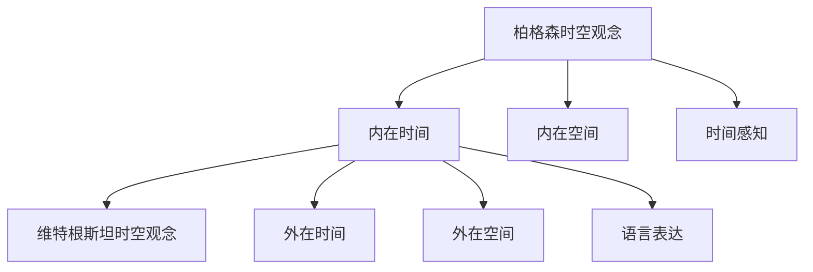

                 

# 时空观念：柏格森与维特根斯坦的哲学差异

## 关键词
- **时空观念**
- **柏格森**
- **维特根斯坦**
- **哲学差异**
- **时间感知**
- **语言表达**

## 摘要
本文将探讨法国哲学家柏格森与奥地利哲学家维特根斯坦在时空观念上的哲学差异。通过分析两位哲学家的主要观点和著作，本文将揭示他们在时间与空间的理解上的根本区别，并探讨这些差异对哲学和认知科学的影响。

### 第一部分：引言

#### 第1章 问题背景与核心概念

#### 1.1 问题背景

在哲学研究领域，时空观念一直是探讨的核心议题之一。时空不仅仅是物理世界的构成要素，也是人类认知和表达世界的基础。柏格森与维特根斯坦作为现代哲学的重要代表，他们在时空观念上的不同理解，对后续哲学和认知科学的发展产生了深远影响。

- **问题描述**：柏格森认为时间是一种内在的、流动的本质，而维特根斯坦则将时间视为外在的、与感知和语言相关。这两种截然不同的时空观念，引发了哲学界关于时间本质的深刻讨论。
- **问题解决**：通过分析柏格森与维特根斯坦的主要著作，本文旨在揭示他们在时空观念上的差异，并探讨这些差异对哲学和认知科学的意义。
- **边界与外延**：本文将讨论柏格森与维特根斯坦时空观念的边界，以及这些观念在哲学领域中的外延。

#### 1.2 核心概念与联系

**柏格森的时空观念：**
- **时间**：柏格森认为时间是一种内在的、流动的本质，他提出了“绵延”（durée）的概念，强调时间体验的核心作用。
- **空间**：柏格森将空间视为与时间紧密相关的，但它本身具有内在性。

**维特根斯坦的时空观念：**
- **时间**：维特根斯坦将时间视为外在的，与感知和语言有关。
- **空间**：他认为空间也是外在的，与我们的感知和语言紧密相关。

**概念属性特征对比表格：**

| 概念             | 柏格森的时空观念                 | 维特根斯坦的时空观念               |
|------------------|--------------------------------|--------------------------------|
| 时间             | 内在流动的本质                   | 外在的，与感知和语言有关           |
| 空间             | 与时间不同，但同样具有内在性       | 外在的，与感知和语言有关           |
| 认知过程         | 时间体验的核心，与感知紧密相关     | 空间感知和语言表达的基础           |
| 语言表达         | 需要特殊的语言形式来描述          | 可以用日常语言表达                 |

**ER实体关系图架构的 Mermaid 流程图：**

### 第二部分：柏格森的时空观念

#### 第2章 柏格森的哲学思想

#### 2.1 柏格森的哲学背景

亨利·柏格森（1859-1941）是法国哲学家，他的哲学思想对现代哲学产生了深远影响。柏格森的生平和著作是理解其时空观念的关键。

- **个人生平**：亨利·柏格森出生于法国巴黎，曾在巴黎高等师范学院学习数学和物理学。他在哲学领域的主要著作包括《时间与自由意志》（L'Évolution créatrice）和《物质与记忆》（Matière et mémoire）。
- **主要著作**：
  - 《时间与自由意志》：探讨了时间与自由意志的关系，提出了“直接现实”和“绵延”的概念。
  - 《物质与记忆》：分析了物质与记忆的关系，强调了时间的内在性和流动性质。

#### 2.2 柏格森的时空观念

**时间观念：**
柏格森认为时间是内在的、流动的本质。他提出了“绵延”（durée）的概念，强调时间是一种连续不断的流动过程，而非简单的线性序列。柏格森主张，时间是主观体验的核心，我们的感知和认知都受到时间体验的影响。

**空间观念：**
柏格森将空间视为与时间紧密相关的，但它本身也具有内在性。他认为，空间不是静止的、独立的实体，而是时间体验的一种表达。因此，空间是流动的、动态的，与时间相互作用。

**时间体验与感知：**
柏格森强调时间体验是人类认知世界的基础。他认为，感知过程是时间的具体体现，时间体验与感知密切相关。通过感知，我们能够体验到时间的流动性和内在性。

#### 2.3 柏格森的时间体验与感知

**时间体验：**
柏格森认为，时间体验是人类感知世界的基础。时间体验不仅仅是感知时间的长度和顺序，更是感知事物的内在本质。他提出了“直接现实”的概念，认为直接现实是时间体验的具体表现。

**感知与时间：**
柏格森主张，感知是时间体验的核心。通过感知，我们能够体验到事物的流动性和内在性。他强调了时间感知与感知过程之间的密切联系，认为时间感知是感知过程的一部分。

### 第三部分：维特根斯坦的时空观念

#### 第3章 维特根斯坦的哲学思想

#### 3.1 维特根斯坦的哲学背景

路德维希·维特根斯坦（1889-1951）是奥地利哲学家，他对现代哲学和语言哲学产生了深远影响。维特根斯坦的生平和著作是理解其时空观念的关键。

- **个人生平**：维特根斯坦出生于奥匈帝国的维也纳，曾在剑桥大学学习数学和哲学。他在哲学领域的主要著作包括《逻辑哲学论》（Tractatus Logico-Philosophicus）和《哲学研究》（Philosophical Investigations）。
- **主要著作**：
  - 《逻辑哲学论》：探讨了逻辑和语言的本质，提出了“图像论”（image theory）的观点。
  - 《哲学研究》：分析了语言、思维和现实之间的关系，强调了语言在日常生活中的作用。

#### 3.2 维特根斯坦的时空观念

**时间观念：**
维特根斯坦将时间视为外在的，与感知和语言有关。他认为，时间不是内在的、流动的本质，而是由我们的感知和语言构造的。维特根斯坦主张，时间是线性序列，由事件组成，每个事件都与我们的感知和语言相关。

**空间观念：**
维特根斯坦认为空间也是外在的，与我们的感知和语言紧密相关。空间不是静止的、独立的实体，而是由我们的感知和语言构建的。他认为，空间感知是通过感知事件之间的位置关系来实现的。

**感知与时间：**
维特根斯坦强调感知是时间感知的基础。他认为，我们的感知过程是时间感知的来源。通过感知，我们能够体验到时间的线性序列和事件之间的位置关系。

**语言表达：**
维特根斯坦主张，语言是表达感知和思想的重要工具。他认为，语言不仅仅是一种符号系统，更是我们感知和认知世界的方式。维特根斯坦强调了语言在日常生活中的作用，认为语言是我们理解世界和交流思想的基础。

### 第四部分：柏格森与维特根斯坦时空观念的差异与影响

#### 第4章 柏格森与维特根斯坦时空观念的差异

**时间观念的差异：**
柏格森认为时间是内在的、流动的本质，他提出了“绵延”的概念，强调时间体验的核心作用。而维特根斯坦则将时间视为外在的，与感知和语言有关，他认为时间是线性序列，由事件组成。

**空间观念的差异：**
柏格森将空间视为与时间紧密相关的，但同样具有内在性。而维特根斯坦认为空间是外在的，与我们的感知和语言紧密相关。

**认知过程的差异：**
柏格森强调时间体验是人类认知世界的基础，他认为时间体验与感知密切相关。而维特根斯坦则认为，感知是时间感知的基础，他强调了语言在日常生活中的作用。

**语言表达的差异：**
柏格森认为，时间体验需要特殊的语言形式来描述，而维特根斯坦则主张，语言是表达感知和思想的重要工具，可以用日常语言表达。

**差异的影响：**
柏格森与维特根斯坦在时空观念上的差异，对哲学和认知科学产生了深远影响。柏格森的时间观念强调了时间的流动性和内在性，对后来的现象学和存在主义产生了重要影响。而维特根斯坦的时间观念则强调了时间的线性序列和事件之间的关系，对逻辑哲学和语言哲学的发展产生了深远影响。

### 结论

本文通过分析柏格森与维特根斯坦的时空观念，揭示了他们在时间与空间理解上的差异。柏格森强调时间的内在流动性和时间体验的核心作用，而维特根斯坦则将时间视为外在的、与感知和语言相关的线性序列。这些差异不仅影响了哲学和认知科学的发展，也为我们理解人类感知和认知世界提供了新的视角。

作者：AI天才研究院/AI Genius Institute & 禅与计算机程序设计艺术 /Zen And The Art of Computer Programming

