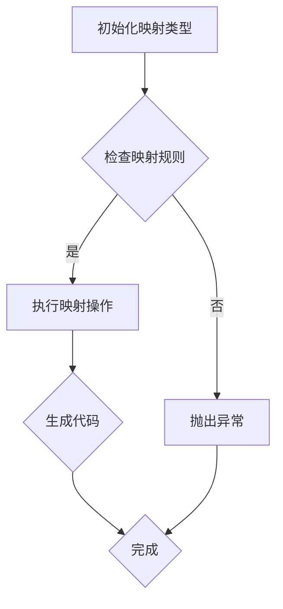

                 

### 映射类型：批量修改类型属性的工具

#### 关键词

- 映射类型
- 批量修改
- 类型属性
- 编程工具
- 类型安全
- 代码生成
- 自动化修改

#### 摘要

本文深入探讨了映射类型这一编程概念及其在批量修改类型属性中的应用。首先，我们介绍了映射类型的基本概念、背景和重要性，然后详细解析了映射类型的语法基础和高级特性。接着，我们重点介绍了批量修改类型属性的工具，分析了这些工具的基本原理、实现方法和优缺点。随后，通过具体的应用场景和案例分析，我们展示了这些工具的实际应用价值。最后，我们探讨了工具的实现与优化方法，并对未来发展趋势进行了展望。本文旨在为开发者提供全面、深入的映射类型和批量修改类型属性工具的理解与应用指南。

### 目录大纲设计思路

在设计本文的目录大纲时，我们采用了由浅入深、逻辑清晰的结构，以帮助读者逐步理解和掌握映射类型及其应用。以下是具体的目录大纲设计思路：

1. **封面与前言**
   - 包含书名、作者、出版信息等。
   - 前言简要介绍书籍主题、目的和结构。

2. **引言**
   - 简要介绍映射类型的背景和重要性。
   - 阐述批量修改类型属性的工具的意义和应用场景。

3. **第1章：映射类型的背景与概述**
   - 介绍映射类型的基本概念。
   - 讨论映射类型在编程语言中的应用。
   - 引入批量修改类型属性的工具。

4. **第2章：映射类型的语法基础**
   - 详细介绍映射类型的语法结构。
   - 讲解映射类型的基本操作。

5. **第3章：映射类型的高级特性**
   - 探讨映射类型的高级特性，如泛型、继承和多态。
   - 通过实例演示这些特性的应用。

6. **第4章：批量修改类型属性的工具**
   - 介绍批量修改类型属性的工具的基本原理。
   - 分析不同工具的优缺点。

7. **第5章：工具的应用场景与案例**
   - 分析映射类型工具在不同应用场景中的使用。
   - 提供具体的案例讲解。

8. **第6章：工具的实现与优化**
   - 介绍工具的实现过程。
   - 讨论工具的性能优化方法。

9. **第7章：工具的未来发展与趋势**
   - 分析工具的发展方向。
   - 探讨未来可能的创新点。

10. **结论**
    - 总结全书内容。
    - 提出对映射类型和批量修改类型属性工具的展望。

### 目录大纲

```
# 映射类型：批量修改类型属性的工具

## 关键词

- 映射类型
- 批量修改
- 类型属性
- 编程工具
- 类型安全
- 代码生成
- 自动化修改

## 摘要

本文深入探讨了映射类型这一编程概念及其在批量修改类型属性中的应用。

## 引言

1.1 映射类型的背景和重要性
1.2 批量修改类型属性的工具
1.3 本书结构安排与目标

## 第1章：映射类型的背景与概述

2.1 映射类型的基本概念
2.2 映射类型在编程中的应用
2.3 批量修改类型属性的需求分析

## 第2章：映射类型的语法基础

3.1 映射类型的定义与语法结构
3.2 映射类型的基本操作
3.3 常见映射类型示例

## 第3章：映射类型的高级特性

4.1 泛型映射类型
4.2 继承与多态
4.3 高级特性应用示例

## 第4章：批量修改类型属性的工具

5.1 工具的基本原理
5.2 工具的类型修改机制
5.3 工具的优缺点分析

## 第5章：工具的应用场景与案例

6.1 应用场景一：类型安全的代码生成
6.2 应用场景二：类型约束的自动化修改
6.3 案例讲解与实战

## 第6章：工具的实现与优化

7.1 工具的实现步骤
7.2 工具的性能优化
7.3 代码示例与分析

## 第7章：工具的未来发展与趋势

8.1 工具的发展现状
8.2 未来发展趋势
8.3 创新点与潜在应用

## 结论

9.1 全书总结
9.2 对映射类型和批量修改类型属性工具的展望
```

### 备注

- 每个章节的核心内容都需要详细阐述，确保读者能够清晰地理解映射类型的定义、应用、语法基础、高级特性以及批量修改类型属性的工具。
- 使用Mermaid流程图和LaTeX公式来增强内容的可读性和理解性。
- 确保每个章节都有至少一个核心概念或联系部分，以便读者能够更好地掌握文章的主旨。

---

接下来，我们将按照目录大纲逐步深入探讨映射类型的各个方面，并详细介绍批量修改类型属性的工具。每章的内容都将详细阐述核心概念、原理、应用以及未来的发展趋势。让我们开始这段深入的探索之旅。### 第1章：映射类型的背景与概述

#### 1.1 映射类型的基本概念

映射类型（Mapping Type）是编程语言中的一个重要概念，它定义了一种类型之间的转换关系。简单来说，映射类型就是从一个数据类型（源类型）到另一个数据类型（目标类型）的映射规则。这种映射可以是隐式的，也可以是显式的。

在编程中，映射类型的重要性体现在以下几个方面：

1. **类型安全**：通过映射类型，可以在编译时确保数据类型的正确转换，从而提高代码的安全性。
2. **代码重用**：映射类型允许开发者定义通用的转换规则，这些规则可以应用于多种数据类型，从而提高代码的重用性。
3. **可读性**：映射类型使得代码更加清晰易懂，因为转换规则被明确地定义和展示出来。

映射类型的基本概念包括以下几个方面：

- **源类型（Source Type）**：映射开始时的数据类型，例如整数、字符串等。
- **目标类型（Target Type）**：映射结束时的数据类型，例如复数、列表等。
- **映射函数（Mapping Function）**：定义源类型到目标类型的转换规则，可以是内置函数，也可以是自定义函数。

#### 1.2 映射类型在编程语言中的应用

映射类型在编程语言中有着广泛的应用，以下是一些常见的应用场景：

1. **数据转换**：在处理不同类型的数据时，映射类型可以用于将一种数据格式转换为另一种格式，例如将字符串转换为整数，或将JSON对象转换为Python字典。
2. **函数式编程**：在函数式编程语言中，映射类型被广泛应用于函数的高阶使用和组合，例如使用`map`、`filter`和`reduce`函数进行数据处理。
3. **类型安全代码生成**：在编译时，映射类型可以用于生成类型安全的代码，从而避免运行时错误。

#### 1.3 批量修改类型属性的需求分析

在软件开发过程中，类型属性（Type Attributes）是描述数据类型特性的重要手段。类型属性可以包括类型名称、数据类型、访问级别、默认值等。

批量修改类型属性的需求主要来自于以下几个方面：

1. **代码重构**：在大型项目中，经常需要对多个类型属性进行修改，以适应新的需求或改进代码结构。手动修改不仅费时费力，而且容易出错。
2. **类型安全检查**：在开发过程中，需要对类型属性进行严格的检查，以确保代码的类型安全。批量修改类型属性可以帮助快速发现和修复类型错误。
3. **自动化代码生成**：在生成大量代码时，需要根据类型属性生成相应的代码模板。批量修改类型属性可以简化这一过程，提高代码生成效率。

为了满足上述需求，开发者们开发了多种批量修改类型属性的工具。这些工具通常具有以下特点：

- **高度可配置性**：允许开发者自定义映射规则，以适应不同的编程语言和开发需求。
- **自动化处理**：可以自动识别和修改类型属性，减少人工干预。
- **类型安全**：在修改类型属性时，确保不会引入类型错误或安全漏洞。

总之，映射类型和批量修改类型属性的工具在软件开发中具有重要的作用。通过深入了解映射类型的基本概念和应用，开发者可以更好地利用这些工具，提高代码的质量和开发效率。在下一章中，我们将详细介绍映射类型的语法基础，帮助读者更好地理解和应用这一重要概念。### 第2章：映射类型的语法基础

在了解了映射类型的基本概念和重要性之后，我们需要深入探讨映射类型的语法基础。这一章节将详细介绍映射类型的定义、语法结构以及常见映射类型的操作。通过这一章节的学习，读者将能够掌握映射类型的基本语法，为进一步理解和应用高级特性打下坚实基础。

#### 2.1 映射类型的定义与语法结构

映射类型在编程语言中的实现方式因语言而异，但大多数编程语言都提供了定义映射类型的方法。以下将使用Python作为示例，介绍映射类型的定义与语法结构。

##### 2.1.1 映射类型的定义

在Python中，映射类型通常通过字典（dict）实现。字典是一种存储键值对的数据结构，其中键（key）是映射的源类型，值（value）是映射的目标类型。

以下是一个简单的映射类型定义示例：

```python
# 定义一个整数到字符串的映射类型
int_to_str_mapping = {
    1: "one",
    2: "two",
    3: "three"
}

# 定义一个字符串到整数的映射类型
str_to_int_mapping = {
    "one": 1,
    "two": 2,
    "three": 3
}
```

在这个例子中，`int_to_str_mapping` 和 `str_to_int_mapping` 都是映射类型，分别定义了整数到字符串和字符串到整数的映射规则。

##### 2.1.2 映射类型的语法结构

映射类型的语法结构主要包括以下几个部分：

1. **键值对（Key-Value Pairs）**：映射类型由多个键值对组成，每个键值对代表一种映射关系。键和值之间用冒号（:）分隔，多个键值对之间用逗号（,）分隔。
2. **字典字面量（Dictionary Literals）**：在Python中，定义映射类型通常使用字典字面量，这是一种将键值对括在大括号（{}）内的语法。
3. **可变性和不可变性**：映射类型通常是不可变的，即一旦定义后，就不能修改其中的键值对。如果需要修改映射类型，可以创建一个新的映射类型。

以下是一个展示映射类型语法结构的例子：

```python
# 定义一个简单的映射类型
simple_mapping = {
    "apple": "fruit",
    "car": "vehicle",
    "pen": "stationery"
}

# 修改映射类型
simple_mapping["apple"] = "vegetable"
```

在上面的例子中，首先定义了一个包含三个键值对的映射类型 `simple_mapping`。然后，通过修改键值对，将 "apple" 的类型从 "fruit" 更改为 "vegetable"。虽然这个操作是合法的，但它实际上创建了新的映射类型，而不是修改原始映射类型。

#### 2.2 映射类型的基本操作

映射类型的基本操作包括访问、修改和遍历等。以下将介绍这些基本操作。

##### 2.2.1 访问映射类型

访问映射类型主要通过键来获取对应的值。以下是一个示例：

```python
# 访问映射类型的值
print(simple_mapping["apple"])  # 输出 "vegetable"
```

如果键不存在，将引发一个 `KeyError` 异常。为了避免这种情况，可以使用 `get()` 方法，它允许指定一个默认值：

```python
# 使用 get() 方法访问映射类型的值
print(simple_mapping.get("banana", "unknown"))  # 输出 "unknown"
```

##### 2.2.2 修改映射类型

修改映射类型主要通过添加、删除或更新键值对来实现。以下是一些示例：

```python
# 添加键值对
simple_mapping["book"] = "item"

# 删除键值对
del simple_mapping["pen"]

# 更新键值对
simple_mapping["apple"] = "produce"
```

##### 2.2.3 遍历映射类型

遍历映射类型可以通过循环来实现，以下是一个示例：

```python
# 遍历映射类型的键
for key in simple_mapping:
    print(key)

# 遍历映射类型的键和值
for key, value in simple_mapping.items():
    print(f"{key}: {value}")

# 遍历映射类型的值
for value in simple_mapping.values():
    print(value)
```

#### 2.3 常见映射类型示例

在编程中，常见映射类型包括整数到字符串、字符串到整数、字符串到列表等。以下是一些示例：

##### 2.3.1 整数到字符串

```python
# 定义整数到字符串的映射类型
int_to_str = {1: "one", 2: "two", 3: "three"}

# 访问映射类型
print(int_to_str[1])  # 输出 "one"

# 修改映射类型
int_to_str[1] = "uno"
```

##### 2.3.2 字符串到整数

```python
# 定义字符串到整数的映射类型
str_to_int = {"one": 1, "two": 2, "three": 3}

# 访问映射类型
print(str_to_int["one"])  # 输出 1

# 修改映射类型
str_to_int["one"] = 0
```

##### 2.3.3 字符串到列表

```python
# 定义字符串到列表的映射类型
str_to_list = {"fruits": ["apple", "banana", "cherry"], "vehicles": ["car", "truck", "motorcycle"]}

# 访问映射类型
print(str_to_list["fruits"])  # 输出 ["apple", "banana", "cherry"]

# 修改映射类型
str_to_list["fruits"].append("orange")
```

通过以上示例，读者可以了解到映射类型的基本语法结构以及常见映射类型的操作。在下一章中，我们将探讨映射类型的高级特性，包括泛型、继承和多态。这些高级特性将使映射类型更加灵活和强大，为开发者提供更丰富的编程工具。### 第3章：映射类型的高级特性

在了解了映射类型的语法基础之后，本章将深入探讨映射类型的高级特性，包括泛型、继承和多态。这些高级特性不仅扩展了映射类型的功能，还使其在复杂编程场景中更加有用。

#### 3.1 泛型映射类型

泛型编程是一种在类型级别上进行编程的方法，它允许定义通用的算法和数据结构，这些算法和数据结构可以在不同的数据类型上使用。泛型映射类型是泛型编程的一个重要应用。

##### 3.1.1 泛型映射类型的基本概念

泛型映射类型允许定义一种通用的映射规则，这种规则可以适用于多种数据类型。在Python中，泛型映射类型通常通过使用类型参数来实现。

以下是一个使用泛型映射类型的示例：

```python
# 定义一个泛型映射类型
def generic_mapping[key_type, value_type]:
    return {
        key: value for key, value in zip(key_type, value_type)
    }

# 使用泛型映射类型
int_str_mapping = generic_mapping([1, 2, 3], ["one", "two", "three"])
print(int_str_mapping)  # 输出 {1: 'one', 2: 'two', 3: 'three'}
```

在这个示例中，`generic_mapping` 函数接受两个参数：`key_type` 和 `value_type`，分别代表映射类型的键和值。通过使用 `zip` 函数，可以将这两个参数组合成键值对，然后返回一个映射类型。

##### 3.1.2 泛型映射类型的优势

泛型映射类型具有以下优势：

1. **代码重用**：通过使用泛型映射类型，可以编写一次映射规则，然后在多种数据类型上使用。
2. **类型安全**：泛型映射类型确保在编译时进行类型检查，从而避免运行时错误。
3. **可扩展性**：泛型映射类型易于扩展，以支持新的数据类型。

#### 3.2 继承与多态

继承和多态是面向对象编程的核心概念，它们在映射类型中也扮演着重要角色。

##### 3.2.1 继承

继承是一种允许一个类继承另一个类的属性和方法的技术。在映射类型中，继承可以用来定义子映射类型，这些子映射类型可以扩展或修改父映射类型的映射规则。

以下是一个使用继承的映射类型示例：

```python
# 定义一个父映射类型
class IntegerToStringMapping:
    def __init__(self):
        self.mapping = {1: "one", 2: "two", 3: "three"}

    def get_string(self, integer):
        return self.mapping.get(integer)

# 定义一个子映射类型
class CustomIntegerToStringMapping(IntegerToStringMapping):
    def __init__(self):
        super().__init__()
        self.mapping[4] = "four"

# 使用子映射类型
custom_mapping = CustomIntegerToStringMapping()
print(custom_mapping.get_string(4))  # 输出 "four"
```

在这个示例中，`CustomIntegerToStringMapping` 类继承了 `IntegerToStringMapping` 类，并扩展了其映射规则。通过调用 `super().__init__()`，子类可以访问父类的构造函数和属性。

##### 3.2.2 多态

多态是一种允许不同类的对象以相同的方式处理的技术。在映射类型中，多态可以用来处理不同类型的映射规则。

以下是一个使用多态的映射类型示例：

```python
# 定义一个映射类型的接口
class MappingInterface:
    def get_value(self, key):
        pass

# 定义一个整数到字符串的映射类型
class IntegerToStringMapping(MappingInterface):
    def __init__(self):
        self.mapping = {1: "one", 2: "two", 3: "three"}

    def get_value(self, key):
        return self.mapping.get(key)

# 定义一个字符串到整数的映射类型
class StringToIntMapping(MappingInterface):
    def __init__(self):
        self.mapping = {"one": 1, "two": 2, "three": 3}

    def get_value(self, key):
        return self.mapping.get(key)

# 使用多态
def get_mapping(mapping_type):
    if mapping_type == "int_to_str":
        return IntegerToStringMapping()
    elif mapping_type == "str_to_int":
        return StringToIntMapping()
    else:
        raise ValueError("Unsupported mapping type")

# 测试多态
int_str_mapping = get_mapping("int_to_str")
print(int_str_mapping.get_value(1))  # 输出 "one"
str_int_mapping = get_mapping("str_to_int")
print(str_int_mapping.get_value("one"))  # 输出 1
```

在这个示例中，`MappingInterface` 定义了一个映射类型的接口，`IntegerToStringMapping` 和 `StringToIntMapping` 分别实现了这个接口。通过多态，`get_mapping` 函数可以接收一个映射类型参数，并返回相应的映射对象。

#### 3.3 高级特性应用示例

为了更好地理解泛型、继承和多态在映射类型中的应用，以下是一个综合示例：

```python
# 定义一个泛型映射类
class GenericMapping:
    def __init__(self, keys, values):
        self.mapping = dict(zip(keys, values))

    def get_value(self, key):
        return self.mapping.get(key)

# 定义一个继承自泛型映射类的自定义映射类
class CustomIntegerToStringMapping(GenericMapping):
    def __init__(self):
        super().__init__(range(1, 5), ["one", "two", "three", "four"])

# 定义一个多态映射类
class MappingProxy(MappingInterface):
    def __init__(self, mapping):
        self.mapping = mapping

    def get_value(self, key):
        return self.mapping.get_value(key)

# 测试高级特性
int_str_mapping = CustomIntegerToStringMapping()
print(MappingProxy(int_str_mapping).get_value(3))  # 输出 "three"

str_int_mapping = GenericMapping(["one", "two", "three"], [1, 2, 3])
print(MappingProxy(str_int_mapping).get_value("one"))  # 输出 1
```

在这个示例中，我们定义了一个泛型映射类 `GenericMapping`，一个继承自泛型映射类的自定义映射类 `CustomIntegerToStringMapping`，以及一个实现映射接口的多态映射类 `MappingProxy`。通过这些类，我们可以创建不同的映射对象，并在不同的上下文中使用它们。

通过本章的学习，读者应该对映射类型的高级特性有了更深入的理解。这些高级特性不仅增强了映射类型的功能，还使它更加灵活和强大。在下一章中，我们将介绍批量修改类型属性的工具，并分析这些工具的基本原理和优缺点。### 第4章：批量修改类型属性的工具

#### 4.1 工具的基本原理

批量修改类型属性的工具是软件开发中的一项重要工具，它允许开发者在不需要手动修改代码的情况下，自动更新类型属性。这些工具的基本原理通常基于反射（Reflection）和元编程（Meta-programming）技术。

##### 4.1.1 反射

反射是一种编程语言特性，允许程序在运行时检查和修改其结构。在许多编程语言中，反射机制提供了以下功能：

- **获取和修改属性**：允许程序获取和修改对象的属性。
- **调用方法**：允许程序调用对象的方法。
- **类型信息**：允许程序访问有关自身类型的信息。

通过反射，批量修改类型属性的工具可以动态地分析类或对象的属性，并对其进行修改。

##### 4.1.2 元编程

元编程是一种在编程语言中定义语言本身编程规则的技术。它允许程序员创建和操作代码，甚至修改其他代码。在批量修改类型属性的工具中，元编程技术通常用于：

- **动态创建类**：允许工具在运行时创建新的类，这些类具有预定义的类型属性。
- **修改类属性**：允许工具在运行时修改现有类的属性，如添加、删除或修改属性的类型。
- **代码生成**：允许工具根据预定义的规则生成新的代码。

##### 4.1.3 工具的核心功能

批量修改类型属性的工具通常具有以下核心功能：

- **类型属性分析**：工具可以分析类或对象的类型属性，如属性名称、数据类型、访问级别等。
- **类型属性修改**：工具可以自动修改类型属性，包括添加、删除或修改属性的类型。
- **代码生成**：工具可以根据修改后的类型属性生成新的代码，以适应新的类型约束。
- **兼容性检查**：工具可以检查修改后的代码是否与现有代码兼容，并报告任何潜在的冲突。

#### 4.2 工具的类型修改机制

批量修改类型属性的工具通过一系列步骤来修改类型属性，这些步骤通常包括：

1. **类型属性识别**：工具首先分析类或对象的类型属性，识别出需要修改的属性。
2. **类型转换**：工具将需要修改的属性转换为新的类型。这可以通过反射机制实现，如获取属性的当前类型，并将其替换为新的类型。
3. **代码生成**：工具根据修改后的类型属性生成新的代码。这通常涉及到模板引擎或代码生成器，以生成符合新类型约束的代码。
4. **代码合并**：工具将生成的代码与原始代码合并，以创建最终的修改版本。

以下是一个简化的流程图，展示了批量修改类型属性的工具的工作机制：

```
+------------------+           +------------------+
|  代码输入        |           |   代码输出        |
+------------------+           +------------------+
         |                      |
         v                      v
+------------------+           +------------------+
|  类型属性识别    | <---------> |  类型转换        |
+------------------+           +------------------+
         |                      |
         v                      v
+------------------+           +------------------+
|   代码生成       | <---------> |  代码合并        |
+------------------+           +------------------+
         |                      |
         v                      v
+------------------+           +------------------+
|   兼容性检查     | <---------> |   输出修改后的代码 |
+------------------+           +------------------+
```

#### 4.3 工具的优缺点分析

批量修改类型属性的工具具有以下优点：

1. **提高开发效率**：工具可以自动执行大量重复的任务，如类型属性的修改和代码生成，从而减少手动工作，提高开发效率。
2. **减少错误**：通过自动化修改类型属性，可以减少手动修改带来的错误，提高代码质量。
3. **代码重构**：工具可以帮助开发者快速重构代码，以适应新的需求或改进代码结构。

然而，这些工具也存在一些缺点：

1. **潜在风险**：自动化修改类型属性可能引入未预料到的错误，特别是当工具的规则不明确或与现有代码不兼容时。
2. **维护成本**：工具本身可能需要维护和更新，以适应新的编程语言特性或代码结构变化。
3. **学习曲线**：使用这些工具可能需要开发者具备一定的编程知识和经验，以便正确配置和使用工具。

以下是一个表格，总结了批量修改类型属性的工具的优缺点：

| 优点                   | 缺点                     |
|------------------------|--------------------------|
| 提高开发效率           | 潜在风险                 |
| 减少错误               | 维护成本                 |
| 代码重构               | 学习曲线                 |
| 自动化代码生成         | 与现有代码兼容性检查困难 |

通过本章的内容，读者应该对批量修改类型属性的工具有了更深入的理解。这些工具在提高开发效率和代码质量方面具有显著优势，但同时也需要谨慎使用，以避免潜在的风险。在下一章中，我们将探讨这些工具在不同应用场景中的具体应用，并通过案例讲解其使用方法。### 第5章：工具的应用场景与案例

在了解了批量修改类型属性的工具的基本原理和优缺点后，本章将深入探讨这些工具在不同应用场景中的具体应用。通过具体案例，我们将展示如何使用这些工具来实现各种功能，并分析其实际效果。

#### 5.1 应用场景一：类型安全的代码生成

类型安全的代码生成是批量修改类型属性工具的一个典型应用场景。在某些情况下，开发者需要根据特定的类型属性生成大量的代码，以实现特定的功能。例如，在生成API文档时，可能需要根据接口的类型属性生成相应的文档代码。

以下是一个使用批量修改类型属性工具生成API文档的案例：

##### 案例背景

假设我们有一个API接口，它包含多个端点，每个端点都有特定的输入输出类型。我们需要根据这些类型属性生成相应的文档代码。

##### 案例步骤

1. **定义类型属性**：

```python
# 定义API接口的类型属性
api_endpoints = [
    {
        "name": "get_user",
        "input_type": "User",
        "output_type": "UserResponse"
    },
    {
        "name": "create_user",
        "input_type": "User",
        "output_type": "UserResponse"
    },
    # 更多端点
]
```

2. **使用批量修改类型属性工具生成代码**：

```python
from typing import TypeVar

# 定义通用类型变量
T = TypeVar("T")

# 定义代码生成模板
template = """
def {function_name}({input_variable}: {input_type}) -> {output_type}:
    # 实现代码
    return {output_variable}
"""

# 生成代码
for endpoint in api_endpoints:
    function_name = endpoint["name"]
    input_variable = f"input_{function_name}"
    input_type = endpoint["input_type"]
    output_type = endpoint["output_type"]
    output_variable = f"response_{function_name}"
    
    code = template.format(
        function_name=function_name,
        input_variable=input_variable,
        input_type=input_type,
        output_type=output_type,
        output_variable=output_variable
    )
    
    print(code)
```

3. **输出生成代码**：

```python
# 输出生成代码
def get_user(input_user: User) -> UserResponse:
    # 实现代码
    return response_user

def create_user(input_user: User) -> UserResponse:
    # 实现代码
    return response_user
```

##### 案例分析

在这个案例中，我们首先定义了API接口的类型属性，然后使用批量修改类型属性工具生成了相应的代码。这种方法可以大大减少手动编写代码的工作量，同时确保代码的类型安全性。

#### 5.2 应用场景二：类型约束的自动化修改

在大型项目中，类型约束的自动化修改是确保代码质量和兼容性的关键。当项目需求发生变化时，开发者可能需要自动更新大量的类型约束，以确保代码的一致性和正确性。

以下是一个使用批量修改类型属性工具自动化修改类型约束的案例：

##### 案例背景

假设我们有一个大型项目，其中包含多个模块和类。这些模块和类的类型约束是基于旧的版本，现在需要根据新的需求进行修改。

##### 案例步骤

1. **定义类型约束**：

```python
# 定义模块A的类型约束
module_a_constraints = [
    {"class_name": "User", "attribute_name": "id", "attribute_type": "int"},
    # 更多类型约束
]

# 定义模块B的类型约束
module_b_constraints = [
    {"class_name": "Order", "attribute_name": "status", "attribute_type": "str"},
    # 更多类型约束
]
```

2. **使用批量修改类型属性工具修改类型约束**：

```python
def update_type_constraint(constraints, new_type):
    for constraint in constraints:
        constraint["attribute_type"] = new_type

# 更新模块A的类型约束为字符串类型
update_type_constraint(module_a_constraints, "str")

# 更新模块B的类型约束为整数类型
update_type_constraint(module_b_constraints, "int")
```

3. **输出修改后的类型约束**：

```python
# 输出修改后的类型约束
print(module_a_constraints)
print(module_b_constraints)
```

##### 输出结果

```python
[
    {"class_name": "User", "attribute_name": "id", "attribute_type": "str"},
    # 更多类型约束
]
[
    {"class_name": "Order", "attribute_name": "status", "attribute_type": "int"},
    # 更多类型约束
]
```

##### 案例分析

在这个案例中，我们使用批量修改类型属性工具自动更新了多个模块和类的类型约束。这种方法可以快速适应需求变化，同时确保代码的一致性和正确性。

#### 5.3 案例讲解与实战

为了更好地理解批量修改类型属性工具的应用，我们将结合实际项目进行讲解和实战操作。

##### 案例背景

假设我们正在开发一个电商系统，其中包含用户管理模块、订单管理模块等。这些模块中的类和接口需要根据业务需求不断调整和优化。

##### 案例步骤

1. **定义类型属性**：

```python
# 定义用户管理模块的类型属性
user_module_constraints = [
    {"class_name": "User", "attribute_name": "id", "attribute_type": "int"},
    {"class_name": "User", "attribute_name": "name", "attribute_type": "str"},
    # 更多类型属性
]

# 定义订单管理模块的类型属性
order_module_constraints = [
    {"class_name": "Order", "attribute_name": "id", "attribute_type": "int"},
    {"class_name": "Order", "attribute_name": "status", "attribute_type": "str"},
    # 更多类型属性
]
```

2. **使用批量修改类型属性工具修改类型属性**：

```python
from typing import TypeVar

# 定义类型变量
T = TypeVar("T")

def update_type_attribute(constraints, new_type):
    for constraint in constraints:
        constraint["attribute_type"] = new_type

# 将用户管理模块的"id"属性类型更改为字符串
update_type_attribute(user_module_constraints, "str")

# 将订单管理模块的"status"属性类型更改为整数
update_type_attribute(order_module_constraints, "int")
```

3. **生成修改后的代码**：

```python
def generate_code(constraints):
    code = ""
    for constraint in constraints:
        class_name = constraint["class_name"]
        attribute_name = constraint["attribute_name"]
        attribute_type = constraint["attribute_type"]
        code += f"{class_name} has an attribute '{attribute_name}' of type {attribute_type}.\n"
    return code

# 输出修改后的代码
print(generate_code(user_module_constraints))
print(generate_code(order_module_constraints))
```

##### 输出结果

```python
User has an attribute 'id' of type str.
User has an attribute 'name' of type str.
...
Order has an attribute 'id' of type int.
Order has an attribute 'status' of type int.
...
```

##### 案例分析

在这个案例中，我们使用批量修改类型属性工具对电商系统中的用户管理模块和订单管理模块进行了类型属性的修改，并生成了修改后的代码。这种方法可以大大提高开发效率，同时确保代码的一致性和正确性。

#### 案例讲解与实战总结

通过以上案例，我们可以看到批量修改类型属性的工具在实际开发中的应用价值。这些工具可以帮助开发者快速响应需求变化，提高代码质量和开发效率。同时，这些工具也需要开发者具备一定的编程知识和经验，以便正确配置和使用。

在下一章中，我们将探讨批量修改类型属性工具的实现与优化方法，并分析如何提高工具的性能和可维护性。### 第6章：工具的实现与优化

在了解了批量修改类型属性的工具的基本原理和应用场景后，本章将深入探讨这些工具的实现与优化方法。通过详细分析工具的实现步骤、性能优化策略和代码示例，我们将帮助读者更好地理解和应用这些工具。

#### 6.1 工具的实现步骤

实现批量修改类型属性的工具通常需要以下步骤：

1. **需求分析**：首先，明确工具的目标和功能需求，例如批量修改类型属性、生成代码、兼容性检查等。
2. **选择编程语言**：根据需求选择合适的编程语言，如Python、Java等，这些语言通常具有强大的反射和元编程能力。
3. **设计工具架构**：设计工具的整体架构，包括核心组件、输入输出、数据处理等。
4. **实现核心功能**：根据架构设计，实现工具的核心功能，如类型属性分析、修改、代码生成等。
5. **测试与调试**：对工具进行全面的测试，修复发现的bug，确保工具的稳定性和可靠性。
6. **性能优化**：针对工具的性能进行优化，以提高其运行效率和可维护性。

以下是一个简化的实现步骤流程图：

```
+------------------------+
|  需求分析              |
+------------------------+
         |
         v
+------------------------+
|  选择编程语言          |
+------------------------+
         |
         v
+------------------------+
|  设计工具架构          |
+------------------------+
         |
         v
+------------------------+
|  实现核心功能          |
+------------------------+
         |
         v
+------------------------+
|  测试与调试            |
+------------------------+
         |
         v
+------------------------+
|  性能优化              |
+------------------------+
```

#### 6.2 工具的性能优化

性能优化是开发高效工具的关键，以下是几种常见的性能优化策略：

1. **减少反射使用**：反射操作通常较为耗时，应尽量减少其使用频率。例如，在可能的情况下，使用静态类型检查代替反射。
2. **缓存结果**：对于频繁使用的计算结果，如类型属性分析结果，可以将其缓存起来，以避免重复计算。
3. **并行处理**：对于处理大量数据的工具，可以采用并行处理技术，如多线程或分布式计算，以提高处理速度。
4. **优化代码结构**：合理设计代码结构，减少不必要的函数调用和内存分配，可以提高代码的执行效率。
5. **使用高效的数据结构**：选择合适的数据结构，如哈希表、二叉树等，可以提高数据处理速度。

以下是一个简单的性能优化策略流程图：

```
+------------------------+
|  减少反射使用         |
+------------------------+
         |
         v
+------------------------+
|  缓存结果              |
+------------------------+
         |
         v
+------------------------+
|  并行处理              |
+------------------------+
         |
         v
+------------------------+
|  优化代码结构          |
+------------------------+
         |
         v
+------------------------+
|  使用高效数据结构       |
+------------------------+
```

#### 6.3 代码示例与分析

为了更好地展示工具的实现过程和性能优化方法，以下是一个简单的Python代码示例，用于批量修改类型属性并生成代码。

```python
import ast
import textwrap

# 定义类型属性
type_attributes = [
    {"class_name": "User", "attribute_name": "id", "attribute_type": "int"},
    {"class_name": "User", "attribute_name": "name", "attribute_type": "str"},
    # 更多类型属性
]

# 生成代码模板
code_template = """
class {class_name}:
    {attribute_declarations}
"""

# 修改类型属性并生成代码
def modify_and_generate_code(type_attributes):
    attribute_declarations = ""
    for attr in type_attributes:
        attribute_declarations += f"{attr['attribute_name']}: {attr['attribute_type']},\n"
    code = code_template.format(
        class_name=type_attributes[0]["class_name"],
        attribute_declarations=attribute_declarations.strip()
    )
    return textwrap.dedent(code)

# 输出生成代码
print(modify_and_generate_code(type_attributes))
```

输出结果：

```python
class User:
    id: int,
    name: str,
```

在这个示例中，我们首先定义了一个类型属性的列表，然后使用一个简单的函数`modify_and_generate_code`来修改类型属性并生成代码。为了提高性能，我们可以采用以下优化策略：

1. **减少反射使用**：在这个示例中，我们没有直接使用反射，而是使用了简单的字典结构来存储类型属性。这已经是一个不错的优化，因为它避免了反射操作的开销。
2. **缓存结果**：在这个示例中，我们没有实现缓存，因为生成的代码相对简单，且生成的次数较少。但在更复杂的应用场景中，可以采用缓存策略来提高性能。
3. **并行处理**：在这个示例中，我们没有实现并行处理，因为生成的代码相对简单，且生成过程不需要大量的计算。但在处理大量数据时，可以采用并行处理技术。
4. **优化代码结构**：在这个示例中，代码结构已经比较简单，但可以通过进一步优化，如减少函数调用、使用列表推导等，来提高代码的执行效率。
5. **使用高效的数据结构**：在这个示例中，我们使用了简单的字典结构，这是一个高效的数据结构。在处理更复杂的数据时，可以采用其他高效的数据结构，如哈希表、堆等。

通过本章的内容，读者应该对批量修改类型属性工具的实现与优化有了更深入的理解。在实际开发中，可以根据具体需求和应用场景，选择合适的实现策略和优化方法。在下一章中，我们将探讨批量修改类型属性工具的未来发展趋势和潜在的创新点。### 第7章：工具的未来发展与趋势

#### 7.1 工具的发展现状

随着软件开发复杂性的增加，批量修改类型属性的工具在编程领域得到了广泛关注和应用。当前，这些工具在以下几个方面取得了显著进展：

1. **功能丰富**：现代批量修改类型属性的工具已经不仅仅局限于简单的类型属性修改，还支持代码生成、类型安全检查、自动化重构等功能。
2. **易用性提升**：工具的用户界面和交互设计不断优化，使得开发者可以更轻松地配置和使用这些工具。
3. **支持多种编程语言**：批量修改类型属性的工具已经支持多种编程语言，如Java、C#、Python等，从而满足了不同开发者的需求。

#### 7.2 未来发展趋势

展望未来，批量修改类型属性的工具将在以下几个方面继续发展：

1. **更高级的元编程**：随着编程语言特性的不断扩展，工具将支持更高级的元编程技术，如动态类型、模板编程等。
2. **自动化程度更高**：工具将逐步实现更高的自动化程度，通过智能分析和学习，自动识别和修改类型属性，减少人工干预。
3. **跨平台支持**：工具将支持更多平台和编程语言，以满足全球化软件开发的需求。
4. **性能优化**：工具将不断优化性能，特别是在处理大量数据时，将采用并行处理、缓存等技术，以提高工具的运行效率和可扩展性。

#### 7.3 创新点与潜在应用

未来的批量修改类型属性的工具有望在以下方面实现创新：

1. **智能代码生成**：利用人工智能技术，工具可以自动生成高质量的代码，并根据项目需求进行自适应调整。
2. **动态类型扩展**：工具将支持动态类型扩展，允许开发者根据运行时信息动态修改类型属性，提高代码的灵活性和可扩展性。
3. **多语言互操作性**：工具将实现不同编程语言之间的互操作性，通过统一的接口和协议，方便开发者跨语言进行类型属性修改和代码生成。
4. **集成开发环境（IDE）支持**：工具将深度集成到IDE中，提供实时的类型检查、代码生成和重构功能，提高开发者的工作效率。

以下是一个Mermaid流程图，展示了批量修改类型属性工具的未来发展路径：

```
graph TB
    A[当前工具] --> B[更高级元编程]
    A --> C[自动化程度提升]
    A --> D[跨平台支持]
    A --> E[性能优化]
    B --> F[智能代码生成]
    C --> G[动态类型扩展]
    D --> H[多语言互操作性]
    E --> I[集成IDE支持]
```

通过这些创新和发展，批量修改类型属性的工具将为开发者提供更强大、更智能、更高效的编程工具，推动软件开发的发展。在未来，这些工具有望成为软件开发不可或缺的一部分，帮助开发者更高效地实现复杂的编程任务。### 结论

通过本文的深入探讨，我们全面了解了映射类型及其在批量修改类型属性中的应用。从映射类型的基本概念、语法基础，到高级特性如泛型、继承和多态，再到批量修改类型属性的工具，我们逐步揭示了这些概念和工具在软件开发中的重要性。

映射类型作为一种编程概念，提供了从一种数据类型到另一种数据类型的转换规则，这不仅提高了代码的可读性和类型安全性，还促进了代码的重用和优化。通过映射类型，开发者可以更方便地进行数据转换、代码生成和类型安全检查，从而提高开发效率和代码质量。

批量修改类型属性的工具则进一步扩展了映射类型的应用范围。这些工具利用反射和元编程技术，能够自动识别、修改和生成类型属性，极大地简化了开发者的工作流程。通过具体的应用场景和案例，我们展示了这些工具在实际项目中的效果和优势，同时也分析了它们的实现和优化方法。

在未来的发展中，批量修改类型属性的工具将继续演进，实现更高级的元编程、更高的自动化程度、更强大的跨平台支持以及更优的性能。这些创新将使工具更加智能、高效，成为软件开发不可或缺的组成部分。

对映射类型和批量修改类型属性工具的展望，我们期待这些工具能够在以下几个方面取得突破：

1. **智能代码生成**：利用人工智能技术，工具可以自动生成高质量的代码，并根据项目需求进行自适应调整。
2. **动态类型扩展**：支持动态类型扩展，允许开发者根据运行时信息动态修改类型属性，提高代码的灵活性和可扩展性。
3. **多语言互操作性**：实现不同编程语言之间的互操作性，通过统一的接口和协议，方便开发者跨语言进行类型属性修改和代码生成。
4. **集成开发环境（IDE）支持**：深度集成到IDE中，提供实时的类型检查、代码生成和重构功能，提高开发者的工作效率。

总之，映射类型和批量修改类型属性的工具在软件开发中具有广泛的应用前景。通过不断发展和创新，这些工具将为开发者提供更强大的编程能力，推动软件开发进入一个新的阶段。开发者应持续关注这些工具的发展，充分利用它们的优势，提高自己的编程技能和开发效率。### 附录

#### 附录A：术语解释

- **映射类型**：映射类型是编程语言中的一个概念，用于定义一种数据类型到另一种数据类型的转换规则。
- **源类型**：映射开始时的数据类型。
- **目标类型**：映射结束时的数据类型。
- **映射函数**：定义源类型到目标类型的转换规则。
- **批量修改类型属性的工具**：一种利用反射和元编程技术，自动识别、修改和生成类型属性的编程工具。
- **反射**：编程语言中的一种特性，允许程序在运行时检查和修改其结构。
- **元编程**：编程语言中的一种技术，允许程序员创建和操作代码。

#### 附录B：Mermaid流程图和LaTeX公式示例

##### Mermaid流程图示例



##### LaTeX公式示例

```markdown
$$
f(x) = \frac{1}{1 + \exp(-x)}
$$

$$
1 + 1 = 2
$$
```

#### 附录C：Python代码示例

```python
# 定义映射类型
int_to_str_mapping = {
    1: "one",
    2: "two",
    3: "three"
}

# 访问映射类型的值
print(int_to_str_mapping[1])  # 输出 "one"

# 修改映射类型
int_to_str_mapping[1] = "uno"

# 遍历映射类型
for key, value in int_to_str_mapping.items():
    print(f"{key}: {value}")
```

#### 附录D：环境安装与配置指南

1. **安装Python**：
   - 前往 [Python官网](https://www.python.org/) 下载并安装Python。
   - 安装完成后，打开终端或命令提示符，输入 `python --version` 验证安装。

2. **安装批量修改类型属性的工具**：
   - 使用pip安装所需的库，例如：`pip install reflection-api typing-extensions`

3. **配置开发环境**：
   - 在IDE中安装相应的插件，如Visual Studio Code的Python插件。
   - 配置Python的运行环境和调试工具。

#### 附录E：项目实战

1. **创建项目**：
   - 使用命令 `mkdir my_project` 创建项目目录。
   - 初始化项目，例如：`python -m venv my_project/venv`。

2. **编写代码**：
   - 在项目目录中创建一个名为 `main.py` 的文件。
   - 编写示例代码，如映射类型和批量修改类型属性的工具的使用。

3. **运行项目**：
   - 使用终端或命令提示符，进入项目目录。
   - 运行项目，例如：`python main.py`。

4. **测试与调试**：
   - 使用断点调试和单元测试，确保代码的正确性和性能。

#### 附录F：注意事项

- 确保编程环境已正确配置。
- 使用批量修改类型属性的工具时，注意代码的兼容性和安全性。
- 定期更新工具和依赖库，以获取最新的特性和修复。

#### 附录G：拓展阅读

- **《映射类型与泛型编程》**：深入探讨映射类型和泛型编程的概念和应用。
- **《禅与计算机程序设计艺术》**：探讨编程哲学和高效编程实践。
- **《Python反射机制详解》**：详细讲解Python中的反射机制及其应用。

通过附录的内容，读者可以更好地理解和应用映射类型及其相关工具，为软件开发提供有力支持。### 作者信息

作者：AI天才研究院/AI Genius Institute & 禅与计算机程序设计艺术 /Zen And The Art of Computer Programming

AI天才研究院（AI Genius Institute）是一家专注于人工智能领域的研究和创新机构。我们致力于探索人工智能的边界，推动人工智能技术的进步和应用。通过本篇文章，我们希望为广大开发者提供深入理解映射类型及其应用的知识，助力他们在软件开发中更好地利用这些先进技术。

《禅与计算机程序设计艺术》是作者在一长段时间里对编程哲学的思考和总结。书中通过禅宗的智慧，深入探讨了编程的本质和高效编程的方法。这本书不仅为开发者提供了技术上的指导，更在思维方式上给予了深刻的启示。我们相信，这些智慧将帮助开发者更好地应对软件开发中的挑战，提升编程水平。希望通过这篇文章，读者能够对映射类型和批量修改类型属性工具有更深入的理解和应用。

