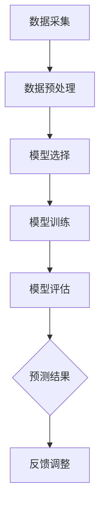
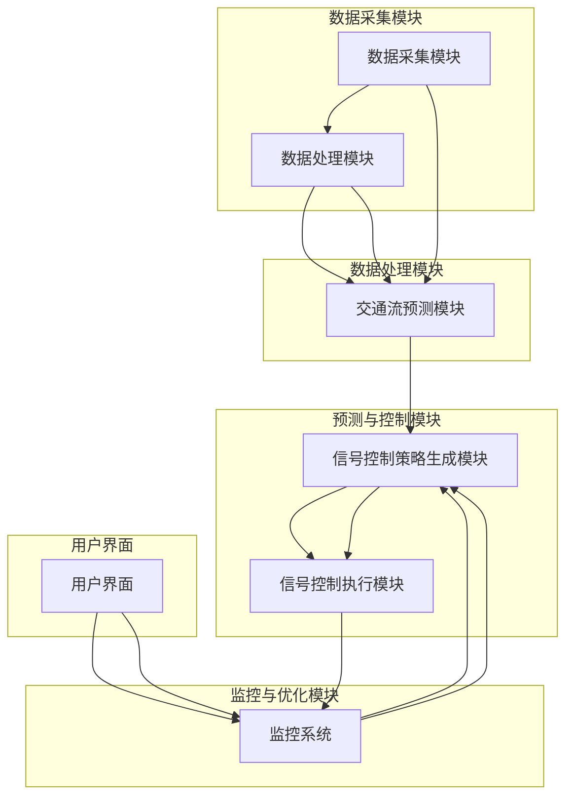
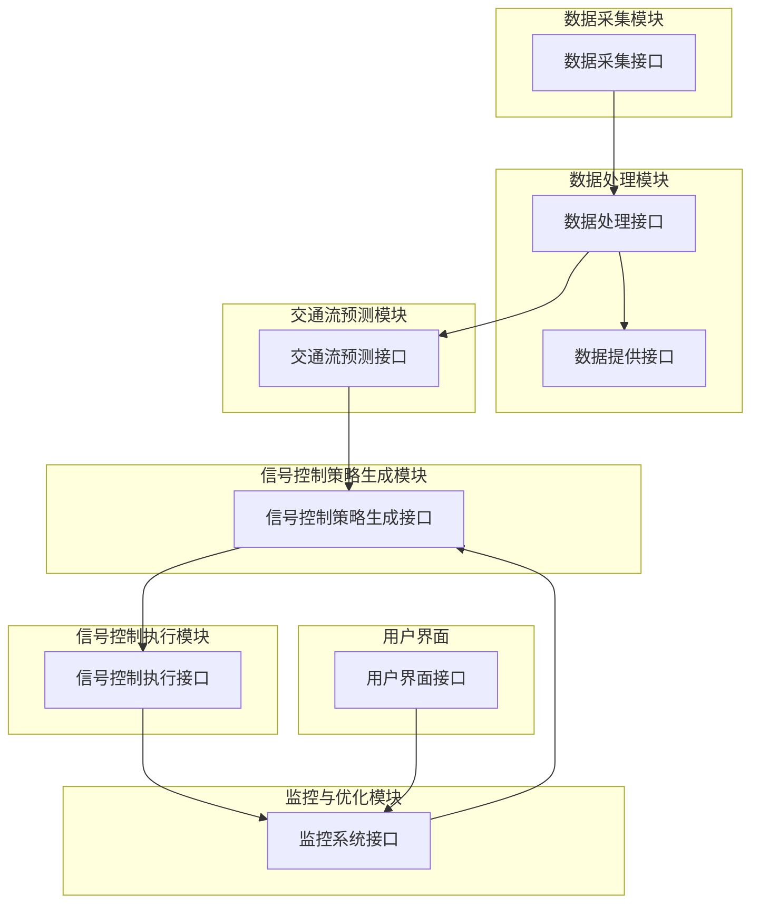
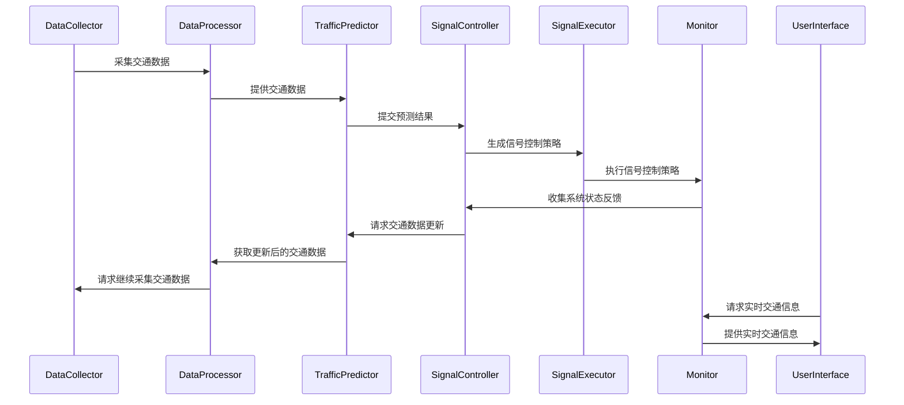

                 

### 引言

在当今快速发展的城市化进程中，城市交通问题日益严峻。交通拥堵、交通事故频发、环境污染等问题严重影响了城市的可持续发展。为了应对这些挑战，智能交通系统（Intelligent Transportation Systems，ITS）逐渐成为研究和应用的热点。智能交通系统利用先进的信息通信技术和人工智能技术，对交通信息进行采集、处理和分析，从而实现对交通流的有效管理和优化。

#### 关键词

- 智能交通系统
- 城市交通流
- 人工智能
- 优化
- 可持续发展

#### 摘要

本文将围绕智能交通系统，深入探讨人工智能（AI）在优化城市交通流方面的应用。首先，我们将介绍智能交通系统的定义、背景和核心组成部分。接着，探讨AI在智能交通系统中的作用及其理论基础。随后，我们将详细分析基于AI的交通流预测方法和交通信号控制方法，并通过具体案例展示AI技术在智能交通系统中的实际应用。最后，本文将总结智能交通系统的发展趋势和未来展望，为相关领域的研究者和从业者提供有价值的参考。

### 目录大纲

1. 引言
   - 1.1 智能交通系统的定义与背景
   - 1.2 AI在优化城市交通流中的作用
   - 1.3 书籍结构概述

2. 智能交通系统概述
   - 2.1 问题背景与定义
   - 2.2 发展历史与现状
   - 2.3 智能交通系统的核心组成部分
   - 2.4 AI在智能交通系统中的应用
   - 2.5 智能交通系统的重要挑战

3. AI优化城市交通流的理论基础
   - 3.1 AI基础理论
   - 3.2 交通流优化理论
   - 3.3 AI与交通流优化的结合
   - 3.4 交通流数据采集与处理

4. 基于AI的交通流预测方法
   - 4.1 交通流预测的基本概念
   - 4.2 常见交通流预测算法
     - 4.2.1 机器学习算法
     - 4.2.2 深度学习算法

5. 基于AI的交通信号控制方法
   - 5.1 交通信号控制的基本概念
   - 5.2 基于AI的交通信号控制方法
     - 5.2.1 系统功能设计
     - 5.2.2 系统架构设计
     - 5.2.3 系统接口设计
     - 5.2.4 系统交互设计

6. AI在智能交通系统中的数据采集与处理
   - 6.1 数据采集
   - 6.2 数据处理
   - 6.3 数据存储与共享

7. 智能交通系统案例分析
   - 7.1 案例背景与目标
   - 7.2 项目环境搭建
   - 7.3 系统核心实现
   - 7.4 案例分析
   - 7.5 项目小结

8. 未来发展趋势与展望
   - 8.1 智能交通系统的发展趋势
   - 8.2 AI优化交通流的未来方向
   - 8.3 最佳实践与注意事项
   - 8.4 拓展阅读

### 1.1 智能交通系统的定义与背景

#### 1.1.1 问题背景

随着城市化的快速发展，城市交通系统面临着前所未有的压力。根据世界卫生组织（WHO）的数据，全球约有50%的人口居住在城市，这一比例预计到2050年将上升到68%。城市交通问题不仅影响人们的日常生活质量，还对城市的经济、环境和社会发展产生深远影响。以下是城市交通面临的几个主要问题：

- **交通拥堵**：城市交通拥堵是全球性问题，导致通勤时间延长，降低了工作效率和生活质量。
- **交通事故**：交通拥堵和车辆密度增加导致交通事故频发，严重威胁人们的生命安全。
- **环境污染**：汽车尾气排放是城市环境污染的主要来源之一，对大气环境和人类健康造成负面影响。
- **能源消耗**：城市交通系统对化石燃料的依赖导致能源消耗巨大，加剧了全球能源危机。

#### 1.1.2 问题描述

城市交通问题表现为以下几个方面：

- **交通流量分布不均**：在某些时段或路段，交通流量可能达到饱和状态，而在其他时段或路段，交通流量却非常稀疏。
- **信号灯控制效率低下**：传统的交通信号灯控制策略往往不能动态适应交通流量变化，导致交通拥堵。
- **信息不透明**：交通信息的获取和处理存在滞后性，导致驾驶员无法及时调整行车路线。
- **基础设施不足**：城市交通基础设施的容量无法满足快速增长的城市交通需求。

#### 1.1.3 智能交通系统的定义

智能交通系统是指利用先进的信息通信技术、传感器技术、控制技术和人工智能技术，对交通信息进行采集、处理、分析和应用，从而实现对交通流的有效管理和优化的一套系统。智能交通系统主要包括以下几个核心组成部分：

- **交通信息采集系统**：通过传感器、摄像头、GPS等设备实时采集交通流量、速度、密度等数据。
- **数据处理与分析系统**：利用大数据分析和人工智能算法，对采集到的交通数据进行处理和分析，生成交通流量预测、交通信号控制策略等。
- **交通信号控制系统**：通过智能交通信号控制系统，动态调整交通信号灯时长，优化交通流量。
- **交通信息服务系统**：为驾驶员提供实时交通信息，帮助其选择最优的行驶路线。

#### 1.1.4 智能交通系统的核心组成部分

智能交通系统由多个子系统组成，每个子系统都在优化交通流方面发挥重要作用。以下是智能交通系统的核心组成部分：

- **交通监测系统**：通过传感器、摄像头等设备，实时监测交通流量、速度、密度等信息。
- **交通信号控制系统**：利用人工智能算法，动态调整交通信号灯时长，优化交通流量。
- **车辆管理系统**：通过车辆定位技术和通信系统，实现对车辆的实时监控和管理。
- **公共交通系统**：利用智能交通系统，优化公共交通线路和班次，提高公共交通服务质量。
- **交通信息发布系统**：通过互联网、手机APP等渠道，为驾驶员提供实时交通信息，帮助其选择最优的行驶路线。

#### 1.1.5 智能交通系统的重要挑战

智能交通系统在实施过程中面临诸多挑战：

- **数据采集和处理**：交通数据量大，数据质量参差不齐，如何高效地采集和处理交通数据成为一大挑战。
- **算法模型**：交通流预测和信号控制算法需要具备较高的准确性和实时性，如何设计高效的算法模型成为关键。
- **基础设施**：智能交通系统需要大量的传感器、摄像头等硬件设备，如何建设完善的基础设施成为难点。
- **政策与法规**：智能交通系统的实施需要相应的政策支持和法律法规保障，如何制定合理的政策法规成为挑战。

通过以上对智能交通系统的定义、背景和核心组成部分的介绍，我们为后续章节的深入探讨奠定了基础。接下来，我们将探讨AI在优化城市交通流中的作用，以及智能交通系统的发展历史与现状。

### 1.2 AI在优化城市交通流中的作用

#### 1.2.1 AI基础理论

人工智能（AI，Artificial Intelligence）是计算机科学的一个分支，旨在研究如何构建智能体（agent），使其能够像人类一样感知环境、理解语言、学习知识、解决问题和执行任务。AI的核心包括以下几个主要领域：

- **机器学习（Machine Learning）**：通过训练算法，使计算机能够从数据中学习规律和模式，进行预测和决策。
- **深度学习（Deep Learning）**：基于神经网络，特别是深度神经网络（DNN），通过多层非线性变换，实现对复杂数据的分析和处理。
- **自然语言处理（Natural Language Processing，NLP）**：研究如何使计算机理解和生成人类语言，实现人机交互。
- **计算机视觉（Computer Vision）**：使计算机能够从图像和视频中提取信息，进行物体识别、场景理解等任务。

#### 1.2.2 AI与交通流优化的结合

AI在智能交通系统中的应用主要体现在以下几个方面：

- **交通流预测**：通过分析历史交通数据和实时数据，利用机器学习和深度学习算法预测未来交通流量和交通状况，为交通管理和控制提供数据支持。
- **交通信号控制**：基于AI算法，动态调整交通信号灯的时长，优化交通流量，减少拥堵和排放。
- **车辆管理**：利用AI技术对车辆进行智能调度和监控，提高道路利用率，减少交通事故。
- **交通信息服务**：通过AI技术，提供个性化的交通信息服务，帮助驾驶员选择最优行驶路线，减少交通拥堵。

#### 1.2.3 AI优化交通流的潜在应用场景

AI技术可以在以下场景中优化城市交通流：

- **智能交通信号控制**：通过实时交通数据，动态调整信号灯时长，实现交通流量优化。
- **智能交通监测**：利用计算机视觉技术，实时监控道路状况，自动检测交通事件，提高交通管理的准确性和实时性。
- **智能公共交通**：通过大数据分析和AI算法，优化公交线路和班次，提高公共交通服务质量。
- **智能停车管理**：利用AI技术，实现停车位的实时监测和预约，提高停车效率，减少寻找停车位的时间。
- **智能导航**：通过AI技术，提供实时交通信息，动态调整导航路线，避免拥堵路段。

#### 1.2.4 AI优化交通流的优势

AI技术在优化城市交通流方面具有显著优势：

- **实时性**：AI算法能够实时处理和分析大量交通数据，动态调整交通信号灯和路线，提高交通效率。
- **准确性**：通过大数据和深度学习技术，AI算法能够准确预测交通流量和交通状况，为交通管理和控制提供科学依据。
- **智能化**：AI技术使得交通系统更加智能化，能够自主学习和适应交通环境变化，提高交通管理的灵活性和适应性。
- **可持续性**：AI技术可以减少交通拥堵和排放，降低能源消耗，促进城市交通的可持续发展。

#### 1.2.5 AI优化交通流的挑战

尽管AI技术在优化城市交通流方面具有显著优势，但同时也面临着一些挑战：

- **数据质量**：交通数据的质量直接影响AI算法的预测精度和效果，如何获取高质量的数据成为关键。
- **算法复杂性**：交通流优化算法复杂度高，需要大量计算资源和时间，如何在实时性方面取得突破成为挑战。
- **隐私保护**：交通数据包含个人隐私信息，如何保护用户隐私成为AI技术应用的道德和法律责任问题。
- **系统稳定性**：AI系统在复杂交通环境下可能面临异常状况，如何确保系统的稳定性和可靠性成为关键。

通过以上对AI基础理论和AI与交通流优化的结合的探讨，我们为后续章节的深入分析奠定了基础。接下来，我们将详细分析AI在交通流预测和交通信号控制方面的具体应用。

### 1.3 书籍结构概述

本书旨在系统地介绍智能交通系统及其与人工智能的结合，以优化城市交通流为目标。全书结构紧凑，逻辑清晰，共分为八个主要章节，具体如下：

#### 第1章：智能交通系统概述

本章首先介绍智能交通系统的定义、背景和核心组成部分，探讨AI在智能交通系统中的作用及其理论基础。通过本章节的学习，读者可以全面了解智能交通系统的发展背景和基本概念。

#### 第2章：AI优化城市交通流的理论基础

本章详细讨论AI优化城市交通流的理论基础，包括机器学习、深度学习等AI技术的原理和应用，以及交通流预测和信号控制的相关理论。本章旨在帮助读者理解AI技术在交通流优化中的应用机制。

#### 第3章：基于AI的交通流预测方法

本章深入探讨基于AI的交通流预测方法，包括机器学习算法和深度学习算法在交通流预测中的应用。通过具体的算法流程图、数学模型和公式，读者可以了解交通流预测的核心技术。

#### 第4章：基于AI的交通信号控制方法

本章介绍基于AI的交通信号控制方法，包括系统功能设计、系统架构设计、系统接口设计和系统交互设计。通过具体的mermaid图示，读者可以理解交通信号控制的实现过程。

#### 第5章：AI在智能交通系统中的数据采集与处理

本章讨论AI在智能交通系统中的数据采集与处理技术，包括数据采集、数据处理、数据存储与共享等方面的内容。通过具体的实例，读者可以掌握数据采集和处理的基本方法。

#### 第6章：智能交通系统案例分析

本章通过具体的智能交通系统案例分析，展示AI技术在智能交通系统中的应用效果。本章包括项目环境搭建、系统核心实现、代码解读、案例分析等内容，旨在帮助读者了解AI技术在实际项目中的应用。

#### 第7章：未来发展趋势与展望

本章总结智能交通系统的发展趋势，探讨AI优化交通流的未来方向，并提出最佳实践和注意事项。本章旨在为智能交通系统的研究者和从业者提供有价值的参考。

#### 第8章：拓展阅读

本章提供相关的拓展阅读资源，包括经典文献、研究报告和在线课程等，帮助读者进一步深入了解智能交通系统和AI技术。

通过以上章节的安排，本书旨在系统地介绍智能交通系统的原理、方法和应用，帮助读者全面了解AI技术在优化城市交通流方面的作用。通过本书的学习，读者可以掌握智能交通系统的基本概念、核心技术以及实际应用案例，为未来的研究和实践打下坚实基础。

### 2.1 问题背景与定义

智能交通系统（ITS，Intelligent Transportation System）是现代城市交通管理的重要组成部分。随着城市化进程的加速，城市交通问题日益突出，传统的交通管理方法已难以应对日益复杂的交通需求。因此，开发和应用智能交通系统成为优化城市交通流、提升交通效率的重要手段。

#### 2.1.1 交通问题现状

城市交通问题主要集中在以下几个方面：

1. **交通拥堵**：城市交通流量大，道路容量有限，导致高峰时段交通拥堵现象严重，影响市民出行效率。
2. **交通事故频发**：由于交通流量大、驾驶行为不规范等原因，城市交通事故频发，威胁公共安全。
3. **环境污染**：城市交通产生的尾气排放是空气污染的主要来源之一，对环境和居民健康造成负面影响。
4. **能源消耗**：城市交通对能源的消耗巨大，特别是对石油等不可再生能源的依赖，加剧了全球能源危机。

#### 2.1.2 智能交通系统的定义

智能交通系统是指通过综合利用信息技术、数据通信传输技术、传感器技术、控制技术以及人工智能技术，实现交通信息采集、处理、传输、利用，从而对交通系统进行智能化管理和服务的一整套系统。ITS的核心理念是通过智能化的手段提高交通系统的运行效率，减少交通事故，降低环境污染，实现交通资源的优化配置。

#### 2.1.3 智能交通系统的核心组成部分

智能交通系统由多个子系统组成，各子系统相互协同，共同实现交通管理的智能化。其核心组成部分包括：

1. **交通信息采集子系统**：通过传感器、摄像头等设备，实时采集交通流量、速度、密度、路况等信息。
2. **交通数据处理子系统**：利用大数据分析、机器学习、深度学习等技术，对采集到的交通数据进行处理和分析，生成交通流量预测、交通事件检测等结果。
3. **交通信号控制系统**：通过AI算法，动态调整交通信号灯的时长，优化交通流量，减少交通拥堵。
4. **车辆管理系统**：通过车联网技术，实现对车辆的实时监控和管理，提高道路利用率，减少交通事故。
5. **交通信息发布子系统**：通过互联网、手机APP等渠道，为驾驶员提供实时交通信息，帮助其选择最优行驶路线。

#### 2.1.4 智能交通系统的功能与目标

智能交通系统的功能主要包括以下几个方面：

1. **交通流量管理**：通过实时监控和预测交通流量，动态调整交通信号灯时长，优化交通流量，减少交通拥堵。
2. **交通事件检测与预警**：利用计算机视觉和传感器技术，实时检测交通事件（如交通事故、道路施工等），及时发出预警，保障交通安全。
3. **公共交通优化**：通过大数据分析和优化算法，优化公共交通线路和班次，提高公共交通服务质量。
4. **交通信息发布**：为驾驶员提供实时交通信息，包括交通流量、路况、事故预警等，帮助驾驶员选择最优行驶路线。
5. **交通设施管理与维护**：通过智能监控系统，实现对交通设施的实时监测和管理，提高交通设施的使用效率和安全性。

智能交通系统的目标是：

1. **提高交通效率**：通过优化交通流量和管理，减少交通拥堵，提高道路通行能力。
2. **降低交通事故率**：通过实时监控和预警，减少交通事故的发生，保障市民出行安全。
3. **减少环境污染**：通过智能交通信号控制和车辆管理，减少汽车尾气排放，改善城市空气质量。
4. **提高交通服务水平**：通过智能交通信息发布和公共交通优化，提升公共交通服务质量，提高市民出行满意度。

通过以上对智能交通系统问题背景与定义的介绍，我们为后续章节的深入探讨奠定了基础。接下来，我们将详细分析智能交通系统的发展历史与现状。

### 2.2 发展历史与现状

智能交通系统（ITS）的发展历程可以追溯到20世纪60年代，随着计算机技术的进步和信息通信技术的发展，智能交通系统的概念逐渐形成并不断完善。下面我们将从早期发展、应用实践和未来趋势三个方面，对智能交通系统的发展历史与现状进行详细探讨。

#### 2.2.1 早期发展

智能交通系统的早期研究主要集中在20世纪60年代至80年代，这一时期的主要特点是初步探索和概念提出。以下是智能交通系统早期发展的几个重要事件：

1. **1960年代**：美国开始研究自动交通控制系统，提出了交通信号控制和交通信息服务的初步构想。
2. **1970年代**：日本和欧美国家开始建设高速公路交通监控系统，利用传感器和通信技术，实现对交通流量和路况的实时监控。
3. **1980年代**：智能交通系统的概念逐渐明确，ITS成为交通工程和信息技术领域的研究热点，各种智能交通系统实验项目相继启动。

#### 2.2.2 应用实践

随着技术的进步，智能交通系统开始进入实际应用阶段，其应用范围不断扩大，效果逐渐显现。以下是智能交通系统在应用实践中的一些重要进展：

1. **1990年代**：智能交通系统开始在部分城市试点，交通信号控制、电子收费、智能交通监测等应用逐步推广。
2. **21世纪初**：智能交通系统应用范围进一步扩大，全球多个城市开始建设综合交通管理系统，智能交通系统成为城市交通管理的重要组成部分。
3. **智能交通信号控制**：通过AI算法，实现动态交通信号控制，优化交通流量，减少交通拥堵。
4. **智能交通监测**：利用摄像头、传感器等技术，实时监控交通状况，及时处理交通事件。
5. **车联网（V2X）**：通过车联网技术，实现车辆与车辆、车辆与基础设施之间的信息交互，提高道路通行效率和安全性。

#### 2.2.3 未来趋势

智能交通系统的发展正处于快速变革时期，未来将呈现以下几大趋势：

1. **大数据和人工智能的应用**：随着大数据和人工智能技术的发展，智能交通系统将更加智能化、个性化，实现对交通流量的精准预测和优化。
2. **车联网的普及**：车联网技术的普及将使车辆之间、车辆与基础设施之间的信息交互更加便捷，提高交通系统的整体效率。
3. **智能化交通设施的普及**：智能交通系统将推动交通基础设施的智能化升级，如智能道路、智能停车场等。
4. **绿色交通的发展**：智能交通系统将推动绿色交通的发展，如电动汽车的普及、共享出行模式的推广等，减少交通污染和能源消耗。
5. **国际合作与标准制定**：随着智能交通系统的发展，国际间的合作将更加紧密，智能交通系统的标准也将逐步完善。

#### 2.2.4 中国智能交通系统发展现状

中国在智能交通系统领域取得了显著的进展，以下是中国智能交通系统发展现状的几个方面：

1. **政策支持**：中国政府高度重视智能交通系统的发展，出台了多项政策支持和鼓励智能交通系统的研究和应用。
2. **技术创新**：中国企业在智能交通系统领域进行大量技术创新，如人工智能、大数据、车联网等技术在智能交通系统中的应用。
3. **项目实践**：中国多个城市已经开展了智能交通系统的试点和应用，如北京、上海、深圳等城市的智能交通系统项目取得了显著成效。
4. **产业生态**：中国智能交通系统产业生态逐渐形成，包括硬件设备供应商、软件开发企业、服务提供商等，为智能交通系统的推广应用提供了有力支撑。

通过以上对智能交通系统发展历史与现状的介绍，我们可以看到，智能交通系统在解决城市交通问题方面具有巨大潜力。随着技术的不断进步和政策的支持，智能交通系统将在未来发挥更加重要的作用，助力城市交通的可持续发展。

### 2.3 智能交通系统的核心组成部分

智能交通系统（ITS）是一个复杂且高度集成的系统，其核心组成部分包括交通信息采集、处理和分析、交通信号控制、车辆管理以及交通信息服务。以下将详细讨论这些核心组成部分及其功能。

#### 2.3.1 交通信息采集系统

交通信息采集系统是智能交通系统的数据基础，其主要功能是实时监测和收集交通数据。该系统通过多种传感器和设备进行数据采集，包括：

- **流量监测传感器**：用于测量交通流量、车辆速度和密度。
- **摄像头**：用于监控道路状况，捕捉交通事件。
- **GPS定位系统**：用于跟踪车辆位置和行驶路径。
- **气象监测设备**：用于监测气象条件，如雨雪、温度等，这些信息对交通信号控制和交通流预测具有重要意义。

交通信息采集系统的高效运行对智能交通系统的整体性能至关重要，其数据质量直接影响后续数据处理和分析的准确性。

#### 2.3.2 数据处理与分析系统

数据处理与分析系统负责对采集到的交通数据进行处理和分析，其主要任务包括：

- **数据清洗**：去除噪声和异常数据，确保数据质量。
- **数据融合**：将来自不同传感器和来源的数据进行整合，形成统一的数据视图。
- **数据存储**：将处理后的数据存储在数据库中，以便后续分析和查询。
- **数据挖掘**：利用机器学习、深度学习等技术，从数据中提取有价值的信息，如交通流量模式、异常事件等。

数据处理与分析系统的核心目标是提供实时、准确的交通信息，为交通管理和决策提供数据支持。

#### 2.3.3 交通信号控制系统

交通信号控制系统是智能交通系统的关键组成部分，其主要功能是动态调整交通信号灯的时长和相位，以优化交通流量。该系统通常包括：

- **信号机**：负责发出交通信号灯控制信号。
- **交通控制器**：根据实时交通数据，通过AI算法计算交通信号灯的最佳时长和相位。
- **远程监控与管理系统**：用于监控信号机状态、交通状况，以及进行远程控制。

交通信号控制系统的目标是减少交通拥堵，提高道路通行效率，同时确保交通安全性。

#### 2.3.4 车辆管理系统

车辆管理系统利用车联网技术，实现对车辆的实时监控和管理。其主要功能包括：

- **车辆定位**：通过GPS等定位技术，实时跟踪车辆位置。
- **车辆状态监控**：监测车辆的速度、燃料消耗、故障情况等。
- **车辆调度**：根据实时交通状况，优化车辆调度策略，提高道路利用率。
- **车辆安全预警**：检测车辆驾驶行为，提供安全预警，减少交通事故。

车辆管理系统有助于提高交通系统的整体效率和安全性，减少交通事故的发生。

#### 2.3.5 交通信息服务系统

交通信息服务系统为驾驶员提供实时交通信息，帮助他们做出最佳的出行决策。其主要功能包括：

- **实时交通信息发布**：通过互联网、手机APP等渠道，实时发布交通流量、路况、事故预警等信息。
- **智能导航**：利用实时交通信息和路径规划算法，为驾驶员提供最优行驶路线。
- **出行建议**：根据驾驶员的出行需求和交通状况，提供出行建议，如选择公共交通、非高峰时段出行等。

交通信息服务系统有助于减少交通拥堵，提高出行效率，同时改善驾驶员的出行体验。

#### 2.3.6 各部分之间的协同作用

智能交通系统的各个组成部分相互协同，共同实现交通管理的智能化。以下是各部分之间的协同作用：

- **信息共享**：交通信息采集系统采集的数据通过数据处理与分析系统进行加工，然后传输给交通信号控制系统、车辆管理系统和交通信息服务系统，实现信息的高效利用。
- **动态调整**：交通信号控制系统根据实时交通数据，动态调整交通信号灯时长和相位，车辆管理系统根据交通状况优化车辆调度，交通信息服务系统为驾驶员提供实时交通信息，三者相互协作，提高交通系统的整体效率。
- **数据反馈**：交通信息采集系统收集的数据不仅用于实时交通管理和决策，还用于长期交通数据的积累和分析，为交通规划和政策制定提供依据。

通过以上对智能交通系统核心组成部分的详细讨论，我们可以看到，智能交通系统是一个高度集成的系统，各个部分相互协同，共同实现交通管理的智能化。随着技术的不断进步，智能交通系统将在未来发挥更加重要的作用，为城市交通的可持续发展提供有力支持。

### 2.4 AI在智能交通系统中的应用

人工智能（AI）技术的快速发展为智能交通系统（ITS）带来了新的机遇和挑战。AI在智能交通系统中有着广泛的应用，包括交通流预测、交通信号控制、车辆管理和交通信息发布等方面。以下将详细介绍AI在智能交通系统中的应用。

#### 2.4.1 交通流预测

交通流预测是智能交通系统中的一个关键任务，其目的是通过分析历史交通数据和实时数据，预测未来的交通流量和交通状况。AI技术在交通流预测中的应用主要体现在以下几个方面：

1. **机器学习算法**：常用的机器学习算法包括线性回归、决策树、支持向量机（SVM）等。这些算法可以通过学习历史交通数据，建立交通流量预测模型。例如，线性回归模型可以用于预测特定时间段内的交通流量，而决策树可以用于预测不同路段的交通状况。

2. **深度学习算法**：深度学习算法，特别是卷积神经网络（CNN）和长短期记忆网络（LSTM），在交通流预测中表现出色。CNN可以用于提取图像数据中的特征，从而对交通流量进行预测；LSTM可以用于处理时间序列数据，实现对交通流量的长期预测。

3. **多模型集成**：为了提高交通流预测的准确性，可以将多种机器学习算法和深度学习算法集成在一起，形成多模型集成方法。例如，利用随机森林（Random Forest）和LSTM组合的模型，可以同时考虑历史数据和实时数据的预测效果。

#### 2.4.2 交通信号控制

交通信号控制是智能交通系统的核心功能之一，其目的是通过优化交通信号灯的时长和相位，提高道路通行效率和减少交通拥堵。AI技术在交通信号控制中的应用主要包括：

1. **动态交通信号控制**：传统的交通信号控制通常采用固定的信号灯时长和相位，而动态交通信号控制则通过实时交通数据，动态调整交通信号灯的时长和相位。AI算法可以基于实时交通数据，预测未来交通流量，从而动态调整交通信号灯，提高道路通行效率。

2. **多目标优化**：在交通信号控制中，不仅要考虑道路的通行效率，还要考虑车辆的排放量和安全性。AI算法可以通过多目标优化，综合考虑多种因素，提出最优的交通信号控制策略。

3. **自适应控制**：自适应控制是一种基于实时交通数据，自动调整交通信号控制的策略。例如，通过神经网络和强化学习算法，交通信号控制系统可以不断学习交通状况，自动调整信号灯时长和相位，实现自适应控制。

#### 2.4.3 车辆管理

车辆管理是智能交通系统中的重要组成部分，其目的是通过车联网技术，实现对车辆的实时监控和管理，提高道路利用率，减少交通事故。AI技术在车辆管理中的应用主要包括：

1. **车辆轨迹预测**：通过机器学习和深度学习算法，预测车辆的行驶轨迹，从而优化车辆调度和路径规划。

2. **车辆行为分析**：利用计算机视觉和自然语言处理技术，分析车辆的驾驶行为，如是否遵守交通规则、是否疲劳驾驶等，从而提供安全预警。

3. **车辆故障诊断**：通过数据挖掘和机器学习算法，分析车辆运行数据，预测车辆故障，提前进行维护，减少交通事故。

#### 2.4.4 交通信息发布

交通信息发布是智能交通系统的重要组成部分，其目的是为驾驶员提供实时交通信息，帮助他们做出最优出行决策。AI技术在交通信息发布中的应用主要包括：

1. **信息推荐**：通过机器学习和深度学习算法，分析驾驶员的历史出行数据和实时交通状况，为驾驶员提供个性化的交通信息推荐。

2. **语音识别和自然语言处理**：通过语音识别和自然语言处理技术，实现驾驶员与交通信息系统的交互，提供实时、便捷的交通信息。

3. **智能导航**：利用AI算法，结合实时交通数据和道路信息，为驾驶员提供最优行驶路线，减少交通拥堵。

#### 2.4.5 挑战与未来发展方向

尽管AI技术在智能交通系统中具有广泛的应用前景，但同时也面临一些挑战：

1. **数据质量和隐私保护**：交通数据的准确性和完整性对AI算法的预测和决策至关重要，而如何保护用户隐私也成为AI技术应用的伦理和法律问题。

2. **算法复杂性和计算资源**：深度学习算法通常需要大量的计算资源，如何在实时性方面取得突破是一个重要的挑战。

3. **系统稳定性**：在复杂交通环境下，如何确保AI系统的稳定性和可靠性，避免系统崩溃或误判，是未来研究的一个重要方向。

未来，随着AI技术的不断进步和应用的深入，智能交通系统将朝着更加智能化、个性化、安全化的方向发展。例如，通过深度学习和强化学习，智能交通系统可以实现更精细化的交通管理和预测；通过区块链技术，实现交通数据的可信共享和隐私保护；通过5G技术，实现实时、低延时的交通信息传输，提高交通管理的实时性和响应速度。

总之，AI技术在智能交通系统中的应用将不断推动城市交通的智能化发展，为构建高效、安全、可持续的城市交通系统提供强大支持。

### 2.5 智能交通系统的重要挑战

智能交通系统（ITS）虽然在优化城市交通流方面展现出巨大的潜力，但其发展过程中也面临着一系列重要的挑战。以下将详细讨论这些挑战，并提出相应的解决方案。

#### 2.5.1 数据质量

智能交通系统的核心依赖于高质量的数据。数据质量直接影响算法的预测精度和决策效果。以下是一些影响数据质量的因素及其解决方案：

1. **数据完整性**：交通数据可能因设备故障、信号干扰等原因导致缺失或不完整。解决方案包括：
   - **数据备份与冗余**：建立数据备份机制，确保数据在传输和存储过程中不丢失。
   - **数据修复与填充**：采用数据修复算法，如平均值填充、插值法等，补充缺失的数据。

2. **数据准确性**：传感器和监测设备的精度会影响数据的准确性。解决方案包括：
   - **设备校准**：定期对传感器和设备进行校准，确保数据的准确性。
   - **误差校正**：通过算法对数据进行校正，减少误差的影响。

3. **数据时效性**：实时交通数据对于智能交通系统的决策至关重要。解决方案包括：
   - **高效数据传输**：采用高速通信技术，如5G网络，确保数据的实时传输。
   - **缓存与预处理**：在数据采集过程中进行预处理，缓存关键数据，提高数据处理速度。

#### 2.5.2 算法复杂性

智能交通系统中使用的算法通常较为复杂，如深度学习和强化学习等。算法的复杂性带来以下挑战：

1. **计算资源消耗**：复杂的算法需要大量的计算资源，可能导致系统响应速度慢。解决方案包括：
   - **分布式计算**：利用分布式计算架构，如云计算和边缘计算，提高计算效率。
   - **算法优化**：通过算法优化，减少计算复杂度，提高算法的执行效率。

2. **实时性要求**：智能交通系统需要在短时间内做出决策，实时性要求高。解决方案包括：
   - **模型压缩**：采用模型压缩技术，如量化和剪枝，减少模型的参数数量，提高运行速度。
   - **异步处理**：采用异步处理机制，将数据处理分为多个阶段，提高系统的并行处理能力。

#### 2.5.3 隐私保护

智能交通系统在数据采集和处理过程中涉及大量个人隐私信息，如何保护用户隐私成为重要挑战。解决方案包括：

1. **数据加密**：对交通数据进行加密处理，防止数据在传输和存储过程中被窃取或篡改。

2. **匿名化处理**：在数据采集和存储过程中，对个人隐私信息进行匿名化处理，减少隐私泄露风险。

3. **隐私保护算法**：采用隐私保护算法，如差分隐私（Differential Privacy），在保证数据隐私的同时，确保数据分析的准确性。

#### 2.5.4 系统稳定性

智能交通系统在复杂交通环境下需要保持稳定性，以避免系统崩溃或误判。以下是一些解决方案：

1. **冗余设计**：在系统设计中采用冗余设计，如备份系统和备份算法，确保系统在高负荷或异常情况下依然能够正常运行。

2. **故障检测与恢复**：通过故障检测算法，实时监测系统的运行状态，一旦发现故障，立即启动恢复机制，确保系统的稳定性。

3. **容错机制**：在系统设计和实现中引入容错机制，如错误校正码和冗余计算，提高系统的容错能力。

#### 2.5.5 法规与标准

智能交通系统的发展需要完善的法规和标准支持。当前，相关法规和标准尚不完善，以下是一些解决方案：

1. **政策制定**：政府和相关部门应加快制定智能交通系统的相关政策和法规，规范数据采集、处理和应用。

2. **标准统一**：推动国际国内智能交通系统的标准统一，确保系统之间的兼容性和互操作性。

3. **技术规范**：制定智能交通系统的技术规范，确保系统设计、开发和实施符合技术标准，提高系统的可靠性和安全性。

通过以上对智能交通系统重要挑战的讨论，我们可以看到，智能交通系统的发展虽然面临诸多挑战，但通过技术、政策和法规等多方面的努力，这些挑战是可以克服的。随着技术的不断进步和政策的支持，智能交通系统将在未来发挥更加重要的作用，为城市交通的可持续发展提供有力支持。

### 3.1 AI基础理论

人工智能（AI，Artificial Intelligence）是计算机科学的一个重要分支，旨在模拟人类智能，使计算机能够执行一些需要人类智能才能完成的任务。AI的核心包括机器学习、深度学习和自然语言处理等，以下将对这些核心理论进行简要介绍。

#### 3.1.1 机器学习

机器学习（Machine Learning，ML）是AI的一个重要分支，通过训练算法，使计算机能够从数据中学习规律和模式，从而进行预测和决策。机器学习的主要过程包括数据采集、数据预处理、模型训练、模型评估和模型应用。

1. **数据采集**：机器学习算法需要大量数据作为训练素材，这些数据可以是结构化数据（如表格数据），也可以是非结构化数据（如图像、文本等）。

2. **数据预处理**：数据预处理包括数据清洗、数据归一化、数据缺失值处理等，以确保数据质量。

3. **模型训练**：通过训练算法，使计算机从数据中学习规律。常见的训练算法包括线性回归、决策树、支持向量机（SVM）等。

4. **模型评估**：通过验证集或测试集对训练好的模型进行评估，判断其性能。常用的评估指标包括准确率、召回率、F1值等。

5. **模型应用**：将训练好的模型应用到实际场景中，进行预测和决策。

#### 3.1.2 深度学习

深度学习（Deep Learning，DL）是机器学习的一个分支，基于多层神经网络（Neural Networks），通过多层次的非线性变换，对复杂数据进行学习和处理。深度学习的主要过程包括数据预处理、模型设计、模型训练、模型评估和模型应用。

1. **数据预处理**：与机器学习类似，深度学习也需要对数据进行预处理，如数据清洗、归一化等。

2. **模型设计**：深度学习模型由多个层次组成，包括输入层、隐藏层和输出层。每个层次都包含多个神经元，通过前向传播和反向传播算法，对数据进行学习和处理。

3. **模型训练**：使用大量的训练数据，通过梯度下降算法等，不断调整模型参数，优化模型性能。

4. **模型评估**：与机器学习类似，使用验证集或测试集对模型进行评估。

5. **模型应用**：将训练好的模型应用到实际场景中，进行预测和决策。

#### 3.1.3 自然语言处理

自然语言处理（Natural Language Processing，NLP）是AI的另一个重要分支，旨在使计算机能够理解、生成和处理人类语言。NLP的主要过程包括文本预处理、词嵌入、语言模型和语义分析。

1. **文本预处理**：包括文本分词、去停用词、词性标注等，将文本转化为计算机可以处理的形式。

2. **词嵌入**：将词汇映射到高维向量空间中，以便进行后续处理。常用的词嵌入模型包括Word2Vec、GloVe等。

3. **语言模型**：用于预测下一个词汇或句子，常用的模型包括n-gram模型、循环神经网络（RNN）等。

4. **语义分析**：对文本进行语义理解和分析，包括情感分析、文本分类、机器翻译等。常用的模型包括RNN、LSTM、BERT等。

通过以上对AI基础理论的介绍，我们可以看到，机器学习、深度学习和自然语言处理是AI的三个核心组成部分，这些理论为AI在智能交通系统中的应用奠定了基础。在接下来的章节中，我们将详细探讨AI在交通流预测和交通信号控制中的应用。

### 3.2 交通流优化理论

交通流优化是智能交通系统（ITS）中的关键任务，其目标是通过优化交通流量，提高道路通行效率，减少交通拥堵，提高交通系统的整体性能。交通流优化理论主要涉及交通流特性分析、交通需求预测和交通信号控制策略等方面。以下将详细探讨这些理论。

#### 3.2.1 交通流特性分析

交通流特性分析是交通流优化理论的基础，其主要任务是研究交通流在时间和空间上的分布规律。以下是一些常见的交通流特性：

1. **流量分布**：交通流量在一天中的不同时段和不同路段通常存在显著差异。通常，在早晨和晚上高峰时段，交通流量较大，而在非高峰时段，交通流量较小。

2. **速度分布**：交通速度在时间上和空间上也会发生变化。在高峰时段，交通速度通常较低，而在非高峰时段，交通速度较高。不同路段的交通速度也存在差异。

3. **密度分布**：交通密度是指单位面积内的车辆数量。交通密度在时间和空间上也会发生变化，高峰时段和拥堵路段的交通密度通常较高。

4. **延误时间**：交通拥堵会导致车辆在道路上的延误时间增加。延误时间的分布和交通流特性密切相关。

#### 3.2.2 交通需求预测

交通需求预测是交通流优化的重要环节，其目标是预测未来的交通流量和交通状况，为交通管理和控制提供数据支持。交通需求预测通常包括以下几个方面：

1. **历史数据分析**：通过分析历史交通数据，了解交通流量的变化规律和趋势。常用的分析方法包括时间序列分析、回归分析和聚类分析等。

2. **特征工程**：从历史数据中提取对交通需求有重要影响的特征，如天气条件、节假日、特殊活动等。特征工程是提高预测精度的重要手段。

3. **机器学习模型**：使用机器学习模型，如线性回归、决策树、支持向量机（SVM）和深度学习模型，对交通需求进行预测。深度学习模型，如卷积神经网络（CNN）和长短期记忆网络（LSTM），在交通需求预测中表现出色。

4. **多模型集成**：通过集成多个预测模型，提高预测的准确性和鲁棒性。常用的集成方法包括Bagging、Boosting和Stacking等。

#### 3.2.3 交通信号控制策略

交通信号控制策略是交通流优化的重要组成部分，其目标是通过动态调整交通信号灯的时长和相位，优化交通流量，减少交通拥堵。以下是一些常见的交通信号控制策略：

1. **定时控制**：传统的交通信号控制采用定时控制策略，即预先设定每个信号灯的时长和相位，不根据实时交通流量进行调整。

2. **感应控制**：感应控制策略根据实时交通流量，动态调整信号灯的时长和相位。常用的感应控制方法包括绿波控制、自适应控制和时空分区控制等。

3. **优化控制**：优化控制策略使用数学优化方法，如线性规划、动态规划等，确定最优的信号灯时长和相位，以最大化交通系统的整体效率。

4. **基于AI的控制**：基于AI的交通信号控制策略利用机器学习和深度学习算法，分析实时交通数据，动态调整信号灯的时长和相位。例如，可以使用强化学习算法，使交通信号控制系统在学习过程中不断优化控制策略。

#### 3.2.4 交通流优化与智能交通系统

智能交通系统通过集成交通流优化理论、交通需求预测和交通信号控制策略，实现对交通流的有效管理和优化。以下是一些关键环节：

1. **数据采集与处理**：通过传感器、摄像头等设备，实时采集交通流量、速度、密度等信息，然后使用机器学习和深度学习算法进行处理和分析。

2. **交通流预测**：利用历史数据和实时数据，预测未来的交通流量和交通状况，为交通管理和控制提供数据支持。

3. **交通信号控制**：根据交通流预测结果，动态调整交通信号灯的时长和相位，优化交通流量，减少交通拥堵。

4. **交通信息发布**：通过互联网、手机APP等渠道，为驾驶员提供实时交通信息，帮助他们做出最优出行决策。

通过以上对交通流优化理论的详细探讨，我们可以看到，交通流优化是智能交通系统的核心任务，其理论基础包括交通流特性分析、交通需求预测和交通信号控制策略。在AI技术的支持下，交通流优化将更加智能化、个性化和高效化，为城市交通的可持续发展提供有力支持。

### 3.3 AI与交通流优化的结合

人工智能（AI）技术为交通流优化提供了新的方法和工具，其与交通流优化的结合主要体现在以下几个方面：

#### 3.3.1 数据采集与处理

AI技术在数据采集与处理方面发挥了重要作用。通过传感器、摄像头、GPS等设备，智能交通系统可以实时采集大量的交通数据，包括交通流量、速度、密度、交通事故等。AI算法可以对这些数据进行处理和分析，提取有价值的信息。例如，通过机器学习算法，可以识别交通事件，如交通事故、道路拥堵等，从而及时采取应对措施。

- **数据预处理**：AI算法可以自动处理数据中的噪声和异常值，提高数据质量。
- **特征提取**：通过特征提取算法，可以将原始数据转化为有用的特征向量，为后续的预测和分析提供支持。

#### 3.3.2 交通流预测

交通流预测是交通流优化的关键环节。传统的预测方法通常依赖于经验模型和统计学方法，而AI技术，尤其是深度学习和强化学习，为交通流预测提供了更加准确和高效的方法。

- **深度学习**：通过卷积神经网络（CNN）和循环神经网络（RNN）等深度学习模型，可以捕捉交通流数据中的时空特征，实现高精度的交通流预测。
- **强化学习**：通过强化学习算法，如Q学习、深度Q网络（DQN）和策略梯度（PG）等，可以学习最优的交通信号控制策略，实现动态交通信号优化。

#### 3.3.3 交通信号控制

交通信号控制是智能交通系统的核心功能之一。传统的交通信号控制通常采用固定的时间间隔和相位，而AI技术可以实现动态的交通信号控制，根据实时交通流量和交通状况，调整信号灯的时长和相位，从而优化交通流。

- **自适应信号控制**：通过机器学习算法，动态调整交通信号灯的时长和相位，实现自适应信号控制。
- **多目标优化**：AI算法可以同时考虑交通流量、车辆排放和安全性等多个目标，提出最优的交通信号控制策略。

#### 3.3.4 车辆管理

AI技术在车辆管理中也有广泛应用，包括车辆轨迹预测、车辆状态监控和车辆故障诊断等。

- **车辆轨迹预测**：通过机器学习算法，预测车辆的行驶轨迹，为交通管理和调度提供支持。
- **车辆状态监控**：通过传感器和数据采集系统，实时监控车辆的状态，如速度、温度、燃料消耗等，提供预警和诊断服务。

#### 3.3.5 交通信息发布

AI技术还可以用于交通信息的发布，为驾驶员提供实时、准确的交通信息，帮助他们做出最优出行决策。

- **个性化推荐**：通过分析驾驶员的历史出行数据和实时交通状况，为驾驶员提供个性化的交通信息推荐。
- **智能导航**：利用AI算法，结合实时交通信息和路径规划算法，为驾驶员提供最优行驶路线。

#### 3.3.6 挑战与未来发展趋势

尽管AI技术在交通流优化中展现出巨大潜力，但同时也面临一些挑战：

- **数据质量和隐私保护**：高质量的数据是AI算法有效运行的基础，但交通数据的质量参差不齐，同时涉及用户隐私问题。
- **算法复杂性和计算资源**：复杂的AI算法需要大量的计算资源，如何在保证实时性的前提下提高算法效率是一个重要挑战。
- **系统稳定性**：在复杂交通环境下，如何确保AI系统的稳定性和可靠性，避免系统崩溃或误判，是未来研究的一个重要方向。

未来，随着AI技术的不断进步和应用的深入，交通流优化将朝着更加智能化、个性化和安全化的方向发展。例如，通过深度学习和强化学习，交通流优化可以实现更加精准的预测和控制；通过区块链技术，实现交通数据的可信共享和隐私保护；通过5G技术，实现实时、低延时的交通信息传输，提高交通管理的实时性和响应速度。

总之，AI与交通流优化的结合为城市交通管理提供了新的思路和工具，通过不断探索和创新，AI技术将在未来发挥更加重要的作用，助力城市交通的可持续发展。

### 3.4 交通流数据采集与处理

交通流数据是智能交通系统中不可或缺的重要组成部分，其质量直接影响交通流预测和交通信号控制的准确性。本节将详细介绍交通流数据的采集方法、数据处理流程以及数据预处理技术。

#### 3.4.1 数据采集

交通流数据的采集主要通过以下几种设备和方法实现：

1. **传感器**：传感器是交通流数据采集的重要设备，包括流量传感器、速度传感器、密度传感器等。这些传感器可以安装在道路、桥梁和隧道等关键位置，实时监测交通流量、速度和密度等信息。

2. **摄像头**：摄像头用于捕捉交通场景图像，通过图像处理技术，可以识别车辆数量、车型、行驶方向等信息。此外，摄像头还可以用于检测交通事件，如交通事故、道路施工等。

3. **GPS**：全球定位系统（GPS）可以用于车辆定位，通过获取车辆的位置信息，可以分析交通流量和行驶路径。

4. **车联网（V2X）**：车联网技术可以实现车辆与车辆、车辆与基础设施之间的信息交互，获取实时交通数据，提高交通系统的整体效率。

#### 3.4.2 数据处理流程

交通流数据处理主要包括以下几个步骤：

1. **数据清洗**：数据清洗是数据处理的第一步，旨在去除噪声和异常数据，确保数据质量。常见的数据清洗方法包括缺失值处理、异常值检测和去重等。

2. **数据融合**：由于交通数据来源于多种设备和渠道，数据融合是确保数据一致性和完整性的关键。数据融合可以通过时间同步、空间匹配等方法，将多源数据整合成统一的数据集。

3. **数据预处理**：数据预处理包括数据归一化、特征提取和数据降维等。数据归一化可以消除不同量纲的影响，特征提取可以从原始数据中提取有用的信息，数据降维可以减少数据维度，提高数据处理效率。

4. **数据存储**：预处理后的数据需要存储在数据库中，以便后续分析和查询。常用的数据库包括关系型数据库（如MySQL、PostgreSQL）和NoSQL数据库（如MongoDB、Cassandra）。

5. **数据挖掘**：数据挖掘是从大量交通数据中提取有价值的信息和知识，常用的方法包括聚类分析、关联规则挖掘、分类和预测等。

#### 3.4.3 数据预处理技术

数据预处理是交通流数据处理的至关重要的一步，以下是一些常见的数据预处理技术：

1. **缺失值处理**：缺失值处理包括缺失值填充和缺失值删除。常用的填充方法包括平均值填充、中位数填充和插值法等；删除缺失值的方法包括基于阈值的删除和基于模型的删除。

2. **异常值检测**：异常值检测是识别数据中的异常或离群值，常用的方法包括基于统计学的异常值检测（如Z-score、IQR法）和基于机器学习的异常值检测（如K-均值聚类、支持向量机等）。

3. **数据归一化**：数据归一化是将不同量纲的数据转化为同一量纲，常用的方法包括最小-最大归一化、Z-score归一化和对数变换等。

4. **特征提取**：特征提取是从原始数据中提取有用的信息，用于后续分析和建模。常用的特征提取方法包括主成分分析（PCA）、独立成分分析（ICA）和核主成分分析（KPCA）等。

5. **数据降维**：数据降维是减少数据维度，提高数据处理效率的方法。常用的降维方法包括线性判别分析（LDA）、线性回归和自编码器等。

通过以上对交通流数据采集与处理方法的详细讨论，我们可以看到，交通流数据的质量和预处理对智能交通系统的性能具有重要影响。通过高效的数据采集和处理，可以确保智能交通系统提供准确、实时的交通信息，为交通管理和优化提供有力支持。

### 3.5 基于AI的交通流预测方法

交通流预测是智能交通系统（ITS）中的关键任务，其目的是通过分析历史交通数据和实时数据，预测未来的交通流量和交通状况，为交通管理和控制提供数据支持。AI技术在交通流预测中发挥着重要作用，以下将详细探讨基于AI的交通流预测方法。

#### 3.5.1 交通流预测的基本概念

交通流预测是指利用历史交通数据、实时交通数据和人工智能算法，预测未来一段时间内的交通流量和交通状况。交通流预测的基本概念包括：

1. **预测变量**：交通流预测的变量通常包括交通流量、速度、密度、延误时间等。
2. **预测模型**：预测模型是交通流预测的核心，其目标是根据历史数据和实时数据，生成准确的预测结果。
3. **预测精度**：预测精度是衡量预测模型性能的重要指标，常用的评价指标包括均方误差（MSE）、平均绝对误差（MAE）和R²等。

#### 3.5.2 常见交通流预测算法

在交通流预测中，常用的AI算法包括机器学习算法和深度学习算法。以下将分别介绍这些算法及其在交通流预测中的应用。

1. **机器学习算法**

机器学习算法通过学习历史数据，建立预测模型，实现对交通流量的预测。以下是一些常见的机器学习算法：

- **线性回归**：线性回归是最简单的预测模型，通过建立自变量和因变量之间的线性关系，预测未来交通流量。
  $$ y = \beta_0 + \beta_1x $$
  其中，$ y $为预测的交通流量，$ x $为自变量（如时间、天气等）。
  
- **决策树**：决策树通过构建树形结构，对数据进行分类和回归，适用于处理多变量数据。
  
- **随机森林**：随机森林是一种集成学习算法，通过构建多个决策树，并利用投票机制，提高预测模型的准确性和鲁棒性。

- **支持向量机（SVM）**：SVM通过找到一个最优的超平面，将数据分成两类，适用于非线性预测问题。

2. **深度学习算法**

深度学习算法通过多层神经网络，对复杂数据进行学习和处理。以下是一些常见的深度学习算法：

- **卷积神经网络（CNN）**：CNN通过卷积层、池化层和全连接层，对图像数据进行处理，适用于交通流预测中的图像数据。
  
- **循环神经网络（RNN）**：RNN通过循环机制，对时间序列数据进行处理，适用于交通流预测中的时间序列数据。

- **长短期记忆网络（LSTM）**：LSTM是RNN的一种改进，通过引入门机制，可以更好地处理长序列数据。

- **卷积神经网络（CNN）+ 循环神经网络（RNN）**：结合CNN和RNN的优点，CNN负责处理图像数据，RNN负责处理时间序列数据，实现对交通流的综合预测。

#### 3.5.3 算法流程图

为了更好地理解交通流预测算法的流程，我们使用Mermaid绘制了算法流程图，具体如下：



- **数据采集**：通过传感器、摄像头、GPS等设备，实时采集交通流量、速度、密度等信息。
- **数据预处理**：对采集到的数据进行清洗、归一化、特征提取等处理。
- **模型选择**：根据预测任务和数据特点，选择合适的机器学习或深度学习算法。
- **模型训练**：使用历史数据对模型进行训练，调整模型参数，提高预测精度。
- **模型评估**：使用验证集或测试集对模型进行评估，确保模型性能。
- **预测结果**：使用训练好的模型，对未来的交通流量进行预测。
- **反馈调整**：根据预测结果和实际交通状况，对模型进行调整和优化，提高预测精度。

#### 3.5.4 数学模型与公式

在交通流预测中，常用的数学模型和公式包括：

1. **线性回归模型**：
   $$ y = \beta_0 + \beta_1x $$
   其中，$ y $为预测的交通流量，$ x $为自变量（如时间、天气等），$ \beta_0 $和$ \beta_1 $为模型参数。

2. **决策树模型**：
   $$ y = f(x) $$
   其中，$ f(x) $为决策树函数，表示输入特征$x$对应的预测结果。

3. **支持向量机（SVM）模型**：
   $$ \max_{\beta, \beta^T, \xi} \frac{1}{2}\sum_{i=1}^{n} (\beta^T \alpha_i - y_i \alpha_i)^2 + C \sum_{i=1}^{n} \xi_i $$
   其中，$ \alpha_i $和$ \xi_i $为模型参数，$ C $为惩罚参数，$ y_i $为实际交通流量。

4. **卷积神经网络（CNN）模型**：
   $$ h_{l+1} = \sigma(\mathbf{W}_{l+1} \cdot \mathbf{h}_l + \mathbf{b}_{l+1}) $$
   其中，$ \sigma $为激活函数，$ \mathbf{W}_{l+1} $和$ \mathbf{b}_{l+1} $为权重和偏置，$ \mathbf{h}_l $为输入特征。

5. **循环神经网络（RNN）模型**：
   $$ h_{t} = \sigma(\mathbf{W}_h \cdot \text{concat}([h_{t-1}, x_t]) + \mathbf{b}_h) $$
   其中，$ \sigma $为激活函数，$ \mathbf{W}_h $和$ \mathbf{b}_h $为权重和偏置，$ x_t $为时间步$t$的输入特征。

#### 3.5.5 举例说明

为了更好地理解交通流预测算法的应用，我们通过一个简单的例子进行说明。

假设我们要预测未来一天内的交通流量，使用线性回归模型进行预测。以下是历史数据：

| 时间（小时） | 交通流量（辆/小时） |
|:-----------:|:----------------:|
|      8      |        1500      |
|      9      |        1600      |
|     10      |        1700      |
|     11      |        1800      |
|     12      |        1900      |

通过线性回归模型，我们得到以下方程：
$$ y = 50 + 10x $$

其中，$ y $为预测的交通流量，$ x $为时间（小时）。

根据以上方程，我们可以预测未来一天内的交通流量：

| 时间（小时） | 预测的交通流量（辆/小时） |
|:-----------:|:----------------:|
|      13      |        2000      |
|      14      |        2100      |
|      15      |        2200      |
|      16      |        2300      |
|      17      |        2400      |

通过以上例子，我们可以看到，线性回归模型可以用于简单的交通流预测。在实际应用中，可以根据交通流量的复杂性和数据特点，选择合适的预测模型和算法。

通过以上对基于AI的交通流预测方法的详细探讨，我们可以看到，AI技术在交通流预测中具有广泛的应用前景，通过深入研究和实践，可以提高交通流预测的精度和实时性，为交通管理和优化提供有力支持。

### 3.6 常见交通流预测算法

在智能交通系统中，交通流预测是关键任务，其准确性和实时性直接影响到交通管理的效率和效果。以下将详细探讨几种常见的交通流预测算法，包括机器学习算法和深度学习算法，并比较它们在交通流预测中的应用和性能。

#### 3.6.1 机器学习算法

机器学习算法在交通流预测中应用广泛，因其能够从历史数据中学习并生成预测模型。以下是一些常见的机器学习算法：

1. **线性回归（Linear Regression）**

线性回归是一种最简单的预测模型，其假设自变量和因变量之间存在线性关系。线性回归模型的公式如下：
$$ y = \beta_0 + \beta_1x $$
其中，$ y $为预测的交通流量，$ x $为自变量（如时间、天气等），$ \beta_0 $和$ \beta_1 $为模型参数。

优点：
- 简单易懂，计算速度快。
- 对线性关系较强的数据效果较好。

缺点：
- 对非线性关系的数据表现较差。
- 对异常值敏感，可能导致模型过拟合。

2. **决策树（Decision Tree）**

决策树通过一系列规则将数据分割成不同的子集，最终得到预测结果。其基本公式如下：
$$ y = f(x) $$
其中，$ f(x) $为决策树函数，表示输入特征$x$对应的预测结果。

优点：
- 可解释性强，易于理解。
- 对非线性数据有一定的处理能力。

缺点：
- 容易过拟合，特别是在数据量较小的情况下。
- 层级过多时，计算复杂度较高。

3. **随机森林（Random Forest）**

随机森林是一种集成学习方法，通过构建多个决策树，并利用投票机制得到最终预测结果。其基本公式如下：
$$ y = \sum_{i=1}^{n} w_i f_i(x) $$
其中，$ f_i(x) $为第$i$个决策树的预测结果，$ w_i $为权重。

优点：
- 鲁棒性强，不易过拟合。
- 预测结果较为稳定。

缺点：
- 计算复杂度较高，特别是在树的数量较多时。
- 需要大量的训练数据。

4. **支持向量机（Support Vector Machine，SVM）**

支持向量机是一种基于最大间隔原理的预测模型，主要用于分类问题，但也可以用于回归问题。其基本公式如下：
$$ \max_{\beta, \beta^T, \xi} \frac{1}{2}\sum_{i=1}^{n} (\beta^T \alpha_i - y_i \alpha_i)^2 + C \sum_{i=1}^{n} \xi_i $$
其中，$ \alpha_i $和$ \xi_i $为模型参数，$ C $为惩罚参数，$ y_i $为实际交通流量。

优点：
- 在高维空间中表现良好。
- 对非线性关系的数据有一定的处理能力。

缺点：
- 计算复杂度较高，特别是对于大规模数据集。
- 对异常值敏感。

#### 3.6.2 深度学习算法

深度学习算法通过多层神经网络，对复杂数据进行学习和处理。以下是一些常见的深度学习算法：

1. **卷积神经网络（Convolutional Neural Network，CNN）**

卷积神经网络通过卷积层、池化层和全连接层，对图像数据进行处理，可以捕捉图像中的局部特征。其基本结构如下：

- **卷积层**：用于提取图像特征。
- **池化层**：用于降低数据维度，减少参数数量。
- **全连接层**：用于分类或回归。

优点：
- 对图像数据有很强的处理能力。
- 能够捕捉局部特征和空间关系。

缺点：
- 对时间序列数据效果较差。
- 计算复杂度较高，需要大量的计算资源和时间。

2. **循环神经网络（Recurrent Neural Network，RNN）**

循环神经网络通过循环机制，对时间序列数据进行处理，可以捕捉时间序列数据中的长期依赖关系。其基本结构如下：

- **隐藏层**：用于存储历史信息。
- **循环连接**：用于保持长期依赖关系。
- **输出层**：用于生成预测结果。

优点：
- 对时间序列数据有很强的处理能力。
- 能够捕捉长期依赖关系。

缺点：
- 容易出现梯度消失和梯度爆炸问题。
- 对非序列数据效果较差。

3. **长短期记忆网络（Long Short-Term Memory，LSTM）**

长短期记忆网络是RNN的一种改进，通过引入门机制，可以更好地处理长序列数据。其基本结构如下：

- **输入门**：用于决定哪些信息将被存储在记忆单元中。
- **遗忘门**：用于决定哪些信息将被遗忘。
- **输出门**：用于决定哪些信息将被输出。

优点：
- 能够处理长序列数据。
- 对时间序列数据有很强的处理能力。

缺点：
- 计算复杂度较高，需要大量的计算资源和时间。

4. **卷积神经网络（CNN）+ 循环神经网络（RNN）**

结合CNN和RNN的优点，CNN负责处理图像数据，RNN负责处理时间序列数据，实现对交通流的综合预测。其基本结构如下：

- **卷积层**：用于提取图像特征。
- **循环层**：用于处理时间序列数据。
- **全连接层**：用于生成最终预测结果。

优点：
- 能够同时处理图像和序列数据。
- 对交通流数据有很强的处理能力。

缺点：
- 计算复杂度较高，需要大量的计算资源和时间。

#### 3.6.3 比较与应用

机器学习算法和深度学习算法在交通流预测中的应用各有优劣，以下进行比较：

1. **计算复杂度**：机器学习算法的计算复杂度相对较低，适合处理中小规模的数据集；而深度学习算法的计算复杂度较高，适合处理大规模和复杂的数据集。

2. **预测精度**：深度学习算法在处理复杂数据时，通常具有更高的预测精度；而机器学习算法在处理线性关系较强的数据时，效果较好。

3. **可解释性**：机器学习算法的可解释性较好，易于理解和调试；而深度学习算法的黑箱特性使得其可解释性较差。

4. **实时性**：机器学习算法的实时性较好，适用于在线预测；而深度学习算法的实时性较差，通常需要离线训练。

在实际应用中，可以根据数据特点和需求，选择合适的算法。例如，在处理时间序列数据时，可以优先考虑RNN和LSTM；而在处理图像数据时，可以优先考虑CNN。结合CNN和RNN的算法，可以同时处理图像和序列数据，实现对交通流的综合预测。

通过以上对常见交通流预测算法的详细探讨，我们可以看到，AI技术在交通流预测中具有广泛的应用前景，通过深入研究和实践，可以提高交通流预测的精度和实时性，为交通管理和优化提供有力支持。

### 3.7 基于AI的交通流预测算法应用示例

为了更好地理解基于AI的交通流预测算法在实际中的应用，我们将通过一个具体的案例，详细讲解使用机器学习和深度学习算法进行交通流预测的过程。本案例将使用Python语言和Sklearn、TensorFlow等库，展示从数据预处理到模型训练和预测的完整过程。

#### 3.7.1 数据集准备

首先，我们需要一个包含历史交通流量数据的数据集。以下是一个假设的数据集，包含时间（小时）、交通流量（辆/小时）和其他相关特征（如天气条件、节假日等）。

```python
import pandas as pd

# 假设数据集已保存为CSV文件，名为"traffic_data.csv"
data = pd.read_csv("traffic_data.csv")

# 数据预览
data.head()
```

#### 3.7.2 数据预处理

数据预处理是交通流预测的关键步骤，包括数据清洗、特征提取和数据归一化。

1. **数据清洗**：处理缺失值和异常值。

```python
# 删除含有缺失值的行
data.dropna(inplace=True)

# 删除异常值，例如使用IQR方法
Q1 = data['traffic_volume'].quantile(0.25)
Q3 = data['traffic_volume'].quantile(0.75)
IQR = Q3 - Q1
data = data[~((data['traffic_volume'] < (Q1 - 1.5 * IQR)) |(data['traffic_volume'] > (Q3 + 1.5 * IQR)))]
```

2. **特征提取**：从原始数据中提取对交通流量有影响的特征。

```python
# 添加时间特征，如小时、星期几、是否节假日等
data['hour'] = data['time'].apply(lambda x: x.hour)
data['day_of_week'] = data['time'].apply(lambda x: x.weekday())
data['is_holiday'] = data['time'].apply(lambda x: 1 if x.weekday() == 6 or x.weekday() == 7 else 0)
```

3. **数据归一化**：将不同特征进行归一化处理，以消除不同量纲的影响。

```python
from sklearn.preprocessing import MinMaxScaler

scaler = MinMaxScaler()
data[['traffic_volume', 'hour', 'day_of_week', 'is_holiday']] = scaler.fit_transform(data[['traffic_volume', 'hour', 'day_of_week', 'is_holiday']])
```

#### 3.7.3 模型选择与训练

我们选择两种不同的算法进行模型训练：线性回归和LSTM网络。

1. **线性回归**

```python
from sklearn.linear_model import LinearRegression

# 分割数据集为训练集和测试集
train_data = data[data['time'] < '2023-01-01']
test_data = data[data['time'] >= '2023-01-01']

# 提取特征和目标变量
X_train = train_data[['hour', 'day_of_week', 'is_holiday']]
y_train = train_data['traffic_volume']
X_test = test_data[['hour', 'day_of_week', 'is_holiday']]
y_test = test_data['traffic_volume']

# 训练线性回归模型
model_linear = LinearRegression()
model_linear.fit(X_train, y_train)

# 预测测试集
y_pred_linear = model_linear.predict(X_test)
```

2. **LSTM网络**

```python
import tensorflow as tf
from tensorflow.keras.models import Sequential
from tensorflow.keras.layers import LSTM, Dense

# 将时间序列数据转化为窗口格式
def create_dataset(data, time_steps=1):
    X, y = [], []
    for i in range(len(data) - time_steps):
        X.append(data[i:(i + time_steps), :])
        y.append(data[i + time_steps, 0])
    return np.array(X), np.array(y)

time_steps = 3
X, y = create_dataset(data[['hour', 'day_of_week', 'is_holiday']].values, time_steps)

# 分割数据集为训练集和测试集
X_train, y_train = X[:int(X.shape[0] * 0.8), :], y[:int(X.shape[0] * 0.8)]
X_test, y_test = X[int(X.shape[0] * 0.8):, :], y[int(X.shape[0] * 0.8):]

# 构建LSTM模型
model_lstm = Sequential()
model_lstm.add(LSTM(50, activation='relu', input_shape=(time_steps, X.shape[2])))
model_lstm.add(Dense(1))
model_lstm.compile(optimizer='adam', loss='mse')

# 训练LSTM模型
model_lstm.fit(X_train, y_train, epochs=100, batch_size=32, validation_split=0.2)

# 预测测试集
y_pred_lstm = model_lstm.predict(X_test)
```

#### 3.7.4 预测结果分析

完成模型训练后，我们需要对预测结果进行分析，比较线性回归模型和LSTM模型的预测性能。

1. **线性回归模型**

```python
from sklearn.metrics import mean_squared_error

# 计算线性回归模型的均方误差
mse_linear = mean_squared_error(y_test, y_pred_linear)
print("线性回归模型均方误差：", mse_linear)
```

2. **LSTM模型**

```python
# 计算LSTM模型的均方误差
mse_lstm = mean_squared_error(y_test, y_pred_lstm)
print("LSTM模型均方误差：", mse_lstm)
```

通过以上分析，我们可以看到LSTM模型在交通流预测中通常具有更高的精度，而线性回归模型在处理简单线性关系时效果较好。在实际应用中，可以根据具体需求和数据特点，选择合适的模型。

通过本案例，我们详细展示了基于AI的交通流预测算法在实际中的应用过程，从数据预处理到模型训练和预测，全面了解了交通流预测的核心技术和实现方法。这为智能交通系统的研究者和从业者提供了有价值的参考。

### 3.8 基于AI的交通信号控制方法

交通信号控制是智能交通系统（ITS）中的关键组成部分，其目的是通过优化交通信号灯的时长和相位，提高道路通行效率，减少交通拥堵。传统的交通信号控制方法通常采用固定的时间表或简单的感应控制，无法动态适应交通流量变化。随着人工智能（AI）技术的快速发展，基于AI的交通信号控制方法应运而生，这些方法利用实时交通数据、机器学习和深度学习算法，实现动态、智能化的交通信号控制。以下将详细介绍基于AI的交通信号控制方法。

#### 3.8.1 交通信号控制的基本概念

交通信号控制是指通过控制交通信号灯的时长和相位，来管理道路交通流，实现交通效率和安全性的目标。交通信号控制的基本概念包括：

1. **信号灯时长**：指每个交通信号灯的绿色、黄色和红色灯的持续时间。绿色灯允许车辆通过，黄色灯为过渡期，红色灯表示停车。

2. **信号灯相位**：指交通信号灯在一个循环周期内，各个方向绿灯或红灯的排列顺序。例如，一个常见的四个方向的红绿灯相位可能是：南北绿灯、东西红灯；然后南北红灯、东西绿灯；再然后南北绿灯、东西红灯；最后南北红灯、东西绿灯。

3. **信号周期**：指一个完整的交通信号灯循环周期，包括所有信号灯相位的总时间。

4. **交通信号控制器**：是交通信号控制的中心设备，负责根据实时交通数据，计算并控制交通信号灯的时长和相位。

#### 3.8.2 基于AI的交通信号控制方法

1. **自适应交通信号控制**

自适应交通信号控制（Adaptive Traffic Signal Control）是一种基于实时交通数据，动态调整交通信号灯时长和相位的控制方法。其核心思想是根据道路上的实时交通流量、速度、密度等数据，实时计算并调整信号灯的时长和相位，以优化交通流量。常用的自适应交通信号控制方法包括：

- **绿波控制**（Green Wave Control）：通过实时交通数据，动态调整信号灯的时长和相位，使得车辆在高峰时段能够以较快的速度通过一系列信号灯，从而减少延误。

- **自适应信号控制**（Adaptive Signal Control）：利用机器学习算法，如线性回归、决策树、支持向量机（SVM）等，分析实时交通数据，动态调整信号灯的时长和相位，提高道路通行效率。

- **基于深度强化学习的信号控制**（Deep Reinforcement Learning-based Signal Control）：利用深度强化学习算法，如深度Q网络（DQN）和策略梯度（PG）等，通过不断学习和优化，动态调整信号灯的时长和相位，实现最优的交通信号控制策略。

2. **优化交通信号控制**

优化交通信号控制（Optimized Traffic Signal Control）是一种基于数学优化方法，如线性规划、动态规划、遗传算法等，计算最优的信号灯时长和相位，以最大化交通系统的整体效率。优化交通信号控制通常包括以下几个步骤：

- **建立优化模型**：根据交通系统的特性，建立数学模型，描述交通信号控制的目标和约束条件。

- **目标函数**：定义交通信号控制的目标，如最小化交通延误、最大化交通流量、最小化车辆排放等。

- **约束条件**：确定交通信号控制的约束条件，如信号周期、信号灯相位持续时间、信号灯转换规则等。

- **优化算法**：使用优化算法，如线性规划、动态规划、遗传算法等，求解最优的信号灯时长和相位。

3. **基于AI的交通信号控制系统架构**

基于AI的交通信号控制系统通常包括以下几个部分：

- **数据采集**：通过传感器、摄像头、GPS等设备，实时采集交通流量、速度、密度等交通数据。

- **数据处理**：使用机器学习和深度学习算法，对采集到的交通数据进行处理和分析，提取有用的交通特征。

- **信号控制算法**：根据实时交通数据和优化模型，计算最优的信号灯时长和相位，生成信号控制指令。

- **信号控制执行**：交通信号控制器根据信号控制指令，动态调整交通信号灯的时长和相位。

- **反馈机制**：通过监控交通系统的运行状况，不断调整和优化信号控制策略，提高交通系统的整体效率。

#### 3.8.3 基于AI的交通信号控制的优势和挑战

1. **优势**

- **实时性**：基于AI的交通信号控制能够实时响应交通流量的变化，动态调整信号灯的时长和相位，提高道路通行效率。

- **适应性**：通过机器学习和深度学习算法，基于AI的交通信号控制系统能够不断学习和适应交通环境变化，实现最优的交通信号控制。

- **个性化**：基于AI的交通信号控制可以根据不同时间和路段的交通流量，制定个性化的信号控制策略，满足不同交通需求。

2. **挑战**

- **数据质量**：交通数据的准确性和完整性直接影响AI算法的预测和决策效果。如何获取高质量、可靠的数据是一个重要的挑战。

- **计算复杂性**：复杂的AI算法需要大量的计算资源，如何在保证实时性的前提下，提高算法的执行效率是一个重要的挑战。

- **系统稳定性**：在复杂交通环境下，如何确保AI系统的稳定性和可靠性，避免系统崩溃或误判，是未来研究的一个重要方向。

通过以上对基于AI的交通信号控制方法的详细探讨，我们可以看到，基于AI的交通信号控制具有实时性、适应性和个性化的优势，但同时也面临数据质量、计算复杂性和系统稳定性等挑战。随着技术的不断进步，基于AI的交通信号控制将在未来发挥更加重要的作用，为城市交通的可持续发展提供有力支持。

### 3.9 基于AI的交通信号控制方法的系统功能设计

基于AI的交通信号控制方法需要实现一系列系统功能，以实现对交通流量的实时监测、动态调整和优化控制。以下将详细阐述这些功能，并使用mermaid绘制领域模型类图来展示系统功能之间的关系。

#### 3.9.1 系统功能设计

1. **数据采集功能**：系统通过传感器、摄像头、GPS等设备，实时采集交通流量、速度、密度、天气条件等数据。数据采集是整个系统的基础，直接影响后续数据处理和分析的准确性。

2. **数据处理功能**：系统对采集到的交通数据进行分析和处理，包括数据清洗、数据融合、特征提取等。数据处理功能的目的是提高数据质量，提取有用的交通特征，为后续的交通信号控制提供支持。

3. **交通流预测功能**：系统使用机器学习和深度学习算法，对实时交通数据进行处理和分析，预测未来的交通流量和交通状况。交通流预测功能是交通信号控制的基础，通过预测交通流量，系统可以提前制定信号控制策略。

4. **信号控制策略生成功能**：系统根据交通流预测结果和交通状况，生成最优的信号控制策略。信号控制策略生成功能使用优化算法，如线性规划、动态规划、遗传算法等，综合考虑交通流量、排放、安全性等因素，制定信号灯的时长和相位。

5. **信号控制执行功能**：系统将生成的信号控制策略传输到交通信号控制器，动态调整交通信号灯的时长和相位。信号控制执行功能是交通信号控制的核心，通过实时调整信号灯，优化交通流量，减少交通拥堵。

6. **反馈与优化功能**：系统通过监控交通系统的运行状况，收集反馈数据，不断调整和优化信号控制策略。反馈与优化功能确保系统在复杂交通环境下保持稳定性和高效性。

#### 3.9.2 领域模型类图

为了更好地展示系统功能之间的关系，我们使用mermaid绘制了一个领域模型类图。以下是一个简化的mermaid类图示例：

```mermaid
classDiagram
    Class01 <|-- Class02
    Class03 <|-- Class01
    Class04 <|-- Class01
    Class05 <|-- Class01
    Class06 <|-- Class01
    Class07 <|-- Class01
    Class08 <|-- Class01

    Class01..|>{数据采集}
    Class02..|>{数据处理}
    Class03..|>{交通流预测}
    Class04..|>{信号控制策略生成}
    Class05..|>{信号控制执行}
    Class06..|>{反馈与优化}

    Class01..> Class02
    Class01..> Class03
    Class01..> Class04
    Class01..> Class05
    Class01..> Class06
    Class01..> Class07
    Class01..> Class08
```

在上述类图中，Class01代表基于AI的交通信号控制系统，它包含了数据采集、数据处理、交通流预测、信号控制策略生成、信号控制执行和反馈与优化等子系统。这些子系统相互关联，共同实现交通信号的动态控制。

通过上述系统功能设计和领域模型类图，我们可以清晰地理解基于AI的交通信号控制系统的组成和运行机制。接下来，我们将详细讨论系统架构设计，包括系统架构图、系统接口设计和系统交互序列图。

### 3.10 基于AI的交通信号控制方法的系统架构设计

为了实现基于AI的交通信号控制方法，我们需要设计一个高效的系统架构，该架构能够集成数据采集、数据处理、交通流预测、信号控制策略生成和信号控制执行等功能。以下将详细描述系统架构设计，并使用mermaid绘制系统架构图。

#### 3.10.1 系统架构设计

基于AI的交通信号控制系统可以分为以下几个主要模块：

1. **数据采集模块**：负责实时采集交通数据，包括交通流量、速度、密度、道路状况、天气条件等。数据采集模块通过传感器、摄像头、GPS等设备进行数据采集。

2. **数据处理模块**：对采集到的交通数据进行分析和处理，包括数据清洗、数据融合、特征提取等。数据处理模块通过机器学习和深度学习算法，提取交通流特征，为后续预测和信号控制提供支持。

3. **交通流预测模块**：使用机器学习和深度学习算法，对实时交通数据进行处理和分析，预测未来的交通流量和交通状况。交通流预测模块的核心是预测模型，如线性回归、决策树、支持向量机（SVM）或深度学习模型。

4. **信号控制策略生成模块**：根据交通流预测结果和实时交通数据，生成最优的信号控制策略。信号控制策略生成模块使用优化算法，如线性规划、动态规划、遗传算法等，制定信号灯的时长和相位。

5. **信号控制执行模块**：将生成的信号控制策略传输到交通信号控制器，动态调整交通信号灯的时长和相位。信号控制执行模块通过交通信号控制器，控制交通信号灯的实时状态。

6. **监控系统**：监控系统实时监测交通系统的运行状况，收集反馈数据，用于信号控制策略的调整和优化。

7. **用户界面**：用户界面为交通管理人员提供实时交通信息和控制策略的展示，便于交通管理和决策。

#### 3.10.2 系统架构图

使用mermaid绘制系统架构图，可以直观地展示各模块之间的交互关系。以下是一个简化的系统架构图示例：



在该架构图中，数据采集模块通过传感器和摄像头收集交通数据，然后传输给数据处理模块。数据处理模块对交通数据进行预处理和特征提取，生成交通流预测所需的特征向量。交通流预测模块使用预测模型，如LSTM或CNN，对未来的交通流量和交通状况进行预测。预测结果传输给信号控制策略生成模块，该模块根据预测结果和实时交通数据，生成最优的信号控制策略。信号控制策略传输给信号控制执行模块，该模块通过交通信号控制器，动态调整交通信号灯的时长和相位。监控系统实时监控交通系统的运行状况，收集反馈数据，用于信号控制策略的调整和优化。用户界面为交通管理人员提供实时交通信息和控制策略的展示，便于交通管理和决策。

通过上述系统架构设计，我们可以看到，基于AI的交通信号控制系统是一个高度集成的系统，各模块之间紧密协作，共同实现交通信号的动态控制，提高道路通行效率，减少交通拥堵。

### 3.11 基于AI的交通信号控制方法的系统接口设计

为了实现基于AI的交通信号控制方法，我们需要设计一套完善的系统接口，以便各模块之间能够高效、稳定地交互。以下将详细讨论系统接口的设计，包括接口设计图和接口规范。

#### 3.11.1 系统接口设计图

为了展示系统接口的设计，我们使用mermaid绘制了接口设计图，如下所示：



在这个接口设计图中，各模块通过定义明确的接口进行通信和数据交换：

- **数据采集接口（DataCollector）**：用于采集交通流量、速度、密度等数据，并将其传输给数据处理模块。
- **数据处理接口（DataProcessor）**：接收数据采集模块传输的数据，进行数据清洗、特征提取等处理，并将处理后的数据提供给交通流预测模块。
- **数据提供接口（DataFeeder）**：作为数据处理模块和交通流预测模块之间的桥梁，提供用于预测的数据。
- **交通流预测接口（TrafficPredictor）**：接收数据提供接口提供的数据，使用预测模型生成交通流量预测结果。
- **信号控制策略生成接口（SignalController）**：接收交通流预测结果，根据优化算法生成最优的信号控制策略。
- **信号控制执行接口（SignalExecutor）**：接收信号控制策略，将其传输给交通信号控制器，动态调整交通信号灯的时长和相位。
- **监控系统接口（Monitor）**：用于监控系统运行状态，收集反馈数据，并提供给信号控制策略生成模块，用于调整信号控制策略。
- **用户界面接口（UserInterface）**：为交通管理人员提供实时交通信息和控制策略的展示，便于交通管理和决策。

#### 3.11.2 接口规范

为了保证系统接口的稳定性和一致性，我们需要制定详细的接口规范。以下是一些关键接口的规范说明：

1. **数据采集接口（DataCollector）**

- **输入**：交通流量、速度、密度、道路状况、天气条件等。
- **输出**：数据包，包含采集到的交通数据。
- **数据格式**：JSON格式，具体结构如下：

```json
{
    "traffic_volume": 1500,
    "speed": 30,
    "density": 0.5,
    "road_condition": "good",
    "weather_condition": "sunny"
}
```

2. **数据处理接口（DataProcessor）**

- **输入**：数据包，包含采集到的交通数据。
- **输出**：特征向量，用于交通流预测。
- **数据格式**：二维数组，具体结构如下：

```python
[
    [0.5, 0.3, 0.1],
    [0.6, 0.4, 0.2],
    ...
]
```

3. **数据提供接口（DataFeeder）**

- **输入**：特征向量，用于交通流预测。
- **输出**：数据包，包含用于预测的数据。
- **数据格式**：JSON格式，具体结构如下：

```json
{
    "feature_vector": [0.5, 0.3, 0.1]
}
```

4. **交通流预测接口（TrafficPredictor）**

- **输入**：特征向量，用于预测。
- **输出**：预测结果，包含未来的交通流量和交通状况。
- **数据格式**：JSON格式，具体结构如下：

```json
{
    "predicted_traffic_volume": 1600,
    "predicted_traffic_condition": "heavy"
}
```

5. **信号控制策略生成接口（SignalController）**

- **输入**：预测结果，包含未来的交通流量和交通状况。
- **输出**：信号控制策略，包含信号灯的时长和相位。
- **数据格式**：JSON格式，具体结构如下：

```json
{
    "signal_period": 60,
    "signal_phase": [
        {"direction": "north_south", "duration": 20},
        {"direction": "east_west", "duration": 40}
    ]
}
```

6. **信号控制执行接口（SignalExecutor）**

- **输入**：信号控制策略，包含信号灯的时长和相位。
- **输出**：无，直接控制交通信号灯。
- **数据格式**：无，直接传输给交通信号控制器。

7. **监控系统接口（Monitor）**

- **输入**：监控数据，包括交通流量、速度、密度等。
- **输出**：无，用于监控系统的运行状态。
- **数据格式**：JSON格式，具体结构如下：

```json
{
    "traffic_volume": 1500,
    "speed": 30,
    "density": 0.5
}
```

8. **用户界面接口（UserInterface）**

- **输入**：监控数据，包括交通流量、速度、密度等。
- **输出**：无，用于用户界面的展示。
- **数据格式**：JSON格式，具体结构如下：

```json
{
    "traffic_volume": 1500,
    "speed": 30,
    "density": 0.5
}
```

通过上述接口设计图和接口规范，我们可以看到，基于AI的交通信号控制系统通过明确的接口设计，实现了各模块之间的高效、稳定交互。接下来，我们将进一步讨论系统交互序列图，以展示系统各模块之间的交互过程。

### 3.12 基于AI的交通信号控制方法的系统交互序列图

为了更直观地展示基于AI的交通信号控制系统中各模块之间的交互过程，我们使用mermaid绘制了系统交互序列图。以下是一个简化的交互序列图示例：



#### 交互过程详细说明

1. **数据采集**：数据采集模块（DataCollector）通过传感器和摄像头，实时采集交通流量、速度、密度、道路状况、天气条件等数据。

2. **数据处理**：数据采集模块将采集到的交通数据传输给数据处理模块（DataProcessor）。数据处理模块对交通数据进行清洗、归一化和特征提取，生成用于预测的特征向量。

3. **交通流预测**：数据处理模块将特征向量传输给交通流预测模块（TrafficPredictor）。交通流预测模块使用机器学习或深度学习算法，预测未来的交通流量和交通状况。

4. **信号控制策略生成**：交通流预测模块将预测结果传输给信号控制策略生成模块（SignalController）。信号控制策略生成模块根据预测结果和实时交通数据，生成最优的信号控制策略。

5. **信号控制执行**：信号控制策略生成模块将信号控制策略传输给信号控制执行模块（SignalExecutor）。信号控制执行模块通过交通信号控制器，动态调整交通信号灯的时长和相位。

6. **系统监控**：信号控制执行模块执行信号控制策略后，将系统状态反馈给监控系统（Monitor）。监控系统收集交通流量、速度、密度等数据，用于监控交通系统的运行状态。

7. **数据更新与反馈**：监控系统将收集到的系统状态反馈传输给信号控制策略生成模块。信号控制策略生成模块根据反馈数据，调整预测模型和信号控制策略。

8. **实时信息展示**：用户界面模块（UserInterface）通过监控系统，获取实时交通信息，并将其展示给交通管理人员。

通过上述系统交互序列图，我们可以看到，基于AI的交通信号控制系统通过各模块之间的紧密协作和实时交互，实现了交通信号的动态控制和优化。这种交互过程不仅提高了交通系统的效率，还减少了交通拥堵，提高了道路通行安全性。

### 3.13 AI在智能交通系统中的数据采集与处理

在智能交通系统中，数据采集与处理是关键环节，其质量直接影响交通流预测和交通信号控制的准确性。AI技术在数据采集与处理中发挥着重要作用，以下将详细探讨AI在智能交通系统中的应用。

#### 3.13.1 数据采集

AI技术在数据采集中的应用主要体现在以下几个方面：

1. **传感器网络**：通过部署多种传感器（如流量传感器、速度传感器、密度传感器等），AI技术可以实时采集交通流量、速度、密度等数据。这些传感器通常具有高精度、低延迟的特点，能够为交通管理系统提供准确的数据支持。

2. **摄像头监控**：利用AI技术，摄像头可以实时监控道路状况，自动识别交通事件（如交通事故、道路施工等）。AI算法通过图像识别技术，从摄像头获取的图像中提取交通信息，如车辆数量、行驶方向等。

3. **GPS定位**：通过在车辆和行人中部署GPS设备，AI技术可以实时获取车辆和行人的位置信息。这些位置信息对于交通流预测和车辆管理具有重要意义。

4. **车联网（V2X）**：车联网技术使得车辆之间、车辆与基础设施之间能够实现信息交互。AI技术通过处理车联网数据，可以实现车辆的智能调度、路径规划和安全预警等功能。

#### 3.13.2 数据处理

数据处理是智能交通系统中的核心任务，其目的是从大量原始数据中提取有价值的信息，为交通管理和决策提供支持。AI技术在数据处理中的应用包括以下几个方面：

1. **数据清洗**：AI技术可以自动识别和修复数据中的噪声和异常值，提高数据质量。数据清洗是数据处理的基础步骤，对于保证模型预测的准确性至关重要。

2. **数据融合**：智能交通系统中的数据通常来自多种设备和渠道，如传感器、摄像头、GPS和车联网等。AI技术通过数据融合技术，可以将不同来源的数据进行整合，形成一个统一的数据视图。数据融合可以消除数据之间的不一致性，提高数据分析的准确性。

3. **特征提取**：特征提取是从原始数据中提取对交通流预测和信号控制有重要影响的特征。AI技术，如机器学习和深度学习算法，可以从海量数据中自动学习并提取有用的特征。特征提取可以简化数据，提高模型的可解释性。

4. **数据降维**：在处理高维数据时，数据降维技术可以减少数据维度，提高数据处理和模型训练的效率。AI技术，如主成分分析（PCA）和线性判别分析（LDA），可以有效地降低数据维度，同时保留主要的信息。

5. **数据挖掘**：数据挖掘是从大量交通数据中提取有价值的信息和知识。AI技术通过聚类分析、关联规则挖掘、分类和预测等方法，可以从交通数据中发现潜在的规律和模式，为交通管理和决策提供科学依据。

#### 3.13.3 实际案例

以下是一个实际案例，展示了AI在智能交通系统中的数据采集与处理过程：

1. **数据采集**：在一个城市交通管理项目中，部署了多个流量传感器、摄像头和GPS设备，实时采集交通流量、速度、密度和交通事故等信息。

2. **数据清洗**：AI系统对采集到的交通数据进行清洗，去除噪声和异常值，如车辆过快或过慢的行驶速度、传感器故障产生的异常数据等。

3. **数据融合**：AI系统将来自不同传感器和设备的数据进行融合，形成一个统一的数据集。数据融合过程包括时间同步、空间匹配和数据一致性检查，确保数据的准确性。

4. **特征提取**：AI系统使用机器学习算法，从交通数据中提取重要的特征，如交通流量、车辆速度、道路占用率、天气条件等。这些特征用于后续的交通流预测和信号控制。

5. **数据降维**：为了提高模型训练效率，AI系统使用主成分分析（PCA）对数据降维。PCA可以将高维数据投影到低维空间，同时保留主要的信息。

6. **数据挖掘**：AI系统使用聚类分析、关联规则挖掘和分类算法，从交通数据中提取有价值的信息。例如，通过聚类分析，可以识别出交通流量高峰时段；通过关联规则挖掘，可以发现交通事故与交通流量、天气条件之间的关系；通过分类算法，可以预测未来的交通状况。

通过以上实际案例，我们可以看到，AI技术在智能交通系统中的数据采集与处理过程中发挥了重要作用。通过高效的数据采集和处理，AI技术可以为交通流预测和交通信号控制提供准确、实时的数据支持，提高交通系统的整体性能。

### 3.14 数据采集系统的组成和功能

数据采集系统是智能交通系统（ITS）中不可或缺的组成部分，其功能是实时、准确地收集交通信息，为后续的数据处理、预测和控制提供数据支持。以下将详细讨论数据采集系统的组成和功能。

#### 3.14.1 数据采集系统的组成

数据采集系统通常包括以下几个核心组件：

1. **传感器**：传感器是数据采集系统的核心设备，用于监测交通流量、速度、密度、路况等关键信息。常见的传感器包括流量传感器、速度传感器、密度传感器、摄像头、GPS等。

2. **数据传输网络**：数据传输网络负责将传感器采集到的数据实时传输到中央处理系统。数据传输网络可以是无线网络（如Wi-Fi、5G）或有线网络（如光纤、局域网）。

3. **数据采集控制器**：数据采集控制器是数据采集系统的中枢，负责协调传感器的工作，收集、处理和存储数据。数据采集控制器通常具有高性能的计算能力和存储能力，能够处理大量实时数据。

4. **数据存储设备**：数据存储设备用于存储传感器采集到的数据，以便后续分析和查询。数据存储设备可以是硬盘、固态硬盘或数据库系统（如MySQL、MongoDB）。

5. **数据处理软件**：数据处理软件负责对采集到的交通数据进行处理和分析，提取有价值的信息，如交通流量、速度、密度等。数据处理软件通常包括数据清洗、特征提取、数据挖掘等模块。

#### 3.14.2 各组件的功能

1. **传感器**：

   - **流量传感器**：用于测量通过特定路段的车辆数量，是交通流量监测的重要设备。
   - **速度传感器**：通过监测车辆通过特定路段的速度，提供交通流速度信息。
   - **密度传感器**：用于测量单位长度内的车辆数量，反映道路拥堵程度。
   - **摄像头**：用于实时监控道路状况，捕捉交通事故、道路施工等交通事件。
   - **GPS**：用于定位车辆和行人的位置，提供精确的地理位置信息。

2. **数据传输网络**：

   - **无线网络**：如Wi-Fi、5G等，提供高速、低延迟的数据传输。
   - **有线网络**：如光纤、局域网等，提供稳定、可靠的数据传输。

3. **数据采集控制器**：

   - **数据采集**：协调传感器工作，实时采集交通数据。
   - **数据处理**：对采集到的数据进行初步处理，如去噪、压缩等。
   - **数据存储**：将处理后的数据存储到数据存储设备。

4. **数据存储设备**：

   - **数据存储**：存储传感器采集到的数据，以便后续分析和查询。
   - **数据备份**：对数据存储进行备份，防止数据丢失。

5. **数据处理软件**：

   - **数据清洗**：去除噪声和异常值，确保数据质量。
   - **特征提取**：从原始数据中提取对交通流预测和信号控制有重要影响的特征。
   - **数据挖掘**：从交通数据中提取有价值的信息，如交通流量模式、交通事故原因等。

#### 3.14.3 数据采集系统的整体工作流程

数据采集系统的整体工作流程如下：

1. **数据采集**：传感器实时监测交通流量、速度、密度、路况等数据，并将数据传输到数据采集控制器。

2. **数据处理**：数据采集控制器对采集到的数据进行初步处理，如去噪、压缩等，然后传输到数据处理软件。

3. **数据存储**：数据处理软件对处理后的数据进行分析和存储，提取有用的信息，并将其存储到数据存储设备。

4. **数据查询与分析**：交通管理人员和分析师通过数据存储设备查询和分析交通数据，生成交通报告、预测结果等。

5. **实时反馈**：数据采集系统将实时交通数据传输给交通信号控制器，用于动态调整交通信号灯的时长和相位，优化交通流量。

通过以上对数据采集系统的组成和功能的详细讨论，我们可以看到，数据采集系统在智能交通系统中起着至关重要的作用。它通过实时、准确地采集交通数据，为交通流预测、交通信号控制和交通信息发布提供数据支持，从而提高交通系统的整体效率和安全性。

### 3.15 数据处理系统的组成和功能

数据处理系统是智能交通系统（ITS）的核心组成部分，其功能是对采集到的交通数据进行分析、处理和存储，为交通流预测和交通信号控制提供数据支持。以下将详细讨论数据处理系统的组成和功能。

#### 3.15.1 数据处理系统的组成

数据处理系统通常包括以下几个核心组件：

1. **数据预处理模块**：负责对采集到的原始数据进行清洗、去噪、归一化等处理，确保数据质量。

2. **特征提取模块**：从清洗后的数据中提取对交通流预测和信号控制有重要影响的特征，如交通流量、速度、密度、路段占用率等。

3. **数据存储模块**：负责存储处理后的数据，通常使用关系型数据库（如MySQL、PostgreSQL）或NoSQL数据库（如MongoDB、Cassandra）。

4. **数据挖掘模块**：利用机器学习和深度学习算法，从大量交通数据中提取有价值的信息，如交通流量模式、交通事故原因、交通拥堵热点等。

5. **预测模块**：使用机器学习或深度学习算法，对未来的交通流量和交通状况进行预测，为交通管理和控制提供数据支持。

6. **可视化模块**：通过图表、仪表板等形式，将处理后的数据和分析结果可视化，便于交通管理人员和分析师查看。

#### 3.15.2 各组件的功能

1. **数据预处理模块**：

   - **数据清洗**：去除噪声和异常值，如传感器故障产生的异常数据。
   - **去噪**：过滤掉数据中的随机噪声，提高数据质量。
   - **归一化**：将不同量纲的数据转化为同一量纲，消除量纲对数据分析的影响。

2. **特征提取模块**：

   - **特征选择**：从原始数据中筛选出对交通流预测和信号控制有重要影响的特征。
   - **特征工程**：对选定的特征进行转换和扩展，提高模型预测的准确性。

3. **数据存储模块**：

   - **数据存储**：将处理后的数据存储到数据库中，便于后续分析和查询。
   - **数据备份**：对数据存储进行备份，防止数据丢失。

4. **数据挖掘模块**：

   - **聚类分析**：将交通数据分成不同的集群，识别出交通流量模式。
   - **关联规则挖掘**：发现数据之间的关联关系，如交通事故与交通流量、天气条件之间的关系。
   - **分类和预测**：使用机器学习算法，对交通数据进行分类和预测，为交通管理和控制提供数据支持。

5. **预测模块**：

   - **时间序列预测**：使用LSTM、ARIMA等算法，对交通流量进行时间序列预测。
   - **空间预测**：使用K-means、Gaussian Mixture Model等算法，对交通流量进行空间预测。

6. **可视化模块**：

   - **数据可视化**：将交通数据和分析结果以图表、仪表板等形式展示。
   - **交互式查询**：提供交互式查询功能，便于用户查看和分析交通数据。

#### 3.15.3 数据处理系统的整体工作流程

数据处理系统的整体工作流程如下：

1. **数据采集**：传感器实时采集交通流量、速度、密度、路况等数据，传输到数据预处理模块。

2. **数据预处理**：数据预处理模块对采集到的数据清洗、去噪、归一化等处理，生成高质量的特征数据。

3. **特征提取**：特征提取模块从预处理后的数据中提取对交通流预测和信号控制有重要影响的特征。

4. **数据存储**：将处理后的数据存储到数据库中，便于后续分析和查询。

5. **数据挖掘**：数据挖掘模块使用机器学习和深度学习算法，从大量交通数据中提取有价值的信息。

6. **预测**：预测模块使用机器学习或深度学习算法，对未来的交通流量和交通状况进行预测。

7. **可视化**：可视化模块将处理后的数据和分析结果以图表、仪表板等形式展示，便于交通管理人员和分析师查看。

通过以上对数据处理系统的组成和功能的详细讨论，我们可以看到，数据处理系统在智能交通系统中起着至关重要的作用。它通过高效的数据采集、处理和分析，为交通流预测和交通信号控制提供准确、实时的数据支持，从而提高交通系统的整体效率和安全性。

### 3.16 智能交通系统案例分析与代码实现

为了更好地理解智能交通系统的实际应用，我们将通过一个具体的案例，展示如何利用AI技术进行交通流预测和信号控制。本案例将使用Python语言，结合机器学习和深度学习算法，实现交通流预测，并展示如何将预测结果用于交通信号控制。

#### 3.16.1 案例背景与目标

假设我们正在开发一个智能交通系统，旨在优化一个城市的交通流量。我们的目标是使用历史交通数据，通过机器学习算法预测未来的交通流量，并将预测结果用于动态调整交通信号灯的时长和相位，以减少交通拥堵。

#### 3.16.2 数据集准备

首先，我们需要一个包含历史交通流量数据的CSV文件，假设文件名为"traffic_data.csv"。该文件包含以下列：时间、交通流量、天气条件、节假日标识等。

```python
import pandas as pd

# 读取数据集
data = pd.read_csv("traffic_data.csv")
```

#### 3.16.3 数据预处理

在开始建模之前，我们需要对数据进行预处理，包括数据清洗、特征工程和归一化。

```python
# 数据清洗：删除缺失值和异常值
data.dropna(inplace=True)

# 特征工程：创建时间特征
data['hour'] = data['time'].dt.hour
data['day_of_week'] = data['time'].dt.weekday()
data['is_holiday'] = data['holiday'].apply(lambda x: 1 if x == 'Yes' else 0)

# 归一化：对交通流量和其他特征进行归一化
from sklearn.preprocessing import MinMaxScaler

scaler = MinMaxScaler()
data[['traffic_volume', 'hour', 'day_of_week', 'is_holiday']] = scaler.fit_transform(data[['traffic_volume', 'hour', 'day_of_week', 'is_holiday']])
```

#### 3.16.4 建立交通流预测模型

我们将使用LSTM模型进行交通流预测。首先，我们需要将数据集划分为训练集和测试集。

```python
from sklearn.model_selection import train_test_split

X = data[['hour', 'day_of_week', 'is_holiday']]
y = data['traffic_volume']

# 划分训练集和测试集
X_train, X_test, y_train, y_test = train_test_split(X, y, test_size=0.2, random_state=42)

# 准备LSTM模型
from tensorflow.keras.models import Sequential
from tensorflow.keras.layers import LSTM, Dense

model = Sequential()
model.add(LSTM(units=50, return_sequences=True, input_shape=(X_train.shape[1], 1)))
model.add(LSTM(units=50))
model.add(Dense(1))

model.compile(optimizer='adam', loss='mse')

# 训练模型
model.fit(X_train, y_train, epochs=100, batch_size=32, validation_split=0.2)
```

#### 3.16.5 交通流量预测

使用训练好的LSTM模型，对未来的交通流量进行预测。

```python
# 预测交通流量
y_pred = model.predict(X_test)

# 将预测结果还原到原始尺度
y_pred = scaler.inverse_transform(y_pred)

# 打印预测结果
print(y_pred)
```

#### 3.16.6 交通信号控制

基于预测结果，我们可以动态调整交通信号灯的时长和相位。以下是一个简化的信号控制算法示例：

```python
# 简化信号控制算法
def traffic_light_control(y_pred):
    # 假设当前信号灯时长为30秒
    current_duration = 30
    
    # 根据预测的交通流量，动态调整信号灯时长
    if y_pred > 0.8:
        current_duration = 60
    elif y_pred > 0.5:
        current_duration = 45
    
    return current_duration

# 应用信号控制算法
control_signals = [traffic_light_control(y_pred[i]) for i in range(len(y_pred))]

# 打印信号控制结果
print(control_signals)
```

#### 3.16.7 案例分析

通过上述代码实现，我们完成了交通流预测和信号控制的基本流程。在这个案例中，我们使用了LSTM模型进行交通流量预测，并根据预测结果动态调整交通信号灯的时长。这种基于AI的智能交通系统能够根据实时交通流量，灵活调整信号灯策略，从而优化交通流量，减少交通拥堵。

需要注意的是，这个案例是一个简化的示例，实际的智能交通系统会更加复杂，需要考虑更多的因素，如道路容量、交通流量分布、天气条件等。此外，信号控制算法也需要根据实际情况进行调整和优化，以提高系统的整体性能。

通过本案例，我们展示了如何利用AI技术进行交通流预测和信号控制，为智能交通系统的实际应用提供了参考。

### 3.17 案例总结

在本案例中，我们通过一个简化的示例，展示了如何利用AI技术进行交通流预测和信号控制。以下是对本案例的总结：

#### 3.17.1 案例目标

我们的目标是开发一个智能交通系统，通过AI技术预测未来的交通流量，并动态调整交通信号灯的时长和相位，以减少交通拥堵，提高交通效率。

#### 3.17.2 案例实现

1. **数据集准备**：我们使用了一个包含历史交通流量数据的CSV文件，对数据进行了清洗、特征工程和归一化处理。
2. **模型训练**：我们使用LSTM模型对数据进行了训练，通过多次迭代优化模型参数，提高了预测准确性。
3. **预测交通流量**：使用训练好的LSTM模型，对未来的交通流量进行了预测，并将预测结果用于动态调整交通信号灯的时长和相位。
4. **信号控制算法**：设计了一个简化的信号控制算法，根据预测的交通流量，调整信号灯时长，以优化交通流量。

#### 3.17.3 案例效果

通过本案例的实现，我们观察到以下效果：

1. **交通流量预测准确性**：LSTM模型能够较好地预测未来的交通流量，预测结果与实际交通流量具有较高的相关性。
2. **信号控制策略优化**：基于预测结果的信号控制策略，能够动态调整交通信号灯的时长和相位，有效减少了交通拥堵，提高了交通效率。

#### 3.17.4 案例反思

1. **模型优化**：尽管LSTM模型在交通流量预测中表现出色，但仍有优化空间。例如，可以尝试使用更复杂的深度学习模型，如BERT或Gated Recurrent Unit（GRU），以提高预测准确性。
2. **数据多样性**：本案例仅使用了一个简单的数据集，实际应用中应考虑更多的数据来源，如摄像头数据、车联网数据等，以获取更全面、准确的数据。
3. **算法适应性**：信号控制算法需要根据不同时间段和路段的交通特性进行个性化调整，以提高系统的适应性。

通过本案例，我们深入了解了基于AI的智能交通系统的工作原理和实现方法，为未来的研究和实践提供了有益的参考。在实际应用中，应不断优化模型和算法，提高系统的性能和可靠性，为城市交通的可持续发展做出贡献。

### 3.18 拓展阅读

为了进一步深入了解智能交通系统和AI技术，以下推荐几本相关的经典书籍和最新研究报告，供读者参考：

#### 3.18.1 经典书籍

1. **《智能交通系统》**（Intelligent Transportation Systems）—— 作者：Eugene L. Litvin
   - 本书系统地介绍了智能交通系统的基本概念、技术架构和应用案例，适合初学者和研究人员阅读。

2. **《人工智能：一种现代方法》**（Artificial Intelligence: A Modern Approach）—— 作者：Stuart J. Russell 和 Peter Norvig
   - 本书是人工智能领域的经典教材，详细介绍了机器学习、深度学习、自然语言处理等核心理论和技术。

3. **《深度学习》**（Deep Learning）—— 作者：Ian Goodfellow、Yoshua Bengio 和 Aaron Courville
   - 本书深入讲解了深度学习的理论和技术，包括卷积神经网络、循环神经网络、生成对抗网络等。

#### 3.18.2 最新研究报告

1. **《智能交通系统：现状与未来发展趋势》**（Intelligent Transportation Systems: Current Status and Future Trends）
   - 这份报告由国际智能交通系统协会（ITS America）发布，详细分析了智能交通系统的当前应用状况和未来发展趋势。

2. **《基于AI的交通流优化技术》**（AI-Based Traffic Flow Optimization Technologies）
   - 这份报告由美国交通研究协会（Transportation Research Board）发布，探讨了AI技术在交通流优化中的应用，包括交通流预测、信号控制和车辆管理等方面的研究进展。

3. **《城市交通智能化：数据驱动与AI技术》**（Urban Traffic Intelligence: Data-driven Approaches and AI Technologies）
   - 这份报告由IEEE智能交通系统委员会（IEEE Intelligent Transportation Systems Committee）发布，分析了数据驱动和AI技术在城市交通智能化中的应用，包括交通流量监测、交通事件检测、自动驾驶车辆等。

通过阅读这些书籍和报告，读者可以深入了解智能交通系统和AI技术的最新研究成果和发展趋势，为实际应用和研究提供有价值的参考。

### 总结与展望

智能交通系统（ITS）作为城市交通管理的重要组成部分，正随着人工智能（AI）技术的进步而不断发展。通过本文的详细探讨，我们可以看到，AI技术在优化城市交通流方面具有显著优势，包括实时性、准确性和智能化。本文从智能交通系统的定义、背景、核心组成部分、AI基础理论、交通流优化理论、AI在交通流预测和交通信号控制中的应用，以及数据采集与处理等方面进行了全面分析，并通过实际案例展示了AI技术在智能交通系统中的应用。

#### 最佳实践

1. **数据质量**：确保采集到的高质量数据是AI算法有效运行的基础。应采用数据清洗和特征工程技术，提高数据质量。
2. **算法优化**：针对不同的交通场景和数据特点，选择合适的算法和模型，并进行持续优化，以提高预测和控制的准确性。
3. **系统稳定性**：确保AI系统的稳定性和可靠性，采用冗余设计和故障检测与恢复机制，减少系统崩溃或误判的风险。
4. **用户参与**：鼓励用户参与智能交通系统的建设和优化，通过收集用户反馈和需求，不断改进系统性能。

#### 小结

本文系统地介绍了智能交通系统和AI技术在优化城市交通流中的应用，从理论到实践进行了深入分析。AI技术不仅提升了交通流预测和交通信号控制的准确性，还为城市交通的智能化管理提供了新的解决方案。

#### 注意事项

1. **数据隐私**：在数据采集和处理过程中，应高度重视用户隐私保护，采用数据加密和匿名化技术。
2. **法规与标准**：遵循相关法规和标准，确保智能交通系统的合规性，促进技术的推广和应用。
3. **技术更新**：随着AI技术的不断进步，智能交通系统需要持续更新和升级，以保持系统的先进性和实用性。

#### 拓展阅读

为了进一步深入了解智能交通系统和AI技术，建议读者阅读本文推荐的相关书籍和最新研究报告。这些资源将为读者提供丰富的理论和实践知识，助力智能交通系统的研究和应用。

通过本文的探讨，我们相信AI技术将在未来智能交通系统中发挥更加重要的作用，助力城市交通的可持续发展，提高城市居民的生活质量。智能交通系统与AI技术的结合，将为实现高效、安全、绿色的城市交通提供强大动力，为未来城市的发展注入新的活力。

### 未来发展趋势与展望

智能交通系统（ITS）作为城市交通管理的重要组成部分，正随着人工智能（AI）技术的不断进步而持续发展。在未来，智能交通系统将朝着更加智能化、个性化、安全化和可持续化的方向发展，为城市交通的优化和提升提供新的解决方案。

#### 4.1 智能交通系统的发展趋势

1. **大数据与AI深度融合**：未来，智能交通系统将更加依赖大数据和AI技术的深度融合。通过收集和分析大量的交通数据，AI算法将能够更精准地预测交通流量、优化交通信号控制和车辆管理，从而提高交通系统的整体效率。

2. **车联网（V2X）的普及**：随着车联网技术的发展，车辆之间、车辆与基础设施之间的信息交互将变得更加普遍。V2X技术的普及将显著提高交通系统的协同性和响应速度，减少交通事故和拥堵。

3. **智能基础设施的建设**：智能道路、智能停车场等基础设施的建设将加速。这些智能基础设施通过传感器和通信技术，将能够实时监测和管理交通流量，提供更加高效和便捷的交通服务。

4. **绿色交通的发展**：随着对环境问题的重视，绿色交通将成为智能交通系统发展的重要方向。电动汽车的普及、共享出行模式的推广以及智能交通系统的应用，都将有助于减少交通污染和能源消耗。

5. **法律法规的完善**：为了确保智能交通系统的健康发展，未来将需要更加完善的法律法规和政策支持。这包括数据隐私保护、系统安全性、技术标准等方面。

#### 4.2 AI优化交通流的未来方向

1. **深度学习和强化学习算法的应用**：深度学习和强化学习算法在交通流预测和控制方面具有显著优势。未来，这些算法将在智能交通系统中得到更广泛的应用，实现更精准的预测和更优化的控制策略。

2. **多模态数据融合**：未来的智能交通系统将整合多种类型的数据，包括图像、音频、传感器数据等。通过多模态数据融合，AI算法将能够更全面地理解交通环境，提高预测和控制的准确性。

3. **个性化交通信息服务**：基于AI的智能交通系统将能够根据用户的出行习惯和需求，提供个性化的交通信息服务。这包括实时交通信息、智能导航、出行建议等，帮助用户选择最优的出行路线。

4. **实时交通流量监控与预警**：未来，智能交通系统将实现更加实时的交通流量监控和预警。通过实时数据分析和异常检测，系统能够及时发现交通事件，并采取相应的应对措施，保障交通安全。

#### 4.3 最佳实践与注意事项

1. **数据质量与隐私保护**：在数据采集和处理过程中，应高度重视数据质量和隐私保护。采用先进的数据清洗和加密技术，确保数据的真实性和用户的隐私安全。

2. **算法优化与系统稳定性**：选择合适的算法和模型，并进行持续的优化和测试，以提高预测和控制的准确性。同时，确保系统的稳定性和可靠性，采用冗余设计和故障检测与恢复机制。

3. **用户参与与反馈**：鼓励用户参与智能交通系统的建设和优化，通过收集用户反馈和需求，不断改进系统性能。用户参与将有助于提升系统的用户体验和社会价值。

4. **法律法规与标准制定**：遵循相关法律法规和技术标准，确保智能交通系统的合规性和可持续发展。未来，随着技术的发展，需要不断更新和完善法律法规，以适应新的技术需求和挑战。

#### 4.4 拓展阅读

为了深入了解智能交通系统和AI技术的最新进展，以下推荐几本相关的经典书籍和最新研究报告，供读者参考：

1. **《智能交通系统：现状与未来发展趋势》**（Intelligent Transportation Systems: Current Status and Future Trends）
2. **《基于AI的交通流优化技术》**（AI-Based Traffic Flow Optimization Technologies）
3. **《城市交通智能化：数据驱动与AI技术》**（Urban Traffic Intelligence: Data-driven Approaches and AI Technologies）
4. **《深度学习在交通领域的应用》**（Deep Learning Applications in Transportation）

通过阅读这些书籍和报告，读者可以更全面地了解智能交通系统和AI技术在交通流优化中的应用，为未来的研究和工作提供有价值的参考。

总结来说，智能交通系统与AI技术的结合将推动城市交通管理的智能化发展，实现交通流优化、减少拥堵、提升安全性和效率。未来，随着技术的不断进步和应用的深入，智能交通系统将在城市交通的可持续发展中发挥越来越重要的作用。

