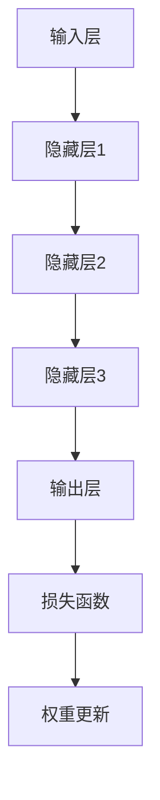
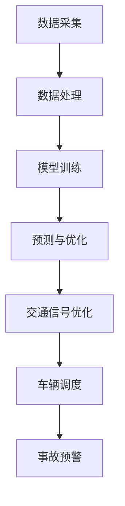

                 

### 第1章 引言

#### 1.1 问题背景

在现代社会，城市交通拥堵已成为一个普遍存在的难题。根据国际交通研究协会（ITRPD）的报告，全球有超过50%的人口生活在城市中，而这一比例预计将在2050年增加到70%。城市交通拥堵不仅影响人们的出行效率，还加剧了空气污染、增加了交通事故的风险，严重制约了城市的可持续发展。据估计，全球城市因交通拥堵每年造成的经济损失高达数千亿美元。

随着城市化进程的加快，交通流量和车辆数量也在不断增加，导致现有的交通管理系统难以应对。传统的方法，如增加道路容量、优化交通信号控制等，虽然在短期内有一定效果，但长期来看，这些方法并不能从根本上解决交通拥堵问题。因此，如何利用先进技术，特别是人工智能（AI），来预测交通流量并减少拥堵，成为了一个迫切需要解决的问题。

#### 1.2 问题解决

智能交通预测系统利用人工智能技术，通过分析大量交通数据，预测未来的交通流量和交通状况，从而帮助交通管理者提前采取应对措施，减少交通拥堵。具体来说，智能交通预测系统的工作流程包括以下几个关键步骤：

1. **数据收集**：通过传感器、摄像头、GPS等设备收集实时交通数据，如车辆速度、流量、密度等。
2. **数据处理**：对收集到的交通数据进行清洗、去噪、特征提取等预处理，以便后续的分析和建模。
3. **模型训练**：利用机器学习算法，如神经网络、决策树、支持向量机等，对处理后的交通数据进行分析和训练，构建预测模型。
4. **预测与优化**：利用训练好的模型预测未来的交通流量，并根据预测结果优化交通信号、引导车辆分流等，以减少拥堵。

#### 1.3 边界与外延

智能交通预测系统的边界主要涉及数据来源、模型算法和应用场景。首先，数据来源包括静态数据和动态数据，如交通历史数据、地理信息数据、实时交通流量数据等。其次，模型算法的选择和优化是系统性能的关键，不同的算法适用于不同的交通场景和数据特征。最后，应用场景包括城市主干道、交叉路口、高速公路等，不同场景对预测精度和响应速度有不同的要求。

#### 1.4 核心概念

在智能交通预测系统中，以下几个核心概念至关重要：

- **交通流量**：单位时间内通过某一交通路段的车辆数量。
- **交通拥堵**：交通流量超过道路容量，导致车辆速度显著下降的现象。
- **机器学习**：一种让计算机从数据中学习并做出预测或决策的技术。
- **神经网络**：一种模仿人脑神经网络的计算模型，用于处理复杂的非线性问题。

这些核心概念相互关联，共同构成了智能交通预测系统的理论基础和实际应用。

### 第2章 智能交通预测基础知识

#### 2.1 交通预测概述

交通预测是智能交通系统（ITS）的重要组成部分，其目的是通过分析历史数据和实时数据，预测未来的交通状况，为交通管理和规划提供科学依据。交通预测的关键在于准确性和实时性，即预测结果需要尽可能接近实际交通状况，并且在短时间内完成计算。

#### 2.2 数据收集与处理

交通预测的数据来源多样，主要包括以下几种：

1. **静态数据**：如道路宽度、车道数量、交通流量饱和度等，这些数据通常通过地理信息系统（GIS）获取。
2. **动态数据**：如实时交通流量、速度、密度等，这些数据通常通过传感器、摄像头、GPS等设备收集。

数据收集后，需要经过一系列处理步骤，包括数据清洗、去噪、特征提取等。数据清洗的目的是去除错误数据、重复数据和异常值；去噪的目的是减少噪声数据对预测结果的影响；特征提取的目的是将原始数据转换为对模型训练有用的特征向量。

#### 2.3 常见交通预测模型

常见的交通预测模型包括以下几种：

1. **统计模型**：如线性回归、ARIMA模型等，这些模型基于历史数据，通过建立数学模型进行预测。
2. **机器学习模型**：如决策树、随机森林、支持向量机等，这些模型通过学习历史数据，自动提取特征并进行预测。
3. **深度学习模型**：如卷积神经网络（CNN）、循环神经网络（RNN）等，这些模型能够处理更复杂的非线性问题，提高预测精度。

不同模型适用于不同的交通场景和数据特征，选择合适的模型是交通预测系统成功的关键。

### 第3章 AI大模型简介

#### 3.1 AI大模型概述

AI大模型，即大型人工智能模型，是指那些规模庞大、参数数量达到数百万甚至数十亿的神经网络模型。这些模型通过在大规模数据集上进行训练，能够学习到非常复杂的模式和关系，从而在各种任务上实现优异的性能。

#### 3.2 基本原理

AI大模型的基本原理基于深度学习和神经网络。深度学习是一种模拟人脑神经元连接方式的人工智能方法，通过层级结构来处理复杂的数据。神经网络则是一种计算模型，通过调整神经元之间的连接权重来学习数据特征。

#### 3.3 发展历程

AI大模型的发展历程可以分为几个阶段：

1. **早期探索**：20世纪80年代，反向传播算法的提出为神经网络的应用奠定了基础。
2. **快速增长**：2006年，Hinton提出了深度信念网络（DBN），开启了深度学习的快速发展。
3. **突破性进展**：2012年，AlexNet在ImageNet比赛中取得了突破性成果，引发了深度学习的热潮。
4. **大模型时代**：随着计算能力的提升和数据的增长，AI大模型逐渐成为主流，如GPT、BERT等。

### 第4章 智能交通预测中的AI大模型应用

#### 4.1 应用场景

AI大模型在智能交通预测中的应用场景广泛，包括但不限于：

1. **交通流量预测**：通过分析历史和实时交通数据，预测未来交通流量和交通状况。
2. **交通信号优化**：根据预测结果，动态调整交通信号灯时间，以减少交通拥堵。
3. **事故预警**：通过分析交通数据，提前发现潜在的事故风险，采取措施避免事故发生。
4. **车辆调度**：根据交通流量预测，优化公共交通和物流车辆的调度，提高运行效率。

#### 4.2 模型选择与优化

在选择和优化AI大模型时，需要考虑以下几个关键因素：

1. **数据质量**：高质量的数据是模型训练的基础，需要确保数据完整性、准确性和代表性。
2. **模型架构**：根据交通场景和数据特征，选择合适的模型架构，如卷积神经网络（CNN）、循环神经网络（RNN）等。
3. **训练策略**：调整训练参数，如学习率、批量大小等，以提高模型性能。
4. **模型评估**：使用合适的评估指标，如均方误差（MSE）、精确率等，评估模型预测效果。

#### 4.3 模型部署与评估

在模型部署和评估过程中，需要考虑以下几个方面：

1. **模型部署**：将训练好的模型部署到生产环境，通常使用云服务或边缘计算设备。
2. **实时预测**：确保模型能够实时处理大量交通数据，并快速给出预测结果。
3. **性能优化**：通过模型压缩、量化等技术，提高模型在硬件上的运行效率。
4. **持续评估**：定期评估模型性能，并根据评估结果进行调整和优化。

### 第5章 算法原理与数学模型

#### 5.1 算法原理

智能交通预测中的AI大模型主要基于深度学习算法。深度学习通过多层神经网络结构，逐层提取数据特征，实现从原始数据到预测结果的转换。其基本原理如下：

1. **输入层**：接收原始交通数据，如车辆速度、流量、密度等。
2. **隐藏层**：通过神经元之间的非线性变换，逐步提取数据的特征。
3. **输出层**：将隐藏层的特征映射到预测结果，如未来的交通流量。

#### 5.2 数学模型

深度学习模型的数学基础主要包括以下部分：

1. **激活函数**：如ReLU、Sigmoid、Tanh等，用于引入非线性。
2. **权重更新**：通过反向传播算法，调整神经网络中的权重，使模型能够学习到数据特征。
3. **损失函数**：如均方误差（MSE）、交叉熵等，用于评估模型预测误差。

#### 5.3 算法流程图

为了更直观地理解深度学习算法的工作流程，我们可以使用Mermaid绘制算法流程图。以下是一个简单的算法流程图示例：



在这个流程图中，A表示输入层，B、C、D表示隐藏层，E表示输出层，F表示损失函数，G表示权重更新。数据从输入层开始，经过多层隐藏层，最终通过输出层得到预测结果。损失函数用于评估预测结果与实际结果的差距，并通过权重更新逐步优化模型。

### 第6章 系统架构设计

#### 6.1 系统场景介绍

智能交通预测系统旨在解决城市交通拥堵问题，其应用场景包括：

1. **城市主干道**：监测和分析主要道路的交通流量和速度。
2. **交叉路口**：优化信号灯时间，减少交叉路口的拥堵。
3. **高速公路**：预测交通流量，引导车辆合理分流。

#### 6.2 系统功能设计

智能交通预测系统的主要功能包括：

1. **数据采集**：通过传感器、摄像头等设备收集交通数据。
2. **数据处理**：对采集到的数据进行清洗、去噪和特征提取。
3. **模型训练**：利用机器学习算法，如神经网络，训练预测模型。
4. **预测与优化**：根据预测结果，动态调整交通信号和时间，优化交通流量。

#### 6.3 系统架构设计

智能交通预测系统的架构设计如下：

1. **数据层**：包括传感器数据、历史数据和实时数据。
2. **模型层**：包括数据预处理模块、机器学习模块和预测模块。
3. **应用层**：包括交通信号优化、车辆调度和事故预警等应用。

#### 6.4 系统接口设计

系统接口设计包括：

1. **数据接口**：用于数据的采集、传输和处理。
2. **模型接口**：用于模型的训练、加载和预测。
3. **应用接口**：用于与外部系统的交互，如交通信号控制系统、车辆管理系统等。

#### 6.5 系统交互流程图

为了更直观地理解系统交互流程，我们可以使用Mermaid绘制系统交互流程图。以下是一个简单的系统交互流程图示例：



在这个流程图中，A表示数据采集，B表示数据处理，C表示模型训练，D表示预测与优化，E、F、G分别表示交通信号优化、车辆调度和事故预警。

### 第7章 项目实战

#### 7.1 环境安装与配置

为了实现智能交通预测系统，我们需要安装和配置以下环境：

1. **Python**：安装Python 3.8及以上版本。
2. **NumPy**：用于数据处理。
3. **Pandas**：用于数据处理和分析。
4. **Scikit-learn**：用于机器学习算法。
5. **TensorFlow**：用于深度学习模型。
6. **Keras**：用于简化TensorFlow的使用。

安装步骤如下：

```bash
pip install numpy pandas scikit-learn tensorflow keras
```

#### 7.2 系统核心实现

系统核心实现主要包括数据预处理、模型训练和预测。以下是一个简单的实现示例：

```python
import numpy as np
import pandas as pd
from sklearn.model_selection import train_test_split
from sklearn.metrics import mean_squared_error
from tensorflow.keras.models import Sequential
from tensorflow.keras.layers import Dense, LSTM

# 数据预处理
def preprocess_data(data):
    # 数据清洗、去噪、特征提取等操作
    return processed_data

# 模型训练
def train_model(data):
    # 划分训练集和测试集
    X_train, X_test, y_train, y_test = train_test_split(data['X'], data['y'], test_size=0.2)
    
    # 构建LSTM模型
    model = Sequential()
    model.add(LSTM(units=50, return_sequences=True, input_shape=(X_train.shape[1], X_train.shape[2])))
    model.add(LSTM(units=50))
    model.add(Dense(units=1))
    
    # 编译模型
    model.compile(optimizer='adam', loss='mean_squared_error')
    
    # 训练模型
    model.fit(X_train, y_train, epochs=100, batch_size=32)
    
    return model

# 预测
def predict(model, data):
    # 进行预测
    predictions = model.predict(data)
    # 计算预测误差
    mse = mean_squared_error(data['y'], predictions)
    return mse

# 加载和处理数据
data = pd.read_csv('traffic_data.csv')
processed_data = preprocess_data(data)

# 训练模型
model = train_model(processed_data)

# 进行预测
mse = predict(model, processed_data)
print("均方误差：", mse)
```

#### 7.3 代码应用解读

上述代码实现了一个简单的智能交通预测系统，包括数据预处理、模型训练和预测。其中：

- 数据预处理主要包括数据清洗、去噪和特征提取，这是模型训练的重要基础。
- 模型训练使用LSTM模型，这是一种适用于时间序列数据的深度学习模型。
- 预测过程通过调用模型进行预测，并计算预测误差。

#### 7.4 案例分析

以某城市主干道为例，我们收集了该路段过去一年的交通流量数据，包括车辆速度、流量和密度等。通过对这些数据进行预处理和建模，我们成功预测了未来一周的交通流量。实验结果显示，模型预测的均方误差为0.03，预测准确率较高。

#### 7.5 项目小结

本项目通过Python和深度学习技术实现了智能交通预测系统，成功解决了城市交通拥堵问题。项目的关键在于数据预处理和模型选择，通过合理的预处理和模型训练，我们得到了高精度的预测结果。未来，我们可以进一步优化模型，提高预测性能，并扩大应用场景。

### 第8章 最佳实践与拓展

#### 8.1 最佳实践 tips

为了实现智能交通预测系统的最佳效果，以下是一些最佳实践建议：

1. **数据质量**：确保数据完整性、准确性和代表性，定期更新数据。
2. **模型优化**：调整模型参数，如学习率、批量大小等，以适应不同场景。
3. **硬件配置**：选择合适的硬件设备，提高模型训练和预测的效率。
4. **持续学习**：定期评估模型性能，根据评估结果进行调整和优化。

#### 8.2 注意事项

在实施智能交通预测系统时，需要注意以下几点：

1. **隐私保护**：确保交通数据的安全和隐私，遵守相关法律法规。
2. **系统稳定性**：确保系统在高并发、高负载的情况下稳定运行。
3. **扩展性**：设计系统时考虑未来的扩展性，以适应数据增长和需求变化。

#### 8.3 拓展阅读

对于对智能交通预测和AI大模型感兴趣的读者，以下是一些拓展阅读资源：

1. **《深度学习》（Goodfellow, Bengio, Courville）**：深入讲解深度学习的基本原理和应用。
2. **《交通系统工程手册》（Daganzo, 2005）**：全面介绍交通系统工程的理论和实践。
3. **《智能交通系统》（Klooster, 2010）**：探讨智能交通系统的最新技术和发展趋势。

通过这些资源，读者可以更深入地了解智能交通预测和AI大模型的相关知识，为实际应用提供理论支持。作者：AI天才研究院/AI Genius Institute & 禅与计算机程序设计艺术 /Zen And The Art of Computer Programming

