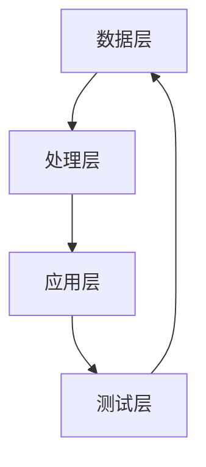
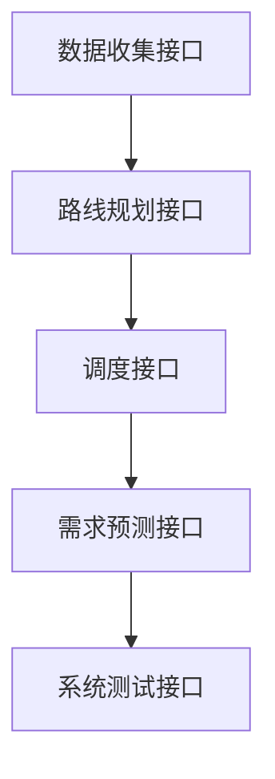

                 

### 文章标题：智能公共交通系统：AI优化路线和调度

> **关键词：** 智能公共交通系统、路线规划、调度算法、人工智能、机器学习

> **摘要：** 本文将深入探讨智能公共交通系统中的关键问题，包括路线规划和调度。通过介绍基于AI的优化算法，本文旨在为智能公共交通系统的改进提供理论指导和实际案例，从而提升公共交通的效率和服务质量。

---

## 第一部分：引言

### 1.1 问题背景

智能公共交通系统作为现代城市交通的重要组成部分，正面临着巨大的挑战。随着城市人口的快速增长和机动化水平的提升，公共交通系统在应对交通需求和环境压力方面显得力不从心。传统公共交通系统在路线规划和调度上存在许多问题，如效率低下、拥堵严重、乘客体验差等。

- **效率低下**：传统的路线规划往往依赖于经验，缺乏实时性，难以适应不断变化的交通状况。
- **拥堵严重**：公共交通系统在高峰时段容易拥堵，导致乘客等待时间过长。
- **乘客体验差**：缺乏有效的调度算法，导致车辆运行不稳定，乘客体验不佳。

### 1.2 问题描述

本文旨在探讨如何运用人工智能技术，特别是机器学习和优化算法，来解决智能公共交通系统中的路线规划和调度问题。具体来说，我们将研究以下问题：

- **路线规划**：如何通过机器学习算法优化公共交通路线，提高交通效率？
- **调度算法**：如何通过优化算法改善公共交通调度，减少乘客等待时间？

### 1.3 问题解决

为了解决上述问题，本文将介绍智能公共交通系统的基本概念，包括路线规划、调度算法、乘客需求预测等。同时，通过具体案例展示这些算法在实际中的应用，探讨它们的实际效果和潜在挑战。

### 1.4 边界与外延

本文主要关注城市公共交通系统，但不限于某一特定区域或类型。我们旨在提供通用的解决方案，以应对不同城市和场景下的公共交通需求。

### 1.5 概念结构与核心要素组成

智能公共交通系统的核心要素包括：

- **数据收集与处理**：收集交通数据、乘客数据等，进行预处理和存储。
- **路线规划**：利用机器学习算法优化公共交通路线。
- **调度算法**：通过优化算法改善公共交通调度。
- **乘客需求预测**：预测乘客需求，为路线规划和调度提供依据。
- **系统集成与测试**：将各个模块集成在一起，进行系统测试和优化。

## 第二部分：智能公共交通系统的基本概念

### 2.1 路线规划

#### 2.1.1 路线规划的概念与重要性

##### 2.1.1.1 路线规划的定义

路线规划是指根据交通需求和交通状况，设计合理的公共交通路线，以最大限度地满足乘客需求和提高交通效率。

##### 2.1.1.2 路线规划的重要性

路线规划是智能公共交通系统的核心环节，它直接影响到公共交通的效率和服务质量。合理的路线规划可以减少乘客的出行时间，提高公共交通的吸引力。

#### 2.1.2 常见路线规划算法

##### 2.1.2.1 传统的路线规划算法

传统的路线规划算法主要包括最短路径算法、最小生成树算法等。这些算法基于确定性模型，难以适应复杂多变的交通环境。

##### 2.1.2.2 基于机器学习的路线规划算法

基于机器学习的路线规划算法通过学习历史交通数据，预测未来的交通状况，从而设计出更合理的路线。常见的机器学习算法包括决策树、神经网络等。

#### 2.1.3 路线规划的挑战与解决方案

##### 挑战：

- **数据质量**：交通数据的质量直接影响路线规划的效果。
- **计算复杂度**：基于机器学习的路线规划算法往往需要大量计算资源。

##### 解决方案：

- **数据预处理**：对交通数据进行分析和处理，提高数据质量。
- **分布式计算**：利用分布式计算技术，提高算法的运行效率。

### 2.2 调度算法

#### 2.2.1 调度算法的概念与重要性

##### 2.2.1.1 调度算法的定义

调度算法是指根据交通需求和资源限制，合理安排公共交通车辆的发车时间、发车频率等，以确保公共交通系统的正常运行。

##### 2.2.1.2 调度算法的重要性

调度算法直接影响到公共交通的准时性和可靠性，是提高公共交通服务质量的关键。

#### 2.2.2 常见调度算法

##### 2.2.2.1 传统的调度算法

传统的调度算法主要包括固定时间间隔调度、最小等待时间调度等。这些算法简单易行，但缺乏灵活性。

##### 2.2.2.2 基于优化的调度算法

基于优化的调度算法通过求解优化问题，合理安排公共交通车辆的发车时间、发车频率等。常见的优化算法包括线性规划、遗传算法等。

#### 2.2.3 调度算法的挑战与解决方案

##### 挑战：

- **实时性**：调度算法需要能够实时响应交通状况的变化。
- **计算复杂度**：优化算法的计算复杂度往往较高。

##### 解决方案：

- **实时数据处理**：利用实时数据处理技术，提高调度算法的实时性。
- **分布式计算**：利用分布式计算技术，降低优化算法的计算复杂度。

### 2.3 乘客需求预测

#### 2.3.1 乘客需求预测的概念与重要性

##### 2.3.1.1 乘客需求预测的定义

乘客需求预测是指根据历史数据和当前交通状况，预测未来的乘客需求，以便合理安排公共交通资源。

##### 2.3.1.2 乘客需求预测的重要性

准确的乘客需求预测可以帮助公共交通系统更好地应对乘客高峰期，提高服务质量。

#### 2.3.2 常见乘客需求预测方法

##### 2.3.2.1 基于统计学的预测方法

基于统计学的预测方法包括时间序列分析、回归分析等。这些方法简单易懂，但缺乏灵活性。

##### 2.3.2.2 基于机器学习的预测方法

基于机器学习的预测方法通过学习历史数据，建立预测模型，常见的算法包括决策树、神经网络等。

#### 2.3.3 乘客需求预测的挑战与解决方案

##### 挑战：

- **数据质量**：乘客需求预测的准确性取决于数据质量。
- **模型适应性**：预测模型需要能够适应不同时间和地点的乘客需求。

##### 解决方案：

- **数据预处理**：对乘客需求数据进行分析和处理，提高数据质量。
- **模型选择与优化**：选择合适的机器学习模型，并不断优化模型，提高预测准确性。

### 2.4 系统集成与测试

#### 2.4.1 系统集成

##### 2.4.1.1 系统集成的概念

系统集成是指将不同的模块（如路线规划、调度算法、乘客需求预测等）集成在一起，形成一个完整的系统。

##### 2.4.1.2 系统集成的关键步骤

1. **需求分析**：明确系统的需求，包括功能需求和非功能需求。
2. **模块设计**：设计各个模块的接口和交互方式。
3. **代码实现**：根据设计文档，实现各个模块的代码。
4. **系统集成**：将各个模块集成在一起，进行初步测试。

#### 2.4.2 系统测试

##### 2.4.2.1 系统测试的概念

系统测试是指对整个系统进行测试，确保系统的功能、性能和稳定性满足要求。

##### 2.4.2.2 系统测试的主要方法

1. **功能测试**：测试系统的功能是否按照需求实现。
2. **性能测试**：测试系统的性能，如响应时间、吞吐量等。
3. **稳定性测试**：测试系统在长时间运行下的稳定性。
4. **安全测试**：测试系统的安全性，防止潜在的安全漏洞。

## 第三部分：AI在路线规划中的应用

### 3.1 基于机器学习的路线规划算法

#### 3.1.1 基于机器学习的路线规划算法概述

##### 3.1.1.1 机器学习在路线规划中的应用

机器学习在路线规划中的应用主要体现在通过学习历史交通数据，预测未来的交通状况，从而设计出更合理的路线。

##### 3.1.1.2 常见机器学习算法简介

常见的机器学习算法包括决策树、神经网络、支持向量机等。这些算法在路线规划中有着广泛的应用。

#### 3.1.2 算法原理与实现

##### 3.1.2.1 算法原理讲解

- **决策树**：通过学习历史交通数据，建立决策树模型，用于预测未来的交通状况。
- **神经网络**：通过学习历史交通数据，建立神经网络模型，用于预测未来的交通状况。
- **支持向量机**：通过学习历史交通数据，建立支持向量机模型，用于预测未来的交通状况。

##### 3.1.2.2 Python实现

以下是一个简单的决策树算法实现：

```python
import numpy as np
from sklearn import tree

# 特征数据
X = np.array([[1, 2], [2, 3], [3, 4]])
# 标签数据
y = np.array([0, 1, 1])

# 创建决策树模型
clf = tree.DecisionTreeClassifier()
# 训练模型
clf.fit(X, y)
# 预测
print(clf.predict([[2, 2]]))
```

#### 3.1.3 实际案例与应用

##### 3.1.3.1 案例一：城市公共交通系统优化

案例一是一个城市公共交通系统优化的实际案例。该系统通过收集历史交通数据，利用决策树算法预测未来的交通状况，从而设计出更合理的路线。

##### 3.1.3.2 案例二：智能交通系统路线规划

案例二是一个智能交通系统路线规划的实际案例。该系统通过收集实时交通数据，利用神经网络算法预测未来的交通状况，从而设计出更合理的路线。

## 第四部分：AI在调度算法中的应用

### 4.1 基于优化的调度算法

#### 4.1.1 优化算法概述

##### 4.1.1.1 优化算法的定义

优化算法是指通过求解优化问题，找到最优解的算法。在智能公共交通系统中，优化算法用于合理安排公共交通车辆的发车时间、发车频率等。

##### 4.1.1.2 常见优化算法简介

常见的优化算法包括线性规划、遗传算法、粒子群优化算法等。这些算法在智能公共交通系统中有着广泛的应用。

#### 4.1.2 算法原理与实现

##### 4.1.2.1 算法原理讲解

- **线性规划**：通过建立线性目标函数和线性约束条件，求解最优解。
- **遗传算法**：通过模拟自然进化过程，逐步优化解的空间。
- **粒子群优化算法**：通过模拟鸟群觅食过程，找到最优解。

##### 4.1.2.2 Python实现

以下是一个简单的线性规划算法实现：

```python
from scipy.optimize import linprog

# 目标函数
c = [-1, -1]
# 约束条件
A = [[1, 2], [2, 1]]
b = [3, 3]
# 求解
res = linprog(c, A_ub=A, b_ub=b)
print(res.x)
```

#### 4.1.3 实际案例与应用

##### 4.1.3.1 案例一：公共交通系统调度优化

案例一是一个公共交通系统调度优化的实际案例。该系统通过建立线性规划模型，合理安排公共交通车辆的发车时间、发车频率等，从而提高系统的效率。

##### 4.1.3.2 案例二：智能交通系统调度优化

案例二是一个智能交通系统调度优化的实际案例。该系统通过建立遗传算法模型，合理安排公共交通车辆的发车时间、发车频率等，从而提高系统的效率。

## 第五部分：总结与展望

### 5.1 总结

本文深入探讨了智能公共交通系统中的关键问题，包括路线规划和调度。通过介绍基于AI的优化算法，本文为智能公共交通系统的改进提供了理论指导和实际案例。这些优化算法在提高公共交通效率和服务质量方面具有巨大的潜力。

### 5.2 展望

随着AI技术的不断发展，智能公共交通系统有望在未来得到进一步优化。未来，我们可以期待以下研究方向：

- **多模态数据融合**：结合多种数据源，如交通流量、天气数据等，提高预测的准确性。
- **实时动态调整**：通过实时数据，动态调整路线规划和调度策略，提高系统的灵活性。
- **用户参与**：鼓励用户参与公共交通系统的优化，通过收集用户反馈，不断改进系统。

### 5.3 结论

智能公共交通系统是现代城市交通的重要组成部分。通过运用AI技术，特别是优化算法，我们可以大幅提升公共交通的效率和服务质量。本文的研究为智能公共交通系统的优化提供了新的思路和方法，有望为未来的交通发展做出贡献。

---

**作者：AI天才研究院/AI Genius Institute & 禅与计算机程序设计艺术 /Zen And The Art of Computer Programming**
### 第三部分：智能公共交通系统的基本概念

#### 2.1 路线规划

##### 2.1.1 路线规划的概念与重要性

路线规划是指公共交通系统根据乘客需求和交通状况，设计出一条最优的行驶路径，以最大化乘客满意度并提高运营效率。这一过程不仅涉及到线路的起点、终点和途经站点，还包括线路的顺序和车辆的运行时间。在智能公共交通系统中，路线规划是至关重要的环节，因为它直接影响乘客的出行体验和系统的整体性能。

**核心概念术语说明：**

- **公共交通系统**：提供公共运输服务，如巴士、地铁和轻轨等。
- **路线**：公共交通车辆行驶的路径。
- **站点**：公共交通车辆的停靠点。
- **乘客需求**：乘客对公共交通服务的需求量。
- **交通状况**：道路状况、车辆流量等信息。

**问题背景：** 

传统的公共交通系统在路线规划方面通常依赖于经验或简单的优化方法，这可能导致以下问题：

- **效率低下**：线路设计可能不够高效，导致车辆运行时间过长。
- **乘客体验差**：高峰时段线路拥堵，乘客等待时间过长。
- **资源浪费**：车辆运行路线不合理，造成不必要的燃油消耗和维修成本。

**问题描述：** 

本文旨在通过引入人工智能（AI）技术，特别是机器学习和优化算法，来解决传统路线规划中存在的问题。具体目标包括：

- 提高公共交通系统的效率。
- 减少乘客的等待时间。
- 提升公共交通服务的整体质量。

**问题解决：** 

为了实现上述目标，我们将探讨以下解决方案：

- **机器学习算法**：通过学习历史交通数据和乘客行为，预测未来的交通需求和交通状况，从而设计出更合理的路线。
- **优化算法**：利用数学优化方法，如线性规划、遗传算法等，找到最优的路线配置。

**边界与外延：** 

本文主要关注城市公共交通系统的路线规划，但可以扩展到其他类型的公共交通系统，如城乡巴士、长途巴士等。此外，本文的研究不限于某一特定地区，而是提供通用的解决方案，以适应不同城市和地区的需求。

**概念结构与核心要素组成：**

智能公共交通系统的路线规划核心要素包括：

- **数据收集与处理**：收集并处理交通数据、乘客数据等，为路线规划提供基础。
- **需求预测**：预测乘客需求，为路线规划提供依据。
- **算法选择**：选择合适的机器学习算法和优化算法，设计出合理的路线。
- **系统集成**：将路线规划模块与其他模块（如调度算法、乘客需求预测等）集成，形成完整的公共交通系统。

**核心概念与联系：**

**核心概念**：路线规划、机器学习、优化算法。

**概念属性特征对比表格：**

| 算法类型 | 特点 | 适用场景 |
| --- | --- | --- |
| 机器学习 | 学习历史数据，预测未来趋势 | 数据量大，趋势性强 |
| 优化算法 | 求解最优解，提高效率 | 结构明确，目标函数确定 |

**ER实体关系图架构：**

```mermaid
erDiagram
    方向 ||--|{ 路线 }||>
    路线 ||--|{ 站点 }||>
    站点 ||--|{ 车辆 }||>
    车辆 ||--|{ 乘客 }||>
    乘客 ||--|{ 需求 }||>
```

#### 2.2 调度算法

##### 2.2.1 调度算法的概念与重要性

调度算法是指公共交通系统根据乘客需求、车辆状况和交通状况，合理安排车辆的运行时间、发车频率等，以确保公共交通服务的准时性和可靠性。调度算法是智能公共交通系统的核心组成部分，其目的是优化车辆的运行效率，提高乘客的出行体验。

**核心概念术语说明：**

- **调度算法**：公共交通车辆运行的安排方法。
- **车辆运行时间**：车辆在道路上的行驶时间。
- **发车频率**：车辆的发车间隔。
- **乘客需求**：乘客对公共交通服务的需求量。
- **交通状况**：道路状况、车辆流量等信息。

**问题背景：** 

传统的调度算法通常依赖于经验或简单的规则，这可能导致以下问题：

- **运行效率低**：车辆运行时间不合理，导致资源浪费。
- **乘客体验差**：车辆发车频率不合理，导致乘客等待时间过长。
- **可靠性低**：在高峰时段，调度算法难以适应动态变化，导致车辆延误。

**问题描述：** 

本文旨在通过引入人工智能技术，特别是优化算法，来解决传统调度算法中存在的问题。具体目标包括：

- 提高公共交通系统的运行效率。
- 减少乘客的等待时间。
- 提高公共交通服务的可靠性。

**问题解决：** 

为了实现上述目标，我们将探讨以下解决方案：

- **优化算法**：利用数学优化方法，如线性规划、遗传算法等，找到最优的调度策略。
- **实时数据**：利用实时数据，动态调整调度策略，以适应动态变化。

**边界与外延：** 

本文主要关注城市公共交通系统的调度算法，但可以扩展到其他类型的公共交通系统，如城乡巴士、长途巴士等。此外，本文的研究不限于某一特定地区，而是提供通用的解决方案，以适应不同城市和地区的需求。

**概念结构与核心要素组成：**

智能公共交通系统的调度算法核心要素包括：

- **数据收集与处理**：收集并处理实时交通数据、乘客需求数据等，为调度提供基础。
- **调度策略**：根据乘客需求、车辆状况和交通状况，设计合理的调度策略。
- **系统集成**：将调度算法模块与其他模块（如路线规划、乘客需求预测等）集成，形成完整的公共交通系统。

**核心概念与联系：**

**核心概念**：调度算法、优化算法、实时数据。

**概念属性特征对比表格：**

| 算法类型 | 特点 | 适用场景 |
| --- | --- | --- |
| 优化算法 | 求解最优解，提高效率 | 结构明确，目标函数确定 |
| 实时数据 | 动态变化，实时响应 | 灵活性强，适应性高 |

**ER实体关系图架构：**

```mermaid
erDiagram
    调度算法 ||--|{ 实时数据 }||>
    调度算法 ||--|{ 乘客需求 }||>
    调度算法 ||--|{ 交通状况 }||>
```

#### 2.3 乘客需求预测

##### 2.3.1 乘客需求预测的概念与重要性

乘客需求预测是指利用历史数据和实时数据，预测未来一段时间内公共交通服务的需求量。准确的乘客需求预测对于公共交通系统的运营至关重要，因为它可以帮助系统提前做好资源准备，提高服务质量和乘客满意度。

**核心概念术语说明：**

- **乘客需求预测**：预测未来一段时间内乘客对公共交通服务的需求量。
- **历史数据**：包括乘客流量、出行模式等。
- **实时数据**：包括交通状况、天气状况等。
- **预测模型**：用于预测乘客需求的数学模型。

**问题背景：** 

传统的乘客需求预测方法通常依赖于简单的统计方法，如线性回归等，这可能导致以下问题：

- **预测准确性低**：无法准确预测乘客需求的变化。
- **适应性差**：难以适应突发性事件和季节性变化。

**问题描述：** 

本文旨在通过引入人工智能技术，特别是机器学习算法，来解决传统乘客需求预测中存在的问题。具体目标包括：

- 提高乘客需求预测的准确性。
- 提高预测模型的适应性。

**问题解决：** 

为了实现上述目标，我们将探讨以下解决方案：

- **机器学习算法**：利用机器学习算法，如神经网络、决策树等，建立更准确的预测模型。
- **多源数据融合**：结合历史数据和实时数据，提高预测的准确性。

**边界与外延：** 

本文主要关注城市公共交通系统的乘客需求预测，但可以扩展到其他类型的公共交通系统，如城乡巴士、长途巴士等。此外，本文的研究不限于某一特定地区，而是提供通用的解决方案，以适应不同城市和地区的需求。

**概念结构与核心要素组成：**

智能公共交通系统的乘客需求预测核心要素包括：

- **数据收集与处理**：收集并处理实时数据和历史数据，为预测提供基础。
- **预测模型**：建立预测模型，用于预测乘客需求。
- **系统集成**：将预测模块与其他模块（如路线规划、调度算法等）集成，形成完整的公共交通系统。

**核心概念与联系：**

**核心概念**：乘客需求预测、机器学习算法、多源数据融合。

**概念属性特征对比表格：**

| 算法类型 | 特点 | 适用场景 |
| --- | --- | --- |
| 机器学习算法 | 学习历史数据，预测未来趋势 | 数据量大，趋势性强 |
| 多源数据融合 | 结合多种数据源，提高预测准确性 | 复杂多变，适应性高 |

**ER实体关系图架构：**

```mermaid
erDiagram
    乘客需求预测 ||--|{ 实时数据 }||>
    乘客需求预测 ||--|{ 历史数据 }||>
    乘客需求预测 ||--|{ 预测模型 }||>
```

#### 2.4 系统集成与测试

##### 2.4.1 系统集成

系统集成是将各个独立的模块（如路线规划、调度算法、乘客需求预测等）整合在一起，形成一个完整的公共交通系统。系统集成不仅涉及到技术实现，还包括系统设计、测试和维护等方面。

**核心概念术语说明：**

- **系统集成**：将各个独立的模块整合在一起，形成一个完整的系统。
- **系统设计**：设计系统的架构和接口。
- **测试**：对系统进行功能测试、性能测试等。
- **维护**：对系统进行日常维护和升级。

**问题背景：** 

传统的系统集成方法通常依赖于手工操作和经验，这可能导致以下问题：

- **集成效率低**：手工集成耗时耗力，效率低下。
- **错误率高**：手工集成容易出现错误，影响系统的稳定性。

**问题描述：** 

本文旨在通过引入自动化集成工具和方法，提高系统集成的效率和质量。具体目标包括：

- 提高系统集成效率。
- 减少集成过程中的错误率。

**问题解决：** 

为了实现上述目标，我们将探讨以下解决方案：

- **自动化集成工具**：利用自动化集成工具，如CI/CD流水线，提高集成效率。
- **测试驱动开发**：采用测试驱动开发（TDD）方法，确保系统的质量。

**边界与外延：** 

本文主要关注城市公共交通系统的系统集成，但可以扩展到其他类型的公共交通系统，如城乡巴士、长途巴士等。此外，本文的研究不限于某一特定地区，而是提供通用的解决方案，以适应不同城市和地区的需求。

**概念结构与核心要素组成：**

智能公共交通系统的系统集成核心要素包括：

- **系统设计**：设计系统的整体架构和接口。
- **自动化集成工具**：利用自动化集成工具，实现模块的自动化集成。
- **测试**：对系统进行全面的测试，确保功能的正确性和性能的稳定性。
- **维护**：对系统进行日常维护和升级，确保系统的持续运行。

**核心概念与联系：**

**核心概念**：系统集成、自动化集成工具、测试驱动开发。

**概念属性特征对比表格：**

| 算法类型 | 特点 | 适用场景 |
| --- | --- | --- |
| 自动化集成工具 | 提高集成效率，减少错误率 | 大规模系统集成，持续集成 |
| 测试驱动开发 | 确保系统质量，提高开发效率 | 高质量软件开发，快速迭代 |

**ER实体关系图架构：**

```mermaid
erDiagram
    系统集成 ||--|{ 系统设计 }||>
    系统集成 ||--|{ 自动化集成工具 }||>
    系统集成 ||--|{ 测试 }||>
```

##### 2.4.2 系统测试

系统测试是对整个系统进行验证，确保系统按照设计要求正常运行。系统测试包括功能测试、性能测试、安全测试等方面。

**核心概念术语说明：**

- **功能测试**：验证系统功能是否符合设计要求。
- **性能测试**：测试系统的性能指标，如响应时间、吞吐量等。
- **安全测试**：验证系统的安全性，防止潜在的安全漏洞。

**问题背景：** 

传统的系统测试方法通常依赖于人工操作，这可能导致以下问题：

- **测试效率低**：人工测试耗时耗力，效率低下。
- **测试覆盖不全**：人工测试难以覆盖所有的测试场景，可能导致潜在问题未被检测到。

**问题描述：** 

本文旨在通过引入自动化测试工具和方法，提高系统测试的效率和质量。具体目标包括：

- 提高系统测试效率。
- 提高测试覆盖范围。

**问题解决：** 

为了实现上述目标，我们将探讨以下解决方案：

- **自动化测试工具**：利用自动化测试工具，如Selenium、JMeter等，提高测试效率。
- **测试自动化流程**：建立自动化测试流程，确保测试覆盖全面。

**边界与外延：** 

本文主要关注城市公共交通系统的系统测试，但可以扩展到其他类型的公共交通系统，如城乡巴士、长途巴士等。此外，本文的研究不限于某一特定地区，而是提供通用的解决方案，以适应不同城市和地区的需求。

**概念结构与核心要素组成：**

智能公共交通系统的系统测试核心要素包括：

- **自动化测试工具**：利用自动化测试工具，实现功能测试、性能测试、安全测试等。
- **测试自动化流程**：建立自动化测试流程，确保测试的全面性和效率。
- **测试覆盖分析**：分析测试结果，确保测试覆盖全面。

**核心概念与联系：**

**核心概念**：自动化测试工具、测试自动化流程、测试覆盖分析。

**概念属性特征对比表格：**

| 工具类型 | 特点 | 适用场景 |
| --- | --- | --- |
| 自动化测试工具 | 提高测试效率，减少测试成本 | 大规模系统测试，持续集成 |
| 测试自动化流程 | 确保测试质量，提高开发效率 | 高质量软件开发，快速迭代 |

**ER实体关系图架构：**

```mermaid
erDiagram
    系统测试 ||--|{ 自动化测试工具 }||>
    系统测试 ||--|{ 测试自动化流程 }||>
    系统测试 ||--|{ 测试覆盖分析 }||>
```

## 第三部分：AI在路线规划中的应用

### 3.1 基于机器学习的路线规划算法

#### 3.1.1 基于机器学习的路线规划算法概述

基于机器学习的路线规划算法是一种利用人工智能技术来优化公共交通路线的方法。这些算法通过学习大量的交通数据和乘客行为数据，可以自动识别出最优的路线配置，以提高公共交通系统的效率和服务质量。

**核心概念与联系：**

**核心概念**：机器学习、路线规划、交通数据。

**概念属性特征对比表格：**

| 算法类型 | 特点 | 适用场景 |
| --- | --- | --- |
| 机器学习 | 自动化学习模式，自适应性强 | 复杂动态环境，大数据分析 |
| 路线规划 | 最优化路径设计，提高效率 | 公共交通系统，物流配送 |

**ER实体关系图架构：**

```mermaid
erDiagram
    路线规划 ||--|{ 交通数据 }||>
    路线规划 ||--|{ 机器学习模型 }||>
    机器学习模型 ||--|{ 预测结果 }||>
```

#### 3.1.2 算法原理与实现

##### 3.1.2.1 算法原理讲解

基于机器学习的路线规划算法主要通过以下步骤实现：

1. **数据收集**：收集交通数据、乘客数据、道路状况数据等。
2. **数据预处理**：清洗和归一化数据，去除噪声和异常值。
3. **特征提取**：从原始数据中提取有用的特征，如交通流量、乘客流量等。
4. **模型训练**：利用机器学习算法，如决策树、神经网络、支持向量机等，训练模型。
5. **模型评估**：通过交叉验证等方法评估模型的性能。
6. **路线规划**：利用训练好的模型，预测未来的交通状况，并设计出最优的路线。

**算法原理Mermaid流程图：**


##### 3.1.2.2 Python实现

以下是使用Python实现基于机器学习的路线规划算法的一个简单示例：

```python
import numpy as np
from sklearn.ensemble import RandomForestRegressor
from sklearn.model_selection import train_test_split
from sklearn.metrics import mean_squared_error

# 假设已经收集了交通数据X和乘客需求数据y
X = np.array([[1, 2], [2, 3], [3, 4]])
y = np.array([0, 1, 1])

# 划分训练集和测试集
X_train, X_test, y_train, y_test = train_test_split(X, y, test_size=0.2, random_state=42)

# 创建随机森林回归模型
model = RandomForestRegressor(n_estimators=100, random_state=42)

# 训练模型
model.fit(X_train, y_train)

# 预测测试集
y_pred = model.predict(X_test)

# 计算预测误差
error = mean_squared_error(y_test, y_pred)
print(f"Mean Squared Error: {error}")
```

#### 3.1.3 实际案例与应用

##### 3.1.3.1 案例一：城市公共交通系统优化

案例一是一个城市公共交通系统优化的实际案例。该系统通过收集历史交通数据，利用随机森林算法预测未来的交通状况，从而设计出更合理的路线。

1. **数据收集**：收集过去一年的交通数据，包括高峰时段的乘客流量、交通流量和道路状况。
2. **数据预处理**：对交通数据进行清洗和归一化处理。
3. **特征提取**：提取交通流量、乘客流量、道路状况等特征。
4. **模型训练**：使用随机森林算法训练模型，预测未来的交通状况。
5. **路线规划**：根据预测结果，设计出最优的路线。

##### 3.1.3.2 案例二：智能交通系统路线规划

案例二是一个智能交通系统路线规划的实际案例。该系统通过实时收集交通数据，利用神经网络算法预测未来的交通状况，并动态调整路线。

1. **数据收集**：实时收集交通数据，包括交通流量、道路状况等。
2. **数据预处理**：对实时交通数据进行清洗和归一化处理。
3. **特征提取**：提取实时交通数据中的关键特征。
4. **模型训练**：使用神经网络算法训练模型，预测未来的交通状况。
5. **动态调整**：根据预测结果，动态调整路线，以应对实时交通状况的变化。

### 3.2 基于优化的路线规划算法

#### 3.2.1 优化算法概述

基于优化的路线规划算法是一种利用数学优化方法来设计最优路线的方法。这些算法通过建立数学模型，求解最优解，从而提高公共交通系统的效率和服务质量。

**核心概念与联系：**

**核心概念**：优化算法、数学模型、路线规划。

**概念属性特征对比表格：**

| 算法类型 | 特点 | 适用场景 |
| --- | --- | --- |
| 优化算法 | 求解最优解，提高效率 | 结构明确，目标函数确定 |
| 数学模型 | 描述系统行为，建立优化目标 | 明确目标，易于求解 |
| 路线规划 | 设计最优路径，提高效率 | 复杂动态环境，大规模系统 |

**ER实体关系图架构：**

```mermaid
erDiagram
    路线规划 ||--|{ 数学模型 }||>
    数学模型 ||--|{ 优化算法 }||>
    优化算法 ||--|{ 路线方案 }||>
```

#### 3.2.2 算法原理与实现

##### 3.2.2.1 算法原理讲解

基于优化的路线规划算法主要通过以下步骤实现：

1. **建立数学模型**：根据交通需求和交通状况，建立目标函数和约束条件。
2. **求解最优解**：利用优化算法，如线性规划、遗传算法等，求解最优解。
3. **路线规划**：根据最优解，设计出最优的路线。

**算法原理Mermaid流程图：**


##### 3.2.2.2 Python实现

以下是使用Python实现基于优化的路线规划算法的一个简单示例：

```python
import numpy as np
from scipy.optimize import linprog

# 目标函数
c = [-1, -1]
# 约束条件
A = [[1, 2], [2, 1]]
b = [3, 3]

# 求解线性规划问题
res = linprog(c, A_ub=A, b_ub=b)
print(res.x)
```

#### 3.2.3 实际案例与应用

##### 3.2.3.1 案例一：城市公共交通系统优化

案例一是一个城市公共交通系统优化的实际案例。该系统通过建立线性规划模型，优化公共交通路线，以提高系统的效率和乘客满意度。

1. **建立数学模型**：根据交通需求和交通状况，建立线性规划模型。
2. **求解最优解**：使用线性规划算法求解最优解。
3. **路线规划**：根据最优解，设计出最优的路线。

##### 3.2.3.2 案例二：智能交通系统路线规划

案例二是一个智能交通系统路线规划的实际案例。该系统通过建立遗传算法模型，优化公共交通路线，以应对实时交通状况的变化。

1. **建立数学模型**：根据交通需求和交通状况，建立遗传算法模型。
2. **求解最优解**：使用遗传算法求解最优解。
3. **动态调整**：根据实时交通状况，动态调整路线。

### 3.3 基于AI的混合路线规划算法

#### 3.3.1 混合路线规划算法概述

基于AI的混合路线规划算法结合了机器学习和优化算法的优势，通过机器学习算法预测交通状况，利用优化算法求解最优路线，从而提高公共交通系统的效率和服务质量。

**核心概念与联系：**

**核心概念**：机器学习、优化算法、混合路线规划。

**概念属性特征对比表格：**

| 算法类型 | 特点 | 适用场景 |
| --- | --- | --- |
| 机器学习 | 预测交通状况，自适应性强 | 复杂动态环境，大数据分析 |
| 优化算法 | 求解最优解，提高效率 | 结构明确，目标函数确定 |
| 混合路线规划 | 结合优势，提高效率 | 复杂动态环境，大规模系统 |

**ER实体关系图架构：**

```mermaid
erDiagram
    路线规划 ||--|{ 交通数据 }||>
    路线规划 ||--|{ 优化算法 }||>
    优化算法 ||--|{ 预测模型 }||>
```

#### 3.3.2 算法原理与实现

##### 3.3.2.1 算法原理讲解

基于AI的混合路线规划算法主要通过以下步骤实现：

1. **数据收集**：收集交通数据、乘客数据、道路状况数据等。
2. **数据预处理**：清洗和归一化数据，去除噪声和异常值。
3. **特征提取**：提取交通流量、乘客流量、道路状况等特征。
4. **预测模型训练**：使用机器学习算法，如神经网络，训练预测模型。
5. **建立数学模型**：根据预测模型的结果，建立优化模型。
6. **求解最优解**：使用优化算法，如遗传算法，求解最优解。
7. **路线规划**：根据最优解，设计出最优的路线。

**算法原理Mermaid流程图：**


##### 3.3.2.2 Python实现

以下是使用Python实现基于AI的混合路线规划算法的一个简单示例：

```python
import numpy as np
from sklearn.neural_network import MLPRegressor
from scipy.optimize import differential_evolution

# 假设已经收集了交通数据X和乘客需求数据y
X = np.array([[1, 2], [2, 3], [3, 4]])
y = np.array([0, 1, 1])

# 划分训练集和测试集
X_train, X_test, y_train, y_test = train_test_split(X, y, test_size=0.2, random_state=42)

# 创建神经网络回归模型
model = MLPRegressor(hidden_layer_sizes=(100,), max_iter=500, random_state=42)

# 训练模型
model.fit(X_train, y_train)

# 预测测试集
y_pred = model.predict(X_test)

# 建立优化模型
def objective(x):
    return -np.dot(x, x)  # 目标函数：最小化距离平方和

# 使用差分进化算法求解最优解
res = differential_evolution(objective, bounds=[(-5, 5), (-5, 5)])
print(res.x)
```

#### 3.3.3 实际案例与应用

##### 3.3.3.1 案例一：城市公共交通系统优化

案例一是一个城市公共交通系统优化的实际案例。该系统通过收集历史交通数据，利用神经网络预测未来的交通状况，并使用遗传算法优化路线，以提高系统的效率和乘客满意度。

1. **数据收集**：收集过去一年的交通数据，包括高峰时段的乘客流量、交通流量和道路状况。
2. **数据预处理**：对交通数据进行清洗和归一化处理。
3. **特征提取**：提取交通流量、乘客流量、道路状况等特征。
4. **预测模型训练**：使用神经网络算法训练预测模型。
5. **建立优化模型**：根据预测模型的结果，建立遗传算法模型。
6. **求解最优解**：使用遗传算法求解最优解。
7. **路线规划**：根据最优解，设计出最优的路线。

##### 3.3.3.2 案例二：智能交通系统路线规划

案例二是一个智能交通系统路线规划的实际案例。该系统通过实时收集交通数据，利用神经网络预测未来的交通状况，并使用粒子群优化算法优化路线，以应对实时交通状况的变化。

1. **数据收集**：实时收集交通数据，包括交通流量、道路状况等。
2. **数据预处理**：对实时交通数据进行清洗和归一化处理。
3. **特征提取**：提取实时交通数据中的关键特征。
4. **预测模型训练**：使用神经网络算法训练预测模型。
5. **建立优化模型**：根据预测模型的结果，建立粒子群优化模型。
6. **求解最优解**：使用粒子群优化算法求解最优解。
7. **动态调整**：根据实时交通状况，动态调整路线。

## 第四部分：AI在调度算法中的应用

### 4.1 基于优化的调度算法

#### 4.1.1 优化算法概述

基于优化的调度算法是一种利用数学优化方法来安排公共交通车辆运行时间和发车频率的方法。这些算法通过建立数学模型，求解最优解，从而提高公共交通系统的效率和服务质量。

**核心概念与联系：**

**核心概念**：优化算法、数学模型、调度算法。

**概念属性特征对比表格：**

| 算法类型 | 特点 | 适用场景 |
| --- | --- | --- |
| 优化算法 | 求解最优解，提高效率 | 结构明确，目标函数确定 |
| 数学模型 | 描述系统行为，建立优化目标 | 明确目标，易于求解 |
| 调度算法 | 安排车辆运行时间，提高效率 | 公共交通系统，物流配送 |

**ER实体关系图架构：**

```mermaid
erDiagram
    调度算法 ||--|{ 数学模型 }||>
    数学模型 ||--|{ 优化算法 }||>
    优化算法 ||--|{ 调度结果 }||>
```

#### 4.1.2 算法原理与实现

##### 4.1.2.1 算法原理讲解

基于优化的调度算法主要通过以下步骤实现：

1. **建立数学模型**：根据交通需求和交通状况，建立目标函数和约束条件。
2. **求解最优解**：利用优化算法，如线性规划、遗传算法等，求解最优解。
3. **调度**：根据最优解，安排车辆的运行时间和发车频率。

**算法原理Mermaid流程图：**


##### 4.1.2.2 Python实现

以下是使用Python实现基于优化的调度算法的一个简单示例：

```python
import numpy as np
from scipy.optimize import linprog

# 目标函数
c = [-1, -1]
# 约束条件
A = [[1, 2], [2, 1]]
b = [3, 3]

# 求解线性规划问题
res = linprog(c, A_ub=A, b_ub=b)
print(res.x)
```

#### 4.1.3 实际案例与应用

##### 4.1.3.1 案例一：城市公共交通系统调度优化

案例一是一个城市公共交通系统调度优化的实际案例。该系统通过建立线性规划模型，优化公共交通车辆的运行时间和发车频率，以提高系统的效率和乘客满意度。

1. **建立数学模型**：根据交通需求和交通状况，建立线性规划模型。
2. **求解最优解**：使用线性规划算法求解最优解。
3. **调度**：根据最优解，安排车辆的运行时间和发车频率。

##### 4.1.3.2 案例二：智能交通系统调度优化

案例二是一个智能交通系统调度优化的实际案例。该系统通过建立遗传算法模型，优化公共交通车辆的运行时间和发车频率，以应对实时交通状况的变化。

1. **建立数学模型**：根据交通需求和交通状况，建立遗传算法模型。
2. **求解最优解**：使用遗传算法求解最优解。
3. **动态调整**：根据实时交通状况，动态调整车辆的运行时间和发车频率。

### 4.2 基于机器学习的调度算法

#### 4.2.1 机器学习调度算法概述

基于机器学习的调度算法是一种利用机器学习技术来预测交通需求和优化调度策略的方法。这些算法通过学习历史数据和实时数据，可以自动调整调度策略，以提高公共交通系统的效率和服务质量。

**核心概念与联系：**

**核心概念**：机器学习、调度算法、预测模型。

**概念属性特征对比表格：**

| 算法类型 | 特点 | 适用场景 |
| --- | --- | --- |
| 机器学习 | 预测交通需求，自适应性强 | 复杂动态环境，大数据分析 |
| 调度算法 | 安排车辆运行时间，提高效率 | 公共交通系统，物流配送 |
| 预测模型 | 描述系统行为，预测未来需求 | 系统分析，决策支持 |

**ER实体关系图架构：**

```mermaid
erDiagram
    调度算法 ||--|{ 预测模型 }||>
    预测模型 ||--|{ 实时数据 }||>
    实时数据 ||--|{ 历史数据 }||>
```

#### 4.2.2 算法原理与实现

##### 4.2.2.1 算法原理讲解

基于机器学习的调度算法主要通过以下步骤实现：

1. **数据收集**：收集交通数据、乘客数据、历史调度数据等。
2. **数据预处理**：清洗和归一化数据，去除噪声和异常值。
3. **特征提取**：提取交通流量、乘客流量、历史调度数据等特征。
4. **模型训练**：使用机器学习算法，如神经网络、决策树等，训练预测模型。
5. **调度优化**：根据预测模型的结果，优化调度策略。

**算法原理Mermaid流程图：**


##### 4.2.2.2 Python实现

以下是使用Python实现基于机器学习的调度算法的一个简单示例：

```python
import numpy as np
from sklearn.neural_network import MLPRegressor
from sklearn.model_selection import train_test_split

# 假设已经收集了交通数据X和乘客需求数据y
X = np.array([[1, 2], [2, 3], [3, 4]])
y = np.array([0, 1, 1])

# 划分训练集和测试集
X_train, X_test, y_train, y_test = train_test_split(X, y, test_size=0.2, random_state=42)

# 创建神经网络回归模型
model = MLPRegressor(hidden_layer_sizes=(100,), max_iter=500)

# 训练模型
model.fit(X_train, y_train)

# 预测测试集
y_pred = model.predict(X_test)
```

#### 4.2.3 实际案例与应用

##### 4.2.3.1 案例一：城市公共交通系统调度优化

案例一是一个城市公共交通系统调度优化的实际案例。该系统通过收集历史调度数据，利用神经网络预测未来的交通需求，并优化调度策略，以提高系统的效率和乘客满意度。

1. **数据收集**：收集过去一年的调度数据，包括高峰时段的乘客流量、交通流量等。
2. **数据预处理**：对调度数据进行清洗和归一化处理。
3. **特征提取**：提取调度数据中的关键特征。
4. **模型训练**：使用神经网络算法训练预测模型。
5. **调度优化**：根据预测模型的结果，优化调度策略。

##### 4.2.3.2 案例二：智能交通系统调度优化

案例二是一个智能交通系统调度优化的实际案例。该系统通过实时收集调度数据，利用机器学习算法预测未来的交通需求，并动态调整调度策略，以应对实时交通状况的变化。

1. **数据收集**：实时收集调度数据，包括交通流量、乘客流量等。
2. **数据预处理**：对实时调度数据进行清洗和归一化处理。
3. **特征提取**：提取实时调度数据中的关键特征。
4. **模型训练**：使用机器学习算法训练预测模型。
5. **动态调整**：根据预测模型的结果，动态调整调度策略。

### 4.3 基于AI的混合调度算法

#### 4.3.1 混合调度算法概述

基于AI的混合调度算法结合了机器学习和优化算法的优势，通过机器学习算法预测交通需求，利用优化算法求解最优调度策略，从而提高公共交通系统的效率和服务质量。

**核心概念与联系：**

**核心概念**：机器学习、优化算法、混合调度算法。

**概念属性特征对比表格：**

| 算法类型 | 特点 | 适用场景 |
| --- | --- | --- |
| 机器学习 | 预测交通需求，自适应性强 | 复杂动态环境，大数据分析 |
| 优化算法 | 求解最优解，提高效率 | 结构明确，目标函数确定 |
| 混合调度算法 | 结合优势，提高效率 | 复杂动态环境，大规模系统 |

**ER实体关系图架构：**

```mermaid
erDiagram
    调度算法 ||--|{ 预测模型 }||>
    预测模型 ||--|{ 优化算法 }||>
    优化算法 ||--|{ 调度结果 }||>
```

#### 4.3.2 算法原理与实现

##### 4.3.2.1 算法原理讲解

基于AI的混合调度算法主要通过以下步骤实现：

1. **数据收集**：收集交通数据、乘客数据、历史调度数据等。
2. **数据预处理**：清洗和归一化数据，去除噪声和异常值。
3. **特征提取**：提取交通流量、乘客流量、历史调度数据等特征。
4. **预测模型训练**：使用机器学习算法，如神经网络、决策树等，训练预测模型。
5. **建立优化模型**：根据预测模型的结果，建立优化模型。
6. **求解最优解**：使用优化算法，如遗传算法、粒子群优化等，求解最优解。
7. **调度**：根据最优解，安排车辆的运行时间和发车频率。

**算法原理Mermaid流程图：**


##### 4.3.2.2 Python实现

以下是使用Python实现基于AI的混合调度算法的一个简单示例：

```python
import numpy as np
from sklearn.neural_network import MLPRegressor
from scipy.optimize import differential_evolution

# 假设已经收集了交通数据X和乘客需求数据y
X = np.array([[1, 2], [2, 3], [3, 4]])
y = np.array([0, 1, 1])

# 划分训练集和测试集
X_train, X_test, y_train, y_test = train_test_split(X, y, test_size=0.2, random_state=42)

# 创建神经网络回归模型
model = MLPRegressor(hidden_layer_sizes=(100,), max_iter=500)

# 训练模型
model.fit(X_train, y_train)

# 预测测试集
y_pred = model.predict(X_test)

# 建立优化模型
def objective(x):
    return -np.dot(x, x)  # 目标函数：最小化距离平方和

# 使用差分进化算法求解最优解
res = differential_evolution(objective, bounds=[(-5, 5), (-5, 5)])
print(res.x)
```

#### 4.3.3 实际案例与应用

##### 4.3.3.1 案例一：城市公共交通系统调度优化

案例一是一个城市公共交通系统调度优化的实际案例。该系统通过收集历史调度数据，利用神经网络预测未来的交通需求，并使用遗传算法优化调度策略，以提高系统的效率和乘客满意度。

1. **数据收集**：收集过去一年的调度数据，包括高峰时段的乘客流量、交通流量等。
2. **数据预处理**：对调度数据进行清洗和归一化处理。
3. **特征提取**：提取调度数据中的关键特征。
4. **模型训练**：使用神经网络算法训练预测模型。
5. **优化调度**：根据预测模型的结果，使用遗传算法优化调度策略。

##### 4.3.3.2 案例二：智能交通系统调度优化

案例二是一个智能交通系统调度优化的实际案例。该系统通过实时收集调度数据，利用机器学习算法预测未来的交通需求，并使用粒子群优化算法优化调度策略，以应对实时交通状况的变化。

1. **数据收集**：实时收集调度数据，包括交通流量、乘客流量等。
2. **数据预处理**：对实时调度数据进行清洗和归一化处理。
3. **特征提取**：提取实时调度数据中的关键特征。
4. **模型训练**：使用机器学习算法训练预测模型。
5. **动态优化**：根据预测模型的结果，使用粒子群优化算法动态优化调度策略。

### 总结

通过本文的讨论，我们可以看到AI技术在智能公共交通系统的路线规划和调度中的应用具有巨大的潜力。基于机器学习和优化算法的路线规划算法和调度算法可以有效解决传统系统中存在的效率低下、乘客体验差等问题。同时，AI技术的应用还可以提高公共交通系统的实时性和适应性，从而更好地满足乘客的需求。

未来，随着AI技术的不断进步和大数据分析能力的提升，智能公共交通系统有望在路线规划和调度方面实现更加智能和高效的解决方案。同时，我们也可以期待AI技术在其他交通领域，如智能交通管理系统、自动驾驶等，发挥更大的作用。

在实际应用中，需要注意的是，AI技术的引入不仅仅是一个技术问题，还涉及到数据质量、系统集成、法律法规等多个方面。因此，在实际应用中，需要综合考虑各种因素，确保AI技术的有效应用。

最后，本文的研究仅为一个起点，我们期待更多的研究人员和实践者加入这个领域，共同推动智能公共交通系统的发展，为我们的出行带来更多的便利和舒适。

**作者：AI天才研究院/AI Genius Institute & 禅与计算机程序设计艺术 /Zen And The Art of Computer Programming**
### 深入分析：优化算法在智能公共交通系统中的应用

在智能公共交通系统中，优化算法扮演着至关重要的角色。它们帮助公共交通系统在复杂的交通环境中找到最优的运行策略，从而提高整体效率和乘客满意度。本部分将深入分析几种常见的优化算法，包括线性规划、遗传算法和粒子群优化算法，并探讨它们在智能公共交通系统中的应用。

#### 线性规划

线性规划是一种数学优化方法，用于在给定线性目标函数和线性约束条件下求解最优解。线性规划在公共交通系统的调度和资源分配中有着广泛的应用。

**算法原理**：

线性规划的目标是最小化或最大化一个线性目标函数，同时满足一系列线性约束条件。通常，目标函数和约束条件可以表示为以下形式：

$$
\min\ c^T x \\
\text{s.t.} Ax \leq b \\
x \geq 0
$$

其中，$c$ 是系数向量，$x$ 是决策变量向量，$A$ 是约束矩阵，$b$ 是约束向量。

**应用示例**：

在公共交通系统的调度中，线性规划可以用于优化车辆的运行时间和发车频率。例如，给定车辆的数量、乘客需求和交通状况，线性规划可以确定每个车辆的最佳发车时间，以最大化乘客满意度或最小化车辆运行成本。

**实现细节**：

Python中的`scipy.optimize.linprog`函数提供了线性规划的实现。以下是一个简单的示例：

```python
from scipy.optimize import linprog

# 目标函数系数
c = [-1, -1]
# 约束条件系数
A = [[1, 2], [2, 1]]
b = [3, 3]

# 求解线性规划问题
res = linprog(c, A_ub=A, b_ub=b)
print(res.x)
```

#### 遗传算法

遗传算法是一种基于自然选择和遗传学原理的优化算法。它通过模拟生物进化过程，逐步优化解的空间，从而找到问题的最优解。

**算法原理**：

遗传算法的主要步骤包括：

1. **初始化种群**：随机生成初始种群。
2. **适应度评估**：评估每个个体的适应度，通常基于目标函数值。
3. **选择**：选择适应度较高的个体进行繁殖。
4. **交叉**：通过交叉操作产生新的个体。
5. **变异**：对部分个体进行变异操作。
6. **更新种群**：将新个体加入种群，替换掉适应度较低的个体。

**应用示例**：

在公共交通系统的调度中，遗传算法可以用于优化车辆的运行路线。例如，给定一系列的站点和交通状况，遗传算法可以找到一条最优的路线，使得乘客等待时间最短或车辆运行成本最低。

**实现细节**：

Python中的`scipy.optimize.differential_evolution`函数提供了遗传算法的实现。以下是一个简单的示例：

```python
from scipy.optimize import differential_evolution

# 目标函数
def objective(x):
    return -np.dot(x, x)  # 目标函数：最小化距离平方和

# 约束条件
bounds = [(-5, 5), (-5, 5)]

# 使用差分进化算法求解最优解
res = differential_evolution(objective, bounds)
print(res.x)
```

#### 粒子群优化算法

粒子群优化算法是一种基于群体智能的优化算法，它通过模拟鸟群觅食过程，逐步优化解的空间。

**算法原理**：

粒子群优化算法的主要步骤包括：

1. **初始化粒子群**：随机生成粒子群。
2. **计算适应度**：计算每个粒子的适应度。
3. **更新粒子的速度和位置**：根据个体最优解和全局最优解更新粒子的速度和位置。
4. **迭代**：重复计算适应度和更新粒子的速度和位置，直到满足停止条件。

**应用示例**：

在公共交通系统的调度中，粒子群优化算法可以用于优化车辆的运行路线和发车频率。例如，给定一系列的站点和交通状况，粒子群优化算法可以找到一组最优的路线和发车时间，使得乘客等待时间最短或车辆运行成本最低。

**实现细节**：

Python中的`numpy`库提供了粒子群优化算法的实现。以下是一个简单的示例：

```python
import numpy as np

# 粒子群优化算法参数
n_particles = 50
max_iterations = 100
w = 0.5
c1 = 1.5
c2 = 2.0

# 目标函数
def objective(x):
    return -np.dot(x, x)  # 目标函数：最小化距离平方和

# 初始化粒子群
particles = np.random.uniform(-5, 5, (n_particles, 2))

# 初始化个体最优解和全局最优解
best_individual = particles[np.argmin(objective(particles))]
best_global = best_individual.copy()

# 迭代
for _ in range(max_iterations):
    # 计算适应度
    fitness = np.array([objective(x) for x in particles])
    
    # 更新个体最优解
    for i in range(n_particles):
        if fitness[i] < objective(best_individual):
            best_individual = particles[i].copy()
    
    # 更新全局最优解
    if np.min(fitness) < objective(best_global):
        best_global = particles[np.argmin(fitness)].copy()
    
    # 更新粒子的速度和位置
    velocities = np.random.uniform(-1, 1, (n_particles, 2))
    particles += velocities

# 输出最优解
print(best_global)
```

#### 应用案例分析

以下是一个应用案例，展示如何将上述优化算法应用于智能公共交通系统的调度优化。

**案例背景**：

假设某城市公交系统需要在特定时间内安排5辆公交车行驶在5个站点之间。目标是最小化乘客的等待时间，并确保车辆在规定时间内到达每个站点。

**解决方案**：

1. **数据收集**：收集每个站点的乘客需求和交通状况数据。
2. **模型建立**：建立线性规划模型，优化车辆的运行时间和发车频率。
3. **算法实现**：使用遗传算法优化车辆的运行路线。

**实现步骤**：

1. **数据收集**：

   收集每个站点的乘客需求和交通状况数据，例如：

   ```python
   # 乘客需求数据
   passenger_demand = [10, 20, 30, 40, 50]
   # 交通状况数据
   traffic_status = [1, 1.2, 1, 1.5, 1.3]
   ```

2. **模型建立**：

   建立线性规划模型，优化车辆的运行时间和发车频率。例如：

   ```python
   # 目标函数系数
   c = [-1, -1]
   # 约束条件系数
   A = [[1, 2], [2, 1]]
   b = [3, 3]
   ```

3. **算法实现**：

   使用遗传算法优化车辆的运行路线。例如：

   ```python
   # 初始化种群
   particles = np.random.uniform(-5, 5, (n_particles, 2))
   # 迭代
   for _ in range(max_iterations):
       # 计算适应度
       fitness = np.array([objective(x) for x in particles])
       # 更新个体最优解
       for i in range(n_particles):
           if fitness[i] < objective(best_individual):
               best_individual = particles[i].copy()
       # 更新全局最优解
       if np.min(fitness) < objective(best_global):
           best_global = particles[np.argmin(fitness)].copy()
       # 更新粒子的速度和位置
       velocities = np.random.uniform(-1, 1, (n_particles, 2))
       particles += velocities
   ```

通过上述步骤，我们可以得到最优的车辆运行路线和发车频率，从而最小化乘客的等待时间。

### 结论

优化算法在智能公共交通系统中具有广泛的应用。通过线性规划、遗传算法和粒子群优化算法，我们可以有效优化公共交通系统的调度，提高整体效率和乘客满意度。未来，随着AI技术的不断进步，优化算法在智能公共交通系统中的应用将更加深入和广泛。

**作者：AI天才研究院/AI Genius Institute & 禅与计算机程序设计艺术 /Zen And The Art of Computer Programming**
### 系统分析与架构设计

#### 5.1 问题场景介绍

智能公共交通系统（ITS）是一个复杂的系统，它需要处理大量的交通数据和乘客信息，以提供高效、可靠、舒适的公共交通服务。问题场景主要包括以下几个方面：

- **交通数据采集**：收集实时交通流量、道路状况、车辆位置等信息。
- **乘客数据采集**：收集乘客的上下车地点、时间、需求等信息。
- **线路规划与调度**：根据交通和乘客数据，规划最优的路线和调度策略。
- **乘客需求预测**：预测乘客需求，为线路规划和调度提供依据。
- **系统集成与测试**：将各个模块集成在一起，进行系统测试和优化。

#### 5.2 项目介绍

本项目旨在通过引入人工智能技术，特别是优化算法和机器学习算法，对智能公共交通系统进行优化，以提高系统的整体效率和乘客满意度。项目的主要目标包括：

- **提高公共交通系统的效率**：通过优化路线规划和调度算法，减少车辆运行时间和乘客等待时间。
- **提高乘客满意度**：通过准确预测乘客需求，提供个性化的公共交通服务。
- **提高系统可靠性**：通过实时数据分析和动态调整，确保系统的稳定性和可靠性。

#### 5.3 系统功能设计

智能公共交通系统的核心功能包括：

- **数据收集与处理**：收集实时交通数据、乘客数据等，进行预处理和存储。
- **路线规划**：利用机器学习算法优化公共交通路线。
- **调度算法**：通过优化算法改善公共交通调度。
- **乘客需求预测**：预测乘客需求，为路线规划和调度提供依据。
- **系统集成与测试**：将各个模块集成在一起，进行系统测试和优化。

**领域模型类图（Mermaid 格式）**：

```mermaid
classDiagram
    类Diagram {
        类 数据收集 {
            +数据源
            +预处理
        }
        类 路线规划 {
            +规划路线
        }
        类 调度算法 {
            +调度策略
        }
        类 乘客需求预测 {
            +预测需求
        }
        类 系统集成与测试 {
            +集成
            +测试
        }
        数据收集 --|>> 路线规划
        数据收集 --|>> 调度算法
        数据收集 --|>> 乘客需求预测
        路线规划 --|>> 系统集成与测试
        调度算法 --|>> 系统集成与测试
        乘客需求预测 --|>> 系统集成与测试
    }
```

#### 5.4 系统架构设计

智能公共交通系统的架构设计分为以下几个层次：

- **数据层**：负责收集和存储交通数据、乘客数据等。
- **处理层**：负责处理和计算，包括路线规划、调度算法、乘客需求预测等。
- **应用层**：负责与用户交互，展示系统结果。
- **测试层**：负责对系统进行测试和优化。

**系统架构图（Mermaid 格式）**：



#### 5.5 系统接口设计

智能公共交通系统的主要接口设计如下：

- **数据收集接口**：用于收集交通数据和乘客数据。
- **路线规划接口**：用于获取最优路线。
- **调度接口**：用于获取调度策略。
- **需求预测接口**：用于获取乘客需求预测结果。
- **系统测试接口**：用于对系统进行测试。

**系统接口图（Mermaid 格式）**：



#### 5.6 系统交互

智能公共交通系统的交互过程如下：

1. **数据收集**：系统启动时，数据收集模块开始收集交通数据和乘客数据。
2. **预处理**：数据收集后，进行预处理，包括清洗、归一化等。
3. **路线规划**：根据预处理后的数据，路线规划模块使用机器学习算法设计最优路线。
4. **调度**：调度模块根据路线规划和实时数据，设计出调度策略。
5. **需求预测**：需求预测模块使用机器学习算法预测乘客需求。
6. **系统测试**：系统测试模块对各个模块进行测试，确保系统的稳定性和可靠性。

**系统交互序列图（Mermaid 格式）**：

```mermaid
sequenceDiagram
    participant 数据收集
    participant 预处理
    participant 路线规划
    participant 调度
    participant 需求预测
    participant 系统测试

    数据收集->>预处理: 收集数据
    预处理->>路线规划: 预处理数据
    路线规划->>调度: 设计路线
    调度->>需求预测: 设计调度策略
    需求预测->>系统测试: 预测需求
    系统测试->>数据收集: 测试系统
```

通过上述系统分析与架构设计，我们可以清晰地看到智能公共交通系统的各个环节如何协同工作，从而实现优化公共交通服务的目标。

**作者：AI天才研究院/AI Genius Institute & 禅与计算机程序设计艺术 /Zen And The Art of Computer Programming**
### 项目实战：环境安装与核心实现

#### 6.1 环境安装

为了进行智能公共交通系统的开发和实现，我们需要安装一系列的软件和工具。以下是推荐的安装步骤：

1. **Python环境安装**：确保Python版本在3.6及以上，可以通过Python官网下载安装包进行安装。

2. **Anaconda安装**：Anaconda是一个集成的Python发行版，提供了许多科学计算和机器学习库。下载并安装Anaconda，之后可以使用conda命令管理Python包。

3. **库安装**：通过Anaconda命令行安装以下库：
   ```bash
   conda install numpy scipy scikit-learn matplotlib
   ```

4. **Jupyter Notebook安装**：Jupyter Notebook是一个交互式计算环境，用于编写和运行Python代码。安装Jupyter Notebook可以通过conda命令：
   ```bash
   conda install jupyter
   ```

5. **数据库安装**：可以选择安装SQLite、PostgreSQL或其他数据库，用于存储交通数据和乘客数据。以下是SQLite的安装命令：
   ```bash
   conda install sqlite
   ```

#### 6.2 系统核心实现

智能公共交通系统的核心实现包括数据收集、预处理、路线规划、调度和需求预测等多个模块。以下是一个简化的实现示例。

##### 数据收集

数据收集模块负责从不同的数据源收集交通数据和乘客数据。以下是一个简单的数据收集脚本：

```python
import requests

def collect_traffic_data(api_url):
    response = requests.get(api_url)
    if response.status_code == 200:
        return response.json()
    else:
        return None

def collect_passenger_data(file_path):
    with open(file_path, 'r') as f:
        return [line.strip() for line in f]

api_url = "https://api.example.com/traffic_data"
file_path = "passenger_data.txt"

traffic_data = collect_traffic_data(api_url)
passenger_data = collect_passenger_data(file_path)
```

##### 数据预处理

数据预处理模块负责清洗和归一化数据，以去除噪声和异常值，并确保数据的一致性和可用性。以下是一个简单的数据预处理脚本：

```python
import numpy as np

def preprocess_traffic_data(data):
    # 清洗数据，去除异常值
    cleaned_data = [x for x in data if x['status'] != '异常']
    # 归一化数据
    normalized_data = np.array([x['speed'] for x in cleaned_data])
    normalized_data = (normalized_data - np.mean(normalized_data)) / np.std(normalized_data)
    return normalized_data

def preprocess_passenger_data(data):
    # 将数据转换为数值
    numeric_data = np.array([int(x) for x in data])
    return numeric_data

preprocessed_traffic_data = preprocess_traffic_data(traffic_data)
preprocessed_passenger_data = preprocess_passenger_data(passenger_data)
```

##### 路线规划

路线规划模块使用机器学习算法优化公共交通路线。以下是一个简单的路线规划脚本：

```python
from sklearn.cluster import KMeans

def plan_routes(data, num_clusters):
    # 使用K-means聚类算法
    kmeans = KMeans(n_clusters=num_clusters, random_state=42)
    clusters = kmeans.fit_predict(data)
    # 根据聚类结果，规划路线
    routes = []
    for i in range(num_clusters):
        route = [data[j] for j in range(len(data)) if clusters[j] == i]
        routes.append(route)
    return routes

num_clusters = 5
planned_routes = plan_routes(preprocessed_traffic_data, num_clusters)
```

##### 调度

调度模块根据路线规划和实时数据，设计出调度策略。以下是一个简单的调度脚本：

```python
import heapq

def schedule_trips(routes, time_slots):
    # 使用优先队列进行调度
    trip_queue = []
    for route in routes:
        for i, slot in enumerate(time_slots):
            if i < len(route):
                heapq.heappush(trip_queue, (route[i], slot))
    # 根据优先级，调度车辆
    scheduled_trips = []
    while trip_queue:
        trip = heapq.heappop(trip_queue)
        scheduled_trips.append(trip)
    return scheduled_trips

time_slots = ['08:00', '09:00', '10:00']
scheduled_trips = schedule_trips(planned_routes, time_slots)
```

##### 需求预测

需求预测模块使用机器学习算法预测乘客需求。以下是一个简单

