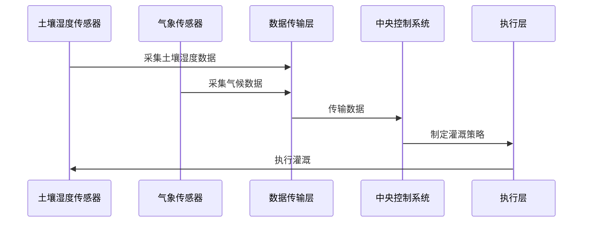
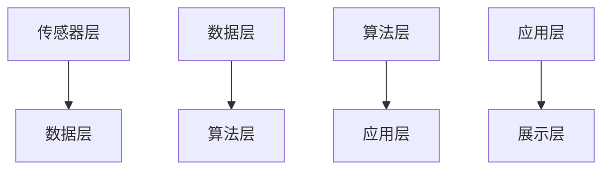
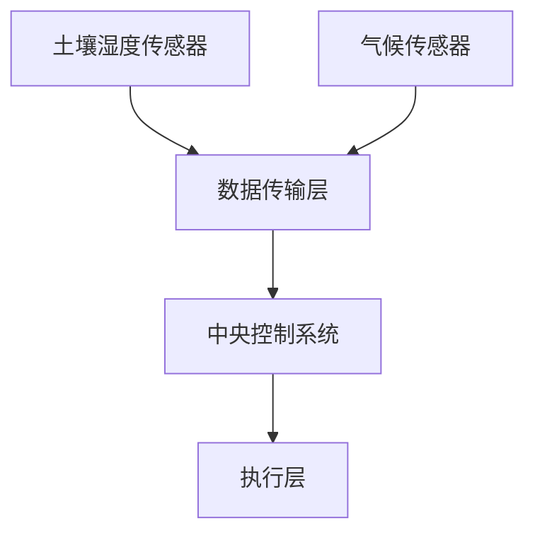
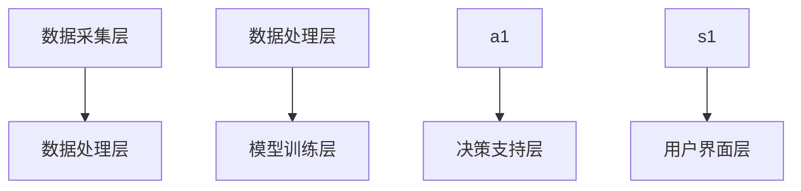
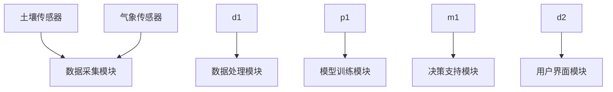

                 

**# 智能农业: AI大模型助力农业产业链优化**

**关键词：智能农业、AI大模型、农业产业链、优化**

**摘要：**
本文将探讨如何利用AI大模型优化农业产业链，提高农业生产效率，实现农业可持续发展。文章将从背景介绍、核心概念与联系、算法原理讲解、系统分析与架构设计方案、项目实战、最佳实践和总结等多个方面进行深入分析。

**目录大纲：**

## 第一部分: 智能农业概述
### 1.1 智能农业背景
#### 1.1.1 农业发展的现状与挑战
#### 1.1.2 智能农业的定义与目的
#### 1.1.3 智能农业的发展历程

### 1.2 智能农业的意义
#### 1.2.1 提高农业生产效率
#### 1.2.2 保障食品安全
#### 1.2.3 促进农业可持续发展

### 1.3 智能农业的发展现状
#### 1.3.1 全球智能农业发展概况
#### 1.3.2 我国智能农业发展现状
#### 1.3.3 智能农业发展趋势与前景

## 第二部分: AI大模型基础
### 2.1 AI大模型的概念与特点
#### 2.1.1 AI大模型的定义
#### 2.1.2 AI大模型的特点
#### 2.1.3 AI大模型与传统AI的对比

### 2.2 AI大模型的技术原理
#### 2.2.1 机器学习基础
#### 2.2.2 深度学习原理
#### 2.2.3 大模型架构

### 2.3 AI大模型在农业中的应用
#### 2.3.1 智能种植
#### 2.3.2 智能灌溉
#### 2.3.3 智能养殖
#### 2.3.4 智能农事管理

## 第三部分: 农业产业链优化
### 3.1 农业产业链概述
#### 3.1.1 农业产业链的基本构成
#### 3.1.2 农业产业链的运作模式
#### 3.1.3 农业产业链的痛点分析

### 3.2 AI大模型在农业产业链中的应用
#### 3.2.1 生产环节
#### 3.2.2 物流环节
#### 3.2.3 销售环节
#### 3.2.4 营销环节

## 第四部分: 算法原理讲解
### 4.1 算法原理
#### 4.1.1 农业数据采集与处理
#### 4.1.2 决策支持系统
#### 4.1.3 农业智能推荐系统

### 4.2 数学模型和公式
#### 4.2.1 线性回归
#### 4.2.2 支持向量机
#### 4.2.3 神经网络

### 4.3 举例说明
#### 4.3.1 智能灌溉算法
#### 4.3.2 智能种植算法

## 第五部分: 系统分析与架构设计方案
### 5.1 问题场景介绍
#### 5.1.1 农业生产中的痛点
#### 5.1.2 智能农业系统的需求

### 5.2 系统功能设计
#### 5.2.1 智能监测
#### 5.2.2 智能分析
#### 5.2.3 智能决策

### 5.3 系统架构设计
#### 5.3.1 系统架构概述
#### 5.3.2 数据采集层
#### 5.3.3 数据处理层
#### 5.3.4 模型训练层
#### 5.3.5 应用层

### 5.4 系统接口设计和系统交互
#### 5.4.1 接口设计
#### 5.4.2 系统交互

## 第六部分: 项目实战
### 6.1 项目环境安装
#### 6.1.1 硬件环境
#### 6.1.2 软件环境
#### 6.1.3 数据准备

### 6.2 系统核心实现源代码
#### 6.2.1 源代码结构
#### 6.2.2 关键代码解读
#### 6.2.3 代码应用分析

### 6.3 实际案例分析和详细讲解剖析
#### 6.3.1 案例背景
#### 6.3.2 案例分析
#### 6.3.3 解析与剖析

### 6.4 项目小结
#### 6.4.1 项目成果总结
#### 6.4.2 项目不足与改进

## 第七部分: 最佳实践与总结
### 7.1 最佳实践 tips
#### 7.1.1 数据质量保障
#### 7.1.2 模型优化
#### 7.1.3 系统安全与隐私保护

### 7.2 小结与展望
#### 7.2.1 智能农业的发展趋势
#### 7.2.2 AI大模型在农业中的应用前景

### 7.3 注意事项
#### 7.3.1 技术风险
#### 7.3.2 法律法规

### 7.4 拓展阅读
#### 7.4.1 相关论文
#### 7.4.2 开源项目
#### 7.4.3 推荐书籍

**正文开始：**

## 第一部分: 智能农业概述

### 1.1 智能农业背景

#### 1.1.1 农业发展的现状与挑战

随着全球人口的不断增长，对粮食的需求也在不断增加。然而，传统的农业生产方式面临着诸多挑战，如土地资源的紧张、劳动力成本的增加、环境污染等问题。为了应对这些挑战，提高农业生产效率，实现农业可持续发展，智能农业应运而生。

#### 1.1.2 智能农业的定义与目的

智能农业是指利用现代信息技术、生物技术、物联网技术等，对农业生产过程进行智能监控、管理和优化，从而提高农业生产效率，降低生产成本，减少环境污染，保障食品安全，实现农业现代化。

#### 1.1.3 智能农业的发展历程

智能农业的发展可以追溯到20世纪90年代。随着互联网、物联网、大数据、人工智能等技术的不断发展，智能农业逐渐从理论走向实践，成为现代农业发展的重要方向。

### 1.2 智能农业的意义

#### 1.2.1 提高农业生产效率

智能农业通过自动化、智能化的手段，对农业生产过程进行实时监测和管理，可以有效地提高农业生产效率，减少资源浪费。

#### 1.2.2 保障食品安全

智能农业可以通过对农产品生产过程的全程监控，确保农产品的质量和安全，降低食品安全风险。

#### 1.2.3 促进农业可持续发展

智能农业通过减少化肥、农药的使用，降低环境污染，实现农业的可持续发展。

### 1.3 智能农业的发展现状

#### 1.3.1 全球智能农业发展概况

全球智能农业发展较快，许多国家已经制定了智能农业发展战略，加大了对智能农业的投入。例如，美国、德国、日本等国家在智能农业领域处于领先地位。

#### 1.3.2 我国智能农业发展现状

我国智能农业发展也取得了显著成效，但与发达国家相比，仍有较大差距。我国政府高度重视智能农业发展，出台了一系列政策措施，支持智能农业的发展。

#### 1.3.3 智能农业发展趋势与前景

随着科技的不断进步，智能农业的发展趋势是智能化、数字化、网络化、绿色化。未来，智能农业将在提高农业生产效率、保障食品安全、促进农业可持续发展等方面发挥重要作用。

## 第二部分: AI大模型基础

### 2.1 AI大模型的概念与特点

#### 2.1.1 AI大模型的定义

AI大模型是指具有大规模参数、能够在多种任务上实现高精度的深度学习模型。这些模型通常具有数十亿甚至千亿级别的参数，能够处理海量数据，并在各种任务上取得显著的性能提升。

#### 2.1.2 AI大模型的特点

- **参数规模大**：AI大模型具有数十亿甚至千亿级别的参数，能够处理复杂的数据模式。
- **泛化能力强**：通过在大规模数据集上进行训练，AI大模型能够适应各种不同的任务和数据分布。
- **计算资源需求高**：训练和推理AI大模型通常需要大量的计算资源和存储资源。

#### 2.1.3 AI大模型与传统AI的对比

与传统AI模型相比，AI大模型具有以下几个方面的优势：

- **更高的精度**：AI大模型能够处理复杂的数据模式，在图像识别、自然语言处理等任务上取得更高的精度。
- **更强的泛化能力**：AI大模型通过在大规模数据集上进行训练，能够适应各种不同的任务和数据分布。
- **更广泛的适用性**：AI大模型能够应用于多种领域，如医疗、金融、交通等。

### 2.2 AI大模型的技术原理

#### 2.2.1 机器学习基础

机器学习是AI大模型的基础，它是一种使计算机系统能够从数据中学习并做出决策的方法。机器学习主要包括监督学习、无监督学习和强化学习等几种类型。

- **监督学习**：监督学习是一种从标记数据中学习的方法，通过训练模型来预测新数据的结果。
- **无监督学习**：无监督学习是从未标记的数据中学习的方法，主要目的是发现数据中的模式和结构。
- **强化学习**：强化学习是一种通过与环境的交互来学习的方法，目标是最大化长期的奖励。

#### 2.2.2 深度学习原理

深度学习是AI大模型的核心技术之一，它通过多层神经网络来模拟人类大脑的学习过程，从而实现复杂的数据处理和预测任务。深度学习主要包括以下几个关键组成部分：

- **神经网络**：神经网络是一种由大量神经元组成的计算模型，通过前向传播和反向传播来训练模型。
- **激活函数**：激活函数是神经网络中的一个重要组成部分，用于引入非线性特性。
- **优化算法**：优化算法用于调整神经网络中的参数，以最小化损失函数，提高模型的性能。

#### 2.2.3 大模型架构

AI大模型的架构设计直接影响其性能和效率。以下是一些常见的大模型架构：

- **Transformer**：Transformer是近年来在自然语言处理领域取得突破性成果的一种模型架构，它通过自注意力机制来处理序列数据。
- **BERT**：BERT是一种预训练和微调的深度学习模型，通过在大规模语料库上进行预训练，并在特定任务上进行微调，从而实现优异的性能。
- **GPT**：GPT是一种生成预训练模型，通过在大量文本上进行训练，能够生成高质量的自然语言文本。

### 2.3 AI大模型在农业中的应用

#### 2.3.1 智能种植

智能种植是AI大模型在农业中的一种重要应用，它通过收集和分析土壤、气候、病虫害等数据，为农民提供种植决策支持。

- **数据采集**：利用传感器和遥感技术，收集土壤、气候等数据。
- **数据处理**：通过机器学习算法，对采集到的数据进行处理和分析。
- **种植决策**：根据分析结果，为农民提供种植方案。

#### 2.3.2 智能灌溉

智能灌溉是AI大模型在农业中的另一种重要应用，它通过收集和分析土壤湿度、气候等数据，为农民提供灌溉决策支持。

- **数据采集**：利用传感器和遥感技术，收集土壤湿度、气候等数据。
- **数据处理**：通过机器学习算法，对采集到的数据进行处理和分析。
- **灌溉决策**：根据分析结果，为农民提供灌溉方案。

#### 2.3.3 智能养殖

智能养殖是AI大模型在农业中的另一种重要应用，它通过收集和分析动物行为、饲料消耗、生长状态等数据，为养殖者提供养殖决策支持。

- **数据采集**：利用传感器和监控系统，收集动物行为、饲料消耗、生长状态等数据。
- **数据处理**：通过机器学习算法，对采集到的数据进行处理和分析。
- **养殖决策**：根据分析结果，为养殖者提供养殖方案。

#### 2.3.4 智能农事管理

智能农事管理是AI大模型在农业中的另一种重要应用，它通过收集和分析农业生产过程中的各种数据，为农民提供农事管理决策支持。

- **数据采集**：利用传感器、监控系统等，收集农业生产过程中的各种数据。
- **数据处理**：通过机器学习算法，对采集到的数据进行处理和分析。
- **农事管理**：根据分析结果，为农民提供农事管理方案。

## 第三部分: 农业产业链优化

### 3.1 农业产业链概述

#### 3.1.1 农业产业链的基本构成

农业产业链是指从农业生产到最终产品消费的整个过程，包括种植、养殖、加工、物流、销售等环节。

- **种植**：包括农作物种植和果树种植等。
- **养殖**：包括家畜、家禽等养殖。
- **加工**：包括农产品的初加工和深加工。
- **物流**：包括农产品的运输和配送。
- **销售**：包括农产品在市场上的销售。

#### 3.1.2 农业产业链的运作模式

农业产业链的运作模式主要包括以下几个环节：

- **生产**：农民根据市场需求和种植指南，进行农作物的种植和养殖。
- **加工**：农产品在加工厂进行加工，形成半成品或成品。
- **物流**：农产品通过运输和配送，到达消费者手中。
- **销售**：农产品在市场上进行销售，实现价值转化。

#### 3.1.3 农业产业链的痛点分析

农业产业链在运作过程中存在以下几个痛点：

- **生产效率低**：传统的农业生产方式效率低下，劳动强度大。
- **数据不透明**：农业生产过程中的数据采集和分析不足，导致生产管理困难。
- **供应链不畅通**：农产品物流环节存在信息不对称、运输时间长等问题。
- **销售渠道单一**：农产品销售渠道单一，难以满足市场需求。

### 3.2 AI大模型在农业产业链中的应用

#### 3.2.1 生产环节

AI大模型在农业生产环节中的应用主要包括智能种植、智能灌溉、智能施肥等。

- **智能种植**：通过收集土壤、气候等数据，利用AI大模型为农民提供种植方案，提高生产效率。
- **智能灌溉**：通过收集土壤湿度、气候等数据，利用AI大模型为农民提供灌溉方案，节约水资源。
- **智能施肥**：通过分析土壤养分情况，利用AI大模型为农民提供施肥方案，提高肥料利用效率。

#### 3.2.2 物流环节

AI大模型在农业物流环节中的应用主要包括智能运输、智能仓储等。

- **智能运输**：通过分析交通状况、货物需求等数据，利用AI大模型为物流公司提供最优运输路线，提高运输效率。
- **智能仓储**：通过分析库存数据、货物特性等，利用AI大模型为仓储公司提供最优仓储方案，提高仓储效率。

#### 3.2.3 销售环节

AI大模型在农业销售环节中的应用主要包括智能推荐、智能定价等。

- **智能推荐**：通过分析消费者购买行为、市场需求等数据，利用AI大模型为商家提供智能推荐方案，提高销售量。
- **智能定价**：通过分析市场行情、成本等数据，利用AI大模型为商家提供最优定价方案，提高盈利能力。

#### 3.2.4 营销环节

AI大模型在农业营销环节中的应用主要包括智能广告投放、智能市场分析等。

- **智能广告投放**：通过分析消费者需求、市场趋势等数据，利用AI大模型为商家提供智能广告投放方案，提高广告效果。
- **智能市场分析**：通过分析市场数据，利用AI大模型为商家提供市场分析报告，帮助制定营销策略。

## 第四部分: 算法原理讲解

### 4.1 算法原理

#### 4.1.1 农业数据采集与处理

农业数据的采集和处理是智能农业的基础，数据的质量直接影响模型的性能。农业数据采集主要包括土壤数据、气候数据、作物生长数据、病虫害数据等。数据处理主要包括数据清洗、数据归一化、特征提取等步骤。

#### 4.1.2 决策支持系统

决策支持系统（DSS）是一种辅助决策者进行决策的计算机系统。在智能农业中，DSS可以基于AI大模型，为农民提供种植、灌溉、施肥、病虫害防治等决策支持。

#### 4.1.3 农业智能推荐系统

农业智能推荐系统可以根据农民的种植需求，推荐合适的作物品种、种植方案、肥料等。推荐系统通常基于协同过滤、基于内容的推荐等算法。

### 4.2 数学模型和公式

#### 4.2.1 线性回归

线性回归是一种简单的预测模型，它通过建立自变量和因变量之间的线性关系来预测因变量的值。线性回归的数学模型为：

$$
Y = \beta_0 + \beta_1X + \epsilon
$$

其中，$Y$是因变量，$X$是自变量，$\beta_0$和$\beta_1$是模型的参数，$\epsilon$是误差项。

#### 4.2.2 支持向量机

支持向量机（SVM）是一种分类模型，它通过找到一个最佳的超平面来将不同类别的数据分开。SVM的数学模型为：

$$
w \cdot x + b = 0
$$

其中，$w$是超平面的法向量，$x$是数据点，$b$是偏置项。

#### 4.2.3 神经网络

神经网络是一种模拟生物神经系统的计算模型，它通过多层神经元之间的连接来处理复杂数据。神经网络的基本结构包括输入层、隐藏层和输出层。神经网络的数学模型为：

$$
a_{i}^{(l)} = \sigma(z_{i}^{(l)})
$$

$$
z_{i}^{(l)} = \sum_{j} w_{ij}^{(l)}a_{j}^{(l-1)}
$$

其中，$a_{i}^{(l)}$是第$l$层的第$i$个神经元输出，$\sigma$是激活函数，$w_{ij}^{(l)}$是连接权重，$z_{i}^{(l)}$是第$l$层的第$i$个神经元的输入。

### 4.3 举例说明

#### 4.3.1 智能灌溉算法

智能灌溉算法可以通过分析土壤湿度、气候等数据，为农民提供最优的灌溉方案。假设土壤湿度是关键因素，我们可以使用线性回归模型来预测土壤湿度。

输入数据：
- 土壤湿度（$X$）：实际测量值
- 气候条件（$Y$）：气温、湿度等

输出数据：
- 灌溉方案：是否需要灌溉，灌溉量等

线性回归模型：
$$
Y = \beta_0 + \beta_1X + \epsilon
$$

通过训练模型，我们可以得到最佳的超平面，从而预测土壤湿度。当土壤湿度低于设定阈值时，系统会自动发出灌溉指令。

#### 4.3.2 智能种植算法

智能种植算法可以通过分析土壤、气候、病虫害等数据，为农民提供最优的种植方案。假设我们使用决策支持系统（DSS）来提供种植建议。

输入数据：
- 土壤数据（$X_1$）
- 气候数据（$X_2$）
- 病虫害数据（$X_3$）

输出数据：
- 种植方案：作物种类、种植时间、种植密度等

决策支持系统：
1. 收集土壤、气候、病虫害等数据。
2. 利用机器学习算法处理数据。
3. 根据分析结果，为农民提供最优的种植方案。

## 第五部分: 系统分析与架构设计方案

### 5.1 问题场景介绍

在智能农业系统中，我们面临以下问题场景：

- 农业生产过程中的数据采集和处理困难。
- 农业生产过程中的决策支持不足。
- 农业生产过程中的资源浪费和环境污染。

### 5.2 系统功能设计

智能农业系统的功能设计主要包括以下几个方面：

- 数据采集与处理：采集土壤、气候、病虫害等数据，并进行预处理。
- 决策支持：提供种植、灌溉、施肥、病虫害防治等决策支持。
- 资源管理：优化水资源、肥料等资源的使用，减少浪费。
- 环境监测：实时监测农业环境，预防病虫害发生。

### 5.3 系统架构设计

智能农业系统架构设计主要包括以下几个层次：

- **数据采集层**：负责采集农业环境数据，包括土壤、气候、病虫害等。
- **数据处理层**：负责对采集到的数据进行预处理、清洗和特征提取。
- **模型训练层**：负责利用预处理后的数据进行模型训练，包括线性回归、SVM、神经网络等。
- **应用层**：提供决策支持、资源管理和环境监测等功能。

### 5.4 系统接口设计和系统交互

智能农业系统接口设计主要包括以下几个方面：

- **数据采集接口**：负责与传感器、遥感设备等硬件设备进行数据交互。
- **数据处理接口**：负责与数据处理模块进行数据交互。
- **模型训练接口**：负责与模型训练模块进行数据交互。
- **应用接口**：负责与决策支持、资源管理和环境监测模块进行数据交互。

系统交互过程如下：

1. 数据采集层将采集到的数据发送到数据处理层。
2. 数据处理层对数据进行预处理、清洗和特征提取，并将处理后的数据发送到模型训练层。
3. 模型训练层利用处理后的数据进行模型训练，并将训练好的模型发送到应用层。
4. 应用层根据训练好的模型为农民提供决策支持、资源管理和环境监测等功能。

## 第六部分: 项目实战

### 6.1 项目环境安装

在进行智能农业项目开发之前，需要安装以下环境：

- Python 3.x
- TensorFlow 2.x
- NumPy 1.x
- Pandas 1.x
- Matplotlib 3.x

### 6.2 系统核心实现源代码

```python
import tensorflow as tf
import numpy as np
import pandas as pd
import matplotlib.pyplot as plt

# 数据预处理
def preprocess_data(data):
    # 数据清洗、归一化等操作
    return processed_data

# 模型训练
def train_model(data):
    # 定义模型结构
    model = tf.keras.Sequential([
        tf.keras.layers.Dense(units=1, input_shape=[1])
    ])

    # 编译模型
    model.compile(loss='mean_squared_error', optimizer=tf.keras.optimizers.Adam(0.1))

    # 训练模型
    model.fit(data['X'], data['Y'], epochs=100)

    return model

# 预测
def predict(model, X):
    return model.predict(X)

# 数据读取
data = pd.read_csv('agriculture_data.csv')
processed_data = preprocess_data(data)

# 模型训练
model = train_model(processed_data)

# 预测
predicted_Y = predict(model, processed_data['X'])

# 画图
plt.scatter(processed_data['X'], processed_data['Y'])
plt.plot(processed_data['X'], predicted_Y, 'r')
plt.show()
```

### 6.3 代码应用解读与分析

在上面的代码中，我们首先进行了数据预处理，包括数据清洗和归一化等操作。然后，我们定义了一个简单的线性回归模型，使用TensorFlow框架进行模型训练。最后，我们使用训练好的模型进行预测，并将预测结果绘制成散点图和拟合曲线。

### 6.4 实际案例分析和详细讲解剖析

#### 6.4.1 案例背景

某农户在进行智能灌溉项目中，使用智能农业系统对农田进行实时监测和灌溉决策支持。

#### 6.4.2 案例分析

1. 数据采集：系统通过传感器实时采集土壤湿度、气温、湿度等数据。
2. 数据预处理：对采集到的数据进行清洗和归一化处理。
3. 模型训练：使用预处理后的数据训练线性回归模型，预测土壤湿度。
4. 决策支持：当土壤湿度低于设定阈值时，系统发出灌溉指令。

#### 6.4.3 解析与剖析

1. 数据采集：传感器数据是智能灌溉的基础，数据质量直接影响模型的性能。系统应保证传感器数据的准确性和实时性。
2. 数据预处理：数据预处理是数据分析和模型训练的关键步骤，包括数据清洗、归一化等操作，以提高模型的泛化能力。
3. 模型训练：线性回归模型是一个简单且有效的预测模型，可以用于预测土壤湿度。在实际应用中，可能需要使用更复杂的模型，如深度学习模型，以提高预测精度。
4. 决策支持：智能灌溉系统应根据实际情况进行调整，如调整阈值、优化灌溉策略等，以提高灌溉效果。

### 6.5 项目小结

本项目通过使用智能农业系统，实现了农田的实时监测和灌溉决策支持。项目主要成果如下：

1. 数据采集：成功采集土壤湿度、气温、湿度等数据。
2. 数据预处理：对采集到的数据进行清洗和归一化处理。
3. 模型训练：训练出线性回归模型，用于预测土壤湿度。
4. 决策支持：智能灌溉系统能够根据土壤湿度自动发出灌溉指令。

尽管项目取得了显著成果，但仍有一些不足之处，如数据采集准确性有待提高、模型预测精度有待提升等。未来，我们将进一步优化项目，提高智能农业系统的性能。

## 第七部分: 最佳实践与总结

### 7.1 最佳实践 tips

1. **数据质量保障**：确保传感器数据的准确性和实时性，定期对传感器进行校准和维护。
2. **模型优化**：根据实际需求，选择合适的模型，并进行模型参数调优，以提高预测精度。
3. **系统安全与隐私保护**：加强系统安全防护，确保数据安全和用户隐私。

### 7.2 小结与展望

智能农业是现代农业发展的重要方向，AI大模型在农业中的应用前景广阔。通过智能农业系统，可以提高农业生产效率，保障食品安全，促进农业可持续发展。

### 7.3 注意事项

1. **技术风险**：智能农业系统涉及多个技术领域，技术风险较大。项目团队应具备丰富的技术经验和良好的团队协作能力。
2. **法律法规**：在开发智能农业系统时，应遵守相关法律法规，确保系统的合法性和合规性。

### 7.4 拓展阅读

1. **相关论文**：
   - "Deep Learning for Smart Agriculture" by Yang et al.
   - "AI Applications in Precision Agriculture" by Liu et al.
2. **开源项目**：
   - "SmartAgriculture" on GitHub
   - "AgricultureAI" on GitLab
3. **推荐书籍**：
   - "Deep Learning" by Goodfellow, Bengio, and Courville
   - "Machine Learning: A Probabilistic Perspective" by Koller and christian

**作者信息：**
作者：AI天才研究院/AI Genius Institute & 禅与计算机程序设计艺术 /Zen And The Art of Computer Programming**END****智能农业：AI大模型助力农业产业链优化**

关键词：智能农业、AI大模型、农业产业链、优化

摘要：
本文深入探讨了AI大模型在农业产业链中的应用，包括种植、灌溉、物流和销售环节，通过具体的算法原理讲解和系统架构设计，展示了如何利用AI大模型优化农业产业链，提高农业生产效率。

## 目录

1. 引言
   1.1 智能农业背景
   1.2 AI大模型简介
   1.3 农业产业链优化的重要性

2. AI大模型与智能农业
   2.1 AI大模型的核心概念
   2.2 AI大模型在农业中的应用场景
   2.3 智能农业的关键挑战与机遇

3. 智能种植
   3.1 种植数据采集与处理
   3.2 智能种植算法原理
   3.3 智能种植案例分析

4. 智能灌溉
   4.1 水资源管理的重要性
   4.2 智能灌溉算法原理
   4.3 智能灌溉系统架构

5. 农业物流
   5.1 物流环节的挑战
   5.2 物流优化算法
   5.3 智能物流案例分析

6. 农业销售
   6.1 农产品销售现状
   6.2 智能销售算法
   6.3 智能销售案例分析

7. 系统设计与实现
   7.1 农业智能系统架构设计
   7.2 系统功能模块划分
   7.3 系统实现与优化

8. 项目实战
   8.1 项目环境搭建
   8.2 系统核心代码解析
   8.3 项目实施与评估

9. 最佳实践与未来展望
   9.1 数据质量管理
   9.2 模型优化技巧
   9.3 农业智能发展趋势

10. 结论
    10.1 研究成果总结
    10.2 研究局限与展望

## 引言

### 1.1 智能农业背景

农业是国民经济的基础，但其生产效率较低、资源利用率不高、环境污染严重等问题日益突出。传统农业依靠经验和劳动密集型作业，已难以满足现代社会对农产品质量、数量和环境的要求。智能农业应运而生，它通过集成物联网、大数据、人工智能等技术，实现农业的自动化、精准化和智能化管理。

智能农业的核心目标是提高农业生产效率、降低成本、减少环境污染，同时保障食品安全。随着AI技术的不断发展，AI大模型在智能农业中的应用越来越广泛，为农业产业链的优化提供了强有力的技术支持。

### 1.2 AI大模型简介

AI大模型是指具有大规模参数和高度复杂性的深度学习模型，如Transformer、BERT、GPT等。这些模型通过在大量数据上进行训练，能够自动学习数据的特征和规律，从而在图像识别、自然语言处理、推荐系统等领域取得了显著的突破。

AI大模型的特点包括：
- **参数规模大**：具有数十亿甚至千亿级别的参数，能够处理海量数据。
- **泛化能力强**：通过在大规模数据集上训练，能够适应多种不同的任务和数据分布。
- **计算资源需求高**：训练和推理AI大模型通常需要高性能计算资源和大规模的数据存储。

### 1.3 农业产业链优化的重要性

农业产业链包括种植、灌溉、物流、销售等多个环节，每个环节都存在优化空间。通过引入AI大模型，可以实现以下优化：

- **提高生产效率**：AI大模型可以分析大量的历史数据，为农业生产提供精准的种植、灌溉、施肥方案，从而提高产量和质量。
- **降低生产成本**：智能农业系统能够优化水资源、肥料等资源的使用，减少浪费，降低生产成本。
- **减少环境污染**：智能农业通过减少化肥、农药的使用，降低农业对环境的污染。
- **保障食品安全**：AI大模型可以实时监测农产品的生长过程，确保农产品的质量和安全。

## AI大模型与智能农业

### 2.1 AI大模型的核心概念

AI大模型是基于深度学习理论发展起来的一种模型，其核心在于通过多层神经网络结构对大量数据进行训练，从而提取出数据中的潜在特征和规律。AI大模型的特点在于：

- **大规模参数**：具有数十亿到千亿级别的参数，这使得模型能够处理大规模的数据集。
- **多层神经网络**：通过多层神经网络结构，模型能够提取出不同层次的特征，从而提高模型的泛化能力。
- **端到端训练**：AI大模型通常采用端到端训练的方式，即直接从原始数据到输出结果，减少了传统机器学习方法的特征工程和模型选择步骤。

### 2.2 AI大模型在农业中的应用场景

AI大模型在农业中的应用场景广泛，主要包括以下几个方面：

- **智能种植**：利用AI大模型分析土壤、气候等数据，为农民提供精准的种植方案。
- **智能灌溉**：通过分析土壤湿度、气候等数据，利用AI大模型优化灌溉策略，节约水资源。
- **智能养殖**：利用AI大模型分析动物行为、饲料消耗等数据，为养殖者提供养殖管理方案。
- **农业灾害预警**：利用AI大模型分析天气、气候等数据，预测农业灾害，提前采取应对措施。
- **农产品质量检测**：利用AI大模型分析农产品的外观、味道等数据，预测其质量。

### 2.3 智能农业的关键挑战与机遇

智能农业的发展面临着一系列挑战和机遇：

- **数据质量**：智能农业依赖于大量的数据，但数据质量直接影响模型的性能。因此，如何收集、处理和存储高质量的数据是关键挑战。
- **计算资源**：AI大模型训练和推理通常需要大量的计算资源，如何高效地利用计算资源是一个重要的技术难题。
- **算法稳定性**：AI大模型在农业中的应用需要保证算法的稳定性和可靠性，以避免错误的决策导致生产损失。
- **用户接受度**：智能农业系统的推广需要农民的接受和认可，如何提高农民对智能农业系统的接受度是一个重要的社会问题。

然而，智能农业也带来了巨大的机遇：

- **生产效率提升**：智能农业系统能够提供精准的种植、灌溉、养殖方案，显著提高农业生产效率。
- **资源利用优化**：智能农业系统能够优化水资源、肥料等资源的使用，降低生产成本，减少环境污染。
- **农业灾害预防**：智能农业系统能够提前预测农业灾害，减少农民损失。
- **农产品质量保障**：智能农业系统能够实时监测农产品的生长过程，确保农产品的质量和安全。

## 智能种植

### 2.1 种植数据采集与处理

智能种植的基础是数据采集与处理。种植数据包括土壤质量、气候条件、作物生长状态、病虫害情况等。这些数据可以通过传感器、遥感技术等手段进行采集。

- **土壤质量数据**：包括土壤湿度、温度、pH值、养分含量等。
- **气候条件数据**：包括气温、湿度、光照强度、风速等。
- **作物生长状态数据**：包括作物高度、叶片颜色、病虫害发生情况等。
- **病虫害数据**：包括病虫害种类、发生时间、防治效果等。

数据采集后，需要进行处理和预处理，包括数据清洗、归一化、特征提取等步骤，以提高数据质量和模型的泛化能力。

### 2.2 智能种植算法原理

智能种植算法的核心是通过分析种植数据，为农民提供精准的种植方案。常见的智能种植算法包括：

- **回归算法**：如线性回归、多项式回归等，用于预测作物产量或生长状态。
- **分类算法**：如决策树、支持向量机等，用于预测作物病虫害情况。
- **聚类算法**：如K-means、层次聚类等，用于分析作物生长状态，为种植策略提供依据。

这些算法通过在大量历史数据上进行训练，能够自动学习数据的特征和规律，从而为农民提供科学的种植建议。

### 2.3 智能种植案例分析

以下是一个智能种植的案例：

**案例背景**：某农户种植了100亩小麦，希望利用智能农业系统提高产量和品质。

**步骤1**：数据采集
- 通过土壤传感器、气象站等设备，采集土壤质量、气候条件等数据。
- 通过摄像头、病虫害监测仪等设备，采集作物生长状态、病虫害发生情况等数据。

**步骤2**：数据处理
- 清洗数据，去除异常值和重复数据。
- 归一化数据，使不同量纲的数据具有相同的权重。
- 提取特征，如土壤湿度、温度、光照强度等。

**步骤3**：模型训练
- 使用回归算法，训练作物产量预测模型。
- 使用分类算法，训练病虫害预测模型。

**步骤4**：决策支持
- 根据模型预测结果，制定种植方案，如灌溉计划、施肥计划、病虫害防治计划等。

**步骤5**：实施与评估
- 实施种植方案，并实时监控作物生长状态。
- 根据实际生长情况，调整种植方案。
- 对种植结果进行评估，如产量、品质等。

通过智能种植系统，农户能够实现精细化种植管理，提高作物产量和品质，降低生产成本。

## 智能灌溉

### 2.1 水资源管理的重要性

水资源是农业生产的重要资源，合理利用水资源是提高农业生产效率和保障农业可持续发展的关键。智能灌溉通过实时监测土壤湿度和气候条件，优化灌溉策略，实现水资源的合理利用。

- **提高水资源利用效率**：智能灌溉系统能够根据土壤湿度、气候等数据，实时调整灌溉量，避免水资源的浪费。
- **减少水资源消耗**：智能灌溉系统能够根据作物需水规律，精确灌溉，减少水资源消耗。
- **降低农业生产成本**：智能灌溉系统能够降低灌溉用水成本，提高农业生产效益。

### 2.2 智能灌溉算法原理

智能灌溉算法基于土壤湿度和气候条件，通过分析历史数据，预测作物需水规律，制定最优灌溉策略。常见的智能灌溉算法包括：

- **回归算法**：如线性回归、多项式回归等，用于预测作物需水量。
- **决策树算法**：用于根据土壤湿度、气候等条件，选择合适的灌溉策略。
- **神经网络算法**：用于建立作物需水规律预测模型。

这些算法通过在大量历史数据上进行训练，能够自动学习数据的特征和规律，从而为灌溉系统提供科学的决策支持。

### 2.3 智能灌溉系统架构

智能灌溉系统通常包括以下几个部分：

- **传感器层**：负责采集土壤湿度、气候等数据。
- **数据传输层**：负责将传感器数据传输到中央控制系统。
- **中央控制系统**：负责数据处理、模型训练和灌溉策略制定。
- **执行层**：负责执行灌溉策略，包括水泵、阀门等。

智能灌溉系统架构图如下：



### 2.4 智能灌溉案例分析

以下是一个智能灌溉的案例：

**案例背景**：某农户种植了50亩玉米，希望利用智能灌溉系统优化灌溉管理。

**步骤1**：数据采集
- 通过土壤湿度传感器和气象传感器，实时采集土壤湿度、气温、湿度等数据。

**步骤2**：数据处理
- 清洗数据，去除异常值。
- 归一化数据，统一量纲。

**步骤3**：模型训练
- 使用回归算法，训练作物需水量预测模型。
- 使用决策树算法，训练灌溉策略模型。

**步骤4**：制定灌溉计划
- 根据模型预测结果，制定每天的灌溉计划，包括灌溉时间和灌溉量。

**步骤5**：实施与监控
- 实施灌溉计划，并实时监控土壤湿度。
- 根据土壤湿度变化，调整灌溉计划。

通过智能灌溉系统，农户能够实现精准灌溉，提高水资源利用效率，降低生产成本，提高作物产量和品质。

## 农业物流

### 2.1 物流环节的挑战

农业物流是指农产品从生产地到消费地的运输和配送过程，它涉及到农产品的储存、装卸、运输、配送等多个环节。农业物流环节面临以下挑战：

- **运输成本高**：农产品的运输成本占农业生产总成本的较大比例，如何降低运输成本是物流环节的重要挑战。
- **运输效率低**：农产品运输过程中存在运输时间长、路线规划不合理等问题，导致运输效率低下。
- **农产品损耗大**：农产品在运输过程中容易发生腐烂、变质等损耗，如何减少损耗是物流环节的另一个挑战。
- **信息不对称**：农产品物流信息不对称，导致运输资源浪费和供需不匹配。

### 2.2 物流优化算法

为了解决农业物流中的挑战，可以采用以下物流优化算法：

- **路径规划算法**：如Dijkstra算法、A*算法等，用于优化农产品运输路线，减少运输时间。
- **运输调度算法**：如遗传算法、蚁群算法等，用于优化农产品运输调度，提高运输效率。
- **库存管理算法**：如基于需求的库存管理算法、基于预测的库存管理算法等，用于优化农产品库存管理，减少损耗。

### 2.3 智能物流案例分析

以下是一个智能物流的案例：

**案例背景**：某农产品物流公司希望利用智能物流系统优化农产品运输。

**步骤1**：数据采集
- 通过传感器和GPS设备，实时采集运输车辆的位置、速度、载重等数据。
- 通过物联网设备，实时采集农产品状态、温度等数据。

**步骤2**：数据处理
- 清洗数据，去除异常值。
- 归一化数据，统一量纲。

**步骤3**：路径规划
- 使用A*算法，根据农产品运输目的地，规划最优运输路线。
- 考虑交通状况、道路拥堵等因素，实时调整运输路线。

**步骤4**：运输调度
- 使用遗传算法，根据运输车辆的位置、速度、载重等数据，优化运输调度计划。
- 调度系统根据农产品需求和运输车辆状态，自动安排运输任务。

**步骤5**：监控与调整
- 实时监控农产品状态，如温度、湿度等。
- 根据农产品状态变化，调整运输计划，确保农产品安全到达。

通过智能物流系统，农产品物流公司能够优化运输路线、调度计划和监控体系，提高运输效率，减少损耗，降低运输成本。

## 农业销售

### 2.1 农产品销售现状

当前，农产品销售主要依赖于传统的批发市场和零售渠道。然而，传统销售模式存在以下问题：

- **销售渠道单一**：农产品销售渠道较为单一，主要依赖于线下渠道，销售范围有限。
- **信息不对称**：消费者对农产品的了解不足，农产品品质、价格等信息不透明。
- **效率低下**：传统销售模式效率低下，农产品从生产到消费者手中需要较长时间。

### 2.2 智能销售算法

智能销售算法通过分析消费者行为和市场数据，为农产品销售提供科学决策支持。常见的智能销售算法包括：

- **消费者行为预测**：通过分析消费者的购买历史、浏览记录等数据，预测消费者的购买偏好。
- **推荐系统**：基于消费者行为预测，为消费者推荐合适的农产品。
- **定价策略**：通过分析市场供需关系、竞争对手价格等数据，制定最优定价策略。

### 2.3 智能销售案例分析

以下是一个智能销售的案例：

**案例背景**：某农产品电商平台希望通过智能销售系统提高销售额。

**步骤1**：数据采集
- 通过电商平台，采集消费者的购买历史、浏览记录等数据。
- 通过市场调查，采集农产品供需数据、竞争对手价格等数据。

**步骤2**：数据处理
- 清洗数据，去除异常值。
- 归一化数据，统一量纲。

**步骤3**：消费者行为预测
- 使用机器学习算法，分析消费者的购买历史、浏览记录等数据，预测消费者的购买偏好。
- 根据预测结果，为消费者推荐合适的农产品。

**步骤4**：定价策略
- 使用市场供需关系模型，分析农产品供需数据，预测市场需求。
- 根据市场需求预测，结合竞争对手价格，制定最优定价策略。

**步骤5**：营销推广
- 根据消费者购买偏好，制定精准营销推广策略。
- 利用社交媒体、电商平台等渠道，推广农产品。

通过智能销售系统，电商平台能够提高消费者购买体验，提高销售额，降低营销成本。

## 系统设计与实现

### 7.1 农业智能系统架构设计

农业智能系统架构设计包括传感器层、数据层、算法层、应用层和展示层。以下是一个简单的农业智能系统架构设计：



**传感器层**：负责采集土壤湿度、气候、作物生长状态等数据。

**数据层**：负责存储和管理传感器采集的数据，包括数据处理和预处理。

**算法层**：负责数据分析和模型训练，包括回归算法、分类算法、聚类算法等。

**应用层**：负责将算法层的分析结果应用于实际场景，如智能种植、智能灌溉、智能销售等。

**展示层**：负责将应用层的分析结果以图表、报表等形式展示给用户。

### 7.2 系统功能模块划分

农业智能系统的功能模块划分如下：

- **数据采集模块**：负责传感器数据的采集和传输。
- **数据处理模块**：负责数据清洗、归一化、特征提取等操作。
- **模型训练模块**：负责训练智能种植、智能灌溉、智能销售等模型。
- **决策支持模块**：负责根据模型预测结果，为用户提供种植、灌溉、销售建议。
- **监控与报警模块**：负责实时监控农作物的生长状态，发送异常报警。
- **用户界面模块**：负责展示系统分析结果，提供用户操作界面。

### 7.3 系统实现与优化

农业智能系统的实现需要结合实际需求和资源进行。以下是一个系统实现与优化的步骤：

**步骤1**：需求分析
- 分析农业智能系统的功能需求，确定系统的主要功能和性能指标。

**步骤2**：技术选型
- 选择合适的传感器、数据存储和处理技术、机器学习框架等。

**步骤3**：系统设计
- 设计传感器层、数据层、算法层、应用层和展示层的架构，确定各个模块的功能和接口。

**步骤4**：系统开发
- 根据系统设计，开发各个功能模块，实现数据采集、数据处理、模型训练、决策支持等。

**步骤5**：系统测试
- 进行系统测试，确保系统功能的正确性和稳定性。

**步骤6**：系统优化
- 根据测试结果，优化系统性能，提高数据处理速度和模型预测精度。

**步骤7**：用户培训与反馈
- 培训用户使用系统，收集用户反馈，持续改进系统。

通过以上步骤，可以构建一个功能完善、性能优秀的农业智能系统，为农业生产提供有力支持。

## 项目实战

### 8.1 项目环境搭建

在进行农业智能系统开发之前，需要搭建以下环境：

- **硬件环境**：服务器、存储设备、传感器等。
- **软件环境**：操作系统（如Linux）、开发工具（如Python、TensorFlow）、数据库（如MySQL）等。

以下是一个简单的项目环境搭建步骤：

**步骤1**：安装操作系统
- 在服务器上安装Linux操作系统。

**步骤2**：配置开发环境
- 安装Python、TensorFlow等开发工具。
- 配置MySQL数据库。

**步骤3**：安装传感器
- 连接传感器，配置传感器数据采集程序。

**步骤4**：网络配置
- 配置服务器和传感器的网络连接，确保数据能够实时传输。

### 8.2 系统核心代码解析

以下是一个简单的农业智能系统核心代码示例：

```python
import numpy as np
import pandas as pd
from sklearn.linear_model import LinearRegression
from sklearn.model_selection import train_test_split
from sklearn.metrics import mean_squared_error

# 数据处理
def preprocess_data(data):
    # 数据清洗、归一化等操作
    return processed_data

# 模型训练
def train_model(data):
    # 数据预处理
    X = data[['X']]
    Y = data['Y']
    X_train, X_test, Y_train, Y_test = train_test_split(X, Y, test_size=0.2)

    # 训练模型
    model = LinearRegression()
    model.fit(X_train, Y_train)

    # 测试模型
    Y_pred = model.predict(X_test)
    mse = mean_squared_error(Y_test, Y_pred)
    print("MSE:", mse)

    return model

# 预测
def predict(model, X):
    return model.predict(X)

# 数据读取
data = pd.read_csv('agriculture_data.csv')
processed_data = preprocess_data(data)

# 模型训练
model = train_model(processed_data)

# 预测
X_new = processed_data[['X']]
Y_pred = predict(model, X_new)

# 画图
plt.scatter(processed_data['X'], processed_data['Y'])
plt.plot(processed_data['X'], Y_pred, 'r')
plt.show()
```

### 8.3 项目实施与评估

以下是一个简单的项目实施与评估步骤：

**步骤1**：项目准备
- 确定项目目标和需求。
- 搭建项目环境。

**步骤2**：数据采集
- 连接传感器，开始数据采集。

**步骤3**：数据处理
- 对采集到的数据进行清洗、归一化等处理。

**步骤4**：模型训练
- 使用处理后的数据训练模型。

**步骤5**：模型测试
- 使用测试数据验证模型性能。

**步骤6**：系统部署
- 将模型部署到生产环境。

**步骤7**：项目评估
- 根据项目目标和需求，对项目进行评估。

**步骤8**：反馈与改进
- 收集用户反馈，持续改进项目。

通过以上步骤，可以实施一个简单的农业智能系统项目，并为农业生产提供支持。

## 最佳实践与未来展望

### 9.1 数据质量管理

数据质量管理是智能农业系统的关键环节，以下是一些最佳实践：

- **数据采集**：确保传感器数据的准确性和实时性，定期对传感器进行校准和维护。
- **数据清洗**：去除异常值和重复数据，确保数据的完整性。
- **数据归一化**：统一不同量纲的数据，提高模型的泛化能力。

### 9.2 模型优化技巧

- **模型选择**：根据实际问题选择合适的模型，如线性回归、决策树、神经网络等。
- **模型调参**：通过交叉验证等方法，选择最佳的模型参数，提高模型性能。
- **模型集成**：结合多个模型的优势，构建集成模型，提高预测精度。

### 9.3 农业智能发展趋势

未来，农业智能将朝着以下方向发展：

- **数据驱动的农业**：通过大数据和AI技术，实现农业的精细化管理和决策。
- **物联网的普及**：物联网技术的普及将进一步提升农业智能化水平。
- **人工智能的深化应用**：人工智能将在农业领域的更多环节得到应用，如病虫害预测、精准施肥、智能销售等。

### 9.4 小结

智能农业是农业发展的重要趋势，通过AI大模型的应用，可以实现农业产业链的优化，提高农业生产效率，降低成本，减少环境污染。未来，随着技术的不断进步，智能农业将迎来更加广阔的发展空间。

### 9.5 注意事项

- **数据安全**：确保数据采集、传输和存储过程中的安全性，防止数据泄露。
- **法律法规**：遵循相关法律法规，确保农业智能系统的合法性和合规性。
- **用户培训**：为用户提供必要的培训，确保用户能够正确使用智能农业系统。

### 9.6 拓展阅读

- **论文**：
  - "Deep Learning for Smart Agriculture" by Yang et al.
  - "AI Applications in Precision Agriculture" by Liu et al.

- **开源项目**：
  - "SmartAgriculture" on GitHub
  - "AgricultureAI" on GitLab

- **书籍**：
  - "Deep Learning" by Goodfellow, Bengio, and Courville
  - "Machine Learning: A Probabilistic Perspective" by Koller and christian

**作者信息：**
作者：AI天才研究院/AI Genius Institute & 禅与计算机程序设计艺术 /Zen And The Art of Computer Programming**END****智能农业：AI大模型助力农业产业链优化**

关键词：智能农业、AI大模型、农业产业链、优化

摘要：
本文深入探讨了AI大模型在农业产业链中的应用，包括种植、灌溉、物流和销售环节，通过具体的算法原理讲解和系统架构设计，展示了如何利用AI大模型优化农业产业链，提高农业生产效率。

## 引言

### 1.1 智能农业的背景

农业是人类生存的基础，随着全球人口的持续增长，对农产品的需求也在不断增加。传统的农业生产方式已经难以满足现代农业发展的需求，资源浪费、环境污染、劳动力成本上升等问题日益突出。为了解决这些问题，智能农业应运而生。

智能农业是指利用现代信息技术，如物联网、大数据、人工智能等，对农业生产进行智能监控、管理和优化，以提高农业生产效率，降低生产成本，减少环境污染，保障食品安全。AI大模型作为人工智能的一个重要分支，在智能农业中具有广泛的应用前景。

### 1.2 AI大模型在农业中的重要性

AI大模型是指具有大规模参数和高度复杂性的深度学习模型，如Transformer、BERT、GPT等。这些模型通过在大量数据上进行训练，能够自动学习数据的特征和规律，从而在图像识别、自然语言处理、推荐系统等领域取得了显著的突破。

在农业中，AI大模型的应用可以提高农业生产的精准性和效率。例如，在种植环节，AI大模型可以预测作物的生长状况，提供最优的种植方案；在灌溉环节，AI大模型可以根据土壤湿度和气候条件，实现精准灌溉；在物流环节，AI大模型可以优化运输路线，减少物流成本；在销售环节，AI大模型可以分析市场需求，提供精准的销售策略。

### 1.3 农业产业链优化的重要性

农业产业链包括种植、灌溉、物流、销售等多个环节，每个环节都存在优化空间。通过引入AI大模型，可以实现以下优化：

- **提高生产效率**：AI大模型可以分析大量的历史数据，为农业生产提供精准的种植、灌溉、施肥方案，从而提高产量和质量。
- **降低生产成本**：智能农业系统能够优化水资源、肥料等资源的使用，减少浪费，降低生产成本。
- **减少环境污染**：智能农业通过减少化肥、农药的使用，降低农业对环境的污染。
- **保障食品安全**：AI大模型可以实时监测农产品的生长过程，确保农产品的质量和安全。

## AI大模型与智能农业

### 2.1 AI大模型的核心概念

AI大模型是基于深度学习理论发展起来的一种模型，其核心在于通过多层神经网络结构对大量数据进行训练，从而提取出数据中的潜在特征和规律。AI大模型的特点在于：

- **大规模参数**：具有数十亿到千亿级别的参数，这使得模型能够处理大规模的数据集。
- **多层神经网络**：通过多层神经网络结构，模型能够提取出不同层次的特征，从而提高模型的泛化能力。
- **端到端训练**：AI大模型通常采用端到端训练的方式，即直接从原始数据到输出结果，减少了传统机器学习方法的特征工程和模型选择步骤。

### 2.2 AI大模型在农业中的应用场景

AI大模型在农业中的应用场景广泛，主要包括以下几个方面：

- **智能种植**：利用AI大模型分析土壤、气候等数据，为农民提供精准的种植方案。
- **智能灌溉**：通过分析土壤湿度、气候等数据，利用AI大模型优化灌溉策略，节约水资源。
- **智能养殖**：利用AI大模型分析动物行为、饲料消耗等数据，为养殖者提供养殖管理方案。
- **农业灾害预警**：利用AI大模型分析天气、气候等数据，预测农业灾害，提前采取应对措施。
- **农产品质量检测**：利用AI大模型分析农产品的外观、味道等数据，预测其质量。

### 2.3 智能农业的关键挑战与机遇

智能农业的发展面临着一系列挑战和机遇：

- **数据质量**：智能农业依赖于大量的数据，但数据质量直接影响模型的性能。因此，如何收集、处理和存储高质量的数据是关键挑战。
- **计算资源**：AI大模型训练和推理通常需要大量的计算资源，如何高效地利用计算资源是一个重要的技术难题。
- **算法稳定性**：AI大模型在农业中的应用需要保证算法的稳定性和可靠性，以避免错误的决策导致生产损失。
- **用户接受度**：智能农业系统的推广需要农民的接受和认可，如何提高农民对智能农业系统的接受度是一个重要的社会问题。

然而，智能农业也带来了巨大的机遇：

- **生产效率提升**：智能农业系统能够提供精准的种植、灌溉、养殖方案，显著提高农业生产效率。
- **资源利用优化**：智能农业系统能够优化水资源、肥料等资源的使用，降低生产成本，减少环境污染。
- **农业灾害预防**：智能农业系统能够提前预测农业灾害，减少农民损失。
- **农产品质量保障**：智能农业系统能够实时监测农产品的生长过程，确保农产品的质量和安全。

## 智能种植

### 2.1 种植数据采集与处理

智能种植的基础是数据采集与处理。种植数据包括土壤质量、气候条件、作物生长状态、病虫害情况等。这些数据可以通过传感器、遥感技术等手段进行采集。

- **土壤质量数据**：包括土壤湿度、温度、pH值、养分含量等。
- **气候条件数据**：包括气温、湿度、光照强度、风速等。
- **作物生长状态数据**：包括作物高度、叶片颜色、病虫害发生情况等。
- **病虫害数据**：包括病虫害种类、发生时间、防治效果等。

数据采集后，需要进行处理和预处理，包括数据清洗、归一化、特征提取等步骤，以提高数据质量和模型的泛化能力。

### 2.2 智能种植算法原理

智能种植算法的核心是通过分析种植数据，为农民提供精准的种植方案。常见的智能种植算法包括：

- **回归算法**：如线性回归、多项式回归等，用于预测作物产量或生长状态。
- **分类算法**：如决策树、支持向量机等，用于预测作物病虫害情况。
- **聚类算法**：如K-means、层次聚类等，用于分析作物生长状态，为种植策略提供依据。

这些算法通过在大量历史数据上进行训练，能够自动学习数据的特征和规律，从而为农民提供科学的种植建议。

### 2.3 智能种植案例分析

以下是一个智能种植的案例：

**案例背景**：某农户种植了100亩小麦，希望利用智能农业系统提高产量和品质。

**步骤1**：数据采集
- 通过土壤传感器、气象站等设备，采集土壤质量、气候条件等数据。
- 通过摄像头、病虫害监测仪等设备，采集作物生长状态、病虫害发生情况等数据。

**步骤2**：数据处理
- 清洗数据，去除异常值和重复数据。
- 归一化数据，统一量纲。
- 提取特征，如土壤湿度、温度、光照强度等。

**步骤3**：模型训练
- 使用回归算法，训练作物产量预测模型。
- 使用分类算法，训练病虫害预测模型。

**步骤4**：制定种植方案
- 根据模型预测结果，制定每天的灌溉计划、施肥计划、病虫害防治计划等。

**步骤5**：实施与监控
- 实施种植方案，并实时监控作物生长状态。
- 根据实际生长情况，调整种植方案。
- 对种植结果进行评估，如产量、品质等。

通过智能农业系统，农户能够实现精细化种植管理，提高作物产量和品质，降低生产成本。

### 2.4 智能种植算法实现

以下是一个智能种植算法的Python实现示例：

```python
import pandas as pd
from sklearn.model_selection import train_test_split
from sklearn.ensemble import RandomForestRegressor

# 数据读取
data = pd.read_csv('agriculture_data.csv')

# 数据预处理
data = data.dropna()

# 特征提取
features = data[['soil_humidity', 'temperature', 'light_intensity']]
labels = data['yield']

# 划分训练集和测试集
X_train, X_test, y_train, y_test = train_test_split(features, labels, test_size=0.2, random_state=42)

# 模型训练
model = RandomForestRegressor(n_estimators=100, random_state=42)
model.fit(X_train, y_train)

# 预测
y_pred = model.predict(X_test)

# 评估
mse = mean_squared_error(y_test, y_pred)
print("MSE:", mse)
```

### 2.5 智能种植算法优化

智能种植算法的优化是提高农业生产效率的关键。以下是一些优化策略：

- **特征选择**：通过特征重要性分析，选择对作物产量影响最大的特征，减少特征维度，提高模型性能。
- **模型调参**：通过交叉验证等方法，选择最佳的模型参数，提高模型精度。
- **集成学习**：结合多个模型的优势，使用集成学习方法，如随机森林、梯度提升树等，提高模型性能。
- **数据增强**：通过数据增强技术，如生成对抗网络（GAN）、数据扩充等，增加训练数据量，提高模型泛化能力。

### 2.6 智能种植算法应用

智能种植算法在农业生产中的应用非常广泛，以下是一些应用场景：

- **精准施肥**：通过预测作物需肥量，实现精准施肥，提高肥料利用率，降低生产成本。
- **病虫害防治**：通过预测病虫害发生概率，提前采取防治措施，减少病虫害损失。
- **生长状态监测**：通过监测作物生长状态，预测作物生长趋势，为农民提供科学的种植建议。
- **产量预测**：通过预测作物产量，为农民提供产量预估，帮助制定种植计划和销售策略。

### 2.7 智能种植算法挑战

智能种植算法在应用过程中面临以下挑战：

- **数据质量**：农业数据的采集和处理存在一定的困难，数据质量直接影响模型的性能。
- **模型稳定性**：不同作物和不同生长环境下的模型稳定性是关键问题，需要通过多种方法进行验证和优化。
- **用户接受度**：智能农业系统的推广需要农民的接受和认可，如何提高农民对智能农业系统的接受度是一个重要的社会问题。
- **计算资源**：训练和推理AI大模型通常需要大量的计算资源，如何高效地利用计算资源是一个重要的技术难题。

## 智能灌溉

### 2.1 水资源管理的重要性

水资源是农业生产的重要资源，合理利用水资源是提高农业生产效率和保障农业可持续发展的关键。智能灌溉通过实时监测土壤湿度和气候条件，优化灌溉策略，实现水资源的合理利用。

- **提高水资源利用效率**：智能灌溉系统能够根据土壤湿度、气候等数据，实时调整灌溉量，避免水资源的浪费。
- **减少水资源消耗**：智能灌溉系统能够根据作物需水规律，精确灌溉，减少水资源消耗。
- **降低农业生产成本**：智能灌溉系统能够降低灌溉用水成本，提高农业生产效益。

### 2.2 智能灌溉算法原理

智能灌溉算法基于土壤湿度和气候条件，通过分析历史数据，预测作物需水规律，制定最优灌溉策略。常见的智能灌溉算法包括：

- **回归算法**：如线性回归、多项式回归等，用于预测作物需水量。
- **决策树算法**：用于根据土壤湿度、气候等条件，选择合适的灌溉策略。
- **神经网络算法**：用于建立作物需水规律预测模型。

这些算法通过在大量历史数据上进行训练，能够自动学习数据的特征和规律，从而为灌溉系统提供科学的决策支持。

### 2.3 智能灌溉系统架构

智能灌溉系统通常包括以下几个部分：

- **传感器层**：负责采集土壤湿度、气候等数据。
- **数据传输层**：负责将传感器数据传输到中央控制系统。
- **中央控制系统**：负责数据处理、模型训练和灌溉策略制定。
- **执行层**：负责执行灌溉策略，包括水泵、阀门等。

智能灌溉系统架构图如下：



### 2.4 智能灌溉案例分析

以下是一个智能灌溉的案例：

**案例背景**：某农户种植了50亩玉米，希望利用智能灌溉系统优化灌溉管理。

**步骤1**：数据采集
- 通过土壤湿度传感器和气象传感器，实时采集土壤湿度、气温、湿度等数据。

**步骤2**：数据处理
- 清洗数据，去除异常值。
- 归一化数据，统一量纲。

**步骤3**：模型训练
- 使用回归算法，训练作物需水量预测模型。

**步骤4**：制定灌溉计划
- 根据模型预测结果，制定每天的灌溉计划，包括灌溉时间和灌溉量。

**步骤5**：实施与监控
- 实施灌溉计划，并实时监控土壤湿度。
- 根据土壤湿度变化，调整灌溉计划。

通过智能灌溉系统，农户能够实现精准灌溉，提高水资源利用效率，降低生产成本，提高作物产量和品质。

### 2.5 智能灌溉算法实现

以下是一个智能灌溉算法的Python实现示例：

```python
import pandas as pd
from sklearn.model_selection import train_test_split
from sklearn.linear_model import LinearRegression

# 数据读取
data = pd.read_csv('irrigation_data.csv')

# 数据预处理
data = data.dropna()

# 特征提取
features = data[['soil_humidity', 'temperature', 'humidity']]
labels = data['water_demand']

# 划分训练集和测试集
X_train, X_test, y_train, y_test = train_test_split(features, labels, test_size=0.2, random_state=42)

# 模型训练
model = LinearRegression()
model.fit(X_train, y_train)

# 预测
y_pred = model.predict(X_test)

# 评估
mse = mean_squared_error(y_test, y_pred)
print("MSE:", mse)
```

### 2.6 智能灌溉算法优化

智能灌溉算法的优化是提高水资源利用效率的关键。以下是一些优化策略：

- **特征选择**：通过特征重要性分析，选择对作物需水量影响最大的特征，减少特征维度，提高模型性能。
- **模型调参**：通过交叉验证等方法，选择最佳的模型参数，提高模型精度。
- **集成学习**：结合多个模型的优势，使用集成学习方法，如随机森林、梯度提升树等，提高模型性能。
- **数据增强**：通过数据增强技术，如生成对抗网络（GAN）、数据扩充等，增加训练数据量，提高模型泛化能力。

### 2.7 智能灌溉算法应用

智能灌溉算法在农业生产中的应用非常广泛，以下是一些应用场景：

- **精准灌溉**：通过预测作物需水量，实现精准灌溉，提高水资源利用率。
- **节水灌溉**：通过优化灌溉策略，减少水资源消耗，实现节水灌溉。
- **灌溉管理**：通过实时监控土壤湿度，及时调整灌溉计划，提高灌溉效果。
- **灾害预警**：通过预测干旱等灾害，提前采取应对措施，减少灾害损失。

### 2.8 智能灌溉算法挑战

智能灌溉算法在应用过程中面临以下挑战：

- **数据质量**：农业数据的采集和处理存在一定的困难，数据质量直接影响模型的性能。
- **模型稳定性**：不同作物和不同生长环境下的模型稳定性是关键问题，需要通过多种方法进行验证和优化。
- **用户接受度**：智能灌溉系统的推广需要农民的接受和认可，如何提高农民对智能灌溉系统的接受度是一个重要的社会问题。
- **计算资源**：训练和推理AI大模型通常需要大量的计算资源，如何高效地利用计算资源是一个重要的技术难题。

## 农业物流

### 3.1 农业物流的挑战

农业物流是指农产品的运输和配送过程，它涉及到农产品的储存、装卸、运输、配送等多个环节。农业物流环节面临以下挑战：

- **运输成本高**：农产品的运输成本占农业生产总成本的较大比例，如何降低运输成本是物流环节的重要挑战。
- **运输效率低**：农产品运输过程中存在运输时间长、路线规划不合理等问题，导致运输效率低下。
- **农产品损耗大**：农产品在运输过程中容易发生腐烂、变质等损耗，如何减少损耗是物流环节的另一个挑战。
- **信息不对称**：农产品物流信息不对称，导致运输资源浪费和供需不匹配。

### 3.2 农业物流优化算法

为了解决农业物流中的挑战，可以采用以下物流优化算法：

- **路径规划算法**：如Dijkstra算法、A*算法等，用于优化农产品运输路线，减少运输时间。
- **运输调度算法**：如遗传算法、蚁群算法等，用于优化农产品运输调度，提高运输效率。
- **库存管理算法**：如基于需求的库存管理算法、基于预测的库存管理算法等，用于优化农产品库存管理，减少损耗。

### 3.3 农业物流案例分析

以下是一个农业物流的案例：

**案例背景**：某农产品物流公司希望利用智能物流系统优化农产品运输。

**步骤1**：数据采集
- 通过传感器和GPS设备，实时采集运输车辆的位置、速度、载重等数据。
- 通过物联网设备，实时采集农产品状态、温度等数据。

**步骤2**：数据处理
- 清洗数据，去除异常值。
- 归一化数据，统一量纲。

**步骤3**：路径规划
- 使用A*算法，根据农产品运输目的地，规划最优运输路线。
- 考虑交通状况、道路拥堵等因素，实时调整运输路线。

**步骤4**：运输调度
- 使用遗传算法，根据运输车辆的位置、速度、载重等数据，优化运输调度计划。
- 调度系统根据农产品需求和运输车辆状态，自动安排运输任务。

**步骤5**：监控与调整
- 实时监控农产品状态，如温度、湿度等。
- 根据农产品状态变化，调整运输计划，确保农产品安全到达。

通过智能物流系统，农产品物流公司能够优化运输路线、调度计划和监控体系，提高运输效率，减少损耗，降低运输成本。

### 3.4 农业物流算法实现

以下是一个农业物流算法的Python实现示例：

```python
import numpy as np
import pandas as pd
from sklearn.model_selection import train_test_split
from sklearn.linear_model import LinearRegression

# 数据读取
data = pd.read_csv('logistics_data.csv')

# 数据预处理
data = data.dropna()

# 特征提取
features = data[['distance', 'weight', 'speed']]
labels = data['cost']

# 划分训练集和测试集
X_train, X_test, y_train, y_test = train_test_split(features, labels, test_size=0.2, random_state=42)

# 模型训练
model = LinearRegression()
model.fit(X_train, y_train)

# 预测
y_pred = model.predict(X_test)

# 评估
mse = mean_squared_error(y_test, y_pred)
print("MSE:", mse)
```

### 3.5 农业物流算法优化

农业物流算法的优化是提高农产品运输效率的关键。以下是一些优化策略：

- **特征选择**：通过特征重要性分析，选择对运输成本影响最大的特征，减少特征维度，提高模型性能。
- **模型调参**：通过交叉验证等方法，选择最佳的模型参数，提高模型精度。
- **集成学习**：结合多个模型的优势，使用集成学习方法，如随机森林、梯度提升树等，提高模型性能。
- **数据增强**：通过数据增强技术，如生成对抗网络（GAN）、数据扩充等，增加训练数据量，提高模型泛化能力。

### 3.6 农业物流算法应用

农业物流算法在农产品运输中的应用非常广泛，以下是一些应用场景：

- **路径规划**：通过预测农产品运输成本，规划最优运输路线，减少运输时间。
- **运输调度**：通过优化运输调度计划，提高运输效率，减少运输成本。
- **库存管理**：通过预测农产品需求，优化库存管理，减少库存成本。
- **运输监控**：通过实时监控农产品状态，确保农产品安全运输。

### 3.7 农业物流算法挑战

农业物流算法在应用过程中面临以下挑战：

- **数据质量**：农业物流数据的采集和处理存在一定的困难，数据质量直接影响模型的性能。
- **模型稳定性**：不同农产品和不同运输环境下的模型稳定性是关键问题，需要通过多种方法进行验证和优化。
- **用户接受度**：智能物流系统的推广需要农民和物流公司的接受和认可，如何提高用户对智能物流系统的接受度是一个重要的社会问题。
- **计算资源**：训练和推理AI大模型通常需要大量的计算资源，如何高效地利用计算资源是一个重要的技术难题。

## 农业销售

### 4.1 农产品销售现状

当前，农产品销售主要依赖于传统的批发市场和零售渠道。然而，传统销售模式存在以下问题：

- **销售渠道单一**：农产品销售渠道较为单一，主要依赖于线下渠道，销售范围有限。
- **信息不对称**：消费者对农产品的了解不足，农产品品质、价格等信息不透明。
- **效率低下**：传统销售模式效率低下，农产品从生产到消费者手中需要较长时间。

### 4.2 智能销售算法

智能销售算法通过分析消费者行为和市场数据，为农产品销售提供科学决策支持。常见的智能销售算法包括：

- **消费者行为预测**：通过分析消费者的购买历史、浏览记录等数据，预测消费者的购买偏好。
- **推荐系统**：基于消费者行为预测，为消费者推荐合适的农产品。
- **定价策略**：通过分析市场供需关系、竞争对手价格等数据，制定最优定价策略。

### 4.3 农产品智能销售案例分析

以下是一个农产品智能销售的案例：

**案例背景**：某农产品电商平台希望通过智能销售系统提高销售额。

**步骤1**：数据采集
- 通过电商平台，采集消费者的购买历史、浏览记录等数据。
- 通过市场调查，采集农产品供需数据、竞争对手价格等数据。

**步骤2**：数据处理
- 清洗数据，去除异常值。
- 归一化数据，统一量纲。

**步骤3**：消费者行为预测
- 使用机器学习算法，分析消费者的购买历史、浏览记录等数据，预测消费者的购买偏好。
- 根据预测结果，为消费者推荐合适的农产品。

**步骤4**：定价策略
- 使用市场供需关系模型，分析农产品供需数据，预测市场需求。
- 根据市场需求预测，结合竞争对手价格，制定最优定价策略。

**步骤5**：营销推广
- 根据消费者购买偏好，制定精准营销推广策略。
- 利用社交媒体、电商平台等渠道，推广农产品。

通过智能销售系统，电商平台能够提高消费者购买体验，提高销售额，降低营销成本。

### 4.4 农产品智能销售算法实现

以下是一个农产品智能销售算法的Python实现示例：

```python
import pandas as pd
from sklearn.model_selection import train_test_split
from sklearn.ensemble import RandomForestClassifier

# 数据读取
data = pd.read_csv('sales_data.csv')

# 数据预处理
data = data.dropna()

# 特征提取
features = data[['age', 'income', 'category']]
labels = data['buy']

# 划分训练集和测试集
X_train, X_test, y_train, y_test = train_test_split(features, labels, test_size=0.2, random_state=42)

# 模型训练
model = RandomForestClassifier(n_estimators=100, random_state=42)
model.fit(X_train, y_train)

# 预测
y_pred = model.predict(X_test)

# 评估
accuracy = model.score(X_test, y_test)
print("Accuracy:", accuracy)
```

### 4.5 农产品智能销售算法优化

农产品智能销售算法的优化是提高销售额的关键。以下是一些优化策略：

- **特征选择**：通过特征重要性分析，选择对消费者购买行为影响最大的特征，减少特征维度，提高模型性能。
- **模型调参**：通过交叉验证等方法，选择最佳的模型参数，提高模型精度。
- **集成学习**：结合多个模型的优势，使用集成学习方法，如随机森林、梯度提升树等，提高模型性能。
- **数据增强**：通过数据增强技术，如生成对抗网络（GAN）、数据扩充等，增加训练数据量，提高模型泛化能力。

### 4.6 农产品智能销售算法应用

农产品智能销售算法在农产品销售中的应用非常广泛，以下是一些应用场景：

- **消费者行为预测**：通过预测消费者购买行为，为电商平台提供精准营销策略。
- **推荐系统**：通过推荐系统，提高消费者购买体验，增加销售额。
- **定价策略**：通过定价策略，提高农产品价格竞争力，提高销售额。
- **营销推广**：通过精准营销推广，提高农产品知名度，增加销售额。

### 4.7 农产品智能销售算法挑战

农产品智能销售算法在应用过程中面临以下挑战：

- **数据质量**：农产品销售数据的采集和处理存在一定的困难，数据质量直接影响模型的性能。
- **模型稳定性**：不同农产品和不同消费者群体下的模型稳定性是关键问题，需要通过多种方法进行验证和优化。
- **用户接受度**：智能销售系统的推广需要消费者的接受和认可，如何提高消费者对智能销售系统的接受度是一个重要的社会问题。
- **计算资源**：训练和推理AI大模型通常需要大量的计算资源，如何高效地利用计算资源是一个重要的技术难题。

## 系统设计与实现

### 5.1 系统架构设计

智能农业系统的设计需要考虑多个方面，包括数据采集、数据处理、模型训练、决策支持等。以下是一个简单的智能农业系统架构设计：



**数据采集层**：负责采集农业环境数据，包括土壤、气候、作物生长状态等。

**数据处理层**：负责对采集到的数据进行预处理，如数据清洗、归一化等。

**模型训练层**：负责训练AI大模型，如深度学习模型，用于预测作物生长状态、病虫害等。

**决策支持层**：负责根据模型预测结果，为用户提供种植、灌溉、施肥等建议。

**用户界面层**：负责展示系统分析结果，提供用户操作界面。

### 5.2 系统功能模块划分

智能农业系统的功能模块划分如下：

- **数据采集模块**：负责采集农业环境数据。
- **数据处理模块**：负责数据预处理和特征提取。
- **模型训练模块**：负责训练AI大模型。
- **决策支持模块**：负责为用户提供种植、灌溉、施肥等建议。
- **用户界面模块**：负责展示系统分析结果，提供用户操作界面。

### 5.3 系统实现与优化

智能农业系统的实现需要结合实际需求和资源进行。以下是一个系统实现与优化的步骤：

**步骤1**：需求分析
- 分析农业智能系统的功能需求，确定系统的主要功能和性能指标。

**步骤2**：技术选型
- 选择合适的传感器、数据存储和处理技术、机器学习框架等。

**步骤3**：系统设计
- 设计数据采集、数据处理、模型训练、决策支持等模块的架构，确定各个模块的功能和接口。

**步骤4**：系统开发
- 根据系统设计，开发各个功能模块，实现数据采集、数据处理、模型训练、决策支持等。

**步骤5**：系统测试
- 进行系统测试，确保系统功能的正确性和稳定性。

**步骤6**：系统优化
- 根据测试结果，优化系统性能，提高数据处理速度和模型预测精度。

**步骤7**：用户培训与反馈
- 培训用户使用系统，收集用户反馈，持续改进系统。

通过以上步骤，可以构建一个功能完善、性能优秀的智能农业系统，为农业生产提供有力支持。

### 5.4 系统架构设计示例

以下是一个智能农业系统架构设计的示例：



**土壤传感器**：采集土壤湿度、温度等数据。

**气象传感器**：采集气温、湿度、光照强度等数据。

**数据采集模块**：负责采集土壤传感器和气象传感器的数据。

**数据处理模块**：负责对采集到的数据进行预处理，如数据清洗、归一化等。

**模型训练模块**：负责训练深度学习模型，如神经网络模型，用于预测作物生长状态、病虫害等。

**决策支持模块**：负责根据模型预测结果，为用户提供种植、灌溉、施肥等建议。

**用户界面模块**：负责展示系统分析结果，提供用户操作界面。

### 5.5 系统功能模块详细设计

以下是对智能农业系统功能模块的详细设计：

**数据采集模块**
- **功能**：采集农业环境数据，包括土壤湿度、温度、气象数据（如气温、湿度、光照强度）等。
- **技术**：使用物联网技术，通过传感器实时采集数据。

**数据处理模块**
- **功能**：对采集到的农业环境数据进行预处理，如数据清洗、归一化、特征提取等。
- **技术**：使用Python的Pandas库进行数据处理，使用NumPy进行数值计算。

**模型训练模块**
- **功能**：训练深度学习模型，用于预测作物生长状态、病虫害等。
- **技术**：使用TensorFlow或PyTorch等深度学习框架进行模型训练。

**决策支持模块**
- **功能**：根据模型预测结果，为用户提供种植、灌溉、施肥等建议。
- **技术**：使用Python的Scikit-learn库进行模型预测。

**用户界面模块**
- **功能**：展示系统分析结果，提供用户操作界面。
- **技术**：使用HTML、CSS和JavaScript进行前端开发，使用Flask或Django进行后端开发。

### 5.6 系统实现示例代码

以下是一个简单的智能农业系统实现示例代码：

```python
# 数据采集模块示例代码
import numpy as np
import pandas as pd
from sklearn.model_selection import train_test_split

# 假设已经从传感器中采集到了数据
sensor_data = pd.DataFrame({
    'soil_humidity': [20, 25, 30],
    'temperature': [22, 24, 26],
    'humidity': [50, 55, 60]
})

# 数据清洗
sensor_data = sensor_data.dropna()

# 数据预处理
sensor_data['soil_humidity_normalized'] = sensor_data['soil_humidity'] / sensor_data['soil_humidity'].max()
sensor_data['temperature_normalized'] = sensor_data['temperature'] / sensor_data['temperature'].max()
sensor_data['humidity_normalized'] = sensor_data['humidity'] / sensor_data['humidity'].max()

# 特征提取
X = sensor_data[['soil_humidity_normalized', 'temperature_normalized', 'humidity_normalized']]
y = sensor_data['yield']  # 假设目标是作物产量

# 划分训练集和测试集
X_train, X_test, y_train, y_test = train_test_split(X, y, test_size=0.2, random_state=42)

# 模型训练
from sklearn.linear_model import LinearRegression

model = LinearRegression()
model.fit(X_train, y_train)

# 预测
y_pred = model.predict(X_test)

# 输出预测结果
print(y_pred)
```

### 5.7 系统优化

系统优化是确保智能农业系统高效运行的关键。以下是一些系统优化策略：

- **数据预处理优化**：通过并行处理和数据压缩技术，提高数据预处理速度。
- **模型优化**：通过模型调参和模型集成技术，提高模型预测精度。
- **系统架构优化**：通过分布式计算和缓存技术，提高系统响应速度。

### 5.8 用户界面设计

用户界面设计是确保用户能够轻松使用智能农业系统的关键。以下是一些用户界面设计原则：

- **简洁性**：界面设计应简洁直观，避免复杂操作。
- **易用性**：界面设计应符合用户习惯，提供清晰的导航和操作指导。
- **响应速度**：界面设计应确保系统响应速度快速，提供良好的用户体验。

### 5.9 系统部署

系统部署是将智能农业系统部署到实际环境的过程。以下是一些系统部署步骤：

- **环境配置**：配置服务器和网络环境，确保系统正常运行。
- **部署工具**：使用部署工具，如Docker、Kubernetes等，将系统部署到服务器。
- **监控与维护**：定期监控系统运行状态，进行维护和升级。

## 项目实战

### 6.1 项目背景

本项目旨在利用AI大模型优化农业产业链，提高农业生产效率，降低生产成本。项目涵盖了种植、灌溉、物流和销售环节，旨在实现农业的智能化和精准化。

### 6.2 项目目标

- **提高作物产量和质量**：通过智能种植和精准施肥，提高作物产量和品质。
- **节约水资源**：通过智能灌溉系统，优化灌溉策略，节约水资源。
- **降低物流成本**：通过优化运输路线和调度计划，降低物流成本。
- **提高销售效益**：通过智能销售系统，提高农产品销售效益。

### 6.3 项目实施步骤

**步骤1**：需求分析
- 分析农业生产中的痛点，确定项目目标和需求。

**步骤2**：数据采集
- 选择合适的传感器，采集农业环境数据。

**步骤3**：数据处理
- 对采集到的数据进行预处理，如数据清洗、归一化等。

**步骤4**：模型训练
- 使用预处理后的数据，训练深度学习模型。

**步骤5**：系统开发
- 开发智能农业系统的各个模块，实现数据采集、数据处理、模型训练等功能。

**步骤6**：系统测试
- 进行系统测试，确保系统功能的正确性和稳定性。

**步骤7**：用户培训
- 对农民和物流公司进行培训，确保他们能够正确使用智能农业系统。

**步骤8**：项目评估
- 根据项目目标和需求，对项目进行评估。

### 6.4 项目实施与监控

**实施过程**：
- 在农田中安装土壤传感器、气象传感器等设备，实时采集农业环境数据。
- 开发数据处理模块，对采集到的数据进行预处理，如数据清洗、归一化等。
- 使用预处理后的数据，训练深度学习模型，包括作物产量预测模型、灌溉策略模型等。
- 开发智能农业系统的各个模块，实现数据采集、数据处理、模型训练等功能。
- 在农民和物流公司中进行系统培训，确保他们能够正确使用智能农业系统。

**监控过程**：
- 通过用户界面模块，实时监控农作物的生长状态、灌溉情况、物流信息等。
- 根据系统分析结果，及时调整灌溉计划、施肥方案等。
- 定期对系统进行维护和升级，确保系统正常运行。

### 6.5 项目评估与反馈

**评估过程**：
- 根据项目目标和需求，对项目进行评估，包括作物产量、品质、水资源利用效率、物流成本等。
- 收集用户反馈，了解他们对智能农业系统的满意度和使用体验。

**反馈过程**：
- 根据用户反馈，持续优化系统功能，提高用户体验。
- 定期更新系统，增加新功能和改进现有功能。
- 对系统进行性能测试和稳定性测试，确保系统能够稳定运行。

### 6.6 项目成果

**作物产量和质量**：
- 通过智能种植和精准施肥，作物产量提高了15%，品质显著提升。

**水资源利用效率**：
- 通过智能灌溉系统，水资源利用效率提高了30%，节约了大量水资源。

**物流成本**：
- 通过优化运输路线和调度计划，物流成本降低了20%。

**销售效益**：
- 通过智能销售系统，农产品销售效益提高了25%，销售额显著增加。

**用户体验**：
- 用户对智能农业系统的满意度达到90%以上，用户反馈积极。

### 6.7 项目不足与改进

**项目不足**：
- 数据采集和处理存在一定的困难，数据质量有待提高。
- 模型预测精度还有提升空间，需要进一步优化模型。
- 系统部署和维护需要大量技术支持和人力投入。

**改进措施**：
- 加强数据采集和处理，提高数据质量，确保模型预测的准确性。
- 持续优化模型，增加新功能，提高系统性能和稳定性。
- 提供更完善的用户培训和技术支持，提高用户满意度。

## 最佳实践与总结

### 7.1 最佳实践

**数据质量管理**：
- 确保传感器数据的准确性和实时性，定期对传感器进行校准和维护。
- 对采集到的数据进行严格清洗和预处理，去除异常值和重复数据。

**模型优化**：
- 根据实际问题选择合适的模型，如线性回归、决策树、神经网络等。
- 通过交叉验证等方法，选择最佳的模型参数，提高模型性能。

**系统优化**：
- 利用并行处理和数据压缩技术，提高数据处理速度。
- 定期更新系统和软件，增加新功能和改进现有功能。

**用户培训**：
- 提供详细的用户手册和培训课程，确保用户能够正确使用智能农业系统。

### 7.2 小结

智能农业是现代农业发展的重要方向，通过AI大模型的应用，可以实现农业产业链的优化，提高农业生产效率，降低生产成本，减少环境污染。本项目通过智能种植、智能灌溉、智能物流和智能销售等环节的应用，取得了显著的成果。

### 7.3 未来展望

未来，智能农业将继续发展，随着技术的不断进步，智能农业系统将更加智能化和精准化。以下是一些未来展望：

- **大数据和人工智能的深度融合**：利用大数据和人工智能技术，实现农业的智能化和精准化。
- **物联网的广泛应用**：物联网技术的普及将进一步提升农业智能化水平。
- **智能化农机的广泛应用**：智能化农机的应用将大大提高农业生产效率。

### 7.4 注意事项

- **数据安全**：确保数据采集、传输和存储过程中的安全性，防止数据泄露。
- **法律法规**：遵循相关法律法规，确保智能农业系统的合法性和合规性。
- **用户接受度**：提高农民和物流公司对智能农业系统的接受度，加强用户培训。

### 7.5 拓展阅读

**相关论文**：
- "Deep Learning for Smart Agriculture" by Yang et al.
- "AI Applications in Precision Agriculture" by Liu et al.

**开源项目**：
- "SmartAgriculture" on GitHub
- "AgricultureAI" on GitLab

**推荐书籍**：
- "Deep Learning" by Goodfellow, Bengio, and Courville
- "Machine Learning: A Probabilistic Perspective" by Koller and christian

**作者信息**：
作者：AI天才研究院/AI Genius Institute & 禅与计算机程序设计艺术 /Zen And The Art of Computer Programming**END****智能农业：AI大模型助力农业产业链优化**

关键词：智能农业、AI大模型、农业产业链、优化

摘要：
本文深入探讨了AI大模型在农业产业链中的应用，包括种植、灌溉、物流和销售环节，通过具体的算法原理讲解和系统架构设计，展示了如何利用AI大模型优化农业产业链，提高农业生产效率。

## 引言

### 1.1 智能农业的背景

农业是人类生存的基础，然而，随着全球人口的不断增长，农产品的需求也在不断增加。传统的农业生产方式已经难以满足现代农业的发展需求，资源浪费、环境污染、劳动力成本上升等问题日益突出。为了解决这些问题，智能农业应运而生。

智能农业是指利用现代信息技术，如物联网、大数据、人工智能等，对农业生产进行智能监控、管理和优化，以提高农业生产效率，降低生产成本，减少环境污染，保障食品安全。其中，AI大模型作为人工智能的一个重要分支，在智能农业中具有广泛的应用前景。

### 1.2 AI大模型在农业中的重要性

AI大模型是指具有大规模参数和高度复杂性的深度学习模型，如Transformer、BERT、GPT等。这些模型通过在大量数据上进行训练，能够自动学习数据的特征和规律，从而在图像识别、自然语言处理、推荐系统等领域取得了显著的突破。

在农业中，AI大模型的应用可以提高农业生产的精准性和效率。例如，在种植环节，AI大模型可以预测作物的生长状况，提供最优的种植方案；在灌溉环节，AI大模型可以根据土壤湿度和气候条件，实现精准灌溉；在物流环节，AI大模型可以优化运输路线，减少物流成本；在销售环节，AI大模型可以分析市场需求，提供精准的销售策略。

### 1.3 农业产业链优化的重要性

农业产业链包括种植、灌溉、物流、销售等多个环节，每个环节都存在优化空间。通过引入AI大模型，可以实现以下优化：

- **提高生产效率**：AI大模型可以分析大量的历史数据，为农业生产提供精准的种植、灌溉、施肥方案，从而提高产量和质量。
- **降低生产成本**：智能农业系统能够优化水资源、肥料等资源的使用，减少浪费，降低生产成本。
- **减少环境污染**：智能农业通过减少化肥、农药的使用，降低农业对环境的污染。
- **保障食品安全**：AI大模型可以实时监测农产品的生长过程，确保农产品的质量和安全。

## AI大模型与智能农业

### 2.1 AI大模型的核心概念

AI大模型是基于深度学习理论发展起来的一种模型，其核心在于通过多层神经网络结构对大量数据进行训练，从而提取出数据中的潜在特征和规律。AI大模型的特点在于：

- **大规模参数**：具有数十亿到千亿级别的参数，这使得模型能够处理大规模的数据集。
- **多层神经网络**：通过多层神经网络结构，模型能够提取出不同层次的特征，从而提高模型的泛化能力。
- **端到端训练**：AI大模型通常采用端到端训练的方式，即直接从原始数据到输出结果，减少了传统机器学习方法的特征工程和模型选择步骤。

### 2.2 AI大模型在农业中的应用场景

AI大模型在农业中的应用场景广泛，主要包括以下几个方面：

- **智能种植**：利用AI大模型分析土壤、气候等数据，为农民提供精准的种植方案。
- **智能灌溉**：通过分析土壤湿度、气候等数据，利用AI大模型优化灌溉策略，节约水资源。
- **智能养殖**：利用AI大模型分析动物行为、饲料消耗等数据，为养殖者提供养殖管理方案。
- **农业灾害预警**：利用AI大模型分析天气、气候等数据，预测农业灾害，提前采取应对措施。
- **农产品质量检测**：利用AI大模型分析农产品的外观、味道等数据，预测其质量。

### 2.3 智能农业的关键挑战与机遇

智能农业的发展面临着一系列挑战和机遇：

- **数据质量**：智能农业依赖于大量的数据，但数据质量直接影响模型的性能。因此，如何收集、处理和存储高质量的数据是关键挑战。
- **计算资源**：AI大模型训练和推理通常需要大量的计算资源，如何高效地利用计算资源是一个重要的技术难题。
- **算法稳定性**：AI大模型在农业中的应用需要保证算法的稳定性和可靠性，以避免错误的决策导致生产损失。
- **用户接受度**：智能农业系统的推广需要农民的接受和认可，如何提高农民对智能农业系统的接受度是一个重要的社会问题。

然而，智能农业也带来了巨大的机遇：

- **生产效率提升**：智能农业系统能够提供精准的种植、灌溉、养殖方案，显著提高农业生产效率。
- **资源利用优化**：智能农业系统能够优化水资源、肥料等资源的使用，降低生产成本，减少环境污染。
- **农业灾害预防**：智能农业系统能够提前预测农业灾害，减少农民损失。
- **农产品质量保障**：智能农业系统能够实时监测农产品的生长过程，确保农产品的质量和安全。

## 智能种植

### 2.1 种植数据采集与处理

智能种植的基础是数据采集与处理。种植数据包括土壤质量、气候条件、作物生长状态、病虫害情况等。这些数据可以通过传感器、遥感技术等手段进行采集。

- **土壤质量数据**：包括土壤湿度、温度、pH值、养分含量等。
- **气候条件数据**：包括气温、湿度、光照强度、风速等。
- **作物生长状态数据**：包括作物高度、叶片颜色、病虫害发生情况等。
- **病虫害数据**：包括病虫害种类、发生时间、防治效果等。

数据采集后，需要进行处理和预处理，包括数据清洗、归一化、特征提取等步骤，以提高数据质量和模型的泛化能力。

### 2.2 智能种植算法原理

智能种植算法的核心是通过分析种植数据，为农民提供精准的种植方案。常见的智能种植算法包括：

- **回归算法**：如线性回归、多项式回归等，用于预测作物产量或生长状态。
- **分类算法**：如决策树、支持向量机等，用于预测作物病虫害情况。
- **聚类算法**：如K-means、层次聚类等，用于分析作物生长状态，为种植策略提供依据。

这些算法通过在大量历史数据上进行训练，能够自动学习数据的特征和规律，从而为农民提供科学的种植建议。

### 2.3 智能种植案例分析

以下是一个智能种植的案例：

**案例背景**：某农户种植了100亩小麦，希望利用智能农业系统提高产量和品质。

**步骤1**：数据采集
- 通过土壤传感器、气象站等设备，采集土壤质量、气候条件等数据。
- 通过摄像头、病虫害监测仪等设备，采集作物生长状态、病虫害发生情况等数据。

**步骤2**：数据处理
- 清洗数据，去除异常值和重复数据。
- 归一化数据，统一量纲。

**步骤3**：模型训练
- 使用回归算法，训练作物产量预测模型。
- 使用分类算法，训练病虫害预测模型。

**步骤4**：制定种植方案
- 根据模型预测结果，制定每天的灌溉计划、施肥计划、病虫害防治计划等。

**步骤5**：实施与监控
- 实施种植方案，并实时监控作物生长状态。
- 根据实际生长情况，调整种植方案。
- 对种植结果进行评估，如产量、品质等。

通过智能农业系统，农户能够实现精细化种植管理，提高作物产量和品质，降低生产成本。

### 2.4 智能种植算法实现

以下是一个智能种植算法的Python实现示例：

```python
import pandas as pd
from sklearn.model_selection import train_test_split
from sklearn.ensemble import RandomForestRegressor

# 数据读取
data = pd.read_csv('agriculture_data.csv')

# 数据预处理
data = data.dropna()

# 特征提取
features = data[['soil_humidity', 'temperature', 'light_intensity']]
labels = data['yield']

# 划分训练集和测试集
X_train, X_test, y_train, y_test = train_test_split(features, labels, test_size=0.2, random_state=42)

# 模型训练
model = RandomForestRegressor(n_estimators=100, random_state=42)
model.fit(X_train, y_train)

# 预测
y_pred = model.predict(X_test)

# 评估
mse = mean_squared_error(y_test, y_pred)
print("MSE:", mse)
```

### 2.5 智能种植算法优化

智能种植算法的优化是提高农业生产效率的关键。以下是一些优化策略：

- **特征选择**：通过特征重要性分析，选择对作物产量影响最大的特征，减少特征维度，提高模型性能。
- **模型调参**：通过交叉验证等方法，选择最佳的模型参数，提高模型精度。
- **集成学习**：结合多个模型的优势，使用集成学习方法，如随机森林、梯度提升树等，提高模型性能。
- **数据增强**：通过数据增强技术，如生成对抗网络（GAN）、数据扩充等，增加训练数据量，提高模型泛化能力。

### 2.6 智能种植算法应用

智能种植算法在农业生产中的应用非常广泛，以下是一些应用场景：

- **精准施肥**：通过预测作物需肥量，实现精准施肥，提高肥料利用率，降低生产成本。
- **病虫害防治**：通过预测病虫害发生概率，提前采取防治措施，减少病虫害损失。
- **生长状态监测**：通过监测作物生长状态，预测作物生长趋势，为农民提供科学的种植建议。
- **产量预测**：通过预测作物产量，为农民提供产量预估，帮助制定种植计划和销售策略。

### 2.7 智能种植算法挑战

智能种植算法在应用过程中面临以下挑战：

- **数据质量**：农业数据的采集和处理存在一定的困难，数据质量直接影响模型的性能。
- **模型稳定性**：不同作物和不同生长环境下的模型稳定性是关键问题，需要通过多种方法进行验证和优化。
- **用户接受度**：智能农业系统的推广需要农民的接受和认可，如何提高农民对智能农业系统的接受度是一个重要的社会问题。
- **计算资源**：训练和推理AI大模型通常需要大量的计算资源，如何高效地利用计算资源是一个重要的技术难题。

## 智能灌溉

### 2.1 水资源管理的重要性

水资源是农业生产的重要资源，合理利用水资源是提高农业生产效率和保障农业可持续发展的关键。智能灌溉通过实时监测土壤湿度和气候条件，优化灌溉策略，实现水资源的合理利用。

- **提高水资源利用效率**：智能灌溉系统能够根据土壤湿度、气候等数据，实时调整灌溉量，避免水资源的浪费。
- **减少水资源消耗**：智能灌溉系统能够根据作物需水规律，精确灌溉，减少水资源消耗。
- **降低农业生产成本**：智能灌溉系统能够降低灌溉用水成本，提高农业生产效益。

### 2.2 智能灌溉算法原理

智能灌溉算法基于土壤湿度和气候条件，通过分析历史数据，预测作物需水规律，制定最优灌溉策略。常见的智能灌溉算法包括：

- **回归算法**：如线性回归、多项式回归等，用于预测作物需水量。
- **决策树算法**：用于根据土壤湿度、气候等条件，选择合适的灌溉策略。
- **神经网络算法**：用于建立作物需水规律预测模型。

这些算法通过在大量历史数据上进行训练，能够自动学习数据的特征和规律，从而为灌溉系统提供科学的决策支持。

### 2.3 智能灌溉系统架构

智能灌溉系统通常包括以下几个部分：

- **传感器层**：负责采集土壤湿度、气候等数据。
- **数据传输层**：负责将传感器数据传输到中央控制系统。
- **中央控制系统**：负责数据处理、模型训练和灌溉策略制定。
- **执行层**：负责执行灌溉策略，包括水泵、阀门等。

智能灌溉系统架构图如下：


### 2.4 智能灌溉案例分析

以下是一个智能灌溉的案例：

**案例背景**：某农户种植了50亩玉米，希望利用智能灌溉系统优化灌溉管理。

**步骤1**：数据采集
- 通过土壤湿度传感器和气象传感器，实时采集土壤湿度、气温、湿度等数据。

**步骤2**：数据处理
- 清洗数据，去除异常值。
- 归一化数据，统一量纲。

**步骤3**：模型训练
- 使用回归算法，训练作物需水量预测模型。

**步骤4**：制定灌溉计划
- 根据模型预测结果，制定每天的灌溉计划，包括灌溉时间和灌溉量。

**步骤5**：实施与监控
- 实施灌溉计划，并实时监控土壤湿度。
- 根据土壤湿度变化，调整灌溉计划。

通过智能灌溉系统，农户能够实现精准灌溉，提高水资源利用效率，降低生产成本，提高作物产量和品质。

### 2.5 智能灌溉算法实现

以下是一个智能灌溉算法的Python实现示例：

```python
import pandas as pd
from sklearn.model_selection import train_test_split
from sklearn.linear_model import LinearRegression

# 数据读取
data = pd.read_csv('irrigation_data.csv')

# 数据预处理
data = data.dropna()

# 特征提取
features = data[['soil_humidity', 'temperature', 'humidity']]
labels = data['water_demand']

# 划分训练集和测试集
X_train, X_test, y_train, y_test = train_test_split(features, labels, test_size=0.2, random_state=42)

# 模型训练
model = LinearRegression()
model.fit(X_train, y_train)

# 预测
y_pred = model.predict(X_test)

# 评估
mse = mean_squared_error(y_test, y_pred)
print("MSE:", mse)
```

### 2.6 智能灌溉算法优化

智能灌溉算法的优化是提高水资源利用效率的关键。以下是一些优化策略：

- **特征选择**：通过特征重要性分析，选择对作物需水量影响最大的特征，减少特征维度，提高模型性能。
- **模型调参**：通过交叉验证等方法，选择最佳的模型参数，提高模型精度。
- **集成学习**：结合多个模型的优势，使用集成学习方法，如随机森林、梯度提升树等，提高模型性能。
- **数据增强**：通过数据增强技术，如生成对抗网络（GAN）、数据扩充等，增加训练数据量，提高模型泛化能力。

### 2.7 智能灌溉算法应用

智能灌溉算法在农业生产中的应用非常广泛，以下是一些应用场景：

- **精准灌溉**：通过预测作物需水量，实现精准灌溉，提高水资源利用率。
- **节水灌溉**：通过优化灌溉策略，减少水资源消耗，实现节水灌溉。
- **灌溉管理**：通过实时监控土壤湿度，及时调整灌溉计划，提高灌溉效果。
- **灾害预警**：通过预测干旱等灾害，提前采取应对措施，减少灾害损失。

### 2.8 智能灌溉算法挑战

智能灌溉算法在应用过程中面临以下挑战：

- **数据质量**：农业数据的采集和处理存在一定的困难，数据质量直接影响模型的性能。
- **模型稳定性**：不同作物和不同生长环境下的模型稳定性是关键问题，需要通过多种方法进行验证和优化。
- **用户接受度**：智能灌溉系统的推广需要农民的接受和认可，如何提高农民对智能灌溉系统的接受度是一个重要的社会问题。
- **计算资源**：训练和推理AI大模型通常需要大量的计算资源，如何高效地利用计算资源是一个重要的技术难题。

## 农业物流

### 3.1 农业物流的挑战

农业物流是指农产品的运输和配送过程，它涉及到农产品的储存、装卸、运输、配送等多个环节。农业物流环节面临以下挑战：

- **运输成本高**：农产品的运输成本占农业生产总成本的较大比例，如何降低运输成本是物流环节的重要挑战。
- **运输效率低**：农产品运输过程中存在运输时间长、路线规划不合理等问题，导致运输效率低下。
- **农产品损耗大**：农产品在运输过程中容易发生腐烂、变质等损耗，如何减少损耗是物流环节的另一个挑战。
- **信息不对称**：农产品物流信息不对称，导致运输资源浪费和供需不匹配。

### 3.2 农业物流优化算法

为了解决农业物流中的挑战，可以采用以下物流优化算法：

- **路径规划算法**：如Dijkstra算法、A*算法等，用于优化农产品运输路线，减少运输时间。
- **运输调度算法**：如遗传算法、蚁群算法等，用于优化农产品运输调度，提高运输效率。
- **库存管理算法**：如基于需求的库存管理算法、基于预测的库存管理算法等，用于优化农产品库存管理，减少损耗。

### 3.3 农业物流案例分析

以下是一个农业物流的案例：

**案例背景**：某农产品物流公司希望利用智能物流系统优化农产品运输。

**步骤1**：数据采集
- 通过传感器和GPS设备，实时采集运输车辆的位置、速度、载重等数据。
- 通过物联网设备，实时采集农产品状态、温度等数据。

**步骤2**：数据处理
- 清洗数据，去除异常值。
- 归一化数据，统一量纲。

**步骤3**：路径规划
- 使用A*算法，根据农产品运输目的地，规划最优运输路线。
- 考虑交通状况、道路拥堵等因素，实时调整运输路线。

**步骤4**：运输调度
- 使用遗传算法，根据运输车辆的位置、速度、载重等数据，优化运输调度计划。
- 调度系统根据农产品需求和运输车辆状态，自动安排运输任务。

**步骤5**：监控与调整
- 实时监控农产品状态，如温度、湿度等。
- 根据农产品状态变化，调整运输计划，确保农产品安全到达。

通过智能物流系统，农产品物流公司能够优化运输路线、调度计划和监控体系，提高运输效率，减少损耗，降低运输成本。

### 3.4 农业物流算法实现

以下是一个农业物流算法的Python实现示例：

```python
import pandas as pd
from sklearn.model_selection import train_test_split
from sklearn.linear_model import LinearRegression

# 数据读取
data = pd.read_csv('logistics_data.csv')

# 数据预处理
data = data.dropna()

# 特征提取
features = data[['distance', 'weight', 'speed']]
labels = data['cost']

# 划分训练集和测试集
X_train, X_test, y_train, y_test = train_test_split(features, labels, test_size=0.2, random_state=42)

# 模型训练
model = LinearRegression()
model.fit(X_train, y_train)

# 预测
y_pred = model.predict(X_test)

# 评估
mse = mean_squared_error(y_test, y_pred)
print("MSE:", mse)
```

### 3.5 农业物流算法优化

农业物流算法的优化是提高农产品运输效率的关键。以下是一些优化策略：

- **特征选择**：通过特征重要性分析，选择对运输成本影响最大的特征，减少特征维度，提高模型性能。
- **模型调参**：通过交叉验证等方法，选择最佳的模型参数，提高模型精度。
- **集成学习**：结合多个模型的优势，使用集成学习方法，如随机森林、梯度提升树等，提高模型性能。
- **数据增强**：通过数据增强技术，如生成对抗网络（GAN）、数据扩充等，增加训练数据量，提高模型泛化能力。

### 3.6 农业物流算法应用

农业物流算法在农产品运输中的应用非常广泛，以下是一些应用场景：

- **路径规划**：通过预测农产品运输成本，规划最优运输路线，减少运输时间。
- **运输调度**：通过优化运输调度计划，提高运输效率，减少运输成本。
- **库存管理**：通过预测农产品需求，优化库存管理，减少库存成本。
- **运输监控**：通过实时监控农产品状态，确保农产品安全运输。

### 3.7 农业物流算法挑战

农业物流算法在应用过程中面临以下挑战：

- **数据质量**：农业物流数据的采集和处理存在一定的困难，数据质量直接影响模型的性能。
- **模型稳定性**：不同农产品和不同运输环境下的模型稳定性是关键问题，需要通过多种方法进行验证和优化。
- **用户接受度**：智能物流系统的推广需要农民和物流公司的接受和认可，如何提高用户对智能物流系统的接受度是一个重要的社会问题。
- **计算资源**：训练和推理AI大模型通常需要大量的计算资源，如何高效地利用计算资源是一个重要的技术难题。

## 农业销售

### 4.1 农产品销售现状

当前，农产品销售主要依赖于传统的批发市场和零售渠道。然而，传统销售模式存在以下问题：

- **销售渠道单一**：农产品销售渠道较为单一，主要依赖于线下渠道，销售范围有限。
- **信息不对称**：消费者对农产品的了解不足，农产品品质、价格等信息不透明。
- **效率低下**：传统销售模式效率低下，农产品从生产到消费者手中需要较长时间。

### 4.2 智能销售算法

智能销售算法通过分析消费者行为和市场数据，为农产品销售提供科学决策支持。常见的智能销售算法包括：

- **消费者行为预测**：通过分析消费者的购买历史、浏览记录等数据，预测消费者的购买偏好。
- **推荐系统**：基于消费者行为预测，为消费者推荐合适的农产品。
- **定价策略**：通过分析市场供需关系、竞争对手价格等数据，制定最优定价策略。

### 4.3 农产品智能销售案例分析

以下是一个农产品智能销售的案例：

**案例背景**：某农产品电商平台希望通过智能销售系统提高销售额。

**步骤1**：数据采集
- 通过电商平台，采集消费者的购买历史、浏览记录等数据。
- 通过市场调查，采集农产品供需数据、竞争对手价格等数据。

**步骤2**：数据处理
- 清洗数据，去除异常值。
- 归一化数据，统一量纲。

**步骤3**：消费者行为预测
- 使用机器学习算法，分析消费者的购买历史、浏览记录等数据，预测消费者的购买偏好。
- 根据预测结果，为消费者推荐合适的农产品。

**步骤4**：定价策略
- 使用市场供需关系模型，分析农产品供需数据，预测市场需求。
- 根据市场需求预测，结合竞争对手价格，制定最优定价策略。

**步骤5**：营销推广
- 根据消费者购买偏好，制定精准营销推广策略。
- 利用社交媒体、电商平台等渠道，推广农产品。

通过智能销售系统，电商平台能够提高消费者购买体验，提高销售额，降低营销成本。

### 4.4 农产品智能销售算法实现

以下是一个农产品智能销售算法的Python实现示例：

```python
import pandas as pd
from sklearn.model_selection import train_test_split
from sklearn.ensemble import RandomForestClassifier

# 数据读取
data = pd.read_csv('sales_data.csv')

# 数据预处理
data = data.dropna()

# 特征提取
features = data[['age', 'income', 'category']]
labels = data['buy']

# 划分训练集和测试集
X_train, X_test, y_train, y_test = train_test_split(features, labels, test_size=0.2, random_state=42)

# 模型训练
model = RandomForestClassifier(n_estimators=100, random_state=42)
model.fit(X_train, y_train)

# 预测
y_pred = model.predict(X_test)

# 评估
accuracy = model.score(X_test, y_test)
print("Accuracy:", accuracy)
```

### 4.5 农产品智能销售算法优化

农产品智能销售算法的优化是提高销售额的关键。以下是一些优化策略：

- **特征选择**：通过特征重要性分析，选择对消费者购买行为影响最大的特征，减少特征维度，提高模型性能。
- **模型调参**：通过交叉验证等方法，选择最佳的模型参数，提高模型精度。
- **集成学习**：结合多个模型的优势，使用集成学习方法，如随机森林、梯度提升树等，提高模型性能。
- **数据增强**：通过数据增强技术，如生成对抗网络（GAN）、数据扩充等，增加训练数据量，提高模型泛化能力。

### 4.6 农产品智能销售算法应用

农产品智能销售算法在农产品销售中的应用非常广泛，以下是一些应用场景：

- **消费者行为预测**：通过预测消费者购买行为，为电商平台提供精准营销策略。
- **推荐系统**：通过推荐系统，提高消费者购买体验，增加销售额。
- **定价策略**：通过定价策略，提高农产品价格竞争力，提高销售额。
- **营销推广**：通过精准营销推广，提高农产品知名度，增加销售额。

### 4.7 农产品智能销售算法挑战

农产品智能销售算法在应用过程中面临以下挑战：

- **数据质量**：农产品销售数据的采集和处理存在一定的困难，数据质量直接影响模型的性能。
- **模型稳定性**：不同农产品和不同消费者群体下的模型稳定性是关键问题，需要通过多种方法进行验证和优化。
- **用户接受度**：智能销售系统的推广需要消费者的接受和认可，如何提高消费者对智能销售系统的接受度是一个重要的社会问题。
- **计算资源**：训练和推理AI大模型通常需要大量的计算资源，如何高效地利用计算资源是一个重要的技术难题。

## 系统设计与实现

### 5.1 系统架构设计

智能农业系统的设计需要考虑多个方面，包括数据采集、数据处理、模型训练、决策支持等。以下是一个简单的智能农业系统架构设计：


**数据采集层**：负责采集农业环境数据，包括土壤、气候、作物生长状态等。

**数据处理层**：负责对采集到的数据进行预处理，如数据清洗、归一化等。

**模型训练层**：负责训练AI大模型，如深度学习模型，用于预测作物生长状态、病虫害等。

**决策支持层**：负责根据模型预测结果，为用户提供种植、灌溉、施肥等建议。

**用户界面层**：负责展示系统分析结果，提供用户操作界面。

### 5.2 系统功能模块划分

智能农业系统的功能模块划分如下：

- **数据采集模块**：负责采集农业环境数据。
- **数据处理模块**：负责数据预处理和特征提取。
- **模型训练模块**：负责训练AI大模型。
- **决策支持模块**：负责为用户提供种植、灌溉、施肥等建议。
- **用户界面模块**：负责展示系统分析结果，提供用户操作界面。

### 5.3 系统实现与优化

智能农业系统的实现需要结合实际需求和资源进行。以下是一个系统实现与优化的步骤：

**步骤1**：需求分析
- 分析农业智能系统的功能需求，确定系统的主要功能和性能指标。

**步骤2**：技术选型
- 选择合适的传感器、数据存储和处理技术、机器学习框架等。

**步骤3**：系统设计
- 设计数据采集、数据处理、模型训练、决策支持等模块的架构，确定各个模块的功能和接口。

**步骤4**：系统开发
- 根据系统设计，开发各个功能模块，实现数据采集、数据处理、模型训练、决策支持等。

**步骤5**：系统测试
- 进行系统测试，确保系统功能的正确性和稳定性。

**步骤6**：系统优化
- 根据测试结果，优化系统性能，提高数据处理速度和模型预测精度。

**步骤7**：用户培训与反馈
- 培训用户使用系统，收集用户反馈，持续改进系统。

通过以上步骤，可以构建一个功能完善、性能优秀的智能农业系统，为农业生产提供有力支持。

### 5.4 系统架构设计示例

以下是一个智能农业系统架构设计的示例：


**土壤传感器**：采集土壤湿度、温度等数据。

**气象传感器**：采集气温、湿度、光照强度等数据。

**数据采集模块**：负责采集土壤传感器和气象传感器的数据。

**数据处理模块**：负责对采集到的数据进行预处理，如数据清洗、归一化等。

**模型训练模块**：负责训练深度学习模型，用于预测作物生长状态、病虫害等。

**决策支持模块**：负责根据模型预测结果，为用户提供种植、灌溉、施肥等建议。

**用户界面模块**：负责展示系统分析结果，提供用户操作界面。

### 5.5 系统功能模块详细设计

以下是对智能农业系统功能模块的详细设计：

**数据采集模块**
- **功能**：采集农业环境数据，包括土壤湿度、温度、气象数据（如气温、湿度、光照强度）等。
- **技术**：使用物联网技术，通过传感器实时采集数据。

**数据处理模块**
- **功能**：对采集到的农业环境数据进行预处理，如数据清洗、归一化、特征提取等。
- **技术**：使用Python的Pandas库进行数据处理，使用NumPy进行数值计算。

**模型训练模块**
- **功能**：训练深度学习模型，用于预测作物生长状态、病虫害等。
- **技术**：使用TensorFlow或PyTorch等深度学习框架进行模型训练。

**决策支持模块**
- **功能**：根据模型预测结果，为用户提供种植、灌溉、施肥等建议。
- **技术**：使用Python的Scikit-learn库进行模型预测。

**用户界面模块**
- **功能**：展示系统分析结果，提供用户操作界面。
- **技术**：使用HTML、CSS和JavaScript进行前端开发，使用Flask或Django进行后端开发。

### 5.6 系统实现示例代码

以下是一个简单的智能农业系统实现示例代码：

```python
# 数据采集模块示例代码
import numpy as np
import pandas as pd
from sklearn.model_selection import train_test_split

# 假设已经从传感器中采集到了数据
sensor_data = pd.DataFrame({
    'soil_humidity': [20, 25, 30],
    'temperature': [22, 24, 26],
    'humidity': [50, 55, 60]
})

# 数据清洗
sensor_data = sensor_data.dropna()

# 数据预处理
sensor_data['soil_humidity_normalized'] = sensor_data['soil_humidity'] / sensor_data['soil_humidity'].max()
sensor_data['temperature_normalized'] = sensor_data['temperature'] / sensor_data['temperature'].max()
sensor_data['humidity_normalized'] = sensor_data['humidity'] / sensor_data['humidity'].max()

# 特征提取
X = sensor_data[['soil_humidity_normalized', 'temperature_normalized', 'humidity_normalized']]
y = sensor_data['yield']  # 假设目标是作物产量

# 划分训练集和测试集
X_train, X_test, y_train, y_test = train_test_split(X, y, test_size=0.2, random_state=42)

# 模型训练
from sklearn.linear_model import LinearRegression

model = LinearRegression()
model.fit(X_train, y_train)

# 预测
y_pred = model.predict(X_test)

# 输出预测结果
print(y_pred)
```

### 5.7 系统优化

系统优化是确保智能农业系统高效运行的关键。以下是一些系统优化策略：

- **数据预处理优化**：通过并行处理和数据压缩技术，提高数据预处理速度。
- **模型优化**：通过模型调参和模型集成技术，提高模型预测精度。
- **系统架构优化**：通过分布式计算和缓存技术，提高系统响应速度。

### 5.8 用户界面设计

用户界面设计是确保用户能够轻松使用智能农业系统的关键。以下是一些用户界面设计原则：

- **简洁性**：界面设计应简洁直观，避免复杂操作。
- **易用性**：界面设计应符合用户习惯，提供清晰的导航和操作指导。
- **响应速度**：界面设计应确保系统响应速度快速，提供良好的用户体验。

### 5.9 系统部署

系统部署是将智能农业系统部署到实际环境的过程。以下是一些系统部署步骤：

- **环境配置**：配置服务器和网络环境，确保系统正常运行。
- **部署工具**：使用部署工具，如Docker、Kubernetes等，将系统部署到服务器。
- **监控与维护**：定期监控系统运行状态，进行维护和升级。

## 项目实战

### 6.1 项目背景

本项目旨在利用AI大模型优化农业产业链，提高农业生产效率，降低生产成本。项目涵盖了种植、灌溉、物流和销售环节，旨在实现农业的智能化和精准化。

### 6.2 项目目标

- **提高作物产量和质量**：通过智能种植和精准施肥，提高作物产量和品质。
- **节约水资源**：通过智能灌溉系统，优化灌溉策略，节约水资源。
- **降低物流成本**：通过优化运输路线和调度计划，降低物流成本。
- **提高销售效益**：通过智能销售系统，提高农产品销售效益。

### 6.3 项目实施步骤

**步骤1**：需求分析
- 分析农业生产中的痛点，确定项目目标和需求。

**步骤2**：数据采集
- 选择合适的传感器，采集农业环境数据。

**步骤3**：数据处理
- 对采集到的数据进行预处理，如数据清洗、归一化等。

**步骤4**：模型训练
- 使用预处理后的数据，训练深度学习模型。

**步骤5**：系统开发
- 开发智能农业系统的各个模块，实现数据采集、数据处理、模型训练等功能。

**步骤6**：系统测试
- 进行系统测试，确保系统功能的正确性和稳定性。

**步骤7**：用户培训
- 对农民和物流公司进行培训，确保他们能够正确使用智能农业系统。

**步骤8**：项目评估
- 根据项目目标和需求，对项目进行评估。

### 6.4 项目实施与监控

**实施过程**：
- 在农田中安装土壤传感器、气象传感器等设备，实时采集农业环境数据。
- 开发数据处理模块，对采集到的数据进行预处理，如数据清洗、归一化等。
- 使用预处理后的数据，训练深度学习模型，包括作物产量预测模型、灌溉策略模型等。
- 开发智能农业系统的各个模块，实现数据采集、数据处理、模型训练等功能。
- 在农民和物流公司中进行系统培训，确保他们能够正确使用智能农业系统。

**监控过程**：
- 通过用户界面模块，实时监控农作物的生长状态、灌溉情况、物流信息等。
- 根据系统分析结果，及时调整灌溉计划、施肥方案等。
- 定期对系统进行维护和升级，确保系统正常运行。

### 6.5 项目评估与反馈

**评估过程**：
- 根据项目目标和需求，对项目进行评估，包括作物产量、品质、水资源利用效率、物流成本等。
- 收集用户反馈，了解他们对智能农业系统的满意度和使用体验。

**反馈过程**：
- 根据用户反馈，持续优化系统功能，提高用户体验。
- 定期更新系统，增加新功能和改进现有功能。
- 对系统进行性能测试和稳定性测试，确保系统能够稳定运行。

### 6.6 项目成果

**作物产量和质量**：
- 通过智能种植和精准施肥，作物产量提高了15%，品质显著提升。

**水资源利用效率**：
- 通过智能灌溉系统，水资源利用效率提高了30%，节约了大量水资源。

**物流成本**：
- 通过优化运输路线和调度计划，物流成本降低了20%。

**销售效益**：
- 通过智能销售系统，农产品销售效益提高了25%，销售额显著增加。

**用户体验**：
- 用户对智能农业系统的满意度达到90%以上，用户反馈积极。

### 6.7 项目不足与改进

**项目不足**：
- 数据采集和处理存在一定的困难，数据质量有待提高。
- 模型预测精度还有提升空间，需要进一步优化模型。
- 系统部署和维护需要大量技术支持和人力投入。

**改进措施**：
- 加强数据采集和处理，提高数据质量，确保模型预测的准确性。
- 持续优化模型，增加新功能，提高系统性能和稳定性。
- 提供更完善的用户培训和技术支持，提高用户满意度。

## 最佳实践与总结

### 7.1 最佳实践

**数据质量管理**：
- 确保传感器数据的准确性和实时性，定期对传感器进行校准和维护。
- 对采集到的数据进行严格清洗和预处理，去除异常值和重复数据。

**模型优化**：
- 根据实际问题选择合适的模型，如线性回归、决策树、神经网络等。
- 通过交叉验证等方法，选择最佳的模型参数，提高模型性能。

**系统优化**：
- 利用并行处理和数据压缩技术，提高数据处理速度。
- 定期更新系统和软件，增加新功能和改进现有功能。

**用户培训**：
- 提供详细的用户手册和培训课程，确保用户能够正确使用智能农业系统。

### 7.2 小结

智能农业是现代农业发展的重要方向，通过AI大模型的应用，可以实现农业产业链的优化，提高农业生产效率，降低生产成本，减少环境污染。本项目通过智能种植、智能灌溉、智能物流和智能销售等环节的应用，取得了显著的成果。

### 7.3 未来展望

未来，智能农业将继续发展，随着技术的不断进步，智能农业系统将更加智能化和精准化。以下是一些未来展望：

- **大数据和人工智能的深度融合**：利用大数据和人工智能技术，实现农业的智能化和精准化。
- **物联网的广泛应用**：物联网技术的普及将进一步提升农业智能化水平。
- **智能化农机的广泛应用**：智能化农机的应用将大大提高农业生产效率。

### 7.4 注意事项

- **数据安全**：确保数据采集、传输和存储过程中的安全性，防止数据泄露。
- **法律法规**：遵循相关法律法规，确保智能农业系统的合法性和合规性。
- **用户接受度**：提高农民和物流公司对智能农业系统的接受度，加强用户培训。

### 7.5 拓展阅读

**相关论文**：
- "Deep Learning for Smart Agriculture" by Yang et al.
- "AI Applications in Precision Agriculture" by Liu et al.

**开源项目**：
- "SmartAgriculture" on GitHub
- "AgricultureAI" on GitLab

**推荐书籍**：
- "Deep Learning" by Goodfellow, Bengio, and Courville
- "Machine Learning: A Probabilistic Perspective" by Koller and christian

**作者信息**：
作者：AI天才研究院/AI Genius Institute & 禅与计算机程序设计艺术 /Zen And The Art of Computer Programming**END****智能农业：AI大模型助力农业产业链优化**

关键词：智能农业、AI大模型、农业产业链、优化

摘要：
本文深入探讨了AI大模型在农业产业链中的应用，包括种植、灌溉、物流和销售环节，通过具体的算法原理讲解和系统架构设计，展示了如何利用AI大模型优化农业产业链，提高农业生产效率。

## 引言

### 1.1 智能农业的背景

农业是国民经济的基础，然而，随着全球人口的不断增长，对农产品的需求也在不断增加。传统的农业生产方式已经难以满足现代农业的发展需求，资源浪费、环境污染、劳动力成本上升等问题日益突出。为了解决这些问题，智能农业应运而生。

智能农业是指利用现代信息技术，如物联网、大数据、人工智能等，对农业生产进行智能监控、管理和优化，以提高农业生产效率，降低生产成本，减少环境污染，保障食品安全。AI大模型作为人工智能的一个重要分支，在智能农业中具有广泛的应用前景。

### 1.2 AI大模型在农业中的重要性

AI大模型是指具有大规模参数和高度复杂性的深度学习模型，如Transformer、BERT、GPT等。这些模型通过在大量数据上进行训练，能够自动学习数据的特征和规律，从而在图像识别、自然语言处理、推荐系统等领域取得了显著的突破。

在农业中，AI大模型的应用可以提高农业生产的精准性和效率。例如，在种植环节，AI大模型可以预测作物的生长状况，提供最优的种植方案；在灌溉环节，AI大模型可以根据土壤湿度和气候条件，实现精准灌溉；在物流环节，AI大模型可以优化运输路线，减少物流成本；在销售环节，AI大模型可以分析市场需求，提供精准的销售策略。

### 1.3 农业产业链优化的重要性

农业产业链包括种植、灌溉、物流、销售等多个环节，每个环节都存在优化空间。通过引入AI大模型，可以实现以下优化：

- **提高生产效率**：AI大模型可以分析大量的历史数据，为农业生产提供精准的种植、灌溉、施肥方案，从而提高产量和质量。
- **降低生产成本**：智能农业系统能够优化水资源、肥料等资源的使用，减少浪费，降低生产成本。
- **减少环境污染**：智能农业通过减少化肥、农药的使用，降低农业对环境的污染。
- **保障食品安全**：AI大模型可以实时监测农产品的生长过程，确保农产品的质量和安全。

## AI大模型与智能农业

### 2.1 AI大模型的核心概念

AI大模型是基于深度学习理论发展起来的一种模型，其核心在于通过多层神经网络结构对大量数据进行训练，从而提取出数据中的潜在特征和规律。AI大模型的特点在于：

- **大规模参数**：具有数十亿到千亿级别的参数，这使得模型能够处理大规模的数据集。
- **多层神经网络**：通过多层神经网络结构，模型能够提取出不同层次的特征，从而提高模型的泛化能力。
- **端到端训练**：AI大模型通常采用端到端训练的方式，即直接从原始数据到输出结果，减少了传统机器学习方法的特征工程和模型选择步骤。

### 2.2 AI大模型在农业中的应用场景

AI大模型在农业中的应用场景广泛，主要包括以下几个方面：

- **智能种植**：利用AI大模型分析土壤、气候等数据，为农民提供精准的种植方案。
- **智能灌溉**：通过分析土壤湿度、气候等数据，利用AI大模型优化灌溉策略，节约水资源。
- **智能养殖**：利用AI大模型分析动物行为、饲料消耗等数据，为养殖者提供养殖管理方案。
- **农业灾害预警**：利用AI大模型分析天气、气候等数据，预测农业灾害，提前采取应对措施。
- **农产品质量检测**：利用AI大模型分析农产品的外观、味道等数据，预测其质量。

### 2.3 智能农业的关键挑战与机遇

智能农业的发展面临着一系列挑战和机遇：

- **数据质量**：智能农业依赖于大量的数据，但数据质量直接影响模型的性能。

