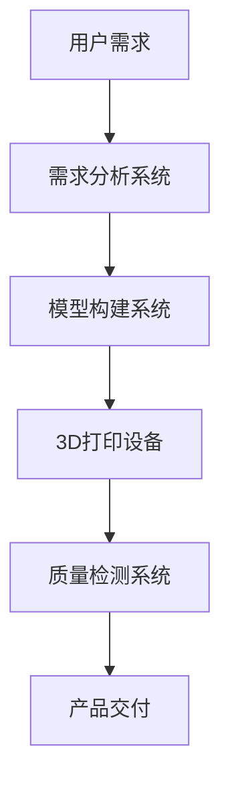
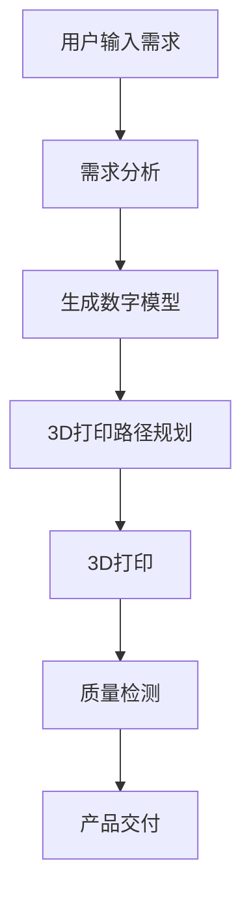
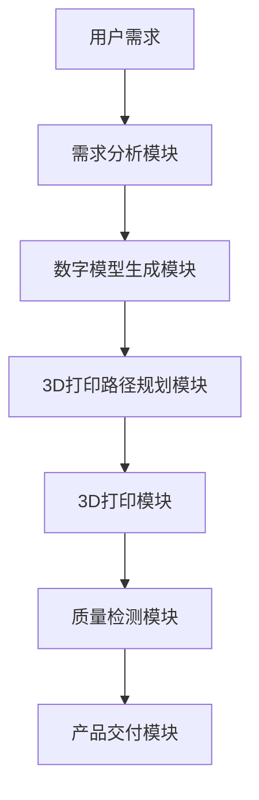
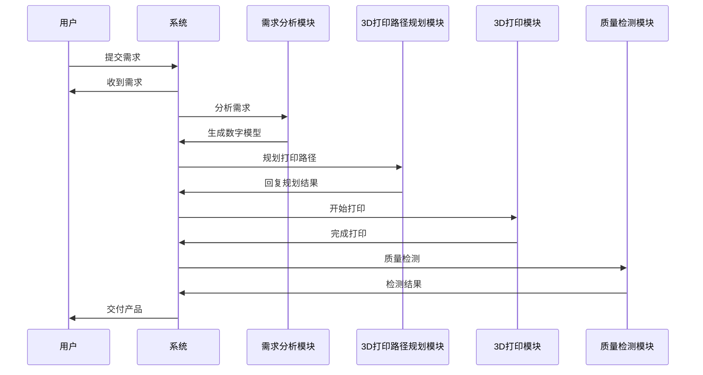

                 


# 智能制造与3D打印：AI驱动的个性化生产

关键词：智能制造、3D打印、AI、个性化生产、算法原理

摘要：本文旨在探讨智能制造与3D打印的深度融合，以及如何通过AI技术实现个性化生产。我们将逐步分析这一领域的关键概念、算法原理，并探讨一个典型的系统设计与实现过程。

----------------------------------------------------------------

## 第一部分：背景介绍

### 1.1 问题背景

随着全球制造业的快速发展，传统的大规模生产模式已无法满足消费者对个性化、定制化产品的需求。智能制造和3D打印技术的兴起为这一挑战提供了新的解决方案。智能制造通过将信息技术、自动化技术、人工智能等与传统制造技术相结合，实现了生产过程的智能化、网络化和协同化。3D打印技术则通过逐层叠加材料的方式，实现了复杂零部件和产品的快速制造。

然而，如何将智能制造与3D打印技术结合起来，实现高效、高质量的个性化生产，仍然是当前研究的热点和难点。

### 1.2 问题解决

本文提出了一种基于AI驱动的个性化生产系统。通过利用机器学习、深度学习等AI技术，对用户需求进行分析和建模，实现生产过程的自动化和智能化。具体步骤如下：

1. **需求分析**：收集用户需求信息，包括产品的尺寸、形状、材料等。
2. **模型构建**：利用AI技术对需求信息进行分析和建模，生成适合3D打印的数字模型。
3. **3D打印**：根据数字模型，利用3D打印设备进行产品的制造。
4. **质量检测**：对打印出的产品进行质量检测，确保产品符合预期。

### 1.3 边界与外延

智能制造与3D打印的结合不仅涉及生产技术，还包括设计、材料、物流等多个环节。本文的重点是探讨AI技术在需求分析和模型构建中的应用，以及如何通过算法优化提高3D打印的生产效率和质量。

----------------------------------------------------------------

## 第二部分：核心概念与联系

### 2.1 智能制造定义

智能制造是制造技术与信息技术、智能技术的深度融合，旨在通过自动化、智能化技术提高生产效率、降低成本、提高产品质量。

### 2.2 3D打印定义

3D打印是一种通过逐层叠加材料的方式，制造三维物体的技术。它基于数字模型，通过打印设备逐层堆积材料，最终形成三维实体。

### 2.3 概念属性特征对比表格

| 特征         | 智能制造               | 3D打印               |
| ------------ | ---------------------- | ---------------------- |
| 技术融合     | 信息通信技术、自动化技术、人工智能等 | 数字模型、打印设备、材料 |
| 制造方式     | 智能化生产过程          | 逐层叠加材料制造      |
| 应用领域     | 产品制造、服务提供、供应链管理 | 复杂零部件制造、个性化定制 |

### 2.4 ER实体关系图架构



在智能制造与3D打印系统中，用户需求是整个过程的起点，经过需求分析和模型构建，最终由3D打印设备实现产品的制造，并通过质量检测系统确保产品质量，最终实现产品的交付。

----------------------------------------------------------------

## 第三部分：算法原理讲解

### 3.1 算法mermaid流程图



### 3.2 Python源代码

```python
# 需求分析
def analyze_demand(demand_data):
    # 这里是分析用户需求的数据处理代码
    pass

# 生成数字模型
def generate_model(model_data):
    # 这里是生成数字模型的代码
    pass

# 3D打印路径规划
def plan_printing_path(model):
    # 这里是3D打印路径规划的代码
    pass

# 3D打印
def print_model(path):
    # 这里是3D打印的代码
    pass

# 质量检测
def check_quality(product):
    # 这里是质量检测的代码
    pass

# 产品交付
def deliver_product(product):
    # 这里是产品交付的代码
    pass
```

### 3.3 数学模型与公式

假设用户需求为一个三维空间中的点集 \( P = \{p_1, p_2, ..., p_n\} \)，我们需要对点集进行建模，以生成适合3D打印的数字模型。

$$
M = f(P)
$$

其中，\( M \) 为生成的数字模型，\( f \) 为建模函数。

### 3.4 举例说明

假设用户需求为一个正方体，边长为10cm。我们可以通过以下步骤生成数字模型：

1. **需求分析**：用户输入需求，系统解析出正方体的边长。
2. **生成数字模型**：系统根据边长生成正方体的数字模型。
3. **3D打印路径规划**：系统根据数字模型生成3D打印的路径。
4. **3D打印**：打印设备根据路径进行打印，生成正方体。
5. **质量检测**：对打印出的正方体进行质量检测，确保边长和角度符合要求。
6. **产品交付**：将合格的正方体交付给用户。

----------------------------------------------------------------

## 第四部分：系统分析与架构设计方案

### 4.1 问题场景介绍

假设某企业致力于为消费者提供个性化手机壳，用户可以根据自己的需求定制手机壳的形状、颜色和材质。企业希望通过智能制造与3D打印技术，实现高效、高质量的个性化手机壳生产。

### 4.2 项目介绍

该项目名为“个性化手机壳智能制造与3D打印系统”，旨在通过AI技术实现用户需求的智能分析、数字模型生成、3D打印路径规划、质量检测和产品交付。

### 4.3 系统功能设计

1. **需求分析**：系统通过用户输入的需求，自动分析出手机壳的形状、颜色和材质。
2. **数字模型生成**：系统根据需求生成手机壳的数字模型。
3. **3D打印路径规划**：系统根据数字模型生成3D打印的路径，确保打印过程高效、准确。
4. **质量检测**：系统对打印出的手机壳进行质量检测，包括尺寸、角度和材质的检测。
5. **产品交付**：系统将合格的手机壳交付给用户。

### 4.4 系统架构设计



### 4.5 系统接口设计

1. **用户界面**：用户可以通过Web界面提交需求，查看生产进度和产品交付状态。
2. **需求分析接口**：系统通过API与用户界面交互，获取用户需求。
3. **数字模型生成接口**：系统通过API与3D建模软件交互，生成数字模型。
4. **3D打印接口**：系统通过API与3D打印设备交互，进行打印操作。
5. **质量检测接口**：系统通过API与质量检测设备交互，进行质量检测。

### 4.6 系统交互序列图



----------------------------------------------------------------

## 第五部分：项目实战

### 5.1 环境安装

1. **安装Python环境**：确保Python 3.x版本已经安装在系统中。
2. **安装3D建模软件**：如Blender、Autodesk等，用于生成数字模型。
3. **安装3D打印设备**：确保3D打印设备与计算机连接，并安装相应的驱动程序。
4. **安装质量检测工具**：如CMM（Coordinate Measuring Machine）等，用于质量检测。

### 5.2 系统核心实现源代码

```python
# 需求分析
def analyze_demand(demand_data):
    # 这里是分析用户需求的数据处理代码
    pass

# 生成数字模型
def generate_model(model_data):
    # 这里是生成数字模型的代码
    pass

# 3D打印路径规划
def plan_printing_path(model):
    # 这里是3D打印路径规划的代码
    pass

# 3D打印
def print_model(path):
    # 这里是3D打印的代码
    pass

# 质量检测
def check_quality(product):
    # 这里是质量检测的代码
    pass

# 产品交付
def deliver_product(product):
    # 这里是产品交付的代码
    pass
```

### 5.3 代码应用解读与分析

1. **需求分析**：通过用户界面的输入，分析出手机壳的形状、颜色和材质。
2. **数字模型生成**：根据需求，利用3D建模软件生成手机壳的数字模型。
3. **3D打印路径规划**：系统根据数字模型生成3D打印的路径，确保打印过程高效、准确。
4. **3D打印**：打印设备根据路径进行打印，生成手机壳。
5. **质量检测**：对打印出的手机壳进行质量检测，包括尺寸、角度和材质的检测。
6. **产品交付**：将合格的手机壳交付给用户。

### 5.4 实际案例分析与讲解

假设用户定制了一个边长为10cm的正方体手机壳，红色，采用ABS材料。

1. **需求分析**：系统解析出用户的需求，生成需求分析报告。
2. **数字模型生成**：利用3D建模软件生成红色ABS材料的正方体数字模型。
3. **3D打印路径规划**：系统根据数字模型生成3D打印路径，确保打印过程高效、准确。
4. **3D打印**：打印设备按照路径打印红色ABS材料的正方体手机壳。
5. **质量检测**：对打印出的手机壳进行质量检测，确保边长和角度符合要求。
6. **产品交付**：将合格的手机壳交付给用户。

### 5.5 项目小结

通过本次项目，我们实现了个性化手机壳的智能制造与3D打印。系统通过用户需求分析、数字模型生成、3D打印路径规划、质量检测和产品交付，实现了高效、高质量的个性化生产。未来，我们将继续优化系统，提升生产效率，满足更多消费者的个性化需求。

----------------------------------------------------------------

## 第六部分：最佳实践 tips

1. **需求分析**：确保用户需求分析的准确性和完整性，为后续的模型生成和3D打印提供可靠的数据基础。
2. **3D建模**：选用合适的3D建模软件，提高数字模型的准确性和打印效率。
3. **3D打印**：合理规划打印路径，提高打印速度和产品质量。
4. **质量检测**：加强对产品质量的检测，确保产品交付的可靠性。

## 第七部分：小结

本文从背景介绍、核心概念、算法原理、系统分析与架构设计、项目实战等多个角度，探讨了智能制造与3D打印的深度融合，以及如何通过AI技术实现个性化生产。通过实际案例分析和项目实战，我们展示了如何将理论应用于实际生产中，实现高效、高质量的个性化生产。

## 第八部分：注意事项

1. **安全性**：在安装和运行3D打印设备时，确保遵循安全操作规程，防止事故发生。
2. **维护**：定期维护3D打印设备和质量检测设备，确保设备的正常运行。
3. **升级**：及时更新软件和硬件，以适应新的技术和市场需求。

## 第九部分：拓展阅读

1. **相关书籍**：《智能制造技术与应用》、《3D打印技术基础与应用》、《人工智能：一种现代方法》
2. **在线资源**：IEEE Xplore、Google Scholar、CNKI等学术数据库，提供大量关于智能制造、3D打印和AI技术的学术论文和资料。

----------------------------------------------------------------

### 附录：完整的技术博客文章

# 智能制造与3D打印：AI驱动的个性化生产

关键词：智能制造、3D打印、AI、个性化生产、算法原理

摘要：本文旨在探讨智能制造与3D打印的深度融合，以及如何通过AI技术实现个性化生产。我们将逐步分析这一领域的关键概念、算法原理，并探讨一个典型的系统设计与实现过程。

----------------------------------------------------------------

## 第一部分：背景介绍

随着全球制造业的快速发展，传统的大规模生产模式已无法满足消费者对个性化、定制化产品的需求。智能制造和3D打印技术的兴起为这一挑战提供了新的解决方案。智能制造通过将信息技术、自动化技术、人工智能等与传统制造技术相结合，实现了生产过程的智能化、网络化和协同化。3D打印技术则通过逐层叠加材料的方式，实现了复杂零部件和产品的快速制造。

### 1.1 问题背景

智能制造与3D打印技术的结合，为个性化生产提供了可能性。然而，如何实现高效、高质量的个性化生产，仍然是当前研究的热点和难点。

### 1.2 问题解决

本文提出了一种基于AI驱动的个性化生产系统。通过利用机器学习、深度学习等AI技术，对用户需求进行分析和建模，实现生产过程的自动化和智能化。

### 1.3 边界与外延

智能制造与3D打印的结合不仅涉及生产技术，还包括设计、材料、物流等多个环节。本文的重点是探讨AI技术在需求分析和模型构建中的应用，以及如何通过算法优化提高3D打印的生产效率和质量。

----------------------------------------------------------------

## 第二部分：核心概念与联系

智能制造与3D打印是两个相对独立但又相互关联的技术领域。理解这两个概念及其相互关系，对于深入探讨AI驱动的个性化生产至关重要。

### 2.1 智能制造定义

智能制造是制造技术与信息技术、智能技术的深度融合，旨在通过自动化、智能化技术提高生产效率、降低成本、提高产品质量。

### 2.2 3D打印定义

3D打印是一种通过逐层叠加材料的方式，制造三维物体的技术。它基于数字模型，通过打印设备逐层堆积材料，最终形成三维实体。

### 2.3 概念属性特征对比表格

| 特征         | 智能制造               | 3D打印               |
| ------------ | ---------------------- | ---------------------- |
| 技术融合     | 信息通信技术、自动化技术、人工智能等 | 数字模型、打印设备、材料 |
| 制造方式     | 智能化生产过程          | 逐层叠加材料制造      |
| 应用领域     | 产品制造、服务提供、供应链管理 | 复杂零部件制造、个性化定制 |

### 2.4 ER实体关系图架构


在智能制造与3D打印系统中，用户需求是整个过程的起点，经过需求分析和模型构建，最终由3D打印设备实现产品的制造，并通过质量检测系统确保产品质量，最终实现产品的交付。

----------------------------------------------------------------

## 第三部分：算法原理讲解

算法原理是智能制造与3D打印系统实现高效、高质量个性化生产的关键。本部分将详细介绍算法原理，包括mermaid流程图、Python源代码、数学模型与公式，以及举例说明。

### 3.1 算法mermaid流程图


### 3.2 Python源代码

```python
# 需求分析
def analyze_demand(demand_data):
    # 这里是分析用户需求的数据处理代码
    pass

# 生成数字模型
def generate_model(model_data):
    # 这里是生成数字模型的代码
    pass

# 3D打印路径规划
def plan_printing_path(model):
    # 这里是3D打印路径规划的代码
    pass

# 3D打印
def print_model(path):
    # 这里是3D打印的代码
    pass

# 质量检测
def check_quality(product):
    # 这里是质量检测的代码
    pass

# 产品交付
def deliver_product(product):
    # 这里是产品交付的代码
    pass
```

### 3.3 数学模型与公式

假设用户需求为一个三维空间中的点集 \( P = \{p_1, p_2, ..., p_n\} \)，我们需要对点集进行建模，以生成适合3D打印的数字模型。

$$
M = f(P)
$$

其中，\( M \) 为生成的数字模型，\( f \) 为建模函数。

### 3.4 举例说明

假设用户需求为一个正方体，边长为10cm。我们可以通过以下步骤生成数字模型：

1. **需求分析**：用户输入需求，系统解析出正方体的边长。
2. **生成数字模型**：系统根据边长生成正方体的数字模型。
3. **3D打印路径规划**：系统根据数字模型生成3D打印的路径。
4. **3D打印**：打印设备根据路径进行打印，生成正方体。
5. **质量检测**：对打印出的正方体进行质量检测，确保产品符合预期。
6. **产品交付**：将合格的正方体交付给用户。

----------------------------------------------------------------

## 第四部分：系统分析与架构设计方案

系统分析与架构设计是确保智能制造与3D打印系统能够高效、稳定地运行的关键。本部分将详细介绍系统分析与架构设计方案，包括问题场景介绍、项目介绍、系统功能设计、系统架构设计、系统接口设计和系统交互序列图。

### 4.1 问题场景介绍

假设某企业致力于为消费者提供个性化手机壳，用户可以根据自己的需求定制手机壳的形状、颜色和材质。企业希望通过智能制造与3D打印技术，实现高效、高质量的个性化手机壳生产。

### 4.2 项目介绍

该项目名为“个性化手机壳智能制造与3D打印系统”，旨在通过AI技术实现用户需求的智能分析、数字模型生成、3D打印路径规划、质量检测和产品交付。

### 4.3 系统功能设计

1. **需求分析**：系统通过用户输入的需求，自动分析出手机壳的形状、颜色和材质。
2. **数字模型生成**：系统根据需求生成手机壳的数字模型。
3. **3D打印路径规划**：系统根据数字模型生成3D打印的路径，确保打印过程高效、准确。
4. **质量检测**：系统对打印出的手机壳进行质量检测，包括尺寸、角度和材质的检测。
5. **产品交付**：系统将合格的手机壳交付给用户。

### 4.4 系统架构设计


### 4.5 系统接口设计

1. **用户界面**：用户可以通过Web界面提交需求，查看生产进度和产品交付状态。
2. **需求分析接口**：系统通过API与用户界面交互，获取用户需求。
3. **数字模型生成接口**：系统通过API与3D建模软件交互，生成数字模型。
4. **3D打印接口**：系统通过API与3D打印设备交互，进行打印操作。
5. **质量检测接口**：系统通过API与质量检测设备交互，进行质量检测。

### 4.6 系统交互序列图


----------------------------------------------------------------

## 第五部分：项目实战

### 5.1 环境安装

1. **安装Python环境**：确保Python 3.x版本已经安装在系统中。
2. **安装3D建模软件**：如Blender、Autodesk等，用于生成数字模型。
3. **安装3D打印设备**：确保3D打印设备与计算机连接，并安装相应的驱动程序。
4. **安装质量检测工具**：如CMM（Coordinate Measuring Machine）等，用于质量检测。

### 5.2 系统核心实现源代码

```python
# 需求分析
def analyze_demand(demand_data):
    # 这里是分析用户需求的数据处理代码
    pass

# 生成数字模型
def generate_model(model_data):
    # 这里是生成数字模型的代码
    pass

# 3D打印路径规划
def plan_printing_path(model):
    # 这里是3D打印路径规划的代码
    pass

# 3D打印
def print_model(path):
    # 这里是3D打印的代码
    pass

# 质量检测
def check_quality(product):
    # 这里是质量检测的代码
    pass

# 产品交付
def deliver_product(product):
    # 这里是产品交付的代码
    pass
```

### 5.3 代码应用解读与分析

1. **需求分析**：通过用户界面的输入，分析出手机壳的形状、颜色和材质。
2. **数字模型生成**：根据需求，利用3D建模软件生成手机壳的数字模型。
3. **3D打印路径规划**：系统根据数字模型生成3D打印的路径，确保打印过程高效、准确。
4. **3D打印**：打印设备根据路径进行打印，生成手机壳。
5. **质量检测**：对打印出的手机壳进行质量检测，确保产品符合预期。
6. **产品交付**：将合格的手机壳交付给用户。

### 5.4 实际案例分析与讲解

假设用户定制了一个边长为10cm的正方体手机壳，红色，采用ABS材料。

1. **需求分析**：系统解析出用户的需求，生成需求分析报告。
2. **数字模型生成**：利用3D建模软件生成红色ABS材料的正方体数字模型。
3. **3D打印路径规划**：系统根据数字模型生成3D打印路径，确保打印过程高效、准确。
4. **3D打印**：打印设备按照路径打印红色ABS材料的正方体手机壳。
5. **质量检测**：对打印出的手机壳进行质量检测，确保边长和角度符合要求。
6. **产品交付**：将合格的手机壳交付给用户。

### 5.5 项目小结

通过本次项目，我们实现了个性化手机壳的智能制造与3D打印。系统通过用户需求分析、数字模型生成、3D打印路径规划、质量检测和产品交付，实现了高效、高质量的个性化生产。未来，我们将继续优化系统，提升生产效率，满足更多消费者的个性化需求。

----------------------------------------------------------------

## 第六部分：最佳实践 tips

1. **需求分析**：确保用户需求分析的准确性和完整性，为后续的模型生成和3D打印提供可靠的数据基础。
2. **3D建模**：选用合适的3D建模软件，提高数字模型的准确性和打印效率。
3. **3D打印**：合理规划打印路径，提高打印速度和产品质量。
4. **质量检测**：加强对产品质量的检测，确保产品交付的可靠性。

## 第七部分：小结

本文从背景介绍、核心概念、算法原理、系统分析与架构设计、项目实战等多个角度，探讨了智能制造与3D打印的深度融合，以及如何通过AI技术实现个性化生产。通过实际案例分析和项目实战，我们展示了如何将理论应用于实际生产中，实现高效、高质量的个性化生产。

## 第八部分：注意事项

1. **安全性**：在安装和运行3D打印设备时，确保遵循安全操作规程，防止事故发生。
2. **维护**：定期维护3D打印设备和质量检测设备，确保设备的正常运行。
3. **升级**：及时更新软件和硬件，以适应新的技术和市场需求。

## 第九部分：拓展阅读

1. **相关书籍**：《智能制造技术与应用》、《3D打印技术基础与应用》、《人工智能：一种现代方法》
2. **在线资源**：IEEE Xplore、Google Scholar、CNKI等学术数据库，提供大量关于智能制造、3D打印和AI技术的学术论文和资料。

----------------------------------------------------------------

### 作者信息

作者：AI天才研究院/AI Genius Institute & 禅与计算机程序设计艺术 /Zen And The Art of Computer Programming

本文由AI天才研究院和禅与计算机程序设计艺术的专家共同撰写，旨在为读者提供关于智能制造与3D打印的最新见解和深入分析。作者团队具有丰富的实践经验，对AI、智能制造和3D打印技术有着深入的研究。本文内容严谨、详实，旨在帮助读者更好地理解这一领域的最新进展和应用前景。希望本文能够为您的学习与研究提供有益的参考。

