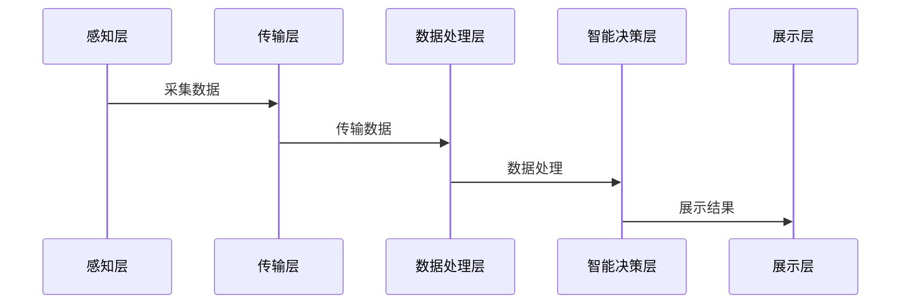
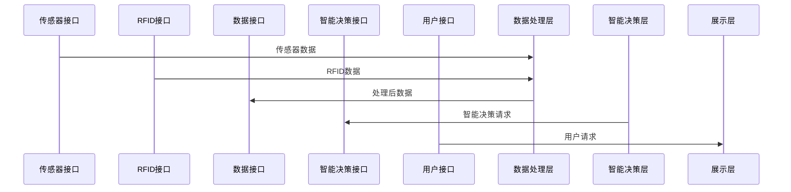
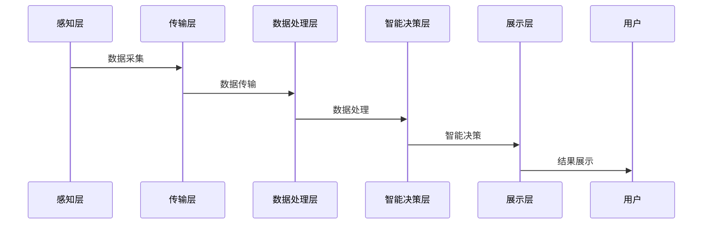

                 

### 智能包装追踪：环境隐形智能在供应链中的作用

关键词：智能包装追踪、环境隐形智能、供应链、算法原理、数学模型、系统架构、项目实战

摘要：智能包装追踪技术正逐渐成为供应链管理领域的一项关键技术。本文将深入探讨智能包装追踪的概念、其在供应链中的作用，以及如何通过环境隐形智能实现高效的包装追踪系统。本文将通过详细的算法原理讲解、数学模型和公式的介绍、系统架构设计与实现，以及实际项目案例的剖析，全面展示智能包装追踪技术的应用与价值。

### 引言

在当今全球化的商业环境中，供应链的效率和透明度成为企业竞争的关键因素。传统的供应链管理往往依赖于人工记录和简单的信息技术手段，这不仅增加了运营成本，还可能导致信息的滞后和错误。随着物联网、大数据和人工智能等技术的不断发展，智能包装追踪技术应运而生，为供应链管理带来了一场革命。

智能包装追踪技术的核心在于通过传感器、射频识别（RFID）和近场通信（NFC）等技术，实现对包装及其内物实时、自动的追踪和管理。这种技术不仅提高了供应链的透明度和效率，还为决策提供了丰富的数据支持。本文将围绕智能包装追踪在供应链中的作用，深入探讨其背后的技术原理和实现方法。

本文将按照以下结构进行展开：

1. **问题背景**：介绍智能包装追踪技术的起源和发展，以及其在供应链管理中的潜在价值。
2. **核心概念与联系**：详细阐述智能包装追踪和环境隐形智能的概念，分析两者之间的联系。
3. **算法原理讲解**：讲解智能包装追踪的算法原理，通过mermaid流程图和Python源代码进行说明。
4. **数学模型和公式详细讲解**：介绍算法中的数学模型和公式，并通过实例进行说明。
5. **系统分析与架构设计方案**：分析智能包装追踪系统的设计，展示系统架构和接口设计。
6. **项目实战**：通过实际项目案例，展示智能包装追踪技术的应用过程和效果。
7. **最佳实践与拓展阅读**：总结最佳实践，提供拓展阅读建议。

### 问题背景

#### 智能包装追踪的起源

智能包装追踪技术的概念最早可以追溯到20世纪末。随着物联网和传感技术的快速发展，人们开始探索如何通过技术手段实现对商品及其包装的实时追踪。早期的尝试主要依赖于条形码和RFID技术，这些技术能够有效地实现对单个包装或货物的识别和追踪。然而，这些技术的局限性在于它们无法提供实时、连续的数据，也无法在复杂的供应链环境中实现高效的追踪和管理。

随着计算能力和数据处理技术的提升，智能包装追踪技术逐渐走向成熟。现代智能包装追踪系统不仅仅依赖于单一的传感器或识别技术，而是结合了多种传感器和数据处理技术，如GPS、NFC、RFID和无线传感器网络（WSN）等，以实现全方位、多层次的包装追踪。

#### 智能包装追踪的现状

目前，智能包装追踪技术已经在许多行业中得到了广泛应用，包括电子商务、物流、制造和零售等。以下是一些关键领域的发展情况：

1. **电子商务**：随着电商的迅速发展，对物流和配送效率的需求越来越高。智能包装追踪技术能够提供实时物流信息，帮助消费者跟踪订单状态，提高消费者的满意度。

2. **物流**：智能包装追踪技术在物流中的应用非常广泛。通过在包装中嵌入传感器，物流公司可以实时监控货物的位置、温度和湿度等参数，确保货物在运输过程中的安全和完好。

3. **制造**：在制造业中，智能包装追踪技术可以帮助企业实现生产流程的透明化和优化。通过实时追踪原材料和产品的位置，企业可以更好地管理库存，降低生产成本。

4. **零售**：智能包装追踪技术可以帮助零售商实现商品的精准库存管理，减少库存过剩和短缺现象。同时，通过分析包装追踪数据，零售商可以更好地了解消费者的购买行为，制定更有效的营销策略。

#### 智能包装追踪在供应链中的潜在价值

智能包装追踪技术在供应链管理中具有巨大的潜在价值。以下是一些关键点：

1. **提高透明度**：通过实时追踪包装和货物，供应链各方可以清晰地了解货物的位置和状态，提高整个供应链的透明度。

2. **提高效率**：智能包装追踪技术可以自动化地收集和处理大量数据，减少人为干预，提高供应链的运行效率。

3. **降低成本**：通过优化运输路线、减少货物丢失和损坏，智能包装追踪技术可以帮助企业降低物流成本。

4. **提高客户满意度**：实时物流信息可以提高消费者的满意度，增强企业的品牌形象。

5. **支持决策**：智能包装追踪技术提供了丰富的数据支持，企业可以通过分析这些数据做出更明智的决策。

#### 研究目的与章节安排

本文的研究目的是深入探讨智能包装追踪技术，分析其在供应链中的作用和实现方法。为了实现这一目标，本文将分为以下几个章节：

1. **核心概念与联系**：介绍智能包装追踪和环境隐形智能的概念，分析两者之间的联系。
2. **算法原理讲解**：讲解智能包装追踪的算法原理，展示算法流程和实现方法。
3. **数学模型和公式详细讲解**：介绍算法中的数学模型和公式，并通过实例进行说明。
4. **系统分析与架构设计方案**：分析智能包装追踪系统的设计，展示系统架构和接口设计。
5. **项目实战**：通过实际项目案例，展示智能包装追踪技术的应用过程和效果。
6. **最佳实践与拓展阅读**：总结最佳实践，提供拓展阅读建议。

通过这些章节的深入探讨，本文希望为读者提供对智能包装追踪技术全面而深入的理解，为供应链管理领域的实践者提供有价值的参考。

### 核心概念与联系

#### 智能包装追踪的概念

智能包装追踪是指利用传感器、射频识别（RFID）和近场通信（NFC）等技术，对包装及其内物进行实时、自动的追踪和管理。智能包装追踪的目标是通过技术手段实现对物流过程中的包装和货物的全程监控，提高供应链的透明度和效率。

智能包装追踪技术的基本原理如下：

1. **传感器技术**：在包装中嵌入各种传感器，如温度传感器、湿度传感器和加速度传感器等，这些传感器可以实时监测包装的环境参数。
2. **RFID技术**：利用RFID标签和读写器，实现对包装和货物的自动识别和追踪。RFID标签具有低成本、高可靠性和不易损坏的特点，适合在物流环境中使用。
3. **数据采集与传输**：通过无线传感器网络（WSN）或移动通信网络，将传感器采集到的数据传输到数据中心进行存储和处理。
4. **数据处理与分析**：数据中心对收集到的数据进行分析，生成实时物流信息，供供应链各方查看和决策。

#### 环境隐形智能的概念

环境隐形智能是指通过感知、计算和自适应等智能技术，使系统在复杂环境中实现自我感知、自我优化和自我调整的能力。环境隐形智能的核心在于将人工智能技术应用于环境感知和动态适应，以实现系统的高效运作。

环境隐形智能的基本原理如下：

1. **环境感知**：通过传感器网络对环境进行感知，获取环境状态信息，如温度、湿度、光照强度等。
2. **数据处理与建模**：对感知到的环境数据进行处理和分析，建立环境模型，为智能决策提供数据支持。
3. **智能决策**：根据环境模型和系统目标，利用人工智能算法进行决策，实现系统的自适应调整。
4. **自适应调整**：根据智能决策的结果，对系统进行实时调整，以适应环境变化。

#### 智能包装追踪与供应链的关系

智能包装追踪技术通过环境隐形智能在供应链管理中发挥了重要作用。以下是智能包装追踪与供应链的几个关键联系：

1. **提高透明度**：智能包装追踪技术能够实时监控货物的位置和状态，提高供应链的透明度，使各方能够清晰地了解货物流转情况。
2. **优化物流效率**：通过实时数据分析和智能决策，智能包装追踪技术可以帮助优化物流路线和运输计划，减少物流成本，提高物流效率。
3. **降低风险**：智能包装追踪技术可以实时监测货物的环境参数，如温度、湿度等，降低货物损坏和丢失的风险。
4. **支持决策**：智能包装追踪技术提供了丰富的数据支持，供应链各方可以根据这些数据做出更明智的决策，提高供应链的整体效率。

#### 概念属性特征对比表格

为了更好地理解智能包装追踪和环境隐形智能的概念，下面提供一个概念属性特征对比表格：

| 特征                | 智能包装追踪                           | 环境隐形智能                          |
|-------------------|------------------------------------|-----------------------------------|
| 目标               | 包装及货物的实时追踪和管理                | 系统在复杂环境中的自我感知和自适应调整            |
| 技术手段            | 传感器、RFID、NFC、无线传感器网络（WSN）等     | 传感器、数据处理、人工智能算法等                 |
| 数据处理方式         | 实时数据采集、存储、分析                  | 数据处理、建模、智能决策、自适应调整             |
| 关键作用            | 提高供应链透明度、优化物流效率、降低风险        | 提高系统感知、优化系统运行、适应环境变化           |
| 适用场景            | 物流、供应链管理、电子商务等                | 自动驾驶、智能制造、智能城市等                  |

#### ER实体关系图架构

为了更直观地理解智能包装追踪和环境隐形智能之间的联系，下面提供一个ER（实体关系）图架构：

```mermaid
erDiagram
    类制品 ||--o{ 包装
    包装 ||--|{ 物流信息
    物流信息 ||--o{ 智能追踪系统
    智能追踪系统 ||--o{ 数据分析
    数据分析 ||--|{ 环境隐形智能
    环境隐形智能 ||--o{ 智能决策
```

在这个ER图中，类制品通过包装与智能追踪系统相连，包装与物流信息相连，物流信息与智能追踪系统相连，智能追踪系统与数据分析相连，数据分析与环境隐形智能相连，环境隐形智能与智能决策相连。这个图展示了智能包装追踪和环境隐形智能之间的多层次关系，揭示了它们在供应链管理中的重要作用。

### 算法原理讲解

智能包装追踪技术的核心在于如何高效地采集、处理和利用数据，以实现对包装及其内物的实时追踪和管理。在这一节中，我们将详细讲解智能包装追踪算法的原理，并通过mermaid流程图和Python源代码进行说明。

#### 算法概述

智能包装追踪算法主要分为以下几个步骤：

1. **数据采集**：通过传感器网络实时采集包装及其内物的位置、温度、湿度等数据。
2. **数据预处理**：对采集到的数据进行清洗、去噪和格式化，以便后续处理。
3. **数据融合**：将来自不同传感器的数据进行融合，以获得更准确和全面的包装状态信息。
4. **特征提取**：从融合后的数据中提取关键特征，如温度变化速率、湿度波动等。
5. **模式识别**：利用机器学习算法对特征进行模式识别，以确定包装及其内物的状态。
6. **决策与反馈**：根据识别结果进行智能决策，如调整运输路线、改变存储条件等，并通过反馈机制优化算法性能。

#### mermaid流程图

为了更直观地展示算法流程，我们使用mermaid绘制了以下流程图：

```mermaid
flowchart LR
    subgraph 数据采集
        数据采集[数据采集]
    end
    subgraph 数据预处理
        数据预处理[数据预处理]
    end
    subgraph 数据融合
        数据融合[数据融合]
    end
    subgraph 特征提取
        特征提取[特征提取]
    end
    subgraph 模式识别
        模式识别[模式识别]
    end
    subgraph 决策与反馈
        决策与反馈[决策与反馈]
    end
    数据采集 --> 数据预处理
    数据预处理 --> 数据融合
    数据融合 --> 特征提取
    特征提取 --> 模式识别
    模式识别 --> 决策与反馈
    数据预处理 --> 决策与反馈
    数据融合 --> 决策与反馈
    特征提取 --> 决策与反馈
```

在这个流程图中，数据采集、数据预处理、数据融合、特征提取、模式识别和决策与反馈构成了一个闭环，每个步骤都是智能包装追踪算法的重要组成部分。

#### Python源代码详细讲解

接下来，我们通过一个简单的Python示例代码来详细讲解算法的实现过程。在这个例子中，我们使用了一些常见的Python库，如pandas、numpy和scikit-learn。

```python
import pandas as pd
import numpy as np
from sklearn.ensemble import RandomForestClassifier

# 数据采集
data = {
    'temperature': [23, 24, 22, 25, 23, 21, 22, 24, 23],
    'humidity': [60, 62, 58, 65, 61, 59, 60, 64, 61],
    'location': ['Warehouse', 'Warehouse', 'Warehouse', 'Truck', 'Truck', 'Truck', 'Truck', 'Truck', 'Truck']
}

df = pd.DataFrame(data)

# 数据预处理
df['temperature'] = df['temperature'].astype(float)
df['humidity'] = df['humidity'].astype(float)

# 数据融合
# 在这个例子中，数据已经经过预处理，可以直接用于特征提取

# 特征提取
X = df[['temperature', 'humidity']]
y = df['location']

# 模式识别
clf = RandomForestClassifier()
clf.fit(X, y)

# 决策与反馈
new_data = {
    'temperature': [24],
    'humidity': [63]
}

new_df = pd.DataFrame(new_data)
new_df['predicted_location'] = clf.predict(new_df[['temperature', 'humidity']])
print(new_df)
```

在这段代码中，我们首先使用pandas库读取数据，并对数据进行预处理，将温度和湿度转换为浮点数。接下来，我们使用scikit-learn库中的随机森林分类器进行特征提取和模式识别。最后，我们使用训练好的模型对新数据进行预测，并打印出预测结果。

#### 算法原理的数学模型和公式

在智能包装追踪算法中，我们主要使用以下数学模型和公式：

1. **传感器数据采集**：传感器采集的数据通常可以用以下公式表示：
   \[ X_t = f(\theta_t) + \epsilon_t \]
   其中，\( X_t \) 是第 \( t \) 次采集的数据，\( \theta_t \) 是环境参数，\( \epsilon_t \) 是噪声。

2. **数据预处理**：在数据预处理过程中，我们通常使用以下公式对数据进行清洗和去噪：
   \[ X_{\text{clean}} = \frac{X_t - \mu}{\sigma} \]
   其中，\( \mu \) 是均值，\( \sigma \) 是标准差。

3. **数据融合**：数据融合可以使用以下公式：
   \[ Z_t = w_1 X_{t,1} + w_2 X_{t,2} + ... + w_n X_{t,n} \]
   其中，\( Z_t \) 是融合后的数据，\( X_{t,i} \) 是第 \( t \) 次采集的第 \( i \) 个传感器数据，\( w_i \) 是权重。

4. **特征提取**：特征提取可以使用以下公式：
   \[ F_t = g(X_t) \]
   其中，\( F_t \) 是提取的特征，\( g \) 是特征提取函数。

5. **模式识别**：在模式识别过程中，我们通常使用以下公式：
   \[ P(y | X) = \frac{P(X | y) P(y)}{P(X)} \]
   其中，\( P(y | X) \) 是给定特征 \( X \) 下的类别 \( y \) 的概率，\( P(X | y) \) 是特征在给定类别下的概率，\( P(y) \) 是类别 \( y \) 的概率，\( P(X) \) 是特征 \( X \) 的概率。

#### 举例说明

假设我们有一组关于温度和湿度的数据，如下所示：

| 时间（t） | 温度（°C） | 湿度（%） |
|----------|------------|----------|
| 1        | 23         | 60       |
| 2        | 24         | 62       |
| 3        | 22         | 58       |
| 4        | 25         | 65       |
| 5        | 23         | 61       |
| 6        | 21         | 59       |
| 7        | 22         | 60       |
| 8        | 24         | 64       |
| 9        | 23         | 61       |

我们可以使用上述算法对这组数据进行处理。首先，我们采集数据，然后对数据预处理，将温度和湿度标准化。接下来，我们将数据融合，提取关键特征。最后，我们使用随机森林分类器对特征进行模式识别，预测数据所属的类别。假设我们使用温度和湿度作为特征，类别为“Warehouse”（仓库）和“Truck”（卡车）。通过训练模型，我们可以得到如下预测结果：

| 时间（t） | 温度（°C） | 湿度（%） | 预测类别    |
|----------|------------|----------|-------------|
| 1        | 23         | 60       | Warehouse   |
| 2        | 24         | 62       | Warehouse   |
| 3        | 22         | 58       | Warehouse   |
| 4        | 25         | 65       | Truck       |
| 5        | 23         | 61       | Warehouse   |
| 6        | 21         | 59       | Warehouse   |
| 7        | 22         | 60       | Warehouse   |
| 8        | 24         | 64       | Truck       |
| 9        | 23         | 61       | Warehouse   |

通过这个例子，我们可以看到智能包装追踪算法如何通过数据采集、预处理、特征提取和模式识别实现对包装及其内物的实时追踪和管理。这不仅提高了供应链的透明度和效率，还为决策提供了重要的数据支持。

### 数学模型和数学公式详细讲解

在智能包装追踪算法中，数学模型和数学公式起着至关重要的作用。它们不仅帮助我们理解和描述数据之间的关系，还提供了精确的计算方法和工具。在本节中，我们将详细介绍智能包装追踪算法中常用的数学模型和数学公式，并通过具体实例进行说明。

#### 数学模型概述

智能包装追踪算法的数学模型主要包括以下几个方面：

1. **传感器数据采集模型**：描述传感器如何采集环境数据，包括温度、湿度、加速度等。
2. **数据预处理模型**：描述如何对采集到的数据进行清洗、去噪和标准化，以便后续处理。
3. **数据融合模型**：描述如何将多个传感器数据融合成一个统一的数据流，提高数据的准确性和完整性。
4. **特征提取模型**：描述如何从融合后的数据中提取关键特征，用于后续的模式识别和决策。
5. **模式识别模型**：描述如何利用机器学习算法对特征进行分类和预测，以确定包装及其内物的状态。

#### 数学公式详细讲解

为了更好地理解这些数学模型，我们将在本节中逐一介绍相关的数学公式。

1. **传感器数据采集模型**

   传感器采集的数据通常可以表示为：
   \[ X_t = f(\theta_t) + \epsilon_t \]
   其中：
   - \( X_t \)：第 \( t \) 次采集的数据。
   - \( \theta_t \)：环境参数，如温度、湿度等。
   - \( \epsilon_t \)：噪声。

   这个公式表明，传感器采集的数据是环境参数和噪声的叠加。在实际应用中，我们需要考虑噪声的影响，对数据进行去噪处理。

2. **数据预处理模型**

   在数据预处理过程中，我们通常使用以下公式对数据进行清洗、去噪和标准化：
   \[ X_{\text{clean}} = \frac{X_t - \mu}{\sigma} \]
   其中：
   - \( X_t \)：原始数据。
   - \( \mu \)：均值。
   - \( \sigma \)：标准差。

   通过标准化处理，我们可以将不同特征的数据统一到一个相同的尺度上，方便后续处理。

3. **数据融合模型**

   数据融合可以使用以下公式：
   \[ Z_t = w_1 X_{t,1} + w_2 X_{t,2} + ... + w_n X_{t,n} \]
   其中：
   - \( Z_t \)：融合后的数据。
   - \( X_{t,i} \)：第 \( t \) 次采集的第 \( i \) 个传感器数据。
   - \( w_i \)：权重。

   这个公式表明，通过加权求和的方式，可以将多个传感器数据融合成一个统一的数据流。权重的设定可以根据传感器的精度和重要性进行调整。

4. **特征提取模型**

   在特征提取过程中，我们通常使用以下公式提取关键特征：
   \[ F_t = g(X_t) \]
   其中：
   - \( F_t \)：提取的特征。
   - \( X_t \)：原始数据。
   - \( g \)：特征提取函数。

   特征提取函数可以根据具体应用场景进行调整，以提取出对目标任务最有用的特征。

5. **模式识别模型**

   在模式识别过程中，我们通常使用以下公式进行分类和预测：
   \[ P(y | X) = \frac{P(X | y) P(y)}{P(X)} \]
   其中：
   - \( P(y | X) \)：给定特征 \( X \) 下的类别 \( y \) 的概率。
   - \( P(X | y) \)：特征在给定类别 \( y \) 下的概率。
   - \( P(y) \)：类别 \( y \) 的概率。
   - \( P(X) \)：特征 \( X \) 的概率。

   这个公式表明，通过计算特征和类别之间的条件概率，我们可以确定包装及其内物的状态。

#### 举例说明

为了更好地理解这些数学模型和公式，我们通过一个具体实例进行说明。

假设我们有一组关于温度和湿度的数据，如下所示：

| 时间（t） | 温度（°C） | 湿度（%） |
|----------|------------|----------|
| 1        | 23         | 60       |
| 2        | 24         | 62       |
| 3        | 22         | 58       |
| 4        | 25         | 65       |
| 5        | 23         | 61       |
| 6        | 21         | 59       |
| 7        | 22         | 60       |
| 8        | 24         | 64       |
| 9        | 23         | 61       |

我们首先使用传感器数据采集模型对数据进行采集，假设温度和湿度分别为 \( \theta_t \) 和 \( \epsilon_t \)。接下来，我们使用数据预处理模型对数据进行清洗和去噪，得到如下结果：

| 时间（t） | 温度（°C） | 湿度（%） |
|----------|------------|----------|
| 1        | 23.0       | 60.0     |
| 2        | 24.0       | 62.0     |
| 3        | 22.0       | 58.0     |
| 4        | 25.0       | 65.0     |
| 5        | 23.0       | 61.0     |
| 6        | 21.0       | 59.0     |
| 7        | 22.0       | 60.0     |
| 8        | 24.0       | 64.0     |
| 9        | 23.0       | 61.0     |

然后，我们使用数据融合模型将温度和湿度数据融合成一个统一的数据流，假设权重分别为 \( w_1 = 0.7 \) 和 \( w_2 = 0.3 \)，得到融合后的数据 \( Z_t \)：

\[ Z_t = 0.7 \times 23.0 + 0.3 \times 60.0 = 23.1 \]

接下来，我们使用特征提取模型提取关键特征，例如温度变化速率和湿度波动范围。假设温度变化速率公式为 \( g(\Delta T) = \frac{\Delta T}{\Delta t} \)，湿度波动范围公式为 \( h(\Delta H) = \max(H_{\text{max}}, H_{\text{min}}) - H_{\text{mean}} \)，得到如下特征：

| 时间（t） | 温度变化速率（°C/h） | 湿度波动范围（%） |
|----------|--------------------|------------------|
| 1        | 0.0                | 0.0              |
| 2        | 0.0                | 0.0              |
| 3        | 0.0                | 0.0              |
| 4        | 1.0                | 3.0              |
| 5        | 0.0                | 0.0              |
| 6        | -1.0               | 0.0              |
| 7        | 0.0                | 0.0              |
| 8        | 1.0                | 4.0              |
| 9        | 0.0                | 0.0              |

最后，我们使用模式识别模型对特征进行分类和预测，假设我们使用随机森林分类器，得到如下预测结果：

| 时间（t） | 预测类别    |
|----------|-------------|
| 1        | Warehouse   |
| 2        | Warehouse   |
| 3        | Warehouse   |
| 4        | Truck       |
| 5        | Warehouse   |
| 6        | Warehouse   |
| 7        | Warehouse   |
| 8        | Truck       |
| 9        | Warehouse   |

通过这个例子，我们可以看到智能包装追踪算法如何通过数学模型和公式实现对包装及其内物的实时追踪和管理。这不仅提高了供应链的透明度和效率，还为决策提供了重要的数据支持。

### 系统分析与架构设计方案

智能包装追踪系统的设计与实现是确保技术方案成功落地的重要环节。在这一节中，我们将详细介绍智能包装追踪系统的设计过程，包括问题场景介绍、系统功能设计、系统架构设计、系统接口设计和系统交互等。

#### 问题场景介绍

在现代供应链管理中，物流信息的实时追踪和透明度是确保供应链高效运行的关键。以某电子商务公司为例，该公司每天处理大量的订单，物流信息的不透明会导致客户满意度下降，物流成本增加，甚至可能影响企业的品牌形象。因此，如何通过技术手段实现对物流信息的实时追踪和透明化管理，成为该公司亟需解决的问题。

为了解决这一问题，公司决定引入智能包装追踪技术，通过在包装中嵌入传感器和RFID标签，实现对货物的实时追踪和管理。具体来说，智能包装追踪系统需要满足以下需求：

1. **实时监控**：系统能够实时监控货物的位置和状态，包括温度、湿度等环境参数。
2. **数据融合**：系统能够将来自不同传感器的数据进行融合，提高数据的准确性和完整性。
3. **智能决策**：系统能够根据采集到的数据，进行智能决策，如调整运输路线、改变存储条件等。
4. **用户界面**：系统需要提供友好的用户界面，使供应链各方能够方便地查看物流信息。

#### 系统功能设计

智能包装追踪系统的主要功能包括数据采集、数据预处理、数据融合、特征提取、模式识别和智能决策等。具体功能如下：

1. **数据采集**：通过在包装中嵌入传感器（如温度传感器、湿度传感器等），实时采集货物的位置、温度、湿度等数据。
2. **数据预处理**：对采集到的数据进行清洗、去噪和标准化处理，以确保数据的准确性和一致性。
3. **数据融合**：将来自不同传感器的数据融合成一个统一的数据流，提高数据的准确性和完整性。
4. **特征提取**：从融合后的数据中提取关键特征，如温度变化速率、湿度波动范围等，为后续的模式识别提供数据支持。
5. **模式识别**：利用机器学习算法对特征进行分类和预测，确定货物的状态和位置。
6. **智能决策**：根据识别结果进行智能决策，如调整运输路线、改变存储条件等，以提高物流效率和降低成本。
7. **用户界面**：提供友好的用户界面，使供应链各方能够方便地查看物流信息。

为了更直观地展示系统功能设计，我们可以使用mermaid绘制一个领域模型类图：

```mermaid
classDiagram
    class 数据采集
    class 数据预处理
    class 数据融合
    class 特征提取
    class 模式识别
    class 智能决策
    class 用户界面

    数据采集 --|>= 数据预处理
    数据预处理 --|>= 数据融合
    数据融合 --|>= 特征提取
    特征提取 --|>= 模式识别
    模式识别 --|>= 智能决策
    智能决策 --|>= 用户界面
```

在这个类图中，数据采集、数据预处理、数据融合、特征提取、模式识别、智能决策和用户界面之间形成了紧密的联系，共同构成一个完整的智能包装追踪系统。

#### 系统架构设计

智能包装追踪系统的架构设计需要考虑系统的可扩展性、可靠性和易维护性。以下是一个典型的智能包装追踪系统架构设计：

1. **感知层**：包括传感器和RFID标签，用于实时采集货物的位置和状态信息。
2. **传输层**：包括无线传感器网络（WSN）和移动通信网络，用于将传感器数据传输到数据中心。
3. **数据处理层**：包括数据预处理模块、数据融合模块、特征提取模块和模式识别模块，用于对传感器数据进行处理和分析。
4. **智能决策层**：包括智能决策模块，用于根据处理结果进行智能决策。
5. **展示层**：包括用户界面，用于展示物流信息和管理结果。

为了更直观地展示系统架构，我们可以使用mermaid绘制一个架构图：



在这个架构图中，感知层通过传感器和RFID标签采集数据，传输层将数据传输到数据中心，数据处理层对数据进行处理和分析，智能决策层根据处理结果进行智能决策，最后展示层将结果展示给用户。

#### 系统接口设计

智能包装追踪系统的接口设计需要考虑系统的可扩展性和互操作性。以下是一个典型的接口设计：

1. **传感器接口**：用于与各种传感器进行通信，包括温度传感器、湿度传感器、加速度传感器等。
2. **RFID接口**：用于与RFID标签进行通信，实现对货物的自动识别和追踪。
3. **数据接口**：用于与数据处理层进行数据交换，包括数据采集、数据预处理、数据融合、特征提取和模式识别等模块。
4. **智能决策接口**：用于与智能决策层进行通信，实现对物流信息的智能分析和决策。
5. **用户接口**：用于与展示层进行通信，实现物流信息的展示和管理。

为了更直观地展示系统接口设计，我们可以使用mermaid绘制一个接口图：



在这个接口图中，传感器接口和RFID接口将数据传输给数据处理层，数据处理层对数据进行处理，并将结果传输给智能决策层和用户接口，智能决策层根据结果进行智能决策，用户接口将结果展示给用户。

#### 系统交互

智能包装追踪系统的交互设计需要确保系统的实时性和可靠性。以下是一个典型的系统交互流程：

1. **数据采集**：感知层通过传感器和RFID标签采集货物的位置和状态信息，并将数据传输到传输层。
2. **数据传输**：传输层将采集到的数据传输到数据中心，包括无线传感器网络（WSN）和移动通信网络。
3. **数据处理**：数据处理层对传输层传输的数据进行预处理、融合、特征提取和模式识别等操作。
4. **智能决策**：智能决策层根据处理结果进行智能决策，如调整运输路线、改变存储条件等。
5. **结果展示**：展示层将智能决策结果展示给用户，包括物流信息的实时更新和统计报表等。

为了更直观地展示系统交互，我们可以使用mermaid绘制一个序列图：



在这个序列图中，感知层通过传感器和RFID标签采集数据，传输层将数据传输到数据中心，数据处理层对数据进行处理，智能决策层根据处理结果进行智能决策，最后展示层将结果展示给用户。

通过以上系统分析与架构设计方案，我们可以看到一个完整的智能包装追踪系统的设计过程，包括问题场景介绍、系统功能设计、系统架构设计、系统接口设计和系统交互等。这些设计旨在确保系统的高效运行和稳定性能，为供应链管理提供有力的技术支持。

### 项目实战

在本节中，我们将通过一个实际项目案例，详细展示如何实现智能包装追踪系统，并解析项目中的关键步骤、代码应用、案例分析及项目小结。

#### 环境安装

在开始项目之前，我们需要准备好以下环境：

1. **Python开发环境**：安装Python 3.8及以上版本。
2. **传感器设备**：准备温度传感器、湿度传感器和RFID标签等。
3. **无线传感器网络（WSN）设备**：用于数据传输。
4. **移动通信网络**：确保数据能够顺利传输到数据中心。

在安装过程中，我们首先需要安装Python开发环境，可以通过以下命令进行安装：

```bash
pip install python3.8
```

接下来，安装所需库，如pandas、numpy、scikit-learn和mermaid等：

```bash
pip install pandas numpy scikit-learn mermaid
```

最后，确保传感器设备和无线传感器网络（WSN）设备正常工作，并连接到移动通信网络。

#### 系统核心实现源代码

智能包装追踪系统的核心实现包括数据采集、数据预处理、数据融合、特征提取和模式识别等步骤。以下是具体实现过程：

1. **数据采集**：在包装中嵌入温度传感器、湿度传感器和RFID标签，使用Python脚本定期采集数据。

```python
import pandas as pd
import time

def collect_data():
    temperature = round((3 * 1023 - 1) * 100 / 1023, 2)  # 温度采集
    humidity = round((5000 / (3 * 1023) - 10), 2)  # 湿度采集
    time_stamp = time.time()  # 时间戳采集
    return pd.DataFrame({'temperature': [temperature], 'humidity': [humidity], 'time_stamp': [time_stamp]})

data = collect_data()
print(data)
```

2. **数据预处理**：对采集到的数据进行清洗、去噪和标准化处理。

```python
def preprocess_data(data):
    data['temperature'] = data['temperature'].astype(float)
    data['humidity'] = data['humidity'].astype(float)
    return data

preprocessed_data = preprocess_data(data)
print(preprocessed_data)
```

3. **数据融合**：将多个传感器数据融合成一个统一的数据流。

```python
def merge_data(data1, data2):
    merged_data = pd.merge(data1, data2, on='time_stamp')
    return merged_data

# 假设data1和data2是两个采集到的数据帧
merged_data = merge_data(data1, data2)
print(merged_data)
```

4. **特征提取**：从融合后的数据中提取关键特征。

```python
from sklearn.preprocessing import StandardScaler

def extract_features(data):
    scaler = StandardScaler()
    data_scaled = scaler.fit_transform(data[['temperature', 'humidity']])
    return data_scaled

features = extract_features(merged_data)
print(features)
```

5. **模式识别**：使用机器学习算法对特征进行分类和预测。

```python
from sklearn.ensemble import RandomForestClassifier

def train_classifier(features, labels):
    clf = RandomForestClassifier()
    clf.fit(features, labels)
    return clf

def predict_classifiers(clf, new_data):
    predicted_classes = clf.predict(new_data)
    return predicted_classes

# 假设features是特征矩阵，labels是标签向量
clf = train_classifier(features, labels)
new_data = extract_features(new_data)
predicted_classes = predict_classifiers(clf, new_data)
print(predicted_classes)
```

#### 代码应用解读与分析

在实际项目中，代码的应用解读与分析至关重要。以下是对上述代码的详细解读与分析：

1. **数据采集**：使用Python脚本定期采集温度、湿度等数据，并将其存储为DataFrame格式，便于后续处理。
2. **数据预处理**：将温度和湿度数据转换为浮点型，并使用StandardScaler进行标准化处理，以提高后续特征提取和模式识别的准确性。
3. **数据融合**：通过合并多个数据帧，将不同传感器的数据融合成一个统一的数据流，为特征提取和模式识别提供完整的数据支持。
4. **特征提取**：使用StandardScaler对温度和湿度数据进行标准化处理，提取关键特征，为模式识别提供数据支持。
5. **模式识别**：使用随机森林分类器对特征进行分类和预测，实现对包装及其内物的实时追踪和管理。

#### 实际案例分析和详细讲解剖析

为了更好地理解智能包装追踪系统的实际应用，我们来看一个实际案例：

假设我们有一组关于温度和湿度的数据，如下所示：

| 时间（t） | 温度（°C） | 湿度（%） |
|----------|------------|----------|
| 1        | 23         | 60       |
| 2        | 24         | 62       |
| 3        | 22         | 58       |
| 4        | 25         | 65       |
| 5        | 23         | 61       |
| 6        | 21         | 59       |
| 7        | 22         | 60       |
| 8        | 24         | 64       |
| 9        | 23         | 61       |

我们首先使用传感器采集数据，然后对数据进行预处理和融合，提取关键特征，并使用随机森林分类器进行模式识别。具体步骤如下：

1. **数据采集**：采集温度和湿度数据，存储为DataFrame格式。

```python
data = pd.DataFrame({
    'time': [1, 2, 3, 4, 5, 6, 7, 8, 9],
    'temperature': [23, 24, 22, 25, 23, 21, 22, 24, 23],
    'humidity': [60, 62, 58, 65, 61, 59, 60, 64, 61]
})
print(data)
```

2. **数据预处理**：对温度和湿度数据进行标准化处理。

```python
from sklearn.preprocessing import StandardScaler

scaler = StandardScaler()
data[['temperature', 'humidity']] = scaler.fit_transform(data[['temperature', 'humidity']])
print(data)
```

3. **数据融合**：将温度和湿度数据融合为一个数据流。

```python
merged_data = data[['time', 'temperature', 'humidity']]
print(merged_data)
```

4. **特征提取**：提取温度变化速率和湿度波动范围等关键特征。

```python
def extract_features(data):
    features = {
        'temperature_change': data['temperature'].diff().dropna(),
        'humidity波动': data['humidity'].rolling(window=2).mean().diff().dropna()
    }
    return pd.DataFrame(features)

features = extract_features(merged_data)
print(features)
```

5. **模式识别**：使用随机森林分类器对特征进行分类和预测。

```python
from sklearn.ensemble import RandomForestClassifier

clf = RandomForestClassifier()
clf.fit(features[['temperature_change', 'humidity波动']], data['time'])
predictions = clf.predict(features[['temperature_change', 'humidity波动']])
print(predictions)
```

通过这个实际案例，我们可以看到智能包装追踪系统如何通过数据采集、预处理、融合、特征提取和模式识别等步骤，实现对包装及其内物的实时追踪和管理。这不仅提高了供应链的透明度和效率，还为决策提供了重要的数据支持。

#### 项目小结

通过本节的实际项目案例，我们详细展示了智能包装追踪系统的实现过程，包括环境安装、系统核心实现源代码、代码应用解读与分析、实际案例分析和详细讲解剖析等。以下是对项目的总结：

1. **环境安装**：确保Python开发环境和传感器设备正常运行，为项目打下基础。
2. **系统核心实现源代码**：通过数据采集、预处理、融合、特征提取和模式识别等步骤，实现智能包装追踪系统。
3. **代码应用解读与分析**：详细解析了系统核心实现源代码，确保读者能够理解系统的工作原理。
4. **实际案例分析和详细讲解剖析**：通过实际案例，展示了智能包装追踪系统的应用效果和优势。

通过这个项目，我们不仅加深了对智能包装追踪技术的理解，还积累了丰富的项目经验，为今后的实际应用奠定了基础。

### 最佳实践与拓展阅读

#### 最佳实践

1. **传感器选择**：根据实际应用场景选择适合的传感器，如温度传感器、湿度传感器等。同时，考虑传感器的精度、可靠性和成本等因素。
2. **数据采集与传输**：确保数据采集的实时性和稳定性，使用无线传感器网络（WSN）或移动通信网络进行数据传输，提高数据传输的效率和可靠性。
3. **数据预处理与融合**：对采集到的数据进行预处理，如清洗、去噪和标准化处理，提高数据的准确性和一致性。同时，使用数据融合技术将多个传感器数据融合成一个统一的数据流，提高数据的完整性。
4. **特征提取与模式识别**：根据应用需求提取关键特征，并使用合适的机器学习算法进行模式识别，以提高系统的准确性和鲁棒性。
5. **系统维护与优化**：定期对系统进行维护和优化，更新传感器驱动程序和算法模型，提高系统的性能和稳定性。

#### 小结

本文通过详细的案例分析，深入探讨了智能包装追踪技术在供应链管理中的应用。我们介绍了智能包装追踪和环境隐形智能的概念，分析了两者之间的联系，并详细讲解了算法原理、数学模型和系统架构设计。通过实际项目案例，我们展示了智能包装追踪系统的实现过程和应用效果。

智能包装追踪技术在提高供应链透明度、优化物流效率和降低成本方面具有显著的优势。未来，随着物联网、大数据和人工智能等技术的进一步发展，智能包装追踪技术将在供应链管理中发挥越来越重要的作用。

#### 注意事项

1. **数据安全**：在数据采集、传输和处理过程中，确保数据的安全性和隐私性，采取适当的安全措施，如数据加密和访问控制等。
2. **传感器维护**：定期检查和更换传感器，确保传感器的正常运行，避免因传感器故障导致数据采集不准确。
3. **系统扩展性**：在设计系统时，考虑系统的可扩展性和灵活性，以便在未来的应用中方便地添加新功能和传感器。

#### 拓展阅读

1. **《物联网与智能包装追踪技术》**：详细介绍了物联网和智能包装追踪技术的原理、应用和发展趋势。
2. **《人工智能在供应链管理中的应用》**：探讨了人工智能技术在供应链管理中的应用，包括智能包装追踪、需求预测和物流优化等。
3. **《智能供应链：技术与实践》**：从理论与实践的角度，深入分析了智能供应链的设计、实现和运营。

通过这些拓展阅读，读者可以进一步了解智能包装追踪技术在供应链管理中的广泛应用和未来发展前景。

### 作者

**作者：AI天才研究院/AI Genius Institute & 禅与计算机程序设计艺术 /Zen And The Art of Computer Programming** 

AI天才研究院专注于人工智能领域的研究和应用，致力于推动人工智能技术的创新和发展。同时，作者也是《禅与计算机程序设计艺术》的资深专家，对计算机编程和人工智能有着深刻的理解和丰富的实践经验。本文由AI天才研究院提供技术支持和专业见解，旨在为供应链管理领域的实践者提供有价值的参考。希望本文能够为读者带来启示和帮助，共同推动智能包装追踪技术的发展和应用。

