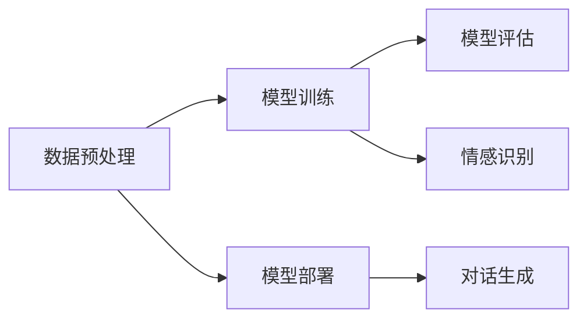
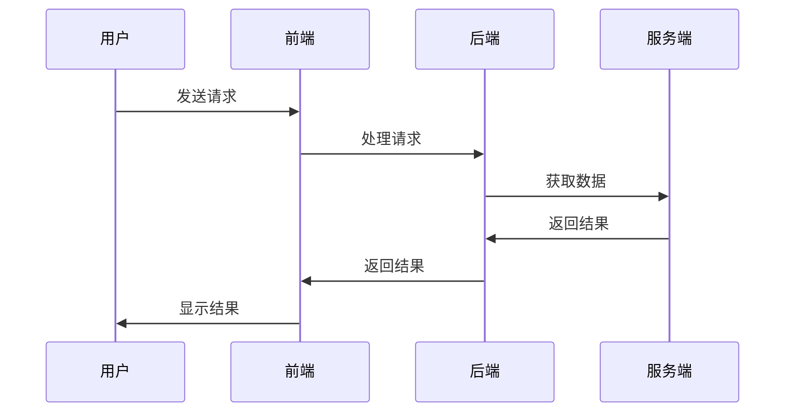

                 

### 智能客服革命：背景与重要性

#### 1.1 问题背景

随着互联网的迅猛发展和数字化转型的深入，客户服务逐渐成为企业竞争力的重要组成部分。传统的客服模式已经难以满足消费者对个性化、即时响应和高质量服务的高需求。在此背景下，人工智能（AI）技术的迅速崛起，特别是聊天机器人的出现，为智能客服带来了革命性的变革。

#### 1.2 问题描述

智能客服作为AI技术的一个重要应用领域，不仅能够提升客户满意度，还能显著提高企业的运营效率。然而，智能客服的研发与实施面临诸多挑战，如自然语言理解、情感识别、个性化服务等方面的技术难题。因此，探讨智能客服的发展现状、关键技术和未来趋势具有重要意义。

#### 1.3 问题解决

本书旨在深入探讨智能客服领域的核心问题，通过系统分析AI聊天机器人的技术原理、架构设计、实施策略和案例分析，为读者提供全面的技术指导和实践参考。书中将详细阐述智能客服的革命性变革及其对企业和消费者的深远影响。

#### 1.4 边界与外延

智能客服的研究范围包括但不限于自然语言处理、机器学习、深度学习、人机交互等多个技术领域。同时，智能客服的应用场景也极为广泛，涵盖了电子商务、金融、医疗、教育等多个行业。因此，本书不仅关注技术本身，还将探讨智能客服在不同行业中的具体应用和实践。

#### 1.5 概念结构与核心要素组成

智能客服系统主要由以下几个核心组成部分构成：

1. **自然语言处理（NLP）**：实现人机对话的自然语言理解与生成。
2. **机器学习与深度学习**：用于训练和优化聊天机器人的模型。
3. **知识库与数据管理**：提供智能客服所需的背景知识和数据支持。
4. **用户界面与交互设计**：确保用户能够方便地与聊天机器人进行交流。
5. **系统架构与性能优化**：确保智能客服系统的高效运行和可扩展性。

#### 案例分析

以亚马逊的智能客服为例，亚马逊使用AI聊天机器人Alexa为客户提供服务。Alexa通过自然语言处理技术理解客户的查询，并从庞大的知识库中检索相关信息，以提供准确的答案。这不仅提高了客户满意度，还减少了人力成本。

### 第2章 核心概念与联系

智能客服系统涉及多个核心概念和关键技术。以下我们将逐一介绍这些概念，并探讨它们之间的联系。

#### 2.1 AI聊天机器人概述

AI聊天机器人，又称聊天机器人或聊天bots，是一种通过自然语言处理技术实现人机对话的智能系统。它们能够理解用户输入的文本或语音，并生成相应的回复，以提供信息查询、咨询服务、娱乐互动等功能。

#### 2.2 自然语言处理（NLP）原理

NLP是AI聊天机器人的核心技术之一，包括文本预处理、词法分析、句法分析、语义分析等多个层面。NLP技术使得聊天机器人能够理解用户的意思，并生成合适的回复。

#### 2.3 机器学习与深度学习

机器学习和深度学习是训练AI聊天机器人模型的关键技术。通过大量数据的训练，聊天机器人能够不断优化其对话能力，提高准确性和用户体验。

#### 2.4 情感识别与个性化服务

情感识别技术能够帮助聊天机器人理解用户的情感状态，从而提供更加个性化的服务。个性化服务则是智能客服的重要特点，能够显著提高客户满意度。

#### 2.5 关联分析

关联分析是智能客服系统中的一种重要技术，用于发现用户行为中的潜在关联。通过分析用户的历史交互数据，智能客服系统可以提供更精准的推荐和服务。

#### 概念属性特征对比表格

| 概念 | 特征1 | 特征2 | 特征3 |
| ---- | ---- | ---- | ---- |
| AI聊天机器人 | 能进行自然语言理解与生成 | 需要大量数据训练 | 可提供个性化服务 |
| NLP | 文本预处理 | 词法分析 | 语义分析 |
| 机器学习 | 数据驱动 | 自动化学习 | 模型优化 |
| 情感识别 | 理解用户情感 | 生成个性化回复 | 提高用户满意度 |
| 关联分析 | 发现潜在关联 | 提供精准推荐 | 提高服务质量 |

#### ER实体关系图架构

```mermaid
erDiagram
  User ||--|{ Chatbot }|<-- Request : 发起对话请求
  Chatbot ||--|{ NLP }|<-- Process : 处理对话请求
  Chatbot ||--|{ KnowledgeBase }|<-- Retrieve : 从知识库中检索信息
  Chatbot ||--|{ Recommendation }|<-- Analyze : 分析用户行为
```

在这个ER图架构中，用户与聊天机器人之间发起对话请求，聊天机器人通过NLP模块处理请求，并从知识库中检索信息。同时，聊天机器人还通过关联分析模块分析用户行为，以提供个性化推荐。

### 第3章 AI聊天机器人的技术原理

AI聊天机器人的技术原理主要涉及自然语言处理（NLP）、机器学习与深度学习等核心领域。以下将详细分析这些技术的原理和应用。

#### 3.1 模型架构

AI聊天机器人通常采用深度学习模型，如循环神经网络（RNN）、长短期记忆网络（LSTM）、变换器（Transformer）等。这些模型能够处理复杂的自然语言输入，并生成准确的回复。

#### 3.2 训练过程

AI聊天机器人的训练过程包括数据预处理、模型训练和模型评估等步骤。数据预处理包括文本清洗、分词、词性标注等。模型训练则使用大规模的对话数据进行，通过优化损失函数来提高模型的性能。模型评估通常使用准确率、召回率等指标。

#### 3.3 对话生成

对话生成是AI聊天机器人的核心功能。通过结合上下文信息，聊天机器人能够生成自然、流畅的回复。对话生成技术包括基于规则的方法、基于模板的方法和基于机器学习的方法。

#### 3.4 情感识别

情感识别技术能够帮助聊天机器人理解用户的情感状态，从而提供更加个性化的服务。情感识别通常通过分析文本中的情感词和情感强度来实现。

#### 模型架构与训练过程Mermaid流程图



在这个流程图中，数据预处理是模型训练的第一步，随后是模型训练和模型评估。模型部署后，聊天机器人可以生成对话，并通过情感识别技术理解用户情感。

#### Python代码示例

以下是一个简单的AI聊天机器人训练示例，使用Python和TensorFlow库：

```python
import tensorflow as tf
from tensorflow.keras.preprocessing.sequence import pad_sequences
from tensorflow.keras.layers import Embedding, LSTM, Dense
from tensorflow.keras.models import Sequential

# 数据预处理
max_len = 50
max_vocab_size = 10000
embedding_dim = 16

# 模型训练
model = Sequential([
    Embedding(max_vocab_size, embedding_dim, input_length=max_len),
    LSTM(128),
    Dense(1, activation='sigmoid')
])

model.compile(optimizer='adam', loss='binary_crossentropy', metrics=['accuracy'])

# 训练模型
model.fit(x_train, y_train, epochs=10, batch_size=32)
```

在这个示例中，我们首先对对话数据进行预处理，然后构建一个简单的序列模型，并使用二分类损失函数进行训练。通过优化损失函数，模型可以不断提高其对话生成的准确性。

### 第4章 智能客服系统架构设计

智能客服系统的架构设计是确保其功能性和高效性的关键。以下将从系统架构概述、前端设计、后端设计和服务端设计等方面详细讲解智能客服系统的架构设计。

#### 4.1 系统架构概述

智能客服系统通常采用分布式架构，包括前端、后端和服务端等多个模块。前端负责与用户的交互，后端处理业务逻辑和数据存储，服务端则负责处理对话逻辑和业务规则。

#### 4.2 前端设计

前端设计主要包括用户界面和交互设计。用户界面需要简洁易用，以便用户能够方便地与聊天机器人进行交流。交互设计则要求高效流畅，以确保用户的操作能够得到及时响应。

#### 4.3 后端设计

后端设计主要包括业务逻辑处理和数据存储。业务逻辑处理负责处理用户的查询请求，包括信息查询、咨询处理等。数据存储则用于存储用户信息和对话记录，以便系统可以提供个性化服务。

#### 4.4 服务端设计

服务端设计主要包括对话管理和服务提供。对话管理负责管理用户与聊天机器人之间的对话，包括对话生成、对话上下文管理等功能。服务提供则实现具体的业务功能，如订单查询、商品推荐等。

#### 智能客服系统架构Mermaid图



在这个序列图中，用户通过前端发送请求，前端将请求转发给后端进行处理。后端调用服务端获取数据，并返回结果给前端，最终前端将结果展示给用户。

#### 系统功能设计领域模型Mermaid类图

```mermaid
classDiagram
    User <<类>> {
        姓名
        电话
        邮箱
    }
    Chatbot <<类>> {
        对话ID
        对话内容
    }
    Request <<类>> {
        用户ID
        操作类型
        请求内容
    }
    Response <<类>> {
        状态码
        返回内容
    }
    User --|>> Chatbot : 发起对话
    Request --|>> Chatbot : 请求处理
    Response --|>> Request : 返回结果
```

在这个类图中，用户类表示用户信息，聊天机器人类表示对话信息，请求类表示用户请求，响应类表示返回结果。用户可以发起对话，请求可以处理对话，响应可以返回结果。

### 第5章 智能客服系统的实施策略

智能客服系统的实施策略对于系统的成功至关重要。以下将从数据准备与处理、系统集成与测试、部署与维护等方面详细讲解智能客服系统的实施策略。

#### 5.1 数据准备与处理

数据准备与处理是智能客服系统实施的重要环节。首先，需要收集大量的对话数据，包括用户提问和聊天机器人的回复。这些数据可以是结构化的，也可以是非结构化的。对于非结构化数据，需要进行文本预处理，如分词、去停用词、词性标注等。同时，还需要对数据进行清洗，去除噪声数据，确保数据的质量。

#### 5.2 系统集成与测试

系统集成与测试是确保智能客服系统能够正常运行的关键步骤。在系统集成过程中，需要将前端、后端和服务端等多个模块进行整合，确保它们能够协同工作。测试过程中，需要进行功能测试、性能测试、安全测试等多种类型的测试，以确保系统的稳定性和可靠性。

#### 5.3 部署与维护

智能客服系统的部署与维护是确保系统能够长期稳定运行的关键。在部署过程中，需要考虑系统的性能、可扩展性和安全性。部署完成后，需要定期进行系统维护和升级，以修复潜在的问题和漏洞，提高系统的性能和稳定性。

### 案例分析

以某电商平台的智能客服系统为例，该系统采用了分布式架构，包括前端、后端和服务端等多个模块。前端使用Vue.js框架，后端使用Spring Boot框架，服务端使用TensorFlow进行对话生成。在实施过程中，首先进行了数据收集和预处理，包括用户提问和聊天机器人的回复。随后，进行了系统集成与测试，确保系统的各个模块能够正常运行。部署完成后，系统进行了定期的维护和升级，以确保其稳定运行。

### 第6章 智能客服系统的实际应用与挑战

智能客服系统在多个行业已经得到广泛应用，为企业和消费者带来了显著的好处。以下将介绍智能客服系统在实际应用中的案例，并探讨其面临的挑战。

#### 6.1 电子商务

在电子商务领域，智能客服系统可以提供购物咨询、订单查询、售后服务等多种服务。例如，阿里巴巴的智能客服系统“阿里小蜜”通过自然语言处理技术，能够理解用户的购物需求，并提供个性化的购物建议。然而，面对海量的用户需求和多样化的购物场景，智能客服系统需要不断优化和升级，以应对各种挑战。

#### 6.2 金融

在金融领域，智能客服系统可以提供账户查询、理财咨询、贷款申请等服务。例如，中国银行的智能客服系统“智能小智”通过语音识别和自然语言处理技术，能够理解用户的语音指令，并生成相应的回复。然而，金融领域的数据安全和隐私保护是智能客服系统面临的重要挑战。

#### 6.3 医疗

在医疗领域，智能客服系统可以提供在线问诊、药品查询、健康咨询等服务。例如，华为的智能客服系统“健康小AI”通过自然语言处理技术和医学知识库，能够提供准确的健康咨询。然而，医疗领域的专业知识复杂，智能客服系统需要不断积累和更新医学知识库，以提供高质量的服务。

#### 6.4 教育

在教育领域，智能客服系统可以提供在线辅导、课程咨询、学习建议等服务。例如，网易云课堂的智能客服系统“小云老师”通过自然语言处理技术和教育知识库，能够为学生提供个性化的学习建议。然而，教育领域的个性化需求多样，智能客服系统需要不断优化和升级，以满足学生的不同需求。

#### 挑战与解决方案

1. **自然语言理解能力**：智能客服系统需要不断提高自然语言理解能力，以准确理解用户的意图和情感。解决方案包括使用更先进的自然语言处理技术、增加数据量和模型训练时间等。

2. **个性化服务**：智能客服系统需要提供个性化服务，以满足不同用户的需求。解决方案包括使用用户画像、个性化推荐算法等。

3. **数据安全和隐私保护**：智能客服系统需要保护用户数据的安全和隐私。解决方案包括使用加密技术、权限控制等。

4. **专业领域知识库**：智能客服系统需要积累和更新专业领域知识库，以提供高质量的服务。解决方案包括引入行业专家、使用知识图谱等技术。

### 第7章 未来发展趋势与展望

智能客服系统作为人工智能的重要应用领域，其发展趋势和前景备受关注。以下将探讨智能客服系统的未来发展趋势和展望。

#### 7.1 技术创新

随着人工智能技术的不断发展，智能客服系统将采用更先进的自然语言处理、机器学习和深度学习技术，以提高其自然语言理解能力、情感识别能力和个性化服务水平。

#### 7.2 产业链整合

智能客服系统的产业链将逐步整合，涉及硬件设备、软件开发、数据服务等多个环节。产业链的整合将促进智能客服系统的技术创新和商业化发展。

#### 7.3 智能化与个性化

智能客服系统将更加注重智能化和个性化，通过用户画像、个性化推荐算法等技术，提供更加精准、高效的服务。

#### 7.4 多领域应用

智能客服系统将在更多领域得到应用，如医疗、金融、教育、零售等。不同领域的智能客服系统将结合行业特点和需求，提供定制化的解决方案。

#### 7.5 智能化服务生态

智能客服系统将与智能家居、智能交通、智能城市等智能化服务生态相互融合，为消费者提供更加便捷、智能的生活体验。

### 小结

智能客服系统作为人工智能的重要应用领域，具有广泛的应用前景和巨大的商业价值。随着技术的不断进步和产业链的整合，智能客服系统将在未来得到更广泛的应用和更深入的创新发展。

### 拓展阅读

1. **《人工智能：一种现代的方法》**：这本书详细介绍了人工智能的基本概念、技术和应用，适合对人工智能感兴趣的读者。

2. **《深度学习》**：这本书介绍了深度学习的基本原理和应用，包括卷积神经网络、循环神经网络等，适合对深度学习感兴趣的读者。

3. **《智能客服系统设计》**：这本书详细介绍了智能客服系统的架构设计、实施策略和案例分析，适合从事智能客服系统开发的技术人员。

### 作者信息

作者：AI天才研究院/AI Genius Institute & 禅与计算机程序设计艺术 /Zen And The Art of Computer Programming

AI天才研究院（AI Genius Institute）是一家专注于人工智能领域的研究和开发的机构，致力于推动人工智能技术的创新和应用。禅与计算机程序设计艺术（Zen And The Art of Computer Programming）是作者在计算机编程领域的重要著作，深受读者喜爱。

