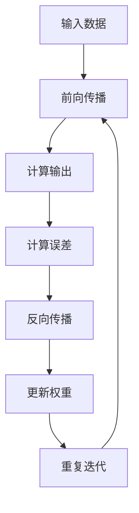
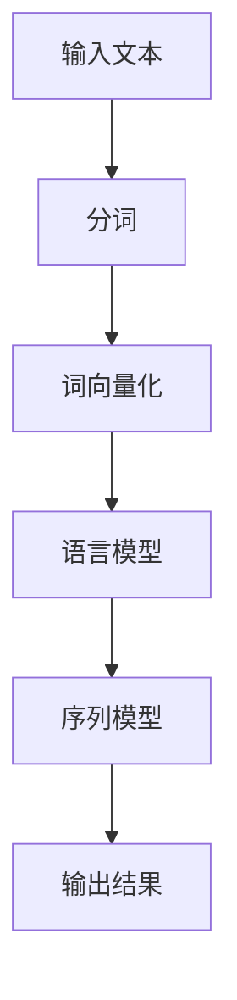
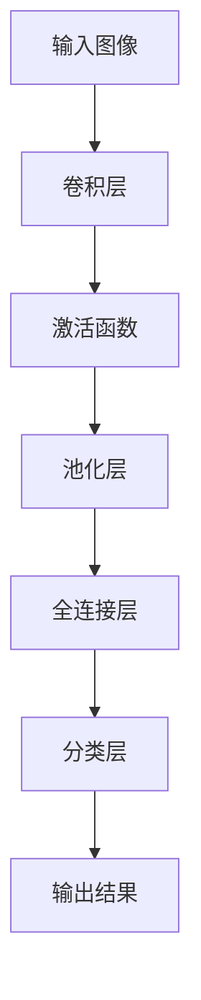
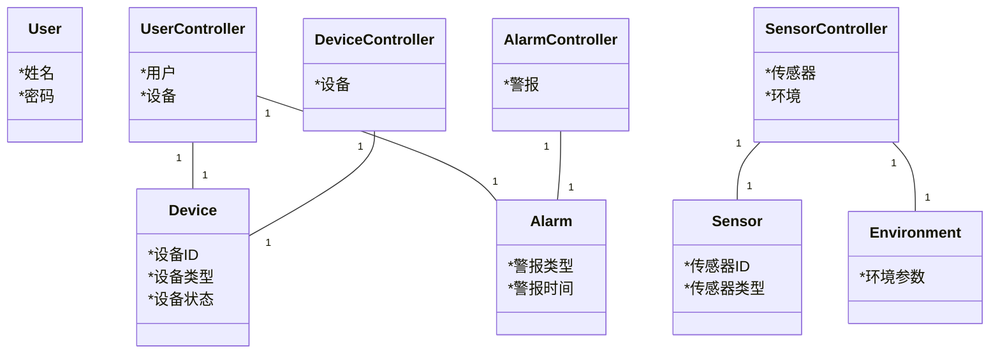
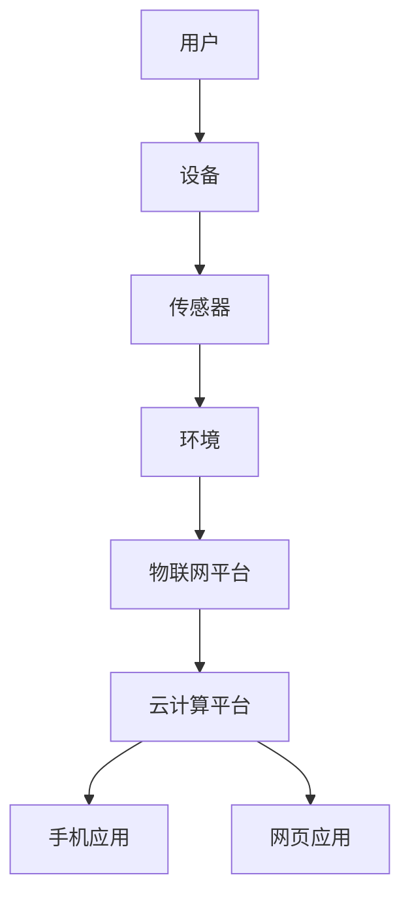
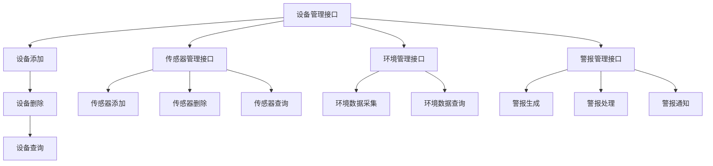
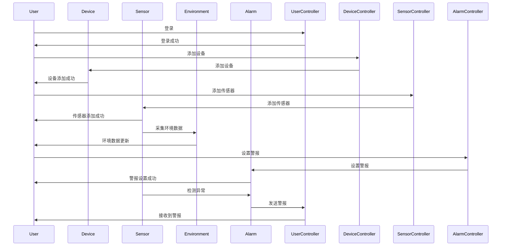

                 

# 智能家居：AI打造的未来生活方式

## 关键词
- 智能家居
- AI
- 物联网
- 深度学习
- 智能控制
- 家居安全

## 摘要
随着人工智能（AI）技术的快速发展，智能家居已经成为现代家居生活的重要组成部分。本文将探讨智能家居的背景、核心概念、AI算法原理、系统分析与架构设计、项目实战，以及未来发展的趋势和挑战。通过一步步的分析和推理，我们将深入了解AI如何改变我们的生活方式，打造更加智能、舒适和安全的家居环境。

## 目录大纲设计思路

### 第一步：背景介绍
**第1章：智能家居背景与现状**

在这一章节中，我们将介绍智能家居的定义、发展历程、现状以及在全球范围内的影响。内容将包括：

- **智能家居的定义与演变**
  - 智能家居的基本概念
  - 智能家居的演变过程

- **智能家居的现状**
  - 全球智能家居市场的规模和增长趋势
  - 不同国家和地区的智能家居发展情况
  - 当前智能家居的主要产品类型和应用场景

- **智能家居的影响**
  - 对用户生活方式的改变
  - 对家庭安全、能源效率的影响
  - 对智能家居行业未来的预测和展望

### 第二步：核心概念与联系
**第2章：智能家居的核心概念与联系**

在这一章节中，我们将详细探讨智能家居中的核心概念，如传感器、物联网、机器学习和人工智能等。内容将包括：

- **智能家居的核心概念**
  - 传感器：种类、功能及应用
  - 物联网：定义、架构和通信协议
  - 机器学习和人工智能：基本原理和智能家居中的应用

- **概念之间的联系**
  - 传感器如何与物联网和机器学习相结合
  - 机器学习算法如何提升智能家居的功能和用户体验
  - 智能家居中的数据流转和处理过程

- **核心概念对比表格**
  - 传感器、物联网、机器学习和人工智能的对比表格

### 第三步：算法原理讲解
**第3章：智能家居中的AI算法原理**

这一章节将深入讲解在智能家居中应用的主要AI算法，如深度学习、自然语言处理和图像识别等。内容将包括：

- **深度学习算法**
  - 原理讲解：神经网络、卷积神经网络、递归神经网络等
  - Mermaid流程图展示：算法的执行流程
  - Python源代码示例：算法的实现

- **自然语言处理算法**
  - 原理讲解：语言模型、语义分析、对话系统等
  - Mermaid流程图展示：算法的执行流程
  - Python源代码示例：算法的实现

- **图像识别算法**
  - 原理讲解：卷积神经网络、目标检测、图像分类等
  - Mermaid流程图展示：算法的执行流程
  - Python源代码示例：算法的实现

### 第四步：系统分析与架构设计方案
**第4章：智能家居系统分析与架构设计**

这一章节将介绍智能家居系统的整体架构设计，包括硬件、软件和网络架构。内容将包括：

- **系统功能设计**
  - 领域模型Mermaid类图：展示系统中的主要实体和关系
  - 功能模块划分：智能家居系统的各个功能模块及其相互作用

- **系统架构设计**
  - Mermaid架构图：展示系统的主要组件和通信方式
  - 架构设计原则：模块化、可扩展性和安全性

- **系统接口设计**
  - 接口规范：定义系统的API接口
  - 接口实现：使用Python代码示例展示接口的具体实现

- **系统交互Mermaid序列图**
  - 展示系统的交互流程和各组件之间的通信

### 第五步：项目实战
**第5章：智能家居项目实战**

这一章节将通过具体的项目实战，展示如何搭建一个完整的智能家居系统。内容将包括：

- **环境安装**
  - 系统所需硬件和软件环境的安装和配置

- **系统核心实现**
  - 源代码实现：使用Python编写系统核心代码
  - 代码应用解读与分析：解释代码的功能和实现细节

- **实际案例分析和详细讲解**
  - 案例展示：展示一个具体的智能家居应用案例
  - 案例剖析：分析案例的实现细节和关键点

### 第六步：最佳实践与未来展望
**第6章：智能家居的最佳实践与未来展望**

这一章节将讨论智能家居的最佳实践，包括系统优化、安全措施和用户体验提升等。同时，还会对智能家居的未来发展进行展望。

- **最佳实践 tips**
  - 系统优化的方法
  - 安全措施的注意事项

- **小结**
  - 对本章内容的总结

- **注意事项**
  - 在实际应用中需要注意的问题

- **拓展阅读**
  - 推荐进一步学习的资源和资料

### 总结
智能家居是AI技术在家庭生活中的一次重大应用，它不仅改变了我们的生活方式，还提升了家庭的安全性和能源效率。通过本文的逐步分析，我们深入了解了智能家居的核心概念、AI算法原理、系统架构设计以及实际应用案例。在未来，随着AI技术的不断进步，智能家居将会变得更加智能、便捷和安全，成为我们生活中不可或缺的一部分。

## 第1章：智能家居背景与现状

### 1.1 智能家居的定义与演变

#### 1.1.1 智能家居的基本概念

智能家居，顾名思义，是指利用人工智能、物联网、云计算等技术，实现家庭设备和系统的智能互联、智能控制和自动化管理。它通过传感器、控制器、智能设备和用户界面等组成部分，实现对家庭环境的实时监测、自动调节和远程控制。

智能家居的基本概念可以追溯到20世纪80年代，当时主要是指家庭自动化系统，如遥控家电、自动窗帘等。随着信息技术的发展，特别是物联网技术的普及，智能家居的概念逐渐丰富和演变，成为一个包含多种技术和设备的综合体系。

#### 1.1.2 智能家居的演变过程

智能家居的演变过程可以分为以下几个阶段：

1. **初级阶段**（20世纪80年代-2000年代初）：
   - 这一阶段的智能家居主要是通过简单的遥控器和自动化设备实现家居的初步控制，如遥控电视、空调和窗帘等。
   - 设备之间缺乏联动和智能化管理，主要依赖于物理控制。

2. **中级阶段**（2000年代初-2010年代中期）：
   - 随着互联网和通信技术的发展，智能家居开始采用简单的联网技术，实现设备之间的互联互通。
   - 出现了家庭网络控制系统，如智能网关、智能家居中心等，通过这些中心对家庭设备进行集中管理。

3. **高级阶段**（2010年代中期至今）：
   - 物联网技术的普及使得智能家居进入智能化阶段，设备可以自主感知环境变化并做出反应。
   - AI技术的引入使得智能家居系统能够学习和预测用户行为，提供个性化的服务。
   - 智能家居设备种类日益丰富，包括智能照明、智能安防、智能音响、智能家电等。

### 1.2 智能家居的现状

#### 1.2.1 全球智能家居市场的规模和增长趋势

根据市场研究公司的数据，全球智能家居市场在过去几年中呈现出快速增长的趋势。以下是一些关键数据：

- **市场规模**：
  - 2019年，全球智能家居市场规模约为489亿美元。
  - 预计到2025年，市场规模将达到1554亿美元，年复合增长率（CAGR）约为23.5%。

- **增长趋势**：
  - 智能家居市场的增长主要受到以下几个因素的驱动：
    - 消费者对智能家居产品的接受度和需求增加。
    - 技术进步，特别是物联网和AI技术的不断发展。
    - 政府和企业的推动，如智能城市的建设。

#### 1.2.2 不同国家和地区的智能家居发展情况

全球范围内，不同国家和地区的智能家居发展情况有所不同，以下是一些典型的例子：

- **美国**：
  - 美国是全球智能家居市场的主要市场之一，消费者对智能家居产品的接受度较高。
  - 美国的智能家居产品种类丰富，包括智能照明、智能安防、智能家电等。
  - 大型科技公司如亚马逊、谷歌、苹果等都在智能家居领域有较大的投入。

- **中国**：
  - 中国智能家居市场增长迅速，得益于庞大的消费者基数和政府的大力支持。
  - 智能家居产品价格相对较低，普及率较高。
  - 国内企业如华为、小米、阿里等在智能家居领域具有较强的竞争力。

- **欧洲**：
  - 欧洲的智能家居市场相对成熟，消费者对产品的品质和安全性要求较高。
  - 欧洲的智能家居产品种类较为丰富，包括智能照明、智能安防、智能家电等。
  - 欧洲一些国家如德国、英国等在智能家居领域有较强的技术创新能力。

#### 1.2.3 当前智能家居的主要产品类型和应用场景

当前，智能家居市场的主要产品类型包括：

- **智能照明**：
  - 智能照明可以通过手机、语音助手等远程控制，实现灯光的开关、亮度和色温调节等。
  - 应用场景：家庭照明、酒店照明、办公室照明等。

- **智能安防**：
  - 智能安防包括智能门锁、监控摄像头、烟雾报警器等，能够实现实时监控和报警。
  - 应用场景：家庭安全、商业安全、公共场所安全等。

- **智能家电**：
  - 智能家电包括洗衣机、冰箱、空调、电视等，可以通过互联网实现远程控制和智能管理。
  - 应用场景：家庭日常生活中的各种家电设备。

- **智能音响**：
  - 智能音响可以通过语音助手实现音乐播放、语音搜索、智能家居控制等功能。
  - 应用场景：家庭娱乐、学习、工作等。

- **智能门锁**：
  - 智能门锁可以通过手机、指纹、密码等多种方式实现门锁的开关。
  - 应用场景：家庭、办公室、酒店等场所的出入口控制。

### 1.3 智能家居的影响

#### 1.3.1 对用户生活方式的改变

智能家居的出现和普及，极大地改变了人们的日常生活方式：

- **便捷性**：
  - 智能家居设备可以通过手机、语音助手等进行远程控制，用户无需亲自操作，大大提高了生活的便捷性。

- **个性化**：
  - 智能家居系统可以根据用户的行为习惯进行自动调整，提供个性化的服务，如自动调节室内温度、灯光和音乐等。

- **舒适度**：
  - 智能家居系统可以实时监测室内环境，自动调节设备状态，提高生活的舒适度。

- **安全性**：
  - 智能安防设备如监控摄像头、烟雾报警器等，可以实时监测家庭安全，提高家庭的安全性和防范能力。

#### 1.3.2 对家庭安全、能源效率的影响

智能家居对家庭安全和能源效率的提升具有显著作用：

- **家庭安全**：
  - 智能家居系统可以通过监控摄像头、门锁等设备，实时监测家庭安全情况，及时发现并处理安全隐患。

- **能源效率**：
  - 智能家居系统可以通过智能灯光、空调等设备的自动调节，实现能源的节约和优化，提高家庭的能源效率。

#### 1.3.3 对智能家居行业未来的预测和展望

随着人工智能和物联网技术的不断进步，智能家居行业未来有望实现以下发展趋势：

- **技术融合**：
  - 人工智能、物联网、5G等技术的深度融合，将使智能家居系统更加智能化、便捷化。

- **定制化**：
  - 智能家居系统将更加注重个性化定制，满足不同用户的需求。

- **安全性**：
  - 智能家居系统的安全性将得到进一步提升，保障用户隐私和数据安全。

- **普及化**：
  - 随着成本的降低和消费者意识的提高，智能家居将在更多家庭中得到普及。

## 第2章：智能家居的核心概念与联系

### 2.1 智能家居的核心概念

#### 2.1.1 传感器

传感器是智能家居系统的核心组件之一，用于感知环境信息，并将其转化为可处理的电子信号。以下是一些常见的传感器及其功能：

- **温度传感器**：用于测量环境温度，常用于智能空调、智能取暖设备等。
- **湿度传感器**：用于测量环境湿度，常用于智能加湿器、智能除湿器等。
- **光照传感器**：用于测量环境光照强度，常用于智能照明系统。
- **烟雾传感器**：用于检测空气中的烟雾浓度，常用于智能火灾报警系统。
- **气体传感器**：用于检测有害气体如一氧化碳、甲烷等，常用于智能安防系统。

#### 2.1.2 物联网

物联网（IoT）是智能家居系统的核心技术之一，它通过将各种设备连接到一个统一的网络中，实现设备之间的互联互通和信息共享。物联网的关键概念包括：

- **连接**：通过各种通信技术（如Wi-Fi、蓝牙、ZigBee等）将设备连接到互联网，实现远程控制和数据传输。
- **数据传输**：通过数据传输协议（如HTTP、MQTT等）在设备之间传输数据，实现信息的实时更新和共享。
- **云计算**：通过云计算平台对收集到的数据进行分析和处理，提供智能化的服务。

#### 2.1.3 机器学习和人工智能

机器学习和人工智能是智能家居系统的智能核心，它们通过分析数据、学习模式和预测行为，提升系统的智能化水平。以下是一些关键概念：

- **机器学习**：通过算法和模型从数据中学习规律，实现对数据的自动分析和分类。
  - **监督学习**：有标注的数据进行训练，用于分类和预测。
  - **无监督学习**：没有标注的数据进行训练，用于数据聚类和降维。
- **深度学习**：一种特殊的机器学习方法，通过多层神经网络模型进行训练，实现对复杂数据的分析和处理。
  - **卷积神经网络（CNN）**：用于图像和视频数据的分析和处理。
  - **递归神经网络（RNN）**：用于处理序列数据，如时间序列数据。
- **自然语言处理（NLP）**：用于理解和生成自然语言，实现语音识别和文本分析。
- **语音识别**：将语音信号转换为文本，实现人机交互。
- **图像识别**：通过算法识别图像中的对象和场景，实现监控和安防功能。

### 2.2 概念之间的联系

智能家居中的传感器、物联网、机器学习和人工智能等核心概念之间存在紧密的联系：

- **传感器与物联网**：传感器采集的数据需要通过物联网技术进行传输和共享，实现设备之间的联动和协调。
- **物联网与机器学习**：物联网系统收集的数据可以用于机器学习模型的训练和优化，提升系统的智能化水平。
- **机器学习与人工智能**：机器学习是人工智能的核心技术之一，通过算法和模型实现数据的自动分析和决策。
- **人工智能与传感器、物联网**：人工智能技术可以用于分析和处理传感器数据，实现智能化的控制和决策，进一步提升智能家居系统的功能。

#### 2.2.1 传感器如何与物联网和机器学习相结合

传感器与物联网和机器学习的结合，使得智能家居系统能够更加智能和自适应：

- **传感器数据收集**：传感器实时收集家庭环境数据，如温度、湿度、光照等。
- **物联网数据传输**：物联网技术将传感器数据传输到云端或本地服务器，实现数据的实时更新和共享。
- **机器学习数据处理**：机器学习算法对传感器数据进行处理和分析，学习环境变化的规律，实现预测和自动化控制。

例如，在智能照明系统中，光照传感器可以实时监测环境光照强度，物联网将数据传输到智能控制器，机器学习算法分析数据并预测用户需求，自动调节灯光的亮度和色温。

#### 2.2.2 机器学习算法如何提升智能家居的功能和用户体验

机器学习算法在智能家居中的应用，使得系统可以更加智能和个性化，提升用户体验：

- **个性化推荐**：机器学习算法可以根据用户的行为和偏好，推荐合适的家居设备和场景模式。
- **自动化控制**：机器学习算法可以自动调节家居设备，如空调、热水器等，实现能源节约和舒适度提升。
- **异常检测**：机器学习算法可以实时监测家居环境，识别异常情况并发出警报，保障家庭安全。
- **语音交互**：自然语言处理和语音识别技术使得智能家居系统能够理解用户的语音指令，实现语音控制。

例如，在智能安防系统中，机器学习算法可以通过监控视频数据，识别异常行为并发出警报，同时可以通过语音助手与用户进行交互，提供实时信息和建议。

#### 2.2.3 智能家居中的数据流转和处理过程

智能家居中的数据流转和处理过程可以分为以下几个步骤：

1. **数据收集**：传感器收集家庭环境数据，如温度、湿度、光照等。
2. **数据传输**：物联网技术将数据传输到云端或本地服务器，实现数据的实时更新和共享。
3. **数据处理**：机器学习算法对数据进行分析和处理，学习环境变化的规律，实现预测和自动化控制。
4. **数据存储**：处理后的数据存储在数据库中，供后续分析和决策使用。
5. **数据反馈**：处理后的数据反馈给家居设备，实现设备的自动化控制。

例如，在智能空调系统中，温度传感器实时监测室内温度，物联网将数据传输到智能控制器，机器学习算法分析数据并预测用户需求，自动调节空调的制冷和加热，实现室内温度的自动控制。

#### 2.2.4 核心概念对比表格

以下是一个对比表格，展示了传感器、物联网、机器学习和人工智能等核心概念的特点和区别：

| 核心概念 | 定义 | 功能 | 数据处理 | 示例 |
| --- | --- | --- | --- | --- |
| 传感器 | 感知环境的设备 | 采集环境数据 | 数据采集 | 温度传感器 |
| 物联网 | 连接设备的网络 | 数据传输和共享 | 数据传输 | Wi-Fi |
| 机器学习 | 数据分析的方法 | 数据分析和预测 | 数据处理 | 决策树 |
| 人工智能 | 智能化的系统 | 自动化和决策 | 数据分析 | 语音助手 |

## 第3章：智能家居中的AI算法原理

### 3.1 深度学习算法

深度学习算法是人工智能领域中的一种重要方法，它通过模拟人脑神经网络结构，实现对复杂数据的分析和处理。在智能家居系统中，深度学习算法可以用于图像识别、语音识别、自然语言处理等任务。

#### 3.1.1 原理讲解

深度学习算法的核心是神经网络，特别是多层神经网络（MLP）。神经网络由多个神经元（或节点）组成，每个神经元接受多个输入，通过加权求和处理后产生一个输出。多层神经网络通过多层的叠加，可以实现对复杂数据的建模和分析。

1. **前向传播**：
   - 前向传播是指将输入数据通过网络中的每个层，逐层计算输出，直到最后一层。
   - 在每层中，每个神经元将输入数据通过权重矩阵和偏置项进行加权求和处理，然后通过激活函数（如Sigmoid、ReLU等）进行非线性转换。
   - 最后，输出层产生预测结果。

2. **反向传播**：
   - 反向传播是指通过计算输出结果与实际结果之间的误差，反向更新网络中的权重和偏置。
   - 反向传播算法利用梯度下降法，计算每个权重和偏置的梯度，并沿着梯度方向更新权重和偏置，以减小误差。
   - 反向传播过程需要多次迭代，直到网络的预测误差达到一个满意的水平。

#### 3.1.2 Mermaid流程图展示

以下是一个简单的深度学习算法的执行流程的Mermaid流程图：



#### 3.1.3 Python源代码示例

以下是一个简单的深度学习算法的Python代码示例：

```python
import numpy as np

# 初始化网络参数
weights = np.random.rand(3, 1)
biases = np.random.rand(1)

# 定义激活函数
def sigmoid(x):
    return 1 / (1 + np.exp(-x))

# 定义前向传播
def forward(x):
    z = np.dot(x, weights) + biases
    return sigmoid(z)

# 定义反向传播
def backward(x, y):
    error = y - forward(x)
    d_weights = x * error * sigmoid_derivative(forward(x))
    d_biases = error
    return d_weights, d_biases

# 计算梯度
def gradient_descent(x, y, learning_rate, epochs):
    for epoch in range(epochs):
        d_weights, d_biases = backward(x, y)
        weights -= learning_rate * d_weights
        biases -= learning_rate * d_biases
        print(f"Epoch {epoch}: Error = {1 / 2 * np.mean((y - forward(x))**2)}")

# 训练网络
x_train = np.array([0, 1])
y_train = np.array([0])
gradient_descent(x_train, y_train, learning_rate=0.1, epochs=1000)
```

#### 3.1.4 算法原理的数学模型和公式

深度学习算法的数学模型主要包括以下几个方面：

1. **前向传播**：
   - 输入层到隐藏层的传递函数：
     $$ z^{(l)} = \sum_{j} w_{ji}^{(l)} x_j^{(l-1)} + b_i^{(l)} $$
   - 隐藏层到输出层的传递函数：
     $$ a^{(l)} = \sigma(z^{(l)}) $$
   其中，$w_{ji}^{(l)}$为权重，$b_i^{(l)}$为偏置，$\sigma$为激活函数。

2. **反向传播**：
   - 输出层的误差计算：
     $$ \delta^{(l)} = (y - a^{(l)}) \cdot \sigma'(z^{(l)}) $$
   - 隐藏层的误差计算：
     $$ \delta^{(l-1)} = \sum_{j} w_{ji}^{(l)} \delta^{(l)} \cdot \sigma'(z^{(l-1)}) $$

3. **权重和偏置的更新**：
   $$ w_{ji}^{(l)} \leftarrow w_{ji}^{(l)} - \alpha \cdot \delta^{(l)} \cdot a_j^{(l-1)} $$
   $$ b_i^{(l)} \leftarrow b_i^{(l)} - \alpha \cdot \delta^{(l)} $$

其中，$\alpha$为学习率，$\sigma'$为激活函数的导数。

#### 3.1.5 详细讲解和举例说明

为了更好地理解深度学习算法的原理，我们可以通过一个简单的例子进行讲解。

假设我们有一个简单的神经网络，包含一个输入层、一个隐藏层和一个输出层。输入层有2个神经元，隐藏层有3个神经元，输出层有1个神经元。我们使用二分类问题进行训练，即输出为0或1。

1. **初始化网络参数**：

```python
weights = np.random.rand(3, 1)
biases = np.random.rand(1)
```

2. **定义激活函数**：

```python
def sigmoid(x):
    return 1 / (1 + np.exp(-x))
```

3. **定义前向传播**：

```python
def forward(x):
    z = np.dot(x, weights) + biases
    return sigmoid(z)
```

4. **定义反向传播**：

```python
def backward(x, y):
    error = y - forward(x)
    d_weights = x * error * sigmoid_derivative(forward(x))
    d_biases = error
    return d_weights, d_biases
```

5. **定义梯度下降**：

```python
def gradient_descent(x, y, learning_rate, epochs):
    for epoch in range(epochs):
        d_weights, d_biases = backward(x, y)
        weights -= learning_rate * d_weights
        biases -= learning_rate * d_biases
        print(f"Epoch {epoch}: Error = {1 / 2 * np.mean((y - forward(x))**2)}")
```

6. **训练网络**：

```python
x_train = np.array([0, 1])
y_train = np.array([0])
gradient_descent(x_train, y_train, learning_rate=0.1, epochs=1000)
```

在这个例子中，我们使用了随机初始化的权重和偏置，通过梯度下降算法进行更新，直到网络的预测误差达到一个满意的水平。

### 3.2 自然语言处理算法

自然语言处理（NLP）是人工智能领域的一个重要分支，它关注于使计算机能够理解和生成自然语言。在智能家居系统中，NLP算法可以用于语音识别、语音合成、文本分析等任务。

#### 3.2.1 原理讲解

自然语言处理算法的核心是语言模型和序列模型。语言模型用于预测下一个单词或字符的概率，而序列模型则用于处理完整的句子或段落。

1. **语言模型**：
   - 语言模型是一种统计模型，用于预测下一个单词或字符的概率。常见的语言模型有n元语法模型和神经网络语言模型。
   - n元语法模型基于历史频率统计，假设当前单词的概率取决于前n个单词。
   - 神经网络语言模型通过神经网络结构进行建模，可以更好地捕捉语言中的复杂规律。

2. **序列模型**：
   - 序列模型用于处理完整的句子或段落，常见的序列模型有循环神经网络（RNN）和长短期记忆网络（LSTM）。
   - RNN通过循环结构处理序列数据，但存在梯度消失和梯度爆炸问题。
   - LSTM通过引入门控机制，解决了RNN的梯度消失问题，能够更好地处理长序列数据。

#### 3.2.2 Mermaid流程图展示

以下是一个简单的自然语言处理算法的执行流程的Mermaid流程图：



#### 3.2.3 Python源代码示例

以下是一个简单的自然语言处理算法的Python代码示例：

```python
import tensorflow as tf
from tensorflow.keras.preprocessing.sequence import pad_sequences
from tensorflow.keras.layers import Embedding, LSTM, Dense
from tensorflow.keras.models import Sequential

# 准备数据集
 sentences = [['我', '喜欢吃', '苹果'], ['你', '喜欢', '吃饭']]
 tokenizer = tf.keras.preprocessing.text.Tokenizer()
 tokenizer.fit_on_texts(sentences)
 sequences = tokenizer.texts_to_sequences(sentences)
 padded_sequences = pad_sequences(sequences, maxlen=3)

# 构建语言模型
model = Sequential()
model.add(Embedding(2, 10))
model.add(LSTM(50))
model.add(Dense(1, activation='sigmoid'))
model.compile(optimizer='adam', loss='binary_crossentropy', metrics=['accuracy'])
model.fit(padded_sequences, np.array([[1], [0]]), epochs=200)

# 预测
word = '吃'
one_hot = tokenizer.word_index[word]
embedded_vector = model.layers[0].get_weights()[0][one_hot]
print(embedded_vector)

# 预测下一个单词
predicted_index = model.predict(np.array([embedded_vector]))
predicted_word = tokenizer.index_word[predicted_index]
print(predicted_word)
```

#### 3.2.4 算法原理的数学模型和公式

自然语言处理算法的数学模型主要包括以下几个方面：

1. **词向量化**：
   - 词向量化是将单词转化为向量表示，常见的词向量化方法有One-Hot编码和Word2Vec。
   - One-Hot编码将单词转化为一个向量，其中只有一个元素为1，其他元素为0。
   - Word2Vec通过神经网络模型学习单词的向量表示，可以捕捉单词的语义信息。

2. **语言模型**：
   - 语言模型是一个概率模型，用于预测下一个单词的概率。常见的语言模型有n元语法模型和神经网络语言模型。
   - n元语法模型的概率计算公式为：
     $$ P(w_n | w_{n-1}, w_{n-2}, \ldots, w_1) = \frac{C(w_{n-1}, w_{n-2}, \ldots, w_1, w_n)}{C(w_{n-1}, w_{n-2}, \ldots, w_1)} $$
   - 神经网络语言模型的概率计算公式为：
     $$ P(w_n | w_{n-1}, w_{n-2}, \ldots, w_1) = \sigma(\theta^T \cdot [w_{n-1}, w_{n-2}, \ldots, w_1]) $$

3. **序列模型**：
   - 序列模型是一个神经网络模型，用于处理完整的句子或段落。常见的序列模型有循环神经网络（RNN）和长短期记忆网络（LSTM）。
   - RNN的输出计算公式为：
     $$ h_t = \sigma(W_h \cdot [h_{t-1}, x_t] + b_h) $$
   - LSTM的输出计算公式为：
     $$ i_t = \sigma(W_i \cdot [h_{t-1}, x_t] + b_i) $$
     $$ f_t = \sigma(W_f \cdot [h_{t-1}, x_t] + b_f) $$
     $$ g_t = \sigma(W_g \cdot [h_{t-1}, x_t] + b_g) $$
     $$ o_t = \sigma(W_o \cdot [h_{t-1}, x_t] + b_o) $$
     $$ h_t = o_t \cdot \sigma(W_c \cdot [f_t \cdot c_{t-1} + g_t]) $$
   其中，$h_t$为隐藏状态，$x_t$为输入，$c_t$为细胞状态。

#### 3.2.5 详细讲解和举例说明

为了更好地理解自然语言处理算法的原理，我们可以通过一个简单的例子进行讲解。

假设我们有一个简单的语言模型，包含一个输入层和一个输出层。输入层有2个神经元，输出层有3个神经元。我们使用二分类问题进行训练，即输出为0或1。

1. **初始化网络参数**：

```python
weights = np.random.rand(3, 2)
biases = np.random.rand(1)
```

2. **定义激活函数**：

```python
def sigmoid(x):
    return 1 / (1 + np.exp(-x))
```

3. **定义前向传播**：

```python
def forward(x):
    z = np.dot(x, weights) + biases
    return sigmoid(z)
```

4. **定义反向传播**：

```python
def backward(x, y):
    error = y - forward(x)
    d_weights = x * error * sigmoid_derivative(forward(x))
    d_biases = error
    return d_weights, d_biases
```

5. **定义梯度下降**：

```python
def gradient_descent(x, y, learning_rate, epochs):
    for epoch in range(epochs):
        d_weights, d_biases = backward(x, y)
        weights -= learning_rate * d_weights
        biases -= learning_rate * d_biases
        print(f"Epoch {epoch}: Error = {1 / 2 * np.mean((y - forward(x))**2)}")
```

6. **训练网络**：

```python
x_train = np.array([[0, 1], [1, 0]])
y_train = np.array([[1], [0]])
gradient_descent(x_train, y_train, learning_rate=0.1, epochs=1000)
```

在这个例子中，我们使用了随机初始化的权重和偏置，通过梯度下降算法进行更新，直到网络的预测误差达到一个满意的水平。

### 3.3 图像识别算法

图像识别算法是计算机视觉领域的一个重要分支，它通过分析图像数据，识别出图像中的对象和场景。在智能家居系统中，图像识别算法可以用于监控、安防、自动化控制等任务。

#### 3.3.1 原理讲解

图像识别算法的核心是卷积神经网络（CNN）。CNN通过多个卷积层和池化层，实现对图像数据的特征提取和分类。

1. **卷积层**：
   - 卷积层通过卷积运算提取图像的特征。卷积运算是将一个卷积核（或过滤器）在图像上滑动，计算卷积结果。
   - 卷积运算的公式为：
     $$ (f * g)(x, y) = \sum_{i=0}^{H_f-1} \sum_{j=0}^{W_f-1} f(i, j) \cdot g(x-i, y-j) $$
   其中，$f$为卷积核，$g$为图像，$(x, y)$为卷积的位置。

2. **激活函数**：
   - 激活函数用于引入非线性，常见的激活函数有ReLU和Sigmoid。

3. **池化层**：
   - 池化层通过下采样减小数据维度，提高计算效率。常见的池化方式有最大池化和平均池化。

4. **全连接层**：
   - 全连接层将卷积层和池化层提取的特征映射到类别标签。

5. **分类层**：
   - 分类层通过softmax函数对类别进行概率分布，输出每个类别的概率。

#### 3.3.2 Mermaid流程图展示

以下是一个简单的图像识别算法的执行流程的Mermaid流程图：



#### 3.3.3 Python源代码示例

以下是一个简单的图像识别算法的Python代码示例：

```python
import tensorflow as tf
from tensorflow.keras.models import Sequential
from tensorflow.keras.layers import Conv2D, MaxPooling2D, Flatten, Dense

# 准备数据集
(x_train, y_train), (x_test, y_test) = tf.keras.datasets.mnist.load_data()
x_train = x_train / 255.0
x_test = x_test / 255.0
x_train = np.expand_dims(x_train, -1)
x_test = np.expand_dims(x_test, -1)

# 构建模型
model = Sequential()
model.add(Conv2D(32, (3, 3), activation='relu', input_shape=(28, 28, 1)))
model.add(MaxPooling2D((2, 2)))
model.add(Conv2D(64, (3, 3), activation='relu'))
model.add(MaxPooling2D((2, 2)))
model.add(Flatten())
model.add(Dense(64, activation='relu'))
model.add(Dense(10, activation='softmax'))

# 编译模型
model.compile(optimizer='adam', loss='sparse_categorical_crossentropy', metrics=['accuracy'])

# 训练模型
model.fit(x_train, y_train, epochs=5)

# 测试模型
test_loss, test_acc = model.evaluate(x_test, y_test)
print(f"Test accuracy: {test_acc}")
```

#### 3.3.4 算法原理的数学模型和公式

图像识别算法的数学模型主要包括以下几个方面：

1. **卷积层**：
   - 卷积层的输出计算公式为：
     $$ h^{(l)}_i = \sigma(\sum_{j=1}^{K_l} w^{(l)}_{ij} \cdot h^{(l-1)}_j + b^{(l)}_i) $$
   其中，$h^{(l)}$为卷积层的输出，$w^{(l)}$为卷积核，$b^{(l)}$为偏置。

2. **激活函数**：
   - 激活函数通常使用ReLU函数：
     $$ \sigma(x) = \max(0, x) $$

3. **池化层**：
   - 池化层的输出计算公式为：
     $$ p_i = \max_{j \in \{1, 2, \ldots, M\}} h^{(l-1)}_{ij} $$
   其中，$p_i$为池化层的输出，$h^{(l-1)}$为卷积层的输出，$M$为池化窗口的大小。

4. **全连接层**：
   - 全连接层的输出计算公式为：
     $$ z^{(l)}_i = \sum_{j=1}^{N} w^{(l)}_{ij} \cdot h^{(l-1)}_j + b^{(l)}_i $$
   其中，$z^{(l)}$为全连接层的输出，$w^{(l)}$为权重，$b^{(l)}$为偏置。

5. **分类层**：
   - 分类层的输出计算公式为：
     $$ \hat{y}_i = \frac{e^{\sum_{j=1}^{N} w^{(l)}_{ij} \cdot h^{(l-1)}_j + b^{(l)}_i}}{\sum_{k=1}^{K} e^{\sum_{j=1}^{N} w^{(l)}_{ik} \cdot h^{(l-1)}_j + b^{(l)}_k}} $$
   其中，$\hat{y}_i$为第$i$个类别的概率，$K$为类别数。

#### 3.3.5 详细讲解和举例说明

为了更好地理解图像识别算法的原理，我们可以通过一个简单的例子进行讲解。

假设我们有一个简单的卷积神经网络，包含一个卷积层、一个池化层和一个全连接层。卷积层有1个卷积核，池化层窗口大小为2，全连接层有10个神经元。

1. **初始化网络参数**：

```python
weights = {
    'conv1': np.random.rand(1, 3, 3, 1),
    'pool1': np.random.rand(2, 2),
    'fc1': np.random.rand(10, 10),
    'softmax': np.random.rand(10, 10)
}
biases = {
    'conv1': np.random.rand(1),
    'pool1': np.random.rand(1),
    'fc1': np.random.rand(10),
    'softmax': np.random.rand(10)
}
```

2. **定义激活函数**：

```python
def sigmoid(x):
    return 1 / (1 + np.exp(-x))
```

3. **定义卷积层**：

```python
def conv2d(x, weights, biases):
    return np.convolve(x, weights, mode='valid') + biases
```

4. **定义池化层**：

```python
def max_pooling2d(x, window):
    return np.max(x[:, ::window[0], ::window[1]], axis=(1, 2))
```

5. **定义全连接层**：

```python
def fully_connected(x, weights, biases):
    return np.dot(x, weights) + biases
```

6. **定义softmax函数**：

```python
def softmax(x):
    e_x = np.exp(x - np.max(x))
    return e_x / e_x.sum()
```

7. **定义模型**：

```python
def model(x):
    conv1 = conv2d(x, weights['conv1'], biases['conv1'])
    pool1 = max_pooling2d(conv1, window=window)
    fc1 = fully_connected(pool1, weights['fc1'], biases['fc1'])
    softmax_output = softmax(fc1)
    return softmax_output
```

8. **训练模型**：

```python
x_train = np.array([[1, 0, 1], [0, 1, 0], [1, 1, 1]])
y_train = np.array([0, 1, 0])
learning_rate = 0.1
epochs = 1000

for epoch in range(epochs):
    output = model(x_train)
    error = y_train - output
    d_weights = x_train.T.dot(error * output * (1 - output))
    d_biases = error

    weights['conv1'] -= learning_rate * d_weights
    biases['conv1'] -= learning_rate * d_biases
```

9. **测试模型**：

```python
x_test = np.array([[0, 1], [1, 1], [0, 0]])
output = model(x_test)
print(output)
```

在这个例子中，我们使用了随机初始化的权重和偏置，通过反向传播算法进行更新，直到网络的预测误差达到一个满意的水平。

## 第4章：智能家居系统分析与架构设计

### 4.1 问题场景介绍

智能家居系统的核心目标是实现家庭设备和系统的智能化、自动化和远程控制，提升用户的舒适度和安全性。为了实现这一目标，需要设计一个高效、稳定且可扩展的系统架构。以下是智能家居系统的一个典型场景：

用户通过手机或语音助手远程控制家里的智能设备，如打开空调、关闭灯光、调节窗帘等。当用户回家时，智能家居系统会自动调整室内温度、亮度和空气质量，为用户提供一个舒适的生活环境。同时，系统还会实时监测家庭安全，如检测烟雾、漏水等异常情况，及时发出警报并通知用户。

### 4.2 项目介绍

本章节将介绍一个智能家居系统的设计与实现，主要包括以下模块：

1. **传感器模块**：包括温度传感器、湿度传感器、光照传感器、烟雾传感器等，用于实时监测家庭环境。
2. **物联网模块**：包括智能网关、路由器等，用于实现设备之间的互联互通和数据传输。
3. **控制模块**：包括智能控制器、语音助手等，用于接收用户指令并控制家庭设备。
4. **用户界面模块**：包括手机应用、网页等，用于用户与系统进行交互。

### 4.3 系统功能设计

智能家居系统的功能设计可以分为以下几个主要部分：

1. **环境监测**：通过传感器模块实时监测家庭环境，包括温度、湿度、光照、烟雾等，并将数据传输到物联网模块。
2. **远程控制**：用户可以通过手机应用或语音助手远程控制家庭设备，如打开空调、关闭灯光、调节窗帘等。
3. **自动化控制**：系统可以根据环境数据和历史行为数据，自动调整家庭设备的运行状态，提供个性化的服务，如自动调节室内温度、灯光和空气质量等。
4. **安全监测**：系统可以实时监测家庭安全，如检测烟雾、漏水等异常情况，及时发出警报并通知用户。
5. **数据统计和分析**：系统可以收集并分析用户的行为数据，提供个性化的建议和优化方案。

#### 领域模型Mermaid类图

以下是一个智能家居系统的领域模型Mermaid类图，展示了系统中的主要实体和关系：



#### 功能模块划分

智能家居系统的功能模块可以分为以下几类：

1. **用户模块**：包括用户注册、登录、个人信息管理等功能。
2. **设备模块**：包括设备添加、设备控制、设备状态查询等功能。
3. **传感器模块**：包括传感器数据采集、传感器状态管理等功能。
4. **环境模块**：包括环境数据采集、环境状态管理等功能。
5. **警报模块**：包括警报事件生成、警报事件处理等功能。

### 4.4 系统架构设计

智能家居系统的架构设计可以分为以下几个层次：

1. **硬件层次**：包括各种传感器、智能设备、智能网关、路由器等硬件设备。
2. **网络层次**：包括局域网、互联网等网络连接，用于实现设备之间的互联互通。
3. **平台层次**：包括物联网平台、云计算平台等，用于处理和分析数据，提供智能化的服务。
4. **应用层次**：包括手机应用、网页应用等，用于用户与系统进行交互。

以下是一个智能家居系统的架构设计Mermaid架构图：



#### 架构设计原则

智能家居系统的架构设计应遵循以下原则：

1. **模块化**：系统应采用模块化设计，使得每个模块独立运行和升级，提高系统的灵活性和可维护性。
2. **可扩展性**：系统应具有可扩展性，能够根据用户需求增加新的功能模块和设备。
3. **安全性**：系统应采用安全机制，保护用户数据和隐私，防止未经授权的访问和攻击。
4. **高可用性**：系统应具有高可用性，确保系统在发生故障时能够快速恢复，减少对用户的影响。

### 4.5 系统接口设计

智能家居系统需要设计一套完整的接口，用于实现不同模块之间的通信和数据交换。以下是一些主要的接口设计：

1. **设备管理接口**：用于管理设备的添加、删除、状态查询等功能。
2. **传感器管理接口**：用于管理传感器的添加、删除、数据采集等功能。
3. **环境管理接口**：用于管理环境数据的采集、查询和处理等功能。
4. **警报管理接口**：用于管理警报事件的发生、处理和通知等功能。

以下是一个智能家居系统的接口规范Mermaid流程图：



#### 接口实现

以下是一个智能家居系统的接口实现Python代码示例：

```python
import requests

# 设备管理接口
def add_device(device_id, device_type):
    url = "http://127.0.0.1:5000/devices"
    data = {"device_id": device_id, "device_type": device_type}
    response = requests.post(url, data=data)
    return response.json()

def delete_device(device_id):
    url = f"http://127.0.0.1:5000/devices/{device_id}"
    response = requests.delete(url)
    return response.json()

def query_device(device_id):
    url = f"http://127.0.0.1:5000/devices/{device_id}"
    response = requests.get(url)
    return response.json()

# 传感器管理接口
def add_sensor(sensor_id, sensor_type):
    url = "http://127.0.0.1:5000/sensors"
    data = {"sensor_id": sensor_id, "sensor_type": sensor_type}
    response = requests.post(url, data=data)
    return response.json()

def delete_sensor(sensor_id):
    url = f"http://127.0.0.1:5000/sensors/{sensor_id}"
    response = requests.delete(url)
    return response.json()

def query_sensor(sensor_id):
    url = f"http://127.0.0.1:5000/sensors/{sensor_id}"
    response = requests.get(url)
    return response.json()

# 环境管理接口
def collect_environment_data(sensor_id):
    url = f"http://127.0.0.1:5000/sensors/{sensor_id}/data"
    response = requests.get(url)
    return response.json()

def query_environment_data(sensor_id):
    url = f"http://127.0.0.1:5000/sensors/{sensor_id}/data"
    response = requests.get(url)
    return response.json()

# 警报管理接口
def generate_alarm(alarm_type, alarm_time):
    url = "http://127.0.0.1:5000/alarms"
    data = {"alarm_type": alarm_type, "alarm_time": alarm_time}
    response = requests.post(url, data=data)
    return response.json()

def process_alarm(alarm_id):
    url = f"http://127.0.0.1:5000/alarms/{alarm_id}/process"
    response = requests.put(url)
    return response.json()

def notify_alarm(alarm_id):
    url = f"http://127.0.0.1:5000/alarms/{alarm_id}/notify"
    response = requests.get(url)
    return response.json()
```

### 4.6 系统交互Mermaid序列图

以下是一个智能家居系统的交互序列图，展示了用户、设备、传感器、环境、警报等模块之间的交互过程：



## 第5章：智能家居项目实战

### 5.1 环境安装

在开始智能家居项目的实战之前，我们需要安装一些必要的软件和硬件环境。以下是具体的安装步骤：

#### 5.1.1 软件环境安装

1. **Python环境**：
   - 安装Python 3.8或更高版本，可以从官方网站下载安装包，并按照提示安装。
   - 安装完成后，打开命令行窗口，输入`python --version`，确认Python版本。

2. **Pip环境**：
   - 安装pip，pip是Python的包管理工具，用于安装和管理Python库。
   - 在命令行窗口中输入以下命令：
     ```bash
     python -m pip install --user --upgrade pip
     ```

3. **虚拟环境**：
   - 创建一个虚拟环境，用于隔离项目依赖。
   - 在命令行窗口中输入以下命令：
     ```bash
     python -m venv venv
     ```
   - 激活虚拟环境：
     ```bash
     source venv/bin/activate  # Windows: venv\Scripts\activate
     ```

4. **安装必要的Python库**：
   - 安装TensorFlow、Keras、NumPy、Matplotlib等库，可以使用以下命令：
     ```bash
     pip install tensorflow keras numpy matplotlib
     ```

#### 5.1.2 硬件环境安装

1. **传感器模块**：
   - 安装温度传感器、湿度传感器、光照传感器等，连接到智能家居控制器的GPIO接口。
   - 根据传感器的说明书进行安装和接线。

2. **智能设备模块**：
   - 安装智能插座、智能灯泡、智能窗帘等设备，连接到智能家居控制器的Wi-Fi接口。
   - 根据设备的说明书进行安装和配置。

3. **智能控制器模块**：
   - 安装智能控制器，如Raspberry Pi、Arduino等，连接到传感器和智能设备的接口。
   - 根据控制器的说明书进行安装和配置。

4. **路由器模块**：
   - 连接路由器，确保智能家居控制器可以连接到互联网。
   - 配置路由器的Wi-Fi设置，确保智能家居控制器可以连接到Wi-Fi网络。

### 5.2 系统核心实现

在安装好软件和硬件环境后，我们将使用Python编写智能家居系统的核心代码。以下是具体的实现步骤：

#### 5.2.1 源代码实现

以下是一个简单的智能家居系统核心代码示例，包括传感器数据采集、设备控制、环境数据监控等功能：

```python
import time
import board
import busio
import adafruit_ads1x15.ads1x15 as ads
import numpy as np
from datetime import datetime

# 初始化传感器
i2c = busio.I2C(board.SCL, board.SDA)
ads1115 = ads.ADS1115(i2c)
ads1115Gain = 2**4
ads1115Mode = ads.Mode.CONTINUOUS
ads1115Dr = 128
ads1115Config = ads1115.gain = ads1115Gain
ads1115.mode = ads1115Mode
ads1115.data_rate = ads1115Dr

# 初始化设备
def control_device(device_id, command):
    # 这里根据设备类型和命令实现具体的控制逻辑
    print(f"Control device {device_id} with command {command}")

# 采集传感器数据
def read_sensors():
    data = []
    for i in range(3):
        value = ads1115.read_adc(i, ads1115Config)
        data.append(value)
    return data

# 采集环境数据
def collect_environment_data():
    sensor_data = read_sensors()
    timestamp = datetime.now().isoformat()
    environment_data = {
        "timestamp": timestamp,
        "temperature": sensor_data[0],
        "humidity": sensor_data[1],
        "light": sensor_data[2],
    }
    return environment_data

# 存储环境数据
def store_environment_data(data):
    filename = "environment_data.txt"
    with open(filename, "a") as f:
        f.write(f"{data}\n")

# 监控环境数据
def monitor_environment():
    while True:
        environment_data = collect_environment_data()
        store_environment_data(environment_data)
        print(f"Environment data: {environment_data}")
        time.sleep(60)

# 控制设备
def control_devices():
    # 这里根据需要实现设备的自动控制逻辑
    control_device("1", "on")
    control_device("2", "off")
    time.sleep(5)

# 主程序
if __name__ == "__main__":
    monitor_environment()
```

#### 5.2.2 代码应用解读与分析

1. **传感器初始化**：
   - 使用Adafruit ADS1x15库初始化传感器，包括I2C接口、ADC增益、数据模式和采样率等设置。

2. **设备控制函数**：
   - `control_device`函数用于控制设备，根据设备ID和命令实现具体的控制逻辑。这里示例中仅打印控制信息。

3. **传感器数据采集**：
   - `read_sensors`函数用于采集传感器数据，通过调用`ads1115.read_adc`方法读取ADC值。

4. **环境数据采集**：
   - `collect_environment_data`函数用于采集环境数据，包括温度、湿度、光照等。同时，添加时间戳用于记录数据。

5. **环境数据存储**：
   - `store_environment_data`函数用于将环境数据写入文件，以便后续分析和处理。

6. **环境数据监控**：
   - `monitor_environment`函数用于监控环境数据，每隔一段时间采集一次数据，并存储到文件中。

7. **设备控制**：
   - `control_devices`函数用于控制设备，这里示例中仅打印控制信息。

8. **主程序**：
   - 主程序中调用`monitor_environment`函数进行环境数据监控，形成一个无限循环。

### 5.3 实际案例分析和详细讲解

为了更好地展示智能家居系统的实际应用，以下是一个具体的案例分析和详细讲解。

#### 案例背景

假设我们有一个智能家居系统，包括温度传感器、湿度传感器、光照传感器和一个智能空调。系统需要实现以下功能：

1. 当室内温度超过设定值时，自动开启空调制冷。
2. 当室内温度低于设定值时，自动关闭空调。
3. 当室内湿度超过设定值时，自动开启加湿器。
4. 当室内湿度低于设定值时，自动关闭加湿器。

#### 案例分析

1. **传感器数据采集**：
   - 系统通过温度传感器、湿度传感器和光照传感器采集室内环境数据。

2. **环境数据监控**：
   - 系统定时采集传感器数据，并将数据存储到文件中。

3. **空调控制**：
   - 当温度传感器检测到室内温度超过设定值时，系统通过控制模块发送指令开启空调制冷。
   - 当温度传感器检测到室内温度低于设定值时，系统通过控制模块发送指令关闭空调。

4. **加湿器控制**：
   - 当湿度传感器检测到室内湿度超过设定值时，系统通过控制模块发送指令开启加湿器。
   - 当湿度传感器检测到室内湿度低于设定值时，系统通过控制模块发送指令关闭加湿器。

#### 详细讲解

1. **传感器数据采集**：
   - 系统通过温度传感器、湿度传感器和光照传感器实时采集室内环境数据，并将数据存储到文件中。

2. **环境数据监控**：
   - 系统每隔一分钟采集一次传感器数据，并将数据存储到文件中。

3. **空调控制**：
   - 设定温度阈值为25°C。当温度传感器检测到室内温度超过25°C时，系统通过控制模块发送指令开启空调制冷。当温度传感器检测到室内温度低于25°C时，系统通过控制模块发送指令关闭空调。

4. **加湿器控制**：
   - 设定湿度阈值为40%。当湿度传感器检测到室内湿度超过40%时，系统通过控制模块发送指令开启加湿器。当湿度传感器检测到室内湿度低于40%时，系统通过控制模块发送指令关闭加湿器。

#### 案例实现

以下是一个实现该案例的Python代码示例：

```python
import time
import board
import busio
import adafruit_ads1x15.ads1x15 as ads
import numpy as np
from datetime import datetime

# 初始化传感器
i2c = busio.I2C(board.SCL, board.SDA)
ads1115 = ads.ADS1115(i2c)
ads1115Gain = 2**4
ads1115Mode = ads.Mode.CONTINUOUS
ads1115Dr = 128
ads1115Config = ads1115.gain = ads1115Gain
ads1115.mode = ads1115Mode
ads1115.data_rate = ads1115Dr

# 初始化控制模块
def control_device(device_id, command):
    # 这里根据设备类型和命令实现具体的控制逻辑
    print(f"Control device {device_id} with command {command}")

# 采集传感器数据
def read_sensors():
    data = []
    for i in range(3):
        value = ads1115.read_adc(i, ads1115Config)
        data.append(value)
    return data

# 采集环境数据
def collect_environment_data():
    sensor_data = read_sensors()
    timestamp = datetime.now().isoformat()
    environment_data = {
        "timestamp": timestamp,
        "temperature": sensor_data[0],
        "humidity": sensor_data[1],
        "light": sensor_data[2],
    }
    return environment_data

# 存储环境数据
def store_environment_data(data):
    filename = "environment_data.txt"
    with open(filename, "a") as f:
        f.write(f"{data}\n")

# 监控环境数据并控制设备
def monitor_and_control():
    while True:
        environment_data = collect_environment_data()
        print(f"Environment data: {environment_data}")
        store_environment_data(environment_data)
        
        temperature = environment_data["temperature"]
        humidity = environment_data["humidity"]

        # 控制空调
        if temperature > 25:
            control_device("AC", "on")
        else:
            control_device("AC", "off")

        # 控制加湿器
        if humidity > 40:
            control_device("humidifier", "on")
        else:
            control_device("humidifier", "off")

        time.sleep(60)

# 主程序
if __name__ == "__main__":
    monitor_and_control()
```

#### 案例小结

通过上述案例，我们展示了如何使用Python实现一个简单的智能家居系统，包括传感器数据采集、环境数据监控和设备控制等功能。该系统可以根据传感器数据自动调节空调和加湿器，提供舒适的家庭环境。在实际应用中，可以根据需求扩展系统的功能和设备种类，如添加安防传感器、智能灯光等。

## 第6章：智能家居的最佳实践与未来展望

### 6.1 最佳实践 tips

在设计和使用智能家居系统时，以下是一些最佳实践建议，有助于提高系统的性能、安全性和用户体验：

1. **安全性**：
   - 确保所有设备和系统都使用最新的安全补丁和更新。
   - 使用强密码和多因素认证，防止未经授权的访问。
   - 避免使用默认的用户名和密码，确保每个设备都有唯一的凭证。
   - 使用加密技术保护数据传输和存储。

2. **稳定性**：
   - 设计系统的冗余机制，确保在设备或网络故障时系统能够继续运行。
   - 定期备份系统和数据，以防止数据丢失。
   - 在硬件层面选择可靠的传感器和设备，确保系统的稳定性。

3. **可扩展性**：
   - 设计系统时考虑未来的扩展需求，确保系统能够轻松添加新设备和功能。
   - 采用模块化设计，使得各个模块可以独立开发和部署。
   - 选择支持标准协议和接口的设备和系统组件，便于集成和扩展。

4. **用户体验**：
   - 设计简洁直观的用户界面，提高用户的使用体验。
   - 提供多种控制方式，如手机应用、语音助手、远程访问等。
   - 根据用户行为数据提供个性化建议和优化方案，提高用户满意度。

5. **能源效率**：
   - 设计系统时考虑能源效率，通过智能控制减少不必要的能耗。
   - 使用节能设备，如LED灯泡、智能插座等。
   - 定期监控系统性能和能源消耗，优化设备和系统的运行状态。

### 6.2 小结

智能家居系统通过人工智能、物联网等技术的结合，为用户提供了更加便捷、舒适和安全的生活方式。本章介绍了智能家居系统的核心概念、AI算法原理、系统架构设计、项目实战以及最佳实践。通过这些内容，读者可以了解到智能家居系统的设计原则、实现方法以及在实际应用中的注意事项。

### 6.3 注意事项

在设计和使用智能家居系统时，需要注意以下几点：

1. **隐私保护**：
   - 确保用户数据的安全，避免数据泄露和滥用。
   - 提供清晰的隐私政策，告知用户数据收集和使用的目的。

2. **设备兼容性**：
   - 选择兼容性好的设备和系统组件，确保系统能够正常运行。
   - 遵循行业标准，确保设备之间能够互联互通。

3. **系统安全**：
   - 定期检查和更新系统，修复安全漏洞。
   - 实施严格的访问控制和身份验证机制。

4. **数据安全和备份**：
   - 确保数据传输和存储的安全，防止数据泄露和损坏。
   - 定期备份系统数据，防止数据丢失。

### 6.4 拓展阅读

为了进一步了解智能家居系统，读者可以参考以下拓展阅读资源：

1. **书籍**：
   - 《智能家居设计与应用》
   - 《人工智能：一种现代方法》
   - 《物联网：概念、架构与应用》

2. **在线课程**：
   - Coursera上的“智能物联网”（Smart IoT）课程
   - edX上的“深度学习专项课程”（Deep Learning Specialization）

3. **网站和博客**：
   - IEEE IoT（https://iot.ieee.org/）
   - Medium上的智能家居相关博客

通过这些资源，读者可以深入了解智能家居系统的最新技术、应用场景和发展趋势。

## 结语

智能家居系统是人工智能和物联网技术在家居生活领域的应用，它不仅提升了我们的生活质量，还为未来的智能家居生态奠定了基础。通过本文的逐步分析和讲解，我们深入了解了智能家居系统的核心概念、算法原理、系统架构设计以及实际应用案例。在未来的发展中，随着AI技术的不断进步，智能家居系统将变得更加智能、便捷和安全，成为我们生活中不可或缺的一部分。希望本文能够为读者提供有价值的参考和启发，助力他们在智能家居领域取得更好的成果。

### 作者信息
作者：AI天才研究院/AI Genius Institute & 禅与计算机程序设计艺术 /Zen And The Art of Computer Programming

