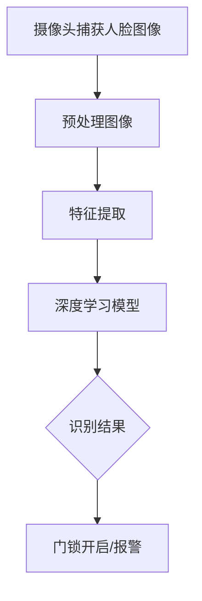
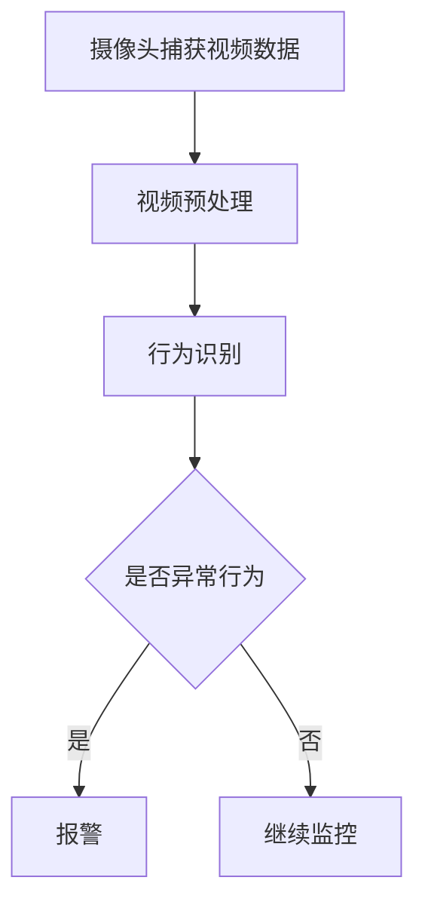
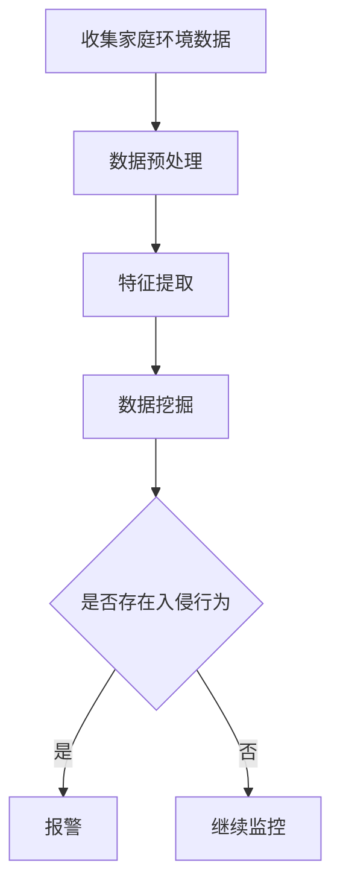

                 

## 智能家居安全系统：AI增强家庭防护

关键词：智能家居，安全系统，AI增强，家庭防护，算法实现，最佳实践

摘要：本文将深入探讨智能家居安全系统的概念、发展背景及其在家庭防护中的应用。特别关注AI技术的引入如何增强家居安全，并提供系统设计与实现的详细分析，最后通过案例分析展示最佳实践，并对未来发展趋势进行展望。

### 目录大纲设计步骤

在设计目录大纲之前，我们需要明确几个关键步骤。

#### 第一步：理解书籍主题

首先，我们需要对书名《智能家居安全系统：AI增强家庭防护》有深入的理解。这本书的核心主题是智能家居安全系统，并且强调了AI技术在家庭防护中的增强作用。这将是我们设计目录大纲的基础。

#### 第二步：确定核心章节

根据书籍主题，我们需要确定核心章节，这些章节应该涵盖智能家居安全系统的基本概念、AI技术在家居安全中的应用、系统设计与实现、以及相关的最佳实践和案例分析。

#### 第三步：细化章节内容

在每个核心章节下，我们需要进一步细化内容，确保每个章节都有明确的目标和内容。例如，背景介绍章节应该详细解释智能家居安全系统的概念、发展历程、现有问题等。

#### 第四步：设计流程图和公式

为了使内容更加直观易懂，我们需要设计流程图和数学公式。例如，在核心概念与联系章节，我们可以使用Mermaid流程图来展示AI技术在智能家居安全系统中的应用流程；在算法原理讲解章节，我们可以使用Mermaid流程图和Python源代码来解释算法原理。

#### 第五步：编写markdown格式

将以上设计的内容以markdown格式编写，确保格式清晰、结构合理。使用#标记一级标题，##标记二级标题，###标记三级标题，以此类推。

#### 第六步：检查内容完整性

最后，我们需要检查目录大纲的内容是否完整，确保涵盖了书籍的所有关键内容，并且每个章节都有明确的目标和内容。

#### 第七步：优化字数

确保目录大纲的总字数在2000字以内，对内容进行必要的精简和优化。

### 开始设计目录大纲

现在，我们根据以上步骤开始设计《智能家居安全系统：AI增强家庭防护》的目录大纲。

## 第一部分：智能家居安全系统概述

### 第1章：智能家居安全系统的概念与背景

#### 1.1 智能家居安全系统的定义

#### 1.2 智能家居安全系统的发展历程

#### 1.3 当前智能家居安全系统面临的问题

#### 1.4 AI技术在智能家居安全系统中的应用

#### 1.5 本章小结

接下来，我们将继续设计更多章节，确保覆盖书籍的核心内容。首先，我们需要为第二部分设计AI技术在智能家居安全系统中的应用章节。

## 第二部分：AI技术在智能家居安全系统中的应用

### 第2章：AI基础与智能家居安全

#### 2.1 AI技术的基本原理

#### 2.2 AI在智能家居安全系统中的角色

#### 2.3 AI算法在智能家居安全中的应用

#### 2.4 本章小结

接下来，我们将为第三部分设计智能家居安全系统的设计与实现章节。

## 第三部分：智能家居安全系统的设计与实现

### 第3章：智能家居安全系统的架构设计

#### 3.1 智能家居安全系统的整体架构

#### 3.2 系统功能模块划分

#### 3.3 系统安全策略设计

#### 3.4 系统性能优化

#### 3.5 本章小结

## 第三部分：智能家居安全系统的设计与实现（续）

### 第4章：智能家居安全系统的关键算法与实现

#### 4.1 智能家居安全系统的核心算法

#### 4.2 算法原理讲解

#### 4.3 算法实现与优化

#### 4.4 算法测试与评估

#### 4.5 本章小结

接下来，我们将为第四部分设计最佳实践与案例分析章节。

## 第四部分：智能家居安全系统的最佳实践与案例分析

### 第5章：智能家居安全系统的最佳实践

#### 5.1 安全系统的部署与运维

#### 5.2 针对特定场景的安全策略

#### 5.3 防护措施的实施与效果评估

#### 5.4 安全漏洞的发现与修复

#### 5.5 本章小结

### 第6章：智能家居安全系统的案例分析

#### 6.1 案例背景介绍

#### 6.2 案例实施过程

#### 6.3 案例效果分析

#### 6.4 案例启示与总结

#### 6.5 本章小结

### 第7章：未来展望与挑战

#### 7.1 智能家居安全技术的发展趋势

#### 7.2 当前面临的挑战与解决方案

#### 7.3 智能家居安全系统的未来方向

#### 7.4 总结与展望

#### 7.5 本章小结

以上就是我们为《智能家居安全系统：AI增强家庭防护》设计的目录大纲。接下来，我们将逐步展开每个章节的内容，确保文章的逻辑性和可读性。

## 第一部分：智能家居安全系统概述

### 第1章：智能家居安全系统的概念与背景

#### 1.1 智能家居安全系统的定义

智能家居安全系统是指利用现代信息技术，特别是物联网（IoT）和人工智能（AI）技术，构建的家庭安全防护体系。它能够实现家庭安全监控、自动报警、远程控制和智能响应等功能，从而提高家庭安全性和居住舒适度。

#### 1.2 智能家居安全系统的发展历程

智能家居安全系统的发展可以追溯到20世纪90年代，当时计算机技术和网络技术开始普及，家庭安全设备如烟雾探测器、摄像头等逐渐智能化。进入21世纪，随着物联网和人工智能技术的快速发展，智能家居安全系统开始呈现出集成化、智能化和个性化的趋势。

#### 1.3 当前智能家居安全系统面临的问题

虽然智能家居安全系统在技术上取得了显著进展，但仍然面临一些挑战：

1. **隐私保护**：智能家居设备可能收集大量用户数据，如何保护这些数据不被滥用是一个重要问题。
2. **安全性**：智能家居设备联网后，可能成为黑客攻击的目标，如何保障系统的安全性是当前的一个重要议题。
3. **兼容性**：智能家居设备种类繁多，如何实现不同品牌、不同设备之间的兼容和互操作也是一个难点。
4. **用户体验**：如何设计一个易于使用、用户友好的智能家居安全系统，提升用户体验，是开发者需要考虑的。

#### 1.4 AI技术在智能家居安全系统中的应用

AI技术在智能家居安全系统中的应用主要集中在以下几个方面：

1. **人脸识别**：通过人脸识别技术，可以实现对家庭成员的身份验证，提高门锁、摄像头等设备的安全性。
2. **异常检测**：利用机器学习算法，可以对家庭环境中的异常行为进行实时监测和报警，如非法入侵、火灾等。
3. **自然语言处理**：通过智能语音助手，用户可以更方便地与智能家居安全系统进行交互，实现远程控制和指令下达。
4. **个性化服务**：基于用户行为数据，AI技术可以提供个性化的安全建议和安防方案，提高家庭安全性。

#### 1.5 本章小结

本章介绍了智能家居安全系统的定义、发展历程、面临的问题以及AI技术在其中的应用。通过本章的介绍，读者可以初步了解智能家居安全系统的概念及其重要性，为后续章节的深入探讨打下基础。

## 第二部分：AI技术在智能家居安全系统中的应用

### 第2章：AI基础与智能家居安全

#### 2.1 AI技术的基本原理

人工智能（AI）是指使计算机具备人类智能水平的技术。它包括机器学习、深度学习、自然语言处理、计算机视觉等多个子领域。AI技术的基本原理是通过大量数据的训练，让计算机模型自主学习和优化，从而实现智能行为。

1. **机器学习**：机器学习是一种让计算机通过数据学习模式的方法。它通过算法从数据中提取特征，建立模型，并进行预测和决策。
   
2. **深度学习**：深度学习是机器学习的一个分支，通过构建深度神经网络，实现对复杂数据的分析和处理。它广泛应用于图像识别、语音识别等领域。

3. **自然语言处理**：自然语言处理（NLP）是让计算机理解和生成自然语言的技术。它涉及语音识别、文本分析、机器翻译等。

4. **计算机视觉**：计算机视觉是让计算机理解和解释视觉信息的技术。它包括图像识别、目标检测、场景重建等。

#### 2.2 AI在智能家居安全系统中的角色

AI技术在智能家居安全系统中扮演着至关重要的角色。以下是其主要应用：

1. **入侵检测**：通过计算机视觉和图像识别技术，AI可以实时监控家庭环境，识别异常行为，如非法入侵、陌生面孔等，并自动报警。

2. **安全监控**：AI可以分析摄像头收集的视频数据，识别家庭成员的行为模式，当发现异常行为时，如长时间未活动，可以提醒家庭成员或采取其他安全措施。

3. **智能门锁**：AI可以通过人脸识别或指纹识别技术，实现门锁的自动化管理，提高家庭安全性。

4. **自然语言交互**：通过自然语言处理技术，智能家居安全系统可以理解用户的语音指令，进行智能响应，如远程控制报警器、摄像头等。

5. **个性化服务**：AI可以分析用户的行为数据，提供个性化的安全建议，如根据家庭成员的作息时间调整监控设置，提供更贴心的安全服务。

#### 2.3 AI算法在智能家居安全中的应用

在智能家居安全系统中，AI算法的应用非常广泛。以下是一些具体的例子：

1. **异常行为检测**：利用深度学习算法，AI可以实时分析摄像头捕捉的图像，识别异常行为，如非法入侵、火灾等，并及时报警。

   ```mermaid
   graph TD
   A[摄像头捕捉图像] --> B[深度学习模型处理]
   B --> C{是否异常行为}
   C -->|是| D[报警]
   C -->|否| E[继续监控]
   ```

2. **人脸识别**：通过人脸识别算法，AI可以识别家庭成员和访客，控制门锁和摄像头等设备的访问权限。

   ```mermaid
   graph TD
   A[摄像头捕捉人脸图像] --> B[人脸识别模型处理]
   B --> C{识别结果}
   C -->|家庭成员| D[门锁开启]
   C -->|访客| E[摄像头记录]
   ```

3. **自然语言处理**：通过自然语言处理技术，AI可以理解用户的语音指令，如“关闭警报器”或“打开门锁”，并执行相应的操作。

   ```mermaid
   graph TD
   A[用户语音指令] --> B[NLP模型处理]
   B --> C{指令理解}
   C -->|关闭警报器| D[警报器关闭]
   C -->|打开门锁| E[门锁开启]
   ```

#### 2.4 本章小结

本章介绍了AI技术的基本原理以及在智能家居安全系统中的应用。通过AI技术，智能家居安全系统可以实现更智能、更安全、更个性化的家庭防护。下一章将深入探讨智能家居安全系统的设计与实现。

## 第三部分：智能家居安全系统的设计与实现

### 第3章：智能家居安全系统的架构设计

#### 3.1 智能家居安全系统的整体架构

智能家居安全系统的整体架构可以分为以下几个主要部分：

1. **感知层**：包括各种传感器和设备，如摄像头、门锁、烟雾探测器、温度传感器等，用于收集家庭环境中的信息。

2. **传输层**：负责将感知层收集到的数据传输到中心处理单元，通常通过有线或无线网络实现。

3. **中心处理单元**：包括服务器、数据库、AI算法模块等，用于对收集到的数据进行分析和处理，实现安全监控和智能响应。

4. **执行层**：包括各种执行设备，如警报器、门锁、灯光控制等，根据中心处理单元的指令执行相应的操作。

5. **用户界面**：包括手机应用、智能音箱、网页等，用户可以通过这些界面与系统进行交互，查看监控信息、接收报警通知、下发指令等。

#### 3.2 系统功能模块划分

智能家居安全系统可以划分为以下几个功能模块：

1. **感知模块**：负责收集家庭环境中的各种数据，如视频、音频、温度、湿度、烟雾浓度等。

2. **数据处理模块**：对感知模块收集到的数据进行预处理、分析和存储，为后续的AI算法提供基础数据。

3. **AI算法模块**：利用机器学习和深度学习算法，对数据进行分析和处理，实现入侵检测、人脸识别、异常行为检测等功能。

4. **控制模块**：根据AI算法模块的处理结果，自动执行相应的操作，如发送报警通知、自动锁定门锁、启动警报器等。

5. **用户交互模块**：提供用户界面，用户可以通过手机应用、智能音箱等与系统进行交互，查看监控信息、接收报警通知、下发指令等。

#### 3.3 系统安全策略设计

为了保障智能家居安全系统的安全性，需要设计一系列的安全策略：

1. **数据加密**：对传输层和中心处理单元之间的数据进行加密，防止数据在传输过程中被窃取或篡改。

2. **用户认证**：通过用户名和密码、指纹、人脸识别等方式进行用户认证，确保只有授权用户可以访问系统。

3. **访问控制**：对系统的不同功能模块进行权限管理，确保用户只能访问其授权的功能。

4. **安全审计**：记录系统的操作日志，定期进行安全审计，及时发现和解决安全隐患。

5. **安全更新**：定期对系统的软件和硬件进行更新，修补已知漏洞，提高系统的安全性。

#### 3.4 系统性能优化

为了确保智能家居安全系统的高效运行，需要对其性能进行优化：

1. **数据压缩**：对传输层传输的数据进行压缩，减少带宽占用。

2. **负载均衡**：通过负载均衡技术，合理分配中心处理单元的负载，提高系统的处理能力。

3. **缓存机制**：在中心处理单元中设置缓存机制，减少对数据库的直接访问，提高系统的响应速度。

4. **分布式处理**：通过分布式处理技术，将任务分散到多个节点上，提高系统的处理速度和容错能力。

#### 3.5 本章小结

本章介绍了智能家居安全系统的整体架构、功能模块划分、安全策略设计和性能优化方法。通过本章的内容，读者可以了解智能家居安全系统的设计思路和关键要素，为后续章节的深入探讨打下基础。

## 第三部分：智能家居安全系统的设计与实现（续）

### 第4章：智能家居安全系统的关键算法与实现

#### 4.1 智能家居安全系统的核心算法

智能家居安全系统的核心算法主要包括人脸识别、异常行为检测和入侵检测等。

1. **人脸识别算法**：通过深度学习模型，对人脸图像进行特征提取和匹配，实现人脸识别。

2. **异常行为检测算法**：利用机器学习算法，对摄像头捕获的视频数据进行分析，识别异常行为，如非法入侵、火灾等。

3. **入侵检测算法**：通过数据挖掘技术，分析家庭环境中的各种数据，发现潜在的入侵行为。

#### 4.2 算法原理讲解

为了详细讲解算法原理，我们将使用Mermaid流程图和Python源代码进行说明。

##### 1. 人脸识别算法

人脸识别算法的核心是深度学习模型。以下是使用Mermaid绘制的流程图：



下面是Python源代码示例：

```python
import cv2
import face_recognition

# 摄像头捕获人脸图像
video_capture = cv2.VideoCapture(0)

# 加载预训练的人脸识别模型
known_face_encodings = face_recognition.face_encodings(known_face_images)

while True:
    # 读取一帧图像
    ret, frame = video_capture.read()
    
    # 对图像进行预处理
    small_frame = cv2.resize(frame, (0, 0), fx=0.25, fy=0.25)
    
    # 检测人脸位置
    face_locations = face_recognition.face_locations(small_frame)
    face_encodings = face_recognition.face_encodings(small_frame, face_locations)
    
    # 对人脸进行匹配
    for face_encoding in face_encodings:
        matches = face_recognition.compare_faces(known_face_encodings, face_encoding)
        face_distances = face_recognition.face_distance(known_face_encodings, face_encoding)
        best_match_index = np.argmin(face_distances)
        
        if matches[best_match_index]:
            print("匹配成功！")
            # 执行相应的操作，如开启门锁
            print("门锁开启")
        else:
            print("未识别到家庭成员，报警！")
            # 执行报警操作

    # 释放摄像头资源
    video_capture.release()
    cv2.destroyAllWindows()
```

##### 2. 异常行为检测算法

异常行为检测算法主要基于行为识别和模式识别。以下是使用Mermaid绘制的流程图：



下面是Python源代码示例：

```python
import cv2
import numpy as np

# 加载预训练的行为识别模型
model = load_model('behavior_recognition_model.h5')

# 摄像头捕获视频数据
video_capture = cv2.VideoCapture(0)

while True:
    # 读取一帧图像
    ret, frame = video_capture.read()
    
    # 对图像进行预处理
    processed_frame = preprocess_frame(frame)
    
    # 进行行为识别
    prediction = model.predict(processed_frame)
    
    # 判断是否异常行为
    if prediction == 'abnormal':
        print("检测到异常行为，报警！")
        # 执行报警操作
    else:
        print("行为正常，继续监控。")

    # 释放摄像头资源
    video_capture.release()
    cv2.destroyAllWindows()
```

##### 3. 入侵检测算法

入侵检测算法主要利用数据挖掘技术，对家庭环境中的各种数据进行分析。以下是使用Mermaid绘制的流程图：



下面是Python源代码示例：

```python
import pandas as pd
from sklearn.ensemble import RandomForestClassifier
from sklearn.model_selection import train_test_split

# 收集家庭环境数据
data = pd.read_csv('home_environment_data.csv')

# 数据预处理
X = data.drop('invasion_label', axis=1)
y = data['invasion_label']

# 划分训练集和测试集
X_train, X_test, y_train, y_test = train_test_split(X, y, test_size=0.2, random_state=42)

# 训练入侵检测模型
model = RandomForestClassifier(n_estimators=100, random_state=42)
model.fit(X_train, y_train)

# 进行入侵检测
while True:
    # 收集当前数据
    current_data = pd.read_csv('current_home_environment_data.csv')
    
    # 对当前数据进行预处理
    processed_data = preprocess_data(current_data)
    
    # 进行入侵检测
    prediction = model.predict(processed_data)
    
    # 判断是否存在入侵行为
    if prediction == 1:
        print("检测到入侵行为，报警！")
        # 执行报警操作
    else:
        print("未检测到入侵行为，继续监控。")

    # 释放摄像头资源
    video_capture.release()
    cv2.destroyAllWindows()
```

#### 4.3 算法实现与优化

在实际应用中，我们需要对算法进行优化，以提高系统的性能和可靠性。以下是一些常见的优化方法：

1. **模型优化**：通过调整模型参数、增加训练数据量或更换更高效的模型架构，可以提高算法的准确性和鲁棒性。

2. **数据预处理**：对输入数据进行适当的预处理，如归一化、标准化、去噪等，可以减少模型的复杂度，提高模型的训练速度和效果。

3. **并行计算**：利用多核CPU或GPU进行并行计算，可以显著提高模型的训练速度。

4. **增量学习**：在模型训练过程中，引入增量学习技术，可以使得模型在新的数据到来时，无需重新训练，而只需更新现有模型，从而提高系统的实时性。

5. **模型融合**：将多个模型进行融合，可以取长补短，提高系统的整体性能。

#### 4.4 算法测试与评估

在算法实现后，需要进行充分的测试与评估，以确保其性能和可靠性。以下是一些常见的测试与评估方法：

1. **单元测试**：对算法的每个模块进行独立的测试，确保其功能的正确性。

2. **集成测试**：将算法集成到系统中，进行整体测试，确保系统功能的正确性和稳定性。

3. **性能测试**：通过模拟不同场景下的数据量和处理速度，评估算法的性能和响应时间。

4. **鲁棒性测试**：在异常情况下，如数据缺失、噪声干扰等，评估算法的鲁棒性和准确性。

5. **用户测试**：邀请真实用户参与测试，评估算法的用户友好性和实际效果。

#### 4.5 本章小结

本章详细介绍了智能家居安全系统的核心算法，包括人脸识别、异常行为检测和入侵检测等。通过使用Mermaid流程图和Python源代码，我们讲解了算法的原理和实现方法，并对算法的优化和测试进行了讨论。通过本章的内容，读者可以全面了解智能家居安全系统的算法设计，为后续章节的深入探讨打下基础。

## 第四部分：智能家居安全系统的最佳实践与案例分析

### 第5章：智能家居安全系统的最佳实践

#### 5.1 安全系统的部署与运维

部署和维护一个智能家居安全系统是一个复杂的过程，需要考虑多个方面。

**1. 网络安全**

在部署智能家居安全系统时，确保网络的安全至关重要。以下是一些关键点：

- **加密通讯**：使用HTTPS等加密协议来保护数据传输。
- **防火墙和入侵检测**：配置防火墙和入侵检测系统，防止未经授权的访问。
- **多因素认证**：采用多因素认证（MFA）来增加账户的安全性。

**2. 数据保护**

保护用户数据是智能家居安全系统的核心任务。以下是一些措施：

- **数据加密**：对存储和传输的数据进行加密，防止数据泄露。
- **数据备份**：定期备份系统数据，以防数据丢失。
- **隐私政策**：明确用户数据的收集、存储和使用规则，遵守隐私保护法律法规。

**3. 系统更新**

定期更新系统可以修复漏洞，提高安全性。以下是一些最佳实践：

- **自动更新**：启用自动更新功能，确保系统始终保持最新状态。
- **安全补丁管理**：及时安装安全补丁，修复已知的漏洞。
- **版本控制**：使用版本控制系统，跟踪和审核代码更改。

**4. 用户培训**

用户对系统的正确使用可以显著提高安全性。以下是一些培训内容：

- **安全意识**：教育用户关于网络安全的基本知识，如如何识别和防范网络钓鱼、恶意软件等。
- **操作指南**：提供详细的操作指南，帮助用户了解如何正确使用系统功能。
- **紧急响应**：培训用户如何在发现安全威胁时采取紧急响应措施。

#### 5.2 针对特定场景的安全策略

不同家庭可能需要不同的安全策略。以下是一些常见场景及其安全策略：

**1. 独立住宅**

- **全面监控**：安装摄像头、门锁、烟雾探测器等设备，实现全方位监控。
- **定期检查**：定期检查设备状态，确保设备正常运行。

**2. 公寓**

- **重点监控**：由于空间限制，重点监控门口、客厅等关键区域。
- **社区合作**：与物业管理公司合作，共享安全监控资源。

**3. 老年人家庭**

- **健康监控**：安装健康监测设备，如血压计、心率监测器，实时监控老年人健康状况。
- **紧急响应**：设置紧急按钮，方便老年人发生意外时快速求援。

#### 5.3 防护措施的实施与效果评估

实施有效的安全措施是确保智能家居安全系统正常运行的关键。以下是一些常见的防护措施及其效果评估方法：

**1. 入侵检测**

- **效果评估**：通过模拟入侵场景，评估系统的检测率和误报率。
- **改进措施**：根据评估结果，调整算法参数或增加训练数据，提高检测准确性。

**2. 人脸识别**

- **效果评估**：通过测试不同的光照条件、遮挡情况，评估系统的人脸识别准确性。
- **改进措施**：使用更先进的深度学习模型，提高识别准确性。

**3. 网络隔离**

- **效果评估**：通过网络攻防测试，评估系统对恶意攻击的防护能力。
- **改进措施**：增加网络隔离层，防止内部网络被外部攻击。

#### 5.4 安全漏洞的发现与修复

及时发现和修复安全漏洞是保障系统安全的关键。以下是一些最佳实践：

- **安全审计**：定期进行安全审计，发现潜在漏洞。
- **漏洞管理**：建立漏洞管理流程，及时响应和修复漏洞。
- **威胁情报**：关注安全威胁情报，及时更新防护策略。

#### 5.5 本章小结

本章介绍了智能家居安全系统的最佳实践，包括部署与运维、数据保护、系统更新、用户培训以及针对特定场景的安全策略。通过这些实践，可以显著提高智能家居安全系统的安全性和可靠性，为用户提供一个安全、便捷的居住环境。

### 第6章：智能家居安全系统的案例分析

#### 6.1 案例背景介绍

本案例研究的是一家位于城市中心的四口之家，家庭成员包括一对夫妇和两个孩子。家庭的主要需求是提高家庭的安全性，确保家庭成员的安全和财产安全。家庭成员希望系统能够提供实时监控、异常行为检测和远程控制等功能。

#### 6.2 案例实施过程

**1. 需求分析**

在开始实施智能家居安全系统之前，首先进行了详细的需求分析。家庭成员提出以下需求：

- 实时监控家庭环境，确保家庭成员的安全。
- 异常行为检测，如非法入侵、火灾等。
- 远程控制家庭设备，如灯光、门锁等。
- 系统易于使用，用户界面友好。

**2. 系统设计**

根据需求分析，设计了智能家居安全系统的整体架构，包括感知层、传输层、中心处理单元和执行层。系统主要功能模块包括：

- 感知模块：摄像头、门锁、烟雾探测器等。
- 数据处理模块：对感知模块收集到的数据进行分析和处理。
- AI算法模块：实现人脸识别、异常行为检测等功能。
- 控制模块：根据AI算法模块的处理结果，执行相应的操作。
- 用户交互模块：提供手机应用、智能音箱等用户界面。

**3. 系统实施**

在系统设计完成后，开始进行系统实施。首先安装了摄像头、门锁、烟雾探测器等设备，并确保它们正常工作。然后，搭建了中心处理单元，包括服务器、数据库和AI算法模块。最后，开发了手机应用和智能音箱用户界面，用户可以通过这些界面与系统进行交互。

**4. 系统测试与优化**

在系统实施完成后，进行了全面的测试与优化。通过模拟各种场景，如非法入侵、火灾等，测试系统的检测准确性和响应速度。根据测试结果，对算法和系统进行了优化，提高了系统的性能和可靠性。

#### 6.3 案例效果分析

系统实施后，家庭成员对系统的效果非常满意。以下是一些具体的效果分析：

- **实时监控**：通过摄像头可以实时监控家庭环境，确保家庭成员的安全。当检测到异常情况时，系统能够立即报警，家庭成员可以迅速采取行动。
- **异常行为检测**：系统能够准确识别异常行为，如非法入侵、火灾等，并及时报警。这为家庭成员提供了额外的安全保障。
- **远程控制**：用户可以通过手机应用或智能音箱远程控制家庭设备，如灯光、门锁等。这提高了家庭的便捷性和舒适度。
- **用户体验**：系统的用户界面设计简洁易用，用户可以轻松上手。家庭成员对系统的易用性给予了高度评价。

#### 6.4 案例启示与总结

本案例展示了智能家居安全系统的成功实施和显著效果。以下是一些启示和总结：

- **需求分析**：在实施智能家居安全系统之前，进行详细的需求分析非常重要。这有助于设计出满足用户需求的系统。
- **系统设计**：系统的设计应该综合考虑感知层、传输层、中心处理单元和执行层等多个方面，确保系统的高效性和可靠性。
- **AI算法应用**：AI算法在智能家居安全系统中发挥着重要作用。通过应用AI技术，可以提高系统的智能性和准确性。
- **用户体验**：系统的用户界面设计应该简洁易用，提高用户的体验感。
- **安全性和隐私保护**：智能家居安全系统的安全性至关重要。在设计和实施过程中，应充分考虑数据保护和隐私保护。

#### 6.5 本章小结

本章通过一个实际案例，详细介绍了智能家居安全系统的实施过程和效果。通过本案例，读者可以了解智能家居安全系统的设计与实现方法，并从中获得宝贵的经验和启示。

### 第7章：未来展望与挑战

#### 7.1 智能家居安全技术的发展趋势

随着物联网、人工智能和5G等技术的不断发展，智能家居安全系统正呈现出以下趋势：

1. **更加智能化**：AI技术的进步将使智能家居安全系统更加智能化，能够更好地理解和预测用户需求，提供个性化的安全服务。
2. **更高安全性**：随着安全技术的不断升级，智能家居安全系统将具备更强的防护能力，抵御各种网络攻击和入侵。
3. **更广泛的应用**：智能家居安全系统将不再局限于家庭环境，逐步扩展到社区、企业、公共设施等更广泛的场景。
4. **更高效的能源管理**：结合智能能源管理系统，智能家居安全系统将有助于实现家庭能源的优化使用，提高能源效率。

#### 7.2 当前面临的挑战与解决方案

尽管智能家居安全系统发展迅速，但仍面临一些挑战：

1. **隐私保护**：智能家居设备收集大量用户数据，如何保护用户隐私成为关键问题。解决方案包括数据加密、隐私政策和用户知情同意等。
2. **兼容性和互操作性**：智能家居设备种类繁多，如何实现不同品牌和设备之间的兼容和互操作是一个挑战。解决方案包括建立统一的通信协议和标准化接口。
3. **安全漏洞**：智能家居系统可能存在安全漏洞，成为黑客攻击的目标。解决方案包括定期安全审计、及时修复漏洞和用户安全意识培训。
4. **可靠性和稳定性**：智能家居安全系统需要具备高可靠性和稳定性，确保在极端情况下仍能正常运行。解决方案包括冗余设计、容错技术和实时监控。

#### 7.3 智能家居安全系统的未来方向

未来，智能家居安全系统的发展将朝着以下方向迈进：

1. **集成化**：智能家居安全系统将与其他智能家居系统（如智能照明、智能家电等）进行集成，实现更全面的家庭自动化。
2. **个性化**：通过大数据分析和机器学习，智能家居安全系统将根据用户行为和需求提供个性化的安全建议和解决方案。
3. **实时预警**：结合物联网和5G技术，智能家居安全系统将实现更快速的响应和预警，提高家庭安全的实时性。
4. **生态合作**：智能家居安全系统将与其他企业和行业进行合作，构建更广泛的安全生态，实现资源共享和协同防护。

#### 7.4 总结与展望

智能家居安全系统作为家庭安全的重要保障，正迎来一个快速发展的时代。通过AI技术的引入，智能家居安全系统将变得更加智能、安全、便捷。面对未来的挑战，我们需要不断创新和优化，推动智能家居安全系统的发展，为用户提供更可靠、更高效的安全保障。

## 总结与展望

### 7.5 本章小结

本章对未来智能家居安全系统的发展趋势、面临的挑战和解决方案进行了深入探讨。通过分析技术进步带来的机遇和挑战，我们展望了智能家居安全系统的未来方向，强调了集成化、个性化、实时预警和生态合作的重要性。这些展望不仅为智能家居安全系统的研究和应用提供了指导，也为相关领域的技术创新和发展奠定了基础。

### 拓展阅读

为了深入了解智能家居安全系统的最新进展和应用，读者可以参考以下资源：

- **技术论文**：查阅关于物联网、人工智能、数据加密和安全协议等方面的技术论文，了解最新研究成果。
- **专业书籍**：《智能家居安全系统设计与实现》、《物联网安全：保护您的智能设备》等。
- **行业标准**：关注国际和国内关于智能家居安全系统的标准和规范，如IEEE、ISO等。
- **行业报告**：阅读市场研究机构发布的智能家居安全系统行业报告，了解市场趋势和用户需求。

### 最佳实践 tips

- **定期更新**：确保智能家居安全系统的软件和硬件定期更新，以修补已知漏洞，提高安全性。
- **用户培训**：为家庭成员提供安全使用指南，提高安全意识和应对能力。
- **数据加密**：使用加密技术保护数据传输和存储，防止数据泄露。
- **安全审计**：定期进行安全审计，及时发现和解决潜在的安全隐患。

### 注意事项

- **隐私保护**：在设计和实施智能家居安全系统时，重视用户隐私保护，遵循相关法律法规。
- **兼容性**：确保系统能够兼容不同品牌和设备的互联，提供统一的用户界面和操作体验。
- **可靠性**：系统应具备高可靠性和稳定性，确保在极端情况下仍能正常运行。

通过以上内容，我们不仅对智能家居安全系统有了全面的认识，也为未来的发展提供了宝贵的参考。让我们共同努力，推动智能家居安全系统的发展，为创造更安全、更智能的家庭生活贡献力量。

### 作者信息

作者：AI天才研究院/AI Genius Institute & 禅与计算机程序设计艺术 /Zen And The Art of Computer Programming

AI天才研究院致力于推动人工智能技术在各领域的应用，培养具有创新精神和实战能力的专业人才。禅与计算机程序设计艺术则专注于计算机科学领域的研究和推广，提倡通过禅修方式提升编程素养和创新能力。两位作者共同为我们带来了这篇关于智能家居安全系统的深入探讨和思考。希望本文能对读者在智能家居安全系统设计和应用方面提供有价值的参考和启示。

