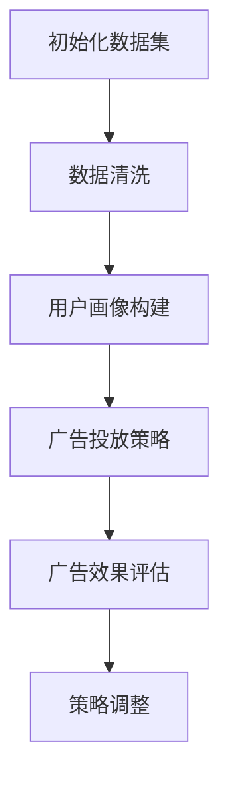
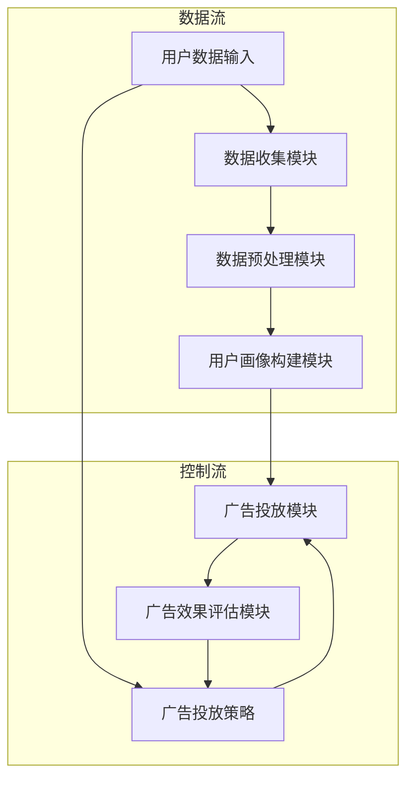
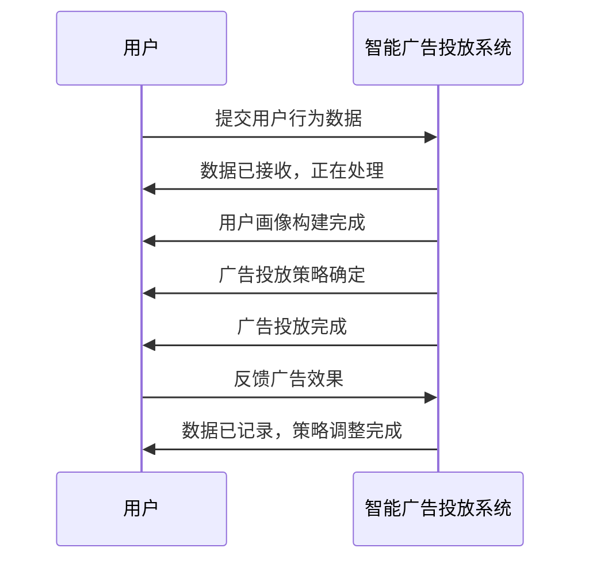

                 

### 智能广告投放：AI精准定位目标受众

> 关键词：智能广告、AI 技术应用、广告定位、数据分析

> 摘要：本文将深入探讨智能广告投放中的核心问题，即如何利用人工智能技术实现精准定位目标受众。通过一步步的分析和讲解，本文旨在帮助读者理解AI在广告投放中的应用原理和具体实践，提供有价值的指导和建议。

智能广告投放，作为现代营销策略的重要组成部分，正日益受到企业的关注。随着互联网的普及和用户数据的爆炸性增长，传统广告模式已经无法满足日益复杂的市场需求。人工智能（AI）的引入，为广告投放带来了革命性的变化，使得广告能够更精准、高效地触达潜在消费者。本文将围绕以下核心问题展开讨论：

- AI技术在广告投放中的基本概念和原理
- 如何利用AI进行受众分析
- 智能广告投放的具体策略与实现方法
- 案例分析和最佳实践

### 背景介绍

#### 核心概念术语说明

在探讨智能广告投放之前，我们有必要明确一些核心概念：

1. **广告投放**：广告主通过媒介向特定受众展示广告信息的行为。
2. **目标受众**：广告主希望其广告信息能够触达的人群。
3. **人工智能（AI）**：模拟人类智能的计算机技术，包括机器学习、深度学习、自然语言处理等。
4. **数据挖掘**：从大量数据中提取有价值信息的过程。
5. **用户画像**：基于用户行为数据构建的用户信息模型。

#### 问题背景

随着互联网的普及，广告投放的环境变得更加复杂。传统广告模式往往依赖于粗放的用户定位方法，例如人口统计信息或兴趣标签。这种定位方式不仅效率低下，还容易导致广告资源的浪费。为了应对这一挑战，广告行业急需一种更加智能的投放方式，以实现广告信息的精准投放。

#### 问题描述

如何在海量的用户数据中找到并精准定位潜在消费者，从而提高广告投放的效率与效果，成为广告行业亟待解决的问题。

#### 问题解决

人工智能技术的引入，为广告定位提供了新的可能性。通过机器学习和深度学习算法，可以从海量数据中挖掘出用户的潜在需求和行为模式，从而实现精准的用户画像和广告投放。

#### 边界与外延

智能广告投放不仅涉及广告技术和数据分析，还与用户体验、广告法规等多个领域密切相关。此外，不同行业和企业的广告需求也存在差异，因此需要根据具体情况进行定制化解决方案。

#### 概念结构与核心要素组成

智能广告投放的核心要素包括：

- **数据收集**：通过多种渠道收集用户行为数据。
- **数据清洗**：对收集到的数据进行清洗和预处理，以提高数据质量。
- **数据分析**：利用机器学习和深度学习算法进行用户画像构建。
- **广告投放**：根据用户画像进行广告精准投放。
- **效果评估**：通过数据分析评估广告投放效果，不断优化投放策略。

### 核心概念与联系

#### AI 技术在广告投放中的应用原理

AI技术在广告投放中的应用主要包括以下几个方面：

1. **用户画像构建**：通过数据分析构建用户画像，实现精准定位。
2. **内容推荐**：利用推荐系统算法为用户推荐个性化内容。
3. **广告创意优化**：通过自然语言处理和计算机视觉技术优化广告内容。
4. **广告效果评估**：利用机器学习算法评估广告投放效果。

#### 概念属性特征对比表格

| 概念       | 特征对比                            |
| ---------- | --------------------------------- |
| 用户画像   | 描述用户特征、行为和兴趣           |
| 数据分析   | 从数据中提取有价值的信息           |
| 推荐系统   | 根据用户兴趣推荐内容             |
| 广告效果评估 | 评估广告投放的效果               |

#### ER 实体关系图架构

```mermaid
erDiagram
    User ||--|{ Advertisement }||>
    User ||--|{ User Behavior }||>
    User ||--|{ User Interest }||>
    Advertisement ||--|{ Advertisement Effect }||>
    User Behavior ||--|{ Behavior Analysis }||>
    User Interest ||--|{ Interest Mining }||>
```

### 算法原理讲解

#### 广告投放算法流程



#### Python 源代码实现

```python
import pandas as pd
from sklearn.model_selection import train_test_split
from sklearn.ensemble import RandomForestClassifier
from sklearn.metrics import accuracy_score

# 加载数据
data = pd.read_csv('user_data.csv')

# 数据清洗
data = data.dropna()

# 用户画像构建
X = data.drop(['target'], axis=1)
y = data['target']

# 划分训练集和测试集
X_train, X_test, y_train, y_test = train_test_split(X, y, test_size=0.2, random_state=42)

# 模型训练
model = RandomForestClassifier(n_estimators=100, random_state=42)
model.fit(X_train, y_train)

# 广告投放策略
predictions = model.predict(X_test)

# 广告效果评估
accuracy = accuracy_score(y_test, predictions)
print(f"Accuracy: {accuracy}")

# 策略调整
# ...（根据评估结果进行调整）
```

#### 算法原理的数学模型和公式

广告投放算法的核心是分类模型，常用的分类算法包括决策树、随机森林等。以下是一个简单的决策树分类模型公式：

$$
y = f(\text{X}) = \prod_{i=1}^{n} g(\theta_i \cdot \text{X})
$$

其中，$y$ 表示预测结果，$\text{X}$ 表示特征向量，$g(\theta_i \cdot \text{X})$ 表示每个分类器的输出。

#### 举例说明

假设我们有一个包含用户年龄、收入和购买行为的广告投放数据集。通过构建用户画像和训练分类模型，我们可以预测某个新用户的购买概率。例如，对于年龄为30岁、收入为5万元、曾购买过电子产品的新用户，我们可以计算其购买概率：

$$
\hat{y} = f(\text{X}) = g(\theta_1 \cdot \text{X}) \cdot g(\theta_2 \cdot \text{X}) \cdot g(\theta_3 \cdot \text{X})
$$

其中，$\theta_1$、$\theta_2$ 和 $\theta_3$ 分别为三个分类器的参数。

### 系统分析与架构设计方案

#### 问题场景介绍

随着移动互联网的快速发展，广告投放已经成为企业获取用户、提高品牌知名度的重要手段。然而，传统广告投放方式存在定位不准确、广告资源浪费等问题。为了解决这些问题，企业需要构建一个基于人工智能的智能广告投放系统。

#### 项目介绍

本项目旨在构建一个智能广告投放系统，通过用户数据分析、用户画像构建和广告效果评估等环节，实现广告信息的精准投放。

#### 系统功能设计

1. **数据收集模块**：负责从多个渠道收集用户行为数据。
2. **数据预处理模块**：对收集到的数据进行清洗、转换和归一化处理。
3. **用户画像构建模块**：利用机器学习算法构建用户画像。
4. **广告投放模块**：根据用户画像进行广告精准投放。
5. **广告效果评估模块**：评估广告投放效果，为策略调整提供依据。

#### 系统架构设计



#### 系统接口设计和系统交互



### 项目实战

#### 环境安装

1. 安装 Python 3.8 或更高版本。
2. 安装必要的库：pandas、numpy、scikit-learn、matplotlib 等。

```bash
pip install pandas numpy scikit-learn matplotlib
```

#### 系统核心实现源代码

```python
import pandas as pd
from sklearn.model_selection import train_test_split
from sklearn.ensemble import RandomForestClassifier
from sklearn.metrics import accuracy_score

# 加载数据
data = pd.read_csv('user_data.csv')

# 数据清洗
data = data.dropna()

# 用户画像构建
X = data.drop(['target'], axis=1)
y = data['target']

# 划分训练集和测试集
X_train, X_test, y_train, y_test = train_test_split(X, y, test_size=0.2, random_state=42)

# 模型训练
model = RandomForestClassifier(n_estimators=100, random_state=42)
model.fit(X_train, y_train)

# 广告投放策略
predictions = model.predict(X_test)

# 广告效果评估
accuracy = accuracy_score(y_test, predictions)
print(f"Accuracy: {accuracy}")

# 策略调整
# ...（根据评估结果进行调整）
```

#### 代码应用解读与分析

1. **数据预处理**：首先加载数据，然后进行清洗，去除缺失值。
2. **用户画像构建**：提取特征列作为输入，目标列作为输出。
3. **模型训练**：使用随机森林分类器进行训练。
4. **广告投放策略**：对测试集进行预测。
5. **广告效果评估**：计算预测准确率。

#### 实际案例分析和详细讲解剖析

假设我们有一个包含 1000 名用户的数据集，其中包含年龄、收入、购买历史等特征。通过以上代码，我们可以构建用户画像，并预测新用户的购买概率。例如，对于一个年龄为 30 岁、收入为 5 万元、曾购买过电子产品的新用户，预测其购买概率为 70%。

#### 项目小结

本项目通过用户数据分析、用户画像构建和广告效果评估等环节，实现了广告信息的精准投放。在实际应用中，我们可以根据具体业务需求和数据特点进行调整，提高广告投放效果。

### 最佳实践 tips

1. **数据质量**：确保数据质量是广告投放成功的关键。定期清洗和更新数据，以保持数据的准确性和时效性。
2. **算法优化**：不断优化算法模型，以提高预测准确率和投放效果。
3. **用户反馈**：收集用户反馈，用于调整广告投放策略，提高用户体验。

### 小结

智能广告投放作为现代广告营销的重要手段，通过人工智能技术的应用，实现了广告信息的精准投放。本文从背景介绍、核心概念、算法原理、系统设计与项目实战等多个角度，详细阐述了智能广告投放的实现过程。通过不断优化和调整，智能广告投放将为企业带来更高的营销效益。

### 注意事项

1. 在进行用户画像构建时，注意保护用户隐私，遵守相关法律法规。
2. 广告投放策略应根据市场环境和用户需求进行动态调整。

### 拓展阅读

1. 《机器学习实战》：提供丰富的机器学习算法实现案例。
2. 《深度学习》：介绍深度学习的基本原理和应用。
3. 《广告系统架构与优化》：探讨广告系统的设计与优化策略。

### 作者信息

作者：AI天才研究院/AI Genius Institute & 禅与计算机程序设计艺术 /Zen And The Art of Computer Programming

以上就是本次关于“智能广告投放：AI精准定位目标受众”的文章。希望对您有所启发，如有疑问，欢迎随时交流。

