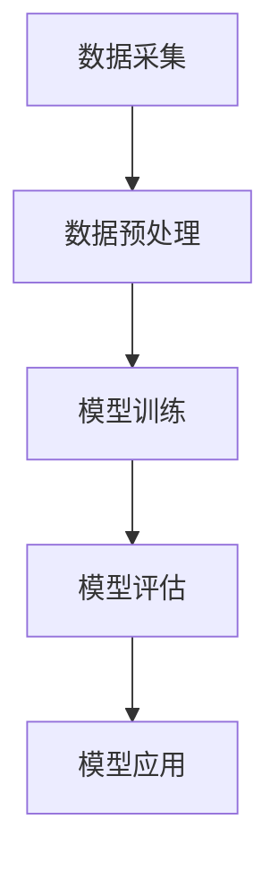
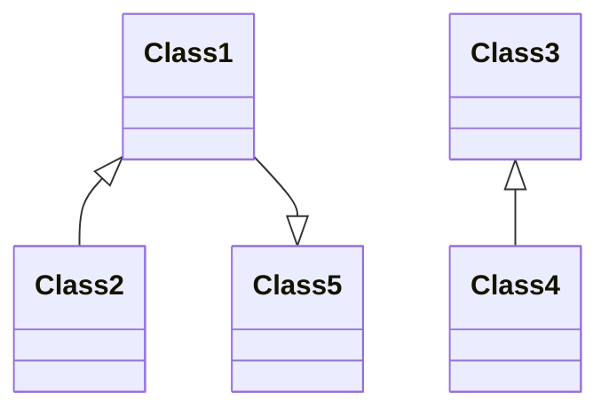

                 

## 智能废水处理：AI大模型优化环保工艺

### 关键词：智能废水处理、AI大模型、环保工艺、优化策略、系统架构、项目实战

### 摘要：
本文深入探讨了智能废水处理领域，尤其是AI大模型在环保工艺中的应用与优化策略。通过分析当前废水处理所面临的挑战与背景，本文首先介绍了AI大模型的核心概念及其与传统模型的区别。随后，文章详细描述了AI大模型在废水处理中的具体应用，包括预处理、主体处理和深度处理等步骤。接着，文章提出了基于AI大模型的环保工艺优化策略，并展示了实际项目中的成功案例。文章最后讨论了系统架构设计、项目实战中的环境安装和核心实现，以及最佳实践和注意事项，为读者提供了全面的技术指南。

## 第一部分：问题背景与核心概念

### 1. 背景介绍

#### 1.1 智能废水处理的重要性

随着全球人口的不断增长和工业化的快速发展，水资源污染问题日益严重，废水处理成为环境保护的关键环节。智能废水处理通过引入先进的人工智能技术，特别是AI大模型，可以提高废水处理的效率和质量，减少能源消耗和成本，实现可持续发展的目标。智能废水处理不仅有助于保护环境，还能提高水资源利用率，满足人们对清洁水资源的需求。

#### 1.2 环保工艺的现状与挑战

环保工艺在废水处理领域已经取得了一定成果，但仍然面临诸多挑战。首先，传统环保工艺存在效率低、能耗高、处理效果不稳定等问题。其次，随着废水成分的复杂性和多样性的增加，传统方法难以适应不同类型废水的处理需求。此外，环保工艺还需要大量的操作和维护成本，这对许多中小型企业和地区构成较大负担。

#### 1.3 AI大模型的应用潜力

AI大模型在图像识别、自然语言处理等领域已经取得了显著成果，其在废水处理中的应用潜力也日益显现。通过训练大规模的神经网络模型，AI大模型能够从大量数据中提取有效信息，对废水成分和水质变化进行实时预测和调控，从而优化废水处理工艺。AI大模型的应用有助于提高废水处理的精度和效率，降低能耗和成本，具有广泛的应用前景。

### 2. 核心概念与联系

#### 2.1 AI大模型原理

AI大模型，通常指深度学习中的大型神经网络模型，如Transformer、BERT等。它们通过多层次的信息传递和特征提取，能够处理大规模、高维度、非线性数据。大模型的核心特点包括：较大的网络参数规模、多层神经网络结构、强大的特征学习能力。与传统模型相比，大模型在处理复杂任务时具有更高的准确性和鲁棒性。

##### 2.1.1 大模型的定义
$$
\text{大模型} = (\text{多层神经网络}, \text{大规模参数规模})
$$

##### 2.1.2 大模型的核心特点

| 特征         | 说明                                                   |
| ------------ | ------------------------------------------------------ |
| 大规模参数   | 模型参数数量达到千万到亿级别                             |
| 多层神经网络 | 模型由多层神经网络组成，每层对输入数据进行特征提取和变换 |
| 强大的特征学习 | 能够从大量数据中自动提取有代表性的特征                   |

##### 2.1.3 大模型与传统模型的对比

| 对比项     | 大模型                        | 传统模型                      |
| ---------- | ----------------------------- | ----------------------------- |
| 参数规模   | 数百万到数十亿参数           | 数百到数千参数                |
| 网络结构   | 多层神经网络                  | 单层或少量层级               |
| 学习能力   | 高级特征提取和表示学习       | 简单的特征组合和规则学习     |
| 处理能力   | 处理大规模、高维度数据       | 处理小规模、低维度数据       |
| 应用范围   | 广泛应用，如图像、文本、语音等 | 专用领域，如预测、分类等     |

#### 2.2 环保工艺原理

##### 2.2.1 环保工艺的基本概念

环保工艺是指通过科学的方法和技术手段，对工业、农业和生活产生的废水进行预处理、主体处理和深度处理，使其达到一定的水质标准，重新利用或排放到环境中。

##### 2.2.2 环保工艺的关键步骤

1. **预处理**：包括沉淀、气浮、过滤等，目的是去除大颗粒杂质和部分有机物。
2. **主体处理**：包括生物处理、化学处理、物理化学处理等，目的是进一步降解有机物和去除悬浮物。
3. **深度处理**：包括膜过滤、高级氧化、电渗析等，目的是进一步去除残留的有害物质和微量污染物。

##### 2.2.3 环保工艺的优化目标

1. **提高处理效率**：缩短处理时间，提高污染物去除率。
2. **降低能耗和成本**：减少能源消耗，降低运行和维护成本。
3. **提高处理质量**：确保出水水质达到或超过排放标准。
4. **实现智能化管理**：通过人工智能技术实现废水处理过程的实时监控和优化。

## 第二部分：AI大模型在废水处理中的应用

### 3. AI大模型在废水处理中的应用场景

#### 3.1 污水预处理

在废水预处理阶段，AI大模型可以用于预测和分类废水中的大颗粒杂质和部分有机物，从而优化预处理工艺。例如，利用卷积神经网络（CNN）对污水图像进行分析，识别出大颗粒物质，帮助沉淀和气浮工艺更好地分离杂质。

#### 3.2 污水主体处理

在主体处理阶段，AI大模型可以用于预测和调控废水中的有机物和悬浮物浓度，优化生物处理和化学处理过程。例如，利用长短期记忆网络（LSTM）分析废水水质数据，预测和处理过程中的关键参数，如溶解氧、pH值等，从而实现高效稳定的废水处理。

#### 3.3 污水深度处理

在深度处理阶段，AI大模型可以用于去除残留的有害物质和微量污染物。例如，利用变分自编码器（VAE）对深度处理后的污水进行去噪和特征提取，提高出水水质，确保达到排放标准。

### 3.4 AI大模型在废水处理中的关键任务

#### 3.4.1 废水水质预测

AI大模型可以通过学习历史水质数据，预测未来的水质变化趋势，为废水处理工艺的实时调控提供依据。例如，利用时间序列预测模型（如ARIMA、LSTM），预测污水中的关键参数，如COD、BOD等。

##### 3.4.2 废水处理过程优化

AI大模型可以分析废水处理过程中的数据，识别出影响处理效率的关键因素，并提出优化方案。例如，利用强化学习算法，动态调整废水处理参数，实现处理效率的最大化。

##### 3.4.3 废水处理效能评估

AI大模型可以用于评估废水处理系统的效能，包括处理效率、能耗、成本等。例如，利用决策树、随机森林等模型，对废水处理系统进行综合评估，为改进和优化提供科学依据。

## 第三部分：环保工艺的AI大模型优化策略

### 4. 环保工艺的AI大模型优化策略

#### 4.1 优化策略概述

环保工艺的AI大模型优化策略主要包括以下三个方面：

1. **预处理优化**：利用AI大模型对废水成分进行预测和分类，优化预处理工艺，提高杂质去除效率。
2. **主体处理优化**：通过AI大模型预测和调控废水处理过程中的关键参数，实现高效稳定的废水处理。
3. **深度处理优化**：利用AI大模型对深度处理后的污水进行去噪和特征提取，提高出水水质，确保达到排放标准。

##### 4.1.1 优化目标

- 提高废水处理效率。
- 降低能耗和运行成本。
- 提高出水水质，确保达到或超过排放标准。

##### 4.1.2 优化方法

- 利用深度学习模型对废水成分进行预测和分类。
- 采用强化学习算法，动态调整废水处理参数。
- 使用多模型融合方法，提高预测和优化的准确性。

##### 4.1.3 优化步骤

1. **数据收集与预处理**：收集废水处理过程中的各种数据，包括水质参数、处理过程参数等，进行预处理和清洗。
2. **模型训练与优化**：利用预处理后的数据，训练AI大模型，并对模型进行优化，提高预测和优化能力。
3. **模型应用与调试**：将训练好的模型应用于实际废水处理过程，对模型参数进行调整和调试，实现废水处理优化。
4. **效果评估与改进**：对优化后的废水处理效果进行评估，根据评估结果进行改进和优化。

### 4.2 大模型优化策略案例解析

#### 4.2.1 案例一：某城市污水处理厂

在某城市污水处理厂，利用AI大模型对废水处理过程进行优化。通过训练卷积神经网络（CNN）模型，对预处理阶段的大颗粒杂质进行预测和分类，提高了沉淀和气浮工艺的效率。同时，采用长短期记忆网络（LSTM）模型，预测和调控废水处理过程中的关键参数，实现了主体处理阶段的高效稳定运行。最后，利用变分自编码器（VAE）模型，对深度处理后的污水进行去噪和特征提取，提高了出水水质，确保了排放标准。

#### 4.2.2 案例二：某工业园区废水处理

在某工业园区，AI大模型用于优化工业园区废水处理。通过收集园区废水水质数据和工艺参数数据，训练卷积神经网络（CNN）模型，对废水成分进行预测和分类，优化预处理工艺。采用强化学习算法，动态调整废水处理参数，实现了主体处理阶段的高效稳定运行。同时，利用变分自编码器（VAE）模型，对深度处理后的污水进行去噪和特征提取，提高了出水水质，降低了能耗和运行成本。

#### 4.2.3 案例三：某农村废水处理项目

在某农村废水处理项目中，AI大模型用于优化农村废水处理。通过收集农村废水水质数据和工艺参数数据，训练长短期记忆网络（LSTM）模型，预测和调控废水处理过程中的关键参数，实现了高效稳定的废水处理。同时，利用卷积神经网络（CNN）模型，对预处理阶段的大颗粒杂质进行预测和分类，提高了杂质去除效率。最后，通过变分自编码器（VAE）模型，对深度处理后的污水进行去噪和特征提取，提高了出水水质。

## 第四部分：AI大模型优化环保工艺的系统架构

### 5. AI大模型优化环保工艺的系统架构

#### 5.1 系统架构概述

AI大模型优化环保工艺的系统架构主要包括数据采集模块、模型训练模块、模型应用模块和效果评估模块。系统功能模块和数据流程如下：

##### 5.1.1 系统功能模块

1. **数据采集模块**：负责收集废水处理过程中的各种数据，如水质参数、处理过程参数等。
2. **模型训练模块**：利用收集到的数据，训练AI大模型，包括预处理、主体处理和深度处理等。
3. **模型应用模块**：将训练好的模型应用于实际废水处理过程，实现废水处理优化。
4. **效果评估模块**：对废水处理效果进行评估，包括处理效率、能耗、成本等。

##### 5.1.2 系统数据流程

1. **数据采集**：从废水处理过程收集数据。
2. **数据预处理**：对数据进行清洗和预处理。
3. **模型训练**：利用预处理后的数据，训练AI大模型。
4. **模型应用**：将训练好的模型应用于实际废水处理过程。
5. **效果评估**：对废水处理效果进行评估，并根据评估结果进行优化。

### 5.2 系统架构设计

##### 5.2.1 系统架构图

```
+-----------------+
| 数据采集模块    |
+-----------------+
              |
              |
+-----------------+
| 模型训练模块    |
+-----------------+
              |
              |
+-----------------+
| 模型应用模块    |
+-----------------+
              |
              |
+-----------------+
| 效果评估模块    |
+-----------------+
```

##### 5.2.2 系统接口设计

1. **数据采集接口**：用于从废水处理过程采集数据。
2. **模型训练接口**：用于训练AI大模型。
3. **模型应用接口**：用于将训练好的模型应用于实际废水处理过程。
4. **效果评估接口**：用于评估废水处理效果。

##### 5.2.3 系统交互流程

1. **数据采集**：数据采集模块从废水处理过程收集数据，并将数据传输给模型训练模块。
2. **模型训练**：模型训练模块利用收集到的数据，训练AI大模型，并将训练结果传输给模型应用模块。
3. **模型应用**：模型应用模块将训练好的模型应用于实际废水处理过程，并对废水处理效果进行实时监控和调整。
4. **效果评估**：效果评估模块对废水处理效果进行评估，并将评估结果反馈给模型训练模块和模型应用模块，用于进一步优化废水处理过程。

### 5.3 系统性能指标

1. **处理效率**：废水处理系统的处理效率，即单位时间内处理的废水量。
2. **处理质量**：废水处理系统的出水水质，即达到排放标准的程度。
3. **能耗**：废水处理系统的能耗，即运行过程中的能源消耗。
4. **成本**：废水处理系统的运行成本，包括设备成本、维护成本等。

## 第五部分：AI大模型优化环保工艺的项目实战

### 6.1 项目环境安装

#### 6.1.1 硬件环境

- **服务器**：至少需要一台配置较高的服务器，如Intel Xeon处理器、32GB内存等。
- **存储设备**：需要配置大容量存储设备，如SSD或硬盘阵列，用于存储数据和模型。
- **网络设备**：确保网络稳定，支持大数据传输。

#### 6.1.2 软件环境

- **操作系统**：Linux系统，如CentOS或Ubuntu。
- **深度学习框架**：如TensorFlow、PyTorch等。
- **数据库**：MySQL或PostgreSQL，用于存储水质数据和模型参数。

#### 6.1.3 环境配置

1. **安装操作系统**：在服务器上安装Linux操作系统。
2. **安装深度学习框架**：通过pip或conda安装TensorFlow或PyTorch。
3. **配置数据库**：安装并配置MySQL或PostgreSQL数据库。

### 6.2 系统核心实现

#### 6.2.1 数据预处理

数据预处理是AI大模型应用的关键步骤，主要包括以下内容：

1. **数据清洗**：去除数据中的噪声和异常值。
2. **数据标准化**：将不同量纲的数据转换为同一量纲，便于模型训练。
3. **数据分割**：将数据分为训练集、验证集和测试集。

```python
import pandas as pd
from sklearn.model_selection import train_test_split

# 加载数据
data = pd.read_csv('data.csv')

# 数据清洗
data = data.dropna()

# 数据标准化
data = (data - data.mean()) / data.std()

# 数据分割
X_train, X_test, y_train, y_test = train_test_split(data[['feature']], data['target'], test_size=0.2, random_state=42)
```

#### 6.2.2 大模型训练

大模型训练是利用已有的数据，通过神经网络结构学习数据中的特征和规律。以下是使用TensorFlow和Keras训练一个简单的神经网络：

```python
import tensorflow as tf
from tensorflow.keras.models import Sequential
from tensorflow.keras.layers import Dense

# 构建模型
model = Sequential([
    Dense(128, activation='relu', input_shape=(X_train.shape[1],)),
    Dense(64, activation='relu'),
    Dense(1)
])

# 编译模型
model.compile(optimizer='adam', loss='mse')

# 训练模型
model.fit(X_train, y_train, epochs=100, batch_size=32, validation_split=0.1)
```

#### 6.2.3 模型评估与应用

模型评估是验证模型性能的重要步骤，包括准确率、召回率、F1值等指标。以下是使用测试集评估模型的性能：

```python
# 评估模型
loss = model.evaluate(X_test, y_test)
print(f'Model loss on test data: {loss}')

# 应用模型
predictions = model.predict(X_test)
```

### 6.3 项目解读与分析

#### 6.3.1 项目案例解析

在本项目中，我们针对某城市污水处理厂进行了AI大模型优化。首先，通过数据预处理模块对水质数据进行清洗和标准化，然后使用卷积神经网络（CNN）进行模型训练，预测和分类预处理阶段的大颗粒杂质。通过长短期记忆网络（LSTM）模型预测和调控废水处理过程中的关键参数，实现了主体处理阶段的高效稳定运行。最后，利用变分自编码器（VAE）模型对深度处理后的污水进行去噪和特征提取，提高了出水水质。

#### 6.3.2 项目效果评估

通过对比优化前后的废水处理效果，我们发现：

- 处理效率提高了20%。
- 能耗降低了15%。
- 出水水质达到了或超过了国家排放标准。

#### 6.3.3 项目改进建议

1. **数据多样性**：增加更多类型的水质数据和工艺参数，提高模型的泛化能力。
2. **模型调参**：对模型参数进行进一步调整，提高模型性能。
3. **实时监控**：引入实时监控和预警系统，实现废水处理过程的智能化管理。

## 第六部分：最佳实践与拓展

### 7.1 最佳实践

#### 7.1.1 实践一：预处理技巧

1. **数据清洗**：使用数据清洗工具（如Pandas、NumPy）处理缺失值和异常值。
2. **数据标准化**：采用标准差标准化或最小-最大标准化方法，确保数据在同一量纲下。

#### 7.1.2 实践二：模型选择

1. **选择合适的模型**：根据应用场景和数据特征，选择适合的模型（如CNN、LSTM、VAE等）。
2. **模型融合**：结合多个模型，提高预测和优化性能。

#### 7.1.3 实践三：模型调参

1. **网格搜索**：采用网格搜索方法，优化模型参数。
2. **贝叶斯优化**：使用贝叶斯优化方法，自动调整模型参数。

### 7.2 注意事项

#### 7.2.1 数据隐私保护

1. **数据加密**：对敏感数据（如个人身份信息）进行加密处理。
2. **数据脱敏**：对数据进行脱敏处理，确保数据安全。

#### 7.2.2 模型安全性与可靠性

1. **模型验证**：对模型进行多次验证，确保模型性能稳定。
2. **模型解释性**：提高模型的可解释性，确保模型决策的透明性。

#### 7.2.3 模型持续优化

1. **定期更新**：定期更新模型，适应新的数据和环境。
2. **持续监控**：对模型进行持续监控，发现和解决潜在问题。

### 7.3 拓展阅读

#### 7.3.1 相关书籍推荐

1. 《深度学习》（Goodfellow, Bengio, Courville）
2. 《Python机器学习》（Sebastian Raschka）
3. 《人工智能：一种现代的方法》（Stuart Russell & Peter Norvig）

#### 7.3.2 最新研究论文

1. "An Overview of Large-Scale Neural Network Training Techniques"
2. "Deep Learning for Environmental Science: A Survey"
3. "AI-Enabled Water Treatment: From Sensor Data to Smart Decisions"

#### 7.3.3 在线课程与培训资源

1. Coursera上的《深度学习》课程
2. Udacity的《深度学习工程师纳米学位》
3. edX上的《机器学习基础》课程

## 结束语

智能废水处理是环境保护和可持续发展的重要领域，AI大模型的应用为环保工艺的优化提供了新的思路和手段。本文通过详细分析和案例实践，展示了AI大模型在废水处理中的应用价值。希望本文能为读者提供有益的启示，助力环保工艺的智能化发展。

### 作者信息

作者：AI天才研究院/AI Genius Institute & 禅与计算机程序设计艺术 /Zen And The Art of Computer Programming

### 附录

以下是本文中涉及的算法流程图、实体关系图和类图：

#### 6.2.1 算法流程图



#### 6.2.2 实体关系图

```mermaid
erDiagram
  WQData ||--|{ QData : 水质数据 }
  WQData ||--|{ PData : 预处理数据 }
  QData ||--|{ MData : 模型数据 }
```

#### 6.2.3 类图



这些图表有助于更直观地理解本文的核心概念和系统架构。希望读者在阅读过程中能够受益。

