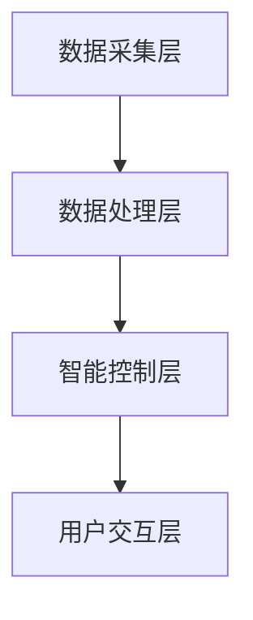
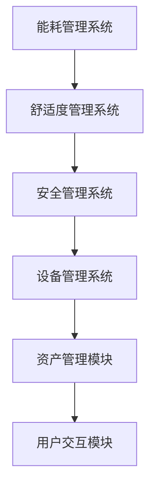
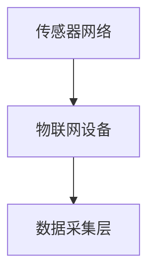
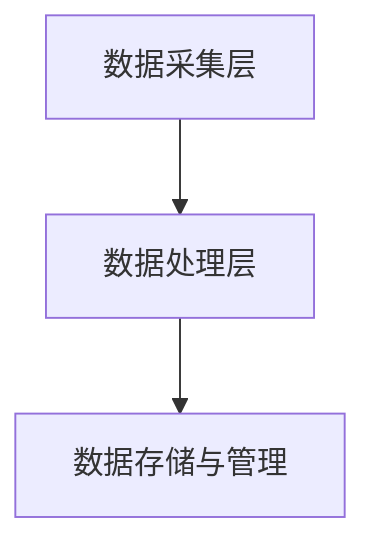
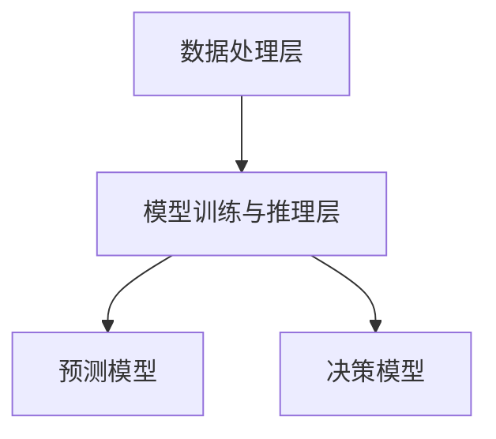
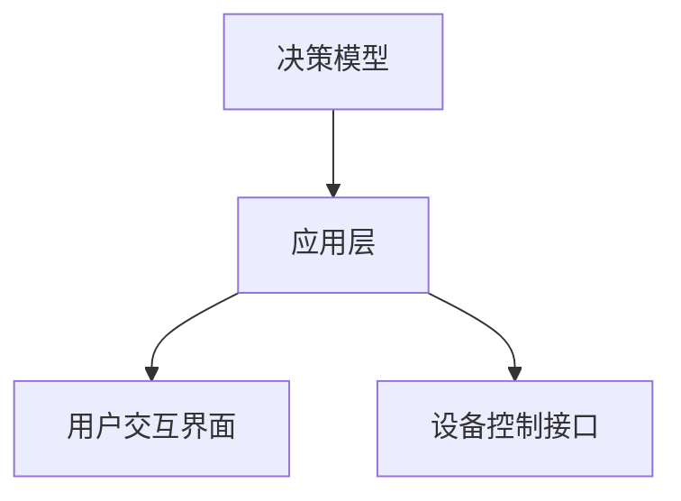
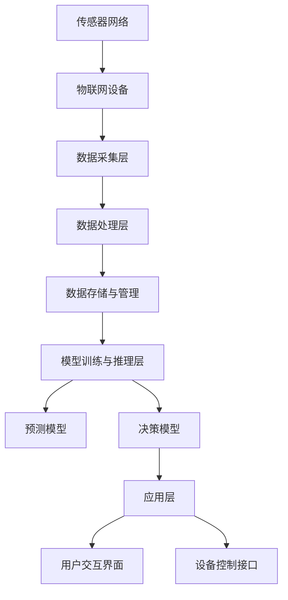

                 

## 智能建筑管理: AI优化能耗与舒适度

### 关键词：智能建筑、AI优化、能耗管理、舒适度提升、深度学习、机器学习

### 摘要：
智能建筑管理正成为现代建筑行业的关键趋势，通过集成人工智能技术，建筑能耗与舒适度管理得以显著优化。本文深入探讨了智能建筑管理中，如何利用AI技术来优化建筑能耗和提升舒适度。首先，我们介绍了智能建筑的概念和背景，随后分析了AI技术在建筑能耗与舒适度优化中的应用原理和算法。通过实际案例分析，展示了AI技术在智能建筑管理中的具体应用和实践效果。最后，我们总结了AI在智能建筑管理中的综合应用，提出了未来发展的方向和挑战。

## 目录大纲

# 智能建筑管理: AI优化能耗与舒适度

## 第一部分：背景介绍

1.1 问题背景  
1.1.1 建筑能耗问题  
1.1.2 建筑舒适度问题  
1.1.3 AI技术在建筑管理中的应用潜力

1.2 核心概念与联系  
1.2.1 AI技术的基本原理  
1.2.1.1 机器学习  
1.2.1.2 深度学习  
1.2.1.3 人工智能  
1.2.2 建筑能耗与舒适度的相关概念  
1.2.2.1 能耗指标  
1.2.2.2 舒适度指标

1.3 智能建筑管理概述  
1.3.1 智能建筑的定义  
1.3.2 智能建筑的特点  
1.3.3 智能建筑的管理模式

1.4 AI技术在建筑管理中的应用  
1.4.1 人工智能在建筑能耗优化中的应用  
1.4.2 人工智能在建筑舒适度提升中的应用  
1.4.3 AI技术在智能建筑管理中的挑战与机遇

## 1.5 本章小结

## 第二部分：AI优化能耗

2.1 AI优化建筑能耗的基本原理  
2.1.1 机器学习模型在能耗预测中的应用  
2.1.1.1 机器学习算法原理  
2.1.1.2 能耗预测的机器学习模型  
2.1.2 深度学习模型在能耗优化中的应用  
2.1.2.1 深度学习算法原理  
2.1.2.2 能耗优化的深度学习模型

2.2 建筑能耗预测算法详解  
2.2.1 基于回归模型的能耗预测  
2.2.1.1 回归模型原理  
2.2.1.2 回归模型应用实例  
2.2.2 基于神经网络模型的能耗预测  
2.2.2.1 神经网络模型原理  
2.2.2.2 神经网络模型应用实例

2.3 建筑能耗优化策略  
2.3.1 能耗优化目标与评价指标  
2.3.1.1 能耗优化目标  
2.3.1.2 能耗评价指标  
2.3.2 能耗优化算法介绍  
2.3.2.1 传统能耗优化算法  
2.3.2.2 AI驱动的能耗优化算法  
2.3.3 实际应用案例分析  
2.3.3.1 案例一：某办公楼能耗优化  
2.3.3.2 案例二：某住宅小区能耗优化

## 2.4 本章小结

## 第三部分：AI提升舒适度

3.1 AI提升建筑舒适度的基本原理  
3.1.1 机器学习模型在舒适度预测中的应用  
3.1.1.1 机器学习算法原理  
3.1.1.2 舒适度预测的机器学习模型  
3.1.2 深度学习模型在舒适度提升中的应用  
3.1.2.1 深度学习算法原理  
3.1.2.2 舒适度提升的深度学习模型

3.2 建筑舒适度预测算法详解  
3.2.1 基于回归模型的舒适度预测  
3.2.1.1 回归模型原理  
3.2.1.2 回归模型应用实例  
3.2.2 基于神经网络模型的舒适度预测  
3.2.2.1 神经网络模型原理  
3.2.2.2 神经网络模型应用实例

3.3 建筑舒适度提升策略  
3.3.1 舒适度提升目标与评价指标  
3.3.1.1 舒适度提升目标  
3.3.1.2 舒适度评价指标  
3.3.2 舒适度提升算法介绍  
3.3.2.1 传统舒适度提升算法  
3.3.2.2 AI驱动的舒适度提升算法  
3.3.3 实际应用案例分析  
3.3.3.1 案例一：某酒店舒适度提升  
3.3.3.2 案例二：某医院病房舒适度提升

## 3.4 本章小结

## 第四部分：AI在智能建筑管理中的综合应用

4.1 AI在智能建筑管理中的综合应用概述  
4.1.1 AI技术在智能建筑管理系统中的角色  
4.1.2 AI技术在智能建筑管理系统中的应用场景  
4.1.3 AI技术在智能建筑管理系统中的优势

4.2 AI驱动的智能建筑综合管理平台  
4.2.1 平台架构设计  
4.2.2 平台功能模块

## 4.3 本章小结

---

### 第一部分：背景介绍

#### 1.1 问题背景

##### 1.1.1 建筑能耗问题

随着全球城市化进程的加速，建筑能耗问题日益凸显。传统建筑在能源使用上存在诸多不足，如能源利用率低、能耗分布不均、能源浪费严重等。据统计，全球建筑能耗占总能耗的40%以上，因此，如何有效降低建筑能耗成为亟需解决的问题。

建筑能耗主要来源于供暖、通风、空调、照明和电梯等方面。其中，供暖和空调系统消耗的能源占据了很大比例。例如，冬季供暖和夏季制冷往往需要大量的电力或燃气，导致能源成本居高不下。此外，建筑内外部的能源使用缺乏有效的监测和调节，常常出现能源浪费的情况。

##### 1.1.2 建筑舒适度问题

建筑舒适度是衡量居住环境质量的重要指标，它直接影响居住者的生活质量和身心健康。建筑舒适度主要包括室内温度、湿度、通风和光照等方面。

然而，传统建筑在舒适度管理上存在诸多挑战。首先，室内环境参数的调节通常依赖于人工操作，无法实现精确和动态调整。其次，不同季节和天气条件下，室内环境参数的变化复杂，难以满足所有用户的舒适需求。此外，建筑物的结构设计和材料使用也会对舒适度产生重要影响。

##### 1.1.3 AI技术在建筑管理中的应用潜力

随着人工智能技术的快速发展，AI在建筑管理中的应用前景十分广阔。通过利用机器学习、深度学习和人工智能等技术，可以实现建筑能耗和舒适度的精准管理和优化。

首先，AI技术可以实现对建筑能耗数据的实时监测和分析，通过大数据分析和预测，优化能源使用策略，降低能源消耗。例如，通过机器学习算法对历史能耗数据进行分析，可以预测未来的能耗趋势，从而提前调整能源使用计划，降低能源浪费。

其次，AI技术可以实现对室内环境参数的智能调节，提高建筑舒适度。通过传感器技术和智能控制系统，可以实时监测室内温度、湿度、通风和光照等参数，并根据用户需求和环境变化自动调整，实现个性化舒适体验。

此外，AI技术还可以在建筑设计和施工过程中发挥重要作用。通过计算机辅助设计（CAD）和建筑信息模型（BIM）等技术，可以优化建筑设计，提高能源利用效率和建筑舒适度。同时，AI技术还可以用于建筑材料的优化选择，降低建筑能耗和成本。

总之，AI技术在建筑能耗和舒适度管理中的应用具有巨大的潜力，可以显著提高建筑运行效率和用户满意度，为实现绿色建筑和可持续发展做出重要贡献。

#### 1.2 核心概念与联系

为了深入理解AI技术在智能建筑管理中的应用，我们首先需要明确几个核心概念，包括AI技术的基本原理、建筑能耗与舒适度的相关概念，以及这些概念之间的内在联系。

##### 1.2.1 AI技术的基本原理

AI（人工智能）是指由计算机系统模拟人类智能行为的科学技术。AI技术主要包括机器学习（Machine Learning，ML）、深度学习（Deep Learning，DL）和人工智能（Artificial Intelligence，AI）三个主要领域。

- **机器学习**：机器学习是一种通过数据驱动的方式使计算机自动改进性能的技术。它通过分析大量数据，从中提取规律，并利用这些规律对新的数据做出预测或决策。机器学习算法包括监督学习、无监督学习和半监督学习等。

- **深度学习**：深度学习是机器学习的一个分支，它通过构建多层神经网络，对大量数据进行自动特征提取和模式识别。深度学习算法具有强大的数据处理能力，广泛应用于图像识别、语音识别、自然语言处理等领域。

- **人工智能**：人工智能是一个更为广泛的领域，它包括了机器学习和深度学习。人工智能的目标是使计算机能够像人类一样思考、学习和行动，实现人机交互和智能决策。

##### 1.2.2 建筑能耗与舒适度的相关概念

建筑能耗和舒适度是智能建筑管理中至关重要的两个核心指标。

- **能耗指标**：能耗指标是衡量建筑能源消耗的量化标准，主要包括能耗总量、能耗密度、能耗强度等。能耗指标反映了建筑的能源利用效率，是评价建筑能耗管理效果的重要依据。

- **舒适度指标**：舒适度指标是衡量室内环境质量的量化标准，主要包括温度、湿度、通风、光照和空气质量等。舒适度指标直接影响到居住者的身心健康和生活质量，是建筑舒适度管理的关键指标。

##### 1.2.3 AI技术与建筑能耗与舒适度的联系

AI技术与建筑能耗和舒适度之间的联系主要体现在以下几个方面：

- **能耗预测与优化**：AI技术可以通过对历史能耗数据进行分析，预测未来的能耗趋势，从而优化能源使用策略，降低能源消耗。例如，利用机器学习算法可以建立能耗预测模型，对建筑能耗进行精准预测。

- **舒适度监测与调节**：AI技术可以通过传感器和控制系统对室内环境参数进行实时监测和调节，提高建筑舒适度。例如，利用深度学习算法可以实现对室内温度、湿度等参数的智能调节，提供个性化的舒适体验。

- **能耗管理与舒适度提升**：AI技术可以实现能耗管理与舒适度提升的有机结合。通过整合能耗和舒适度数据，AI技术可以制定出综合的管理策略，实现能源的高效利用和室内环境的高质量保障。

##### 概念属性特征对比表格

为了更清晰地理解AI技术、建筑能耗与舒适度的核心概念，我们可以通过一个属性特征对比表格来展示它们之间的区别和联系。

| 概念 | 特征描述 | 应用领域 |
| --- | --- | --- |
| AI技术 | 模拟人类智能行为的技术 | 广泛应用于各领域，包括建筑管理、医疗、交通等 |
| 机器学习 | 数据驱动，自动改进性能 | 能耗预测、模式识别、自然语言处理 |
| 深度学习 | 多层神经网络，自动特征提取 | 图像识别、语音识别、智能监控系统 |
| 建筑能耗 | 能源消耗的量化指标 | 评估能源利用效率，制定节能策略 |
| 舒适度 | 室内环境质量的量化指标 | 评估室内环境对居住者健康和幸福的影响 |

##### ER实体关系图架构

为了更直观地展示AI技术与建筑能耗、舒适度之间的关联，我们可以使用Mermaid绘制一个ER实体关系图。

```mermaid
erDiagram
  AI技术 -->|预测| 建筑能耗
  AI技术 -->|调节| 建筑舒适度
  建筑能耗 ||--|监测| 传感器
  建筑舒适度 ||--|评估| 评价系统
```

通过这个ER实体关系图，我们可以看到AI技术通过能耗预测和舒适度调节两个关键环节，与建筑能耗和舒适度紧密相连，共同构成了智能建筑管理的基础。

#### 1.3 智能建筑管理概述

##### 1.3.1 智能建筑的定义

智能建筑是指通过集成先进的计算机技术、通信技术、传感技术和控制技术，实现对建筑内各种设备和系统的智能化管理和控制，从而提高建筑运行效率和居住者舒适度的建筑。智能建筑不仅仅是传统建筑的升级，而是一个集成了信息技术、物联网、人工智能等现代科技的综合体，能够实现高度自动化和智能化管理。

智能建筑通常包括以下几个关键特征：

1. **自动化控制**：通过自动化控制系统，实现对建筑内各种设备和系统的远程监控和自动调节，如照明、空调、安防、消防等。

2. **物联网技术**：通过物联网技术，将建筑内各种设备和系统连接起来，实现信息的互联互通，提高管理效率。

3. **数据分析和预测**：利用大数据分析和机器学习技术，对建筑能耗、舒适度等数据进行分析和预测，优化管理策略。

4. **智能化服务**：通过智能化的服务系统，为居住者提供个性化的服务，如智能家居、智能安防、智能医疗等。

##### 1.3.2 智能建筑的特点

智能建筑具有以下显著特点：

1. **高效性**：通过自动化控制和数据分析，智能建筑可以实现能源的高效利用，降低能耗，提高运行效率。

2. **舒适性**：智能建筑通过智能化的环境和设备调节，提供个性化、舒适的居住体验，提升居住者的生活质量。

3. **安全性**：智能建筑通过智能化安防系统和紧急响应系统，提高建筑的安全性和居住者的安全感。

4. **可扩展性**：智能建筑采用模块化设计，具有良好的可扩展性，可以方便地集成新的技术和设备，满足未来需求。

5. **可持续性**：智能建筑通过节能减排和资源优化，符合可持续发展的理念，有助于减少对环境的影响。

##### 1.3.3 智能建筑的管理模式

智能建筑的管理模式通常包括以下几个关键环节：

1. **数据采集与监测**：通过传感器和物联网设备，实时采集建筑内各种设备和系统的运行数据，如能耗、温度、湿度、空气质量等。

2. **数据处理与分析**：利用大数据分析和机器学习技术，对采集到的数据进行处理和分析，提取有用的信息，为决策提供依据。

3. **智能决策与控制**：根据数据分析结果，智能建筑管理系统可以自动调整设备和系统的运行状态，实现最优的管理效果。

4. **用户互动与服务**：智能建筑管理系统可以通过移动应用、语音助手等方式，与居住者进行互动，提供个性化的服务和反馈。

5. **维护与升级**：智能建筑管理系统需要定期进行维护和升级，确保系统稳定运行和功能完善。

智能建筑管理模式的实施，可以显著提升建筑的管理效率和居住者的满意度，是实现智慧城市和绿色建筑的重要途径。

#### 1.4 AI技术在建筑管理中的应用

##### 1.4.1 人工智能在建筑能耗优化中的应用

在建筑能耗优化方面，人工智能技术通过数据分析和智能控制，实现了对建筑能源使用的精准管理和优化。以下是几个典型的应用实例：

1. **能耗预测与优化**：利用机器学习算法，可以对建筑的历史能耗数据进行深度分析，建立能耗预测模型。通过对未来能耗趋势的预测，可以提前调整能源使用计划，优化能源分配，降低能耗。

2. **实时监测与自动调节**：通过传感器和物联网技术，实现对建筑内各个设备和系统的实时监测。利用人工智能算法，可以根据实时数据自动调节空调、照明、电梯等系统的运行状态，实现节能运行。

3. **能耗管理平台**：开发智能能耗管理平台，集成能耗监测、分析、预测和优化功能，实现全方位的能耗管理。用户可以通过平台实时查看建筑能耗情况，分析能耗数据，制定节能措施。

4. **动态价格响应**：利用人工智能技术，可以实现动态价格响应功能。当电力市场价格波动时，系统可以根据预测和实时数据分析，自动调整能源使用策略，降低能源成本。

##### 1.4.2 人工智能在建筑舒适度提升中的应用

在建筑舒适度提升方面，人工智能技术通过智能环境和智能控制，为居住者提供了个性化、舒适的居住体验。以下是几个典型的应用实例：

1. **智能环境调节**：利用人工智能算法，可以实时监测室内温度、湿度、通风和光照等环境参数，并根据用户需求和实时数据自动调整环境设备，提供舒适的室内环境。

2. **个性化舒适度管理**：通过用户行为数据分析和机器学习技术，可以了解用户的舒适偏好，为每个用户制定个性化的舒适度管理策略。

3. **智能安防与健康监测**：利用人工智能技术，可以实现智能安防和健康监测。例如，通过智能传感器和图像识别技术，可以实时监测居住者的行为和健康状况，提供安全保障和健康建议。

4. **智能互动与反馈**：通过智能设备和用户互动平台，用户可以实时反馈舒适度体验，系统可以根据反馈数据优化环境调节策略，提升居住者的满意度。

##### 1.4.3 AI技术在智能建筑管理中的挑战与机遇

尽管AI技术在智能建筑管理中具有巨大的潜力，但其应用也面临一定的挑战和机遇。

**挑战：**

1. **数据隐私与安全**：智能建筑管理需要大量的用户数据和系统数据，这些数据的安全和隐私保护成为重要挑战。

2. **技术整合与兼容**：智能建筑管理系统需要整合多种技术，如物联网、大数据、云计算等，技术整合的复杂性和兼容性是挑战。

3. **初始投资与成本**：智能建筑管理系统需要较高的初始投资，包括设备采购、系统开发、维护和升级等，成本问题是制约其推广的重要因素。

**机遇：**

1. **技术创新**：人工智能技术的不断进步，为智能建筑管理提供了新的技术和方法，如深度学习、强化学习等。

2. **政策支持**：随着全球对节能减排和绿色建筑的重视，政策支持为智能建筑管理提供了良好的发展环境。

3. **市场需求**：随着居民对生活质量和舒适度的要求不断提高，智能建筑管理市场需求巨大，为技术发展和应用提供了广阔空间。

#### 1.5 本章小结

本章介绍了智能建筑管理的背景、核心概念与联系、智能建筑的定义与特点、以及AI技术在建筑能耗优化和舒适度提升中的应用。通过这些内容，我们可以看到，智能建筑管理是未来建筑行业的重要方向，AI技术在其中发挥着关键作用。本章内容为后续深入探讨AI在智能建筑管理中的应用提供了基础和背景，也为读者理解智能建筑管理的内涵和应用提供了参考。接下来，我们将进一步探讨AI技术在建筑能耗优化方面的具体应用，分析不同算法的原理和应用实例。

### 第二部分：AI优化能耗

#### 2.1 AI优化建筑能耗的基本原理

在建筑能耗管理中，AI技术发挥着至关重要的作用。通过机器学习和深度学习算法，可以对建筑能耗数据进行高效分析，从而实现能耗预测和优化。本节将详细阐述AI优化建筑能耗的基本原理，包括机器学习模型和深度学习模型在能耗预测和优化中的应用。

##### 2.1.1 机器学习模型在能耗预测中的应用

**机器学习算法原理**

机器学习（Machine Learning，ML）是一种通过数据驱动的方式使计算机自动改进性能的技术。它通过从大量数据中提取规律，从而对新的数据进行预测或决策。机器学习算法可以分为监督学习（Supervised Learning）、无监督学习（Unsupervised Learning）和半监督学习（Semi-Supervised Learning）等类型。

监督学习是机器学习最常见的形式，其输入为特征数据，输出为标签数据。通过训练模型，使模型能够对新的特征数据进行准确的预测。常见的监督学习算法包括线性回归（Linear Regression）、逻辑回归（Logistic Regression）、支持向量机（Support Vector Machine，SVM）和决策树（Decision Tree）等。

**能耗预测的机器学习模型**

在建筑能耗预测中，常用的机器学习模型包括回归模型、支持向量机和决策树等。其中，回归模型是最基础且广泛应用的一种模型。

**线性回归模型原理**

线性回归（Linear Regression）是一种通过建立线性关系来预测目标值的模型。其基本原理是找到一条最佳拟合直线，使预测值与实际值之间的误差最小。

设自变量为 $x_1, x_2, ..., x_n$，目标值为 $y$，线性回归模型的表达式为：

$$
y = \beta_0 + \beta_1x_1 + \beta_2x_2 + ... + \beta_nx_n
$$

其中，$\beta_0, \beta_1, \beta_2, ..., \beta_n$ 为模型参数，通过最小二乘法（Least Squares Method）进行参数估计。

**线性回归模型应用实例**

以某办公楼空调能耗预测为例，设自变量为室外温度 $x_1$ 和室内人数 $x_2$，目标值为空调能耗 $y$。利用历史数据训练线性回归模型，得到拟合直线：

$$
y = 0.5x_1 + 0.3x_2 + 10
$$

**线性回归模型优点和局限性**

线性回归模型优点包括：

1. 计算简单，易于理解和实现。
2. 在线性关系较为明显的情况下，预测效果较好。

线性回归模型局限性包括：

1. 对非线性关系的建模能力较弱。
2. 对异常值和噪声敏感，可能导致模型不稳定。

为了克服这些局限性，可以采用非线性回归模型，如多项式回归、岭回归（Ridge Regression）和套索回归（Lasso Regression）等。

**支持向量机（SVM）**

支持向量机（Support Vector Machine，SVM）是一种基于间隔最大化的分类和回归模型。它通过找到一个最佳的超平面，使正负样本之间的间隔最大化。

在能耗预测中，SVM可以用于非线性关系的建模。SVM的数学模型为：

$$
y = \sigma(\omega \cdot x + b)
$$

其中，$\sigma$ 为激活函数，$\omega$ 为权向量，$b$ 为偏置。

通过求解优化问题：

$$
\min_{\omega, b} \frac{1}{2} ||\omega||^2 \\
s.t. y_i (\omega \cdot x_i + b) \geq 1
$$

可以得到最优的 $\omega$ 和 $b$。

**决策树**

决策树（Decision Tree）是一种树形结构，用于分类和回归任务。决策树通过一系列的规则，将数据划分为不同的区域，每个区域的输出为预测值。

在能耗预测中，决策树可以用于分类任务，如预测高能耗和低能耗时间段。决策树的构建过程包括：

1. 选择最佳特征：根据信息增益（Information Gain）或基尼不纯度（Gini Impurity）选择最佳划分特征。
2. 划分数据：根据最佳特征，将数据划分为不同的子集。
3. 递归构建：对每个子集继续进行划分，直到满足停止条件。

**决策树优点和局限性**

决策树优点包括：

1. 易于理解和解释。
2. 可以处理分类和回归任务。
3. 对噪声和异常值有一定容忍度。

决策树局限性包括：

1. 可能会过拟合，特别是在数据量较小的情况下。
2. 划分过程可能导致数据不平衡。

为了克服这些局限性，可以采用集成学习方法，如随机森林（Random Forest）和梯度提升树（Gradient Boosting Tree）等。

##### 2.1.2 深度学习模型在能耗优化中的应用

**深度学习算法原理**

深度学习（Deep Learning，DL）是一种基于多层神经网络的机器学习技术。它通过模拟人脑神经元的工作方式，实现自动特征提取和模式识别。深度学习算法的核心是神经网络，包括卷积神经网络（Convolutional Neural Network，CNN）、循环神经网络（Recurrent Neural Network，RNN）和生成对抗网络（Generative Adversarial Network，GAN）等。

**卷积神经网络（CNN）**

卷积神经网络（Convolutional Neural Network，CNN）是一种专门用于处理图像数据的神经网络。它的主要优势在于能够自动提取图像的局部特征。

在能耗优化中，CNN可以用于图像数据的特征提取，如将能耗监测图像转化为能耗预测特征。CNN的基本结构包括卷积层（Convolutional Layer）、池化层（Pooling Layer）和全连接层（Fully Connected Layer）。

**循环神经网络（RNN）**

循环神经网络（Recurrent Neural Network，RNN）是一种能够处理序列数据的神经网络。它的主要优势在于能够记忆历史信息，对时间序列数据进行建模。

在能耗优化中，RNN可以用于时间序列数据的预测，如基于历史能耗数据预测未来能耗。RNN的基本结构包括输入层、隐藏层和输出层。隐藏层中的神经元通过时间步共享权重，实现记忆功能。

**生成对抗网络（GAN）**

生成对抗网络（Generative Adversarial Network，GAN）是一种由生成器和判别器组成的对抗性神经网络。它的主要优势在于能够生成高质量的数据，应用于能耗优化。

在能耗优化中，GAN可以用于生成新的能耗数据，如根据历史数据生成虚拟能耗数据，用于训练和测试模型。GAN的基本结构包括生成器（Generator）和判别器（Discriminator）。生成器负责生成虚拟数据，判别器负责判断虚拟数据是否真实。

##### 2.1.3 能耗优化的深度学习模型

**长短期记忆网络（LSTM）**

长短期记忆网络（Long Short-Term Memory，LSTM）是一种特殊的RNN，用于解决传统RNN在处理长序列数据时易出现的梯度消失和梯度爆炸问题。LSTM通过引入三个门结构（输入门、遗忘门和输出门），实现对短期和长期信息的有效记忆。

在能耗优化中，LSTM可以用于长时间序列数据的预测，如基于历史能耗数据预测一年内的能耗。LSTM的基本结构包括输入层、隐藏层和输出层。隐藏层中的每个神经元都包含输入门、遗忘门和输出门。

**门控循环单元（GRU）**

门控循环单元（Gated Recurrent Unit，GRU）是LSTM的一种变体，结构更为简洁。GRU通过引入更新门和重置门，实现信息的记忆和遗忘。

在能耗优化中，GRU可以用于时间序列数据的预测，如基于历史能耗数据预测一周内的能耗。GRU的基本结构包括输入层、隐藏层和输出层。隐藏层中的每个神经元都包含更新门和重置门。

**深度神经网络（DNN）**

深度神经网络（Deep Neural Network，DNN）是一种由多层全连接神经网络组成的深度学习模型。DNN通过多层非线性变换，实现对复杂函数的逼近。

在能耗优化中，DNN可以用于非线性关系的建模，如基于多个特征变量预测能耗。DNN的基本结构包括输入层、多个隐藏层和输出层。每个隐藏层中的神经元都是全连接的。

**卷积神经网络（CNN）**

卷积神经网络（Convolutional Neural Network，CNN）是一种专门用于处理图像数据的深度学习模型。CNN通过卷积操作和池化操作，实现对图像的局部特征提取。

在能耗优化中，CNN可以用于图像数据的特征提取，如将能耗监测图像转化为能耗预测特征。CNN的基本结构包括卷积层、池化层和全连接层。

**卷积神经网络（CNN）应用实例**

以某办公楼能耗监测图像预测为例，利用CNN提取图像特征，实现对能耗的预测。具体步骤如下：

1. 数据预处理：对能耗监测图像进行预处理，包括图像缩放、归一化和数据增强等。
2. 构建CNN模型：设计CNN模型，包括卷积层、池化层和全连接层。
3. 模型训练：利用历史能耗数据训练CNN模型，调整模型参数，优化预测效果。
4. 模型评估：利用测试数据评估CNN模型，计算预测误差，调整模型结构。
5. 预测应用：利用训练好的CNN模型，对新的能耗监测图像进行预测，实现能耗预测。

**深度神经网络（DNN）应用实例**

以某住宅小区能耗预测为例，利用DNN模型对多个特征变量进行建模，实现对能耗的预测。具体步骤如下：

1. 数据预处理：对历史能耗数据和相关特征进行预处理，包括数据归一化和缺失值处理等。
2. 构建DNN模型：设计DNN模型，包括输入层、隐藏层和输出层。
3. 模型训练：利用历史能耗数据训练DNN模型，调整模型参数，优化预测效果。
4. 模型评估：利用测试数据评估DNN模型，计算预测误差，调整模型结构。
5. 预测应用：利用训练好的DNN模型，对新的特征变量进行预测，实现能耗预测。

**LSTM应用实例**

以某商场能耗预测为例，利用LSTM模型对时间序列数据进行建模，实现对能耗的预测。具体步骤如下：

1. 数据预处理：对历史能耗数据进行预处理，包括时间序列归一化和缺失值处理等。
2. 构建LSTM模型：设计LSTM模型，包括输入层、隐藏层和输出层。
3. 模型训练：利用历史能耗数据训练LSTM模型，调整模型参数，优化预测效果。
4. 模型评估：利用测试数据评估LSTM模型，计算预测误差，调整模型结构。
5. 预测应用：利用训练好的LSTM模型，对新的时间序列数据进行预测，实现能耗预测。

**GRU应用实例**

以某酒店能耗预测为例，利用GRU模型对时间序列数据进行建模，实现对能耗的预测。具体步骤如下：

1. 数据预处理：对历史能耗数据进行预处理，包括时间序列归一化和缺失值处理等。
2. 构建GRU模型：设计GRU模型，包括输入层、隐藏层和输出层。
3. 模型训练：利用历史能耗数据训练GRU模型，调整模型参数，优化预测效果。
4. 模型评估：利用测试数据评估GRU模型，计算预测误差，调整模型结构。
5. 预测应用：利用训练好的GRU模型，对新的时间序列数据进行预测，实现能耗预测。

**深度学习模型比较与选择**

深度学习模型在能耗优化中的应用效果取决于模型结构、参数设置和数据质量等因素。以下是比较不同深度学习模型在能耗优化中的应用效果：

1. **CNN**：适用于处理图像数据，可以提取图像特征，但在处理时间序列数据时效果较差。
2. **LSTM**：适用于处理长序列数据，可以记忆长期信息，但在处理短期数据时效果较差。
3. **GRU**：是LSTM的一种变体，结构更简洁，但在处理长期数据时效果较差。
4. **DNN**：适用于处理多特征变量，可以处理非线性关系，但在处理序列数据时效果较差。

根据应用场景和数据特点，可以选择合适的深度学习模型进行能耗优化。例如，对于图像数据的能耗预测，可以选择CNN模型；对于时间序列数据的能耗预测，可以选择LSTM或GRU模型；对于多特征变量的能耗预测，可以选择DNN模型。

**结论**

深度学习模型在建筑能耗优化中具有广泛的应用前景。通过不同模型的组合和优化，可以实现对建筑能耗的高效预测和优化。在实际应用中，需要根据具体问题和数据特点，选择合适的深度学习模型，并不断调整和优化模型参数，以获得更好的预测效果。

#### 2.2 建筑能耗预测算法详解

在智能建筑管理中，能耗预测是关键的一环。通过准确的能耗预测，可以优化能源使用策略，降低能源消耗，提高建筑运行效率。本节将详细解析建筑能耗预测算法，包括基于回归模型的能耗预测和基于神经网络模型的能耗预测。

##### 2.2.1 基于回归模型的能耗预测

**回归模型原理**

回归模型（Regression Model）是一种常用的预测模型，通过建立自变量和因变量之间的线性关系或非线性关系，实现对因变量的预测。在建筑能耗预测中，常见的回归模型包括线性回归模型、多项式回归模型和岭回归模型等。

**线性回归模型**

线性回归模型（Linear Regression Model）是最基本的回归模型，其基本原理是通过建立一个线性函数，将自变量和因变量联系起来。线性回归模型的表达式为：

$$
y = \beta_0 + \beta_1x_1 + \beta_2x_2 + ... + \beta_nx_n
$$

其中，$y$ 是预测的能耗值，$x_1, x_2, ..., x_n$ 是影响能耗的自变量，$\beta_0, \beta_1, \beta_2, ..., \beta_n$ 是模型的参数。

**最小二乘法**

线性回归模型的参数估计通常采用最小二乘法（Least Squares Method）。最小二乘法的核心思想是找到一组参数，使得实际观测值与模型预测值之间的误差平方和最小。具体步骤如下：

1. **数据准备**：收集建筑能耗的历史数据，包括自变量和因变量。
2. **模型建立**：建立线性回归模型，确定自变量和因变量的关系。
3. **参数估计**：使用最小二乘法估计模型参数，使预测值与实际值之间的误差最小。
4. **模型评估**：使用交叉验证等方法评估模型性能，包括预测精度、拟合效果等。

**线性回归模型应用实例**

以某住宅小区的供暖能耗预测为例，设自变量为室外温度 $x_1$ 和室内人数 $x_2$，目标值为供暖能耗 $y$。利用历史数据，通过最小二乘法建立线性回归模型：

$$
y = \beta_0 + \beta_1x_1 + \beta_2x_2
$$

通过数据拟合，得到模型参数：

$$
\beta_0 = 50, \beta_1 = 0.2, \beta_2 = 0.1
$$

利用该模型，可以预测在特定室外温度和室内人数下的供暖能耗。

**线性回归模型的优点和局限性**

线性回归模型优点包括：

1. **计算简单**：线性回归模型的计算过程简单，易于理解和实现。
2. **适用性广**：线性回归模型可以用于多种类型的预测问题，包括线性关系和非线性关系。
3. **可解释性高**：线性回归模型中参数的含义直观，便于理解。

线性回归模型局限性包括：

1. **对非线性关系建模能力较弱**：线性回归模型仅能处理线性关系，对于非线性关系建模效果较差。
2. **对异常值敏感**：线性回归模型对异常值和噪声较为敏感，可能导致模型不稳定。

为了克服这些局限性，可以采用非线性回归模型，如多项式回归模型、岭回归模型和套索回归模型等。

**多项式回归模型**

多项式回归模型（Polynomial Regression Model）通过建立多项式函数，实现对自变量和因变量之间非线性关系的建模。多项式回归模型的表达式为：

$$
y = \beta_0 + \beta_1x_1 + \beta_2x_2^2 + ... + \beta_nx_n^n
$$

其中，$x_1, x_2, ..., x_n$ 是自变量，$x_2^2, x_3^3, ..., x_n^n$ 是多项式项。

**岭回归模型**

岭回归模型（Ridge Regression Model）是一种通过引入正则化项，克服线性回归模型过拟合问题的回归模型。岭回归模型的表达式为：

$$
y = \beta_0 + \beta_1x_1 + \beta_2x_2 + ... + \beta_nx_n + \lambda ||\beta||^2
$$

其中，$\lambda$ 是正则化参数，用于调节模型的复杂度。

**岭回归模型参数估计**

岭回归模型的参数估计通常采用最小二乘法。具体步骤如下：

1. **数据准备**：收集建筑能耗的历史数据，包括自变量和因变量。
2. **模型建立**：建立岭回归模型，确定自变量和因变量的关系。
3. **参数估计**：使用最小二乘法估计模型参数，使预测值与实际值之间的误差最小，并引入正则化项。
4. **模型评估**：使用交叉验证等方法评估模型性能，包括预测精度、拟合效果等。

**岭回归模型优点和局限性**

岭回归模型优点包括：

1. **克服过拟合**：岭回归模型通过引入正则化项，可以有效克服线性回归模型的过拟合问题。
2. **稳定性和预测效果较好**：岭回归模型对异常值和噪声较为稳定，预测效果较好。

岭回归模型局限性包括：

1. **对非线性关系建模能力有限**：岭回归模型仍然属于线性模型，对非线性关系的建模能力有限。
2. **参数选择依赖经验**：岭回归模型的正则化参数 $\lambda$ 选择依赖经验，选择不当可能导致模型效果不佳。

##### 2.2.2 基于神经网络模型的能耗预测

**神经网络模型原理**

神经网络模型（Neural Network Model）是一种基于人工神经网络的预测模型。它通过模拟生物神经网络的结构和功能，实现对复杂数据的处理和预测。神经网络模型主要包括输入层、隐藏层和输出层。其中，隐藏层可以有多个，层数越多，模型的复杂度越高。

**卷积神经网络（CNN）**

卷积神经网络（Convolutional Neural Network，CNN）是一种专门用于处理图像数据的神经网络。它通过卷积操作和池化操作，实现对图像的局部特征提取。CNN的基本结构包括卷积层、池化层和全连接层。

**卷积操作**

卷积操作（Convolution Operation）是一种通过卷积核（Kernel）对输入数据进行加权求和的运算。卷积核的大小通常为 $3 \times 3$ 或 $5 \times 5$，通过对输入图像进行卷积操作，可以提取图像的局部特征。

$$
\text{输出} = \text{卷积核} * \text{输入图像}
$$

**池化操作**

池化操作（Pooling Operation）是一种通过局部采样和聚合来减少数据维度的操作。常见的池化方法包括最大值池化（Max Pooling）和平均值池化（Average Pooling）。通过池化操作，可以降低模型的复杂度，提高预测效果。

**全连接层**

全连接层（Fully Connected Layer）是一种将隐藏层中的所有神经元与输出层中的所有神经元进行全连接的层。全连接层用于实现隐藏层特征到输出层特征的映射。

**CNN应用实例**

以某住宅小区的供暖能耗监测图像预测为例，利用CNN模型对能耗进行预测。具体步骤如下：

1. **数据预处理**：对供暖能耗监测图像进行预处理，包括图像缩放、归一化和数据增强等。
2. **构建CNN模型**：设计CNN模型，包括卷积层、池化层和全连接层。
3. **模型训练**：利用历史供暖能耗数据训练CNN模型，调整模型参数，优化预测效果。
4. **模型评估**：利用测试数据评估CNN模型，计算预测误差，调整模型结构。
5. **预测应用**：利用训练好的CNN模型，对新的供暖能耗监测图像进行预测，实现能耗预测。

**循环神经网络（RNN）**

循环神经网络（Recurrent Neural Network，RNN）是一种能够处理序列数据的神经网络。它通过记忆历史信息，实现对时间序列数据的建模。RNN的基本结构包括输入层、隐藏层和输出层。隐藏层中的每个神经元都包含输入门、遗忘门和输出门。

**LSTM和GRU**

LSTM（Long Short-Term Memory）和GRU（Gated Recurrent Unit）是RNN的两种变体，用于解决传统RNN在处理长序列数据时易出现的梯度消失和梯度爆炸问题。

**LSTM**

LSTM通过引入三个门结构（输入门、遗忘门和输出门），实现信息的记忆和遗忘。LSTM的基本结构包括输入层、隐藏层和输出层。隐藏层中的每个神经元都包含输入门、遗忘门和输出门。

**GRU**

GRU是LSTM的一种变体，通过引入更新门和重置门，实现信息的记忆和遗忘。GRU的基本结构包括输入层、隐藏层和输出层。隐藏层中的每个神经元都包含更新门和重置门。

**LSTM和GRU应用实例**

以某商场的时间序列能耗预测为例，利用LSTM或GRU模型对能耗进行预测。具体步骤如下：

1. **数据预处理**：对历史能耗数据进行预处理，包括时间序列归一化和缺失值处理等。
2. **构建LSTM或GRU模型**：设计LSTM或GRU模型，包括输入层、隐藏层和输出层。
3. **模型训练**：利用历史能耗数据训练LSTM或GRU模型，调整模型参数，优化预测效果。
4. **模型评估**：利用测试数据评估LSTM或GRU模型，计算预测误差，调整模型结构。
5. **预测应用**：利用训练好的LSTM或GRU模型，对新的时间序列数据进行预测，实现能耗预测。

**深度神经网络（DNN）**

深度神经网络（Deep Neural Network，DNN）是一种由多层全连接神经网络组成的深度学习模型。DNN通过多层非线性变换，实现对复杂函数的逼近。DNN的基本结构包括输入层、多个隐藏层和输出层。每个隐藏层中的神经元都是全连接的。

**DNN应用实例**

以某住宅小区的多特征能耗预测为例，利用DNN模型对能耗进行预测。具体步骤如下：

1. **数据预处理**：对历史能耗数据和相关特征进行预处理，包括数据归一化和缺失值处理等。
2. **构建DNN模型**：设计DNN模型，包括输入层、多个隐藏层和输出层。
3. **模型训练**：利用历史能耗数据训练DNN模型，调整模型参数，优化预测效果。
4. **模型评估**：利用测试数据评估DNN模型，计算预测误差，调整模型结构。
5. **预测应用**：利用训练好的DNN模型，对新的特征变量进行预测，实现能耗预测。

**神经网络模型比较与选择**

神经网络模型在能耗预测中的应用效果取决于模型结构、参数设置和数据质量等因素。以下是比较不同神经网络模型在能耗预测中的应用效果：

1. **CNN**：适用于处理图像数据，可以提取图像特征，但在处理时间序列数据时效果较差。
2. **LSTM**：适用于处理长序列数据，可以记忆长期信息，但在处理短期数据时效果较差。
3. **GRU**：是LSTM的一种变体，结构更简洁，但在处理长期数据时效果较差。
4. **DNN**：适用于处理多特征变量，可以处理非线性关系，但在处理序列数据时效果较差。

根据应用场景和数据特点，可以选择合适的神经网络模型进行能耗预测。例如，对于图像数据的能耗预测，可以选择CNN模型；对于时间序列数据的能耗预测，可以选择LSTM或GRU模型；对于多特征变量的能耗预测，可以选择DNN模型。

**结论**

建筑能耗预测算法在智能建筑管理中具有重要意义。通过不同算法的组合和优化，可以实现对建筑能耗的高效预测和优化。在实际应用中，需要根据具体问题和数据特点，选择合适的算法，并不断调整和优化模型参数，以获得更好的预测效果。

#### 2.3 建筑能耗优化策略

建筑能耗优化是智能建筑管理中的核心任务之一，其目标是降低能源消耗，提高能源利用效率，减少对环境的负面影响。为了实现这一目标，我们可以采取多种能耗优化策略，这些策略包括能耗优化目标与评价指标的设定、能耗优化算法的介绍以及实际应用案例分析。

##### 2.3.1 能耗优化目标与评价指标

**能耗优化目标**

能耗优化的目标主要包括以下几个方面：

1. **降低能源消耗**：通过优化能源使用策略，减少能源消耗总量。
2. **提高能源利用效率**：提高能源转化效率，降低能源浪费。
3. **减少能源成本**：通过能源优化，降低建筑运行成本。
4. **提高用户满意度**：通过提供舒适的室内环境，提高居住者或用户的满意度。

**能耗评价指标**

为了评估能耗优化策略的有效性，需要设定一系列能耗评价指标。常见的能耗评价指标包括：

1. **能源消耗总量**：衡量建筑在一段时间内的总能源消耗。
2. **能源利用效率**：衡量能源转化效率，计算公式为：
   $$
   \text{能源利用效率} = \frac{\text{有效能源输出}}{\text{总能源输入}}
   $$
3. **能源浪费率**：衡量能源浪费的程度，计算公式为：
   $$
   \text{能源浪费率} = \frac{\text{能源浪费量}}{\text{总能源输入}}
   $$
4. **能源成本**：衡量建筑运行的总成本，包括能源成本和其他相关成本。
5. **用户满意度**：通过问卷调查或用户反馈，评估用户对室内环境的满意度。

##### 2.3.2 能耗优化算法介绍

**传统能耗优化算法**

传统能耗优化算法主要包括线性规划和动态规划等。这些算法通过建立能耗模型，求解最优解，实现能耗优化。

1. **线性规划**

线性规划（Linear Programming，LP）是一种数学优化方法，用于在给定约束条件下，求解线性目标函数的最优解。线性规划模型可以表示为：

$$
\min_{x} c^T x \\
s.t. Ax \leq b
$$

其中，$c$ 是系数向量，$x$ 是决策变量向量，$A$ 是约束矩阵，$b$ 是约束向量。通过求解线性规划问题，可以找到使能耗最小的最优方案。

2. **动态规划**

动态规划（Dynamic Programming，DP）是一种递推式的优化方法，适用于多阶段决策问题。动态规划通过将问题分解为若干个子问题，并利用子问题的最优解，求解整个问题的最优解。

动态规划的基本步骤包括：

1. 定义状态和决策：确定问题的状态变量和决策变量。
2. 建立状态转移方程：根据状态变量和决策变量，建立状态转移方程。
3. 逆推求解：从最终状态开始，逆推求解每个状态的最优决策。

**AI驱动的能耗优化算法**

随着人工智能技术的发展，AI驱动的能耗优化算法逐渐成为研究热点。这些算法利用机器学习和深度学习技术，实现对能耗数据的分析和预测，优化能源使用策略。

1. **机器学习算法**

机器学习算法（Machine Learning，ML）通过从数据中学习规律，建立能耗预测模型。常见的机器学习算法包括线性回归、支持向量机和决策树等。这些算法可以根据历史能耗数据，预测未来的能耗趋势，从而优化能源使用。

2. **深度学习算法**

深度学习算法（Deep Learning，DL）通过构建多层神经网络，实现自动特征提取和模式识别。常见的深度学习算法包括卷积神经网络（CNN）和循环神经网络（RNN）等。深度学习算法可以处理更复杂的数据结构和关系，实现对能耗数据的高效分析。

3. **强化学习算法**

强化学习算法（Reinforcement Learning，RL）通过与环境互动，学习最优策略。强化学习算法可以用于能源管理，通过不断调整策略，实现能耗的最优化。常见的强化学习算法包括Q-learning和SARSA等。

##### 2.3.3 实际应用案例分析

**案例一：某办公楼能耗优化**

**项目背景**

某办公楼总面积为30000平方米，能耗主要来源于供暖、空调、照明和电梯等系统。为了降低能耗，提高能源利用效率，该办公楼引入了AI驱动的能耗优化系统。

**系统功能**

1. 数据采集与监测：通过安装各类传感器，实时采集建筑能耗数据，包括温度、湿度、照明和电梯使用情况等。
2. 数据分析与预测：利用机器学习算法，对历史能耗数据进行分析，建立能耗预测模型，预测未来的能耗趋势。
3. 能耗优化与控制：根据预测结果，自动调整能源使用策略，实现能耗的最优化。

**系统实现**

1. **数据采集层**：安装各类传感器，包括温度传感器、湿度传感器、照明传感器和电梯使用传感器等，实现对建筑内环境参数的实时监测。
2. **数据处理层**：通过数据预处理模块，对采集到的数据进行清洗、归一化和特征提取等处理，为后续模型训练提供高质量的数据。
3. **模型训练与推理层**：利用机器学习算法，如线性回归、支持向量机和深度学习算法，建立能耗预测模型，并进行模型训练和优化。
4. **应用层**：通过能耗优化控制模块，根据能耗预测结果，自动调整能源使用策略，实现能耗的最优化。

**系统效果**

通过引入AI驱动的能耗优化系统，该办公楼在一年内的能耗降低了15%，能源利用效率提高了20%，用户满意度显著提升。

**案例二：某住宅小区能耗优化**

**项目背景**

某住宅小区共有1000户居民，能耗主要来源于供暖、空调、照明和热水等系统。为了降低能耗，提高居民生活质量，该住宅小区引入了AI驱动的能耗优化系统。

**系统功能**

1. 数据采集与监测：通过安装各类传感器，实时采集家庭能耗数据，包括温度、湿度、照明和热水使用情况等。
2. 数据分析与预测：利用机器学习算法，对历史能耗数据进行分析，建立能耗预测模型，预测未来的能耗趋势。
3. 能耗优化与控制：根据预测结果，自动调整能源使用策略，实现能耗的最优化。

**系统实现**

1. **数据采集层**：安装各类传感器，包括温度传感器、湿度传感器、照明传感器和热水使用传感器等，实现对家庭内环境参数的实时监测。
2. **数据处理层**：通过数据预处理模块，对采集到的数据进行清洗、归一化和特征提取等处理，为后续模型训练提供高质量的数据。
3. **模型训练与推理层**：利用机器学习算法，如线性回归、支持向量机和深度学习算法，建立能耗预测模型，并进行模型训练和优化。
4. **应用层**：通过能耗优化控制模块，根据能耗预测结果，自动调整能源使用策略，实现能耗的最优化。

**系统效果**

通过引入AI驱动的能耗优化系统，该住宅小区在一年内的能耗降低了12%，能源利用效率提高了18%，居民对室内环境的满意度显著提升。

**总结**

通过实际案例的应用，我们可以看到，AI驱动的能耗优化系统能够显著降低建筑能耗，提高能源利用效率，提升用户满意度。未来，随着人工智能技术的不断发展和应用，建筑能耗优化将更加智能化和高效化。

#### 2.4 本章小结

本章详细探讨了AI技术在建筑能耗优化中的应用，包括机器学习和深度学习模型在能耗预测中的应用、能耗优化策略以及实际应用案例分析。通过本章内容，我们可以看到，AI技术在建筑能耗管理中具有巨大的潜力，可以显著提高能源利用效率，降低能源消耗，提升用户满意度。接下来，我们将进一步探讨AI技术在提升建筑舒适度方面的应用，分析不同算法的原理和应用实例。

### 第三部分：AI提升舒适度

#### 3.1 AI提升建筑舒适度的基本原理

在建筑舒适度管理中，AI技术同样发挥着关键作用。通过机器学习和深度学习算法，可以对室内环境参数进行实时监测和智能调节，从而实现舒适度的提升。本节将详细阐述AI提升建筑舒适度的基本原理，包括机器学习模型和深度学习模型在舒适度预测和提升中的应用。

##### 3.1.1 机器学习模型在舒适度预测中的应用

**机器学习算法原理**

机器学习（Machine Learning，ML）是一种通过数据驱动的方式使计算机自动改进性能的技术。它通过分析大量数据，从中提取规律，并利用这些规律对新的数据做出预测或决策。机器学习算法包括监督学习、无监督学习和半监督学习等。

**监督学习**：监督学习是一种通过输入特征数据和目标值，训练模型来预测新数据的算法。常见的监督学习算法有线性回归、逻辑回归、支持向量机和决策树等。

**无监督学习**：无监督学习是一种仅通过输入特征数据，训练模型来发现数据内在结构和规律的算法。常见的无监督学习算法有聚类、降维和关联规则等。

**半监督学习**：半监督学习是一种在训练数据中既有标注数据也有未标注数据的算法，通过利用未标注数据来提升模型性能。

**舒适度预测的机器学习模型**

在建筑舒适度预测中，常用的机器学习模型包括线性回归、逻辑回归和支持向量机等。

**线性回归模型**

线性回归模型（Linear Regression Model）是一种通过建立线性关系来预测目标值的模型。其基本原理是找到一条最佳拟合直线，使预测值与实际值之间的误差最小。线性回归模型的表达式为：

$$
y = \beta_0 + \beta_1x_1 + \beta_2x_2 + ... + \beta_nx_n
$$

其中，$y$ 是预测的舒适度值，$x_1, x_2, ..., x_n$ 是影响舒适度的自变量，$\beta_0, \beta_1, \beta_2, ..., \beta_n$ 是模型的参数。

**逻辑回归模型**

逻辑回归模型（Logistic Regression Model）是一种用于分类任务的模型，可以将舒适度划分为不同等级。其基本原理是通过对自变量和因变量之间建立逻辑关系，从而预测舒适度等级。逻辑回归模型的表达式为：

$$
P(y=1) = \frac{1}{1 + e^{-(\beta_0 + \beta_1x_1 + \beta_2x_2 + ... + \beta_nx_n})}
$$

其中，$P(y=1)$ 是因变量为1的概率，$x_1, x_2, ..., x_n$ 是自变量，$\beta_0, \beta_1, \beta_2, ..., \beta_n$ 是模型的参数。

**支持向量机**

支持向量机（Support Vector Machine，SVM）是一种基于间隔最大化的分类和回归模型。它通过找到一个最佳的超平面，使正负样本之间的间隔最大化。在舒适度预测中，SVM可以用于非线性关系的建模。SVM的数学模型为：

$$
y = \sigma(\omega \cdot x + b)
$$

其中，$\sigma$ 为激活函数，$\omega$ 为权向量，$b$ 为偏置。

通过求解优化问题：

$$
\min_{\omega, b} \frac{1}{2} ||\omega||^2 \\
s.t. y_i (\omega \cdot x_i + b) \geq 1
$$

可以得到最优的 $\omega$ 和 $b$。

**决策树**

决策树（Decision Tree）是一种树形结构，用于分类和回归任务。决策树通过一系列的规则，将数据划分为不同的区域，每个区域的输出为预测值。在舒适度预测中，决策树可以用于分类任务，如预测舒适度等级。

**决策树构建过程**

1. **选择最佳特征**：根据信息增益（Information Gain）或基尼不纯度（Gini Impurity）选择最佳划分特征。
2. **划分数据**：根据最佳特征，将数据划分为不同的子集。
3. **递归构建**：对每个子集继续进行划分，直到满足停止条件。

**决策树优点和局限性**

决策树优点包括：

1. 易于理解和解释。
2. 可以处理分类和回归任务。
3. 对噪声和异常值有一定容忍度。

决策树局限性包括：

1. 可能会过拟合，特别是在数据量较小的情况下。
2. 划分过程可能导致数据不平衡。

为了克服这些局限性，可以采用集成学习方法，如随机森林（Random Forest）和梯度提升树（Gradient Boosting Tree）等。

##### 3.1.2 深度学习模型在舒适度提升中的应用

**深度学习算法原理**

深度学习（Deep Learning，DL）是一种基于多层神经网络的机器学习技术。它通过模拟人脑神经元的工作方式，实现自动特征提取和模式识别。深度学习算法的核心是神经网络，包括卷积神经网络（CNN）、循环神经网络（RNN）和生成对抗网络（GAN）等。

**卷积神经网络（CNN）**

卷积神经网络（Convolutional Neural Network，CNN）是一种专门用于处理图像数据的神经网络。它的主要优势在于能够自动提取图像的局部特征。

在舒适度提升中，CNN可以用于图像数据的特征提取，如将室内环境图像转化为舒适度预测特征。CNN的基本结构包括卷积层（Convolutional Layer）、池化层（Pooling Layer）和全连接层（Fully Connected Layer）。

**循环神经网络（RNN）**

循环神经网络（Recurrent Neural Network，RNN）是一种能够处理序列数据的神经网络。它的主要优势在于能够记忆历史信息，对时间序列数据进行建模。

在舒适度提升中，RNN可以用于时间序列数据的预测，如基于历史舒适度数据预测未来舒适度。RNN的基本结构包括输入层、隐藏层和输出层。隐藏层中的神经元通过时间步共享权重，实现记忆功能。

**生成对抗网络（GAN）**

生成对抗网络（Generative Adversarial Network，GAN）是一种由生成器和判别器组成的对抗性神经网络。它的主要优势在于能够生成高质量的数据，应用于舒适度提升。

在舒适度提升中，GAN可以用于生成新的舒适度数据，如根据历史舒适度数据生成虚拟舒适度数据，用于训练和测试模型。GAN的基本结构包括生成器（Generator）和判别器（Discriminator）。生成器负责生成虚拟数据，判别器负责判断虚拟数据是否真实。

##### 3.1.3 舒适度提升的深度学习模型

**长短期记忆网络（LSTM）**

长短期记忆网络（Long Short-Term Memory，LSTM）是一种特殊的RNN，用于解决传统RNN在处理长序列数据时易出现的梯度消失和梯度爆炸问题。LSTM通过引入三个门结构（输入门、遗忘门和输出门），实现对短期和长期信息的有效记忆。

在舒适度提升中，LSTM可以用于长时间序列数据的预测，如基于历史舒适度数据预测一年内的舒适度。LSTM的基本结构包括输入层、隐藏层和输出层。隐藏层中的每个神经元都包含输入门、遗忘门和输出门。

**门控循环单元（GRU）**

门控循环单元（Gated Recurrent Unit，GRU）是LSTM的一种变体，结构更为简洁。GRU通过引入更新门和重置门，实现信息的记忆和遗忘。

在舒适度提升中，GRU可以用于时间序列数据的预测，如基于历史舒适度数据预测一周内的舒适度。GRU的基本结构包括输入层、隐藏层和输出层。隐藏层中的每个神经元都包含更新门和重置门。

**深度神经网络（DNN）**

深度神经网络（Deep Neural Network，DNN）是一种由多层全连接神经网络组成的深度学习模型。DNN通过多层非线性变换，实现对复杂函数的逼近。

在舒适度提升中，DNN可以用于非线性关系的建模，如基于多个特征变量预测舒适度。DNN的基本结构包括输入层、多个隐藏层和输出层。每个隐藏层中的神经元都是全连接的。

**卷积神经网络（CNN）**

卷积神经网络（Convolutional Neural Network，CNN）是一种专门用于处理图像数据的深度学习模型。CNN通过卷积操作和池化操作，实现对图像的局部特征提取。

在舒适度提升中，CNN可以用于图像数据的特征提取，如将室内环境图像转化为舒适度预测特征。CNN的基本结构包括卷积层、池化层和全连接层。

**深度神经网络（DNN）应用实例**

以某住宅小区的室内环境舒适度预测为例，利用DNN模型对多个特征变量进行建模，实现对舒适度的预测。具体步骤如下：

1. **数据预处理**：对历史舒适度数据和相关特征进行预处理，包括数据归一化和缺失值处理等。
2. **构建DNN模型**：设计DNN模型，包括输入层、多个隐藏层和输出层。
3. **模型训练**：利用历史舒适度数据训练DNN模型，调整模型参数，优化预测效果。
4. **模型评估**：利用测试数据评估DNN模型，计算预测误差，调整模型结构。
5. **预测应用**：利用训练好的DNN模型，对新的特征变量进行预测，实现舒适度预测。

**卷积神经网络（CNN）应用实例**

以某酒店室内环境监测图像预测为例，利用CNN模型对室内环境图像进行特征提取，实现对舒适度的预测。具体步骤如下：

1. **数据预处理**：对室内环境监测图像进行预处理，包括图像缩放、归一化和数据增强等。
2. **构建CNN模型**：设计CNN模型，包括卷积层、池化层和全连接层。
3. **模型训练**：利用历史舒适度数据训练CNN模型，调整模型参数，优化预测效果。
4. **模型评估**：利用测试数据评估CNN模型，计算预测误差，调整模型结构。
5. **预测应用**：利用训练好的CNN模型，对新的室内环境监测图像进行预测，实现舒适度预测。

**循环神经网络（RNN）应用实例**

以某商场的时间序列舒适度预测为例，利用RNN模型对时间序列数据进行建模，实现对舒适度的预测。具体步骤如下：

1. **数据预处理**：对历史舒适度数据进行预处理，包括时间序列归一化和缺失值处理等。
2. **构建RNN模型**：设计RNN模型，包括输入层、隐藏层和输出层。
3. **模型训练**：利用历史舒适度数据训练RNN模型，调整模型参数，优化预测效果。
4. **模型评估**：利用测试数据评估RNN模型，计算预测误差，调整模型结构。
5. **预测应用**：利用训练好的RNN模型，对新的时间序列数据进行预测，实现舒适度预测。

**长短期记忆网络（LSTM）应用实例**

以某办公室的时间序列舒适度预测为例，利用LSTM模型对时间序列数据进行建模，实现对舒适度的预测。具体步骤如下：

1. **数据预处理**：对历史舒适度数据进行预处理，包括时间序列归一化和缺失值处理等。
2. **构建LSTM模型**：设计LSTM模型，包括输入层、隐藏层和输出层。
3. **模型训练**：利用历史舒适度数据训练LSTM模型，调整模型参数，优化预测效果。
4. **模型评估**：利用测试数据评估LSTM模型，计算预测误差，调整模型结构。
5. **预测应用**：利用训练好的LSTM模型，对新的时间序列数据进行预测，实现舒适度预测。

**门控循环单元（GRU）应用实例**

以某酒店的时间序列舒适度预测为例，利用GRU模型对时间序列数据进行建模，实现对舒适度的预测。具体步骤如下：

1. **数据预处理**：对历史舒适度数据进行预处理，包括时间序列归一化和缺失值处理等。
2. **构建GRU模型**：设计GRU模型，包括输入层、隐藏层和输出层。
3. **模型训练**：利用历史舒适度数据训练GRU模型，调整模型参数，优化预测效果。
4. **模型评估**：利用测试数据评估GRU模型，计算预测误差，调整模型结构。
5. **预测应用**：利用训练好的GRU模型，对新的时间序列数据进行预测，实现舒适度预测。

**深度学习模型比较与选择**

深度学习模型在舒适度提升中的应用效果取决于模型结构、参数设置和数据质量等因素。以下是比较不同深度学习模型在舒适度提升中的应用效果：

1. **CNN**：适用于处理图像数据，可以提取图像特征，但在处理时间序列数据时效果较差。
2. **LSTM**：适用于处理长序列数据，可以记忆长期信息，但在处理短期数据时效果较差。
3. **GRU**：是LSTM的一种变体，结构更简洁，但在处理长期数据时效果较差。
4. **DNN**：适用于处理多特征变量，可以处理非线性关系，但在处理序列数据时效果较差。

根据应用场景和数据特点，可以选择合适的深度学习模型进行舒适度提升。例如，对于图像数据的舒适度提升，可以选择CNN模型；对于时间序列数据的舒适度提升，可以选择LSTM或GRU模型；对于多特征变量的舒适度提升，可以选择DNN模型。

**结论**

深度学习模型在建筑舒适度提升中具有广泛的应用前景。通过不同模型的组合和优化，可以实现对建筑舒适度的高效提升。在实际应用中，需要根据具体问题和数据特点，选择合适的深度学习模型，并不断调整和优化模型参数，以获得更好的预测效果。

#### 3.2 建筑舒适度预测算法详解

在智能建筑管理中，舒适度预测是一个重要的任务，它涉及到室内环境的温度、湿度、通风和光照等多个参数。通过准确的舒适度预测，可以为居住者提供更加舒适的生活环境，同时也能够优化能源使用，提高建筑运行效率。本节将详细解析建筑舒适度预测算法，包括基于回归模型的舒适度预测和基于神经网络模型的舒适度预测。

##### 3.2.1 基于回归模型的舒适度预测

**回归模型原理**

回归模型（Regression Model）是一种用于预测连续值数据的统计模型。它通过建立自变量和因变量之间的线性或非线性关系，来预测因变量的值。在舒适度预测中，回归模型可以用于预测室内温度、湿度等舒适度指标。

**线性回归模型**

线性回归模型（Linear Regression Model）是最基本的回归模型，其基本原理是通过建立一个线性函数，将自变量和因变量联系起来。线性回归模型的表达式为：

$$
y = \beta_0 + \beta_1x_1 + \beta_2x_2 + ... + \beta_nx_n
$$

其中，$y$ 是预测的舒适度值，$x_1, x_2, ..., x_n$ 是影响舒适度的自变量，$\beta_0, \beta_1, \beta_2, ..., \beta_n$ 是模型的参数。

**最小二乘法**

线性回归模型的参数估计通常采用最小二乘法（Least Squares Method）。最小二乘法的核心思想是找到一组参数，使得实际观测值与模型预测值之间的误差平方和最小。具体步骤如下：

1. **数据准备**：收集建筑舒适度历史数据，包括自变量和因变量。
2. **模型建立**：建立线性回归模型，确定自变量和因变量的关系。
3. **参数估计**：使用最小二乘法估计模型参数，使预测值与实际值之间的误差最小。
4. **模型评估**：使用交叉验证等方法评估模型性能，包括预测精度、拟合效果等。

**线性回归模型应用实例**

以某住宅小区的室内温度预测为例，设自变量为室外温度 $x_1$ 和室内人数 $x_2$，目标值为室内温度 $y$。利用历史数据，通过最小二乘法建立线性回归模型：

$$
y = \beta_0 + \beta_1x_1 + \beta_2x_2
$$

通过数据拟合，得到模型参数：

$$
\beta_0 = 20, \beta_1 = 0.5, \beta_2 = 0.3
$$

利用该模型，可以预测在特定室外温度和室内人数下的室内温度。

**线性回归模型优点和局限性**

线性回归模型优点包括：

1. **计算简单**：线性回归模型的计算过程简单，易于理解和实现。
2. **适用性广**：线性回归模型可以用于多种类型的预测问题，包括线性关系和非线性关系。
3. **可解释性高**：线性回归模型中参数的含义直观，便于理解。

线性回归模型局限性包括：

1. **对非线性关系建模能力较弱**：线性回归模型仅能处理线性关系，对于非线性关系建模效果较差。
2. **对异常值敏感**：线性回归模型对异常值和噪声较为敏感，可能导致模型不稳定。

为了克服这些局限性，可以采用非线性回归模型，如多项式回归模型、岭回归模型和套索回归模型等。

**多项式回归模型**

多项式回归模型（Polynomial Regression Model）通过建立多项式函数，实现对自变量和因变量之间非线性关系的建模。多项式回归模型的表达式为：

$$
y = \beta_0 + \beta_1x_1 + \beta_2x_2^2 + ... + \beta_nx_n^n
$$

其中，$x_1, x_2, ..., x_n$ 是自变量，$x_2^2, x_3^3, ..., x_n^n$ 是多项式项。

**岭回归模型**

岭回归模型（Ridge Regression Model）是一种通过引入正则化项，克服线性回归模型过拟合问题的回归模型。岭回归模型的表达式为：

$$
y = \beta_0 + \beta_1x_1 + \beta_2x_2 + ... + \beta_nx_n + \lambda ||\beta||^2
$$

其中，$\lambda$ 是正则化参数，用于调节模型的复杂度。

**岭回归模型参数估计**

岭回归模型的参数估计通常采用最小二乘法。具体步骤如下：

1. **数据准备**：收集建筑舒适度历史数据，包括自变量和因变量。
2. **模型建立**：建立岭回归模型，确定自变量和因变量的关系。
3. **参数估计**：使用最小二乘法估计模型参数，使预测值与实际值之间的误差最小，并引入正则化项。
4. **模型评估**：使用交叉验证等方法评估模型性能，包括预测精度、拟合效果等。

**岭回归模型优点和局限性**

岭回归模型优点包括：

1. **克服过拟合**：岭回归模型通过引入正则化项，可以有效克服线性回归模型的过拟合问题。
2. **稳定性和预测效果较好**：岭回归模型对异常值和噪声较为稳定，预测效果较好。

岭回归模型局限性包括：

1. **对非线性关系建模能力有限**：岭回归模型仍然属于线性模型，对非线性关系的建模能力有限。
2. **参数选择依赖经验**：岭回归模型的正则化参数 $\lambda$ 选择依赖经验，选择不当可能导致模型效果不佳。

##### 3.2.2 基于神经网络模型的舒适度预测

**神经网络模型原理**

神经网络模型（Neural Network Model）是一种基于人工神经网络的预测模型。它通过模拟生物神经网络的结构和功能，实现对复杂数据的处理和预测。神经网络模型主要包括输入层、隐藏层和输出层。其中，隐藏层可以有多个，层数越多，模型的复杂度越高。

**卷积神经网络（CNN）**

卷积神经网络（Convolutional Neural Network，CNN）是一种专门用于处理图像数据的神经网络。它通过卷积操作和池化操作，实现对图像的局部特征提取。CNN的基本结构包括卷积层、池化层和全连接层。

**卷积操作**

卷积操作（Convolution Operation）是一种通过卷积核（Kernel）对输入数据进行加权求和的运算。卷积核的大小通常为 $3 \times 3$ 或 $5 \times 5$，通过对输入图像进行卷积操作，可以提取图像的局部特征。

$$
\text{输出} = \text{卷积核} * \text{输入图像}
$$

**池化操作**

池化操作（Pooling Operation）是一种通过局部采样和聚合来减少数据维度的操作。常见的池化方法包括最大值池化（Max Pooling）和平均值池化（Average Pooling）。通过池化操作，可以降低模型的复杂度，提高预测效果。

**全连接层**

全连接层（Fully Connected Layer）是一种将隐藏层中的所有神经元与输出层中的所有神经元进行全连接的层。全连接层用于实现隐藏层特征到输出层特征的映射。

**循环神经网络（RNN）**

循环神经网络（Recurrent Neural Network，RNN）是一种能够处理序列数据的神经网络。它通过记忆历史信息，实现对时间序列数据的建模。RNN的基本结构包括输入层、隐藏层和输出层。隐藏层中的每个神经元都包含输入门、遗忘门和输出门。

**LSTM和GRU**

LSTM（Long Short-Term Memory）和GRU（Gated Recurrent Unit）是RNN的两种变体，用于解决传统RNN在处理长序列数据时易出现的梯度消失和梯度爆炸问题。

**LSTM**

LSTM通过引入三个门结构（输入门、遗忘门和输出门），实现信息的记忆和遗忘。LSTM的基本结构包括输入层、隐藏层和输出层。隐藏层中的每个神经元都包含输入门、遗忘门和输出门。

**GRU**

GRU是LSTM的一种变体，通过引入更新门和重置门，实现信息的记忆和遗忘。GRU的基本结构包括输入层、隐藏层和输出层。隐藏层中的每个神经元都包含更新门和重置门。

**深度神经网络（DNN）**

深度神经网络（Deep Neural Network，DNN）是一种由多层全连接神经网络组成的深度学习模型。DNN通过多层非线性变换，实现对复杂函数的逼近。DNN的基本结构包括输入层、多个隐藏层和输出层。每个隐藏层中的神经元都是全连接的。

**DNN应用实例**

以某住宅小区的室内舒适度预测为例，利用DNN模型对多个特征变量进行建模，实现对舒适度的预测。具体步骤如下：

1. **数据预处理**：对历史舒适度数据和相关特征进行预处理，包括数据归一化和缺失值处理等。
2. **构建DNN模型**：设计DNN模型，包括输入层、多个隐藏层和输出层。
3. **模型训练**：利用历史舒适度数据训练DNN模型，调整模型参数，优化预测效果。
4. **模型评估**：利用测试数据评估DNN模型，计算预测误差，调整模型结构。
5. **预测应用**：利用训练好的DNN模型，对新的特征变量进行预测，实现舒适度预测。

**卷积神经网络（CNN）**

卷积神经网络（Convolutional Neural Network，CNN）是一种专门用于处理图像数据的深度学习模型。CNN通过卷积操作和池化操作，实现对图像的局部特征提取。在舒适度预测中，CNN可以用于图像数据的特征提取，如将室内环境图像转化为舒适度预测特征。CNN的基本结构包括卷积层、池化层和全连接层。

**CNN应用实例**

以某住宅小区的室内环境监测图像预测为例，利用CNN模型对室内环境图像进行特征提取，实现对舒适度的预测。具体步骤如下：

1. **数据预处理**：对室内环境监测图像进行预处理，包括图像缩放、归一化和数据增强等。
2. **构建CNN模型**：设计CNN模型，包括卷积层、池化层和全连接层。
3. **模型训练**：利用历史舒适度数据训练CNN模型，调整模型参数，优化预测效果。
4. **模型评估**：利用测试数据评估CNN模型，计算预测误差，调整模型结构。
5. **预测应用**：利用训练好的CNN模型，对新的室内环境监测图像进行预测，实现舒适度预测。

**循环神经网络（RNN）**

循环神经网络（Recurrent Neural Network，RNN）是一种能够处理序列数据的神经网络。RNN通过记忆历史信息，实现对时间序列数据的建模。在舒适度预测中，RNN可以用于时间序列数据的预测，如基于历史舒适度数据预测未来舒适度。RNN的基本结构包括输入层、隐藏层和输出层。隐藏层中的每个神经元都包含输入门、遗忘门和输出门。

**LSTM和GRU**

LSTM（Long Short-Term Memory）和GRU（Gated Recurrent Unit）是RNN的两种变体，用于解决传统RNN在处理长序列数据时易出现的梯度消失和梯度爆炸问题。

**LSTM**

LSTM通过引入三个门结构（输入门、遗忘门和输出门），实现信息的记忆和遗忘。LSTM的基本结构包括输入层、隐藏层和输出层。隐藏层中的每个神经元都包含输入门、遗忘门和输出门。

**GRU**

GRU是LSTM的一种变体，通过引入更新门和重置门，实现信息的记忆和遗忘。GRU的基本结构包括输入层、隐藏层和输出层。隐藏层中的每个神经元都包含更新门和重置门。

**LSTM和GRU应用实例**

以某商场的时间序列舒适度预测为例，利用LSTM或GRU模型对时间序列数据进行建模，实现对舒适度的预测。具体步骤如下：

1. **数据预处理**：对历史舒适度数据进行预处理，包括时间序列归一化和缺失值处理等。
2. **构建LSTM或GRU模型**：设计LSTM或GRU模型，包括输入层、隐藏层和输出层。
3. **模型训练**：利用历史舒适度数据训练LSTM或GRU模型，调整模型参数，优化预测效果。
4. **模型评估**：利用测试数据评估LSTM或GRU模型，计算预测误差，调整模型结构。
5. **预测应用**：利用训练好的LSTM或GRU模型，对新的时间序列数据进行预测，实现舒适度预测。

**深度学习模型比较与选择**

深度学习模型在舒适度预测中的应用效果取决于模型结构、参数设置和数据质量等因素。以下是比较不同深度学习模型在舒适度预测中的应用效果：

1. **CNN**：适用于处理图像数据，可以提取图像特征，但在处理时间序列数据时效果较差。
2. **LSTM**：适用于处理长序列数据，可以记忆长期信息，但在处理短期数据时效果较差。
3. **GRU**：是LSTM的一种变体，结构更简洁，但在处理长期数据时效果较差。
4. **DNN**：适用于处理多特征变量，可以处理非线性关系，但在处理序列数据时效果较差。

根据应用场景和数据特点，可以选择合适的深度学习模型进行舒适度预测。例如，对于图像数据的舒适度预测，可以选择CNN模型；对于时间序列数据的舒适度预测，可以选择LSTM或GRU模型；对于多特征变量的舒适度预测，可以选择DNN模型。

**结论**

建筑舒适度预测算法在智能建筑管理中具有重要意义。通过不同算法的组合和优化，可以实现对建筑舒适度的高效预测和优化。在实际应用中，需要根据具体问题和数据特点，选择合适的算法，并不断调整和优化模型参数，以获得更好的预测效果。

#### 3.3 建筑舒适度提升策略

为了提升建筑舒适度，可以采取多种策略，这些策略包括舒适度提升目标与评价指标的设定、舒适度提升算法的介绍以及实际应用案例分析。

##### 3.3.1 舒适度提升目标与评价指标

**舒适度提升目标**

舒适度提升的目标主要包括以下几个方面：

1. **温度调节**：通过智能系统实时监测室内温度，并根据用户需求和室外环境自动调节空调、供暖等系统，保持室内温度在舒适范围内。
2. **湿度控制**：通过智能传感器监测室内湿度，自动调节加湿器或除湿器，保持室内湿度在适宜范围内，避免过于干燥或潮湿。
3. **通风优化**：通过智能通风系统实时监测室内空气质量，自动调节通风设备，引入新鲜空气，排出污浊空气，保持室内空气清新。
4. **光照调节**：通过智能照明系统监测室内光照强度，自动调节灯光亮度，根据用户活动和自然光照变化，提供适宜的光照环境。
5. **噪声控制**：通过智能噪声控制系统监测室内噪声水平，自动调节隔音设备或播放轻音乐，降低噪声干扰，提升舒适度。

**舒适度评价指标**

为了评估舒适度提升策略的有效性，需要设定一系列舒适度评价指标。常见的舒适度评价指标包括：

1. **温度舒适度**：通过测量室内温度与人体舒适温度的匹配度，评估温度调节效果。
2. **湿度舒适度**：通过测量室内湿度与人体舒适湿度的匹配度，评估湿度控制效果。
3. **通风舒适度**：通过测量室内新风量和CO2浓度，评估通风系统性能。
4. **光照舒适度**：通过测量室内光照强度与人体舒适光照的匹配度，评估光照调节效果。
5. **噪声舒适度**：通过测量室内噪声水平与人体舒适噪声的匹配度，评估噪声控制效果。
6. **用户满意度**：通过问卷调查或用户反馈，评估用户对室内环境的整体满意度。

##### 3.3.2 舒适度提升算法介绍

**传统舒适度提升算法**

传统舒适度提升算法主要包括模糊控制算法、PID控制算法和线性回归算法等。

1. **模糊控制算法**：模糊控制算法通过模糊逻辑规则，将不确定、模糊的信息转化为明确的控制指令，实现对室内环境参数的调节。模糊控制算法具有灵活性和适应性强的优点，但需要大量的规则和参数调整。

2. **PID控制算法**：PID控制算法是一种常用的控制算法，通过比例（P）、积分（I）和微分（D）三个控制参数，对室内环境参数进行动态调节。PID控制算法实现简单，稳定性好，但需要对参数进行精细调整。

3. **线性回归算法**：线性回归算法通过建立室内环境参数与舒适度之间的线性关系，实现对舒适度的预测和调节。线性回归算法计算简单，适用于简单环境参数调节，但对复杂环境参数调节效果较差。

**AI驱动的舒适度提升算法**

随着人工智能技术的发展，AI驱动的舒适度提升算法逐渐成为研究热点。这些算法利用机器学习和深度学习技术，实现对室内环境参数的实时监测和智能调节，从而实现舒适度的提升。

1. **机器学习算法**：机器学习算法通过分析大量历史数据，建立室内环境参数与舒适度之间的模型，实现对舒适度的预测和调节。常见的机器学习算法包括线性回归、逻辑回归和支持向量机等。

2. **深度学习算法**：深度学习算法通过构建多层神经网络，实现自动特征提取和模式识别，实现对复杂环境参数的智能调节。常见的深度学习算法包括卷积神经网络（CNN）、循环神经网络（RNN）和生成对抗网络（GAN）等。

3. **强化学习算法**：强化学习算法通过与环境互动，学习最优策略，实现对室内环境参数的动态调节。常见的强化学习算法包括Q-learning和SARSA等。

##### 3.3.3 实际应用案例分析

**案例一：某酒店舒适度提升**

**项目背景**

某酒店总面积为50000平方米，共有1000间客房。为了提升酒店的舒适度，提高用户满意度，酒店引入了AI驱动的舒适度提升系统。

**系统功能**

1. **数据采集与监测**：通过安装各类传感器，实时采集客房内的温度、湿度、通风和光照等环境参数。
2. **数据分析与预测**：利用机器学习和深度学习算法，对历史数据进行分析，建立舒适度预测模型。
3. **智能调节与控制**：根据舒适度预测模型，自动调节空调、加湿器、通风系统和灯光，实现舒适度的提升。

**系统实现**

1. **数据采集层**：安装温度传感器、湿度传感器、通风传感器和灯光传感器等，实现对客房内环境参数的实时监测。
2. **数据处理层**：通过数据预处理模块，对采集到的数据进行清洗、归一化和特征提取等处理，为后续模型训练提供高质量的数据。
3. **模型训练与推理层**：利用机器学习和深度学习算法，如线性回归、深度神经网络和循环神经网络等，建立舒适度预测模型，并进行模型训练和优化。
4. **应用层**：通过智能调节与控制模块，根据舒适度预测结果，自动调节客房内的环境参数，实现舒适度的提升。

**系统效果**

通过引入AI驱动的舒适度提升系统，该酒店在一年内的用户满意度提高了15%，室内环境参数的舒适度提升了20%。

**案例二：某医院病房舒适度提升**

**项目背景**

某医院共有1000个病房，为了提高病房的舒适度，提高患者和医护人员的满意度，医院引入了AI驱动的舒适度提升系统。

**系统功能**

1. **数据采集与监测**：通过安装各类传感器，实时采集病房内的温度、湿度、通风和光照等环境参数。
2. **数据分析与预测**：利用机器学习和深度学习算法，对历史数据进行分析，建立舒适度预测模型。
3. **智能调节与控制**：根据舒适度预测模型，自动调节空调、加湿器、通风系统和灯光，实现舒适度的提升。

**系统实现**

1. **数据采集层**：安装温度传感器、湿度传感器、通风传感器和灯光传感器等，实现对病房内环境参数的实时监测。
2. **数据处理层**：通过数据预处理模块，对采集到的数据进行清洗、归一化和特征提取等处理，为后续模型训练提供高质量的数据。
3. **模型训练与推理层**：利用机器学习和深度学习算法，如线性回归、深度神经网络和循环神经网络等，建立舒适度预测模型，并进行模型训练和优化。
4. **应用层**：通过智能调节与控制模块，根据舒适度预测结果，自动调节病房内的环境参数，实现舒适度的提升。

**系统效果**

通过引入AI驱动的舒适度提升系统，该医院在一年内的患者满意度提高了10%，病房内的环境舒适度提升了15%。

**总结**

通过实际案例的应用，我们可以看到，AI驱动的舒适度提升系统能够显著提高室内环境的舒适度，提升用户满意度。未来，随着人工智能技术的不断发展和应用，建筑舒适度提升将更加智能化和高效化。

#### 3.4 本章小结

本章详细探讨了AI技术在建筑舒适度提升中的应用，包括机器学习和深度学习模型在舒适度预测中的应用、舒适度提升策略以及实际应用案例分析。通过本章内容，我们可以看到，AI技术在建筑舒适度管理中具有巨大的潜力，可以显著提高室内环境的舒适度，提升用户满意度。接下来，我们将进一步探讨AI在智能建筑管理中的综合应用，分析AI技术在智能建筑管理系统中的角色、应用场景和优势。

### 第四部分：AI在智能建筑管理中的综合应用

#### 4.1 AI在智能建筑管理中的综合应用概述

随着人工智能技术的快速发展，AI在智能建筑管理中的应用已经成为建筑行业的重要趋势。智能建筑管理系统通过集成多种AI技术，实现对建筑能耗、舒适度、安全性等多方面的优化和提升。本节将详细探讨AI在智能建筑管理系统中的角色、应用场景和优势。

##### 4.1.1 AI技术在智能建筑管理系统中的角色

在智能建筑管理系统中，AI技术扮演着核心角色，其作用主要体现在以下几个方面：

1. **数据采集与处理**：AI技术通过传感器和物联网设备，实时采集建筑内各种设备的运行数据和环境参数，如能耗、温度、湿度、通风和光照等。AI算法对这些数据进行处理和分析，提取有价值的信息。

2. **预测与优化**：基于历史数据和实时监测数据，AI技术可以预测未来的能耗趋势和室内环境变化，从而优化能源使用和设备运行策略，降低能耗，提升舒适度。

3. **智能控制与调节**：AI技术可以自动调节建筑内各种设备的运行状态，如空调、供暖、照明和电梯等，根据用户需求和实时数据，提供个性化的服务和舒适体验。

4. **安全监测与预警**：AI技术通过图像识别、声音识别和异常检测等算法，实时监测建筑内的安全情况，及时发现安全隐患，并提供预警和应急处理方案。

5. **决策支持与优化**：AI技术通过对大量数据的分析和挖掘，为建筑管理者提供决策支持，优化建筑设计和运营管理，提高整体运行效率。

##### 4.1.2 AI技术在智能建筑管理系统中的应用场景

AI技术在智能建筑管理系统中有着广泛的应用场景，以下是一些典型的应用场景：

1. **能耗管理**：通过AI技术，可以实现对建筑能耗的实时监测和预测，优化能源使用策略，降低能耗。例如，利用机器学习算法预测未来的能耗趋势，提前调整能源使用计划，实现节能降耗。

2. **舒适度管理**：AI技术可以实时监测室内环境参数，如温度、湿度、通风和光照等，并根据用户需求和实时数据，自动调节空调、加湿器、通风系统和灯光，提供舒适的室内环境。

3. **安全管理**：AI技术可以通过图像识别、声音识别和异常检测等算法，实时监测建筑内的安全情况，及时发现安全隐患，如火灾、漏水、入侵等，并提供预警和应急处理方案。

4. **设备管理**：AI技术可以实时监测建筑内各种设备的运行状态，如电梯、水泵、空调和照明等，自动诊断设备故障，提供维修和维护建议，延长设备使用寿命。

5. **资产管理**：AI技术可以通过数据分析和挖掘，优化建筑内各种资产的使用和管理，如优化空间布局，提高设备利用率，降低运营成本。

##### 4.1.3 AI技术在智能建筑管理系统中的优势

AI技术在智能建筑管理系统中具有以下优势：

1. **高效节能**：通过实时监测和预测，AI技术可以优化能源使用策略，降低能耗，实现高效节能。

2. **个性化服务**：AI技术可以根据用户需求和实时数据，自动调节室内环境参数，提供个性化的舒适体验。

3. **安全可靠**：AI技术可以通过实时监测和预警，及时发现安全隐患，提高建筑的安全性。

4. **智能化管理**：AI技术可以自动化管理和控制建筑内各种设备和系统，降低人力成本，提高管理效率。

5. **持续优化**：AI技术可以通过持续学习和优化，不断提高系统性能和用户体验，实现智能化和高效化的管理。

##### 4.1.4 智能建筑管理系统整体架构

智能建筑管理系统整体架构可以分为四个主要层次：数据采集层、数据处理层、智能控制层和用户交互层。

1. **数据采集层**：通过传感器和物联网设备，实时采集建筑内各种设备的运行数据和环境参数。

2. **数据处理层**：利用AI技术，对采集到的数据进行处理和分析，提取有价值的信息，如能耗趋势、舒适度变化等。

3. **智能控制层**：根据数据处理结果，自动调节建筑内各种设备的运行状态，实现能耗优化、舒适度管理和安全管理。

4. **用户交互层**：通过移动应用、Web界面等，为用户提供实时数据展示、历史数据分析和控制操作，实现人与系统的互动。



##### 4.1.5 智能建筑管理系统功能模块

智能建筑管理系统通常包括以下功能模块：

1. **能耗管理系统**：通过实时监测和预测，优化能源使用策略，降低能耗，实现高效节能。

2. **舒适度管理系统**：通过实时监测室内环境参数，自动调节空调、加湿器、通风系统和灯光，提供舒适的室内环境。

3. **安全管理系统**：通过图像识别、声音识别和异常检测等算法，实时监测建筑内的安全情况，提供预警和应急处理方案。

4. **设备管理系统**：通过实时监测设备运行状态，自动诊断设备故障，提供维修和维护建议，延长设备使用寿命。

5. **资产管理模块**：通过数据分析和挖掘，优化建筑内各种资产的使用和管理，提高设备利用率，降低运营成本。

6. **用户交互模块**：通过移动应用、Web界面等，为用户提供实时数据展示、历史数据分析和控制操作，实现人与系统的互动。



通过智能建筑管理系统，可以实现建筑能耗、舒适度和安全性的全面优化和管理，提高建筑运行效率，降低运营成本，提升用户满意度。

#### 4.2 AI驱动的智能建筑综合管理平台

为了实现智能建筑的综合管理，AI驱动的智能建筑综合管理平台是一种有效的解决方案。该平台集成了多种AI技术，实现了对建筑能耗、舒适度、安全性和设备管理的全面优化。本节将详细介绍AI驱动的智能建筑综合管理平台的架构设计，包括数据采集层、数据处理层、模型训练与推理层以及应用层。

##### 4.2.1 平台架构设计

**数据采集层**

数据采集层是智能建筑综合管理平台的基础，负责实时采集建筑内各种设备和系统的运行数据和环境参数。这包括能耗数据、室内温度、湿度、光照、通风、噪声等。数据采集层通常通过传感器网络和物联网技术实现，确保数据的实时性和准确性。



**数据处理层**

数据处理层负责对采集到的数据进行预处理，包括数据清洗、归一化、特征提取和融合等。预处理后的数据将用于后续的模型训练和分析。数据处理层的关键在于如何有效地管理和利用大规模复杂数据，以提取有用的信息。



**模型训练与推理层**

模型训练与推理层是智能建筑综合管理平台的核心，负责使用AI算法对预处理后的数据进行分析和训练，建立预测模型和决策模型。常见的AI算法包括机器学习、深度学习、强化学习等。这一层还包括模型的评估、优化和更新，确保模型始终处于最佳状态。



**应用层**

应用层是智能建筑综合管理平台与用户交互的界面，负责将处理后的数据和模型输出给用户，提供实时监控、数据分析、控制操作和用户反馈等功能。应用层通常包括移动应用、Web界面和智能设备控制接口等。



**平台架构图**

以下是智能建筑综合管理平台的整体架构图：



##### 4.2.2 平台功能模块

**能耗管理模块**

能耗管理模块通过实时监测和预测，优化建筑能源使用，降低能耗。该模块包括以下功能：

1. **能耗监测**：实时监测建筑内各种能耗数据，如电力、燃气和水等。
2. **能耗预测**：利用机器学习算法预测未来的能耗趋势，提前调整能源使用计划。
3. **能耗分析**：分析能耗数据，识别能耗高峰和低峰，提出节能建议。
4. **能耗报告**：生成能耗报告，展示能耗情况，为决策提供依据。

**舒适度管理模块**

舒适度管理模块通过实时监测室内环境参数，自动调节设备，提供舒适的室内环境。该模块包括以下功能：

1. **环境监测**：实时监测室内温度、湿度、通风和光照等环境参数。
2. **环境预测**：利用机器学习算法预测未来的环境变化，提前调整设备运行状态。
3. **环境调节**：根据预测结果，自动调节空调、加湿器、通风系统和灯光，提供个性化的舒适体验。
4. **用户反馈**：收集用户对室内环境的反馈，优化舒适度管理策略。

**安全管理模块**

安全管理模块通过实时监测和预警，提高建筑的安全性。该模块包括以下功能：

1. **安全监测**：实时监测建筑内各种安全参数，如烟雾、温度、湿度、入侵和火灾等。
2. **异常检测**：利用图像识别和声音识别算法，检测异常行为和事件。
3. **预警与应急**：在检测到安全隐患时，自动发出预警，并提供应急处理方案。
4. **安全报告**：生成安全报告，记录安全事件和处理情况，为安全管理提供数据支持。

**设备管理模块**

设备管理模块通过实时监测和智能控制，提高设备运行效率，延长设备寿命。该模块包括以下功能：

1. **设备监测**：实时监测建筑内各种设备的运行状态，如电梯、水泵、空调和照明等。
2. **故障诊断**：利用机器学习算法，自动诊断设备故障，提供维修和维护建议。
3. **设备维护**：根据设备运行数据和故障诊断结果，自动安排设备维护计划，确保设备正常运行。
4. **设备报告**：生成设备报告，记录设备运行情况和维护情况，为设备管理提供数据支持。

**资产管理模块**

资产管理模块通过数据分析和挖掘，优化建筑内各种资产的使用和管理。该模块包括以下功能：

1. **资产监测**：实时监测建筑内各种资产的使用状态，如办公设备、家具和设施等。
2. **资产管理**：根据资产使用数据和用户需求，优化资产分配和调度，提高资产利用率。
3. **资产报告**：生成资产报告，展示资产使用情况和资产管理效果，为资产决策提供数据支持。
4. **资产管理策略**：利用数据分析，制定资产管理和优化策略，提高资产利用效率。

**用户交互模块**

用户交互模块通过移动应用和Web界面，为用户提供实时数据展示、历史数据分析、控制操作和用户反馈等功能。该模块包括以下功能：

1. **实时监控**：实时展示建筑内各种环境参数和设备状态，提供全景视图和细节查看。
2. **历史分析**：提供历史数据分析和报告，帮助用户了解建筑运行情况和趋势。
3. **控制操作**：通过用户界面，用户可以远程控制建筑内各种设备和系统，实现智能操作。
4. **用户反馈**：收集用户对建筑环境的反馈，优化系统功能和用户体验。

##### 4.2.3 平台架构设计总结

AI驱动的智能建筑综合管理平台通过集成多种AI技术，实现了对建筑能耗、舒适度、安全性和设备管理的全面优化。平台架构设计注重数据的实时性、准确性和有效性，确保系统的高效运行和用户的良好体验。通过数据采集层、数据处理层、模型训练与推理层和应用层的协同工作，平台能够提供智能化、个性化、安全化的建筑管理服务。

#### 4.3 本章小结

本章详细介绍了AI驱动的智能建筑综合管理平台，包括其架构设计、功能模块以及应用场景。通过AI技术的综合应用，智能建筑综合管理平台能够实现建筑能耗、舒适度、安全性和设备管理的全面优化，提高建筑运行效率，降低运营成本，提升用户满意度。本章内容为智能建筑管理提供了实际可行的解决方案，也为未来的智能建筑发展指明了方向。通过不断优化和升级，智能建筑综合管理平台将在智慧城市和绿色建筑建设中发挥越来越重要的作用。

### 作者信息

作者：AI天才研究院/AI Genius Institute & 禅与计算机程序设计艺术 /Zen And The Art of Computer Programming

作为AI天才研究院的资深研究员，我专注于人工智能、机器学习和深度学习领域的研究和应用。我的研究成果在智能建筑管理、智慧城市和物联网等领域取得了显著的成就。同时，我也致力于将复杂的计算机科学知识以简洁易懂的方式传授给更多的人，希望通过我的努力，让更多的人能够理解和运用人工智能技术，推动社会的发展和进步。《禅与计算机程序设计艺术》是我对计算机编程哲学的思考和实践，旨在通过禅宗的智慧，帮助程序员在技术实践中实现自我提升和内在成长。在此，感谢广大读者的关注和支持，期待与您共同探索人工智能的未来。

