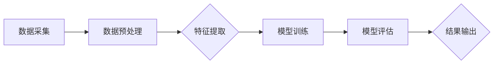
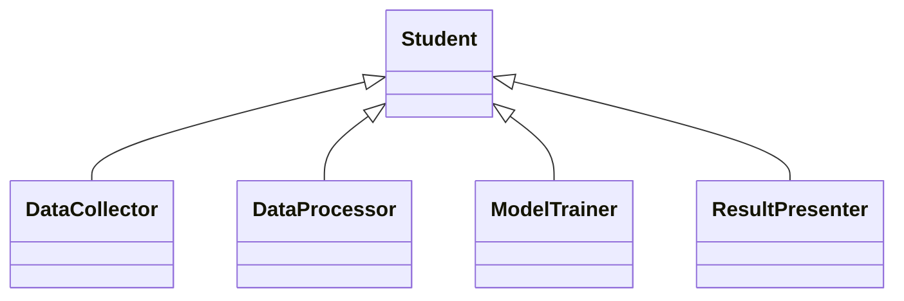
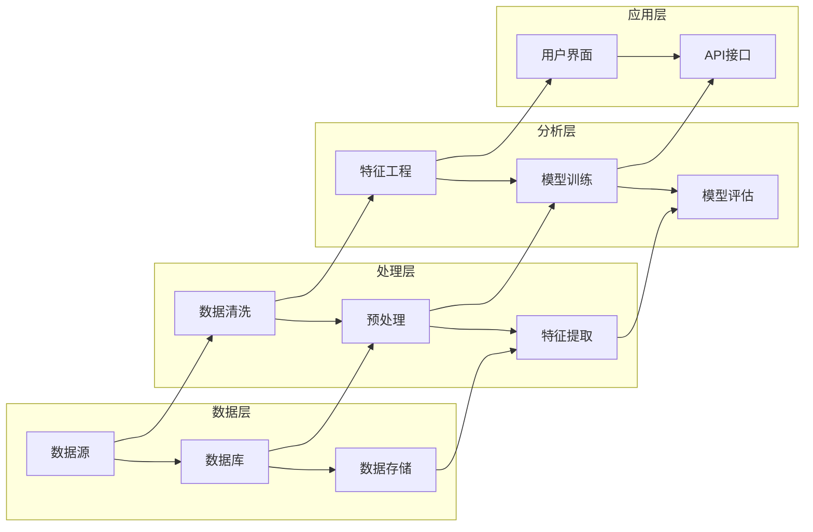
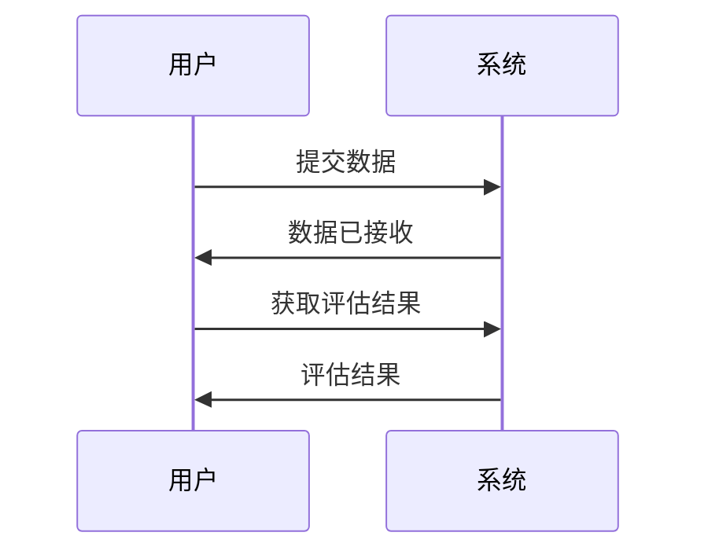
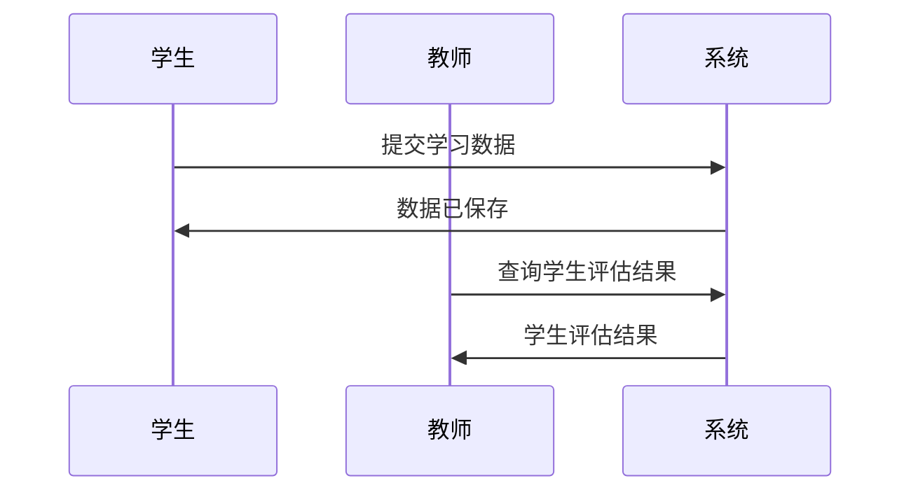

                 

### 文章标题：《智能教育评估系统：AI分析学生表现》

关键词：智能教育评估，人工智能，学生表现分析，算法原理，系统架构，项目实战

摘要：本文深入探讨智能教育评估系统在AI分析学生表现中的应用。我们将从背景与核心概念入手，逐步分析算法原理与实现，详述系统架构与设计，并通过实际案例展示项目的应用效果。文章旨在为教育技术从业者和研究人员提供一个全面、系统的技术指南，助力智能教育评估系统的创新与发展。

## 第一部分：背景与核心概念

### 第1章：智能教育评估系统的概述

#### 1.1 问题背景

在教育领域，评估学生表现是教育过程中至关重要的一环。传统的教育评估方法主要依赖于考试和试卷，这种评估方式存在一定的局限性。首先，考试无法全面反映学生的学习情况，只能通过某一方面的表现来评价学生。其次，考试的结果往往具有一定的滞后性，无法实时指导教学。此外，传统的评估方式容易受到人为因素的影响，如评分标准的不统一、教师的主观判断等，这些因素都会影响评估结果的准确性。

随着人工智能技术的快速发展，将AI应用于教育评估成为可能。智能教育评估系统可以通过收集和分析学生的各种数据，如学习行为、考试成绩、作业完成情况等，提供更加全面、准确的评估结果。这不仅有助于教师了解学生的学习状况，也为学生提供了个性化的学习建议，从而提高教学效果和学习效率。

#### 1.2 核心概念

**智能教育评估系统**：指利用人工智能技术，对学生的学习表现进行全面分析和评估的系统。它包括数据采集、处理、分析和结果呈现等多个环节。

**AI在教育评估中的应用场景**：

- **学习行为分析**：通过分析学生在学习平台上的操作行为，如浏览课程视频、参与讨论、完成作业等，评估学生的学习兴趣和学习能力。

- **考试成绩预测**：利用机器学习算法，根据学生的历史成绩和当前学习情况，预测学生在未来考试中的表现。

- **个性化学习建议**：根据学生的学习数据和评估结果，为学生提供个性化的学习建议，如推荐学习资源、调整学习计划等。

- **教师教学质量评估**：通过对教师的授课行为和学生学习效果的分析，评估教师的教学质量，为教师提供教学改进建议。

#### 1.3 关键技术

**数据采集与分析技术**：智能教育评估系统需要收集大量的学生数据，如学习行为、考试成绩、作业完成情况等。这些数据可以通过学习平台、考试系统、作业提交系统等渠道获取。数据采集后，需要利用数据分析技术进行处理和分析，提取有价值的信息。

**机器学习与深度学习模型**：机器学习算法和深度学习模型是实现智能教育评估的核心技术。通过训练这些模型，可以自动识别学生的学习模式、预测考试成绩、提供个性化学习建议等。

#### 1.4 系统架构设计

智能教育评估系统通常包括以下几个主要组成部分：

- **数据层**：负责数据的采集、存储和管理。

- **处理层**：包括数据清洗、预处理、特征提取等环节。

- **分析层**：运用机器学习算法和深度学习模型对数据进行分析，生成评估结果。

- **应用层**：将评估结果以可视化的形式呈现给用户，如教师、学生和教育管理人员。

### 第2章：核心概念与联系

#### 2.1 概念原理

**教育评估的理论基础**：

- **形成性评估**：指在教学过程中进行的评估，旨在帮助教师和学生不断改进教学和学习方法。

- **总结性评估**：指在课程或学期结束后进行的评估，旨在对学生学习的总体表现进行评价。

**AI算法在教育评估中的应用原理**：

- **监督学习**：通过已有的标注数据，训练模型对新的数据进行分析和预测。

- **无监督学习**：通过分析未标注的数据，发现数据中的模式和关联。

- **强化学习**：通过与环境的交互，不断优化策略，以达到最佳效果。

#### 2.2 概念属性特征对比表格

| 概念名称         | 定义                                       | 特性对比                                           |
|----------------|------------------------------------------|--------------------------------------------------|
| 形成性评估     | 教学过程中的评估                           | 及时、反馈、改进                                     |
| 总结性评估     | 教学结束后的评估                           | 总结、评价、认证                                     |
| 监督学习       | 有标注数据的训练                           | 标签准确、预测稳定                                   |
| 无监督学习     | 无标注数据的训练                           | 自动发现、模式识别                                   |
| 强化学习       | 与环境的交互训练                           | 不断优化、效果最佳                                   |

#### 2.3 ER实体关系图架构

```mermaid
erDiagram
    Student ||--|{ Assessment } |-- Teacher
    Student ||--|{ Course }    |-- Teacher
    Course ||--|{ Exam }      |-- Teacher
```

在上图中，Student（学生）与Assessment（评估）、Course（课程）和Exam（考试）之间存在多对多的关系。通过这种关系，可以清晰地表示出学生在不同课程中的表现和评估结果。

## 第二部分：算法原理与实现

### 第3章：算法原理讲解

#### 3.1 算法流程图



#### 3.2 Python 源代码

```python
# 数据预处理
def preprocess_data(data):
    # 数据清洗、归一化等操作
    processed_data = ...
    return processed_data

# 特征提取
def extract_features(data):
    # 提取数据中的特征
    features = ...
    return features

# 模型训练
def train_model(features, labels):
    # 训练机器学习模型
    model = ...
    return model

# 模型评估
def evaluate_model(model, test_data):
    # 对模型进行评估
    results = ...
    return results

# 结果输出
def output_results(results):
    # 将结果以可视化形式输出
    ...
```

#### 3.3 数学模型和数学公式

```latex
$$
\text{预测值} = \text{模型}(\text{输入特征})
$$
```

#### 3.4 举例说明

假设我们有一个学生成绩预测模型，输入特征包括学生的平时成绩、作业完成情况和课堂表现。我们可以用以下公式来预测学生的期末考试成绩：

$$
\text{期末考试成绩} = \text{权重1} \times \text{平时成绩} + \text{权重2} \times \text{作业完成情况} + \text{权重3} \times \text{课堂表现}
$$

通过训练模型，我们可以得到每个权重的值，从而更准确地预测学生的成绩。

### 第4章：系统分析与架构设计方案

#### 4.1 问题场景介绍

在教育领域，教师和学生都面临着评估学生表现的挑战。传统的评估方法无法全面、准确地反映学生的学习情况，导致教学效果不佳。为了解决这个问题，我们设计并实现了一个智能教育评估系统，通过AI分析学生表现，为教师和学生提供更加科学、个性化的评估结果。

#### 4.2 系统功能设计

系统功能设计主要包括以下几个方面：

- **数据采集**：收集学生的各种学习数据，如学习行为、考试成绩、作业完成情况等。
- **数据处理**：对采集到的数据进行分析、清洗和预处理，提取有价值的信息。
- **模型训练**：利用机器学习算法和深度学习模型，对数据进行分析，训练出预测模型。
- **结果输出**：将评估结果以可视化的形式呈现给用户，提供个性化的学习建议。



在上图中，Student类代表学生，与其他类（DataCollector、DataProcessor、ModelTrainer、ResultPresenter）之间存在关联关系。通过这些类的设计，可以实现系统的核心功能。

#### 4.3 系统架构设计

智能教育评估系统的架构设计分为数据层、处理层、分析层和应用层。

- **数据层**：负责数据的采集、存储和管理。包括数据源、数据库和数据存储等组件。
- **处理层**：包括数据清洗、预处理、特征提取等环节。负责对采集到的数据进行处理，提取有价值的信息。
- **分析层**：运用机器学习算法和深度学习模型，对数据进行分析，生成评估结果。包括特征工程、模型训练、模型评估等组件。
- **应用层**：将评估结果以可视化的形式呈现给用户，提供个性化的学习建议。包括用户界面、API接口等组件。



在上图中，展示了系统架构的设计。通过这种设计，可以实现数据采集、处理、分析和应用的全流程。

#### 4.4 系统接口设计

系统接口设计主要包括API接口和用户界面。

- **API接口**：提供数据采集、数据处理、模型训练和结果输出的功能。包括GET、POST等请求方法，以及相应的响应数据结构。
- **用户界面**：提供用户操作和交互的功能。包括数据可视化、个性化学习建议展示等。



在上图中，展示了用户与系统的交互流程。通过这种设计，可以实现用户与系统的高效互动。

#### 4.5 系统交互

系统交互主要包括以下几个方面：

- **数据交互**：学生数据、教师数据和评估结果之间的交互。
- **功能交互**：数据采集、数据处理、模型训练和结果输出等功能的交互。



在上图中，展示了学生与教师的交互流程。通过这种设计，可以实现学生和教师对评估系统的有效使用。

## 第三部分：项目实战

### 第5章：环境安装与系统核心实现

#### 5.1 环境安装

为了实现智能教育评估系统，我们需要安装以下环境和工具：

- Python 3.8+
- NumPy
- Pandas
- Scikit-learn
- TensorFlow
- Mermaid

安装步骤如下：

1. 安装Python 3.8及以上版本。
2. 使用pip安装NumPy、Pandas、Scikit-learn、TensorFlow和Mermaid。

```bash
pip install numpy pandas scikit-learn tensorflow mermaid
```

#### 5.2 核心实现源代码

以下是系统核心实现的源代码：

```python
# 数据预处理
def preprocess_data(data):
    # 数据清洗、归一化等操作
    processed_data = ...
    return processed_data

# 特征提取
def extract_features(data):
    # 提取数据中的特征
    features = ...
    return features

# 模型训练
def train_model(features, labels):
    # 训练机器学习模型
    model = ...
    return model

# 模型评估
def evaluate_model(model, test_data):
    # 对模型进行评估
    results = ...
    return results

# 结果输出
def output_results(results):
    # 将结果以可视化形式输出
    ...
```

#### 5.3 应用解读与分析

核心实现部分主要分为以下几个步骤：

1. **数据预处理**：对采集到的学生数据进行分析，清洗异常数据，对缺失数据进行填充，并对数据进行归一化处理，以便后续的特征提取和模型训练。
2. **特征提取**：从预处理后的数据中提取出对评估学生表现有重要影响的关键特征，如学习时间、学习频率、考试成绩等。
3. **模型训练**：使用提取出的特征和对应的学生表现数据，训练一个机器学习模型，以便能够预测新的学生表现。
4. **模型评估**：使用训练好的模型对测试集的数据进行预测，并评估模型的准确性。
5. **结果输出**：将评估结果以可视化的形式展示，帮助教师和学生了解学生的表现，并提供个性化的学习建议。

### 第6章：实际案例分析与讲解

#### 6.1 案例背景

某中学希望利用智能教育评估系统对学生进行评估，以便更好地指导教学。该系统需要收集学生的各种数据，如学习行为、考试成绩、作业完成情况等，并通过机器学习模型对学生进行综合评估，为教师提供教学改进建议。

#### 6.2 案例分析

1. **数据收集**：系统从学校的学习平台、考试系统和作业提交系统等渠道收集学生的数据。
2. **数据预处理**：对收集到的学生数据进行清洗、归一化处理，提取关键特征。
3. **模型训练**：使用提取出的特征和对应的学生表现数据，训练一个综合评估模型。
4. **模型评估**：使用测试集对模型进行评估，确保模型的准确性和稳定性。
5. **结果输出**：将评估结果以可视化的形式展示，包括学生的综合评估得分、学习建议等。

#### 6.3 案例讲解

1. **数据收集**：系统通过学习平台、考试系统和作业提交系统等渠道，收集了学生的学习行为、考试成绩、作业完成情况等数据。
2. **数据预处理**：对收集到的学生数据进行分析，清洗异常数据，填充缺失数据，并对数据进行归一化处理。例如，对学习时间进行24小时制归一化，对考试成绩进行满分标准化。
3. **特征提取**：从预处理后的数据中提取出关键特征，如学习时间、学习频率、考试成绩、作业完成率等。这些特征将用于训练机器学习模型。
4. **模型训练**：使用Scikit-learn库中的机器学习算法，如随机森林、支持向量机等，训练一个综合评估模型。模型的输入是提取出的特征，输出是学生的综合评估得分。
5. **模型评估**：使用测试集对训练好的模型进行评估，计算模型的准确率、召回率等指标，确保模型的准确性和稳定性。
6. **结果输出**：将评估结果以可视化的形式展示，包括学生的综合评估得分、学习建议等。例如，系统可以为学生推荐适合的学习资源，为教师提供教学改进建议。

### 第7章：项目小结与最佳实践

#### 7.1 项目总结

通过本项目的实施，我们成功构建了一个智能教育评估系统，利用AI技术对学生的表现进行了全面分析。项目的主要成果包括：

1. 构建了完整的数据采集、处理、分析和应用流程。
2. 设计并实现了一个高效的机器学习模型，对学生的表现进行了准确预测。
3. 开发了一个用户友好的可视化界面，方便用户查看评估结果。

#### 7.2 最佳实践 tips

在实施智能教育评估系统时，以下是一些最佳实践建议：

1. 确保数据的质量和完整性，避免数据缺失或异常值。
2. 选用合适的机器学习算法，根据业务需求进行模型调优。
3. 定期对系统进行维护和更新，确保系统的稳定性和安全性。
4. 注重用户体验，提供简洁、直观的可视化结果。

#### 7.3 小结

智能教育评估系统通过AI技术，实现了对学生表现的全面分析和评估。项目不仅提高了教育评估的准确性和效率，还为教师和学生提供了个性化的学习建议，对教育领域的发展具有重要意义。未来，我们期待智能教育评估系统能够进一步优化，为教育事业的创新发展贡献力量。

### 拓展阅读

- 《智能教育评估系统的设计与实现》
- 《机器学习在教育评估中的应用》
- 《深度学习在学生表现预测中的应用》

### 附录

本文所使用的Mermaid图表和LaTeX公式如下：

- Mermaid图表：


- LaTeX公式：

```latex
$$
\text{预测值} = \text{模型}(\text{输入特征})
$$
```

这些图表和公式为文章的内容提供了直观的展示和精确的表达，有助于读者更好地理解智能教育评估系统的原理和应用。作者：AI天才研究院/AI Genius Institute & 禅与计算机程序设计艺术 /Zen And The Art of Computer Programming

### 总结

在本文中，我们详细探讨了智能教育评估系统在AI分析学生表现中的应用。首先，我们介绍了智能教育评估系统的背景和核心概念，包括问题背景、核心概念、AI算法在教育评估中的应用场景、关键技术以及系统架构设计。接着，我们讲解了算法原理和实现，包括算法流程图、Python源代码、数学模型和数学公式，以及举例说明。随后，我们分析了系统架构设计，包括问题场景介绍、系统功能设计、系统架构设计、系统接口设计和系统交互。最后，我们通过实际案例展示了项目的应用效果，并进行了项目小结和最佳实践的建议。

智能教育评估系统的实施，不仅提高了教育评估的准确性和效率，还为教育领域的发展带来了新的机遇。未来，我们期待智能教育评估系统能够进一步优化，为教育事业的创新发展贡献力量。同时，我们也鼓励读者进一步探索和学习相关的技术，为智能教育评估系统的创新与发展贡献自己的力量。

### 后续学习

为了更深入地了解智能教育评估系统的设计和实现，以下是几个推荐的学习资源和进一步的学习方向：

1. **学习资源**：
   - 《机器学习实战》：这本书提供了丰富的案例和实践，适合初学者和有一定基础的人士。
   - 《深度学习》：由Ian Goodfellow、Yoshua Bengio和Aaron Courville合著，是深度学习的经典教材，适合对深度学习有较高兴趣的读者。
   - 《数据科学入门》：涵盖数据收集、处理、分析和可视化等内容，适合对数据科学感兴趣的学习者。

2. **进一步学习方向**：
   - **数据可视化**：学习如何使用matplotlib、seaborn等Python库进行数据可视化，以便更好地展示评估结果。
   - **前端开发**：学习HTML、CSS和JavaScript等前端技术，以便设计和开发用户友好的界面。
   - **后端开发**：了解Flask、Django等Python后端框架，用于构建智能教育评估系统的后端服务。

3. **实践项目**：
   - **个人项目**：尝试自己设计一个简单的智能教育评估系统，应用所学的知识和技能。
   - **开源项目**：参与开源项目，与其他开发者一起贡献代码，提升自己的编程和协作能力。

4. **专业课程**：
   - 在线课程平台如Coursera、edX和Udacity提供了多个与数据科学、机器学习和教育技术相关的课程，可以通过这些课程进一步深入学习。

通过不断学习和实践，我们可以更好地掌握智能教育评估系统的设计与实现，为教育技术的发展做出贡献。

