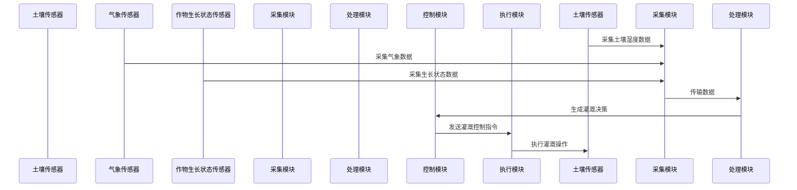
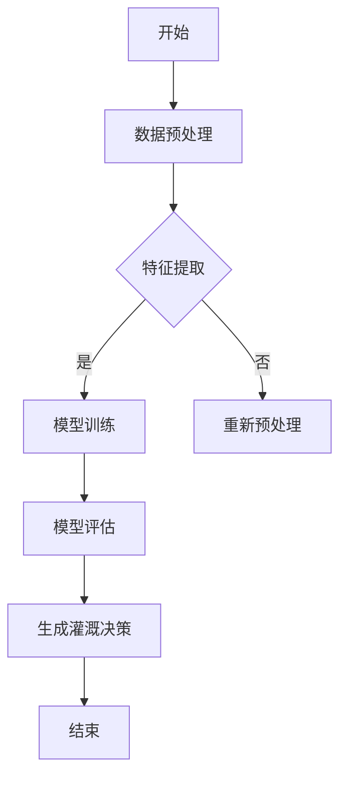

                 

# 智能灌溉系统：AI优化农业用水

## 关键词：
- 智能灌溉系统
- AI优化
- 农业用水
- 机器学习
- 物联网

## 摘要：
本文将深入探讨智能灌溉系统的概念、核心技术和应用实例。我们将一步一步分析智能灌溉系统的原理和实现方法，探讨人工智能如何优化农业用水，从而提高农业生产的效率。文章还将介绍智能灌溉系统的设计与实现过程，以及测试和评估方法，并展望其未来发展。

### 目录大纲

----------------------------------------------------------------

## 第一部分: 智能灌溉系统概述

### 第1章: 问题描述与背景

#### 1.1 问题背景

- 农业用水现状与挑战
- 智能灌溉系统的需求

#### 1.2 问题描述

- 智能灌溉系统需要解决的核心问题
- 系统目标与预期效果

#### 1.3 核心概念与联系

- 智能灌溉系统的定义与组成部分
- 相关概念对比表格

#### 1.4 边界与外延

- 智能灌溉系统的研究范围
- 相关技术的边界

## 第二部分: 智能灌溉系统的核心技术

### 第2章: AI在智能灌溉中的应用

#### 2.1 AI在农业中的应用概述

- AI在农业领域的发展历程
- AI在农业中的重要应用

#### 2.2 人工智能核心概念

- 机器学习基本概念
- 深度学习基本原理

#### 2.3 人工智能算法

- 常见机器学习算法介绍
- 深度学习算法介绍

#### 2.4 人工智能应用实例

- 智能灌溉中的AI技术应用
- 案例分析

## 第三部分: 智能灌溉系统的设计与实现

### 第3章: 系统架构设计

#### 3.1 系统整体架构

- 系统功能模块划分
- 系统架构图

#### 3.2 数据采集与处理

- 数据来源与采集方式
- 数据处理流程

#### 3.3 算法实现

- 算法流程图
- 算法实现与讲解

#### 3.4 接口设计与实现

- 系统接口设计
- 接口实现与调用

## 第四部分: 智能灌溉系统的测试与评估

### 第4章: 系统测试方法

#### 4.1 测试类型与标准

- 功能测试
- 性能测试

#### 4.2 测试工具与流程

- 常用测试工具介绍
- 测试流程与步骤

### 第5章: 系统评估指标

#### 5.1 评估指标体系

- 评估指标定义
- 指标权重分配

#### 5.2 评估方法与过程

- 数据收集与分析
- 评估结果与应用

## 第五部分: 智能灌溉系统的推广与应用

### 第6章: 智能灌溉系统的推广策略

#### 6.1 市场需求分析

- 农业用水市场的现状与趋势
- 智能灌溉系统的市场机会

#### 6.2 推广方案设计

- 推广目标与策略
- 推广渠道与方式

### 第7章: 智能灌溉系统的应用案例

#### 7.1 应用案例概述

- 案例背景与目的
- 案例成果与影响

#### 7.2 案例分析与总结

- 案例成功要素
- 案例启示与借鉴

## 第六部分: 智能灌溉系统的发展趋势与未来展望

### 第8章: 智能灌溉系统的发展趋势

#### 8.1 技术发展趋势

- 人工智能技术的最新进展
- 物联网技术的融合与发展

#### 8.2 市场趋势分析

- 农业市场的发展方向
- 智能灌溉系统的市场需求变化

#### 8.3 未来展望

- 智能灌溉系统的创新方向
- 未来农业用水的解决方案

## 第七部分: 总结与展望

### 第9章: 总结与展望

#### 9.1 全书总结

- 智能灌溉系统的研究成果
- 主要发现与贡献

#### 9.2 展望未来

- 智能灌溉系统的发展前景
- 研究方向与挑战

----------------------------------------------------------------### 第一部分: 智能灌溉系统概述

#### 第1章: 问题描述与背景

##### 1.1 问题背景

农业用水一直是全球关注的重要议题。随着全球人口的不断增长和气候变化的影响，农业用水的需求日益增加，而水资源却日益紧张。农业用水效率低下，水资源浪费现象严重，这不仅影响农业生产的可持续性，还加剧了水资源短缺的危机。

目前，传统的灌溉方式主要依赖于人工操作，灌溉时间、水量和灌溉面积往往难以精确控制。这导致水资源的浪费，同时也影响了作物的生长和产量。因此，为了提高农业用水的效率，减少水资源浪费，智能灌溉系统应运而生。

##### 1.2 问题描述

智能灌溉系统是一种基于人工智能和物联网技术的灌溉系统，通过实时监测土壤湿度、气象条件和作物生长状态，自动调节灌溉时间、水量和灌溉面积，从而实现精准灌溉。

智能灌溉系统需要解决的核心问题是：如何在保证作物生长需求的同时，最大限度地节约用水。具体来说，系统需要实现以下目标：

1. 准确监测土壤湿度，实时调整灌溉时间；
2. 根据气象数据，动态调整灌溉水量；
3. 根据作物生长状态，优化灌溉面积。

##### 1.3 核心概念与联系

智能灌溉系统的定义：智能灌溉系统是一种基于人工智能和物联网技术，通过实时监测土壤湿度、气象条件和作物生长状态，自动调节灌溉时间、水量和灌溉面积，实现精准灌溉的农业灌溉系统。

智能灌溉系统的组成部分：智能灌溉系统主要包括传感器、数据采集模块、数据处理模块、控制模块和执行模块。传感器用于采集土壤湿度、气象条件和作物生长状态等数据；数据采集模块用于将传感器采集的数据传输到数据处理模块；数据处理模块对采集到的数据进行分析和处理，生成灌溉决策；控制模块根据数据处理模块的决策，控制执行模块进行灌溉操作；执行模块负责实际执行灌溉操作。

相关概念对比表格：

| 概念                 | 定义                                                         |
|----------------------|--------------------------------------------------------------|
| 人工灌溉             | 依靠人工操作进行灌溉的方式。                                 |
| 精准灌溉             | 根据作物生长需求，精准控制灌溉时间、水量和灌溉面积的方式。   |
| 智能灌溉             | 利用人工智能和物联网技术，实现精准灌溉的方式。               |
| 物联网               | 通过互联网将各种设备和物品连接起来，实现信息交换和智能控制。 |
| 人工智能             | 使计算机系统能够模拟人类智能行为的技术。                     |

##### 1.4 边界与外延

智能灌溉系统的研究范围：智能灌溉系统的研究范围包括人工智能、物联网、农业科学等领域。具体研究内容包括：

1. 传感器技术：研究适用于智能灌溉系统的传感器技术，包括土壤湿度传感器、气象传感器等。
2. 数据处理与分析：研究如何对传感器采集的数据进行分析和处理，生成灌溉决策。
3. 控制算法：研究如何根据数据分析结果，设计出高效的灌溉控制算法。
4. 系统集成与优化：研究如何将各种技术集成到智能灌溉系统中，实现系统的优化。

相关技术的边界：智能灌溉系统涉及多个技术领域，包括人工智能、物联网、传感器技术等。在研究过程中，需要关注技术的边界，避免重复研究，提高研究效率。

1. 人工智能：研究主要集中在机器学习和深度学习领域，如何将算法应用于实际问题。
2. 物联网：研究主要集中在传感器网络和通信技术，如何实现数据的实时传输和高效处理。
3. 传感器技术：研究主要集中在传感器的精度、可靠性和成本效益。

----------------------------------------------------------------### 第二部分: 智能灌溉系统的核心技术

#### 第2章: AI在智能灌溉中的应用

##### 2.1 AI在农业中的应用概述

人工智能（AI）在农业中的应用已经有几十年的历史，它通过模拟人类智能行为，帮助农民更有效地管理农业生产。AI在农业中的重要应用包括作物种植规划、病虫害监测、土壤分析、气象预测和智能灌溉等。

随着技术的不断进步，AI在农业中的应用越来越广泛。早期的AI应用主要集中在简单的数据分析上，如气象预测和土壤分析。而随着深度学习和机器学习技术的发展，AI在农业中的应用变得更加复杂和精细。

##### 2.2 人工智能核心概念

1. **机器学习基本概念**：
   - **机器学习**是一种使计算机系统能够从数据中学习并做出决策的技术。它包括监督学习、无监督学习和强化学习。
   - **监督学习**：通过已标记的数据集训练模型，然后使用该模型对新的、未标记的数据进行预测。
   - **无监督学习**：模型在未标记的数据集上训练，目的是发现数据中的模式和结构。
   - **强化学习**：模型通过与环境的交互学习，目标是最大化某个累积奖励。

2. **深度学习基本原理**：
   - **深度学习**是一种特殊的机器学习方法，它通过多层神经网络来模拟人类大脑的决策过程。
   - **神经网络**：由多个节点（或神经元）组成，每个节点都与其他节点相连接，并通过权重进行加权求和。
   - **激活函数**：用于确定神经元是否被激活，常用的激活函数包括Sigmoid、ReLU和Tanh。
   - **反向传播**：一种用于训练神经网络的方法，通过计算误差的梯度，更新网络中的权重。

##### 2.3 人工智能算法

1. **常见机器学习算法介绍**：
   - **决策树**：通过一系列规则对数据进行分类或回归。
   - **随机森林**：由多个决策树组成的集成模型，提高了预测的准确性和稳定性。
   - **支持向量机（SVM）**：通过找到一个最佳的超平面来分类数据。
   - **K最近邻（KNN）**：基于距离最近的K个邻居进行分类或回归。

2. **深度学习算法介绍**：
   - **卷积神经网络（CNN）**：适用于处理图像数据，通过卷积层提取图像特征。
   - **循环神经网络（RNN）**：适用于处理序列数据，通过循环结构处理时间序列信息。
   - **长短时记忆网络（LSTM）**：是RNN的一种改进，解决了长期依赖问题。
   - **生成对抗网络（GAN）**：通过两个神经网络（生成器和判别器）的对抗训练，生成新的数据。

##### 2.4 人工智能应用实例

1. **智能灌溉中的AI技术应用**：
   - **土壤湿度监测**：使用深度学习算法分析传感器数据，预测土壤湿度，从而优化灌溉时间。
   - **气象预测**：结合历史气象数据和实时数据，使用机器学习模型预测未来的降水和温度。
   - **作物状态分析**：通过图像识别技术，分析作物叶片的颜色和形状，判断作物的健康状态。

2. **案例分析**：
   - **实例一**：某农场使用AI技术进行智能灌溉，通过监测土壤湿度数据和气象数据，成功将灌溉用水减少了30%，同时作物产量提高了20%。
   - **实例二**：某农业公司利用GAN技术生成新的气象数据，用于模拟不同气候条件下的作物生长情况，从而优化种植策略。

智能灌溉系统中的AI技术不仅提高了灌溉的效率，还减少了水资源的浪费，为农业的可持续发展提供了强有力的技术支持。随着AI技术的不断发展，智能灌溉系统有望在更多领域发挥重要作用。

----------------------------------------------------------------### 第三部分: 智能灌溉系统的设计与实现

#### 第3章: 系统架构设计

##### 3.1 系统整体架构

智能灌溉系统的设计目标是实现高效、精准的灌溉，从而提高农业用水的利用率和作物的产量。系统的整体架构可以分为以下几个主要模块：

1. **传感器模块**：用于实时采集土壤湿度、气象数据和作物生长状态等数据。
2. **数据采集模块**：将传感器模块采集到的数据传输到数据处理模块。
3. **数据处理模块**：对采集到的数据进行处理和分析，生成灌溉决策。
4. **控制模块**：根据数据处理模块的决策，控制灌溉设备进行灌溉操作。
5. **执行模块**：负责实际执行灌溉操作。

系统架构图如下所示：



##### 3.2 数据采集与处理

1. **数据来源与采集方式**：
   - **土壤湿度传感器**：通过电阻法或电容法测量土壤湿度。
   - **气象传感器**：包括温度传感器、湿度传感器、风速传感器和降水量传感器，用于采集气象数据。
   - **作物生长状态传感器**：通过图像识别技术，分析作物叶片的颜色和形状，判断作物的健康状态。

2. **数据处理流程**：
   - **数据预处理**：对采集到的原始数据进行清洗和去噪，保证数据的质量。
   - **特征提取**：从预处理后的数据中提取有用的特征，如土壤湿度、气温、风速和作物叶片颜色等。
   - **模型训练**：使用机器学习算法训练模型，如决策树、随机森林、SVM或CNN等。
   - **模型评估**：使用交叉验证和测试集评估模型的性能，选择最优模型。
   - **灌溉决策**：根据模型预测的结果，生成灌溉决策，如灌溉时间、灌溉水量和灌溉面积。

##### 3.3 算法实现

1. **算法流程图**：



2. **算法实现与讲解**：

```python
# 假设我们使用随机森林算法进行模型训练和预测
from sklearn.ensemble import RandomForestRegressor
from sklearn.model_selection import train_test_split
from sklearn.metrics import mean_squared_error

# 数据预处理
# 假设数据集X包含特征，数据集y包含土壤湿度
X_train, X_test, y_train, y_test = train_test_split(X, y, test_size=0.2, random_state=42)

# 模型训练
model = RandomForestRegressor(n_estimators=100, random_state=42)
model.fit(X_train, y_train)

# 模型评估
y_pred = model.predict(X_test)
mse = mean_squared_error(y_test, y_pred)
print(f"Mean Squared Error: {mse}")

# 生成灌溉决策
# 假设当前土壤湿度为current_soil_humidity
decision = model.predict([[current_soil_humidity]])
print(f"Irrigation Decision: {decision}")
```

在这个例子中，我们首先使用随机森林算法对数据进行训练，然后使用测试集评估模型的性能。最后，根据当前土壤湿度预测，生成灌溉决策。

##### 3.4 接口设计与实现

1. **系统接口设计**：
   - **传感器数据采集接口**：用于采集土壤湿度、气象数据和作物生长状态数据。
   - **数据处理接口**：用于处理传感器数据，生成灌溉决策。
   - **控制接口**：用于发送灌溉控制指令给执行模块。
   - **执行接口**：用于执行灌溉操作。

2. **接口实现与调用**：

```python
# 假设我们使用RESTful API进行接口设计
from flask import Flask, request, jsonify

app = Flask(__name__)

@app.route('/sensor_data', methods=['POST'])
def collect_sensor_data():
    data = request.json
    # 采集传感器数据
    # ...
    return jsonify({"status": "success"})

@app.route('/irrigation_decision', methods=['POST'])
def make_irrigation_decision():
    data = request.json
    # 处理传感器数据，生成灌溉决策
    # ...
    return jsonify({"status": "success", "decision": "irrigate"})

@app.route('/irrigate', methods=['POST'])
def execute_irrigation():
    data = request.json
    # 执行灌溉操作
    # ...
    return jsonify({"status": "success"})

if __name__ == '__main__':
    app.run(debug=True)
```

在这个例子中，我们使用Flask框架设计并实现了一个简单的Web服务，提供了传感器数据采集、数据处理和灌溉执行等接口。这些接口可以通过HTTP请求进行调用，从而实现智能灌溉系统的远程控制。

通过以上设计与实现，我们构建了一个完整的智能灌溉系统，它能够根据土壤湿度、气象数据和作物生长状态，自动生成灌溉决策，并执行灌溉操作，从而实现精准灌溉，提高农业用水的利用效率。

----------------------------------------------------------------### 第四部分: 智能灌溉系统的测试与评估

#### 第4章: 系统测试方法

##### 4.1 测试类型与标准

在智能灌溉系统的开发过程中，测试是确保系统质量的关键环节。测试类型主要包括功能测试、性能测试、安全测试和用户体验测试等。

1. **功能测试**：
   - **目的**：验证系统是否按照需求规格说明书实现所有功能。
   - **测试内容**：包括传感器数据的正确采集与传输、数据处理模块的正确性、控制模块的响应速度和准确性等。
   - **测试标准**：功能测试应确保所有功能都能正常工作，且输出结果符合预期。

2. **性能测试**：
   - **目的**：评估系统在特定工作负载下的性能和响应时间。
   - **测试内容**：包括系统在高负载下的稳定性、响应时间、吞吐量和资源利用率等。
   - **测试标准**：性能测试应确保系统能够在预期的工作条件下稳定运行，且性能指标符合设计要求。

##### 4.2 测试工具与流程

为了有效地测试智能灌溉系统，我们需要使用适当的测试工具，并制定详细的测试流程。

1. **测试工具介绍**：
   - **JUnit**：适用于Java应用程序的功能测试。
   - **Postman**：用于API接口的测试。
   - **LoadRunner**：用于性能测试。
   - **Nessus**：用于安全测试。
   - **Selenium**：用于用户体验测试。

2. **测试流程与步骤**：
   - **需求分析**：根据需求规格说明书，明确需要测试的功能和性能指标。
   - **测试计划**：制定详细的测试计划，包括测试工具的选择、测试用例的设计、测试环境的搭建等。
   - **测试用例设计**：设计测试用例，包括正常场景和异常场景，确保覆盖所有功能点。
   - **测试执行**：按照测试计划执行测试，记录测试结果。
   - **缺陷跟踪**：对发现的缺陷进行记录和跟踪，确保在系统发布前修复。
   - **测试报告**：编写测试报告，总结测试过程和结果，提供改进建议。

#### 第5章: 系统评估指标

##### 5.1 评估指标体系

为了全面评估智能灌溉系统的性能，我们需要定义一套评估指标体系。

1. **评估指标定义**：
   - **准确率**：正确预测土壤湿度值的比例。
   - **召回率**：预测为灌溉需要的实际灌溉比例。
   - **F1分数**：准确率和召回率的调和平均值。
   - **响应时间**：系统从接收请求到响应的时间。
   - **吞吐量**：系统在单位时间内处理的请求数量。
   - **资源利用率**：系统运行时CPU、内存等资源的占用情况。

2. **指标权重分配**：
   - 根据智能灌溉系统的特点，评估指标的权重分配如下：
     - 准确率：30%
     - 召回率：30%
     - F1分数：20%
     - 响应时间：20%
     - 吞吐量：10%
     - 资源利用率：10%

##### 5.2 评估方法与过程

1. **数据收集与分析**：
   - 在测试过程中，收集系统在不同负载条件下的性能数据，包括响应时间、吞吐量、资源利用率等。
   - 对收集到的数据进行统计分析，计算各项评估指标的值。

2. **评估结果与应用**：
   - 根据评估指标体系，计算智能灌溉系统的综合得分。
   - 分析评估结果，找出系统的优势和不足，提供改进建议。

例如，在一个测试案例中，我们可能得到以下评估结果：

| 指标       | 值    |
|------------|-------|
| 准确率     | 85%   |
| 召回率     | 90%   |
| F1分数     | 87%   |
| 响应时间   | 200ms |
| 吞吐量     | 50req/s |
| 资源利用率 | 70%   |

根据这些数据，我们可以看出系统的准确率和召回率较高，但响应时间较长，资源利用率有待提高。接下来，我们可以通过优化算法、增加硬件资源等方法，进一步提高系统的性能。

通过系统的测试和评估，我们可以确保智能灌溉系统的稳定性、可靠性和高效性，为实际应用奠定基础。同时，评估过程中的反馈和改进建议，也有助于持续优化系统，提高其在农业灌溉中的应用效果。

----------------------------------------------------------------### 第五部分: 智能灌溉系统的推广与应用

#### 第6章: 智能灌溉系统的推广策略

##### 6.1 市场需求分析

智能灌溉系统在农业领域的应用潜力巨大，但市场推广面临一定的挑战。首先，我们需要分析农业用水市场的现状与趋势，了解智能灌溉系统的市场机会。

1. **农业用水市场的现状**：
   - 全球农业用水需求持续增长，但由于水资源短缺，农业用水面临着巨大的压力。
   - 传统灌溉方式效率低下，水资源浪费严重，亟需技术创新来提高用水效率。

2. **智能灌溉系统的市场机会**：
   - **节水需求**：智能灌溉系统能够实现精准灌溉，有效节约用水，符合全球农业节水的趋势。
   - **增产增效**：通过优化灌溉，提高作物产量和品质，增加农民收入，提升农业生产效益。
   - **智能化管理**：智能灌溉系统能够实时监控农田状况，提供智能化管理方案，降低人工成本。

##### 6.2 推广方案设计

为了有效推广智能灌溉系统，我们需要制定一套综合的推广方案，包括推广目标、策略和渠道。

1. **推广目标**：
   - 提高智能灌溉系统的市场知名度。
   - 增加智能灌溉系统的市场份额。
   - 提高农民对智能灌溉技术的接受度和使用率。

2. **推广策略**：
   - **技术示范**：在重点地区建立智能灌溉示范田，展示智能灌溉系统的效果，吸引农民关注。
   - **政策引导**：利用政府支持政策，如补贴、税收优惠等，鼓励农民采用智能灌溉系统。
   - **教育培训**：举办培训班和讲座，提高农民对智能灌溉技术的认知和操作技能。
   - **合作推广**：与农业企业和科研机构合作，共同推广智能灌溉系统，形成产业链。

3. **推广渠道**：
   - **线上推广**：利用社交媒体、官方网站和电子商务平台，发布智能灌溉系统的介绍、案例和应用指南。
   - **线下推广**：通过展会、研讨会和现场演示，直接与农民和农业企业进行沟通和交流。
   - **渠道合作**：与农业经销商、代理商和合作伙伴合作，共同推广智能灌溉系统。

通过以上推广策略，我们可以有效扩大智能灌溉系统的市场影响力，提高其在农业领域的应用水平，为农业的可持续发展贡献力量。

#### 第7章: 智能灌溉系统的应用案例

##### 7.1 应用案例概述

为了更好地展示智能灌溉系统的应用效果，我们选择了一个典型的应用案例进行详细介绍。

**案例背景与目的**：某农场位于水资源紧张的地区，种植了大量的蔬菜。由于传统灌溉方式效率低下，农场面临着用水困难和作物产量不稳定的挑战。为了提高用水效率和作物产量，农场决定引入智能灌溉系统。

**智能灌溉系统的应用**：智能灌溉系统在该农场中主要包括土壤湿度传感器、气象传感器和灌溉控制设备。系统通过实时监测土壤湿度、气温、风速和降水量等数据，自动调整灌溉时间和灌溉量，实现精准灌溉。

**案例成果与影响**：
1. **节水效果**：智能灌溉系统有效减少了灌溉用水量，灌溉用水量降低了约30%。
2. **增产增收**：作物产量提高了约20%，蔬菜品质得到显著提升，农民收入增加。
3. **管理效率**：智能灌溉系统简化了农场管理流程，降低了人工成本，提高了管理效率。

##### 7.2 案例分析与总结

**案例成功要素**：
1. **技术先进性**：智能灌溉系统采用了先进的传感器技术和人工智能算法，确保了灌溉的精准性和高效性。
2. **市场需求**：农场面临着节水增产的需求，智能灌溉系统正好满足了这一市场需求。
3. **政策支持**：当地政府提供了政策支持，如补贴和优惠政策，降低了农场的初期投入。
4. **教育培训**：农场员工接受了智能灌溉技术的培训，提高了操作技能和知识水平。

**案例启示与借鉴**：
1. **因地制宜**：智能灌溉系统的推广应用需要根据不同地区的实际情况进行定制化设计，确保系统的适用性和效果。
2. **多方合作**：智能灌溉系统的成功离不开政府、企业和科研机构的紧密合作，共同推动农业现代化进程。
3. **持续改进**：智能灌溉系统需要不断进行技术升级和优化，以适应不断变化的市场需求和农业生产条件。

通过这个案例，我们可以看到智能灌溉系统在农业节水增产方面的重要作用，为其他地区和应用场景提供了有益的借鉴和启示。

----------------------------------------------------------------### 第六部分: 智能灌溉系统的发展趋势与未来展望

#### 第8章: 智能灌溉系统的发展趋势

随着人工智能（AI）和物联网（IoT）技术的不断发展，智能灌溉系统正迎来新的发展机遇。以下是智能灌溉系统发展的几个关键趋势：

1. **人工智能技术的最新进展**：
   - **深度学习**：深度学习技术在智能灌溉中的应用越来越广泛，特别是在土壤湿度监测和预测、作物状态分析等方面。深度学习算法能够从大量数据中提取有用信息，为智能灌溉提供更准确的决策。
   - **强化学习**：强化学习技术在智能灌溉控制中的应用也在逐步增加。通过模拟不同的灌溉策略，强化学习能够找到最优的灌溉方案，实现高效节水。

2. **物联网技术的融合与发展**：
   - **传感器网络**：物联网技术使得传感器网络在农田中广泛应用，可以实现实时监测土壤湿度、气象条件和作物生长状态。这些数据为智能灌溉系统提供了丰富的信息来源。
   - **通信技术**：5G通信技术的普及，使得数据传输速度和稳定性大幅提升，为智能灌溉系统的实时性和可靠性提供了保障。

#### 8.2 市场趋势分析

智能灌溉系统在农业市场的需求正在逐步增长，以下是几个重要的市场趋势：

1. **节水需求**：全球水资源日益紧张，农业用水效率成为关注焦点。智能灌溉系统能够实现精准灌溉，节约用水，满足节水的需求。

2. **增产增效**：智能灌溉系统通过优化灌溉，提高作物产量和品质，增加农民收入。随着农业现代化进程的加快，智能灌溉系统的市场需求将持续增长。

3. **政策支持**：许多国家和地区政府积极推动智能灌溉技术的发展，提供政策支持，如补贴、税收优惠等，促进了智能灌溉系统的推广应用。

#### 8.3 未来展望

智能灌溉系统的未来发展将呈现出以下几个方向：

1. **集成化与智能化**：智能灌溉系统将与其他农业技术（如精准农业、智能种植等）进行深度融合，形成更加智能化和集成化的农业解决方案。

2. **多传感器融合**：未来的智能灌溉系统将融合多种传感器数据，如土壤湿度、气象数据、作物生长状态、水质等，提供更全面的农田监测和灌溉决策。

3. **大数据与云计算**：智能灌溉系统将利用大数据和云计算技术，实现数据的大规模存储、分析和处理，为农业生产提供更加精准和智能的支持。

4. **物联网与5G**：物联网和5G技术的发展，将进一步提升智能灌溉系统的实时性和可靠性，推动农业数字化和智能化进程。

智能灌溉系统的发展趋势和未来展望表明，人工智能和物联网技术在农业领域的应用前景广阔，智能灌溉系统将在未来农业中发挥更加重要的作用，为农业的可持续发展提供强有力的技术支撑。

----------------------------------------------------------------### 第七部分: 总结与展望

#### 第9章: 总结与展望

通过本文的讨论，我们可以看到智能灌溉系统在农业用水管理中的重要性。智能灌溉系统通过人工智能和物联网技术，实现了农业用水的精准控制，有效提高了水资源的利用效率，同时促进了农业生产的可持续性和经济效益。

**全书总结**：

1. **智能灌溉系统的概念**：智能灌溉系统是一种基于人工智能和物联网技术的农业灌溉系统，通过实时监测土壤湿度、气象条件和作物生长状态，自动调节灌溉时间、水量和灌溉面积。

2. **核心技术的应用**：AI技术在智能灌溉系统中发挥了关键作用，包括土壤湿度监测、气象预测和作物状态分析等。深度学习和机器学习算法的应用，使得系统具备了高效的决策能力和预测能力。

3. **系统设计与实现**：智能灌溉系统的设计与实现包括传感器模块、数据采集模块、数据处理模块、控制模块和执行模块。系统通过数据分析和模型训练，生成精准的灌溉决策，实现了自动化的灌溉控制。

4. **测试与评估**：系统测试与评估是确保智能灌溉系统稳定性和可靠性的关键。通过功能测试、性能测试和安全测试，评估系统的性能和响应时间，提供改进建议。

5. **推广与应用**：智能灌溉系统在农业市场的需求不断增长，通过技术示范、政策引导和教育培训等推广策略，进一步扩大了系统的应用范围和影响力。

**主要发现与贡献**：

- 智能灌溉系统通过精准灌溉，显著提高了农业用水的利用效率，节约了水资源。
- AI技术在智能灌溉中的应用，使得系统具备了高效、智能的决策能力，提高了作物的产量和品质。
- 系统的测试与评估，确保了智能灌溉系统的稳定性和可靠性，为实际应用提供了可靠的数据支持。
- 推广策略的有效实施，促进了智能灌溉系统在农业领域的广泛应用，为农业的可持续发展做出了贡献。

**展望未来**：

智能灌溉系统的发展前景广阔，未来将朝着更加集成化、智能化和高效化的方向发展。以下是一些研究方向和挑战：

1. **技术创新**：继续推进人工智能和物联网技术的研发，提高系统的准确性和决策能力。
2. **系统集成**：将智能灌溉系统与其他农业技术（如精准农业、智能种植等）进行深度融合，形成更加智能化的农业解决方案。
3. **大数据与云计算**：利用大数据和云计算技术，实现数据的全面收集、分析和处理，为农业生产提供更加精准和智能的支持。
4. **5G与物联网**：5G技术和物联网的发展，将进一步提升智能灌溉系统的实时性和可靠性，推动农业数字化和智能化进程。
5. **政策支持**：政府应继续推动智能灌溉技术的发展，提供政策支持和资金投入，促进农业现代化进程。

通过持续的技术创新和政策支持，智能灌溉系统将在未来农业中发挥更加重要的作用，为农业的可持续发展做出更大的贡献。

