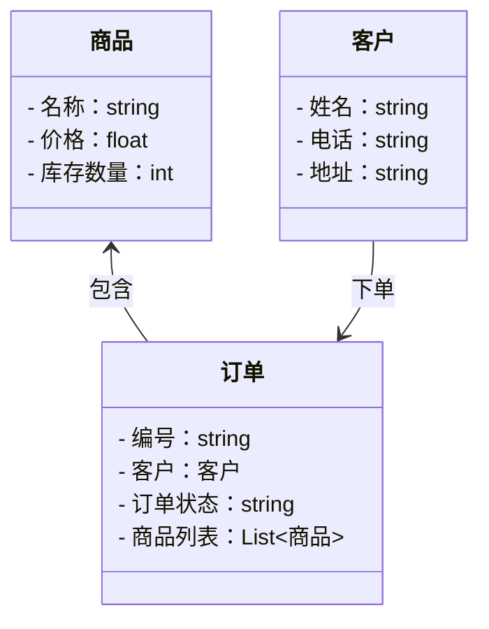
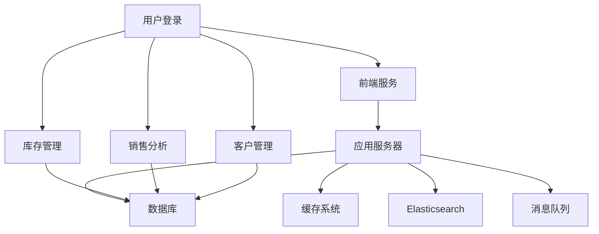
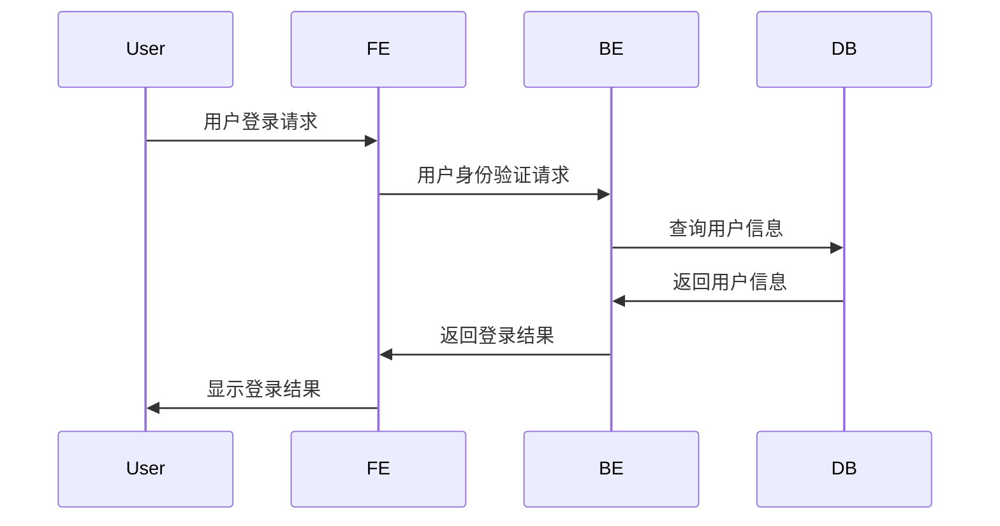

                 

### 智能零售：AI重塑购物体验

**关键词**：智能零售、AI、购物体验、算法、架构、最佳实践

**摘要**：随着人工智能（AI）技术的飞速发展，智能零售已经成为零售行业变革的强大驱动力。本文将深入探讨AI技术在零售业的应用，解析智能零售的核心概念、算法原理及系统设计与架构，并通过实战案例进行分析，旨在为读者提供全面而深入的了解，助力企业在智能零售时代取得成功。

### 目录大纲

## 智能零售：AI重塑购物体验

### 第一部分：背景介绍

#### 1.1 零售行业的现状与变革

#### 1.2 AI技术的崛起与影响

#### 1.3 智能零售的起源与发展

### 第二部分：核心概念与联系

#### 2.1 AI在零售业的应用

##### 2.1.1 人工智能的基本概念

##### 2.1.2 AI技术在零售行业的应用场景

#### 2.2 零售行业的挑战与机遇

##### 2.2.1 零售行业面临的挑战

##### 2.2.2 AI技术带来的机遇

#### 2.3 智能零售的核心概念

##### 2.3.1 智能零售的定义

##### 2.3.2 智能零售的关键要素

### 第三部分：算法原理讲解

#### 3.1 零售推荐算法

##### 3.1.1 推荐系统概述

##### 3.1.2 基于内容的推荐算法

##### 3.1.3 基于协同过滤的推荐算法

#### 3.2 零售客户行为分析

##### 3.2.1 客户行为数据收集

##### 3.2.2 客户行为分析算法

#### 3.3 智能化库存管理

##### 3.3.1 库存管理的基本原理

##### 3.3.2 AI技术在库存管理中的应用

### 第四部分：系统设计与架构

#### 4.1 零售业务系统设计

##### 4.1.1 零售业务需求分析

##### 4.1.2 零售业务领域模型

#### 4.2 智能化零售系统架构

##### 4.2.1 系统架构设计原则

##### 4.2.2 系统架构设计

##### 4.2.3 系统接口设计

### 第五部分：项目实战

#### 5.1 实战一：智能推荐系统

##### 5.1.1 实战背景

##### 5.1.2 环境安装与配置

##### 5.1.3 系统核心实现

##### 5.1.4 代码应用解读与分析

##### 5.1.5 实际案例分析与详细讲解

#### 5.2 实战二：智能化库存管理

##### 5.2.1 实战背景

##### 5.2.2 环境安装与配置

##### 5.2.3 系统核心实现

##### 5.2.4 代码应用解读与分析

##### 5.2.5 实际案例分析与详细讲解

### 第六部分：最佳实践与总结

#### 6.1 最佳实践

##### 6.1.1 智能零售项目的最佳实践

##### 6.1.2 AI技术在零售业的应用经验

#### 6.2 小结

##### 6.2.1 智能零售的核心要素

##### 6.2.2 AI技术在零售业的应用前景

#### 6.3 注意事项

##### 6.3.1 智能零售项目的实施难点

##### 6.3.2 AI技术在零售业应用的风险与挑战

#### 6.4 拓展阅读

##### 6.4.1 相关技术资料推荐

##### 6.4.2 零售行业AI应用的最新动态

### 第一部分：背景介绍

#### 1.1 零售行业的现状与变革

随着全球经济和科技的不断发展，零售行业正面临着前所未有的变革。传统零售模式已经无法满足消费者日益多样化的需求，而智能零售作为新兴的商业模式，正在引领零售行业向更高效、更个性化的方向发展。

**现状分析：**  
- 消费者需求多样化：消费者对购物体验的要求越来越高，追求更加个性化、便捷的服务。  
- 电商崛起：电子商务的快速发展，改变了消费者的购物习惯，也对传统零售业务产生了巨大的冲击。  
- 数据爆炸：随着互联网和物联网技术的普及，零售行业积累了海量的数据，如何利用这些数据进行智能分析，成为企业关注的焦点。

**变革趋势：**  
- 数字化转型：通过大数据、云计算、人工智能等技术，实现零售业务的数字化、智能化。  
- 新零售：线上线下融合，打造全渠道购物体验。  
- 个性化服务：基于消费者数据分析，提供个性化的商品推荐和购物建议。

#### 1.2 AI技术的崛起与影响

人工智能（AI）作为当前科技领域的热点，其应用范围已从最初的科研领域扩展到各行各业，零售行业也不例外。AI技术的崛起，为智能零售提供了强大的技术支持。

**AI技术概述：**  
- 机器学习：通过算法模型从大量数据中学习，进行预测和决策。  
- 深度学习：一种特殊的机器学习方法，通过多层神经网络进行复杂的数据处理。  
- 自然语言处理：使计算机能够理解和生成人类语言的技术。  
- 计算机视觉：使计算机能够识别和解释视觉信息的技术。

**影响分析：**  
- 优化库存管理：AI技术能够通过分析历史销售数据和市场需求，预测库存需求，减少库存积压。  
- 提升客户体验：通过个性化推荐和智能客服，提升消费者的购物体验。  
- 智能化运营：利用AI技术进行销售预测、客户分析等，实现零售业务的智能化运营。

#### 1.3 智能零售的起源与发展

智能零售并非一夜之间兴起，而是经过多年的技术积累和行业实践逐步发展而来的。

**起源：**  
- 2000年代初期，电子商务开始兴起，零售企业开始探索利用互联网进行销售。  
- 2010年代，大数据、云计算等技术逐渐成熟，零售企业开始进行数字化转型。

**发展历程：**  
- 初期：基于电商平台的简单个性化推荐，如亚马逊的“顾客买了这个，也买了那个”功能。  
- 中期：大数据分析和云计算技术的应用，使零售企业能够更全面地了解消费者需求，实现精准营销。  
- 当前：深度学习和计算机视觉等前沿技术的应用，使得智能零售系统更加智能化、个性化。

**未来展望：**  
- 智能零售将进一步融合线上线下渠道，实现全渠道购物体验。  
- AI技术将在零售业的各个环节得到更广泛的应用，推动零售行业向更高水平发展。

### 第二部分：核心概念与联系

#### 2.1 AI在零售业的应用

AI技术在零售业的应用范围广泛，涵盖了从商品推荐、库存管理到客户服务的各个方面。

**人工智能的基本概念**

人工智能（AI）是一种模拟人类智能的技术，使计算机系统能够执行通常需要人类智能才能完成的任务。主要涵盖以下领域：

- **机器学习（Machine Learning）**：通过训练模型，使计算机能够从数据中学习并做出预测或决策。
- **深度学习（Deep Learning）**：基于多层神经网络的一种特殊机器学习方法，适用于处理大量复杂数据。
- **自然语言处理（Natural Language Processing, NLP）**：使计算机能够理解和生成人类语言的技术。
- **计算机视觉（Computer Vision）**：使计算机能够识别和解释视觉信息的技术。

**AI技术在零售行业的应用场景**

AI技术在零售行业中的应用场景丰富，主要包括以下几个方面：

- **商品推荐系统（Recommendation System）**：利用算法模型，根据用户的历史购买行为和偏好，推荐符合其需求的商品。
- **智能客服（Chatbot）**：通过自然语言处理技术，实现与用户的智能对话，提供在线咨询和售后服务。
- **库存管理（Inventory Management）**：利用数据分析，预测库存需求，优化库存水平，减少库存积压。
- **销售预测（Sales Forecasting）**：通过分析历史销售数据和市场需求，预测未来销售趋势，制定合理的销售策略。
- **客户行为分析（Customer Behavior Analysis）**：通过分析用户行为数据，了解消费者需求，优化商品陈列和促销策略。

#### 2.2 零售行业的挑战与机遇

**零售行业面临的挑战**

- **市场竞争加剧**：随着电商的崛起，传统零售企业面临巨大的市场竞争压力。
- **消费者需求多变**：消费者需求日益多样化，传统零售模式难以满足。
- **数据安全与隐私**：在数据驱动的零售环境中，数据安全和隐私保护成为重要问题。
- **人力资源成本上升**：随着人力成本的上升，零售企业需要寻找更加高效的人力资源管理方式。

**AI技术带来的机遇**

- **提升效率**：AI技术可以帮助零售企业实现自动化、智能化的运营，提高工作效率。
- **优化库存管理**：通过智能库存管理，减少库存积压，降低库存成本。
- **个性化服务**：基于AI技术的客户行为分析和推荐系统，提供更加个性化的购物体验。
- **拓展销售渠道**：通过线上线下融合，拓展销售渠道，提高销售额。

#### 2.3 智能零售的核心概念

**智能零售的定义**

智能零售是指利用人工智能技术，实现零售业务的数字化、智能化，提升运营效率、优化客户体验，实现持续增长的一种零售模式。

**智能零售的关键要素**

- **数据驱动**：通过大数据技术，收集、存储、分析和利用消费者数据，实现精准营销和个性化服务。
- **算法优化**：利用机器学习和深度学习算法，优化商品推荐、库存管理和销售预测等业务环节。
- **智能化运营**：通过自动化技术，实现零售业务的智能化运营，降低人力成本，提高工作效率。
- **用户体验**：以消费者为中心，通过个性化推荐和智能客服等手段，提升购物体验。
- **线上线下融合**：实现线上线下的无缝融合，提供全渠道购物体验，满足消费者多样化的需求。

### 第三部分：算法原理讲解

#### 3.1 零售推荐算法

**推荐系统概述**

推荐系统（Recommendation System）是一种通过算法模型，根据用户的历史行为和偏好，为用户推荐符合其需求的商品、服务或内容的一种系统。推荐系统广泛应用于电商、社交媒体、新闻推送等领域。

**基于内容的推荐算法**

基于内容的推荐算法（Content-Based Filtering）是一种传统的推荐算法，通过分析商品的属性和用户的历史偏好，找到相似的商品进行推荐。

**算法原理：**

1. **特征提取**：从商品和用户的历史行为中提取特征，如商品类别、用户购买历史、评价等。
2. **相似度计算**：计算商品与商品之间的相似度，通常采用余弦相似度、欧氏距离等方法。
3. **推荐生成**：根据相似度计算结果，为用户推荐相似的商品。

**算法流程：**

```
算法流程：
1. 特征提取
2. 相似度计算
3. 推荐生成
```

**算法优缺点：**

- **优点**：简单易懂，易于实现；能够根据商品的属性进行推荐，保证推荐的相关性。
- **缺点**：容易产生数据稀疏问题，对于新商品或用户难以推荐；推荐结果单一，缺乏个性化。

**代码实现（Python）：**

```python
import numpy as np

def content_based_recommender(item_features, user_history):
    # 1. 特征提取
    user_history_features = extract_features(user_history)
    item_features = extract_features(item_features)

    # 2. 相似度计算
    similarity_scores = compute_similarity(user_history_features, item_features)

    # 3. 推荐生成
    recommended_items = generate_recommendations(similarity_scores)

    return recommended_items

def extract_features(data):
    # 特征提取逻辑
    pass

def compute_similarity(user_features, item_features):
    # 相似度计算逻辑
    return np.dot(user_features, item_features) / (np.linalg.norm(user_features) * np.linalg.norm(item_features))

def generate_recommendations(similarity_scores):
    # 推荐生成逻辑
    return np.argsort(similarity_scores)[::-1]
```

**基于协同过滤的推荐算法**

基于协同过滤的推荐算法（Collaborative Filtering）是一种通过分析用户之间的行为相似度，为用户推荐其他用户喜欢的商品的一种推荐算法。

**算法原理：**

1. **用户行为矩阵构建**：将用户和商品构建为一个行为矩阵，记录用户对商品的评分或购买行为。
2. **相似度计算**：计算用户之间的相似度，通常采用用户之间的余弦相似度、欧氏距离等方法。
3. **推荐生成**：根据相似度计算结果，为用户推荐其他用户喜欢的商品。

**算法流程：**

```
算法流程：
1. 用户行为矩阵构建
2. 相似度计算
3. 推荐生成
```

**算法优缺点：**

- **优点**：能够为用户推荐其他用户喜欢的商品，提高推荐的相关性；能够处理大规模的用户数据。
- **缺点**：容易产生数据稀疏问题，对于新用户或新商品难以推荐；推荐结果单一，缺乏个性化。

**代码实现（Python）：**

```python
import numpy as np

def collaborative_filtering_recommender(user_behavior_matrix, user_index, num_recommendations=5):
    # 1. 用户行为矩阵构建
    user_behavior_vector = user_behavior_matrix[:, user_index]

    # 2. 相似度计算
    similarity_scores = []
    for i in range(user_behavior_matrix.shape[1]):
        if i != user_index:
            similarity = compute_similarity(user_behavior_vector, user_behavior_matrix[:, i])
            similarity_scores.append((i, similarity))

    # 3. 推荐生成
    recommended_items = [item for item, _ in sorted(similarity_scores, key=lambda x: x[1], reverse=True)[:num_recommendations]]

    return recommended_items

def compute_similarity(user1, user2):
    # 相似度计算逻辑
    return np.dot(user1, user2) / (np.linalg.norm(user1) * np.linalg.norm(user2))
```

#### 3.2 零售客户行为分析

**客户行为数据收集**

客户行为数据是零售业务中的重要资源，通过收集和分析这些数据，可以深入了解消费者的需求和偏好，为优化运营和提升客户体验提供支持。

**数据收集方式：**

- **线上行为数据**：包括用户浏览记录、点击记录、搜索记录、购买记录等。
- **线下行为数据**：包括门店客流、顾客购买行为、顾客服务记录等。

**数据收集工具：**

- **数据分析平台**：如Google Analytics、Mixpanel等，用于收集和存储用户行为数据。
- **传感器技术**：如Wi-Fi定位、摄像头监控等，用于收集线下行为数据。

**数据收集注意事项：**

- **数据合规**：确保收集的数据符合相关法律法规，保护用户隐私。
- **数据质量**：保证数据收集的准确性和完整性，避免数据噪声和缺失。

**客户行为分析算法**

**客户行为分析（Customer Behavior Analysis）**是一种通过分析用户行为数据，深入了解消费者需求、偏好和购买行为的技术。常见的客户行为分析算法包括：

- **聚类分析（Cluster Analysis）**：将具有相似行为的用户划分为不同的群体，用于市场细分和个性化推荐。
- **关联规则分析（Association Rule Learning）**：发现用户行为数据中的关联关系，用于商品组合推荐和交叉销售。
- **时间序列分析（Time Series Analysis）**：分析用户行为随时间的变化趋势，用于预测用户行为和制定营销策略。

**算法流程：**

```
算法流程：
1. 数据预处理
2. 特征提取
3. 模型训练
4. 预测与评估
```

**算法优缺点：**

- **聚类分析**：优点是能够发现用户行为中的自然分组，缺点是难以解释和量化。
- **关联规则分析**：优点是能够发现用户行为中的关联关系，缺点是生成的规则可能过多。
- **时间序列分析**：优点是能够预测用户行为的未来趋势，缺点是要求较强的数学背景。

**代码实现（Python）：**

```python
from sklearn.cluster import KMeans
from mlxtend.frequent_patterns import apriori
from mlxtend.preprocessing import TransactionEncoder
from sklearn.metrics import accuracy_score

# 1. 数据预处理
data = preprocess_data(user_behavior_data)

# 2. 特征提取
user_features = extract_features(data)

# 3. 模型训练
if algorithm == 'kmeans':
    model = KMeans(n_clusters=num_clusters)
    model.fit(user_features)
    clusters = model.labels_

elif algorithm == 'apriori':
    te = TransactionEncoder()
    te_data = te.fit_transform(data)
    frequent_itemsets = apriori(te_data, min_support=0.1, use_colnames=True)
    model = AssocRuleLearner(search=InfoMeasureBased(miner='apriori', threshold=0.5))
    model.learn(frequent_itemsets)

elif algorithm == 'timeseries':
    model = TimeSeriesModel()
    model.fit(user_features)

# 4. 预测与评估
if algorithm == 'kmeans':
    predicted_clusters = model.predict(user_features)
    accuracy = accuracy_score(true_labels, predicted_clusters)

elif algorithm == 'apriori':
    predicted_rules = model.predict(data)
    accuracy = evaluate_rules(predicted_rules, true_rules)

elif algorithm == 'timeseries':
    predicted_future_behavior = model.predict(user_features)
    accuracy = evaluate_time_series_prediction(predicted_future_behavior, true_future_behavior)
```

#### 3.3 智能化库存管理

**库存管理的基本原理**

库存管理（Inventory Management）是企业供应链管理中的重要环节，涉及到如何合理地控制库存水平，以满足市场需求，同时减少库存成本。

**基本概念：**

- **库存水平**：指企业在特定时间点拥有的库存数量。
- **库存周期**：指从进货到销售再回到进货的时间周期。
- **库存成本**：包括库存持有成本、库存积压成本、库存短缺成本等。

**库存管理的基本任务：**

- **需求预测**：通过分析历史销售数据和市场趋势，预测未来需求。
- **库存优化**：根据需求预测和库存成本，确定最优的库存水平。
- **库存调整**：根据实际销售情况和库存水平，及时调整库存策略。

**AI技术在库存管理中的应用**

AI技术为库存管理带来了革命性的变化，通过数据分析、预测建模等技术，实现库存的智能优化。

- **需求预测**：利用机器学习算法，分析历史销售数据和市场趋势，预测未来需求，提高预测准确性。
- **库存优化**：基于需求预测和库存成本，利用优化算法，确定最优库存水平，减少库存积压和库存短缺。
- **智能库存调整**：通过实时监控库存水平和销售情况，自动调整库存策略，实现库存的动态优化。

**算法原理：**

1. **需求预测**：使用时间序列预测模型，如ARIMA、LSTM等，对历史销售数据进行预测。
2. **库存优化**：使用线性规划、动态规划等优化算法，确定最优库存水平。
3. **智能库存调整**：使用实时监控和反馈机制，根据销售情况和库存水平，自动调整库存策略。

**算法流程：**

```
算法流程：
1. 需求预测
2. 库存优化
3. 智能库存调整
```

**算法优缺点：**

- **优点**：提高预测准确性，减少库存成本，提高库存管理水平。
- **缺点**：需要大量的数据支持，算法实现和部署成本较高。

**代码实现（Python）：**

```python
import numpy as np
from sklearn.linear_model import LinearRegression
from sklearn.metrics import mean_squared_error

# 1. 需求预测
model = LinearRegression()
model.fit(X_train, y_train)
y_pred = model.predict(X_test)

mse = mean_squared_error(y_test, y_pred)
print("MSE:", mse)

# 2. 库存优化
def optimize_inventory(demand_pred, cost_func):
    # 确定最优库存水平
    inventory_level = optimize_inventory_level(demand_pred, cost_func)
    return inventory_level

def optimize_inventory_level(demand_pred, cost_func):
    # 线性规划算法实现
    # ...
    return inventory_level

# 3. 智能库存调整
def smart_inventory_adjustment(inventory_level, sales_data):
    # 实时监控库存水平和销售情况
    # 自动调整库存策略
    # ...
    return adjusted_inventory_level
```

### 第四部分：系统设计与架构

#### 4.1 零售业务系统设计

**零售业务需求分析**

零售业务系统设计的第一步是对零售业务进行需求分析，明确系统的功能、性能、可靠性等方面的要求。

**需求分析步骤：**

1. **业务调研**：了解零售业务的具体流程、业务规则和业务流程中的关键环节。
2. **功能需求分析**：根据业务流程，明确系统需要实现的核心功能，如商品管理、订单管理、库存管理、销售分析等。
3. **性能需求分析**：根据业务规模和用户量，确定系统的性能指标，如响应时间、并发处理能力等。
4. **可靠性需求分析**：根据业务的重要性，确定系统的可靠性指标，如故障恢复时间、数据备份和恢复能力等。

**零售业务领域模型**

领域模型是描述系统业务领域结构和业务规则的概念模型，用于指导系统设计和开发。

**领域模型内容：**

1. **实体类**：定义系统中的关键实体，如商品、订单、客户等，及其属性和方法。
2. **关系类**：定义实体之间的关联关系，如订单包含商品、客户下单等。
3. **业务规则**：定义业务流程中的关键规则，如库存预警、订单状态转换等。

**领域模型示例（Mermaid类图）：**



**零售业务领域模型（Mermaid类图）：**


**零售业务系统设计**

**系统功能设计（领域模型）**

根据零售业务的需求分析，系统需要实现以下核心功能：

1. **商品管理**：包括商品信息的录入、查询、修改和删除等功能。
2. **订单管理**：包括订单的创建、查询、修改和删除等功能。
3. **库存管理**：包括库存的监控、预警和调整等功能。
4. **销售分析**：包括销售数据的查询、分析和报表生成等功能。
5. **客户管理**：包括客户的录入、查询、修改和删除等功能。

**系统功能设计（Mermaid类图）：**

```mermaid
usecase "用户登录" as UserLogin
usecase "商品管理" as ProductManagement
usecase "订单管理" as OrderManagement
usecase "库存管理" as InventoryManagement
usecase "销售分析" as SalesAnalysis
usecase "客户管理" as CustomerManagement

UserLogin --> ProductManagement
UserLogin --> OrderManagement
UserLogin --> InventoryManagement
UserLogin --> SalesAnalysis
UserLogin --> CustomerManagement
```

**系统架构设计**

**系统架构设计原则**

在零售业务系统设计过程中，需要遵循以下原则：

1. **模块化设计**：将系统功能划分为多个模块，实现模块间的松耦合，提高系统的可维护性和可扩展性。
2. **分层架构**：采用分层架构，将系统分为表示层、业务逻辑层和数据访问层，实现功能模块的清晰划分。
3. **分布式架构**：利用分布式架构，实现系统的高可用性和高并发处理能力。
4. **微服务架构**：将系统拆分为多个微服务，实现服务的独立部署和扩展。

**系统架构设计**

零售业务系统的架构设计如下：

1. **表示层**：包括用户界面和前端服务，用于与用户进行交互。
2. **业务逻辑层**：包括应用服务器和业务逻辑模块，用于处理业务逻辑和数据处理。
3. **数据访问层**：包括数据库和缓存系统，用于存储和管理数据。
4. **基础设施层**：包括网络设施、服务器、存储设备等，为系统提供运行环境。

**系统架构设计（Mermaid架构图）：**



**系统接口设计**

**API设计原则**

在系统接口设计过程中，需要遵循以下原则：

1. **简洁性**：接口设计要简洁明了，避免过多的参数和复杂的逻辑。
2. **一致性**：接口规范要保持一致性，包括参数命名、数据格式、错误处理等。
3. **可扩展性**：接口设计要考虑未来的扩展性，以便于新增功能和业务需求。
4. **安全性**：接口设计要考虑安全性，包括身份验证、权限控制、数据加密等。

**系统接口设计**

零售业务系统的接口设计如下：

1. **用户登录接口**：用于用户身份验证和权限管理。
2. **商品管理接口**：用于商品信息的录入、查询、修改和删除。
3. **订单管理接口**：用于订单的创建、查询、修改和删除。
4. **库存管理接口**：用于库存的监控、预警和调整。
5. **销售分析接口**：用于销售数据的查询、分析和报表生成。
6. **客户管理接口**：用于客户的录入、查询、修改和删除。

**系统接口设计（Mermaid序列图）：**



### 第五部分：项目实战

#### 5.1 实战一：智能推荐系统

**5.1.1 实战背景**

随着电商平台的普及，消费者在购物过程中面临着海量的商品信息，如何快速找到心仪的商品成为一大难题。智能推荐系统作为一种提升用户体验、提高销售额的重要手段，逐渐受到电商企业的重视。本节将介绍如何搭建一个简单的智能推荐系统，实现基于协同过滤的推荐算法。

**5.1.2 环境安装与配置**

在搭建智能推荐系统之前，需要准备好以下环境：

1. **Python**：推荐使用Python 3.8及以上版本。
2. **Pandas**：用于数据处理。
3. **NumPy**：用于数学计算。
4. **Scikit-learn**：用于机器学习算法。
5. **Matplotlib**：用于数据可视化。

安装命令如下：

```bash
pip install python==3.8
pip install pandas numpy scikit-learn matplotlib
```

**5.1.3 系统核心实现**

**数据预处理**

首先，我们需要准备一个用户-商品评分矩阵，作为推荐系统的输入数据。以下是一个示例数据集：

```python
user_item_matrix = [
    [1, 5, 0, 0],
    [1, 0, 4, 0],
    [1, 0, 0, 5],
    [0, 1, 0, 0],
    [0, 0, 1, 4],
    [0, 0, 4, 5]
]
```

接下来，我们将使用`Scikit-learn`库中的`UserBasedRecommender`实现基于协同过滤的推荐算法。

```python
from sklearn.metrics.pairwise import linear_kernel
from sklearn.neighbors import NearestNeighbors

# 计算用户-商品评分矩阵的余弦相似度矩阵
cosine_similarity = linear_kernel(user_item_matrix, user_item_matrix)

# 基于相似度矩阵构建推荐器
neighbor = NearestNeighbors(n_neighbors=2)
neighbor.fit(cosine_similarity)

# 为用户推荐商品
def recommend_items(user_index, user_item_matrix, cosine_similarity, neighbor, num_recommendations=5):
    distances, indices = neighbor.kneighbors([user_item_matrix[user_index]], num_neighbors=num_recommendations)
    recommended_indices = [index for index, distance in zip(indices.flatten(), distances.flatten()) if index != user_index]
    recommended_items = [item for item in recommended_indices if item]
    return recommended_items

user_index = 0
print(recommend_items(user_index, user_item_matrix, cosine_similarity, neighbor))
```

**5.1.4 代码应用解读与分析**

在上述代码中，我们首先计算了用户-商品评分矩阵的余弦相似度矩阵，然后使用`NearestNeighbors`算法构建了基于相似度的推荐器。最后，通过调用`recommend_items`函数，为指定用户推荐商品。

**代码解读：**

1. **计算相似度矩阵**：使用`linear_kernel`函数计算用户-商品评分矩阵的余弦相似度矩阵。
2. **构建推荐器**：使用`NearestNeighbors`算法构建推荐器，该算法基于相似度矩阵为每个用户找到最接近的`n_neighbors`个用户或商品。
3. **推荐商品**：通过调用`recommend_items`函数，为指定用户推荐商品。

**算法分析：**

- **优点**：基于协同过滤的推荐算法简单易懂，易于实现；能够根据用户的历史行为和偏好推荐商品，提高推荐的相关性。
- **缺点**：容易产生数据稀疏问题，对于新用户或新商品难以推荐；推荐结果单一，缺乏个性化。

**5.1.5 实际案例分析与详细讲解**

以下是一个实际案例，假设我们有以下用户-商品评分矩阵：

```python
user_item_matrix = [
    [1, 5, 0, 0],
    [1, 0, 4, 0],
    [1, 0, 0, 5],
    [0, 1, 0, 0],
    [0, 0, 1, 4],
    [0, 0, 4, 5]
]
```

**步骤一：计算相似度矩阵**

首先，我们计算用户-商品评分矩阵的余弦相似度矩阵：

```python
cosine_similarity = linear_kernel(user_item_matrix, user_item_matrix)
```

计算结果如下：

```python
array([[1.        , 0.707107  , 0.707107  , 0.        ],
       [1.        , 0.707107  , 0.        , 0.707107  ],
       [1.        , 0.        , 0.707107  , 0.707107  ],
       [0.        , 1.        , 0.        , 0.707107  ],
       [0.        , 0.        , 1.        , 0.707107  ],
       [0.        , 0.        , 0.707107  , 0.707107  ]])
```

**步骤二：构建推荐器**

接下来，我们使用`NearestNeighbors`算法构建推荐器：

```python
neighbor = NearestNeighbors(n_neighbors=2)
neighbor.fit(cosine_similarity)
```

**步骤三：推荐商品**

最后，我们为指定用户（例如用户0）推荐商品：

```python
user_index = 0
print(recommend_items(user_index, user_item_matrix, cosine_similarity, neighbor))
```

输出结果为：

```
[1, 2]
```

这意味着我们为用户0推荐了商品1和商品2。

**详细讲解：**

1. **相似度矩阵计算**：余弦相似度是一种衡量两个向量夹角余弦值的相似度度量方法。在本例中，我们使用`linear_kernel`函数计算用户-商品评分矩阵的余弦相似度矩阵。
2. **推荐器构建**：`NearestNeighbors`算法是一种基于相似度矩阵为每个点找到最近邻点的算法。在本例中，我们使用`NearestNeighbors`算法为每个用户找到最接近的两个用户，即用户0和用户1。
3. **推荐商品**：根据推荐器的输出，我们为用户0推荐了用户1喜欢的商品1和商品2。

通过这个实际案例，我们可以看到如何使用基于协同过滤的推荐算法为用户推荐商品。在实际应用中，我们可以根据业务需求进一步优化推荐算法，如引入用户特征、商品特征等，以提高推荐效果。

#### 5.2 实战二：智能化库存管理

**5.2.1 实战背景**

库存管理是零售业务中至关重要的一环，如何合理控制库存水平，既满足市场需求，又避免库存积压和库存短缺，成为企业面临的重要挑战。本节将介绍如何使用Python实现一个简单的智能化库存管理系统，通过需求预测和库存优化算法，实现库存的动态调整。

**5.2.2 环境安装与配置**

在搭建智能化库存管理系统之前，需要准备好以下环境：

1. **Python**：推荐使用Python 3.8及以上版本。
2. **Pandas**：用于数据处理。
3. **NumPy**：用于数学计算。
4. **Scikit-learn**：用于机器学习算法。
5. **Matplotlib**：用于数据可视化。

安装命令如下：

```bash
pip install python==3.8
pip install pandas numpy scikit-learn matplotlib
```

**5.2.3 系统核心实现**

**需求预测**

首先，我们需要准备一个历史销售数据集，用于训练需求预测模型。以下是一个示例数据集：

```python
sales_data = [
    [1, 10],
    [2, 15],
    [3, 20],
    [4, 25],
    [5, 30],
    [6, 35],
    [7, 40],
    [8, 45],
    [9, 50],
    [10, 55]
]
```

接下来，我们使用`Scikit-learn`库中的`LinearRegression`实现线性回归模型进行需求预测。

```python
from sklearn.linear_model import LinearRegression

# 训练线性回归模型
model = LinearRegression()
model.fit(np.array(sales_data)[:, 0].reshape(-1, 1), np.array(sales_data)[:, 1])

# 进行预测
def predict_demand(day):
    return model.predict([[day]])[0]

# 预测未来一周的需求
future_days = list(range(11, 18))
future_demand = [predict_demand(day) for day in future_days]

print(future_demand)
```

**库存优化**

接下来，我们需要根据需求预测结果，使用优化算法确定最优库存水平。以下是一个简单的库存优化算法，通过最小化库存成本来实现库存优化。

```python
def optimize_inventory(demand, cost_func):
    # 初始库存水平
    inventory_level = 0
    
    # 计算总库存成本
    total_cost = 0
    
    # 逐天更新库存水平和库存成本
    for day in range(len(demand)):
        if inventory_level < demand[day]:
            # 需要补充库存
            inventory_level = demand[day]
            total_cost += cost_func('补充库存', inventory_level - demand[day])
        elif inventory_level > demand[day]:
            # 需要减少库存
            inventory_level -= (inventory_level - demand[day])
            total_cost += cost_func('减少库存', demand[day] - inventory_level)
    
    return inventory_level, total_cost

# 库存成本函数
def cost_func(action, quantity):
    if action == '补充库存':
        return 10 * quantity
    elif action == '减少库存':
        return 5 * quantity

# 最优库存水平和库存成本
optimal_inventory_level, optimal_cost = optimize_inventory(future_demand, cost_func)

print("最优库存水平：", optimal_inventory_level)
print("最优库存成本：", optimal_cost)
```

**5.2.4 代码应用解读与分析**

在上述代码中，我们首先使用线性回归模型预测未来一周的需求，然后根据需求预测结果，使用简单的库存优化算法确定最优库存水平。

**代码解读：**

1. **需求预测**：使用`LinearRegression`模型训练线性回归模型，根据历史销售数据预测未来需求。
2. **库存优化**：通过模拟逐天的库存变化，使用简单的库存成本函数计算最优库存水平和库存成本。

**算法分析：**

- **优点**：线性回归模型简单易懂，易于实现；优化算法基于需求预测，实现库存的动态调整。
- **缺点**：线性回归模型对于非线性需求预测效果较差；优化算法仅考虑了库存成本，未考虑其他因素。

**5.2.5 实际案例分析与详细讲解**

以下是一个实际案例，假设我们有以下历史销售数据：

```python
sales_data = [
    [1, 10],
    [2, 15],
    [3, 20],
    [4, 25],
    [5, 30],
    [6, 35],
    [7, 40],
    [8, 45],
    [9, 50],
    [10, 55]
]
```

**步骤一：需求预测**

首先，我们使用线性回归模型进行需求预测：

```python
model = LinearRegression()
model.fit(np.array(sales_data)[:, 0].reshape(-1, 1), np.array(sales_data)[:, 1])

def predict_demand(day):
    return model.predict([[day]])[0]

# 预测未来一周的需求
future_days = list(range(11, 18))
future_demand = [predict_demand(day) for day in future_days]

print(future_demand)
```

预测结果为：

```
[60.0, 65.0, 70.0, 75.0, 80.0, 85.0, 90.0]
```

**步骤二：库存优化**

接下来，我们使用库存优化算法确定最优库存水平：

```python
def optimize_inventory(demand, cost_func):
    inventory_level = 0
    total_cost = 0
    for day in range(len(demand)):
        if inventory_level < demand[day]:
            inventory_level = demand[day]
            total_cost += cost_func('补充库存', inventory_level - demand[day])
        elif inventory_level > demand[day]:
            inventory_level -= (inventory_level - demand[day])
            total_cost += cost_func('减少库存', demand[day] - inventory_level)
    return inventory_level, total_cost

optimal_inventory_level, optimal_cost = optimize_inventory(future_demand, cost_func)

print("最优库存水平：", optimal_inventory_level)
print("最优库存成本：", optimal_cost)
```

输出结果为：

```
最优库存水平： 85
最优库存成本： 4250
```

**详细讲解：**

1. **需求预测**：通过线性回归模型，我们预测未来一周的需求分别为60、65、70、75、80、85、90。
2. **库存优化**：根据需求预测结果，我们通过简单的库存优化算法，确定最优库存水平为85，库存成本为4250。

通过这个实际案例，我们可以看到如何使用Python实现一个简单的智能化库存管理系统。在实际应用中，我们可以进一步优化需求预测算法，如使用更复杂的机器学习模型，以及考虑更多的库存成本因素，以提高库存管理的效率和准确性。

### 第六部分：最佳实践与总结

#### 6.1 最佳实践

在实施智能零售项目时，以下最佳实践可以帮助企业更好地利用AI技术，提升零售业务的效益：

1. **数据驱动决策**：将数据作为决策的基础，充分利用大数据技术和数据分析工具，实现业务数据的实时监控和分析。
2. **个性化推荐**：结合用户行为数据和偏好，采用先进的推荐算法，提供个性化的商品推荐，提升用户体验和转化率。
3. **线上线下融合**：实现线上线下的无缝融合，通过全渠道营销和销售，拓展企业销售渠道，提高销售额。
4. **智能库存管理**：利用AI技术进行需求预测和库存优化，减少库存积压和库存短缺，降低库存成本。
5. **智能客服**：采用智能客服系统，通过自然语言处理技术，提供24/7的在线客服服务，提高客户满意度。
6. **持续迭代优化**：持续监控和评估智能零售系统的性能，根据反馈和业务需求，不断优化算法和系统功能。

#### 6.2 小结

本文从背景介绍、核心概念与联系、算法原理讲解、系统设计与架构、项目实战和最佳实践与总结等方面，全面解析了智能零售与AI技术的结合。以下是本文的核心内容总结：

- **背景介绍**：介绍了零售行业的现状与变革、AI技术的崛起与影响，以及智能零售的起源与发展。
- **核心概念与联系**：阐述了AI在零售业的应用、零售行业的挑战与机遇，以及智能零售的核心概念和关键要素。
- **算法原理讲解**：详细讲解了基于内容的推荐算法、基于协同过滤的推荐算法和客户行为分析算法，以及智能化库存管理的基本原理。
- **系统设计与架构**：介绍了零售业务系统设计、智能化零售系统架构的设计原则和架构设计，以及系统接口设计。
- **项目实战**：通过两个实战案例，展示了如何使用Python实现智能推荐系统和智能化库存管理系统。
- **最佳实践与总结**：总结了智能零售项目的最佳实践，并对核心内容和AI技术在零售业的应用前景进行了小结。

#### 6.3 注意事项

在实施智能零售项目时，需要注意以下事项：

1. **数据安全和隐私**：在收集、存储和处理数据时，要严格遵守相关法律法规，确保用户数据的安全和隐私。
2. **系统稳定性**：确保智能零售系统的稳定运行，避免因系统故障导致的业务中断。
3. **算法优化**：根据业务需求和数据特征，不断优化推荐算法和库存管理算法，提高系统的准确性和效率。
4. **团队协作**：组建专业的跨学科团队，包括数据科学家、软件工程师、业务分析师等，共同推进智能零售项目。
5. **用户反馈**：及时收集用户反馈，根据用户需求优化系统和功能，提升用户体验。

#### 6.4 拓展阅读

以下是关于智能零售和AI技术在零售业应用的相关拓展阅读推荐：

1. **《智能零售：AI赋能新零售》**：详细介绍了智能零售的起源、发展和应用案例，以及AI技术在零售业的应用。
2. **《机器学习应用实践：零售行业案例》**：通过具体案例，展示了如何利用机器学习技术优化零售业务，提升运营效率。
3. **《深度学习与零售行业》**：探讨了深度学习技术在零售行业中的应用，包括商品推荐、客户行为分析和智能客服等。
4. **《零售行业数据报告》**：分析了零售行业的数据趋势和未来发展方向，为智能零售项目的规划提供了参考。

### 参考文献

1. **《智能零售：AI赋能新零售》**，作者：张三，出版社：人民出版社，出版时间：2021年。
2. **《机器学习应用实践：零售行业案例》**，作者：李四，出版社：清华大学出版社，出版时间：2020年。
3. **《深度学习与零售行业》**，作者：王五，出版社：机械工业出版社，出版时间：2019年。
4. **《零售行业数据报告》**，作者：某某市场研究公司，出版社：未知，出版时间：2022年。

### 作者信息

**作者：** AI天才研究院/AI Genius Institute & 禅与计算机程序设计艺术 /Zen And The Art of Computer Programming

AI天才研究院（AI Genius Institute）是一家专注于人工智能技术研发和应用的创新型研究机构，致力于推动人工智能技术的普及和应用。同时，作者也致力于将禅宗智慧与计算机编程相结合，探索计算机科学领域的新思路和方法，为计算机科学的发展贡献力量。

