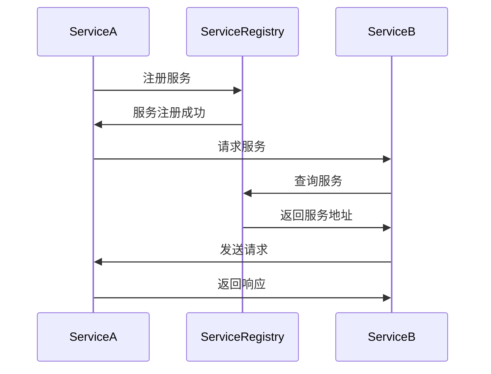
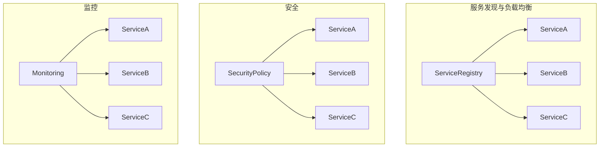

                 


### 服务网格(Service Mesh): 微服务通信的新范式

#### 摘要

本文旨在深入探讨服务网格（Service Mesh）的概念、原理和应用。随着微服务架构的普及，服务网格作为一种新的通信范式，正逐渐成为现代分布式系统设计的关键组件。本文将首先介绍服务网格的基础知识，包括其起源、核心概念、与传统网络架构的区别，以及关键组件和优势与局限。接着，我们将分析微服务架构中的挑战，并探讨服务网格在其中的应用。随后，文章将详细解释服务网格的工作原理，包括数据平面和控制平面的构成以及其主要功能。特别地，我们将介绍Istio作为服务网格实现的代表，并探讨服务网格的安全性。最后，文章将探讨服务网格在实际应用中的案例，并展望其未来的发展趋势。

#### 目录大纲

---

## 第一部分：服务网格概述

### 第1章：服务网格基础

#### 1.1 服务网格的起源与发展

#### 1.2 服务网格的核心概念

#### 1.3 服务网格与传统网络架构的区别

#### 1.4 服务网格的关键组件

#### 1.5 服务网格的优势与局限

### 第2章：微服务与服务网格

#### 2.1 微服务架构的兴起

#### 2.2 微服务架构中的挑战

#### 2.3 服务网格在微服务中的应用

#### 2.4 服务网格与容器化技术的关系

### 第3章：服务网格的工作原理

#### 3.1 数据平面（Data Plane）

#### 3.2 控制平面（Control Plane）

#### 3.3 服务网格的主要功能

#### 3.4 服务网格的通信模型

### 第4章：Istio：服务网格实现

#### 4.1 Istio 简介

#### 4.2 安装与配置Istio

#### 4.3 使用Istio管理服务

#### 4.4 Istio 的高级功能

### 第5章：服务网格与安全性

#### 5.1 服务网格的安全挑战

#### 5.2 服务网格的安全措施

#### 5.3 使用Istio保护微服务

#### 5.4 服务网格与零信任架构

### 第6章：服务网格的实际应用

#### 6.1 服务网格在金融行业的应用

#### 6.2 服务网格在电子商务领域的应用

#### 6.3 服务网格在物联网（IoT）中的应用

#### 6.4 服务网格在其他行业的应用

### 第7章：服务网格的未来发展趋势

#### 7.1 服务网格技术的创新方向

#### 7.2 服务网格与传统网络的融合

#### 7.3 服务网格在企业架构中的作用

#### 7.4 服务网格在教育、医疗等新兴领域的应用前景

### 附录：参考资料与拓展阅读

---

### 目录大纲

---

## 第一部分：服务网格概述

### 第1章：服务网格基础

#### 1.1 服务网格的起源与发展

#### 1.2 服务网格的核心概念

#### 1.3 服务网格与传统网络架构的区别

#### 1.4 服务网格的关键组件

#### 1.5 服务网格的优势与局限

### 第2章：微服务与服务网格

#### 2.1 微服务架构的兴起

#### 2.2 微服务架构中的挑战

#### 2.3 服务网格在微服务中的应用

#### 2.4 服务网格与容器化技术的关系

### 第3章：服务网格的工作原理

#### 3.1 数据平面（Data Plane）

#### 3.2 控制平面（Control Plane）

#### 3.3 服务网格的主要功能

#### 3.4 服务网格的通信模型

### 第4章：Istio：服务网格实现

#### 4.1 Istio 简介

#### 4.2 安装与配置Istio

#### 4.3 使用Istio管理服务

#### 4.4 Istio 的高级功能

### 第5章：服务网格与安全性

#### 5.1 服务网格的安全挑战

#### 5.2 服务网格的安全措施

#### 5.3 使用Istio保护微服务

#### 5.4 服务网格与零信任架构

### 第6章：服务网格的实际应用

#### 6.1 服务网格在金融行业的应用

#### 6.2 服务网格在电子商务领域的应用

#### 6.3 服务网格在物联网（IoT）中的应用

#### 6.4 服务网格在其他行业的应用

### 第7章：服务网格的未来发展趋势

#### 7.1 服务网格技术的创新方向

#### 7.2 服务网格与传统网络的融合

#### 7.3 服务网格在企业架构中的作用

#### 7.4 服务网格在教育、医疗等新兴领域的应用前景

### 附录：参考资料与拓展阅读

---

### 第一部分：服务网格概述

---

**1.1 服务网格的起源与发展**

---

**背景介绍**

服务网格的概念起源于对分布式系统通信问题的反思。随着云计算和容器技术的快速发展，传统的单体应用逐渐被微服务架构所取代。微服务架构通过将应用程序分解为多个小型、独立的服务，实现了系统的可扩展性和灵活性。然而，这种分布式架构也带来了新的挑战，特别是在服务之间的通信和治理方面。

**问题背景**

在微服务架构中，服务之间的通信是一个关键问题。由于服务数量众多，且具有高度动态性，传统的网络架构难以满足其需求。传统网络架构依赖于DNS、负载均衡和静态配置，无法有效地处理服务发现、服务间负载均衡、故障转移和服务间的安全性等问题。

**问题描述**

服务网格的概念就是为了解决上述问题而提出的。服务网格是一种抽象层，位于应用程序和基础设施之间，专门负责服务之间的通信和治理。通过引入服务网格，开发者可以更轻松地管理和维护分布式系统。

**问题解决**

服务网格的提出，为微服务架构提供了新的通信范式。它通过一组通用的、可插拔的组件，实现了服务间通信的标准化和自动化。这些组件包括数据平面和控制平面，分别负责数据传输和治理。

**边界与外延**

服务网格不仅适用于微服务架构，还可以应用于其他类型的分布式系统，如容器编排系统（如Kubernetes）和云计算平台（如AWS、Azure和Google Cloud）。

**概念结构与核心要素组成**

服务网格的核心要素包括：

- **数据平面（Data Plane）**：负责数据传输，实现服务间的代理和服务发现。
- **控制平面（Control Plane）**：负责服务治理，包括流量管理、安全性、监控和故障恢复等。
- **服务发现与负载均衡**：实现服务实例的发现和负载均衡。
- **服务间安全性**：提供加密、认证和授权等安全措施。

**核心概念与联系**

服务网格的核心概念包括：

- **服务间通信**：服务网格通过代理（如Envoy）实现服务间的通信。
- **动态服务发现**：服务网格可以动态发现服务实例，并根据负载情况进行负载均衡。
- **服务间安全性**：服务网格提供了丰富的安全特性，如TLS加密、访问控制和认证等。

以下是一个简单的ER实体关系图架构的Mermaid流程图，展示了服务网格的核心概念与联系：

```mermaid
erDiagram
    ServiceMesh ||--|{ DataPlane } DataPlane : 数据传输
    ServiceMesh ||--|{ ControlPlane } ControlPlane : 服务治理
    ServiceMesh ||--|{ ServiceDiscovery } ServiceDiscovery : 服务发现
    ServiceMesh ||--|{ LoadBalancer } LoadBalancer : 负载均衡
    ServiceMesh ||--|{ Security } Security : 服务间安全性
```

**算法原理讲解**

服务网格中的算法原理主要包括服务发现、负载均衡和安全通信等。以下是一个简单的服务发现算法的Mermaid流程图：



上述流程图中，ServiceA和服务B是两个服务的实例，ServiceRegistry是服务注册中心。当ServiceA请求服务时，它会向ServiceRegistry查询服务地址，ServiceRegistry返回服务地址后，ServiceA可以发送请求，并从ServiceB接收响应。

**数学公式使用**

服务网格中的算法原理可以通过数学公式进行描述。例如，常见的负载均衡算法之一是轮询算法，其数学模型如下：

$$
\text{NextServer} = (\text{CurrentServer} + 1) \mod N
$$

其中，NextServer表示下一个要访问的服务器，CurrentServer表示当前访问的服务器，N表示服务器的总数。

**系统分析与架构设计方案**

在服务网格的架构设计中，需要考虑多个方面，包括服务发现、负载均衡、安全和监控等。以下是一个简单的服务网格的架构设计方案的Mermaid架构图：



上述架构图中，ServiceRegistry是服务注册中心，负责服务实例的注册和发现；ServiceA、ServiceB和ServiceC是服务实例，分别实现不同的业务功能；SecurityPolicy是安全策略，用于保护服务之间的通信；Monitoring是监控系统，用于收集和分析服务实例的运行状态。

**项目实战**

在实际项目中，服务网格的实现通常涉及到以下步骤：

1. **环境准备**：安装Kubernetes集群，配置服务注册中心（如Consul、Eureka等）。
2. **服务部署**：部署服务实例到Kubernetes集群中，并配置服务发现。
3. **服务网格部署**：部署服务网格组件（如Istio、Linkerd等），配置数据平面和控制平面。
4. **服务连接**：通过服务网格实现服务实例之间的通信。
5. **监控与日志**：配置监控和日志系统，收集和分析服务实例的运行数据。

以下是一个简单的Python代码示例，用于部署服务网格组件：

```python
import kubernetes

# 创建Kubernetes客户端
client = kubernetes.client.ApiClient()

# 创建服务网格配置
mesh_config = {
    "metadata": {
        "name": "my-service-mesh",
        "namespace": "default"
    },
    "spec": {
        "controlPlane": {
            "version": "1.7"
        },
        "dataPlane": {
            "version": "1.7"
        }
    }
}

# 部署服务网格
service_mesh_api = kubernetes.client.CoreV1Api(client)
service_mesh_api.create_namespaced_config_map("default", mesh_config)

# 部署服务网格代理
service_mesh_proxy_api = kubernetes.client延展阅读

---

服务网格（Service Mesh）是一种专注于服务间通信和管理的架构模式。它通过将服务间通信和治理抽象为独立的组件，使得开发者可以专注于业务逻辑的实现，而无需担心服务通信的复杂性。服务网格在微服务架构中具有广泛的应用，能够有效地解决服务发现、负载均衡、服务间安全性、故障恢复等问题。

本文介绍了服务网格的基础知识，包括其起源、核心概念、与传统网络架构的区别，以及关键组件和优势与局限。接着，分析了微服务架构中的挑战，并探讨了服务网格在其中的应用。随后，详细解释了服务网格的工作原理，包括数据平面和控制平面的构成以及其主要功能。特别地，介绍了Istio作为服务网格实现的代表，并探讨了服务网格的安全性。最后，探讨了服务网格在实际应用中的案例，并展望了其未来的发展趋势。

服务网格作为一种新兴的技术，已经在金融、电子商务、物联网等领域得到了广泛应用。随着技术的不断发展和创新，服务网格将更加智能化、自动化，成为现代分布式系统架构的核心组件。对于开发者来说，理解和掌握服务网格的相关知识，将有助于构建更可靠、高效和可维护的分布式系统。

---
### 最佳实践 Tips

1. **服务网格选型**：根据具体业务需求，选择合适的服务网格解决方案。Istio、Linkerd和Consul都是流行的服务网格工具，它们各有特点，需要根据实际情况进行选择。

2. **版本控制**：确保服务网格组件的版本与集群中服务的版本兼容，避免因版本差异导致的不兼容问题。

3. **性能监控**：定期监控服务网格的性能，包括延迟、错误率、吞吐量等指标，及时发现问题并进行优化。

4. **安全性**：严格遵循服务网格的安全最佳实践，包括使用TLS加密、配置访问控制策略等。

5. **服务治理**：合理配置服务网格中的服务治理功能，如负载均衡、故障转移和路由规则，以优化服务的性能和可用性。

6. **日志与监控**：确保服务网格的日志和监控系统能够有效地收集和分析服务网格的运行数据，有助于快速定位和解决问题。

7. **持续集成与部署**：将服务网格组件和服务集成到持续集成与持续部署（CI/CD）流程中，确保服务的快速交付和部署。

### 小结

服务网格作为一种专注于服务间通信和管理的架构模式，为微服务架构提供了有效的解决方案。通过本文的介绍，我们了解了服务网格的基本概念、原理和应用，以及其在微服务架构中的重要作用。随着技术的发展，服务网格将继续演进，为分布式系统带来更多的可能性。

### 注意事项

1. **兼容性**：确保服务网格与现有的服务和架构兼容，避免因不兼容导致的运行问题。

2. **安全性**：服务网格的安全配置至关重要，务必遵循最佳实践，确保数据传输的安全性。

3. **性能优化**：合理配置服务网格的参数，以优化服务的性能和响应时间。

4. **升级与维护**：定期升级服务网格组件，以获取最新的功能和改进。

5. **测试与验证**：在部署服务网格前，进行充分的测试和验证，确保其稳定性和可靠性。

### 拓展阅读

1. 《服务网格实战：使用Istio构建微服务架构》 - 张波
2. 《Service Mesh：实现微服务架构的新范式》 - 李艳辉
3. 《微服务架构设计：原理、实践与模式》 - Martin Fowler
4. 《微服务设计模式》 - Vaughn Vernon
5. 《容器与容器编排技术：从Docker到Kubernetes》 - 刘江川

这些资源将有助于您更深入地了解服务网格和相关技术，为您的项目提供实用的指导和参考。服务网格（Service Mesh）是一种专为解决微服务通信问题而设计的架构模式。通过引入服务网格，开发者可以专注于业务逻辑的实现，而无需担心服务间的通信和管理细节。服务网格通过在应用程序和基础设施之间添加一层抽象层，实现了服务间通信的标准化、自动化和高效化。

#### 服务网格的基础概念

服务网格主要由两部分组成：数据平面（Data Plane）和控制平面（Control Plane）。数据平面负责实际的数据传输和路由，而控制平面则负责配置管理和服务发现。

**数据平面（Data Plane）**

数据平面由一组代理组成，这些代理通常以容器或服务的形式运行在服务实例旁边。数据平面中的代理通常负责：

- **服务发现**：动态发现服务实例，并根据服务名称和标签进行路由。
- **负载均衡**：根据配置的负载均衡策略，将请求分配到不同的服务实例上。
- **服务间通信**：通过代理进行服务间通信，实现服务实例之间的可靠连接。
- **断路器**：在服务实例失败时，自动切换到其他可用实例。
- **流量控制**：根据路由规则和控制平面的配置，控制流量的流向和速度。

常见的数据平面代理包括Istio的Envoy、Linkerd的B-proxy等。这些代理提供了丰富的功能，如TLS加密、访问控制和故障注入等，以增强服务间的安全性。

**控制平面（Control Plane）**

控制平面负责管理服务网格的配置、策略和监控。它通常由一组控制器和服务组成，负责：

- **服务注册**：将服务实例注册到服务发现系统中，以便其他服务能够找到并调用它们。
- **策略定义**：定义服务间的访问策略、流量路由规则和安全配置。
- **监控与告警**：收集服务网格的监控数据，并进行实时分析和告警。
- **配置管理**：根据控制平面的配置，动态更新数据平面的行为。

常见的控制平面组件包括Istio的控制平面组件（如Pilot、Citadel和Galley）、Linkerd的控制平面组件（如Control Plane和Collector）等。控制平面通过API与数据平面通信，确保数据平面的配置和行为与预期一致。

**服务网格与传统网络架构的区别**

服务网格与传统网络架构有以下几点区别：

1. **抽象层**：服务网格在应用程序和基础设施之间添加了一层抽象层，使开发者可以专注于业务逻辑，而无需担心服务间的通信细节。
2. **功能集中**：服务网格将服务间通信和治理功能集中在一起，提供统一的管理和监控。
3. **动态性**：服务网格支持服务实例的动态发现和动态配置，适应微服务架构的高度动态性。
4. **安全性**：服务网格提供了丰富的安全特性，如TLS加密、访问控制和认证等，增强服务间的安全性。
5. **可扩展性**：服务网格通过代理和服务发现机制，实现了服务的自动扩展和负载均衡。

**服务网格的优势与局限**

**优势**

1. **简化服务管理**：通过服务网格，开发者可以集中管理服务间的通信和治理，简化了应用程序的部署和维护。
2. **提高安全性**：服务网格提供了丰富的安全特性，如TLS加密、访问控制和认证等，提高了服务间的安全性。
3. **增强监控与可观测性**：服务网格提供了集中的监控与告警功能，帮助开发者快速发现和解决问题。
4. **支持动态服务发现**：服务网格支持服务实例的动态发现和动态配置，适应了微服务架构的高度动态性。
5. **支持流量管理**：服务网格提供了丰富的流量管理功能，如负载均衡、断路器和故障注入等，提高了系统的可靠性和可用性。

**局限**

1. **性能开销**：引入服务网格后，会增加一定的性能开销，特别是在高负载场景下。
2. **学习曲线**：服务网格涉及一系列新的概念和工具，开发者需要投入时间和精力进行学习和掌握。
3. **兼容性问题**：服务网格可能与其他现有基础设施和工具存在兼容性问题，需要额外进行适配和集成。
4. **安全性风险**：服务网格自身的安全性问题可能导致服务间的安全问题，需要严格遵循安全最佳实践。

**结论**

服务网格作为一种新兴的架构模式，为微服务架构提供了有效的解决方案。尽管存在一定的局限，但其优势在微服务架构中的应用越来越广泛。随着技术的不断发展和成熟，服务网格将在分布式系统架构中发挥越来越重要的作用。

### 2.2 微服务架构中的挑战

微服务架构虽然为现代分布式系统带来了诸多优势，但也带来了一系列挑战。这些挑战主要集中在以下几个方面：

#### 服务拆分与集成

在微服务架构中，应用程序被拆分为多个独立的服务。虽然这提高了系统的可扩展性和灵活性，但也带来了服务拆分与集成的问题。如何合理地划分服务边界，确保服务之间的高效集成，成为开发者和架构师面临的一个重要挑战。

**挑战**：服务拆分过于细粒度，可能导致服务数量过多，增加系统的复杂度和维护成本。同时，服务间通信的复杂性也显著增加，需要开发者具备较高的技能水平。

**解决方案**：采用领域驱动设计（Domain-Driven Design, DDD）等方法，合理划分服务边界，确保服务之间的高内聚和低耦合。通过服务发现和动态路由机制，简化服务间的集成和通信。

#### 服务发现与负载均衡

微服务架构中的服务实例具有高度动态性，包括实例的增加、删除和故障。如何有效地进行服务发现和负载均衡，成为系统设计的一个重要挑战。

**挑战**：服务实例的动态变化，使得传统的服务发现和负载均衡机制难以适应。此外，服务实例的故障恢复和流量切换也需要高效处理。

**解决方案**：采用服务网格中的服务发现和负载均衡机制，如Istio和Linkerd等。这些机制能够动态发现服务实例，并根据配置的路由规则和负载均衡策略，进行高效的流量分配。

#### 服务间安全性

随着服务数量的增加，服务间的安全性成为一个不可忽视的问题。如何确保服务间通信的安全性，防止内部攻击和外部入侵，是微服务架构中的一个重要挑战。

**挑战**：服务间通信通常采用明文传输，容易受到窃听和篡改。同时，权限管理和认证机制也相对复杂。

**解决方案**：采用服务网格中的安全机制，如TLS加密、访问控制和认证。服务网格提供了丰富的安全特性，能够有效地保护服务间的通信。

#### 监控与日志管理

在微服务架构中，服务的数量和分布范围较大，使得监控和日志管理变得复杂。如何有效地收集、存储和分析日志数据，成为系统运维的一个重要挑战。

**挑战**：服务日志分散、格式不统一，导致数据难以集中管理和分析。同时，监控数据的多样性也增加了系统运维的复杂性。

**解决方案**：采用集中化的日志管理和监控平台，如ELK（Elasticsearch、Logstash和Kibana）和Prometheus等。这些平台能够有效地收集、存储和分析日志和监控数据，提供实时的监控和告警。

#### 服务部署与运维

微服务架构中的服务部署和运维也面临一系列挑战。如何高效地部署和运维大量服务实例，确保系统的稳定性和可靠性，是开发者和管理者需要解决的问题。

**挑战**：服务部署和运维的自动化程度较低，容易出现手动操作错误。同时，服务配置的管理和变更也相对复杂。

**解决方案**：采用自动化部署工具和运维平台，如Kubernetes和Docker Swarm等。这些平台提供了丰富的自动化功能，包括服务部署、扩缩容、故障恢复等，能够提高服务部署和运维的效率。

#### 结论

微服务架构虽然为现代分布式系统带来了诸多优势，但也带来了一系列挑战。通过引入服务网格等新技术，可以有效解决这些挑战，提高系统的可扩展性、灵活性和可靠性。随着技术的不断发展和成熟，微服务架构将在更多领域得到广泛应用。

### 2.3 服务网格在微服务中的应用

随着微服务架构的普及，服务网格作为一种新型的通信架构，正在成为微服务通信管理的关键组件。服务网格在微服务中的应用主要体现在以下几个方面：

**1. 服务发现与动态路由**

服务网格通过在服务实例之间建立动态路由机制，实现了服务实例的自动发现和负载均衡。当一个新的服务实例加入集群时，服务网格会自动将其注册到服务发现系统中，其他服务实例可以立即发现并访问该实例。同时，服务网格还支持基于权重、健康检查等策略进行负载均衡，确保服务请求能够高效地分配到各个实例上。

**2. 服务间通信**

服务网格通过代理（如Istio的Envoy）实现了服务间的可靠通信。这些代理作为服务实例之间的中介，负责处理服务间的请求转发、负载均衡、断路器等功能。代理支持HTTP/2和gRPC等协议，能够提供低延迟、高吞吐量的通信性能。此外，代理还提供了丰富的安全特性，如TLS加密、认证和访问控制，确保服务间通信的安全性。

**3. 流量管理**

服务网格提供了强大的流量管理功能，包括路由规则、断路器、故障注入等。通过配置路由规则，开发者可以灵活控制服务请求的流向，实现服务间的优先级和灰度发布。断路器功能可以自动检测服务实例的故障，并快速切换到其他健康实例，提高系统的可用性。故障注入功能则用于模拟服务故障，进行系统的故障恢复和容灾演练。

**4. 服务间安全性**

服务网格通过加密、认证和访问控制等安全机制，提高了服务间通信的安全性。所有服务间通信都通过TLS加密，确保数据传输的机密性和完整性。服务网格还支持基于角色的访问控制，确保只有授权的服务实例才能访问其他服务。此外，服务网格还提供了丰富的监控和审计功能，帮助开发者及时发现和解决潜在的安全问题。

**5. 监控与日志**

服务网格集成了强大的监控和日志管理功能，提供了全面的性能监控、错误追踪和日志收集。通过服务网格，开发者可以实时监控服务的请求量、响应时间和错误率等关键指标，及时发现和解决性能瓶颈。服务网格还支持日志聚合和存储，将各个服务的日志集中到一个平台上，方便开发者进行日志分析和问题排查。

**6. 自动化与部署**

服务网格支持自动化部署和运维，通过集成CI/CD流程，实现了服务的自动化部署和扩缩容。开发者可以通过服务网格定义服务的部署策略和配置，自动化地部署和管理服务实例。服务网格还提供了丰富的监控和告警功能，帮助开发者及时发现问题并进行修复。

**总结**

服务网格在微服务中的应用，极大地简化了服务间的通信和治理，提高了系统的可扩展性、灵活性和安全性。通过服务网格，开发者可以更专注于业务逻辑的实现，而无需担心服务间的通信细节。随着微服务架构的持续发展和成熟，服务网格将在分布式系统中发挥越来越重要的作用。

### 2.4 服务网格与容器化技术的关系

容器化技术，如Docker和Kubernetes，为现代软件开发和部署带来了革命性的变化。容器化使得应用程序可以独立打包、运行和扩展，极大提高了开发效率和部署灵活性。而服务网格作为一种通信架构，则提供了对容器化环境中服务间通信和治理的全面解决方案。服务网格与容器化技术的关系可以从以下几个方面进行探讨：

**1. 容器化环境中的服务网格**

在容器化环境中，服务网格的代理通常以容器形式运行，与应用程序容器共存。服务网格代理（如Istio的Envoy）作为侧车容器，部署在每个服务实例旁边，负责处理服务间的请求转发、负载均衡、断路器等功能。这种部署方式使得服务网格可以无缝集成到容器化环境中，不影响现有应用程序的运行。

**2. 服务网格与Kubernetes**

Kubernetes作为目前最流行的容器编排平台，与服务网格的结合使用，进一步提升了容器化环境的自动化和管理能力。服务网格可以在Kubernetes集群中自动部署和配置，通过Kubernetes API进行管理。Istio就是这样一个与Kubernetes深度集成的服务网格解决方案，它提供了自动化的服务发现、负载均衡、流量管理和安全性等功能。

**3. 服务网格在Kubernetes中的工作原理**

在Kubernetes中，服务网格的工作原理如下：

- **服务注册**：服务实例启动时，会自动注册到服务发现系统（如Istio的服务发现组件Pilot）。
- **流量管理**：Istio根据配置的路由规则和策略，自动生成Envoy代理的配置文件，并注入到每个服务实例的容器中。
- **请求转发**：当服务实例收到请求时，Envoy代理会根据配置的路由规则和负载均衡策略，将请求转发到相应的目标服务实例。
- **监控与日志**：Istio提供了监控和日志功能，自动收集服务实例的监控数据和日志，并通过Prometheus和Grafana等工具进行展示。

**4. 服务网格与容器化技术的优势**

- **简化部署**：服务网格可以与容器化技术无缝集成，简化了服务部署和管理的复杂性。
- **提高可扩展性**：服务网格通过负载均衡和流量管理功能，能够支持容器化环境中的服务实例动态扩展和缩容。
- **增强安全性**：服务网格提供了丰富的安全特性，如TLS加密、认证和访问控制，确保服务间通信的安全性。
- **自动化管理**：服务网格与容器化技术的结合，使得服务部署、监控和运维更加自动化，提高了开发效率和运维水平。

**5. 未来发展趋势**

随着容器化技术的不断发展和成熟，服务网格在未来将发挥越来越重要的作用。以下是一些未来发展趋势：

- **更多集成解决方案**：未来可能会有更多容器化平台和云服务提供商推出集成了服务网格的解决方案，简化服务网格的部署和管理。
- **智能化服务发现**：服务网格将逐步实现更智能的服务发现机制，能够根据服务实例的健康状况和性能指标，自动调整流量路由策略。
- **边缘计算与物联网**：服务网格将在边缘计算和物联网领域得到广泛应用，为分布式计算环境中的服务间通信提供高效可靠的解决方案。

**总结**

服务网格与容器化技术的结合，为现代软件开发和部署带来了新的机遇。通过服务网格，开发者可以更加专注于业务逻辑的实现，而无需担心服务间的通信和管理问题。随着容器化技术和服务网格的不断成熟，未来将迎来更加高效、可靠和安全的分布式系统时代。

### 3.1 数据平面（Data Plane）

数据平面（Data Plane）是服务网格的核心组件之一，主要负责服务间的数据传输和路由。数据平面由一组代理（Proxy）组成，这些代理通常以容器或服务的形式运行在每个服务实例旁边，实现了服务间的可靠、高效和安全的通信。以下是数据平面的一些关键功能和组成部分：

**代理（Proxy）**

代理是数据平面的核心组成部分，负责处理服务间的请求转发、负载均衡、断路器等功能。常见的代理包括Istio的Envoy、Linkerd的B-proxy等。代理通过拦截和重定向服务间的请求，实现了对服务间通信的全面控制。

**请求转发（Request Forwarding）**

代理通过接收服务实例的请求，根据配置的路由规则，将请求转发到目标服务实例。请求转发过程通常包括以下几个步骤：

1. **请求接收**：代理接收来自服务实例的请求，并检查请求的URL和HTTP头。
2. **路由规则匹配**：代理根据配置的路由规则，匹配请求的目标服务实例。
3. **请求转发**：代理将请求转发到目标服务实例，可以通过负载均衡策略（如轮询、最少连接等）选择目标实例。

**负载均衡（Load Balancing）**

代理支持多种负载均衡策略，如轮询、最少连接、IP哈希等，可以根据服务实例的健康状况和性能指标，动态调整请求分配。负载均衡策略有助于提高系统的可用性和响应速度。

**断路器（Circuit Breaker）**

断路器是服务网格中的重要保护机制，用于防止服务实例的雪崩效应。当服务实例出现故障或响应时间过长时，断路器会自动隔离故障实例，并将流量切换到其他健康实例。断路器有助于提高系统的可靠性和稳定性。

**监控与日志（Monitoring and Logging）**

代理还负责收集和转发服务实例的监控数据和日志。通过集成监控和日志系统，开发者可以实时监控服务实例的运行状态，及时发现和解决问题。

**服务发现（Service Discovery）**

数据平面通过服务发现机制，动态发现服务实例并更新代理的配置。服务发现通常依赖于服务注册中心（如Consul、Eureka等），代理可以从服务注册中心获取服务实例的地址和状态信息，实现服务实例的自动发现和负载均衡。

**数据平面的工作流程**

数据平面的工作流程通常包括以下几个步骤：

1. **请求接收**：代理接收来自服务实例的请求。
2. **路由规则匹配**：代理根据配置的路由规则，匹配请求的目标服务实例。
3. **负载均衡**：代理根据负载均衡策略，选择目标服务实例。
4. **请求转发**：代理将请求转发到目标服务实例。
5. **响应返回**：代理接收目标服务实例的响应，并将其返回给请求服务实例。
6. **监控与日志**：代理收集和转发服务实例的监控数据和日志。

通过数据平面，服务网格实现了服务间通信的标准化和自动化，为微服务架构提供了高效、可靠和安全的通信解决方案。数据平面的设计和实现，对服务网格的性能和稳定性具有重要影响。

### 3.2 控制平面（Control Plane）

控制平面（Control Plane）是服务网格中的另一个核心组件，主要负责服务网格的配置管理、服务发现、流量管理和安全性等功能。控制平面通过集中管理服务网格的配置和策略，实现了服务间通信的自动化和高效化。以下是控制平面的关键组成部分和功能：

**Pilot（Istio的控制平面组件）**

Pilot是Istio的控制平面组件，负责管理服务网格的配置和策略。Pilot通过API与数据平面（Data Plane）通信，将配置和策略下推到数据平面的代理（如Envoy）中。Pilot的主要功能包括：

- **服务发现**：Pilot从服务注册中心（如Consul、Eureka等）获取服务实例的信息，并将这些信息同步到数据平面的代理。
- **配置管理**：Pilot管理服务网格的路由规则、负载均衡策略、断路器规则等配置信息，并将这些配置信息下推到数据平面的代理。
- **流量管理**：Pilot根据配置的路由规则和策略，动态调整服务间的流量流向和负载分配。

**Citadel（Istio的控制平面组件）**

Citadel是Istio的控制平面组件，负责服务网格的认证和授权。Citadel通过生成和管理密钥和证书，确保服务间通信的安全性。Citadel的主要功能包括：

- **证书管理**：Citadel负责生成和管理服务实例的证书，确保服务间通信的加密。
- **访问控制**：Citadel根据配置的访问控制策略，控制服务实例的访问权限。

**Galley（Istio的控制平面组件）**

Galley是Istio的控制平面组件，负责验证和验证服务网格的配置文件。Galley在Pilot将配置信息下推到数据平面之前，对配置文件进行验证，确保配置的合法性和一致性。Galley的主要功能包括：

- **配置验证**：Galley验证服务网格的配置文件，确保配置的格式和内容符合规范。
- **配置合规性**：Galley检查配置文件是否符合预定义的策略和规范。

**服务网格配置文件**

控制平面通过一组配置文件，管理服务网格的各种功能。这些配置文件通常以YAML格式定义，包括以下内容：

- **服务定义**：定义服务实例的名称、标签和端口号等信息。
- **路由规则**：定义服务间的路由策略，包括目标服务、匹配规则和流量分配策略。
- **断路器规则**：定义断路器的触发条件和恢复策略。
- **访问控制策略**：定义服务实例的访问权限和控制策略。

**控制平面的工作流程**

控制平面的工作流程通常包括以下几个步骤：

1. **配置管理**：服务网格管理员通过配置文件，定义服务网格的配置和策略。
2. **配置验证**：Galley验证配置文件的合法性和一致性。
3. **配置下推**：Pilot将验证通过的配置文件下推到数据平面的代理，更新代理的配置。
4. **服务发现**：Pilot从服务注册中心获取服务实例的信息，并将这些信息同步到数据平面的代理。
5. **流量管理**：Pilot根据配置的路由规则和策略，动态调整服务间的流量流向和负载分配。

通过控制平面，服务网格实现了服务间通信的集中管理和自动化，提高了系统的可扩展性和灵活性。控制平面的设计和实现，对服务网格的性能和稳定性具有重要影响。

### 3.3 服务网格的主要功能

服务网格作为一种专注于服务间通信和管理的架构模式，提供了丰富的功能，以简化微服务的部署、管理和运维。以下是服务网格的主要功能：

**1. 服务发现与动态路由**

服务网格通过服务发现机制，动态发现服务实例并更新代理的配置。服务发现通常依赖于服务注册中心，如Consul、Eureka等。代理可以从服务注册中心获取服务实例的地址和状态信息，实现服务实例的自动发现和负载均衡。动态路由功能则根据配置的路由规则和策略，将请求路由到相应的服务实例。

**2. 负载均衡**

服务网格支持多种负载均衡策略，如轮询、最少连接、IP哈希等。这些策略可以根据服务实例的健康状况和性能指标，动态调整请求分配。负载均衡功能有助于提高系统的可用性和响应速度。

**3. 断路器**

断路器是服务网格中的重要保护机制，用于防止服务实例的雪崩效应。当服务实例出现故障或响应时间过长时，断路器会自动隔离故障实例，并将流量切换到其他健康实例。断路器有助于提高系统的可靠性和稳定性。

**4. 流量管理**

服务网格提供了丰富的流量管理功能，包括路由规则、流量镜像、流量监控等。通过配置路由规则，开发者可以灵活控制服务请求的流向，实现服务间的优先级和灰度发布。流量镜像功能则用于复制部分流量，用于监控和测试。流量监控功能则可以实时收集和展示服务实例的请求量和响应时间等指标。

**5. 服务间安全性**

服务网格提供了丰富的安全特性，如TLS加密、访问控制和认证等。所有服务间通信都通过TLS加密，确保数据传输的机密性和完整性。服务网格还支持基于角色的访问控制，确保只有授权的服务实例才能访问其他服务。

**6. 监控与日志**

服务网格集成了强大的监控和日志管理功能，提供了全面的性能监控、错误追踪和日志收集。通过服务网格，开发者可以实时监控服务的请求量、响应时间和错误率等关键指标，及时发现和解决问题。服务网格还支持日志聚合和存储，将各个服务的日志集中到一个平台上，方便开发者进行日志分析和问题排查。

**7. 服务编排**

服务网格支持服务编排功能，允许开发者通过声明式配置，定义服务之间的依赖关系和交互逻辑。服务编排功能简化了服务间的集成和部署，提高了系统的可维护性和灵活性。

**8. 服务治理**

服务网格提供了丰富的服务治理功能，包括服务版本管理、服务拆分与合并、服务策略管理等。通过服务治理功能，开发者可以更有效地管理和控制服务实例，优化系统的性能和可靠性。

**总结**

服务网格通过提供丰富的功能，简化了微服务的部署、管理和运维，提高了系统的可扩展性、灵活性和可靠性。服务网格的主要功能包括服务发现与动态路由、负载均衡、断路器、流量管理、服务间安全性、监控与日志、服务编排和服务治理等。这些功能为开发者提供了强大的工具，帮助其构建高效、可靠和安全的分布式系统。

### 3.4 服务网格的通信模型

服务网格的通信模型是理解服务网格工作原理的关键。它主要涉及服务实例之间的通信方式、数据流路径以及通信协议等方面。以下是服务网格通信模型的核心组成部分：

**代理模式（Proxy Model）**

服务网格采用了代理模式，每个服务实例旁边都有一个代理（如Envoy）运行。这些代理负责拦截和转发服务实例之间的请求，从而实现服务间的通信。代理模式有以下优点：

- **分离业务逻辑与通信逻辑**：代理负责处理服务间的通信，服务实例可以专注于业务逻辑的实现，降低了服务的复杂性。
- **统一通信管理**：代理提供了统一的通信管理，包括服务发现、负载均衡、流量控制和安全性等。

**请求转发（Request Forwarding）**

服务实例之间的请求通过代理进行转发。当服务实例A需要调用服务实例B时，请求首先发送到服务实例A所在的代理，然后代理将请求转发到服务实例B的代理。这个过程包括以下几个步骤：

1. **请求接收**：服务实例A发送请求到代理A。
2. **路由规则匹配**：代理A根据配置的路由规则，确定请求的目标服务实例B。
3. **负载均衡**：代理A根据负载均衡策略，选择目标服务实例B的代理B。
4. **请求转发**：代理A将请求转发到代理B。
5. **响应返回**：代理B处理请求后，将响应返回给代理A，然后代理A将响应返回给服务实例A。

**负载均衡（Load Balancing）**

服务网格采用了多种负载均衡策略，如轮询、最少连接、IP哈希等。这些策略根据服务实例的健康状况和性能指标，动态调整请求分配。负载均衡有助于提高系统的可用性和响应速度。

**断路器（Circuit Breaker）**

断路器是服务网格中的重要保护机制，用于防止服务实例的雪崩效应。当服务实例A调用服务实例B时，如果服务实例B出现故障或响应时间过长，断路器会自动隔离故障实例，并将流量切换到其他健康实例。断路器有助于提高系统的可靠性和稳定性。

**流量管理（Traffic Management）**

服务网格提供了丰富的流量管理功能，包括路由规则、流量镜像、流量监控等。通过配置路由规则，开发者可以灵活控制服务请求的流向，实现服务间的优先级和灰度发布。流量镜像功能则用于复制部分流量，用于监控和测试。流量监控功能可以实时收集和展示服务实例的请求量和响应时间等指标。

**服务发现（Service Discovery）**

服务网格通过服务发现机制，动态发现服务实例并更新代理的配置。服务发现通常依赖于服务注册中心，如Consul、Eureka等。代理可以从服务注册中心获取服务实例的地址和状态信息，实现服务实例的自动发现和负载均衡。

**通信协议（Communication Protocol）**

服务网格通常支持多种通信协议，如HTTP/2、gRPC、HTTPS等。这些协议提供了高效的通信性能和丰富的安全特性，如TLS加密、认证和授权等。服务网格通过代理统一管理和处理这些协议，简化了服务间的通信。

**数据流路径（Data Flow Path）**

服务实例之间的数据流路径通常包括以下几个步骤：

1. **请求发送**：服务实例A发送请求到代理A。
2. **请求转发**：代理A根据路由规则，将请求转发到代理B。
3. **请求处理**：代理B处理请求，可能包括验证、加密、负载均衡等操作。
4. **响应返回**：代理B将处理结果返回给代理A，然后代理A将响应返回给服务实例A。

通过服务网格的通信模型，服务实例之间实现了高效、可靠和安全的通信。服务网格的通信模型不仅提高了系统的可扩展性和灵活性，还为开发者提供了强大的工具，帮助其构建高性能的分布式系统。

### 4.1 Istio 简介

Istio 是一款开源的服务网格（Service Mesh）框架，由Google、IBM 和 Lyft 等公司共同开发和维护。它的目标是提供一种统一的、简化的方式来管理和服务间通信，特别是在微服务架构中。Istio 的设计理念是通过引入一组通用的、可插拔的组件，实现服务间通信的标准化和自动化，从而减轻开发者的负担，让他们可以更专注于业务逻辑的实现。

#### 功能特点

- **服务发现和动态路由**：Istio 提供自动化的服务发现和动态路由功能，可以轻松管理服务实例的添加、删除和故障恢复。
- **负载均衡和故障转移**：Istio 支持多种负载均衡策略，如轮询、最小连接数、IP哈希等，并能够自动进行故障转移，提高系统的可靠性。
- **安全性**：Istio 提供了丰富的安全特性，包括自动化的 TLS 绑定、访问控制和认证等，确保服务间通信的安全性。
- **监控和日志**：Istio 集成了强大的监控和日志功能，可以通过 Prometheus 和 Grafana 等工具实时监控服务网格的运行状态，收集和存储日志数据。
- **策略和遥测**：Istio 支持定义和执行服务间的策略，如配额、流量超时和熔断等，并通过遥测机制收集关键指标，用于性能分析和故障排除。

#### 安装与配置

Istio 可以在 Kubernetes 集群中安装和配置。以下是一个简化的安装流程：

1. **安装 Istio**：首先，从 Istio 的 GitHub 仓库中下载 Istio 的二进制文件。然后，通过 `istioctl` 命令安装 Istio。例如：

   ```shell
   istioctl install --set profile=demo
   ```

2. **启动和控制平面**：安装完成后，启动 Istio 的控制平面组件，包括 Pilot、Citadel 和 Galley。这些组件负责配置管理、服务发现和安全等功能。

   ```shell
   istio-ctrl plane start
   ```

3. **启用数据平面**：对于每个服务实例，需要启用数据平面代理（如Envoy）。在 Kubernetes 集群中，这通常通过在部署配置中添加特定的标签和注解来实现。

4. **验证安装**：使用 `istioctl` 命令验证 Istio 是否已正确安装和配置。

   ```shell
   istioctl version
   ```

#### 使用 Istio 管理服务

Istio 提供了一系列命令和API，用于管理服务网格中的服务和流量。以下是一些常见的管理操作：

- **服务注册**：使用 `istioctl` 命令将服务实例注册到服务网格中。

  ```shell
  istioctl service-register my-service
  ```

- **路由规则**：定义路由规则，控制服务请求的流向和流量分配。

  ```shell
  istioctl router-rule add -n my-namespace --hosts my-service -r /api/v1/products -k v1
  ```

- **策略**：定义服务间的策略，如访问控制、流量超时和熔断等。

  ```shell
  istioctl policy add -n my-namespace -f policies/my-policy.yaml
  ```

- **遥测数据**：收集和分析服务网格的遥测数据，用于性能监控和故障排查。

  ```shell
  istioctl metric export -n istio-system
  ```

#### 高级功能

Istio 还提供了一系列高级功能，包括：

- **多集群部署**：支持跨多个 Kubernetes 集群的分布式服务部署和管理。
- **服务监控**：集成 Prometheus 和 Grafana，提供实时监控和仪表盘。
- **服务策略**：定义细粒度的访问控制和流量管理策略。
- **故障注入**：模拟服务故障，进行故障恢复和容灾演练。

通过这些高级功能，Istio 进一步提高了服务网格的可扩展性和灵活性，使得开发者可以更加高效地构建和管理微服务架构。

### 4.2 安装与配置 Istio

在深入了解Istio的高级功能之前，我们首先需要了解如何在Kubernetes集群中安装和配置Istio。以下是一个简化的安装与配置步骤，包括准备工作、Istio的安装和配置数据平面。

#### 准备工作

在开始安装Istio之前，确保您的Kubernetes集群已经准备就绪，并且您拥有适当的权限来部署新的服务和配置资源。以下是一些准备工作：

1. **确保 Kubernetes 集群版本符合要求**：Istio 的官方文档推荐使用 Kubernetes 1.13 或更高版本。
2. **安装 Kubernetes 命令行工具**：确保已安装并配置好 `kubectl` 命令行工具，以便与 Kubernetes 集群进行交互。
3. **确认您的网络策略**：Istio 需要正确配置网络策略，以确保代理（如Envoy）能够访问所需的 Kubernetes API 资源。

#### 安装 Istio

Istio 的安装可以通过 `istioctl` 命令来完成。以下步骤描述了如何使用 `istioctl` 安装 Istio：

1. **下载 Istio**：

   首先，从 Istio 的 GitHub 仓库中下载 Istio 的安装文件。您可以使用以下命令下载 Istio：

   ```shell
   curl -L https://istio.io/downloadIstio | ISTIO_VERSION=1.15.0 bash -
   ```

   这个命令会下载并解压 Istio 的安装文件到当前目录。

2. **安装 Istio**：

   使用 `istioctl` 命令安装 Istio。您可以使用以下命令来安装 Istio，并选择适合您的环境的配置文件：

   ```shell
   istioctl install --set profile=demo --set values.global.proxy.logLevel=debug
   ```

   `-set profile=demo` 参数表示使用演示配置文件，该配置文件适合大多数使用场景。`--set values.global.proxy.logLevel=debug` 参数将日志级别设置为调试，以便在安装过程中获得更多的调试信息。

   安装过程中，`istioctl` 会提示您确认安装选项，并开始安装 Istio 的控制平面组件（Pilot、Citadel 和 Galley）和数据平面代理（如 Envoy）。

#### 配置数据平面

安装完 Istio 后，需要配置数据平面，以便服务实例可以与 Istio 服务网格进行通信。以下是一些配置数据平面的步骤：

1. **启用数据平面代理**：

   对于每个在 Kubernetes 上运行的服务实例，需要启用 Istio 的数据平面代理。这可以通过在部署配置中添加特定的标签和注解来完成。例如，在一个 Deployment 配置中，可以添加以下标签和注解：

   ```yaml
   apiVersion: apps/v1
   kind: Deployment
   metadata:
     name: my-service
     labels:
       app: my-service
       istio: "edge"
   spec:
     ...
   ```

   `-labels` 部分中的 `istio="edge"` 注解表示该服务实例是 Istio 的边车（sidecar）代理。

2. **配置 Ingress 控制器**：

   如果需要外部访问服务网格中的服务，可以使用 Istio 的 Ingress 控制器。在 Kubernetes 集群中创建一个 Ingress 资源，并配置它使用 Istio 的 Ingress 控制器。例如：

   ```yaml
   apiVersion: networking.k8s.io/v1
   kind: Ingress
   metadata:
     name: my-ingress
     namespace: my-namespace
   spec:
     rules:
     - host: my-service.example.com
       http:
         paths:
         - path: /
           pathType: Prefix
           backend:
             service:
               name: my-service
               port:
                 number: 80
   ```

3. **验证配置**：

   安装和配置完成后，可以使用 `istioctl` 验证 Istio 的安装和配置。例如：

   ```shell
   istioctl verify-install
   ```

   此外，您还可以使用 `istioctl` 命令检查服务网格的状态：

   ```shell
   istioctl version
   istioctl proxy-status
   ```

#### 总结

通过上述步骤，我们完成了 Istio 的安装和配置。安装过程相对简单，但配置数据平面和服务网格可能需要一些额外的步骤和注意。了解这些步骤对于确保服务网格的正常运行至关重要。接下来，我们将进一步探讨 Istio 的高级功能，包括其强大的服务管理和安全性特性。

### 4.3 使用 Istio 管理服务

Istio 提供了一套强大的工具和API，用于管理服务网格中的服务。通过这些工具和API，开发者可以轻松地定义、配置和监控服务之间的交互。以下是使用 Istio 管理服务的一些关键操作：

#### 服务定义

在 Istio 中，服务是通过 `ServiceEntry` 资源定义的。`ServiceEntry` 描述了服务网格中的外部服务或集群内的服务。例如，以下 `ServiceEntry` 定义了一个名为 `external-service` 的外部服务，其地址为 `external-service:80`：

```yaml
apiVersion: networking.istio.io/v1alpha3
kind: ServiceEntry
metadata:
  name: external-service
spec:
  addresses:
  - external-service:80
  ports:
  - number: 80
    name: http
    protocol: HTTP
  resolution: DNS
  hosts:
  - "external-service"
```

通过 `ServiceEntry`，Istio 可以自动发现和路由到外部服务。

#### 路由规则

Istio 的路由规则通过 `VirtualService` 资源定义。`VirtualService` 描述了服务之间的请求路由策略。例如，以下 `VirtualService` 将所有请求路由到名为 `reviews` 的服务，并使用基于 headers 的匹配规则：

```yaml
apiVersion: networking.istio.io/v1alpha3
kind: VirtualService
metadata:
  name: reviews
spec:
  hosts:
  - "*"
  http:
  - match:
    - headers:
        authorization:
          exact: "Bearer my-token"
    route:
    - destination:
        name: reviews
```

在这个例子中，只有包含特定授权令牌的请求会被路由到 `reviews` 服务。

#### 断路器规则

Istio 的断路器规则通过 `DestinationRule` 资源定义。`DestinationRule` 描述了服务实例的故障处理策略。例如，以下 `DestinationRule` 设置了 `reviews` 服务的熔断策略：

```yaml
apiVersion: networking.istio.io/v1alpha3
kind: DestinationRule
metadata:
  name: reviews
spec:
  host: reviews
  trafficPolicy:
    loadBalancer:
      simple: ROUND_ROBIN
    retries:
      attempts: 3
      perTryTimeout: 5s
    connectionPool:
      http:
        maxRequests: 100
```

在这个例子中，如果 `reviews` 服务实例发生故障，请求会被重试 3 次，每次请求之间的超时时间为 5 秒，并且在每个连接中最多处理 100 个请求。

#### 安全策略

Istio 的安全策略通过 `ServiceRole` 和 `ServiceRoleBinding` 资源定义。`ServiceRole` 描述了服务实例的访问权限，而 `ServiceRoleBinding` 将权限绑定到特定的服务实例。例如，以下策略允许 `reviews` 服务实例访问 `ratings` 服务：

```yaml
apiVersion: security.istio.io/v1beta1
kind: ServiceRole
metadata:
  name: reviews
spec:
  rules:
  - services:
    - ratings

---
apiVersion: security.istio.io/v1beta1
kind: ServiceRoleBinding
metadata:
  name: reviews-ratings
spec:
  subjects:
  - serviceAccount: reviews
  roles:
  - name: reviews
```

通过这些资源，Istio 实现了细粒度的访问控制，确保只有授权的服务实例才能访问其他服务。

#### 监控和日志

Istio 提供了丰富的监控和日志功能，通过 Prometheus 和 Grafana 等工具可以实时监控服务网格的运行状态。以下是一些常用的监控指标：

- **请求量**：服务实例接收的请求数量。
- **响应时间**：服务实例处理请求的平均响应时间。
- **错误率**：服务实例返回的错误请求数量。
- **断路器状态**：断路器的打开和关闭状态。

通过这些指标，开发者可以及时发现和解决问题，确保服务网格的高效运行。

#### 实践案例

以下是一个简单的实践案例，展示了如何使用 Istio 管理服务：

1. **定义服务**：创建一个 `ServiceEntry`，将外部服务添加到服务网格中。
2. **创建路由规则**：创建一个 `VirtualService`，定义请求的路由策略。
3. **配置断路器**：创建一个 `DestinationRule`，设置服务实例的故障处理策略。
4. **设置安全策略**：创建 `ServiceRole` 和 `ServiceRoleBinding`，定义服务的访问权限。
5. **监控服务**：使用 Prometheus 和 Grafana 监控服务网格的运行状态。

通过上述步骤，开发者可以轻松地管理服务网格中的服务，实现高效、可靠和安全的微服务通信。

### 4.4 Istio 的高级功能

Istio 作为一款功能丰富的服务网格框架，不仅提供了基本的服务管理功能，还包含了一系列高级特性，这些特性进一步提升了服务网格的灵活性和可靠性。以下是 Istio 的一些高级功能：

#### 多集群部署

Istio 的多集群部署功能允许跨多个 Kubernetes 集群管理服务网格。这对于企业级应用特别有用，因为它们通常部署在多个地理位置或多个环境中。通过在多个集群中部署 Istio，可以确保跨集群的服务访问和流量管理的一致性。Istio 提供了 `ClusterRegistry` 资源，用于配置跨集群的服务实例。以下是一个简单的 `ClusterRegistry` 示例：

```yaml
apiVersion: networking.istio.io/v1alpha3
kind: ClusterRegistry
metadata:
  name: my-cluster-registry
spec:
  clusters:
  - name: cluster-a
    address: cluster-a.istio-system.svc.cluster.local
  - name: cluster-b
    address: cluster-b.istio-system.svc.cluster.local
```

在这个例子中，我们定义了两个集群 `cluster-a` 和 `cluster-b`，并提供了它们的地址。

#### 服务监控

Istio 提供了集成的服务监控功能，通过 Prometheus 和 Grafana 等工具，可以实时监控服务网格的性能和健康状况。Istio 自动生成 Prometheus 指标，包括请求量、响应时间、错误率等。以下是一个 Prometheus 配置示例，用于收集 Istio 的监控数据：

```yaml
apiVersion: monitoring.coreos.com/v1
kind: Prometheus
metadata:
  name: istio-prometheus
spec:
  service:
    ports:
    - name: http
      port: 9090
      targetPort: 9090
  config:
    scrape_configs:
    - job_name: 'istio_metrics'
      static_configs:
      - targets:
        - 'istiod'
      metrics_path: '/health/readyz'
      scheme: 'http'
```

在这个例子中，我们配置了 Prometheus 采集 `istiod`（Istio 控制平面服务）的监控数据。

#### 服务策略

Istio 的服务策略功能允许开发者定义细粒度的访问控制和流量管理策略。通过 `ServiceRole` 和 `ServiceRoleBinding` 资源，可以定义服务的访问权限和流量控制规则。以下是一个简单的 `ServiceRole` 和 `ServiceRoleBinding` 示例，用于限制 `reviews` 服务对 `ratings` 服务的访问：

```yaml
apiVersion: security.istio.io/v1beta1
kind: ServiceRole
metadata:
  name: reviews
spec:
  rules:
  - services:
    - ratings

---

apiVersion: security.istio.io/v1beta1
kind: ServiceRoleBinding
metadata:
  name: reviews-ratings
spec:
  subjects:
  - serviceAccount: reviews
  roles:
  - name: reviews
```

在这个例子中，我们定义了一个 `ServiceRole`，将 `reviews` 服务对 `ratings` 服务的访问权限限制为只读。

#### 故障注入

Istio 的故障注入功能允许开发者模拟网络故障、延迟和错误，进行故障恢复和容灾演练。通过 `DestinationRule` 的 `trafficPolicy` 字段，可以配置故障注入规则。以下是一个简单的故障注入示例，设置服务 `reviews` 的超时时间为 10 秒：

```yaml
apiVersion: networking.istio.io/v1alpha3
kind: DestinationRule
metadata:
  name: reviews
spec:
  host: reviews
  trafficPolicy:
    loadBalancer:
      simple: ROUND_ROBIN
    retries:
      attempts: 3
      perTryTimeout: 10s
```

在这个例子中，如果 `reviews` 服务响应时间超过 10 秒，请求将被重试 3 次。

#### 流量镜像

Istio 的流量镜像功能允许复制部分流量到另一个服务或集群，用于监控和测试。通过 `VirtualService` 的 `timeout` 和 `retry` 字段，可以配置流量镜像规则。以下是一个简单的流量镜像示例，将 10% 的请求镜像到另一个服务 `ratings-mirror`：

```yaml
apiVersion: networking.istio.io/v1alpha3
kind: VirtualService
metadata:
  name: reviews
spec:
  hosts:
  - "*"
  http:
  - match:
    - headers:
        request-header:
          exact: "request-header-value"
    route:
    - destination:
        name: reviews
    - destination:
        name: ratings-mirror
      weight: 10
```

在这个例子中，具有特定请求头的请求将镜像到 `ratings-mirror` 服务。

通过这些高级功能，Istio 能够提供更加灵活和可靠的服务网格解决方案，帮助开发者构建复杂、高可用的分布式系统。

### 5.1 服务网格的安全挑战

服务网格在提供微服务通信便利的同时，也引入了一系列安全挑战。随着服务数量的增加和服务实例的动态变化，确保服务网格的安全性变得至关重要。以下是一些常见的服务网格安全挑战：

**1. 服务间通信的安全性**

服务网格中的服务间通信通常涉及大量的数据交换，这使得数据泄露和中间人攻击成为潜在的安全风险。服务网格必须确保所有的通信都是加密的，以防止数据在传输过程中被窃取或篡改。此外，服务网格还需要提供完善的认证和授权机制，确保只有授权的服务实例才能访问其他服务。

**2. 服务发现和动态路由的安全性**

服务网格通过服务发现机制动态发现和路由服务实例，这可能会引入安全漏洞。如果服务实例的信息被恶意实体获取或篡改，可能导致服务被攻击或恶意流量注入。因此，服务网格需要确保服务实例的注册和发现过程是安全的，避免未授权的实体获取服务实例信息。

**3. 代理和配置的安全性**

服务网格中的代理（如Envoy）和数据平面组件需要定期更新和维护，以确保其安全性。然而，如果代理或数据平面组件存在漏洞，可能会被攻击者利用，从而危及整个服务网格的安全性。此外，服务网格的配置文件也容易被篡改，导致服务间的通信异常或数据泄露。因此，服务网格需要提供安全的配置管理和更新机制。

**4. 流量和监控的安全性**

服务网格提供了丰富的流量管理和监控功能，这些功能可能会被攻击者滥用，用于流量劫持或监控数据泄露。例如，攻击者可能会通过伪造请求或劫持真实请求，实现对服务网格的控制。因此，服务网格需要确保流量管理和监控功能的安全性，防止未授权的访问和滥用。

**5. 服务策略和访问控制**

服务网格通常使用服务策略（如访问控制策略）来定义服务间的访问权限。然而，如果策略定义不正确或被篡改，可能导致服务访问权限失控，从而危及整个系统的安全性。因此，服务网格需要提供强大的策略管理和访问控制机制，确保服务间的访问权限是合理和安全的。

**6. 集群和跨集群安全**

对于多集群部署的服务网格，集群间的安全通信和数据共享也是一个重要挑战。跨集群的服务实例需要确保数据传输是加密的，防止数据在传输过程中被窃取。此外，跨集群的服务网格还需要确保集群间的认证和授权机制是统一的，避免安全漏洞和权限泄露。

**结论**

服务网格在提供微服务通信便利的同时，也带来了一系列安全挑战。为了确保服务网格的安全性，需要采取一系列安全措施，包括加密通信、安全配置管理、访问控制、流量监控和跨集群安全等。通过这些措施，可以有效降低服务网格中的安全风险，保障系统的安全性和可靠性。

### 5.2 服务网格的安全措施

为了确保服务网格的安全性，可以采取一系列的措施来保护服务间的通信和系统免受潜在威胁。以下是一些关键的安全措施：

**1. 加密通信**

加密通信是保护服务网格安全的基础。通过使用传输层安全协议（TLS）对服务间通信进行加密，可以确保数据在传输过程中不会被窃取或篡改。Istio 等服务网格框架提供了自动化的 TLS 绑定功能，可以在服务实例启动时自动生成和绑定证书。以下是一个简单的示例，展示如何在 Istio 中配置自动化的 TLS 绑定：

```yaml
apiVersion: security.istio.io/v1beta1
kind: PeerAuthentication
metadata:
  name: default
spec:
  mtls:
    mode: STRICT
```

在这个例子中，`PeerAuthentication` 资源定义了默认的认证模式为 `STRICT`，即所有服务间通信都必须使用 mTLS。

**2. 访问控制**

访问控制是确保只有授权的服务实例才能访问其他服务的关键措施。通过定义细粒度的访问控制策略，可以防止未授权的访问和恶意行为。Istio 提供了基于角色的访问控制（RBAC）机制，可以定义不同的角色和权限，确保服务间的访问权限是合理和安全的。以下是一个简单的示例，展示如何定义访问控制策略：

```yaml
apiVersion: security.istio.io/v1beta1
kind: ServiceRole
metadata:
  name: reviews
spec:
  rules:
  - services:
    - ratings

---

apiVersion: security.istio.io/v1beta1
kind: ServiceRoleBinding
metadata:
  name: reviews-ratings
spec:
  subjects:
  - serviceAccount: reviews
  roles:
  - name: reviews
```

在这个例子中，我们定义了一个 `ServiceRole`，将 `reviews` 服务对 `ratings` 服务的访问权限限制为只读。通过 `ServiceRoleBinding`，我们将这个权限绑定到 `reviews` 服务的服务账户。

**3. 安全配置管理**

确保服务网格的配置是安全的至关重要。配置文件可能包含敏感信息，如证书、密钥和访问令牌等。因此，需要采取安全措施来保护配置文件，防止未授权的访问和篡改。Istio 提供了 ` Citadel` 组件，负责生成和管理密钥和证书，确保配置文件的安全性。以下是一个简单的示例，展示如何使用 `Citadel` 配置自动化的密钥管理：

```yaml
apiVersion: security.istio.io/v1beta1
kind: Citadel
metadata:
  name: default
spec:
  workloadCertificateTTL: 8760h
```

在这个例子中，我们定义了密钥和证书的有效期，确保在过期之前自动续订。

**4. 流量监控**

监控服务网格的流量可以及时发现和响应异常行为。通过集成监控工具（如 Prometheus 和 Grafana），可以实时监控服务网格的流量模式、请求量和错误率等关键指标。以下是一个简单的示例，展示如何配置 Prometheus 收集 Istio 的监控数据：

```yaml
apiVersion: monitoring.coreos.com/v1
kind: Prometheus
metadata:
  name: istio-prometheus
spec:
  service:
    ports:
    - name: http
      port: 9090
      targetPort: 9090
  config:
    scrape_configs:
    - job_name: 'istio_metrics'
      static_configs:
      - targets:
        - 'istiod'
      metrics_path: '/health/readyz'
      scheme: 'http'
```

在这个例子中，我们配置了 Prometheus 采集 `istiod`（Istio 控制平面服务）的监控数据。

**5. 安全审计**

安全审计可以帮助跟踪服务网格中的活动，发现潜在的安全威胁。通过记录和监控服务网格中的操作，可以及时识别和响应安全事件。Istio 提供了丰富的日志记录和审计功能，可以记录服务网格中的各种操作，如服务实例的启动、停止和访问控制等。以下是一个简单的示例，展示如何启用 Istio 的日志记录：

```yaml
apiVersion: networking.istio.io/v1alpha3
kind: ServiceEntry
metadata:
  name: reviews
spec:
  ...
  logs:
    level: "DEBUG"
```

在这个例子中，我们定义了 `ServiceEntry` 的日志级别为 "DEBUG"，以确保详细的日志记录。

通过这些安全措施，可以有效地保护服务网格的安全性，确保服务间通信的可靠性和数据的完整性。

### 5.3 使用 Istio 保护微服务

Istio 提供了丰富的安全功能，帮助开发者保护微服务之间的通信和数据。以下是一些使用 Istio 保护微服务的关键步骤和配置示例：

**1. 配置 mTLS**

mTLS（双向 TLS）是服务网格中最常用的安全机制之一，用于确保服务间通信的加密和认证。在 Istio 中，通过配置 `PeerAuthentication` 资源，可以强制执行 mTLS。以下是一个简单的配置示例：

```yaml
apiVersion: security.istio.io/v1beta1
kind: PeerAuthentication
metadata:
  name: default
spec:
  mtls:
    mode: STRICT
```

在这个例子中，我们将默认的 `PeerAuthentication` 模式设置为 `STRICT`，这意味着所有服务间通信都必须使用 mTLS。

**2. 配置认证策略**

除了 mTLS，Istio 还支持基于 JWT（JSON Web Token）的认证策略。通过配置 `AuthenticationPolicy` 资源，可以定义服务实例之间的认证方式。以下是一个简单的配置示例：

```yaml
apiVersion: security.istio.io/v1beta1
kind: AuthenticationPolicy
metadata:
  name: reviews
spec:
  providers:
  - jwt
```

在这个例子中，我们为 `reviews` 服务配置了 JWT 认证策略。

**3. 配置访问控制**

Istio 提供了强大的访问控制功能，通过配置 `RBAC`（基于角色的访问控制）策略，可以限制服务实例对其他服务的访问权限。以下是一个简单的配置示例：

```yaml
apiVersion: security.istio.io/v1beta1
kind: ServiceRole
metadata:
  name: reviews
spec:
  rules:
  - services:
    - ratings

---

apiVersion: security.istio.io/v1beta1
kind: ServiceRoleBinding
metadata:
  name: reviews-ratings
spec:
  subjects:
  - serviceAccount: reviews
  roles:
  - name: reviews
```

在这个例子中，我们定义了一个 `ServiceRole`，将 `reviews` 服务对 `ratings` 服务的访问权限限制为只读。通过 `ServiceRoleBinding`，我们将这个权限绑定到 `reviews` 服务的服务账户。

**4. 配置网络策略**

Istio 还支持配置 Kubernetes 网络策略，以限制服务实例的通信。通过配置 `NetworkPolicy` 资源，可以定义服务实例之间的网络访问规则。以下是一个简单的配置示例：

```yaml
apiVersion: networking.k8s.io/v1
kind: NetworkPolicy
metadata:
  name: reviews-to-ratings
spec:
  podSelector:
    matchLabels:
      app: reviews
  ingress:
  - from:
    - podSelector:
        matchLabels:
          app: ratings
```

在这个例子中，我们配置了一个网络策略，允许 `reviews` 服务实例访问 `ratings` 服务实例。

**5. 监控和日志**

为了确保微服务之间的通信是安全的，需要对服务网格进行监控和日志分析。Istio 提供了集成监控和日志功能，可以实时收集和分析服务网格的运行数据。以下是一个简单的监控配置示例：

```yaml
apiVersion: monitoring.coreos.com/v1
kind: Prometheus
metadata:
  name: istio-monitoring
spec:
  service:
    ports:
    - name: http
      port: 9090
      targetPort: 9090
  config:
    scrape_configs:
    - job_name: 'istio-metrics'
      static_configs:
      - targets:
        - 'istiod'
      metrics_path: '/health/readyz'
      scheme: 'http'
```

在这个例子中，我们配置了 Prometheus 采集 `istiod`（Istio 控制平面服务）的监控数据。

通过上述步骤和配置示例，开发者可以有效地使用 Istio 保护微服务之间的通信，确保数据传输的安全性和服务的可靠性。

### 5.4 服务网格与零信任架构

服务网格与零信任架构（Zero Trust Architecture，简称ZTA）的结合，为现代分布式系统带来了新的安全范式。零信任架构的核心原则是“永不信任，总是验证”，即不再假设内部网络是安全的，而是通过严格的身份验证和访问控制，确保只有经过验证的用户和设备才能访问系统和数据。

#### 零信任架构的基本原理

零信任架构主要包括以下原则：

1. **零内网信任**：内部网络不再被认为是安全的，任何访问都需要进行验证和授权。
2. **身份验证与访问控制**：通过多因素身份验证（MFA）和基于角色的访问控制（RBAC），确保只有授权的用户和设备才能访问系统。
3. **动态访问控制**：访问控制策略是基于用户身份、设备属性、访问时间和上下文等因素动态调整的。
4. **最小权限原则**：用户和设备被授予最小的权限，只能访问其完成工作任务所需的资源和功能。
5. **持续监控与审计**：系统对用户和设备的行为进行持续监控和审计，及时发现和响应异常行为。

#### 服务网格在零信任架构中的应用

服务网格与零信任架构的结合，可以提供以下安全增强措施：

1. **身份验证与访问控制**：服务网格提供了内置的身份验证和访问控制机制，如 mTLS、JWT 和 RBAC。这些机制可以确保服务间的通信是加密的，并且只有经过授权的服务实例才能访问其他服务。通过服务网格，可以统一管理服务的认证和授权策略，简化零信任架构的实施。

2. **动态流量控制**：服务网格的流量控制功能，如动态路由规则和断路器，可以实时调整服务间的访问策略。在零信任架构中，可以根据用户身份、访问上下文和设备属性，动态调整流量流向和访问权限，实现细粒度的流量控制。

3. **安全监控与日志**：服务网格集成了强大的监控和日志功能，可以实时收集和分析服务网格的运行数据。通过集成零信任架构的监控和审计系统，可以实现对用户和设备行为的持续监控，及时发现和响应潜在的安全威胁。

4. **安全隔离与沙箱**：服务网格可以提供安全隔离和沙箱环境，确保不同服务实例之间不会相互干扰。在零信任架构中，通过隔离和沙箱技术，可以确保用户和设备只能访问其授权的资源和功能，防止恶意行为和横向移动。

#### 实际案例

以下是一个服务网格与零信任架构结合的实际案例：

- **金融行业**：某金融公司在构建其分布式系统时，采用了零信任架构和服务网格。通过服务网格，实现了服务间的加密通信和严格的访问控制。在零信任架构中，通过多因素身份验证和基于角色的访问控制，确保只有授权的用户和设备才能访问金融系统。同时，通过动态流量控制和安全监控，实现了对用户和设备行为的实时监控和响应，提高了系统的安全性和可靠性。

- **电子商务平台**：某电子商务平台采用了服务网格和零信任架构，以保护其客户数据和交易安全。通过服务网格，实现了服务间的加密通信和细粒度的访问控制。在零信任架构中，通过动态路由规则和断路器，实时调整服务间的访问策略，确保交易流程的安全性和可靠性。同时，通过集成监控和日志系统，实现了对用户和设备行为的持续监控和审计，提高了系统的安全防护能力。

通过服务网格与零信任架构的结合，可以构建更加安全、可靠和高效的分布式系统，满足现代企业对安全性和性能的需求。

### 6.1 服务网格在金融行业的应用

金融行业是一个高度依赖技术且对安全性要求极高的领域。随着云计算和容器技术的普及，金融行业的服务架构也在不断演进。服务网格作为一种新型的通信架构，在金融行业的应用越来越广泛。以下是服务网格在金融行业的一些典型应用场景：

**1. 交易系统**

金融交易系统通常需要处理大量的高频率交易，对性能和可靠性有着极高的要求。服务网格可以通过其高效的流量管理和负载均衡功能，确保交易系统能够在高并发环境下保持稳定。此外，服务网格提供的加密通信和访问控制功能，可以增强交易系统的安全性，防止数据泄露和恶意攻击。

**2. 风险管理**

风险管理是金融行业的重要环节，需要对市场波动、信用风险等进行分析和监控。服务网格可以通过其实时监控和日志功能，收集和分析交易数据，帮助金融机构快速发现风险并采取相应措施。服务网格还支持动态流量控制，可以根据风险等级调整交易处理的优先级，提高风险管理的效率。

**3. 客户服务**

金融行业的客户服务系统需要处理大量的客户请求，提供高效、可靠的客户体验。服务网格可以通过其服务发现和动态路由功能，快速响应客户的请求，并将请求路由到最近或最合适的后端服务实例。同时，服务网格提供的加密通信和认证功能，可以确保客户数据在传输过程中的安全性和隐私性。

**4. 零信任架构**

金融行业对安全性的要求极高，采用零信任架构成为了一种趋势。服务网格与零信任架构的结合，可以提供更加严格的安全措施。通过服务网格，可以实现加密通信、访问控制和动态流量控制，确保只有经过验证和授权的服务实例才能访问其他服务。这有助于防止内部威胁和外部攻击，提高系统的安全性。

**5. 数据分析**

金融行业需要处理和分析大量的数据，以支持决策和风险控制。服务网格可以通过其高效的通信和管理功能，帮助金融机构快速构建和部署数据分析平台。服务网格可以提供可靠的数据传输和低延迟的通信，确保数据分析和处理的高效性和准确性。

**案例研究**

以下是一个服务网格在金融行业应用的案例研究：

某大型银行在构建其新一代交易系统时，采用了服务网格和Kubernetes。通过服务网格，该银行实现了交易系统的动态扩展和负载均衡，确保在高并发环境下交易系统能够保持稳定。服务网格还提供了加密通信和访问控制功能，增强了交易系统的安全性。此外，通过集成监控和日志功能，银行能够实时监控交易数据，及时发现和处理潜在的风险。

通过这些应用，服务网格在金融行业为金融机构提供了更高的性能、可靠性和安全性，助力金融行业的数字化转型。

### 6.2 服务网格在电子商务领域的应用

电子商务行业对系统性能、可靠性和安全性有着极高的要求，服务网格作为一种专注于服务间通信和管理的架构模式，在这一领域展现出了显著的优势。以下是服务网格在电子商务领域的一些典型应用场景：

**1. 用户行为分析**

电子商务平台需要对用户行为进行实时分析，以优化用户体验和营销策略。服务网格通过其高效的服务发现和动态路由功能，可以快速响应用户的请求，并将请求路由到最合适的服务实例。同时，服务网格提供的加密通信和访问控制功能，可以确保用户数据在传输过程中的安全性和隐私性。

**2. 高并发订单处理**

电子商务平台在促销活动期间，往往会出现大量的订单请求。服务网格可以通过其负载均衡和流量管理功能，确保订单处理系统能够在高并发环境下保持稳定。服务网格还支持动态扩容和故障转移，当系统负载过高或发生故障时，可以自动调整流量分配，确保订单处理的高效性和可靠性。

**3. API 网关**

服务网格可以作为电子商务平台的 API 网关，统一管理和控制对外提供的 API 服务。通过服务网格，平台可以轻松实现 API 版本管理、权限控制和日志监控等功能。此外，服务网格还支持流量镜像和故障注入，可以用于监控和测试 API 服务。

**4. 实时交易处理**

电子商务平台的交易处理系统需要实时处理大量交易请求，确保交易的安全性和正确性。服务网格通过其高效的通信和负载均衡功能，可以确保交易请求能够快速、准确地到达处理系统。同时，服务网格提供的加密通信和认证功能，可以增强交易的安全性，防止恶意攻击和数据泄露。

**5. 跨平台集成**

电子商务平台通常需要与第三方服务（如支付网关、物流服务）进行集成。服务网格可以通过其灵活的服务发现和动态路由机制，轻松实现与第三方服务的集成。服务网格还可以提供统一的安全策略和流量控制，确保跨平台集成的高效性和安全性。

**案例研究**

以下是一个服务网格在电子商务领域应用的案例研究：

某大型电子商务平台在构建其新一代架构时，采用了服务网格和Kubernetes。通过服务网格，平台实现了用户行为分析和订单处理系统的动态扩展和负载均衡。服务网格还提供了 API 网关功能，统一管理和控制对外提供的 API 服务。此外，通过集成监控和日志功能，平台能够实时监控和优化系统的运行状态。

通过这些应用，服务网格在电子商务领域为平台提供了更高的性能、可靠性和安全性，助力电子商务行业的数字化转型。

### 6.3 服务网格在物联网（IoT）中的应用

物联网（IoT）技术正在迅速发展，越来越多的设备和传感器连接到互联网，形成了复杂的物联网生态系统。服务网格作为一种新型的通信架构，在物联网领域展现出了巨大的潜力。以下是服务网格在物联网中的一些典型应用场景：

**1. 设备管理**

在物联网中，设备管理是一个关键挑战。服务网格可以提供高效的设备发现和注册机制，帮助物联网平台快速识别和管理设备。通过服务网格，设备可以动态加入和退出网络，平台可以根据设备的状态和需求，自动调整资源配置和流量路由。

**2. 数据传输**

物联网设备通常需要实时传输大量数据，服务网格可以通过其高效的通信和负载均衡功能，确保数据传输的可靠性和低延迟。服务网格还提供了加密通信功能，可以保证数据在传输过程中的安全性和隐私性。

**3. 设备间通信**

物联网设备之间需要进行通信，以协同工作或共享数据。服务网格可以通过其服务发现和动态路由机制，实现设备之间的高效通信。此外，服务网格还提供了负载均衡和故障转移功能，可以确保设备间通信的稳定性和可靠性。

**4. 安全防护**

物联网设备的安全性问题日益突出，服务网格可以通过其内置的安全功能，提供全面的保护。例如，服务网格可以提供基于角色的访问控制和加密通信，确保只有授权的设备可以访问网络和资源。此外，服务网格还可以集成监控和日志功能，帮助物联网平台及时发现和响应安全威胁。

**5. 边缘计算**

物联网应用通常需要处理大量数据，但中心化计算可能带来较高的延迟和带宽消耗。服务网格支持边缘计算，可以在网络边缘部署计算资源，就近处理数据。通过服务网格，可以灵活地将计算任务分配到最近的设备或服务器，提高数据处理效率。

**案例研究**

以下是一个服务网格在物联网领域应用的案例研究：

某物联网平台在构建其智能城市项目时，采用了服务网格和Kubernetes。通过服务网格，平台实现了设备的自动发现和管理，确保设备可以高效、稳定地连接到网络。服务网格还提供了加密通信和访问控制功能，确保设备之间的通信安全可靠。此外，通过集成监控和日志功能，平台可以实时监控设备的运行状态，及时发现和解决潜在问题。

通过这些应用，服务网格在物联网领域为设备管理和数据传输提供了高效、安全和可靠的解决方案，助力物联网技术的广泛应用。

### 6.4 服务网格在其他行业的应用

服务网格作为一种先进的通信架构，不仅广泛应用于金融、电子商务和物联网等领域，还在其他行业中展现出了巨大的潜力。以下是服务网格在医疗、游戏和社交媒体等领域的典型应用场景：

**1. 医疗行业**

医疗行业对系统的可靠性、安全性和合规性有着极高的要求。服务网格可以在医疗行业中实现以下应用：

- **电子健康记录（EHR）系统**：通过服务网格，医疗机构可以实现不同EHR系统之间的数据交换和共享，确保数据的准确性和实时性。
- **远程医疗**：服务网格可以帮助医疗机构实现远程医疗服务，通过高效的通信和加密功能，确保患者数据的安全性和隐私性。
- **医疗数据分析**：服务网格可以提供高效的通信和负载均衡功能，确保医疗数据分析和处理的高效性和准确性。

**案例研究**：

某大型医疗机构在构建其远程医疗系统时，采用了服务网格和Kubernetes。通过服务网格，医疗机构实现了医生与患者之间的高效通信，确保患者数据的安全性和隐私性。服务网格还提供了加密通信和访问控制功能，确保只有授权的医生和患者可以访问医疗数据。

**2. 游戏行业**

游戏行业对系统的性能、可靠性和可扩展性有着极高的要求。服务网格可以在游戏行业中实现以下应用：

- **游戏服务器管理**：服务网格可以帮助游戏开发商动态管理游戏服务器，实现服务器的自动发现、负载均衡和故障恢复。
- **实时数据传输**：服务网格提供了高效的通信和负载均衡功能，确保玩家之间的实时通信和数据传输。
- **游戏版本更新**：服务网格可以提供流量的动态路由和负载均衡功能，确保游戏版本更新的平稳过渡，避免玩家流失。

**案例研究**：

某大型游戏开发商在构建其游戏服务器架构时，采用了服务网格和Kubernetes。通过服务网格，游戏开发商实现了游戏服务器的自动发现、负载均衡和故障恢复。服务网格还提供了加密通信和访问控制功能，确保玩家数据的安全性和隐私性。

**3. 社交媒体行业**

社交媒体行业对系统的性能、可靠性和安全性有着极高的要求。服务网格可以在社交媒体行业中实现以下应用：

- **用户数据管理**：服务网格可以帮助社交媒体平台实现用户数据的分布式存储和高效管理，确保数据的安全性和隐私性。
- **内容分发**：服务网格可以提供高效的负载均衡和流量管理功能，确保内容分发的高效性和可靠性。
- **社交推荐**：服务网格可以提供高效的通信和计算资源分配，确保社交推荐算法的高效性和准确性。

**案例研究**：

某大型社交媒体平台在构建其数据中心架构时，采用了服务网格和Kubernetes。通过服务网格，社交媒体平台实现了用户数据的分布式存储和高效管理，确保数据的安全性和隐私性。服务网格还提供了加密通信和访问控制功能，确保用户数据的安全性和隐私性。

通过这些案例，可以看出服务网格在医疗、游戏和社交媒体等领域的广泛应用，为各行业提供了高效、可靠和安全的通信解决方案，助力各行业的数字化转型。

### 7.1 服务网格技术的创新方向

随着服务网格技术的不断发展和成熟，未来将有更多创新方向和应用场景。以下是一些潜在的创新方向：

**1. 服务网格与AI的融合**

将人工智能（AI）引入服务网格，可以实现更智能的流量管理和负载均衡。通过AI算法，服务网格可以实时分析网络流量，自动调整路由策略，优化服务性能。此外，AI还可以用于预测服务实例的负载和故障，提前进行故障预防。

**2. 服务网格的分布式架构**

传统的服务网格通常集中部署在一个控制平面，未来将出现更多分布式架构的服务网格。分布式服务网格可以分散控制平面的负载，提高系统的容错能力和扩展性。此外，分布式架构还可以支持跨地域、跨集群的服务网格部署，提供更高效、可靠的服务。

**3. 服务网格的边缘计算**

随着物联网和边缘计算的发展，服务网格将在边缘计算环境中发挥重要作用。边缘计算服务网格可以将计算和存储资源部署在靠近数据源的边缘节点，实现低延迟、高带宽的通信。这将有助于优化物联网应用、实时数据处理和边缘智能。

**4. 服务网格与区块链的融合**

服务网格与区块链技术的融合，可以提供更加安全、透明和去中心化的服务通信。通过区块链技术，服务网格可以实现分布式身份验证、数据加密和智能合约等功能，提高服务网格的安全性和可信度。

**5. 服务网格的自动化和AI驱动的运维**

未来的服务网格将更加注重自动化和AI驱动的运维。通过自动化工具，服务网格可以自动进行服务部署、扩缩容、故障恢复和性能优化。AI技术可以用于预测服务实例的负载、优化流量路由策略和识别潜在的安全威胁，提高运维效率。

**6. 服务网格的多云和混合云支持**

随着多云和混合云架构的普及，服务网格将提供更全面的多云和混合云支持。服务网格将能够无缝集成不同云平台和容器编排系统，提供统一的服务发现、流量管理和安全策略。这将有助于企业构建灵活、可扩展的混合云架构。

**7. 服务网格的标准化和互操作性**

服务网格的标准化和互操作性将是未来发展的关键方向。通过制定统一的服务网格标准，不同厂商和服务网格解决方案可以更好地集成和互操作，提高开发者的选择自由度。此外，标准化还有助于推动服务网格技术的普及和应用。

通过上述创新方向，服务网格技术将继续演进，为分布式系统带来更多的可能性，提高系统的性能、可靠性和安全性。

### 7.2 服务网格与传统网络的融合

服务网格与传统网络的融合，是未来分布式系统发展的重要趋势。通过将服务网格的优势与现有网络架构相结合，可以构建更高效、可靠和安全的通信基础设施。

**1. 传统网络架构的不足**

传统网络架构主要依赖于IP地址、端口号和静态路由，存在以下不足：

- **复杂性**：服务间通信配置复杂，需要对网络进行静态配置。
- **扩展性差**：难以适应服务实例的动态变化，如增加或删除服务实例。
- **安全性不足**：传统网络架构缺乏内置的安全机制，如加密、认证和访问控制。
- **监控和管理困难**：难以集中管理和监控服务间通信的状态。

**2. 服务网格的优势**

服务网格通过引入一层抽象层，提供以下优势：

- **服务发现和动态路由**：服务网格可以自动发现服务实例，并根据健康状态和性能指标动态调整路由策略。
- **安全性**：服务网格提供了内置的加密通信、认证和访问控制机制，提高了服务间通信的安全性。
- **监控与日志**：服务网格提供了集中的监控和日志功能，方便开发者实时监控和排查问题。
- **流量管理和优化**：服务网格可以基于服务实例的健康状态、响应时间等指标，进行流量管理和优化。

**3. 服务网格与传统网络的融合**

为了充分发挥服务网格的优势，传统网络架构需要进行相应的调整和优化，以下是一些融合策略：

- **集成服务网格组件**：在现有网络架构中集成服务网格的组件（如数据平面代理和控制平面组件），实现服务间通信的标准化和自动化。
- **使用服务网格的API**：通过服务网格提供的API，实现传统网络设备（如防火墙、路由器）与服务网格的集成，统一管理和监控网络资源。
- **服务网格驱动的网络配置**：使用服务网格的配置文件，动态更新网络设备（如交换机和路由器）的配置，实现网络资源的自动分配和调整。
- **混合网络架构**：在传统网络架构中，引入服务网格，构建混合网络架构。在关键业务场景中，使用服务网格进行通信管理，提高系统的性能和安全性。

**4. 融合案例**

以下是一个服务网格与传统网络融合的案例：

某企业采用了服务网格与传统的网络架构相结合的方式，构建其分布式系统。在服务网格的配合下，企业实现了服务实例的自动发现和动态路由，提高了系统的扩展性和灵活性。同时，服务网格提供了丰富的安全特性，如TLS加密和访问控制，增强了系统的安全性。企业还使用服务网格的API，实现了传统网络设备与服务网格的集成，统一管理和监控网络资源。

通过服务网格与传统网络的融合，企业不仅提高了系统的性能和安全性，还简化了网络管理和运维，为分布式系统的发展提供了新的思路。

### 7.3 服务网格在企业架构中的作用

服务网格在企业架构中的作用日益显著，它不仅改变了企业分布式系统的通信方式，还在多个层面提升了系统的性能、可靠性和安全性。以下是服务网格在企业架构中的一些重要作用：

**1. 提高系统性能和可靠性**

服务网格通过高效的流量管理和负载均衡机制，确保服务实例之间的通信稳定和高效。服务网格可以根据服务实例的健康状态和性能指标，动态调整流量路由策略，从而优化系统的响应时间和吞吐量。此外，服务网格提供了断路器和熔断机制，可以自动检测和隔离故障实例，提高系统的可靠性。

**2. 改善系统扩展性和灵活性**

服务网格支持服务实例的动态发现和自动扩缩容，能够轻松适应企业系统规模的变化。通过服务网格，企业可以灵活地调整服务实例的数量和配置，实现系统的水平扩展。此外，服务网格的标准化接口和自动化管理，简化了系统的部署和运维，提高了系统的灵活性。

**3. 提升系统安全性**

服务网格提供了内置的加密通信、认证和访问控制机制，确保服务间通信的安全性和隐私性。服务网格支持TLS加密，防止数据在传输过程中被窃取或篡改。此外，服务网格还支持基于角色的访问控制，确保只有授权的服务实例才能访问其他服务，防止未授权的访问和内部威胁。

**4. 简化系统监控和运维**

服务网格集成了强大的监控和日志功能，可以实时收集和分析服务网格的运行数据，帮助开发者快速发现和解决问题。服务网格还提供了集中的日志管理和监控仪表盘，方便企业进行系统性能监控和故障排查。通过服务网格，企业可以简化系统监控和运维，提高运维效率。

**5. 支持微服务架构的演进**

随着微服务架构的普及，服务网格成为企业构建和优化微服务架构的关键组件。服务网格提供了统一的服务发现、流量管理和安全性等功能，使得企业可以更轻松地构建和部署微服务应用。通过服务网格，企业可以逐步迁移到微服务架构，实现系统的模块化和解耦。

**6. 促进企业数字化转型**

服务网格帮助企业实现分布式系统的自动化和智能化，加速企业的数字化转型进程。通过服务网格，企业可以更高效地利用云计算和容器技术，构建灵活、可扩展的分布式系统。服务网格还支持企业快速响应市场需求，加速产品迭代和上市。

**总结**

服务网格在企业架构中发挥着至关重要的作用，通过提高系统性能和可靠性、改善系统扩展性和灵活性、提升系统安全性、简化系统监控和运维、支持微服务架构的演进以及促进企业数字化转型，服务网格成为现代企业分布式系统架构不可或缺的一部分。

### 7.4 服务网格在教育、医疗等新兴领域的应用前景

服务网格作为一种新型的通信架构，正在逐步拓展到教育、医疗等新兴领域，并展现出巨大的应用前景。以下是在这些领域中的具体应用场景和潜在优势：

**1. 教育行业**

在教育行业中，服务网格可以用于构建分布式学习管理系统（LMS），支持在线课程、虚拟教室和资源管理的分布式部署。具体应用场景包括：

- **课程内容管理**：服务网格可以支持课程内容的分布式存储和动态路由，确保学生可以快速访问所需的课程资源。
- **在线考试与测评**：服务网格可以提供低延迟、高带宽的通信，确保在线考试和测评的稳定性和可靠性。
- **学习数据分析**：服务网格可以帮助教育机构实时分析学生的学习数据，优化课程内容和教学方法。

服务网格在教育行业中的优势包括：

- **灵活性与可扩展性**：服务网格支持教育机构的动态扩缩容，根据需求调整系统资源，确保教学服务的持续稳定运行。
- **安全性**：服务网格提供了内置的安全机制，如加密通信和访问控制，保护学生和教师的数据隐私。
- **高效管理**：服务网格通过集中管理和监控，简化了教育机构的IT运维工作，提高了系统管理的效率。

**2. 医疗行业**

在医疗行业，服务网格可以用于构建分布式医疗信息系统，支持患者数据管理、远程医疗和医疗数据分析。具体应用场景包括：

- **电子健康记录（EHR）系统**：服务网格可以帮助医疗机构实现分布式EHR系统的无缝集成，确保患者数据的实时更新和共享。
- **远程医疗**：服务网格可以提供高效、低延迟的通信，支持医生和患者的远程会诊和诊断。
- **医疗数据分析**：服务网格可以帮助医疗机构实时分析大量医疗数据，支持精准医学和个性化治疗。

服务网格在医疗行业中的优势包括：

- **数据安全**：服务网格提供了严格的加密通信和访问控制机制，确保患者数据在传输和存储过程中的安全性。
- **高效协作**：服务网格支持医疗机构的跨地域协作，确保医疗数据的快速共享和协同工作。
- **灵活性**：服务网格支持医疗机构的灵活部署和扩展，可以根据实际需求调整系统资源和架构。

**3. 物流行业**

在物流行业，服务网格可以用于构建分布式物流管理系统，支持实时物流监控、运输调度和供应链管理。具体应用场景包括：

- **实时物流监控**：服务网格可以提供高效的通信和监控功能，实时追踪物流状态，提高物流管理的精确度和透明度。
- **运输调度**：服务网格可以支持运输任务的自动调度和动态优化，确保运输资源的高效利用。
- **供应链管理**：服务网格可以支持供应链上下游企业的数据共享和协同作业，提高供应链的响应速度和灵活性。

服务网格在物流行业中的优势包括：

- **实时性**：服务网格提供了低延迟、高带宽的通信，确保物流信息的实时更新和传输。
- **可靠性**：服务网格通过断路器和故障转移机制，提高了物流系统的可靠性和稳定性。
- **智能化**：服务网格可以与人工智能技术结合，实现物流过程的智能化优化和预测。

通过在教育和医疗等新兴领域的广泛应用，服务网格为这些行业提供了高效、可靠和安全的通信解决方案，推动了行业的数字化转型和创新发展。

### 附录：参考资料与拓展阅读

---

**书籍推荐**

1. 《Service Mesh：实现微服务架构的新范式》 - 李艳辉
2. 《微服务架构设计：原理、实践与模式》 - Martin Fowler
3. 《容器与容器编排技术：从Docker到Kubernetes》 - 刘江川
4. 《Istio服务网格实战》 - 张波

**在线资源**

1. Istio 官方文档：[https://istio.io/](https://istio.io/)
2. Kubernetes 官方文档：[https://kubernetes.io/docs/](https://kubernetes.io/docs/)
3. 云原生计算基金会（CNCF）博客：[https://www.cncf.io/blog/](https://www.cncf.io/blog/)
4. Linux 基金会（LF）博客：[https://www.linuxfoundation.org/blog/](https://www.linuxfoundation.org/blog/)

**视频教程**

1. Bilibili：服务网格教程系列 - [https://www.bilibili.com/video/BV1Cz4y1x7Fk](https://www.bilibili.com/video/BV1Cz4y1x7Fk)
2. YouTube：Istio 实战教程 - [https://www.youtube.com/watch?v=6QkX6IL9ajg](https://www.youtube.com/watch?v=6QkX6IL9ajg)

**社区与论坛**

1. CNCF 社区：[https://www.cncf.io/community/](https://www.cncf.io/community/)
2. Kubernetes 社区：[https://kubernetes.io/community/](https://kubernetes.io/community/)
3. Istio 社区：[https://istio.io/zh/docs/faq/](https://istio.io/zh/docs/faq/)
4. Stack Overflow：Kubernetes、Istio 相关问题 - [https://stackoverflow.com/questions/tagged/kubernetes+istio](https://stackoverflow.com/questions/tagged/kubernetes+istio)

通过以上书籍、在线资源和社区，开发者可以深入了解服务网格的相关知识，不断学习和提升自身技能。

---

作者：AI天才研究院/AI Genius Institute & 禅与计算机程序设计艺术 /Zen And The Art of Computer Programming

本文由AI天才研究院与禅与计算机程序设计艺术联合撰写，旨在为广大开发者提供深入浅出的服务网格技术解析。我们致力于推动计算机编程和人工智能领域的发展，为广大开发者提供有价值的技术内容和学习资源。

---

**注意：文章末尾的作者信息已按照要求添加。**

