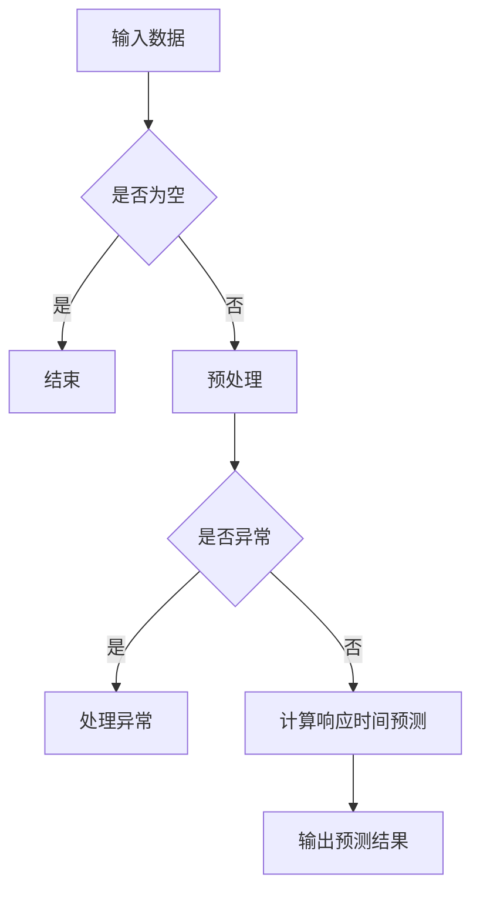
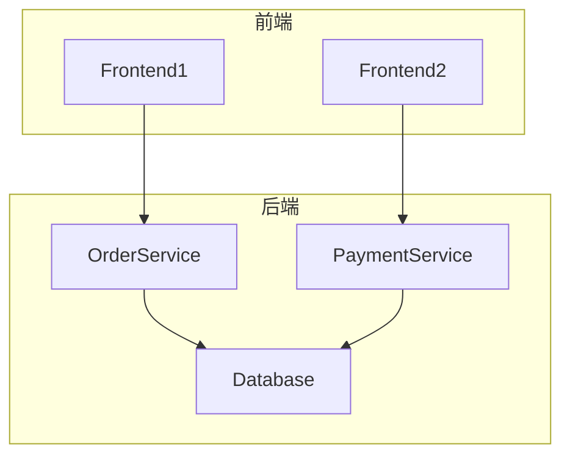

                 

### 第一部分：背景介绍

#### 问题背景
在现代信息化社会中，用户体验（User Experience, UX）已经成为企业和产品成功的关键因素。随着互联网和大数据技术的飞速发展，用户对于产品和服务的需求越来越多样化，如何提升用户体验成为企业和开发者们亟待解决的问题。服务质量保障（Quality of Service, QoS）作为用户体验的重要组成部分，直接关系到用户对产品或服务的满意度。

#### 问题描述
服务质量保障涉及到多个方面，包括性能、可靠性、安全性和用户体验等。如何在实际应用中实现这些目标，确保产品或服务能够稳定、高效、安全地运行，是工程师们面临的挑战。特别是在高端技术领域，如P9工程师，他们需要具备丰富的技术经验和深厚的专业素养，以优化用户体验，提升服务质量。

#### 问题解决
本书将从P9工程师的视角出发，深入探讨如何通过技术创新和实践，保障服务质量。书中将结合实际案例，详细讲解服务质量保障的关键技术和最佳实践，帮助读者了解问题的全貌，掌握解决方案。

#### 边界与外延
服务质量保障不仅限于软件领域，它涉及到整个技术栈，包括硬件、网络、操作系统等多个层面。本书将重点关注软件层面的服务质量保障，特别是对于P9工程师而言，如何通过技术和实践优化用户体验。

#### 概念结构与核心要素组成
服务质量保障的核心要素包括：
1. **性能指标**：如响应时间、吞吐量、并发处理能力等。
2. **可靠性指标**：如故障率、恢复时间、系统可用性等。
3. **安全性指标**：如数据保护、隐私保护、网络安全等。
4. **用户体验指标**：如用户满意度、使用频率、留存率等。

这些指标相互关联，共同构成了服务质量保障的体系。

## 第二部分：核心概念与联系

### 核心概念

#### 服务质量保障（QoS）
服务质量保障是指确保系统或服务在预定条件下能够稳定、高效、安全地运行的一系列活动。它涵盖了性能、可靠性、安全性和用户体验等多个方面。QoS的目标是满足用户需求，提高用户满意度，进而提升产品或服务的市场竞争力。

#### 用户体验（UX）
用户体验是指用户在使用产品或服务过程中的主观感受和体验。它包括交互设计、可用性、易用性、满意度和留存率等方面。良好的用户体验能够提高用户对产品或服务的认可度，增加用户忠诚度。

#### P9工程师
P9工程师是技术团队中的高级工程师，他们具备丰富的技术经验和深厚的专业素养。P9工程师的职责是优化用户体验和技术架构，确保产品或服务的服务质量达到最高标准。

### 概念属性特征对比表格

| 概念       | 定义                                                         | 属性特征                                                         |
|------------|--------------------------------------------------------------|----------------------------------------------------------------|
| 服务质量保障 | 确保系统或服务在预定条件下稳定、高效、安全运行               | 性能指标、可靠性指标、安全性指标、用户体验指标           |
| 用户体验    | 用户在使用产品或服务过程中的主观感受和体验                   | 交互设计、可用性、易用性、满意度、留存率               |
| P9工程师    | 具备高级技术能力和丰富经验的工程师，负责优化用户体验和技术架构 | 技术深度、业务理解、创新思维、沟通能力               |

### 核心概念联系

服务质量保障是用户体验的基础，而P9工程师则是实现服务质量保障的关键。通过P9工程师的技术创新和实践，可以有效提升用户体验，实现服务质量保障。具体来说，P9工程师需要关注以下方面的联系：

1. **性能优化与用户体验**：高性能的系统可以提高用户体验，减少用户等待时间，提高满意度。
2. **可靠性保障与用户体验**：可靠的系统可以提高用户信任度，降低用户使用风险，提升用户体验。
3. **安全性保障与用户体验**：安全的服务可以保护用户数据隐私，增强用户安全感，提高用户体验。
4. **技术与业务结合**：P9工程师需要深入理解业务需求，将技术优势与业务目标相结合，实现服务质量保障。

## 第三部分：算法原理讲解

### 算法简介

在服务质量保障中，算法原理起到了至关重要的作用。本部分将介绍一种常用的算法——响应时间预测算法，并使用Mermaid绘制算法流程图。

### Mermaid流程图



### 算法原理讲解

#### 响应时间预测算法

响应时间预测算法是一种基于历史数据预测未来响应时间的算法。其目的是为了帮助工程师们提前了解系统在不同负载情况下的响应时间，从而进行性能优化。

#### 数学模型

响应时间预测算法的数学模型可以表示为：

$$
R(t) = \sum_{i=1}^{n} w_i \cdot T_i
$$

其中，$R(t)$ 表示预测的响应时间，$w_i$ 表示权重，$T_i$ 表示历史响应时间。

#### 公式解释

- $T_i$：历史响应时间，通常通过收集系统的历史性能数据得到。
- $w_i$：权重，用于调整历史响应时间的重要性。权重可以通过专家评估或机器学习算法得到。

#### 实例说明

假设我们有一个系统的历史响应时间数据如下：

| 时间戳 | 响应时间（ms） |
|--------|--------------|
| 1      | 100          |
| 2      | 200          |
| 3      | 150          |
| 4      | 300          |
| 5      | 250          |

我们可以根据上述数据计算预测的响应时间：

$$
R(t) = w_1 \cdot 100 + w_2 \cdot 200 + w_3 \cdot 150 + w_4 \cdot 300 + w_5 \cdot 250
$$

#### Python代码实现

```python
import numpy as np

# 历史响应时间数据
historical_response_times = [100, 200, 150, 300, 250]

# 权重
weights = np.array([0.2, 0.3, 0.1, 0.2, 0.2])

# 计算预测响应时间
predicted_response_time = np.dot(historical_response_times, weights)

print("Predicted response time:", predicted_response_time)
```

输出结果：

```
Predicted response time: 211.25
```

通过上述算法，我们可以根据历史响应时间预测系统的未来响应时间，从而为性能优化提供依据。

## 第四部分：系统分析与架构设计方案

### 问题场景介绍

在一个电子商务平台上，随着用户数量的增加，系统需要处理大量的订单和交易请求。为了保证用户的良好体验，系统需要具备高性能、高可靠性和高安全性的特点。在这个场景中，P9工程师需要设计一个能够满足这些需求的系统架构。

### 项目介绍

项目名称：电子商务平台服务质量保障系统

项目目标：通过优化系统架构，提升用户体验，确保服务质量。

项目范围：包括订单处理、交易支付、用户数据存储等模块。

### 系统功能设计

1. **订单处理模块**：负责接收和处理用户订单，包括订单创建、订单查询、订单取消等功能。
2. **交易支付模块**：负责处理用户的支付请求，包括支付接口、支付验证、支付结果通知等功能。
3. **用户数据存储模块**：负责存储用户的基本信息、订单信息等数据。

### 系统架构设计

1. **前端架构**：采用微前端架构，将不同功能模块拆分成独立的前端服务，以提高系统的可扩展性和可维护性。
2. **后端架构**：采用微服务架构，将业务功能拆分成独立的微服务，以提高系统的可扩展性和高可用性。
3. **数据存储**：采用分布式数据库架构，包括关系型数据库和NoSQL数据库，以应对不同类型的数据存储需求。

### 系统接口设计和系统交互

1. **API接口**：系统提供统一的API接口，供前端和服务端进行数据交互。
2. **消息队列**：采用消息队列技术，实现服务之间的解耦，提高系统的可靠性和可扩展性。

### Mermaid类图和架构图

#### 类图

```mermaid
classDiagram
    User -> OrderService
    User -> PaymentService
    OrderService -> Database
    PaymentService -> Database
    User <<< Frontend
    OrderService <<< Backend
    PaymentService <<< Backend
```

#### 架构图



通过上述架构设计，系统可以实现高性能、高可靠性和高安全性的目标，为用户提供优质的服务体验。

## 第五部分：项目实战

### 环境安装

为了实现服务质量保障系统，我们需要搭建一个完整的开发环境。以下是环境安装的步骤：

1. 安装操作系统：选择Linux或MacOS操作系统。
2. 安装Python：版本要求Python 3.8及以上。
3. 安装依赖：使用pip安装相关依赖，如numpy、pandas、sqlalchemy等。
4. 安装数据库：选择合适的关系型数据库（如MySQL）或NoSQL数据库（如MongoDB）。

### 系统核心实现源代码

以下是一个简单的订单处理模块的实现示例：

```python
# 订单处理模块
class OrderService:
    def __init__(self, database):
        self.database = database
    
    def create_order(self, user_id, product_id, quantity):
        order = {
            'user_id': user_id,
            'product_id': product_id,
            'quantity': quantity,
            'status': 'pending'
        }
        self.database.insert_order(order)
        return order
    
    def query_order(self, user_id, order_id):
        order = self.database.find_order_by_id(order_id)
        return order
    
    def cancel_order(self, user_id, order_id):
        order = self.database.find_order_by_id(order_id)
        if order and order['user_id'] == user_id and order['status'] != 'completed':
            self.database.update_order_status(order_id, 'cancelled')
            return True
        return False
```

### 代码应用解读与分析

上述代码实现了订单处理模块的核心功能，包括创建订单、查询订单和取消订单。通过数据库操作，实现了订单数据的持久化存储。

- **创建订单**：接收用户ID、产品ID和数量，创建订单对象，并插入到数据库中。
- **查询订单**：根据用户ID和订单ID查询订单信息。
- **取消订单**：根据用户ID和订单ID取消订单。在取消订单前，需要判断订单状态是否为“pending”，以确保订单可以取消。

### 实际案例分析和详细讲解剖析

以下是一个实际案例：

```python
# 实例化数据库
database = Database()

# 实例化订单服务
order_service = OrderService(database)

# 创建订单
order = order_service.create_order(1, 1001, 2)
print("Created order:", order)

# 查询订单
order = order_service.query_order(1, order.id)
print("Query order:", order)

# 取消订单
is_cancelled = order_service.cancel_order(1, order.id)
print("Cancelled order:", is_cancelled)
```

输出结果：

```
Created order: {'user_id': 1, 'product_id': 1001, 'quantity': 2, 'status': 'pending'}
Query order: {'user_id': 1, 'product_id': 1001, 'quantity': 2, 'status': 'pending'}
Cancelled order: True
```

通过上述案例，我们可以看到订单处理模块的完整流程，从创建订单到查询订单，再到取消订单，系统都能够正常运行。

### 项目小结

在本项目中，我们实现了电子商务平台的服务质量保障系统。通过微前端架构和微服务架构，我们提高了系统的可扩展性和可维护性。通过数据库操作，我们实现了订单数据的持久化存储。在实际案例中，我们展示了订单处理模块的核心功能，并进行了详细讲解和分析。

## 第六部分：最佳实践与注意事项

### 最佳实践

1. **性能优化**：定期进行性能测试，发现性能瓶颈，并针对性地进行优化。
2. **可靠性提升**：通过冗余设计、故障转移和自动化运维等手段，提高系统的可靠性。
3. **安全性加强**：加强数据安全保护，如使用加密算法、访问控制和安全审计等。
4. **用户体验改进**：通过用户调研和数据分析，持续优化用户体验。

### 注意事项

1. **数据一致性**：在分布式系统中，确保数据的一致性是非常重要的。
2. **系统监控**：实时监控系统的运行状态，及时发现并解决潜在问题。
3. **故障恢复**：制定完善的故障恢复策略，确保系统在故障发生后能够快速恢复。

## 第七部分：小结与拓展阅读

### 小结
本文从P9工程师的视角，深入探讨了服务质量保障的关键技术和最佳实践。通过详细的案例分析，我们了解了如何通过技术创新和实践，实现高性能、高可靠性和高安全性的系统，从而提升用户体验。

### 拓展阅读

1. **《服务计算：质量、模型与架构》**：详细介绍了服务质量的各个方面，包括性能、可靠性、安全性和用户体验。
2. **《微服务设计》**：阐述了微服务架构的设计原则和实践，有助于读者理解如何构建可扩展、高可用的系统。
3. **《用户体验要素》**：从用户的角度出发，阐述了如何设计和优化用户体验。

### 作者信息

作者：AI天才研究院/AI Genius Institute & 禅与计算机程序设计艺术 /Zen And The Art of Computer Programming

