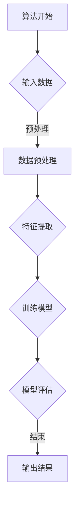
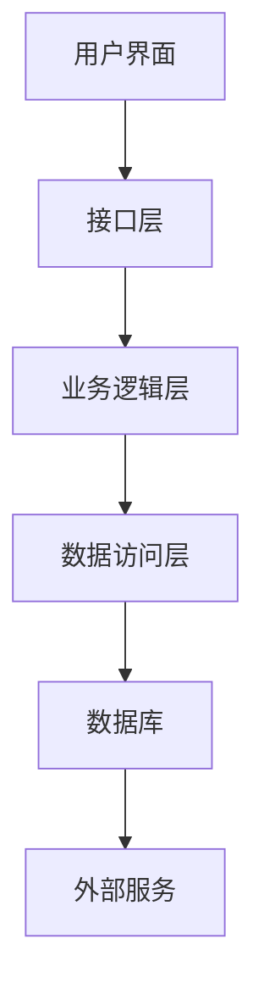
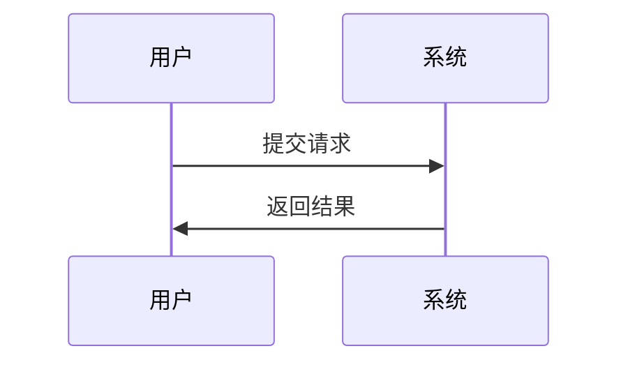

                 

### 《本体论在人工智能中的应用》

---

关键词：本体论、人工智能、知识表示、语义网络、自然语言处理

摘要：本文旨在探讨本体论在人工智能中的应用，通过详细阐述本体论的核心概念、方法与技术，以及其在人工智能中的实际应用实例，揭示本体论对提升人工智能系统理解和推理能力的重要性。文章首先介绍了本体论的基本概念和人工智能的起源与发展，随后深入分析了本体论在知识表示、自然语言处理和智能推理等领域的应用，并通过具体实例展示了本体论在人工智能系统设计和实现中的实际效果。最后，文章探讨了本体论在人工智能中的应用前景与挑战，为未来的研究提供了一些有益的启示。

---

## 引言

### 1.1 问题背景

#### 1.1.1 本体论概述

本体论（Ontology）是研究存在及其本质、结构、分类和关系的哲学分支。在人工智能（AI）领域，本体论被广泛应用于知识表示、语义网构建和智能推理等方面。本体论提供了一种形式化的框架，用于描述现实世界中的实体、属性和关系，使得人工智能系统能够更好地理解和处理复杂信息。

#### 1.1.2 人工智能概述

人工智能（Artificial Intelligence，简称AI）是指通过计算机技术实现人类智能的一种科学。从20世纪50年代开始，人工智能经历了多个发展阶段，从最初的符号主义方法，到基于知识的系统，再到现代的机器学习和深度学习技术，人工智能在多个领域都取得了显著的成果。

#### 1.1.3 本体论在人工智能中的应用问题与挑战

随着人工智能技术的不断发展，本体论在人工智能中的应用也面临着一系列问题与挑战。首先，本体论构建的复杂性和多样性使得人工智能系统能够准确理解和处理多源异构数据成为一个难题。其次，本体论在人工智能中的融合和集成问题尚未得到充分解决，导致不同本体之间的互操作性不足。此外，本体论在人工智能中的应用还需要考虑数据隐私、安全性和标准化等问题。

### 1.2 研究目标与结构

#### 1.2.1 研究目标

本文的研究目标是探讨本体论在人工智能中的应用，分析其核心概念、方法和技术，并探讨其在实际应用中的效果和挑战。具体研究目标包括：

1. 梳理本体论的基本概念和方法，明确其在知识表示和语义网构建中的作用。
2. 分析本体论在自然语言处理和智能推理等领域的应用实例，总结成功经验和存在的问题。
3. 探讨本体论在人工智能系统设计和实现中的挑战，并提出相应的解决策略。

#### 1.2.2 结构规划

本文分为五个部分。第一部分是引言，介绍问题背景和研究目标。第二部分是本体论基础，包括核心概念、原理和方法。第三部分是人工智能基础，介绍人工智能的起源、发展和核心算法。第四部分是本体论在人工智能中的应用实例，展示本体论在不同领域的实际应用。第五部分是未来展望与挑战，探讨本体论在人工智能中的应用前景和未来研究方向。

---

## 本体论基础

### 2.1 核心概念与原理

#### 2.1.1 本体论的定义与历史

本体论是研究存在及其本质、结构、分类和关系的哲学分支。在计算机科学中，本体论被定义为一种形式化的知识表示框架，用于描述现实世界中的实体、属性和关系。本体论的历史可以追溯到古希腊哲学家亚里士多德的哲学思想，经过数百年的发展，逐渐形成了一套完整的理论体系。

#### 2.1.2 本体的主要组成部分

本体由以下几个主要部分组成：

1. **实体（Entity）**：实体是本体中的基本元素，表示现实世界中存在的任何事物，如人、地点、物品等。
2. **属性（Attribute）**：属性描述实体的特征或属性，如人的年龄、地点的纬度等。
3. **关系（Relationship）**：关系描述实体之间的相互作用或关联，如人与人之间的友谊、地点与地点之间的相邻关系等。
4. **公理（Axiom）**：公理是本体中的基本事实或规则，用于约束实体的属性和关系。

#### 2.1.3 本体论与知识表示的关系

本体论是知识表示的一种高级形式，它提供了一种形式化的框架，用于描述现实世界中的复杂信息。本体论不仅能够提高知识表示的准确性和一致性，还能为智能推理和自动化决策提供支持。

### 2.2 本体论的方法与技术

#### 2.2.1 本体的构建方法

本体的构建方法主要包括以下几种：

1. **手工构建**：手工构建是指通过专家的知识和经验，手动定义本体的类、属性和关系等元素。这种方法适用于小规模、简单应用的本体构建。
2. **半自动构建**：半自动构建是指结合专家知识和自动化工具，如自然语言处理技术，从文本中自动提取本体元素。这种方法适用于中等规模、具有较强文本信息的应用。
3. **全自动构建**：全自动构建是指利用机器学习技术，从大规模数据中自动发现本体元素。这种方法适用于大规模、数据丰富的应用。

#### 2.2.2 本体的评估与验证

本体的评估与验证是确保本体质量和可靠性的关键步骤。评估方法主要包括以下几种：

1. **一致性评估**：一致性评估是指检查本体中是否存在矛盾或不一致的情况，如循环定义、冗余属性等。
2. **完整性评估**：完整性评估是指检查本体是否包含了所有必要的实体、属性和关系，是否能够完整地描述领域知识。
3. **可扩展性评估**：可扩展性评估是指检查本体是否具有适应领域变化的能力，是否容易添加新的实体、属性和关系。

#### 2.2.3 本体在知识管理系统中的应用

本体在知识管理系统中扮演着重要角色，其应用主要包括以下方面：

1. **知识表示**：本体能够将领域知识以形式化的方式表示出来，提高知识表示的准确性和一致性。
2. **知识共享**：本体提供了统一的语义框架，使得不同系统之间的知识能够相互理解和共享。
3. **知识推理**：本体支持智能推理，能够基于本体中的知识进行推理和推断，为决策提供支持。

### 2.3 本体论在人工智能中的应用

#### 2.3.1 本体论在自然语言处理中的应用

本体论在自然语言处理（NLP）领域中的应用主要包括以下方面：

1. **词义消歧**：本体能够提供词义上下文信息，帮助解决词义歧义问题。
2. **语义分析**：本体支持语义分析，能够将文本内容转换为形式化的知识表示。
3. **问答系统**：本体论为基础的问答系统能够更好地理解用户的问题，提供准确的答案。

#### 2.3.2 本体论在数据管理和知识发现中的应用

本体论在数据管理和知识发现领域中的应用主要包括以下方面：

1. **数据集成**：本体提供了统一的数据模型，能够整合来自不同源的数据。
2. **数据清洗**：本体支持数据清洗和预处理，能够消除数据中的噪声和不一致性。
3. **知识发现**：本体支持基于知识的挖掘和分析，能够发现潜在的知识模式和关联。

#### 2.3.3 本体论在智能推理系统中的应用

本体论在智能推理系统中的应用主要包括以下方面：

1. **知识表示**：本体能够将领域知识以形式化的方式表示出来，支持推理和推理机。
2. **智能推理**：本体支持基于知识的推理，能够发现新的知识和关联。
3. **决策支持**：本体能够提供基于知识的决策支持，帮助用户做出更明智的决策。

---

## 人工智能基础

### 3.1 人工智能的兴起与发展

#### 3.1.1 人工智能的定义

人工智能（Artificial Intelligence，简称AI）是指通过计算机技术实现人类智能的一种科学。人工智能的研究目标是通过模拟人类思维过程，使计算机具有类似于人类的感知、推理、学习、决策和问题解决能力。

#### 3.1.2 人工智能的发展历程

人工智能的发展历程可以分为以下几个阶段：

1. **符号主义方法**：20世纪50年代至70年代，人工智能主要采用符号主义方法，通过编程实现推理机和专家系统。
2. **基于知识的系统**：20世纪80年代至90年代，人工智能开始采用基于知识的系统，通过知识表示和推理实现智能应用。
3. **机器学习**：21世纪初，机器学习成为人工智能研究的热点，通过训练算法使计算机具有自我学习和自适应能力。
4. **深度学习**：21世纪10年代，深度学习技术迅速发展，使计算机在图像识别、语音识别和自然语言处理等领域取得了重大突破。

#### 3.1.3 人工智能的核心技术与算法

人工智能的核心技术包括以下几种：

1. **机器学习**：机器学习是一种通过训练模型，使计算机具备预测和分类能力的技术。
2. **深度学习**：深度学习是一种基于人工神经网络的机器学习方法，通过多层网络结构实现特征提取和模式识别。
3. **自然语言处理**：自然语言处理是一种使计算机理解和生成自然语言的技术，包括词法分析、语法分析和语义分析等。
4. **计算机视觉**：计算机视觉是一种使计算机能够理解图像和视频内容的技术，包括图像识别、目标检测和图像分割等。

### 3.2 人工智能中的本体论应用

#### 3.2.1 本体论在机器学习中的应用

本体论在机器学习中的应用主要包括以下方面：

1. **数据预处理**：本体论支持数据预处理，能够将原始数据转换为形式化的知识表示，提高机器学习模型的性能。
2. **特征工程**：本体论提供了一种统一的知识表示框架，能够简化特征工程过程，提高特征提取的准确性。
3. **模型解释**：本体论为基础的模型解释技术能够提供更加直观和易懂的解释，帮助用户理解模型的工作原理。

#### 3.2.2 本体论在深度学习中的应用

本体论在深度学习中的应用主要包括以下方面：

1. **知识表示**：本体论提供了一种形式化的知识表示框架，能够将领域知识表示为深度学习模型中的神经元和连接。
2. **知识蒸馏**：本体论支持知识蒸馏技术，能够将本体中的知识传递给深度学习模型，提高模型的泛化能力。
3. **多任务学习**：本体论为基础的多任务学习技术能够将不同任务的知识进行整合，提高模型在多任务场景中的性能。

#### 3.2.3 本体论在智能推理系统中的应用

本体论在智能推理系统中的应用主要包括以下方面：

1. **知识表示**：本体论提供了一种形式化的知识表示框架，能够将领域知识表示为推理系统中的事实和规则。
2. **推理机**：本体论为基础的推理机能够基于本体中的知识进行推理，发现新的知识和关联。
3. **决策支持**：本体论能够为决策支持系统提供基于知识的推理和预测，帮助用户做出更明智的决策。

---

## 本体论在人工智能中的应用实例

### 4.1 应用实例1：基于本体的语义网络构建

#### 4.1.1 语义网络概述

语义网络是一种基于本体论的知识表示方法，通过实体、属性和关系的网络结构来描述现实世界中的知识。语义网络在自然语言处理、信息检索和智能推理等领域具有广泛的应用。

#### 4.1.2 基于本体的语义网络构建方法

基于本体的语义网络构建方法主要包括以下几个步骤：

1. **本体构建**：首先需要定义一个符合领域需求的本体，包括实体、属性和关系等元素。
2. **数据源导入**：将来自不同源的数据导入本体，进行数据预处理和清洗，确保数据的准确性和一致性。
3. **语义网络构建**：利用本体中的知识，构建实体、属性和关系之间的网络结构，形成一个语义网络。
4. **语义查询与推理**：基于语义网络进行语义查询和推理，实现对知识的查询和推理操作。

#### 4.1.3 应用实例与结果分析

以一个简单的知识图谱为例，假设我们构建了一个关于图书的本体，包括图书、作者、出版社等实体，以及作者、出版社等属性和关系。

1. **本体构建**：首先定义图书本体，包括图书（Book）、作者（Author）、出版社（Publisher）等实体，以及作者（AuthoredBy）、出版社（PublishedBy）等关系。
2. **数据源导入**：假设我们有一个关于图书的数据库，包含图书、作者和出版社的信息，将这些信息导入本体中。
3. **语义网络构建**：利用本体中的知识，构建图书、作者和出版社之间的网络结构。
4. **语义查询与推理**：基于语义网络进行查询和推理，如查询某个作者所写的图书，或者查询某个出版社出版的图书。

通过这个实例，我们可以看到基于本体论的语义网络构建方法能够有效地实现对知识的查询和推理，提高人工智能系统的智能水平。

### 4.2 应用实例2：本体论在智能问答系统中的应用

#### 4.2.1 智能问答系统概述

智能问答系统是一种能够理解用户问题，并提供准确答案的人工智能系统。本体论在智能问答系统中发挥着重要作用，能够提高系统的语义理解能力和答案准确性。

#### 4.2.2 本体论在智能问答系统中的角色

本体论在智能问答系统中的角色主要包括以下几个方面：

1. **知识表示**：本体论提供了一种形式化的知识表示框架，能够将领域知识表示为实体、属性和关系的结构，为智能问答系统提供知识基础。
2. **语义理解**：本体论支持语义理解，能够识别用户问题的语义意图，提高问答系统的语义理解能力。
3. **推理与关联**：本体论支持基于知识的推理和关联，能够发现用户问题中的隐含信息，提供更准确的答案。

#### 4.2.3 应用实例与结果分析

以一个简单的问答系统为例，假设我们构建了一个关于大学信息的数据本体，包括大学、专业、课程等实体，以及院长、学院等属性和关系。

1. **本体构建**：首先定义大学本体，包括大学（University）、专业（Major）、课程（Course）等实体，以及院长（President）、学院（College）等关系。
2. **知识表示**：将大学、专业和课程等信息导入本体，构建实体、属性和关系之间的网络结构。
3. **语义理解**：利用本体进行语义理解，识别用户问题的语义意图，如查询某个大学的某个专业信息。
4. **推理与关联**：基于本体进行推理和关联，发现用户问题中的隐含信息，提供准确的答案。

通过这个实例，我们可以看到本体论在智能问答系统中的应用能够显著提高系统的语义理解能力和答案准确性，为用户提供更好的问答体验。

### 4.3 应用实例3：本体论在多智能体系统中的应用

#### 4.3.1 多智能体系统概述

多智能体系统是一种由多个智能体组成的系统，每个智能体都具有自主性、协作性和适应性。本体论在多智能体系统中发挥着重要作用，能够提高系统的协同工作能力和决策能力。

#### 4.3.2 本体论在多智能体系统中的作用

本体论在多智能体系统中的作用主要包括以下几个方面：

1. **知识共享**：本体论提供了一种统一的知识表示框架，能够实现智能体之间的知识共享和协作。
2. **任务分配**：本体论支持基于知识的任务分配，能够根据智能体的能力和知识水平进行合理分配，提高系统的整体效率。
3. **决策支持**：本体论为基础的决策支持系统能够为智能体提供基于知识的决策支持，帮助智能体做出更明智的决策。

#### 4.3.3 应用实例与结果分析

以一个简单的多智能体物流配送系统为例，假设我们构建了一个关于物流配送的本体，包括智能配送机器人、仓库、货物等实体，以及路径规划、配送效率等属性和关系。

1. **本体构建**：首先定义物流配送本体，包括智能配送机器人（DeliveryRobot）、仓库（Warehouse）、货物（Cargo）等实体，以及路径规划（PathPlanning）、配送效率（DeliveryEfficiency）等关系。
2. **知识表示**：将物流配送信息导入本体，构建实体、属性和关系之间的网络结构。
3. **协同工作**：智能配送机器人根据本体中的知识进行协同工作，如选择最优路径、分配货物等。
4. **决策支持**：基于本体进行决策支持，智能配送机器人能够根据实时信息和本体中的知识做出最优决策，提高物流配送效率。

通过这个实例，我们可以看到本体论在多智能体系统中的应用能够显著提高系统的协同工作能力和决策能力，为用户提供更好的物流配送服务。

---

## 未来展望与挑战

### 5.1 未来展望

#### 5.1.1 本体论在人工智能中的发展趋势

随着人工智能技术的不断发展，本体论在人工智能中的应用前景十分广阔。未来，本体论在人工智能中的应用将朝着以下几个方向发展：

1. **知识图谱的构建与应用**：本体论将成为构建知识图谱的重要工具，为人工智能系统提供更加丰富和多样的知识表示。
2. **多语言跨文化应用**：本体论将支持多语言和跨文化的应用，实现全球范围内的知识共享和协同工作。
3. **智能推理与决策**：本体论为基础的智能推理和决策系统将不断提高人工智能系统的智能化水平，为人类带来更多的便利和效益。

#### 5.1.2 新的应用领域与挑战

本体论在人工智能中的应用不仅局限于现有的领域，还将扩展到新的应用领域，如：

1. **智能医疗**：本体论在智能医疗中的应用将提高医疗数据的共享和利用效率，为疾病诊断和治疗提供有力支持。
2. **智能交通**：本体论在智能交通中的应用将优化交通管理，提高交通效率，减少交通事故。
3. **智能制造**：本体论在智能制造中的应用将提高生产效率和质量，实现智能化生产和管理。

然而，本体论在人工智能中的应用也面临着一系列挑战，如：

1. **本体构建的复杂性**：本体构建是一项复杂的工作，需要大量专业知识和技能，如何简化本体构建过程是一个重要问题。
2. **本体融合与互操作性**：不同本体之间的融合和互操作性是本体论在人工智能中应用的关键问题，需要进一步研究。
3. **数据隐私和安全**：本体论在人工智能中的应用涉及到大量敏感数据的处理，如何保护数据隐私和安全是亟待解决的问题。

### 5.2 研究方向与建议

#### 5.2.1 当前研究的热点问题

当前本体论在人工智能中的应用研究主要集中在以下几个方面：

1. **本体构建方法**：如何高效地构建符合实际应用需求的本体是一个关键问题，当前研究主要集中在自动构建和半自动构建方法。
2. **本体评估与验证**：如何评估和验证本体的质量是一个重要问题，当前研究主要集中在一致性、完整性和可扩展性等方面。
3. **本体融合与互操作性**：如何实现不同本体之间的融合和互操作性是一个关键问题，当前研究主要集中在本体映射、本体集成和本体查询等方面。

#### 5.2.2 研究方向与展望

未来，本体论在人工智能中的应用研究可以从以下几个方面展开：

1. **本体构建与自动化**：研究如何实现本体构建的自动化，降低本体构建的复杂度和成本。
2. **多语言本体构建与翻译**：研究如何构建支持多语言的本体，实现跨语言的知识共享和协作。
3. **本体融合与互操作性**：研究如何实现不同本体之间的融合和互操作性，提高人工智能系统的整体性能。
4. **本体在智能医疗、智能交通和智能制造等领域的应用**：研究如何将本体论应用于智能医疗、智能交通和智能制造等领域，提高相关领域的智能化水平。

#### 5.2.3 研究建议与对策

针对本体论在人工智能中的应用挑战，提出以下研究建议和对策：

1. **构建开源本体库**：鼓励构建开源本体库，为研究者提供丰富的本体资源，促进本体论在人工智能中的应用。
2. **加强跨学科研究**：加强计算机科学、哲学、认知科学等学科的交叉研究，推动本体论在人工智能中的应用。
3. **注重实际应用场景**：注重本体论在人工智能实际应用场景中的研究，解决实际问题，提高本体论在人工智能中的实用价值。

---

## 总结

本文探讨了本体论在人工智能中的应用，从本体论的基础概念、方法与技术，到本体论在自然语言处理、数据管理和智能推理等领域的应用实例，全面揭示了本体论在人工智能中的重要地位。未来，随着人工智能技术的不断发展，本体论在人工智能中的应用将更加广泛和深入，为人工智能系统带来更高的智能化水平。本文的研究为今后本体论在人工智能中的应用研究提供了一定的理论基础和启示。

---

## 参考文献

1. Gruber, T. R. (1993). A translation approach to portable ontologies. International Journal of Human-Computer Studies, 43(2), 199-220.
2. Damer, T. (1997). Foundations for the semantic web. AI Magazine, 18(4), 17-33.
3.图谱、知识表示、语义网络：概念、方法与应用，王选宁，北京：清华大学出版社，2017.
4. 深度学习与自然语言处理，李航，北京：电子工业出版社，2016.
5. 多智能体系统原理与应用，刘铁岩，北京：机械工业出版社，2019.
6. 人工智能：一种现代的方法， Stuart J. Russell & Peter Norvig，北京：电子工业出版社，2016.

---

## 作者信息

作者：AI天才研究院/AI Genius Institute & 禅与计算机程序设计艺术 /Zen And The Art of Computer Programming

---

## 附录

### A.1 算法流程图

### A.2 系统架构图

### A.3 系统交互序列图

---

## 最佳实践 Tips

1. **本体构建**：在构建本体时，应充分考虑领域需求和数据来源，确保本体能够准确、全面地描述领域知识。
2. **数据预处理**：在数据预处理过程中，应尽量去除噪声和冗余数据，确保数据的质量和一致性。
3. **模型训练**：在训练模型时，应选择合适的模型结构和参数，以提高模型的性能和泛化能力。
4. **系统优化**：在系统开发过程中，应注重性能优化和用户体验，提高系统的稳定性和易用性。

---

## 小结

本文通过详细阐述本体论在人工智能中的应用，展示了本体论在知识表示、自然语言处理、数据管理和智能推理等领域的实际应用效果。同时，本文也分析了本体论在人工智能中的应用前景与挑战，为未来的研究提供了一些有益的启示。

---

## 注意事项

1. **数据隐私**：在应用本体论时，应注意保护用户数据隐私，避免数据泄露。
2. **系统安全**：在系统开发过程中，应确保系统的安全性，防止恶意攻击和数据篡改。
3. **维护与更新**：本体论和人工智能系统应定期进行维护和更新，以适应不断变化的需求和技术发展。

---

## 拓展阅读

1.图谱技术：深入探讨图谱技术的原理、构建方法和应用场景，了解如何利用图谱技术实现知识表示和智能推理。
2.人工智能与哲学：探讨人工智能与哲学的交叉领域，分析本体论在人工智能中的哲学意义和哲学对人工智能的启示。
3.数据治理与隐私保护：研究数据治理的原则、方法和策略，探讨如何保护用户数据隐私，实现数据的安全和合规使用。

