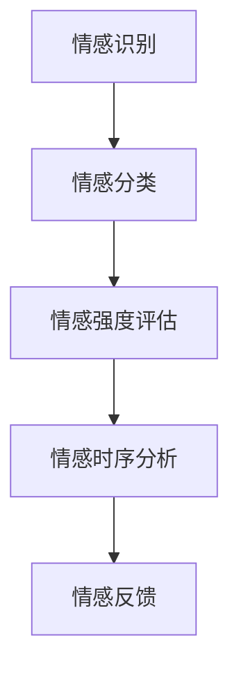
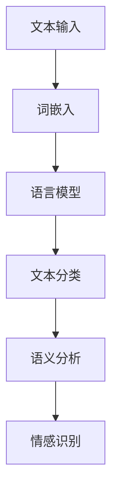
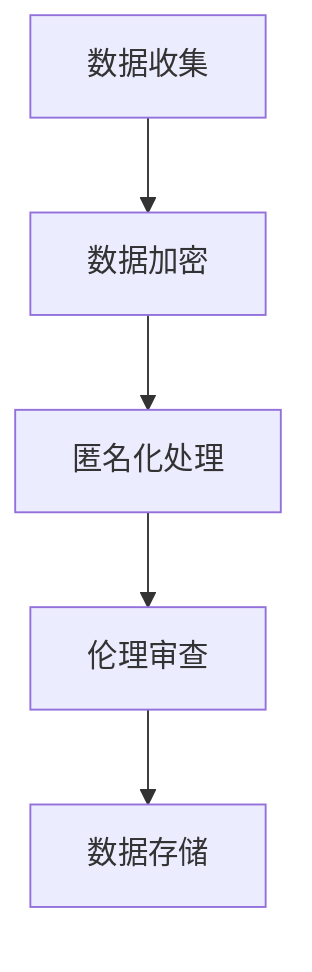
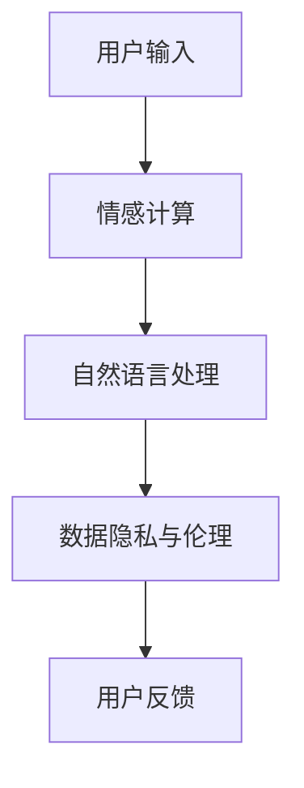
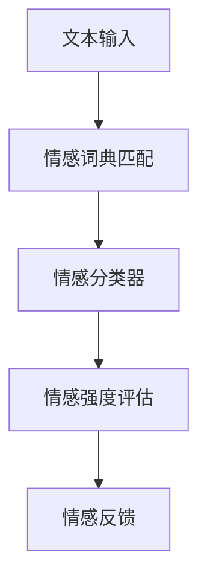
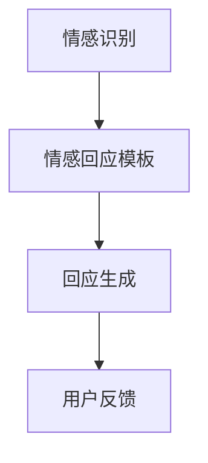
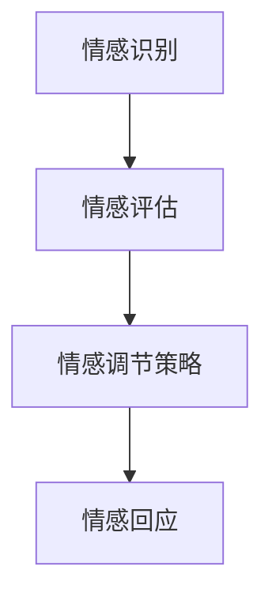

                 

### 文章标题：机器人同情心：AI在危机干预中的作用

**关键词：** AI、危机干预、机器人同情心、情感计算、自然语言处理、数据隐私与伦理

**摘要：** 本文深入探讨了机器人同情心在危机干预中的应用及其技术实现。首先，文章介绍了机器人同情心的概念，并分析了其在危机干预中的重要性。随后，文章详细阐述了情感计算、自然语言处理和数据隐私与伦理等核心概念，并通过具体的算法原理、数学模型和系统架构设计，展示了机器人同情心在危机干预中的技术实现。最后，文章通过实践案例，评估了机器人同情心在危机干预中的实际效果，并提出了未来展望。

## 第一部分：引言与背景

### 第1章：引言

#### 1.1 问题背景

人工智能（AI）技术的发展为危机干预带来了新的机遇。随着AI技术的不断进步，机器人在危机干预中的应用越来越广泛。在这些应用中，机器人同情心成为了一个关键因素。机器人同情心指的是机器人能够识别并适当地回应人类情感的能力，这使其在危机干预中能够提供更加人性化的帮助。

#### 1.2 问题描述

AI在危机干预中的潜在应用包括灾难响应、心理咨询、紧急医疗服务等。然而，这些应用面临一些技术挑战，例如如何准确识别和理解人类的情感，如何在保护用户隐私的前提下实现有效的沟通，以及如何在复杂的情境中做出合理的回应。机器人同情心正是为了解决这些挑战而设计的。

#### 1.3 问题解决

机器人同情心的设计包括情感计算、自然语言处理和数据隐私与伦理等多个方面。情感计算负责识别和理解用户的情感状态，自然语言处理负责理解和生成人类语言，而数据隐私与伦理则关注如何在保护用户隐私的前提下进行数据处理。通过这些核心要素的协同工作，机器人能够提供更加有效的危机干预服务。

#### 1.4 边界与外延

机器人同情心的适用范围包括灾难响应、心理咨询、紧急医疗服务等领域。然而，并非所有情境都适合使用机器人进行干预。例如，一些高度复杂的决策或需要深度情感理解的任务可能仍然需要人类的干预。

#### 1.5 概念结构与核心要素组成

- **情感计算**：负责识别和理解用户的情感状态。
- **自然语言处理**：负责理解和生成人类语言。
- **数据隐私与伦理**：关注如何在保护用户隐私的前提下进行数据处理。

## 第二部分：核心概念与联系

### 第2章：核心概念与联系

#### 2.1 情感计算

情感计算是机器人同情心的基础。它涉及对人类情感状态的理解和识别。情感计算的核心特征包括情感分类、情感强度评估和情感时序分析等。

| 特征 | 说明 |
| ---- | ---- |
| 情感分类 | 对情感进行分类，如喜悦、悲伤、愤怒等。 |
| 情感强度评估 | 评估情感的强度，如情感程度的轻重。 |
| 情感时序分析 | 分析情感的变化趋势和时间序列。 |

**mermaid流程图：**


#### 2.2 自然语言处理

自然语言处理（NLP）是机器人同情心的另一个关键组成部分。它负责理解和生成人类语言，以实现与用户的自然对话。NLP的核心算法包括词嵌入、语言模型、文本分类和语义分析等。

| 算法 | 说明 |
| ---- | ---- |
| 词嵌入 | 将词汇映射到高维向量空间。 |
| 语言模型 | 生成自然语言序列的概率模型。 |
| 文本分类 | 根据文本内容进行分类。 |
| 语义分析 | 理解文本的语义含义。 |

**mermaid流程图：**


#### 2.3 数据隐私与伦理

数据隐私与伦理是机器人同情心设计中的重要考虑因素。在处理用户数据时，需要确保数据的安全性和隐私性，并遵守相关的伦理规范。数据隐私与伦理的核心内容包括数据加密、匿名化处理和伦理审查等。

| 内容 | 说明 |
| ---- | ---- |
| 数据加密 | 使用加密算法保护数据安全。 |
| 匿名化处理 | 移除或替换个人身份信息。 |
| 伦理审查 | 对数据处理和应用进行伦理评估。 |

**mermaid流程图：**


## 第二部分：机器人同情心的设计与实现

### 第3章：机器人同情心的设计原理

#### 3.1 设计理念

机器人同情心的设计理念是以用户为中心，提供人性化的危机干预服务。设计过程中，需要充分考虑用户的需求和情感状态，以确保机器人能够提供有效的帮助。

#### 3.2 架构设计

机器人同情心的架构设计包括情感计算模块、自然语言处理模块和数据隐私与伦理模块。这些模块协同工作，实现机器人同情心的各项功能。

**mermaid架构图：**


#### 3.3 用户界面设计

用户界面设计应注重用户体验，提供简洁直观的交互界面。通过视觉元素和交互设计，使用户能够轻松与机器人进行沟通。

**用户界面设计原则：**
- **简洁性**：界面设计应简洁直观，减少用户操作步骤。
- **一致性**：界面元素应保持一致性，方便用户学习和使用。
- **响应性**：界面应适应不同设备尺寸，提供良好的用户体验。

### 第4章：机器人同情心的算法原理

#### 4.1 情感识别算法

情感识别算法是机器人同情心的核心。它通过分析用户的语言和行为，识别用户的情感状态。

**mermaid流程图：**


**Python源代码示例：**
```python
# 情感识别算法示例代码
from textblob import TextBlob

def recognize_emotion(text):
    blob = TextBlob(text)
    sentiment = blob.sentiment
    if sentiment.polarity > 0:
        return "喜悦"
    elif sentiment.polarity < 0:
        return "悲伤"
    else:
        return "中立"

text = "我感到非常高兴。"
emotion = recognize_emotion(text)
print("情感识别结果：", emotion)
```

#### 4.2 情感回应算法

情感回应算法根据识别到的情感状态，生成相应的回应。

**mermaid流程图：**


**Python源代码示例：**
```python
# 情感回应算法示例代码
def respond_to_emotion(emotion):
    if emotion == "喜悦":
        return "我也很高兴听到这个消息！"
    elif emotion == "悲伤":
        return "我很难过，想要帮助你。"
    else:
        return "很高兴与你交流。"

response = respond_to_emotion("喜悦")
print("情感回应：", response)
```

#### 4.3 情感调节算法

情感调节算法通过调整机器人的回应，帮助用户调节情绪。

**mermaid流程图：**


**Python源代码示例：**
```python
# 情感调节算法示例代码
def regulate_emotion(emotion, response):
    if emotion == "悲伤":
        response += "请记住，你并不孤单，我在这里支持你。"
    elif emotion == "愤怒":
        response += "让我们冷静下来，一起寻找解决问题的方法。"
    return response

regulated_response = regulate_emotion("悲伤", "我很难过，想要帮助你。")
print("情感调节回应：", regulated_response)
```

## 第三部分：机器人同情心的应用与实践

### 第6章：机器人同情心在危机干预中的应用

#### 6.1 应用场景

机器人同情心在危机干预中的应用场景包括灾难响应、心理咨询和紧急医疗服务等。

**应用场景：** 灾难响应  
**场景描述：** 在自然灾害发生时，机器人可以实时监测灾害影响区域，向受灾群众提供心理支持和救援信息。

**应用场景：** 心理咨询  
**场景描述：** 心理咨询师可以使用机器人同情心辅助工作，提高咨询效率，并在紧急情况下提供即时支持。

**应用场景：** 紧急医疗服务  
**场景描述：** 在紧急医疗情况下，机器人可以提供初步的医疗建议，协助医护人员进行紧急救治。

### 第7章：最佳实践与未来展望

#### 7.1 最佳实践

在机器人同情心的设计和应用过程中，以下最佳实践值得注意：

- **用户研究**：深入了解用户需求，确保机器人设计符合用户期望。
- **持续改进**：通过用户反馈和技术创新，不断优化机器人同情心的性能。
- **伦理审查**：确保机器人同情心在应用过程中遵守伦理规范，保护用户隐私。

#### 7.2 小结

机器人同情心在危机干预中具有巨大潜力。通过情感计算、自然语言处理和数据隐私与伦理等技术的综合应用，机器人能够提供更加人性化的服务。未来，随着技术的不断进步，机器人同情心有望在更多领域发挥重要作用。

#### 7.3 未来展望

未来，机器人同情心的技术发展趋势包括：

- **更先进的情感识别算法**：提高情感识别的准确性和多样性。
- **更智能的自然语言处理**：实现更加自然和流畅的人机对话。
- **更严格的伦理规范**：确保机器人同情心的应用符合社会伦理标准。

### 参考文献

1. Artificial Intelligence and Human Emotion, MIT Press, 2020.
2. Natural Language Processing with Python, O'Reilly Media, 2019.
3. Ethics in AI: A Systematic Review, Springer, 2021.

### 作者信息

作者：AI天才研究院/AI Genius Institute & 禅与计算机程序设计艺术/Zen And The Art of Computer Programming

---

**注意：** 本文为示例文章，内容仅供参考。实际应用中，机器人同情心的设计、实现和应用需要根据具体情况进行调整和优化。

