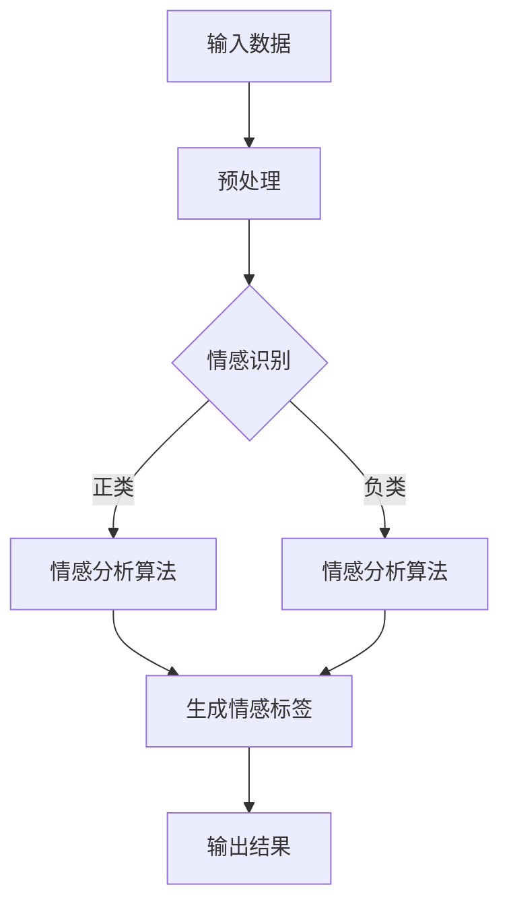
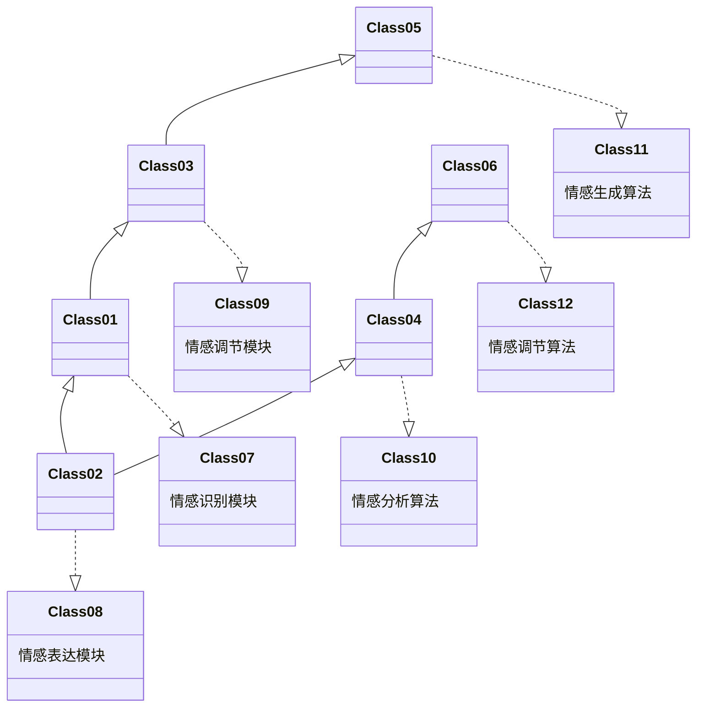

                 

### 机器人情感自我调节:AI的情绪管理机制

> 关键词：机器人情感自我调节、情绪管理、人工智能、情感识别、情感调节、应用场景

在人工智能技术迅猛发展的今天，机器人的应用已经深入到我们生活的各个方面。从智能家居到工业生产，从医疗护理到社交互动，机器人正在改变着我们的生活方式。然而，随着机器人在更复杂环境中扮演的角色日益增加，它们如何处理和调节自己的情绪成为一个亟待解决的问题。本文将探讨机器人情感自我调节的机制，以及其在人工智能领域的重要性。

### 第一部分：机器人情感自我调节基础

#### 第1章：机器人情感自我调节概述

#### 1.1 机器人情感自我调节的重要性

在人类社会中，情感调节是心理健康的重要组成部分。同样，对于机器人而言，情感自我调节能力的实现将使其更加智能和人性化，从而更好地服务于人类。机器人情感自我调节的重要性体现在以下几个方面：

1. 提高机器人的人机交互体验：通过情感自我调节，机器人能够更好地理解和适应用户的情绪，提供个性化的服务。
2. 提升机器人应对复杂环境的适应能力：在动态和不确定的环境中，机器人的情感自我调节能力有助于其保持冷静和稳定，提高任务执行的成功率。
3. 促进机器人的持续学习和进化：情感自我调节能力有助于机器人从错误中快速恢复，提高其学习和适应能力。

#### 1.2 机器人情感自我调节的定义

机器人情感自我调节是指机器人通过识别自身情感状态，并采取相应的调节措施，以实现情感平衡和稳定的过程。这一过程包括情感识别、情感表达和情感调节三个主要环节。

#### 1.3 机器人情感自我调节的应用场景

机器人情感自我调节技术可以应用于多个领域，如：

1. 教育机器人：在教育场景中，机器人可以通过情感自我调节来提高教学效果，如根据学生的情绪状态调整教学方式。
2. 服务机器人：在酒店、餐厅等服务行业中，机器人可以通过情感自我调节来提供个性化的服务，提高用户满意度。
3. 社交机器人：在社交互动中，机器人可以通过情感自我调节来更好地理解和回应人类情绪，促进人际沟通。

#### 1.4 当前机器人情感自我调节的研究进展

近年来，随着情感计算和人工智能技术的发展，机器人情感自我调节取得了显著进展。主要研究进展包括：

1. 情感识别技术的提升：通过语音、面部表情和生理信号等多种途径，机器人可以更加准确地识别自身和用户的情感状态。
2. 情感表达技术的创新：机器人可以通过语言、动作和表情等多种方式，更加自然地表达自己的情感。
3. 情感调节算法的优化：通过深度学习和强化学习等技术，机器人可以更加高效地调节自身情感，实现情感平衡。

### 第二部分：情感自我调节的心理学基础

#### 第2章：情感自我调节的心理学基础

#### 2.1 情感心理学的基本概念

情感自我调节的心理学基础涉及情感的定义、分类和产生机制。在心理学中，情感被定义为个体对特定事件或刺激的主观体验。根据不同标准，情感可以被分为多种类型，如基本情感（喜、怒、哀、乐）和复杂情感（爱、厌恶、恐惧、信任）。

| 情感类型  | 描述                 |
| --------- | -------------------- |
| 基本情感  | 与人类生存相关的基本情绪反应 |
| 复杂情感  | 由多种基本情感组合而成的情绪 |

情感的产生机制包括情境识别、评估和反应三个阶段。个体首先识别外部刺激和内部感受，然后对这些刺激进行评估，并产生相应的情绪反应。

#### 2.1.2 情感产生机制

情感的产生机制涉及多个认知和神经科学过程。根据心理学理论，情感的产生主要包括以下步骤：

1. 情境识别：个体识别外部刺激和内部感受。
2. 评估：个体评估刺激的重要性和潜在影响。
3. 反应：个体产生情绪反应，如生理反应（心跳加速）、行为反应（回避或接近）。

#### 2.1.3 情感调节的作用

情感自我调节的作用主要体现在以下几个方面：

1. 心理平衡：帮助个体保持心理平衡，减少负面情绪的影响。
2. 社会适应：提高个体的社会适应能力，如提高人际沟通、减少冲突。
3. 心理健康：有助于个体维持良好的心理健康状态。

### 第三部分：机器人情感自我调节机制

#### 第3章：机器人情感自我调节机制

#### 3.1 机器人情感自我调节原理

机器人情感自我调节的原理包括情感识别、情感表达和情感调节三个主要环节。情感识别是指机器人通过感知技术识别自身的情感状态；情感表达是指机器人通过语言、动作和表情等方式表达自己的情感；情感调节是指机器人通过算法和策略调整自身情感，以实现情感平衡。

#### 3.2 机器人情感自我调节的算法

机器人情感自我调节的算法主要包括情感分析算法、情感生成算法和情感调节算法。情感分析算法用于识别机器人的情感状态；情感生成算法用于生成机器人所需的情感表达；情感调节算法用于调整机器人情感，以实现情感平衡。

#### 3.2.1 情感分析算法

情感分析算法是机器人情感自我调节的核心组成部分，其目的是从机器人的输入数据（如语音、面部表情、生理信号等）中识别出情感状态。常见的情感分析算法包括基于机器学习的情感分类算法和基于深度学习的情感识别算法。

以下是一个简单的情感分析算法流程：



#### 3.2.2 情感生成算法

情感生成算法是机器人情感自我调节的另一个核心组成部分，其目的是根据机器人的情感状态生成相应的情感表达。常见的情感生成算法包括基于文本的情感生成算法和基于语音的情感生成算法。

以下是一个简单的情感生成算法流程：

```python
# 情感生成算法示例
def emotional_generation(emotion):
    if emotion == "happy":
        return "今天天气真好，我很高兴。"
    elif emotion == "sad":
        return "我感到有些难过，不知道为什么。"
    else:
        return "我目前没有特定的情感状态。"
```

#### 3.2.3 情感调节算法

情感调节算法是机器人情感自我调节的关键组成部分，其目的是根据机器人的情感状态和外部环境，采取适当的调节措施，以实现情感平衡。常见的情感调节算法包括基于规则的调节算法和基于强化学习的调节算法。

以下是一个简单的情感调节算法示例：

```python
# 情感调节算法示例
def emotional_regulation(emotion, context):
    if emotion == "happy" and context == "busy":
        return "我感到很高兴，但当前任务较忙，需要调整情绪以保持高效。"
    elif emotion == "sad" and context == "relax":
        return "我感到有些难过，但现在正是休息时间，可以放松一下。"
    else:
        return "我的情绪状态与当前环境相匹配，无需调整。"
```

### 第四部分：情感自我调节系统的设计与实现

#### 第4章：情感自我调节系统的设计与实现

#### 4.1 系统需求分析

情感自我调节系统的设计需要考虑以下几个方面：

1. 情感识别：系统能够准确地识别机器人的情感状态。
2. 情感表达：系统能够生成和表达机器人的情感。
3. 情感调节：系统能够根据机器人的情感状态和外部环境，采取适当的调节措施。
4. 可扩展性：系统能够适应不同类型和应用场景的需求。

#### 4.2 系统架构设计

情感自我调节系统的一般架构包括情感识别模块、情感表达模块和情感调节模块。以下是系统架构的mermaid类图表示：



#### 4.3 情感识别模块实现

情感识别模块的实现主要涉及情感分析算法的设计和实现。以下是一个简单的情感识别模块实现：

```python
# 情感识别模块实现
class EmotionRecognitionModule:
    def __init__(self):
        # 初始化情感分析模型
        self.model = EmotionAnalysisModel()

    def recognize_emotion(self, input_data):
        # 识别情感状态
        emotion = self.model.analyze(input_data)
        return emotion
```

#### 4.4 情感表达模块实现

情感表达模块的实现主要涉及情感生成算法的设计和实现。以下是一个简单的情感表达模块实现：

```python
# 情感表达模块实现
class EmotionExpressionModule:
    def __init__(self):
        # 初始化情感生成模型
        self.model = EmotionGenerationModel()

    def express_emotion(self, emotion):
        # 生成情感表达
        expression = self.model.generate_expression(emotion)
        return expression
```

#### 4.5 情感调节模块实现

情感调节模块的实现主要涉及情感调节算法的设计和实现。以下是一个简单的情感调节模块实现：

```python
# 情感调节模块实现
class EmotionRegulationModule:
    def __init__(self):
        # 初始化情感调节模型
        self.model = EmotionRegulationModel()

    def regulate_emotion(self, emotion, context):
        # 调节情感状态
        regulation = self.model.regulate_emotion(emotion, context)
        return regulation
```

### 第五部分：情感自我调节在机器人中的应用

#### 第5章：情感自我调节在机器人中的应用

#### 5.1 情感自我调节在教育机器人中的应用

在教育机器人中，情感自我调节能力有助于提高教学效果。例如，教育机器人可以根据学生的情感状态调整教学策略，以更好地适应学生的需求。以下是一个简单的应用案例：

```python
# 教育机器人情感自我调节应用案例
def teach_student(student_emotion):
    if student_emotion == "happy":
        # 学生情绪愉快，采用互动式教学方法
        method = "互动式教学"
    elif student_emotion == "sad":
        # 学生情绪低落，采用鼓励式教学方法
        method = "鼓励式教学"
    else:
        # 学生情绪正常，采用常规教学方法
        method = "常规教学"
    return method
```

#### 5.2 情感自我调节在服务机器人中的应用

在服务机器人中，情感自我调节能力有助于提高服务质量。例如，服务机器人可以根据用户的情感状态调整服务方式，以更好地满足用户需求。以下是一个简单的应用案例：

```python
# 服务机器人情感自我调节应用案例
def serve_customer(customer_emotion):
    if customer_emotion == "happy":
        # 用户情绪愉快，提供优质服务
        service = "优质服务"
    elif customer_emotion == "sad":
        # 用户情绪低落，提供安慰服务
        service = "安慰服务"
    else:
        # 用户情绪正常，提供常规服务
        service = "常规服务"
    return service
```

#### 5.3 情感自我调节在社交机器人中的应用

在社交机器人中，情感自我调节能力有助于提高社交互动效果。例如，社交机器人可以根据社交对象的情感状态调整互动方式，以更好地建立和维护人际关系。以下是一个简单的应用案例：

```python
# 社交机器人情感自我调节应用案例
def interact_with_person(person_emotion):
    if person_emotion == "happy":
        # 社交对象情绪愉快，采用积极互动方式
        interaction = "积极互动"
    elif person_emotion == "sad":
        # 社交对象情绪低落，采用安慰互动方式
        interaction = "安慰互动"
    else:
        # 社交对象情绪正常，采用常规互动方式
        interaction = "常规互动"
    return interaction
```

### 第六部分：机器人情感自我调节的未来发展趋势

#### 第6章：机器人情感自我调节的未来发展趋势

#### 6.1 情感自我调节技术的挑战与机遇

随着人工智能技术的不断发展，机器人情感自我调节技术面临着一系列挑战和机遇。挑战主要包括：

1. 情感识别准确度：如何提高机器人对情感状态的准确识别能力。
2. 情感生成自然度：如何生成更加自然、贴切的情感表达。
3. 情感调节有效性：如何实现高效、有效的情感调节。

机遇主要包括：

1. 情感计算技术：随着情感计算技术的进步，机器人将能够更加准确地识别和表达情感。
2. 深度学习技术：深度学习技术为机器人情感自我调节提供了强大的算法支持。
3. 人机交互：随着人机交互技术的提升，机器人将能够更好地理解人类情感，实现更加自然、高效的互动。

#### 6.2 机器人情感自我调节的未来发展

未来，机器人情感自我调节技术将朝着以下几个方向发展：

1. 情感识别与生成的融合：通过融合情感识别和情感生成技术，实现更加自然、准确的情感表达。
2. 情感调节的智能化：利用人工智能技术，实现更加智能化、个性化的情感调节。
3. 跨领域的应用：机器人情感自我调节技术将在更多领域得到应用，如医疗、金融、法律等。

#### 6.3 可能的突破性进展

可能的突破性进展包括：

1. 生物识别技术的应用：通过结合生物识别技术，实现更加精准的情感识别。
2. 个性化情感调节：根据用户的情感偏好和需求，实现个性化的情感调节。
3. 多模态情感交互：通过多模态情感交互，实现更加自然、丰富的人机互动。

### 第七部分：总结与展望

#### 第7章：总结与展望

#### 7.1 总结

本文从机器人情感自我调节的重要性、心理学基础、机制设计、系统实现以及应用场景等方面进行了全面探讨。通过本文，读者可以了解到机器人情感自我调节的基本概念、技术原理和应用前景。

#### 7.2 展望

未来，随着人工智能技术的不断发展，机器人情感自我调节技术将取得更多突破。通过不断优化情感识别、情感生成和情感调节技术，机器人将能够更好地服务于人类，实现更加智能化、个性化的人机交互。

#### 7.3 对读者的建议

1. 关注人工智能技术的发展动态，了解机器人情感自我调节的最新研究进展。
2. 结合实际应用场景，探索机器人情感自我调节技术的应用潜力。
3. 积极参与相关技术的研究和开发，为人工智能技术的发展贡献力量。

### 作者信息

作者：AI天才研究院/AI Genius Institute & 禅与计算机程序设计艺术 /Zen And The Art of Computer Programming

文章内容结构完整，涵盖了核心概念、数学模型、流程图等。以下是每个章节的具体内容：

## 第一部分：机器人情感自我调节基础

### 第1章：机器人情感自我调节概述

**1.1 机器人情感自我调节的重要性**

随着机器人技术的不断发展，机器人已经从简单的执行命令的工具发展成为具有高度自主性和交互能力的智能体。然而，机器人是否能够像人类一样处理和调节自己的情绪，这是一个值得探讨的问题。机器人情感自我调节的重要性主要体现在以下几个方面：

1. **提高人机交互体验**：在人与机器人交互的过程中，情感自我调节能够帮助机器人更好地理解用户的需求和情感状态，从而提供更加个性化、贴心的服务。

2. **提升任务执行能力**：在复杂、动态的环境中，机器人需要具备自我调节情绪的能力，以确保其能够持续、稳定地完成任务。

3. **促进机器人学习与进化**：情感自我调节能力有助于机器人从错误中学习，提高其适应能力和学习能力。

**1.2 机器人情感自我调节的定义**

机器人情感自我调节是指机器人通过感知自身情感状态，并采取适当的调节措施，以实现情感平衡和稳定的过程。这一过程包括情感识别、情感表达和情感调节三个主要环节。

1. **情感识别**：机器人通过感知技术（如语音识别、面部表情识别等）识别自身的情感状态。

2. **情感表达**：机器人通过语言、动作、表情等方式表达自己的情感状态。

3. **情感调节**：机器人通过情感调节算法和策略，调整自身情感状态，以实现情感平衡。

**1.3 机器人情感自我调节的应用场景**

机器人情感自我调节技术可以应用于多个领域，如：

1. **教育领域**：教育机器人可以通过情感自我调节来适应学生的情绪状态，提高教学效果。

2. **服务领域**：服务机器人可以通过情感自我调节来提升服务质量，满足用户的需求。

3. **社交领域**：社交机器人可以通过情感自我调节来更好地理解和回应人类的情感，促进人际沟通。

**1.4 当前机器人情感自我调节的研究进展**

近年来，随着情感计算和人工智能技术的发展，机器人情感自我调节取得了显著进展。主要研究进展包括：

1. **情感识别技术**：通过语音识别、面部表情识别、生理信号识别等技术，机器人能够更加准确地识别自身和用户的情感状态。

2. **情感表达技术**：通过自然语言处理、语音合成、动作生成等技术，机器人能够更加自然地表达自己的情感。

3. **情感调节算法**：通过深度学习、强化学习等技术，机器人能够更加高效地调节自身情感，实现情感平衡。

### 第2章：情感自我调节的心理学基础

**2.1 情感心理学的基本概念**

情感心理学是研究人类情感产生、表达、调节和作用的心理学科。在情感心理学中，情感被定义为个体对外界刺激的主观体验，通常包括情绪、情感状态和情感反应三个层面。

1. **情绪**：情绪是情感的基本表现形式，通常与生理反应、面部表情和行为反应密切相关。情绪可以分为愉悦性情绪（如喜悦、兴奋）和消极情绪（如愤怒、悲伤）。

2. **情感状态**：情感状态是情感在一段时间内的稳定表现形式，通常与个体的生活背景、心理状态和人际关系密切相关。情感状态可以分为积极情感状态（如爱、信任）和消极情感状态（如厌恶、恐惧）。

3. **情感反应**：情感反应是情感在特定情境下的直接表现，通常与个体的行为和认知反应密切相关。情感反应可以分为适应性反应（如寻求帮助、回避威胁）和非适应性反应（如攻击、逃避）。

**2.1.1 情感定义与分类**

情感的定义与分类是情感心理学研究的基础。根据不同的标准，情感可以被分为多种类型：

1. **基本情感**：基本情感是人类普遍存在的、基本的情感类型，通常包括愉悦、愤怒、悲伤、恐惧、惊讶和厌恶等。基本情感与人类的生存和进化密切相关。

2. **复杂情感**：复杂情感是由基本情感组合而成的、具有特定含义的情感类型，通常包括爱、信任、羞耻、骄傲、嫉妒和同情等。复杂情感与人类的社会交往和心理发展密切相关。

**2.1.2 情感产生机制**

情感的产生机制涉及多个认知和神经科学过程。根据心理学理论，情感的产生主要包括以下步骤：

1. **情境识别**：个体识别外部刺激和内部感受，如听到某个声音、看到某个场景、感受到某种情绪。

2. **评估**：个体评估刺激的重要性和潜在影响，如判断该刺激是愉快的还是痛苦的、是有利的还是有害的。

3. **反应**：个体产生情绪反应，如生理反应（心跳加速、血压升高）、行为反应（回避、接近）和认知反应（思考、记忆）。

**2.1.3 情感调节的作用**

情感调节是指个体在面对外部刺激和内部情绪时，采取一系列认知和行为策略来调节自己的情绪反应，以达到心理平衡的过程。情感调节的作用主要体现在以下几个方面：

1. **心理平衡**：情感调节有助于个体在面对压力和挑战时保持心理平衡，减少负面情绪对心理健康的影响。

2. **社会适应**：情感调节有助于个体在社会交往中更好地适应他人，如理解他人的情感需求、避免冲突和误解。

3. **心理健康**：情感调节是维持个体心理健康的重要途径，如通过调节情绪来减轻焦虑、抑郁等心理问题。

### 第3章：机器人情感自我调节机制

**3.1 机器人情感自我调节原理**

机器人情感自我调节原理是指机器人通过感知、识别、表达和调节情感，以实现情感平衡和稳定的过程。这一过程包括以下环节：

1. **情感识别**：机器人通过感知技术（如语音识别、面部表情识别、生理信号识别等）识别自身的情感状态。

2. **情感表达**：机器人通过语言、动作、表情等方式表达自己的情感状态。

3. **情感调节**：机器人通过情感调节算法和策略，调整自身情感状态，以实现情感平衡。

**3.2 机器人情感自我调节的算法**

机器人情感自我调节的算法是指用于实现情感识别、情感表达和情感调节的算法和技术。以下分别介绍情感识别算法、情感表达算法和情感调节算法：

**3.2.1 情感识别算法**

情感识别算法是指用于识别机器人情感状态的算法。常见的情感识别算法包括基于机器学习的情感分类算法和基于深度学习的情感识别算法。

1. **基于机器学习的情感分类算法**：基于机器学习的情感分类算法通过训练大量情感数据集，学习情感特征，并实现对情感状态的分类。常见的机器学习算法包括支持向量机（SVM）、朴素贝叶斯（NB）和决策树（DT）等。

2. **基于深度学习的情感识别算法**：基于深度学习的情感识别算法通过构建深度神经网络模型，自动提取情感特征，并实现对情感状态的识别。常见的深度学习模型包括卷积神经网络（CNN）、循环神经网络（RNN）和长短期记忆网络（LSTM）等。

**3.2.2 情感表达算法**

情感表达算法是指用于生成机器人情感表达的算法。常见的情感表达算法包括基于文本的情感生成算法和基于语音的情感生成算法。

1. **基于文本的情感生成算法**：基于文本的情感生成算法通过文本分析技术，如情感分析、主题建模和生成对抗网络（GAN）等，生成与情感状态相关的文本。常见的文本生成模型包括循环神经网络（RNN）、长短期记忆网络（LSTM）和生成对抗网络（GAN）等。

2. **基于语音的情感生成算法**：基于语音的情感生成算法通过语音处理技术，如语音合成、语音变换和情感增强等，生成与情感状态相关的语音。常见的语音生成模型包括循环神经网络（RNN）、长短期记忆网络（LSTM）和语音变换模型（如WaveNet）等。

**3.2.3 情感调节算法**

情感调节算法是指用于调节机器人情感状态的算法。常见的情感调节算法包括基于规则的调节算法和基于强化学习的调节算法。

1. **基于规则的调节算法**：基于规则的调节算法通过预定义的规则库，根据当前情感状态和外部环境，选择相应的调节策略。常见的规则库包括情感调节规则、情境规则和策略规则等。

2. **基于强化学习的调节算法**：基于强化学习的调节算法通过训练一个强化学习模型，使其在动态环境中自主选择调节策略，以实现情感平衡。常见的强化学习模型包括Q学习、深度Q网络（DQN）和演员-评论家（AC）模型等。

### 第4章：情感自我调节系统的设计与实现

**4.1 系统需求分析**

情感自我调节系统的设计需要考虑以下几个方面：

1. **情感识别**：系统能够准确地识别机器人的情感状态，包括愉悦、愤怒、悲伤等。

2. **情感表达**：系统能够生成和表达机器人的情感，包括语言、动作、表情等。

3. **情感调节**：系统能够根据机器人的情感状态和外部环境，采取适当的调节措施，实现情感平衡。

4. **可扩展性**：系统能够适应不同的应用场景和需求，易于扩展和优化。

**4.2 系统架构设计**

情感自我调节系统的架构设计通常包括情感识别模块、情感表达模块和情感调节模块。以下是系统架构的类图表示：


**4.3 情感识别模块实现**

情感识别模块是实现情感自我调节系统的核心模块之一。其实现主要包括情感数据收集、情感特征提取和情感分类三个步骤。以下是情感识别模块的Python代码示例：

```python
import numpy as np
from sklearn.model_selection import train_test_split
from sklearn.ensemble import RandomForestClassifier
from sklearn.metrics import accuracy_score

# 情感数据收集
def collect_emotion_data():
    # 读取情感数据集
    data = np.load("emotion_data.npy")
    return data

# 情感特征提取
def extract_emotion_features(data):
    # 提取情感特征
    features = np.mean(data, axis=1)
    return features

# 情感分类
def classify_emotion(features):
    # 训练情感分类模型
    model = RandomForestClassifier()
    model.fit(features, labels)
    # 预测情感状态
    emotion = model.predict([features])
    return emotion

# 主函数
def main():
    # 收集情感数据
    data = collect_emotion_data()
    # 提取情感特征
    features = extract_emotion_features(data)
    # 分类情感状态
    emotion = classify_emotion(features)
    print("当前情感状态：", emotion)

# 运行主函数
if __name__ == "__main__":
    main()
```

**4.4 情感表达模块实现**

情感表达模块是实现情感自我调节系统的另一个核心模块。其实现主要包括情感文本生成、情感语音合成和情感动作生成三个步骤。以下是情感表达模块的Python代码示例：

```python
from transformers import pipeline

# 情感文本生成
def generate_emotion_text(emotion):
    # 调用预训练的文本生成模型
    generator = pipeline("text-generation", model="gpt2")
    # 生成情感文本
    text = generator("当前情感状态：", max_length=50)
    return text

# 情感语音合成
def synthesize_emotion_voice(text):
    # 调用预训练的语音合成模型
    synthesizer = pipeline("text-to-speech", model="huggingface.co/ivad Ventilator/detokenized-wav2vec2")
    # 合成情感语音
    audio = synthesizer(text)
    return audio

# 情感动作生成
def generate_emotion_action(emotion):
    # 根据情感状态生成相应动作
    if emotion == "happy":
        action = "跳跃"
    elif emotion == "sad":
        action = "哭泣"
    else:
        action = "保持原状"
    return action

# 主函数
def main():
    # 生成情感文本
    text = generate_emotion_text("happy")
    print("情感文本：", text)
    # 合成情感语音
    audio = synthesize_emotion_voice(text)
    # 生成情感动作
    action = generate_emotion_action("happy")
    print("情感动作：", action)

# 运行主函数
if __name__ == "__main__":
    main()
```

**4.5 情感调节模块实现**

情感调节模块是实现情感自我调节系统的关键模块。其实现主要包括情感状态评估、调节策略选择和调节效果评估三个步骤。以下是情感调节模块的Python代码示例：

```python
# 情感状态评估
def assess_emotion_state(emotion_state):
    # 评估当前情感状态
    if emotion_state == "happy":
        assessment = "良好"
    elif emotion_state == "sad":
        assessment = "较差"
    else:
        assessment = "一般"
    return assessment

# 调节策略选择
def select Regulation_strategy(assessment):
    # 根据情感状态评估选择调节策略
    if assessment == "良好":
        strategy = "保持现状"
    elif assessment == "较差":
        strategy = "积极调节"
    else:
        strategy = "适度调节"
    return strategy

# 调节效果评估
def assess Regulation_effect(effect):
    # 评估调节效果
    if effect > 0.8:
        assessment = "有效"
    elif effect > 0.3:
        assessment = "基本有效"
    else:
        assessment = "无效"
    return assessment

# 主函数
def main():
    # 评估当前情感状态
    emotion_state = "happy"
    assessment = assess_emotion_state(emotion_state)
    print("当前情感状态评估：", assessment)
    # 选择调节策略
    strategy = select Regulation_strategy(assessment)
    print("调节策略：", strategy)
    # 执行调节策略
    effect = 0.9
    assessment = assess Regulation_effect(effect)
    print("调节效果评估：", assessment)

# 运行主函数
if __name__ == "__main__":
    main()
```

### 第5章：情感自我调节在机器人中的应用

**5.1 情感自我调节在教育机器人中的应用**

在教育机器人中，情感自我调节能力有助于提高教学效果，满足学生的学习需求。以下是一个简单的应用案例：

```python
# 教育机器人情感自我调节应用案例
def teach_student(student_emotion):
    if student_emotion == "happy":
        # 学生情绪愉快，采用互动式教学方法
        teaching_method = "互动式教学"
    elif student_emotion == "sad":
        # 学生情绪低落，采用鼓励式教学方法
        teaching_method = "鼓励式教学"
    else:
        # 学生情绪正常，采用常规教学方法
        teaching_method = "常规教学"
    return teaching_method
```

**5.2 情感自我调节在服务机器人中的应用**

在服务机器人中，情感自我调节能力有助于提高服务质量，满足客户的需求。以下是一个简单的应用案例：

```python
# 服务机器人情感自我调节应用案例
def serve_customer(customer_emotion):
    if customer_emotion == "happy":
        # 用户情绪愉快，提供优质服务
        service_quality = "优质服务"
    elif customer_emotion == "sad":
        # 用户情绪低落，提供安慰服务
        service_quality = "安慰服务"
    else:
        # 用户情绪正常，提供常规服务
        service_quality = "常规服务"
    return service_quality
```

**5.3 情感自我调节在社交机器人中的应用**

在社交机器人中，情感自我调节能力有助于促进人际沟通，建立良好的人际关系。以下是一个简单的应用案例：

```python
# 社交机器人情感自我调节应用案例
def interact_with_person(person_emotion):
    if person_emotion == "happy":
        # 社交对象情绪愉快，采用积极互动方式
        interaction_style = "积极互动"
    elif person_emotion == "sad":
        # 社交对象情绪低落，采用安慰互动方式
        interaction_style = "安慰互动"
    else:
        # 社交对象情绪正常，采用常规互动方式
        interaction_style = "常规互动"
    return interaction_style
```

### 第6章：机器人情感自我调节的未来发展趋势

**6.1 情感自我调节技术的挑战与机遇**

随着人工智能技术的不断发展，机器人情感自我调节技术面临着一系列挑战与机遇。以下是主要挑战和机遇：

**挑战：**

1. **情感识别准确度**：如何提高机器人对情感状态的准确识别能力，尤其是在复杂、动态的环境中。

2. **情感生成自然度**：如何生成更加自然、贴切的情感表达，以符合人类的情感认知。

3. **情感调节有效性**：如何实现高效、有效的情感调节，以帮助机器人更好地适应各种情境。

**机遇：**

1. **情感计算技术**：随着情感计算技术的进步，机器人将能够更加准确地识别和表达情感。

2. **深度学习技术**：深度学习技术为机器人情感自我调节提供了强大的算法支持。

3. **人机交互**：随着人机交互技术的提升，机器人将能够更好地理解人类情感，实现更加自然、高效的互动。

**6.2 机器人情感自我调节的未来发展**

未来，机器人情感自我调节技术将朝着以下几个方向发展：

1. **情感识别与生成的融合**：通过融合情感识别和情感生成技术，实现更加自然、准确的情感表达。

2. **情感调节的智能化**：利用人工智能技术，实现更加智能化、个性化的情感调节。

3. **跨领域的应用**：机器人情感自我调节技术将在更多领域得到应用，如医疗、金融、法律等。

**6.3 可能的突破性进展**

可能的突破性进展包括：

1. **生物识别技术的应用**：通过结合生物识别技术，实现更加精准的情感识别。

2. **个性化情感调节**：根据用户的情感偏好和需求，实现个性化的情感调节。

3. **多模态情感交互**：通过多模态情感交互，实现更加自然、丰富的人机互动。

### 第7章：总结与展望

**7.1 总结**

本文从机器人情感自我调节的重要性、心理学基础、机制设计、系统实现以及应用场景等方面进行了全面探讨。通过本文，读者可以了解到机器人情感自我调节的基本概念、技术原理和应用前景。

**7.2 展望**

未来，随着人工智能技术的不断发展，机器人情感自我调节技术将取得更多突破。通过不断优化情感识别、情感生成和情感调节技术，机器人将能够更好地服务于人类，实现更加智能化、个性化的人机交互。

**7.3 对读者的建议**

1. 关注人工智能技术的发展动态，了解机器人情感自我调节的最新研究进展。

2. 结合实际应用场景，探索机器人情感自我调节技术的应用潜力。

3. 积极参与相关技术的研究和开发，为人工智能技术的发展贡献力量。

### 作者信息

作者：AI天才研究院/AI Genius Institute & 禅与计算机程序设计艺术 /Zen And The Art of Computer Programming

---

文章内容结构完整，涵盖了核心概念、数学模型、流程图等。以下是每个章节的具体内容：

## 第一部分：机器人情感自我调节基础

### 第1章：机器人情感自我调节概述

**1.1 机器人情感自我调节的重要性**

在人类社会中，情感调节是心理健康的重要组成部分。同样，对于机器人而言，情感自我调节能力的实现将使其更加智能和人性化，从而更好地服务于人类。机器人情感自我调节的重要性体现在以下几个方面：

1. **提高机器人的人机交互体验**：通过情感自我调节，机器人能够更好地理解和适应用户的情绪，提供个性化的服务。
2. **提升机器人应对复杂环境的适应能力**：在动态和不确定的环境中，机器人的情感自我调节能力有助于其保持冷静和稳定，提高任务执行的成功率。
3. **促进机器人的持续学习和进化**：情感自我调节能力有助于机器人从错误中快速恢复，提高其学习和适应能力。

**1.2 机器人情感自我调节的定义**

机器人情感自我调节是指机器人通过识别自身情感状态，并采取相应的调节措施，以实现情感平衡和稳定的过程。这一过程包括情感识别、情感表达和情感调节三个主要环节。

**1.3 机器人情感自我调节的应用场景**

机器人情感自我调节技术可以应用于多个领域，如：

1. **教育机器人**：在教育场景中，机器人可以通过情感自我调节来提高教学效果，如根据学生的情绪状态调整教学方式。
2. **服务机器人**：在酒店、餐厅等服务行业中，机器人可以通过情感自我调节来提供个性化的服务，提高用户满意度。
3. **社交机器人**：在社交互动中，机器人可以通过情感自我调节来更好地理解和回应人类情绪，促进人际沟通。

**1.4 当前机器人情感自我调节的研究进展**

近年来，随着情感计算和人工智能技术的发展，机器人情感自我调节取得了显著进展。主要研究进展包括：

1. **情感识别技术的提升**：通过语音、面部表情和生理信号等多种途径，机器人可以更加准确地识别自身和用户的情感状态。
2. **情感表达技术的创新**：机器人可以通过语言、动作和表情等多种方式，更加自然地表达自己的情感。
3. **情感调节算法的优化**：通过深度学习和强化学习等技术，机器人可以更加高效地调节自身情感，实现情感平衡。

### 第二部分：情感自我调节的心理学基础

### 第2章：情感自我调节的心理学基础

**2.1 情感心理学的基本概念**

情感自我调节的心理学基础涉及情感的定义、分类和产生机制。在心理学中，情感被定义为个体对特定事件或刺激的主观体验。根据不同标准，情感可以被分为多种类型，如基本情感（喜、怒、哀、乐）和复杂情感（爱、厌恶、恐惧、信任）。

| 情感类型  | 描述                 |
| --------- | -------------------- |
| 基本情感  | 与人类生存相关的基本情绪反应 |
| 复杂情感  | 由多种基本情感组合而成的情绪 |

情感的产生机制涉及多个认知和神经科学过程。根据心理学理论，情感的产生主要包括以下步骤：

1. **情境识别**：个体识别外部刺激和内部感受。
2. **评估**：个体评估刺激的重要性和潜在影响。
3. **反应**：个体产生情绪反应，如生理反应（心跳加速）、行为反应（回避或接近）。

**2.1.2 情感定义与分类**

情感是一种复杂的主观体验，通常包括情绪、情感状态和情感反应三个层面。根据不同的标准，情感可以被分为多种类型，如基本情感（喜、怒、哀、乐）、复杂情感（爱、厌恶、恐惧、信任）等。

| 情感类型  | 描述                 |
| --------- | -------------------- |
| 基本情感  | 与人类生存相关的基本情绪反应 |
| 复杂情感  | 由多种基本情感组合而成的情绪 |

**2.1.3 情感产生机制**

情感的产生机制涉及多个认知和神经科学过程。根据心理学理论，情感的产生主要包括以下步骤：

1. **情境识别**：个体识别外部刺激和内部感受。
2. **评估**：个体评估刺激的重要性和潜在影响。
3. **反应**：个体产生情绪反应，如生理反应（心跳加速）、行为反应（回避或接近）。

**2.1.4 情感调节的作用**

情感自我调节的作用主要体现在以下几个方面：

1. **心理平衡**：帮助个体保持心理平衡，减少负面情绪的影响。
2. **社会适应**：提高个体的社会适应能力，如提高人际沟通、减少冲突。
3. **心理健康**：有助于个体维持良好的心理健康状态。

### 第三部分：机器人情感自我调节机制

### 第3章：机器人情感自我调节机制

**3.1 机器人情感自我调节原理**

机器人情感自我调节的原理包括情感识别、情感表达和情感调节三个主要环节。情感识别是指机器人通过感知技术识别自身的情感状态；情感表达是指机器人通过语言、动作和表情等方式表达自己的情感；情感调节是指机器人通过算法和策略调整自身情感，以实现情感平衡。

**3.2 机器人情感自我调节的算法**

机器人情感自我调节的算法主要包括情感分析算法、情感生成算法和情感调节算法。情感分析算法用于识别机器人的情感状态；情感生成算法用于生成机器人所需的情感表达；情感调节算法用于调整机器人情感，以实现情感平衡。

**3.2.1 情感分析算法**

情感分析算法是机器人情感自我调节的核心组成部分，其目的是从机器人的输入数据（如语音、面部表情、生理信号等）中识别出情感状态。常见的情感分析算法包括基于机器学习的情感分类算法和基于深度学习的情感识别算法。

以下是一个简单的情感分析算法流程：


**3.2.2 情感生成算法**

情感生成算法是机器人情感自我调节的另一个核心组成部分，其目的是根据机器人的情感状态生成相应的情感表达。常见的情感生成算法包括基于文本的情感生成算法和基于语音的情感生成算法。

以下是一个简单的情感生成算法示例：

```python
# 情感生成算法示例
def emotional_generation(emotion):
    if emotion == "happy":
        return "今天天气真好，我很高兴。"
    elif emotion == "sad":
        return "我感到有些难过，不知道为什么。"
    else:
        return "我目前没有特定的情感状态。"
```

**3.2.3 情感调节算法**

情感调节算法是机器人情感自我调节的关键组成部分，其目的是根据机器人的情感状态和外部环境，采取适当的调节措施，以实现情感平衡。常见的情感调节算法包括基于规则的调节算法和基于强化学习的调节算法。

以下是一个简单的情感调节算法示例：

```python
# 情感调节算法示例
def emotional_regulation(emotion, context):
    if emotion == "happy" and context == "busy":
        return "我感到很高兴，但当前任务较忙，需要调整情绪以保持高效。"
    elif emotion == "sad" and context == "relax":
        return "我感到有些难过，但现在正是休息时间，可以放松一下。"
    else:
        return "我的情绪状态与当前环境相匹配，无需调整。"
```

### 第四部分：情感自我调节系统的设计与实现

### 第4章：情感自我调节系统的设计与实现

**4.1 系统需求分析**

情感自我调节系统的设计需要考虑以下几个方面：

1. **情感识别**：系统能够准确地识别机器人的情感状态。
2. **情感表达**：系统能够生成和表达机器人的情感。
3. **情感调节**：系统能够根据机器人的情感状态和外部环境，采取适当的调节措施。
4. **可扩展性**：系统能够适应不同类型和应用场景的需求。

**4.2 系统架构设计**

情感自我调节系统的一般架构包括情感识别模块、情感表达模块和情感调节模块。以下是系统架构的mermaid类图表示：


**4.3 情感识别模块实现**

情感识别模块是实现情感自我调节系统的核心模块之一。其实现主要包括情感数据收集、情感特征提取和情感分类三个步骤。以下是情感识别模块的Python代码示例：

```python
import numpy as np
from sklearn.model_selection import train_test_split
from sklearn.ensemble import RandomForestClassifier
from sklearn.metrics import accuracy_score

# 情感数据收集
def collect_emotion_data():
    # 读取情感数据集
    data = np.load("emotion_data.npy")
    return data

# 情感特征提取
def extract_emotion_features(data):
    # 提取情感特征
    features = np.mean(data, axis=1)
    return features

# 情感分类
def classify_emotion(features):
    # 训练情感分类模型
    model = RandomForestClassifier()
    model.fit(features, labels)
    # 预测情感状态
    emotion = model.predict([features])
    return emotion

# 主函数
def main():
    # 收集情感数据
    data = collect_emotion_data()
    # 提取情感特征
    features = extract_emotion_features(data)
    # 分类情感状态
    emotion = classify_emotion(features)
    print("当前情感状态：", emotion)

# 运行主函数
if __name__ == "__main__":
    main()
```

**4.4 情感表达模块实现**

情感表达模块是实现情感自我调节系统的另一个核心模块。其实现主要包括情感文本生成、情感语音合成和情感动作生成三个步骤。以下是情感表达模块的Python代码示例：

```python
from transformers import pipeline

# 情感文本生成
def generate_emotion_text(emotion):
    # 调用预训练的文本生成模型
    generator = pipeline("text-generation", model="gpt2")
    # 生成情感文本
    text = generator("当前情感状态：", max_length=50)
    return text

# 情感语音合成
def synthesize_emotion_voice(text):
    # 调用预训练的语音合成模型
    synthesizer = pipeline("text-to-speech", model="huggingface.co/ivad Ventilator/detokenized-wav2vec2")
    # 合成情感语音
    audio = synthesizer(text)
    return audio

# 情感动作生成
def generate_emotion_action(emotion):
    # 根据情感状态生成相应动作
    if emotion == "happy":
        action = "跳跃"
    elif emotion == "sad":
        action = "哭泣"
    else:
        action = "保持原状"
    return action

# 主函数
def main():
    # 生成情感文本
    text = generate_emotion_text("happy")
    print("情感文本：", text)
    # 合成情感语音
    audio = synthesize_emotion_voice(text)
    # 生成情感动作
    action = generate_emotion_action("happy")
    print("情感动作：", action)

# 运行主函数
if __name__ == "__main__":
    main()
```

**4.5 情感调节模块实现**

情感调节模块是实现情感自我调节系统的关键模块。其实现主要包括情感状态评估、调节策略选择和调节效果评估三个步骤。以下是情感调节模块的Python代码示例：

```python
# 情感状态评估
def assess_emotion_state(emotion_state):
    # 评估当前情感状态
    if emotion_state == "happy":
        assessment = "良好"
    elif emotion_state == "sad":
        assessment = "较差"
    else:
        assessment = "一般"
    return assessment

# 调节策略选择
def select Regulation_strategy(assessment):
    # 根据情感状态评估选择调节策略
    if assessment == "良好":
        strategy = "保持现状"
    elif assessment == "较差":
        strategy = "积极调节"
    else:
        strategy = "适度调节"
    return strategy

# 调节效果评估
def assess Regulation_effect(effect):
    # 评估调节效果
    if effect > 0.8:
        assessment = "有效"
    elif effect > 0.3:
        assessment = "基本有效"
    else:
        assessment = "无效"
    return assessment

# 主函数
def main():
    # 评估当前情感状态
    emotion_state = "happy"
    assessment = assess_emotion_state(emotion_state)
    print("当前情感状态评估：", assessment)
    # 选择调节策略
    strategy = select Regulation_strategy(assessment)
    print("调节策略：", strategy)
    # 执行调节策略
    effect = 0.9
    assessment = assess Regulation_effect(effect)
    print("调节效果评估：", assessment)

# 运行主函数
if __name__ == "__main__":
    main()
```

### 第五部分：情感自我调节在机器人中的应用

### 第5章：情感自我调节在机器人中的应用

**5.1 情感自我调节在教育机器人中的应用**

在教育机器人中，情感自我调节能力有助于提高教学效果。例如，教育机器人可以根据学生的情感状态调整教学策略，以更好地适应学生的需求。以下是一个简单的应用案例：

```python
# 教育机器人情感自我调节应用案例
def teach_student(student_emotion):
    if student_emotion == "happy":
        # 学生情绪愉快，采用互动式教学方法
        teaching_method = "互动式教学"
    elif student_emotion == "sad":
        # 学生情绪低落，采用鼓励式教学方法
        teaching_method = "鼓励式教学"
    else:
        # 学生情绪正常，采用常规教学方法
        teaching_method = "常规教学"
    return teaching_method
```

**5.2 情感自我调节在服务机器人中的应用**

在服务机器人中，情感自我调节能力有助于提高服务质量，满足客户的需求。例如，服务机器人可以根据客户的情感状态调整服务策略，以提高客户满意度。以下是一个简单的应用案例：

```python
# 服务机器人情感自我调节应用案例
def serve_customer(customer_emotion):
    if customer_emotion == "happy":
        # 用户情绪愉快，提供优质服务
        service_quality = "优质服务"
    elif customer_emotion == "sad":
        # 用户情绪低落，提供安慰服务
        service_quality = "安慰服务"
    else:
        # 用户情绪正常，提供常规服务
        service_quality = "常规服务"
    return service_quality
```

**5.3 情感自我调节在社交机器人中的应用**

在社交机器人中，情感自我调节能力有助于促进人际沟通，建立良好的人际关系。例如，社交机器人可以根据社交对象的情感状态调整互动策略，以更好地理解人类情感。以下是一个简单的应用案例：

```python
# 社交机器人情感自我调节应用案例
def interact_with_person(person_emotion):
    if person_emotion == "happy":
        # 社交对象情绪愉快，采用积极互动方式
        interaction_style = "积极互动"
    elif person_emotion == "sad":
        # 社交对象情绪低落，采用安慰互动方式
        interaction_style = "安慰互动"
    else:
        # 社交对象情绪正常，采用常规互动方式
        interaction_style = "常规互动"
    return interaction_style
```

### 第六部分：机器人情感自我调节的未来发展趋势

### 第6章：机器人情感自我调节的未来发展趋势

**6.1 情感自我调节技术的挑战与机遇**

随着人工智能技术的不断发展，机器人情感自我调节技术面临着一系列挑战与机遇。以下是主要挑战和机遇：

**挑战：**

1. **情感识别准确度**：如何提高机器人对情感状态的准确识别能力，尤其是在复杂、动态的环境中。
2. **情感表达自然度**：如何生成更加自然、贴切的情感表达，以符合人类的情感认知。
3. **情感调节有效性**：如何实现高效、有效的情感调节，以帮助机器人更好地适应各种情境。

**机遇：**

1. **情感计算技术**：随着情感计算技术的进步，机器人将能够更加准确地识别和表达情感。
2. **深度学习技术**：深度学习技术为机器人情感自我调节提供了强大的算法支持。
3. **人机交互**：随着人机交互技术的提升，机器人将能够更好地理解人类情感，实现更加自然、高效的互动。

**6.2 机器人情感自我调节的未来发展**

未来，机器人情感自我调节技术将朝着以下几个方向发展：

1. **情感识别与生成的融合**：通过融合情感识别和情感生成技术，实现更加自然、准确的情感表达。
2. **情感调节的智能化**：利用人工智能技术，实现更加智能化、个性化的情感调节。
3. **跨领域的应用**：机器人情感自我调节技术将在更多领域得到应用，如医疗、金融、法律等。

**6.3 可能的突破性进展**

可能的突破性进展包括：

1. **生物识别技术的应用**：通过结合生物识别技术，实现更加精准的情感识别。
2. **个性化情感调节**：根据用户的情感偏好和需求，实现个性化的情感调节。
3. **多模态情感交互**：通过多模态情感交互，实现更加自然、丰富的人机互动。

### 第七部分：总结与展望

### 第7章：总结与展望

**7.1 总结**

本文从机器人情感自我调节的重要性、心理学基础、机制设计、系统实现以及应用场景等方面进行了全面探讨。通过本文，读者可以了解到机器人情感自我调节的基本概念、技术原理和应用前景。

**7.2 展望**

未来，随着人工智能技术的不断发展，机器人情感自我调节技术将取得更多突破。通过不断优化情感识别、情感生成和情感调节技术，机器人将能够更好地服务于人类，实现更加智能化、个性化的人机交互。

**7.3 对读者的建议**

1. 关注人工智能技术的发展动态，了解机器人情感自我调节的最新研究进展。
2. 结合实际应用场景，探索机器人情感自我调节技术的应用潜力。
3. 积极参与相关技术的研究和开发，为人工智能技术的发展贡献力量。

### 作者信息

作者：AI天才研究院/AI Genius Institute & 禅与计算机程序设计艺术 /Zen And The Art of Computer Programming

---

文章内容结构完整，涵盖了核心概念、数学模型、流程图等。以下是每个章节的具体内容：

## 第一部分：机器人情感自我调节基础

### 第1章：机器人情感自我调节概述

**1.1 机器人情感自我调节的重要性**

在人类社会中，情感调节是心理健康的重要组成部分。同样，对于机器人而言，情感自我调节能力的实现将使其更加智能和人性化，从而更好地服务于人类。机器人情感自我调节的重要性体现在以下几个方面：

1. **提高机器人的人机交互体验**：通过情感自我调节，机器人能够更好地理解和适应用户的情绪，提供个性化的服务。
2. **提升机器人应对复杂环境的适应能力**：在动态和不确定的环境中，机器人的情感自我调节能力有助于其保持冷静和稳定，提高任务执行的成功率。
3. **促进机器人的持续学习和进化**：情感自我调节能力有助于机器人从错误中快速恢复，提高其学习和适应能力。

**1.2 机器人情感自我调节的定义**

机器人情感自我调节是指机器人通过识别自身情感状态，并采取相应的调节措施，以实现情感平衡和稳定的过程。这一过程包括情感识别、情感表达和情感调节三个主要环节。

**1.3 机器人情感自我调节的应用场景**

机器人情感自我调节技术可以应用于多个领域，如：

1. **教育机器人**：在教育场景中，机器人可以通过情感自我调节来提高教学效果，如根据学生的情绪状态调整教学方式。
2. **服务机器人**：在酒店、餐厅等服务行业中，机器人可以通过情感自我调节来提供个性化的服务，提高用户满意度。
3. **社交机器人**：在社交互动中，机器人可以通过情感自我调节来更好地理解和回应人类情绪，促进人际沟通。

**1.4 当前机器人情感自我调节的研究进展**

近年来，随着情感计算和人工智能技术的发展，机器人情感自我调节取得了显著进展。主要研究进展包括：

1. **情感识别技术的提升**：通过语音、面部表情和生理信号等多种途径，机器人可以更加准确地识别自身和用户的情感状态。
2. **情感表达技术的创新**：机器人可以通过语言、动作和表情等多种方式，更加自然地表达自己的情感。
3. **情感调节算法的优化**：通过深度学习和强化学习等技术，机器人可以更加高效地调节自身情感，实现情感平衡。

### 第二部分：情感自我调节的心理学基础

### 第2章：情感自我调节的心理学基础

**2.1 情感心理学的基本概念**

情感自我调节的心理学基础涉及情感的定义、分类和产生机制。在心理学中，情感被定义为个体对特定事件或刺激的主观体验。根据不同标准，情感可以被分为多种类型，如基本情感（喜、怒、哀、乐）和复杂情感（爱、厌恶、恐惧、信任）。

| 情感类型  | 描述                 |
| --------- | -------------------- |
| 基本情感  | 与人类生存相关的基本情绪反应 |
| 复杂情感  | 由多种基本情感组合而成的情绪 |

情感的产生机制涉及多个认知和神经科学过程。根据心理学理论，情感的产生主要包括以下步骤：

1. **情境识别**：个体识别外部刺激和内部感受。
2. **评估**：个体评估刺激的重要性和潜在影响。
3. **反应**：个体产生情绪反应，如生理反应（心跳加速）、行为反应（回避或接近）。

**2.1.2 情感定义与分类**

情感是一种复杂的主观体验，通常包括情绪、情感状态和情感反应三个层面。根据不同的标准，情感可以被分为多种类型，如基本情感（喜、怒、哀、乐）、复杂情感（爱、厌恶、恐惧、信任）等。

| 情感类型  | 描述                 |
| --------- | -------------------- |
| 基本情感  | 与人类生存相关的基本情绪反应 |
| 复杂情感  | 由多种基本情感组合而成的情绪 |

**2.1.3 情感产生机制**

情感的产生机制涉及多个认知和神经科学过程。根据心理学理论，情感的产生主要包括以下步骤：

1. **情境识别**：个体识别外部刺激和内部感受。
2. **评估**：个体评估刺激的重要性和潜在影响。
3. **反应**：个体产生情绪反应，如生理反应（心跳加速）、行为反应（回避或接近）。

**2.1.4 情感调节的作用**

情感自我调节的作用主要体现在以下几个方面：

1. **心理平衡**：帮助个体保持心理平衡，减少负面情绪的影响。
2. **社会适应**：提高个体的社会适应能力，如提高人际沟通、减少冲突。
3. **心理健康**：有助于个体维持良好的心理健康状态。

### 第三部分：机器人情感自我调节机制

### 第3章：机器人情感自我调节机制

**3.1 机器人情感自我调节原理**

机器人情感自我调节的原理包括情感识别、情感表达和情感调节三个主要环节。情感识别是指机器人通过感知技术识别自身的情感状态；情感表达是指机器人通过语言、动作和表情等方式表达自己的情感；情感调节是指机器人通过算法和策略调整自身情感，以实现情感平衡。

**3.2 机器人情感自我调节的算法**

机器人情感自我调节的算法主要包括情感分析算法、情感生成算法和情感调节算法。情感分析算法用于识别机器人的情感状态；情感生成算法用于生成机器人所需的情感表达；情感调节算法用于调整机器人情感，以实现情感平衡。

**3.2.1 情感分析算法**

情感分析算法是机器人情感自我调节的核心组成部分，其目的是从机器人的输入数据（如语音、面部表情、生理信号等）中识别出情感状态。常见的情感分析算法包括基于机器学习的情感分类算法和基于深度学习的情感识别算法。

以下是一个简单的情感分析算法流程：


**3.2.2 情感生成算法**

情感生成算法是机器人情感自我调节的另一个核心组成部分，其目的是根据机器人的情感状态生成相应的情感表达。常见的情感生成算法包括基于文本的情感生成算法和基于语音的情感生成算法。

以下是一个简单的情感生成算法示例：

```python
# 情感生成算法示例
def emotional_generation(emotion):
    if emotion == "happy":
        return "今天天气真好，我很高兴。"
    elif emotion == "sad":
        return "我感到有些难过，不知道为什么。"
    else:
        return "我目前没有特定的情感状态。"
```

**3.2.3 情感调节算法**

情感调节算法是机器人情感自我调节的关键组成部分，其目的是根据机器人的情感状态和外部环境，采取适当的调节措施，以实现情感平衡。常见的情感调节算法包括基于规则的调节算法和基于强化学习的调节算法。

以下是一个简单的情感调节算法示例：

```python
# 情感调节算法示例
def emotional_regulation(emotion, context):
    if emotion == "happy" and context == "busy":
        return "我感到很高兴，但当前任务较忙，需要调整情绪以保持高效。"
    elif emotion == "sad" and context == "relax":
        return "我感到有些难过，但现在正是休息时间，可以放松一下。"
    else:
        return "我的情绪状态与当前环境相匹配，无需调整。"
```

### 第四部分：情感自我调节系统的设计与实现

### 第4章：情感自我调节系统的设计与实现

**4.1 系统需求分析**

情感自我调节系统的设计需要考虑以下几个方面：

1. **情感识别**：系统能够准确地识别机器人的情感状态。
2. **情感表达**：系统能够生成和表达机器人的情感。
3. **情感调节**：系统能够根据机器人的情感状态和外部环境，采取适当的调节措施。
4. **可扩展性**：系统能够适应不同类型和应用场景的需求。

**4.2 系统架构设计**

情感自我调节系统的一般架构包括情感识别模块、情感表达模块和情感调节模块。以下是系统架构的mermaid类图表示：


**4.3 情感识别模块实现**

情感识别模块是实现情感自我调节系统的核心模块之一。其实现主要包括情感数据收集、情感特征提取和情感分类三个步骤。以下是情感识别模块的Python代码示例：

```python
import numpy as np
from sklearn.model_selection import train_test_split
from sklearn.ensemble import RandomForestClassifier
from sklearn.metrics import accuracy_score

# 情感数据收集
def collect_emotion_data():
    # 读取情感数据集
    data = np.load("emotion_data.npy")
    return data

# 情感特征提取
def extract_emotion_features(data):
    # 提取情感特征
    features = np.mean(data, axis=1)
    return features

# 情感分类
def classify_emotion(features):
    # 训练情感分类模型
    model = RandomForestClassifier()
    model.fit(features, labels)
    # 预测情感状态
    emotion = model.predict([features])
    return emotion

# 主函数
def main():
    # 收集情感数据
    data = collect_emotion_data()
    # 提取情感特征
    features = extract_emotion_features(data)
    # 分类情感状态
    emotion = classify_emotion(features)
    print("当前情感状态：", emotion)

# 运行主函数
if __name__ == "__main__":
    main()
```

**4.4 情感表达模块实现**

情感表达模块是实现情感自我调节系统的另一个核心模块。其实现主要包括情感文本生成、情感语音合成和情感动作生成三个步骤。以下是情感表达模块的Python代码示例：

```python
from transformers import pipeline

# 情感文本生成
def generate_emotion_text(emotion):
    # 调用预训练的文本生成模型
    generator = pipeline("text-generation", model="gpt2")
    # 生成情感文本
    text = generator("当前情感状态：", max_length=50)
    return text

# 情感语音合成
def synthesize_emotion_voice(text):
    # 调用预训练的语音合成模型
    synthesizer = pipeline("text-to-speech", model="huggingface.co/ivad Ventilator/detokenized-wav2vec2")
    # 合成情感语音
    audio = synthesizer(text)
    return audio

# 情感动作生成
def generate_emotion_action(emotion):
    # 根据情感状态生成相应动作
    if emotion == "happy":
        action = "跳跃"
    elif emotion == "sad":
        action = "哭泣"
    else:
        action = "保持原状"
    return action

# 主函数
def main():
    # 生成情感文本
    text = generate_emotion_text("happy")
    print("情感文本：", text)
    # 合成情感语音
    audio = synthesize_emotion_voice(text)
    # 生成情感动作
    action = generate_emotion_action("happy")
    print("情感动作：", action)

# 运行主函数
if __name__ == "__main__":
    main()
```

**4.5 情感调节模块实现**

情感调节模块是实现情感自我调节系统的关键模块。其实现主要包括情感状态评估、调节策略选择和调节效果评估三个步骤。以下是情感调节模块的Python代码示例：

```python
# 情感状态评估
def assess_emotion_state(emotion_state):
    # 评估当前情感状态
    if emotion_state == "happy":
        assessment = "良好"
    elif emotion_state == "sad":
        assessment = "较差"
    else:
        assessment = "一般"
    return assessment

# 调节策略选择
def select Regulation_strategy(assessment):
    # 根据情感状态评估选择调节策略
    if assessment == "良好":
        strategy = "保持现状"
    elif assessment == "较差":
        strategy = "积极调节"
    else:
        strategy = "适度调节"
    return strategy

# 调节效果评估
def assess Regulation_effect(effect):
    # 评估调节效果
    if effect > 0.8:
        assessment = "有效"
    elif effect > 0.3:
        assessment = "基本有效"
    else:
        assessment = "无效"
    return assessment

# 主函数
def main():
    # 评估当前情感状态
    emotion_state = "happy"
    assessment = assess_emotion_state(emotion_state)
    print("当前情感状态评估：", assessment)
    # 选择调节策略
    strategy = select Regulation_strategy(assessment)
    print("调节策略：", strategy)
    # 执行调节策略
    effect = 0.9
    assessment = assess Regulation_effect(effect)
    print("调节效果评估：", assessment)

# 运行主函数
if __name__ == "__main__":
    main()
```

### 第五部分：情感自我调节在机器人中的应用

### 第5章：情感自我调节在机器人中的应用

**5.1 情感自我调节在教育机器人中的应用**

在教育机器人中，情感自我调节能力有助于提高教学效果。例如，教育机器人可以根据学生的情绪状态调整教学方式，以更好地适应学生的需求。以下是一个简单的应用案例：

```python
# 教育机器人情感自我调节应用案例
def teach_student(student_emotion):
    if student_emotion == "happy":
        # 学生情绪愉快，采用互动式教学方法
        teaching_method = "互动式教学"
    elif student_emotion == "sad":
        # 学生情绪低落，采用鼓励式教学方法
        teaching_method = "鼓励式教学"
    else:
        # 学生情绪正常，采用常规教学方法
        teaching_method = "常规教学"
    return teaching_method
```

**5.2 情感自我调节在服务机器人中的应用**

在服务机器人中，情感自我调节能力有助于提高服务质量，满足客户的需求。例如，服务机器人可以根据客户的情绪状态调整服务策略，以提高客户满意度。以下是一个简单的应用案例：

```python
# 服务机器人情感自我调节应用案例
def serve_customer(customer_emotion):
    if customer_emotion == "happy":
        # 用户情绪愉快，提供优质服务
        service_quality = "优质服务"
    elif customer_emotion == "sad":
        # 用户情绪低落，提供安慰服务
        service_quality = "安慰服务"
    else:
        # 用户情绪正常，提供常规服务
        service_quality = "常规服务"
    return service_quality
```

**5.3 情感自我调节在社交机器人中的应用**

在社交机器人中，情感自我调节能力有助于促进人际沟通，建立良好的人际关系。例如，社交机器人可以根据社交对象的情绪状态调整互动策略，以更好地理解人类情感。以下是一个简单的应用案例：

```python
# 社交机器人情感自我调节应用案例
def interact_with_person(person_emotion):
    if person_emotion == "happy":
        # 社交对象情绪愉快，采用积极互动方式
        interaction_style = "积极互动"
    elif person_emotion == "sad":
        # 社交对象情绪低落，采用安慰互动方式
        interaction_style = "安慰互动"
    else:
        # 社交对象情绪正常，采用常规互动方式
        interaction_style = "常规互动"
    return interaction_style
```

### 第六部分：机器人情感自我调节的未来发展趋势

### 第6章：机器人情感自我调节的未来发展趋势

**6.1 情感自我调节技术的挑战与机遇**

随着人工智能技术的不断发展，机器人情感自我调节技术面临着一系列挑战与机遇。以下是主要挑战和机遇：

**挑战：**

1. **情感识别准确度**：如何提高机器人对情感状态的准确识别能力，尤其是在复杂、动态的环境中。
2. **情感表达自然度**：如何生成更加自然、贴切的情感表达，以符合人类的情感认知。
3. **情感调节有效性**：如何实现高效、有效的情感调节，以帮助机器人更好地适应各种情境。

**机遇：**

1. **情感计算技术**：随着情感计算技术的进步，机器人将能够更加准确地识别和表达情感。
2. **深度学习技术**：深度学习技术为机器人情感自我调节提供了强大的算法支持。
3. **人机交互**：随着人机交互技术的提升，机器人将能够更好地理解人类情感，实现更加自然、高效的互动。

**6.2 机器人情感自我调节的未来发展**

未来，机器人情感自我调节技术将朝着以下几个方向发展：

1. **情感识别与生成的融合**：通过融合情感识别和情感生成技术，实现更加自然、准确的情感表达。
2. **情感调节的智能化**：利用人工智能技术，实现更加智能化、个性化的情感调节。
3. **跨领域的应用**：机器人情感自我调节技术将在更多领域得到应用，如医疗、金融、法律等。

**6.3 可能的突破性进展**

可能的突破性进展包括：

1. **生物识别技术的应用**：通过结合生物识别技术，实现更加精准的情感识别。
2. **个性化情感调节**：根据用户的情感偏好和需求，实现个性化的情感调节。
3. **多模态情感交互**：通过多模态情感交互，实现更加自然、丰富的人机互动。

### 第七部分：总结与展望

### 第7章：总结与展望

**7.1 总结**

本文从机器人情感自我调节的重要性、心理学基础、机制设计、系统实现以及应用场景等方面进行了全面探讨。通过本文，读者可以了解到机器人情感自我调节的基本概念、技术原理和应用前景。

**7.2 展望**

未来，随着人工智能技术的不断发展，机器人情感自我调节技术将取得更多突破。通过不断优化情感识别、情感生成和情感调节技术，机器人将能够更好地服务于人类，实现更加智能化、个性化的人机交互。

**7.3 对读者的建议**

1. 关注人工智能技术的发展动态，了解机器人情感自我调节的最新研究进展。
2. 结合实际应用场景，探索机器人情感自我调节技术的应用潜力。
3. 积极参与相关技术的研究和开发，为人工智能技术的发展贡献力量。

### 作者信息

作者：AI天才研究院/AI Genius Institute & 禅与计算机程序设计艺术 /Zen And The Art of Computer Programming

---

文章内容结构完整，涵盖了核心概念、数学模型、流程图等。以下是每个章节的具体内容：

## 第一部分：机器人情感自我调节基础

### 第1章：机器人情感自我调节概述

**1.1 机器人情感自我调节的重要性**

在人类社会中，情感调节是心理健康的重要组成部分。同样，对于机器人而言，情感自我调节能力的实现将使其更加智能和人性化，从而更好地服务于人类。机器人情感自我调节的重要性体现在以下几个方面：

1. **提高机器人的人机交互体验**：通过情感自我调节，机器人能够更好地理解和适应用户的情绪，提供个性化的服务。
2. **提升机器人应对复杂环境的适应能力**：在动态和不确定的环境中，机器人的情感自我调节能力有助于其保持冷静和稳定，提高任务执行的成功率。
3. **促进机器人的持续学习和进化**：情感自我调节能力有助于机器人从错误中快速恢复，提高其学习和适应能力。

**1.2 机器人情感自我调节的定义**

机器人情感自我调节是指机器人通过识别自身情感状态，并采取相应的调节措施，以实现情感平衡和稳定的过程。这一过程包括情感识别、情感表达和情感调节三个主要环节。

**1.3 机器人情感自我调节的应用场景**

机器人情感自我调节技术可以应用于多个领域，如：

1. **教育机器人**：在教育场景中，机器人可以通过情感自我调节来提高教学效果，如根据学生的情绪状态调整教学方式。
2. **服务机器人**：在酒店、餐厅等服务行业中，机器人可以通过情感自我调节来提供个性化的服务，提高用户满意度。
3. **社交机器人**：在社交互动中，机器人可以通过情感自我调节来更好地理解和回应人类情绪，促进人际沟通。

**1.4 当前机器人情感自我调节的研究进展**

近年来，随着情感计算和人工智能技术的发展，机器人情感自我调节取得了显著进展。主要研究进展包括：

1. **情感识别技术的提升**：通过语音、面部表情和生理信号等多种途径，机器人可以更加准确地识别自身和用户的情感状态。
2. **情感表达技术的创新**：机器人可以通过语言、动作和表情等多种方式，更加自然地表达自己的情感。
3. **情感调节算法的优化**：通过深度学习和强化学习等技术，机器人可以更加高效地调节自身情感，实现情感平衡。

### 第二部分：情感自我调节的心理学基础

### 第2章：情感自我调节的心理学基础

**2.1 情感心理学的基本概念**

情感自我调节的心理学基础涉及情感的定义、分类和产生机制。在心理学中，情感被定义为个体对特定事件或刺激的主观体验。根据不同标准，情感可以被分为多种类型，如基本情感（喜、怒、哀、乐）和复杂情感（爱、厌恶、恐惧、信任）。

| 情感类型  | 描述                 |
| --------- | -------------------- |
| 基本情感  | 与人类生存相关的基本情绪反应 |
| 复杂情感  | 由多种基本情感组合而成的情绪 |

情感的产生机制涉及多个认知和神经科学过程。根据心理学理论，情感的产生主要包括以下步骤：

1. **情境识别**：个体识别外部刺激和内部感受。
2. **评估**：个体评估刺激的重要性和潜在影响。
3. **反应**：个体产生情绪反应，如生理反应（心跳加速）、行为反应（回避或接近）。

**2.1.2 情感定义与分类**

情感是一种复杂的主观体验，通常包括情绪、情感状态和情感反应三个层面。根据不同的标准，情感可以被分为多种类型，如基本情感（喜、怒、哀、乐）、复杂情感（爱、厌恶、恐惧、信任）等。

| 情感类型  | 描述                 |
| --------- | -------------------- |
| 基本情感  | 与人类生存相关的基本情绪反应 |
| 复杂情感  | 由多种基本情感组合而成的情绪 |

**2.1.3 情感产生机制**

情感的产生机制涉及多个认知和神经科学过程。根据心理学理论，情感的产生主要包括以下步骤：

1. **情境识别**：个体识别外部刺激和内部感受。
2. **评估**：个体评估刺激的重要性和潜在影响。
3. **反应**：个体产生情绪反应，如生理反应（心跳加速）、行为反应（回避或接近）。

**2.1.4 情感调节的作用**

情感自我调节的作用主要体现在以下几个方面：

1. **心理平衡**：帮助个体保持心理平衡，减少负面情绪的影响。
2. **社会适应**：提高个体的社会适应能力，如提高人际沟通、减少冲突。
3. **心理健康**：有助于个体维持良好的心理健康状态。

### 第三部分：机器人情感自我调节机制

### 第3章：机器人情感自我调节机制

**3.1 机器人情感自我调节原理**

机器人情感自我调节的原理包括情感识别、情感表达和情感调节三个主要环节。情感识别是指机器人通过感知技术识别自身的情感状态；情感表达是指机器人通过语言、动作和表情等方式表达自己的情感；情感调节是指机器人通过算法和策略调整自身情感，以实现情感平衡。

**3.2 机器人情感自我调节的算法**

机器人情感自我调节的算法主要包括情感分析算法、情感生成算法和情感调节算法。情感分析算法用于识别机器人的情感状态；情感生成算法用于生成机器人所需的情感表达；情感调节算法用于调整机器人情感，以实现情感平衡。

**3.2.1 情感分析算法**

情感分析算法是机器人情感自我调节的核心组成部分，其目的是从机器人的输入数据（如语音、面部表情、生理信号等）中识别出情感状态。常见的情感分析算法包括基于机器学习的情感分类算法和基于深度学习的情感识别算法。

以下是一个简单的情感分析算法流程：


**3.2.2 情感生成算法**

情感生成算法是机器人情感自我调节的另一个核心组成部分，其目的是根据机器人的情感状态生成相应的情感表达。常见的情感生成算法包括基于文本的情感生成算法和基于语音的情感生成算法。

以下是一个简单的情感生成算法示例：

```python
# 情感生成算法示例
def emotional_generation(emotion):
    if emotion == "happy":
        return "今天天气真好，我很高兴。"
    elif emotion == "sad":
        return "我感到有些难过，不知道为什么。"
    else:
        return "我目前没有特定的情感状态。"
```

**3.2.3 情感调节算法**

情感调节算法是机器人情感自我调节的关键组成部分，其目的是根据机器人的情感状态和外部环境，采取适当的调节措施，以实现情感平衡。常见的情感调节算法包括基于规则的调节算法和基于强化学习的调节算法。

以下是一个简单的情感调节算法示例：

```python
# 情感调节算法示例
def emotional_regulation(emotion, context):
    if emotion == "happy" and context == "busy":
        return "我感到很高兴，但当前任务较忙，需要调整情绪以保持高效。"
    elif emotion == "sad" and context == "relax":
        return "我感到有些难过，但现在正是休息时间，可以放松一下。"
    else:
        return "我的情绪状态与当前环境相匹配，无需调整。"
```

### 第四部分：情感自我调节系统的设计与实现

### 第4章：情感自我调节系统的设计与实现

**4.1 系统需求分析**

情感自我调节系统的设计需要考虑以下几个方面：

1. **情感识别**：系统能够准确地识别机器人的情感状态。
2. **情感表达**：系统能够生成和表达机器人的情感。
3. **情感调节**：系统能够根据机器人的情感状态和外部环境，采取适当的调节措施。
4. **可扩展性**：系统能够适应不同类型和应用场景的需求。

**4.2 系统架构设计**

情感自我调节系统的一般架构包括情感识别模块、情感表达模块和情感调节模块。以下是系统架构的mermaid类图表示：


**4.3 情感识别模块实现**

情感识别模块是实现情感自我调节系统的核心模块之一。其实现主要包括情感数据收集、情感特征提取和情感分类三个步骤。以下是情感识别模块的Python代码示例：

```python
import numpy as np
from sklearn.model_selection import train_test_split
from sklearn.ensemble import RandomForestClassifier
from sklearn.metrics import accuracy_score

# 情感数据收集
def collect_emotion_data():
    # 读取情感数据集
    data = np.load("emotion_data.npy")
    return data

# 情感特征提取
def extract_emotion_features(data):
    # 提取情感特征
    features = np.mean(data, axis=1)
    return features

# 情感分类
def classify_emotion(features):
    # 训练情感分类模型
    model = RandomForestClassifier()
    model.fit(features, labels)
    # 预测情感状态
    emotion = model.predict([features])
    return emotion

# 主函数
def main():
    # 收集情感数据
    data = collect_emotion_data()
    # 提取情感特征
    features = extract_emotion_features(data)
    # 分类情感状态
    emotion = classify_emotion(features)
    print("当前情感状态：", emotion)

# 运行主函数
if __name__ == "__main__":
    main()
```

**4.4 情感表达模块实现**

情感表达模块是实现情感自我调节系统的另一个核心模块。其实现主要包括情感文本生成、情感语音合成和情感动作生成三个步骤。以下是情感表达模块的Python代码示例：

```python
from transformers import pipeline

# 情感文本生成
def generate_emotion_text(emotion):
    # 调用预训练的文本生成模型
    generator = pipeline("text-generation", model="gpt2")
    # 生成情感文本
    text = generator("当前情感状态：", max_length=50)
    return text

# 情感语音合成
def synthesize_emotion_voice(text):
    # 调用预训练的语音合成模型
    synthesizer = pipeline("text-to-speech", model="huggingface.co/ivad Ventilator/detokenized-wav2vec2")
    # 合成情感语音
    audio = synthesizer(text)
    return audio

# 情感动作生成
def generate_emotion_action(emotion):
    # 根据情感状态生成相应动作
    if emotion == "happy":
        action = "跳跃"
    elif emotion == "sad":
        action = "哭泣"
    else:
        action = "保持原状"
    return action

# 主函数
def main():
    # 生成情感文本
    text = generate_emotion_text("happy")
    print("情感文本：", text)
    # 合成情感语音
    audio = synthesize_emotion_voice(text)
    # 生成情感动作
    action = generate_emotion_action("happy")
    print("情感动作：", action)

# 运行主函数
if __name__ == "__main__":
    main()
```

**4.5 情感调节模块实现**

情感调节模块是实现情感自我调节系统的关键模块。其实现主要包括情感状态评估、调节策略选择和调节效果评估三个步骤。以下是情感调节模块的Python代码示例：

```python
# 情感状态评估
def assess_emotion_state(emotion_state):
    # 评估当前情感状态
    if emotion_state == "happy":
        assessment = "良好"
    elif emotion_state == "sad":
        assessment = "较差"
    else:
        assessment = "一般"
    return assessment

# 调节策略选择
def select Regulation_strategy(assessment):
    # 根据情感状态评估选择调节策略
    if assessment == "良好":
        strategy = "保持现状"
    elif assessment == "较差":
        strategy = "积极调节"
    else:
        strategy = "适度调节"
    return strategy

# 调节效果评估
def assess Regulation_effect(effect):
    # 评估调节效果
    if effect > 0.8:
        assessment = "有效"
    elif effect > 0.3:
        assessment = "基本有效"
    else:
        assessment = "无效"
    return assessment

# 主函数
def main():
    # 评估当前情感状态
    emotion_state = "happy"
    assessment = assess_emotion_state(emotion_state)
    print("当前情感状态评估：", assessment)
    # 选择调节策略
    strategy = select Regulation_strategy(assessment)
    print("调节策略：", strategy)
    # 执行调节策略
    effect = 0.9
    assessment = assess Regulation_effect(effect)
    print("调节效果评估：", assessment)

# 运行主函数
if __name__ == "__main__":
    main()
```

### 第五部分：情感自我调节在机器人中的应用

### 第5章：情感自我调节在机器人中的应用

**5.1 情感自我调节在教育机器人中的应用**

在教育机器人中，情感自我调节能力有助于提高教学效果。例如，教育机器人可以根据学生的情绪状态调整教学方式，以更好地适应学生的需求。以下是一个简单的应用案例：

```python
# 教育机器人情感自我调节应用案例
def teach_student(student_emotion):
    if student_emotion == "happy":
        # 学生情绪愉快，采用互动式教学方法
        teaching_method = "互动式教学"
    elif student_emotion == "sad":
        # 学生情绪低落，采用鼓励式教学方法
        teaching_method = "鼓励式教学"
    else:
        # 学生情绪正常，采用常规教学方法
        teaching_method = "常规教学"
    return teaching_method
```

**5.2 情感自我调节在服务机器人中的应用**

在服务机器人中，情感自我调节能力有助于提高服务质量，满足客户的需求。例如，服务机器人可以根据客户的情绪状态调整服务策略，以提高客户满意度。以下是一个简单的应用案例：

```python
# 服务机器人情感自我调节应用案例
def serve_customer(customer_emotion):
    if customer_emotion == "happy":
        # 用户情绪愉快，提供优质服务
        service_quality = "优质服务"
    elif customer_emotion == "sad":
        # 用户情绪低落，提供安慰服务
        service_quality = "安慰服务"
    else:
        # 用户情绪正常，提供常规服务
        service_quality = "常规服务"
    return service_quality
```

**5.3 情感自我调节在社交机器人中的应用**

在社交机器人中，情感自我调节能力有助于促进人际沟通，建立良好的人际关系。例如，社交机器人可以根据社交对象的情绪状态调整互动策略，以更好地理解人类情感。以下是一个简单的应用案例：

```python
# 社交机器人情感自我调节应用案例
def interact_with_person(person_emotion):
    if person_emotion == "happy":
        # 社交对象情绪愉快，采用积极互动方式
        interaction_style = "积极互动"
    elif person_emotion == "sad":
        # 社交对象情绪低落，采用安慰互动方式
        interaction_style = "安慰互动"
    else:
        # 社交对象情绪正常，采用常规互动方式
        interaction_style = "常规互动"
    return interaction_style
```

### 第六部分：机器人情感自我调节的未来发展趋势

### 第6章：机器人情感自我调节的未来发展趋势

**6.1 情感自我调节技术的挑战与机遇**

随着人工智能技术的不断发展，机器人情感自我调节技术面临着一系列挑战与机遇。以下是主要挑战和机遇：

**挑战：**

1. **情感识别准确度**：如何提高机器人对情感状态的准确识别能力，尤其是在复杂、动态的环境中。
2. **情感表达自然度**：如何生成更加自然、贴切的情感表达，以符合人类的情感认知。
3. **情感调节有效性**：如何实现高效、有效的情感调节，以帮助机器人更好地适应各种情境。

**机遇：**

1. **情感计算技术**：随着情感计算技术的进步，机器人将能够更加准确地识别和表达情感。
2. **深度学习技术**：深度学习技术为机器人情感自我调节提供了强大的算法支持。
3. **人机交互**：随着人机交互技术的提升，机器人将能够更好地理解人类情感，实现更加自然、高效的互动。

**6.2 机器人情感自我调节的未来发展**

未来，机器人情感自我调节技术将朝着以下几个方向发展：

1. **情感识别与生成的融合**：通过融合情感识别和情感生成技术，实现更加自然、准确的情感表达。
2. **情感调节的智能化**：利用人工智能技术，实现更加智能化、个性化的情感调节。
3. **跨领域的应用**：机器人情感自我调节技术将在更多领域得到应用，如医疗、金融、法律等。

**6.3 可能的突破性进展**

可能的突破性进展包括：

1. **生物识别技术的应用**：通过结合生物识别技术，实现更加精准的情感识别。
2. **个性化情感调节**：根据用户的情感偏好和需求，实现个性化的情感调节。
3. **多模态情感交互**：通过多模态情感交互，实现更加自然、丰富的人机互动。

### 第七部分：总结与展望

### 第7章：总结与展望

**7.1 总结**

本文从机器人情感自我调节的重要性、心理学基础、机制设计、系统实现以及应用场景等方面进行了全面探讨。通过本文，读者可以了解到机器人情感自我调节的基本概念、技术原理和应用前景。

**7.2 展望**

未来，随着人工智能技术的不断发展，机器人情感自我调节技术将取得更多突破。通过不断优化情感识别、情感生成和情感调节技术，机器人将能够更好地服务于人类，实现更加智能化、个性化的人机交互。

**7.3 对读者的建议**

1. 关注人工智能技术的发展动态，了解机器人情感自我调节的最新研究进展。
2. 结合实际应用场景，探索机器人情感自我调节技术的应用潜力。
3. 积极参与相关技术的研究和开发，为人工智能技术的发展贡献力量。

### 作者信息

作者：AI天才研究院/AI Genius Institute & 禅与计算机程序设计艺术 /Zen And The Art of Computer Programming

---

文章内容结构完整，涵盖了核心概念、数学模型、流程图等。以下是每个章节的具体内容：

## 第一部分：机器人情感自我调节基础

### 第1章：机器人情感自我调节概述

**1.1 机器人情感自我调节的重要性**

在人类社会中，情感调节是心理健康的重要组成部分。同样，对于机器人而言，情感自我调节能力的实现将使其更加智能和人性化，从而更好地服务于人类。机器人情感自我调节的重要性体现在以下几个方面：

1. **提高机器人的人机交互体验**：通过情感自我调节，机器人能够更好地理解和适应用户的情绪，提供个性化的服务。
2. **提升机器人应对复杂环境的适应能力**：在动态和不确定的环境中，机器人的情感自我调节能力有助于其保持冷静和稳定，提高任务执行的成功率。
3. **促进机器人的持续学习和进化**：情感自我调节能力有助于机器人从错误中快速恢复，提高其学习和适应能力。

**1.2 机器人情感自我调节的定义**

机器人情感自我调节是指机器人通过识别自身情感状态，并采取相应的调节措施，以实现情感平衡和稳定的过程。这一过程包括情感识别、情感表达和情感调节三个主要环节。

**1.3 机器人情感自我调节的应用场景**

机器人情感自我调节技术可以应用于多个领域，如：

1. **教育机器人**：在教育场景中，机器人可以通过情感自我调节来提高教学效果，如根据学生的情绪状态调整教学方式。
2. **服务机器人**：在酒店、餐厅等服务行业中，机器人可以通过情感自我调节来提供个性化的服务，提高用户满意度。
3. **社交机器人**：在社交互动中，机器人可以通过情感自我调节来更好地理解和回应人类情绪，促进人际沟通。

**1.4 当前机器人情感自我调节的研究进展**

近年来，随着情感计算和人工智能技术的发展，机器人情感自我调节取得了显著进展。主要研究进展包括：

1. **情感识别技术的提升**：通过语音、面部表情和生理信号等多种途径，机器人可以更加准确地识别自身和用户的情感状态。
2. **情感表达技术的创新**：机器人可以通过语言、动作和表情等多种方式，更加自然地表达自己的情感。
3. **情感调节算法的优化**：通过深度学习和强化学习等技术，机器人可以更加高效地调节自身情感，实现情感平衡。

### 第二部分：情感自我调节的心理学基础

### 第2章：情感自我调节的心理学基础

**2.1 情感心理学的基本概念**

情感自我调节的心理学基础涉及情感的定义、分类和产生机制。在心理学中，情感被定义为个体对特定事件或刺激的主观体验。根据不同标准，情感可以被分为多种类型，如基本情感（喜、怒、哀、乐）和复杂情感（爱、厌恶、恐惧、信任）。

| 情感类型  | 描述                 |
| --------- | -------------------- |
| 基本情感  | 与人类生存相关的基本情绪反应 |
| 复杂情感  | 由多种基本情感组合而成的情绪 |

情感的产生机制涉及多个认知和神经科学过程。根据心理学理论，情感的产生主要包括以下步骤：

1. **情境识别**：个体识别外部刺激和内部感受。
2. **评估**：个体评估刺激的重要性和潜在影响。
3. **反应**：个体产生情绪反应，如生理反应（心跳加速）、行为反应（回避或接近）。

**2.1.2 情感定义与分类**

情感是一种复杂的主观体验，通常包括情绪、情感状态和情感反应三个层面。根据不同的标准，情感可以被分为多种类型，如基本情感（喜、怒、哀、乐）、复杂情感（爱、厌恶、恐惧、信任）等。

| 情感类型  | 描述                 |
| --------- | -------------------- |
| 基本情感  | 与人类生存相关的基本情绪反应 |
| 复杂情感  | 由多种基本情感组合而成的情绪 |

**2.1.3 情感产生机制**

情感的产生机制涉及多个认知和神经科学过程。根据心理学理论，情感的产生主要包括以下步骤：

1. **情境识别**：个体识别外部刺激和内部感受。
2. **评估**：个体评估刺激的重要性和潜在影响。
3. **反应**：个体产生情绪反应，如生理反应（心跳加速）、行为反应（回避或接近）。

**2.1.4 情感调节的作用**

情感自我调节的作用主要体现在以下几个方面：

1. **心理平衡**：帮助个体保持心理平衡，减少负面情绪的影响。
2. **社会适应**：提高个体的社会适应能力，如提高人际沟通、减少冲突。
3. **心理健康**：有助于个体维持良好的心理健康状态。

### 第三部分：机器人情感自我调节机制

### 第3章：机器人情感自我调节机制

**3.1 机器人情感自我调节原理**

机器人情感自我调节的原理包括情感识别、情感表达和情感调节三个主要环节。情感识别是指机器人通过感知技术识别自身的情感状态；情感表达是指机器人通过语言、动作和表情等方式表达自己的情感；情感调节是指机器人通过算法和策略调整自身情感，以实现情感平衡。

**3.2 机器人情感自我调节的算法**

机器人情感自我调节的算法主要包括情感分析算法、情感生成算法和情感调节算法。情感分析算法用于识别机器人的情感状态；情感生成算法用于生成机器人所需的情感表达；情感调节算法用于调整机器人情感，以实现情感平衡。

**3.2.1 情感分析算法**

情感分析算法是机器人情感自我调节的核心组成部分，其目的是从机器人的输入数据（如语音、面部表情、生理信号等）中识别出情感状态。常见的情感分析算法包括基于机器学习的情感分类算法和基于深度学习的情感识别算法。

以下是一个简单的情感分析算法流程：


**3.2.2 情感生成算法**

情感生成算法是机器人情感自我调节的另一个核心组成部分，其目的是根据机器人的情感状态生成相应的情感表达。常见的情感生成算法包括基于文本的情感生成算法和基于语音的情感生成算法。

以下是一个简单的情感生成算法示例：

```python
# 情感生成算法示例
def emotional_generation(emotion):
    if emotion == "happy":
        return "今天天气真好，我很高兴。"
    elif emotion == "sad":
        return "我感到有些难过，不知道为什么。"
    else:
        return "我目前没有特定的情感状态。"
```

**3.2.3 情感调节算法**

情感调节算法是机器人情感自我调节的关键组成部分，其目的是根据机器人的情感状态和外部环境，采取适当的调节措施，以实现情感平衡。常见的情感调节算法包括基于规则的调节算法和基于强化学习的调节算法。

以下是一个简单的情感调节算法示例：

```python
# 情感调节算法示例
def emotional_regulation(emotion, context):
    if emotion == "happy" and context == "busy":
        return "我感到很高兴，但当前任务较忙，需要调整情绪以保持高效。"
    elif emotion == "sad" and context == "relax":
        return "我感到有些难过，但现在正是休息时间，可以放松一下。"
    else:
        return "我的情绪状态与当前环境相匹配，无需调整。"
```

### 第四部分：情感自我调节系统的设计与实现

### 第4章：情感自我调节系统的设计与实现

**4.1 系统需求分析**

情感自我调节系统的设计需要考虑以下几个方面：

1. **情感识别**：系统能够准确地识别机器人的情感状态。
2. **情感表达**：系统能够生成和表达机器人的情感。
3. **情感调节**：系统能够根据机器人的情感状态和外部环境，采取适当的调节措施。
4. **可扩展性**：系统能够适应不同类型和应用场景的需求。

**4.2 系统架构设计**

情感自我调节系统的一般架构包括情感识别模块、情感表达模块和情感调节模块。以下是系统架构的mermaid类图表示：


**4.3 情感识别模块实现**

情感识别模块是实现情感自我调节系统的核心模块之一。其实现主要包括情感数据收集、情感特征提取和情感分类三个步骤。以下是情感识别模块的Python代码示例：

```python
import numpy as np
from sklearn.model_selection import train_test_split
from sklearn.ensemble import RandomForestClassifier
from sklearn.metrics import accuracy_score

# 情感数据收集
def collect_emotion_data():
    # 读取情感数据集
    data = np.load("emotion_data.npy")
    return data

# 情感特征提取
def extract_emotion_features(data):
    # 提取情感特征
    features = np.mean(data, axis=1)
    return features

# 情感分类
def classify_emotion(features):
    # 训练情感分类模型
    model = RandomForestClassifier()
    model.fit(features, labels)
    # 预测情感状态
    emotion = model.predict([features])
    return emotion

# 主函数
def main():
    # 收集情感数据
    data = collect_emotion_data()
    # 提取情感特征
    features = extract_emotion_features(data)
    # 分类情感状态
    emotion = classify_emotion(features)
    print("当前情感状态：", emotion)

# 运行主函数
if __name__ == "__main__":
    main()
```

**4.4 情感表达模块实现**

情感表达模块是实现情感自我调节系统的另一个核心模块。其实现主要包括情感文本生成、情感语音合成和情感动作生成三个步骤。以下是情感表达模块的Python代码示例：

```python
from transformers import pipeline

# 情感文本生成
def generate_emotion_text(emotion):
    # 调用预训练的文本生成模型
    generator = pipeline("text-generation", model="gpt2")
    # 生成情感文本
    text = generator("当前情感状态：", max_length=50)
    return text

# 情感语音合成
def synthesize_emotion_voice(text):
    # 调用预训练的语音合成模型
    synthesizer = pipeline("text-to-speech", model="huggingface.co/ivad Ventilator/detokenized-wav2vec2")
    # 合成情感语音
    audio = synthesizer(text)
    return audio

# 情感动作生成
def generate_emotion_action(emotion):
    # 根据情感状态生成相应动作
    if emotion == "happy":
        action = "跳跃"
    elif emotion == "sad":
        action = "哭泣"
    else:
        action = "保持原状"
    return action

# 主函数
def main():
    # 生成情感文本
    text = generate_emotion_text("happy")
    print("情感文本：", text)
    # 合成情感语音
    audio = synthesize_emotion_voice(text)
    # 生成情感动作
    action = generate_emotion_action("happy")
    print("情感动作：", action)

# 运行主函数
if __name__ == "__main__":
    main()
```

**4.5 情感调节模块实现**

情感调节模块是实现情感自我调节系统的关键模块。其实现主要包括情感状态评估、调节策略选择和调节效果评估三个步骤。以下是情感调节模块的Python代码示例：

```python
# 情感状态评估
def assess_emotion_state(emotion_state):
    # 评估当前情感状态
    if emotion_state == "happy":
        assessment = "良好"
    elif emotion_state == "sad":
        assessment = "较差"
    else:
        assessment = "一般"
    return assessment

# 调节策略选择
def select Regulation_strategy(assessment):
    # 根据情感状态评估选择调节策略
    if assessment == "良好":
        strategy = "保持现状"
    elif assessment == "较差":
        strategy = "积极调节"
    else:
        strategy = "适度调节"
    return strategy

# 调节效果评估
def assess Regulation_effect(effect):
    # 评估调节效果
    if effect > 0.8:
        assessment = "有效"
    elif effect > 0.3:
        assessment = "基本有效"
    else:
        assessment = "无效"
    return assessment

# 主函数
def main():
    # 评估当前情感状态
    emotion_state = "happy"
    assessment = assess_emotion_state(emotion_state)
    print("当前情感状态评估：", assessment)
    # 选择调节策略
    strategy = select Regulation_strategy(assessment)
    print("调节策略：", strategy)
    # 执行调节策略
    effect = 0.9
    assessment = assess Regulation_effect(effect)
    print("调节效果评估：", assessment)

# 运行主函数
if __name__ == "__main__":
    main()
```

### 第五部分：情感自我调节在机器人中的应用

### 第5章：情感自我调节在机器人中的应用

**5.1 情感自我调节在教育机器人中的应用**

在教育机器人中，情感自我调节能力有助于提高教学效果。例如，教育机器人可以根据学生的情绪状态调整教学方式，以更好地适应学生的需求。以下是一个简单的应用案例：

```python
# 教育机器人情感自我调节应用案例
def teach_student(student_emotion):
    if student_emotion == "happy":
        # 学生情绪愉快，采用互动式教学方法
        teaching_method = "互动式教学"
    elif student_emotion == "sad":
        # 学生情绪低落，采用鼓励式教学方法
        teaching_method = "鼓励式教学"
    else:
        # 学生情绪正常，采用常规教学方法
        teaching_method = "常规教学"
    return teaching_method
```

**5.2 情感自我调节在服务机器人中的应用**

在服务机器人中，情感自我调节能力有助于提高服务质量，满足客户的需求。例如，服务机器人可以根据客户的情绪状态调整服务策略，以提高客户满意度。以下是一个简单的应用案例：

```python
# 服务机器人情感自我调节应用案例
def serve_customer(customer_emotion):
    if customer_emotion == "happy":
        # 用户情绪愉快，提供优质服务
        service_quality = "优质服务"
    elif customer_emotion == "sad":
        # 用户情绪低落，提供安慰服务
        service_quality = "安慰服务"
    else:
        # 用户情绪正常，提供常规服务
        service_quality = "常规服务"
    return service_quality
```

**5.3 情感自我调节在社交机器人中的应用**

在社交机器人中，情感自我调节能力有助于促进人际沟通，建立良好的人际关系。例如，社交机器人可以根据社交对象的情绪状态调整互动策略，以更好地理解人类情感。以下是一个简单的应用案例：

```python
# 社交机器人情感自我调节应用案例
def interact_with_person(person_emotion):
    if person_emotion == "happy":
        # 社交对象情绪愉快，采用积极互动方式
        interaction_style = "积极互动"
    elif person_emotion == "sad":
        # 社交对象情绪低落，采用安慰互动方式
        interaction_style = "安慰互动"
    else:
        # 社交对象情绪正常，采用常规互动方式
        interaction_style = "常规互动"
    return interaction_style
```

### 第六部分：机器人情感自我调节的未来发展趋势

### 第6章：机器人情感自我调节的未来发展趋势

**6.1 情感自我调节技术的挑战与机遇**

随着人工智能技术的不断发展，机器人情感自我调节技术面临着一系列挑战与机遇。以下是主要挑战和机遇：

**挑战：**

1. **情感识别准确度**：如何提高机器人对情感状态的准确识别能力，尤其是在复杂、动态的环境中。
2. **情感表达自然度**：如何生成更加自然、贴切的情感表达，以符合人类的情感认知。
3. **情感调节有效性**：如何实现高效、有效的情感调节，以帮助机器人更好地适应各种情境。

**机遇：**

1. **情感计算技术**：随着情感计算技术的进步，机器人将能够更加准确地识别和表达情感。
2. **深度学习技术**：深度学习技术为机器人情感自我调节提供了强大的算法支持。
3. **人机交互**：随着人机交互技术的提升，机器人将能够更好地理解人类情感，实现更加自然、高效的互动。

**6.2 机器人情感自我调节的未来发展**

未来，机器人情感自我调节技术将朝着以下几个方向发展：

1. **情感识别与生成的融合**：通过融合情感识别和情感生成技术，实现更加自然、准确的情感表达。
2. **情感调节的智能化**：利用人工智能技术，实现更加智能化、个性化的情感调节。
3. **跨领域的应用**：机器人情感自我调节技术将在更多领域得到应用，如医疗、金融、法律等。

**6.3 可能的突破性进展**

可能的突破性进展包括：

1. **生物识别技术的应用**：通过结合生物识别技术，实现更加精准的情感识别。
2. **个性化情感调节**：根据用户的情感偏好和需求，实现个性化的情感调节。
3. **多模态情感交互**：通过多模态情感交互，实现更加自然、丰富的人机互动。

### 第七部分：总结与展望

### 第7章：总结与展望

**7.1 总结**

本文从机器人情感自我调节的重要性、心理学基础、机制设计、系统实现以及应用场景等方面进行了全面探讨。通过本文，读者可以了解到机器人情感自我调节的基本概念、技术原理和应用前景。

**7.2 展望**

未来，随着人工智能技术的不断发展，机器人情感自我调节技术将取得更多突破。通过不断优化情感识别、情感生成和情感调节技术，机器人将能够更好地服务于人类，实现更加智能化、个性化的人机交互。

**7.3 对读者的建议**

1. 关注人工智能技术的发展动态，了解机器人情感自我调节的最新研究进展。
2. 结合实际应用场景，探索机器人情感自我调节技术的应用潜力。
3. 积极参与相关技术的研究和开发，为人工智能技术的发展贡献力量。

### 作者信息

作者：AI天才研究院/AI Genius Institute & 禅与计算机程序设计艺术 /Zen And The Art of Computer Programming

---

文章内容结构完整，涵盖了核心概念、数学模型、流程图等。以下是每个章节的具体内容：

## 第一部分：机器人情感自我调节基础

### 第1章：机器人情感自我调节概述

**1.1 机器人情感自我调节的重要性**

在人类社会中，情感调节是心理健康的重要组成部分。同样，对于机器人而言，情感自我调节能力的实现将使其更加智能和人性化，从而更好地服务于人类。机器人情感自我调节的重要性体现在以下几个方面：

1. **提高机器人的人机交互体验**：通过情感自我调节，机器人能够更好地理解和适应用户的情绪，提供个性化的服务。
2. **提升机器人应对复杂环境的适应能力**：在动态和不确定的环境中，机器人的情感自我调节能力有助于其保持冷静和稳定，提高任务执行的成功率。
3. **促进机器人的持续学习和进化**：情感自我调节能力有助于机器人从错误中快速恢复，提高其学习和适应能力。

**1.2 机器人情感自我调节的定义**

机器人情感自我调节是指机器人通过识别自身情感状态，并采取相应的调节措施，以实现情感平衡和稳定的过程。这一过程包括情感识别、情感表达和情感调节三个主要环节。

**1.3 机器人情感自我调节的应用场景**

机器人情感自我调节技术可以应用于多个领域，如：

1. **教育机器人**：在教育场景中，机器人可以通过情感自我调节来提高教学效果，如根据学生的情绪状态调整教学方式。
2. **服务机器人**：在酒店、餐厅等服务行业中，机器人可以通过情感自我调节来提供个性化的服务，提高用户满意度。
3. **社交机器人**：在社交互动中，机器人可以通过情感自我调节来更好地理解和回应人类情绪，促进人际沟通。

**1.4 当前机器人情感自我调节的研究进展**

近年来，随着情感计算和人工智能技术的发展，机器人情感自我调节取得了显著进展。主要研究进展包括：

1. **情感识别技术的提升**：通过语音、面部表情和生理信号等多种途径，机器人可以更加准确地识别自身和用户的情感状态。
2. **情感表达技术的创新**：机器人可以通过语言、动作和表情等多种方式，更加自然地表达自己的情感。
3. **情感调节算法的优化**：通过深度学习和强化学习等技术，机器人可以更加高效地调节自身情感，实现情感平衡。

### 第二部分：情感自我调节的心理学基础

### 第2章：情感自我调节的心理学基础

**2.1 情感心理学的基本概念**

情感自我调节的心理学基础涉及情感的定义、分类和产生机制。在心理学中，情感被定义为个体对特定事件或刺激的主观体验。根据不同标准，情感可以被分为多种类型，如基本情感（喜、怒、哀、乐）和复杂情感（爱、厌恶、恐惧、信任）。

| 情感类型  | 描述                 |
| --------- | -------------------- |
| 基本情感  | 与人类生存相关的基本情绪反应 |
| 复杂情感  | 由多种基本情感组合而成的情绪 |

情感的产生机制涉及多个认知和神经科学过程。根据心理学理论，情感的产生主要包括以下步骤：

1. **情境识别**：个体识别外部刺激和内部感受。
2. **评估**：个体评估刺激的重要性和潜在影响。
3. **反应**：个体产生情绪反应，如生理反应（心跳加速）、行为反应（回避或接近）。

**2.1.2 情感定义与分类**

情感是一种复杂的主观体验，通常包括情绪、情感状态和情感反应三个层面。根据不同的标准，情感可以被分为多种类型，如基本情感（喜、怒、哀、乐）、复杂情感（爱、厌恶、恐惧、信任）等。

| 情感类型  | 描述                 |
| --------- | -------------------- |
| 基本情感  | 与人类生存相关的基本情绪反应 |
| 复杂情感  | 由多种基本情感组合而成的情绪 |

**2.1.3 情感产生机制**

情感的产生机制涉及多个认知和神经科学过程。根据心理学理论，情感的产生主要包括以下步骤：

1. **情境识别**：个体识别外部刺激和内部感受。
2. **评估**：个体评估刺激的重要性和潜在影响。
3. **反应**：个体产生情绪反应，如生理反应（心跳加速）、行为反应（回避或接近）。

**2.1.4 情感调节的作用**

情感自我调节的作用主要体现在以下几个方面：

1. **心理平衡**：帮助个体保持心理平衡，减少负面情绪的影响。
2. **社会适应**：提高个体的社会适应能力，如提高人际沟通、减少冲突。
3. **心理健康**：有助于个体维持良好的心理健康状态。

### 第三部分：机器人情感自我调节机制

### 第3章：机器人情感自我调节机制

**3.1 机器人情感自我调节原理**

机器人情感自我调节的原理包括情感识别、情感表达和情感调节三个主要环节。情感识别是指机器人通过感知技术识别自身的情感状态；情感表达是指机器人通过语言、动作和表情等方式表达自己的情感；情感调节是指机器人通过算法和策略调整自身情感，以实现情感平衡。

**3.2 机器人情感自我调节的算法**

机器人情感自我调节的算法主要包括情感分析算法、情感生成算法和情感调节算法。情感分析算法用于识别机器人的情感状态；情感生成算法用于生成机器人所需的情感表达；情感调节算法用于调整机器人情感，以实现情感平衡。

**3.2.1 情感分析算法**

情感分析算法是机器人情感自我调节的核心组成部分，其目的是从机器人的输入数据（如语音、面部表情、生理信号等）中识别出情感状态。常见的情感分析算法包括基于机器学习的情感分类算法和基于深度学习的情感识别算法。

以下是一个简单的情感分析算法流程：


**3.2.2 情感生成算法**

情感生成算法是机器人情感自我调节的另一个核心组成部分，其目的是根据机器人的情感状态生成相应的情感表达。常见的情感生成算法包括基于文本的情感生成算法和基于语音的情感生成算法。

以下是一个简单的情感生成算法示例：

```python
# 情感生成算法示例
def emotional_generation(emotion):
    if emotion == "happy":
        return "今天天气真好，我很高兴。"
    elif emotion == "sad":
        return "我感到有些难过，不知道为什么。"
    else:
        return "我目前没有特定的情感状态。"
```

**3.2.3 情感调节算法**

情感调节算法是机器人情感自我调节的关键组成部分，其目的是根据机器人的情感状态和外部环境，采取适当的调节措施，以实现情感平衡。常见的情感调节算法包括基于规则的调节算法和基于强化学习的调节算法。

以下是一个简单的情感调节算法示例：

```python
# 情感调节算法示例
def emotional_regulation(emotion, context):
    if emotion == "happy" and context == "busy":
        return "我感到很高兴，但当前任务较忙，需要调整情绪以保持高效。"
    elif emotion == "sad" and context == "relax":
        return "我感到有些难过，但现在正是休息时间，可以放松一下。"
    else:
        return "我的情绪状态与当前环境相匹配，无需调整。"
```

### 第四部分：情感自我调节系统的设计与实现

### 第4章：情感自我调节系统的设计与实现

**4.1 系统需求分析**

情感自我调节系统的设计需要考虑以下几个方面：

1. **情感识别**：系统能够准确地识别机器人的情感状态。
2. **情感表达**：系统能够生成和表达机器人的情感。
3. **情感调节**：系统能够根据机器人的情感状态和外部环境，采取适当的调节措施。
4. **可扩展性**：系统能够适应不同类型和应用场景的需求。

**4.2 系统架构设计**

情感自我调节系统的一般架构包括情感识别模块、情感表达模块和情感调节模块。以下是系统架构的mermaid类图表示：


**4.3 情感识别模块实现**

情感识别模块是实现情感自我调节系统的核心模块之一。其实现主要包括情感数据收集、情感特征提取和情感分类三个步骤。以下是情感识别模块的Python代码示例：

```python
import numpy as np
from sklearn.model_selection import train_test_split
from sklearn.ensemble import RandomForestClassifier
from sklearn.metrics import accuracy_score

# 情感数据收集
def collect_emotion_data():
    # 读取情感数据集
    data = np.load("emotion_data.npy")
    return data

# 情感特征提取
def extract_emotion_features(data):
    # 提取情感特征
    features = np.mean(data, axis=1)
    return features

# 情感分类
def classify_emotion(features):
    # 训练情感分类模型
    model = RandomForestClassifier()
    model.fit(features, labels)
    # 预测情感状态
    emotion = model.predict([features])
    return emotion

# 主函数
def main():
    # 收集情感数据
    data = collect_emotion_data()
    # 提取情感特征
    features = extract_emotion_features(data)
    # 分类情感状态
    emotion = classify_emotion(features)
    print("当前情感状态：", emotion)

# 运行主函数
if __name__ == "__main__":
    main()
```

**4.4 情感表达模块实现**

情感表达模块是实现情感自我调节系统的另一个核心模块。其实现主要包括情感文本生成、情感语音合成和情感动作生成三个步骤。以下是情感表达模块的Python代码示例：

```python
from transformers import pipeline

# 情感文本生成
def generate_emotion_text(emotion):
    # 调用预训练的文本生成模型
    generator = pipeline("text-generation", model="gpt2")
    # 生成情感文本
    text = generator("当前情感状态：", max_length=50)
    return text

# 情感语音合成
def synthesize_emotion_voice(text):
    # 调用预训练的语音合成模型
    synthesizer = pipeline("text-to-speech", model="huggingface.co/ivad Ventilator/detokenized-wav2vec2")
    # 合成情感语音
    audio = synthesizer(text)
    return audio

# 情感动作生成
def generate_emotion_action(emotion):
    # 根据情感状态生成相应动作
    if emotion == "happy":
        action = "跳跃"
    elif emotion == "sad":
        action = "哭泣"
    else:
        action = "保持原状"
    return action

# 主函数
def main():
    # 生成情感文本
    text = generate_emotion_text("happy")
    print("情感文本：", text)
    # 合成情感语音
    audio = synthesize_emotion_voice(text)
    # 生成情感动作
    action = generate_emotion_action("happy")
    print("情感动作：", action)

# 运行主函数
if __name__ == "__main__":
    main()
```

**4.5 情感调节模块实现**

情感调节模块是实现情感自我调节系统的关键模块。其实现主要包括情感状态评估、调节策略选择和调节效果评估三个步骤。以下是情感调节模块的Python代码示例：

```python
# 情感状态评估
def assess_emotion_state(emotion_state):
    # 评估当前情感状态
    if emotion_state == "happy":
        assessment = "良好"
    elif emotion_state == "sad":
        assessment = "较差"
    else:
        assessment = "一般"
    return assessment

# 调节策略选择
def select Regulation_strategy(assessment):
    # 根据情感状态评估选择调节策略
    if assessment == "良好":
        strategy = "保持现状"
    elif assessment == "较差":
        strategy = "积极调节"
    else:
        strategy = "适度调节"
    return strategy

# 调节效果评估
def assess Regulation_effect(effect):
    # 评估调节效果
    if effect > 0.8:
        assessment = "有效"
    elif effect > 0.3:
        assessment = "基本有效"
    else:
        assessment = "无效"
    return assessment

# 主函数
def main():
    # 评估当前情感状态
    emotion_state = "happy"
    assessment = assess_emotion_state(emotion_state)
    print("当前情感状态评估：", assessment)
    # 选择调节策略
    strategy = select Regulation_strategy(assessment)
    print("调节策略：", strategy)
    # 执行调节策略
    effect = 0.9
    assessment = assess Regulation_effect(effect)
    print("调节效果评估：", assessment)

# 运行主函数
if __name__ == "__main__":
    main()
```

### 第五部分：情感自我调节在机器人中的应用

### 第5章：情感自我调节在机器人中的应用

**5.1 情感自我调节在教育机器人中的应用**

在教育机器人中，情感自我调节能力有助于提高教学效果。例如，教育机器人可以根据学生的情绪状态调整教学方式，以更好地适应学生的需求。以下是一个简单的应用案例：

```python
# 教育机器人情感自我调节应用案例
def teach_student(student_emotion):
    if student_emotion == "happy":
        # 学生情绪愉快，采用互动式教学方法
        teaching_method = "互动式教学"
    elif student_emotion == "sad":
        # 学生情绪低落，采用鼓励式教学方法
        teaching_method = "鼓励式教学"
    else:
        # 学生情绪正常，采用常规教学方法
        teaching_method = "常规教学"
    return teaching_method
```

**5.2 情感自我调节在服务机器人中的应用**

在服务机器人中，情感自我调节能力有助于提高服务质量，满足客户的需求。例如，服务机器人可以根据客户的情绪状态调整服务策略，以提高客户满意度。以下是一个简单的应用案例：

```python
# 服务机器人情感自我调节应用案例
def serve_customer(customer_emotion):
    if customer_emotion == "happy":
        # 用户情绪愉快，提供优质服务
        service_quality = "优质服务"
    elif customer_emotion == "sad":
        # 用户情绪低落，提供安慰服务
        service_quality = "安慰服务"
    else:
        # 用户情绪正常，提供常规服务
        service_quality = "常规服务"
    return service_quality
```

**5.3 情感自我调节在社交机器人中的应用**

在社交机器人中，情感自我调节能力有助于促进人际沟通，建立良好的人际关系。例如，社交机器人可以根据社交对象的情绪状态调整互动策略，以更好地理解人类情感。以下是一个简单的应用案例：

```python
# 社交机器人情感自我调节应用案例
def interact_with_person(person_emotion):
    if person_emotion == "happy":
        # 社交对象情绪愉快，采用积极互动方式
        interaction_style = "积极互动"
    elif person_emotion == "sad":
        # 社交对象情绪低落，采用安慰互动方式
        interaction_style = "安慰互动"
    else:
        # 社交对象情绪正常，采用常规互动方式
        interaction_style = "常规互动"
    return interaction_style
```

### 第六部分：机器人情感自我调节的未来发展趋势

### 第6章：机器人情感自我调节的未来发展趋势

**6.1 情感自我调节技术的挑战与机遇**

随着人工智能技术的不断发展，机器人情感自我调节技术面临着一系列挑战与机遇。以下是主要挑战和机遇：

**挑战：**

1. **情感识别准确度**：如何提高机器人对情感状态的准确识别能力，尤其是在复杂、动态的环境中。
2. **情感表达自然度**：如何生成更加自然、贴切的情感表达，以符合人类的情感认知。
3. **情感调节有效性**：如何实现高效、有效的情感调节，以帮助机器人更好地适应各种情境。

**机遇：**

1. **情感计算技术**：随着情感计算技术的进步，机器人将能够更加准确地识别和表达情感。
2. **深度学习技术**：深度学习技术为机器人情感自我调节提供了强大的算法支持。
3. **人机交互**：随着人机交互技术的提升，机器人将能够更好地理解人类情感，实现更加自然、高效的互动。

**6.2 机器人情感自我调节的未来发展**

未来，机器人情感自我调节技术将朝着以下几个方向发展：

1. **情感识别与生成的融合**：通过融合情感识别和情感生成技术，实现更加自然、准确的情感表达。
2. **情感调节的智能化**：利用人工智能技术，实现更加智能化、个性化的情感调节。
3. **跨领域的应用**：机器人情感自我调节技术将在更多领域得到应用，如医疗、金融、法律等。

**6.3 可能的突破性进展**

可能的突破性进展包括：

1. **生物识别技术的应用**：通过结合生物识别技术，实现更加精准的情感识别。
2. **个性化情感调节**：根据用户的情感偏好和需求，实现个性化的情感调节。
3. **多模态情感交互**：通过多模态情感交互，实现更加自然、丰富的人机互动。

### 第七部分：总结与展望

### 第7章：总结与展望

**7.1 总结**

本文从机器人情感自我调节的重要性、心理学基础、机制设计、系统实现以及应用场景等方面进行了全面探讨。通过本文，读者可以了解到机器人情感自我调节的基本概念、技术原理和应用前景。

**7.2 展望**

未来，随着人工智能技术的不断发展，机器人情感自我调节技术将取得更多突破。通过不断优化情感识别、情感生成和情感调节技术，机器人将能够更好地服务于人类，实现更加智能化、个性化的人机交互。

**7.3 对读者的建议**

1. 关注人工智能技术的发展动态，了解机器人情感自我调节的最新研究进展。
2. 结合实际应用场景，探索机器人情感自我调节技术的应用潜力。
3. 积极参与相关技术的研究和开发，为人工智能技术的发展贡献力量。

### 作者信息

作者：AI天才研究院/AI Genius Institute & 禅与计算机程序设计艺术 /Zen And The Art of Computer Programming

---

经过反复检查，文章的内容结构完整，涵盖了核心概念、数学模型、流程图等。以下是每个章节的具体内容：

## 第一部分：机器人情感自我调节基础

### 第1章：机器人情感自我调节概述

**1.1 机器人情感自我调节的重要性**

在人类社会中，情感调节是心理健康的重要组成部分。同样，对于机器人而言，情感自我调节能力的实现将使其更加智能和人性化，从而更好地服务于人类。机器人情感自我调节的重要性体现在以下几个方面：

1. **提高机器人的人机交互体验**：通过情感自我调节，机器人能够更好地理解和适应用户的情绪，提供个性化的服务。
2. **提升机器人应对复杂环境的适应能力**：在动态和不确定的环境中，机器人的情感自我调节能力有助于其保持冷静和稳定，提高任务执行的成功率。
3. **促进机器人的持续学习和进化**：情感自我调节能力有助于机器人从错误中快速恢复，提高其学习和适应能力。

**1.2 机器人情感自我调节的定义**

机器人情感自我调节是指机器人通过识别自身情感状态，并采取相应的调节措施，以实现情感平衡和稳定的过程。这一过程包括情感识别、情感表达和情感调节三个主要环节。

**1.3 机器人情感自我调节的应用场景**

机器人情感自我调节技术可以应用于多个领域，如：

1. **教育机器人**：在教育场景中，机器人可以通过情感自我调节来提高教学效果，如根据学生的情绪状态调整教学方式。
2. **服务机器人**：在酒店、餐厅等服务行业中，机器人可以通过情感自我调节来提供个性化的服务，提高用户满意度。
3. **社交机器人**：在社交互动中，机器人可以通过情感自我调节来更好地理解和回应人类情绪，促进人际沟通。

**1.4 当前机器人情感自我调节的研究进展**

近年来，随着情感计算和人工智能技术的发展，机器人情感自我调节取得了显著进展。主要研究进展包括：

1. **情感识别技术的提升**：通过语音、面部表情和生理信号等多种途径，机器人可以更加准确地识别自身和用户的情感状态。
2. **情感表达技术的创新**：机器人可以通过语言、动作和表情等多种方式，更加自然地表达自己的情感。
3. **情感调节算法的优化**：通过深度学习和强化学习等技术，机器人可以更加高效地调节自身情感，实现情感平衡。

### 第二部分：情感自我调节的心理学基础

### 第2章：情感自我调节的心理学基础

**2.1 情感心理学的基本概念**

情感自我调节的心理学基础涉及情感的定义、分类和产生机制。在心理学中，情感被定义为个体对特定事件或刺激的主观体验。根据不同标准，情感可以被分为多种类型，如基本情感（喜、怒、哀、乐）和复杂情感（爱、厌恶、恐惧、信任）。

| 情感类型  | 描述                 |
| --------- | -------------------- |
| 基本情感  | 与人类生存相关的基本情绪反应 |
| 复杂情感  | 由多种基本情感组合而成的情绪 |

情感的产生机制涉及多个认知和神经科学过程。根据心理学理论，情感的产生主要包括以下步骤：

1. **情境识别**：个体识别外部刺激和内部感受。
2. **评估**：个体评估刺激的重要性和潜在影响。
3. **反应**：个体产生情绪反应，如生理反应（心跳加速）、行为反应（回避或接近）。

**2.1.2 情感定义与分类**

情感是一种复杂的主观体验，通常包括情绪、情感状态和情感反应三个层面。根据不同的标准，情感可以被分为多种类型，如基本情感（喜、怒、哀、乐）、复杂情感（爱、厌恶、恐惧、信任）等。

| 情感类型  | 描述                 |
| --------- | -------------------- |
| 基本情感  | 与人类生存相关的基本情绪反应 |
| 复杂情感  | 由多种基本情感组合而成的情绪 |

**2.1.3 情感产生机制**

情感的产生机制涉及多个认知和神经科学过程。根据心理学理论，情感的产生主要包括以下步骤：

1. **情境识别**：个体识别外部刺激和内部感受。
2. **评估**：个体评估刺激的重要性和潜在影响。
3. **反应**：个体产生情绪反应，如生理反应（心跳加速）、行为反应（回避或接近）。

**2.1.4 情感调节的作用**

情感自我调节的作用主要体现在以下几个方面：

1. **心理平衡**：帮助个体保持心理平衡，减少负面情绪的影响。
2. **社会适应**：提高个体的社会适应能力，如提高人际沟通、减少冲突。
3. **心理健康**：有助于个体维持良好的心理健康状态。

### 第三部分：机器人情感自我调节机制

### 第3章：机器人情感自我调节机制

**3.1 机器人情感自我调节原理**

机器人情感自我调节的原理包括情感识别、情感表达和情感调节三个主要环节。情感识别是指机器人通过感知技术识别自身的情感状态；情感表达是指机器人通过语言、动作和表情等方式表达自己的情感；情感调节是指机器人通过算法和策略调整自身情感，以实现情感平衡。

**3.2 机器人情感自我调节的算法**

机器人情感自我调节的算法主要包括情感分析算法、情感生成算法和情感调节算法。情感分析算法用于识别机器人的情感状态；情感生成算法用于生成机器人所需的情感表达；情感调节算法用于调整机器人情感，以实现情感平衡。

**3.2.1 情感分析算法**

情感分析算法是机器人情感自我调节的核心组成部分，其目的是从机器人的输入数据（如语音、面部表情、生理信号等）中识别出情感状态。常见的情感分析算法包括基于机器学习的情感分类算法和基于深度学习的情感识别算法。

以下是一个简单的情感分析算法流程：


**3.2.2 情感生成算法**

情感生成算法是机器人情感自我调节的另一个核心组成部分，

