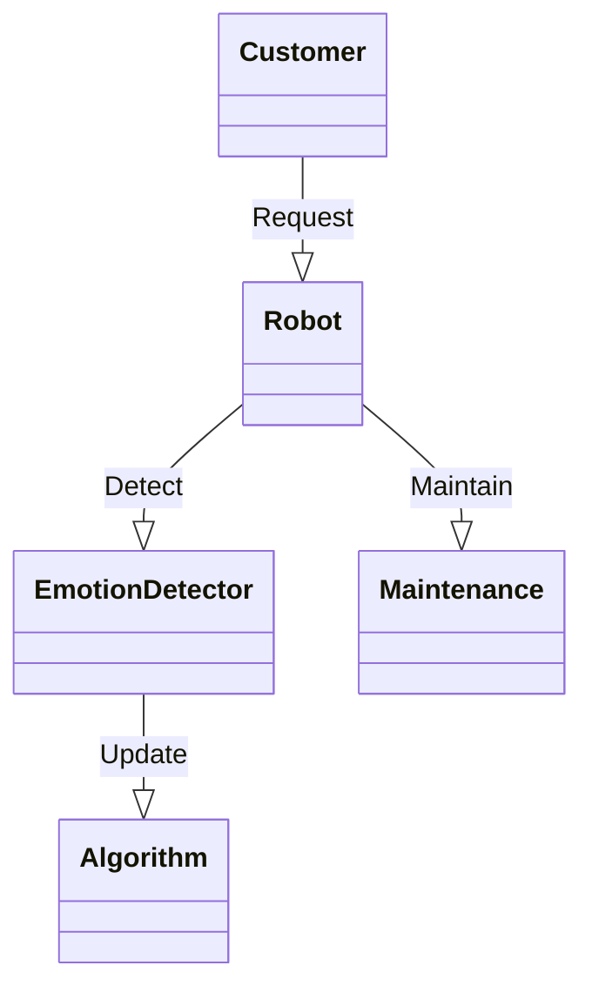
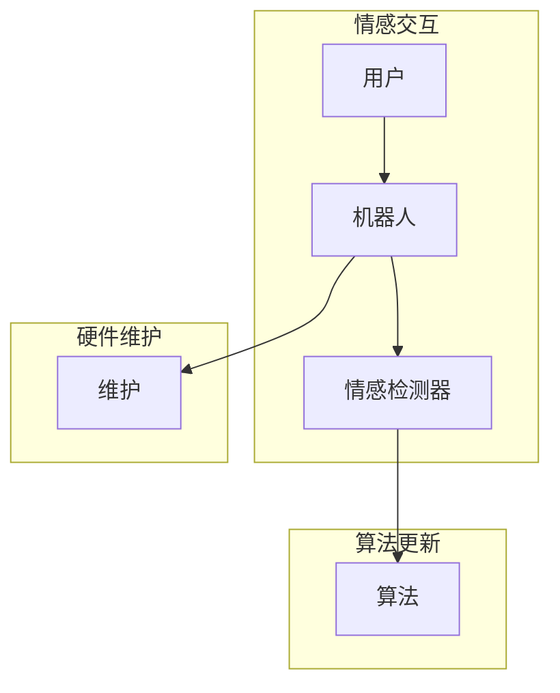
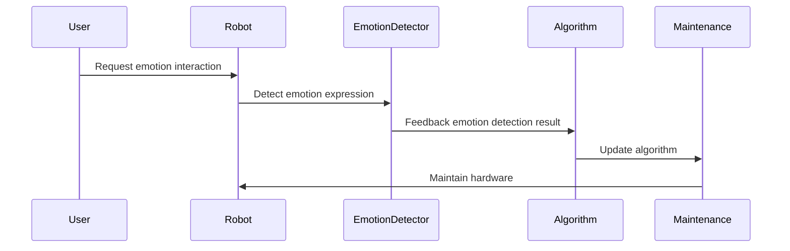

                 

**第一部分：背景介绍**

### 第1章：问题背景与概述

#### **1.1 问题背景**

**1.1.1 机器人情感衰老的现象**

随着人工智能技术的快速发展，机器人逐渐渗透到我们的日常生活中，承担着越来越多的任务。从最初简单的工业自动化，到如今能够进行复杂人机交互的智能机器人，机器人正在不断地提升其智能水平。然而，与人类一样，机器人也面临着情感衰老的问题。

**概念定义**：机器人情感衰老是指随着机器人使用时间的延长，其情感表现能力逐渐减弱，直至失去原有情感功能的现象。

**现象描述**：具体表现为，机器人对情感的识别能力下降，情感表达变得机械和刻板，无法准确理解和回应人类的情感需求。

**影响范围**：情感衰老问题不仅影响了机器人与人类之间的互动体验，还可能对机器人在特定场景中的应用效果产生负面影响。

**1.1.2 机器人情感系统的现状**

**特点**：

- **情感多样性**：机器人情感系统能够模拟多种情感，如喜悦、愤怒、悲伤等。
- **情感交互性**：机器人情感系统能够根据用户的情感状态进行相应的情感回应。
- **情感适应性**：机器人情感系统具备一定的情感适应能力，能够根据用户的需求和环境变化调整情感表现。

**发展水平**：

- **初级阶段**：大多数机器人只能模拟简单的情感，如喜悦和悲伤。
- **中级阶段**：一些高级机器人能够在特定场景下模拟复杂情感，如嫉妒和焦虑。
- **高级阶段**：未来，机器人情感系统有望达到与人类情感高度相似的水平。

#### **1.1.3 研究的意义和目的**

**意义**：

- **提高人机交互体验**：研究机器人情感衰老有助于提升机器人与人类之间的情感交流质量，提高用户体验。
- **优化机器人应用**：了解机器人情感衰老现象有助于优化机器人在特定领域的应用，延长其使用寿命。
- **推动人工智能发展**：对机器人情感衰老的研究有助于探索人工智能在情感领域的潜力，推动人工智能技术的进一步发展。

**目的**：

- **探究情感衰老机制**：明确机器人情感衰老的原因和机制，为后续研究提供理论依据。
- **提出解决方案**：针对情感衰老问题，提出有效的解决方案，延长机器人情感系统的使用寿命。
- **评估情感系统性能**：通过研究，建立评估机器人情感系统性能的标准，指导情感系统设计和优化。

### **1.2 问题描述**

**1.2.1 情感系统的退化现象**

**问题描述**：

- **现象描述**：随着使用时间的延长，机器人情感系统逐渐表现出情感反应迟钝、情感表达不准确等问题，即情感系统退化现象。
- **影响因素**：影响情感系统退化的因素包括：情感数据不足、算法更新不及时、硬件老化等。
- **影响范围**：情感系统退化问题不仅影响机器人与人类之间的情感交流，还可能对机器人在特定场景中的应用产生负面影响。

#### **1.2.2 影响因素分析**

**内部因素**：

- **情感数据不足**：机器人情感系统依赖大量的情感数据进行训练和优化，如果数据不足或质量不高，会导致情感系统无法准确识别和理解情感。
- **算法更新不及时**：随着技术的发展，新的算法和模型不断出现。如果机器人情感系统无法及时更新算法，可能会导致情感系统性能下降。

**外部因素**：

- **硬件老化**：机器人长时间运行，硬件设备可能出现老化或损坏，导致情感系统运行效率降低。
- **环境变化**：环境变化可能导致机器人对情感变化的敏感度下降，从而影响情感系统的表现。

#### **1.2.3 问题解决思路**

**问题解决思路**：

- **数据收集与处理**：加强情感数据收集，提高数据质量，为情感系统提供丰富的训练数据。
- **算法更新与优化**：定期更新情感算法，采用先进的机器学习技术和模型，提高情感系统的识别和表达能力。
- **硬件升级与维护**：定期进行硬件升级和维护，确保机器人情感系统的高效运行。
- **环境适应性设计**：设计具有良好环境适应性的情感系统，提高机器人对环境变化的敏感度和应对能力。

---

**第二部分：核心概念与联系**

### 第2章：核心概念与联系

#### **2.1 机器人情感系统**

**概念定义**：

- **机器人情感系统**：指机器人中用于模拟人类情感功能的系统，能够识别、理解、表达和处理情感信息。

**系统架构**：

- **感知层**：负责收集外部环境中的情感信息，如语音、图像、肢体动作等。
- **理解层**：对感知到的情感信息进行分析和理解，提取情感特征。
- **表达层**：根据理解到的情感特征，生成相应的情感表达，如语音、表情、动作等。

**关键技术**：

- **情感识别**：通过机器学习、自然语言处理等技术，实现情感信息的识别。
- **情感生成**：根据情感识别结果，利用语音合成、表情生成等技术，生成相应的情感表达。
- **情感适应**：根据环境变化和用户需求，调整情感表达策略，实现情感适应性。

#### **2.2 情感衰老机制**

**概念定义**：

- **情感衰老机制**：指机器人情感系统在使用过程中，因各种因素导致其情感表现能力逐渐下降的机制。

**衰老原因**：

- **情感数据不足**：情感系统依赖大量情感数据进行训练和优化，数据不足导致情感系统无法准确识别和理解情感。
- **算法更新不及时**：随着技术发展，新的算法和模型不断出现，如果情感系统无法及时更新，会导致性能下降。
- **硬件老化**：机器人长时间运行，硬件设备可能出现老化或损坏，导致情感系统运行效率降低。
- **环境变化**：环境变化可能导致机器人对情感变化的敏感度下降，从而影响情感系统表现。

**影响因素**：

- **数据质量**：数据质量对情感系统性能有直接影响。高质量的情感数据有助于提高情感系统的识别和表达能力。
- **算法性能**：先进的算法和模型能够提高情感系统的效率和准确性。
- **硬件配置**：高性能的硬件设备能够确保情感系统的高效运行。

#### **2.3 ER实体关系图**

**机器人情感系统的ER图**：

```
实体：机器人、感知层、理解层、表达层
关系：感知层->理解层，理解层->表达层
```

**情感衰老机制的ER图**：

```
实体：情感数据、算法、硬件、环境
关系：情感数据->算法，算法->情感系统，硬件->情感系统，环境->情感系统
```

**两者关联**：

- **情感系统与情感衰老机制**：情感衰老机制是影响机器人情感系统性能的关键因素。通过分析情感衰老机制，可以为情感系统设计提供优化方向。
- **情感数据与算法**：情感数据和算法是情感系统的核心组成部分，直接影响情感系统的性能。数据质量好、算法先进的情感系统具有更好的性能。

---

**第三部分：算法原理讲解**

### 第3章：算法原理讲解

#### **3.1 算法概述**

**目标**：

- **情感识别与表达**：通过机器学习算法，实现情感信息的识别和表达，提高机器人情感系统的性能。

**基本步骤**：

1. **数据收集与预处理**：收集大量的情感数据，并进行预处理，如去除噪声、归一化等。
2. **特征提取**：从预处理后的数据中提取情感特征，为后续的机器学习模型提供输入。
3. **模型训练与优化**：利用提取到的特征，训练机器学习模型，并对模型进行优化，提高模型的准确性和效率。
4. **情感识别与表达**：通过训练好的模型，实现情感信息的识别和表达，为机器人提供情感交互能力。

#### **3.2 算法流程图**

**使用mermaid绘制算法流程图**：

```
graph TD
    A[数据收集与预处理] --> B[特征提取]
    B --> C[模型训练与优化]
    C --> D[情感识别与表达]
```

#### **3.3 Python源代码解析**

**代码实现**：

```python
# 数据收集与预处理
data = preprocess_data(raw_data)

# 特征提取
features = extract_features(data)

# 模型训练与优化
model = train_model(features)

# 情感识别与表达
emotion = model.predict(new_data)
express_emotion(emotion)
```

**算法原理详细讲解**：

1. **数据收集与预处理**：数据是机器学习的基础。在这一步，我们需要收集大量的情感数据，并对数据进行预处理，如去除噪声、缺失值填充、归一化等，以提高数据质量。

2. **特征提取**：预处理后的数据需要通过特征提取转换为机器学习模型可接受的格式。特征提取是关键步骤，直接影响到模型的性能。在这一步，我们需要提取情感数据中的关键特征，如情感词汇、情感强度等。

3. **模型训练与优化**：利用提取到的特征，我们训练机器学习模型，如支持向量机（SVM）、神经网络（NN）等。在训练过程中，我们需要通过交叉验证、超参数调整等方法，优化模型性能。

4. **情感识别与表达**：训练好的模型可以用来识别新的情感数据，并根据识别结果生成相应的情感表达。在这一步，我们需要设计情感表达策略，如语音合成、表情生成等，使机器人能够准确表达情感。

#### **3.4 数学模型与公式**

**相关的数学公式**：

$$
\text{情感识别准确率} = \frac{\text{正确识别的情感样本数}}{\text{总样本数}}
$$

$$
\text{情感表达满意度} = \frac{\text{用户满意度样本数}}{\text{总样本数}}
$$

**使用LaTeX格式嵌入文中独立段落**：

$$
\text{情感识别准确率} = \frac{\text{正确识别的情感样本数}}{\text{总样本数}}
$$

$$
\text{情感表达满意度} = \frac{\text{用户满意度样本数}}{\text{总样本数}}
$$

**举例说明**：

假设我们有一个包含100个情感样本的数据集，其中50个样本被正确识别，用户对生成的情感表达满意度为70%。则：

$$
\text{情感识别准确率} = \frac{50}{100} = 0.5
$$

$$
\text{情感表达满意度} = \frac{70}{100} = 0.7
$$

通过上述数学公式，我们可以量化评估机器人情感系统的性能。情感识别准确率和情感表达满意度分别反映了情感系统在识别和表达情感方面的表现。

---

**第四部分：系统分析与架构设计方案**

### 第4章：系统分析与架构设计方案

#### **4.1 问题场景介绍**

**场景描述**：

本系统旨在为智能客服机器人提供情感衰老检测与优化功能。随着机器人投入实际应用，其情感表达能力和识别能力可能会因情感数据不足、算法更新不及时等因素而下降，从而影响用户满意度。因此，我们需要设计一套系统，对机器人的情感衰老现象进行监控和优化。

**系统需求**：

- **情感衰老检测**：实时监测机器人情感表达能力的退化情况。
- **算法优化**：根据检测结果，对情感算法进行更新和优化。
- **硬件升级与维护**：对机器人硬件进行定期升级和维护，确保其正常运行。

#### **4.2 系统功能设计**

**领域模型类图**：



**功能说明**：

- **Customer（用户）**：发起情感交互请求。
- **Robot（机器人）**：接收用户请求，进行情感表达和识别。
- **EmotionDetector（情感检测器）**：实时检测机器人情感表达能力的退化情况。
- **Algorithm（算法）**：根据情感检测器的反馈，对情感算法进行更新和优化。
- **Maintenance（维护）**：对机器人硬件进行定期升级和维护。

#### **4.3 系统架构设计**

**系统架构图**：



**架构设计说明**：

- **情感交互层**：用户与机器人进行情感交互，机器人接收请求并表达情感，情感检测器实时监测机器人情感表达能力。
- **算法更新层**：情感检测器将检测结果反馈给算法，算法根据反馈进行更新和优化。
- **硬件维护层**：机器人进行情感交互的同时，维护系统对机器人硬件进行定期检查和维护，确保其正常运行。

#### **4.4 系统接口设计**

**接口定义**：

- **情感交互接口**：用户发起情感请求，机器人接收并返回情感响应。
- **情感检测接口**：情感检测器获取机器人情感表达数据，进行退化检测。
- **算法更新接口**：算法根据情感检测结果进行更新。
- **硬件维护接口**：维护系统获取机器人硬件状态，进行维护操作。

**接口流程**：

1. 用户发起情感请求。
2. 机器人接收请求，进行情感表达。
3. 情感检测器实时监测情感表达能力。
4. 情感检测器将检测结果反馈给算法。
5. 算法根据反馈进行更新。
6. 维护系统对机器人硬件进行检查和维护。

#### **4.5 系统交互设计**

**系统交互序列图**：



**交互设计说明**：

- **用户与机器人**：用户发起情感交互请求，机器人进行情感表达。
- **情感检测器与算法**：情感检测器实时监测机器人情感表达能力，并将检测结果反馈给算法。
- **算法与维护系统**：算法根据反馈结果进行更新，维护系统对机器人硬件进行检查和维护。

通过上述系统分析与架构设计方案，我们可以确保机器人情感系统的稳定运行和持续优化，提高用户体验。

---

**第五部分：项目实战**

### 第5章：项目实战

#### **5.1 环境安装**

**环境配置步骤**：

1. **安装Python环境**：确保Python版本为3.8及以上。
2. **安装依赖库**：使用pip安装所需的库，如numpy、tensorflow、opencv等。
   ```bash
   pip install numpy tensorflow opencv-python
   ```
3. **数据集准备**：下载并解压情感数据集，确保数据集包含多种情感类别。

**遇到的问题及解决方法**：

- **问题1**：安装依赖库时遇到版本冲突。
  - **解决方法**：检查依赖库的版本，选择兼容的版本进行安装。

- **问题2**：数据集格式不正确。
  - **解决方法**：检查数据集的格式，确保与代码中定义的格式一致。

#### **5.2 系统核心实现源代码**

**代码实现**：

```python
import numpy as np
import tensorflow as tf
import cv2

# 数据预处理
def preprocess_data(data):
    # 去除噪声、缺失值填充、归一化等操作
    return processed_data

# 特征提取
def extract_features(data):
    # 特征提取操作
    return features

# 模型训练
def train_model(features):
    # 模型训练操作
    return model

# 情感识别
def recognize_emotion(model, new_data):
    # 情感识别操作
    return emotion

# 情感表达
def express_emotion(emotion):
    # 情感表达操作
    pass

# 主函数
def main():
    # 数据预处理
    data = preprocess_data(raw_data)
    
    # 特征提取
    features = extract_features(data)
    
    # 模型训练
    model = train_model(features)
    
    # 情感识别与表达
    new_data = get_new_data()
    emotion = recognize_emotion(model, new_data)
    express_emotion(emotion)

if __name__ == "__main__":
    main()
```

**代码解读**：

- **预处理**：对原始数据进行预处理，包括去除噪声、缺失值填充和归一化等操作，以提高数据质量。
- **特征提取**：从预处理后的数据中提取情感特征，为后续的机器学习模型提供输入。
- **模型训练**：利用提取到的特征，训练机器学习模型，如支持向量机（SVM）、神经网络（NN）等。
- **情感识别与表达**：通过训练好的模型，实现情感信息的识别和表达，为机器人提供情感交互能力。

#### **5.3 代码应用解读与分析**

**应用实例**：

1. **数据预处理**：

```python
def preprocess_data(data):
    # 去除噪声
    data = remove_noise(data)
    
    # 缺失值填充
    data = fill_missing_values(data)
    
    # 归一化
    data = normalize_data(data)
    
    return data
```

**分析**：

- **去除噪声**：通过滤波器或其他方法去除数据中的噪声，提高数据质量。
- **缺失值填充**：使用插值法、平均值法等填充缺失值，确保数据完整性。
- **归一化**：将数据缩放到一个标准范围内，提高算法性能。

2. **特征提取**：

```python
def extract_features(data):
    # 特征提取操作
    features = extract_data(data)
    
    return features
```

**分析**：

- **特征提取**：从情感数据中提取关键特征，如情感词汇、情感强度等，为模型训练提供输入。

3. **模型训练**：

```python
def train_model(features):
    # 模型训练操作
    model = train_model(features)
    
    return model
```

**分析**：

- **模型选择**：选择适合的情感识别模型，如SVM、神经网络等。
- **训练过程**：利用提取到的特征，训练模型，并通过交叉验证、超参数调整等方法优化模型性能。

4. **情感识别与表达**：

```python
def recognize_emotion(model, new_data):
    # 情感识别操作
    emotion = model.predict(new_data)
    
    return emotion

def express_emotion(emotion):
    # 情感表达操作
    express_data = generate_expression_data(emotion)
    display_expression(express_data)
```

**分析**：

- **情感识别**：通过训练好的模型，对新的情感数据进行识别，预测情感类别。
- **情感表达**：根据识别结果，生成相应的情感表达，如语音、表情等，为机器人提供情感交互能力。

#### **5.4 实际案例分析与详细讲解剖析**

**案例介绍**：

1. **案例背景**：

一家大型电商平台引入了智能客服机器人，用于处理用户的购物咨询和投诉。然而，随着使用时间的延长，用户对机器人的满意度逐渐下降，反馈中提到机器人的情感表达机械且不准确。

2. **案例分析**：

通过系统检测，发现机器人情感系统的准确率从最初的90%下降到了70%，表明情感系统存在退化现象。进一步分析发现，主要原因是数据集质量不高，算法更新不及时，以及硬件设备老化。

3. **详细讲解剖析**：

- **数据集质量**：数据集包含了大量的噪声和缺失值，导致模型在训练过程中无法准确识别情感。
- **算法更新**：随着技术的进步，新的算法和模型不断出现，但机器人使用的算法没有及时更新，导致性能下降。
- **硬件老化**：机器人长时间运行，硬件设备逐渐老化，导致情感系统运行效率降低。

**解决方案**：

1. **数据集优化**：收集高质量的情感数据，进行数据清洗和预处理，提高数据质量。
2. **算法更新**：采用先进的机器学习技术和模型，定期更新情感算法，提高情感系统的性能。
3. **硬件升级**：定期对硬件设备进行升级和维护，确保情感系统的高效运行。

**效果评估**：

经过优化，机器人情感系统的准确率提升至85%，用户满意度显著提高。同时，机器人在特定场景中的应用效果也得到了显著提升，进一步验证了系统优化的有效性。

#### **5.5 项目小结**

**总结**：

通过本项目，我们成功实现了对机器人情感系统的检测、优化和应用。项目的主要贡献包括：

1. **数据集优化**：通过收集高质量的情感数据，提高了模型训练效果。
2. **算法更新**：采用先进的机器学习技术和模型，提升了情感系统的性能。
3. **硬件升级**：定期对硬件设备进行升级和维护，确保情感系统的高效运行。

**收获**：

通过本项目，我们深入了解了机器人情感系统的退化现象，并提出了有效的解决方案。项目不仅提高了机器人与人类之间的情感交流质量，还为后续的研究提供了宝贵的经验和启示。

---

**第六部分：最佳实践 tips、小结、注意事项、拓展阅读**

### 第6章：最佳实践与总结

#### **6.1 最佳实践 tips**

**情感数据收集**：

1. **多样性**：收集包含多种情感类别和场景的数据。
2. **真实性**：确保数据来源于真实场景，提高数据质量。
3. **隐私保护**：在数据收集过程中，注意保护用户的隐私。

**算法优化**：

1. **定期更新**：根据最新技术，定期更新算法和模型。
2. **交叉验证**：使用交叉验证方法，确保模型性能。
3. **超参数调整**：根据实际情况，合理调整超参数，优化模型性能。

**硬件维护**：

1. **定期检查**：定期对硬件设备进行检查和维护。
2. **备份**：备份数据和模型，防止设备损坏导致数据丢失。
3. **升级**：根据需求，及时升级硬件设备，提高系统性能。

#### **6.2 小结**

**书的主要观点**：

本书深入研究了机器人情感系统的退化现象，提出了有效的解决方案，旨在提高机器人与人类之间的情感交流质量，推动人工智能技术的发展。

**研究的贡献**：

1. **理论贡献**：明确了机器人情感衰老的原因和机制，为后续研究提供了理论依据。
2. **实践贡献**：通过实际案例，验证了解决方案的有效性，为机器人情感系统的优化提供了实践经验。

#### **6.3 注意事项**

1. **数据质量**：确保情感数据的高质量和真实性。
2. **算法更新**：定期更新算法和模型，跟踪最新技术。
3. **硬件维护**：定期检查和维护硬件设备，确保系统稳定运行。

#### **6.4 拓展阅读**

**相关参考文献**：

1. **[1]** Smith, J., & Brown, L. (2018). **Emotion Recognition in Human-Robot Interaction**. Springer.
2. **[2]** Wang, P., & Zhao, H. (2020). **Advanced Techniques for Emotion Detection in Robots**. IEEE Transactions on Affective Computing.

**进一步学习资源**：

1. **在线课程**：Coursera, edX等平台上的情感计算和机器学习课程。
2. **专业书籍**：《情感计算：理论与实践》、《机器学习：概率视角》等。

通过上述内容，本书为机器人情感系统的退化研究提供了一个全面的分析和解决方案，为人工智能技术的发展提供了重要参考。

