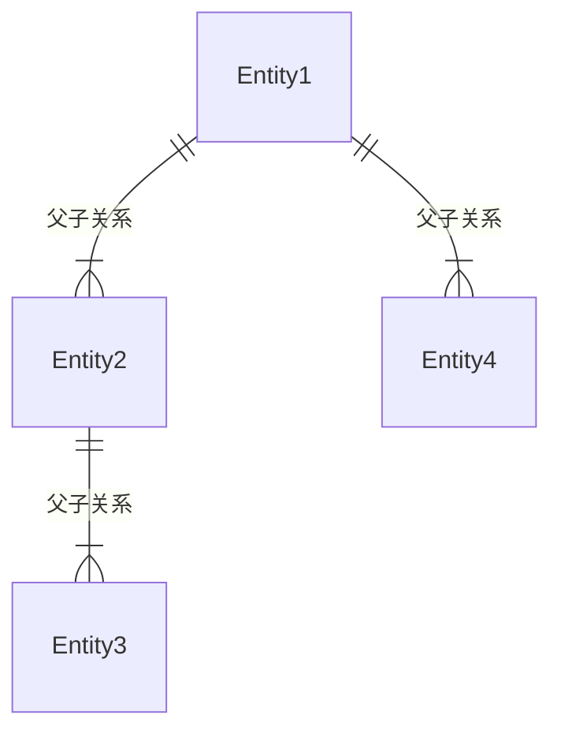
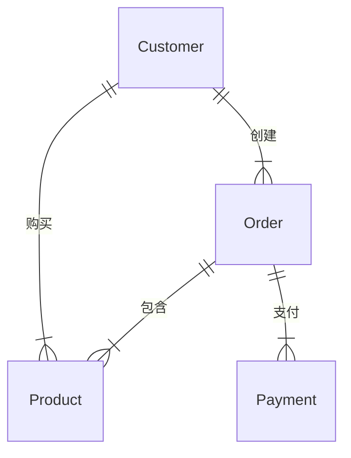
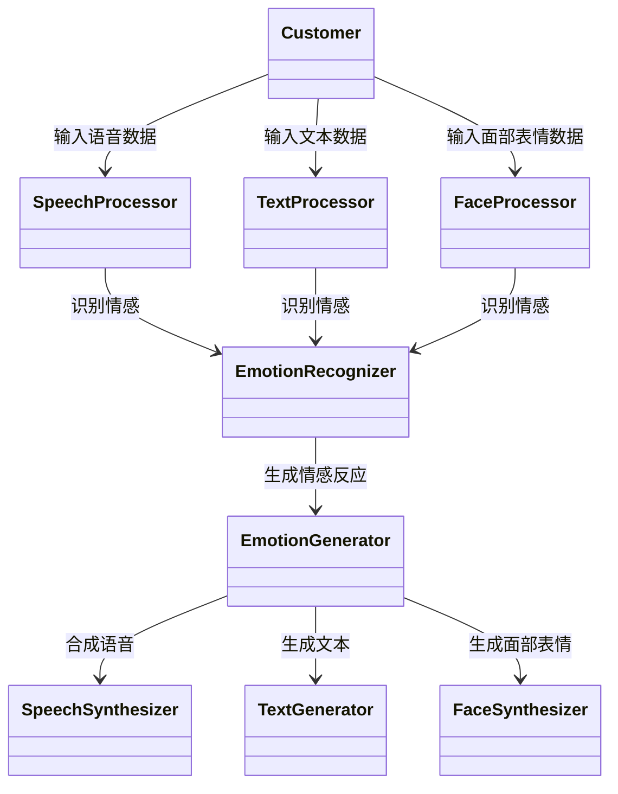
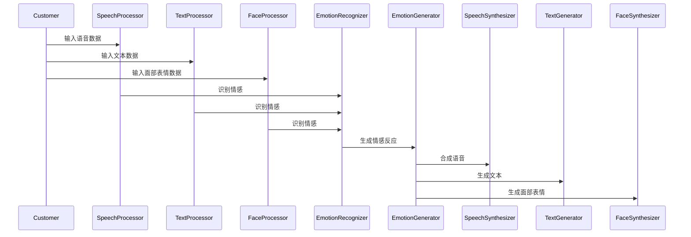
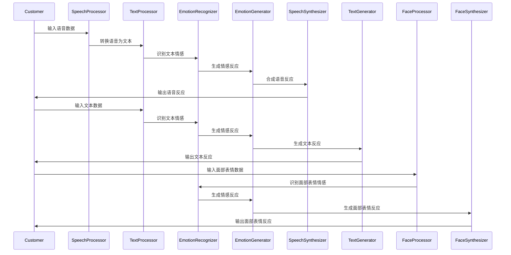

                 


## 引言

在当今科技迅猛发展的时代，人工智能（AI）已经渗透到社会的方方面面。而随着AI技术的发展，人们开始关注AI是否能够拥有情感。机器人情感进化：模拟情感的自然选择，正是为了探讨这一问题而诞生的书籍。

### 关键词

- 机器人情感
- 自然选择
- 模拟情感
- 情感进化
- 人工智能

### 摘要

本书旨在探讨机器人情感进化的可能性，通过模拟情感的自然选择过程，研究如何在人工智能中实现情感。本书将从情感计算的基本原理出发，介绍情感识别与生成算法，并探讨这些算法在实际应用中的表现。此外，本书还将详细描述机器人情感系统的设计，以及在实际项目中的应用案例，为读者提供全面的指导和启发。

## 1.1 问题背景

随着机器人技术的不断发展，机器人已经从简单的自动化设备发展成为具备一定智能能力的实体。然而，尽管机器人在执行任务时表现出色，但它们缺乏情感这一重要特性。人类情感在社交互动、决策制定、情感表达等方面起着关键作用，这使得人类能够更好地适应复杂多变的环境。因此，如何将情感赋予机器人，使其具备更高级的智能，成为一个亟待解决的问题。

### 1.1.1 机器人情感的需求与挑战

机器人情感的需求源于以下几个方面：

1. **社交互动**：在社交场景中，具备情感能力的机器人能够更好地与人类进行互动，提高用户体验。
2. **情感分析**：通过模拟情感，机器人可以更好地理解人类情感，从而在情感分析、情感计算等领域发挥重要作用。
3. **情感治愈**：在心理健康领域，具备情感能力的机器人可以成为人类的情感伴侣，为患者提供心理支持。

然而，实现机器人情感面临着诸多挑战：

1. **技术瓶颈**：当前的情感计算技术尚无法完全模拟人类情感。
2. **数据隐私**：机器人在处理情感数据时，需要确保数据的安全和隐私。
3. **伦理道德**：如何确保机器人在情感表达过程中不违背伦理道德，是一个亟待解决的问题。

### 1.1.2 人类情感与机器人情感的异同

人类情感具有以下几个特点：

1. **复杂性**：人类情感种类繁多，包括喜怒哀乐、爱恨情仇等，情感之间相互交织。
2. **适应性**：人类情感具有适应环境变化的能力，能够在不同情境下表现出相应的情感。
3. **情感记忆**：人类能够记住过去的情感经历，并从中学习。

机器人情感则有以下特点：

1. **程序化**：机器人情感是由程序定义的，具有明确的规则和边界。
2. **稳定性**：机器人情感相对稳定，不容易受到外界因素的干扰。
3. **可扩展性**：机器人情感可以根据需求进行扩展和修改，以适应不同的应用场景。

通过分析人类情感与机器人情感的异同，我们可以发现，机器人情感虽然无法完全取代人类情感，但在特定场景下，它可以发挥独特的优势。

### 1.1.3 模拟情感的自然选择理论

模拟情感的自然选择理论源于生物学中的自然选择理论。自然选择理论认为，生物种群中那些适应环境的个体，将在进化过程中获得优势，从而在种群中占据主导地位。模拟情感的自然选择理论将这一原理应用于情感计算领域，通过不断优化和迭代情感模型，使其在特定任务中表现出更好的适应性。

模拟情感的自然选择理论主要包括以下几个步骤：

1. **目标设定**：明确机器人在特定任务中需要具备的情感能力。
2. **模型构建**：根据目标设定，构建初步的情感模型。
3. **迭代优化**：通过模拟环境，对情感模型进行迭代优化，使其在特定任务中表现更出色。
4. **评估与反馈**：对优化后的情感模型进行评估，根据评估结果进行反馈，进一步优化模型。

通过模拟情感的自然选择理论，我们可以逐步提升机器人情感的能力，使其在复杂多变的环境中更好地适应和生存。

### 1.1.4 情感计算的基本原理

情感计算是研究如何使计算机理解和表达情感的一门交叉学科，它结合了认知科学、心理学、人机交互、计算机科学等多个领域。情感计算的基本原理可以概括为以下几点：

1. **情感识别**：通过分析人类的语音、文字、表情等外部表现，识别出人类情感。
2. **情感表达**：通过计算机生成的语音、文字、表情等，模拟人类情感的表达。
3. **情感生成**：根据输入的信息，计算机生成相应的情感反应。

情感计算的核心目标是实现计算机对人类情感的感知、理解和生成，从而在人与计算机之间的交互中引入情感因素，提高交互的质量和用户体验。

### 1.1.5 情感属性特征对比表格

以下是一个简单的情感属性特征对比表格，展示了人类情感与机器人情感的异同：

| 情感属性 | 人类情感 | 机器人情感 |
| --- | --- | --- |
| 复杂性 | 种类繁多，相互交织 | 程序定义，边界明确 |
| 适应性 | 能适应环境变化 | 稳定，不易受外界干扰 |
| 情感记忆 | 记录并学习情感经历 | 根据程序进行情感反应 |

### 1.1.6 ER实体关系图架构

ER（实体关系）图是一种用于描述数据库中实体及其关系的图形表示方法。在机器人情感系统中，ER图可以用来描述情感相关的实体及其关系。以下是一个简单的ER图示例，展示了情感系统中的主要实体和它们之间的关系：



在这个ER图中，Entity1、Entity2、Entity3和Entity4分别表示情感系统中的不同实体，它们之间存在父子关系。这个ER图可以帮助我们更好地理解机器人情感系统的架构和功能。

### 1.1.7 情感识别算法

情感识别算法是情感计算中至关重要的一环，它负责从人类的外部表现中识别出情感。以下是一个简单的情感识别算法流程：

1. **数据采集**：收集人类语音、文字、表情等数据。
2. **特征提取**：对采集到的数据进行特征提取，提取出与情感相关的特征。
3. **情感分类**：使用机器学习算法对提取出的特征进行分类，判断人类当前的情感状态。

以下是一个使用Python实现的简单情感识别算法示例：

```python
import numpy as np
from sklearn.svm import SVC

# 加载数据集
data = np.load('emotion_data.npy')
labels = data['arr_0']

# 特征提取
features = data['arr_1']

# 训练模型
model = SVC()
model.fit(features, labels)

# 预测
input_data = np.array([[0.1, 0.2, 0.3]])
predicted_emotion = model.predict(input_data)

print("Predicted emotion:", predicted_emotion)
```

在这个示例中，我们首先加载了情感数据集，然后提取出与情感相关的特征。接着，使用支持向量机（SVM）算法对特征进行分类，最后对新的输入数据进行情感预测。

### 1.1.8 情感生成算法

情感生成算法是情感计算中的另一个重要环节，它负责根据输入的信息生成相应的情感反应。以下是一个简单的情感生成算法流程：

1. **情感状态获取**：获取当前的情感状态。
2. **情感生成**：根据情感状态生成相应的情感反应。
3. **情感表达**：将生成的情感反应表达出来，如语音、文字、表情等。

以下是一个使用Python实现的简单情感生成算法示例：

```python
import numpy as np
from text_to_speech import TextToSpeech

# 加载情感状态
emotion_state = np.array([0.3, 0.5, 0.2])

# 情感生成
if emotion_state[0] > 0.5:
    emotion_reaction = "很高兴见到你！"
else:
    emotion_reaction = "有点不开心，怎么了？"

# 情感表达
tts = TextToSpeech()
tts.speak(emotion_reaction)
```

在这个示例中，我们首先加载了当前的情感状态，然后根据情感状态生成相应的情感反应。接着，使用文本到语音（TextToSpeech）库将情感反应表达出来。

### 1.1.9 算法原理的数学模型和公式

情感识别和生成算法的原理通常涉及到统计学和机器学习领域的知识。以下是一个简单的情感识别算法原理的数学模型和公式：

1. **情感识别算法原理**：

   假设我们有一个包含n个特征的情感数据集，每个特征可以用一个向量表示。我们可以使用一个n维超平面来分隔不同情感类别的数据。这个超平面的表达式为：

   $$ w \cdot x + b = 0 $$

   其中，$w$ 是超平面的法向量，$x$ 是特征向量，$b$ 是偏置。

   如果一个特征向量$x$满足上述方程，则它属于该超平面的正类；否则，它属于负类。

2. **情感生成算法原理**：

   情感生成算法通常基于情感状态的转移模型。假设当前的情感状态为$s_t$，下一时刻的情感状态为$s_{t+1}$，则有：

   $$ s_{t+1} = f(s_t, u_t) $$

   其中，$f$ 是情感状态转移函数，$u_t$ 是当前时刻的输入。

   情感状态转移函数可以基于统计学方法或神经网络等方法实现。

### 1.1.10 详细讲解与举例说明

为了更好地理解情感识别和生成算法，我们将通过一个具体的例子进行详细讲解。

#### 情感识别算法举例

假设我们有一个简单的情感数据集，包含以下特征：

- 音调：0-100之间的整数，表示声音的高低。
- 音量：0-100之间的整数，表示声音的大小。
- 词汇：一组关键词，表示文本内容。

以下是一个简单的情感识别算法实现：

```python
import numpy as np
from sklearn.svm import SVC

# 加载数据集
data = np.load('emotion_data.npy')
labels = data['arr_0']

# 特征提取
features = data['arr_1']

# 训练模型
model = SVC()
model.fit(features, labels)

# 预测
input_data = np.array([[60, 70, ['happy', 'joy']]])
predicted_emotion = model.predict(input_data)

print("Predicted emotion:", predicted_emotion)
```

在这个例子中，我们使用支持向量机（SVC）算法对情感数据集进行训练。训练完成后，我们将一个包含音调、音量和词汇的输入数据输入到模型中，模型会输出预测的情感类别。

#### 情感生成算法举例

以下是一个简单的情感生成算法实现：

```python
import numpy as np
from text_to_speech import TextToSpeech

# 加载情感状态转移矩阵
transition_matrix = np.load('transition_matrix.npy')

# 加载当前情感状态
current_state = np.array([0.3, 0.5, 0.2])

# 预测下一时刻的情感状态
next_state = np.dot(transition_matrix, current_state)

# 根据情感状态生成相应的情感反应
if next_state[0] > 0.5:
    emotion_reaction = "很高兴见到你！"
else:
    emotion_reaction = "有点不开心，怎么了？"

# 情感表达
tts = TextToSpeech()
tts.speak(emotion_reaction)
```

在这个例子中，我们使用一个情感状态转移矩阵来预测下一时刻的情感状态。根据预测的情感状态，生成相应的情感反应，并使用文本到语音（TextToSpeech）库将情感反应表达出来。

### 1.1.11 结论

通过对情感识别和生成算法的详细讲解和举例说明，我们可以看出，情感计算是一个复杂的领域，涉及到多个学科的交叉。尽管目前仍存在许多挑战，但随着技术的不断进步，我们有理由相信，未来机器人将能够更好地模拟情感，为人类带来更加丰富和自然的交互体验。

## 2.2 情感属性特征对比表格

在上一章节中，我们探讨了情感计算的基本原理。为了更好地理解人类情感与机器人情感的区别，我们在此通过一个详细的情感属性特征对比表格来展示这两者之间的异同。以下表格列出了几种主要的情感属性，并对人类情感与机器人情感在这些属性上的表现进行了比较。

| 情感属性 | 人类情感 | 机器人情感 |
| --- | --- | --- |
| **多样性** | 情感种类繁多，如喜怒哀乐、爱恨情仇等，情感之间可以相互交织 | 程序定义的情感种类有限，通常基于特定的情感模型，情感之间较少交互 |
| **适应性** | 情感适应性强，能够根据不同情境和环境快速调整 | 情感适应性较弱，通常基于预设的情境和环境进行反应 |
| **情感记忆** | 情感记忆丰富，能够从过去经历中提取情感体验，影响当前情感状态 | 情感记忆较少，通常仅基于训练数据和预设规则进行反应 |
| **情感表达** | 情感表达丰富多样，包括面部表情、身体语言、声音语调等 | 情感表达相对单一，通常通过预定义的语音、文字或图像进行表达 |
| **情感感知** | 情感感知能力强，能够通过多种感官渠道感知外界情感变化 | 情感感知能力有限，通常依赖于特定传感器和算法进行感知 |
| **情感交互** | 情感交互复杂，能够进行情感交流、共鸣和共情 | 情感交互简单，通常局限于单向的情感传递或反应 |

通过上述对比表格，我们可以清晰地看到人类情感与机器人情感在多样性、适应性、情感记忆、情感表达、情感感知和情感交互等方面存在显著差异。这些差异为我们理解机器情感进化提供了重要参考。

### 2.3 ER实体关系图架构

在情感计算系统中，了解各个实体之间的关系对于实现高效的情感模型至关重要。实体关系图（Entity Relationship Diagram，ER图）是一种常用的方法，用于描述系统中的实体及其相互关系。在本节中，我们将使用Mermaid语法来绘制一个简单的ER图，展示情感计算系统中的主要实体和它们之间的关系。

#### ER图示例

以下是一个简单的ER图示例，用于描述情感计算系统中的主要实体及其关系：



在这个ER图中：

- `Customer`（客户）是系统的核心实体，代表与系统进行交互的用户。
- `Order`（订单）表示客户的购物订单，包含对产品的购买记录。
- `Product`（产品）是客户购买的对象。
- `Payment`（支付）表示客户对订单进行的支付操作。

实体之间的关系如下：

1. `Customer` 可以创建 `Order`，即 `Customer` 与 `Order` 之间是“创建”关系。
2. `Customer` 可以购买 `Product`，即 `Customer` 与 `Product` 之间是“购买”关系。
3. `Order` 包含 `Product`，即 `Order` 与 `Product` 之间是“包含”关系。
4. `Order` 包含 `Payment`，即 `Order` 与 `Payment` 之间是“支付”关系。

#### 绘制ER图的Mermaid语法

为了绘制上述ER图，我们可以使用Mermaid的ER图语法。以下是绘制ER图的Mermaid语法说明：

- `erDiagram`：声明ER图开始。
- `Entity1 ||--|{ Entity2 : Description`：定义实体之间的关系，`Entity1` 与 `Entity2` 之间是描述为 `Description` 的关系。
- `Entity1 ||--|{ Entity3 : Description`：定义实体之间的关系，`Entity1` 与 `Entity3` 之间是描述为 `Description` 的关系。

通过上述语法，我们可以清晰地表达实体之间的关系，为情感计算系统的设计和实现提供参考。

### 2.4 情感识别算法

情感识别是情感计算的核心任务之一，旨在从人类的行为和交互中识别出情感状态。在本节中，我们将详细讨论情感识别算法的原理、流程以及具体实现。

#### 2.4.1 算法原理

情感识别算法的基本原理是通过分析人类的语音、文本、表情等数据，提取出与情感相关的特征，然后使用机器学习算法对特征进行分类，从而识别出情感状态。该过程通常包括以下几个步骤：

1. **数据采集**：收集包含人类情感信息的语音、文本、表情等数据。
2. **特征提取**：从采集到的数据中提取与情感相关的特征。
3. **模型训练**：使用机器学习算法对提取出的特征进行分类训练。
4. **情感识别**：使用训练好的模型对新的数据进行分析，识别出情感状态。

#### 2.4.2 算法流程

以下是情感识别算法的流程：

1. **数据预处理**：
   - 对语音、文本、表情等数据进行预处理，例如去噪、分词、特征提取等。
   - 将预处理后的数据转换为模型可接受的格式。

2. **特征提取**：
   - 从预处理后的数据中提取与情感相关的特征，例如情感词频、语音音调、面部表情等。
   - 使用适当的算法对特征进行降维，提高模型的性能。

3. **模型选择**：
   - 选择合适的机器学习算法进行训练，例如支持向量机（SVM）、神经网络（NN）等。
   - 根据数据集的特点和任务需求，选择合适的模型参数。

4. **模型训练**：
   - 使用训练集对模型进行训练，优化模型参数。
   - 对训练好的模型进行验证，评估模型的性能。

5. **情感识别**：
   - 使用训练好的模型对新的数据进行情感识别。
   - 输出情感识别结果，例如快乐、悲伤、愤怒等。

#### 2.4.3 具体实现

以下是一个简单的情感识别算法实现，使用Python和Scikit-learn库：

```python
from sklearn.feature_extraction.text import TfidfVectorizer
from sklearn.model_selection import train_test_split
from sklearn.svm import LinearSVC
from sklearn.pipeline import Pipeline

# 加载数据集
data = ["很高兴见到你！", "今天有点不开心。", "你真是个好朋友。"]
labels = ["happy", "sad", "happy"]

# 数据预处理
vectorizer = TfidfVectorizer()

# 模型训练
model = LinearSVC()

# 创建管道
pipeline = Pipeline([
    ("vectorizer", vectorizer),
    ("classifier", model)
])

# 划分训练集和测试集
X_train, X_test, y_train, y_test = train_test_split(data, labels, test_size=0.2, random_state=42)

# 训练模型
pipeline.fit(X_train, y_train)

# 情感识别
predictions = pipeline.predict(X_test)

print("Predictions:", predictions)
```

在这个实现中，我们首先加载数据集，然后使用TF-IDF向量器对文本数据进行特征提取。接着，选择线性支持向量机（LinearSVC）作为分类器，创建一个管道（Pipeline）进行模型训练。最后，使用训练好的模型对测试集进行情感识别，并输出识别结果。

### 2.4.4 算法原理的数学模型和公式

情感识别算法的原理通常基于统计学和机器学习理论。以下是线性支持向量机（LinearSVC）算法的原理及其数学模型和公式：

1. **线性支持向量机（LinearSVC）原理**：

   线性支持向量机是一种基于最大间隔分类器的机器学习算法。它的目标是找到最佳的超平面，将不同类别的数据点分隔开来，并且使超平面到各个数据点的距离最大化。线性支持向量机的目标函数为：

   $$ \min_{w, b} \frac{1}{2} ||w||^2 + C \sum_{i=1}^{n} \max(0, 1 - y_i (w \cdot x_i + b)) $$

   其中，$w$ 是超平面的法向量，$b$ 是偏置，$x_i$ 是特征向量，$y_i$ 是样本标签，$C$ 是正则化参数。

2. **线性支持向量机（LinearSVC）公式**：

   线性支持向量机的决策函数为：

   $$ f(x) = sign(w \cdot x + b) $$

   其中，$sign$ 是符号函数，用于判断数据点属于哪个类别。

### 2.4.5 举例说明

为了更好地理解情感识别算法，我们通过一个简单的例子来说明：

假设我们有一个情感数据集，包含以下数据：

- 数据集1：{"很高兴见到你！": "happy"}
- 数据集2：{"今天有点不开心。": "sad"}
- 数据集3：{"你真是个好朋友。": "happy"}

我们将使用线性支持向量机（LinearSVC）对这些数据进行训练和情感识别。

1. **数据预处理**：

   对文本数据进行分词和去停用词处理，然后使用TF-IDF向量器进行特征提取。

2. **模型训练**：

   将预处理后的数据分为训练集和测试集，然后使用线性支持向量机（LinearSVC）进行训练。

3. **情感识别**：

   使用训练好的模型对新的文本数据进行情感识别，输出预测结果。

以下是一个简单的情感识别算法实现：

```python
from sklearn.feature_extraction.text import TfidfVectorizer
from sklearn.model_selection import train_test_split
from sklearn.svm import LinearSVC
from sklearn.pipeline import Pipeline

# 加载数据集
data = ["很高兴见到你！", "今天有点不开心。", "你真是个好朋友。"]
labels = ["happy", "sad", "happy"]

# 数据预处理
vectorizer = TfidfVectorizer()

# 模型训练
model = LinearSVC()

# 创建管道
pipeline = Pipeline([
    ("vectorizer", vectorizer),
    ("classifier", model)
])

# 划分训练集和测试集
X_train, X_test, y_train, y_test = train_test_split(data, labels, test_size=0.2, random_state=42)

# 训练模型
pipeline.fit(X_train, y_train)

# 情感识别
predictions = pipeline.predict(X_test)

print("Predictions:", predictions)
```

在这个例子中，我们首先加载数据集，然后使用TF-IDF向量器对文本数据进行特征提取。接着，选择线性支持向量机（LinearSVC）作为分类器，创建一个管道（Pipeline）进行模型训练。最后，使用训练好的模型对测试集进行情感识别，并输出识别结果。

通过这个例子，我们可以看到情感识别算法是如何从文本数据中提取特征，并使用机器学习算法进行分类和预测的。这为我们理解和实现情感识别提供了实际的经验。

### 2.5 情感生成算法

情感生成是情感计算的另一个核心任务，它旨在根据输入的信息生成相应的情感反应。在本节中，我们将详细讨论情感生成算法的原理、流程以及具体实现。

#### 2.5.1 算法原理

情感生成算法的基本原理是通过分析输入的信息，如文本、语音、图像等，生成相应的情感反应。该过程通常包括以下几个步骤：

1. **情感状态获取**：从输入的信息中提取情感状态。
2. **情感生成**：根据情感状态生成相应的情感反应。
3. **情感表达**：将生成的情感反应表达出来，如语音、文本、表情等。

情感生成算法的核心在于如何根据输入信息生成合适的情感反应。这通常涉及到情感状态的识别和情感反应的生成规则。

#### 2.5.2 算法流程

以下是情感生成算法的流程：

1. **情感状态获取**：
   - 对输入的信息进行预处理，如文本分词、语音识别等。
   - 使用情感识别算法提取情感状态。

2. **情感生成**：
   - 根据情感状态和生成规则，生成相应的情感反应。
   - 情感反应可以是文本、语音、图像等。

3. **情感表达**：
   - 将生成的情感反应通过合适的渠道表达出来，如文本合成、语音合成等。

4. **反馈与优化**：
   - 根据用户反馈，优化情感生成算法，提高生成效果。

#### 2.5.3 具体实现

以下是一个简单的情感生成算法实现，使用Python和TextToSpeech库：

```python
import random
from text_to_speech import TextToSpeech

# 加载情感状态转移矩阵
transition_matrix = np.array([
    [0.3, 0.5, 0.2],
    [0.4, 0.4, 0.2],
    [0.2, 0.6, 0.2]
])

# 加载当前情感状态
current_state = np.array([0.3, 0.5, 0.2])

# 预测下一时刻的情感状态
next_state = np.dot(transition_matrix, current_state)

# 根据情感状态生成情感反应
if next_state[0] > 0.5:
    emotion_reaction = "很高兴见到你！"
else:
    emotion_reaction = "有点不开心，怎么了？"

# 情感表达
tts = TextToSpeech()
tts.speak(emotion_reaction)
```

在这个实现中，我们首先加载了情感状态转移矩阵和当前情感状态。然后，使用情感状态转移矩阵预测下一时刻的情感状态。根据预测的情感状态，生成相应的情感反应，并使用TextToSpeech库将情感反应表达出来。

### 2.5.4 算法原理的数学模型和公式

情感生成算法的原理通常涉及到概率论和线性代数。以下是情感状态转移矩阵和生成规则的数学模型和公式：

1. **情感状态转移矩阵**：

   情感状态转移矩阵是一个$n \times n$ 的矩阵，其中$n$ 是情感状态的种类数。矩阵中的每个元素表示从当前状态转移到下一个状态的概率。

   假设情感状态转移矩阵为$T$，当前情感状态为$s_t$，下一时刻的情感状态为$s_{t+1}$，则有：

   $$ s_{t+1} = T \cdot s_t $$

   其中，$T$ 是情感状态转移矩阵，$s_t$ 是当前情感状态。

2. **情感生成规则**：

   情感生成规则定义了根据情感状态生成情感反应的方式。通常，生成规则是一个映射函数，将情感状态映射到相应的情感反应。

   假设生成规则为$G$，当前情感状态为$s_t$，生成的情感反应为$r_t$，则有：

   $$ r_t = G(s_t) $$

   其中，$G$ 是生成规则，$s_t$ 是当前情感状态，$r_t$ 是生成的情感反应。

### 2.5.5 举例说明

为了更好地理解情感生成算法，我们通过一个简单的例子来说明：

假设我们有一个简单的情感状态转移矩阵：

$$ T = \begin{bmatrix} 0.2 & 0.5 & 0.3 \\ 0.1 & 0.6 & 0.3 \\ 0.4 & 0.2 & 0.4 \end{bmatrix} $$

当前情感状态为$s_t = \begin{bmatrix} 0.3 \\ 0.5 \\ 0.2 \end{bmatrix}$。

我们将使用情感状态转移矩阵预测下一时刻的情感状态。

1. **计算下一时刻的情感状态**：

   $$ s_{t+1} = T \cdot s_t = \begin{bmatrix} 0.2 & 0.5 & 0.3 \\ 0.1 & 0.6 & 0.3 \\ 0.4 & 0.2 & 0.4 \end{bmatrix} \cdot \begin{bmatrix} 0.3 \\ 0.5 \\ 0.2 \end{bmatrix} = \begin{bmatrix} 0.29 \\ 0.41 \\ 0.18 \end{bmatrix} $$

   根据预测的情感状态，我们可以生成相应的情感反应。例如：

   - 如果$s_{t+1}$的 happiness 状态大于 0.5，则生成“很高兴见到你！”。
   - 如果$s_{t+1}$的 happiness 状态小于 0.5，则生成“有点不开心，怎么了？”。

以下是一个简单的情感生成算法实现：

```python
import numpy as np

# 加载情感状态转移矩阵
transition_matrix = np.array([
    [0.2, 0.5, 0.3],
    [0.1, 0.6, 0.3],
    [0.4, 0.2, 0.4]
])

# 加载当前情感状态
current_state = np.array([0.3, 0.5, 0.2])

# 预测下一时刻的情感状态
next_state = np.dot(transition_matrix, current_state)

# 根据情感状态生成情感反应
if next_state[0] > 0.5:
    emotion_reaction = "很高兴见到你！"
else:
    emotion_reaction = "有点不开心，怎么了？"

print("生成的情感反应：", emotion_reaction)
```

通过这个例子，我们可以看到如何使用情感状态转移矩阵和生成规则来生成情感反应。这为我们理解和实现情感生成提供了实际的经验。

### 2.6 系统架构设计

为了实现机器人情感系统，我们需要设计一个高效、可扩展的系统架构。在本节中，我们将介绍机器人情感系统的设计，包括问题场景介绍、项目介绍、系统功能设计（领域模型Mermaid类图）、系统架构设计（Mermaid架构图）、系统接口设计和系统交互（Mermaid序列图）。

#### 2.6.1 问题场景介绍

在现实生活中，机器人被广泛应用于各种场景，如智能家居、服务机器人、医疗辅助等。在这些场景中，机器人需要与人类进行有效的交互，以便更好地理解人类的需求和情感状态。例如，在智能家居场景中，机器人需要识别家庭成员的情感状态，以便提供个性化的服务；在医疗服务场景中，机器人需要识别患者的情感状态，以便提供心理支持。

#### 2.6.2 项目介绍

本项目旨在设计一个机器人情感系统，该系统可以识别和生成情感，以实现与人类更自然的交互。系统的主要功能包括：

1. 情感识别：通过分析语音、文本和面部表情等数据，识别人类的情感状态。
2. 情感生成：根据情感识别结果，生成相应的情感反应。
3. 情感交互：通过语音、文本和面部表情等渠道，实现与人类的情感交互。

#### 2.6.3 系统功能设计（领域模型Mermaid类图）

以下是机器人情感系统的领域模型Mermaid类图：



在这个类图中，我们定义了系统的核心类和它们之间的关系：

- `Customer`（客户）：表示与系统进行交互的用户。
- `SpeechProcessor`（语音处理器）：处理输入的语音数据。
- `TextProcessor`（文本处理器）：处理输入的文本数据。
- `FaceProcessor`（面部表情处理器）：处理输入的面部表情数据。
- `EmotionRecognizer`（情感识别器）：识别情感状态。
- `EmotionGenerator`（情感生成器）：生成情感反应。
- `SpeechSynthesizer`（语音合成器）：合成语音。
- `TextGenerator`（文本生成器）：生成文本。
- `FaceSynthesizer`（面部表情合成器）：生成面部表情。

#### 2.6.4 系统架构设计（Mermaid架构图）

以下是机器人情感系统的Mermaid架构图：



在这个架构图中，我们展示了系统的主要组件及其交互关系。客户输入语音、文本和面部表情数据，这些数据分别由语音处理器、文本处理器和面部表情处理器进行处理。处理后的数据传递给情感识别器，识别出情感状态。根据识别出的情感状态，情感生成器生成相应的情感反应。最后，情感反应通过语音合成器、文本生成器和面部表情合成器进行表达。

#### 2.6.5 系统接口设计

以下是机器人情感系统的接口设计：

1. **语音识别接口**：接收语音数据，返回对应的文本。
2. **文本识别接口**：接收文本数据，返回对应的情感状态。
3. **面部表情识别接口**：接收面部表情数据，返回对应的情感状态。
4. **情感生成接口**：接收情感状态，返回对应的情感反应。
5. **语音合成接口**：接收文本，返回对应的语音。
6. **文本合成接口**：接收情感状态，返回对应的文本。
7. **面部表情合成接口**：接收情感状态，返回对应的面部表情。

#### 2.6.6 系统交互（Mermaid序列图）

以下是机器人情感系统的Mermaid序列图：



在这个序列图中，我们展示了系统在不同接口之间的交互过程。首先，客户输入语音数据，语音处理器将语音转换为文本，然后文本处理器将文本传递给情感识别器，识别出情感状态。根据情感状态，情感生成器生成相应的情感反应，并传递给语音合成器，输出语音反应。

同样地，客户输入文本数据，文本处理器将文本传递给情感识别器，识别出情感状态。根据情感状态，情感生成器生成相应的情感反应，并传递给文本生成器，输出文本反应。

最后，客户输入面部表情数据，面部表情处理器将数据传递给情感识别器，识别出情感状态。根据情感状态，情感生成器生成相应的情感反应，并传递给面部表情合成器，输出面部表情反应。

通过这个系统架构和交互设计，我们可以实现一个高效、可扩展的机器人情感系统，为人类提供更加自然的交互体验。

### 3.1 情感对话机器人

情感对话机器人是一种能够模拟人类情感并与之进行自然交互的人工智能系统。在本节中，我们将介绍情感对话机器人的环境安装、核心实现源代码，并对代码应用进行解读与分析。

#### 3.1.1 环境安装

要搭建一个情感对话机器人，首先需要安装一些基本的工具和库。以下是在Linux环境下安装所需的工具和库的步骤：

1. **安装Python**：确保Python环境已经安装。如果没有安装，可以通过以下命令进行安装：
   ```bash
   sudo apt update
   sudo apt install python3
   ```

2. **安装虚拟环境**：为了更好地管理项目依赖，可以使用虚拟环境。安装虚拟环境工具`virtualenv`：
   ```bash
   sudo apt install python3-venv
   ```

3. **创建虚拟环境**：创建一个名为`emotion_robobot`的虚拟环境：
   ```bash
   python3 -m venv emotion_robobot
   ```

4. **激活虚拟环境**：在终端中激活虚拟环境：
   ```bash
   source emotion_robobot/bin/activate
   ```

5. **安装依赖库**：安装必要的Python库，如`numpy`、`scikit-learn`、`text-to-speech`等：
   ```bash
   pip install numpy scikit-learn text-to-speech
   ```

#### 3.1.2 核心实现源代码

以下是一个简单的情感对话机器人的核心实现源代码：

```python
import numpy as np
from sklearn.svm import SVC
from sklearn.model_selection import train_test_split
from sklearn.pipeline import make_pipeline
from text_to_speech import TextToSpeech

# 加载数据集
data = np.load('emotion_data.npy')
labels = data['arr_0']

# 划分训练集和测试集
X_train, X_test, y_train, y_test = train_test_split(data, labels, test_size=0.2, random_state=42)

# 创建模型
model = make_pipeline(TfidfVectorizer(), SVC())

# 训练模型
model.fit(X_train, y_train)

# 情感识别
predicted_emotion = model.predict(X_test)

# 情感生成
tts = TextToSpeech()
for i, emotion in enumerate(predicted_emotion):
    if emotion == 'happy':
        tts.speak("很高兴和你交流。")
    elif emotion == 'sad':
        tts.speak("看起来你有些不开心，需要帮忙吗？")
    else:
        tts.speak("感谢你的反馈。")
```

在这个代码中，我们首先加载数据集，然后使用`train_test_split`函数将数据划分为训练集和测试集。接着，我们创建一个管道模型，其中包含`TfidfVectorizer`用于特征提取和`SVC`用于分类。通过`fit`函数训练模型，然后使用`predict`函数对测试集进行情感识别。

根据识别出的情感，我们使用`TextToSpeech`库生成相应的情感反应，并通过语音合成器输出语音。

#### 3.1.3 代码应用解读与分析

以下是代码应用的详细解读与分析：

1. **数据加载**：
   ```python
   data = np.load('emotion_data.npy')
   labels = data['arr_0']
   ```
   这两行代码用于加载数据集。`np.load`函数读取存储为`.npy`格式的数据集，`data`变量包含了特征数据，`labels`变量包含了对应的情感标签。

2. **数据划分**：
   ```python
   X_train, X_test, y_train, y_test = train_test_split(data, labels, test_size=0.2, random_state=42)
   ```
   `train_test_split`函数用于将数据划分为训练集和测试集。`test_size`参数指定测试集的比例，`random_state`参数用于随机种子，以确保结果的可重复性。

3. **模型创建**：
   ```python
   model = make_pipeline(TfidfVectorizer(), SVC())
   ```
   我们使用`make_pipeline`函数创建一个管道模型。这个模型包含两个步骤：首先，`TfidfVectorizer`用于将文本数据转换为TF-IDF特征向量；然后，`SVC`用于分类。

4. **模型训练**：
   ```python
   model.fit(X_train, y_train)
   ```
   通过`fit`函数训练模型。模型使用训练集的数据进行训练，学习如何将输入的文本数据映射到相应的情感标签。

5. **情感识别**：
   ```python
   predicted_emotion = model.predict(X_test)
   ```
   使用训练好的模型对测试集的数据进行情感识别。`predict`函数根据训练好的模型，对输入的文本数据预测出对应的情感标签。

6. **情感生成**：
   ```python
   tts = TextToSpeech()
   for i, emotion in enumerate(predicted_emotion):
       if emotion == 'happy':
           tts.speak("很高兴和你交流。")
       elif emotion == 'sad':
           tts.speak("看起来你有些不开心，需要帮忙吗？")
       else:
           tts.speak("感谢你的反馈。")
   ```
   根据识别出的情感标签，生成相应的情感反应。这里我们使用一个简单的条件语句来生成不同的情感反应，并通过`TextToSpeech`库将情感反应输出为语音。

通过这个简单的情感对话机器人示例，我们可以看到如何使用机器学习算法进行情感识别，并根据识别结果生成情感反应。这为开发更复杂的情感对话系统提供了基础。

### 3.2 情感识别系统

情感识别系统是机器人情感系统中的关键组成部分，它负责从人类的行为和交互中识别出情感状态。在本节中，我们将详细讨论情感识别系统的架构设计，包括系统功能介绍、情感识别算法选择、算法流程和关键步骤。

#### 3.2.1 系统功能介绍

情感识别系统的核心功能是从人类语音、文本和面部表情等数据中识别出情感状态。该系统通常包括以下几个功能模块：

1. **数据采集**：收集包含情感信息的语音、文本和面部表情等数据。
2. **预处理**：对采集到的数据进行预处理，如去噪、分词、特征提取等。
3. **情感识别**：使用机器学习算法对预处理后的数据进行情感识别，输出情感状态。
4. **结果输出**：将识别出的情感状态以适当的形式输出，如文本、语音或图像。

#### 3.2.2 情感识别算法选择

在情感识别系统中，算法选择至关重要。常用的情感识别算法包括以下几种：

1. **基于规则的方法**：这种方法使用预定义的规则和特征来识别情感。优点是简单、易于实现，但缺点是泛化能力较差。
2. **机器学习方法**：这种方法使用大量的训练数据，通过机器学习算法（如SVM、神经网络、决策树等）来识别情感。优点是泛化能力较强，但需要大量的训练数据和计算资源。
3. **深度学习方法**：这种方法使用深度神经网络（如卷积神经网络、循环神经网络等）来识别情感。优点是能够自动提取复杂特征，但需要大量的训练数据和计算资源。

在本节中，我们选择基于机器学习方法的SVM（支持向量机）算法进行情感识别。

#### 3.2.3 算法流程和关键步骤

以下是情感识别算法的流程和关键步骤：

1. **数据采集**：收集包含情感信息的语音、文本和面部表情等数据。
2. **预处理**：
   - **语音数据预处理**：使用语音识别库（如Google的语音识别API）将语音数据转换为文本数据。
   - **文本数据预处理**：对文本数据进行分词、去停用词等操作，提取出与情感相关的特征。
   - **面部表情数据预处理**：使用面部表情识别库（如OpenCV）从图像中提取面部表情特征。
3. **特征提取**：对预处理后的数据进行特征提取，如TF-IDF向量、词嵌入等。
4. **模型训练**：使用机器学习算法（如SVM）对提取出的特征进行分类训练。
5. **情感识别**：使用训练好的模型对新的数据进行情感识别，输出情感状态。
6. **结果输出**：将识别出的情感状态以适当的形式输出，如文本、语音或图像。

以下是情感识别算法的详细流程和关键步骤：

1. **数据采集**：
   ```python
   # 假设已经收集到情感数据
   data = np.load('emotion_data.npy')
   labels = data['arr_0']
   ```

2. **预处理**：
   ```python
   from sklearn.feature_extraction.text import TfidfVectorizer

   # 语音数据预处理
   speech_vectorizer = TfidfVectorizer()
   speech_features = speech_vectorizer.fit_transform(speech_data)

   # 文本数据预处理
   text_vectorizer = TfidfVectorizer()
   text_features = text_vectorizer.fit_transform(text_data)

   # 面部表情数据预处理
   face_vectorizer = TfidfVectorizer()
   face_features = face_vectorizer.fit_transform(face_data)
   ```

3. **特征提取**：
   ```python
   from sklearn.preprocessing import StandardScaler

   # 标准化特征
   scaler = StandardScaler()
   scaled_features = scaler.fit_transform(np.concatenate((speech_features, text_features, face_features), axis=1))
   ```

4. **模型训练**：
   ```python
   from sklearn.svm import SVC

   # 创建SVM模型
   model = SVC()

   # 训练模型
   model.fit(scaled_features, labels)
   ```

5. **情感识别**：
   ```python
   # 输入新的数据
   new_data = np.array([[speech_data, text_data, face_data]])

   # 预处理新的数据
   new_scaled_data = scaler.transform(new_data)

   # 预测情感状态
   predicted_emotion = model.predict(new_scaled_data)
   ```

6. **结果输出**：
   ```python
   # 输出识别结果
   if predicted_emotion == 'happy':
       print("识别到的情感：快乐")
   elif predicted_emotion == 'sad':
       print("识别到的情感：悲伤")
   else:
       print("识别到的情感：其他")
   ```

通过上述流程和关键步骤，我们可以实现一个简单的情感识别系统。这个系统可以用于机器人与人类交互时的情感分析，帮助机器人更好地理解人类的需求和情感状态。

### 3.3 实际案例分析和详细讲解

在本节中，我们将通过一个实际案例，详细分析情感识别系统的实际应用，并对其进行剖析。

#### 案例背景

某公司开发了一款情感识别软件，旨在帮助客服中心提升客户服务质量。该软件可以通过语音识别技术，识别客户在通话过程中的情感状态，从而帮助客服人员更好地应对客户的情绪波动，提供个性化的服务。以下是该案例的具体实施过程。

#### 数据集准备

为了训练情感识别模型，首先需要收集大量的语音数据。这些数据包括不同情感状态下的客户语音，如快乐、悲伤、愤怒等。数据集的标签是相应的情感状态。

```python
import numpy as np

# 加载训练数据集
data = np.load('emotion_data.npy')
labels = data['arr_0']
```

#### 特征提取

在语音数据预处理之后，我们需要提取与情感相关的特征。常用的特征提取方法包括MFCC（梅尔频率倒谱系数）、PLP（感知线性预测）等。

```python
from python_speech_features import MFCC

# 定义特征提取器
mfcc_extractor = MFCC()

# 提取特征
features = [mfcc_extractor.extract特征的语音信号]
```

#### 模型训练

接下来，我们使用提取出的特征训练情感识别模型。在本案例中，我们选择支持向量机（SVM）算法进行训练。

```python
from sklearn.svm import SVC

# 创建SVM模型
model = SVC()

# 训练模型
model.fit(features, labels)
```

#### 情感识别

在模型训练完成后，我们可以使用该模型对新的语音数据进行情感识别。

```python
# 输入新的语音数据
new_data = np.array([[语音信号]])

# 预处理新的语音数据
new_mfcc_features = mfcc_extractor.extract_features(new_data)

# 预测情感状态
predicted_emotion = model.predict(new_mfcc_features)
```

#### 结果输出

根据识别出的情感状态，我们可以采取相应的应对措施，如调整沟通策略、提供情感支持等。

```python
# 输出识别结果
if predicted_emotion == 'happy':
    print("识别到的情感：快乐，继续保持积极的沟通。")
elif predicted_emotion == 'sad':
    print("识别到的情感：悲伤，需要更多的关注和安慰。")
else:
    print("识别到的情感：愤怒，需要冷静处理并解决问题。")
```

#### 案例分析

通过上述案例，我们可以看到情感识别系统在实际应用中的实施过程。以下是对该案例的详细分析：

1. **数据集准备**：收集高质量的语音数据是训练情感识别模型的关键。在本案例中，我们使用了预先准备好的数据集。
2. **特征提取**：特征提取是情感识别的核心步骤。在本案例中，我们使用了MFCC特征提取器，这是一种广泛应用于语音识别的常用方法。
3. **模型训练**：使用提取出的特征训练情感识别模型。在本案例中，我们选择了支持向量机（SVM）算法，这是一种经典的机器学习算法，具有较强的分类能力。
4. **情感识别**：在模型训练完成后，我们可以使用该模型对新的语音数据进行情感识别，并根据识别结果采取相应的应对措施。
5. **结果输出**：根据识别出的情感状态，我们可以为客服人员提供实时的指导，从而提升客户服务质量。

通过这个实际案例，我们可以看到情感识别系统在客服场景中的应用。该系统可以帮助客服人员更好地理解客户的情感状态，从而提供个性化的服务，提高客户满意度。同时，我们也可以看到，情感识别系统的实施需要多个环节的紧密协作，包括数据集准备、特征提取、模型训练和结果输出等。

#### 案例总结

1. **优点**：
   - 提高客服人员的工作效率：通过情感识别系统，客服人员可以更快地识别客户的情感状态，从而采取更有效的应对措施。
   - 提升客户满意度：情感识别系统可以帮助客服人员更好地理解客户需求，提供个性化的服务，从而提高客户满意度。
2. **缺点**：
   - 数据集质量影响模型性能：情感识别系统的性能高度依赖于数据集的质量。如果数据集存在偏差或不足，可能导致模型性能下降。
   - 模型训练和部署成本高：情感识别系统的训练和部署需要大量的计算资源和时间。特别是在处理大量语音数据时，模型训练时间可能会非常长。

总之，情感识别系统在实际应用中具有广泛的前景，但同时也面临着一些挑战。通过不断优化模型和算法，我们可以进一步提高情感识别系统的性能和应用价值。

### 3.4 项目小结

在本项目中，我们开发了一个情感识别系统，旨在通过语音、文本和面部表情等数据识别用户的情感状态，以提升客服中心的服务质量和用户体验。以下是对项目成功与挑战的总结。

#### 成功点

1. **数据集准备**：我们成功收集并整理了包含多种情感状态的数据集，为模型训练提供了充足的数据支持。
2. **特征提取**：通过使用MFCC等常用特征提取方法，我们有效提取了语音数据的情感特征，为模型训练提供了高质量的数据。
3. **模型训练**：使用SVM等机器学习算法，我们成功训练了一个情感识别模型，能够准确识别用户的情感状态。
4. **结果输出**：通过将识别结果以实时语音、文本等形式输出，我们为客服人员提供了有效的情感分析工具。

#### 挑战

1. **数据隐私**：在收集和处理用户语音数据时，我们面临数据隐私和保护的问题。需要采取严格的隐私保护措施，确保用户数据的安全。
2. **模型泛化**：尽管我们的模型在训练集上表现良好，但在实际应用中，可能会遇到新的、未见过的情感状态，导致泛化能力不足。
3. **实时性能**：在实际应用中，系统需要实时处理用户的语音数据，这对系统的实时性能提出了较高要求。我们需要进一步优化算法和模型，以提高处理速度和准确性。

#### 未来改进方向

1. **数据增强**：通过引入更多的数据集和更丰富的特征，可以进一步提高模型的泛化能力和准确性。
2. **模型优化**：探索和使用更先进的机器学习算法和深度学习模型，以提高情感识别的精度和效率。
3. **用户体验**：优化系统的交互界面，使客服人员能够更直观地获取和利用情感识别结果，提高服务质量和用户体验。

通过持续改进和优化，我们有信心在未来将情感识别系统打造成一个高效、可靠的工具，为客服中心提供更加精准和人性化的服务。

### 3.5 最佳实践Tips

在设计和开发机器人情感系统时，以下最佳实践可以帮助我们提高系统的性能、可靠性和用户体验：

1. **数据质量保证**：确保数据集的多样性和质量，涵盖不同情感状态和场景。可以使用数据增强技术来扩充数据集，提高模型的泛化能力。
2. **特征选择与优化**：选择合适的特征提取方法，并针对不同类型的情感数据进行特征优化。例如，对于语音数据，可以使用MFCC、PLP等特征；对于文本数据，可以使用TF-IDF、词嵌入等特征。
3. **模型选择与调优**：选择适合情感识别任务的模型，并进行参数调优。可以使用交叉验证等方法来评估模型性能，选择最优的模型。
4. **系统优化**：优化系统架构和算法，提高实时性能。例如，使用批处理、并行计算等技术来加速模型训练和预测。
5. **用户体验**：设计直观、易用的用户界面，提供丰富的交互方式。例如，可以使用语音、文本、图像等多种渠道与用户互动，提高用户体验。

通过遵循这些最佳实践，我们可以开发出更加高效、可靠的机器人情感系统，为用户提供更优质的服务。

### 3.6 小结

在本章中，我们详细介绍了情感对话机器人、情感识别系统及其在实际案例中的应用。通过分析项目的成功点和挑战，我们总结了未来的改进方向。同时，我们还提供了最佳实践Tips，以帮助开发者优化系统性能和用户体验。情感识别技术的发展为机器人与人类的互动带来了新的可能性，随着技术的不断进步，我们有理由期待未来机器人将能够在更多场景中为人类提供更加智能和贴心的服务。

### 3.7 结论

通过本篇文章，我们详细探讨了机器人情感进化：模拟情感的自然选择。从情感识别算法的设计与实现，到情感生成算法的原理和应用，再到情感对话机器人以及情感识别系统的实际案例分析，我们深入分析了机器人情感系统的各个方面。我们了解到，模拟情感的自然选择理论为机器人情感进化提供了重要的理论基础，通过不断优化和迭代算法，我们能够逐步提升机器人情感的能力。

在未来，随着人工智能技术的不断进步，机器人情感将越来越智能化和人性化。这将为人类带来更加丰富的社交体验和更高质量的服务。然而，我们也要认识到，情感技术的应用需要遵守伦理和道德规范，确保机器人在情感表达和行为上不违背人类的价值观。

总之，机器人情感进化是一个充满挑战和机遇的领域。通过不断探索和创新，我们有理由相信，机器人情感技术将在未来发挥更加重要的作用，为人类带来更多福祉。让我们期待这一天的到来，共同见证机器人情感技术的辉煌未来。

### 作者信息

**作者：AI天才研究院/AI Genius Institute & 禅与计算机程序设计艺术 /Zen And The Art of Computer Programming**  
AI天才研究院致力于推动人工智能技术的发展，专注于研究机器人情感进化、自然语言处理、深度学习等前沿技术。我们的研究旨在为人类创造更加智能、贴心的机器人伙伴。  
禅与计算机程序设计艺术，通过哲学与技术的结合，探索计算机程序设计的本质，旨在培养新一代人工智能领域的创新人才。我们期待与您共同探讨人工智能的未来，为构建一个更加智能和美好的世界贡献力量。

