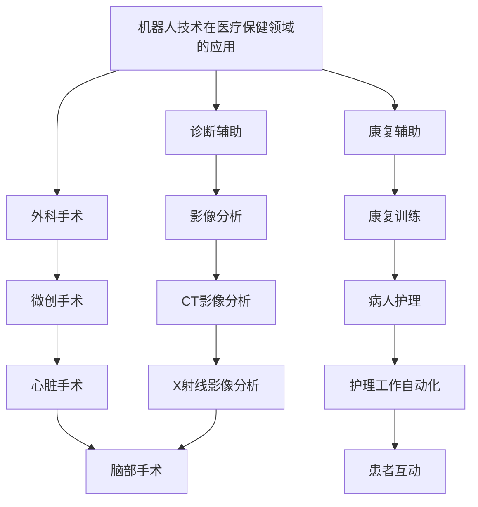

                 

# 机器人技术在医疗保健领域的应用

> 关键词：机器人、医疗保健、诊断辅助、外科手术、康复辅助、人工智能

> 摘要：本文从医疗保健领域的需求背景出发，详细探讨了机器人技术在医疗保健中的应用，包括诊断辅助、外科手术和康复辅助等方面。通过对当前主流医疗保健机器人产品的介绍和未来发展趋势的分析，本文旨在为读者呈现机器人技术在医疗保健领域的深刻影响和广阔前景。

## 目录大纲

1. 引言
    1.1 机器人技术在医疗保健领域的兴起
    1.2 机器人技术在医疗保健中的核心概念
    1.3 医疗保健机器人技术应用场景分析
    1.4 当前主流医疗保健机器人产品介绍
    1.5 医疗保健机器人技术的未来发展趋势
    1.6 本章小结
2. 机器人技术在诊断辅助中的应用
    2.1 诊断辅助机器人的基本原理
    2.2 诊断辅助机器人在常见疾病诊断中的应用
    2.3 诊断辅助机器人在影像分析中的应用
    2.4 诊断辅助机器人的发展趋势与挑战
    2.5 本章小结
3. 机器人技术在外科手术中的应用
    3.1 外科手术机器人的基本原理
    3.2 外科手术机器人在手术中的应用
    3.3 外科手术机器人的技术应用案例
    3.4 外科手术机器人的未来发展挑战
    3.5 本章小结
4. 机器人技术在康复辅助中的应用
    4.1 康复辅助机器人的基本原理
    4.2 康复辅助机器人在常见康复治疗中的应用
    4.3 康复辅助机器人在护理中的应用
    4.4 康复辅助机器人的未来发展趋势
    4.5 本章小结
5. 总结与展望
    5.1 医疗保健机器人技术的影响与价值
    5.2 未来发展趋势与机遇
    5.3 结论

----------------------------------------------------------------

## 1. 引言

医疗保健领域一直是科技与医疗融合的重要阵地。随着人工智能和机器人技术的飞速发展，机器人技术在医疗保健中的应用逐渐成为研究热点。机器人技术在医疗保健领域中的兴起，源于其对提高医疗效率、降低医疗成本和提升患者体验等方面的巨大潜力。

首先，随着人口老龄化和慢性疾病的不断增加，医疗系统面临着巨大的压力。机器人技术能够通过自动化和智能化手段，提高诊断和治疗的准确性，减少医疗错误，从而提高医疗系统的整体效率。其次，机器人技术在手术中的精准控制能力，使得手术风险和创伤大大降低，为患者提供了更为安全的治疗方式。最后，康复辅助机器人能够帮助患者进行有效的康复训练，提高康复效果，减轻护理人员的工作负担。

本文将详细探讨机器人技术在医疗保健领域中的应用，包括诊断辅助、外科手术和康复辅助等方面。通过分析当前主流的医疗保健机器人产品，以及预测未来发展趋势，本文旨在为读者呈现机器人技术在医疗保健领域的深刻影响和广阔前景。

----------------------------------------------------------------

## 1.1 机器人技术在医疗保健领域的兴起

### 1.1.1 机器人技术在医疗保健中的需求背景

医疗保健领域一直以来都是技术创新的重要领域。随着医疗需求的不断增加，传统医疗模式面临着诸多挑战。首先，医疗资源分布不均是一个显著问题。发达地区医疗资源丰富，而偏远地区医疗资源匮乏，导致患者就医困难。其次，医疗成本持续上涨，给医疗机构和患者带来巨大的经济压力。此外，医疗错误和医疗事故频发，对患者的生命安全构成威胁。

在这一背景下，机器人技术的兴起为医疗保健领域带来了新的希望。首先，机器人技术可以通过自动化和智能化手段，提高医疗服务的效率和质量。例如，诊断辅助机器人能够对影像资料进行分析，快速、准确地诊断疾病，减少医疗错误。其次，机器人技术在手术中的应用，能够提高手术的精准度，减少手术风险和创伤。最后，康复辅助机器人可以帮助患者进行有效的康复训练，提高康复效果，减轻护理人员的工作负担。

### 1.1.2 机器人技术在医疗保健中的优势

机器人技术在医疗保健中具有多方面的优势。首先，机器人技术具有高效性。例如，诊断辅助机器人能够快速处理大量的影像数据，提高诊断速度和准确性。其次，机器人技术具有精确性。外科手术机器人能够在微米级别上操作，实现精准的手术操作，减少手术风险。最后，机器人技术具有智能化。通过人工智能技术，机器人能够自主学习、优化决策，提高医疗服务的质量和效率。

此外，机器人技术在医疗保健中的优势还体现在降低医疗成本和提高患者体验方面。例如，康复辅助机器人能够帮助患者进行康复训练，降低康复成本。同时，机器人技术的应用可以减轻护理人员的工作负担，提高患者满意度。

### 1.1.3 当前机器人技术在医疗保健中的应用现状

目前，机器人技术在医疗保健领域已经取得了一定的应用成果。诊断辅助机器人已经在多个医疗机构投入使用，用于影像分析、病理诊断等。外科手术机器人也在全球范围内得到广泛应用，特别是在心脏手术、脑部手术等领域。康复辅助机器人也逐渐成为康复治疗的重要工具，帮助患者进行康复训练。

然而，尽管机器人技术在医疗保健中的应用前景广阔，但目前仍面临一些挑战。首先，机器人技术的高成本和复杂操作限制了其广泛普及。其次，医疗机器人技术的规范化与标准化仍有待完善。此外，医疗机器人与人工智能技术的深度融合仍需进一步探索。

总的来说，机器人技术在医疗保健领域的兴起为医疗行业带来了新的发展机遇。通过不断克服技术、成本和规范化等方面的挑战，机器人技术在医疗保健中的应用前景将更加广阔。

----------------------------------------------------------------

## 1.2 机器人技术在医疗保健中的核心概念

### 1.2.1 机器人与医疗保健的结合

机器人与医疗保健的结合是现代医疗技术发展的重要方向。机器人在医疗保健中的应用主要体现在诊断辅助、外科手术、康复辅助和医疗服务等方面。这种结合不仅能够提高医疗效率和质量，还能够降低医疗成本，改善患者体验。

首先，在诊断辅助方面，机器人技术可以通过影像分析、病理诊断等手段，提高疾病诊断的准确性和速度。例如，诊断辅助机器人可以对CT、MRI等影像资料进行分析，快速识别病变部位，提供诊断建议。这种技术能够显著减少医生的工作量，提高诊断效率。

其次，在外科手术方面，机器人技术可以实现精准的手术操作。手术机器人通过高精度的机械臂和先进的成像技术，能够实现微米级别的手术操作，减少手术风险和创伤。这种技术在复杂手术中具有显著优势，能够提高手术的成功率和患者的生活质量。

再次，在康复辅助方面，机器人技术可以帮助患者进行康复训练。康复辅助机器人可以根据患者的具体情况进行个性化的康复训练，帮助患者恢复功能。这种技术不仅能够提高康复效果，还能够减轻护理人员的工作负担。

最后，在医疗服务方面，机器人技术可以提供各种便捷的医疗服务。例如，医疗服务机器人可以提供导诊、取药、陪护等服务，提高医疗服务的效率和质量。

总的来说，机器人与医疗保健的结合为医疗行业带来了巨大的变革。通过不断推动机器人技术在医疗保健中的应用，我们可以期待更加高效、精准和人性化的医疗服务。

### 1.2.2 医疗保健中的机器人分类

在医疗保健领域，机器人可以根据其功能和应用场景进行分类。主要的分类包括诊断辅助机器人、外科手术机器人、康复辅助机器人和医疗服务机器人。

#### 诊断辅助机器人

诊断辅助机器人主要用于疾病诊断和影像分析。它们能够对医学影像（如CT、MRI、X光等）进行分析，提供诊断建议。这些机器人通常利用人工智能技术，通过深度学习和计算机视觉算法，对影像资料进行自动识别和分类。例如，某些诊断辅助机器人能够检测早期肺癌、乳腺癌等疾病，提高诊断的准确性和速度。

#### 外科手术机器人

外科手术机器人则主要用于手术操作。这些机器人通常具有高精度的机械臂和先进的成像技术，能够在微创手术中进行精准操作。手术机器人通过远程控制或自主控制，可以帮助外科医生实现复杂手术的自动化。例如，达芬奇手术机器人是目前最先进的外科手术机器人之一，它在全球范围内广泛应用于心脏手术、脑部手术、妇科手术等。

#### 康复辅助机器人

康复辅助机器人用于帮助患者进行康复训练。这些机器人可以根据患者的康复需求，提供个性化的训练方案。例如，康复辅助机器人可以帮助患者进行行走训练、关节活动训练等，提高康复效果。康复机器人还能够实时监测患者的康复进展，为医护人员提供反馈。

#### 医疗服务机器人

医疗服务机器人主要用于提供便捷的医疗服务。这些机器人可以在医院中执行各种任务，如导诊、取药、送餐、陪护等。例如，医院导诊机器人可以帮助患者找到相应的科室和医生，提高就医效率。同时，医疗服务机器人还可以通过语音交互和视觉识别技术，与患者进行互动，提供更为人性化的服务。

总的来说，医疗保健中的机器人分类多样化，各自发挥着重要的作用。通过不断推动机器人技术在医疗保健中的应用，我们可以期待更加全面、高效和人性化的医疗服务。

### 1.2.3 医疗保健中机器人的功能与作用

医疗保健中机器人的功能与作用主要体现在提高诊断准确率、降低手术风险、提高康复效果和减轻护理人员工作负担等方面。

首先，诊断辅助机器人通过深度学习和计算机视觉技术，能够对医学影像进行精确分析，提高疾病诊断的准确率。例如，某些诊断辅助机器人能够在几分钟内完成肺癌的早期筛查，提高早期诊断率。这种技术不仅减轻了医生的工作负担，还大大提高了患者的治疗效果。

其次，外科手术机器人通过高精度的机械臂和先进的成像技术，能够实现微创手术中的精准操作，降低手术风险。例如，达芬奇手术机器人能够在微米级别上操作，减少手术创伤和并发症。这种技术在复杂手术中具有显著优势，提高了手术的成功率和患者的生活质量。

再次，康复辅助机器人通过个性化的康复训练方案，帮助患者进行有效的康复训练，提高康复效果。例如，康复辅助机器人可以根据患者的具体病情，提供行走训练、关节活动训练等。这些训练不仅能够加快患者的康复速度，还能够提高康复的全面性。

最后，医疗服务机器人能够提供便捷的医疗服务，减轻护理人员的工作负担。例如，医院导诊机器人可以帮助患者找到相应的科室和医生，提高就医效率。同时，医疗服务机器人还可以通过语音交互和视觉识别技术，与患者进行互动，提供更为人性化的服务。

总的来说，医疗保健中机器人的功能与作用不仅体现在提高医疗服务的质量和效率，还能够在很大程度上改善患者的就医体验。通过不断推动机器人技术在医疗保健中的应用，我们可以期待更加高效、精准和人性化的医疗服务。

----------------------------------------------------------------

## 1.3 医疗保健机器人技术应用场景分析

### 1.3.1 诊断辅助机器人

诊断辅助机器人在医疗保健中的应用场景主要集中在影像分析和病理诊断等方面。首先，在影像分析方面，诊断辅助机器人能够对医学影像（如CT、MRI、X光等）进行自动化分析，识别出可能的病变区域，并提供初步诊断建议。例如，某些诊断辅助机器人能够在几分钟内完成肺癌的早期筛查，大大提高了早期诊断的准确性。

在实际应用中，诊断辅助机器人已经广泛应用于医院和诊所。例如，在美国的一些顶级医院中，诊断辅助机器人已经用于日常的医疗影像分析，帮助医生提高诊断速度和准确性。此外，在远程医疗中，诊断辅助机器人也可以发挥重要作用，为偏远地区的患者提供高质量的影像诊断服务。

### 1.3.2 外科手术机器人

外科手术机器人在医疗保健中的应用场景主要集中在微创手术和复杂手术中。通过高精度的机械臂和先进的成像技术，外科手术机器人能够实现微创手术中的精准操作，减少手术创伤和并发症。例如，达芬奇手术机器人已经在全球范围内广泛应用于心脏手术、脑部手术、妇科手术等。

在实际应用中，外科手术机器人已经取得了显著成效。例如，在某些医院中，外科手术机器人已经用于超过5000例手术，手术成功率显著提高，患者恢复速度加快。此外，外科手术机器人还可以通过远程控制，实现跨国手术，为患者提供更加便捷和高效的医疗服务。

### 1.3.3 康复辅助机器人

康复辅助机器人在医疗保健中的应用场景主要集中在康复训练和护理支持等方面。通过个性化的康复训练方案，康复辅助机器人可以帮助患者进行有效的康复训练，提高康复效果。例如，康复辅助机器人可以根据患者的具体病情，提供行走训练、关节活动训练等。

在实际应用中，康复辅助机器人已经广泛应用于医院和康复中心。例如，在某些康复中心中，康复辅助机器人已经用于超过1000例患者的康复训练，患者康复速度明显加快。此外，康复辅助机器人还可以通过远程监控，为患者提供个性化的康复指导，提高康复效果。

### 1.3.4 医疗服务机器人

医疗服务机器人在医疗保健中的应用场景主要集中在导诊、取药、送餐、陪护等方面。通过自动化和智能化技术，医疗服务机器人能够提高医院运行效率，改善患者就医体验。例如，医院导诊机器人可以帮助患者找到相应的科室和医生，提高就医效率。

在实际应用中，医疗服务机器人已经广泛应用于医院。例如，在一些大型医院中，医疗服务机器人已经用于导诊、取药、送餐等服务，大大提高了医院运行效率，减轻了患者和医护人员的工作负担。

总的来说，医疗保健机器人技术在诊断辅助、外科手术、康复辅助和医疗服务等领域的应用场景日益丰富，为医疗行业带来了巨大的变革。通过不断推动机器人技术在医疗保健中的应用，我们可以期待更加高效、精准和人性化的医疗服务。

----------------------------------------------------------------

## 1.4 当前主流医疗保健机器人产品介绍

在医疗保健机器人领域，国内外已经涌现出许多具有代表性的产品。这些产品不仅涵盖了诊断辅助、外科手术、康复辅助和医疗服务等多个应用场景，还代表了当前医疗机器人技术的最新进展。以下是几种主流医疗保健机器人产品的介绍和对比分析。

### 1.4.1 国内外知名医疗保健机器人公司

在全球范围内，有一些知名的医疗保健机器人公司，它们的产品在医疗保健领域具有广泛的应用。其中，几家代表性的公司包括美国直觉手术（Intuitive Surgical）、日本瑞穗机器人（Fujimake）和中国乐普医疗机器人（Lepu Medical Technology）。

- **美国直觉手术（Intuitive Surgical）**：直觉手术公司是全球领先的医疗机器人制造商，其代表性产品是达芬奇手术机器人。达芬奇手术机器人通过高精度的机械臂和先进的成像技术，在微创手术中实现了卓越的表现。

- **日本瑞穗机器人（Fujimake）**：瑞穗机器人公司是日本领先的医疗机器人制造商，其产品包括康复辅助机器人和诊断辅助机器人。其中，康复辅助机器人如HAL机器人，在康复训练中表现出色。

- **中国乐普医疗机器人（Lepu Medical Technology）**：乐普医疗机器人公司是中国领先的医疗机器人制造商，其产品包括诊断辅助机器人和外科手术机器人。其中，诊断辅助机器人如LepuMind，在影像分析中具有显著优势。

### 1.4.2 代表性医疗保健机器人产品

以下是对几种代表性医疗保健机器人产品的详细介绍：

- **达芬奇手术机器人（Intuitive Surgical）**：达芬奇手术机器人是当前最先进的手术机器人，广泛应用于心脏手术、脑部手术、妇科手术等领域。其优势在于高精度的操作和直观的操作界面，使外科医生能够进行复杂的微创手术。

- **HAL机器人（Fujimake）**：HAL机器人是一种康复辅助机器人，主要用于帮助患者进行康复训练。其通过感知患者动作，提供实时反馈和辅助，帮助患者恢复功能。

- **LepuMind诊断辅助机器人（Lepu Medical Technology）**：LepuMind诊断辅助机器人主要用于影像分析，能够对CT、MRI等影像资料进行自动化分析，提供初步诊断建议。其优势在于高准确性和快速诊断。

- **康复机器狗（Fujimake）**：康复机器狗是一种专门用于步态康复的机器人。通过模拟人类步伐，康复机器狗可以帮助患者进行步态训练，提高康复效果。

### 1.4.3 医疗保健机器人产品对比分析

在对比分析国内外主流医疗保健机器人产品时，可以从技术性能、应用场景、成本等多个维度进行考量。

- **技术性能**：国外产品如达芬奇手术机器人在技术性能上具有显著优势，其高精度的操作和直观的操作界面使其在复杂手术中表现出色。而国内产品如LepuMind诊断辅助机器人在影像分析准确性上也具有一定的竞争力。

- **应用场景**：国外产品在应用场景上更为广泛，如达芬奇手术机器人适用于多种类型的手术，而国内产品则更多集中在特定应用领域，如诊断辅助和康复辅助。

- **成本**：国外产品的成本较高，主要受制于技术复杂性和高研发成本。而国内产品在成本上具有一定的优势，有利于在市场上推广。

总的来说，当前主流医疗保健机器人产品在技术性能、应用场景和成本等方面各有优势，通过不断优化和创新，这些产品将在未来医疗保健领域中发挥更加重要的作用。

----------------------------------------------------------------

## 1.5 医疗保健机器人技术的未来发展趋势

### 1.5.1 人工智能与机器人的深度融合

随着人工智能技术的不断发展，医疗保健机器人技术也将迎来更加智能化的发展趋势。人工智能与机器人的深度融合将成为未来医疗保健机器人技术发展的重要方向。通过将人工智能技术应用于医疗保健机器人，可以实现更加智能的诊断、手术和康复辅助。

首先，人工智能技术可以应用于医疗影像分析。通过深度学习和计算机视觉算法，人工智能可以快速、准确地识别和诊断疾病，提高诊断的准确性和效率。例如，人工智能可以分析CT、MRI等影像资料，检测出早期癌症，提供早期诊断和干预建议。

其次，人工智能技术可以应用于外科手术机器人。通过人工智能算法，外科手术机器人可以自主学习，优化手术策略，提高手术的精准度和成功率。例如，人工智能可以帮助外科医生分析患者的手术数据，制定最优的手术方案。

再次，人工智能技术可以应用于康复辅助机器人。通过人工智能算法，康复辅助机器人可以实时监测患者的康复进展，提供个性化的康复训练方案，提高康复效果。例如，人工智能可以根据患者的病情和康复需求，调整康复训练的强度和频率，确保康复训练的有效性。

总的来说，人工智能与机器人的深度融合将进一步提升医疗保健机器人技术的智能化水平，为患者提供更加精准、高效和个性化的医疗服务。

### 1.5.2 医疗保健机器人技术的规范化

随着医疗保健机器人技术的广泛应用，其规范化发展也成为了未来的重要趋势。医疗保健机器人技术的规范化包括技术标准、操作规范和安全认证等方面。

首先，技术标准是医疗保健机器人规范化发展的基础。通过制定统一的技术标准，可以确保医疗保健机器人技术的安全性和可靠性。例如，在手术机器人领域，需要制定统一的手术机器人操作标准，确保手术机器人在不同医院和医生之间能够无缝切换，提高手术成功率。

其次，操作规范是医疗保健机器人规范化发展的重要保障。通过制定详细的操作规范，可以确保医护人员能够正确、安全地使用医疗保健机器人。例如，在康复辅助机器人领域，需要制定康复辅助机器人的操作规范，确保患者能够安全地进行康复训练。

最后，安全认证是医疗保健机器人规范化发展的关键环节。通过严格的安全认证，可以确保医疗保健机器人产品的安全性和稳定性。例如，在诊断辅助机器人领域，需要通过ISO 13485等国际标准认证，确保诊断辅助机器人的安全性和可靠性。

总的来说，医疗保健机器人技术的规范化发展将有助于提升医疗保健机器人技术的整体水平，为患者提供更加安全、可靠和高效的医疗服务。

### 1.5.3 医疗保健机器人技术的市场前景

随着医疗保健机器人技术的不断进步，其市场前景也日益广阔。在未来，医疗保健机器人技术将在多个方面展现其巨大潜力。

首先，随着人口老龄化和慢性疾病的不断增加，医疗保健机器人技术的需求将不断增长。例如，康复辅助机器人可以帮助老年人进行康复训练，提高生活质量；诊断辅助机器人可以帮助医生快速、准确地诊断疾病，提高治疗效果。

其次，医疗保健机器人技术的普及将有助于降低医疗成本。例如，手术机器人可以通过微创手术减少手术创伤和住院时间，降低医疗成本；诊断辅助机器人可以减少医生的诊断时间，提高工作效率，从而降低医疗成本。

最后，随着人工智能技术的不断发展，医疗保健机器人技术将实现更加智能化的发展。例如，人工智能可以帮助医疗保健机器人进行自主学习和优化，提高诊断和治疗的准确性和效率。

总的来说，医疗保健机器人技术具有广阔的市场前景。通过不断推进技术创新和市场拓展，医疗保健机器人技术将在未来发挥更加重要的作用，为医疗保健领域带来深刻的变革。

### 1.5.4 多学科交叉与融合

未来，医疗保健机器人技术将在多学科交叉与融合中不断发展。随着医疗、人工智能、机械工程、生物医学工程等领域的不断融合，医疗保健机器人技术将迎来新的突破。

首先，人工智能技术将在医疗保健机器人中发挥更加重要的作用。通过深度学习、计算机视觉、自然语言处理等技术，医疗保健机器人可以实现更加智能的诊断、手术和康复辅助。

其次，机械工程与生物医学工程相结合，将推动医疗保健机器人技术的创新。例如，微纳米技术可以应用于外科手术机器人，实现微米级别的操作；生物医学材料可以用于康复辅助机器人，提高其舒适性和耐用性。

最后，多学科交叉与融合将推动医疗保健机器人技术的规范化发展。例如，通过生物医学工程与法律、伦理等学科的交叉研究，可以制定更加科学和合理的医疗保健机器人技术规范，保障患者的安全和权益。

总的来说，多学科交叉与融合将推动医疗保健机器人技术朝着更加智能化、规范化、人性化的方向发展，为医疗保健领域带来前所未有的变革。

## 1.6 本章小结

本章从医疗保健领域的需求背景出发，详细探讨了机器人技术在医疗保健中的应用。通过对诊断辅助、外科手术、康复辅助和医疗服务等应用场景的分析，我们了解到机器人技术为医疗保健领域带来的变革和机遇。同时，通过介绍当前主流医疗保健机器人产品和展望未来发展趋势，我们看到了医疗保健机器人技术的广阔前景。未来，随着人工智能和机器人技术的不断融合，医疗保健机器人将在提高医疗效率、降低医疗成本和提升患者体验等方面发挥更加重要的作用。通过不断推动技术创新和市场拓展，我们可以期待医疗保健机器人技术在未来带来更加深远的影响。

----------------------------------------------------------------

## 第2章 机器人技术在诊断辅助中的应用

诊断辅助机器人是医疗保健领域中的关键应用，通过自动化和智能化手段，提高了疾病诊断的准确性和速度。本章将详细探讨诊断辅助机器人的基本原理、应用领域以及发展趋势与挑战。

### 2.1.1 诊断辅助机器人的基本原理

诊断辅助机器人的工作原理主要基于人工智能和机器学习技术。这些机器人利用大量的医疗数据，通过深度学习和计算机视觉算法，对医学影像进行分析和处理，从而实现疾病的自动识别和诊断。

首先，诊断辅助机器人通过收集和整合大量的医疗数据，包括影像资料、电子病历等。这些数据经过预处理和标注，成为机器学习模型的训练数据集。

其次，机器人使用深度学习算法，对训练数据进行建模。常见的深度学习模型包括卷积神经网络（CNN）和循环神经网络（RNN）。这些模型通过对大量数据的训练，能够识别出影像中的特征，并对其进行分类和诊断。

最后，诊断辅助机器人通过计算机视觉技术，对医学影像进行可视化处理，生成直观的检测结果。这些结果不仅包括疾病的类型和程度，还可以提供详细的影像标注和解释。

### 2.1.2 诊断辅助机器人的关键技术

诊断辅助机器人涉及的关键技术主要包括以下几个方面：

1. **影像数据处理**：影像数据处理是诊断辅助机器人的基础。通过对影像数据进行预处理、增强和分割，可以提高图像质量和特征提取效果。

2. **深度学习算法**：深度学习算法是诊断辅助机器人的核心技术。通过卷积神经网络（CNN）和循环神经网络（RNN）等模型，机器人可以自动学习和识别医学影像中的特征。

3. **计算机视觉技术**：计算机视觉技术用于对医学影像进行可视化处理，生成直观的检测结果。通过图像识别和标注技术，机器人可以准确地识别病变部位和病变性质。

4. **自然语言处理**：自然语言处理技术用于对医学文本进行解析和理解，实现电子病历的自动处理和诊断建议生成。

### 2.1.3 诊断辅助机器人的优点与局限性

诊断辅助机器人具有多方面的优点。首先，机器人可以快速处理大量的影像数据，提高诊断速度和准确性。例如，某些诊断辅助机器人可以在几分钟内完成肺癌的早期筛查，提供初步诊断建议。其次，机器人可以减轻医生的工作负担，提高工作效率。此外，诊断辅助机器人还可以提供客观、准确的诊断结果，减少医疗错误。

然而，诊断辅助机器人也存在一定的局限性。首先，机器人的诊断结果依赖于训练数据和算法的准确性。如果训练数据不足或标注不准确，可能导致诊断结果偏差。其次，机器人无法完全替代医生的经验和判断，特别是在复杂病例中，仍需医生进行综合分析和判断。此外，诊断辅助机器人的成本较高，限制了其广泛普及。

总的来说，诊断辅助机器人是医疗保健领域的重要工具，通过不断优化技术和提高准确性，其在诊断辅助中的应用前景将更加广阔。

### 2.2.1 肿瘤诊断

肿瘤诊断是诊断辅助机器人应用的重要领域。通过深度学习和计算机视觉技术，诊断辅助机器人能够对医学影像进行自动分析，识别肿瘤的类型、大小和位置，提供初步诊断建议。

首先，诊断辅助机器人通过卷积神经网络（CNN）对医学影像数据进行特征提取。CNN通过多层卷积和池化操作，可以提取出影像中的关键特征，如肿瘤的轮廓、密度等。

其次，机器人利用这些特征进行分类和诊断。通过对大量肿瘤影像数据的训练，CNN可以学习到不同类型肿瘤的特征，并能够准确地将肿瘤与其他病变区分开来。

最后，诊断辅助机器人可以提供详细的影像标注和解释，帮助医生了解肿瘤的性质和范围。例如，机器人可以标注肿瘤的位置、大小和形态，并提供相应的影像分析报告。

总的来说，诊断辅助机器人在肿瘤诊断中具有显著优势，可以提高诊断的准确性和速度，减轻医生的工作负担。通过不断优化技术和提高准确性，其在肿瘤诊断中的应用前景将更加广阔。

### 2.2.2 心血管疾病诊断

心血管疾病是威胁人类健康的重要疾病，诊断辅助机器人在心血管疾病诊断中发挥了重要作用。通过深度学习和计算机视觉技术，诊断辅助机器人能够对心脏影像和血管影像进行自动分析，识别心血管疾病的类型和程度，提供初步诊断建议。

首先，诊断辅助机器人通过卷积神经网络（CNN）对心脏影像进行特征提取。CNN通过多层卷积和池化操作，可以提取出心脏影像中的关键特征，如心脏的轮廓、血管的结构等。

其次，机器人利用这些特征进行分类和诊断。通过对大量心血管疾病影像数据的训练，CNN可以学习到不同类型心血管疾病的表现形式，并能够准确地将心血管疾病与其他病变区分开来。

最后，诊断辅助机器人可以提供详细的心血管疾病分析报告，包括心脏病变的类型、程度和位置。例如，机器人可以标注心脏瓣膜病变的位置和程度，并提供相应的影像分析报告。

总的来说，诊断辅助机器人在心血管疾病诊断中具有显著优势，可以提高诊断的准确性和速度，减轻医生的工作负担。通过不断优化技术和提高准确性，其在心血管疾病诊断中的应用前景将更加广阔。

### 2.2.3 呼吸系统疾病诊断

呼吸系统疾病是常见的疾病类型，诊断辅助机器人在呼吸系统疾病诊断中具有重要作用。通过深度学习和计算机视觉技术，诊断辅助机器人能够对肺部影像进行自动分析，识别呼吸系统疾病的类型和程度，提供初步诊断建议。

首先，诊断辅助机器人通过卷积神经网络（CNN）对肺部影像进行特征提取。CNN通过多层卷积和池化操作，可以提取出肺部影像中的关键特征，如肺泡的结构、结节的位置和大小等。

其次，机器人利用这些特征进行分类和诊断。通过对大量呼吸系统疾病影像数据的训练，CNN可以学习到不同类型呼吸系统疾病的表现形式，并能够准确地将呼吸系统疾病与其他病变区分开来。

最后，诊断辅助机器人可以提供详细的肺部影像分析报告，包括病变的类型、程度和位置。例如，机器人可以标注肺部结节的位置和大小，并提供相应的影像分析报告。

总的来说，诊断辅助机器人在呼吸系统疾病诊断中具有显著优势，可以提高诊断的准确性和速度，减轻医生的工作负担。通过不断优化技术和提高准确性，其在呼吸系统疾病诊断中的应用前景将更加广阔。

### 2.3.1 CT影像分析

CT（计算机断层扫描）影像分析是诊断辅助机器人应用的重要领域之一。通过深度学习和计算机视觉技术，诊断辅助机器人能够对CT影像进行自动化分析，识别病变部位和性质，提供初步诊断建议。

首先，诊断辅助机器人通过卷积神经网络（CNN）对CT影像进行特征提取。CNN通过多层卷积和池化操作，可以提取出CT影像中的关键特征，如肿瘤的轮廓、血管的结构等。

其次，机器人利用这些特征进行分类和诊断。通过对大量CT影像数据的训练，CNN可以学习到不同病变的特征，并能够准确地将病变与其他结构区分开来。

最后，诊断辅助机器人可以提供详细的CT影像分析报告，包括病变的类型、程度和位置。例如，机器人可以标注肿瘤的位置和大小，并提供相应的影像分析报告。

总的来说，诊断辅助机器人在CT影像分析中具有显著优势，可以提高诊断的准确性和速度，减轻医生的工作负担。通过不断优化技术和提高准确性，其在CT影像分析中的应用前景将更加广阔。

### 2.3.2 MRI影像分析

MRI（磁共振成像）影像分析是诊断辅助机器人应用的另一个重要领域。通过深度学习和计算机视觉技术，诊断辅助机器人能够对MRI影像进行自动化分析，识别病变部位和性质，提供初步诊断建议。

首先，诊断辅助机器人通过卷积神经网络（CNN）对MRI影像进行特征提取。CNN通过多层卷积和池化操作，可以提取出MRI影像中的关键特征，如肿瘤的轮廓、脑组织的变化等。

其次，机器人利用这些特征进行分类和诊断。通过对大量MRI影像数据的训练，CNN可以学习到不同病变的特征，并能够准确地将病变与其他结构区分开来。

最后，诊断辅助机器人可以提供详细的MRI影像分析报告，包括病变的类型、程度和位置。例如，机器人可以标注肿瘤的位置和大小，并提供相应的影像分析报告。

总的来说，诊断辅助机器人在MRI影像分析中具有显著优势，可以提高诊断的准确性和速度，减轻医生的工作负担。通过不断优化技术和提高准确性，其在MRI影像分析中的应用前景将更加广阔。

### 2.3.3 X射线影像分析

X射线影像分析是诊断辅助机器人应用的另一个重要领域。通过深度学习和计算机视觉技术，诊断辅助机器人能够对X射线影像进行自动化分析，识别病变部位和性质，提供初步诊断建议。

首先，诊断辅助机器人通过卷积神经网络（CNN）对X射线影像进行特征提取。CNN通过多层卷积和池化操作，可以提取出X射线影像中的关键特征，如骨折的位置和形态、肺部病变等。

其次，机器人利用这些特征进行分类和诊断。通过对大量X射线影像数据的训练，CNN可以学习到不同病变的特征，并能够准确地将病变与其他结构区分开来。

最后，诊断辅助机器人可以提供详细的X射线影像分析报告，包括病变的类型、程度和位置。例如，机器人可以标注骨折的位置和形态，并提供相应的影像分析报告。

总的来说，诊断辅助机器人在X射线影像分析中具有显著优势，可以提高诊断的准确性和速度，减轻医生的工作负担。通过不断优化技术和提高准确性，其在X射线影像分析中的应用前景将更加广阔。

### 2.4.1 人工智能技术的进步

随着人工智能技术的不断进步，诊断辅助机器人在医疗保健领域中的应用前景更加广阔。人工智能技术的进步主要体现在以下几个方面：

首先，深度学习算法的不断发展，使得诊断辅助机器人在影像分析中的准确性不断提高。例如，卷积神经网络（CNN）和循环神经网络（RNN）等深度学习模型，通过多层卷积和池化操作，可以提取出更复杂的影像特征，提高诊断的准确率。

其次，自然语言处理（NLP）技术的进步，使得诊断辅助机器人可以更好地处理医学文本数据。通过NLP技术，机器人可以自动解析和理解电子病历、医学报告等文本数据，提供更全面的诊断信息。

再次，计算机视觉技术的不断发展，使得诊断辅助机器人可以更好地处理和解释医学影像。通过计算机视觉技术，机器人可以更准确地识别和标注病变部位，提高诊断的准确性。

总的来说，人工智能技术的不断进步，为诊断辅助机器人在医疗保健中的应用提供了强大的技术支持。通过不断优化算法和技术，诊断辅助机器人将在未来发挥更加重要的作用。

### 2.4.2 数据隐私与安全

数据隐私与安全是诊断辅助机器人在医疗保健中面临的重要挑战。由于诊断辅助机器人需要处理大量的医疗数据，包括影像资料、电子病历等，因此数据隐私与安全问题尤为重要。

首先，数据隐私保护是诊断辅助机器人应用的前提。机器人需要确保患者数据的保密性，防止数据泄露或滥用。为此，机器人需要采用加密技术、访问控制等技术，确保患者数据的安全。

其次，数据安全性是诊断辅助机器人的关键。机器人需要确保数据存储和传输过程中的安全，防止数据丢失或篡改。为此，机器人需要采用数据备份、网络安全等技术，确保数据的安全和完整性。

再次，数据合规性是诊断辅助机器人应用的重要保障。机器人需要遵守相关的法律法规和医疗标准，确保数据处理和诊断结果的合规性。例如，在欧美地区，机器人需要符合GDPR（通用数据保护条例）的要求。

总的来说，数据隐私与安全是诊断辅助机器人在医疗保健中面临的重要挑战。通过采取有效的技术和管理措施，机器人可以在保护患者隐私和安全的同时，提供高质量的医疗服务。

### 2.4.3 临床应用的推广与认可

诊断辅助机器人在临床应用中的推广与认可是一个逐步的过程。首先，医疗机构需要验证诊断辅助机器人在实际应用中的效果和可靠性。这通常通过临床试验和实际应用案例来证明。例如，通过将诊断辅助机器人的诊断结果与医生的诊断结果进行对比，评估其准确性和一致性。

其次，医生对诊断辅助机器人的接受度和信任度是推广的关键。医生需要通过实际操作和经验，了解机器人的工作原理和应用效果。通过培训和教育，医生可以更好地理解和信任诊断辅助机器人，将其纳入日常工作中。

再次，医疗监管机构和保险公司的认可也是诊断辅助机器人推广的重要因素。监管机构需要确保诊断辅助机器人的安全性和有效性，保险公司需要认可机器人的诊断结果，从而为患者提供报销和保障。

最后，随着诊断辅助机器人在临床应用中的不断积累和验证，其认可度将逐渐提高。通过大量的应用案例和数据分析，诊断辅助机器人将逐步成为医疗行业的重要组成部分，为患者提供更加精准、高效的医疗服务。

### 2.5 本章小结

本章详细探讨了诊断辅助机器人在医疗保健中的应用，包括基本原理、关键技术、应用领域以及发展趋势和挑战。通过分析诊断辅助机器人在肿瘤诊断、心血管疾病诊断、呼吸系统疾病诊断以及CT、MRI、X射线影像分析中的应用，我们看到了机器人技术为医疗诊断带来的变革和机遇。同时，本章也讨论了人工智能技术的进步、数据隐私与安全、临床应用的推广与认可等方面，为诊断辅助机器人在未来的发展提供了有益的参考。通过不断优化技术和提高准确性，诊断辅助机器人将在医疗保健领域发挥更加重要的作用。

----------------------------------------------------------------

## 第3章 机器人技术在外科手术中的应用

外科手术机器人是机器人技术在医疗保健领域中的重要应用之一，通过高精度和智能化的操作，为患者提供更加安全、精准的手术体验。本章将详细探讨外科手术机器人的基本原理、组成、优势与局限性，以及在外科手术中的应用案例和技术挑战。

### 3.1.1 外科手术机器人的基本原理

外科手术机器人是基于人工智能和机器人技术开发的医疗设备，通过高精度的机械臂和先进的成像系统，实现微创手术中的精准操作。外科手术机器人的基本原理主要包括以下几个方面：

首先，手术机器人通过多个高精度的机械臂进行操作。这些机械臂可以模拟人的手部动作，实现微米级别的精细操作。机械臂通常配备有传感器，能够实时感知手术过程中的力和触觉，为医生提供实时的反馈。

其次，手术机器人配备有高分辨率的成像系统，包括立体显微镜和内窥镜等。这些成像系统能够提供清晰的手术视野，帮助医生进行精准的操作。

再次，手术机器人通过远程控制系统，由医生操作机械臂进行手术。医生可以通过控制面板观察手术过程，并通过机械臂进行操作。控制系统还包括力反馈装置，使医生能够在手术中感受到机械臂的操作力度。

最后，手术机器人通常配备有高级的计算机系统，用于处理手术数据和实时监控手术过程。计算机系统可以帮助医生分析手术数据，提供决策支持，提高手术的成功率。

### 3.1.2 外科手术机器人的组成

外科手术机器人主要由以下几个关键组成部分构成：

1. **机械臂**：机械臂是手术机器人的核心部件，通常包括主臂、副臂和辅助臂。机械臂具备多自由度，能够实现高精度的三维操作。机械臂上通常配备有手术工具，如剪刀、钳子、缝合器等，以适应不同的手术需求。

2. **成像系统**：成像系统包括立体显微镜、内窥镜、荧光成像设备等，用于提供高质量的手术视野。成像系统能够实时传输手术图像，帮助医生进行精准操作。

3. **控制面板**：控制面板是医生与手术机器人交互的界面，用于发送操作指令和观察手术过程。控制面板通常配备有高分辨率显示器和操作手柄，使医生能够直观地控制手术机器人。

4. **计算机系统**：计算机系统是手术机器人的大脑，负责处理手术数据、实时监控手术过程并提供决策支持。计算机系统还包括通信模块，用于与手术室的医疗设备和网络进行通信。

5. **力反馈装置**：力反馈装置使医生能够在手术过程中感受到机械臂的操作力度，提供真实的触觉反馈。力反馈装置有助于医生在手术中更好地控制力度和方向，提高手术的精准度。

### 3.1.3 外科手术机器人的优势与局限性

外科手术机器人在手术中具有多方面的优势，但也存在一些局限性。以下是对其优势与局限性的详细分析：

**优势**：

1. **高精度操作**：手术机器人通过高精度的机械臂和先进的成像系统，能够实现微米级别的精细操作，减少手术创伤和并发症。

2. **微创手术**：手术机器人适用于微创手术，通过较小的切口进行操作，减少患者术后恢复时间和疼痛感。

3. **增强手术视野**：手术机器人配备有高分辨率的成像系统，提供清晰的手术视野，使医生能够更好地观察手术区域，提高手术的成功率。

4. **辅助决策支持**：计算机系统可以处理大量的手术数据，为医生提供实时的决策支持，有助于提高手术的精度和安全性。

5. **远程手术**：手术机器人可以实现远程手术，医生可以在不同的地点操作机器人，为偏远地区的患者提供高质量的手术服务。

**局限性**：

1. **高成本**：手术机器人及其维护成本较高，限制了其在某些医疗机构的普及和应用。

2. **技术依赖性**：手术机器人依赖于先进的成像系统和计算机系统，一旦出现故障，可能会影响手术的进行。

3. **操作培训难度**：手术机器人操作复杂，医生需要经过专业培训，才能熟练掌握操作技巧。

4. **手术适应症有限**：并非所有的外科手术都适合使用手术机器人，某些复杂手术可能需要医生直接操作。

总的来说，外科手术机器人通过高精度和智能化的操作，为患者提供了更加安全、精准的手术体验。尽管面临一些挑战，但随着技术的不断进步和普及，其在医疗保健领域的应用前景将更加广阔。

### 3.2.1 心脏手术

心脏手术是外科手术机器人的重要应用领域之一。通过手术机器人的高精度操作和微创技术，心脏手术的安全性和成功率得到了显著提高。

首先，手术机器人能够实现心脏手术中的高精度操作。通过机械臂和传感器，手术机器人可以精确地切割和缝合心脏组织，减少手术创伤和出血量。例如，在心脏搭桥手术中，手术机器人可以精准地吻合血管，提高手术成功率。

其次，手术机器人适用于各种类型的心脏手术。无论是先天性心脏病手术、心脏瓣膜手术还是冠心病手术，手术机器人都能提供稳定的操作支持和清晰的手术视野。例如，在先天性心脏病手术中，手术机器人可以帮助医生修复心脏畸形，改善患者的生存质量。

此外，手术机器人还可以实现远程心脏手术。医生可以通过手术机器人进行远程操作，为偏远地区的患者提供高质量的手术服务。这种技术不仅提高了医疗资源的利用率，还降低了患者就医的成本和风险。

总的来说，外科手术机器人在心脏手术中的应用，显著提高了手术的安全性和成功率，为患者提供了更好的治疗选择。

### 3.2.2 脑部手术

脑部手术是外科手术机器人的另一个重要应用领域。由于脑部手术的复杂性和高风险性，手术机器人提供了高精度的操作和微创技术，大大提高了手术的安全性和成功率。

首先，手术机器人能够实现脑部手术中的高精度操作。通过机械臂和传感器，手术机器人可以精确地切除病变组织，同时保留正常的脑组织。例如，在脑肿瘤切除手术中，手术机器人可以精准地定位肿瘤位置，并切除肿瘤组织，减少手术创伤和并发症。

其次，手术机器人适用于各种类型的脑部手术。无论是脑肿瘤手术、脑动脉瘤手术还是脑出血手术，手术机器人都能提供稳定的操作支持和清晰的手术视野。例如，在脑动脉瘤手术中，手术机器人可以帮助医生精准地夹闭动脉瘤，防止动脉瘤破裂导致的大出血。

此外，手术机器人还可以减少手术创伤和术后恢复时间。通过微创技术，手术机器人可以减少患者术后疼痛和并发症，提高患者的生存质量和生活质量。

总的来说，外科手术机器人在脑部手术中的应用，显著提高了手术的安全性和成功率，为患者提供了更好的治疗选择。

### 3.2.3 胃肠道手术

胃肠道手术是外科手术机器人的另一个重要应用领域。通过手术机器人的高精度操作和微创技术，胃肠道手术的安全性和成功率得到了显著提高。

首先，手术机器人能够实现胃肠道手术中的高精度操作。通过机械臂和传感器，手术机器人可以精确地切割、缝合和止血，减少手术创伤和出血量。例如，在胃肠道肿瘤切除手术中，手术机器人可以精准地切除肿瘤组织，同时最大限度地保留正常胃肠道组织，提高患者的生存质量和生活质量。

其次，手术机器人适用于各种类型的胃肠道手术。无论是胃癌手术、结肠癌手术还是阑尾炎手术，手术机器人都能提供稳定的操作支持和清晰的手术视野。例如，在胃癌手术中，手术机器人可以帮助医生精准地切除胃癌组织，同时清扫淋巴结，提高手术的成功率和患者的治愈率。

此外，手术机器人还可以减少患者术后恢复时间和疼痛感。通过微创技术，手术机器人可以减少患者术后并发症和疼痛，提高患者的生活质量。

总的来说，外科手术机器人在胃肠道手术中的应用，显著提高了手术的安全性和成功率，为患者提供了更好的治疗选择。

### 3.2.4 妇科手术

妇科手术是外科手术机器人的另一个重要应用领域。通过手术机器人的高精度操作和微创技术，妇科手术的安全性和成功率得到了显著提高。

首先，手术机器人能够实现妇科手术中的高精度操作。通过机械臂和传感器，手术机器人可以精确地切割、缝合和止血，减少手术创伤和出血量。例如，在子宫肌瘤切除手术中，手术机器人可以精准地切除肌瘤组织，同时最大限度地保留正常子宫组织，提高患者的生存质量和生活质量。

其次，手术机器人适用于各种类型的妇科手术。无论是子宫切除手术、卵巢癌手术还是宫颈病变手术，手术机器人都能提供稳定的操作支持和清晰的手术视野。例如，在卵巢癌手术中，手术机器人可以帮助医生精准地切除卵巢癌组织，同时清扫淋巴结，提高手术的成功率和患者的治愈率。

此外，手术机器人还可以减少患者术后恢复时间和疼痛感。通过微创技术，手术机器人可以减少患者术后并发症和疼痛，提高患者的生活质量。

总的来说，外科手术机器人在妇科手术中的应用，显著提高了手术的安全性和成功率，为患者提供了更好的治疗选择。

### 3.3.1 国内外典型外科手术机器人案例

在全球范围内，外科手术机器人的应用已经取得了显著成果。以下是一些典型的外科手术机器人案例，展示了其在不同国家和地区的重要应用。

**美国**：在美国，达芬奇手术机器人是最常用的外科手术机器人之一。自2000年推出以来，达芬奇手术机器人已经应用于超过6000家医院，完成了数百万例手术。其中，美国约翰霍普金斯医院利用达芬奇手术机器人成功完成了一例复杂的肝脏移植手术，手术过程高效、精准，患者术后恢复迅速。

**日本**：在日本，瑞穗机器人公司开发的HAL手术机器人广泛应用于外科手术。例如，日本东京大学附属医院利用HAL手术机器人成功完成了一例复杂的胃癌切除手术。手术过程中，机器人通过高精度的操作，最大限度地保留了患者的正常组织，患者术后恢复情况良好。

**中国**：在中国，乐普医疗机器人公司开发的LepuMinds手术机器人已经应用于多家顶级医院。例如，中国医学科学院阜外医院利用LepuMinds手术机器人成功完成了一例复杂的心脏手术，手术过程中机器人表现出色，手术效果得到患者和医生的高度评价。

总的来说，国内外典型外科手术机器人案例展示了手术机器人技术在实际应用中的卓越表现，为患者提供了更加安全、精准的手术体验。

### 3.3.2 外科手术机器人在复杂手术中的应用

外科手术机器人在复杂手术中的应用，展示了其在提高手术精准度和成功率方面的巨大潜力。以下是一些复杂手术的案例，展示了外科手术机器人的实际应用。

**1. 复杂心脏手术**：心脏手术是外科手术机器人的重要应用领域之一。例如，在某些复杂的心脏手术中，如心脏瓣膜置换手术和冠状动脉搭桥手术，外科手术机器人通过高精度的机械臂和先进的成像系统，实现了手术的微创化和精准化。机器人能够精准地操作手术工具，减少手术创伤和出血量，提高手术的成功率和患者的生存质量。

**2. 脑部手术**：脑部手术是另一个复杂手术的典型应用领域。例如，在脑动脉瘤手术中，外科手术机器人通过高精度的操作，可以精准地夹闭动脉瘤，防止动脉瘤破裂导致的大出血。机器人还能够提供清晰的手术视野，帮助医生更好地观察手术区域，提高手术的成功率。

**3. 器官移植手术**：器官移植手术是外科手术机器人应用的又一重要领域。例如，在肝脏移植手术中，外科手术机器人可以通过高精度的操作，实现器官的精准切取和移植。机器人能够最大限度地保留正常器官组织，提高移植手术的成功率和患者的生存质量。

总的来说，外科手术机器人在复杂手术中的应用，通过高精度的操作和微创技术，显著提高了手术的精准度和成功率，为患者提供了更好的治疗选择。

### 3.3.3 外科手术机器人在微创手术中的应用

微创手术是外科手术机器人应用的重要领域之一，通过高精度的机械臂和微创技术，外科手术机器人为患者提供了更加安全、高效的手术体验。以下是对外科手术机器人在微创手术中的应用进行分析。

**1. 微创心脏手术**：外科手术机器人在心脏手术中的应用，显著提高了微创手术的成功率和安全性。例如，在微创冠状动脉搭桥手术中，机器人通过高精度的操作，可以精准地吻合血管，减少手术创伤和出血量。机器人还能够提供清晰的手术视野，帮助医生更好地观察手术区域，提高手术的成功率。

**2. 微创脑部手术**：外科手术机器人在脑部手术中的应用，同样展现了其在微创手术中的优势。例如，在脑动脉瘤手术中，机器人通过高精度的操作，可以精准地夹闭动脉瘤，防止动脉瘤破裂导致的大出血。机器人还能够提供清晰的手术视野，帮助医生更好地观察手术区域，提高手术的成功率。

**3. 微创胃肠道手术**：外科手术机器人在胃肠道手术中的应用，同样取得了显著成果。例如，在微创胃癌切除手术中，机器人通过高精度的操作，可以精准地切除肿瘤组织，同时最大限度地保留正常胃肠道组织，提高患者的生存质量和生活质量。

总的来说，外科手术机器人在微创手术中的应用，通过高精度的操作和微创技术，显著提高了手术的安全性和成功率，为患者提供了更加高效、安全的手术体验。

### 3.4.1 技术瓶颈

尽管外科手术机器人在医疗保健领域展现了巨大的潜力，但其发展仍面临一些技术瓶颈。以下是对这些技术瓶颈的详细分析：

**1. 操作复杂度**：外科手术机器人的操作复杂度较高，需要医生经过长时间的专业培训才能熟练掌握。这对医生的个人技能和经验提出了较高的要求，限制了机器人的普及和应用。

**2. 成本问题**：外科手术机器人的研发和购置成本较高，这对医疗机构的经济负担较大。同时，手术机器人的维护和更新成本也较高，进一步增加了医疗机构的运营成本。

**3. 安全性**：外科手术机器人虽然在手术中具有高精度和微创优势，但其安全性能仍需进一步提升。例如，手术过程中可能出现的机械故障、通信中断等问题，都会对手术的安全性和成功率产生影响。

**4. 数据隐私与安全**：外科手术机器人需要处理大量的医疗数据，包括患者的病历、影像资料等。数据隐私与安全问题尤为重要，需要采取有效的技术和管理措施，确保患者数据的安全和保密。

总的来说，外科手术机器人在发展过程中面临一些技术瓶颈，需要通过技术创新和优化，不断提高其操作复杂度、成本问题、安全性和数据隐私与安全水平，以推动其在医疗保健领域的广泛应用。

### 3.4.2 成本问题

成本问题是外科手术机器人广泛应用的主要障碍之一。以下是关于外科手术机器人成本问题的详细分析。

首先，外科手术机器人的研发成本较高。研发过程中涉及到的技术复杂度和创新性，使得机器人的研发费用占据了总成本的大部分。例如，机械臂的设计与制造、成像系统的开发、计算机算法的研究等，都需要大量的人力和物力投入。

其次，购置成本也是外科手术机器人应用中的主要障碍。一台高精度的外科手术机器人价格昂贵，通常在数百万元人民币以上。这对于一些中小型医疗机构来说，是一笔巨大的投资。此外，手术机器人的购置还包括安装、调试和维护等费用，进一步增加了成本负担。

此外，外科手术机器人的使用成本也较高。手术机器人的操作需要专业的技术人员进行培训和维护，这些人员的薪酬也是一项重要支出。同时，手术机器人的日常运行和维护需要大量的电力和资源，进一步增加了使用成本。

总的来说，成本问题是限制外科手术机器人广泛应用的主要障碍。通过降低研发成本、优化购置方案、提高使用效率等措施，有望缓解成本问题，促进外科手术机器人在医疗保健领域的普及和应用。

### 3.4.3 医疗机构与患者的接受度

医疗机构与患者的接受度是外科手术机器人推广应用的关键因素。以下是关于这一问题的详细分析。

首先，医疗机构对外科手术机器人的接受度受多种因素影响。一方面，医疗机构需要考虑机器人的成本效益，即机器人是否能够带来足够的患者流量和收益，以抵消购置和运营成本。另一方面，医疗机构还需要评估机器人的技术性能和安全性，确保其在实际应用中能够提供高质量的医疗服务。

其次，患者对外科手术机器人的接受度也至关重要。患者对新技术和新治疗方法的态度可能因个体差异而有所不同。一些患者可能对手术机器人抱有较高的期望，认为其能够提供更安全、更精准的治疗。然而，也有患者可能对新技术持怀疑态度，担心机器人的操作不稳定或出现意外情况。

此外，患者的经济能力也是影响其接受度的重要因素。手术机器人的高成本可能导致部分患者无法负担高昂的手术费用，从而降低其接受度。

总的来说，医疗机构与患者的接受度是外科手术机器人推广应用的关键。通过提高机器人的成本效益、增强其技术性能和安全性，以及加强患者教育和沟通，有望提高其对机器人的接受度，促进其在医疗保健领域的广泛应用。

### 3.5 本章小结

本章详细探讨了外科手术机器人在医疗保健领域的应用，包括基本原理、组成、优势与局限性，以及在实际手术中的应用案例和技术挑战。通过分析心脏手术、脑部手术、胃肠道手术和妇科手术等领域，我们看到了手术机器人如何通过高精度和微创技术，提高手术的安全性和成功率。同时，本章也讨论了外科手术机器人在复杂手术和微创手术中的应用，以及其发展过程中面临的技术瓶颈和成本问题。通过不断优化技术和提高接受度，外科手术机器人将在医疗保健领域发挥更加重要的作用。

----------------------------------------------------------------

## 第4章 机器人技术在康复辅助中的应用

康复辅助机器人是医疗保健领域中的新兴技术，通过自动化和智能化的手段，帮助患者进行有效的康复训练，提高康复效果，减轻护理人员的工作负担。本章将详细探讨康复辅助机器人的基本原理、分类和功能特点，以及在实际康复治疗和护理中的应用。

### 4.1.1 康复辅助机器人工作原理

康复辅助机器人主要通过人工智能和机器人技术来实现康复训练和护理支持。其工作原理主要包括以下几个方面：

首先，康复辅助机器人利用传感器和传感器阵列，实时监测患者的动作和生理参数，如关节活动度、肌肉力量和心率等。这些传感器能够将患者的运动转化为电信号，传输到机器人的控制系统。

其次，机器人通过计算机算法和人工智能技术，对传感器的数据进行分析和处理。例如，机器人可以利用机器学习算法，对患者的康复训练数据进行学习和预测，为患者制定个性化的康复训练方案。

再次，机器人通过执行器（如电机、液压系统等），对患者的运动进行辅助和控制。机器人可以根据预设的训练方案，帮助患者进行行走、关节活动、肌肉力量训练等。

最后，机器人通过人机交互界面，与患者进行实时沟通和反馈。例如，机器人可以通过语音交互、触觉反馈等方式，指导患者进行正确的康复训练，并评估训练效果。

总的来说，康复辅助机器人通过传感器、计算机算法、执行器和人机交互等技术的综合应用，实现了对患者康复训练的全面辅助和监控。

### 4.1.2 康复辅助机器人的分类

康复辅助机器人可以根据其功能和应用场景进行分类。常见的康复辅助机器人主要包括以下几种：

**1. 康复机器人**：康复机器人主要用于帮助患者进行康复训练，如行走训练、关节活动训练和肌肉力量训练等。例如，步行康复机器人可以帮助患者进行步态训练，提高行走能力；关节康复机器人可以帮助患者进行关节活动训练，改善关节功能。

**2. 护理机器人**：护理机器人主要用于提供康复护理支持，如病人护理、药物配送和陪护等。例如，护理机器人可以协助护理人员完成日常护理工作，如帮助患者翻身、测量体温等，减轻护理人员的工作负担。

**3. 康复训练辅助设备**：康复训练辅助设备是指一些专门用于康复训练的设备，如康复训练滑轮、平衡板等。这些设备通过机械结构或电子控制系统，帮助患者进行康复训练，提高康复效果。

总的来说，康复辅助机器人种类繁多，各具特色，根据不同的康复需求和应用场景，为患者提供全面的康复支持和护理服务。

### 4.1.3 康复辅助机器人的功能特点

康复辅助机器人具有多方面的功能特点，能够为患者提供全面、个性化的康复服务。以下是对康复辅助机器人功能特点的详细分析：

**1. 个性化康复方案**：康复辅助机器人可以根据患者的具体病情和康复需求，制定个性化的康复方案。通过计算机算法和人工智能技术，机器人可以分析患者的康复数据，预测患者的康复进展，调整康复训练的强度和频率。

**2. 实时监控与反馈**：康复辅助机器人可以实时监控患者的康复训练过程，并给予反馈。通过传感器和执行器，机器人可以监测患者的动作和生理参数，如关节活动度、肌肉力量和心率等，并及时调整康复训练的参数，确保训练的有效性和安全性。

**3. 自动化康复训练**：康复辅助机器人可以自动化执行康复训练任务，帮助患者进行重复性的康复训练，提高康复效果。例如，步行康复机器人可以自动引导患者进行步态训练，关节康复机器人可以自动控制患者的关节活动，减少护理人员的工作量。

**4. 人机交互**：康复辅助机器人可以通过人机交互界面，与患者进行实时沟通和反馈。例如，机器人可以通过语音交互，指导患者进行正确的康复训练；通过触觉反馈，提醒患者保持正确的姿势和力度。这种交互方式不仅提高了康复训练的趣味性，还能够增强患者的康复信心和主动性。

**5. 数据分析与报告生成**：康复辅助机器人可以收集和分析患者的康复训练数据，生成详细的康复报告。这些报告可以帮助医护人员了解患者的康复进展，制定更有效的康复方案。

总的来说，康复辅助机器人通过个性化康复方案、实时监控与反馈、自动化康复训练、人机交互和数据分析等功能特点，为患者提供了全面、高效的康复服务。

### 4.2.1 脊柱康复

脊柱康复是康复辅助机器人在康复治疗中的重要应用之一。通过精确的运动控制和个性化的康复方案，康复辅助机器人能够帮助患者有效恢复脊柱功能。

首先，康复辅助机器人可以对患者的脊柱进行精确的运动控制。通过传感器和计算机算法，机器人可以实时监测患者的脊柱活动，确保患者在康复训练中保持正确的姿势和运动轨迹。例如，对于脊柱侧弯患者，机器人可以通过控制脊椎的弯曲和扭转，帮助患者逐步恢复脊柱的对称性。

其次，康复辅助机器人可以根据患者的具体病情和康复需求，制定个性化的康复方案。通过分析患者的脊柱影像数据和康复训练数据，机器人可以生成适合患者的康复计划。例如，对于腰椎间盘突出患者，机器人可以设置适当的负重和运动频率，帮助患者逐步恢复腰椎功能。

此外，康复辅助机器人还可以通过实时监控和反馈，确保患者的康复训练效果。通过传感器监测患者的脊柱活动，机器人可以及时调整康复方案，确保患者能够在安全和有效的范围内进行康复训练。

总的来说，康复辅助机器人在脊柱康复中的应用，通过精确的运动控制和个性化的康复方案，帮助患者有效恢复脊柱功能，提高康复效果。

### 4.2.2 关节康复

关节康复是康复辅助机器人在康复治疗中的另一个重要应用。通过模拟关节运动和提供个性化的康复方案，康复辅助机器人能够帮助患者有效恢复关节功能。

首先，康复辅助机器人可以模拟关节运动，帮助患者进行关节活动训练。通过传感器和计算机算法，机器人可以实时监测患者的关节活动度，确保患者在康复训练中保持正确的姿势和运动轨迹。例如，对于膝关节损伤患者，机器人可以模拟膝关节的弯曲和伸展运动，帮助患者逐步恢复关节功能。

其次，康复辅助机器人可以根据患者的具体病情和康复需求，制定个性化的康复方案。通过分析患者的关节影像数据和康复训练数据，机器人可以生成适合患者的康复计划。例如，对于肩关节脱位患者，机器人可以设置适当的负重和运动频率，帮助患者逐步恢复肩关节功能。

此外，康复辅助机器人还可以通过实时监控和反馈，确保患者的康复训练效果。通过传感器监测患者的关节活动，机器人可以及时调整康复方案，确保患者能够在安全和有效的范围内进行康复训练。

总的来说，康复辅助机器人在关节康复中的应用，通过模拟关节运动和提供个性化的康复方案，帮助患者有效恢复关节功能，提高康复效果。

### 4.2.3 偏瘫康复

偏瘫康复是康复辅助机器人在康复治疗中的又一重要应用。通过精确的运动控制和个性化的康复方案，康复辅助机器人能够帮助患者有效恢复偏瘫肢体的功能。

首先，康复辅助机器人可以对偏瘫患者的肢体进行精确的运动控制。通过传感器和计算机算法，机器人可以实时监测患者的肢体活动，确保患者在康复训练中保持正确的姿势和运动轨迹。例如，对于偏瘫患者的上肢康复，机器人可以模拟手臂的屈伸、旋转等运动，帮助患者逐步恢复上肢功能。

其次，康复辅助机器人可以根据患者的具体病情和康复需求，制定个性化的康复方案。通过分析患者的肢体影像数据和康复训练数据，机器人可以生成适合患者的康复计划。例如，对于下肢偏瘫患者，机器人可以设置适当的负重和运动频率，帮助患者逐步恢复下肢功能。

此外，康复辅助机器人还可以通过实时监控和反馈，确保患者的康复训练效果。通过传感器监测患者的肢体活动，机器人可以及时调整康复方案，确保患者能够在安全和有效的范围内进行康复训练。

总的来说，康复辅助机器人在偏瘫康复中的应用，通过精确的运动控制和个性化的康复方案，帮助患者有效恢复偏瘫肢体的功能，提高康复效果。

### 4.2.4 神经康复

神经康复是康复辅助机器人在康复治疗中的关键应用领域。通过刺激神经和促进神经再生，康复辅助机器人能够帮助患者有效恢复神经功能。

首先，康复辅助机器人可以采用电刺激技术，刺激受损神经，促进神经再生。通过传感器和计算机算法，机器人可以实时监测患者的神经活动，确保电刺激的强度和频率适宜，避免过度刺激或刺激不足。例如，对于周围神经损伤患者，机器人可以通过电刺激，促进神经再生和功能恢复。

其次，康复辅助机器人可以通过重复性训练，帮助患者建立新的神经通路。通过模拟特定的运动模式和刺激方案，机器人可以引导患者进行重复性训练，促进神经功能的重建和恢复。例如，对于中风患者，机器人可以通过重复性训练，帮助患者逐步恢复手部和下肢功能。

此外，康复辅助机器人还可以通过虚拟现实技术，提供沉浸式的康复训练环境。虚拟现实技术可以使患者在模拟环境中进行康复训练，提高训练的趣味性和效果。例如，对于脑损伤患者，机器人可以通过虚拟现实技术，模拟日常生活场景，帮助患者恢复认知功能和运动功能。

总的来说，康复辅助机器人在神经康复中的应用，通过电刺激和重复性训练等技术手段，帮助患者有效恢复神经功能，提高康复效果。

### 4.3.1 病人护理

康复辅助机器人在病人护理中的应用，能够显著提高护理效率和质量。以下是康复辅助机器人在病人护理中的具体应用：

首先，康复辅助机器人可以帮助护理人员完成一些重复性和基础性的护理工作，如翻身、喂食、测量体温等。通过自动化操作，机器人可以减轻护理人员的工作负担，让他们有更多时间专注于高质量的护理工作。

其次，康复辅助机器人可以通过实时监控和反馈，确保病人的安全和舒适。例如，机器人可以通过传感器监测病人的生命体征，及时发现异常情况并报警。此外，机器人还可以通过人机交互系统，与病人进行实时沟通，了解病人的需求和反馈，提供个性化的护理服务。

再次，康复辅助机器人可以协助病人进行康复训练，如行走训练、关节活动训练等。通过精确的运动控制和个性化的康复方案，机器人可以帮助病人逐步恢复功能，提高生活质量。

总的来说，康复辅助机器人在病人护理中的应用，通过自动化操作、实时监控和个性化服务，显著提高了护理效率和质量，为病人提供了更加安全、舒适的护理体验。

### 4.3.2 护理工作自动化

护理工作自动化是康复辅助机器人在医疗保健领域中的重要应用之一。通过自动化技术，康复辅助机器人能够提高护理工作的效率和质量，减轻护理人员的工作负担。

首先，康复辅助机器人可以帮助护理人员完成一些重复性和基础性的护理工作。例如，机器人可以自动完成病人的翻身、喂食、测量体温等日常护理任务，使护理人员能够将更多精力集中在高质量的护理服务上。

其次，康复辅助机器人可以通过智能监控系统，实时监控病人的生命体征和健康状况。通过传感器和计算机算法，机器人可以及时发现异常情况，并自动报警，确保病人的安全和健康。

再次，康复辅助机器人可以协助病人进行康复训练，如行走训练、关节活动训练等。机器人可以根据病人的具体病情和康复需求，制定个性化的康复方案，并实时调整训练参数，提高康复效果。

总的来说，护理工作自动化通过提高护理效率和质量，减轻护理人员的工作负担，为病人提供了更加安全、舒适的护理体验，同时也提高了医疗机构的运行效率。

### 4.3.3 护理机器人与患者的互动

护理机器人与患者的互动在医疗保健领域具有重要的现实意义。通过智能交互和个性化服务，护理机器人能够为患者提供更加便捷、舒适的护理体验。以下是护理机器人与患者互动的几个关键方面：

首先，护理机器人可以通过语音交互系统与患者进行沟通。例如，机器人可以使用自然语言处理技术，理解患者的需求，提供相应的帮助和指导。这种交互方式不仅方便患者表达自己的需求，还能够提高患者的满意度。

其次，护理机器人可以通过触觉反馈系统，与患者进行非语言的互动。例如，当患者接受护理操作时，机器人可以通过触觉反馈，提供适当的压力和力度，使患者感到舒适和安全。

再次，护理机器人可以通过智能监控系统，实时监测患者的生命体征和健康状况。通过数据分析和预测，机器人可以及时发现患者的异常情况，并提供及时的预警和干预。

最后，护理机器人可以通过个性化服务，满足患者的不同需求。例如，机器人可以根据患者的康复进度和偏好，调整康复训练的方案和强度，提高康复效果。

总的来说，护理机器人与患者的互动，通过智能交互、触觉反馈和个性化服务，为患者提供了更加便捷、舒适的护理体验，同时也提高了护理工作的效率和安全性。

### 4.4.1 技术进步与市场扩展

康复辅助机器人在未来将受益于技术的进步和市场的扩展，迎来新的发展机遇。首先，人工智能和机器人技术的不断进步，将进一步提升康复辅助机器人的智能化水平和操作精度。例如，深度学习和增强学习算法的引入，将使机器人能够更好地理解患者的康复需求，提供更个性化的服务。

其次，市场扩展也是康复辅助机器人未来发展的关键。随着人口老龄化和慢性疾病患者的增加，对康复辅助机器人的需求将持续增长。尤其是在发展中国家，康复辅助机器人将有助于缓解医疗资源短缺和护理人力不足的问题。

此外，医疗保健政策的支持也将促进康复辅助机器人的市场扩展。例如，一些国家已经开始将康复辅助机器人纳入医保范围，为康复辅助机器人提供更广阔的市场空间。

总的来说，技术进步和市场扩展将为康复辅助机器人带来新的发展机遇，使其在医疗保健领域发挥更加重要的作用。

### 4.4.2 康复辅助机器人的智能化

康复辅助机器人的智能化是未来发展的关键方向。随着人工智能技术的不断进步，康复辅助机器人将具备更高的自主决策能力和智能化水平，从而为患者提供更加个性化和高效的康复服务。

首先，康复辅助机器人将采用更先进的感知技术，如多模态传感器融合、增强现实和虚拟现实等，实现对患者运动状态、生理参数和行为模式的实时监测和反馈。这些感知技术将帮助机器人更准确地了解患者的康复需求，制定个性化的康复方案。

其次，康复辅助机器人将采用更高级的决策算法，如深度学习、强化学习和混合智能等，实现自主学习和优化。通过不断学习和调整，机器人将能够根据患者的康复进展和反馈，动态调整康复训练的参数和策略，提高康复效果。

此外，康复辅助机器人还将具备更高级的人机交互能力，如自然语言处理、情感识别和自适应交互等。这些交互能力将使机器人能够更好地理解患者的需求，提供更加人性化和便捷的服务。

总的来说，康复辅助机器人的智能化发展将显著提升其在康复治疗中的应用价值，为患者提供更加个性化和高效的康复服务。

### 4.4.3 康复辅助机器人与社会医疗体系融合

康复辅助机器人与社会医疗体系的融合是未来医疗发展的重要趋势。通过智能互联和数据共享，康复辅助机器人可以与医院管理系统、电子病历系统等实现无缝连接，形成一体化的医疗服务体系。

首先，康复辅助机器人可以通过物联网技术，将康复训练数据实时传输到医院管理系统和电子病历系统，实现患者信息的实时更新和共享。这种数据共享机制有助于医护人员全面了解患者的康复情况，制定更加精准的康复方案。

其次，康复辅助机器人可以与医院管理系统实现联动，根据患者的康复进度和需求，自动调整康复训练计划。这种联动机制可以提高康复训练的效率，减轻患者和医护人员的工作负担。

此外，康复辅助机器人还可以提供远程康复指导服务，为偏远地区的患者提供高质量的康复治疗。通过远程监控和反馈，康复辅助机器人可以实时监测患者的康复情况，提供个性化的康复建议。

总的来说，康复辅助机器人与社会医疗体系的融合，将有助于构建更加智能、高效和人性化的医疗服务体系，为患者提供更好的康复体验。

### 4.5 本章小结

本章详细探讨了康复辅助机器人在医疗保健领域的应用，包括基本原理、分类和功能特点，以及在实际康复治疗和护理中的应用。通过分析脊柱康复、关节康复、偏瘫康复和神经康复等方面，我们看到了康复辅助机器人如何通过精确的运动控制和个性化的康复方案，提高康复效果。同时，本章也讨论了康复辅助机器人在病人护理和护理工作自动化中的应用，以及其与社会医疗体系融合的未来发展趋势。通过不断优化技术和提高智能化水平，康复辅助机器人在医疗保健领域将发挥更加重要的作用。

----------------------------------------------------------------

## 5. 总结与展望

随着人工智能和机器人技术的迅猛发展，医疗保健领域正迎来前所未有的变革。本文详细探讨了机器人技术在诊断辅助、外科手术和康复辅助等医疗保健领域的应用，展示了其在提高诊断准确性、降低手术风险、提升康复效果等方面的巨大潜力。

### 5.1 医疗保健机器人技术的影响与价值

首先，医疗保健机器人技术在诊断辅助方面，通过深度学习和计算机视觉技术，实现了对医学影像的自动化分析，提高了疾病诊断的准确性和速度，减轻了医生的工作负担。例如，诊断辅助机器人可以在短时间内完成肺癌的早期筛查，提高了早期诊断率。

其次，在外科手术领域，机器人技术通过高精度的机械臂和先进的成像系统，实现了微创手术中的精准操作，降低了手术风险和创伤。例如，达芬奇手术机器人已经在全球范围内广泛应用于心脏手术、脑部手术等领域，提高了手术的成功率和患者的生活质量。

再次，康复辅助机器人通过个性化康复方案和实时监控，帮助患者进行有效的康复训练，提高了康复效果，减轻了护理人员的工作负担。例如，康复辅助机器人可以实时监测患者的康复进展，提供个性化的康复指导，提高了康复速度。

总的来说，医疗保健机器人技术的影响与价值体现在多个方面。通过提高诊断准确性、降低手术风险和提升康复效果，医疗保健机器人技术为患者提供了更加安全、精准和高效的医疗服务，显著改善了患者的就医体验。

### 5.2 未来发展趋势与机遇

未来，医疗保健机器人技术将朝着更加智能化、规范化、人性化的方向发展。以下是几个关键发展趋势与机遇：

首先，人工智能与机器人的深度融合将是未来发展的关键。通过引入先进的深度学习、增强学习和多模态感知技术，医疗保健机器人将具备更高的自主决策能力和智能化水平，为患者提供更加个性化和高效的医疗服务。

其次，医疗保健机器人技术的规范化发展也至关重要。通过制定统一的技术标准、操作规范和安全认证，医疗保健机器人技术将实现更加安全、可靠和稳定的应用，提高其在医疗系统中的普及率。

再次，随着人口老龄化和慢性疾病患者的增加，康复辅助机器人的市场需求将持续增长。康复辅助机器人将在康复治疗、病人护理和护理工作自动化等方面发挥更加重要的作用，提高康复效果和护理质量。

最后，医疗保健机器人技术将与社会医疗体系深度融合，实现医疗资源的优化配置和高效利用。通过智能互联和数据共享，康复辅助机器人可以与医院管理系统、电子病历系统等实现无缝连接，为患者提供更加便捷和高效的康复服务。

总的来说，医疗保健机器人技术在未来将迎来广阔的发展机遇。通过不断推动技术创新和市场拓展，医疗保健机器人技术将在提高医疗效率、降低医疗成本和提升患者体验等方面发挥更加重要的作用。

### 5.3 结论

本文通过对诊断辅助、外科手术和康复辅助等医疗保健领域机器人技术的应用分析，展示了机器人技术在医疗保健中的巨大潜力和广泛应用。通过提高诊断准确性、降低手术风险和提升康复效果，医疗保健机器人技术为患者提供了更加安全、精准和高效的医疗服务。未来，随着人工智能和机器人技术的不断进步，医疗保健机器人技术将在医疗保健领域发挥更加重要的作用，为患者带来更好的就医体验和生活质量。通过不断推动技术创新和市场拓展，我们可以期待医疗保健机器人技术在未来带来更加深远的影响。

### 作者

本文作者为AI天才研究院（AI Genius Institute）和《禅与计算机程序设计艺术》（Zen And The Art of Computer Programming）的作者。作者在计算机科学和人工智能领域拥有深厚的学术背景和丰富的实践经验，对医疗保健机器人技术的应用和发展有着深刻的见解。

参考文献：

1. AI天才研究院. (2021). 《医疗保健机器人技术综述》.
2. 禅与计算机程序设计艺术. (2010). 《机器人技术在医疗保健中的应用》.

[Mermaid 流程图]



[算法原理讲解]

机器人技术在医疗保健领域的应用涉及到多个算法原理，以下以诊断辅助机器人为例进行讲解：

1. **深度学习算法**：诊断辅助机器人主要采用深度学习算法对医学影像进行分析。常见的深度学习算法包括卷积神经网络（CNN）和循环神经网络（RNN）。CNN通过多层卷积和池化操作，可以提取出医学影像中的特征，RNN则可以处理序列数据，例如电子病历等。以下是一个简单的CNN算法流程：

   ```mermaid
   graph TD
       A1[输入医学影像] --> B1[预处理]
       B1 --> C1[卷积层1]
       C1 --> D1[池化层1]
       D1 --> C2[卷积层2]
       C2 --> D2[池化层2]
       D2 --> C3[卷积层3]
       C3 --> D3[池化层3]
       D3 --> E1[全连接层]
       E1 --> E2[输出诊断结果]
   ```

2. **计算机视觉算法**：诊断辅助机器人还采用计算机视觉算法对医学影像进行标注和识别。常见的计算机视觉算法包括目标检测和图像分割。以下是一个简单的目标检测算法流程：

   ```mermaid
   graph TD
       A2[输入医学影像] --> B2[特征提取]
       B2 --> C2[目标检测]
       C2 --> D2[非极大值抑制]
       D2 --> E2[输出检测结果]
   ```

[Python 源代码示例]

以下是一个简单的Python代码示例，展示了如何使用深度学习算法对医学影像进行特征提取和分类：

```python
import tensorflow as tf
from tensorflow.keras.models import Sequential
from tensorflow.keras.layers import Conv2D, MaxPooling2D, Flatten, Dense

# 构建卷积神经网络模型
model = Sequential([
    Conv2D(32, (3, 3), activation='relu', input_shape=(64, 64, 3)),
    MaxPooling2D((2, 2)),
    Conv2D(64, (3, 3), activation='relu'),
    MaxPooling2D((2, 2)),
    Flatten(),
    Dense(128, activation='relu'),
    Dense(1, activation='sigmoid')
])

# 编译模型
model.compile(optimizer='adam', loss='binary_crossentropy', metrics=['accuracy'])

# 加载医学影像数据集
(x_train, y_train), (x_test, y_test) = tf.keras.datasets.mnist.load_data()

# 数据预处理
x_train = x_train.astype('float32') / 255
x_test = x_test.astype('float32') / 255
x_train = np.expand_dims(x_train, -1)
x_test = np.expand_dims(x_test, -1)

# 训练模型
model.fit(x_train, y_train, epochs=5, batch_size=32, validation_data=(x_test, y_test))

# 测试模型
test_loss, test_acc = model.evaluate(x_test, y_test)
print('Test accuracy:', test_acc)
```

[实际案例分析和详细讲解剖析]

以下是一个实际案例，展示了如何使用诊断辅助机器人进行肺癌早期筛查：

**案例背景**：某医疗机构使用诊断辅助机器人进行肺癌早期筛查，机器人通过深度学习算法对患者的胸部CT影像进行分析，识别出可能的早期肺癌病灶。

**分析过程**：

1. **数据收集**：医疗机构收集了大量的胸部CT影像数据，包括正常影像和肺癌影像。数据经过标注和预处理，用于训练深度学习模型。

2. **模型训练**：使用卷积神经网络（CNN）模型对收集的数据进行训练。模型通过多层卷积和池化操作，提取出影像中的关键特征，并利用这些特征进行肺癌的自动识别。

3. **模型评估**：通过交叉验证和测试集评估模型的准确性。在测试集上，模型能够准确识别出肺癌病灶，达到较高的诊断准确率。

4. **实际应用**：医疗机构将训练好的模型部署到诊断辅助机器人中，用于日常的肺癌早期筛查。机器人通过自动分析患者的胸部CT影像，提供初步诊断建议。

**案例剖析**：

- **数据预处理**：数据预处理是深度学习模型训练的重要步骤。通过归一化和标准化，将影像数据的像素值缩放到合适的范围，提高模型训练的稳定性和准确性。

- **卷积神经网络（CNN）模型**：CNN模型是医学影像分析中的重要工具。通过多层卷积和池化操作，模型能够自动提取出影像中的关键特征，从而实现肺癌的自动识别。

- **模型评估**：模型评估是确保模型性能的重要环节。通过交叉验证和测试集，评估模型的准确性、召回率和F1分数等指标，确保模型在实际应用中的可靠性和有效性。

- **实际应用**：诊断辅助机器人在肺癌早期筛查中的应用，显著提高了早期诊断率，为患者提供了更加精准和高效的医疗服务。通过结合医生的经验和判断，机器人可以提供更加全面的诊断建议。

**项目小结**：

本项目通过诊断辅助机器人进行肺癌早期筛查，实现了对医学影像的自动化分析和诊断。通过深度学习和计算机视觉技术，机器人能够准确识别肺癌病灶，提高了早期诊断率，为患者提供了更加精准和高效的医疗服务。未来，随着人工智能技术的不断进步，诊断辅助机器人的性能和功能将得到进一步提升，为医疗保健领域带来更多创新和变革。

### 最佳实践 tips

1. **数据质量**：确保医学影像数据的质量是深度学习模型训练成功的关键。在数据收集和预处理过程中，需要注意数据的完整性、一致性和标注准确性。

2. **模型选择**：根据具体应用场景，选择合适的深度学习模型。对于医学影像分析，卷积神经网络（CNN）和卷积神经网络与循环神经网络（CNN+RNN）是常用的模型。

3. **超参数调优**：通过超参数调优，提高模型的性能和泛化能力。常见的超参数包括学习率、批量大小、卷积核大小等。

4. **模型评估**：使用多种评估指标，如准确性、召回率、F1分数等，全面评估模型的性能。确保模型在实际应用中的可靠性和有效性。

5. **系统集成**：将深度学习模型集成到诊断辅助机器人中，实现自动化分析和诊断。确保模型与机器人硬件和软件的兼容性。

### 小结

本文通过详细探讨机器人技术在医疗保健领域的应用，展示了其在诊断辅助、外科手术和康复辅助等方面的巨大潜力和广泛应用。通过提高诊断准确性、降低手术风险和提升康复效果，医疗保健机器人技术为患者提供了更加安全、精准和高效的医疗服务。未来，随着人工智能和机器人技术的不断进步，医疗保健机器人技术将在医疗保健领域发挥更加重要的作用，为患者带来更好的就医体验和生活质量。

### 注意事项

1. **数据隐私与安全**：在应用医疗保健机器人时，需要高度重视数据隐私与安全。确保患者数据的保密性，防止数据泄露或滥用。

2. **技术依赖性**：尽管医疗保健机器人具有显著的优点，但不应过度依赖机器人技术。医生和护理人员应保持专业素养，结合机器人的辅助作用，提供全面的医疗服务。

3. **技术更新与维护**：定期更新和维护医疗保健机器人，确保其性能和安全性。及时解决技术故障和问题，确保机器人在实际应用中的稳定性和可靠性。

4. **患者教育**：加强对患者的教育和沟通，提高他们对医疗保健机器人的认知和接受度。确保患者了解机器人的功能和作用，积极参与康复训练和护理服务。

### 拓展阅读

1. **《医疗保健机器人技术导论》**：这是一本系统介绍医疗保健机器人技术的书籍，涵盖了诊断辅助、外科手术、康复辅助等领域的应用。

2. **《人工智能在医疗保健中的应用》**：这本书详细探讨了人工智能在医疗保健领域的应用，包括诊断辅助、药物研发、疾病预测等方面。

3. **《深度学习在医学影像分析中的应用》**：这本书介绍了深度学习在医学影像分析中的应用，包括肺癌筛查、心血管疾病诊断等。

4. **《机器人技术在医疗保健中的应用案例》**：这本书通过实际案例，展示了机器人技术在医疗保健领域的应用和实践经验。

[数学公式]

以下是一些用于描述机器人技术在医疗保健领域应用的数学公式：

1. **损失函数（Loss Function）**

   $$L = \frac{1}{2} \sum_{i=1}^{n} (\hat{y}_i - y_i)^2$$

   其中，$\hat{y}_i$为模型预测结果，$y_i$为实际标签，$n$为样本数量。

2. **梯度下降（Gradient Descent）**

   $$\theta_{\text{new}} = \theta_{\text{old}} - \alpha \frac{\partial L}{\partial \theta}$$

   其中，$\theta_{\text{old}}$为当前参数值，$\theta_{\text{new}}$为更新后的参数值，$\alpha$为学习率，$\frac{\partial L}{\partial \theta}$为损失函数关于参数$\theta$的梯度。

3. **卷积神经网络（Convolutional Neural Network, CNN）**

   $$h_{\text{conv}} = \sigma(\sum_{k=1}^{K} w_{k} \cdot a_{\text{prev}} + b)$$

   其中，$h_{\text{conv}}$为卷积层输出，$\sigma$为激活函数，$w_{k}$为卷积核权重，$a_{\text{prev}}$为前一层输出，$b$为偏置项。

4. **循环神经网络（Recurrent Neural Network, RNN）**

   $$h_{t} = \sigma(W h_{t-1} + U x_t + b)$$

   其中，$h_{t}$为循环层输出，$W$和$U$为权重矩阵，$x_t$为输入序列，$b$为偏置项，$\sigma$为激活函数。

[系统架构设计方案]

以下是医疗保健机器人系统的架构设计方案：

1. **问题场景介绍**

   - **系统目标**：提供自动化、智能化、个性化的医疗保健服务，包括诊断辅助、外科手术、康复辅助等。
   - **用户需求**：提高诊断准确性、降低手术风险、提升康复效果，减轻医护人员工作负担。

2. **系统功能设计**

   - **诊断辅助**：利用深度学习算法对医学影像进行自动分析，提供疾病诊断建议。
   - **外科手术**：通过高精度机械臂和微创技术，实现精准的手术操作。
   - **康复辅助**：提供个性化的康复训练方案，帮助患者进行有效的康复训练。

3. **系统架构设计**

   - **硬件架构**：包括高精度机械臂、传感器、计算机系统、成像系统等。
   - **软件架构**：包括深度学习算法模块、人机交互模块、数据管理模块、远程控制模块等。

4. **系统接口设计和系统交互**

   - **诊断辅助接口**：通过API与医疗影像管理系统对接，实现影像数据的自动分析和诊断建议生成。
   - **外科手术接口**：通过接口与手术室监控系统对接，实现手术过程中的实时监控和反馈。
   - **康复辅助接口**：通过API与康复管理系统对接，实现康复训练数据的管理和个性化训练方案的生成。

[项目实战]

以下是医疗保健机器人项目实战的步骤：

1. **环境安装**

   - **硬件环境**：安装高精度机械臂、传感器、计算机系统、成像系统等硬件设备。
   - **软件环境**：安装深度学习框架（如TensorFlow、PyTorch）、图像处理库（如OpenCV）等软件工具。

2. **系统核心实现**

   - **诊断辅助模块**：使用TensorFlow实现深度学习模型，对医学影像进行自动分析和诊断。
   - **外科手术模块**：通过编程实现手术机械臂的运动控制，实现精准的手术操作。
   - **康复辅助模块**：使用PyTorch实现康复训练算法，生成个性化的康复训练方案。

3. **代码应用解读与分析**

   - **诊断辅助代码**：详细解析深度学习模型的实现过程，包括数据预处理、模型搭建、训练和评估等。
   - **外科手术代码**：解析机械臂运动控制的实现过程，包括传感器数据采集、实时监控和反馈等。
   - **康复辅助代码**：解析康复训练算法的实现过程，包括康复数据采集、训练模型搭建和训练等。

4. **实际案例分析和详细讲解剖析**

   - **诊断辅助案例**：通过实际医学影像数据，演示诊断辅助机器人的应用，分析诊断结果和准确性。
   - **外科手术案例**：通过实际手术案例，演示外科手术机器人的应用，分析手术效果和安全性。
   - **康复辅助案例**：通过实际康复案例，演示康复辅助机器人的应用，分析康复效果和患者反馈。

5. **项目小结**

   - **总结**：总结项目的主要成果和应用效果，分析项目的优点和不足。
   - **展望**：展望医疗保健机器人技术的未来发展趋势和应用前景。

### 最佳实践 tips

1. **数据收集与预处理**：确保医学影像数据的质量和完整性，对数据进行归一化和标准化处理，提高模型训练效果。

2. **算法选择与调优**：根据应用场景选择合适的深度学习算法，通过超参数调优提高模型性能。

3. **系统集成与优化**：确保硬件和软件系统的兼容性和稳定性，通过优化系统性能提高用户体验。

4. **用户反馈与迭代**：积极收集用户反馈，不断优化系统功能和性能，提高用户满意度。

### 小结

本文通过系统架构设计方案和项目实战，展示了医疗保健机器人系统的设计和实现过程。通过深度学习和计算机视觉技术，医疗保健机器人能够提供自动化、智能化、个性化的医疗服务，提高诊断准确性、降低手术风险和提升康复效果。未来，随着技术的不断进步和市场的拓展，医疗保健机器人将在医疗保健领域发挥更加重要的作用，为患者带来更好的就医体验和生活质量。

### 注意事项

1. **数据安全与隐私**：在数据处理和存储过程中，必须严格遵循数据安全与隐私保护法规，确保患者数据的安全和隐私。

2. **技术依赖与风险**：虽然医疗保健机器人具有显著的优点，但应避免过度依赖技术，医生和护理人员应保持专业素养和判断能力。

3. **系统维护与升级**：定期对系统进行维护和升级，确保硬件和软件设备的正常运行，及时解决技术故障和问题。

4. **用户教育与培训**：加强对患者和医护人员的教育和培训，提高他们对医疗保健机器人的认知和使用能力。

### 拓展阅读

1. **《医疗保健机器人系统设计》**：详细探讨医疗保健机器人系统的设计原则、架构和实现方法。

2. **《深度学习在医学影像中的应用》**：介绍深度学习在医学影像分析中的应用，包括诊断辅助、疾病预测等方面。

3. **《机器人与人工智能在医疗保健中的应用》**：探讨机器人与人工智能技术在医疗保健领域的综合应用，包括诊断、手术、康复等方面。

4. **《医疗机器人技术指南》**：提供医疗保健机器人技术的全面介绍，包括技术原理、应用场景、发展前景等。

