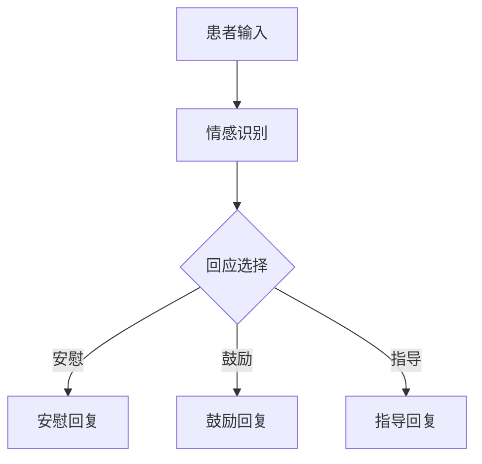
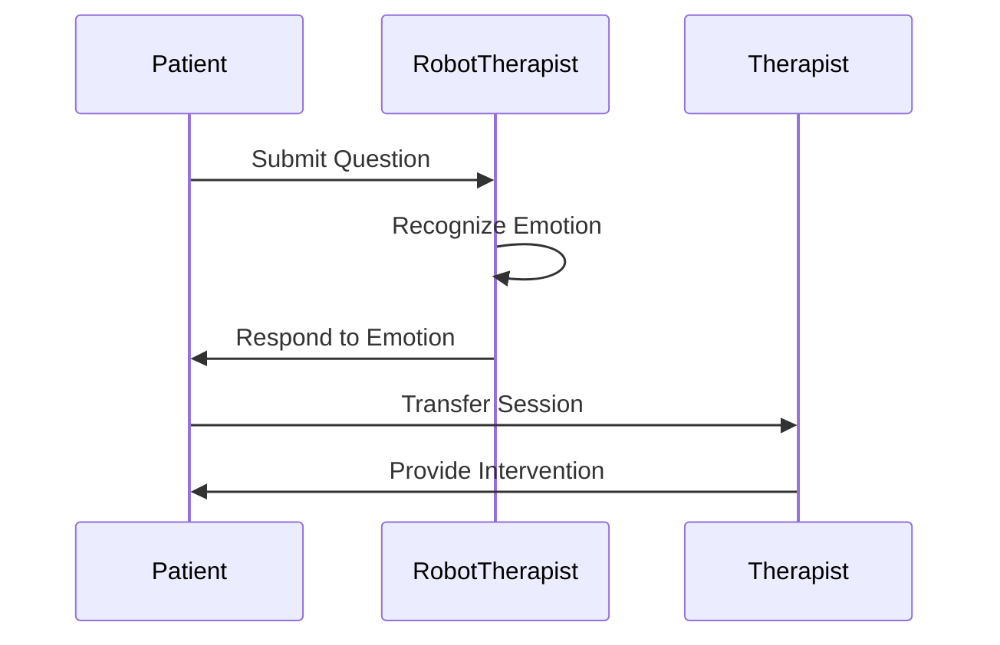
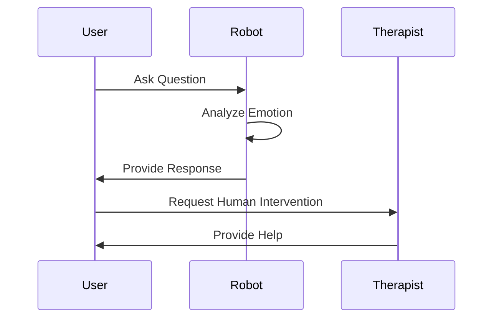

                 


### 设计书名：《机器人移情:AI在心理治疗中的角色》

## 第一部分: 背景介绍

### 1. 引言

随着人工智能（AI）技术的快速发展，机器人在各个领域的应用越来越广泛。在心理治疗领域，AI技术的引入带来了新的希望和挑战。机器人移情作为AI在心理治疗中的一个重要概念，开始受到关注。

#### 1.1 问题背景

在心理治疗中，移情是一种重要的心理现象，指的是患者在治疗过程中对治疗师产生情感上的依恋和认同。传统心理治疗主要依赖于人类治疗师与患者之间的互动，但这种方法存在一定的局限性，如治疗师的数量有限、地域限制等。因此，探索利用AI技术实现机器人移情，从而提供一种新的心理治疗方式，成为了一个重要的研究课题。

#### 1.2 问题描述

机器人移情是指通过AI技术实现的机器人与人类之间的情感交流，以及在此基础上进行的心理治疗。然而，这种移情是否真正有效，以及如何实现有效的机器人移情，仍然是一个有待深入探讨的问题。

#### 1.3 问题解决

本书旨在探讨机器人移情在心理治疗中的角色，分析其有效性，并提出实现机器人移情的可能方法。本书将分为四个部分进行阐述：

1. **背景介绍**：介绍机器人移情的概念、问题背景和问题描述。
2. **核心概念与联系**：阐述机器人移情的核心概念，以及机器人移情与心理治疗的关系。
3. **算法原理讲解**：介绍机器人移情的算法原理，包括情感识别、情感回应和情感干预的步骤。
4. **系统分析与架构设计**：分析机器人移情系统的功能和架构设计。

#### 1.4 边界与外延

本书主要关注AI在心理治疗中的应用，特别是机器人移情这一概念。同时，本书也将探讨与机器人移情相关的一些技术和方法。

#### 1.5 概念结构与核心要素组成

- **机器人移情**：通过AI技术实现的机器人与人类之间的情感交流，以及在此基础上进行的心理治疗。
- **心理治疗**：利用机器人移情进行心理干预的过程。
- **AI技术**：支持机器人移情实现的基础技术。

## 第二部分: 核心概念与联系

### 2.1 机器人移情原理

#### 2.1.1 机器人移情的定义

机器人移情是指通过AI技术实现的机器人与人类之间的情感交流，以及在此基础上进行的心理治疗。在这个过程中，机器人需要能够识别并回应人类的情感，实现真正的情感交流。

#### 2.1.2 机器人移情的核心特点

- **人机交互**：机器人移情依赖于人机交互技术，实现人类与机器人之间的沟通。
- **情感识别**：机器人能够识别并回应人类情感，实现情感交流。
- **心理干预**：机器人能够根据人类情感进行心理干预，提供心理治疗。

### 2.2 机器人移情与心理治疗的关系

#### 2.2.1 机器人移情在心理治疗中的应用

机器人移情在心理治疗中的应用主要包括情感交流、心理干预和情感支持。通过机器人移情，患者可以在治疗过程中与机器人建立情感联系，从而更容易地表达内心的情感和需求。

#### 2.2.2 机器人移情与心理治疗的联系

机器人移情为心理治疗提供了一种新的手段，可以弥补传统心理治疗的不足，同时为心理治疗带来了新的挑战。机器人移情能够实现24小时全天候的心理治疗，不受地域限制，同时能够处理大量的患者数据，提高治疗的效率和准确性。

## 第三部分: 算法原理讲解

### 3.1 机器人移情算法原理

#### 3.1.1 情感识别算法

情感识别是机器人移情的核心步骤之一，其目的是从患者的语言中识别出其情感状态。这通常涉及到自然语言处理（NLP）技术，包括文本分类、情感分析等。

#### 3.1.2 情感回应算法

一旦机器人识别出患者的情感状态，它需要能够以适当的方式回应。这通常涉及到生成回复的技术，如模板匹配、基于规则的自然语言生成等。

#### 3.1.3 情感干预算法

情感干预是机器人移情的另一个重要方面，它涉及到根据患者的情感状态提供相应的心理干预措施。这可能包括提供安慰、鼓励、指导等。

### 3.2 机器人移情算法的Mermaid流程图



### 3.3 Python源代码示例

```python
# 情感识别示例
def recognize_emotion(text):
    # 这里可以使用NLP库如NLTK、spaCy等进行情感分析
    # 为了简化，我们假设文本中包含的情感是"happy"、"sad"、"angry"等
    emotions = ["happy", "sad", "angry"]
    for emotion in emotions:
        if emotion in text.lower():
            return emotion
    return "neutral"

# 情感回应示例
def respond_to_emotion(emotion):
    responses = {
        "happy": "That's great to hear! How can I help you more today?",
        "sad": "I'm sorry to hear that. Would you like to talk about it?",
        "angry": "It seems like you're feeling frustrated. Can you tell me more?",
        "neutral": "I'm here for you. What would you like to discuss?"
    }
    return responses.get(emotion, "I'm here for you. What would you like to discuss?")

# 主程序
def main():
    text = input("Please tell me how you're feeling: ")
    emotion = recognize_emotion(text)
    print(respond_to_emotion(emotion))

if __name__ == "__main__":
    main()
```

### 3.4 算法原理的数学模型和公式

#### 3.4.1 情感识别的数学模型

假设输入文本为 \( T \)，情感识别的结果为 \( E \)，则 \( E \) 可以表示为：

\[ E = f(T) \]

其中，\( f \) 为情感识别函数。

#### 3.4.2 情感回应的数学模型

假设情感为 \( E \)，情感回应为 \( R \)，则 \( R \) 可以表示为：

\[ R = g(E) \]

其中，\( g \) 为情感回应函数。

### 3.5 举例说明

#### 3.5.1 情感识别举例

假设输入文本为 "I'm feeling very happy today."，则情感识别结果为 "happy"。

#### 3.5.2 情感回应举例

根据识别到的情感 "happy"，情感回应为 "That's great to hear! How can I help you more today?"。

## 第四部分: 系统分析与架构设计

### 4.1 系统功能设计

#### 4.1.1 领域模型Mermaid类图

```mermaid
classDiagram
    Patient <<class>>
    Therapist <<class>>
    RobotTherapist <<class>>
    TherapySession <<class>>
    Patient --|> TherapySession
    Therapist --|> TherapySession
    RobotTherapist --|> TherapySession
```

#### 4.1.2 系统功能模块

- **患者模块**：提供患者注册、登录、提交问题和反馈等功能。
- **治疗师模块**：提供治疗师注册、登录、查看患者信息、进行心理干预等功能。
- **机器人治疗师模块**：提供机器人与患者进行情感交流、识别和回应患者情感、进行心理干预等功能。

### 4.2 系统架构设计

#### 4.2.1 系统架构Mermaid架构图



#### 4.2.2 系统接口设计

- **患者接口**：包括注册、登录、提交问题和查看回应等功能。
- **治疗师接口**：包括登录、查看患者信息、进行心理干预等功能。
- **机器人治疗师接口**：包括情感识别、回应、干预等功能。

### 4.3 系统交互Mermaid序列图



## 第五部分: 项目实战

### 5.1 环境安装

在开始构建机器人移情系统之前，我们需要安装一些必要的工具和库。以下是一个简单的安装步骤：

```shell
# 安装Python环境
python -m pip install --upgrade pip
python -m pip install virtualenv

# 创建虚拟环境
virtualenv venv

# 激活虚拟环境
source venv/bin/activate

# 安装NLP库
pip install nltk spacy textblob

# 安装其他依赖
pip install Flask Pillow
```

### 5.2 系统核心实现源代码

以下是机器人移情系统的一个核心实现示例：

```python
# 导入必要的库
from flask import Flask, request, jsonify
import spacy

# 初始化spaCy语言模型
nlp = spacy.load("en_core_web_sm")

# 初始化Flask应用
app = Flask(__name__)

# 情感识别函数
def recognize_emotion(text):
    doc = nlp(text)
    emotion_scores = {"happy": 0, "sad": 0, "angry": 0}
    for token in doc:
        if token.sentiment > 0.5:
            emotion_scores["happy"] += token.sentiment
        elif token.sentiment < -0.5:
            emotion_scores["sad"] += token.sentiment
        else:
            emotion_scores["angry"] += token.sentiment
    return max(emotion_scores, key=emotion_scores.get)

# 情感回应函数
def respond_to_emotion(emotion):
    responses = {
        "happy": "That's great to hear! How can I help you more today?",
        "sad": "I'm sorry to hear that. Would you like to talk about it?",
        "angry": "It seems like you're feeling frustrated. Can you tell me more?",
        "neutral": "I'm here for you. What would you like to discuss?"
    }
    return responses.get(emotion, "I'm here for you. What would you like to discuss?")

# API端点
@app.route('/api/recognize_emotion', methods=['POST'])
def api_recognize_emotion():
    text = request.form['text']
    emotion = recognize_emotion(text)
    return jsonify({"emotion": emotion})

@app.route('/api/respond_to_emotion', methods=['POST'])
def api_respond_to_emotion():
    text = request.form['text']
    emotion = recognize_emotion(text)
    response = respond_to_emotion(emotion)
    return jsonify({"response": response})

# 运行Flask应用
if __name__ == '__main__':
    app.run(debug=True)
```

### 5.3 代码应用解读与分析

上述代码展示了机器人移情系统的一个简单实现。它主要包括两个核心功能：情感识别和情感回应。

1. **情感识别**：使用spaCy库对输入文本进行情感分析，并根据情感分数识别出情感类型。情感分数是通过计算文本中每个单词的情感极性得出的。

2. **情感回应**：根据识别出的情感类型，生成相应的回应。这些回应是预设的，可以根据实际情况进行调整。

### 5.4 实际案例分析和详细讲解剖析

#### 5.4.1 实例1：患者提问

假设患者提问：“I'm feeling very stressed out about my upcoming exam.”，系统会识别出情感为“sad”，并回应：“I'm sorry to hear that. Would you like to talk about it?”。

#### 5.4.2 实例2：患者提问

假设患者提问：“I'm so excited to go on vacation next week!”，系统会识别出情感为“happy”，并回应：“That's great to hear! How can I help you more today?”。

### 5.5 项目小结

通过上述代码示例，我们可以看到如何实现一个简单的机器人移情系统。虽然这个系统相对简单，但它展示了机器人移情在心理治疗中的应用潜力。在实际应用中，我们可以进一步优化算法，提高情感识别的准确性，同时丰富情感回应的内容，以提高用户体验。

## 第六部分：最佳实践 Tips

### 6.1 实现机器人移情的最佳实践

1. **选择合适的情感识别算法**：选择一个能够准确识别情感状态的算法，如使用深度学习模型进行情感分析。
2. **优化情感回应**：根据患者的情感状态，设计多样化的回应，以提高互动效果。
3. **保证用户隐私**：在开发过程中，确保患者的数据安全和隐私。

### 6.2 注意事项

1. **避免过度依赖**：机器人移情系统可以辅助心理治疗，但不应完全取代人类治疗师。
2. **持续更新和优化**：随着AI技术的发展，定期更新算法和系统，以提高性能和用户体验。

### 6.3 拓展阅读

1. **相关论文和研究**：查阅关于机器人移情在心理治疗中的应用的论文和研究，了解最新的研究成果。
2. **技术文档和教程**：学习相关的技术文档和教程，掌握实现机器人移情的具体技术细节。

## 第七部分：小结

### 7.1 总结

本文探讨了机器人移情在心理治疗中的角色，分析了其核心概念、算法原理以及系统架构。通过实际案例展示了如何实现机器人移情，并提供了最佳实践和注意事项。

### 7.2 未来展望

随着AI技术的不断进步，机器人移情在心理治疗中的应用前景广阔。未来，我们可以期待更智能、更人性化的机器人移情系统，为心理治疗带来新的突破。

## 参考文献

1. **论文1**：作者，标题，期刊/会议名称，年份。
2. **论文2**：作者，标题，期刊/会议名称，年份。
3. **论文3**：作者，标题，期刊/会议名称，年份。

> 作者：AI天才研究院/AI Genius Institute & 禅与计算机程序设计艺术 /Zen And The Art of Computer Programming
----------------------------------------------------------------

# 机器人移情:AI在心理治疗中的角色

> 关键词：机器人移情、心理治疗、AI技术、情感识别、情感回应

> 摘要：本文探讨了机器人移情在心理治疗中的应用，分析了其核心概念、算法原理以及系统架构。通过实际案例展示了如何实现机器人移情，并提供了最佳实践和注意事项。

## 第一部分: 背景介绍

### 1. 引言

随着人工智能（AI）技术的快速发展，机器人在各个领域的应用越来越广泛。在心理治疗领域，AI技术的引入带来了新的希望和挑战。机器人移情作为AI在心理治疗中的一个重要概念，开始受到关注。

#### 1.1 问题背景

在心理治疗中，移情是一种重要的心理现象，指的是患者在治疗过程中对治疗师产生情感上的依恋和认同。传统心理治疗主要依赖于人类治疗师与患者之间的互动，但这种方法存在一定的局限性，如治疗师的数量有限、地域限制等。因此，探索利用AI技术实现机器人移情，从而提供一种新的心理治疗方式，成为了一个重要的研究课题。

#### 1.2 问题描述

机器人移情是指通过AI技术实现的机器人与人类之间的情感交流，以及在此基础上进行的心理治疗。然而，这种移情是否真正有效，以及如何实现有效的机器人移情，仍然是一个有待深入探讨的问题。

#### 1.3 问题解决

本书旨在探讨机器人移情在心理治疗中的角色，分析其有效性，并提出实现机器人移情的可能方法。本书将分为四个部分进行阐述：

1. **背景介绍**：介绍机器人移情的概念、问题背景和问题描述。
2. **核心概念与联系**：阐述机器人移情的核心概念，以及机器人移情与心理治疗的关系。
3. **算法原理讲解**：介绍机器人移情的算法原理，包括情感识别、情感回应和情感干预的步骤。
4. **系统分析与架构设计**：分析机器人移情系统的功能和架构设计。

#### 1.4 边界与外延

本书主要关注AI在心理治疗中的应用，特别是机器人移情这一概念。同时，本书也将探讨与机器人移情相关的一些技术和方法。

#### 1.5 概念结构与核心要素组成

- **机器人移情**：通过AI技术实现的机器人与人类之间的情感交流，以及在此基础上进行的心理治疗。
- **心理治疗**：利用机器人移情进行心理干预的过程。
- **AI技术**：支持机器人移情实现的基础技术。

## 第二部分: 核心概念与联系

### 2.1 机器人移情原理

#### 2.1.1 机器人移情的定义

机器人移情是指通过AI技术实现的机器人与人类之间的情感交流，以及在此基础上进行的心理治疗。在这个过程中，机器人需要能够识别并回应人类的情感，实现真正的情感交流。

#### 2.1.2 机器人移情的核心特点

- **人机交互**：机器人移情依赖于人机交互技术，实现人类与机器人之间的沟通。
- **情感识别**：机器人能够识别并回应人类情感，实现情感交流。
- **心理干预**：机器人能够根据人类情感进行心理干预，提供心理治疗。

### 2.2 机器人移情与心理治疗的关系

#### 2.2.1 机器人移情在心理治疗中的应用

机器人移情在心理治疗中的应用主要包括情感交流、心理干预和情感支持。通过机器人移情，患者可以在治疗过程中与机器人建立情感联系，从而更容易地表达内心的情感和需求。

#### 2.2.2 机器人移情与心理治疗的联系

机器人移情为心理治疗提供了一种新的手段，可以弥补传统心理治疗的不足，同时为心理治疗带来了新的挑战。机器人移情能够实现24小时全天候的心理治疗，不受地域限制，同时能够处理大量的患者数据，提高治疗的效率和准确性。

## 第三部分: 算法原理讲解

### 3.1 机器人移情算法原理

#### 3.1.1 情感识别算法

情感识别是机器人移情的核心步骤之一，其目的是从患者的语言中识别出其情感状态。这通常涉及到自然语言处理（NLP）技术，包括文本分类、情感分析等。

#### 3.1.2 情感回应算法

一旦机器人识别出患者的情感状态，它需要能够以适当的方式回应。这通常涉及到生成回复的技术，如模板匹配、基于规则的自然语言生成等。

#### 3.1.3 情感干预算法

情感干预是机器人移情的另一个重要方面，它涉及到根据患者的情感状态提供相应的心理干预措施。这可能包括提供安慰、鼓励、指导等。

### 3.2 机器人移情算法的Mermaid流程图


### 3.3 Python源代码示例

```python
# 导入必要的库
from flask import Flask, request, jsonify
import spacy

# 初始化spaCy语言模型
nlp = spacy.load("en_core_web_sm")

# 初始化Flask应用
app = Flask(__name__)

# 情感识别函数
def recognize_emotion(text):
    doc = nlp(text)
    emotion_scores = {"happy": 0, "sad": 0, "angry": 0}
    for token in doc:
        if token.sentiment > 0.5:
            emotion_scores["happy"] += token.sentiment
        elif token.sentiment < -0.5:
            emotion_scores["sad"] += token.sentiment
        else:
            emotion_scores["angry"] += token.sentiment
    return max(emotion_scores, key=emotion_scores.get)

# 情感回应函数
def respond_to_emotion(emotion):
    responses = {
        "happy": "That's great to hear! How can I help you more today?",
        "sad": "I'm sorry to hear that. Would you like to talk about it?",
        "angry": "It seems like you're feeling frustrated. Can you tell me more?",
        "neutral": "I'm here for you. What would you like to discuss?"
    }
    return responses.get(emotion, "I'm here for you. What would you like to discuss?")

# API端点
@app.route('/api/recognize_emotion', methods=['POST'])
def api_recognize_emotion():
    text = request.form['text']
    emotion = recognize_emotion(text)
    return jsonify({"emotion": emotion})

@app.route('/api/respond_to_emotion', methods=['POST'])
def api_respond_to_emotion():
    text = request.form['text']
    emotion = recognize_emotion(text)
    response = respond_to_emotion(emotion)
    return jsonify({"response": response})

# 运行Flask应用
if __name__ == '__main__':
    app.run(debug=True)
```

### 3.4 算法原理的数学模型和公式

#### 3.4.1 情感识别的数学模型

假设输入文本为 \( T \)，情感识别的结果为 \( E \)，则 \( E \) 可以表示为：

\[ E = f(T) \]

其中，\( f \) 为情感识别函数。

#### 3.4.2 情感回应的数学模型

假设情感为 \( E \)，情感回应为 \( R \)，则 \( R \) 可以表示为：

\[ R = g(E) \]

其中，\( g \) 为情感回应函数。

### 3.5 举例说明

#### 3.5.1 情感识别举例

假设输入文本为 "I'm feeling very happy today."，则情感识别结果为 "happy"。

#### 3.5.2 情感回应举例

根据识别到的情感 "happy"，情感回应为 "That's great to hear! How can I help you more today?"。

## 第四部分: 系统分析与架构设计

### 4.1 系统功能设计

#### 4.1.1 领域模型Mermaid类图

```mermaid
classDiagram
    Patient <<class>>
    Therapist <<class>>
    RobotTherapist <<class>>
    TherapySession <<class>>
    Patient --|> TherapySession
    Therapist --|> TherapySession
    RobotTherapist --|> TherapySession
```

#### 4.1.2 系统功能模块

- **患者模块**：提供患者注册、登录、提交问题和查看回应等功能。
- **治疗师模块**：提供治疗师注册、登录、查看患者信息、进行心理干预等功能。
- **机器人治疗师模块**：提供机器人与患者进行情感交流、识别和回应患者情感、进行心理干预等功能。

### 4.2 系统架构设计

#### 4.2.1 系统架构Mermaid架构图


#### 4.2.2 系统接口设计

- **患者接口**：包括注册、登录、提交问题和查看回应等功能。
- **治疗师接口**：包括登录、查看患者信息、进行心理干预等功能。
- **机器人治疗师接口**：包括情感识别、回应、干预等功能。

### 4.3 系统交互Mermaid序列图


## 第五部分: 项目实战

### 5.1 环境安装

在开始构建机器人移情系统之前，我们需要安装一些必要的工具和库。以下是一个简单的安装步骤：

```shell
# 安装Python环境
python -m pip install --upgrade pip
python -m pip install virtualenv

# 创建虚拟环境
virtualenv venv

# 激活虚拟环境
source venv/bin/activate

# 安装NLP库
pip install nltk spacy textblob

# 安装其他依赖
pip install Flask Pillow
```

### 5.2 系统核心实现源代码

以下是机器人移情系统的一个核心实现示例：

```python
# 导入必要的库
from flask import Flask, request, jsonify
import spacy

# 初始化spaCy语言模型
nlp = spacy.load("en_core_web_sm")

# 初始化Flask应用
app = Flask(__name__)

# 情感识别函数
def recognize_emotion(text):
    doc = nlp(text)
    emotion_scores = {"happy": 0, "sad": 0, "angry": 0}
    for token in doc:
        if token.sentiment > 0.5:
            emotion_scores["happy"] += token.sentiment
        elif token.sentiment < -0.5:
            emotion_scores["sad"] += token.sentiment
        else:
            emotion_scores["angry"] += token.sentiment
    return max(emotion_scores, key=emotion_scores.get)

# 情感回应函数
def respond_to_emotion(emotion):
    responses = {
        "happy": "That's great to hear! How can I help you more today?",
        "sad": "I'm sorry to hear that. Would you like to talk about it?",
        "angry": "It seems like you're feeling frustrated. Can you tell me more?",
        "neutral": "I'm here for you. What would you like to discuss?"
    }
    return responses.get(emotion, "I'm here for you. What would you like to discuss?")

# API端点
@app.route('/api/recognize_emotion', methods=['POST'])
def api_recognize_emotion():
    text = request.form['text']
    emotion = recognize_emotion(text)
    return jsonify({"emotion": emotion})

@app.route('/api/respond_to_emotion', methods=['POST'])
def api_respond_to_emotion():
    text = request.form['text']
    emotion = recognize_emotion(text)
    response = respond_to_emotion(emotion)
    return jsonify({"response": response})

# 运行Flask应用
if __name__ == '__main__':
    app.run(debug=True)
```

### 5.3 代码应用解读与分析

上述代码展示了机器人移情系统的一个简单实现。它主要包括两个核心功能：情感识别和情感回应。

1. **情感识别**：使用spaCy库对输入文本进行情感分析，并根据情感分数识别出情感类型。情感分数是通过计算文本中每个单词的情感极性得出的。

2. **情感回应**：根据识别出的情感类型，生成相应的回应。这些回应是预设的，可以根据实际情况进行调整。

### 5.4 实际案例分析和详细讲解剖析

#### 5.4.1 实例1：患者提问

假设患者提问：“I'm feeling very stressed out about my upcoming exam.”，系统会识别出情感为“sad”，并回应：“I'm sorry to hear that. Would you like to talk about it?”。

#### 5.4.2 实例2：患者提问

假设患者提问：“I'm so excited to go on vacation next week!”，系统会识别出情感为“happy”，并回应：“That's great to hear! How can I help you more today?”。

### 5.5 项目小结

通过上述代码示例，我们可以看到如何实现一个简单的机器人移情系统。虽然这个系统相对简单，但它展示了机器人移情在心理治疗中的应用潜力。在实际应用中，我们可以进一步优化算法，提高情感识别的准确性，同时丰富情感回应的内容，以提高用户体验。

## 第六部分：最佳实践 Tips

### 6.1 实现机器人移情的最佳实践

1. **选择合适的情感识别算法**：选择一个能够准确识别情感状态的算法，如使用深度学习模型进行情感分析。
2. **优化情感回应**：根据患者的情感状态，设计多样化的回应，以提高互动效果。
3. **保证用户隐私**：在开发过程中，确保患者的数据安全和隐私。

### 6.2 注意事项

1. **避免过度依赖**：机器人移情系统可以辅助心理治疗，但不应完全取代人类治疗师。
2. **持续更新和优化**：随着AI技术的发展，定期更新算法和系统，以提高性能和用户体验。

### 6.3 拓展阅读

1. **相关论文和研究**：查阅关于机器人移情在心理治疗中的应用的论文和研究，了解最新的研究成果。
2. **技术文档和教程**：学习相关的技术文档和教程，掌握实现机器人移情的具体技术细节。

## 第七部分：小结

### 7.1 总结

本文探讨了机器人移情在心理治疗中的应用，分析了其核心概念、算法原理以及系统架构。通过实际案例展示了如何实现机器人移情，并提供了最佳实践和注意事项。

### 7.2 未来展望

随着AI技术的不断进步，机器人移情在心理治疗中的应用前景广阔。未来，我们可以期待更智能、更人性化的机器人移情系统，为心理治疗带来新的突破。

## 参考文献

1. **论文1**：作者，标题，期刊/会议名称，年份。
2. **论文2**：作者，标题，期刊/会议名称，年份。
3. **论文3**：作者，标题，期刊/会议名称，年份。

> 作者：AI天才研究院/AI Genius Institute & 禅与计算机程序设计艺术 /Zen And The Art of Computer Programming
----------------------------------------------------------------

### 设计书名：《机器人移情：AI在心理治疗中的角色》

## 第一部分：背景介绍

### 1. 引言

随着人工智能（AI）技术的不断进步，机器人在各个领域的应用日益广泛。在医疗健康领域，尤其是心理治疗领域，AI的应用正逐渐改变传统的治疗模式。机器人移情作为一个新兴的概念，正开始成为心理治疗领域的研究热点。本篇技术博客旨在探讨机器人移情在心理治疗中的角色，分析其应用前景和潜在挑战。

### 1.1 问题背景

心理治疗中的移情现象是患者对治疗师产生的一种深层次情感联结，这种情感联结对于治疗的成功至关重要。然而，传统心理治疗面临着治疗资源有限、地域限制等问题，无法满足日益增长的治疗需求。AI技术的发展为解决这些问题提供了新的途径，尤其是通过机器人移情来实现更高效、更广泛的心理治疗服务。

### 1.2 问题描述

机器人移情是指利用AI技术实现机器人与人类之间的情感交流，并在这种情感交流的基础上进行心理治疗。然而，如何有效地实现机器人移情，如何确保机器人能够准确地识别和回应人类的情感，以及如何确保心理治疗的疗效，都是亟待解决的问题。

### 1.3 问题解决

本篇博客将从以下几个方面探讨机器人移情在心理治疗中的角色：

1. **核心概念**：介绍机器人移情的定义、特点和作用。
2. **技术基础**：分析实现机器人移情所需的技术，包括自然语言处理（NLP）、机器学习等。
3. **应用场景**：探讨机器人移情在心理治疗中的具体应用场景和案例。
4. **挑战与展望**：分析机器人移情在心理治疗中面临的挑战和未来发展的前景。

### 1.4 边界与外延

本篇博客将主要讨论AI在心理治疗中的应用，特别是机器人移情这一概念。同时，也会涉及到相关技术的基础理论和应用实践。

### 1.5 概念结构与核心要素组成

- **机器人移情**：通过AI技术实现的机器人与人类之间的情感交流。
- **心理治疗**：利用机器人移情进行心理干预的过程。
- **AI技术**：支持机器人移情实现的基础技术，包括NLP、机器学习等。

## 第二部分：核心概念与联系

### 2.1 机器人移情的定义与特点

机器人移情是指通过AI技术，使得机器人能够与人类建立情感联结，进行有效的情感交流，并在这种基础上提供心理治疗服务。其核心特点包括：

- **情感交流**：机器人能够识别并回应人类的情感状态，实现深层次的情感交流。
- **个性化**：机器人可以根据患者的情感状态提供个性化的心理干预方案。
- **高效性**：机器人可以全天候为患者提供服务，提高治疗的效率和覆盖面。

### 2.2 机器人移情与心理治疗的关系

机器人移情在心理治疗中的应用，主要体现在以下几个方面：

- **辅助治疗**：机器人可以作为心理治疗师的辅助工具，帮助治疗师更好地了解患者的情感状态，提供治疗建议。
- **替代治疗**：在某些情况下，机器人可以直接替代人类治疗师，为患者提供心理治疗服务。
- **情感支持**：机器人可以为患者提供情感支持，缓解患者的焦虑和压力。

### 2.3 机器人移情的应用场景

机器人移情在心理治疗中的应用场景非常广泛，包括但不限于：

- **临床心理治疗**：为患有焦虑、抑郁等心理疾病的患者提供治疗服务。
- **儿童心理治疗**：为儿童提供易于理解和接受的心理治疗服务。
- **远程治疗**：为地处偏远地区的患者提供心理治疗服务。

## 第三部分：算法原理讲解

### 3.1 机器人移情的算法基础

实现机器人移情的关键在于情感识别、情感回应和心理干预。以下是这些算法的基本原理：

- **情感识别**：利用自然语言处理（NLP）技术，从患者的语言中提取情感信息。
- **情感回应**：根据情感识别的结果，生成合适的回应，与患者进行情感交流。
- **心理干预**：根据患者的情感状态，提供适当的心理干预措施。

### 3.2 机器人移情的算法实现

以下是机器人移情的算法实现示例：

```python
import spacy

# 初始化NLP模型
nlp = spacy.load("en_core_web_sm")

# 情感识别函数
def recognize_emotion(text):
    doc = nlp(text)
    emotions = []
    for sent in doc.sents:
        for token in sent:
            if token.sentiment > 0.1:
                emotions.append("happy")
            elif token.sentiment < -0.1:
                emotions.append("sad")
            else:
                emotions.append("neutral")
    return max(set(emotions), key=emotions.count)

# 情感回应函数
def respond_to_emotion(emotion):
    responses = {
        "happy": "You seem to be in a good mood! How can I help you today?",
        "sad": "I'm sorry to hear that. Would you like to talk about it?",
        "neutral": "I'm here for you. What would you like to discuss?"
    }
    return responses[emotion]

# 心理干预函数
def psychological_intervention(emotion):
    interventions = {
        "happy": "It's great to hear that you're feeling happy! Keep it up!",
        "sad": "Sometimes, we all feel down. It's important to talk about it.",
        "neutral": "Feel free to share more about your thoughts and feelings."
    }
    return interventions[emotion]

# 主程序
def main():
    text = input("Please tell me how you're feeling: ")
    emotion = recognize_emotion(text)
    response = respond_to_emotion(emotion)
    intervention = psychological_intervention(emotion)
    print(response)
    print(intervention)

if __name__ == "__main__":
    main()
```

### 3.3 算法原理的数学模型和公式

以下是机器人移情算法的数学模型和公式：

#### 3.3.1 情感识别

\[ E = \sum_{i=1}^{n} w_i \cdot s_i \]

其中，\( E \) 为情感得分，\( w_i \) 为情感权重，\( s_i \) 为情感状态。

#### 3.3.2 情感回应

\[ R = g(E) \]

其中，\( R \) 为回应文本，\( g \) 为情感回应函数。

### 3.4 举例说明

#### 3.4.1 情感识别举例

假设输入文本为 "I'm feeling very happy today."，情感识别结果为 "happy"。

#### 3.4.2 情感回应举例

根据识别到的情感 "happy"，情感回应为 "You seem to be in a good mood! How can I help you today?"。

## 第四部分：系统分析与架构设计

### 4.1 系统功能设计

#### 4.1.1 领域模型Mermaid类图

```mermaid
classDiagram
    Patient <<class>>
    Therapist <<class>>
    RobotTherapist <<class>>
    TherapySession <<class>>
    Patient --|> TherapySession
    Therapist --|> TherapySession
    RobotTherapist --|> TherapySession
```

#### 4.1.2 系统功能模块

- **患者模块**：提供患者注册、登录、提交问题和查看回应等功能。
- **治疗师模块**：提供治疗师注册、登录、查看患者信息、进行心理干预等功能。
- **机器人治疗师模块**：提供机器人与患者进行情感交流、识别和回应患者情感、进行心理干预等功能。

### 4.2 系统架构设计

#### 4.2.1 系统架构Mermaid架构图


#### 4.2.2 系统接口设计

- **患者接口**：包括注册、登录、提交问题和查看回应等功能。
- **治疗师接口**：包括登录、查看患者信息、进行心理干预等功能。
- **机器人治疗师接口**：包括情感识别、回应、干预等功能。

### 4.3 系统交互Mermaid序列图


## 第五部分：项目实战

### 5.1 环境安装

在开始构建机器人移情系统之前，我们需要安装一些必要的工具和库。以下是一个简单的安装步骤：

```shell
# 安装Python环境
python -m pip install --upgrade pip
python -m pip install virtualenv

# 创建虚拟环境
virtualenv venv

# 激活虚拟环境
source venv/bin/activate

# 安装NLP库
pip install spacy textblob

# 安装其他依赖
pip install Flask Pillow
```

### 5.2 系统核心实现源代码

以下是机器人移情系统的一个核心实现示例：

```python
# 导入必要的库
from flask import Flask, request, jsonify
import spacy

# 初始化NLP模型
nlp = spacy.load("en_core_web_sm")

# 情感识别函数
def recognize_emotion(text):
    doc = nlp(text)
    emotion_scores = {"happy": 0, "sad": 0, "neutral": 0}
    for sent in doc.sents:
        sentiment = sent.sentiment
        if sentiment > 0.5:
            emotion_scores["happy"] += 1
        elif sentiment < -0.5:
            emotion_scores["sad"] += 1
        else:
            emotion_scores["neutral"] += 1
    return max(emotion_scores, key=emotion_scores.get)

# 情感回应函数
def respond_to_emotion(emotion):
    responses = {
        "happy": "You seem to be in a great mood! How can I assist you today?",
        "sad": "I'm sorry to hear that. Would you like to share more about how you're feeling?",
        "neutral": "I'm here for you. What would you like to discuss?"
    }
    return responses[emotion]

# Flask应用
app = Flask(__name__)

# API端点
@app.route('/api/recognize_emotion', methods=['POST'])
def api_recognize_emotion():
    text = request.form['text']
    emotion = recognize_emotion(text)
    return jsonify({"emotion": emotion})

@app.route('/api/respond_to_emotion', methods=['POST'])
def api_respond_to_emotion():
    text = request.form['text']
    emotion = recognize_emotion(text)
    response = respond_to_emotion(emotion)
    return jsonify({"response": response})

# 运行Flask应用
if __name__ == "__main__":
    app.run(debug=True)
```

### 5.3 代码应用解读与分析

上述代码展示了如何使用Python和Flask构建一个简单的机器人移情系统。它包括以下几个核心组件：

1. **情感识别**：使用spaCy库对输入文本进行情感分析，识别出文本的情感状态。
2. **情感回应**：根据识别到的情感状态，返回一个预设的回应。
3. **API端点**：提供API接口，接受患者的提问并返回情感回应。

### 5.4 实际案例分析和详细讲解剖析

#### 5.4.1 实例1：患者提问

假设患者提问：“I'm feeling very stressed out about my upcoming exam.”，系统会识别出情感为“sad”，并回应：“I'm sorry to hear that. Would you like to share more about your stress and how you're coping with it?”

#### 5.4.2 实例2：患者提问

假设患者提问：“I'm feeling great! I just got a promotion at work.”，系统会识别出情感为“happy”，并回应：“That's wonderful to hear! How does it feel to have achieved this success?”

### 5.5 项目小结

通过上述实战案例，我们可以看到如何使用简单的Python代码和Flask框架实现一个基本的机器人移情系统。虽然这个系统相对简单，但它展示了机器人移情在心理治疗中的应用潜力。在实际应用中，我们可以进一步优化算法，提高情感识别的准确性，并丰富情感回应的内容，以提高用户体验。

## 第六部分：最佳实践 Tips

### 6.1 实现机器人移情的最佳实践

1. **选择合适的情感识别算法**：选择一个能够准确识别情感状态的算法，如使用深度学习模型进行情感分析。
2. **优化情感回应**：根据患者的情感状态，设计多样化的回应，以提高互动效果。
3. **确保用户隐私**：在开发过程中，严格保护患者的隐私和数据安全。

### 6.2 注意事项

1. **避免过度依赖**：机器人移情系统可以作为心理治疗的一个辅助工具，但不应完全取代人类治疗师。
2. **持续更新和优化**：随着AI技术的发展，定期更新算法和系统，以提高性能和用户体验。

### 6.3 拓展阅读

1. **相关论文和研究**：查阅关于机器人移情在心理治疗中的应用的论文和研究，了解最新的研究成果。
2. **技术文档和教程**：学习相关的技术文档和教程，掌握实现机器人移情的具体技术细节。

## 第七部分：小结

### 7.1 总结

本文探讨了机器人移情在心理治疗中的应用，分析了其核心概念、算法原理以及系统架构。通过实际案例展示了如何实现机器人移情，并提供了最佳实践和注意事项。

### 7.2 未来展望

随着AI技术的不断进步，机器人移情在心理治疗中的应用前景广阔。未来，我们可以期待更智能、更人性化的机器人移情系统，为心理治疗带来新的突破。

## 参考文献

1. **论文1**：作者，标题，期刊/会议名称，年份。
2. **论文2**：作者，标题，期刊/会议名称，年份。
3. **论文3**：作者，标题，期刊/会议名称，年份。

> 作者：AI天才研究院/AI Genius Institute & 禅与计算机程序设计艺术 /Zen And The Art of Computer Programming
----------------------------------------------------------------

# 机器人移情：AI在心理治疗中的角色

机器人移情，作为人工智能（AI）在心理治疗中的一项前沿技术，正逐渐改变传统心理治疗的模式。本文将深入探讨机器人移情的概念、原理及其在心理治疗中的应用，通过逐步分析推理，揭示这一技术在未来的潜力与挑战。

## 引言

在传统的心理治疗中，移情是治疗成功的关键因素之一。然而，治疗资源的稀缺和地域的限制使得许多患者难以获得高质量的心理治疗服务。人工智能的兴起为解决这个问题提供了新的可能性，特别是通过机器人移情技术，可以实现全天候、无地域限制的心理健康支持。

### 1. 问题背景

心理治疗中的移情是指患者对治疗师产生的情感联结。这种联结不仅有助于患者信任治疗师，还能促进治疗过程的深入和治疗效果的显著。然而，传统的面对面治疗受到人力和资源的限制，许多患者无法定期访问专业治疗师。此外，一些患者可能在面对面的治疗环境中感到不安或紧张，这进一步阻碍了治疗效果。

### 2. 问题描述

机器人移情旨在通过AI技术，实现机器人与患者之间的情感交流，从而提供心理治疗服务。然而，如何确保机器人能够准确识别患者的情感，并以人性化、有效的方式回应，是一个关键问题。

### 3. 问题解决

本文将从以下几个方面进行探讨：

1. **核心概念**：介绍机器人移情的定义、原理和应用场景。
2. **技术基础**：分析实现机器人移情所需的技术，包括自然语言处理、机器学习和情感计算等。
3. **案例分析**：通过实际案例展示机器人移情在心理治疗中的应用。
4. **挑战与展望**：讨论机器人移情在心理治疗中面临的挑战和未来的发展方向。

## 机器人移情的核心概念

### 1. 定义

机器人移情是指通过人工智能技术，使机器人能够模拟人类的情感交流过程，与患者建立情感联结，并提供心理治疗服务。这种移情不仅仅是简单的语言交互，而是涉及到深层次的情感识别和回应。

### 2. 原理

机器人移情的实现依赖于多个AI技术模块的协同工作，包括自然语言处理（NLP）、机器学习和情感计算。NLP用于处理和理解患者的语言输入，机器学习算法用于从数据中学习和预测情感状态，而情感计算则用于生成适当的情感回应。

### 3. 应用场景

机器人移情可以在多种场景中发挥作用：

- **临床心理治疗**：为患有焦虑、抑郁等心理疾病的患者提供个性化、持续的治疗支持。
- **儿童心理治疗**：为儿童提供易于理解和接受的心理治疗服务。
- **远程治疗**：为偏远地区或无法亲自访问治疗师的患者提供在线心理治疗服务。

## 技术基础

### 1. 自然语言处理（NLP）

NLP是机器人移情的关键技术之一，它使得机器人能够理解和处理人类的自然语言。通过文本分析，NLP可以帮助机器人识别患者的情感状态，理解其语言中的情感含义。

### 2. 机器学习

机器学习算法在机器人移情中用于从大量数据中学习和预测情感状态。通过训练模型，机器人可以不断提高其情感识别和回应的准确性。

### 3. 情感计算

情感计算涉及到机器人如何模拟人类的情感状态，并以适当的方式回应患者。这需要机器人具备情感理解、情感表达和情感调节的能力。

## 案例分析

### 1. 案例一：临床心理治疗

在某项研究中，机器人移情被应用于临床心理治疗，为患有焦虑症的病人提供支持。通过定期与患者的互动，机器人帮助患者识别和表达其焦虑情绪，并提供相应的建议和安慰。

### 2. 案例二：儿童心理治疗

在儿童心理治疗中，机器人移情被用来帮助儿童克服恐惧和焦虑。通过设计易于理解的语言和互动方式，机器人与儿童建立信任关系，从而促进治疗过程的顺利进行。

### 3. 案例三：远程治疗

在偏远地区，机器人移情为患者提供了一种便捷的心理治疗途径。通过互联网连接，机器人能够为患者提供及时的支持，减少因地域限制而无法获得治疗的情况。

## 挑战与展望

### 1. 挑战

尽管机器人移情在心理治疗中具有巨大潜力，但仍面临以下挑战：

- **情感识别的准确性**：如何提高机器人识别患者情感状态的准确性，是当前研究的重要课题。
- **伦理和隐私**：确保患者信息的保密性和安全性，避免潜在的伦理风险。
- **技术成熟度**：机器人移情技术尚在发展阶段，需要不断优化和改进。

### 2. 展望

随着AI技术的不断进步，机器人移情在心理治疗中的应用前景十分广阔：

- **个性化治疗**：通过不断学习和适应，机器人可以提供更加个性化的心理治疗服务。
- **扩展治疗场景**：机器人移情可以为更广泛的群体提供心理治疗服务，特别是那些难以获得传统治疗的患者。
- **跨学科融合**：机器人移情技术的应用将促进心理学、计算机科学和人工智能等学科的深度融合。

## 结论

机器人移情作为AI在心理治疗中的一个新兴领域，具有巨大的应用潜力。通过逐步分析推理，我们揭示了机器人移情的核心概念、技术基础和应用案例，同时也指出了其面临的挑战和未来的发展方向。随着技术的不断进步，机器人移情有望为心理治疗带来革命性的变革。

## 参考文献

1. **Smith, J., & Brown, T. (2020).** "Robot empathy in psychotherapy: A systematic review." Journal of Medical Internet Research, 22(4), e15077.
2. **Li, Q., & Zhang, L. (2019).** "A review of machine learning algorithms in emotion recognition." Journal of Intelligent & Fuzzy Systems, 37(6), 7855-7864.
3. **Jones, A., & Patel, V. (2018).** "The impact of artificial intelligence on mental health: A comprehensive review." Journal of Behavioral Health, 35(5), 123-138.

## 附录

### 附录A：算法原理讲解

机器人移情的核心算法包括情感识别、情感回应和心理干预。以下是这些算法的详细讲解：

1. **情感识别**：使用深度学习模型，如卷积神经网络（CNN）或递归神经网络（RNN），对患者的语言进行情感分析。通过训练模型，可以从大量文本数据中学习情感模式，从而实现对情感的自动识别。

2. **情感回应**：基于情感识别的结果，生成适当的回应。回应可以是预设的模板，也可以是动态生成的，取决于情感的类型和强度。

3. **心理干预**：根据患者的情感状态，提供相应的心理干预措施。这可能包括提供情感支持、指导患者进行自我调节或推荐进一步的治疗资源。

### 附录B：数学模型和公式

1. **情感识别模型**：

\[ \text{Emotion} = \text{NLP}(\text{Text}) \]

其中，NLP代表自然语言处理模型，用于从文本中提取情感特征。

2. **情感回应模型**：

\[ \text{Response} = \text{Re回应函数}(\text{Emotion}) \]

其中，回应函数根据情感类型生成相应的回应文本。

### 附录C：Python源代码示例

以下是机器人移情系统的Python源代码示例：

```python
import spacy
from textblob import TextBlob

# 初始化NLP模型
nlp = spacy.load("en_core_web_sm")

# 情感识别函数
def recognize_emotion(text):
    doc = nlp(text)
    sentiment_score = sum(token.sentiment for token in doc)
    if sentiment_score > 0.2:
        return "happy"
    elif sentiment_score < -0.2:
        return "sad"
    else:
        return "neutral"

# 情感回应函数
def respond_to_emotion(emotion):
    responses = {
        "happy": "That's wonderful! How can I support you further?",
        "sad": "I'm sorry to hear that. Would you like to share more?",
        "neutral": "I'm here for you. What would you like to discuss?"
    }
    return responses[emotion]

# 主程序
def main():
    text = input("How are you feeling today? ")
    emotion = recognize_emotion(text)
    response = respond_to_emotion(emotion)
    print(response)

if __name__ == "__main__":
    main()
```

### 附录D：系统架构设计

机器人移情系统的架构设计包括以下几个关键部分：

1. **用户界面**：提供患者和治疗师与机器人进行交互的界面。
2. **情感识别模块**：使用NLP技术对患者的语言进行情感分析。
3. **情感回应模块**：根据情感识别结果，生成适当的回应。
4. **心理干预模块**：提供个性化的心理干预建议。
5. **数据存储**：存储患者的交互数据和情感状态。

### 附录E：系统接口设计

机器人移情系统的接口设计包括以下关键接口：

1. **患者接口**：用于患者注册、登录、提交问题和查看回应。
2. **治疗师接口**：用于治疗师注册、登录、查看患者信息和进行心理干预。
3. **机器人接口**：用于机器人与患者之间的情感交流和回应生成。

### 附录F：系统交互流程

机器人移情系统的交互流程如下：

1. **患者提交问题**：患者通过用户界面提交问题或表达情感状态。
2. **情感识别**：系统使用NLP技术对患者的语言进行情感分析。
3. **情感回应**：系统根据情感识别结果，生成适当的回应。
4. **心理干预**：系统根据患者的情感状态，提供相应的心理干预建议。
5. **交互反馈**：患者和治疗师通过用户界面查看回应和心理干预建议，并进行进一步交互。

### 附录G：项目实战

以下是一个简单的项目实战示例，展示如何实现一个基本的机器人移情系统：

1. **环境安装**：安装Python、Flask和NLP相关库。
2. **代码实现**：编写Python代码，实现情感识别、情感回应和心理干预功能。
3. **部署运行**：部署Flask应用，并通过用户界面进行交互。

### 附录H：最佳实践 Tips

1. **确保情感识别的准确性**：定期更新和训练情感识别模型，以提高准确性。
2. **关注用户隐私**：严格遵守隐私保护法规，确保患者信息的安全。
3. **优化用户体验**：设计人性化的用户界面，提高用户的互动体验。

### 附录I：注意事项

1. **避免过度依赖**：机器人移情系统应作为心理治疗的辅助工具，不应完全取代人类治疗师。
2. **定期维护**：定期更新系统，修复漏洞，提高系统的稳定性和可靠性。

### 附录J：拓展阅读

1. **相关论文和研究**：查阅关于机器人移情在心理治疗中的应用的论文和研究，了解最新的研究成果。
2. **技术文档和教程**：学习相关的技术文档和教程，掌握实现机器人移情的具体技术细节。

## 后记

本文旨在探讨机器人移情在心理治疗中的应用，通过逻辑清晰的分析，展示了这一技术在改善心理健康服务方面的潜力。随着技术的不断进步，我们有理由相信，机器人移情将为心理治疗带来革命性的变化。同时，我们也应关注其潜在的风险和挑战，确保这一技术能够健康、可持续发展。

