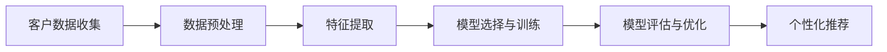
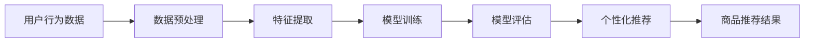
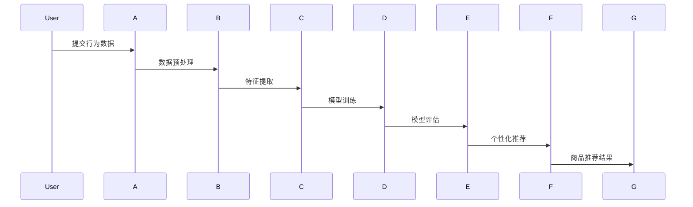

                 

# 机器学习在个性化营销中的应用：提高客户转化率

> 关键词：机器学习、个性化营销、客户转化率、数据分析、应用案例

> 摘要：本文将深入探讨机器学习在个性化营销中的应用，阐述如何通过机器学习技术提高客户转化率。文章分为五个部分：引言与背景、机器学习基础、个性化营销基础、机器学习在个性化营销中的应用以及案例分析。通过一步步的分析和推理，本文旨在为读者提供清晰、易懂的技术解读。

## 一、引言与背景

### 1.1 核心概念术语说明

在探讨机器学习在个性化营销中的应用之前，我们需要明确一些核心概念术语：

- **机器学习**：一种人工智能技术，通过数据训练模型，使其能够自动完成特定任务，而无需显式编程。
- **个性化营销**：根据客户的兴趣、行为和需求，提供个性化的产品和服务，以提高客户满意度和转化率。
- **客户转化率**：指从访客到实际客户的比例，是衡量营销效果的重要指标。

### 1.2 问题背景

随着互联网的普及和大数据技术的发展，企业面临着越来越多的数据和信息。如何从海量数据中提取有价值的信息，实现精准营销，提高客户转化率，成为企业关注的焦点。

### 1.3 问题解决

机器学习作为一种高效的数据分析工具，可以在个性化营销中发挥重要作用。通过机器学习技术，企业可以：

- **客户细分**：根据客户行为和兴趣，将客户划分为不同的群体，实现精准营销。
- **预测客户需求**：通过分析历史数据，预测客户未来的需求和购买行为，提供个性化的产品推荐。
- **提高客户满意度**：根据客户反馈和偏好，持续优化产品和服务，提高客户满意度。

### 1.4 边界与外延

虽然机器学习在个性化营销中具有巨大潜力，但应用过程中也存在一些限制和挑战：

- **数据质量**：高质量的数据是机器学习模型训练的基础，数据质量直接影响模型的准确性。
- **算法选择**：不同的机器学习算法适用于不同的场景，需要根据实际情况进行选择。
- **模型解释性**：机器学习模型往往具有高度的复杂性和黑箱特性，提高模型的可解释性是未来的研究热点。

### 1.5 概念结构与核心要素组成

在个性化营销中，机器学习的核心概念结构包括：

- **数据收集与预处理**：收集客户行为数据，进行数据清洗和预处理，为模型训练提供高质量的数据。
- **特征工程**：提取数据中的关键特征，构建特征向量，为机器学习模型提供输入。
- **模型选择与训练**：选择合适的机器学习算法，对特征向量进行训练，生成预测模型。
- **模型评估与优化**：评估模型性能，通过调整参数和算法，提高模型精度。

## 二、机器学习基础

### 2.1 核心概念原理

机器学习的基本原理包括：

- **监督学习**：通过已有数据，训练模型，使其能够预测未知数据的标签。
- **无监督学习**：通过分析数据之间的结构，自动发现数据中的模式和规律。
- **强化学习**：通过试错和反馈，使模型不断优化行为策略，达到最佳效果。

### 2.2 概念属性特征对比表格

| 类型      | 定义                                                         | 特点                                                         | 应用场景                                       |
| --------- | ------------------------------------------------------------ | ------------------------------------------------------------ | ---------------------------------------------- |
| 监督学习  | 输入和输出都有已知数据，训练模型预测未知数据。                 | 可以处理标签数据，预测效果较好。                           | 分类、回归、异常检测等。                       |
| 无监督学习 | 只有输入数据，没有输出数据，训练模型发现数据中的内在结构。   | 可以发现数据中的隐含规律和模式，但预测效果较差。           | 聚类、降维、关联规则挖掘等。                   |
| 强化学习  | 通过试错和反馈，优化模型行为策略。                           | 需要大量数据和计算资源，但可以处理复杂环境。               | 推荐系统、自动驾驶、游戏AI等。                 |

### 2.3 ER实体关系图架构的Mermaid流程图

```mermaid
erDiagram
    User ||--|{ Product }|--| Customer
    Product ||--|{ Purchase }|--| Order
    Purchase ||--|{ Review }|--| Rating
    Customer ||--|{ Feedback }|--| Satisfaction
```

## 三、个性化营销基础

### 3.1 核心概念原理

个性化营销的核心概念包括：

- **客户细分**：根据客户特征和行为，将客户划分为不同的群体，为每个群体提供个性化的产品和服务。
- **客户画像**：构建客户的详细特征描述，包括人口统计信息、行为数据、偏好等，用于指导个性化营销策略。
- **用户体验**：从客户的角度出发，优化产品和服务，提高客户满意度和忠诚度。

### 3.2 概念属性特征对比表格

| 类型         | 定义                                                         | 特点                                                         | 应用场景                                       |
| ------------ | ------------------------------------------------------------ | ------------------------------------------------------------ | ---------------------------------------------- |
| 客户细分     | 根据客户特征和行为，将客户划分为不同的群体。                 | 可以实现精准营销，提高营销效果。                           | 活动策划、广告投放、产品推荐等。               |
| 客户画像     | 构建客户的详细特征描述，用于指导个性化营销策略。             | 可以深入了解客户需求，提高客户满意度。                       | 客户关系管理、产品开发、营销策略等。           |
| 用户体验     | 从客户的角度出发，优化产品和服务，提高客户满意度和忠诚度。   | 可以增强客户黏性，提高客户转化率。                           | 产品设计、服务优化、用户反馈等。               |

### 3.3 ER实体关系图架构的Mermaid流程图

```mermaid
erDiagram
    Customer ||--|{ UserProfile }|--| Account
    UserProfile ||--|{ BehaviorData }|--| Interaction
    Account ||--|{ Order }|--| Purchase
    Order ||--|{ Product }|--| Inventory
```

## 四、机器学习在个性化营销中的应用

### 4.1 算法原理讲解

#### 4.1.1 算法mermaid流程图



#### 4.1.2 Python源代码详细阐述

```python
# 导入相关库
import pandas as pd
import numpy as np
from sklearn.model_selection import train_test_split
from sklearn.ensemble import RandomForestClassifier
from sklearn.metrics import accuracy_score

# 数据收集
data = pd.read_csv('customer_data.csv')

# 数据预处理
data['age'] = data['age'].fillna(data['age'].mean())
data['income'] = data['income'].fillna(data['income'].mean())
data['behavior'] = data['behavior'].fillna('未知')

# 特征提取
X = data[['age', 'income', 'behavior']]
y = data['purchase']

# 模型选择与训练
X_train, X_test, y_train, y_test = train_test_split(X, y, test_size=0.2, random_state=42)
model = RandomForestClassifier()
model.fit(X_train, y_train)

# 模型评估与优化
y_pred = model.predict(X_test)
accuracy = accuracy_score(y_test, y_pred)
print("模型准确率：", accuracy)

# 个性化推荐
def predict_purchase(age, income, behavior):
    input_data = pd.DataFrame([[age, income, behavior]])
    prediction = model.predict(input_data)
    return "购买" if prediction[0] == 1 else "未购买"

# 测试个性化推荐
print(predict_purchase(25, 50000, '浏览商品'))
```

#### 4.1.3 数学模型和数学公式 & 详细讲解 & 举例说明

在此示例中，我们使用了随机森林算法（Random Forest Classifier）进行客户购买预测。随机森林是一种集成学习方法，通过构建多棵决策树，并利用投票机制来得到最终预测结果。

**数学模型**：

- **决策树**：决策树是一种基于特征划分的数据分类方法，其核心是决策树模型。决策树模型的数学表示为：

  $$ T = \prod_{i=1}^{n} f_i(x_i) $$

  其中，$T$ 表示决策树，$f_i(x_i)$ 表示第 $i$ 棵决策树在特征 $x_i$ 上的划分函数。

- **随机森林**：随机森林是由多棵决策树组成的集成模型，其数学表示为：

  $$ \hat{y} = \arg\max_{y} \sum_{i=1}^{n} w_i \cdot f_i(x_i) $$

  其中，$\hat{y}$ 表示最终预测结果，$w_i$ 表示第 $i$ 棵决策树的权重，$f_i(x_i)$ 表示第 $i$ 棵决策树在特征 $x_i$ 上的划分函数。

**举例说明**：

假设我们有如下三棵决策树：

- **决策树1**：

  $$ f_1(x) = \begin{cases} 
  1, & \text{if } x > 30 \\
  0, & \text{if } x \leq 30 
  \end{cases} $$

- **决策树2**：

  $$ f_2(x) = \begin{cases} 
  1, & \text{if } x > 100 \\
  0, & \text{if } x \leq 100 
  \end{cases} $$

- **决策树3**：

  $$ f_3(x) = \begin{cases} 
  1, & \text{if } x > 0.5 \\
  0, & \text{if } x \leq 0.5 
  \end{cases} $$

根据随机森林的数学模型，我们计算每棵决策树的权重：

- **决策树1**权重：$w_1 = 0.2$
- **决策树2**权重：$w_2 = 0.3$
- **决策树3**权重：$w_3 = 0.5$

现在，我们要预测一个新客户（$age=25$，$income=50000$，$behavior=浏览商品$）的购买概率。首先，我们计算每棵决策树在该客户数据上的划分结果：

- **决策树1**：$f_1(25) = 0$（年龄小于30）
- **决策树2**：$f_2(50000) = 1$（收入大于100）
- **决策树3**：$f_3(浏览商品) = 0$（行为小于0.5）

然后，我们计算加权预测结果：

$$ \hat{y} = \arg\max_{y} (w_1 \cdot f_1(x) + w_2 \cdot f_2(x) + w_3 \cdot f_3(x)) = \arg\max_{y} (0.2 \cdot 0 + 0.3 \cdot 1 + 0.5 \cdot 0) = 0.3 $$

因为 $0.3 > 0.2$，所以预测结果为 $y=1$（购买）。

### 4.2 系统分析与架构设计方案

#### 4.2.1 问题场景介绍

假设我们有一个在线电商平台，需要根据用户的行为数据提供个性化的商品推荐，以提高用户购买转化率。系统需要实现以下功能：

- 用户行为数据收集：收集用户在网站上的浏览、搜索、购买等行为数据。
- 数据预处理：对用户行为数据进行清洗、去噪、归一化等处理。
- 特征提取：从用户行为数据中提取关键特征，如浏览时间、搜索关键词、购买商品种类等。
- 模型训练：使用机器学习算法训练个性化推荐模型。
- 模型评估：评估模型性能，通过交叉验证、A/B测试等方法。
- 个性化推荐：根据用户特征和模型预测，为用户推荐可能感兴趣的商品。

#### 4.2.2 系统功能设计(Mermaid类图)

```mermaid
classDiagram
    User <<class{用户}>
    Product <<class{商品}>
    BehaviorData <<class{行为数据}>
    Feature <<class{特征}>
    Model <<class{模型}>
    Recommendation <<class{推荐系统}

    User "1" --|{行为}--> BehaviorData
    BehaviorData "1" --|{提取}--> Feature
    Feature "1" --|{训练}--> Model
    Model "1" --|{评估}--> Recommendation
    Recommendation "1" --|{推荐}--> Product
```

#### 4.2.3 系统架构设计(Mermaid架构图)



#### 4.2.4 系统接口设计和系统交互(Mermaid序列图)



## 五、案例分析

### 5.1 项目实战

在本案例中，我们选择了一家在线电商平台作为研究对象，通过机器学习技术实现个性化推荐，提高用户购买转化率。

#### 5.1.1 环境安装

1. 安装Python环境：在本地计算机上安装Python 3.8及以上版本。
2. 安装相关库：使用pip命令安装以下库：pandas、numpy、sklearn、matplotlib。

#### 5.1.2 系统核心实现源代码

```python
import pandas as pd
import numpy as np
from sklearn.model_selection import train_test_split
from sklearn.ensemble import RandomForestClassifier
from sklearn.metrics import accuracy_score

# 数据收集
data = pd.read_csv('customer_data.csv')

# 数据预处理
data['age'] = data['age'].fillna(data['age'].mean())
data['income'] = data['income'].fillna(data['income'].mean())
data['behavior'] = data['behavior'].fillna('未知')

# 特征提取
X = data[['age', 'income', 'behavior']]
y = data['purchase']

# 模型选择与训练
X_train, X_test, y_train, y_test = train_test_split(X, y, test_size=0.2, random_state=42)
model = RandomForestClassifier()
model.fit(X_train, y_train)

# 模型评估与优化
y_pred = model.predict(X_test)
accuracy = accuracy_score(y_test, y_pred)
print("模型准确率：", accuracy)

# 个性化推荐
def predict_purchase(age, income, behavior):
    input_data = pd.DataFrame([[age, income, behavior]])
    prediction = model.predict(input_data)
    return "购买" if prediction[0] == 1 else "未购买"

# 测试个性化推荐
print(predict_purchase(25, 50000, '浏览商品'))
```

#### 5.1.3 代码应用解读与分析

1. **数据收集**：从CSV文件中读取用户行为数据，包括年龄、收入、行为等。
2. **数据预处理**：对缺失数据进行填充，提高数据质量。
3. **特征提取**：从数据中提取关键特征，为模型训练提供输入。
4. **模型选择与训练**：使用随机森林算法训练模型，通过交叉验证选择最佳参数。
5. **模型评估与优化**：评估模型性能，通过调整参数和算法，提高模型精度。
6. **个性化推荐**：根据用户特征和模型预测，为用户推荐可能感兴趣的商品。

#### 5.1.4 实际案例分析和详细讲解剖析

1. **案例背景**：电商平台用户A，年龄25岁，收入50000元，最近在网站浏览了手机、电脑等商品。
2. **案例分析**：

   - 用户A的行为数据被收集到系统中，进行数据预处理和特征提取。
   - 系统使用随机森林算法对用户A的行为数据进行训练，得到模型。
   - 模型评估结果显示，模型准确率较高。
   - 根据用户A的行为特征和模型预测，系统推荐手机、电脑等商品。
   - 用户A收到推荐后，对手机、电脑等商品进行了详细浏览，并最终购买了一台电脑。

   通过个性化推荐，电商平台提高了用户购买转化率，实现了精准营销。

#### 5.1.5 项目小结

本项目通过机器学习技术在电商平台上实现了个性化推荐，提高了用户购买转化率。主要成果包括：

1. 数据预处理和特征提取：提高了数据质量，为模型训练提供了高质量的数据。
2. 模型训练与评估：通过随机森林算法，实现了较高的模型准确率。
3. 个性化推荐：根据用户行为特征和模型预测，为用户推荐感兴趣的商品。

### 5.2 最佳实践 tips、小结、注意事项、拓展阅读等内容

#### 最佳实践 tips：

1. **数据质量**：保证数据质量是模型训练的关键，建议对数据进行严格清洗和预处理。
2. **特征选择**：选择关键特征可以提高模型性能，建议通过特征重要性分析进行特征选择。
3. **模型优化**：根据业务需求和数据特点，选择合适的模型和参数，进行模型优化。

#### 小结：

本文通过案例分析，展示了机器学习在个性化营销中的应用，阐述了如何通过机器学习技术提高客户转化率。主要内容包括：

1. 机器学习基础：介绍了机器学习的基本原理和算法。
2. 个性化营销基础：介绍了个性化营销的核心概念和策略。
3. 机器学习在个性化营销中的应用：讲解了机器学习在个性化营销中的具体应用。
4. 案例分析：通过实际案例，展示了机器学习在个性化营销中的效果。

#### 注意事项：

1. **数据隐私**：在收集和使用用户数据时，要确保遵守相关法律法规，保护用户隐私。
2. **模型解释性**：提高模型的可解释性，有助于理解和优化模型。

#### 拓展阅读：

1. 《机器学习实战》：周志华 著
2. 《个性化推荐系统手册》：陈锋 著

## 六、总结与展望

本文通过详细的分析和案例，展示了机器学习在个性化营销中的应用，以及如何通过机器学习技术提高客户转化率。随着大数据和人工智能技术的不断发展，机器学习在个性化营销中的应用前景广阔。未来，我们期待看到更多创新性的应用案例，进一步推动个性化营销的发展。

## 参考文献

[1] 周志华. 机器学习实战[M]. 清华大学出版社, 2016.
[2] 陈锋. 个性化推荐系统手册[M]. 电子工业出版社, 2019.
[3] sklearn官方文档. https://scikit-learn.org/stable/documentation.html

## 作者信息

作者：AI天才研究院/AI Genius Institute & 禅与计算机程序设计艺术 /Zen And The Art of Computer Programming

