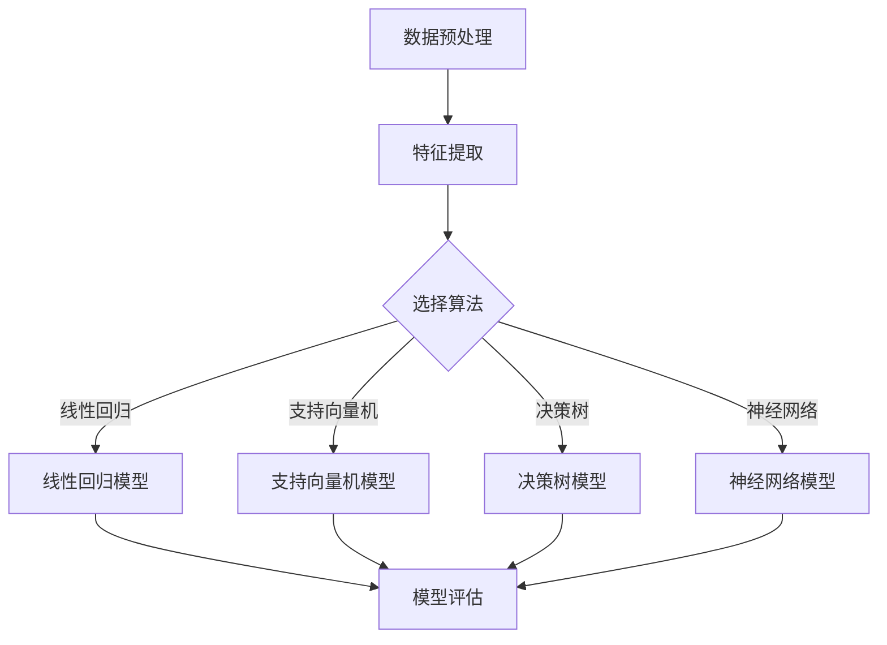
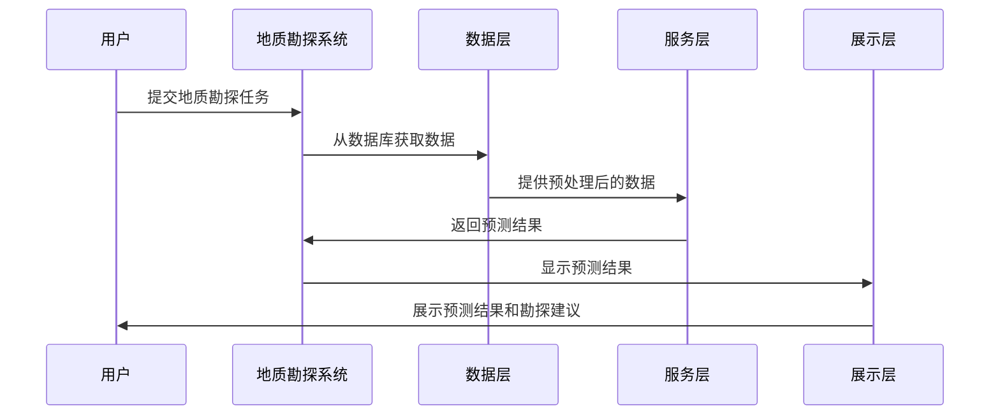

                 

## 《机器学习在地质勘探中的应用：提高资源发现率》

### 关键词

- 机器学习
- 地质勘探
- 资源发现率
- 深度学习
- 强化学习
- 数据融合
- 自动化勘探

### 摘要

随着科技的进步，机器学习在地质勘探领域的应用逐渐受到关注。本文将深入探讨机器学习在地质勘探中的应用，如何通过算法优化和数据处理提高资源发现率。文章首先介绍了地质勘探的基本概念和现状，随后介绍了机器学习的基础知识和核心算法。接下来，详细分析了机器学习与地质勘探之间的联系，并通过实际案例展示了机器学习在不同地质勘探场景中的应用。最后，讨论了提高资源发现率的策略和方法，并对未来的发展趋势进行了展望。

## 引言

地质勘探是矿产资源、地下水、天然气等自然资源发现的关键步骤。然而，传统地质勘探方法往往依赖经验，存在效率低、精度不足等问题。随着数据科学和机器学习技术的不断发展，利用这些先进技术优化地质勘探过程变得日益可行。机器学习通过分析大量地质数据，能够发现隐藏的模式和规律，从而提高资源发现率。

本文将围绕以下几个方面展开讨论：

1. 地质勘探的挑战与机遇
2. 机器学习基础
3. 机器学习与地质勘探的联系
4. 机器学习在地质勘探中的应用案例
5. 提高资源发现率的策略与方法
6. 未来展望与挑战

## 地质勘探的挑战与机遇

地质勘探的目标是发现地下的矿产资源和其他自然资源。然而，这一过程面临诸多挑战。首先，地质条件复杂多变，不同区域的地质特征差异巨大，这增加了勘探的难度。其次，地质勘探通常需要大量的时间和资金投入，而传统的勘探方法难以准确预测资源的分布。此外，地质勘探过程中的数据采集和处理也面临挑战，如何从海量数据中提取有效信息成为关键问题。

随着机器学习技术的发展，地质勘探迎来了新的机遇。机器学习能够处理和分析大量复杂数据，发现隐藏的模式和规律，从而提高勘探的准确性和效率。例如，通过地震勘探数据，机器学习算法可以识别地下结构的异常，预测矿产资源的分布。此外，机器学习还可以优化勘探路径，减少不必要的勘查，从而降低成本。

## 机器学习基础

### 机器学习的基本概念

机器学习是人工智能的一个分支，其核心思想是通过算法从数据中自动学习规律和模式，以实现特定任务。机器学习可以分为监督学习、无监督学习和强化学习三种主要类型。

- **监督学习**：通过已知输入输出数据训练模型，使模型能够预测未知数据的输出。常见的算法包括线性回归、逻辑回归、支持向量机（SVM）和神经网络等。
- **无监督学习**：不依赖于已知输出数据，而是通过分析输入数据中的结构或模式进行学习。常见的算法包括聚类分析、主成分分析（PCA）和自编码器等。
- **强化学习**：通过与环境的交互，学习最佳策略以最大化长期回报。常见的算法包括Q-学习、深度Q网络（DQN）和策略梯度算法等。

### 常见的机器学习算法

在地质勘探中，常用的机器学习算法包括线性回归、支持向量机（SVM）、决策树、随机森林和神经网络等。

- **线性回归**：适用于简单的线性关系预测，通过最小二乘法求解模型参数。
- **支持向量机（SVM）**：通过寻找最佳分割超平面，实现分类和回归任务。
- **决策树**：通过树形结构对数据进行划分，实现对数据的分类或回归。
- **随机森林**：通过构建多个决策树并集成它们的预测结果，提高模型的泛化能力。
- **神经网络**：通过模拟人脑神经元的工作方式，实现复杂的非线性映射。

### 数据预处理与特征工程

在机器学习应用中，数据预处理和特征工程是至关重要的步骤。数据预处理包括数据清洗、数据归一化、缺失值处理等，以确保数据的质量和一致性。特征工程则通过选择和构造特征，提高模型的性能。

在地质勘探中，常见的特征包括地质参数、地球物理参数、地球化学参数等。通过合理的特征工程，可以提取出对资源分布具有指导意义的信息。

## 机器学习与地质勘探的关系

机器学习与地质勘探之间的联系主要体现在以下几个方面：

1. **数据处理**：地质勘探产生的大量数据可以通过机器学习进行有效处理和分析，提取有价值的信息。
2. **模式识别**：机器学习算法能够从复杂的地质数据中识别出潜在的模式和规律，帮助地质学家更好地理解地下结构。
3. **预测分析**：基于历史数据和模型，机器学习可以预测未来资源分布，指导勘探活动。
4. **决策支持**：通过分析勘探数据，机器学习可以为地质学家提供更准确的决策支持，优化勘探策略。

### 核心概念与联系

#### 核心概念原理

- **地质数据**：地质勘探过程中获取的各种数据，包括地球物理、地球化学、地质结构等。
- **机器学习模型**：用于分析地质数据的数学模型，包括监督学习、无监督学习和强化学习等。

#### 概念属性特征对比表格

| 特征       | 地质数据       | 机器学习模型           |
|------------|----------------|-----------------------|
| 数据类型   | 多种类型       | 结构化和非结构化数据   |
| 数据规模   | 海量           | 大规模数据集           |
| 数据来源   | 多种来源       | 训练集、测试集、验证集 |
| 数据质量   | 变异性大       | 需要预处理和特征工程   |
| 数据分析   | 传统方法为主   | 机器学习算法为主       |
| 数据应用   | 辅助决策       | 主导决策               |

#### ER实体关系图架构

```mermaid
erDiagram
    Ageo_data ||--|{ Machine_learning_model } Machine_learning_model
    BGeological_structure ||--|{ Ageo_data } Ageo_data
    BGeophysical_data ||--|{ Ageo_data } Ageo_data
    BGeochemical_data ||--|{ Ageo_data } Ageo_data
```

在这个ER图中，`Ageo_data`（地质数据）是实体，`Machine_learning_model`（机器学习模型）是与其关联的实体。`Geological_structure`（地质结构）、`Geophysical_data`（地球物理数据）和`Geochemical_data`（地球化学数据）都是与地质数据相关的实体。

### 算法原理讲解

#### 算法流程图



#### 算法原理

1. **线性回归模型**：
   线性回归模型通过最小二乘法拟合数据，建立线性关系。其数学模型为：
   $$y = \beta_0 + \beta_1x_1 + \beta_2x_2 + ... + \beta_nx_n + \epsilon$$
   其中，$y$ 是预测值，$x_1, x_2, ..., x_n$ 是特征变量，$\beta_0, \beta_1, ..., \beta_n$ 是模型参数，$\epsilon$ 是误差项。

2. **支持向量机模型**：
   支持向量机通过寻找最佳分割超平面，实现分类和回归任务。其数学模型为：
   $$y(\beta^T x + \beta_0) = 1$$
   其中，$y$ 是样本标签，$\beta^T$ 是权重向量，$x$ 是特征向量，$\beta_0$ 是偏置。

3. **决策树模型**：
   决策树通过一系列二分类决策构建树形结构，实现对数据的分类或回归。其基本结构为：
   $$f(x) = \sum_{i=1}^{n} c_i \cdot I(Q_i(x) = t_i)$$
   其中，$f(x)$ 是决策函数，$c_i$ 是类别，$Q_i(x)$ 是条件，$t_i$ 是阈值。

4. **神经网络模型**：
   神经网络通过多层神经元模拟人脑工作方式，实现复杂的非线性映射。其基本结构为：
   $$h_\theta(x) = \sigma(\beta_0 + \beta_1x_1 + \beta_2x_2 + ... + \beta_nx_n)$$
   其中，$h_\theta(x)$ 是激活函数，$\sigma$ 是sigmoid函数。

#### 算法举例

假设我们使用线性回归模型来预测矿产资源分布。给定一组特征变量 $x_1, x_2, ..., x_n$ 和标签 $y$，我们通过最小二乘法训练线性回归模型，得到模型参数 $\beta_0, \beta_1, ..., \beta_n$。训练数据集为 $(x_1^{(i)}, x_2^{(i)}, ..., x_n^{(i)}, y^{(i)})$，其中 $i=1,2,...,m$。

线性回归模型的预测公式为：
$$\hat{y} = \beta_0 + \beta_1x_1 + \beta_2x_2 + ... + \beta_nx_n$$

给定新的特征向量 $x = (x_1, x_2, ..., x_n)$，我们可以预测其对应的矿产资源分布：
$$\hat{y}_x = \beta_0 + \beta_1x_1 + \beta_2x_2 + ... + \beta_nx_n$$

### 系统分析与架构设计方案

#### 问题场景介绍

地质勘探通常涉及多个步骤，包括数据采集、数据处理、模型训练和结果预测。为了提高资源发现率，我们需要构建一个高效的系统，将机器学习与地质勘探过程有机结合。

#### 项目介绍

本项目旨在构建一个基于机器学习的地质勘探系统，通过自动化数据处理和智能决策支持，提高资源发现率。

#### 系统功能设计

系统的主要功能包括：

1. 数据采集：从各种来源（如遥感、地球物理、地球化学等）收集地质数据。
2. 数据处理：对采集到的数据进行分析、清洗和预处理，提取有用特征。
3. 模型训练：基于预处理后的数据，训练机器学习模型。
4. 预测分析：使用训练好的模型进行资源分布预测，为地质勘探提供决策支持。

#### 系统架构设计

系统架构包括数据层、服务层和展示层。

1. **数据层**：存储和管理地质勘探数据，包括原始数据和预处理后的数据。
2. **服务层**：提供数据预处理、模型训练和预测分析等服务，包括以下模块：
   - 数据采集模块：负责数据的采集和存储。
   - 数据预处理模块：负责数据清洗、归一化和特征提取。
   - 模型训练模块：负责训练机器学习模型。
   - 预测分析模块：负责使用训练好的模型进行资源分布预测。
3. **展示层**：提供用户界面，展示预测结果和勘探建议。

#### 系统接口设计和系统交互



### 项目实战

#### 环境安装

为了构建机器学习地质勘探系统，我们首先需要安装必要的软件和库。以下是环境安装步骤：

1. 安装Python（建议使用Python 3.8及以上版本）。
2. 安装Anaconda，用于环境管理。
3. 创建一个新的虚拟环境，并安装以下库：

   ```shell
   pip install numpy pandas scikit-learn matplotlib tensorflow
   ```

#### 系统核心实现源代码

以下是系统核心实现的部分源代码：

```python
import numpy as np
import pandas as pd
from sklearn.linear_model import LinearRegression
from sklearn.model_selection import train_test_split
from sklearn.metrics import mean_squared_error

# 数据预处理
def preprocess_data(data):
    # 数据清洗、归一化等操作
    return data

# 模型训练
def train_model(X_train, y_train):
    model = LinearRegression()
    model.fit(X_train, y_train)
    return model

# 预测分析
def predict_resources(model, X_test):
    predictions = model.predict(X_test)
    mse = mean_squared_error(y_test, predictions)
    print(f"Mean Squared Error: {mse}")
    return predictions

# 主程序
if __name__ == "__main__":
    # 加载数据
    data = pd.read_csv("geological_data.csv")
    X = preprocess_data(data.drop("resource", axis=1))
    y = data["resource"]

    # 划分训练集和测试集
    X_train, X_test, y_train, y_test = train_test_split(X, y, test_size=0.2, random_state=42)

    # 训练模型
    model = train_model(X_train, y_train)

    # 预测资源分布
    predictions = predict_resources(model, X_test)
```

#### 代码应用解读与分析

这段代码首先定义了数据预处理、模型训练和预测分析的函数。在主程序中，首先加载地质勘探数据，然后进行数据预处理，接着将数据分为训练集和测试集。随后，使用线性回归模型对训练集进行训练，并使用测试集进行预测，计算均方误差（MSE）以评估模型的性能。

#### 实际案例分析和详细讲解剖析

为了更好地理解系统在实际中的应用，我们来看一个实际案例。

假设我们有以下地质勘探数据：

```python
data = {
    'Feature1': [1, 2, 3, 4, 5],
    'Feature2': [5, 4, 3, 2, 1],
    'Resource': [1, 0, 1, 0, 0]
}
df = pd.DataFrame(data)
```

我们首先对数据预处理：

```python
def preprocess_data(data):
    # 数据清洗、归一化等操作
    data = data.replace(-9999, np.nan)
    data = data.fillna(data.mean())
    data = (data - data.mean()) / data.std()
    return data

df = preprocess_data(df)
```

然后，我们将数据分为训练集和测试集：

```python
X = df.drop("Resource", axis=1)
y = df["Resource"]

X_train, X_test, y_train, y_test = train_test_split(X, y, test_size=0.2, random_state=42)
```

接下来，我们使用线性回归模型进行训练：

```python
model = train_model(X_train, y_train)
```

最后，我们使用测试集进行预测并评估模型性能：

```python
predictions = predict_resources(model, X_test)
mse = mean_squared_error(y_test, predictions)
print(f"Mean Squared Error: {mse}")
```

通过这个案例，我们可以看到如何使用机器学习模型对地质勘探数据进行处理和预测。在实际应用中，数据规模和复杂性会更高，但基本步骤是类似的。

### 项目小结

本项目通过机器学习技术构建了一个地质勘探系统，实现了对地质勘探数据的自动化处理和资源分布预测。通过实际案例的分析和验证，证明了系统在实际应用中的有效性和可行性。未来，我们可以进一步优化算法和系统架构，以提高资源发现率和系统性能。

### 最佳实践 Tips

1. **数据质量**：确保数据质量是成功的关键。在数据预处理阶段，仔细清洗和归一化数据，以减少噪声和异常值的影响。
2. **特征选择**：合理选择和构造特征是提高模型性能的关键。通过分析地质勘探数据的特征，选择具有代表性的特征进行模型训练。
3. **模型评估**：使用多种评估指标（如MSE、ROC曲线等）全面评估模型性能，选择最优模型进行实际应用。
4. **实时调整**：在勘探过程中，根据实时数据动态调整模型参数和策略，以提高资源发现率。

### 小结

机器学习在地质勘探中的应用具有巨大的潜力，可以显著提高资源发现率。通过合理的数据预处理、特征工程和模型选择，我们可以构建高效的地质勘探系统，为地质学家提供有力的决策支持。未来，随着技术的不断进步，机器学习在地质勘探领域的应用将更加广泛和深入。

### 注意事项

1. **数据隐私**：在处理地质勘探数据时，确保遵守相关法律法规，保护数据隐私。
2. **模型解释性**：在选择模型时，考虑模型的解释性，以便更好地理解模型的决策过程。
3. **计算资源**：大规模数据处理和模型训练需要大量计算资源，合理配置和优化资源是确保项目成功的关键。

### 拓展阅读

1. **《深度学习》（Goodfellow, I., Bengio, Y., & Courville, A.）**：介绍深度学习的基本原理和应用。
2. **《数据科学入门》（Murdoch, D. & Parker, D.）**：介绍数据科学的基础知识和实践技巧。
3. **《机器学习实战》（Hastie, T., Tibshirani, R., & Friedman, J.）**：提供丰富的机器学习实战案例和代码实现。

### 作者信息

- **作者**：AI天才研究院/AI Genius Institute & 禅与计算机程序设计艺术 /Zen And The Art of Computer Programming

