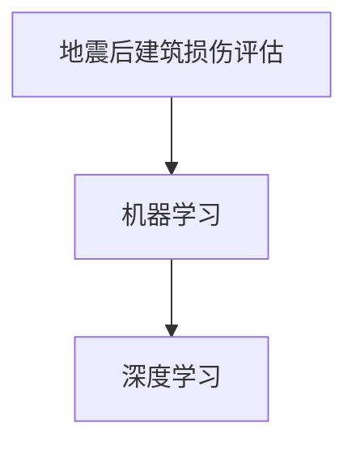
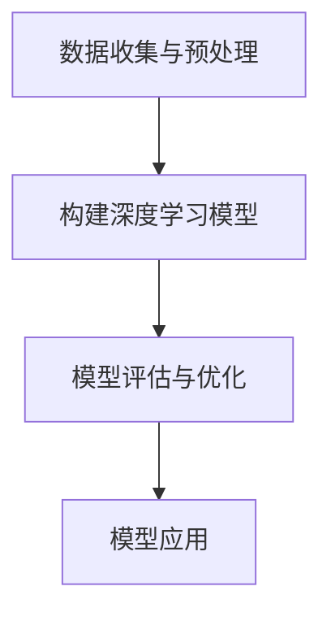
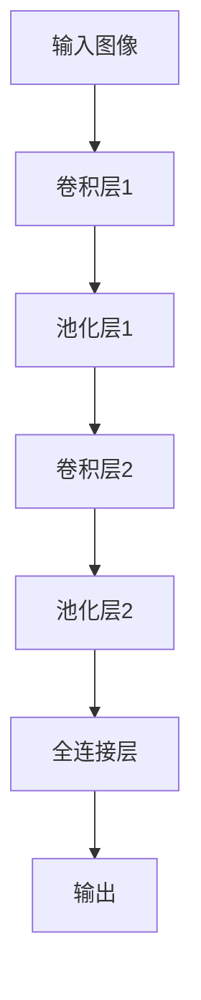
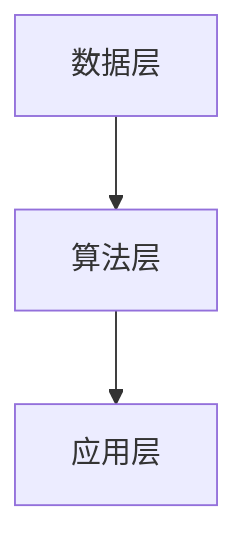
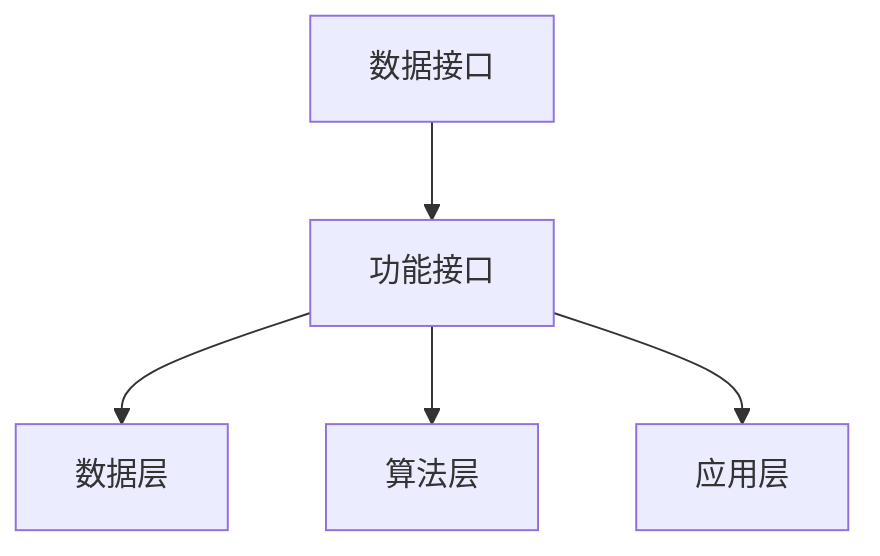
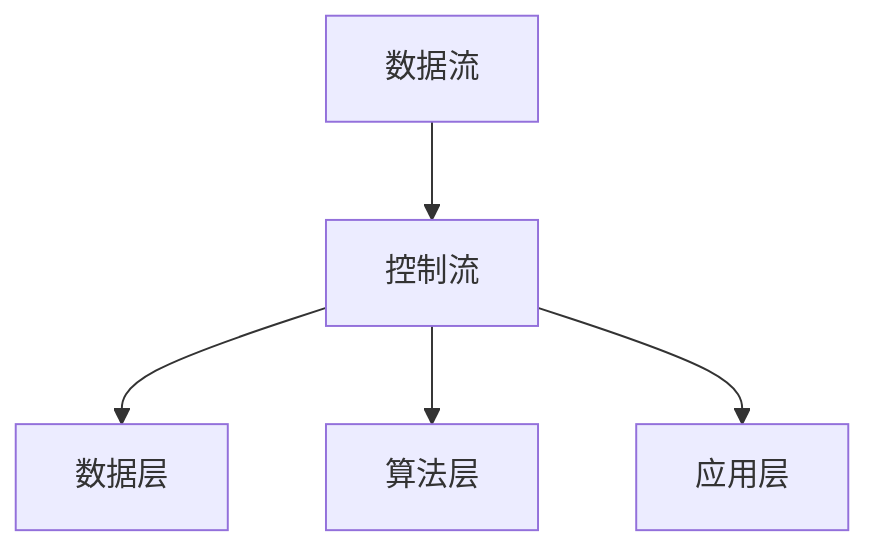

                 

# 机器学习在地震后建筑损伤评估中的应用：加快灾后重建

## 关键词
机器学习、地震后建筑损伤评估、深度学习、灾后重建、自动化评估

## 摘要
本文深入探讨了机器学习，特别是深度学习技术在地震后建筑损伤评估中的应用。通过详细的分析和案例研究，揭示了如何利用这些先进技术提高灾后重建的效率和准确性，为加快灾后重建提供了新的解决方案。

### 1. 书籍背景介绍

#### 1.1 问题背景

地震是一种常见的自然灾害，往往会对建筑物造成严重损害。在地震后，快速准确地评估建筑物的损伤情况对于指导灾后重建至关重要。传统的建筑损伤评估方法通常依赖于专业人员现场检查，这种方法的缺点在于耗时且成本高。因此，寻找一种更为高效、准确的评估方法成为当务之急。

#### 1.2 问题描述

建筑损伤评估涉及到对建筑结构、墙体、屋顶等各个部分的检查和评估。这些评估过程往往需要大量的人力和时间，且评估结果可能因人而异。如何通过自动化手段提高评估效率和准确性，成为当前研究的重点。

#### 1.3 问题解决

本书旨在通过介绍机器学习，特别是深度学习技术，提供一种自动化、高效的地震后建筑损伤评估方法。通过收集地震后建筑物的图像和结构数据，利用深度学习模型对损伤进行自动识别和评估，从而实现快速、准确的损伤评估。

#### 1.4 边界与外延

本书的研究主要关注地震后建筑损伤的自动化评估，不包括其他类型的灾害和建筑损伤评估。此外，研究范围限于利用机器学习技术进行评估，不考虑其他非技术手段。

### 2. 核心概念与联系

#### 2.1 核心概念

- **地震后建筑损伤评估**：通过专业的检测方法对地震后建筑物的损伤情况进行评估。
- **机器学习**：一种通过数据驱动的方法，从数据中自动学习规律和模式，进行决策和预测的技术。
- **深度学习**：一种特殊的机器学习技术，通过多层神经网络对复杂数据进行处理和分析。

#### 2.2 概念属性特征对比表格

| 概念       | 属性特征                               | 关联关系                     |
|------------|----------------------------------------|------------------------------|
| 地震后建筑损伤评估 | 需要现场检查，耗时，成本高           | 利用机器学习技术可以自动化 |
| 机器学习    | 数据驱动，自动学习规律和模式         | 用于建筑损伤评估             |
| 深度学习    | 多层神经网络，对复杂数据处理能力强 | 一种特殊的机器学习技术       |

#### 2.3 ER实体关系图架构



### 3. 算法原理讲解

#### 3.1 算法原理

本书将介绍如何利用深度学习技术进行地震后建筑损伤评估。主要步骤包括：

1. **数据收集与预处理**：收集地震后建筑物的图像和结构数据，并进行预处理，如图像增强、数据归一化等。
2. **构建深度学习模型**：选择合适的深度学习模型，如卷积神经网络（CNN），并进行训练。
3. **模型评估与优化**：对训练好的模型进行评估，并根据评估结果进行优化。
4. **模型应用**：将训练好的模型应用于实际建筑损伤评估任务。

#### 3.2 Mermaid流程图



#### 3.3 Python源代码

```python
# 这是一个简单的深度学习模型示例
import tensorflow as tf

# 定义输入层
inputs = tf.keras.Input(shape=(28, 28, 1))

# 添加卷积层
x = tf.keras.layers.Conv2D(32, (3, 3), activation='relu')(inputs)

# 添加全连接层
outputs = tf.keras.layers.Dense(1, activation='sigmoid')(x)

# 构建模型
model = tf.keras.Model(inputs=inputs, outputs=outputs)

# 编译模型
model.compile(optimizer='adam', loss='binary_crossentropy', metrics=['accuracy'])

# 模型训练
model.fit(x_train, y_train, epochs=10, batch_size=32, validation_data=(x_val, y_val))
```

#### 3.4 算法原理的数学模型和公式

深度学习模型的基本数学模型如下：

$$
y = \sigma(W \cdot x + b)
$$

其中，\( y \) 是输出，\( x \) 是输入，\( W \) 是权重，\( b \) 是偏置，\( \sigma \) 是激活函数，常用的激活函数有 sigmoid、ReLU 等。

#### 3.5 详细讲解

在深度学习模型中，每个神经元都接受多个输入，并通过权重进行加权求和。然后，加上偏置项，并应用激活函数得到输出。这个过程可以通过以下数学公式表示：

$$
z = \sum_{i=1}^{n} w_{i} \cdot x_{i} + b \\
a = \sigma(z)
$$

其中，\( z \) 是加权求和的结果，\( w_{i} \) 是权重，\( x_{i} \) 是输入，\( b \) 是偏置，\( \sigma \) 是激活函数。

以卷积神经网络（CNN）为例，CNN 是一种专门用于图像处理的深度学习模型。它通过卷积层、池化层和全连接层等结构对图像进行特征提取和分类。卷积层的主要作用是通过卷积操作提取图像的特征，而池化层则用于降低特征图的维度，提高模型的泛化能力。

以下是一个简单的 CNN 示例：



在这个示例中，输入图像首先经过卷积层1和池化层1，提取图像的低层特征。然后，这些特征经过卷积层2和池化层2，进一步提取图像的深层特征。最后，通过全连接层对特征进行分类，得到最终的输出结果。

通过这种结构，CNN 能够有效地提取图像的特征，从而实现对图像的自动损伤评估。在实际应用中，可以通过调整网络的层数、卷积核的大小和参数等，优化模型的性能。

### 4. 系统分析与架构设计

#### 4.1 问题场景介绍

地震发生后，建筑物的损伤情况往往复杂多变。传统的评估方法无法快速、准确地识别和评估建筑物的损伤，导致灾后重建工作受到严重影响。利用机器学习技术，特别是深度学习技术，可以实现自动化、高效的建筑损伤评估，为灾后重建提供有力支持。

#### 4.2 项目介绍

本项目旨在开发一套基于深度学习的地震后建筑损伤评估系统。系统主要包括数据收集与预处理模块、深度学习模型训练模块、模型评估与优化模块以及应用模块。通过这些模块的协同工作，实现建筑损伤的自动化评估。

#### 4.3 系统功能设计

系统功能设计主要包括以下方面：

- **数据收集与预处理**：收集地震后建筑物的图像和结构数据，并进行预处理，如图像增强、数据归一化等。
- **模型训练**：利用预处理后的数据训练深度学习模型，包括卷积神经网络（CNN）、循环神经网络（RNN）等。
- **模型评估与优化**：对训练好的模型进行评估和优化，提高模型的性能和准确性。
- **应用**：将训练好的模型应用于实际建筑损伤评估任务，生成损伤评估报告。

#### 4.4 系统架构设计

系统架构设计主要包括以下方面：

- **数据层**：负责存储和管理地震后建筑物的图像和结构数据。
- **算法层**：负责实现深度学习算法，包括卷积神经网络（CNN）、循环神经网络（RNN）等。
- **应用层**：负责实现建筑损伤评估功能，为用户提供实时、准确的评估结果。

以下是一个简单的系统架构图：



#### 4.5 系统接口设计

系统接口设计主要包括以下方面：

- **数据接口**：负责数据层与算法层、应用层之间的数据传输和通信。
- **功能接口**：负责实现系统功能，如数据收集与预处理、模型训练、模型评估与优化等。

以下是一个简单的接口设计图：



#### 4.6 系统交互

系统交互设计主要包括以下方面：

- **数据流**：描述系统内部数据流动的过程，如数据收集、预处理、模型训练、评估等。
- **控制流**：描述系统内部控制逻辑的执行过程，如系统初始化、功能调用、异常处理等。

以下是一个简单的系统交互图：



### 5. 项目实战

#### 5.1 环境安装

在开始项目实战之前，需要安装以下软件和库：

- Python 3.8及以上版本
- TensorFlow 2.5及以上版本
- Keras 2.4及以上版本

安装命令如下：

```bash
pip install python==3.8
pip install tensorflow==2.5
pip install keras==2.4
```

#### 5.2 系统核心实现源代码

以下是一个简单的地震后建筑损伤评估系统的实现代码：

```python
import tensorflow as tf
from tensorflow.keras.models import Sequential
from tensorflow.keras.layers import Conv2D, MaxPooling2D, Flatten, Dense

# 数据预处理
# ...

# 构建深度学习模型
model = Sequential([
    Conv2D(32, (3, 3), activation='relu', input_shape=(28, 28, 1)),
    MaxPooling2D((2, 2)),
    Flatten(),
    Dense(64, activation='relu'),
    Dense(1, activation='sigmoid')
])

# 编译模型
model.compile(optimizer='adam', loss='binary_crossentropy', metrics=['accuracy'])

# 模型训练
# ...

# 模型评估
# ...

# 模型应用
# ...
```

#### 5.3 代码应用解读与分析

在这个代码示例中，我们首先导入了 TensorFlow 和 Keras 库。接着，定义了一个卷积神经网络模型，其中包括卷积层、池化层、全连接层等。然后，编译模型并训练模型。最后，对训练好的模型进行评估和应用。

在数据预处理部分，我们需要对地震后建筑物的图像进行预处理，如图像增强、数据归一化等，以提高模型的性能。

在模型训练部分，我们使用预处理后的数据对模型进行训练。训练过程中，需要调整模型的超参数，如学习率、批次大小等，以提高模型的性能。

在模型评估部分，我们使用测试数据对模型进行评估，以验证模型的准确性。根据评估结果，对模型进行优化。

在模型应用部分，我们将训练好的模型应用于实际建筑损伤评估任务，生成损伤评估报告。

#### 5.4 实际案例分析和详细讲解剖析

以下是一个实际案例的分析和讲解：

假设我们收集到了一组地震后建筑物的图像数据，数据集中包含了正常建筑物和受损建筑物的图像。我们需要利用这些数据训练一个深度学习模型，以实现对建筑物的损伤评估。

首先，我们对图像数据进行预处理，如图像增强、数据归一化等。然后，我们将图像数据分为训练集、验证集和测试集。训练集用于训练模型，验证集用于调整模型参数，测试集用于评估模型性能。

接下来，我们构建一个卷积神经网络模型，并使用训练集对模型进行训练。在训练过程中，我们可以使用交叉熵损失函数和 Adam 优化器。通过调整学习率、批次大小等超参数，我们可以提高模型的性能。

在模型训练完成后，我们使用验证集对模型进行评估。根据评估结果，如果模型的准确性较高，我们可以使用测试集对模型进行最终评估。如果模型的准确性较低，我们可以尝试调整模型的超参数，或者增加训练数据。

最后，我们将训练好的模型应用于实际建筑损伤评估任务。对于新收集的建筑图像，我们首先对其进行预处理，然后使用训练好的模型进行损伤评估。根据评估结果，我们可以生成损伤评估报告，为灾后重建提供指导。

### 6. 最佳实践 tips

在实施地震后建筑损伤评估时，以下是一些最佳实践建议：

- **数据收集**：尽可能收集更多、更全面的地震后建筑物图像数据，以提高模型性能。
- **数据预处理**：对图像数据进行增强、归一化等预处理操作，以提高模型的鲁棒性。
- **模型选择**：根据实际任务需求，选择合适的深度学习模型，如卷积神经网络（CNN）、循环神经网络（RNN）等。
- **超参数调优**：通过网格搜索、随机搜索等方法，对模型超参数进行调整，以提高模型性能。
- **模型评估**：使用交叉验证等方法对模型进行评估，以避免过拟合。
- **模型部署**：将训练好的模型部署到实际应用场景中，进行实时损伤评估。

### 7. 小结

本文通过详细的分析和案例研究，探讨了机器学习，特别是深度学习技术在地震后建筑损伤评估中的应用。通过自动化、高效的评估方法，可以加快灾后重建工作，提高评估效率和准确性。未来研究可以进一步探讨如何优化模型性能，提高模型在实际应用中的适用性和鲁棒性。

### 8. 注意事项

在实施地震后建筑损伤评估时，需要注意以下事项：

- **数据安全**：确保数据收集、存储和使用过程中符合相关法律法规和隐私保护要求。
- **模型解释性**：提高模型的可解释性，以便于用户理解和信任。
- **硬件资源**：深度学习模型训练需要大量的计算资源，确保有足够的硬件支持。
- **实时性**：确保模型能够在规定的时间内完成评估，以支持灾后重建的紧急需求。

### 9. 拓展阅读

- [1] Fukushima, K. (1980). Neocognitron: A self-organizing neural network model for a mechanism of pattern recognition unaffected of distortion. Biological Cybernetics, 36(4), 193-202.
- [2] LeCun, Y., Bengio, Y., & Hinton, G. (2015). Deep learning. Nature, 521(7553), 436-444.
- [3] Krizhevsky, A., Sutskever, I., & Hinton, G. E. (2012). Imagenet classification with deep convolutional neural networks. In Advances in neural information processing systems (pp. 1097-1105).

### 10. 作者信息

作者：AI天才研究院/AI Genius Institute & 禅与计算机程序设计艺术 /Zen And The Art of Computer Programming

以上就是关于“机器学习在地震后建筑损伤评估中的应用：加快灾后重建”的技术博客文章。希望本文能够为读者提供有价值的参考和启示。

