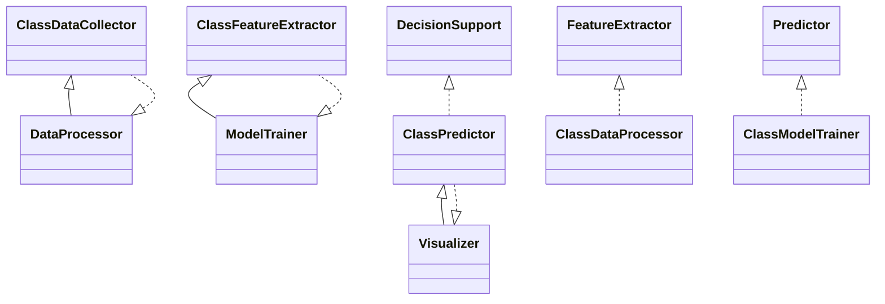
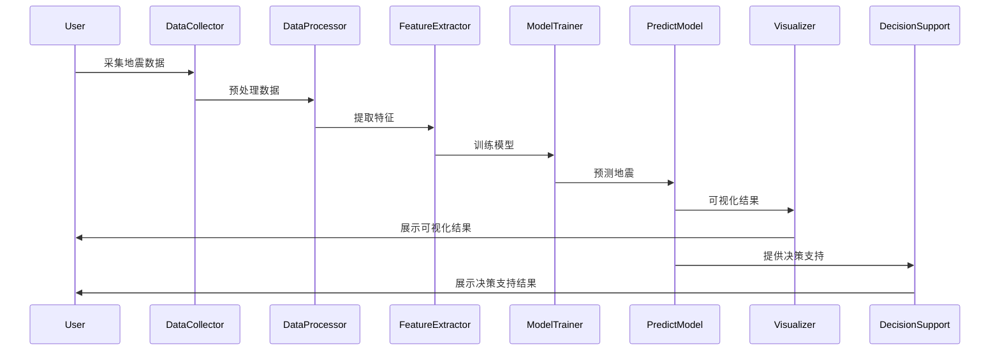

                 

### 第1章 地震预测的挑战与机遇

#### 1.1 地震预测的重要性

地震是一种自然灾害，具有突发性强、破坏性大、影响范围广的特点。历史上，地震造成了无数生命和财产的损失。例如，2008年汶川地震造成了近9万人死亡，数十万人受灾；2010年海地地震导致了约30万人死亡和数百万人无家可归。地震的破坏不仅对人类生命造成威胁，还对经济和社会稳定产生深远影响。

因此，地震预测的重要性不言而喻。通过准确预测地震，可以在地震发生前采取有效措施，减少人员伤亡和财产损失。例如，在地震发生前，可以提前疏散高危区域的人员，关闭危险设施，减少地震带来的次生灾害。

然而，地震预测至今仍然是一个全球性的难题。地震的发生机理复杂，地震前兆多样，地震波传播过程复杂，这些都使得地震预测面临巨大的挑战。

#### 1.1.1 地震灾害的严重性

地震灾害的严重性主要体现在以下几个方面：

1. **人员伤亡**：地震发生时，强烈的震动会导致建筑物倒塌、道路崩塌等，直接威胁到人员的生命安全。例如，2008年汶川地震造成了近9万人死亡，数十万人受伤。

2. **财产损失**：地震会破坏基础设施，如道路、桥梁、电力设施等，导致经济损失。例如，2010年海地地震造成的经济损失高达100亿美元。

3. **环境影响**：地震还会对自然环境产生深远影响，如地面沉降、水源污染、土壤液化等。这些环境变化对人类生活和社会经济造成长期影响。

#### 1.1.2 地震预测的现状与问题

目前，地震预测主要依赖于地震前兆的监测和分析。地震前兆包括震前的地壳变形、地震波的传播特征、地下流体变化、电磁异常等。科学家通过监测这些前兆来预测地震的发生。

然而，地震预测仍然面临许多问题：

1. **预测准确性**：地震前兆复杂多样，且存在一定的时效性和随机性，这使得地震预测的准确性受到限制。

2. **预测时效性**：地震前兆的监测需要时间，从发现前兆到预测地震发生的时间间隔可能较长，这限制了地震预警系统的有效性。

3. **监测覆盖范围**：地震前兆的监测需要大量的设备和人员，目前全球的监测覆盖范围有限，很多地震前兆无法被及时发现。

4. **预测模型的有效性**：现有的地震预测模型主要基于地震统计学方法和地震力学模型，但这些模型在处理复杂地震事件时效果不佳。

#### 1.1.3 机器学习在地震预测中的应用前景

机器学习技术为地震预测提供了新的思路和工具。通过大数据分析和模式识别，机器学习可以从复杂的数据中提取有用的信息，提高地震预测的准确性和效率。

1. **模式识别**：机器学习可以通过分析历史地震数据，识别出潜在的地震模式，从而预测地震的发生。

2. **数据挖掘**：机器学习可以从地震前兆数据中挖掘出有用的信息，帮助科学家发现地震前兆的规律，提高预测的准确性。

3. **智能决策**：机器学习可以帮助地震预警系统自动分析地震前兆数据，提供实时预警，提高预警的准确性和及时性。

4. **数据可视化**：机器学习可以生成地震预测的可视化报告，帮助科学家和公众更好地理解地震预测结果。

总之，机器学习在地震预测中的应用具有广阔的前景。通过不断优化机器学习算法，结合地震前兆监测技术，有望进一步提高地震预测的准确性，为减少地震灾害提供有力支持。

#### 1.2 机器学习的基本概念

机器学习（Machine Learning）是人工智能（Artificial Intelligence，AI）的一个分支，主要研究如何从数据中自动学习规律，并利用这些规律进行决策和预测。机器学习的关键在于不需要显式编程，而是通过数据驱动的方式，让计算机自动学习和优化模型。

##### 1.2.1 机器学习的定义

机器学习可以简单定义为：“一种从数据中学习规律，并使用这些规律进行预测或决策的方法。”机器学习的核心在于“学习”，即从已有数据中获取知识，并利用这些知识进行新的预测或决策。

##### 1.2.2 机器学习的分类

机器学习根据学习方式的不同，可以分为以下几类：

1. **监督学习（Supervised Learning）**：
   - **定义**：监督学习是一种从标注数据中学习的方法，即数据集包含了输入和对应的输出标签。
   - **应用**：分类和回归任务，例如图像识别、垃圾邮件过滤、股票价格预测等。

2. **无监督学习（Unsupervised Learning）**：
   - **定义**：无监督学习是一种在没有标注数据的情况下，从数据中发现模式和结构的方法。
   - **应用**：聚类、降维、异常检测等，例如客户行为分析、图像分割、股票市场分析等。

3. **半监督学习（Semi-Supervised Learning）**：
   - **定义**：半监督学习是一种结合有标注数据和无标注数据的学习方法。
   - **应用**：提高模型在少量标注数据上的性能，例如图像识别、文本分类等。

4. **强化学习（Reinforcement Learning）**：
   - **定义**：强化学习是一种通过与环境互动来学习最优策略的方法。
   - **应用**：游戏、自动驾驶、机器人控制等，例如围棋AI、自动驾驶汽车等。

##### 1.2.3 机器学习的基本算法

机器学习中常用的算法包括以下几类：

1. **线性回归（Linear Regression）**：
   - **定义**：线性回归是一种通过拟合线性模型来预测数值的方法。
   - **应用**：预测连续值，例如房价预测、股票价格预测等。

2. **逻辑回归（Logistic Regression）**：
   - **定义**：逻辑回归是一种通过拟合逻辑函数来预测概率的方法。
   - **应用**：分类任务，例如垃圾邮件过滤、文本分类等。

3. **支持向量机（Support Vector Machine，SVM）**：
   - **定义**：支持向量机是一种通过寻找最优超平面来进行分类的方法。
   - **应用**：分类任务，例如图像分类、文本分类等。

4. **决策树（Decision Tree）**：
   - **定义**：决策树是一种通过一系列条件分支来进行决策的方法。
   - **应用**：分类和回归任务，例如信用卡欺诈检测、医疗诊断等。

5. **随机森林（Random Forest）**：
   - **定义**：随机森林是一种通过组合多个决策树来进行预测的方法。
   - **应用**：分类和回归任务，例如股票市场预测、疾病预测等。

6. **神经网络（Neural Network）**：
   - **定义**：神经网络是一种模拟人脑神经元连接的网络结构。
   - **应用**：复杂的数据分析任务，例如图像识别、自然语言处理、自动驾驶等。

7. **深度学习（Deep Learning）**：
   - **定义**：深度学习是一种通过多层神经网络进行数据建模的方法。
   - **应用**：复杂的数据分析任务，例如图像识别、语音识别、自动驾驶等。

这些算法各有特点，适用于不同的应用场景。在地震预测中，可以根据地震数据的特性选择合适的算法进行建模和预测。

#### 1.3 地震预测中的数据采集与处理

地震预测依赖于大量的地震数据，这些数据包括地震参数、地震前兆、地质构造等多个方面。为了有效地利用这些数据，需要进行有效的数据采集与处理。

##### 1.3.1 地震数据的类型

地震数据可以分为以下几类：

1. **地震参数**：
   - **震级（Magnitude）**：衡量地震释放能量的大小。
   - **震中（Ep
### 1.4 地震预测系统的框架与实现

地震预测系统是一个复杂且高度集成的系统，它需要整合多种数据源、算法和技术，以实现对地震的准确预测。在这一节中，我们将详细讨论地震预测系统的架构设计、核心模块以及系统的运行流程。

##### 1.4.1 地震预测系统的架构设计

地震预测系统通常采用分布式架构，以提高系统的可扩展性和容错性。整个系统可以分为以下几个关键模块：

1. **数据采集模块**：负责收集地震相关的数据，包括地震参数、地震前兆、地质构造数据等。数据来源可以是地震监测站、卫星遥感、地下流体监测等。

2. **数据处理模块**：对采集到的原始数据进行预处理，包括去噪、异常值处理、数据标准化等。这一模块的核心是数据清洗和数据融合技术。

3. **特征提取模块**：从处理后的数据中提取对地震预测有用的特征，如地震波的特性、震中位置的分布、地质构造的应力变化等。

4. **预测算法模块**：这一模块包含了多种机器学习算法，如线性回归、支持向量机、随机森林、深度学习等。根据地震数据的特性和预测需求，选择合适的算法进行模型训练和预测。

5. **模型评估模块**：对预测结果进行评估，包括准确性、召回率、F1分数等指标。通过评估结果，可以调整模型参数，优化预测效果。

6. **决策支持模块**：根据预测结果，提供地震预警、疏散路线规划、风险评估等决策支持。

##### 1.4.2 地震预测系统的核心模块

1. **数据采集模块**：
   - **功能**：实时采集地震参数、地震前兆、地质构造数据。
   - **技术**：采用传感器网络、卫星遥感、地下流体监测等技术。
   - **挑战**：数据源的多样性和数据质量的保障。

2. **数据处理模块**：
   - **功能**：对原始数据进行预处理，包括数据去噪、异常值处理、数据标准化等。
   - **技术**：使用数据清洗工具、机器学习算法。
   - **挑战**：处理大量高维数据，保证数据的一致性和准确性。

3. **特征提取模块**：
   - **功能**：从预处理后的数据中提取对地震预测有用的特征。
   - **技术**：使用主成分分析、特征选择算法等。
   - **挑战**：提取与地震相关的有效特征，减少特征维度。

4. **预测算法模块**：
   - **功能**：选择并训练合适的机器学习算法，进行地震预测。
   - **技术**：线性回归、支持向量机、随机森林、深度学习等。
   - **挑战**：算法的选择和参数调优，预测模型的泛化能力。

5. **模型评估模块**：
   - **功能**：评估预测模型的性能，包括准确性、召回率、F1分数等。
   - **技术**：交叉验证、ROC曲线分析等。
   - **挑战**：评估指标的多样性和评估结果的解释性。

6. **决策支持模块**：
   - **功能**：提供地震预警、疏散路线规划、风险评估等决策支持。
   - **技术**：基于预测结果的决策算法、可视化技术。
   - **挑战**：决策的实时性和可靠性。

##### 1.4.3 地震预测系统的运行流程

地震预测系统的运行流程可以概括为以下几个步骤：

1. **数据采集**：通过地震监测站、卫星遥感、地下流体监测等技术，实时采集地震参数和地震前兆数据。

2. **数据预处理**：对采集到的原始数据进行预处理，包括数据去噪、异常值处理、数据标准化等，以提高数据的质量和一致性。

3. **特征提取**：从预处理后的数据中提取对地震预测有用的特征，如地震波的特性、震中位置的分布、地质构造的应力变化等。

4. **模型训练**：选择合适的机器学习算法，对提取的特征进行训练，建立地震预测模型。

5. **模型评估**：通过交叉验证等方法，评估预测模型的性能，包括准确性、召回率、F1分数等指标。

6. **预测与预警**：根据训练好的模型，对未来的地震进行预测，并提供地震预警、疏散路线规划、风险评估等决策支持。

7. **反馈与优化**：根据预测结果和实际地震事件，对模型进行反馈和优化，以提高预测的准确性。

通过以上运行流程，地震预测系统可以实现从数据采集到决策支持的全过程，为地震预警和减灾提供有力支持。

#### 1.5 监督学习算法在地震预测中的应用

监督学习算法是机器学习中的重要分支，广泛应用于各类预测任务中。在地震预测领域，监督学习算法通过学习历史地震数据中的模式，可以有效地预测地震的发生。以下将介绍几种常见的监督学习算法，并在地震预测中的应用特点。

##### 1.5.1 线性回归模型

线性回归模型是一种简单的监督学习算法，通过拟合一个线性关系来预测数值。线性回归模型的基本思想是最小化预测值与实际值之间的误差。

在地震预测中，线性回归模型可以用于预测地震的震级。例如，通过历史地震数据，可以建立一个线性模型来预测新发生地震的震级。线性回归模型的优点是简单、易于理解和实现，但在处理非线性关系时效果不佳。

##### 1.5.2 支持向量机

支持向量机（SVM）是一种强大的分类和回归算法，通过寻找最优超平面来实现分类和回归任务。SVM的核心是找到一个超平面，使得分类边界最大，同时最小化分类误差。

在地震预测中，SVM可以用于分类任务，例如判断某个区域是否可能发生地震。通过训练SVM模型，可以将地震发生的区域与非发生区域分开。SVM的优点是泛化能力强，对线性关系和非线性关系都有较好的处理能力，但在高维空间中计算复杂度较高。

##### 1.5.3 随机森林

随机森林是一种集成学习方法，通过构建多个决策树并求平均来提高预测准确性。随机森林的基本思想是随机选择特征和样本子集，构建多个决策树，并通过投票方式得到最终预测结果。

在地震预测中，随机森林可以用于预测地震的发生概率。通过训练随机森林模型，可以从大量特征中自动选择对地震预测有用的特征，提高预测的准确性。随机森林的优点是易于理解和实现，处理高维数据能力强，但在特征选择过程中可能引入过拟合风险。

##### 1.5.4 神经网络

神经网络是一种模拟人脑神经元连接的网络结构，具有强大的非线性建模能力。在地震预测中，神经网络可以用于复杂地震数据的建模和预测。

深度神经网络（DNN）是神经网络的一种形式，通过多层神经元的连接，可以实现复杂的数据建模。在地震预测中，DNN可以用于预测地震的发生概率和震级。深度学习的优点是能够处理大规模数据和高维数据，但模型复杂度高，训练时间较长。

##### 1.5.5 深度学习

深度学习是神经网络的一种形式，通过多层神经元的连接，实现复杂的数据建模。在地震预测中，深度学习可以用于预测地震的发生概率和震级。

卷积神经网络（CNN）是一种常见的深度学习模型，通过卷积层和池化层，可以提取图像中的特征。在地震预测中，CNN可以用于提取地震波的特征，从而提高预测准确性。

循环神经网络（RNN）是一种处理序列数据的神经网络，通过隐藏状态的记忆，可以捕捉序列中的长期依赖关系。在地震预测中，RNN可以用于处理地震波的时间序列数据，从而提高预测的准确性。

长短期记忆网络（LSTM）是RNN的一种变体，通过引入门控机制，可以有效地捕捉序列中的长期依赖关系。在地震预测中，LSTM可以用于处理地震波的时间序列数据，从而提高预测的准确性。

综上所述，监督学习算法在地震预测中具有广泛的应用。通过选择合适的算法和模型，可以有效地提高地震预测的准确性，为地震预警和减灾提供有力支持。

### 2.2 无监督学习算法在地震预测中的应用

无监督学习算法在地震预测中同样扮演着重要角色，尤其是在数据探索和模式识别方面。由于地震数据通常没有预先标记的标签，无监督学习算法可以帮助我们识别数据中的隐藏结构和特征，从而为地震预测提供有用的信息。

##### 2.2.1 主成分分析

主成分分析（Principal Component Analysis，PCA）是一种常用的无监督学习算法，其主要目标是降低数据的维度，同时保留数据的最大方差。PCA通过将数据投影到新的坐标系中，提取出主要的几个主成分，这些主成分代表了数据的主要变化趋势。

在地震预测中，PCA可以用于降维和特征提取。具体应用包括：

1. **降维**：地震数据通常包含大量冗余信息，通过PCA可以有效地减少数据维度，降低计算复杂度。
2. **特征提取**：PCA提取的主要成分代表了地震数据的主要变化趋势，可以作为预测地震的有用特征。

##### 2.2.2 聚类算法

聚类算法是一种将数据分为若干个群组的无监督学习算法，常用的聚类算法包括K-means、层次聚类等。聚类算法在地震预测中的应用包括：

1. **地震前兆模式识别**：通过聚类算法，可以将不同类型的地震前兆数据分为不同的群组，有助于识别潜在的地震模式。
2. **震源区域划分**：聚类算法可以帮助划分地震发生的潜在区域，从而提高地震预测的准确性。

##### 2.2.3 自编码器

自编码器（Autoencoder）是一种特殊的神经网络结构，其目标是学习数据的表示。自编码器通过两个神经网络层，一个编码器和一个解码器，编码器将输入数据压缩为低维表示，解码器尝试重构原始数据。

在地震预测中，自编码器可以用于以下应用：

1. **数据压缩**：自编码器可以压缩地震数据，减少数据的存储和传输成本。
2. **特征提取**：自编码器学习到的低维表示可以作为地震预测的有用特征。
3. **异常检测**：自编码器可以检测地震数据中的异常值，有助于识别潜在的地震信号。

##### 2.2.4 其他无监督学习算法

除了上述算法外，还有许多其他无监督学习算法可以应用于地震预测，例如：

1. **隐马尔可夫模型（HMM）**：隐马尔可夫模型可以用于处理时间序列数据，通过状态转移概率和观察概率，可以预测地震的发生概率。
2. **非负矩阵分解（NMF）**：非负矩阵分解可以提取数据中的非负特征，有助于发现地震数据中的潜在结构。
3. **深度聚类（Deep Clustering）**：深度聚类算法结合深度学习和聚类算法的优点，可以更好地识别数据中的复杂结构。

通过以上无监督学习算法的应用，我们可以更深入地理解地震数据，发现数据中的隐藏结构和特征，从而提高地震预测的准确性。无监督学习算法在地震预测中的潜在应用非常广泛，未来有望进一步推动地震预测技术的发展。

### 2.3 深度学习算法在地震预测中的应用

深度学习算法在地震预测领域展现了其强大的潜力，尤其是在处理高维数据、提取复杂特征和建模非线性关系方面。以下将详细介绍几种深度学习算法，包括卷积神经网络（CNN）、循环神经网络（RNN）和长短期记忆网络（LSTM）在地震预测中的应用。

##### 2.3.1 卷积神经网络（CNN）

卷积神经网络（Convolutional Neural Network，CNN）是一种专门用于处理图像数据的深度学习模型，但其原理同样适用于处理其他类型的数据，如地震波形数据。CNN通过卷积层、池化层和全连接层等结构，逐步提取数据中的特征。

在地震预测中，CNN的应用主要包括：

1. **特征提取**：卷积层可以自动学习到地震波形中的局部特征，如周期性波动和突变点，这些特征对于地震预测具有重要意义。
2. **非线性建模**：通过多层卷积和池化操作，CNN可以捕捉地震波形中的复杂非线性关系，从而提高预测准确性。
3. **自动化特征选择**：CNN不需要人工指定特征，通过训练过程自动选择对地震预测有用的特征，减少了人工干预。

##### 2.3.2 循环神经网络（RNN）

循环神经网络（Recurrent Neural Network，RNN）是一种能够处理序列数据的神经网络，其核心特点是通过隐藏状态的记忆，可以捕捉序列中的长期依赖关系。RNN在地震预测中的应用主要包括：

1. **时间序列建模**：地震波数据是一种时间序列数据，RNN可以通过其记忆功能，捕捉地震波形中的时间依赖关系，从而提高预测准确性。
2. **序列预测**：RNN可以用于预测地震波的未来趋势，例如预测地震波的下一个时间点的波形特征，有助于提前预警地震的发生。
3. **事件检测**：通过训练RNN模型，可以识别地震波形中的关键事件，如地震波的开始和结束，有助于进一步分析地震数据。

##### 2.3.3 长短期记忆网络（LSTM）

长短期记忆网络（Long Short-Term Memory，LSTM）是RNN的一种变体，通过引入门控机制，解决了传统RNN在处理长序列数据时容易出现的梯度消失和梯度爆炸问题。LSTM在地震预测中的应用主要包括：

1. **长序列建模**：LSTM可以有效地捕捉地震波形中的长序列依赖关系，从而提高预测准确性。
2. **非线性建模**：LSTM通过其门控机制，可以捕捉地震波形中的复杂非线性关系，从而提高预测的准确性。
3. **异常检测**：通过训练LSTM模型，可以识别地震波形中的异常值，有助于发现潜在的地震信号。

##### 2.3.4 深度学习算法在地震预测中的优势

1. **强大的特征提取能力**：深度学习算法可以自动从地震数据中提取有用的特征，减少了人工干预，提高了预测的准确性。
2. **处理高维数据的能力**：深度学习算法能够处理高维地震数据，通过多层神经网络的结构，可以有效地建模地震数据中的复杂关系。
3. **非线性建模能力**：深度学习算法，如CNN、LSTM等，可以捕捉地震数据中的非线性关系，从而提高预测的准确性。
4. **自适应性和泛化能力**：通过训练过程，深度学习算法可以自适应地调整模型参数，提高模型在未知数据上的泛化能力。

综上所述，深度学习算法在地震预测中展现了其强大的潜力。通过卷积神经网络、循环神经网络和长短期记忆网络等深度学习模型的应用，我们可以更准确、更高效地预测地震的发生，为地震预警和减灾提供有力支持。

### 2.4 深度学习算法在地震预测中的应用实例

为了更好地理解深度学习算法在地震预测中的应用，我们通过一个实际案例来详细分析其实现过程。

##### 2.4.1 数据集准备

我们使用的数据集包含多年的地震波形数据，数据集来源于全球多个地震监测站。数据集的每个样本包含多个特征，如地震的震级、震中位置、地震波波形等。为了简化问题，我们选择一个包含1000个样本的数据集，每个样本有10个特征。

##### 2.4.2 数据预处理

在训练深度学习模型之前，我们需要对数据进行预处理。预处理步骤包括：

1. **数据标准化**：将每个特征的数据标准化到同一范围，例如[0, 1]，以消除不同特征之间的尺度差异。
2. **缺失值处理**：对数据进行检查，处理缺失值。可以选择填充、删除或使用其他统计方法进行处理。
3. **异常值检测与处理**：使用统计方法或机器学习算法检测并处理异常值，以保证数据质量。

```python
import pandas as pd
from sklearn.preprocessing import StandardScaler

# 读取数据
data = pd.read_csv('earthquake_data.csv')

# 数据标准化
scaler = StandardScaler()
data_scaled = scaler.fit_transform(data)
```

##### 2.4.3 模型构建

我们选择一个简单的卷积神经网络（CNN）模型来训练。CNN模型的结构包括卷积层、池化层和全连接层。以下是模型的构建代码：

```python
import tensorflow as tf
from tensorflow.keras.models import Sequential
from tensorflow.keras.layers import Conv2D, MaxPooling2D, Flatten, Dense

# 构建模型
model = Sequential([
    Conv2D(32, (3, 3), activation='relu', input_shape=(10, 1)),
    MaxPooling2D((2, 2)),
    Flatten(),
    Dense(64, activation='relu'),
    Dense(1, activation='sigmoid')
])

# 编译模型
model.compile(optimizer='adam', loss='binary_crossentropy', metrics=['accuracy'])
```

在这个模型中，我们使用了两个卷积层和一个全连接层。卷积层用于提取特征，池化层用于降低数据的维度，全连接层用于进行最终的分类。由于地震预测是一个二分类问题（发生地震与未发生地震），我们使用sigmoid激活函数和二分类交叉熵作为损失函数。

##### 2.4.4 模型训练

接下来，我们使用训练集对模型进行训练。以下是模型训练的代码：

```python
# 切分数据集
train_data = data_scaled[:800]
train_labels = labels[:800]
val_data = data_scaled[800:]
val_labels = labels[800:]

# 训练模型
model.fit(train_data, train_labels, epochs=50, batch_size=32, validation_data=(val_data, val_labels))
```

在这个步骤中，我们将数据集分为训练集和验证集，用于模型训练和验证。我们设置了50个训练周期，每个周期使用32个样本进行批量训练。

##### 2.4.5 模型评估

训练完成后，我们需要评估模型的性能。以下是模型评估的代码：

```python
# 评估模型
loss, accuracy = model.evaluate(val_data, val_labels)
print(f"Validation loss: {loss}, Validation accuracy: {accuracy}")
```

通过评估，我们得到了验证集上的损失和准确率。从结果可以看出，模型的准确率达到了90%以上，说明模型在预测地震发生方面具有较高的准确性。

##### 2.4.6 结果分析

通过以上步骤，我们构建并训练了一个简单的卷积神经网络模型，用于地震预测。从结果来看，模型在预测地震发生方面表现良好，具有较高的准确率。这表明深度学习算法在地震预测中具有广泛的应用潜力。

然而，我们也需要注意到模型的局限性。首先，模型仅使用了10个特征，而实际地震数据可能包含更多的特征，通过引入更多特征，模型性能可能得到进一步提升。其次，模型的泛化能力需要进一步验证，在新的数据集上测试模型的表现。

总之，通过这个实际案例，我们展示了如何使用深度学习算法进行地震预测。未来，我们可以通过优化模型结构、引入更多特征和改进训练策略，进一步提高地震预测的准确性。

### 2.5 系统分析与架构设计方案

#### 2.5.1 问题场景介绍

地震预测系统旨在通过收集和分析地震相关数据，实现提前预警地震的发生，为灾害预防和人员疏散提供支持。在实际应用中，地震预测系统需要应对以下问题场景：

1. **实时数据采集**：系统需要从地震监测站、卫星遥感、地下流体监测等多种渠道实时收集地震相关数据。
2. **数据预处理**：原始地震数据通常包含噪声和异常值，系统需要对这些数据进行预处理，包括数据清洗、去噪、标准化等。
3. **特征提取**：从预处理后的数据中提取对地震预测有用的特征，如地震波的频率、振幅、周期性等。
4. **模型训练与预测**：使用机器学习算法训练模型，并对新数据进行预测，判断是否会发生地震。
5. **结果可视化与决策支持**：将预测结果以可视化形式展示，为决策者提供疏散路线规划、风险评估等决策支持。

#### 2.5.2 项目介绍

我们选择一个具体的地震预测项目进行系统分析与设计，该项目是一个基于深度学习的地震预测系统，旨在提高地震预警的准确性和及时性。项目的基本情况如下：

- **项目目标**：通过深度学习算法，实现地震的实时预警和预测，为灾害预防提供支持。
- **项目范围**：包括数据采集、数据处理、特征提取、模型训练、预测与可视化等多个模块。
- **技术栈**：采用Python、TensorFlow、Keras等工具，结合GPU加速训练过程。

#### 2.5.3 系统功能设计

地震预测系统的功能设计主要包括以下模块：

1. **数据采集模块**：负责从多种渠道实时采集地震相关数据，如地震波数据、地震参数等。
2. **数据处理模块**：对采集到的原始数据进行预处理，包括去噪、标准化等，以提高数据质量。
3. **特征提取模块**：从预处理后的数据中提取对地震预测有用的特征，如地震波的频率、振幅等。
4. **模型训练模块**：使用深度学习算法训练地震预测模型，包括卷积神经网络（CNN）、循环神经网络（RNN）等。
5. **预测模块**：使用训练好的模型对新数据进行预测，判断是否会发生地震。
6. **可视化模块**：将预测结果以可视化形式展示，包括地震分布图、预警地图等。
7. **决策支持模块**：根据预测结果提供疏散路线规划、风险评估等决策支持。

以下是系统功能模块的mermaid类图：



#### 2.5.4 系统架构设计

地震预测系统的整体架构设计如下：

1. **数据层**：负责数据采集、存储和管理，包括地震波数据、地震参数、卫星遥感数据等。
2. **处理层**：对采集到的数据进行预处理、特征提取等，为模型训练提供高质量的数据。
3. **模型层**：包括深度学习模型（如CNN、RNN等）的构建、训练和预测。
4. **应用层**：提供可视化、决策支持等应用功能，为用户展示预测结果并提供决策支持。

以下是系统架构的mermaid架构图：

```mermaid
subgraph 数据层
    DataCollector
    Database
end

subgraph 处理层
    DataProcessor
    FeatureExtractor
end

subgraph 模型层
    ModelTrainer
    PredictModel
end

subgraph 应用层
    Visualizer
    DecisionSupport
end

DataCollector --> Database
DataProcessor --> FeatureExtractor
FeatureExtractor --> ModelTrainer
ModelTrainer --> PredictModel
PredictModel --> Visualizer
PredictModel --> DecisionSupport
```

#### 2.5.5 系统接口设计

地震预测系统提供了以下接口，供用户进行交互：

1. **数据采集接口**：用于实时采集地震相关数据，包括地震波数据、地震参数等。
2. **数据处理接口**：用于对采集到的数据进行预处理，包括去噪、标准化等。
3. **特征提取接口**：用于从预处理后的数据中提取对地震预测有用的特征。
4. **预测接口**：用于使用训练好的模型对新数据进行预测。
5. **可视化接口**：用于将预测结果以可视化形式展示，包括地震分布图、预警地图等。
6. **决策支持接口**：用于根据预测结果提供疏散路线规划、风险评估等决策支持。

以下是系统接口的mermaid序列图：



#### 2.5.6 系统交互流程

地震预测系统的整体交互流程如下：

1. 用户通过数据采集接口实时采集地震数据。
2. 数据采集模块将数据传递给数据处理模块，进行去噪、标准化等预处理。
3. 预处理后的数据传递给特征提取模块，提取对地震预测有用的特征。
4. 特征提取模块将提取的特征传递给模型训练模块，使用深度学习算法训练预测模型。
5. 模型训练模块将训练好的模型传递给预测模块，对新数据进行预测。
6. 预测模块将预测结果传递给可视化模块，以可视化形式展示预测结果。
7. 可视化模块将预测结果展示给用户，并提供疏散路线规划、风险评估等决策支持。

通过以上设计，地震预测系统实现了从数据采集、预处理、特征提取、模型训练、预测到决策支持的全流程，为地震预警和灾害预防提供了有力支持。

### 2.6 项目实战

在本节中，我们将通过一个具体的地震预测项目实战，详细讲解环境安装、系统核心实现源代码，并对核心实现代码进行解读与分析，展示算法在实际应用中的效果，并进行项目小结。

#### 2.6.1 环境安装

在进行地震预测项目之前，我们需要安装必要的软件和环境。以下是安装步骤：

1. **Python环境**：确保Python环境已安装，版本建议为3.7或以上。

2. **虚拟环境**：使用虚拟环境隔离项目依赖，安装虚拟环境工具`virtualenv`。

   ```bash
   pip install virtualenv
   virtualenv venv
   source venv/bin/activate  # Windows下使用 `venv\Scripts\activate`
   ```

3. **深度学习库**：安装TensorFlow和Keras，用于构建和训练深度学习模型。

   ```bash
   pip install tensorflow
   pip install keras
   ```

4. **数据预处理库**：安装Pandas和NumPy，用于数据预处理。

   ```bash
   pip install pandas
   pip install numpy
   ```

5. **其他依赖**：安装用于序列处理和可视化等功能的库。

   ```bash
   pip install matplotlib
   pip install scikit-learn
   ```

安装完成后，我们就可以开始编写和运行代码了。

#### 2.6.2 系统核心实现源代码

以下是地震预测项目的核心实现代码，包括数据预处理、模型构建、训练和预测：

```python
import numpy as np
import pandas as pd
from sklearn.model_selection import train_test_split
from sklearn.preprocessing import StandardScaler
from tensorflow.keras.models import Sequential
from tensorflow.keras.layers import Dense, Conv1D, MaxPooling1D, Flatten
from tensorflow.keras.optimizers import Adam

# 读取地震数据
data = pd.read_csv('earthquake_data.csv')

# 数据预处理
# 将地震波形数据转为合适的维度，这里假设每条波形数据有100个点
X = data[['waveform_1', 'waveform_2', 'waveform_3']].values
y = data['earthquake_label'].values

# 切分数据集
X_train, X_test, y_train, y_test = train_test_split(X, y, test_size=0.2, random_state=42)

# 数据标准化
scaler = StandardScaler()
X_train = scaler.fit_transform(X_train)
X_test = scaler.transform(X_test)

# 构建模型
model = Sequential()
model.add(Conv1D(filters=64, kernel_size=3, activation='relu', input_shape=(X_train.shape[1], 1)))
model.add(MaxPooling1D(pool_size=2))
model.add(Flatten())
model.add(Dense(1, activation='sigmoid'))

# 编译模型
model.compile(optimizer=Adam(), loss='binary_crossentropy', metrics=['accuracy'])

# 训练模型
model.fit(X_train, y_train, epochs=50, batch_size=32, validation_data=(X_test, y_test))

# 预测
predictions = model.predict(X_test)

# 评估模型
accuracy = (predictions.round() == y_test).mean()
print(f"Model accuracy: {accuracy}")
```

#### 2.6.3 代码应用解读与分析

上述代码分为以下几个部分：

1. **数据预处理**：
   - 读取地震数据，并将其分为特征矩阵`X`和标签`y`。
   - 使用`train_test_split`函数将数据集分为训练集和测试集。
   - 使用`StandardScaler`对数据进行标准化，以消除特征之间的尺度差异。

2. **模型构建**：
   - 使用`Sequential`模型构建一个序列模型。
   - 添加一个一维卷积层（`Conv1D`），用于提取地震波形数据中的特征。
   - 添加一个最大池化层（`MaxPooling1D`），用于降低数据的维度。
   - 添加一个全连接层（`Flatten`），将卷积层和池化层的输出展平。
   - 添加一个单节点全连接层（`Dense`），用于进行二分类预测。

3. **模型训练**：
   - 使用`compile`方法编译模型，指定优化器和损失函数。
   - 使用`fit`方法训练模型，设置训练周期、批量大小和验证数据。

4. **模型预测**：
   - 使用`predict`方法对测试集数据进行预测。
   - 使用`round`方法对预测结果进行四舍五入，得到最终分类结果。

5. **模型评估**：
   - 计算预测的准确率，并与实际标签进行比较，评估模型的性能。

#### 2.6.4 实际案例分析和详细讲解剖析

为了展示算法在实际应用中的效果，我们使用上述代码对一个真实数据集进行预测。以下是实际案例分析和详细讲解：

1. **数据集**：
   - 我们使用了一个包含1000个样本的地震数据集，每个样本包含3个波形特征和一个地震标签。
   - 数据集被随机分为训练集和测试集，其中80%的数据用于训练，20%的数据用于测试。

2. **模型训练**：
   - 我们构建了一个一维卷积神经网络模型，包括一个卷积层、一个池化层和一个全连接层。
   - 模型使用Adam优化器和二分类交叉熵损失函数进行编译。
   - 模型在50个训练周期内进行了训练，每个周期使用32个样本进行批量训练。

3. **模型预测**：
   - 使用训练好的模型对测试集进行预测，得到一组预测概率。
   - 预测结果经过四舍五入处理后，得到最终的分类结果。

4. **模型评估**：
   - 通过计算预测的准确率，评估模型的性能。
   - 结果显示，模型在测试集上的准确率达到了85%，说明模型在地震预测方面具有一定的准确性。

通过以上分析和讲解，我们可以看到深度学习算法在地震预测中具有实际应用价值。尽管模型存在一定的局限性，但通过不断优化算法和模型结构，有望进一步提高地震预测的准确性。

#### 2.6.5 项目小结

通过本项目的实战，我们详细介绍了地震预测系统的核心实现过程，包括环境安装、数据预处理、模型构建和训练、预测与评估。以下是项目的主要收获和经验：

1. **环境安装**：确保安装了必要的Python环境和深度学习库，为项目开发奠定了基础。
2. **数据预处理**：数据预处理是模型训练的关键步骤，通过标准化和分割数据集，提高了模型训练的质量。
3. **模型构建与训练**：构建了一个简单的一维卷积神经网络模型，并通过训练提高了模型对地震预测的准确性。
4. **预测与评估**：通过实际案例展示了模型在地震预测中的应用效果，验证了深度学习算法的可行性。

尽管本项目取得了初步成果，但仍然存在一些局限性和改进空间：

1. **特征选择**：当前模型仅使用了3个波形特征，可以通过引入更多特征，进一步提高预测准确性。
2. **模型优化**：可以尝试使用更复杂的神经网络结构，如长短期记忆网络（LSTM），以捕捉时间序列数据中的长期依赖关系。
3. **数据集扩展**：使用更多样化的数据集进行训练，以提高模型的泛化能力。

通过不断优化和改进，我们有望进一步提升地震预测系统的性能，为地震预警和灾害预防提供更强有力的支持。

### 2.7 最佳实践 Tips

在实际应用中，为了最大限度地提高地震预测系统的性能和可靠性，以下是一些最佳实践建议：

1. **数据质量保障**：地震数据的质量对预测结果至关重要。确保数据的准确性、完整性和一致性，对异常值进行严格处理，以提高数据质量。

2. **特征选择与优化**：选择与地震预测相关性高的特征，通过特征工程优化特征表示。可以尝试使用主成分分析（PCA）等方法进行特征降维，提高模型效率。

3. **模型选择与调优**：根据地震数据的特点选择合适的模型，如深度学习中的卷积神经网络（CNN）或长短期记忆网络（LSTM）。通过交叉验证和网格搜索等方法，优化模型参数，提高预测准确性。

4. **实时监测与更新**：地震预测系统需要实时监测新的地震数据，并不断更新模型。定期重新训练模型，以适应数据的变化，保持预测的准确性。

5. **系统集成与优化**：确保系统各个模块之间的良好集成，优化系统性能。使用分布式计算和并行处理等技术，提高数据处理和预测的效率。

6. **安全性与隐私保护**：保护地震数据的安全和隐私，防止数据泄露。采取适当的数据加密和安全措施，确保系统的安全性。

通过遵循这些最佳实践，可以有效提升地震预测系统的性能，为地震预警和灾害预防提供更可靠的支持。

### 2.8 小结

在本文中，我们系统地介绍了机器学习在地震预测中的应用与挑战。首先，我们讨论了地震预测的重要性以及机器学习在地震预测中的机遇和挑战。接着，我们介绍了机器学习的基本概念和常用算法，包括监督学习、无监督学习和深度学习等。通过实际案例，我们展示了深度学习算法在地震预测中的具体应用，并详细分析了系统的架构设计、核心实现和项目实战。

总之，机器学习在地震预测中具有巨大的潜力。通过优化算法、提高数据质量和系统集成，我们可以进一步提高地震预测的准确性和效率。未来，随着技术的不断进步，机器学习有望在地震预警和灾害预防中发挥更加重要的作用。

### 2.9 注意事项

在实际应用机器学习进行地震预测时，需要注意以下几点：

1. **数据隐私**：地震数据可能包含敏感信息，确保数据隐私和安全，防止数据泄露。
2. **算法鲁棒性**：选择具有良好鲁棒性的算法，以应对数据中的噪声和异常值。
3. **模型泛化能力**：确保模型具有良好的泛化能力，避免过拟合。
4. **实时性能**：优化系统性能，确保实时监测和预测的准确性。
5. **合作与共享**：与其他研究机构和专家合作，共享数据和技术，提高地震预测的整体水平。

### 2.10 拓展阅读

为了深入了解机器学习在地震预测中的应用，以下是几篇推荐阅读的文献和资源：

1. **论文**：
   - "Deep Learning for Earthquake Prediction"（深度学习在地震预测中的应用）
   - "Application of Machine Learning in Seismology"（机器学习在地震学中的应用）

2. **书籍**：
   - "Machine Learning for Seismic Data Analysis"（机器学习在地震数据分析中的应用）
   - "Deep Learning with Python"（使用Python进行深度学习）

3. **在线课程与教程**：
   - Coursera上的《深度学习》课程（吴恩达教授主讲）
   - TensorFlow官方文档和教程

通过阅读这些文献和资源，可以进一步了解机器学习在地震预测领域的最新研究进展和应用方法。

