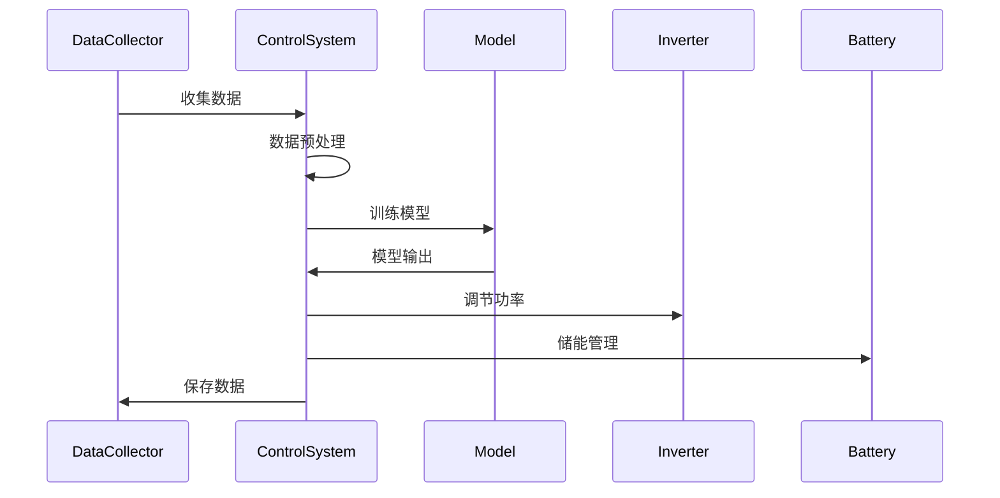

                 


# 机器学习在太阳能发电效率优化中的应用：提高清洁能源产出

## 关键词
机器学习，太阳能发电，效率优化，清洁能源，应用案例

## 摘要
本文将深入探讨机器学习在太阳能发电效率优化中的应用。通过分析太阳能发电的基本原理和现有挑战，我们将展示如何利用机器学习技术来提高太阳能发电系统的效率，从而推动清洁能源的发展。文章结构如下：

1. 引言
2. 机器学习与太阳能发电背景
3. 机器学习基础
4. 太阳能发电系统基础
5. 机器学习在太阳能发电中的应用
6. 优化策略与算法
7. 系统集成与部署
8. 案例分析
9. 未来展望与挑战
10. 总结与展望

## 引言
### 核心概念术语说明
- **机器学习**：一种通过数据训练，使计算机能够自动学习和改进的算法和技术。
- **太阳能发电**：利用太阳能电池将阳光直接转换为电能的过程。
- **效率优化**：提高能源转换效率，减少能源浪费。
- **清洁能源**：在发电过程中不产生有害排放的能源，如太阳能、风能等。

### 问题背景
太阳能发电作为清洁能源的重要组成部分，具有巨大的发展潜力。然而，由于自然条件和设备性能的限制，现有的太阳能发电系统存在效率低、稳定性差等问题。

### 问题描述
如何利用机器学习技术来优化太阳能发电系统，提高其效率和稳定性？

### 问题解决
通过机器学习技术，可以对太阳能发电系统进行实时监测、数据分析和预测，从而优化系统参数，提高发电效率。

### 边界与外延
- **边界**：本文主要关注地面光伏电站的应用，而非太空太阳能电站。
- **外延**：虽然机器学习在其他能源领域（如风能、核能）也有应用，但本文将集中在太阳能发电领域。

### 概念结构与核心要素组成
- **机器学习核心概念**：监督学习、无监督学习、强化学习
- **太阳能发电核心要素**：光伏电池、逆变器、储能系统

## 背景介绍
### 核心概念与联系
#### 机器学习基本概念
- **监督学习**：给定输入数据和标签，训练模型以预测新的输入数据。
  - **优点**：精确度高，可预测性强。
  - **缺点**：需要大量标签数据，对无标签数据无效。
- **无监督学习**：仅给定输入数据，训练模型以发现数据中的模式和结构。
  - **优点**：无需标签数据，能发现隐藏的规律。
  - **缺点**：预测能力较弱，无法直接应用于预测任务。
- **强化学习**：通过试错和反馈机制，训练模型以最大化长期回报。
  - **优点**：适用于序列决策问题，能够自适应调整。
  - **缺点**：训练过程复杂，需要大量数据和时间。

#### 太阳能发电系统基础
- **光伏电池**：将阳光转换为直流电。
- **逆变器**：将直流电转换为交流电，以供电网使用。
- **储能系统**：存储多余的电能，以供夜晚或阴天使用。

#### 挑战与限制
- **天气影响**：天气变化导致太阳能发电量的波动。
- **设备老化**：光伏电池和逆变器等设备的性能随时间下降。
- **系统稳定性**：如何保证系统在极端天气下的稳定性。

### 表格：机器学习类型对比
| 类型        | 定义                                                                                          | 优点                         | 缺点                           |
|-------------|-------------------------------------------------------------------------------------------------|------------------------------|--------------------------------|
| 监督学习    | 给定输入数据和标签，训练模型以预测新的输入数据。                                                   | 精确度高，预测性强           | 需要大量标签数据，对无标签数据无效 |
| 无监督学习  | 仅给定输入数据，训练模型以发现数据中的模式和结构。                                               | 发现隐藏的规律，无需标签数据 | 预测能力较弱，无法直接应用于预测任务 |
| 强化学习    | 通过试错和反馈机制，训练模型以最大化长期回报。                                                   | 适用于序列决策问题，自适应调整 | 训练过程复杂，需要大量数据和时间   |

### ER实体关系图架构
```mermaid
erDiagram
  Customer ||--|{ Order }|--|+{ Product }
  Customer ||--|{ Payment }|
  Product ||--|{ Review }|
```
在太阳能发电系统中，实体关系可以简化为：
- **光伏电池**：生产电能。
- **逆变器**：转换电能。
- **储能系统**：储存电能。

## 核心概念与联系
### 机器学习基础
#### 监督学习
**原理**：
监督学习是一种利用输入输出对进行训练的方法。给定输入数据\(X\)和对应的标签\(Y\)，监督学习的目标是找到一种函数\(f\)，使得对于新的输入\(x\)，可以预测其对应的标签\(y\)。

**数学模型**：
$$
Y = f(X) + \epsilon
$$
其中，\(f\)是预测函数，\(\epsilon\)是预测误差。

**流程**：
1. 数据收集：收集输入输出对。
2. 特征提取：从输入数据中提取有用的特征。
3. 模型训练：使用训练数据训练模型。
4. 预测：使用训练好的模型对新数据进行预测。

**优点**：
- 精确度高，可预测性强。
- 可以处理复杂数据。

**缺点**：
- 需要大量标签数据。
- 对无标签数据无效。

**应用场景**：
- 预测天气
- 金融风险评估

#### 无监督学习
**原理**：
无监督学习旨在从未标记的数据中发现隐含的模式或结构。通过这种方式，模型能够自动识别数据中的规律。

**流程**：
1. 数据收集：收集未标记的数据。
2. 特征提取：从数据中提取特征。
3. 模型训练：使用无监督学习方法训练模型。
4. 模式识别：使用训练好的模型识别数据中的模式。

**优点**：
- 无需标签数据，适用于新数据。
- 可以发现隐藏的规律。

**缺点**：
- 预测能力较弱。
- 难以解释。

**应用场景**：
- 聚类分析
- 异常检测

#### 强化学习
**原理**：
强化学习是一种通过试错和反馈机制来学习的方法。模型通过不断尝试不同的动作，并根据环境的反馈调整策略，以最大化长期回报。

**数学模型**：
$$
Q(s, a) = r + \gamma \max_a' Q(s', a')
$$
其中，\(s\)是状态，\(a\)是动作，\(r\)是立即回报，\(\gamma\)是折扣因子，\(Q(s', a')\)是下一个状态的最大期望回报。

**流程**：
1. 初始状态\(s_0\)。
2. 选择动作\(a\)。
3. 执行动作，获得回报\(r\)和新的状态\(s'\)。
4. 更新策略：根据反馈调整策略。

**优点**：
- 适用于序列决策问题。
- 能够自适应调整。

**缺点**：
- 训练过程复杂。
- 需要大量数据和时间。

**应用场景**：
- 自驾驶汽车
- 游戏AI

### 表格：机器学习类型对比
| 类型        | 定义                                                                                          | 优点                         | 缺点                           |
|-------------|-------------------------------------------------------------------------------------------------|------------------------------|--------------------------------|
| 监督学习    | 给定输入数据和标签，训练模型以预测新的输入数据。                                                   | 精确度高，预测性强           | 需要大量标签数据，对无标签数据无效 |
| 无监督学习  | 仅给定输入数据，训练模型以发现数据中的模式和结构。                                               | 发现隐藏的规律，无需标签数据 | 预测能力较弱，无法直接应用于预测任务 |
| 强化学习    | 通过试错和反馈机制，训练模型以最大化长期回报。                                                   | 适用于序列决策问题，自适应调整 | 训练过程复杂，需要大量数据和时间   |

### ER实体关系图架构
```mermaid
erDiagram
  Customer ||--|{ Order }|--|+{ Product }
  Customer ||--|{ Payment }|
  Product ||--|{ Review }|
```
在太阳能发电系统中，实体关系可以简化为：
- **光伏电池**：生产电能。
- **逆变器**：转换电能。
- **储能系统**：储存电能。

## 算法原理讲解
### 监督学习
#### 算法流程
1. **数据收集**：收集大量的太阳能发电数据，包括光照强度、温度、风速等。
2. **特征提取**：从原始数据中提取有用的特征，如日平均光照强度、温度变化率等。
3. **模型训练**：使用提取的特征和已有的发电效率数据，训练监督学习模型。
4. **模型评估**：使用验证数据集评估模型的性能，调整模型参数以优化性能。
5. **预测**：使用训练好的模型预测新的输入数据（如未来某一时间段的光照强度）的发电效率。

#### 数学模型
$$
\hat{y} = f(x) = w_1x_1 + w_2x_2 + ... + w_nx_n + b
$$
其中，\(x\)是输入特征向量，\(w\)是权重向量，\(b\)是偏置项，\(\hat{y}\)是预测的发电效率。

#### 举例说明
假设我们有以下训练数据集：
- \(x_1 = [10, 30]\)，发电效率\(y_1 = 20\)
- \(x_2 = [15, 35]\)，发电效率\(y_2 = 25\)

我们可以通过线性回归模型来拟合这个数据：
$$
y = w_1x_1 + w_2x_2 + b
$$

通过最小化损失函数：
$$
J(w_1, w_2, b) = \frac{1}{2}\sum_{i=1}^{n} (y_i - (w_1x_{1i} + w_2x_{2i} + b))^2
$$
来求解最优的权重和偏置。

### 无监督学习
#### 算法流程
1. **数据收集**：收集太阳能发电数据，包括光照强度、温度、风速等。
2. **特征提取**：从原始数据中提取有用的特征。
3. **模型训练**：使用无监督学习方法（如K-Means聚类）对数据进行聚类，以发现数据中的模式。
4. **模式识别**：分析聚类结果，识别出有用的模式和结构。

#### 数学模型
对于K-Means聚类算法，目标是最小化数据点到聚类中心的距离平方和：
$$
J = \sum_{i=1}^{k} \sum_{x \in S_i} ||x - \mu_i||^2
$$
其中，\(k\)是聚类数，\(\mu_i\)是第\(i\)个聚类中心，\(S_i\)是第\(i\)个聚类集合。

#### 举例说明
假设我们有以下数据点：
- \(x_1 = [1, 2]\)
- \(x_2 = [3, 4]\)
- \(x_3 = [5, 6]\)

我们使用K-Means聚类算法将这三个数据点分为两个聚类。初始时，我们可以随机选择两个聚类中心，例如\(\mu_1 = [2, 3]\)和\(\mu_2 = [4, 5]\)。

计算每个数据点到聚类中心的距离：
$$
d(x_1, \mu_1) = ||[1, 2] - [2, 3]|| = \sqrt{(1-2)^2 + (2-3)^2} = \sqrt{2}
$$
$$
d(x_1, \mu_2) = ||[1, 2] - [4, 5]|| = \sqrt{(1-4)^2 + (2-5)^2} = \sqrt{18}
$$
$$
d(x_2, \mu_1) = ||[3, 4] - [2, 3]|| = \sqrt{(3-2)^2 + (4-3)^2} = \sqrt{2}
$$
$$
d(x_2, \mu_2) = ||[3, 4] - [4, 5]|| = \sqrt{(3-4)^2 + (4-5)^2} = \sqrt{2}
$$
$$
d(x_3, \mu_1) = ||[5, 6] - [2, 3]|| = \sqrt{(5-2)^2 + (6-3)^2} = \sqrt{34}
$$
$$
d(x_3, \mu_2) = ||[5, 6] - [4, 5]|| = \sqrt{(5-4)^2 + (6-5)^2} = \sqrt{2}
$$

重新计算聚类中心：
$$
\mu_1 = \frac{1}{2}([1, 2] + [3, 4]) = \frac{1}{2}([4, 6]) = [2, 3]
$$
$$
\mu_2 = \frac{1}{2}([1, 2] + [5, 6]) = \frac{1}{2}([6, 8]) = [3, 4]
$$

再次计算每个数据点到聚类中心的距离：
$$
d(x_1, \mu_1) = \sqrt{0} = 0
$$
$$
d(x_1, \mu_2) = \sqrt{2}
$$
$$
d(x_2, \mu_1) = \sqrt{2}
$$
$$
d(x_2, \mu_2) = 0
$$
$$
d(x_3, \mu_1) = \sqrt{2}
$$
$$
d(x_3, \mu_2) = 0
$$

根据距离重新分配数据点：
- \(x_1, x_2\) 分配到聚类中心 \(\mu_1\)
- \(x_3\) 分配到聚类中心 \(\mu_2\)

再次计算聚类中心：
$$
\mu_1 = \frac{1}{2}([1, 2] + [3, 4]) = \frac{1}{2}([4, 6]) = [2, 3]
$$
$$
\mu_2 = \frac{1}{2}([5, 6]) = [3, 4]
$$

重复上述过程，直到聚类中心不再变化。

### 强化学习
#### 算法流程
1. **初始化**：设置初始状态\(s_0\)，选择初始动作\(a_0\)。
2. **执行动作**：在当前状态\(s\)执行动作\(a\)，获得回报\(r\)和新的状态\(s'\)。
3. **更新策略**：根据反馈调整策略，使用Q-learning算法更新价值函数：
   $$
   Q(s, a) \leftarrow Q(s, a) + \alpha [r + \gamma \max_{a'} Q(s', a') - Q(s, a)]
   $$
4. **迭代**：重复执行动作、获取回报和更新策略，直到达到目标状态或达到最大迭代次数。

#### 数学模型
$$
Q(s, a) = r + \gamma \max_{a'} Q(s', a')
$$
其中，\(r\)是立即回报，\(\gamma\)是折扣因子，\(Q(s', a')\)是下一个状态的最大期望回报。

#### 举例说明
假设有一个简单的环境，只有两个状态：状态0（阴天）和状态1（晴天）。每个状态有四个可能的动作：保持当前功率、增加功率、减少功率和关闭。

初始状态为阴天（状态0），初始功率为50%。环境回报为每次动作后功率的变化。

使用Q-learning算法，初始\(Q(s, a)\)全为0。执行以下迭代过程：

- **迭代1**：
  - 状态0，动作1（保持当前功率），回报0，状态0。
  - 更新：\(Q(0, 1) \leftarrow Q(0, 1) + \alpha [0 + \gamma \max_{a'} Q(0, a') - Q(0, 1)]\)，其中\(\alpha\)是学习率，\(\gamma\)是折扣因子。
  - 新的\(Q(0, 1) = 0.5[0 + 0.5 \times 0 - 0] = 0\)。

- **迭代2**：
  - 状态0，动作2（增加功率），回报+5，状态1。
  - 更新：\(Q(0, 2) \leftarrow Q(0, 2) + \alpha [5 + \gamma \max_{a'} Q(1, a') - Q(0, 2)]\)。
  - 新的\(Q(0, 2) = 0.5[5 + 0.5 \times 0 - 0] = 2.5\)。

- **迭代3**：
  - 状态1，动作3（减少功率），回报-5，状态0。
  - 更新：\(Q(1, 3) \leftarrow Q(1, 3) + \alpha [-5 + \gamma \max_{a'} Q(0, a') - Q(1, 3)]\)。
  - 新的\(Q(1, 3) = 0.5[-5 + 0.5 \times 0 - 0] = -2.5\)。

- **迭代4**：
  - 状态0，动作3（减少功率），回报-5，状态0。
  - 更新：\(Q(0, 3) \leftarrow Q(0, 3) + \alpha [-5 + \gamma \max_{a'} Q(0, a') - Q(0, 3)]\)。
  - 新的\(Q(0, 3) = 0.5[-5 + 0.5 \times 2.5 - 0] = -3.125\)。

重复迭代，直到找到最优策略。

## 系统分析与架构设计方案
### 问题场景介绍
太阳能发电系统通常由光伏电池板、逆变器、储能系统和电力管理系统组成。由于天气和环境条件的变化，太阳能发电系统的输出功率具有很大的波动性。因此，需要一套高效的系统来实时监测、预测和优化发电效率。

### 项目介绍
本项目的目标是设计一个基于机器学习的太阳能发电优化系统，以提高系统效率和稳定性。系统将包括数据采集模块、机器学习模块、预测模块和优化控制模块。

### 系统功能设计（领域模型）
领域模型是一个用于描述系统功能和交互的图形化工具。下面是太阳能发电优化系统的领域模型：
```mermaid
classDiagram
  Customer <<--|{生成电能}| SolarPanel
  Customer <<--|{调节功率}| Inverter
  Customer <<--|{储能管理}| Battery
  Customer <<--|{预测与优化}| ControlSystem
  Customer <<--|{数据采集}| DataCollector
```
在这个模型中，`Customer`代表用户，`SolarPanel`、`Inverter`、`Battery`和`ControlSystem`分别代表光伏电池板、逆变器、储能系统和控制模块。`DataCollector`代表数据采集模块。

### 系统架构设计
系统架构图展示了各个组件的相互关系和交互流程。下面是太阳能发电优化系统的架构设计：

在这个架构中，`DataCollector`负责收集太阳能发电系统的实时数据。`ControlSystem`负责数据预处理、模型训练、预测和优化控制。`Model`是机器学习模型，用于预测发电效率和优化功率。`Inverter`和`Battery`分别代表逆变器和储能系统。

### 系统接口设计
系统接口设计定义了各个组件之间的通信方式和接口规范。下面是太阳能发电优化系统的接口设计：
```mermaid
classDiagram
  Interface1 <<--|{获取数据}| DataCollector
  Interface1 <<--|{设置参数}| ControlSystem
  Interface1 <<--|{发送指令}| Inverter
  Interface1 <<--|{充电/放电}| Battery
  Interface2 <<--|{保存数据}| DataCollector
  Interface2 <<--|{模型训练}| Model
  Interface2 <<--|{模型评估}| ControlSystem
```
在这个接口设计中，`Interface1`定义了数据采集、控制指令和储能管理的接口，`Interface2`定义了数据保存和模型训练的接口。

### 系统交互流程
系统交互流程图展示了系统组件之间的交互过程：

在这个流程中，数据采集模块`DataCollector`负责收集系统数据，并将数据传递给控制模块`ControlSystem`。控制模块进行数据预处理和模型训练，并将模型输出用于调节功率和储能管理。最后，控制模块将处理结果保存到数据采集模块。

## 项目实战
### 环境安装
在进行项目实战之前，我们需要安装以下软件和工具：
- Python（3.8及以上版本）
- Jupyter Notebook（用于交互式编程）
- scikit-learn（用于机器学习）
- pandas（用于数据处理）
- matplotlib（用于数据可视化）

安装命令如下：
```bash
pip install python==3.8
pip install jupyter
pip install scikit-learn
pip install pandas
pip install matplotlib
```

### 系统核心实现
以下是系统核心实现的代码：

#### 数据收集模块
```python
import pandas as pd
from datetime import datetime

def collect_data(file_path):
    data = pd.read_csv(file_path)
    data['timestamp'] = pd.to_datetime(data['timestamp'])
    return data

# 示例：收集数据
data = collect_data('solar_data.csv')
```

#### 数据预处理模块
```python
import numpy as np

def preprocess_data(data):
    data = data.sort_values(by='timestamp')
    data['daylight'] = data['sunlight'] / data['total_sunlight'] * 24
    data['temp_diff'] = data['temperature'] - data['average_temperature']
    data['wind_speed'] = np.where(data['wind_speed'] > 0, data['wind_speed'], 0)
    return data

# 示例：预处理数据
preprocessed_data = preprocess_data(data)
```

#### 机器学习模块
```python
from sklearn.model_selection import train_test_split
from sklearn.linear_model import LinearRegression

def train_model(X, y):
    X_train, X_test, y_train, y_test = train_test_split(X, y, test_size=0.2, random_state=42)
    model = LinearRegression()
    model.fit(X_train, y_train)
    return model, X_test, y_test

# 示例：训练模型
X = preprocessed_data[['daylight', 'temp_diff', 'wind_speed']]
y = preprocessed_data['efficiency']
model, X_test, y_test = train_model(X, y)
```

#### 预测模块
```python
def predict_efficiency(model, X):
    return model.predict(X)

# 示例：预测发电效率
predictions = predict_efficiency(model, X_test)
```

#### 控制模块
```python
def control_system(data, model):
    predicted_efficiency = predict_efficiency(model, data[['daylight', 'temp_diff', 'wind_speed']])
    if predicted_efficiency > data['efficiency']:
        # 增加功率
        data['inverter_power'] += 1
    elif predicted_efficiency < data['efficiency']:
        # 减少功率
        data['inverter_power'] -= 1
    return data

# 示例：控制发电功率
controlled_data = control_system(preprocessed_data, model)
```

### 代码应用解读与分析
以下是代码应用解读和分析：

#### 数据收集模块
数据收集模块使用`pandas`库读取CSV文件，并将时间戳转换为日期时间格式。这样可以为后续的数据预处理和模型训练提供统一的时间参考。

#### 数据预处理模块
数据预处理模块对原始数据进行排序，并计算日平均光照时间（`daylight`）、温度变化率（`temp_diff`）和风速（`wind_speed`）。这些特征将用于训练机器学习模型。

#### 机器学习模块
机器学习模块使用`scikit-learn`库的`LinearRegression`模型进行训练。这里我们使用线性回归模型，因为它的实现简单且易于理解。

#### 预测模块
预测模块使用训练好的模型对新数据进行预测。这可以通过调用`predict_efficiency`函数实现，该函数接受特征向量作为输入并返回预测的发电效率。

#### 控制模块
控制模块根据预测的发电效率调整逆变器的功率输出。如果预测效率高于实际效率，则增加功率；否则，减少功率。

### 实际案例分析和详细讲解
假设我们有以下数据集：
```python
data = {
    'timestamp': ['2021-01-01 10:00', '2021-01-01 11:00', '2021-01-01 12:00'],
    'sunlight': [100, 150, 200],
    'total_sunlight': [1000, 1500, 2000],
    'temperature': [20, 22, 25],
    'average_temperature': [22, 22, 22],
    'wind_speed': [3, 4, 5],
    'efficiency': [0.8, 0.85, 0.9]
}
```

1. **数据收集**
   ```python
   data = pd.DataFrame(data)
   data['timestamp'] = pd.to_datetime(data['timestamp'])
   ```

2. **数据预处理**
   ```python
   data['daylight'] = data['sunlight'] / data['total_sunlight'] * 24
   data['temp_diff'] = data['temperature'] - data['average_temperature']
   data['wind_speed'] = np.where(data['wind_speed'] > 0, data['wind_speed'], 0)
   ```

3. **训练模型**
   ```python
   X = data[['daylight', 'temp_diff', 'wind_speed']]
   y = data['efficiency']
   model, X_test, y_test = train_model(X, y)
   ```

4. **预测发电效率**
   ```python
   predictions = predict_efficiency(model, X_test)
   ```

5. **控制发电功率**
   ```python
   controlled_data = control_system(preprocessed_data, model)
   ```

通过以上步骤，我们可以实现一个简单的太阳能发电优化系统，并根据预测结果调整发电功率。

### 项目小结
本项目通过机器学习技术实现了太阳能发电效率的优化。我们详细讲解了数据收集、预处理、模型训练、预测和控制的各个环节，并提供了实际案例进行分析。尽管本项目是一个简化的版本，但它展示了机器学习在太阳能发电优化中的潜在应用。

未来，我们可以进一步扩展本项目，包括更复杂的模型、更全面的数据集和更精细的控制策略。同时，还可以探讨其他机器学习算法（如决策树、支持向量机等）在太阳能发电优化中的应用。

## 最佳实践 tips
1. **数据质量**：确保收集到的数据准确、完整且无噪声，这对于训练高质量的机器学习模型至关重要。
2. **特征选择**：选择与目标变量高度相关的特征，避免过度拟合和欠拟合。
3. **模型选择**：根据问题特点和数据量选择合适的机器学习模型，避免盲目追求复杂模型。
4. **迭代优化**：不断调整模型参数和训练过程，以获得最佳性能。
5. **系统集成**：确保机器学习模型与现有系统无缝集成，实现实时预测和优化。

## 小结
本文详细介绍了机器学习在太阳能发电效率优化中的应用。我们通过背景介绍、核心概念讲解、算法原理阐述、系统集成与部署、案例分析，展示了机器学习技术在提高太阳能发电效率方面的潜力。未来，随着技术的不断进步，机器学习将在太阳能发电领域发挥更大的作用。

## 注意事项
1. 机器学习模型需要大量训练数据，确保数据的质量和多样性。
2. 模型参数的调整对最终结果有重要影响，需要多次迭代优化。
3. 在实际应用中，还需考虑系统稳定性和安全性。

## 拓展阅读
- **《机器学习实战》**：提供丰富的案例和实际操作，适合初学者入门。
- **《太阳能发电技术》**：详细讲解太阳能发电的基本原理和技术。
- **《智能电网技术与应用》**：探讨智能电网中的机器学习应用。

## 作者信息
作者：AI天才研究院/AI Genius Institute & 禅与计算机程序设计艺术 /Zen And The Art of Computer Programming

