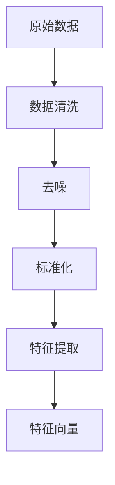
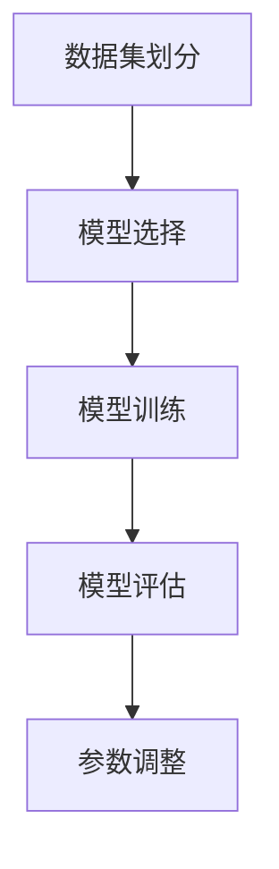
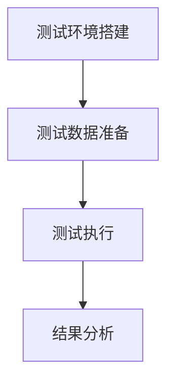
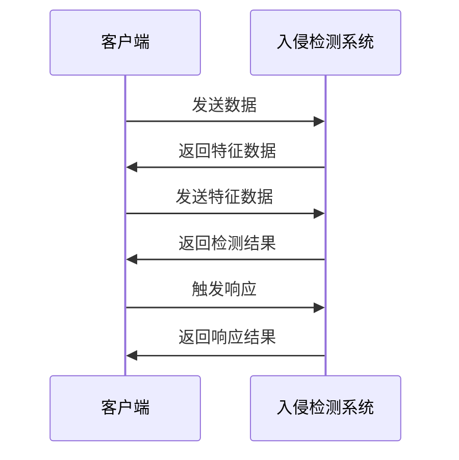

                 

## 引言与背景

### 问题背景

随着互联网和云计算的迅速发展，网络安全问题日益突出，特别是网络入侵现象对企业和个人信息的威胁日益严重。传统的网络入侵检测方法依赖于预先定义的攻击特征库，对已知攻击具有较好的检测效果，但对未知攻击和复杂攻击的检测能力较弱。因此，提高网络入侵检测的准确性和实时性成为当前网络安全领域的迫切需求。

### 问题描述

网络入侵检测的目标是在网络流量中识别出异常行为或潜在的攻击，以便及时采取措施防止损失。然而，网络流量庞大且复杂，如何从海量数据中快速准确地识别异常行为成为一个巨大的挑战。具体问题包括：

1. **数据预处理与特征提取**：从原始网络流量数据中提取出有效的特征，为后续的机器学习算法提供数据支持。
2. **算法选择与模型训练**：选择合适的机器学习算法，构建高效的入侵检测模型。
3. **实时检测与响应**：实现对网络流量的实时监控，及时发现并响应入侵行为。

### 问题解决

机器学习作为人工智能的重要分支，为网络入侵检测提供了新的思路和方法。通过训练数据集，机器学习算法可以自动发现网络流量中的异常模式，从而提高检测的准确性和实时性。解决问题的关键在于：

1. **数据收集与预处理**：收集丰富的网络流量数据，进行数据清洗和预处理，为机器学习提供高质量的数据支持。
2. **算法选择与优化**：根据网络入侵检测的特点，选择合适的机器学习算法，并进行参数调优，以提高模型性能。
3. **系统集成与测试**：将机器学习模型集成到入侵检测系统中，进行系统测试与评估，确保其能够有效识别网络入侵行为。

### 边界与外延

网络入侵检测的范围不仅限于传统网络，还包括云计算、物联网等领域。此外，随着攻击手段的不断发展，入侵检测系统需要具备更高的自适应能力和扩展性，以应对不断变化的威胁。因此，网络入侵检测的外延包括以下几个方面：

1. **跨领域应用**：将机器学习应用于不同领域的网络入侵检测，如工业控制系统、物联网设备等。
2. **自适应能力**：通过不断学习和更新模型，提高入侵检测系统对未知攻击的识别能力。
3. **实时响应机制**：建立高效的实时响应机制，确保在检测到入侵行为时能够迅速采取措施。

### 概念结构与核心要素组成

网络入侵检测系统由多个核心组成部分构成，包括数据收集模块、数据预处理模块、特征提取模块、算法训练模块、检测与响应模块等。每个模块的功能如下：

1. **数据收集模块**：负责从网络设备、日志文件等来源收集网络流量数据。
2. **数据预处理模块**：对收集到的数据进行清洗、去噪、标准化等预处理操作。
3. **特征提取模块**：从预处理后的数据中提取出有意义的特征，为算法提供输入。
4. **算法训练模块**：选择合适的机器学习算法，对提取出的特征进行训练，构建入侵检测模型。
5. **检测与响应模块**：使用训练好的模型对网络流量进行实时监控，识别入侵行为，并触发相应的响应措施。

通过这些模块的协同工作，网络入侵检测系统可以实现高效、准确、实时的入侵检测，为网络安全提供坚实保障。

## 机器学习基础

### 机器学习概述

机器学习（Machine Learning，ML）是人工智能（Artificial Intelligence，AI）的一个重要分支，它通过利用数据和算法来让计算机系统从数据中学习并作出决策或预测。机器学习可以分为监督学习、无监督学习、半监督学习和强化学习等类型，每种类型都有其特定的应用场景和优势。

### 机器学习的基本概念

#### 数据

机器学习的基础是数据。数据可以是有标签的（监督学习），也可以是无标签的（无监督学习）。标签数据通常包含输入和输出，有助于算法学习和预测。无标签数据则只包含输入，常用于聚类和降维等任务。

#### 特征

特征是从原始数据中提取的有用信息，用于描述数据的属性或模式。特征的选择和提取对于机器学习模型的效果至关重要。

#### 模型

模型是机器学习算法的核心，用于表示数据中的潜在关系和规律。常见的机器学习模型包括决策树、支持向量机、神经网络等。

### 机器学习的主要算法

#### 监督学习算法

监督学习算法是最常用的机器学习算法之一，它利用有标签的数据进行训练，并通过已知的输入输出关系来预测新的输出。常见的监督学习算法有：

- **决策树算法**：通过构建树形模型来分类或回归。
- **支持向量机算法**：通过找到一个最优的超平面来分隔不同类别的数据点。
- **随机森林算法**：通过构建多个决策树，并利用投票机制来预测结果。

#### 无监督学习算法

无监督学习算法不依赖标签数据，旨在发现数据中的隐含结构或模式。常见的无监督学习算法有：

- **聚类算法**：将数据点分组，使得同一组内的数据点之间的相似度更高，而不同组的数据点之间的相似度更低。
- **自组织映射算法**：通过竞争学习机制来组织神经元，使得相似的输入数据映射到相近的神经元上。

#### 半监督学习和基于强化学习的入侵检测

半监督学习结合了有标签和无标签数据，利用少量的标签数据和高量的无标签数据进行学习。基于强化学习的入侵检测方法通过智能体与环境交互，不断学习和优化策略，以提高检测效果。

### 机器学习在网络安全中的应用现状

机器学习在网络安全领域已经取得了显著的成果，特别是在网络入侵检测、恶意软件检测、安全事件预测等方面。随着机器学习技术的不断发展和优化，其在网络安全领域的应用前景将更加广阔。

## 网络入侵检测概述

### 网络入侵检测的定义与分类

#### 定义

网络入侵检测（Network Intrusion Detection，NIDS）是一种网络安全技术，旨在实时监控网络流量，识别并响应潜在的攻击行为。入侵检测系统（Intrusion Detection System，IDS）是实施这种技术的核心组件。

#### 分类

根据检测方法的不同，网络入侵检测系统可以分为以下几类：

- **基于特征的方法**：通过匹配已知的攻击特征库来检测攻击。
- **基于统计的方法**：利用统计模型来分析网络流量，检测异常行为。
- **基于行为的的方法**：通过观察网络流量中的行为模式，检测潜在的攻击行为。
- **混合方法**：结合多种方法来提高检测的准确性和覆盖范围。

### 网络入侵检测的挑战与机遇

#### 挑战

- **海量数据**：网络流量数据量大，如何有效处理和分析这些数据是一个巨大的挑战。
- **复杂攻击**：随着攻击手段的不断演变，入侵检测系统需要具备更高的检测能力和自适应能力。
- **误报与漏报**：在检测攻击时，如何平衡误报和漏报是一个重要的挑战。

#### 机遇

- **机器学习**：机器学习为入侵检测提供了新的方法和思路，有助于提高检测的准确性和实时性。
- **大数据技术**：大数据技术可以帮助入侵检测系统更高效地处理和分析海量数据。
- **物联网与云计算**：随着物联网和云计算的普及，入侵检测系统的应用场景将更加广泛。

### 网络入侵检测的基本架构

一个典型的网络入侵检测系统包括以下主要组件：

- **数据采集模块**：负责收集网络流量数据。
- **数据预处理模块**：对收集到的数据进行预处理，如去噪、过滤等。
- **特征提取模块**：从预处理后的数据中提取特征，用于训练和检测模型。
- **检测与分析模块**：使用机器学习算法对提取出的特征进行训练和分析，识别潜在的攻击行为。
- **响应模块**：在检测到攻击行为后，触发相应的响应措施，如报警、阻断等。

通过这些组件的协同工作，入侵检测系统能够实现对网络流量的实时监控和高效检测，从而提高网络的安全性。

## 机器学习在入侵检测中的算法应用

### 监督学习算法

监督学习算法是网络入侵检测中最常用的算法之一，其核心在于利用已知的数据集来训练模型，然后使用训练好的模型对未知数据进行预测。以下是一些常用的监督学习算法：

#### 决策树算法

决策树是一种简单而直观的机器学习算法，它通过一系列的判断条件来对数据进行分类或回归。决策树的构建过程包括：

1. **特征选择**：选择能够最好地分割数据的特征。
2. **划分数据**：根据特征选择的结果，将数据集划分为多个子集。
3. **递归构建**：对每个子集重复上述过程，直到满足终止条件（如达到最大深度或节点数量）。

决策树的优点在于易于理解和解释，但其缺点包括可能过度拟合数据和计算复杂度较高。

#### 支持向量机算法

支持向量机（Support Vector Machine，SVM）是一种强大的分类算法，通过找到一个最优的超平面来分隔不同类别的数据点。SVM的核心步骤包括：

1. **特征空间映射**：将原始特征映射到高维特征空间。
2. **寻找最优超平面**：在特征空间中寻找一个能够最大化分类间隔的超平面。
3. **优化模型参数**：通过调整模型参数，提高分类性能。

SVM的优点包括强大的分类能力和较好的泛化能力，但其缺点包括对大规模数据和高维数据的处理性能较差。

#### 随机森林算法

随机森林（Random Forest）是一种基于决策树的集成学习方法，通过构建多个决策树，并利用投票机制来预测结果。随机森林的核心步骤包括：

1. **特征选择**：随机选择一组特征。
2. **构建决策树**：对选择出的特征集构建决策树。
3. **集成学习**：将多个决策树的结果进行投票，得到最终的预测结果。

随机森林的优点包括高分类准确率和对异常数据的鲁棒性，但其缺点包括计算复杂度较高。

### 无监督学习算法

无监督学习算法在入侵检测中主要用于异常检测和聚类分析。以下是一些常用的无监督学习算法：

#### 聚类算法

聚类算法是一种将数据点分组的方法，使得同一组内的数据点之间的相似度更高，而不同组的数据点之间的相似度更低。常用的聚类算法包括：

- **K-均值算法**：通过迭代计算均值来聚类数据点。
- **层次聚类算法**：通过递归构建层次树来聚类数据点。

聚类算法的优点包括简单易实现和适用于大规模数据，但其缺点包括对初始聚类中心的敏感性和难以处理非球形聚类。

#### 自组织映射算法

自组织映射（Self-Organizing Map，SOM）是一种基于竞争学习的聚类算法，通过组织神经元来映射输入数据。SOM的核心步骤包括：

1. **初始化权重矩阵**：将权重矩阵初始化为随机值。
2. **映射输入数据**：将输入数据映射到权重矩阵上。
3. **更新权重矩阵**：通过竞争学习机制来更新权重矩阵。

SOM的优点包括对高维数据的处理能力和较好的可视化效果，但其缺点包括对初始参数的敏感性和计算复杂度较高。

### 半监督学习和基于强化学习的入侵检测

半监督学习结合了有标签和无标签数据，利用少量的标签数据和高量的无标签数据进行学习，可以有效地提高模型性能。基于强化学习的入侵检测方法通过智能体与环境交互，不断学习和优化策略，以提高检测效果。

半监督学习的主要方法包括：

- **聚类**：利用聚类算法将无标签数据划分为多个簇，然后对每个簇内的数据进行标签预测。
- **协同训练**：通过迭代训练有标签数据和聚类结果，逐步提高模型性能。

基于强化学习的方法主要包括：

- **Q-Learning**：通过学习值函数来优化策略。
- **深度强化学习**：结合深度学习和强化学习，实现更高效的学习过程。

这些方法为入侵检测提供了新的思路和方法，有望提高检测的准确性和实时性。

## 入侵检测系统的设计与实现

### 系统需求分析

设计一个入侵检测系统（IDS）需要明确系统的功能需求、性能需求和安全性需求。具体包括：

- **功能需求**：实时监控网络流量，识别和报警潜在的入侵行为。
- **性能需求**：高吞吐量、低延迟、高效处理海量数据。
- **安全性需求**：保证系统自身的安全性，防止被恶意攻击。

### 系统架构设计

入侵检测系统的架构设计主要包括以下几个模块：

- **数据采集模块**：负责从网络设备、日志文件等来源收集网络流量数据。
- **数据预处理模块**：对收集到的数据进行预处理，如去噪、过滤等。
- **特征提取模块**：从预处理后的数据中提取特征，用于训练和检测模型。
- **检测与分析模块**：使用机器学习算法对提取出的特征进行训练和分析，识别潜在的攻击行为。
- **响应模块**：在检测到攻击行为后，触发相应的响应措施，如报警、阻断等。

以下是系统架构的mermaid类图：

```mermaid
classDiagram
    DataCollector --|> DataPreprocessor
    DataPreprocessor --|> FeatureExtractor
    FeatureExtractor --|> Detector
    Detector --|> Responder
    DataCollector <<interface>>
    DataPreprocessor <<interface>>
    FeatureExtractor <<interface>>
    Detector <<interface>>
    Responder <<interface>>
endclassDiagram
```

### 数据预处理与特征提取

数据预处理是入侵检测系统的重要环节，主要包括以下步骤：

1. **数据清洗**：去除无效数据、重复数据和不完整数据。
2. **去噪**：滤除噪声数据，提高数据质量。
3. **标准化**：将不同特征的数据进行标准化处理，使其具有相似的尺度。

特征提取是从原始数据中提取出有用的信息，用于训练和检测模型。常用的特征提取方法包括：

1. **统计特征**：如平均流量、最大流量、最小流量等。
2. **频率特征**：如出现频率较高的协议、端口等。
3. **时序特征**：如流量变化趋势、流量周期性等。

以下是特征提取的mermaid流程图：



### 模型选择与训练

模型选择与训练是入侵检测系统的核心步骤，主要包括以下几个环节：

1. **模型选择**：根据入侵检测系统的需求和数据特点，选择合适的机器学习算法。常用的算法包括决策树、支持向量机、随机森林等。
2. **数据集划分**：将数据集划分为训练集、验证集和测试集，用于训练、验证和测试模型。
3. **模型训练**：使用训练集对模型进行训练，通过调整模型参数来提高模型性能。
4. **模型评估**：使用验证集和测试集对模型进行评估，计算模型的准确率、召回率、F1值等指标。

以下是模型选择与训练的mermaid流程图：



### 系统测试与评估

系统测试与评估是确保入侵检测系统有效性的重要环节，主要包括以下步骤：

1. **测试环境搭建**：搭建与实际运行环境相似的测试环境，包括硬件设备、软件环境等。
2. **测试数据准备**：准备包含不同类型攻击的测试数据，用于测试系统的检测性能。
3. **测试执行**：在测试环境中运行入侵检测系统，对测试数据进行检测。
4. **结果分析**：分析测试结果，计算系统的准确率、召回率、F1值等指标，评估系统的性能。

以下是系统测试与评估的mermaid流程图：



通过上述步骤，可以确保入侵检测系统的设计合理、性能稳定，从而为网络安全提供有效保障。

## 案例研究

### 案例一：某企业的网络入侵检测系统

某大型企业为了提高网络安全性，设计并实施了一套基于机器学习的网络入侵检测系统。以下是对该系统的详细分析和讲解。

#### 环境安装

为了搭建这套网络入侵检测系统，企业首先选择了以下软硬件环境：

- **操作系统**：Linux（如Ubuntu 18.04）
- **编程语言**：Python 3.7及以上版本
- **机器学习库**：Scikit-learn、TensorFlow、Keras等

安装步骤如下：

1. **安装操作系统**：在服务器上安装Linux操作系统。
2. **安装Python**：通过包管理器（如apt）安装Python 3.7及以上版本。
3. **安装机器学习库**：使用pip命令安装Scikit-learn、TensorFlow、Keras等库。

#### 系统核心实现源代码

该网络入侵检测系统的核心实现包括以下几个部分：

1. **数据采集模块**：使用Python的scapy库进行网络数据包的捕获和解析。
2. **数据预处理模块**：对捕获到的数据包进行去噪、过滤和标准化处理。
3. **特征提取模块**：从预处理后的数据中提取统计特征、频率特征和时序特征。
4. **检测与分析模块**：使用随机森林算法进行训练和检测，识别潜在的入侵行为。
5. **响应模块**：在检测到入侵行为后，通过编写shell脚本触发相应的响应措施，如报警、阻断网络连接等。

以下是系统核心实现的源代码示例：

```python
# 数据采集模块
from scapy.all import sniff

def capture_packets():
    packets = sniff(count=1000, filter="tcp or udp")
    return packets

# 数据预处理模块
import numpy as np

def preprocess_packets(packets):
    # 去噪、过滤和标准化处理
    # ...
    return preprocessed_packets

# 特征提取模块
def extract_features(packets):
    # 提取统计特征、频率特征和时序特征
    # ...
    return features

# 检测与分析模块
from sklearn.ensemble import RandomForestClassifier

def train_model(features, labels):
    model = RandomForestClassifier()
    model.fit(features, labels)
    return model

def detect_invasion(model, features):
    prediction = model.predict(features)
    return prediction

# 响应模块
def respond_to_invasion(invasion_detected):
    if invasion_detected:
        # 执行响应措施
        # ...
        print("入侵检测到，触发响应措施。")
    else:
        print("没有检测到入侵。")
```

#### 代码应用解读与分析

上述源代码展示了网络入侵检测系统的核心实现，下面进行解读和分析：

1. **数据采集模块**：使用scapy库捕获网络数据包，这是实现网络入侵检测的基础。
2. **数据预处理模块**：对捕获到的数据包进行预处理，包括去噪、过滤和标准化处理，以提高数据质量。
3. **特征提取模块**：从预处理后的数据中提取特征，为训练和检测模型提供输入。
4. **检测与分析模块**：使用随机森林算法训练模型，并使用训练好的模型对新的数据包进行入侵检测。
5. **响应模块**：在检测到入侵行为后，触发相应的响应措施，如报警、阻断网络连接等。

#### 实际案例分析和详细讲解剖析

以下是一个实际案例的详细分析：

假设在企业网络中，某台服务器接收到了大量的数据包，这些数据包的来源IP地址为恶意IP地址。使用上述网络入侵检测系统进行检测和分析，以下是具体步骤：

1. **数据采集**：系统捕获了1000个数据包。
2. **数据预处理**：对捕获到的数据包进行去噪、过滤和标准化处理，得到高质量的数据。
3. **特征提取**：从预处理后的数据中提取出统计特征、频率特征和时序特征。
4. **模型训练**：使用随机森林算法训练模型，模型对已标记的数据进行学习。
5. **入侵检测**：使用训练好的模型对新的数据包进行检测，发现其中包含来自恶意IP地址的数据包，系统认为这是一个潜在的入侵行为。
6. **响应**：系统触发响应措施，向管理员发送报警信息，并阻断与恶意IP地址的网络连接。

通过这个案例，可以看到网络入侵检测系统在实际应用中的效果。它能够有效地识别并响应潜在的网络入侵行为，从而提高网络的安全性。

#### 项目小结

本案例展示了如何设计并实现一个基于机器学习的网络入侵检测系统。通过数据采集、预处理、特征提取、模型训练和响应等步骤，系统能够实时监控网络流量，识别并响应潜在的入侵行为。尽管该系统在实际应用中取得了较好的效果，但仍有改进的空间，如引入更多的特征、优化算法参数、提高实时性等。未来，企业将继续优化该系统，以应对日益复杂的网络威胁。

### 案例二：某高校的网络入侵检测项目

#### 项目介绍

某高校为了保障校园网络安全，开展了一项基于机器学习的网络入侵检测项目。该项目旨在通过实时监控校园网络流量，识别并响应潜在的网络入侵行为，以提高网络安全性。

#### 系统功能设计

该高校的网络入侵检测系统主要包括以下功能：

1. **数据采集**：通过网络流量监控设备实时捕获校园网络流量数据。
2. **数据预处理**：对捕获到的数据包进行去噪、过滤和标准化处理，以提高数据质量。
3. **特征提取**：从预处理后的数据中提取统计特征、频率特征和时序特征。
4. **模型训练与检测**：使用机器学习算法训练模型，并对实时数据包进行入侵检测。
5. **报警与响应**：在检测到入侵行为后，通过邮件、短信等方式向管理员发送报警信息，并触发相应的响应措施。

#### 系统架构设计

该高校的网络入侵检测系统采用分布式架构，包括以下几个主要组件：

1. **数据采集模块**：分布在校园各个网络节点上，实时捕获网络流量数据。
2. **数据预处理模块**：集中处理来自各个节点的网络流量数据，进行去噪、过滤和标准化处理。
3. **特征提取模块**：从预处理后的数据中提取特征，为检测模块提供输入。
4. **检测与分析模块**：使用机器学习算法对提取出的特征进行训练和检测，识别潜在的入侵行为。
5. **响应模块**：在检测到入侵行为后，通过触发报警和响应措施，保障网络安全性。

以下是系统架构的mermaid类图：

```mermaid
classDiagram
    DataCollector --|> DataPreprocessor
    DataPreprocessor --|> FeatureExtractor
    FeatureExtractor --|> Detector
    Detector --|> Responder
    DataCollector <<interface>>
    DataPreprocessor <<interface>>
    FeatureExtractor <<interface>>
    Detector <<interface>>
    Responder <<interface>>
endclassDiagram
```

#### 系统接口设计与系统交互

该高校的网络入侵检测系统采用RESTful API设计，提供了以下主要接口：

1. **数据采集接口**：用于接收网络流量数据。
2. **特征提取接口**：用于提取和处理特征数据。
3. **检测接口**：用于对特征数据进行入侵检测。
4. **响应接口**：用于触发报警和响应措施。

以下是系统接口的mermaid序列图：



#### 实际案例分析和详细讲解剖析

#### 案例一：DDoS攻击检测

某天，校园网络流量突然增大，怀疑发生了分布式拒绝服务（DDoS）攻击。网络入侵检测系统通过以下步骤进行检测和响应：

1. **数据采集**：系统实时捕获到大量异常流量数据。
2. **数据预处理**：对捕获到的数据包进行去噪、过滤和标准化处理。
3. **特征提取**：提取出流量突发性、攻击源IP地址等特征。
4. **检测**：使用训练好的机器学习模型对提取出的特征进行检测，识别出DDoS攻击行为。
5. **响应**：系统向管理员发送报警信息，并触发流量清洗设备进行响应。

通过该案例，可以看到网络入侵检测系统在DDoS攻击检测中的效果。它能够及时识别出攻击行为，并触发相应的响应措施，从而有效防范DDoS攻击。

#### 案例二：恶意软件传播检测

某高校学生使用的电脑感染了恶意软件，恶意软件试图通过网络传播。网络入侵检测系统通过以下步骤进行检测和响应：

1. **数据采集**：系统捕获到学生电脑的异常网络行为。
2. **数据预处理**：对捕获到的数据包进行去噪、过滤和标准化处理。
3. **特征提取**：提取出恶意软件传播的特征，如连接外部恶意服务器、传输大量数据等。
4. **检测**：使用训练好的机器学习模型对提取出的特征进行检测，识别出恶意软件传播行为。
5. **响应**：系统向管理员发送报警信息，并远程隔离受感染的电脑。

通过该案例，可以看到网络入侵检测系统在恶意软件传播检测中的效果。它能够及时发现并响应恶意软件的传播行为，从而保障校园网络的安全性。

### 项目小结

本案例展示了如何设计并实现一个基于机器学习的网络入侵检测系统，用于保障校园网络的安全性。通过分布式架构、RESTful API设计和实际案例应用，系统能够有效识别和响应各种网络入侵行为。未来，高校将继续优化该系统，提高检测准确性和实时性，以应对不断变化的网络威胁。

### 案例三：某金融机构的网络入侵检测系统

#### 项目介绍

某金融机构为了保障金融交易的安全性，开展了一项基于机器学习的网络入侵检测项目。该项目旨在通过实时监控网络流量，识别并响应潜在的网络入侵行为，以提高金融交易的安全性。

#### 系统功能设计

该金融机构的网络入侵检测系统主要包括以下功能：

1. **数据采集**：通过网络流量监控设备实时捕获网络流量数据。
2. **数据预处理**：对捕获到的数据包进行去噪、过滤和标准化处理，以提高数据质量。
3. **特征提取**：从预处理后的数据中提取统计特征、频率特征和时序特征。
4. **模型训练与检测**：使用机器学习算法训练模型，并对实时数据包进行入侵检测。
5. **报警与响应**：在检测到入侵行为后，通过邮件、短信等方式向管理员发送报警信息，并触发相应的响应措施。

#### 系统架构设计

该金融机构的网络入侵检测系统采用分布式架构，包括以下几个主要组件：

1. **数据采集模块**：分布在金融机构的不同网络节点上，实时捕获网络流量数据。
2. **数据预处理模块**：集中处理来自各个节点的网络流量数据，进行去噪、过滤和标准化处理。
3. **特征提取模块**：从预处理后的数据中提取特征，为检测模块提供输入。
4. **检测与分析模块**：使用机器学习算法对提取出的特征进行训练和检测，识别潜在的入侵行为。
5. **响应模块**：在检测到入侵行为后，通过触发报警和响应措施，保障金融交易的安全性。

以下是系统架构的mermaid类图：

```mermaid
classDiagram
    DataCollector --|> DataPreprocessor
    DataPreprocessor --|> FeatureExtractor
    FeatureExtractor --|> Detector
    Detector --|> Responder
    DataCollector <<interface>>
    DataPreprocessor <<interface>>
    FeatureExtractor <<interface>>
    Detector <<interface>>
    Responder <<interface>>
endclassDiagram
```

#### 系统接口设计与系统交互

该金融机构的网络入侵检测系统采用RESTful API设计，提供了以下主要接口：

1. **数据采集接口**：用于接收网络流量数据。
2. **特征提取接口**：用于提取和处理特征数据。
3. **检测接口**：用于对特征数据进行入侵检测。
4. **响应接口**：用于触发报警和响应措施。

以下是系统接口的mermaid序列图：


#### 实际案例分析和详细讲解剖析

#### 案例一：SQL注入攻击检测

某金融机构的网络入侵检测系统在一次金融交易过程中检测到了SQL注入攻击。以下是具体步骤：

1. **数据采集**：系统捕获到异常的网络请求数据。
2. **数据预处理**：对捕获到的数据包进行去噪、过滤和标准化处理。
3. **特征提取**：提取出SQL注入攻击的特征，如包含SQL语句、参数化查询不足等。
4. **检测**：使用训练好的机器学习模型对提取出的特征进行检测，识别出SQL注入攻击行为。
5. **响应**：系统向管理员发送报警信息，并阻断网络连接，防止攻击进一步扩散。

通过该案例，可以看到网络入侵检测系统在SQL注入攻击检测中的效果。它能够及时发现并响应SQL注入攻击，从而保障金融交易的安全性。

#### 案例二：勒索软件攻击检测

某金融机构的网络入侵检测系统在一次勒索软件攻击中检测到了异常行为。以下是具体步骤：

1. **数据采集**：系统捕获到网络流量异常，特别是与勒索软件相关的通信数据。
2. **数据预处理**：对捕获到的数据包进行去噪、过滤和标准化处理。
3. **特征提取**：提取出勒索软件攻击的特征，如加密流量、与恶意服务器通信等。
4. **检测**：使用训练好的机器学习模型对提取出的特征进行检测，识别出勒索软件攻击行为。
5. **响应**：系统向管理员发送报警信息，并隔离受感染的设备，防止勒索软件进一步扩散。

通过该案例，可以看到网络入侵检测系统在勒索软件攻击检测中的效果。它能够及时发现并响应勒索软件攻击，从而保障金融机构的数据安全。

### 项目小结

本案例展示了如何设计并实现一个基于机器学习的网络入侵检测系统，用于保障金融机构的金融交易安全。通过分布式架构、RESTful API设计和实际案例应用，系统能够有效识别和响应各种网络入侵行为。未来，金融机构将继续优化该系统，提高检测准确性和实时性，以应对不断变化的网络威胁。

## 总结与未来展望

### 主要贡献与结论

本文从机器学习在网络入侵检测中的应用出发，系统地介绍了机器学习的基础知识、网络入侵检测的概述、机器学习算法在入侵检测中的应用、入侵检测系统的设计与实现，以及实际案例研究。通过这些内容，读者可以全面了解机器学习在网络入侵检测中的重要作用和具体应用方法。

### 存在的挑战与问题

尽管机器学习在网络入侵检测中取得了显著成果，但仍然存在一些挑战和问题：

1. **数据质量和数量**：入侵检测系统依赖于高质量的数据，但获取这些数据往往困难且耗时。此外，网络流量数据量大，如何高效处理这些数据是一个重要问题。
2. **算法性能和效率**：不同的机器学习算法在处理入侵检测问题时，性能和效率有所不同。如何选择合适的算法，并优化其参数，以提高检测性能和效率，是一个重要问题。
3. **实时性和响应能力**：入侵检测系统需要实时监测网络流量，并及时响应入侵行为。然而，实时性要求高，算法和系统设计需要充分考虑这一因素。

### 未来研究方向与展望

未来，机器学习在网络入侵检测中的应用前景广阔，以下是几个可能的研究方向：

1. **深度学习**：深度学习在图像识别、自然语言处理等领域取得了显著成果，有望在网络入侵检测中发挥更大的作用。未来可以研究如何将深度学习应用于网络入侵检测，以提高检测准确性和实时性。
2. **联邦学习**：联邦学习是一种分布式机器学习技术，可以在保护用户隐私的同时，提高模型性能。未来可以研究如何将联邦学习应用于网络入侵检测，以实现更好的数据隐私保护和检测性能。
3. **自适应能力**：随着网络攻击手段的不断演变，入侵检测系统需要具备更高的自适应能力。未来可以研究如何通过动态调整模型参数、实时更新特征提取方法等手段，提高入侵检测系统的自适应能力。
4. **跨领域应用**：网络入侵检测不仅限于传统网络，还可以应用于云计算、物联网、工业控制系统等领域。未来可以研究如何在不同领域实现网络入侵检测，以应对多样化的安全威胁。

通过不断的研究和创新，机器学习在网络入侵检测中的应用将不断深入，为网络安全提供更加可靠和高效的保障。

