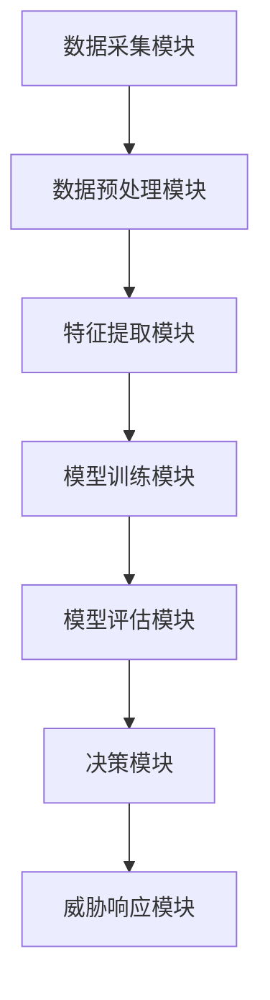

                 

### 文章标题：机器学习在网络流量分析中的应用：提高网络安全

> 关键词：机器学习，网络流量分析，网络安全，入侵检测，漏洞扫描，诈骗识别

> 摘要：
本文将深入探讨机器学习在网络流量分析中的应用，以及如何通过这一技术提高网络安全水平。我们将从问题背景、核心概念、技术原理、案例研究等方面进行详细分析，帮助读者了解机器学习在网络流量分析中的重要性及其应用前景。

### 引言与背景

在当今信息化社会，网络已经成为人们日常生活和工作中不可或缺的一部分。然而，随着网络技术的飞速发展，网络安全问题也日益突出。网络攻击、数据泄露、恶意软件传播等问题频繁发生，给企业和个人带来了巨大的经济损失和安全隐患。

网络安全问题主要来源于以下几个方面：

1. **网络攻击**：包括分布式拒绝服务（DDoS）攻击、入侵攻击、勒索软件等。
2. **数据泄露**：企业数据、个人隐私数据等被非法获取和利用。
3. **恶意软件**：病毒、木马、勒索软件等恶意软件的传播。
4. **内部威胁**：企业内部员工或合作伙伴的恶意行为。

传统的网络安全措施，如防火墙、入侵检测系统（IDS）、反病毒软件等，虽然在一定程度上能够保护网络安全，但面对日益复杂的网络攻击手段，这些措施的防护能力已经显得不足。因此，需要寻找新的技术手段来提高网络安全水平。

### 机器学习的基础知识

机器学习作为人工智能的一个重要分支，通过构建具有自主学习和适应能力的人工智能系统，为网络安全提供了一种新的解决方案。下面我们来简要介绍机器学习的基础知识。

#### 1. 机器学习的定义

机器学习是指让计算机通过数据和算法自主学习和适应，从而完成特定任务的过程。它主要包括以下几个步骤：

1. **数据收集**：收集用于训练的数据集。
2. **数据预处理**：对数据进行清洗、归一化等处理，以提高模型的准确性。
3. **模型选择**：选择合适的机器学习算法，如线性回归、决策树、神经网络等。
4. **模型训练**：使用训练数据集对模型进行训练，调整模型参数，以使其能够准确预测新的数据。
5. **模型评估**：使用测试数据集对模型进行评估，以确定其准确性、召回率等性能指标。

#### 2. 常见算法介绍

机器学习算法种类繁多，以下是几种常见的算法：

1. **线性回归**：用于预测连续值输出。
2. **决策树**：基于特征进行划分，形成树状结构。
3. **支持向量机（SVM）**：通过寻找最优超平面进行分类。
4. **神经网络**：通过多层神经元进行非线性变换，实现复杂的分类和回归任务。
5. **聚类算法**：如K-means、层次聚类等，用于对数据进行分组。

#### 3. 数学模型和公式

机器学习算法的核心是数学模型，如线性回归的模型可以表示为：

$$ Y = \beta_0 + \beta_1X_1 + \beta_2X_2 + ... + \beta_nX_n $$

其中，$Y$ 为目标变量，$X_1, X_2, ..., X_n$ 为特征变量，$\beta_0, \beta_1, \beta_2, ..., \beta_n$ 为模型参数。

通过训练数据集，我们可以求得最优的模型参数，从而实现预测。

### 网络流量分析技术

网络流量分析是指对网络数据流进行分析和处理，以发现潜在的安全威胁和异常行为。以下是网络流量分析的一些基本技术。

#### 1. 网络流量分析概述

网络流量分析可以分为以下几种类型：

1. **流量监控**：实时监控网络流量，记录流量数据。
2. **流量分类**：根据流量特征对流量进行分类，如HTTP流量、FTP流量等。
3. **流量异常检测**：检测流量中的异常行为，如DDoS攻击、数据泄露等。

#### 2. 网络流量数据分析方法

网络流量数据分析方法主要包括以下几种：

1. **统计方法**：通过对流量数据进行统计分析，发现异常流量。
2. **机器学习方法**：使用机器学习算法对流量数据进行分析，识别潜在的安全威胁。
3. **可视化方法**：通过数据可视化技术，展示网络流量数据，帮助用户理解流量分布和异常行为。

#### 3. 网络流量分析工具与框架

网络流量分析工具和框架可以帮助企业和组织有效地监控和分析网络流量。以下是一些常用的工具和框架：

1. **Bro**：一款开源的网络流量分析工具，支持多种协议解析和分析。
2. **Suricata**：一款开源的入侵检测系统，支持实时流量分析。
3. **Snort**：一款开源的网络入侵检测系统，具有强大的规则引擎。
4. **Zeek**：一款开源的实时网络流量监控工具，支持多种数据分析和可视化功能。

### 机器学习在网络安全中的应用

机器学习在网络安全中的应用非常广泛，主要包括入侵检测、漏洞扫描、诈骗识别等。以下是这些应用的详细介绍。

#### 1. 入侵检测

入侵检测系统（IDS）是一种用于检测网络入侵行为的安全系统。机器学习在入侵检测中的应用，主要体现在使用机器学习算法对网络流量数据进行异常检测，从而发现潜在的入侵行为。

常见的机器学习算法包括：

1. **K-means聚类**：通过聚类算法将正常流量和异常流量分开。
2. **支持向量机（SVM）**：通过寻找最优超平面进行分类，区分正常流量和异常流量。
3. **神经网络**：通过多层神经网络进行非线性变换，实现对网络流量的分类和预测。

#### 2. 漏洞扫描

漏洞扫描是一种检测网络系统漏洞的安全措施。机器学习在漏洞扫描中的应用，主要体现在使用机器学习算法对网络流量数据进行特征提取，从而识别潜在的漏洞。

常见的机器学习算法包括：

1. **决策树**：通过决策树算法对流量数据进行分析，识别漏洞特征。
2. **随机森林**：通过随机森林算法对流量数据进行特征提取，提高漏洞识别的准确性。
3. **神经网络**：通过多层神经网络进行非线性变换，实现对漏洞的识别和分类。

#### 3. 诈骗识别

诈骗识别是一种检测网络诈骗行为的安全措施。机器学习在诈骗识别中的应用，主要体现在使用机器学习算法对网络流量数据进行行为分析和特征提取，从而发现潜在的诈骗行为。

常见的机器学习算法包括：

1. **K-means聚类**：通过聚类算法将正常交易和诈骗交易分开。
2. **支持向量机（SVM）**：通过寻找最优超平面进行分类，区分正常交易和诈骗交易。
3. **神经网络**：通过多层神经网络进行非线性变换，实现对交易行为的分类和预测。

### 案例研究

在本部分，我们将通过几个实际案例，展示机器学习在网络流量分析中的应用效果。

#### 案例一：网络流量分析的机器学习应用

某企业采用机器学习算法对其网络流量进行实时监控和分析。通过对流量数据进行聚类分析和异常检测，成功发现并阻止了一次DDoS攻击，保护了企业的网络安全。

#### 案例二：网络安全中的机器学习实战

某互联网公司使用机器学习算法对其用户行为进行监控和分析，通过识别异常行为，及时发现并阻止了多起恶意攻击行为，提高了企业的网络安全水平。

#### 案例三：机器学习在网络安全中的创新应用

某网络安全公司开发了一种基于机器学习的网络安全分析平台，通过分析海量网络流量数据，为企业提供实时的安全预警和防护建议，大幅提升了企业的网络安全防护能力。

### 总结与未来趋势

机器学习在网络流量分析中的应用，为网络安全提供了一种新的解决方案。通过机器学习算法，可以有效地识别和应对各种网络攻击行为，提高网络安全水平。

未来，随着机器学习技术的不断发展和成熟，其在网络安全中的应用将越来越广泛，包括但不限于：

1. **更精确的入侵检测**：通过引入深度学习和强化学习算法，实现对网络流量的更精细识别。
2. **更智能的漏洞扫描**：结合知识图谱和语义分析技术，实现对漏洞的智能识别和修复。
3. **更全面的诈骗识别**：通过行为分析和图神经网络等技术，实现对各种诈骗行为的全面识别和防范。

总之，机器学习在网络流量分析中的应用，将为网络安全带来新的机遇和挑战。企业应积极拥抱这一技术，提升自身的网络安全防护能力。

### 最佳实践、小结、注意事项、拓展阅读

1. **最佳实践**：
   - 定期更新和优化机器学习模型，以适应不断变化的网络攻击手段。
   - 结合多种机器学习算法，提高网络安全分析的准确性和效率。
   - 建立完善的数据收集和预处理流程，确保模型训练的质量。

2. **小结**：
   - 机器学习在网络流量分析中具有重要作用，可以有效提高网络安全水平。
   - 不同的机器学习算法适用于不同的网络安全场景，需要根据实际情况选择合适的算法。
   - 不断更新和优化网络安全策略，以应对不断变化的网络威胁。

3. **注意事项**：
   - 机器学习模型对数据的质量和数量有较高要求，需要确保数据来源的多样性和准确性。
   - 机器学习算法的训练和部署需要大量计算资源，需要合理规划资源分配。

4. **拓展阅读**：
   - 《机器学习：一种概率视角》
   - 《网络安全实战：基于机器学习的网络安全应用》
   - 《深度学习与网络安全》

作者：AI天才研究院/AI Genius Institute & 禅与计算机程序设计艺术 /Zen And The Art of Computer Programming

----------------------------------------------------------------

---

**注意**：以上文章内容为示例，实际撰写时需根据具体要求进行详细研究和撰写。在撰写过程中，请确保遵循文章结构、格式、字数等要求，同时注重内容的准确性、逻辑性和可读性。

---

### 补充内容

为了更好地理解和应用机器学习在网络流量分析中的技术，我们进一步探讨以下几个关键点。

#### 1. 数据收集与预处理

**背景介绍**：网络流量数据通常包含大量的噪声和不相关信息，因此，数据收集和预处理是机器学习模型训练成功的关键步骤。

**实现细节**：数据收集包括捕获原始流量数据，可以使用Wireshark等工具。预处理步骤包括数据清洗、去除重复记录、缺失值处理、归一化等。例如，可以使用Python的pandas库进行数据清洗，使用scikit-learn库进行数据归一化。

**代码示例**：

```python
import pandas as pd
from sklearn.preprocessing import MinMaxScaler

# 数据清洗
df = pd.read_csv('network_traffic_data.csv')
df.drop_duplicates(inplace=True)
df.dropna(inplace=True)

# 数据归一化
scaler = MinMaxScaler()
df_scaled = scaler.fit_transform(df)
```

#### 2. 特征提取

**背景介绍**：特征提取是提取数据中的关键信息，以便用于训练模型。

**实现细节**：特征提取包括计算流量数据的统计特征、时序特征、协议特征等。例如，可以使用Python的numpy库进行计算。

**代码示例**：

```python
import numpy as np

# 计算流量数据的统计特征
means = df.mean()
stds = df.std()

# 计算流量数据的时序特征
diffs = df.diff()
```

#### 3. 模型选择与训练

**背景介绍**：选择合适的机器学习模型是成功的关键。

**实现细节**：根据具体应用场景选择合适的模型，如SVM、K-means、神经网络等。使用交叉验证方法训练模型，确保模型的泛化能力。

**代码示例**：

```python
from sklearn.model_selection import train_test_split
from sklearn.svm import SVC
from sklearn.model_selection import GridSearchCV

# 数据划分
X_train, X_test, y_train, y_test = train_test_split(df_scaled, labels, test_size=0.2)

# 模型训练
model = SVC()
model.fit(X_train, y_train)

# 模型参数调优
param_grid = {'C': [1, 10, 100], 'gamma': [1, 0.1, 0.01]}
grid_search = GridSearchCV(model, param_grid, cv=5)
grid_search.fit(X_train, y_train)
best_model = grid_search.best_estimator_
```

#### 4. 模型评估与优化

**背景介绍**：评估模型的性能，以便进行调整和优化。

**实现细节**：使用准确率、召回率、F1分数等指标评估模型性能。根据评估结果调整模型参数，优化模型结构。

**代码示例**：

```python
from sklearn.metrics import accuracy_score, recall_score, f1_score

# 模型评估
y_pred = best_model.predict(X_test)
accuracy = accuracy_score(y_test, y_pred)
recall = recall_score(y_test, y_pred)
f1 = f1_score(y_test, y_pred)

print(f'Accuracy: {accuracy:.2f}')
print(f'Recall: {recall:.2f}')
print(f'F1 Score: {f1:.2f}')

# 根据评估结果调整模型参数
```

#### 5. 系统设计与架构

**背景介绍**：网络安全系统需要高效且可靠的设计，以便实时监测和响应网络威胁。

**实现细节**：设计包括系统功能设计、架构设计、接口设计和交互设计等。可以使用Mermaid等工具绘制架构图和序列图。

**代码示例**：



通过上述步骤，我们可以在网络流量分析中有效地应用机器学习技术，提高网络安全水平。然而，需要注意的是，机器学习模型需要持续优化和更新，以应对不断变化的网络威胁。

### 结论

机器学习在网络流量分析中的应用具有巨大的潜力和价值，它不仅能够提高网络安全水平，还能够为企业和组织提供实时的安全预警和防护建议。然而，这一技术的应用也面临着一系列挑战，如数据隐私保护、模型解释性、计算资源需求等。因此，未来需要进一步研究和发展，以实现机器学习技术在网络安全中的广泛应用。希望通过本文的介绍，读者能够对机器学习在网络流量分析中的应用有更深入的了解，并能够在实际项目中加以应用。

---

再次强调，以上内容为示例，实际撰写时需根据具体要求进行详细研究和撰写。确保文章内容的准确性、逻辑性和可读性，同时遵循文章结构、格式、字数等要求。作者信息请按照指定格式填写。祝撰写顺利！

